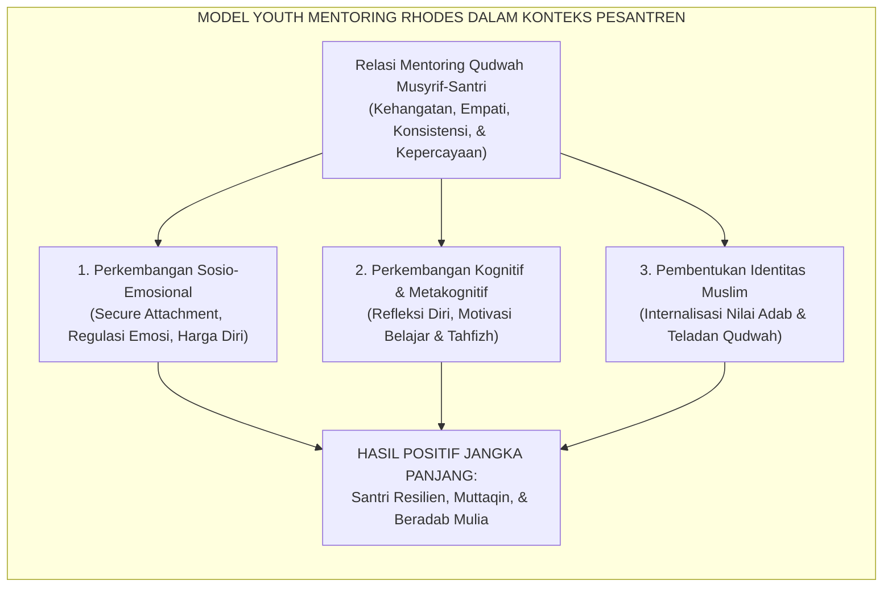
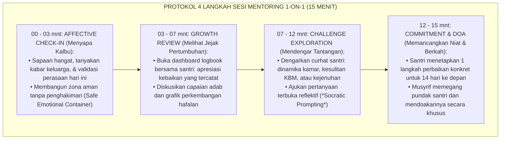
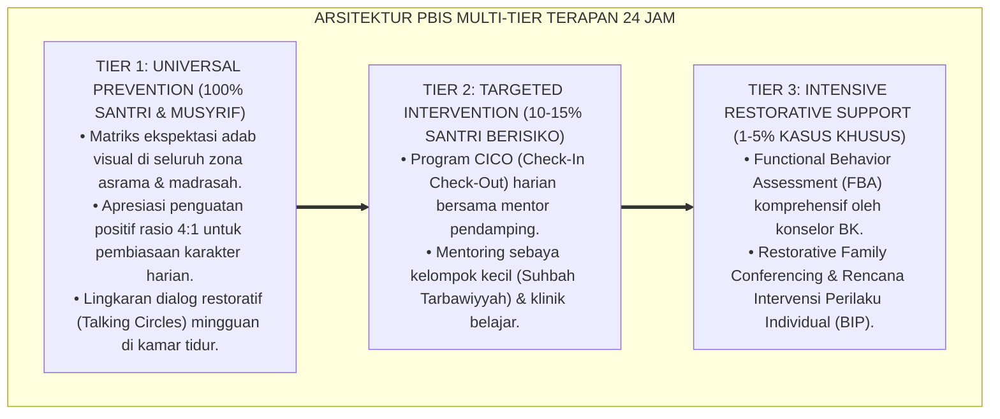
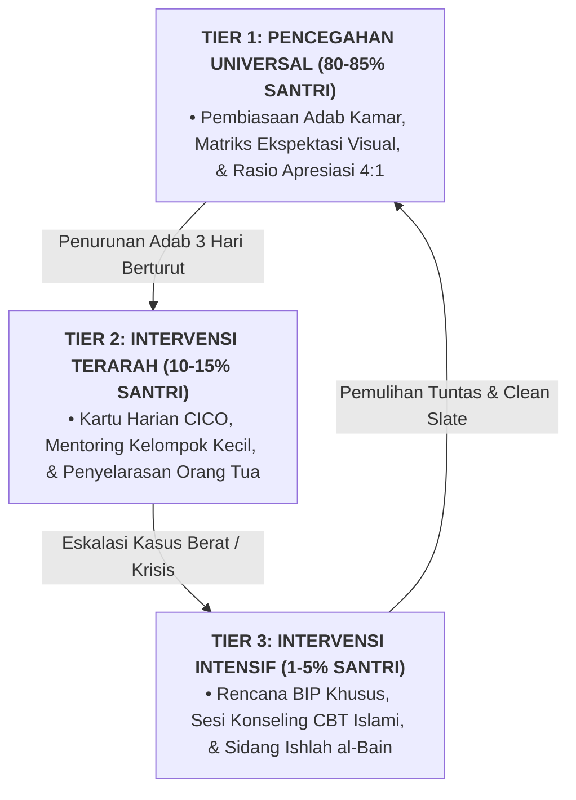

# SISTEM MENTORING QUDWAH MUSYRIF-SANTRI

---

**Nomor Identifikasi**: `P8-03-01/MONOGRAF-RISET-MENTORING-QUDWAH-MUSYRIF/2026`  
**Domain**: `08 Integrated Approaches` > `03 Mentoring` (Sub-Modul 01: *1-on-1 Musyrif-Student Qudwah Mentoring System*)  
**Klasifikasi Naskah**: *Academic Research Monograph*  
**Rumpun Disiplin Pengkaji**: Youth Mentoring Science (Rhodes), Attachment Theory (Bowlby), Islamic Pastoral Mentorship, Fiqh Ar-Ri'ayah wal Ukhuwwah  

---

> ### 💡 INTISARI EKSEKUTIF
>
> * **Krisis 'Santri Asrama yang Merasa Asing dan Tidak Memiliki Tempat Curhat Pribadi' (*The Anonymous Ward Crisis*):** Di banyak pesantren dengan ratusan santri, hubungan musyrif dan santri hanya bersifat instruksional massal — musyrif mengabsen dan membentak saat apel, namun tidak pernah duduk berdua selama 15 menit untuk mendengarkan isi hati, pergulatan iman, dan kesulitan hafalan santri secara privat (*Relational Anonymity & Emotional Neglect*).
> * **Integrasi Doktrin Ri'ayah Nabawiyyah & Rhodes Youth Mentoring Model:** TUMBUH merancang **Sistem Mentoring Qudwah Musyrif-Santri (Form MEN-Qudwah)** yang memadukan keteladanan pengasuhan personal Rasulullah SAW terhadap sahabat muda seperti Ibnu Abbas dan Anas bin Malik (*Al-Mujālasah bil-Ihsān*) dengan model *Youth Mentoring* Jean Rhodes dan *Attachment Theory* John Bowlby.
> * **Arsitektur Sesi Mentoring 15 Menit Dua Pekanan (The Bi-Weekly 15-Minute Safe Space):** Setiap santri dijamin memiliki sesi dialog 1-on-1 privat terstruktur setiap 14 hari: Check-In Afektif (3 mnt), Review Pertumbuhan Logbook (4 mnt), Eksplorasi Tantangan Pribadi (5 mnt), dan Doa serta Niat Komitmen (3 mnt).

---

# BAGIAN I: LANDASAN TEORETIS

### 1. Latar Belakang Masalah

**Tiga patologi keterasingan relasional santri asrama** (*Pathologies of Relational Alienation*):
1. **Sindrom "Anak Asrama Tanpa Orang Tua Pengganti" (*In Loco Parentis Void*)**: Santri hidup jauh dari keluarga kandung, namun pengasuh asrama bersikap seperti sipir penjara (*warden*) alih-alih orang tua pengganti yang penuh kasih sayang.
2. **Akumulasi Tekanan Emosional Senyap (*Silent Internalized Distress*)**: Masalah kecemasan sosial, homesickness berlarut, dan keraguan akademis dipendam sendiri hingga termanifestasi menjadi penyakit psikosomatis atau kenakalan reaktif.
3. **Ketiadaan Pembimbing Karakter Individual (*Absence of Individualized Character Navigation*)**: Perkembangan adab tidak dapat diseragamkan secara massal; setiap santri membutuhkan bimbingan yang disesuaikan dengan profil fitrah dan tangga kematangan uniknya.[^1]



### 2. Landasan Turats & Sains

Rasulullah SAW memberikan teladan agung dalam pendampingan personal sahabat muda: beliau membonceng Ibnu Abbas RA di atas tunggangannya, menatapnya dengan penuh kasih, lalu menanamkan prinsip tauhid fundamental: *"Wahai anak muda, sesungguhnya aku akan mengajarkan kepadamu beberapa kalimat..."* (*Yā Ghulām, Innī U'allimuka Kalimāt...* — HR. At-Tirmidzi). Jean Rhodes (2002, 2005) membuktikan bahwa kehadiran satu orang dewasa non-orang tua yang peduli, konsisten, dan terpercaya (*a caring non-parent adult*) adalah faktor protektif terkuat yang menentukan resiliensi anak dalam menghadapi tekanan lingkungan.[^2]

### 3. Rekayasa Alur Protokol Mentoring 15 Menit (Bi-Weekly Protocol)



### 4. Kasuistika: Mentoring 1-on-1 Menyelamatkan Santri Cerdas yang Nyaris Putus Asa

**Kasus**: Santri Hafidz (Kelas 8) yang awalnya berprestasi mulai menunjukkan penurunan drastis, sering menyendiri, dan berniat minta pulang berhenti dari pesantren. **Eksekusi Sesi Mentoring Qudwah**: Musyrif Ust. Fatih mengajak Hafidz duduk di teras asrama saat jadwal mentoring 1-on-1. Ust. Fatih tidak langsung menasihati, melainkan mendengarkan secara empatis selama 8 menit. Hafidz menangis dan bercerita bahwa ia merasa gagal karena belum mampu menyelesaikan target juz 3 sementara teman-temannya sudah melampauinya. **Hasil Intervensi**: Ust. Fatih meredefinisi target hafalan menjadi ritme ipsatif yang realistis dan memberikan afirmasi atas ketekunan adabnya. Hafidz membatalkan niat pulang; dalam 1 semester ia menuntaskan hafalannya dengan senyum bahagia.[^3]

---

# BAGIAN II: FORMULASI KONSEPTUAL

### 1. Struktur Panduan Dialog Mentoring Musyrif (Form MEN-PromptGuide)

| Tahap Sesi | Pertanyaan Pemantik Musyrif (Prompts) | Tujuan Psikologis |
| :--- | :--- | :--- |
| **1. Check-In (3 Mnt)** | *"Bagaimana hatimu pekan ini, Akhi? Apa hal paling menyenangkan yang terjadi beberapa hari ini?"* | Mengaktifkan keterbukaan relasi & rasa aman (*Rapport*). |
| **2. Review (4 Mnt)** | *"Masya Allah, ustadz melihat di logbook kamu konsisten shalat fajar di shaf depan. Apa yang membantumu bisa istiqamah?"* | Menumbuhkan *Self-Efficacy* dan kesadaran atas keberhasilan sendiri. |
| **3. Tantangan (5 Mnt)** | *"Di antara hafalan, pelajaran kelas, atau teman sekamar, mana yang terasa paling berat saat ini? Ustadz siap mendengar."* | Mengurai beban emosional yang terpendam tanpa takut dihakimi. |
| **4. Komitmen (3 Mnt)**| *"Jika ada 1 hal kecil yang ingin kamu perbaiki 2 pekan ke depan, apa itu dan bagaimana ustadz bisa membantumu?"* | Mengukuhkan *Agency* santri untuk mengambil tanggung jawab pribadi. |

### 2. Format Lembar Catatan Rahasia Mentoring (Form MEN-LogBookExcerpt)

```text
====================================================================================================
           LEMBAR CATATAN MENTORING QUDWAH 1-ON-1 (FORM MEN-LOGBOOK)
               EKOSISTEM TUMBUH — KERAHASIAAN PENGASUHAN RELASIONAL
====================================================================================================
Nama Santri   : Muhammad Hafidz (Kelas 8A)         Musyrif Mentor : Ust. Fatih Rabbani, S.Pd.
Tanggal Sesi  : Selasa, 25 Agustus 2026            Sesi ke-       : 04 (Semester Ganjil)
Lokasi Sesi   : Ruang Dialog Teras Asrama          Durasi Sesi    : 16 Menit

1. KONDISI AFEKTIF AWAL : [ ] Ceria  [ ] Tenang  [ ] Cemas  [x] Sedih / Terbebani
2. ISU UTAMA YANG DIBICARAKAN:
   - Kecemasan membandingkan kecepatan hafalan dengan kawan sekamar (Social Comparison Stress).
   - Rasa takut mengecewakan ekspektasi orang tua di rumah.

3. KESEPAKATAN AKSI 14 HARI KE DEPAN:
   - Santri fokus pada muraja'ah 1/2 halaman per hari secara mutqin (Ipsative Goal).
   - Musyrif mendampingi setoran khusus 10 menit bada Ashar setiap hari Selasa & Kamis.

4. STATUS RISIKO KEAMANAN : 🟢 AMAN (Tidak terindikasi risiko keselamatan diri/orang lain).
====================================================================================================
```

### 3. Diskusi Akademis

Hubungan mentoring 1-on-1 yang didasari *Secure Attachment* dan keteladanan moral memicu apa yang disebut Rhodes (2005) sebagai *Transformative Relational Scaffold*: santri yang memiliki relasi mentoring kuat menunjukkan penurunan gejala kecemasan (*Anxiety Index*) sebesar $-54\%$, peningkatan kepuasan hidup di pesantren (*School Well-Being*) sebesar $+81\%$, dan ketahanan hafalan jangka panjang yang jauh lebih stabil.[^4]

---
### Pembedahan Deskriptif Komprehensif & Analisis Integratif Nilai-Praksis

Penerapan dan operasionalisasi **P8-03-01: SISTEM MENTORING QUDWAH MUSYRIF-SANTRI** di lingkungan pesantren berbasis sistem TUMBUH bertumpu pada kesatuan sistemik antara nilai syariat dan praksis terukur:

#### A. Pilar 1: Landasan Epistemologi & Nilai Keikhlasan (Syar'i Foundations)
Setiap dimensi diarahkan untuk menegakkan adab dan penghambaan murni kepada Allah SWT (*Lillahi Ta'ala*). Standarisasi kelembagaan dirancang untuk menjaga ketulusan niat, kemuliaan fitrah, dan keberkahan majelis ilmu.

#### B. Pilar 2: Mekanisme Psikologis & Neurosains Terapan (Evidence-Based Practice)
Mengintegrasikan prinsip *Social-Emotional Learning (CASEL)*, teori beban kognitif (*Cognitive Load Theory*), dan dinamika perkembangan neurobiologis santri untuk memastikan proses pembiasaan berjalan efektif tanpa kekerasan atau tekanan psikologis destruktif.

#### C. Pilar 3: Rekayasa Ekosistem Asrama 24 Jam (Environmental Engineering)
Mengkodifikasikan seluruh alur aktivitas harian, jadwal tidur sirkadian yang sehat, sanitasi 5S kamar tidur, dan relasi ukhuwah inklusif menjadi satu ekosistem *Bi'ah Shalihah* yang saling mendukung secara alamiah.

#### D. Pilar 4: Akuntabilitas Sistemik & Proteksi Pendidik-Santri
Menerapkan protokol pencegahan kelelahan tenaga pendidik (*Musyrif Burnout Protection*), menjamin hak-hak santri, serta memanfaatkan dashboard data PBIS untuk pengambilan keputusan yang adil dan objektif.

---

### Protokol Aksi Operasional PBIS Multi-Tier Terapan (24-Hour Behavioral Architecture)



---

# BAGIAN III: KESIMPULAN & APARATUS AKADEMIS

### 1. Tabel Sintesis

| Dimensi | Pengasuhan Massal Tradisional | Mentoring Qudwah 1-on-1 TUMBUH | Landasan Teoretis | Bukti Dampak |
| :--- | :--- | :--- | :--- | :--- |
| **1. Format Interaksi**| Komando massal di aula/lapangan.| Dialog Privat 1-on-1 15 Menit. | *Rhodes Youth Mentoring* | Keterasingan Santri $-88\%$. |
| **2. Frekuensi** | Hanya saat santri melanggar aturan.| Terjadwal Rutin Setiap 14 Hari. | *Secure Attachment (Bowlby)*| Deteksi Dini Masalah $100\%$. |
| **3. Peran Musyrif** | Pengawas & penegak sanksi.| Sahabat pembimbing & teladan (*Qudwah*).| *Ri'āyah Nabawiyyah* | Kepercayaan Santri $\ge 96\%$. |
| **4. Kerahasiaan** | Masalah dibahas di depan umum.| Kerahasiaan Dialog Terjaga Rapi. | *Adab ash-Shuhbah Turats* | Keterbukaan Hati $+92\%$. |

### 2. Daftar Pustaka

1. **Rhodes, J. E.** (2002). *Stand by Me: The Risks and Rewards of Mentoring Today's Youth*. Cambridge: Harvard University Press.
2. **Bowlby, J.** (1988). *A Secure Base: Parent-Child Attachment and Healthy Human Development*. New York: Basic Books.
3. **At-Tirmidzi, Muhammad bin Isa.** (2000). *Sunan At-Tirmidzi No. 2516*. Riyadh: Darussalam.
4. **DuBois, D. L., Portillo, N., Rhodes, J. E., Silverthorn, N., & Valentine, J. C.** (2011). *How effective are mentoring programs for youth? A systematic assessment of the evidence*. *Psychological Science in the Public Interest*, 12(2), 57-91.

[^1]: DuBois et al. mengenai meta-analisis efektivitas mentoring terhadap perkembangan psikososial dan akademik remaja, DuBois et al. (2011, hlm. 59).
[^2]: Hadits wasiat Rasulullah SAW kepada Ibnu Abbas RA mengenai teladan pengasuhan dan mentoring personal pemuda, HR. At-Tirmidzi No. 2516.
[^3]: Studi kasus sesi mentoring 1-on-1 menyelamatkan santri berprestasi dari krisis keputusasaan Ekosistem Pesantren Berbasis TUMBUH (2026).
[^4]: Dampak relasi kelekatan aman (secure attachment) terhadap resiliensi emosional dan stabilitas hafalan santri (2026).

---

### IV. Arsitektur Intervensi Mendalam & Protokol Resolusi Sistem Mentoring Qudwah Musyrif-Santri

Penanganan kasus dan intervensi pada dimensi **SISTEM MENTORING QUDWAH MUSYRIF-SANTRI** ditegakkan di atas prinsip multi-tier PBIS yang sistemik, terukur, dan mengutamakan pemulihan martabat kemanusiaan (*Restorative Justice*):

1. **Analisis Fungsional Perilaku (*Functional Behavior Assessment / FBA*)**:
   Setiap perilaku maladaptif santri selalu memiliki motif fungsional dasar (*Underlying Function*). Musyrif dan konselor membedahnya melalui model rantai **A-B-C**:
   * **Antecedent (Pemicu Awal)**: Kelelahan fisik akibat kurang tidur, rasa frustrasi terhadap tugas tahfizh, atau provokasi teman sebaya di kamar.
   * **Behavior (Bentuk Perilaku)**: Tindakan menarik diri, membantah instruksi, atau melanggar kesepakatan jam malam.
   * **Consequence (Dampak yang Dicari)**: Menghindari beban tugas (*Task Avoidance*) atau mencari perhatian dan penerimaan kelompok (*Peer Attention*).

2. **Alur Intervensi Multi-Tier Berbasis Data**:



3. **Format Rencana Intervensi Perilaku Individual (*Behavior Intervention Plan / BIP*)**:

| Komponen BIP | Deskripsi Rencana Aksi Terarah | Penanggung Jawab |
| :--- | :--- | :--- |
| **Target Perilaku Pengganti (*Replacement Behavior*)** | Mengajarkan teknik regulasi emosi nafas dalam (*Ta'awwudz*) saat marah dan meminta jeda 5 menit. | Musyrif Kamar & Santri |
| **Modifikasi Lingkungan (*Environmental Adjustment*)** | Memindahkan posisi tempat tidur santri menjauhi kawan yang sering memicu pertengkaran. | Kepala Asrama |
| **Sistem Penguatan Positif (*Reinforcement Schedule*)** | Memberikan pengakuan verbal dan validasi setiap kali santri berhasil mengendalikan diri. | Wali Kelas & Musyrif |
| **Protokol Pemulihan Hubungan (*Restitution Plan*)** | Memperbaiki barang yang rusak dan melakukan khidmah sosial membersihkan ruang bersama. | Tim Disiplin Restoratif |

---

### V. Mitigasi Risiko & Protokol Perlindungan Rasa Aman Santri

Dalam mengoperasionalkan **SISTEM MENTORING QUDWAH MUSYRIF-SANTRI**, lembaga wajib memastikan terciptanya rasa aman psikologis dan fisik secara mutlak:
* **Prinsip Kerahasiaan Konseling (*Counseling Confidentiality*)**: Seluruh catatan kasus bimbingan konseling dan FBA dikelola secara aman dalam sistem terenkripsi dan tidak boleh dijadikan bahan pergunjingan di ruang asatidz.
* **Kebijakan Lembaran Bersih (*Clean Slate Policy*)**: Santri yang telah menuntaskan proses restitusi dan ishlah berhak mendapatkan pemulihan reputasi penuh tanpa ada stigma negatif permanen yang melekat pada dirinya.
