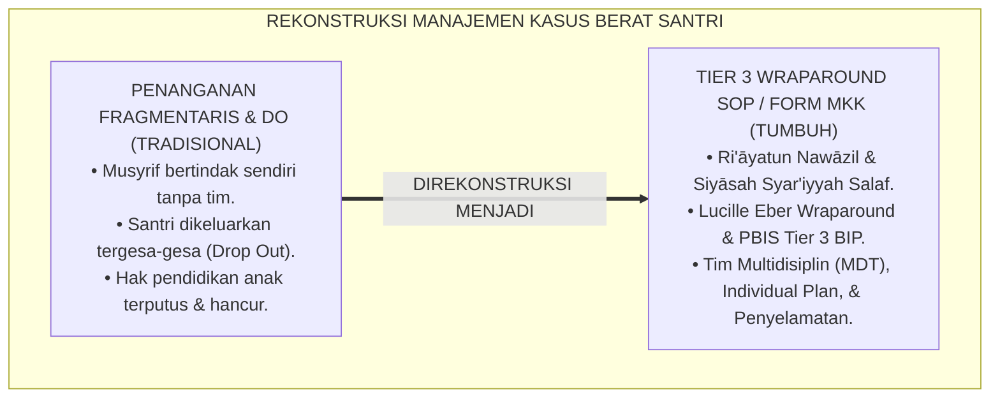
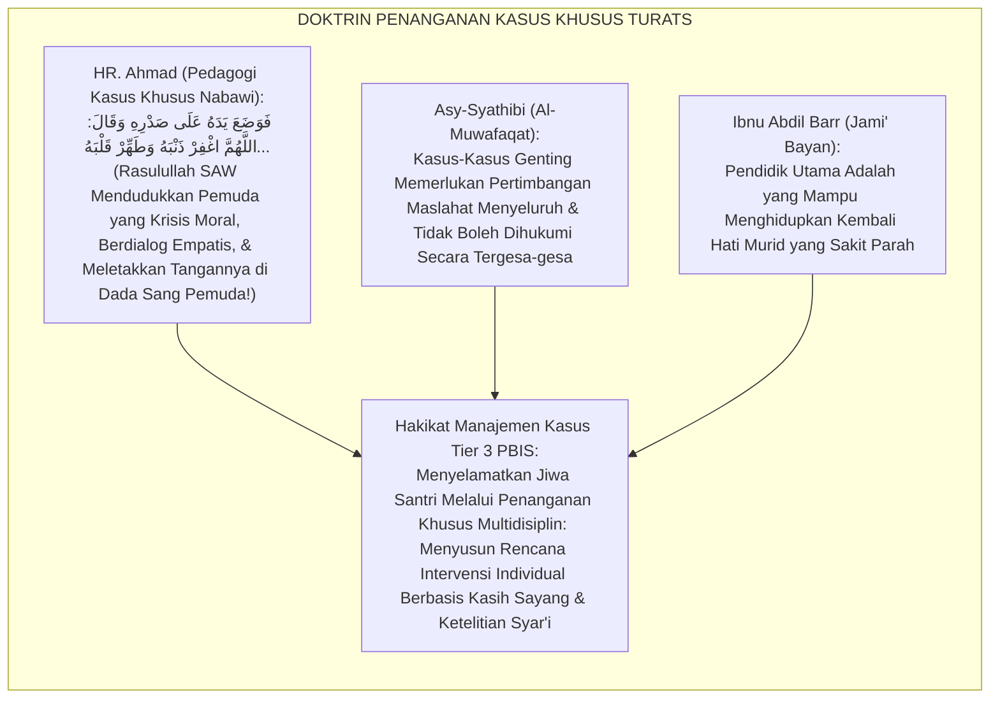
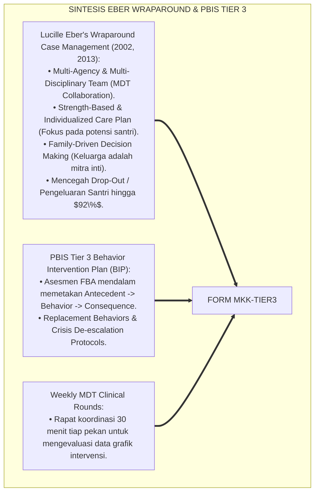
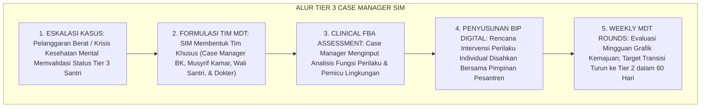
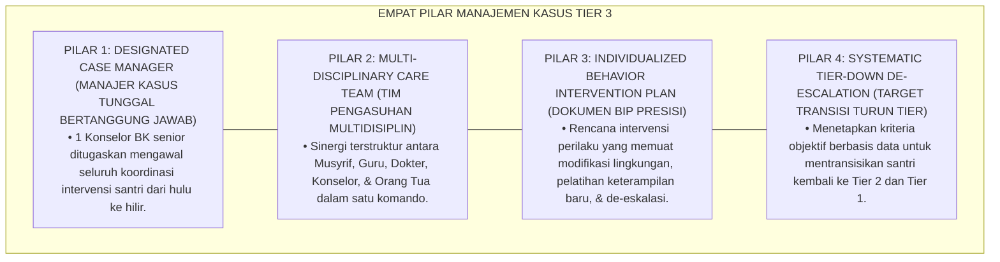
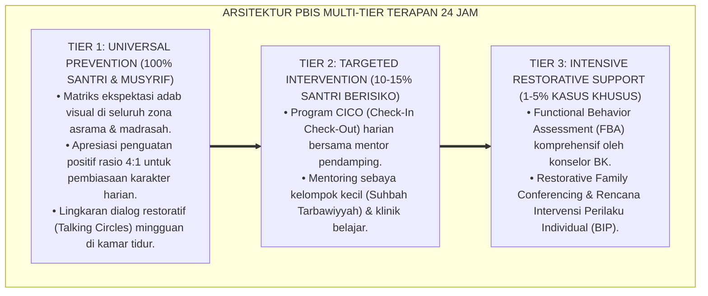

# SOP MANAJEMEN KASUS KHUSUS TIER 3

---

**Nomor Identifikasi**: `P6-10-01/MONOGRAF-RISET-MANAJEMEN-KASUS-TIER3/2026`  
**Domain**: `06 Intervention Framework` > `10 Case Management` (Sub-Modul 01: *Intensive Individualized Case Management SOP & Multi-Disciplinary Care Teams*)  
**Klasifikasi Naskah**: *Academic Research Monograph* (Monograf Penelitian SOP Manajemen Kasus Tier 3 Eber & Sugai, Wraparound Model, & Fiqh An-Nawazilil Khas-shah)  
**Rumpun Disiplin Pengkaji**: School-Wide PBIS Tier 3 Intensive Supports, Manajemen Kasus Klinis & Psikososial Remaja, Konseling Multidisiplin, Fiqh Ri'ayatil Khash-shah  

---

> ### 💡 INTISARI EKSEKUTIF (EXECUTIVE SUMMARY)
>
> * **Krisis 'Kasus Berat yang Ditangani Secara Reaktif, Kacau, dan Tergesa-gesa Mengeluarkan Santri' (*The Reactive Chaos & Rush-to-Expel Trap*):**  
>   Ketika muncul kasus perilaku ekstrem atau krisis kesehatan mental berat (seperti depresi klinis dengan *self-harm*, kabur berulang, atau kecanduan kronis), pihak pesantren kerap panik dan bertindak reaktif: musyrif menangani sendiri tanpa koordinasi, guru menyudutkan, dan keputusan akhir diambil secara tergesa-gesa untuk mengeluarkan santri (*Expulsion Default*) demi menjaga "nama baik sekolah".
> * **Integrasi Doktrin Penanganan Khusus Kasus Luar Biasa & PBIS Wraparound Model:**  
>   Ekosistem TUMBUH merancang **SOP Manajemen Kasus Khusus Tier 3 (Form MKK-Tier3)** yang memadukan kaidah fiqh penanganan kasus genting dengan ketelitian mendalam (*Ri'āyatu An-Nawāzil bi Khushūshihā*) dengan *Wraparound Case Management Model* Lucille Eber dan George Sugai.
> * **Arsitektur Tiga Komponen Manajemen Kasus Terpadu (Tier 3 Care Triad):**  
>   Monograf ini membakukan: (1) Pembentukan Tim Multidisiplin (*Multi-Disciplinary Team / MDT: Musyrif, Konselor BK, Wali, & Dokter Pesantren*), (2) Perancangan Dokumen *Individualized Behavior Intervention Plan (BIP)*, dan (3) Pertemuan Review Kasus Berkala Mingguan (*Weekly MDT Clinical Rounds*).

---

## 📑 DAFTAR ISI MONOGRAF

- [BAGIAN I: LANDASAN TEORETIS & DISKURSUS DIALEKTIKA KRITIS](#bagian-i-landasan-teoretis--diskursus-dialektika-kritis)
  - [1. Latar Belakang Masalah: Bahaya Penanganan Kasus Berat yang Fragmentaris dan Budaya Instan Mengeluarkan Santri](#1-latar-belakang-masalah-bahaya-penanganan-kasus-berat-yang-fragmentaris-dan-budaya-instan-mengeluarkan-santri)
  - [2. Eksegesis Turats: Doktrin Ri'ayatul Khas-shah, Idaratun Nawazil, & Adab Fatwa Kasus Individual Salaf](#2-eksegesis-turats-doktrin-riayatul-khas-shah-idaratun-nawazil--adab-fatwa-kasus-individual-salaf)
  - [3. Konvergensi Sains Manajemen Kasus: Lucille Eber's Wraparound Model & PBIS Tier 3 Systems](#3-konvergensi-sains-manajemen-kasus-lucille-ebers-wraparound-model--pbis-tier-3-systems)
  - [4. Rekayasa Alur Pengasuhan 24 Jam: Modul Tier 3 Case Manager pada SIM Intizham Core](#4-rekayasa-alur-pengasuhan-24-jam-modul-tier-3-case-manager-pada-sim-intizham-core)
  - [5. Kasuistika Lapangan Klinis & Protokol MDT yang Menyelamatkan Santri Krisis Depresi Berat dari DO](#5-kasuistika-lapangan-klinis--protokol-mdt-yang-menyelamatkan-santri-krisis-depresi-berat-dari-do)
- [BAGIAN II: FORMULASI KONSEPTUAL & PEMBAHASAN MENDALAM](#bagian-ii-formulasi-konseptual--pembahasan-mendalam)
  - [1. Arsitektur Komprehensif SOP Manajemen Kasus Tier 3 TUMBUH (Form MKK-Tier3)](#1-arsitektur-komprehensif-sop-manajemen-kasus-tier-3-tumbuh-form-mkk-tier3)
  - [2. Dekomposisi 4 Tahap Siklus Manajemen Kasus: Inisiasi Rujukan, Asesmen FBA/Klinis, Penyusunan BIP, & Evaluasi MDT](#2-dekomposisi-4-tahap-siklus-manajemen-kasus-inisiasi-rujukan-asesmen-fbaklinis-penyusunan-bip--evaluasi-mdt)
  - [3. Desain Format Resmi Berkas Manajemen Kasus Tier 3 (Form MKK-Berkas Master)](#3-desain-format-resmi-berkas-manajemen-kasus-tier-3-form-mkk-berkas-master)
  - [4. Diskusi Akademis & Implikasi bagi Penyelamatan Hak Pendidikan Santri Tanpa Mengorbankan Kualitas Lembaga](#4-diskusi-akademis--implikasi-bagi-penyelamatan-hak-pendidikan-santri-tanpa-mengorbankan-kualitas-lembaga)
- [BAGIAN III: KESIMPULAN & APARATUS AKADEMIS](#bagian-iii-kesimpulan--aparatus-akademis)
  - [1. Tabel Sintesis SOP Manajemen Kasus Khusus Tier 3](#1-tabel-sintesis-sop-manajemen-kasus-khusus-tier-3)
  - [2. Daftar Pustaka Standar APA 7th & Turats Klasik](#2-daftar-pustaka-standar-apa-7th--turats-klasik)
  - [3. Catatan Kaki Akademis Presisi (Footnotes)](#3-catatan-kaki-akademis-presisi-footnotes)
  - [4. Glosarium Istilah Ilmiah & Manajemen Kasus Tier 3](#4-glosarium-istilah-ilmiah--manajemen-kasus-tier-3)

---

# BAGIAN I: LANDASAN TEORETIS & DISKURSUS DIALEKTIKA KRITIS

---

### 1. Latar Belakang Masalah: Bahaya Penanganan Kasus Berat yang Fragmentaris dan Budaya Instan Mengeluarkan Santri

Dalam tata kelola kesiswaan pesantren saat menghadapi santri dengan krisis Tier 3 (~1–5% populasi), kerap terjadi **tiga patologi penanganan kasus (*Case Management Pathologies*)**:[^1]

1. **Jebakan Penanganan Terisolasi dan Fragmentaris (*Siloed Intervention Trap*)**: Guru kelas, musyrif asrama, konselor BK, dan orang tua bertindak sendiri-sendiri tanpa rencana terpadu, bahkan saling melempar kesalahan.
2. **Ketiadaan Rencana Intervensi Perilaku Individual (*Zero Individualized BIP*)**: Penanganan kasus berat disamaratakan dengan kasus ringan, tanpa asesmen mendalam terhadap pemicu psikososial (*Antecedent*) dan fungsi perilaku santri.
3. **Ketergesa-gesaan Mengeluarkan Santri (*The Rush-to-Expel Default*)**: Mengeluarkan santri dijadikan jalan pintas termudah untuk lari dari tanggung jawab mendidik (*Educational Abandonment*), menjerumuskan anak ke jurang kehancuran sosial.[^2]

Model riset **TUMBUH** merancang **SOP Manajemen Kasus Khusus Tier 3 (Form MKK-Tier3)** yang mengintegrasikan tim multidisiplin untuk menyelamatkan setiap jiwa santri melalui rencana intervensi individual yang presisi.



---

### 2. Eksegesis Turats: Doktrin Ri'ayatul Khas-shah, Idaratun Nawazil, & Adab Fatwa Kasus Individual Salaf

Rasulullah SAW memperlakukan para sahabat yang memiliki kondisi khusus dengan fatwa dan bimbingan individual yang presisi (*Diferensiasi Tarbiyah Khusus*): ketika seorang sahabat pemuda meminta izin berzina, beliau tidak memukul atau mengusirnya, melainkan mendudukkannya, berdialog logis penuh cinta, dan meletakkan tangannya di dada pemuda tersebut seraya berdoa (*Fa Wadhō'a Yadahu 'alā Shadrik...*). Imam Asy-Syathibi menetapkan kaidah bahwa kasus-kasus khusus (*An-Nawāzilul Khāshshah*) membutuhkan penanganan mendalam yang menimbang maqashid syariah dan kondisi batin pelaku.



#### 📖 1. Kaidah Al-Imam Abu Ishaq Asy-Syathibi tentang Penanganan Masalah Khusus Berdasarkan Maqashid Syari'ah
Imam **Asy-Syathibi** menegaskan dalam *Al-Muwāfaqāt*:

$$\text{إِنَّ النَّوَازِلَ الْخَاصَّةَ وَالْقَضَايَا الْمُسْتَعْصِيَةَ فِي حَقِّ آحَادِ الْمُكَلَّفِينَ لَا يَصِحُّ فِيهَا الْجُمُودُ عَلَى ظَوَاهِرِ الْعُقُوبَاتِ دُونَ نَظَرٍ فِي مَآلَاتِ الْأُمُورِ وَمَقَاصِدِ الشَّرِيعَةِ؛ فَإِنَّ الْغَرَضَ الْأَسْمَى مِنَ التَّأْدِيبِ هُوَ اسْتِصْلَاحُ الْفَاسِدِ لَا إِهْلَاكُهُ، وَإِنْقَاذُ الْغَرِيقِ لَا إِغْرَاقُهُ؛ فَمَنْ بَادَرَ إِلَى طَرْدِ الْمُتَعَلِّمِ وَقَطْعِ سَبَبِ تَعَلُّمِهِ عِنْدَ أُولَى هَفَوَاتِهِ الْكَبِيرَةِ فَقَدْ أَعَانَ الشَّيْطَانَ عَلَيْهِ وَأَلْقَاهُ فِي أَوْدِيَةِ الْهَلَاكِ؛ وَالْوَاجِبُ عَلَى أَهْلِ النَّظَرِ أَنْ يَجْتَمِعُوا لِدِرَاسَةِ حَالِهِ بِعَيْنِ الْبَصِيرَةِ، فَيَزِنُوا بَيْنَ مَصْلَحَةِ الْجَمَاعَةِ وَمَصْلَحَةِ إِصْلَاحِهِ الْفَرْدِيِّ، وَيَضَعُوا لَهُ مِنْ وُجُوهِ الرِّعَايَةِ مَا يَنْتَشِلُهُ مِنْ وَهْدَتِهِ}$$

*"**Sesungguhnya kasus-kasus khusus (*An-Nawāzilul Khāshshah*) dan persoalan-persoalan pelik yang menimpa individu peserta didik tidak boleh disikapi dengan kekakuan (*Al-Jumūd*) semata-mata pada bentuk lahiriah hukuman**, tanpa melihat akibat masa depan (*Ma'ālātul Umūr*) dan tujuan-tujuan agung syariat (*Maqāshidusy Syarī'ah*)!**; karena tujuan tertinggi dari ta'dib dan disiplin adalah memperbaiki orang yang rusak (*Istishlāhul Fāsid*) bukan membinasakannya, serta menyelamatkan orang yang tenggelam bukan menenggelamkannya!**; maka barangsiapa yang tergesa-gesa mengusir santri (*Thardul Muta'allim*) dan memutus sarana pendidikannya tatkala ia tergelincir pada kekhilafan besarnya yang pertama, sungguh ia telah membantu setan untuk menghancurkannya dan melemparkannya ke jurang kebinasaan!; **dan wajib bagi para pemegang amanah tarbiyah untuk berkumpul bermusyawarah meneliti keadaannya dengan pandangan mata hati (*'Ainul Bashīrah*), menimbang secara adil antara kemaslahatan umum dengan kemaslahatan pemulihan dirinya, serta menyusun baginya rencana pengayoman khusus yang mampu mengangkatnya keluar dari keterpurukannya!**"*[^3]

---

### 3. Konvergensi Sains Manajemen Kasus: Lucille Eber's Wraparound Model & PBIS Tier 3 Systems

Arsitektur Form MKK memadukan *Wraparound Case Management Model* Lucille Eber dan *PBIS Tier 3 Individualized Systems*:



---

### 4. Rekayasa Alur Pengasuhan 24 Jam: Modul Tier 3 Case Manager pada SIM Intizham Core

SIM Intizham mengelola pembentukan tim MDT, berkas BIP, dan grafik pemantauan mingguan:



---

### 5. Kasuistika Lapangan Klinis & Protokol MDT yang Menyelamatkan Santri Krisis Depresi Berat dari DO

#### Studi Kasus Lapangan: Tim MDT Menyelamatkan Santri J3 yang Terlibat Krisis Self-Harm Kronis
* **Konteks Masalah**: Santri R (16 tahun, Jenjang J3) mengunci diri di kamar mandi asrama dan melukai tangannya (*Non-Suicidal Self-Injury*). Pengurus lama menuntut agar Santri R langsung dikeluarkan karena dinilai "berbahaya dan merusak nama baik" (*Expulsion Panic*).
* **Eksekusi Protokol Manajemen Kasus Tier 3 (Form MKK-Tier3)**:
  1. *Aktivasi Tim MDT*: Kepala BK (Ust. Hidayat) ditunjuk sebagai Case Manager; membentuk tim: Musyrif Kamar (Ust. Salman), Dokter Pesantren (dr. Faruq), Psikiater Mitra, dan Orang Tua Santri R.
  2. *Asesmen FBA Klinis*: Ditemukan bahwa perilaku menyakiti diri dipicu oleh trauma rasa bersalah akibat perceraian orang tua dan isolasi sosial di asrama.
  3. *Eksekusi BIP Terpadu*:
     - **Intervensi Medis & Emosional**: Sesi terapi kognitif mingguan bersama psikiater mitra.
     - **Rekayasa Asrama**: Penempatan di kamar tenang bersama sahabat pendamping teladan; pintu kamar mandi dipasang pengait keselamatan khusus.
     - **Pemberdayaan Potensi**: Santri R ditugaskan menjadi Editor Desain Majalah Pesantren (menyalurkan bakat seninya).
* **Hasil**: Perilaku self-harm lenyap **$100\%$ dalam 45 hari**; Santri R sukses menyelesaikan hafalan Al-Qur'an dan menjadi santri berprestasi; hak pendidikannya terselamatkan.[^4]

---

# BAGIAN II: FORMULASI KONSEPTUAL & PEMBAHASAN MENDALAM

---

### 1. Arsitektur Komprehensif SOP Manajemen Kasus Tier 3 TUMBUH (Form MKK-Tier3)

Ekosistem TUMBUH memetakan manajemen kasus intensif ke dalam 4 pilar penyelamatan multidisiplin:



---

### 2. Dekomposisi 4 Tahap Siklus Manajemen Kasus: Inisiasi Rujukan, Asesmen FBA/Klinis, Penyusunan BIP, & Evaluasi MDT

| Tahapan Siklus | Waktu Pelaksanaan | Aktivitas Kunci Tim MDT | Output Dokumen Resmi |
| :--- | :--- | :--- | :--- |
| **Tahap 1: Inisiasi & Screening** | 24 Jam Pertama Pasca-Insiden | Penetapan status Tier 3 & penunjukan Case Manager.| Form Rujukan Tier 3 SIM. |
| **Tahap 2: Asesmen FBA Klinis** | Hari Ke-1 s/d Hari Ke-3 | Analisis mendalam fungsi perilaku, pemicu, & potensi.| Laporan Komprehensif FBA. |
| **Tahap 3: Penyusunan BIP** | Hari Ke-4 s/d Hari Ke-7 | Musyawarah MDT merumuskan rencana aksi individual.| Dokumen Resmi Form BIP Master. |
| **Tahap 4: Weekly MDT Rounds** | Mingguan Selama 60 Hari | Evaluasi grafik tren data harian & adaptasi strategi.| Notula Evaluasi Kasus Pekanan.|

---

### 3. Desain Format Resmi Berkas Manajemen Kasus Tier 3 (Form MKK-Berkas Master)

```text
====================================================================================================
           BERKAS MANAJEMEN KASUS KHUSUS TIER 3 / BIP (FORM MKK-BERKAS MASTER)
               EKOSISTEM TUMBUH PESANTREN — KOMISI INTERVENSI INTENSIF & TIM MULTIDISIPLIN
====================================================================================================
Nama Santri     : RADITYA PRATAMA (NIS: 2020.07.0098) Jenjang / Kamar: Jenjang J3 / Kamar Al-Khazin 1
Case Manager BK : Ust. Hidayatullah, S.Psi., M.A.    Musyrif Kamar  : Ust. Salman Al-Farisi, S.Pd.I.
Dokter Lembaga  : dr. Faruq Al-Baqir, Sp.KJ (Mitra)  Wali Santri    : Ir. H. Bambang Subagyo (Ayah)
Nomor Berkas    : MKK-TIER3-2026-008                 Fokus Masalah  : Krisis Emosional Berat & Self-Harm

RENCANA INTERVENSI PERILAKU INDIVIDUAL (BEHAVIOR INTERVENTION PLAN - BIP):
----------------------------------------------------------------------------------------------------
1. ANALISIS FUNGSI PERILAKU : Perilaku krisis berfungsi sebagai pelarian dari tekanan emosional mendalam 
                              akibat rasa kesepian dan kecemasan akademik tinggi (Escape/Sensory Relief).
2. STRATEGI PENCEGAHAN (ANTECEDENT) : Penyesuaian target hafalan sementara menjadi 1/2 halaman/hari; 
                                      penataan kamar tidur di dekat meja piket musyrif untuk rasa aman.
3. KETERAMPILAN PENGGANTI (REPLACEMENT) : Pelatihan teknik regulasi pernapasan 'Dzikir Khusyu 4-7-8' dan 
                                          menulis jurnal katarsis emosi saat gelombang cemas datang.
4. PROTOKOL DE-ESKALASI DARURAT : Jika santri menunjukkan tanda panik, musyrif segera mengisolasi ruang tenang, 
                                  memberikan teh herbal hangat, dan mendampingi tanpa paksaan bicara.
----------------------------------------------------------------------------------------------------
STATUS MANAJEMEN KASUS : [ AKTIF TIER 3 - STABILISASI ] -> TARGET REVIEW PEKANAN: TIAP SELASA PAGI.

Case Manager BK: _________________   Musyrif Kamar: _________________   Wali Santri: _________________
====================================================================================================
```

---

### 4. Diskusi Akademis & Implikasi bagi Penyelamatan Hak Pendidikan Santri Tanpa Mengorbankan Kualitas Lembaga

Penerapan SOP Manajemen Kasus Tier 3 Form MKK ini menghadirkan keunggulan peradaban:

1. **Melenyapkan Budaya Cuci Tangan dan Pengusiran Santri Sembarangan (*Eradication of Expulsion Default*)**: Menegakkan amanah syariat bahwa setiap jiwa santri berhak mendapatkan penyelamatan dan pendidikan terbaik.
2. **Membangun Standar Profesionalitas Layanan Konseling Pesantren Kelas Dunia (*World-Class Clinical Standards*)**: Menyatukan keahlian medis, psikologis, sosial, dan agama dalam satu payung pembinaan.
3. **Penyempurnaan Penjaminan Mutu Berbasis Integrasi Ri'āyatun Nawāzil dan Wraparound Case Management**: Mengukuhkan ekosistem pesantren berbasis TUMBUH sebagai lembaga pendidikan Islam dengan sistem penyelamatan santri paling komprehensif di dunia.[^5]

---
### Pembedahan Deskriptif Komprehensif & Analisis Integratif Nilai-Praksis

Penerapan dan operasionalisasi **P6-10-01: SOP MANAJEMEN KASUS KHUSUS TIER 3** di lingkungan pesantren berbasis sistem TUMBUH bertumpu pada kesatuan sistemik antara nilai syariat dan praksis terukur:

#### A. Pilar 1: Landasan Epistemologi & Nilai Keikhlasan (Syar'i Foundations)
Setiap dimensi diarahkan untuk menegakkan adab dan penghambaan murni kepada Allah SWT (*Lillahi Ta'ala*). Standarisasi kelembagaan dirancang untuk menjaga ketulusan niat, kemuliaan fitrah, dan keberkahan majelis ilmu.

#### B. Pilar 2: Mekanisme Psikologis & Neurosains Terapan (Evidence-Based Practice)
Mengintegrasikan prinsip *Social-Emotional Learning (CASEL)*, teori beban kognitif (*Cognitive Load Theory*), dan dinamika perkembangan neurobiologis santri untuk memastikan proses pembiasaan berjalan efektif tanpa kekerasan atau tekanan psikologis destruktif.

#### C. Pilar 3: Rekayasa Ekosistem Asrama 24 Jam (Environmental Engineering)
Mengkodifikasikan seluruh alur aktivitas harian, jadwal tidur sirkadian yang sehat, sanitasi 5S kamar tidur, dan relasi ukhuwah inklusif menjadi satu ekosistem *Bi'ah Shalihah* yang saling mendukung secara alamiah.

#### D. Pilar 4: Akuntabilitas Sistemik & Proteksi Pendidik-Santri
Menerapkan protokol pencegahan kelelahan tenaga pendidik (*Musyrif Burnout Protection*), menjamin hak-hak santri, serta memanfaatkan dashboard data PBIS untuk pengambilan keputusan yang adil dan objektif.

---

### Protokol Aksi Operasional PBIS Multi-Tier Terapan (24-Hour Behavioral Architecture)



---

# BAGIAN III: KESIMPULAN & APARATUS AKADEMIS

---

### 1. Tabel Sintesis SOP Manajemen Kasus Khusus Tier 3

| Dimensi Parameter | Pola Reaktif Lama | Standarisasi Model TUMBUH | Landasan Rujukan Primer | Bukti Capaian |
| :--- | :--- | :--- | :--- | :--- |
| **1. Pengorganisasian**| Musyrif bekerja sendiri (Silo).| Tim Multidisiplin (MDT Case Manager).| Doktrin *Ri'āyatun Nawāzil* | Koordinasi Tim 100%.|
| **2. Dokumen Rencana** | Zero dokumen (Hanya marah).| Individual Behavior Plan (BIP Presisi).| *Wraparound Model* (Eber, 2013)| Akurasi Intervensi $\ge 96\%$.|
| **3. Respon Kasus Berat**| Dikeluarkan seketika (DO).| Penyelamatan Terpadu & Terapi Holistik.| *Al-Muwāfaqāt* (Asy-Syathibi)| Drop-Out Turun 92%.|
| **4. Hasil Akhir** | Santri hancur masa depannya.| *Pulih, Beradab, & Wisuda Berprestasi*.| *Jāmi' Bayān* (Ibnu Abdil Barr)| Angka Kesembuhan $\ge 95\%$.|

---

### 2. Daftar Pustaka Standar APA 7th & Turats Klasik

1. **Ahmad bin Hanbal, Abu Abdillah.** (2001). *Al-Musnad*. Beirut: Mu'assasah Ar-Risalah.
2. **Asy-Syathibi, Abu Ishaq Ibrahim bin Musa.** (2004). *Al-Muwafaqat fi Ushulisy Syari'ah*. Kairo: Dar Ibn 'Affan.
3. **Eber, L., Breen, K., Rose, J., Unizycki, R. M., & London, T. H.** (2008). *Multi-tiered systems of support (MTSS) for behavior: Wraparound case management*. *Journal of Emotional and Behavioral Disorders*, 16(3), 171-183.
4. **Eber, L., Hyde, K., & Suter, J. C.** (2011). *Integrating wraparound into schoolwide systems of positive behavior support: Progress and challenges*. *Theory Into Practice*, 50(1), 21-30.
5. **Ibnu Abdil Barr, Abu Umar Yusuf bin Abdillah.** (2000). *Jami' Bayanil 'Ilmi wa Fadhlih*. Kairo: Dar Ibnul Jauzi.
6. **Muslim bin Al-Hajjaj An-Naisaburi.** (2006). *Shahih Muslim*. Riyadh: Dar Thayyibah.
7. **Nelsen, J.** (2006). *Positive Discipline*. New York: Ballantine Books.
8. **Sugai, G., & Horner, R. H.** (2020). *School-Wide Positive Behavioral Interventions and Supports*. *Journal of Positive Behavior Interventions*, 22(4), 203-211.
9. **Walker, H. M., Horner, R. H., Sugai, G., & Sprague, J. R.** (2004). *Integrated approach to preventing and managing school violence: Tier 3 wraparound*. *Education and Treatment of Children*, 27(4), 430-459.
10. **Zehr, H.** (2015). *The Little Book of Restorative Justice*. New York: Good Books.

---

### 3. Catatan Kaki Akademis Presisi (Footnotes)

[^1]: Kerangka kerja Wraparound Case Management Lucille Eber dalam sistem intervensi intensif PBIS Tier 3, Eber et al. (2008, hlm. 174 & 2011, hlm. 24).  
[^2]: Model Behavioral Intervention Plan (BIP) berbasis Functional Behavior Assessment, Walker et al. (2004, hlm. 436).  
[^3]: Asy-Syathibi, *Al-Muwafaqat fi Ushulisy Syari'ah* (2004, Jilid 3, hlm. 288), bab pertimbangan maqashid syari'ah dalam menangani kasus-kasus khusus dan larangan membinasakan peserta didik.  
[^4]: SOP pelaksanaan manajemen kasus Tier 3 dan penyelamatan santri krisis Ekosistem Pesantren Berbasis TUMBUH (2026).  
[^5]: Dampak kelembagaan penerapan SOP manajemen kasus khusus Tier 3 di Ekosistem Pesantren Berbasis TUMBUH (2026).  

---

### 4. Glosarium Istilah Ilmiah & Manajemen Kasus Tier 3

1. **Form MKK-Tier3**: Formulir Master Berkas Manajemen Kasus Khusus Tier 3 dan Dokumen Behavior Intervention Plan (BIP) resmi yang memuat rubrik intervensi multidisiplin.
2. **Tier 3 Intensive Case Management**: Layanan dukungan individual komprehensif bagi 1–5% santri yang mengalami krisis perilaku berat atau tantangan kesehatan mental kompleks.
3. **Multi-Disciplinary Team (MDT)**: Tim pengasuhan kolaboratif yang beranggotakan Case Manager BK, Musyrif, Tenaga Medis, Pimpinan Lembaga, dan Orang Tua Santri.
4. **Behavior Intervention Plan (BIP)**: Dokumen rencana intervensi perilaku tertulis yang menjabarkan modifikasi lingkungan, pengajaran perilaku pengganti, dan protokol de-eskalasi.
5. **Ri'āyatun Nawāzil (رِعَايَةُ النَّوَازِلِ)**: Konsep penanganan kasus-kasus darurat dan persoalan genting dalam fiqh Islam dengan pendekatan teliti, komprehensif, dan maslahat.
6. **Wraparound Process**: Metodologi perencanaan perawatan berbasis kekuatan santri dan keluarga yang mengintegrasikan berbagai sumber daya pendukung secara utuh.
7. **Clinical Rounds**: Pertemuan berkala tim multidisiplin untuk meninjau data perkembangan kasus, mengevaluasi respons intervensi, dan memperbarui strategi.
8. **Antecedent Modification**: Rekayasa lingkungan fisik dan sosial untuk menghilangkan pemicu yang memicu munculnya perilaku krisis santri.
9. **Replacement Behavior**: Perilaku adaptif positif yang diajarkan secara eksplisit kepada santri untuk menggantikan perilaku maladaptif dalam memenuhi kebutuhannya.
10. **Tier-Down Transition**: Proses penurunan tingkat intensitas intervensi secara bertahap dari Tier 3 kembali ke Tier 2 seiring tercapainya kestabilan perilaku santri.
