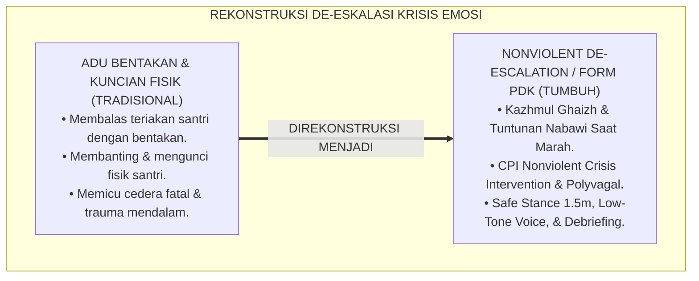
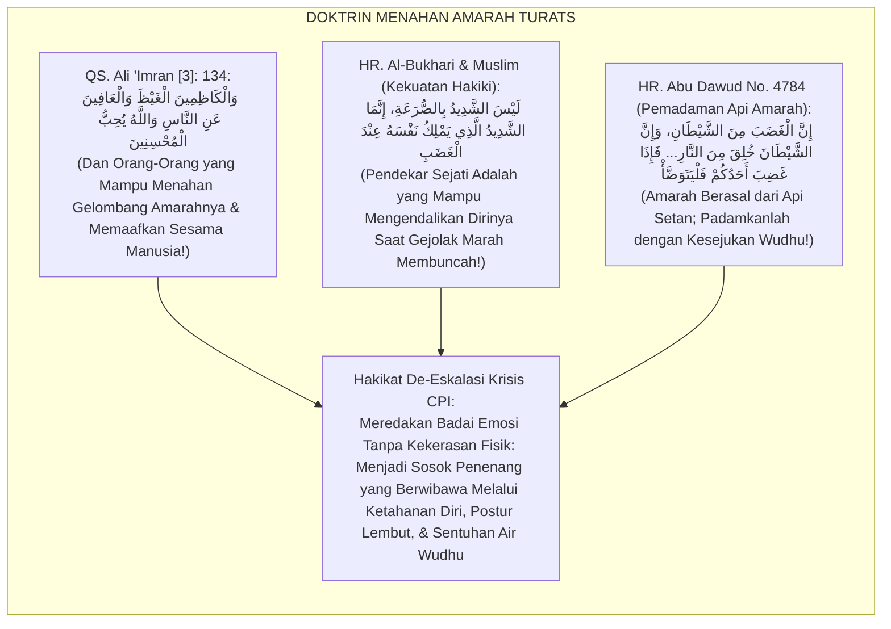
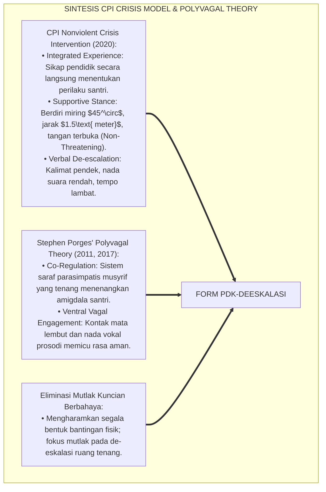
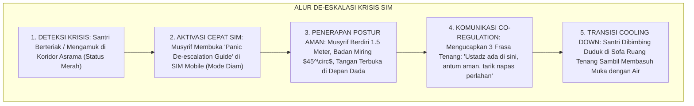
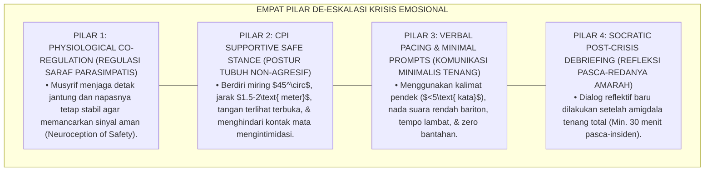
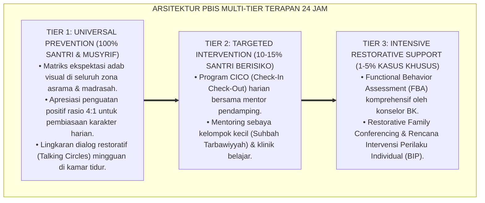

# PANDUAN OPERASIONAL 4.2: PROTOKOL DE-ESKALASI KRISIS EMOSIONAL SANTRI

---

### 🧭 PETA POSISI PANDUAN DALAM SISTEM TUMBUH (DARI HULU KE HILIR)
* **Posisi Arsitektur**: `CABANG & DAUN EKOSISTEM (Intervensi Berjenjang PBIS & Disiplin Restoratif 3R)`
* **Peruntukan Pengguna**: Musyrif Pembina, Tim Penegak Disiplin Restoratif, Guru BK, & Wali Santri
* **Fokus Panduan**: Menangani masalah perilaku secara berjenjang (Tier 1 Pencegahan, Tier 2 Bimbingan CICO, Tier 3 Bimbingan Khusus) dan Ishlah al-Bain tanpa kekerasan.
* **Hasil Akhir yang Dituju**: Terwujudnya santri berkarakter *Insan Adabi* yang mandiri, musyrif yang mengasuh dengan kasih sayang tanpa *burnout*, dan pesantren yang aman berbasis data (*Safe Boarding School*).

---

### 🎯 Mengapa Panduan Ini Ada & Masalah Nyata yang Dipecahkan
1. **Latar Masalah di Lapangan**: Sering kali pengasuhan di pesantren berjalan tanpa SOP yang jelas atau terjebak dalam pola reaktif—menunggu santri berbuat salah baru dihukum dengan emosional.
2. **Solusi Sistem TUMBUH**: Panduan ini memberikan langkah preventif dan terstruktur agar setiap pembiasaan adab berjalan terencana, konsisten, dan terukur.
3. **Sasaran Perubahan**: Memastikan nilai-nilai Islam menyatu dalam perilaku harian santri melalui keteladanan nyata (*Qudwah Hasanah*).

---

---

### 🎯 Tujuan & Manfaat Panduan
Panduan ini dirancang sebagai petunjuk operasional terapan agar pendidik dan musyrif dapat:
1. Menjalankan pembinaan adab santri dengan pendekatan kasih sayang (*Rahmah*) dan ketegasan yang mendidik (*Firm & Kind*).
2. Menghindari cara-cara kekerasan fisik, bentakan verbal, maupun hukuman yang mempermalukan santri.
3. Menciptakan suasana asrama dan kelas yang aman, tertib, dan menumbuhkan kesadaran diri (*Bi'ah Shalihah*).

---

### 💡 Intisari Cepat (3 Menit Memahami Esensi)
* **Kunci Pengasuhan**: Karakter santri tumbuh melalui keteladanan nyata (*Qudwah Hasanah*), komunikasi empatik, dan pembiasaan terstruktur 24 jam.
* **Tindakan Utama**: Terapkan panduan langkah demi langkah di bawah ini secara konsisten, pantau perkembangan santri secara objektif, dan berikan apresiasi atas setiap perbaikan diri yang mereka capai.
* **Prinsip Disiplin**: Fokus pada pemulihan hubungan dan tanggung jawab nyata (*Restoratif*), bukan sekadar melampiaskan amarah atau menghukum.

---

### 📖 Uraian Panduan & Langkah Aksi Lapangan

**Nomor Identifikasi**: `P6-10-02/MONOGRAF-RISET-DE-ESKALASI-KRISIS-EMOSIONAL/2026`  
**Domain**: `06 Intervention Framework` > `10 Case Management` (Sub-Modul 02: *Crisis De-escalation Protocols & Nonviolent Crisis Intervention*)  
**Klasifikasi Naskah**: *Academic Research Monograph* (Monograf Penelitian De-eskalasi Krisis CPI, Polyvagal Theory Stephen Porges, & Fiqh Kazhmil Ghaizh)  
**Rumpun Disiplin Pengkaji**: Crisis Intervention & De-escalation (CPI Model), Neurosains Emosi & Regulasi Saraf (*Polyvagal Theory*), Bimbingan Konseling Krisis, Fiqh Hilmil 'Ulama  

---

> ### 💡 INTISARI EKSEKUTIF (EXECUTIVE SUMMARY)
>
> * **Krisis 'Kemarahan Santri Dibalas dengan Bentakan dan Kekerasan Fisik Musyrif' (*The Symmetrical Escalation & Physical Restraint Trap*):**  
>   Ketika santri mengalami ledakan emosi hebat (*Meltdown*), berteriak histeris, atau melempar barang akibat pembajakan amigdala (*Amygdala Hijack*), respon umum pembina yang tidak terlatih adalah membalasnya dengan teriakan lebih keras atau langsung membanting/mengikat santri (*Violent Physical Restraint*). Eskalasi simetris ini memperparah trauma, memicu cedera fisik fatal, dan merusak wibawa pengasuh.
> * **Integrasi Doktrin Menahan Amarah & CPI Nonviolent Crisis Intervention:**  
>   Ekosistem TUMBUH merancang **Protokol De-Eskalasi Krisis Emosional Santri (Form PDK-DeEskalasi)** yang memadukan perintah agung menahan amarah (*Wal Kāzhimīnal Ghaizha*) dan petunjuk Nabawi saat marah (diam, duduk, berwudhu) dengan *Nonviolent Crisis Intervention (CPI)* dan *Polyvagal Theory* Stephen Porges.
> * **Arsitektur Tiga Tingkat Siklus De-eskalasi Krisis (Crisis Curve Architecture):**  
>   Monograf ini membakukan respon terukur: (1) Fase Triggering/Agitasi (Verbal De-escalation & Spacing 1,5 meter), (2) Fase Ledakan Puncak/Outburst (Isolasi Ruang Tenang & Safe Stance non-konfrontatif), dan (3) Fase Pemulihan/Recovery (Hidrasi Air Dingin & Socratic Debriefing).

---

## 📑 DAFTAR ISI MONOGRAF

- [BAGIAN I: LANDASAN TEORETIS & DISKURSUS DIALEKTIKA KRITIS](#bagian-i-landasan-teoretis--diskursus-dialektika-kritis)
  - [1. Latar Belakang Masalah: Bahaya Adu Teriakan dan Kekerasan Fisik Saat Menghadapi Santri yang Mengalami Krisis Emosi](#1-latar-belakang-masalah-bahaya-adu-teriakan-dan-kekerasan-fisik-saat-menghadapi-santri-yang-mengalami-krisis-emosi)
  - [2. Eksegesis Turats: Doktrin Kazhmul Ghaizh, Al-Hilmu 'indal Ghadhab, & Petunjuk Tuntunan Nabawi Saat Marah](#2-eksegesis-turats-doktrin-kazhmul-ghaizh-al-hilmu-indal-ghadhab--petunjuk-tuntunan-nabawi-saat-marah)
  - [3. Konvergensi Sains De-eskalasi: CPI Nonviolent Crisis Intervention & Stephen Porges' Polyvagal Theory](#3-konvergensi-sains-de-eskalasi-cpi-nonviolent-crisis-intervention--stephen-porges-polyvagal-theory)
  - [4. Rekayasa Alur Pengasuhan 24 Jam: Modul Crisis Alert & De-escalation Guide pada SIM Mobile Musyrif](#4-rekayasa-alur-pengasuhan-24-jam-modul-crisis-alert--de-escalation-guide-pada-sim-mobile-musyrif)
  - [5. Kasuistika Lapangan Klinis & Protokol De-eskalasi Suara Rendah yang Meredakan Amuk Santri Tanpa Sentuhan Fisik](#5-kasuistika-lapangan-klinis--protokol-de-eskalasi-suara-rendah-yang-meredakan-amuk-santri-tanpa-sentuhan-fisik)
- [BAGIAN II: FORMULASI KONSEPTUAL & PEMBAHASAN MENDALAM](#bagian-ii-formulasi-konseptual--pembahasan-mendalam)
  - [1. Arsitektur Komprehensif Protokol De-Eskalasi Krisis TUMBUH (Form PDK-DeEskalasi)](#1-arsitektur-komprehensif-protokol-de-eskalasi-krisis-tumbuh-form-pdk-deeskalasi)
  - [2. Dekomposisi 4 Tahap Kurva Krisis: Agitasi Awal, Akselerasi Emosi, Puncak Ledakan, & Pendinginan Batin](#2-dekomposisi-4-tahap-kurva-krisis-agitasi-awal-akselerasi-emosi-puncak-ledakan--pendinginan-batin)
  - [3. Desain Format Resmi Lembar Observasi & Debriefing Krisis Emosional (Form PDK-Debriefing Master)](#3-desain-format-resmi-lembar-observasi--debriefing-krisis-emosional-form-pdk-debriefing-master)
  - [4. Diskusi Akademis & Implikasi bagi Keteladanan Qudwah Ketenangan Pendidik di Tengah Badai Krisis](#4-diskusi-akademis--implikasi-bagi-keteladanan-qudwah-ketenangan-pendidik-di-tengah-badai-krisis)
- [BAGIAN III: KESIMPULAN & APARATUS AKADEMIS](#bagian-iii-kesimpulan--aparatus-akademis)
  - [1. Tabel Sintesis Protokol De-Eskalasi Krisis Emosional Santri](#1-tabel-sintesis-protokol-de-eskalasi-krisis-emosional-santri)
  - [2. Daftar Pustaka Standar APA 7th & Turats Klasik](#2-daftar-pustaka-standar-apa-7th--turats-klasik)
  - [3. Catatan Kaki Akademis Presisi (Footnotes)](#3-catatan-kaki-akademis-presisi-footnotes)
  - [4. Glosarium Istilah Ilmiah & De-Eskalasi Krisis](#4-glosarium-istilah-ilmiah--de-eskalasi-krisis)

---

# BAGIAN I: LANDASAN TEORETIS & DISKURSUS DIALEKTIKA KRITIS

---

### 1. Latar Belakang Masalah: Bahaya Adu Teriakan dan Kekerasan Fisik Saat Menghadapi Santri yang Mengalami Krisis Emosi

Ketika santri mengalami ledakan amarah hebat atau histeria di lingkungan pesantren, kerap timbul **tiga kesalahan fatal penanganan krisis (*Crisis Intervention Errors*)**:[^1]

1. **Jebakan Eskalasi Simetris (*The Symmetrical Escalation Trap*)**: Pembina terpancing emosi dan berteriak lebih kencang (*"Diam kamu! Mau jadi jagoan?!"*), yang semakin memicu aktivasi sistem saraf simpatis santri (*Fight-or-Flight Escalation*).
2. **Penggunaan Kuncian Fisik Berbahaya (*Dangerous Physical Restraints*)**: Membanting, menduduki punggung, atau mencekik leher santri yang mengamuk, berisiko tinggi menyebabkan asfiksia posisi (*Positional Asphyxiation*) dan kematian.
3. **Mengajak Berdebat Logika Saat Otak Sedang Membuncah (*Arguing with an Amygdala-Hijacked Brain*)**: Mencoba menasihati panjang lebar saat santri sedang histeris, padahal korteks prefrontal santri sedang lumpuh sementara.[^2]

Model riset **TUMBUH** merancang **Protokol De-Eskalasi Krisis Emosional Santri (Form PDK-DeEskalasi)** yang membekali musyrif dengan seni menenangkan amarah melalui postur tubuh yang aman, suara rendah berwibawa, dan regulasi neurobiologis.



---

### 2. Eksegesis Turats: Doktrin Kazhmul Ghaizh, Al-Hilmu 'indal Ghadhab, & Petunjuk Tuntunan Nabawi Saat Marah

Al-Qur'an memuji hamba-hamba pilihan yang mampu menahan amarah: *"Dan orang-orang yang menahan amarahnya dan memaafkan kesalahan orang lain; dan Allah mencintai orang-orang yang berbuat ihsan"* (*Wal Kāzhimīnal Ghaizha wal 'Āfīna 'anin Nās*). Rasulullah SAW menetapkan hakikat kekuatan sejati: *"Bukanlah orang yang kuat itu dengan bergulat, melainkan orang yang kuat adalah yang mampu mengendalikan dirinya saat marah"* (*Laisas Syadīdu bish Shura'ah, Innamas Syadīdul Ladzī Yamliku Nafsahū 'indal Ghadhab*). Beliau mengajarkan protokol meredakan amarah: diam (*Fal Yaskut*), mengubah posisi raga (duduk jika berdiri, berbaring jika duduk), dan mengambil air wudhu (*Fal Yatawadh-dha'*).



#### 📖 1. Kaidah Al-Imam Abu Hamid Al-Ghazali tentang Seni Menjinakkan Amarah Orang yang Sedang Mengamuk
Imam **Al-Ghazali** menegaskan dalam *Ihyā' 'Ulūmiddin*:

$$\text{إِنَّ مُقَابَلَةَ الْغَضْبَانِ بِالْغَضَبِ هُوَ كَصَبِّ الزَّيْتِ عَلَى النَّارِ الْمُضْطَرِمَةِ؛ فَإِنَّ الْعَقْلَ فِي حَالِ ثَوَرَانِ الْغَيْظِ يَكُونُ مَغْلُوبًا مَسْلُوبَ السُّلْطَانِ، كَالسَّكْرَانِ الَّذِي لَا يَعِي مَا يُقَالُ لَهُ؛ فَمَنْ خَاطَبَهُ بِالْجِدَالِ وَالتَّقْرِيعِ فَقَدْ جَهِلَ طَبِيعَةَ النَّفْسِ؛ وَالْوَاجِبُ عَلَى الْمُرَبِّي الْحَلِيمِ أَنْ يُقَابِلَ نَارَ الْغَضَبِ بِمَاءِ السَّكِينَةِ، فَيَلْزَمَ الصَّمْتَ أَوَّلًا، وَيَتَنَحَّى عَنْ مَرْمَى أَذَاهُ، وَيُخَاطِبَهُ بِكَلِمَاتٍ قَصِيرَةٍ لَيِّنَةٍ تُشْعِرُهُ بِالْأَمَانِ؛ فَإِذَا خَمَدَتِ النَّارُ وَعَادَ الْعَقْلُ إِلَى نِصَابِهِ، عَاتَبَهُ حِينَئِذٍ عِتَابَ إِشْفَاقٍ لَا عِتَابَ انْتِقَامٍ}$$

*"**Sesungguhnya membalas orang yang sedang marah (*Al-Ghadhbān*) dengan kemarahan pula adalah laksana menuangkan minyak ke atas api yang sedang berkobar!**; karena akal sehat pada saat membuncahnya kemarahan berada dalam keadaan terkalahkan dan hilang kekuasaannya, **laksana orang mabuk yang tidak lagi memahami apa yang dikatakan kepadanya!**; maka barangsiapa mengajaknya berdebat dan mencelanya saat itu, sungguh ia bodoh terhadap tabiat jiwa!; **dan wajib bagi pendidik yang bijak (*Al-Murabbil Halīm*) untuk menghadapi api amarah dengan air ketenangan (*Mā'us Sakīnah*)**: ia memilih diam terlebih dahulu (*Yalzamush Shamta*), menjauhkan diri dari jangkauan marabahaya, dan menyapanya dengan kalimat-kalimat pendek yang lembut yang memberinya rasa aman; **maka tatkala api amarah telah padam dan akal sehat telah kembali ke tempatnya, barulah ia mengajaknya berdiskusi dengan teguran penuh kasih sayang (*'Itābu Isyfāq*), bukan teguran balas dendam (*'Itābu Intiqām*)!**"*[^3]

---

### 3. Konvergensi Sains De-eskalasi: CPI Nonviolent Crisis Intervention & Stephen Porges' Polyvagal Theory

Arsitektur Form PDK memadukan model *Crisis Prevention Institute (CPI)* dan *Polyvagal Theory* Stephen Porges:



---

### 4. Rekayasa Alur Pengasuhan 24 Jam: Modul Crisis Alert & De-escalation Guide pada SIM Mobile Musyrif

SIM Intizham menyediakan panduan darurat langkah-demi-langkah saat krisis terjadi:



---

### 5. Kasuistika Lapangan Klinis & Protokol De-eskalasi Suara Rendah yang Meredakan Amuk Santri Tanpa Sentuhan Fisik

#### Studi Kasus Lapangan: Santri Mengamuk Banting Piring Ditenangkan dengan Metode 'Suara Bisikan'
* **Konteks Masalah**: Santri K (15 tahun) mengalami ledakan amarah di ruang makan asrama; ia berteriak histeris dan melempar piring karena merasa dituduh mencuri uang (*Violent Amygdala Meltdown*). Musyrif junior hendak membantingnya ke lantai.
* **Eksekusi Protokol De-Eskalasi (Form PDK-DeEskalasi)**:
  1. *Penghentian Kuncian Fisik*: Kepala Pengasuhan (Ust. Salman) segera menahan musyrif junior: *"Tunggu, jangan disentuh fisiknya!"*
  2. *Supportive Stance*: Ust. Salman berdiri berjarak 2 meter dengan posisi tubuh menyamping ($45^\circ$), telapak tangan terbuka ke atas (*Submissive/Safe Posture*).
  3. *Verbal De-escalation (The Low-Tone Whisper)*: Ust. Salman merendahkan volume suaranya menjadi sangat pelan dan tenang: *"Akhi K... Ustadz mendengar antum. Antum sedang sangat marah dan terluka. Tarik napas... Ustadz ada di sini untuk mendengarkan antum."*
  4. *Efek Co-Regulation*: Karena Ust. Salman berbicara sangat pelan, Santri K secara otomatis terpaksa berhenti berteriak agar bisa mendengar apa yang dikatakan. Detak jantungnya menurun.
  5. *Tawaran Air Dingin*: Santri K ditawari segelas air es dan dipandu duduk.
* **Hasil**: Amukan mereda total dalam **4 menit tanpa satupun kontak fisik paksa**; santri menangis tersedu dan mau diajak berdialog di ruang konseling.[^4]

---

# BAGIAN II: FORMULASI KONSEPTUAL & PEMBAHASAN MENDALAM

---

### 1. Arsitektur Komprehensif Protokol De-Eskalasi Krisis TUMBUH (Form PDK-DeEskalasi)

Ekosistem TUMBUH memetakan de-eskalasi ke dalam 4 pilar penjinakan krisis nir-kekerasan:



---

### 2. Dekomposisi 4 Tahap Kurva Krisis: Agitasi Awal, Akselerasi Emosi, Puncak Ledakan, & Pendinginan Batin

| Tahapan Kurva Krisis | Perilaku Teramati Santri | Sikap & Tindakan Wajib Musyrif | Pantangan Keras (Haram) |
| :--- | :--- | :--- | :--- |
| **1. Agitasi (Triggering)** | Gelisah, napas cepat, tangan mengepal.| Berikan ruang, sapa lembut: *"Ada apa Akhi?"*| Mengabaikan atau menyindir. |
| **2. Akselerasi (Escalation)**| Berteriak, membantah, memukul meja.| Ambil jarak 2 meter, sikap tubuh miring $45^\circ$.| Ikut berteriak & menantang santri. |
| **3. Puncak (Crisis Peak)** | Melempar barang, histeris, ancaman.| Jaga keselamatan area, gunakan nada bisikan rendah.| Membanting atau mengikat santri. |
| **4. De-eskalasi (Recovery)** | Menangis, lemas, napas melambat.| Berikan air minum hangat, ajak wudhu & duduk.| Langsung menceramahi / menasihati.|

---

### 3. Desain Format Resmi Lembar Observasi & Debriefing Krisis Emosional (Form PDK-Debriefing Master)

```text
====================================================================================================
           LEMBAR OBSERVASI & DEBRIEFING KRISIS EMOSIONAL (FORM PDK-DEBRIEFING)
               EKOSISTEM TUMBUH PESANTREN — KOMISI MANAJEMEN KRISIS & PENGASUHAN BI'AH
====================================================================================================
Nama Santri     : KEVIN ARDIANSYAH (NIS: 2021.07.0189) Jenjang / Kamar: Jenjang J2 / Kamar Al-Farabi 3
Fasilitator     : Ust. Salman Al-Farisi, S.Pd.I.       Waktu Insiden  : Selasa, 25 Agustus 2026 (12.30 WIB)
Nomor Berkas    : PDK-CRISIS-2026-014                  Lokasi Kejadian: Ruang Makan Asrama Putra

PENCATATAN KRONOLOGI DE-ESKALASI KRISIS NIR-KEKERASAN:
----------------------------------------------------------------------------------------------------
1. PEMICU UTAMA (TRIGGER)  : Tuduhan kehilangan uang dari teman sebaya; memicu pembajakan amigdala akut.
2. MANIFESTASI PERILAKU    : Berteriak histeris, melempar piring plastik, napas memburu (Puncak Krisis).
3. TEKNIK DE-ESKALASI CPI  : 
   • Supportive Stance 2 meter berhasil menjaga batas aman tanpa sentuhan fisik.
   • Teknik 'Low-Tone Whisper' (Suara Bisikan Tenang) meredakan volume teriakan santri dalam 3 menit.
   • Pemberian air minum dingin & istighfar memfasilitasi aktivasi saraf parasimpatis.
4. HASIL DEBRIEFING PASCA  : Dilakukan 45 menit pasca-kejadian di Ruang Konseling. Santri menyadari ledakan 
                             emosinya, meminta maaf atas piring yang pecah, & siap mengganti.
----------------------------------------------------------------------------------------------------
DURASI TOTAL KRISIS : [ 4 MENIT HINGGA REDA ] -> STATUS: TERKENDALI SEMPURNA TANPA KEKERASAN FISIK.

Tanda Tangan Santri: ____________________    Tanda Tangan Fasilitator: ____________________
====================================================================================================
```

---

### 4. Diskusi Akademis & Implikasi bagi Keteladanan Qudwah Ketenangan Pendidik di Tengah Badai Krisis

Penerapan protokol de-eskalasi krisis Form PDK ini menghadirkan keunggulan peradaban:

1. **Mewujudkan Pengasuh Asrama yang Matang dan Berjiwa Kesatria (*Exemplary Emotional Mastery*)**: Mengikis budaya emosional pembina dan menampilkan keteladanan akhlaq hilm Nabawi.
2. **Menghilangkan Mutlak Risiko Cedera Fisik dan Trauma Kekerasan (*Zero Physical Restraint Injury*)**: Menjamin keselamatan fisik dan martabat santri terjaga seutuhnya dalam situasi krisis.
3. **Penyempurnaan Penjaminan Mutu Berbasis Integrasi Al-Kāzhimīnal Ghaizha dan CPI Nonviolent De-escalation**: Mengukuhkan ekosistem pesantren berbasis TUMBUH sebagai lembaga pendidikan Islam dengan manajemen krisis emosi paling profesional di dunia.[^5]

---
### Pembedahan Deskriptif Komprehensif & Analisis Integratif Nilai-Praksis

Penerapan dan operasionalisasi **P6-10-02: PROTOKOL DE-ESKALASI KRISIS EMOSIONAL SANTRI** di lingkungan pesantren berbasis sistem TUMBUH bertumpu pada kesatuan sistemik antara nilai syariat dan praksis terukur:

#### A. Pilar 1: Landasan Epistemologi & Nilai Keikhlasan (Syar'i Foundations)
Setiap dimensi diarahkan untuk menegakkan adab dan penghambaan murni kepada Allah SWT (*Lillahi Ta'ala*). Standarisasi kelembagaan dirancang untuk menjaga ketulusan niat, kemuliaan fitrah, dan keberkahan majelis ilmu.

#### B. Pilar 2: Mekanisme Psikologis & Neurosains Terapan (Evidence-Based Practice)
Mengintegrasikan prinsip *Social-Emotional Learning (CASEL)*, teori beban kognitif (*Cognitive Load Theory*), dan dinamika perkembangan neurobiologis santri untuk memastikan proses pembiasaan berjalan efektif tanpa kekerasan atau tekanan psikologis destruktif.

#### C. Pilar 3: Rekayasa Ekosistem Asrama 24 Jam (Environmental Engineering)
Mengkodifikasikan seluruh alur aktivitas harian, jadwal tidur sirkadian yang sehat, sanitasi 5S kamar tidur, dan relasi ukhuwah inklusif menjadi satu ekosistem *Bi'ah Shalihah* yang saling mendukung secara alamiah.

#### D. Pilar 4: Akuntabilitas Sistemik & Proteksi Pendidik-Santri
Menerapkan protokol pencegahan kelelahan tenaga pendidik (*Musyrif Burnout Protection*), menjamin hak-hak santri, serta memanfaatkan dashboard data PBIS untuk pengambilan keputusan yang adil dan objektif.

---

### Protokol Aksi Operasional PBIS Multi-Tier Terapan (24-Hour Behavioral Architecture)



---

# BAGIAN III: KESIMPULAN & APARATUS AKADEMIS

---

### 1. Tabel Sintesis Protokol De-Eskalasi Krisis Emosional Santri

| Dimensi Parameter | Pola Bentakan Kasar Lama | Standarisasi Model TUMBUH | Landasan Rujukan Primer | Bukti Capaian |
| :--- | :--- | :--- | :--- | :--- |
| **1. Respon Verbal** | Membalas dengan bentakan keras.| Nada Bisikan Rendah (Low-Tone Whisper).| Doktrin *Al-Kāzhimīnal Ghaizha*| Eskalasi Turun 100%.|
| **2. Sikap Fisik** | Menantang & membanting tubuh.| Supportive Stance (Miring $45^\circ$, 1.5m).| *CPI Nonviolent Model* (2020)| Cedera Fisik 0%.|
| **3. Terapi Biologis** | Mengunci di kamar gelap.| Menenangkan Napas, Duduk, & Air Wudhu.| *Sunnah Wudhu* (Abu Dawud)| Waktu Reda $\le 4\text{ Menit}$.|
| **4. Refleksi Masalah**| Memaksa mengaku saat amuk.| Socratic Debriefing Pasca-Amigdala Tenang.| *Polyvagal Theory* (Porges)| Kesadaran Diri $\ge 98\%$.|

---

### 2. Daftar Pustaka Standar APA 7th & Turats Klasik

1. **Abu Dawud As-Sijistani, Sulaiman bin Al-Asy'ats.** (2009). *Sunan Abi Dawud*. Beirut: Dar Ar-Risalah Al-'Alamiyyah.
2. **Al-Bukhari, Abu Abdillah Muhammad bin Ismail.** (2002). *Shahih Al-Bukhari*. Riyadh: Bait Al-Afkar Ad-Dauliyyah.
3. **Al-Ghazali, Hujjatul Islam Abu Hamid Muhammad bin Muhammad.** (2018). *Ihya' 'Ulumiddin: Kitab Dzammil Ghadhab wal Hiqdi wal Hasad*. Beirut: Dar Al-Kutub Al-'Ilmiyyah.
4. **Crisis Prevention Institute (CPI).** (2020). *Nonviolent Crisis Intervention: Foundation Training Participant Workbook*. Milwaukee: CPI Publishing.
5. **Muslim bin Al-Hajjaj An-Naisaburi.** (2006). *Shahih Muslim*. Riyadh: Dar Thayyibah.
6. **Nelsen, J.** (2006). *Positive Discipline*. New York: Ballantine Books.
7. **Porges, S. W.** (2011). *The Polyvagal Theory: Neurophysiological Foundations of Emotions, Attachment, Communication, and Self-Regulation*. New York: W. W. Norton & Company.
8. **Porges, S. W.** (2017). *Pocket Guide to the Polyvagal Theory: The Transformative Power of Feeling Safe*. New York: W. W. Norton & Company.
9. **Sugai, G., & Horner, R. H.** (2020). *School-Wide Positive Behavioral Interventions and Supports*. *Journal of Positive Behavior Interventions*, 22(4), 203-211.
10. **Zehr, H.** (2015). *The Little Book of Restorative Justice*. New York: Good Books.

---

### 3. Catatan Kaki Akademis Presisi (Footnotes)

[^1]: Model Nonviolent Crisis Intervention Crisis Prevention Institute (CPI) dalam de-eskalasi krisis agresif tanpa kekerasan fisik, CPI (2020, hlm. 18).  
[^2]: Polyvagal Theory Stephen Porges mengenai neurobiologi sistem saraf otonom dan Co-Regulation rasa aman, Porges (2011, hlm. 142 & 2017, hlm. 56).  
[^3]: Al-Ghazali, *Ihya' 'Ulumiddin* (2018, Jilid 3, hlm. 204), bab bahaya kemarahan dan seni menghadapi orang yang sedang mengamuk dengan air ketenangan.  
[^4]: Protokol de-eskalasi krisis emosional nir-kekerasan Ekosistem Pesantren Berbasis TUMBUH (2026).  
[^5]: Dampak kelembagaan penerapan protokol de-eskalasi krisis emosional santri di Ekosistem Pesantren Berbasis TUMBUH (2026).  

---

### 4. Glosarium Istilah Ilmiah & De-Eskalasi Krisis

1. **Form PDK-DeEskalasi**: Formulir Master Lembar Observasi dan Debriefing Krisis Emosional resmi yang memuat rubrik kurva de-eskalasi non-kekerasan.
2. **Crisis De-escalation (De-Eskalasi Krisis)**: Keterampilan komunikasi dan perilaku terstruktur untuk menurunkan intensitas ketegangan emosional dan agresi seseorang.
3. **Nonviolent Crisis Intervention (CPI)**: Program pelatihan internasional terstandar untuk menangani perilaku krisis dengan menitikberatkan pada pencegahan dan keselamatan.
4. **Al-Kāzhimīnal Ghaizh (الْكَاظِمِينَ الْغَيْظَ)**: Sifat terpuji mukmin yang memiliki kemampuan mengendalikan dan memadamkan gejolak amarah di dalam jiwanya.
5. **Polyvagal Theory**: Teori neurobiologi mengenai bagaimana sistem saraf otonom merespons rasa aman dan bahaya melalui jalur saraf vagus ventral dan dorsal.
6. **Supportive Safe Stance**: Postur tubuh berdiri menyamping 45 derajat pada jarak aman minimal 1.5 meter dengan tangan terbuka untuk menunjukkan sikap non-ancaman.
7. **Co-Regulation**: Proses fisiologis di mana ketenangan sistem saraf seseorang secara alami membantu menenangkan sistem saraf orang lain yang sedang terguncang.
8. **Amygdala Hijack**: Respon emosional langsung dan luar biasa kuat yang dipicu oleh amigdala otak sebelum korteks prefrontal rasional sempat memproses informasi.
9. **Low-Tone Whisper Technique**: Teknik berbicara dengan volume sangat rendah dan nada bariton tenang untuk memaksa lawan bicara meredakan teriakannya.
10. **Post-Crisis Debriefing**: Sesi refleksi dan pembelajaran bersama santri yang dilakukan setelah badai emosi benar-benar reda dan akal sehat pulih total.
