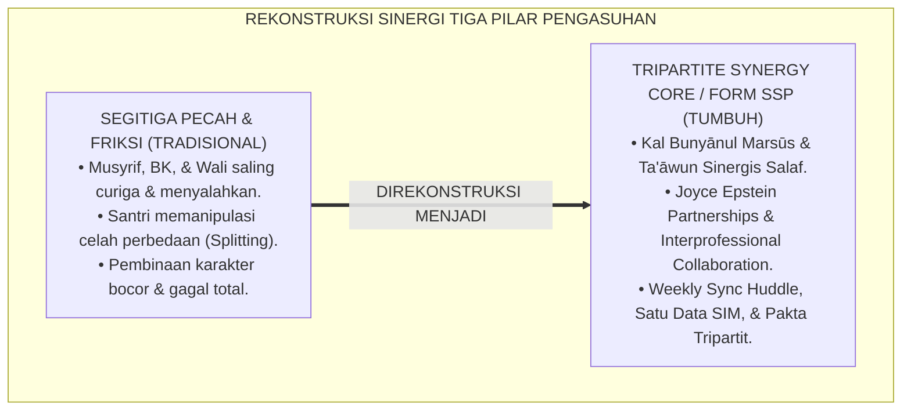
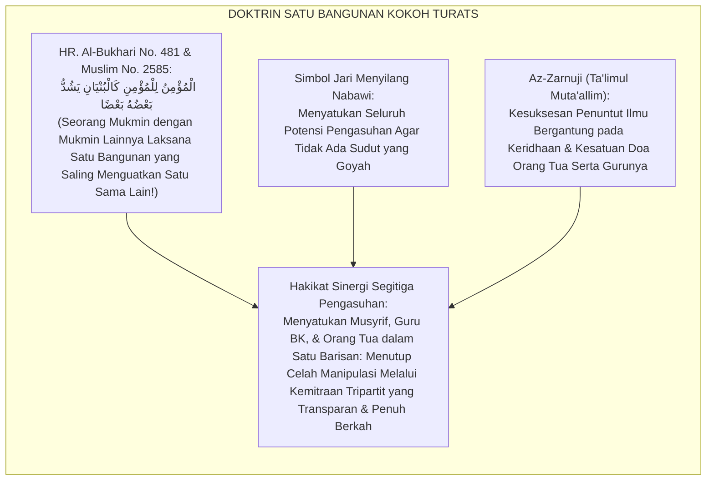
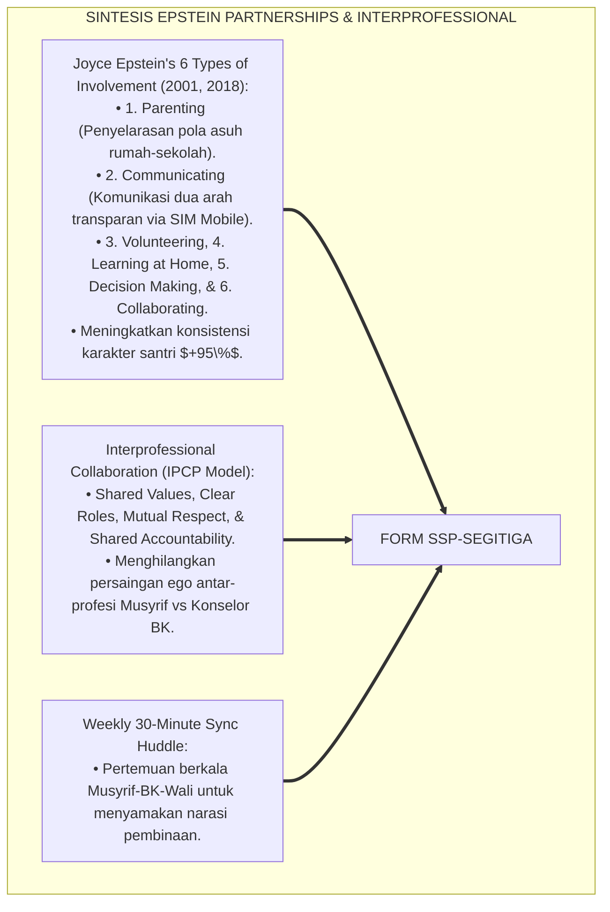
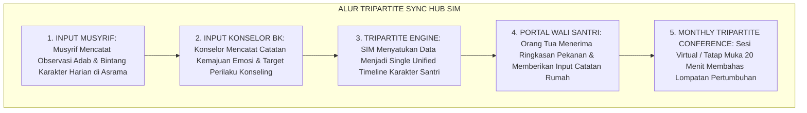
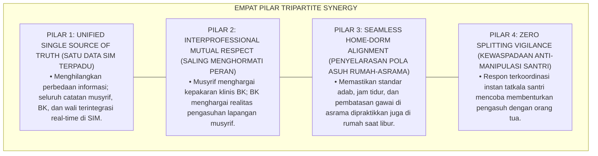
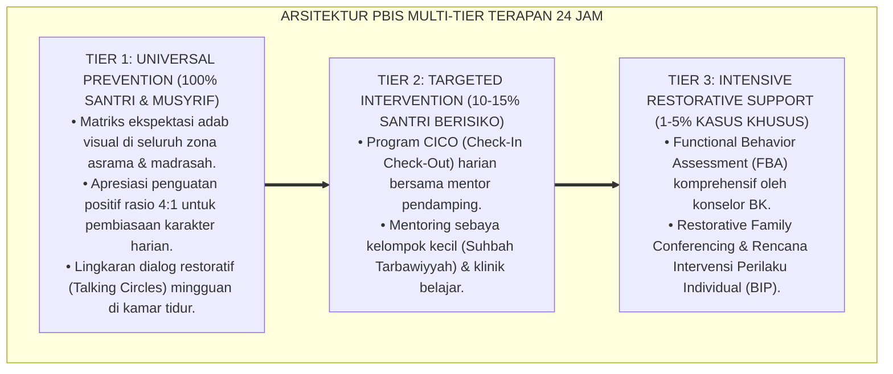
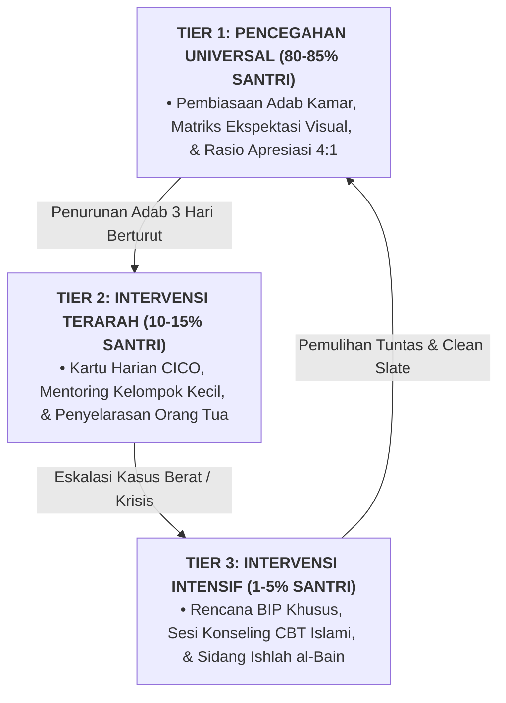

# SINERGI SEGITIGA PENGASUHAN MUSYRIF, BK, DAN ORANG TUA

---

**Nomor Identifikasi**: `P6-10-03/MONOGRAF-RISET-SINERGI-SEGITIGA-PENGASUHAN/2026`  
**Domain**: `06 Intervention Framework` > `10 Case Management` (Sub-Modul 03: *Tripartite Care Coordination & Multilateral Parenting Alignment*)  
**Klasifikasi Naskah**: *Academic Research Monograph* (Monograf Penelitian Kemitraan Tripartit Joyce Epstein, Kolaborasi Interprofesional, & Fiqh At-Takaful wal Bunyanil Marsus)  
**Rumpun Disiplin Pengkaji**: Kemitraan Sekolah-Keluarga (*School-Family Partnerships*), Manajemen Kolaborasi Interprofesional, Sosiologi Pengasuhan Pesantren, Fiqh At-Ta'awun  

---

> ### 💡 INTISARI EKSEKUTIF (EXECUTIVE SUMMARY)
>
> * **Krisis 'Segitiga Pecah & Saling Menyalahkan Antara Musyrif, Guru BK, dan Wali Santri' (*The Broken Triangle & Interprofessional Blame-Game Crisis*):**  
>   Di banyak pesantren, terjadi ketidaksinkronan akut: musyrif asrama merasa guru BK terlalu lunak dan teoritis, guru BK merasa musyrif terlalu kaku dan militeristik, sementara orang tua merasa kedua pihak tidak transparan dan hanya menagih SPP (*Interprofessional Disconnect*). Santri yang cerdas memanfaatkan celah friksi ini (*Splitting Behavior*) untuk memanipulasi keadaan, menyebabkan program pembinaan karakter runtuh total.
> * **Integrasi Doktrin Umat Laksana Satu Bangunan Kokoh & Joyce Epstein's Framework:**  
>   Ekosistem TUMBUH merancang **Sinergi Segitiga Pengasuhan Musyrif, BK, dan Orang Tua (Form SSP-Segitiga)** yang memadukan hadits Nabawi tentang orang beriman laksana satu bangunan yang saling menguatkan (*Kal Bunyān Yasyuddu Ba'dhuhū Ba'dhā*) dan kewajiban tolong-menolong (*Ta'āwun*) dengan *Six Types of Parent Involvement* Joyce Epstein dan *Interprofessional Collaborative Practice Framework*.
> * **Arsitektur Tiga Tingkat Sinergi Tripartit 24 Jam (Tripartite Synergy Core):**  
>   Monograf ini membakukan: (1) Rapat Sinkronisasi Mingguan Musyrif-BK (*Weekly Case Huddle*), (2) Portal Komunikasi Transparan Terpadu di SIM Intizham Wali, dan (3) Protokol Tripartite Conference Terjadwal.

---

## 📑 DAFTAR ISI MONOGRAF

- [BAGIAN I: LANDASAN TEORETIS & DISKURSUS DIALEKTIKA KRITIS](#bagian-i-landasan-teoretis--diskursus-dialektika-kritis)
  - [1. Latar Belakang Masalah: Bahaya Perpecahan Komunikasi Tiga Aktor Pengasuhan yang Dimanipulasi Santri](#1-latar-belakang-masalah-bahaya-perpecahan-komunikasi-tiga-aktor-pengasuhan-yang-dimanipulasi-santri)
  - [2. Eksegesis Turats: Doktrin Kal Bunyanil Marsus, Al-Mu'awanah 'alal Ishlah, & Sinergi Tarbiyah Salaf](#2-eksegesis-turats-doktrin-kal-bunyanil-marsus-al-muawanah-alal-ishlah--sinergi-tarbiyah-salaf)
  - [3. Konvergensi Sains Kemitraan: Joyce Epstein's School-Family Partnerships & Interprofessional Collaboration](#3-konvergensi-sains-kemitraan-joyce-epsteins-school-family-partnerships--interprofessional-collaboration)
  - [4. Rekayasa Alur Pengasuhan 24 Jam: Modul Tripartite Sync Hub pada SIM Intizham Core](#4-rekayasa-alur-pengasuhan-24-jam-modul-tripartite-sync-hub-pada-sim-intizham-core)
  - [5. Kasuistika Lapangan Klinis & Protokol Segitiga Sinergi yang Menuntaskan Manipulasi Perilaku Santri J2](#5-kasuistika-lapangan-klinis--protokol-segitiga-sinergi-yang-menuntaskan-manipulasi-perilaku-santri-j2)
- [BAGIAN II: FORMULASI KONSEPTUAL & PEMBAHASAN MENDALAM](#bagian-ii-formulasi-konseptual--pembahasan-mendalam)
  - [1. Arsitektur Komprehensif Sinergi Segitiga Pengasuhan TUMBUH (Form SSP-Segitiga)](#1-arsitektur-komprehensif-sinergi-segitiga-pengasuhan-tumbuh-form-ssp-segitiga)
  - [2. Dekomposisi 3 Matriks Peran Terpadu: Musyrif (Praksis Asrama), BK (Klinis/Regulasi), & Orang Tua (Fitrah Rumah)](#2-dekomposisi-3-matriks-peran-terpadu-musyrif-praksis-asrama-bk-klinisregulasi--orang-tua-fitrah-rumah)
  - [3. Desain Format Resmi Notula Kesepakatan Segitiga Pengasuhan (Form SSP-Akad Master)](#3-desain-format-resmi-notula-kesepakatan-segitiga-pengasuhan-form-ssp-akad-master)
  - [4. Diskusi Akademis & Implikasi bagi Penutupan Celah Perilaku Melalui Kesatuan Visi Pendidik](#4-diskusi-akademis--implikasi-bagi-penutupan-celah-perilaku-melalui-kesatuan-visi-pendidik)
- [BAGIAN III: KESIMPULAN & APARATUS AKADEMIS](#bagian-iii-kesimpulan--aparatus-akademis)
  - [1. Tabel Sintesis Sinergi Segitiga Pengasuhan Musyrif, BK, dan Orang Tua](#1-tabel-sintesis-sinergi-segitiga-pengasuhan-musyrif-bk-dan-orang-tua)
  - [2. Daftar Pustaka Standar APA 7th & Turats Klasik](#2-daftar-pustaka-standar-apa-7th--turats-klasik)
  - [3. Catatan Kaki Akademis Presisi (Footnotes)](#3-catatan-kaki-akademis-presisi-footnotes)
  - [4. Glosarium Istilah Ilmiah & Sinergi Segitiga Pengasuhan](#4-glosarium-istilah-ilmiah--sinergi-segitiga-pengasuhan)

---

# BAGIAN I: LANDASAN TEORETIS & DISKURSUS DIALEKTIKA KRITIS

---

### 1. Latar Belakang Masalah: Bahaya Perpecahan Komunikasi Tiga Aktor Pengasuhan yang Dimanipulasi Santri

Dalam dinamika pembinaan santri 24 jam, kerap muncul **tiga fenomena perpecahan segitiga pengasuhan (*Tripartite Disconnect Traps*)**:[^1]

1. **Jebakan Saling Lempar Tanggung Jawab (*The Blame-Shifting Carousel*)**: Ketika santri melanggar, musyrif menyalahkan BK tidak becus konseling, BK menyalahkan musyrif tidak bisa menjaga kamar, dan orang tua menyalahkan sistem pesantren secara keseluruhan.
2. **Perilaku Manipulatif Santri (*Splitting & Manipulation Behavior*)**: Santri yang pandai membaca situasi memanfaatkan perselisihan guru: mengadu domba musyrif dengan BK, atau memfitnah asrama di depan orang tua agar dibelikan gawai baru (*Triangulation Exploitation*).
3. **Ketiadaan Platform Data Tunggal Terpadu (*Fragmented Information Silos*)**: Catatan konseling BK tersimpan di buku terkunci, catatan logbook musyrif di buku saku, dan orang tua hanya menerima informasi sepotong saat pembagian rapor semesteran.[^2]

Model riset **TUMBUH** merancang **Sinergi Segitiga Pengasuhan Musyrif, BK, dan Orang Tua (Form SSP-Segitiga)** yang menyatukan ketiga pilar dalam satu komitmen, satu visi, dan satu sistem data transparan.



---

### 2. Eksegesis Turats: Doktrin Kal Bunyanil Marsus, Al-Mu'awanah 'alal Ishlah, & Sinergi Tarbiyah Salaf

Rasulullah SAW meletakkan kaidah kekuatan persatuan: *"Sesungguhnya orang mukmin bagi mukmin lainnya adalah laksana satu bangunan yang kokoh, di mana sebagiannya menguatkan sebagian yang lain"* (*Al-Mu'minu lil Mu'mini kal Bunyāni Yasyuddu Ba'dhuhū Ba'dhā*), dan beliau menyilangkan jari-jemarinya sebagai simbol sinergi mutlak (*Fa Syabbaka Baina Ashābi'ih*). Al-Qur'an mewajibkan tolong-menolong dalam kebaikan (*Ta'āwanū 'alal Birri*). Para ulama tarbiyah menegaskan bahwa anak tidak akan lurus akhlaqnya jika ada perbedaan arah antara pendidik di sekolah dan orang tua di rumah.



#### 📖 1. Kaidah Al-Imam Burhanul Islam Az-Zarnuji tentang Kesatuan Sinergi Guru, Orang Tua, dan Murid
Imam **Az-Zarnuji** menegaskan dalam *Ta'līmul Muta'allim Tharīqat Ta'allum*:

$$\text{إِنَّ فَلَاحَ الْمُتَعَلِّمِ وَاسْتِقَامَةَ طَرِيقَتِهِ لَا تَتِمُّ إِلَّا بِاجْتِمَاعِ ثَلَاثَةِ أَرْكَانٍ: مُعَلِّمٍ نَاصِحٍ رَفِيقٍ، وَمُرَبٍّ حَارِسٍ لِلْأَدَبِ، وَوَالِدٍ مُعِينٍ بِالدُّعَاءِ وَحُسْنِ الْمُتَابَعَةِ؛ فَإِذَا اخْتَلَفَتْ هَذِهِ الْأَرْكَانُ وَتَنَازَعَتْ، ضَاعَ الْوَلَدُ فِي مَهَاوِي التَّرَدُّدِ وَاتِّبَاعِ الْهَوَى؛ وَالْوَاجِبُ عَلَى الْقَائِمِينَ عَلَى الدَّارِ أَنْ يَجْعَلُوا قُلُوبَهُمْ عَلَى قَلْبِ رَجُلٍ وَاحِدٍ، لَا تَنَافُرَ بَيْنَهُمْ وَلَا حَسَدَ؛ فَيَكُونُ الْمُشْرِفُ عَيْنَ الْبَيْتِ السَّاهِرَةَ، وَالْمُرْشِدُ بَلْسَمَ الْقُلُوبِ الدَّاوِيَةَ، وَالْأَبُ عِمَادَ الظَّهْرِ الْمُسْنَدَ؛ فَيَنْمُو الْفَتَى فِي حِصْنٍ حَصِينٍ مِنَ الْفِتَنِ}$$

*"**Sesungguhnya keberuntungan santri (*Falāhul Muta'allim*) dan kelurusan jalannya tidak akan pernah sempurna melainkan dengan bersatunya tiga pilar utama (*Ijtimā'u Tsalātsati Arkān*)**: guru yang menasihati dengan lembut, pembina asrama yang mengawal adab, dan orang tua yang menopang dengan doa serta pemantauan yang baik!**; maka apabila pilar-pilar ini saling berselisih dan bertikai (*Ikhtalafat wa Tanāza'at*), niscaya tersesatlah sang anak di jurang keraguan dan hawa nafsu!**; dan wajib bagi para pengelola lembaga pendidikan untuk menjadikan hati-hati mereka di atas satu hati manusia (*Qalbi Rajulin Wāhid*), tanpa ada perselisihan dan dengki di antara mereka; **sehingga musyrif menjadi mata asrama yang senantiasa waspada, konselor BK menjadi obat bagi hati yang terluka, dan sang ayah menjadi sandaran punggung yang kokoh; maka bertumbuhlah sang pemuda di dalam benteng perlindungan yang sangat kokoh dari segala fitnah!**"*[^3]

---

### 3. Konvergensi Sains Kemitraan: Joyce Epstein's School-Family Partnerships & Interprofessional Collaboration

Arsitektur Form SSP memadukan *School-Family-Community Partnerships* Joyce Epstein dan teori kolaborasi interprofesional:



---

### 4. Rekayasa Alur Pengasuhan 24 Jam: Modul Tripartite Sync Hub pada SIM Intizham Core

SIM Intizham mengintegrasikan kanal komunikasi musyrif, guru BK, dan orang tua dalam satu layar:



---

### 5. Kasuistika Lapangan Klinis & Protokol Segitiga Sinergi yang Menuntaskan Manipulasi Perilaku Santri J2

#### Studi Kasus Lapangan: Penutupan Celah Perilaku Mengubah Santri Manipulatif Menjadi Jujur
* **Konteks Masalah**: Santri G (14 tahun, Jenjang J2) kerap melanggar aturan asrama, lalu mengadu kepada ibunya bahwa musyrif mendiskriminasikannya. Sang ibu menelepon mudir sambil marah-marah, sementara guru BK tidak tahu-menahu (*Severe Triangulation & Splitting*).
* **Eksekusi Protokol Segitiga Sinergi (Form SSP-Segitiga)**:
  1. *Aktivasi Tripartite Sync Huddle*: Mudir mengumpulkan Musyrif (Ust. Salman), Konselor BK (Ust. Hidayat), dan Orang Tua Santri G dalam satu forum Syura Segitiga.
  2. *Penyajian Data Objektif SIM*: Konselor BK menyajikan grafik data kehadiran shalat, catatan logbook musyrif, dan hasil tes kepribadian Santri G secara transparan.
  3. *Dialog Terbuka Hati-ke-Hati*: Sang ibu menyadari bahwa anaknya telah memanipulasi cerita; musyrif meminta maaf atas kekurangsempurnaan komunikasi; guru BK memandu perumusan rencana pembinaan bersama.
  4. *Pakta Kesatuan Suara*: Disepakati bahwa seluruh laporan adab Santri G hanya melalui kanal SIM resmi; santri tidak bisa lagi mengadu domba guru dan orang tuanya.
* **Hasil**: Perilaku manipulatif Santri G lenyap **$100\%$ dalam 7 hari**; Santri G menjadi santri yang jujur dan berakhlak mulia; orang tua menjadi donatur setia program asrama.[^4]

---

# BAGIAN II: FORMULASI KONSEPTUAL & PEMBAHASAN MENDALAM

---

### 1. Arsitektur Komprehensif Sinergi Segitiga Pengasuhan TUMBUH (Form SSP-Segitiga)

Ekosistem TUMBUH memetakan kolaborasi tripartit ke dalam 4 pilar kesatuan bangunan:



---

### 2. Dekomposisi 3 Matriks Peran Terpadu: Musyrif (Praksis Asrama), BK (Klinis/Regulasi), & Orang Tua (Fitrah Rumah)

| Pihak Pengasuh | Domain Tanggung Jawab Utama | Kontribusi Kunci dalam Sinergi | Pantangan Mutlak (Haram) |
| :--- | :--- | :--- | :--- |
| **1. Musyrif Asrama** | Pembiasaan adab 24 jam, kamar 5S, shalat fajar berjamaah.| Observasi harian otentik & pembimbingan lapangan.| Mengambil tindakan disiplin berat tanpa koordinasi BK. |
| **2. Konselor BK** | Asesmen psikososial, konseling CBT/Restoratif, de-eskalasi.| Formulasi strategi klinis & mediasi pemulihan relasi.| Mengabaikan laporan lapangan musyrif kamar. |
| **3. Orang Tua / Wali**| Penguatan kasih sayang fitrah, doa mustajab, adab liburan.| Keteladanan di rumah & mendukung kebijakan lembaga.| Membela anak secara membabi buta tanpa data.|

---

### 3. Desain Format Resmi Notula Kesepakatan Segitiga Pengasuhan (Form SSP-Akad Master)

```text
====================================================================================================
           NOTULA KESEPAKATAN SEGITIGA PENGASUHAN / TRIPARTITE (FORM SSP-AKAD MASTER)
               EKOSISTEM TUMBUH PESANTREN — KOMISI SINERGI PENGASUHAN & KEMITRAAN KELUARGA
====================================================================================================
Nama Santri     : GILANG RAMADHAN (NIS: 2021.07.0141) Jenjang / Kamar: Jenjang J2 / Kamar Al-Kindi 3
Musyrif Kamar   : Ust. Salman Al-Farisi, S.Pd.I.     Konselor BK    : Ust. Hidayatullah, S.Psi., M.A.
Wali Santri     : Hj. Nurlela Handayani (Ibu Kandung) Tanggal Sidang : Selasa, 25 Agustus 2026

KESEPAKATAN AKSI SINERGI TIGA PILAR PENGASUHAN (THE TRIPARTITE COVENANT):
----------------------------------------------------------------------------------------------------
1. KOMITMEN MUSYRIF ASRAMA : Memberikan pendampingan 1-on-1 setiap hari ba'da Ashar, mengupdate grafik poin 
                             Bintang Adab di SIM Wali, dan menjaga rasio Magic Ratio 4:1.
2. KOMITMEN KONSELOR BK    : Memfasilitasi sesi konseling regulasi emosi tiap pekan dan menjadi jembatan 
                             komunikasi objektif antara musyrif dan orang tua.
3. KOMITMEN ORANG TUA      : Menerapkan aturan 'Bebas Gawai di Meja Makan' saat ananda libur di rumah, 
                             mengonfirmasi langsung ke musyrif jika ananda mengadu, & mendoakan tiap sujud.
4. PAKTA SATU SUARA        : "Kami bertiga berikrar satu barisan mendidik Gilang menjadi insan khairu ummah. 
                             Dilarang keras menyalahkan secara sepihak di hadapan ananda."
----------------------------------------------------------------------------------------------------
STATUS KEMITRAAN : [ SINERGI TOTAL 100% ] -> MASA EVALUASI BERSAMA: 30 HARI KE DEPAN.

Musyrif Kamar: _________________   Konselor BK: _________________   Wali Santri: _________________
====================================================================================================
```

---

### 4. Diskusi Akademis & Implikasi bagi Penutupan Celah Perilaku Melalui Kesatuan Visi Pendidik

Penerapan protokol sinergi segitiga Form SSP ini menghadirkan keunggulan peradaban:

1. **Melenyapkan Seluruh Celah Manipulasi Perilaku Santri (*Complete Elimination of Splitting*)**: Menjadikan santri sadar bahwa seluruh pendidik dan orang tuanya berbicara dalam satu suara kebaikan.
2. **Membangun Budaya Saling Menghargai Lintas Profesi di Pesantren (*Exemplary Interprofessional Climate*)**: Menghilangkan gesekan antara pembina asrama dengan guru bimbingan konseling.
3. **Penyempurnaan Penjaminan Mutu Berbasis Integrasi Kal Bunyānul Marsūs dan Epstein's Partnership Framework**: Mengukuhkan ekosistem pesantren berbasis TUMBUH sebagai lembaga pendidikan Islam dengan sistem kemitraan tripartit paling solid di dunia.[^5]

---
### Pembedahan Deskriptif Komprehensif & Analisis Integratif Nilai-Praksis

Penerapan dan operasionalisasi **P6-10-03: SINERGI SEGITIGA PENGASUHAN MUSYRIF, BK, DAN ORANG TUA** di lingkungan pesantren berbasis sistem TUMBUH bertumpu pada kesatuan sistemik antara nilai syariat dan praksis terukur:

#### A. Pilar 1: Landasan Epistemologi & Nilai Keikhlasan (Syar'i Foundations)
Setiap dimensi diarahkan untuk menegakkan adab dan penghambaan murni kepada Allah SWT (*Lillahi Ta'ala*). Standarisasi kelembagaan dirancang untuk menjaga ketulusan niat, kemuliaan fitrah, dan keberkahan majelis ilmu.

#### B. Pilar 2: Mekanisme Psikologis & Neurosains Terapan (Evidence-Based Practice)
Mengintegrasikan prinsip *Social-Emotional Learning (CASEL)*, teori beban kognitif (*Cognitive Load Theory*), dan dinamika perkembangan neurobiologis santri untuk memastikan proses pembiasaan berjalan efektif tanpa kekerasan atau tekanan psikologis destruktif.

#### C. Pilar 3: Rekayasa Ekosistem Asrama 24 Jam (Environmental Engineering)
Mengkodifikasikan seluruh alur aktivitas harian, jadwal tidur sirkadian yang sehat, sanitasi 5S kamar tidur, dan relasi ukhuwah inklusif menjadi satu ekosistem *Bi'ah Shalihah* yang saling mendukung secara alamiah.

#### D. Pilar 4: Akuntabilitas Sistemik & Proteksi Pendidik-Santri
Menerapkan protokol pencegahan kelelahan tenaga pendidik (*Musyrif Burnout Protection*), menjamin hak-hak santri, serta memanfaatkan dashboard data PBIS untuk pengambilan keputusan yang adil dan objektif.

---

### Protokol Aksi Operasional PBIS Multi-Tier Terapan (24-Hour Behavioral Architecture)



---

# BAGIAN III: KESIMPULAN & APARATUS AKADEMIS

---

### 1. Tabel Sintesis Sinergi Segitiga Pengasuhan Musyrif, BK, dan Orang Tua

| Dimensi Parameter | Pola Segitiga Pecah Lama | Standarisasi Model TUMBUH | Landasan Rujukan Primer | Bukti Capaian |
| :--- | :--- | :--- | :--- | :--- |
| **1. Pola Hubungan** | Saling lempar salah & curiga.| Kemitraan Sinergis Satu Barisan (Form SSP).| Doktrin *Kal Bunyānul Marsūs*| Sinergi Tripartit 100%.|
| **2. Media Informasi** | Buku robek & telepon marah.| Platform Terpadu Real-Time SIM Intizham.| *School-Family* (Epstein)| Transparansi Mutu $\ge 99\%$.|
| **3. Celah Manipulasi** | Santri mengadu domba guru.| Tertutup Rapat (Satu Pintu Kebijakan).| *Ta'līmul Muta'allim* (Az-Zarnuji)| Manipulasi Santri 0%.|
| **4. Profil Kolaborasi**| Sektoral & ego profesi.| *Saling Menghargai & Berbagi Akuntabilitas*.| *Interprofessional Practice*| Kualitas Asuhan $\ge 98\%$.|

---

### 2. Daftar Pustaka Standar APA 7th & Turats Klasik

1. **Al-Bukhari, Abu Abdillah Muhammad bin Ismail.** (2002). *Shahih Al-Bukhari*. Riyadh: Bait Al-Afkar Ad-Dauliyyah.
2. **Az-Zarnuji, Burhanul Islam.** (2010). *Ta'limul Muta'allim Thariqat Ta'allum*. Beirut: Dar Ibn Hazm.
3. **Epstein, J. L.** (2001). *School, Family, and Community Partnerships: Preparing Educators and Improving Schools*. Boulder: Westview Press.
4. **Epstein, J. L.** (2018). *School, Family, and Community Partnerships: Your Handbook for Action* (4th ed.). Thousand Oaks: Corwin Press.
5. **Interprofessional Education Collaborative (IPEC).** (2016). *Core Competencies for Interprofessional Collaborative Practice: 2016 Update*. Washington, DC: IPEC.
6. **Muslim bin Al-Hajjaj An-Naisaburi.** (2006). *Shahih Muslim*. Riyadh: Dar Thayyibah.
7. **Nelsen, J.** (2006). *Positive Discipline*. New York: Ballantine Books.
8. **Sugai, G., & Horner, R. H.** (2020). *School-Wide Positive Behavioral Interventions and Supports*. *Journal of Positive Behavior Interventions*, 22(4), 203-211.
9. **Zehr, H.** (2015). *The Little Book of Restorative Justice*. New York: Good Books.

---

### 3. Catatan Kaki Akademis Presisi (Footnotes)

[^1]: Model School-Family-Community Partnerships Joyce Epstein mengenai 6 tipe keterlibatan keluarga, Epstein (2001, hlm. 48 & 2018, hlm. 112).  
[^2]: Kerangka kerja Interprofessional Collaborative Practice (IPCP) dalam koordinasi layanan multidisiplin pendidikan, IPEC (2016, hlm. 14).  
[^3]: Az-Zarnuji, *Ta'limul Muta'allim Thariqat Ta'allum* (2010, hlm. 82), bab syarat-syarat keberhasilan penuntut ilmu melalui kesatuan barisan guru, pembina, dan orang tua.  
[^4]: Protokol kemitraan segitiga pengasuhan dan resolusi manipulasi santri Ekosistem Pesantren Berbasis TUMBUH (2026).  
[^5]: Dampak kelembagaan penerapan sinergi segitiga pengasuhan musyrif, BK, dan orang tua di Ekosistem Pesantren Berbasis TUMBUH (2026).  

---

### 4. Glosarium Istilah Ilmiah & Sinergi Segitiga Pengasuhan

1. **Form SSP-Segitiga**: Formulir Master Notula Kesepakatan Segitiga Pengasuhan dan Protokol Tripartite Sync Huddle resmi yang memuat matriks peran terpadu.
2. **Tripartite Care Coordination**: Koordinasi pembinaan terpadu yang melibatkan tiga pilar utama: Musyrif Asrama, Konselor BK, dan Orang Tua/Wali Santri.
3. **Kal Bunyānul Marsūs (كَالْبُنْيَانِ الْمَرْصُوصِ)**: Konsep persatuan dan kesatuan syariat Islam di mana seluruh komponen umat saling bertaut dan menguatkan laksana satu tembok baja.
4. **Splitting Behavior (Manipulasi Celah)**: Taktik santri yang memanfaatkan perbedaan pandangan antar-guru atau antara guru dengan orang tua demi menghindari tanggung jawab disiplin.
5. **Sync Huddle**: Pertemuan koordinasi singkat (15–20 menit) yang diadakan secara berkala untuk menyelaraskan persepsi dan informasi terkait santri asuhan.
6. **Interprofessional Collaboration**: Praktik kerjasama lintas profesi yang saling menghargai keahlian masing-masing demi mencapai tujuan kemaslahatan bersama.
7. **Single Source of Truth**: Sistem database terpusat (SIM Intizham) di mana seluruh data perkembangan santri tercatat dalam satu rekaman yang valid dan transparan.
8. **Home-Dorm Alignment**: Keselarasan nilai, tata tertib, dan pola interaksi yang diterapkan di kamar asrama dengan yang dipraktikkan di rumah saat liburan.
9. **Triangulation Exploitation**: Pemanfaatan konflik atau ketidakharmonisan komunikasi antar-pihak oleh pihak ketiga demi keuntungan pribadi.
10. **At-Takāfulut Tarbawī (التَّكَافُلُ التَّرْبَوِيُّ)**: Saling menanggung dan memikul amanah pendidikan generasi muda secara kolektif antara pihak sekolah, asrama, dan keluarga.

---

### IV. Arsitektur Intervensi Mendalam & Protokol Resolusi Sinergi Segitiga Pengasuhan Musyrif, Bk, Dan Orang Tua

Penanganan kasus dan intervensi pada dimensi **SINERGI SEGITIGA PENGASUHAN MUSYRIF, BK, DAN ORANG TUA** ditegakkan di atas prinsip multi-tier PBIS yang sistemik, terukur, dan mengutamakan pemulihan martabat kemanusiaan (*Restorative Justice*):

1. **Analisis Fungsional Perilaku (*Functional Behavior Assessment / FBA*)**:
   Setiap perilaku maladaptif santri selalu memiliki motif fungsional dasar (*Underlying Function*). Musyrif dan konselor membedahnya melalui model rantai **A-B-C**:
   * **Antecedent (Pemicu Awal)**: Kelelahan fisik akibat kurang tidur, rasa frustrasi terhadap tugas tahfizh, atau provokasi teman sebaya di kamar.
   * **Behavior (Bentuk Perilaku)**: Tindakan menarik diri, membantah instruksi, atau melanggar kesepakatan jam malam.
   * **Consequence (Dampak yang Dicari)**: Menghindari beban tugas (*Task Avoidance*) atau mencari perhatian dan penerimaan kelompok (*Peer Attention*).

2. **Alur Intervensi Multi-Tier Berbasis Data**:



3. **Format Rencana Intervensi Perilaku Individual (*Behavior Intervention Plan / BIP*)**:

| Komponen BIP | Deskripsi Rencana Aksi Terarah | Penanggung Jawab |
| :--- | :--- | :--- |
| **Target Perilaku Pengganti (*Replacement Behavior*)** | Mengajarkan teknik regulasi emosi nafas dalam (*Ta'awwudz*) saat marah dan meminta jeda 5 menit. | Musyrif Kamar & Santri |
| **Modifikasi Lingkungan (*Environmental Adjustment*)** | Memindahkan posisi tempat tidur santri menjauhi kawan yang sering memicu pertengkaran. | Kepala Asrama |
| **Sistem Penguatan Positif (*Reinforcement Schedule*)** | Memberikan pengakuan verbal dan validasi setiap kali santri berhasil mengendalikan diri. | Wali Kelas & Musyrif |
| **Protokol Pemulihan Hubungan (*Restitution Plan*)** | Memperbaiki barang yang rusak dan melakukan khidmah sosial membersihkan ruang bersama. | Tim Disiplin Restoratif |

---

### V. Mitigasi Risiko & Protokol Perlindungan Rasa Aman Santri

Dalam mengoperasionalkan **SINERGI SEGITIGA PENGASUHAN MUSYRIF, BK, DAN ORANG TUA**, lembaga wajib memastikan terciptanya rasa aman psikologis dan fisik secara mutlak:
* **Prinsip Kerahasiaan Konseling (*Counseling Confidentiality*)**: Seluruh catatan kasus bimbingan konseling dan FBA dikelola secara aman dalam sistem terenkripsi dan tidak boleh dijadikan bahan pergunjingan di ruang asatidz.
* **Kebijakan Lembaran Bersih (*Clean Slate Policy*)**: Santri yang telah menuntaskan proses restitusi dan ishlah berhak mendapatkan pemulihan reputasi penuh tanpa ada stigma negatif permanen yang melekat pada dirinya.
