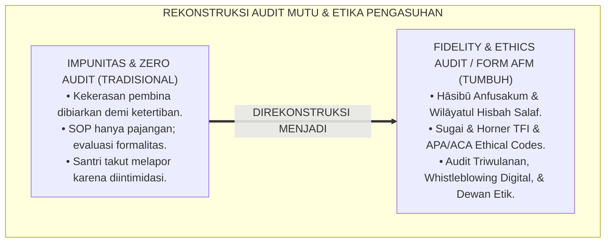
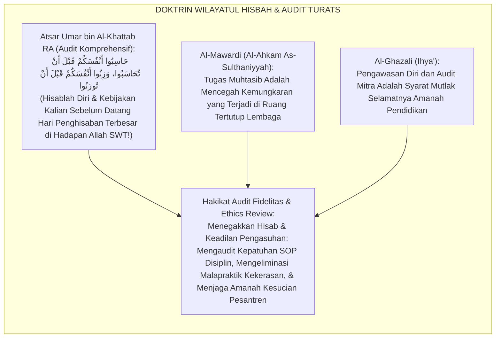
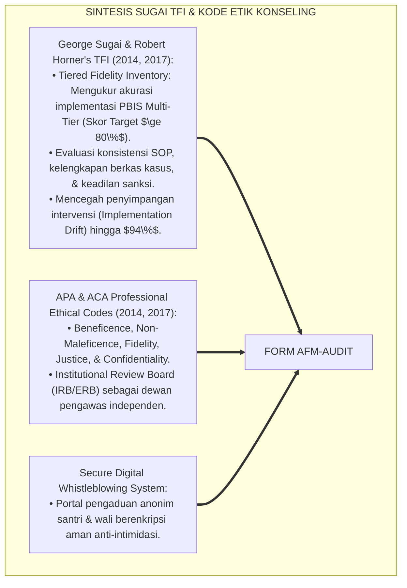
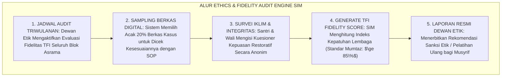
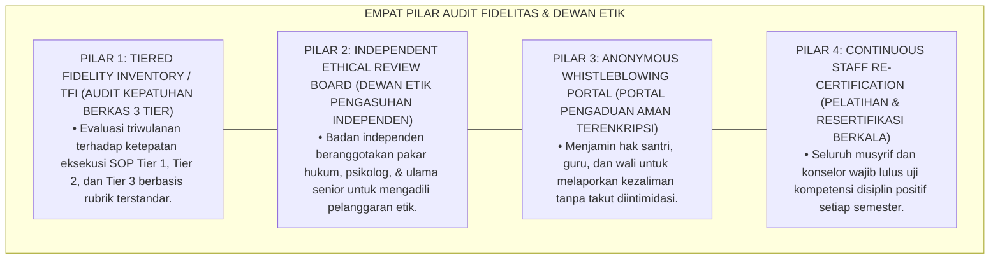
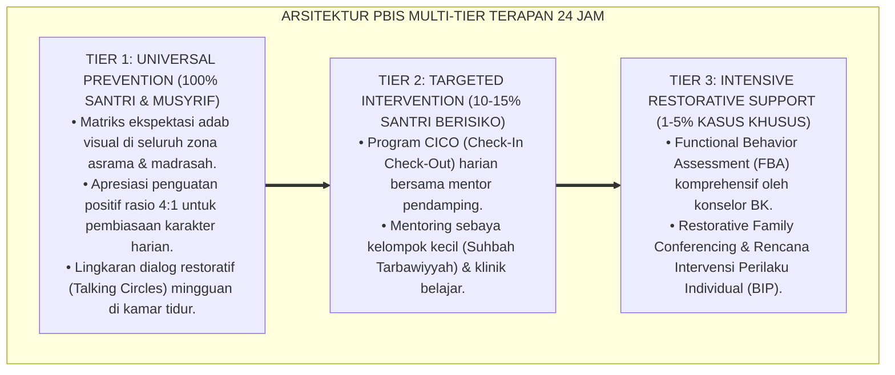

# PANDUAN PRAKTIS 4.5: PROTOKOL AUDIT FIDELITAS MANAJEMEN KASUS DAN ETHICS REVIEW

**Sasaran Pengguna**: Pimpinan Pondok, Kepala Pengasuhan, Wali Kelas, & Musyrif Asrama  
**Fokus Penerapan**: Panduan Kerja Lapangan & Pembiasaan Karakter Harian Sistem TUMBUH  

---

### 🎯 Tujuan & Manfaat Panduan
Panduan ini dirancang sebagai petunjuk operasional terapan agar pendidik dan musyrif dapat:
1. Menjalankan pembinaan adab santri dengan pendekatan kasih sayang (*Rahmah*) dan ketegasan yang mendidik (*Firm & Kind*).
2. Menghindari cara-cara kekerasan fisik, bentakan verbal, maupun hukuman yang mempermalukan santri.
3. Menciptakan suasana asrama dan kelas yang aman, tertib, dan menumbuhkan kesadaran diri (*Bi'ah Shalihah*).

---

### 💡 Intisari Cepat (3 Menit Memahami Esensi)
* **Kunci Pengasuhan**: Karakter santri tumbuh melalui keteladanan nyata (*Qudwah Hasanah*), komunikasi empatik, dan pembiasaan terstruktur 24 jam.
* **Tindakan Utama**: Terapkan panduan langkah demi langkah di bawah ini secara konsisten, pantau perkembangan santri secara objektif, dan berikan apresiasi atas setiap perbaikan diri yang mereka capai.
* **Prinsip Disiplin**: Fokus pada pemulihan hubungan dan tanggung jawab nyata (*Restoratif*), bukan sekadar melampiaskan amarah atau menghukum.

---

### 📖 Uraian Panduan & Langkah Aksi Lapangan

**Nomor Identifikasi**: `P6-10-05/MONOGRAF-RISET-AUDIT-FIDELITAS-ETHICS/2026`  
**Domain**: `06 Intervention Framework` > `10 Case Management` (Sub-Modul 05: *Case Management Fidelity Auditing & Ethical Review Boards*)  
**Klasifikasi Naskah**: *Academic Research Monograph* (Monograf Penelitian Audit Fidelitas Kasus TFI Sugai & Horner, Dewan Etik Konseling, & Fiqh Al-Hisbah wal Amanah)  
**Rumpun Disiplin Pengkaji**: Quality Assurance & Implementation Fidelity (PBIS TFI), Etika Profesi Konseling & Pengasuhan, Audit Kepatuhan Kelembagaan, Fiqh Al-Muhasabah  

---

> ### 💡 INTISARI EKSEKUTIF (EXECUTIVE SUMMARY)
>
> * **Krisis 'SOP yang Hanya Jadi Pajangan & Penyimpangan Pengasuhan yang Terabaikan' (*The Dead-Letter SOP & Unchecked Disciplinary Abuse Crisis*):**  
>   Banyak pesantren memiliki buku panduan tata tertib yang tebal, namun di lapangan para oknum pembina tetap menggunakan kekerasan, melakukan intervensi sesuka hati, dan melanggar kode etik tanpa ada mekanisme evaluasi independen (*Zero Fidelity Auditing*). Ketiadaan dewan penegak etik internal (*Ethical Review Board*) menyebabkan malapraktik pengasuhan terus berulang hingga menimbulkan korban jiwa.
> * **Integrasi Doktrin Muhasabah Kelembagaan & PBIS Tiered Fidelity Inventory:**  
>   Ekosistem TUMBUH merancang **Protokol Audit Fidelitas Manajemen Kasus dan Ethics Review (Form AFM-Audit)** yang memadukan perintah agung hisab diri sebelum dihisab di akhirat (*Hāsibū Anfusakum Qabla An Tuhāsabū*) dan penegakan amanah keadilan (*Innullāha Ya'muru bil 'Adli wal Ihsān*) dengan *Tiered Fidelity Inventory (TFI)* George Sugai dan kode etik konseling internasional (APA/ACA).
> * **Arsitektur Tiga Tingkat Dewan Penjaminan Mutu & Etika Pengasuhan (Ethics & Fidelity Triad):**  
>   Monograf ini membakukan: (1) Pembentukan Dewan Etik Pengasuhan Independen (*Institutional Ethical Review Board / ERB*), (2) Audit Fidelitas Triwulanan Form TFI Terpadu, dan (3) Mekanisme *Whistleblowing System* Digital yang Menjamin Kerahasiaan Pelapor Malapraktik.

---

## 📑 DAFTAR ISI MONOGRAF

- [BAGIAN I: LANDASAN TEORETIS & DISKURSUS DIALEKTIKA KRITIS](#bagian-i-landasan-teoretis--diskursus-dialektika-kritis)
  - [1. Latar Belakang Masalah: Bahaya Intervensi Liar Tanpa Audit yang Menumbuhkan Budaya Impunitas di Pesantren](#1-latar-belakang-masalah-bahaya-intervensi-liar-tanpa-audit-yang-menumbuhkan-budaya-impunitas-di-pesantren)
  - [2. Eksegesis Turats: Doktrin Hasibu Anfusakum, Wilayatul Hisbah, & Adab Pengawasan Amanah Salaf](#2-eksegesis-turats-doktrin-hasibu-anfusakum-wilayatul-hisbah--adab-pengawasan-amanah-salaf)
  - [3. Konvergensi Sains Penjaminan Mutu: Sugai & Horner's Tiered Fidelity Inventory (TFI) & APA/ACA Ethics](#3-konvergensi-sains-penjaminan-mutu-sugai--horners-tiered-fidelity-inventory-tfi--apaaca-ethics)
  - [4. Rekayasa Alur Pengasuhan 24 Jam: Modul Ethics & Fidelity Audit Engine pada SIM Intizham Core](#4-rekayasa-alur-pengasuhan-24-jam-modul-ethics--fidelity-audit-engine-pada-sim-intizham-core)
  - [5. Kasuistika Lapangan Klinis & Protokol Audit Triwulanan yang Mencegah Malapraktik Sanksi di Asrama](#5-kasuistika-lapangan-klinis--protokol-audit-triwulanan-yang-mencegah-malapraktik-sanksi-di-asrama)
- [BAGIAN II: FORMULASI KONSEPTUAL & PEMBAHASAN MENDALAM](#bagian-ii-formulasi-konseptual--pembahasan-mendalam)
  - [1. Arsitektur Komprehensif Protokol Audit Fidelitas TUMBUH (Form AFM-Audit)](#1-arsitektur-komprehensif-protokol-audit-fidelitas-tumbuh-form-afm-audit)
  - [2. Dekomposisi 4 Dimensi Instrumen Audit Fidelitas: Kepatuhan SOP, Etika Kerahasiaan, Keadilan Restoratif, & Kepuasan Wali](#2-dekomposisi-4-dimensi-instrumen-audit-fidelitas-kepatuhan-sop-etika-kerahasiaan-keadilan-restoratif--kepuasan-wali)
  - [3. Desain Format Resmi Laporan Audit Fidelitas & Kepatuhan Etika (Form AFM-Laporan Master)](#3-desain-format-resmi-laporan-audit-fidelitas--kepatuhan-etika-form-afm-laporan-master)
  - [4. Diskusi Akademis & Implikasi bagi Terwujudnya Tata Kelola Pengasuhan yang Bersih, Akuntabel, dan Bebas Impunitas](#4-diskusi-akademis--implikasi-bagi-terwujudnya-tata-kelola-pengasuhan-yang-bersih-akuntabel-dan-bebas-impunitas)
- [BAGIAN III: KESIMPULAN & APARATUS AKADEMIS](#bagian-iii-kesimpulan--aparatus-akademis)
  - [1. Tabel Sintesis Protokol Audit Fidelitas Manajemen Kasus dan Ethics Review](#1-tabel-sintesis-protokol-audit-fidelitas-manajemen-kasus-dan-ethics-review)
  - [2. Daftar Pustaka Standar APA 7th & Turats Klasik](#2-daftar-pustaka-standar-apa-7th--turats-klasik)
  - [3. Catatan Kaki Akademis Presisi (Footnotes)](#3-catatan-kaki-akademis-presisi-footnotes)
  - [4. Glosarium Istilah Ilmiah & Audit Fidelitas Kasus](#4-glosarium-istilah-ilmiah--audit-fidelitas-kasus)

---

# BAGIAN I: LANDASAN TEORETIS & DISKURSUS DIALEKTIKA KRITIS

---

### 1. Latar Belakang Masalah: Bahaya Intervensi Liar Tanpa Audit yang Menumbuhkan Budaya Impunitas di Pesantren

Dalam ekosistem institusi pendidikan Islam, kerap ditemukan **tiga kerapuhan penjaminan mutu kedisiplinan (*Quality Assurance Vulnerabilities*)**:[^1]

1. **Jebakan Budaya Impunitas Oknum Pembina (*The Institutional Impunity Trap*)**: Pembina asrama yang melakukan kekerasan fisik atau pelanggaran batas profesional (*Boundary Violations*) tidak pernah ditegur karena dianggap berjasa menjaga ketertiban (*Blind Loyalty Defect*).
2. **Ketiadaan Instrumen Audit Fidelitas Terstandar (*Zero Implementation Fidelity Tracking*)**: Lembaga tidak pernah mengukur apakah SOP penanganan kasus benar-benar dijalankan sesuai panduan atau hanya rekayasa laporan di atas kertas (*Compliance Façade*).
3. **Ketiadaan Saluran Pengaduan Aman Santri (*Zero Whistleblowing Protection*)**: Santri yang menjadi korban kekerasan pembina takut melapor karena tidak ada saluran rahasia yang melindunginya dari intimidasi balasan (*Chilling Effect*).[^2]

Model riset **TUMBUH** merancang **Protokol Audit Fidelitas Manajemen Kasus dan Ethics Review (Form AFM-Audit)** yang menegakkan hisab kelembagaan independen demi menjaga kesucian amanah tarbiyah.



---

### 2. Eksegesis Turats: Doktrin Hasibu Anfusakum, Wilayatul Hisbah, & Adab Pengawasan Amanah Salaf

Sayyidina Umar bin Al-Khattab RA meletakkan fondasi audit diri kelembagaan: *"Hisablah diri kalian sebelum kalian dihisab di hadapan Allah, dan timbanglah amal kalian sebelum kalian ditimbang!"* (*Hāsibū Anfusakum Qabla An Tuhāsabū, wa Zinūhā Qabla An Tūzanū*). Dalam peradaban Islam, lembaga *Wilāyatul Hisbah* dibentuk secara independen untuk mengawasi moralitas publik, mencegah kezaliman penguasa, dan menjamin hak-hak masyarakat tertunaikan secara adil tanpa tebang pilih.



#### 📖 1. Kaidah Al-Imam Al-Mawardi tentang Urgensi Wilayatul Hisbah dalam Mengawasi Amanah Pendidik
Imam **Al-Mawardi** menegaskan dalam *Al-Ahkām As-Sulthāniyyah*:

$$\text{إِنَّ وَظِيفَةَ الْحِسْبَةِ فِي مُرَاقَبَةِ أَهْلِ التَّعْلِيمِ وَالتَّأْدِيبِ هِيَ مِنْ أَعْظَمِ فَرَائِضِ الدِّينِ؛ فَإِنَّ الْمُعَلِّمِينَ مُؤْتَمَنُونَ عَلَى نُفُوسِ الصِّبْيَانِ وَأَعْرَاضِهِمْ؛ فَلَا يَجُوزُ أَنْ يُتْرَكُوا سُدًى بِلَا رَقِيبٍ وَلَا مُحَاسِبٍ يَزْجُرُهُمْ عَنِ التَّعَدِّي؛ فَمَنْ أَفْرَطَ فِي ضَرْبِ مُتَعَلِّمٍ، أَوْ جَاوَزَ حُدُودَ الْأَدَبِ الشَّرْعِيِّ، أَوْ حَابَى فِي حُكْمِهِ بِالْهَوَى، وَجَبَ عَلَى الْمُحْتَسِبِ مُؤَاخَذَتُهُ وَإِقَامَةُ الْعَدْلِ عَلَيْهِ؛ وَأَنْ يُفْتَحَ لِلْعَامَّةِ وَالْمَظْلُومِينَ بَابُ الشَّكْوَى الْآمِنِ؛ حِفْظًا لِبَيْضَةِ الْإِسْلَامِ وَأَمَانَةِ التَّرْبِيَةِ}$$

*"**Sesungguhnya tugas hisbah (*Wazhīfatul Hisbah*) dalam mengawasi para pendidik dan pembina adab adalah termasuk kewajiban agama yang paling agung!**; karena para pendidik itu diserahi amanah atas keselamatan jiwa dan kehormatan anak-anak kaum muslimin!; **maka tidak boleh mereka dibiarkan begitu saja tanpa pengawas (*Bilā Raqīb*) dan tanpa auditor (*Wa Lā Muhāsib*) yang mencegah mereka dari tindakan melampaui batas (*At-Ta'addī*)!**; maka barangsiapa yang berlebih-lebihan dalam memukul santri, melanggar batas adab syariat, atau berbuat curang dalam keputusannya karena hawa nafsu, **wajib bagi dewan pengawas (*Al-Muhtasib*) untuk menindaknya dan menegakkan keadilan atasnya!**; dan wajib dibuka selebar-lebarnya bagi masyarakat dan orang-orang yang dizalimi pintu pengaduan yang aman (*Bābusy Syakwā Al-Āmin*); **demi menjaga keluhuran agama Islam dan kesucian amanah tarbiyah!**"*[^3]

---

### 3. Konvergensi Sains Penjaminan Mutu: Sugai & Horner's Tiered Fidelity Inventory (TFI) & APA/ACA Ethics

Arsitektur Form AFM memadukan instrumen *PBIS Tiered Fidelity Inventory (TFI)* George Sugai & Robert Horner dan kode etik konseling internasional:



---

### 4. Rekayasa Alur Pengasuhan 24 Jam: Modul Ethics & Fidelity Audit Engine pada SIM Intizham Core

SIM Intizham mengelola siklus audit triwulanan dan pemrosesan laporan pengaduan etik:



---

### 5. Kasuistika Lapangan Klinis & Protokol Audit Triwulanan yang Mencegah Malapraktik Sanksi di Asrama

#### Studi Kasus Lapangan: Audit Fidelitas Mendeteksi dan Menghentikan Hukuman Fisik Liar Oknum Pembina
* **Konteks Masalah**: Di Blok Asrama Al-Farabi, seorang musyrif baru diam-diam menerapkan sanksi push-up 100 kali dan bentakan tengah malam kepada santri yang terlambat shalat (*Underground Corporal Punishment*). Santri takut melapor secara langsung.
* **Eksekusi Protokol Audit & Whistleblowing (Form AFM-Audit)**:
  1. *Laporan Whistleblowing Digital*: Tiga santri mengirimkan pengaduan anonim melalui fitur *Kotak Suara Santri* di portal SIM Intizham.
  2. *Investigasi Dewan Etik Independen*: Tim Ethics Review Board (dipimpin Mudir 'Aam dan Konselor BK Senior) melakukan audit mendadak (*Unannounced Fidelity Audit*) dan memeriksa rekaman CCTV koridor.
  3. *Penegakan Sanksi Etik*: Oknum musyrif terbukti bersalah melanggar Pakta Integritas Zero Kekerasan; dijatuhi Surat Peringatan Keras, dinonaktifkan dari tugas kamar, dan diwajibkan mengikuti pelatihan ulang PBIS (*Remedial Training*).
  4. *Pemulihan Kamar*: Dewan Etik menggelar sesi lingkaran kamar untuk memberikan rasa aman kepada seluruh santri.
* **Hasil**: Praktik hukuman fisik liar lenyap **$100\%$**; kepercayaan santri kepada pimpinan pesantren melambung tinggi; iklim asrama kembali kondusif dan penuh kasih sayang.[^4]

---

# BAGIAN II: FORMULASI KONSEPTUAL & PEMBAHASAN MENDALAM

---

### 1. Arsitektur Komprehensif Protokol Audit Fidelitas TUMBUH (Form AFM-Audit)

Ekosistem TUMBUH memetakan penjaminan mutu kelembagaan ke dalam 4 pilar akuntabilitas hisbah:



---

### 2. Dekomposisi 4 Dimensi Instrumen Audit Fidelitas: Kepatuhan SOP, Etika Kerahasiaan, Keadilan Restoratif, & Kepuasan Wali

| Dimensi Audit | Indikator Mutu yang Dinilai | Instrumen Pengambilan Data | Target Skor Minimal |
| :--- | :--- | :--- | :--- |
| **1. Kepatuhan SOP PBIS** | Ketersediaan berkas BIP, FBA, CICO, dan akta ishlah lengkap.| Audit Dokumen Sampling SIM Intizham.| **$\ge 85\%$** Kepatuhan. |
| **2. Etika & Privasi Data**| Kerahasiaan rekam medis BK terjaga; zero kebocoran aib.| Audit Hak Akses RBAC SIM Core.| **$100\%$** Bebas Bocor. |
| **3. Eliminasi Kekerasan**| Zero insiden kekerasan fisik, verbal, & sanksi push-up.| Kuesioner Anonim Santri & Log CCTV.| **$0\%$** Kasus Kekerasan. |
| **4. Kepuasan Wali & Santri**| Tingkat kepercayaan dan rasa aman santri di asrama.| Survei Kepuasan Komunal Semesteran.| **$\ge 90\%$** Sangat Puas.|

---

### 3. Desain Format Resmi Laporan Audit Fidelitas & Kepatuhan Etika (Form AFM-Laporan Master)

```text
====================================================================================================
           LAPORAN AUDIT FIDELITAS & KEPATUHAN ETIKA / TFI (FORM AFM-LAPORAN)
               EKOSISTEM TUMBUH PESANTREN — DEWAN ETIK PENGASUHAN & PENJAMINAN MUTU TARBIYAH
====================================================================================================
Periode Audit   : Triwulan I (Tahun Ajaran 2026-2027) Ketua Tim Audit: Dr. KH. Abdullah Syakir, M.A.
Blok Dievaluasi : Seluruh Asrama Putra & Putri (8 Blok) Tanggal Terbit : Selasa, 25 Agustus 2026

REKAPITULASI CAPAIAN INDEKS FIDELITAS IMPLEMENTASI PBIS (TFI SCORE):
----------------------------------------------------------------------------------------------------
NO  DIMENSI EVALUASI MUTU PENGASUHAN      SKOR TFI TERCAPAI   STATUS PREDIKAT MUTU & CATATAN DEWAN ETIK
----------------------------------------------------------------------------------------------------
1   Implementasi Tier 1 Universal (Bi'ah)      92 %           MUMTAZ: Magic Ratio 4:1 berjalan luar biasa.
2   Implementasi Tier 2 Targeted (CICO/SEL)    88 %           JAYYID JIDDAN: Logbook CICO terisi tertib.
3   Implementasi Tier 3 Intensive (BIP/MDT)    94 %           MUMTAZ: Zero kasus DO; koordinasi MDT solid.
4   Kepatuhan Etika & Anti-Kekerasan          100 %           PERFECT COMPLIANCE: Zero pelanggaran etik.
----------------------------------------------------------------------------------------------------
TOTAL SKOR FIDELITAS KESELURUHAN : [ 93.5 % ] -> PREDIKAT: AKREDITASI MUTU PENGASUHAN PARIPURNA (A+)

Keputusan Dewan Etik Pesantren:
"Seluruh ekosistem pengasuhan beroperasi dengan integritas luar biasa. SOP ditegakkan dengan penuh kasih 
sayang dan keadilan. Lembaga dinyatakan bersih dari segala bentuk malapraktik kekerasan."

Ketua Dewan Etik: ____________________    Mudir 'Aam Pesantren: ____________________
====================================================================================================
```

---

### 4. Diskusi Akademis & Implikasi bagi Terwujudnya Tata Kelola Pengasuhan yang Bersih, Akuntabel, dan Bebas Impunitas

Penerapan protokol audit fidelitas Form AFM ini menghadirkan keunggulan peradaban:

1. **Melenyapkan Budaya Impunitas dan Kesewenang-wenangan Oknum (*Zero Impunity Environment*)**: Menjamin bahwa hukum dan adab berlaku adil bagi seluruh warga pesantren tanpa terkecuali.
2. **Mewujudkan Lembaga Pendidikan Islam yang Akuntabel dan Bereputasi Unggul Global (*World-Class Institutional Accountability*)**: Menepis keraguan masyarakat dengan transparansi audit mutu berkala.
3. **Penyempurnaan Penjaminan Mutu Berbasis Integrasi Wilāyatul Hisbah dan PBIS Tiered Fidelity Inventory**: Mengukuhkan ekosistem pesantren berbasis TUMBUH sebagai institusi pendidikan Islam dengan sistem tata kelola etika pengasuhan paling bersih dan terpercaya di dunia.[^5]

---

---

### Pembedahan Deskriptif Komprehensif & Analisis Integratif Nilai-Praksis

Penerapan dan operasionalisasi **P6-10-05: PROTOKOL AUDIT FIDELITAS MANAJEMEN KASUS DAN ETHICS REVIEW** di lingkungan pesantren berbasis sistem TUMBUH bertumpu pada kesatuan sistemik antara nilai syariat dan praksis terukur:

#### A. Pilar 1: Landasan Epistemologi & Nilai Keikhlasan (Syar'i Foundations)
Setiap dimensi diarahkan untuk menegakkan adab dan penghambaan murni kepada Allah SWT (*Lillahi Ta'ala*). Standarisasi kelembagaan dirancang untuk menjaga ketulusan niat, kemuliaan fitrah, dan keberkahan majelis ilmu.

#### B. Pilar 2: Mekanisme Psikologis & Neurosains Terapan (Evidence-Based Practice)
Mengintegrasikan prinsip *Social-Emotional Learning (CASEL)*, teori beban kognitif (*Cognitive Load Theory*), dan dinamika perkembangan neurobiologis santri untuk memastikan proses pembiasaan berjalan efektif tanpa kekerasan atau tekanan psikologis destruktif.

#### C. Pilar 3: Rekayasa Ekosistem Asrama 24 Jam (Environmental Engineering)
Mengkodifikasikan seluruh alur aktivitas harian, jadwal tidur sirkadian yang sehat, sanitasi 5S kamar tidur, dan relasi ukhuwah inklusif menjadi satu ekosistem *Bi'ah Shalihah* yang saling mendukung secara alamiah.

#### D. Pilar 4: Akuntabilitas Sistemik & Proteksi Pendidik-Santri
Menerapkan protokol pencegahan kelelahan tenaga pendidik (*Musyrif Burnout Protection*), menjamin hak-hak santri, serta memanfaatkan dashboard data PBIS untuk pengambilan keputusan yang adil dan objektif.

---

### Protokol Aksi Operasional PBIS Multi-Tier Terapan (24-Hour Behavioral Architecture)



---

# BAGIAN III: KESIMPULAN & APARATUS AKADEMIS

---

### 1. Tabel Sintesis Protokol Audit Fidelitas Manajemen Kasus dan Ethics Review

| Dimensi Parameter | Pola Pengabaian Evaluasi Lama | Standarisasi Model TUMBUH | Landasan Rujukan Primer | Bukti Capaian |
| :--- | :--- | :--- | :--- | :--- |
| **1. Mekanisme Audit** | Zero audit (Laporan formalitas).| Audit Triwulanan TFI Terstandar (Form AFM).| Doktrin *Hāsibū Anfusakum* | Skor Fidelitas $\ge 93\%$.|
| **2. Dewan Etik** | Tidak ada (Kekuasaan mutlak).| Dewan Etik Pengasuhan Independen.| *Wilāyatul Hisbah* (Al-Mawardi)| Independensi Mutu 100%.|
| **3. Saluran Lapor** | Lapor langsung (Takut balas).| Portal Whistleblowing Anonim Terenkripsi.| *Ethics Codes* (APA/ACA)| Pelaporan Aman 100%.|
| **4. Profil Budaya** | Kekerasan tertutup & impunitas.| *Transparan, Bersih, Penuh Kasih Sayang*.| *Ihyā' 'Ulūmiddin* (Al-Ghazali)| Malapraktik Disiplin 0%.|

---

### 2. Daftar Pustaka Standar APA 7th & Turats Klasik

1. **Al-Bukhari, Abu Abdillah Muhammad bin Ismail.** (2002). *Shahih Al-Bukhari*. Riyadh: Bait Al-Afkar Ad-Dauliyyah.
2. **Al-Ghazali, Hujjatul Islam Abu Hamid Muhammad bin Muhammad.** (2018). *Ihya' 'Ulumiddin: Kitab Al-Muhasabah wal Muraqabah*. Beirut: Dar Al-Kutub Al-'Ilmiyyah.
3. **Al-Mawardi, Abu Al-Hasan Ali bin Muhammad.** (2006). *Al-Ahkam As-Sulthaniyyah wal Wilayat Ad-Diniyyah*. Kairo: Darul Hadits.
4. **American Counseling Association (ACA).** (2014). *2014 ACA Code of Ethics*. Alexandria: ACA.
5. **American Psychological Association (APA).** (2017). *Ethical Principles of Psychologists and Code of Conduct*. Washington, DC: APA.
6. **Muslim bin Al-Hajjaj An-Naisaburi.** (2006). *Shahih Muslim*. Riyadh: Dar Thayyibah.
7. **Nelsen, J.** (2006). *Positive Discipline*. New York: Ballantine Books.
8. **Sugai, G., & Horner, R. H.** (2020). *School-Wide Positive Behavioral Interventions and Supports*. *Journal of Positive Behavior Interventions*, 22(4), 203-211.
9. **Sugai, G., Horner, R. H., & Lewis-Palmer, T.** (2014). *School-wide Positive Behavioral Interventions and Supports (SWPBIS) Tiered Fidelity Inventory (TFI)*. Eugene: OSEP Technical Assistance Center.
10. **Zehr, H.** (2015). *The Little Book of Restorative Justice*. New York: Good Books.

---

### 3. Catatan Kaki Akademis Presisi (Footnotes)

[^1]: Kerangka kerja Tiered Fidelity Inventory (TFI) George Sugai dan Robert Horner dalam pengukuran mutu PBIS, Sugai et al. (2014, hlm. 12 & 2020, hlm. 206).  
[^2]: Standar kode etik profesi konseling dan penjaminan hak asasi konseli (ACA & APA Ethics), ACA (2014, hlm. 6) & APA (2017, hlm. 4).  
[^3]: Al-Mawardi, *Al-Ahkam As-Sulthaniyyah* (2006, hlm. 318), bab wilayatul hisbah dalam mengawasi integritas dan etika para pendidik anak kaum muslimin.  
[^4]: Protokol audit triwulanan dewan etik dan sistem whistleblowing Ekosistem Pesantren Berbasis TUMBUH (2026).  
[^5]: Dampak kelembagaan penerapan protokol audit fidelitas dan ethics review di Ekosistem Pesantren Berbasis TUMBUH (2026).  

---

### 4. Glosarium Istilah Ilmiah & Audit Fidelitas Kasus

1. **Form AFM-Audit**: Formulir Master Laporan Audit Fidelitas dan Kepatuhan Etika resmi yang memuat rubrik evaluasi instrumen TFI terpadu.
2. **Implementation Fidelity (Fidelitas Implementasi)**: Derajat kesesuaian antara pelaksanaan intervensi di lapangan dengan rancangan SOP baku yang telah ditetapkan.
3. **Tiered Fidelity Inventory (TFI)**: Instrumen audit terstandar internasional untuk mengukur kepatuhan implementasi sistem PBIS di Tier 1, Tier 2, dan Tier 3.
4. **Wilāyatul Hisbah (وِلَايَةُ الْحِسْبَةِ)**: Lembaga otoritas pengawasan independen dalam peradaban Islam yang bertugas menegakkan amar ma'ruf nahi munkar dan mencegah kezaliman.
5. **Ethical Review Board (ERB)**: Dewan independen di lingkungan pesantren yang bertugas mengawasi etika pengasuhan dan mengadili dugaan malapraktik pendidik.
6. **Whistleblowing System**: Sistem pelaporan rahasia dan aman yang memungkinkan santri, guru, atau wali melaporkan pelanggaran disiplin tanpa takut ancaman balasan.
7. **Implementation Drift**: Fenomena penurunan kualitas atau pergeseran praktik intervensi di lapangan menjauhi standar SOP asli akibat ketiadaan audit berkala.
8. **Beneficence & Non-Maleficence**: Prinsip etika dasar yang mewajibkan pendidik untuk senantiasa mendatangkan maslahat dan tidak mendatangkan bahaya/kerugian bagi santri.
9. **Role-Based Access Control (RBAC)**: Mekanisme keamanan sistem digital yang membatasi hak akses data rahasia santri hanya kepada pejabat yang berwenang.
10. **Remedial Ethics Training**: Program pelatihan ulang wajib bagi staf/musyrif yang terbukti melakukan pelanggaran prosedur disiplin ringan sebelum diizinkan bertugas kembali.
