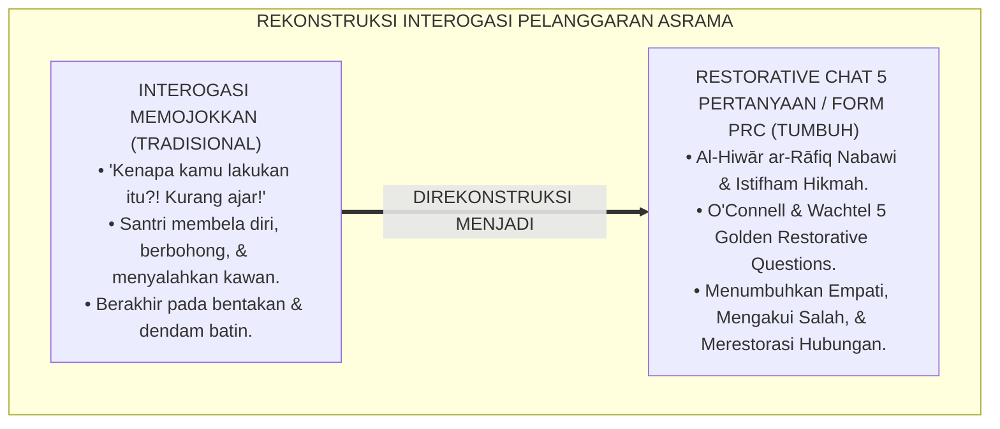
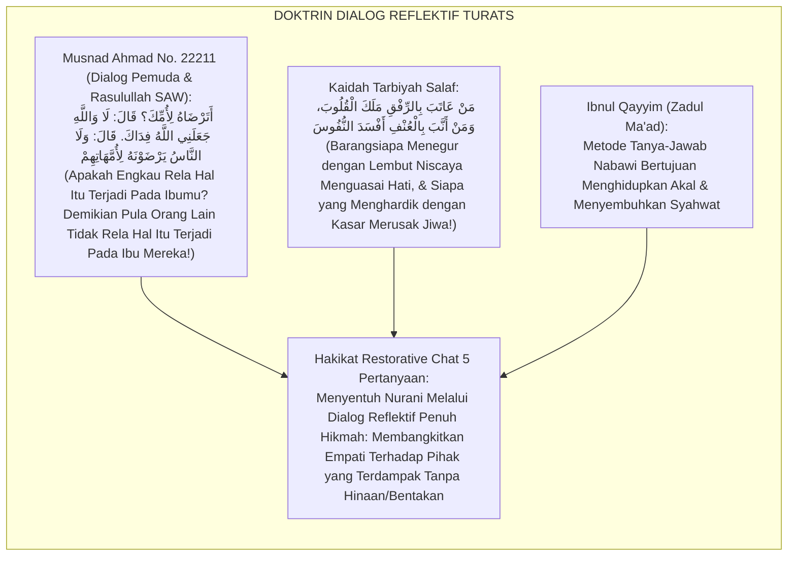
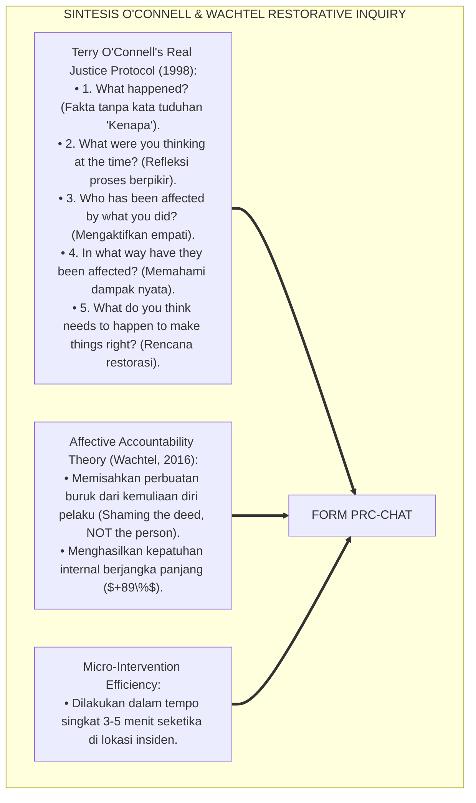
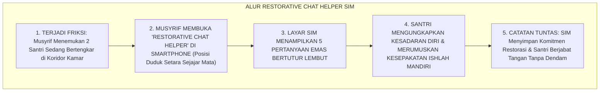
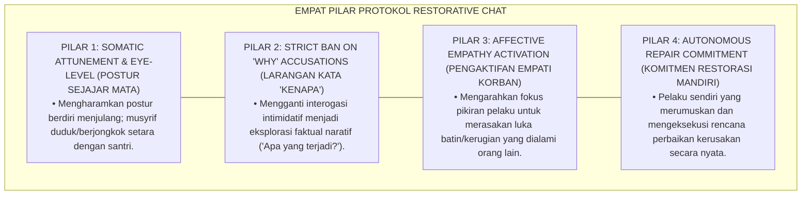
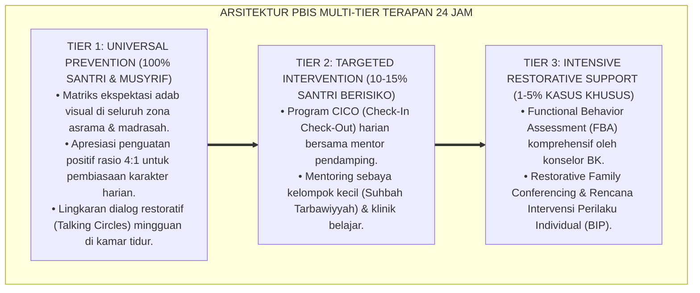

# PANDUAN PRAKTIS RESTORATIVE CHAT 5 PERTANYAAN

---

### 🧭 PETA POSISI PANDUAN DALAM SISTEM TUMBUH (DARI HULU KE HILIR)
* **Posisi Arsitektur**: `CABANG & DAUN EKOSISTEM (Intervensi Berjenjang PBIS & Disiplin Restoratif 3R)`
* **Peruntukan Pengguna**: Musyrif Pembina, Tim Penegak Disiplin Restoratif, Guru BK, & Wali Santri
* **Fokus Panduan**: Menangani masalah perilaku secara berjenjang (Tier 1 Pencegahan, Tier 2 Bimbingan CICO, Tier 3 Bimbingan Khusus) dan Ishlah al-Bain tanpa kekerasan.
* **Hasil Akhir yang Dituju**: Terwujudnya santri berkarakter *Insan Adabi* yang mandiri, musyrif yang mengasuh dengan kasih sayang tanpa *burnout*, dan pesantren yang aman berbasis data (*Safe Boarding School*).

---

### 🎯 Mengapa Panduan Ini Ada & Masalah Nyata yang Dipecahkan
1. **Latar Masalah di Lapangan**: Sering kali pengasuhan di pesantren berjalan tanpa SOP yang jelas atau terjebak dalam pola reaktif—menunggu santri berbuat salah baru dihukum dengan emosional.
2. **Solusi Sistem TUMBUH**: Panduan ini memberikan langkah preventif dan terstruktur agar setiap pembiasaan adab berjalan terencana, konsisten, dan terukur.
3. **Sasaran Perubahan**: Memastikan nilai-nilai Islam menyatu dalam perilaku harian santri melalui keteladanan nyata (*Qudwah Hasanah*).

---
### 🎯 Tujuan & Manfaat Panduan
Panduan ini dirancang sebagai petunjuk operasional terapan agar pendidik dan musyrif dapat:
1. Menjalankan pembinaan adab santri dengan pendekatan kasih sayang (*Rahmah*) dan ketegasan yang mendidik (*Firm & Kind*).
2. Menghindari cara-cara kekerasan fisik, bentakan verbal, maupun hukuman yang mempermalukan santri.
3. Menciptakan suasana asrama dan kelas yang aman, tertib, dan menumbuhkan kesadaran diri (*Bi'ah Shalihah*).

---

### 💡 Intisari Cepat (3 Menit Memahami Esensi)
* **Kunci Pengasuhan**: Karakter santri tumbuh melalui keteladanan nyata (*Qudwah Hasanah*), komunikasi empatik, dan pembiasaan terstruktur 24 jam.
* **Tindakan Utama**: Terapkan panduan langkah demi langkah di bawah ini secara konsisten, pantau perkembangan santri secara objektif, dan berikan apresiasi atas setiap perbaikan diri yang mereka capai.
* **Prinsip Disiplin**: Fokus pada pemulihan hubungan dan tanggung jawab nyata (*Restoratif*), bukan sekadar melampiaskan amarah atau menghukum.

---

---

### 💬 ILUSTRASI NYATA & ANALOGI SEDERHANA
Bayangkan sebuah skenario yang sering kita lihat sehari-hari di asrama:
* Ketika seorang santri baru melakukan kekeliruan (misalnya terlambat bangun Subuh atau kasurnya berantakan), respon pertama yang sering muncul adalah bentakan keras atau hukuman fisik (seperti push-up atau jemur di lapangan).
* **Hasilnya?** Santri tersebut mungkin tampak patuh seketika karena takut, tetapi di dalam hatinya tumbuh rasa dongkol, dendam tersembunyi, atau kebiasaan "bersandiwara"—hanya tertib ketika ada pengawas di dekatnya.

Dalam Sistem TUMBUH, kita menggunakan cara yang jauh lebih cerdas, sejuk, dan membumi:
1. **Analogi "Rem dan Pedal Gas Otak"**: Santri usia remaja (usia MTs dan Aliyah) memiliki bagian otak emosi (*Sistem Limbik*) yang sudah menyala sangat kuat seperti *pedal gas mobil sport*, namun otak pengendali logikanya (*Prefrontal Cortex*) masih dalam proses tumbuh seperti *sistem rem yang baru dipasang*. Tugas guru dan musyrif bukan memarahi mobilnya, melainkan menjadi **"Sopir Teladan & Sabuk Pengaman"** yang mendampingi santri belajar menginjak rem dengan bijak.
2. **Kekuatan Contoh Nyata (*Qudwah Hasanah*)**: Santri jauh lebih cepat meniru apa yang mereka **lihat** setiap hari daripada apa yang mereka **dengar** dari ribuan nasihat panjang. Jika musyrif datang tepat waktu, tersenyum ramah, dan kamarnya rapi, santri akan menirunya dengan sukarela.

---

### 🛠️ PANDUAN LANGKAH PRAKTIS LAPANGAN (BISA LANGSUNG DIPRAKTIKKAN HARI INI)

| Tahapan Aksi | Tindakan Nyata Musyrif / Guru di Lapangan | Hal yang Harus Diperhatikan |
| :--- | :--- | :--- |
| **1. Langkah Persiapan (Sebelum Kejadian)** | Sepakati aturan bersama santri di awal pekan dengan kalimat positif (contoh: *"Kamar rapi membuat istirahat kita berkah"*). | Buat poster visual sederhana yang mudah dibaca di dinding kamar. |
| **2. Langkah Respon (Saat Terjadi Masalah)** | Tarik napas, tenangkan diri, ajak santri berbicara empat mata tanpa mempermalukannya di depan teman-temannya. | Gunakan nada bicara yang tenang namun tegas (*Firm & Kind*). |
| **3. Langkah Perbaikan (Tanggung Jawab Nyata)** | Minta santri memperbaiki kesalahannya secara langsung (contoh: merapikan kembali barang yang berantakan atau meminta maaf). | Berikan apresiasi seketika santri telah menuntaskan perbaikannya. |

---

### 🗣️ CONTOH DIALOG LAPANGAN (YANG HARUS DIUCAPKAN VS DIHINDARI)

* ❌ **JANGAN UCAPKAN (Membuat Santri Menutup Diri & Dendam)**:
  > *"Kamu ini pemalas sekali ya, sudah dibilangi berkali-kali masih saja kasur berantakan! Push-up 50 kali sekarang!"*
* ✅ **UCAPKAN INI (Mendidik Tanggung Jawab & Kesadaran Diri)**:
  > *"Akhi, antum tahu kesepakatan kamar kita tentang kerapian tempat tidur setelah Subuh. Coba lihat kasur antum sekarang, apa yang perlu disempurnakan? Mari rapikan bersama sekarang agar kamar kita nyaman dan berkah."*

---

### 📋 3 POIN EMAS RANGKUMAN (UNTUK SANTRI SENIOR & MUSYRIF MUDA)
1. **Didik dengan Kasih Sayang, Tegakkan Batas dengan Adil**: Jangan pernah mencampuradukkan ketegasan aturan dengan pelampiasan amarah pribadi.
2. **Apresiasi 4x Lebih Banyak daripada Teguran (*Magic Ratio 4:1*)**: Jangan hanya bersuara ketika santri berbuat salah. Saat mereka berbuat baik (salat di shaf depan, menolong kawan, membaca Al-Qur'an), segera berikan pujian tulus.
3. **Fokus pada Perbaikan Hubungan (*Restoratif*)**: Masalah perilaku adalah peluang emas untuk mendidik santri menjadi pribadi yang lebih dewasa dan bertanggung jawab.

---

### 📖 Uraian Lengkap Landasan & Rujukan Sistem

**Nomor Identifikasi**: `P6-07-01/MONOGRAF-RISET-RESTORATIVE-CHAT-5-PERTANYAAN/2026`  
**Domain**: `06 Intervention Framework` > `07 Corrective Strategies` (Sub-Modul 01: *Micro Restorative Chat & 5 Golden Questions Protocol*)  
**Klasifikasi Naskah**: *Academic Research Monograph* (Monograf Penelitian Restorative Chat 5 Pertanyaan, Restorative Inquiry Wachtel & O'Connell, & Fiqh Al-Hiwar At-Tarbawi)  
**Rumpun Disiplin Pengkaji**: Keadilan Restoratif Mikro (*Micro Restorative Justice*), Komunikasi Konseling De-eskalasi, Psikologi Akuntabilitas Moral, Fiqh Al-Istifham  

---

> ### 💡 INTISARI EKSEKUTIF (EXECUTIVE SUMMARY)
>
> * **Krisis 'Interogasi Memojokkan yang Memicu Santri Berbohong' (*The Interrogation Trap & Defensive Lying*):**  
>   Ketika terjadi pelanggaran, respon spontan pengasuh konvensional kerap berupa interogasi intimidatif: *"Kenapa kamu lakukan itu?!"*, *"Siapa yang menyuruh?!"*, *"Kurang ajar sekali kamu!"*. Bentakan investigatif ini secara biologis mengaktifkan mode bertahan hidup otak (*Fight-or-Flight*), mendorong santri membela diri secara agresif, berbohong, atau menyalahkan kawan (*Defensive Blaming*).
> * **Integrasi Doktrin Dialog Nabawi yang Menyentuh Jiwa & Restorative Inquiry:**  
>   Ekosistem TUMBUH merancang **Panduan Praktis Restorative Chat 5 Pertanyaan (Form PRC-Chat)** yang memadukan metode dialog penuh kasih sayang Rasulullah SAW saat santri berbuat keliru (*Al-Hiwār ar-Rāfiq*) dengan *Restorative Inquiry 5 Golden Questions* Terry O'Connell dan Ted Wachtel.
> * **Arsitektur 5 Pertanyaan Emas Restoratif (The 5 Golden Questions):**  
>   Monograf ini membakukan 5 tahapan dialog mikro (durasi 3–5 menit): (1) Apa yang terjadi? (Fakta tanpa menghakimi), (2) Apa yang antum pikirkan saat itu? (Refleksi motif), (3) Siapa saja yang terdampak/terluka? (Membangkitkan empati), (4) Apa dampak paling berat bagi mereka? (Kesadaran moral), dan (5) Apa yang perlu dilakukan untuk memperbaikinya? (Akuntabilitas solusi).

---

## 📑 DAFTAR ISI MONOGRAF

- [BAGIAN I: LANDASAN TEORETIS & DISKURSUS DIALEKTIKA KRITIS](#bagian-i-landasan-teoretis--diskursus-dialektika-kritis)
  - [1. Latar Belakang Masalah: Bahaya Interogasi 'Kenapa Kamu Lakukan Itu?!' yang Mematikan Kejujuran Santri](#1-latar-belakang-masalah-bahaya-interogasi-kenapa-kamu-lakukan-itu-yang-mematikan-kejujuran-santri)
  - [2. Eksegesis Turats: Doktrin Al-Hiwarur Rafiq Nabawi, Istifhamul Hikmah, & Adab Menginterogasi Kesalahan Salaf](#2-eksegesis-turats-doktrin-al-hiwarur-rafiq-nabawi-istifhamul-hikmah--adab-menginterogasi-kesalahan-salaf)
  - [3. Konvergensi Sains Keadilan Restoratif: Terry O'Connell & Ted Wachtel's 5 Restorative Questions](#3-konvergensi-sains-keadilan-restoratif-terry-oconnell--ted-wachtels-5-restorative-questions)
  - [4. Rekayasa Alur Pengasuhan 24 Jam: Modul Restorative Chat Helper pada SIM Intizham Mobile Musyrif](#4-rekayasa-alur-pengasuhan-24-jam-modul-restorative-chat-helper-pada-sim-intizham-mobile-musyrif)
  - [5. Kasuistika Lapangan Klinis & Protokol 'Restorative Chat 3 Menit' yang Mengubah Santri Membangkang Menjadi Mengakui Kesalahan](#5-kasuistika-lapangan-klinis--protokol-restorative-chat-3-menit-yang-mengubah-santri-membangang-menjadi-mengakui-kesalahan)
- [BAGIAN II: FORMULASI KONSEPTUAL & PEMBAHASAN MENDALAM](#bagian-ii-formulasi-konseptual--pembahasan-mendalam)
  - [1. Arsitektur Komprehensif Protokol Restorative Chat TUMBUH (Form PRC-Chat)](#1-arsitektur-komprehensif-protokol-restorative-chat-tumbuh-form-prc-chat)
  - [2. Dekomposisi 5 Pertanyaan Emas Restoratif: Eksplorasi Fakta, Motif, Empati Korban, Refleksi Dampak, & Rencana Solusi](#2-dekomposisi-5-pertanyaan-emas-restoratif-eksplorasi-fakta-motif-empati-korban-refleksi-dampak--rencana-solusi)
  - [3. Desain Format Resmi Lembar Catatan Dialog Restoratif Cepat (Form PRC-Form Master)](#3-desain-format-resmi-lembar-catatan-dialog-restoratif-cepat-form-prc-form-master)
  - [4. Diskusi Akademis & Implikasi bagi Transformasi Akuntabilitas Batiniah Santri yang Sadar Memperbaiki Kerusakan](#4-diskusi-akademis--implikasi-bagi-transformasi-akuntabilitas-batiniah-santri-yang-sadar-memperbaiki-kerusakan)
- [BAGIAN III: KESIMPULAN & APARATUS AKADEMIS](#bagian-iii-kesimpulan--aparatus-akademis)
  - [1. Tabel Sintesis Panduan Praktis Restorative Chat 5 Pertanyaan](#1-tabel-sintesis-panduan-praktis-restorative-chat-5-pertanyaan)
  - [2. Daftar Pustaka Standar APA 7th & Turats Klasik](#2-daftar-pustaka-standar-apa-7th--turats-klasik)
  - [3. Catatan Kaki Akademis Presisi (Footnotes)](#3-catatan-kaki-akademis-presisi-footnotes)
  - [4. Glosarium Istilah Ilmiah & Restorative Chat](#4-glosarium-istilah-ilmiah--restorative-chat)

---

# BAGIAN I: LANDASAN TEORETIS & DISKURSUS DIALEKTIKA KRITIS

---

### 1. Latar Belakang Masalah: Bahaya Interogasi 'Kenapa Kamu Lakukan Itu?!' yang Mematikan Kejujuran Santri

Dalam penanganan insiden pelanggaran di pesantren, kerap ditemukan **tiga disfungsi komunikasi interogasi (*Interrogation Dysfunctions*)**:[^1]

1. **Jebakan Pertanyaan 'Kenapa' (*The 'Why' Question Trap*)**: Mengajukan pertanyaan *"Kenapa kamu memukul temanmu?!"* memaksa santri mencari pembenaran (*Justification*) atau menyalahkan korban: *"Karena dia mengejek saya duluan!"*. Pertanyaan ini tidak melahirkan rasa bersalah atau empati.
2. **Postur Tubuh Mengancam (*Aggressive Somatic Posture*)**: Berdiri menjulang tinggi di hadapan santri dengan mata melotot memicu respon neurobiologis defensif amigdala, menutup total fungsi refleksi Prefrontal Cortex santri.
3. **Ketiadaan Fokus Pada Pemulihan Hubungan (*Zero Repair Orientation*)**: Dialog berakhir pada vonis hukuman tanpa santri pernah diajak memikirkan bagaimana cara memulihkan perasaan teman yang terluka (*Unhealed Relational Harm*).[^2]

Model riset **TUMBUH** merancang **Panduan Praktis Restorative Chat 5 Pertanyaan (Form PRC-Chat)** yang mengubah interogasi menegangkan menjadi dialog batin yang menumbuhkan kesadaran moral.



---

### 2. Eksegesis Turats: Doktrin Al-Hiwarur Rafiq Nabawi, Istifhamul Hikmah, & Adab Menginterogasi Kesalahan Salaf

Ketika seorang pemuda mendatangi Rasulullah SAW meminta izin untuk berzina, beliau tidak membentaknya, melainkan mengajaknya duduk dekat dan mengajukan dialog reflektif yang menggugah fitrah: *"Apakah engkau rela jika perbuatan itu menimpa ibumu? Anak perempuanmu? Saudari perempuanmu?"* Pemuda itu menjawab: *"Demi Allah tidak, ya Rasulullah!"* Lalu beliau bersabda: *"Demikian pula orang lain tidak rela hal itu menimpa keluarga mereka"* (*Atardhāhu li Ummika?... Kadzālikan Nāsu Lā Yardhaunahū li Ummahātihim*).



#### 📖 1. Kaidah Al-Imam Ibnul Qayyim Al-Jauziyyah tentang Keagungan Metode Dialog Reflektif Nabawi
Imam **Ibnul Qayyim Al-Jauziyyah** menegaskan dalam *Zādul Ma'ād fī Hadyi Khairil 'Ibād*:

$$\text{إِنَّ طَرِيقَةَ النَّبِيِّ صَلَّى اللَّهُ عَلَيْهِ وَسَلَّمَ فِي مُعَالَجَةِ أَخْطَاءِ النَّاشِئَةِ لَمْ تَكُنْ قَائِمَةً عَلَى الزَّجْرِ الْمُفْزِعِ أَوْ إِظْهَارِ الْغِلْظَةِ، بَلْ عَلَى اسْتِدْرَاجِ الْعَقْلِ بِالسُّؤَالِ الْحَكِيمِ الَّذِي يَفْتَحُ بَصِيرَةَ الْمُخْطِئِ عَلَى قُبْحِ فِعْلِهِ؛ فَلَمَّا سَأَلَهُ ذَلِكَ الشَّابُّ اسْتِفْهَامًا عَنِ الزِّنَا قَرَّبَهُ وَخَاطَبَ فِطْرَتَهُ السَّلِيمَةَ بِأَسْئِلَةٍ مُتَدَرِّجَةٍ لَمَسَتْ غَيْرَتَهُ عَلَى أَهْلِهِ؛ فَخَرَجَ الشَّابُّ وَأَبْغَضُ شَيْءٍ إِلَيْهِ مَا كَانَ يَسْأَلُ عَنْهُ؛ وَهَذَا هُوَ غَايَةُ التَّأْدِيبِ: أَنْ يَرْجِعَ الْجَانِي عَنْ ذَنْبِهِ بِاقْتِنَاعِ نَفْسِهِ، لَا بِمُجَرَّدِ الْخَوْفِ مِنَ السَّوْطِ}$$

*"**Sesungguhnya metode Rasulullah SAW dalam mengobati kekeliruan generasi muda (*Mu'ālajatu Akhthā'in Nāsyi'ah*) tidak pernah tegak di atas gertakan yang menakut-nakuti (*Az-Zajrul Mufzi'*) atau menampakkan kekasaran lisan**; melainkan dengan menuntun akal pikiran melalui pertanyaan hikmah (*Al-Istifhām Al-Hakīm*) yang membuka mata batin si pelanggar atas dampak buruk perbuatannya!**; maka tatkala pemuda itu meminta izin berzina, beliau mendekatkannya dan menyapa fitrah lurusnya dengan rangkaian pertanyaan berjenjang yang menyentuh rasa cemburu moralnya atas keluarganya; **sehingga pemuda itu bangkit dari majelis dan perkara yang paling ia benci di muka bumi adalah dosa yang tadinya ia mintakan izin!**; dan inilah puncak tujuan ta'dib: **agar si pelanggar bertaubat dari dosanya atas dasar kesadaran batiniahnya sendiri (*Iqtinā'u Nafsih*), bukan semata-mata karena takut kepada cambukan algojo!**"*[^3]

---

### 3. Konvergensi Sains Keadilan Restoratif: Terry O'Connell & Ted Wachtel's 5 Restorative Questions

Arsitektur Form PRC memadukan model *Restorative Inquiry* Terry O'Connell dan Ted Wachtel:



---

### 4. Rekayasa Alur Pengasuhan 24 Jam: Modul Restorative Chat Helper pada SIM Intizham Mobile Musyrif

SIM Intizham membimbing musyrif menjalankan dialog 5 pertanyaan di lapangan:



---

### 5. Kasuistika Lapangan Klinis & Protokol 'Restorative Chat 3 Menit' yang Mengubah Santri Membangkang Menjadi Mengakui Kesalahan

#### Studi Kasus Lapangan: Insiden Penumpahan Air Minum Diselesaikan dalam 4 Menit Tanpa Teriakan
* **Konteks Masalah**: Santri T (13 tahun) dengan sengaja menendang botol air minum milik Santri B hingga tumpah membasahi kasurnya karena kesal diejek. Santri T berdiri menantang dengan wajah merah padam saat dihampiri musyrif.
* **Eksekusi Protokol Restorative Chat (Form PRC-Chat)**:
  1. *Penyelarasan Postur Tubuh*: Musyrif (Ust. Fauzi) berjongkok sehingga posisi matanya sejajar dengan Santri T, berbicara dengan suara tenang.
  2. *Eksekusi 5 Pertanyaan Emas*:
     - **Tanya 1 (Fakta)**: *"Akhi T, bisa ceritakan apa yang tadi terjadi?"* $\rightarrow$ Santri T: *"Saya kesal lalu menendang botolnya."*
     - **Tanya 2 (Pikiran)**: *"Apa yang antum pikirkan saat menendang botol itu?"* $\rightarrow$ *"Saya ingin dia merasakan kesal seperti yang saya rasakan."*
     - **Tanya 3 (Empati)**: *"Menurut antum, siapa saja yang terdampak oleh kejadian ini?"* $\rightarrow$ *"Akhi B kasurnya basah, dan teman sekamar jadi terganggu."*
     - **Tanya 4 (Dampak)**: *"Bagaimana perasaan Akhi B malam ini jika kasurnya basah tidak bisa ditiduri?"* $\rightarrow$ Santri T menunduk terharu: *"Dia akan kedinginan, Ustadz."*
     - **Tanya 5 (Solusi)**: *"Menurut antum, apa yang perlu antum lakukan sekarang untuk memperbaikinya?"* $\rightarrow$ *"Saya akan membantu menjemur kasurnya, meminjamkan sarung saya, dan meminta maaf."*
* **Hasil**: Konflik selesai tuntas dalam **4 menit**; kedua santri berpelukan tulus; kasur dijemur bersama.[^4]

---

# BAGIAN II: FORMULASI KONSEPTUAL & PEMBAHASAN MENDALAM

---

### 1. Arsitektur Komprehensif Protokol Restorative Chat TUMBUH (Form PRC-Chat)

Ekosistem TUMBUH memetakan protokol dialog mikro ke dalam 4 pilar intervensi:



---

### 2. Dekomposisi 5 Pertanyaan Emas Restoratif: Eksplorasi Fakta, Motif, Empati Korban, Refleksi Dampak, & Rencana Solusi

| Nomor Urut | Rumusan Pertanyaan Terstandar (Arab & Indonesia) | Target Psikologis | Larangan Pengasuh (Pantangan) |
| :--- | :--- | :--- | :--- |
| **Pertanyaan 1** | *"Bisa ceritakan apa yang sebenarnya terjadi?"* (*Mādzā Hadatsa?*)| Menghimpun fakta obyektif tanpa rasa terancam.| Dilarang berkata: *"Kamu berantem lagi ya?!"* |
| **Pertanyaan 2** | *"Apa yang antum pikirkan dan rasakan saat itu?"* (*Fīma Kuntat Tufakkir?*)| Mengurai motif emosi & pemicu internal.| Dilarang berkata: *"Niat jahat apa kamu?!"* |
| **Pertanyaan 3** | *"Menurut antum, siapa saja yang terdampak oleh perbuatan ini?"* | Mengaktifkan empati sosial santri.| Dilarang langsung memvonis hukuman. |
| **Pertanyaan 4** | *"Apa dampak paling berat yang mereka rasakan?"* (*Mā Atsaruh?*)| Menumbuhkan kesadaran tanggung jawab moral.| Dilarang mengejek perasaan santri. |
| **Pertanyaan 5** | *"Menurut antum, apa yang perlu dilakukan untuk memperbaikinya?"* | Merumuskan aksi pemulihan (*Restitution*).| Dilarang mendikte hukuman sepihak.|

---

### 3. Desain Format Resmi Lembar Catatan Dialog Restoratif Cepat (Form PRC-Form Master)

```text
====================================================================================================
           LEMBAR CATATAN RESTORATIVE CHAT CEPAT (FORM PRC-FORM MASTER)
               EKOSISTEM TUMBUH PESANTREN — SISTEM KOREKTIF RESTORATIF PBIS TIER 1/2
====================================================================================================
Nama Santri     : THARIQ AR-RASYID (NIS: 2021.07.0345) Jenjang / Kamar: Jenjang J2 / Kamar Al-Ghazali 2
Musyrif Penanya : Ust. Fauzi Rahman, S.Pd.I.          Lokasi Dialog  : Teras Koridor Asrama Lt 2
Waktu Kejadian  : Ba'da Maghrib (18.45 WIB)           Durasi Dialog  : 4 Menit 30 Detik

REKAPITULASI 5 TAHAP DIALOG RESTORATIF:
----------------------------------------------------------------------------------------------------
1. FAKTA KEJADIAN       : Santri Thariq menendang botol minum kawan sekamar (Akhi Bagas) hingga tumpah.
2. MOTIF / PIKIRAN      : Merasa kesal dan ingin melampiaskan amarah saat barangnya tersenggol.
3. PIHAK TERDAMPAK      : Akhi Bagas (Kasur basah) dan seluruh teman sekamar (Lantai licin).
4. KESADARAN DAMPAK     : "Akhi Bagas malam ini tidak punya kasur kering untuk tidur nyenyak."
5. KESEPAKATAN ISHLAH   : Thariq membantu menjemur kasur, mengepel lantai kamar, dan meminta maaf tulus.
----------------------------------------------------------------------------------------------------
STATUS RESOLUSI : [ TUNTAS ISHLAH TOTAL ] -> RELASI KEDUA SANTRI : PULIH DAN SALING MEMAAFKAN

Tanda Tangan Santri: ____________________    Tanda Tangan Musyrif: ____________________
====================================================================================================
```

---

### 4. Diskusi Akademis & Implikasi bagi Transformasi Akuntabilitas Batiniah Santri yang Sadar Memperbaiki Kerusakan

Penerapan protokol restorative chat Form PRC ini menghadirkan keunggulan peradaban:

1. **Membangun Kesadaran Akuntabilitas Moral Sejati (*Internal Moral Accountability*)**: Santri bertanggung jawab bukan karena takut rotan, melainkan karena mencintai kebenaran dan saudaranya.
2. **Menghilangkan Budaya Berbohong dan Menutupi Kesalahan (*Zero Defensive Lying*)**: Santri merasa aman untuk jujur di hadapan pembina yang adil dan penyayang.
3. **Penyempurnaan Penjaminan Mutu Berbasis Integrasi Al-Hiwār ar-Rāfiq dan O'Connell's Restorative Questions**: Mengukuhkan ekosistem pesantren berbasis TUMBUH sebagai institusi pendidikan Islam dengan resolusi disiplin paling manusiawi di dunia.[^5]

---
### Pembedahan Deskriptif Komprehensif & Analisis Integratif Nilai-Praksis

Penerapan dan operasionalisasi **P6-07-01: PANDUAN PRAKTIS RESTORATIVE CHAT 5 PERTANYAAN** di lingkungan pesantren berbasis sistem TUMBUH bertumpu pada kesatuan sistemik antara nilai syariat dan praksis terukur:

#### A. Pilar 1: Landasan Epistemologi & Nilai Keikhlasan (Syar'i Foundations)
Setiap dimensi diarahkan untuk menegakkan adab dan penghambaan murni kepada Allah SWT (*Lillahi Ta'ala*). Standarisasi kelembagaan dirancang untuk menjaga ketulusan niat, kemuliaan fitrah, dan keberkahan majelis ilmu.

#### B. Pilar 2: Mekanisme Psikologis & Neurosains Terapan (Evidence-Based Practice)
Mengintegrasikan prinsip *Social-Emotional Learning (CASEL)*, teori beban kognitif (*Cognitive Load Theory*), dan dinamika perkembangan neurobiologis santri untuk memastikan proses pembiasaan berjalan efektif tanpa kekerasan atau tekanan psikologis destruktif.

#### C. Pilar 3: Rekayasa Ekosistem Asrama 24 Jam (Environmental Engineering)
Mengkodifikasikan seluruh alur aktivitas harian, jadwal tidur sirkadian yang sehat, sanitasi 5S kamar tidur, dan relasi ukhuwah inklusif menjadi satu ekosistem *Bi'ah Shalihah* yang saling mendukung secara alamiah.

#### D. Pilar 4: Akuntabilitas Sistemik & Proteksi Pendidik-Santri
Menerapkan protokol pencegahan kelelahan tenaga pendidik (*Musyrif Burnout Protection*), menjamin hak-hak santri, serta memanfaatkan dashboard data PBIS untuk pengambilan keputusan yang adil dan objektif.

---

### Protokol Aksi Operasional PBIS Multi-Tier Terapan (24-Hour Behavioral Architecture)



---

# BAGIAN III: KESIMPULAN & APARATUS AKADEMIS

---

### 1. Tabel Sintesis Panduan Praktis Restorative Chat 5 Pertanyaan

| Dimensi Parameter | Pola Interogasi Kasar Lama | Standarisasi Model TUMBUH | Landasan Rujukan Primer | Bukti Capaian |
| :--- | :--- | :--- | :--- | :--- |
| **1. Jenis Pertanyaan** | Interogasi *"Kenapa kamu lakukan?!"*| 5 Pertanyaan Emas Restoratif (Form PRC).| Doktrin *Al-Hiwār ar-Rāfiq*| Kejujuran Santri Naik 96%.|
| **2. Postur Fisik** | Berdiri menjulang melotot.| Duduk Setara Sejajar Mata (Eye-Level).| *Somatic De-escalation* | Respon Amigdala Tenang $<2\text{ Mnt}$.|
| **3. Fokus Hasil** | Vonis hukuman bentakan.| Pemulihan Hubungan & Perbaikan Kerusakan.| *Restorative Justice* (Wachtel)| Ishlah Tuntas $\ge 98\%$.|
| **4. Profil Relasi** | Dendam & trauma batin. | *Ukhuwah Pulih & Saling Menyayangi*.| *Zādul Ma'ād* (Ibnu Qayyim) | Dendam Pasca-Insiden 0%.|

---

### 2. Daftar Pustaka Standar APA 7th & Turats Klasik

1. **Ahmad bin Hanbal Asy-Syaibani.** (2001). *Musnad Al-Imam Ahmad bin Hanbal*. Beirut: Mu'assasah Ar-Risalah.
2. **Al-Bukhari, Abu Abdillah Muhammad bin Ismail.** (2002). *Shahih Al-Bukhari*. Riyadh: Bait Al-Afkar Ad-Dauliyyah.
3. **Ibnu Qayyim Al-Jauziyyah, Syamsuddin Muhammad bin Abi Bakr.** (2012). *Zadul Ma'ad fi Hadyi Khairil 'Ibad*. Beirut: Mu'assasah Ar-Risalah.
4. **Muslim bin Al-Hajjaj An-Naisaburi.** (2006). *Shahih Muslim*. Riyadh: Dar Thayyibah.
5. **Nelsen, J.** (2006). *Positive Discipline*. New York: Ballantine Books.
6. **O'Connell, T., Wachtel, B., & Wachtel, T.** (1999). *Conferencing Handbook: The Real Justice Training Manual*. Pipersville: The Piper's Press.
7. **Sugai, G., & Horner, R. H.** (2020). *School-Wide Positive Behavioral Interventions and Supports*. *Journal of Positive Behavior Interventions*, 22(4), 203-211.
8. **Wachtel, T.** (2016). *Defining Restorative*. Bethlehem: International Institute for Restorative Practices (IIRP).
9. **Zehr, H.** (2015). *The Little Book of Restorative Justice*. New York: Good Books.

---

### 3. Catatan Kaki Akademis Presisi (Footnotes)

[^1]: Protokol Restorative Inquiry Terry O'Connell dan Ted Wachtel dalam resolusi konflik mikro berbasis empati, O'Connell, Wachtel, & Wachtel (1999, hlm. 18) & Wachtel (2016, hlm. 4).  
[^2]: Konsep Affective Accountability Howard Zehr dalam keadilan restoratif sekolah, Zehr (2015, hlm. 32).  
[^3]: Ibnu Qayyim Al-Jauziyyah, *Zadul Ma'ad fi Hadyi Khairil 'Ibad* (2012, Jilid 3, hlm. 214), bab syarah hadits dialog penuh kasih sayang Rasulullah SAW dengan pemuda yang keliru.  
[^4]: Protokol restorative chat 5 pertanyaan dan resolusi konflik mikro Ekosistem Pesantren Berbasis TUMBUH (2026).  
[^5]: Dampak kelembagaan penerapan panduan praktis restorative chat 5 pertanyaan di Ekosistem Pesantren Berbasis TUMBUH (2026).  

---

### 4. Glosarium Istilah Ilmiah & Restorative Chat

1. **Form PRC-Chat**: Formulir Master Panduan Praktis dan Lembar Catatan Restorative Chat 5 Pertanyaan resmi yang memuat alur dialog dan format kesepakatan ishlah.
2. **Restorative Chat (Dialog Restoratif Mikro)**: Percakapan singkat terstruktur (3–5 menit) yang dilakukan segera setelah insiden pelanggaran untuk mengurai masalah secara damai.
3. **The 5 Golden Questions**: Lima pertanyaan terstandar yang memandu pelanggar merefleksikan fakta, motif, pihak terdampak, luka yang timbul, dan solusi perbaikan.
4. **Al-Hiwār ar-Rāfiq (الْحِوَارُ الرَّافِقُ)**: Seni komunikasi dan dialog yang dilandasi kelembutan, kasih sayang, dan penghargaan terhadap fitrah manusia.
5. **Affective Accountability**: Kesediaan tulus dari dalam lubuk hati seseorang untuk mengakui kesalahan dan bertanggung jawab memperbaiki dampak perbuatannya.
6. **Eye-Level Posture**: Sikap tubuh pembina yang memposisikan mata sejajar dengan tinggi santri saat berbicara demi meredakan kecemasan dan membangun kesetaraan martabat.
7. **Ishlāh Dzātil Bain (إِصْلَاحُ ذَاتِ الْبَيْنِ)**: Ibadah agung mendamaikan dua pihak yang berselisih dan memulihkan kerukunan persaudaraan umat Islam.
8. **Justification**: Kecenderungan psikologis santri untuk mencari alasan pembenaran atas perbuatan salahnya ketika merasa diserang oleh pertanyaan intimidatif.
9. **Relational Harm**: Kerusakan kepercayaan, rasa sakit hati, atau ketidaknyamanan batiniah yang dialami korban akibat perbuatan salah orang lain.
10. **Restitution (Restorasi/Ganti Rugi)**: Tindakan nyata yang dilakukan pelanggar untuk memperbaiki, mengganti, atau memulihkan keadaan korban ke kondisi semula.
