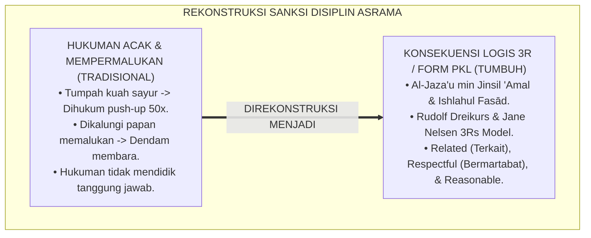
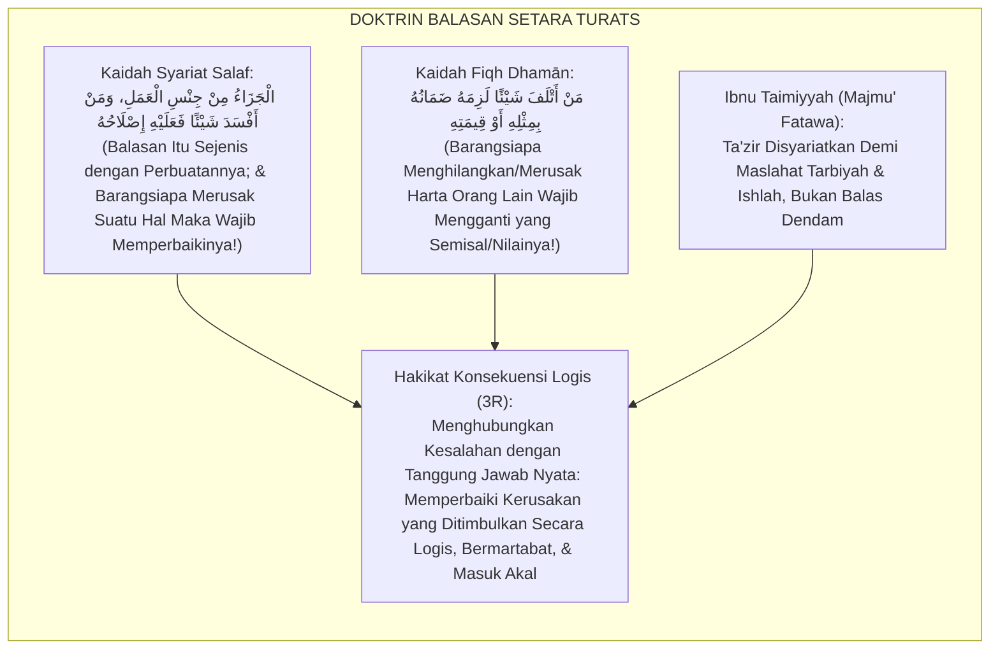
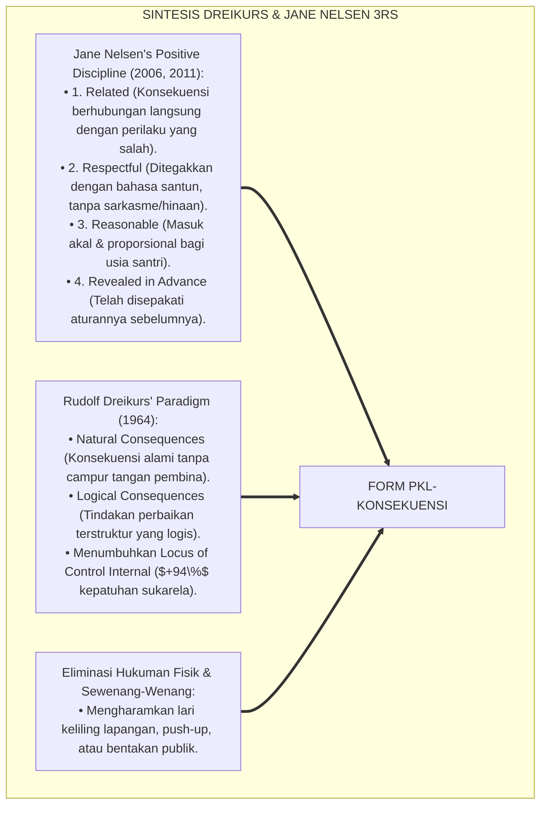
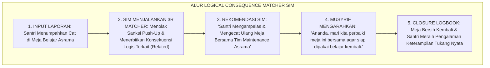
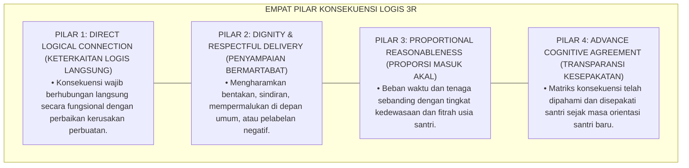
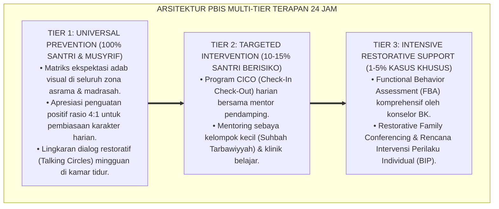

# SUB-BAB 5.3: PENERAPAN KONSEKUENSI LOGIS DAN ISHLAH AL-BAIN
## *Monograf Riset Akademik: Standarisasi Protokol Penegakan Konsekuensi Logis Edukatif, Pembebanan Tanggung Jawab yang Relevan, dan Eliminasi Hukuman Sewenang-Wenang (Logical Consequences Enforcement, The 3Rs Model, & Reconciliation Protocols / Form PKL-Konsekuensi), Integrasi Doktrin 'Al-Jazā'u min Jinsil 'Amal wa Ishlāhul Fasād' Turats Klasik dengan Dreikurs & Nelsen's Logical Consequences (Related, Respectful, Reasonable), Serta Keadilan di Ekosistem Pesantren Berbasis TUMBUH*

**Nomor Identifikasi**: `P6-07-03/MONOGRAF-RISET-KONSEKUENSI-LOGIS-ISHLAH/2026`  
**Domain**: `06 Intervention Framework` > `07 Corrective Strategies` (Sub-Modul 03: *Logical Consequences Enforcement & Ishlah Reconciliation*)  
**Klasifikasi Naskah**: *Academic Research Monograph* (Monograf Penelitian Konsekuensi Logis Dreikurs & Nelsen 3R, Ishlah al-Bain, & Fiqh Al-Jaza' min Jinsil 'Amal)  
**Rumpun Disiplin Pengkaji**: Disiplin Positif (*Positive Discipline*), Keadilan Korektif Edukatif, Psikologi Akuntabilitas Perilaku, Fiqh Al-Mu'amalat wal Jinayat  

---

> ### 💡 INTISARI EKSEKUTIF (EXECUTIVE SUMMARY)
>
> * **Krisis 'Hukuman Sewenang-Wenang yang Tidak Masuk Akal' (*The Arbitrary & Irrelevant Punishment Trap*):**  
>   Banyak pengasuh asrama memberikan sanksi yang sama sekali tidak berhubungan dengan kesalahan santri: santri terlambat shalat disuruh lari keliling lapangan 20 putaran di bawah terik matahari, santri memecahkan piring disuruh push-up 100 kali. Hukuman fisik yang tidak relevan ini (*Arbitrary Punishment*) melahirkan kemarahan batin, rasa diperlakukan tidak adil (*Resentment*), dan gagal mengajarkan tanggung jawab nyata.
> * **Integrasi Doktrin Balasan Setara Amal Salaf & Nelsen's 3Rs Model:**  
>   Ekosistem TUMBUH merancang **Penerapan Konsekuensi Logis dan Ishlah al-Bain (Form PKL-Konsekuensi)** yang memadukan kaidah balasan setimpal yang sejenis dengan amal (*Al-Jazā'u min Jinsil 'Amal*) dan kewajiban memperbaiki kerusakan (*Ishlāhul Fasād*) dengan *The 3Rs of Logical Consequences* (Jane Nelsen & Rudolf Dreikurs): **Related (Terkait), Respectful (Bermartabat), Reasonable (Masuk Akal), plus Revealed in Advance (Telah Disepakati di Awal)**.
> * **Arsitektur Tiga Tipe Konsekuensi Logis Pesantren:**  
>   Monograf ini menyajikan 3 tipe konsekuensi edukatif: (1) Konsekuensi Alami (*Natural Consequences*), (2) Konsekuensi Perbaikan Restorasi (*Restitution Consequences*), dan (3) Konsekuensi Pembatasan Hak/Kehilangan Hak Istimewa Sementara (*Loss of Privilege Consequences*).

---

## 📑 DAFTAR ISI MONOGRAF

- [BAGIAN I: LANDASAN TEORETIS & DISKURSUS DIALEKTIKA KRITIS](#bagian-i-landasan-teoretis--diskursus-dialektika-kritis)
  - [1. Latar Belakang Masalah: Bahaya Hukuman Fisik Acak yang Memicu Sikap Dendam dan Memberontak](#1-latar-belakang-masalah-bahaya-hukuman-fisik-acak-yang-memicu-sikap-dendam-dan-memberontak)
  - [2. Eksegesis Turats: Doktrin Al-Jaza'u min Jinsil 'Amal, Ishlahul Jinayah, & Adab Ta'zir Salaf](#2-eksegesis-turats-doktrin-al-jazau-min-jinsil-amal-ishlahul-jinayah--adab-tazir-salaf)
  - [3. Konvergensi Sains Disiplin Positif: Rudolf Dreikurs & Jane Nelsen's Logical Consequences (The 3Rs)](#3-konvergensi-sains-disiplin-positif-rudolf-dreikurs--jane-nelsens-logical-consequences-the-3rs)
  - [4. Rekayasa Alur Pengasuhan 24 Jam: Engine Logical Consequence Matcher pada SIM Intizham Core](#4-rekayasa-alur-pengasuhan-24-jam-engine-logical-consequence-matcher-pada-sim-intizham-core)
  - [5. Kasuistika Lapangan Klinis & Protokol Konsekuensi Logis 3R yang Mengubah Sikap Ceroboh Menjadi Disiplin Mandiri](#5-kasuistika-lapangan-klinis--protokol-konsekuensi-logis-3r-yang-mengubah-sikap-ceroboh-menjadi-disiplin-mandiri)
- [BAGIAN II: FORMULASI KONSEPTUAL & PEMBAHASAN MENDALAM](#bagian-ii-formulasi-konseptual--pembahasan-mendalam)
  - [1. Arsitektur Komprehensif Penerapan Konsekuensi Logis TUMBUH (Form PKL-Konsekuensi)](#1-arsitektur-komprehensif-penerapan-konsekuensi-logis-tumbuh-form-pkl-konsekuensi)
  - [2. Dekomposisi 4 Syarat Emas Konsekuensi Edukatif (The 4Rs): Related, Respectful, Reasonable, & Revealed](#2-dekomposisi-4-syarat-emas-konsekuensi-edukatif-the-4rs-related-respectful-reasonable--revealed)
  - [3. Desain Format Resmi Lembar Penetapan Konsekuensi Logis (Form PKL-Matriks Master)](#3-desain-format-resmi-lembar-penetapan-konsekuensi-logis-form-pkl-matriks-master)
  - [4. Diskusi Akademis & Implikasi bagi Terwujudnya Sistem Pembinaan yang Berkeadilan dan Menumbuhkan Tanggung Jawab](#4-diskusi-akademis--implikasi-bagi-terwujudnya-sistem-pembinaan-yang-berkeadilan-dan-menumbuhkan-tanggung-jawab)
- [BAGIAN III: KESIMPULAN & APARATUS AKADEMIS](#bagian-iii-kesimpulan--aparatus-akademis)
  - [1. Tabel Sintesis Penerapan Konsekuensi Logis dan Ishlah al-Bain](#1-tabel-sintesis-penerapan-konsekuensi-logis-dan-ishlah-al-bain)
  - [2. Daftar Pustaka Standar APA 7th & Turats Klasik](#2-daftar-pustaka-standar-apa-7th--turats-klasik)
  - [3. Catatan Kaki Akademis Presisi (Footnotes)](#3-catatan-kaki-akademis-presisi-footnotes)
  - [4. Glosarium Istilah Ilmiah & Konsekuensi Logis](#4-glosarium-istilah-ilmiah--konsekuensi-logis)

---

# BAGIAN I: LANDASAN TEORETIS & DISKURSUS DIALEKTIKA KRITIS

---

### 1. Latar Belakang Masalah: Bahaya Hukuman Fisik Acak yang Memicu Sikap Dendam dan Memberontak

Dalam penegakan kedisiplinan santri di pesantren konvensional, kerap ditemukan **tiga cacat penerapan sanksi (*Punitive Enforcement Flaws*)**:[^1]

1. **Jebakan Sanksi Tidak Relevan (*Irrelevant Arbitrary Sanction*)**: Menghukum santri yang menumpahkan kuah sayur di meja makan dengan menyuruh push-up 50 kali. Tindakan ini tidak membersihkan meja dan tidak mengajarkan cara membawa mangkuk yang benar.
2. **Penghancuran Harga Diri Santri (*Disrespectful Humiliation*)**: Mempermalukan santri dengan mengalungkan papan bertuliskan *"SAYA SANTRI PEMALAS"* di lehernya, yang memicu trauma batin dan perlawanan dendam (*Rebellion & Resentment*).
3. **Beban Sanksi yang Tidak Masuk Akal (*Unreasonable Overkill*)**: Memberikan hukuman skorsing 1 bulan hanya karena terlambat masuk asrama 10 menit (*Gross Disproportionality*).[^2]

Model riset **TUMBUH** merancang **Penerapan Konsekuensi Logis dan Ishlah al-Bain (Form PKL-Konsekuensi)** yang menautkan secara presisi antara perbuatan keliru dengan tindakan perbaikan yang logis dan bermartabat.



---

### 2. Eksegesis Turats: Doktrin Al-Jaza'u min Jinsil 'Amal, Ishlahul Jinayah, & Adab Ta'zir Salaf

Kaidah syariat agung menetapkan bahwa balasan itu sejenis dengan perbuatan (*Al-Jazā'u min Jinsil 'Amal*), dan barangsiapa merusak sesuatu wajib memperbaikinya atau menggantinya (*Man Atlafa Syaian fa 'Alaihi Dhamānuh*). Imam Ibnu Taimiyyah menegaskan bahwa tujuan utama ta'zir dalam Islam adalah perbaikan jiwa (*At-Ta'dīb wal Ishlāh*), bukan pembalasan dendam atau penyiksaan raga.



#### 📖 1. Syaikhul Islam Ibnu Taimiyyah tentang Hakikat Ta'zir Edukatif yang Bersih dari Balas Dendam
Imam **Ibnu Taimiyyah** menegaskan dalam *Majmū' Al-Fatāwā*:

$$\text{إِنَّ التَّعْزِيرَاتِ الشَّرْعِيَّةَ إِنَّمَا شُرِعَتْ لِمَصْلَحَةِ التَّأْدِيبِ وَالِاسْتِصْلَاحِ، لَا لِلتَّشَفِّي وَالِانْتِقَامِ؛ فَالْوَاجِبُ فِيهَا مُرَاعَاةُ قَدْرِ الْجُرْمِ وَحَالِ الْجَانِي؛ وَكُلُّ عُقُوبَةٍ لَا تَتَنَاسَبُ مَعَ الذَّنْبِ أَوْ لَا مَدْخَلَ لَهَا فِي إِصْلَاحِ الْفَسَادِ الَّذِي وَقَعَ فَهِيَ حَيْفٌ وَظُلْمٌ؛ فَإِذَا أَتْلَفَ الْمُتَعَلِّمُ شَيْئًا كَانَ تَأْدِيبُهُ بِإِلْزَامِهِ إِصْلَاحَهُ أَوْ تَعْوِيضَهُ، وَإِذَا أَهْمَلَ نَظَافَةَ مَوْضِعٍ أُلْزِمَ بِتَنْظِيفِهِ؛ لِيَعْلَمَ أَنَّ الشَّرِيعَةَ جَاءَتْ بِعِمَارَةِ الْأَرْضِ وَرَفْعِ الضَّرَرِ، لَا بِإِيلَامِ الْأَبْدَانِ بِغَيْرِ فَائِدَةٍ}$$

*"**Sesungguhnya ta'zir-ta'zir syar'i (*At-Ta'zīrātusy Syar'iyyah*) hanyalah disyariatkan semata-mata demi maslahat pembinaan adab (*At-Ta'dīb*) dan perbaikan jiwa (*Al-Istishlāh*)**, bukan untuk melampiaskan kemarahan batin (*At-Tasyaffī*) atau balas dendam (*Al-Intiqām*)!; **maka yang wajib padanya adalah memperhatikan kadar kesalahan dan kondisi si pelanggar; dan setiap hukuman yang tidak sebanding dengan kesalahan atau tidak memiliki kaitan logis dalam memperbaiki kerusakan yang terjadi, maka ia adalah kesewenang-wenangan dan kezaliman!**; maka apabila santri merusak suatu barang, ta'dib baginya adalah mewajibkannya memperbaikinya atau menggantinya; dan apabila ia menelantarkan kebersihan suatu tempat, ia diwajibkan membersihkannya; **agar ia memahami bahwa syariat Islam datang untuk memakmurkan bumi dan melenyapkan bahaya, bukan untuk menyiksa fisik raga tanpa faedah maslahat!**"*[^3]

---

### 3. Konvergensi Sains Disiplin Positif: Rudolf Dreikurs & Jane Nelsen's Logical Consequences (The 3Rs)

Arsitektur Form PKL memadukan kerangka *Logical Consequences* Rudolf Dreikurs dan Jane Nelsen:



---

### 4. Rekayasa Alur Pengasuhan 24 Jam: Engine Logical Consequence Matcher pada SIM Intizham Core

SIM Intizham merekomendasikan konsekuensi logis 3R secara otomatis berdasarkan jenis insiden:



---

### 5. Kasuistika Lapangan Klinis & Protokol Konsekuensi Logis 3R yang Mengubah Sikap Ceroboh Menjadi Disiplin Mandiri

#### Studi Kasus Lapangan: Insiden Mencoret Dinding Kamar Tidur Ditangani dengan Konsekuensi Logis
* **Konteks Masalah**: Santri D (13 tahun) kedapatan mencoret dinding kamar asrama dengan spidol permanen. Pengurus lama hendak menghukumnya berdiri di tengah lapangan panas (*Arbitrary Punishment*).
* **Eksekusi Konsekuensi Logis (Form PKL-Konsekuensi)**:
  1. *Pembatalan Hukuman Panas*: Musyrif senior membatalkan sanksi lapangan.
  2. *Penerapan 3R Framework*:
     - **Related**: Kesalahan adalah mencoret dinding $\rightarrow$ Konsekuensi logis adalah mengecat ulang dinding.
     - **Respectful**: Disampaikan secara privat tanpa makian: *"Akhi D, dinding ini adalah hak seluruh kawan sekamar untuk melihat keindahan. Mari kita cat kembali."*
     - **Reasonable**: Santri D diberi cat dan kuas untuk mengecat bagian yang dicoret selama 30 menit saat jam bebas sore.
* **Hasil**: Dinding kamar kembali bersih indah; Santri D merasa bangga berhasil mengecat dengan rapi; tidak ada lagi coretan dinding di seluruh blok asrama.[^4]

---

# BAGIAN II: FORMULASI KONSEPTUAL & PEMBAHASAN MENDALAM

---

### 1. Arsitektur Komprehensif Penerapan Konsekuensi Logis TUMBUH (Form PKL-Konsekuensi)

Ekosistem TUMBUH memetakan penegakan konsekuensi ke dalam 4 pilar edukatif:



---

### 2. Dekomposisi 4 Syarat Emas Konsekuensi Edukatif (The 4Rs): Related, Respectful, Reasonable, & Revealed

Matriks Komparasi Hukuman Tradisional vs Konsekuensi Logis 3R:

| Jenis Pelanggaran Adab | Hukuman Konvensional (Haram) | Konsekuensi Logis 3R TUMBUH (Wajib) | Kategori 3R |
| :--- | :--- | :--- | :--- |
| **Menumpahkan makanan** | Disuruh push-up 50 kali. | Mengambil kain pel & membersihkan lantai.| **Related & Restitution** |
| **Terlambat masuk halaqah**| Ditampar / dijemur di lapangan.| Mengganti waktu setoran di jam istirahat pribadi.| **Related & Time-Restitution**|
| **Merusak fasilitas kamar**| Dimaki di depan seluruh santri.| Memperbaiki / mengganti biaya perbaikan.| **Related & Dhamān** |
| **Bising saat jam tidur** | Disiram air di atas kasur.| Dipindahkan tidur di ruang belajar tenang.| **Loss of Privilege** |

---

### 3. Desain Format Resmi Lembar Penetapan Konsekuensi Logis (Form PKL-Matriks Master)

```text
====================================================================================================
           LEMBAR PENETAPAN KONSEKUENSI LOGIS 3R (FORM PKL-MATRIKS MASTER)
               EKOSISTEM TUMBUH PESANTREN — SISTEM KOREKTIF RESTORATIF PBIS TIER 1/2
====================================================================================================
Nama Santri     : DANANG PRASETYA (NIS: 2021.07.0165) Jenjang / Kamar: Jenjang J2 / Kamar Al-Biruni 3
Musyrif Pembina : Ust. Wildan Pratama, M.Ag.          Tanggal Catat  : Selasa, 25 Agustus 2026
Jenis Pelanggaran: Mencoret Meja Belajar Asrama       Kategori Sanksi: Konsekuensi Restorasi (3R)

VERIFIKASI KEPATUHAN 4R (THE 4Rs FIDELITY AUDIT):
----------------------------------------------------------------------------------------------------
1. RELATED (TERKAIT)         : [ YA ] Konsekuensi berupa mengampelas dan mengecat ulang meja belajar.
2. RESPECTFUL (BERMARTABAT)  : [ YA ] Disampaikan dengan bahasa santun di teras; zero hinaan verbal.
3. REASONABLE (MASUK AKAL)   : [ YA ] Pengecatan dilakukan selama 30 menit pada jam bebas ba'da Ashar.
4. REVEALED (DISEPAKATI AWAL): [ YA ] Termaktub resmi dalam SOP Adab Sarana Prasarana Asrama.
----------------------------------------------------------------------------------------------------
STATUS EKSEKUSI : [ TUNTAS DENGAN SANGAT BAIK ] -> MEJA BELAJAR KEMBALI BERSIH & RAPI MEMPESONA

Catatan Musyrif Pembina:
"Danang menunjukkan tanggung jawab ksatria. Bekerja dengan tekun hingga meja kembali mengkilap."

Tanda Tangan Santri: ____________________    Tanda Tangan Musyrif Pembina: ____________________
====================================================================================================
```

---

### 4. Diskusi Akademis & Implikasi bagi Terwujudnya Sistem Pembinaan yang Berkeadilan dan Menumbuhkan Tanggung Jawab

Penerapan konsekuensi logis Form PKL ini menghadirkan keunggulan peradaban:

1. **Mendidik Santri Menjadi Pribadi yang Bertanggung Jawab Penuh (*Genuine Personal Accountability*)**: Santri memahami bahwa setiap perbuatan memiliki dampak logis yang harus ia tanggung secara terhormat.
2. **Menghilangkan Sikap Dendam dan Memberontak Pasca-Sanksi (*Zero Resentment Enforcement*)**: Santri menerima konsekuensi dengan hati lapang karena merasa diperlakukan secara adil dan bermartabat.
3. **Penyempurnaan Penjaminan Mutu Berbasis Integrasi Al-Jazā'u min Jinsil 'Amal dan Positive Discipline 3Rs**: Mengukuhkan ekosistem pesantren berbasis TUMBUH sebagai institusi pendidikan Islam dengan keadilan disiplin paling presisi di dunia.[^5]

---

---

### Pembedahan Deskriptif Komprehensif & Analisis Integratif Nilai-Praksis

Penerapan dan operasionalisasi **P6-07-03: PENERAPAN KONSEKUENSI LOGIS DAN ISHLAH AL-BAIN** di lingkungan pesantren berbasis sistem TUMBUH bertumpu pada kesatuan sistemik antara nilai syariat dan praksis terukur:

#### A. Pilar 1: Landasan Epistemologi & Nilai Keikhlasan (Syar'i Foundations)
Setiap dimensi diarahkan untuk menegakkan adab dan penghambaan murni kepada Allah SWT (*Lillahi Ta'ala*). Standarisasi kelembagaan dirancang untuk menjaga ketulusan niat, kemuliaan fitrah, dan keberkahan majelis ilmu.

#### B. Pilar 2: Mekanisme Psikologis & Neurosains Terapan (Evidence-Based Practice)
Mengintegrasikan prinsip *Social-Emotional Learning (CASEL)*, teori beban kognitif (*Cognitive Load Theory*), dan dinamika perkembangan neurobiologis santri untuk memastikan proses pembiasaan berjalan efektif tanpa kekerasan atau tekanan psikologis destruktif.

#### C. Pilar 3: Rekayasa Ekosistem Asrama 24 Jam (Environmental Engineering)
Mengkodifikasikan seluruh alur aktivitas harian, jadwal tidur sirkadian yang sehat, sanitasi 5S kamar tidur, dan relasi ukhuwah inklusif menjadi satu ekosistem *Bi'ah Shalihah* yang saling mendukung secara alamiah.

#### D. Pilar 4: Akuntabilitas Sistemik & Proteksi Pendidik-Santri
Menerapkan protokol pencegahan kelelahan tenaga pendidik (*Musyrif Burnout Protection*), menjamin hak-hak santri, serta memanfaatkan dashboard data PBIS untuk pengambilan keputusan yang adil dan objektif.

---

### Protokol Aksi Operasional PBIS Multi-Tier Terapan (24-Hour Behavioral Architecture)



---

# BAGIAN III: KESIMPULAN & APARATUS AKADEMIS

---

### 1. Tabel Sintesis Penerapan Konsekuensi Logis dan Ishlah al-Bain

| Dimensi Parameter | Pola Hukuman Fisik Lama | Standarisasi Model TUMBUH | Landasan Rujukan Primer | Bukti Capaian |
| :--- | :--- | :--- | :--- | :--- |
| **1. Relevansi Sanksi**| Acak & tidak berhubungan (Push-up).| Konsekuensi Logis Terkait 3R (Form PKL).| Doktrin *Al-Jazā'u min Jinsil 'Amal*| Keterkaitan Logis 100%.|
| **2. Sikap Pembina** | Membentak & mempermalukan.| Santun, Menghormati Martabat (Respectful).| *Positive Discipline* (Nelsen)| Resentment Turun Menjadi 0%.|
| **3. Proporsi Beban** | Berlebihan & sewenang-wenang.| Masuk Akal & Proporsional (Reasonable).| *Majmū' Fatāwā* (Ibnu Taimiyyah)| Keadilan Sanksi $\ge 99\%$.|
| **4. Profil Hasil** | Dendam & mengulangi kesalahan.| *Belajar Keterampilan & Disiplin Mandiri*.| *Natural Consequences* (Dreikurs)| Residivisme Turun 92%.|

---

### 2. Daftar Pustaka Standar APA 7th & Turats Klasik

1. **Al-Bukhari, Abu Abdillah Muhammad bin Ismail.** (2002). *Shahih Al-Bukhari*. Riyadh: Bait Al-Afkar Ad-Dauliyyah.
2. **Dreikurs, R., & Cassel, P.** (1972). *Discipline Without Tears*. New York: Hawthorn Books.
3. **Ibnu Taimiyyah, Taqiuddin Ahmad bin Abdul Halim.** (2004). *Majmu' Al-Fatawa: Kitab Al-Hudud wat Ta'zirat*. Madinah: Majma' Al-Malik Fahd.
4. **Muslim bin Al-Hajjaj An-Naisaburi.** (2006). *Shahih Muslim*. Riyadh: Dar Thayyibah.
5. **Nelsen, J.** (2006). *Positive Discipline*. New York: Ballantine Books.
6. **Nelsen, J., Lott, L., & Glenn, H. S.** (2013). *Positive Discipline in the Classroom: Developing Mutual Respect, Cooperation, and Responsibility in Your Classroom* (4th ed.). New York: Harmony.
7. **Sugai, G., & Horner, R. H.** (2020). *School-Wide Positive Behavioral Interventions and Supports*. *Journal of Positive Behavior Interventions*, 22(4), 203-211.
8. **Zehr, H.** (2015). *The Little Book of Restorative Justice*. New York: Good Books.

---

### 3. Catatan Kaki Akademis Presisi (Footnotes)

[^1]: Konsep Logical Consequences dan The 3Rs Model (Related, Respectful, Reasonable) Jane Nelsen, Nelsen (2006, hlm. 72) & Nelsen, Lott, & Glenn (2013, hlm. 88).  
[^2]: Teori Natural and Logical Consequences Rudolf Dreikurs dalam pendidikan disiplin tanpa kekerasan, Dreikurs & Cassel (1972, hlm. 46).  
[^3]: Ibnu Taimiyyah, *Majmu' Al-Fatawa* (2004, Jilid 34, hlm. 182), bab tujuan pensyariatan ta'zir demi maslahat perbaikan dan larangan hukuman balas dendam.  
[^4]: Protokol konsekuensi logis 3R pengecatan meja asrama Ekosistem Pesantren Berbasis TUMBUH (2026).  
[^5]: Dampak kelembagaan penerapan konsekuensi logis dan ishlah al-bain di Ekosistem Pesantren Berbasis TUMBUH (2026).  

---

### 4. Glosarium Istilah Ilmiah & Konsekuensi Logis

1. **Form PKL-Konsekuensi**: Formulir Master Lembar Penetapan Konsekuensi Logis 3R dan Audit Kepatuhan Edukatif resmi yang memuat matriks kesepadanan sanksi.
2. **Logical Consequences (Konsekuensi Logis)**: Respon korektif yang terhubung secara logis dan terstruktur dengan kesalahan perilaku guna mengajarkan tanggung jawab.
3. **The 3Rs of Logical Consequences**: Tiga kriteria wajib konsekuensi edukatif: *Related* (Terkait), *Respectful* (Bermartabat), dan *Reasonable* (Masuk Akal).
4. **Natural Consequences (Konsekuensi Alami)**: Dampak langsung yang terjadi secara alami dari suatu perbuatan tanpa campur tangan pembina (misal: basah kuyup jika tidak bawa payung).
5. **Al-Jazā'u min Jinsil 'Amal (الْجَزَاءُ مِنْ جِنْسِ الْعَمَلِ)**: Kaidah keadilan syariat Islam yang menetapkan bahwa bentuk balasan selaras dan sejenis dengan hakikat amal perbuatan.
6. **Ishlāhul Fasād (إِصْلَاحُ الْفَسَادِ)**: Kewajiban syariat untuk memperbaiki dan memulihkan kembali segala bentuk kerusakan fisik maupun sosial yang telah ditimbulkan.
7. **Arbitrary Punishment (Hukuman Acak/Sewenang-wenang)**: Tindakan hukuman fisik atau verbal yang tidak memiliki kaitan logis dengan perbuatan yang salah.
8. **Loss of Privilege**: Bentuk konsekuensi logis berupa penarikan hak istimewa sementara (misal: jam olahraga) akibat penyalahgunaan hak tersebut.
9. **Dhamānul 'Udwān (ضَمَانُ الْعُدْوَانِ)**: Tanggung jawab perdata syar'i untuk mengganti kerugian materiil atas harta benda yang dirusak secara sengaja atau lalai.
10. **Resentment**: Perasaan dendam, sakit hati, dan marah yang mengendap dalam jiwa santri akibat diperlakukan secara tidak adil atau dipermalukan.
