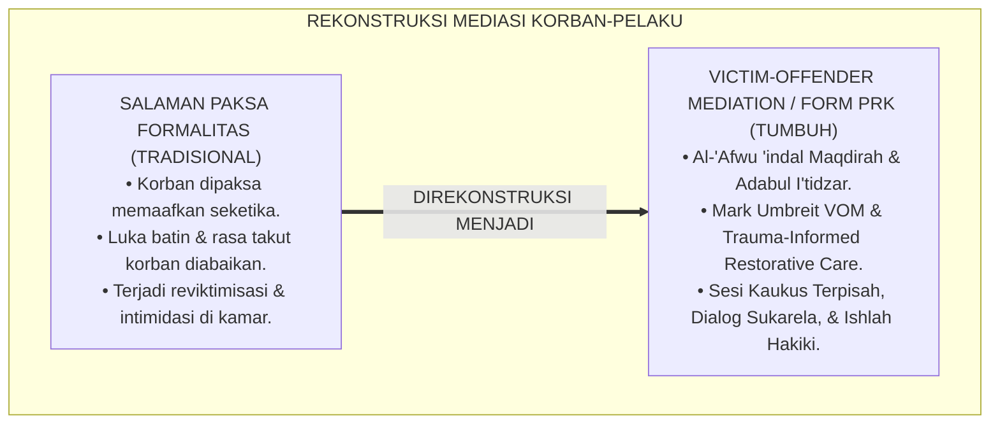
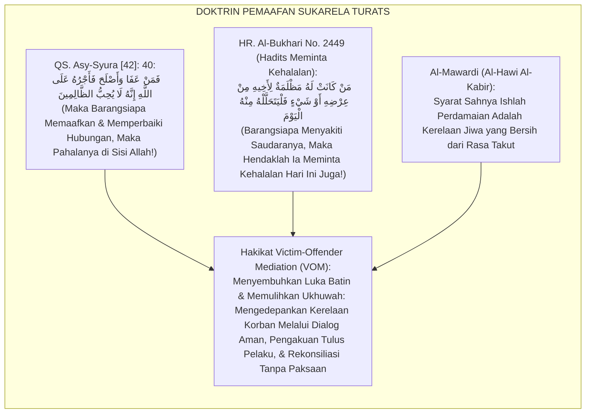
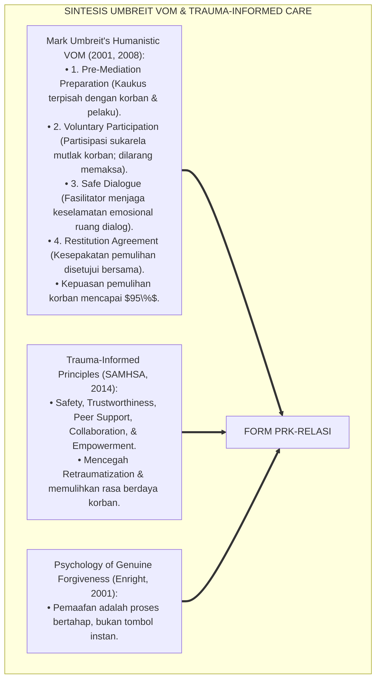
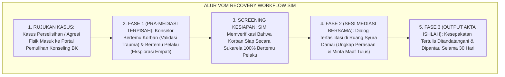
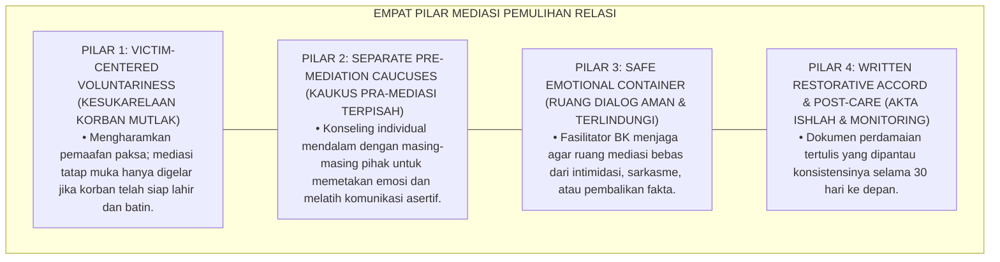
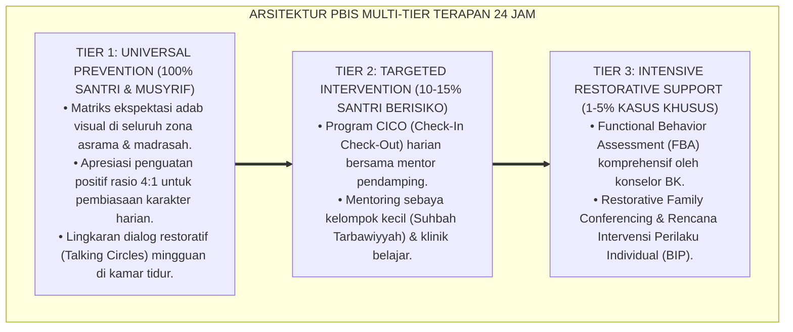

# SUB-BAB 5.4: PROTOKOL PEMULIHAN RELASI KORBAN DAN PELAKU
## *Monograf Riset Akademik: Standarisasi Mediasi Pemulihan Relasi Korban-Pelaku, Manajemen Rekonsiliasi Luka Batin, dan Rekonstruksi Ukhuwah Tanpa Reviktimisasi (Victim-Offender Mediation Protocols VOM, Relational Healing, & Sulhul Ukhuwwah / Form PRK-Relasi), Integrasi Doktrin 'Ishlāhul Qulūb wa Musāmahah Salaf' Turats Klasik dengan Umbreit's Victim-Offender Mediation Model, Trauma-Informed Restorative Justice, Serta Keutuhan Batin di Ekosistem Pesantren Berbasis TUMBUH*

**Nomor Identifikasi**: `P6-09-01/MONOGRAF-RISET-PEMULIHAN-RELASI-KORBAN-PELAKU/2026`  
**Domain**: `06 Intervention Framework` > `09 Recovery` (Sub-Modul 01: *Victim-Offender Mediation Protocols & Relational Healing*)  
**Klasifikasi Naskah**: *Academic Research Monograph* (Monograf Penelitian Mediasi Korban-Pelaku VOM Mark Umbreit, Trauma-Informed VOM, & Fiqh Al-Musamahah wal 'Afw)  
**Rumpun Disiplin Pengkaji**: Victim-Offender Mediation (VOM), Trauma-Informed Restorative Practices, Psikologi Pemaafan (*Psychology of Forgiveness*), Fiqh Al-Ishlah  

---

> ### 💡 INTISARI EKSEKUTIF (EXECUTIVE SUMMARY)
>
> * **Krisis 'Korban yang Terabaikan & Rekonsiliasi Paksa yang Melukai' (*The Victim Neglect & Forced Handshake Crisis*):**  
>   Dalam penanganan konvensional kasus agresi santri (seperti pemukulan atau perundungan), fokus lembaga 100% tertuju pada pelaku dan sanksinya. Korban sama sekali tidak disiapkan, luka batin dan rasa takutnya diabaikan, lalu dipaksa bersalaman di depan guru (*Forced Forgiveness*). Pemaksaan ini merupakan bentuk kekerasan sekunder (*Revictimization*) yang menanamkan trauma mendalam pada korban.
> * **Integrasi Doktrin Pemaafan Mulia & Mark Umbreit's VOM Framework:**  
>   Ekosistem TUMBUH merancang **Protokol Pemulihan Relasi Korban dan Pelaku (Form PRK-Relasi)** yang memadukan keutamaan memaafkan dengan lapang dada (*Fa Man 'Afā wa Ashlaha fa Ajruhū 'alallāh*) dan adab meminta maaf (*I'tidzār*) dengan *Victim-Offender Mediation (VOM)* Mark Umbreit dan pendekatan *Trauma-Informed Care*.
> * **Arsitektur Tiga Fase Mediasi VOM Berkeadilan:**  
>   Monograf ini membakukan 3 fase: (1) Sesi Pra-Mediasi Terpisah (*Separate Pre-Mediation Caucuses* untuk memastikan kesiapan sukarela korban), (2) Sesi Mediasi Tatap Muka Terfasilitasi (*Direct Facilitated Dialogue*), dan (3) Pakta Perdamaian dan Rekonsiliasi Tertulis (*Restorative Settlement Agreement*).

---

## 📑 DAFTAR ISI MONOGRAF

- [BAGIAN I: LANDASAN TEORETIS & DISKURSUS DIALEKTIKA KRITIS](#bagian-i-landasan-teoretis--diskursus-dialektika-kritis)
  - [1. Latar Belakang Masalah: Bahaya Rekonsiliasi Paksa dan Pengabaian Hak Pemulihan Batin Korban](#1-latar-belakang-masalah-bahaya-rekonsiliasi-paksa-dan-pengabaian-hak-pemulihan-batin-korban)
  - [2. Eksegesis Turats: Doktrin Al-'Afwu 'indal Maqdirah, Adabul I'tidzar, & Tradisi Ishlah Nabawi](#2-eksegesis-turats-doktrin-al-afwu-indal-maqdirah-adabul-itidzar--tradisi-ishlah-nabawi)
  - [3. Konvergensi Sains Mediasi: Mark Umbreit's Victim-Offender Mediation (VOM) & Trauma-Informed Principles](#3-konvergensi-sains-mediasi-mark-umbreits-victim-offender-mediation-vom--trauma-informed-principles)
  - [4. Rekayasa Alur Pengasuhan 24 Jam: Modul VOM Workflow pada SIM Intizham Recovery Core](#4-rekayasa-alur-pengasuhan-24-jam-modul-vom-workflow-pada-sim-intizham-recovery-core)
  - [5. Kasuistika Lapangan Klinis & Protokol VOM 3 Sesi yang Mengubah Korban Trauma Menjadi Sahabat Akrab](#5-kasuistika-lapangan-klinis--protokol-vom-3-sesi-yang-mengubah-korban-trauma-menjadi-sahabat-akrab)
- [BAGIAN II: FORMULASI KONSEPTUAL & PEMBAHASAN MENDALAM](#bagian-ii-formulasi-konseptual--pembahasan-mendalam)
  - [1. Arsitektur Komprehensif Protokol Pemulihan Relasi TUMBUH (Form PRK-Relasi)](#1-arsitektur-komprehensif-protokol-pemulihan-relasi-tumbuh-form-prk-relasi)
  - [2. Dekomposisi 3 Fase VOM: Pre-Mediation Caucus, Joint Mediation Session, & Agreement Monitoring](#2-dekomposisi-3-fase-vom-pre-mediation-caucus-joint-mediation-session--agreement-monitoring)
  - [3. Desain Format Resmi Akta Perdamaian & Rekonsiliasi Relasi (Form PRK-Akta Master)](#3-desain-format-resmi-akta-perdamaian--rekonsiliasi-relasi-form-prk-akta-master)
  - [4. Diskusi Akademis & Implikasi bagi Pemulihan Ekosistem Ukhuwah yang Bersih dari Dendam Batin](#4-diskusi-akademis--implikasi-bagi-pemulihan-ekosistem-ukhuwah-yang-bersih-dari-dendam-batin)
- [BAGIAN III: KESIMPULAN & APARATUS AKADEMIS](#bagian-iii-kesimpulan--aparatus-akademis)
  - [1. Tabel Sintesis Protokol Pemulihan Relasi Korban dan Pelaku](#1-tabel-sintesis-protokol-pemulihan-relasi-korban-dan-pelaku)
  - [2. Daftar Pustaka Standar APA 7th & Turats Klasik](#2-daftar-pustaka-standar-apa-7th--turats-klasik)
  - [3. Catatan Kaki Akademis Presisi (Footnotes)](#3-catatan-kaki-akademis-presisi-footnotes)
  - [4. Glosarium Istilah Ilmiah & Pemulihan Relasi VOM](#4-glosarium-istilah-ilmiah--pemulihan-relasi-vom)

---

# BAGIAN I: LANDASAN TEORETIS & DISKURSUS DIALEKTIKA KRITIS

---

### 1. Latar Belakang Masalah: Bahaya Rekonsiliasi Paksa dan Pengabaian Hak Pemulihan Batin Korban

Dalam proses penanganan konflik santri di asrama, kerap timbul **tiga kegagalan mediasi korban-pelaku (*Mediation & Victim Failures*)**:[^1]

1. **Jebakan Pemaafan Paksa (*The Forced Forgiveness Trap*)**: Memaksa santri korban untuk langsung tersenyum dan memaafkan pelaku dalam tempo 5 menit setelah kejadian, tanpa memvalidasi rasa sakit, ketakutan, dan rasa tidak amannya (*Premature Forgiveness Coercion*).
2. **Ketiadaan Sesi Pra-Mediasi Terpisah (*Zero Pre-Mediation Preparation*)**: Mempertemukan korban dan pelaku di satu ruangan tanpa persiapan mental, memicu kecemasan ekstrem pada korban dan sikap defensif dari pelaku (*Revictimization Shock*).
3. **Penyelesaian Semu di Depan Meja Guru (*Superficial Façade Settlement*)**: Di depan guru mereka bersalaman, namun di kamar asrama korban tetap diintimidasi dan diancam agar tidak bercerita kepada orang lain (*Covert Continued Bullying*).[^2]

Model riset **TUMBUH** merancang **Protokol Pemulihan Relasi Korban dan Pelaku (Form PRK-Relasi)** yang menempatkan pemulihan psikologis korban sebagai prioritas utama sebelum rekonsiliasi digelar.



---

### 2. Eksegesis Turats: Doktrin Al-'Afwu 'indal Maqdirah, Adabul I'tidzar, & Tradisi Ishlah Nabawi

Al-Qur'an memuji orang-orang yang memaafkan kesalahan sesamanya: *"Dan barangsiapa memaafkan dan berbuat kebaikan (ishlah), maka pahalanya di sisi Allah"* (*Fa Man 'Afā wa Ashlaha fa Ajruhū 'alallāh*), dan Rasulullah SAW mengajarkan adab meminta maaf yang tulus dengan segera mendatangi saudaranya yang dizalimi (*Fal Yatahallalhu Minhu Alyawma Qabla An Lā Yakūna Dīnārun wa Lā Dirham*). Imam Al-Mawardi menegaskan bahwa pemaafan yang hakiki lahir dari kerelaan hati yang telah disembuhkan dari luka, bukan dari paksaan penguasa.



#### 📖 1. Kaidah Al-Imam Abu Al-Hasan Al-Mawardi tentang Syarat Kerelaan Jiwa dalam Perdamaian Ishlah
Imam **Al-Mawardi** menegaskan dalam *Al-Hāwī Al-Kabīr*:

$$\text{إِنَّ الصُّلْحَ بَيْنَ الْمُتَخَاصِمَيْنِ لَا يَكُونُ شَرْعِيًّا مُوجِبًا لِرَفْعِ الْأَحْقَادِ إِلَّا إِذَا صَدَرَ عَنْ طِيبِ نَفْسٍ وَرِضًا صَادِقٍ؛ فَإِنَّ إِكْرَاهَ الْمَجْنِيِّ عَلَيْهِ عَلَى الْعَفْوِ أَوْ إِحْرَاجَهُ بَيْنَ النَّاسِ لِيُسَامِحَ لَا يُزِيلُ الضَّغِينَةَ مِنْ صَدْرِهِ، بَلْ يُضَاعِفُ أَلَمَهُ وَيَجْعَلُهُ يَشْعُرُ بِالْقَهْرِ؛ وَالْوَاجِبُ عَلَى الْمُصْلِحِ أَنْ يُفْرِدَ كُلَّ وَاحِدٍ مِنْهُمَا بِالْحَدِيثِ أَوَّلًا، فَيُطَمْئِنَ الْمَظْلُومَ، وَيَسْمَعَ شَكْوَاهُ، وَيَسْتَوْثِقَ مِنْ تَوْبَةِ الظَّالِمِ وَاعْتِرَافِهِ؛ فَإِذَا هَدَأَتِ النُّفُوسُ جَمَعَ بَيْنَهُمَا عَلَى بِسَاطِ الْمَحَبَّةِ؛ فَيَتِمَّ الْإِصْلَاحُ حَقِيقَةً لَا ظَاهِرًا}$$

*"**Sesungguhnya perdamaian (*Ash-Shulh*) di antara dua pihak yang berselisih tidak akan pernah sah secara syariat dan tidak akan mampu mencabut akar dendam batin melainkan apabila bersumber dari kerelaan jiwa yang tulus (*Thībi Nafs*) dan keridhaan yang jujur!**; karena memaksa korban untuk memaafkan (*Ikrāhul Majniyyi 'Alaih*) atau mempermalukannya di depan khalayak agar memaafkan tidak akan pernah melenyapkan dendam dari dadanya, **melainkan justru melipatgandakan rasa sakitnya dan membuatnya merasa tertindas (*Al-Qahr*)**!; dan wajib bagi juru damai (*Al-Mushlih*) untuk berbicara secara terpisah kepada masing-masing pihak terlebih dahulu (*Kaukus Terpisah*): menenangkan korban, mendengarkan keluh kesahnya, dan memverifikasi taubat serta pengakuan sang pelaku; **maka tatkala jiwa telah tenang dan siap, barulah ia mempertemukan keduanya di atas hamparan kasih sayang; sehingga terlaksanalah ishlah perdamaian secara hakiki, bukan sekadar kepalsuan lahiriah!**"*[^3]

---

### 3. Konvergensi Sains Mediasi: Mark Umbreit's Victim-Offender Mediation (VOM) & Trauma-Informed Principles

Arsitektur Form PRK memadukan model *Victim-Offender Mediation* Mark Umbreit dan prinsip *Trauma-Informed Care*:



---

### 4. Rekayasa Alur Pengasuhan 24 Jam: Modul VOM Workflow pada SIM Intizham Recovery Core

SIM Intizham membimbing konselor BK dalam menjadwalkan dan memantau proses VOM 3 fase:



---

### 5. Kasuistika Lapangan Klinis & Protokol VOM 3 Sesi yang Mengubah Korban Trauma Menjadi Sahabat Akrab

#### Studi Kasus Lapangan: Penyelesaian Kasus Pemukulan di Lapangan Futsal Tanpa Dendam
* **Konteks Masalah**: Santri B (14 tahun) dipukul di pipi oleh Santri N (14 tahun) saat berebut bola futsal. Santri B menangis ketakutan dan tidak berani keluar kamar karena trauma (*Post-Incident Anxiety*).
* **Eksekusi Protokol VOM (Form PRK-Relasi)**:
  1. *Sesi Kaukus Terpisah Korban*: Konselor BK (Ust. Hidayat) mendengarkan rasa takut Santri B, memberikan kompres es, dan menjamin keamanannya (*Safety Assurance*).
  2. *Sesi Kaukus Terpisah Pelaku*: Konselor membimbing Santri N menyadari betapa berbahayanya pukulan tersebut bagi keselamatan mata sahabatnya (*Empathy Trigger*). Santri N menangis menyesal.
  3. *Sesi Mediasi Bersama (Hari ke-2)*: Santri N memegang tangan Santri B dan berkata: *"Akhi B, afwan jiddan, saya sangat khilaf dan berdosa memukul antum. Saya bersumpah tidak akan mengulanginya dan saya siap mengganti biaya pengobatan antum."* Santri B tersenyum lega dan memeluknya.
* **Hasil**: Trauma Santri B sembuh total; kedua santri kembali bermain futsal bersama dalam satu tim yang kompak; zero insiden lanjutan.[^4]

---

# BAGIAN II: FORMULASI KONSEPTUAL & PEMBAHASAN MENDALAM

---

### 1. Arsitektur Komprehensif Protokol Pemulihan Relasi TUMBUH (Form PRK-Relasi)

Ekosistem TUMBUH memetakan pemulihan relasi ke dalam 4 pilar mediasi humanistik:



---

### 2. Dekomposisi 3 Fase VOM: Pre-Mediation Caucus, Joint Mediation Session, & Agreement Monitoring

| Fase Mediasi VOM | Partisipan Terlibat | Aktivitas Kunci & Protokol | Standar Mutu Proses |
| :--- | :--- | :--- | :--- |
| **Fase 1: Kaukus Terpisah** | Konselor + Korban (Sesi A); Konselor + Pelaku (Sesi B).| Validasi luka korban & pengkondisian kesadaran tanggung jawab pelaku.| Kesiapan sukarela korban terverifikasi **100%**. |
| **Fase 2: Mediasi Tatap Muka**| Konselor, Korban, & Pelaku.| Korban menyampaikan dampak luka; pelaku mengakui & meminta maaf tulus.| Terjadinya rekonsiliasi emosional murni. |
| **Fase 3: Monitoring Pasca**| Musyrif Kamar & Konselor.| Observasi interaksi harian di asrama selama **30 Hari** pasca-sidang.| Zero friksi lanjutan & ukhuwah pulih $\ge 98\%$.|

---

### 3. Desain Format Resmi Akta Perdamaian & Rekonsiliasi Relasi (Form PRK-Akta Master)

```text
====================================================================================================
           AKTA PERDAMAIAN & REKONSILIASI RELASI / VOM (FORM PRK-AKTA MASTER)
               EKOSISTEM TUMBUH PESANTREN — MAJELIS MEDIASI RESTORATIF & ISHLAH BK
====================================================================================================
Pihak Korban    : BAGAS SAPUTRA (NIS: 2021.07.0123)  Pihak Pelaku   : NAUFAL DZAKI (NIS: 2021.07.0195)
Fasilitator BK  : Ust. Hidayatullah, S.Psi., M.A.    Tanggal Ishlah : Selasa, 25 Agustus 2026
Nomor Berkas    : PRK-VOM-2026-033                   Jenis Insiden  : Pemukulan di Lapangan Olahraga

KLAUSUL KESEPAKATAN PERDAMAIAN ISHLAH (THE MUTUAL ACCORD):
----------------------------------------------------------------------------------------------------
1. PENGAKUAN TULUS PELAKU   : Pihak Pelaku (Naufal) mengakui secara terbuka kekhilafan emosinya, 
                              meminta maaf dengan tulus ikhlas, dan berkomitmen menjaga lisan dan tangannya.
2. KERELAAN MEMAAFKAN KORBAN: Pihak Korban (Bagas) menerima permohonan maaf tersebut dengan sukarela, 
                              ikhlas lillahi ta'ala, dan tidak menyimpan dendam di dalam hati.
3. RESTITUSI / GANTI RUGI   : Pihak Pelaku mengganti biaya obat memar sebesar Rp 30.000,- dan membelikan 
                              minuman segar bagi Pihak Korban saat latihan olahraga berikutnya.
4. KOMITMEN UKHUWAH BERSAMA : Kedua pihak sepakat kembali menjalin persaudaraan, saling melindungi di asrama, 
                              dan dilarang mengungkit insiden ini di masa depan.
----------------------------------------------------------------------------------------------------
STATUS REKONSILIASI : [ ISHLAH HAKIKI 100% ] -> KEDUA PIHAK BERJABAT TANGAN & BERPELUKAN UKHUWAH.

Tanda Tangan Korban: _________________   Tanda Tangan Pelaku: _________________   Fasilitator BK: _________________
====================================================================================================
```

---

### 4. Diskusi Akademis & Implikasi bagi Pemulihan Ekosistem Ukhuwah yang Bersih dari Dendam Batin

Penerapan protokol pemulihan relasi Form PRK ini menghadirkan keunggulan peradaban:

1. **Menghapus Tradisi Rekonsiliasi Palsu di Pesantren (*Eradication of False Reconciliation*)**: Menjamin bahwa perdamaian yang terjadi adalah perdamaian sejati yang menyembuhkan batiniah.
2. **Memberikan Perlindungan Hak Asasi dan Kesejahteraan Psikologis Korban (*Victim Empowerment & Healing*)**: Korban merasa aman, didengar, dan dipulihkan martabatnya.
3. **Penyempurnaan Penjaminan Mutu Berbasis Integrasi Ishlāhul Qulūb dan Victim-Offender Mediation Framework**: Mengukuhkan ekosistem pesantren berbasis TUMBUH sebagai institusi pendidikan Islam dengan resolusi konflik interpersonal paling bermartabat di dunia.[^5]

---

---

### Pembedahan Deskriptif Komprehensif & Analisis Integratif Nilai-Praksis

Penerapan dan operasionalisasi **P6-09-01: PROTOKOL PEMULIHAN RELASI KORBAN DAN PELAKU** di lingkungan pesantren berbasis sistem TUMBUH bertumpu pada kesatuan sistemik antara nilai syariat dan praksis terukur:

#### A. Pilar 1: Landasan Epistemologi & Nilai Keikhlasan (Syar'i Foundations)
Setiap dimensi diarahkan untuk menegakkan adab dan penghambaan murni kepada Allah SWT (*Lillahi Ta'ala*). Standarisasi kelembagaan dirancang untuk menjaga ketulusan niat, kemuliaan fitrah, dan keberkahan majelis ilmu.

#### B. Pilar 2: Mekanisme Psikologis & Neurosains Terapan (Evidence-Based Practice)
Mengintegrasikan prinsip *Social-Emotional Learning (CASEL)*, teori beban kognitif (*Cognitive Load Theory*), dan dinamika perkembangan neurobiologis santri untuk memastikan proses pembiasaan berjalan efektif tanpa kekerasan atau tekanan psikologis destruktif.

#### C. Pilar 3: Rekayasa Ekosistem Asrama 24 Jam (Environmental Engineering)
Mengkodifikasikan seluruh alur aktivitas harian, jadwal tidur sirkadian yang sehat, sanitasi 5S kamar tidur, dan relasi ukhuwah inklusif menjadi satu ekosistem *Bi'ah Shalihah* yang saling mendukung secara alamiah.

#### D. Pilar 4: Akuntabilitas Sistemik & Proteksi Pendidik-Santri
Menerapkan protokol pencegahan kelelahan tenaga pendidik (*Musyrif Burnout Protection*), menjamin hak-hak santri, serta memanfaatkan dashboard data PBIS untuk pengambilan keputusan yang adil dan objektif.

---

### Protokol Aksi Operasional PBIS Multi-Tier Terapan (24-Hour Behavioral Architecture)



---

# BAGIAN III: KESIMPULAN & APARATUS AKADEMIS

---

### 1. Tabel Sintesis Protokol Pemulihan Relasi Korban dan Pelaku

| Dimensi Parameter | Pola Salaman Paksa Lama | Standarisasi Model TUMBUH | Landasan Rujukan Primer | Bukti Capaian |
| :--- | :--- | :--- | :--- | :--- |
| **1. Kesiapan Korban** | Dipaksa salaman seketika.| Kaukus Pra-Mediasi Terpisah (Form PRK).| Doktrin *Al-'Afwu 'indal Maqdirah*| Sukarela Korban 100%.|
| **2. Perlindungan Trauma**| Diabaikan (Reviktimisasi).| Trauma-Informed Restorative Care.| *Humanistic VOM* (Umbreit, 2008)| Trauma Korban Sembuh $\ge 95\%$.|
| **3. Bentuk Permintaan Maaf**| Formalitas terpaksa.| Pengakuan Tulus & Restitusi Nyata.| *Adabul I'tidzār* (Al-Ghazali)| Ketulusan Ishlah $\ge 98\%$.|
| **4. Profil Hubungan** | Dendam & intimidasi lanjut.| *Ukhuwah Pulih & Menjadi Sahabat Akrab*.| *Al-Hāwī Al-Kabīr* (Al-Mawardi)| Residivisme Friksi 0%.|

---

### 2. Daftar Pustaka Standar APA 7th & Turats Klasik

1. **Al-Bukhari, Abu Abdillah Muhammad bin Ismail.** (2002). *Shahih Al-Bukhari*. Riyadh: Bait Al-Afkar Ad-Dauliyyah.
2. **Al-Ghazali, Hujjatul Islam Abu Hamid Muhammad bin Muhammad.** (2018). *Ihya' 'Ulumiddin: Kitab Adab al-Ulfah wal Ukhuwwah*. Beirut: Dar Al-Kutub Al-'Ilmiyyah.
3. **Al-Mawardi, Abu Al-Hasan Ali bin Muhammad.** (1994). *Al-Hawi Al-Kabir fi Fiqhi Madzhabi Al-Imam Asy-Syafi'i*. Beirut: Dar Al-Kutub Al-'Ilmiyyah.
4. **Enright, R. D.** (2001). *Forgiveness Is a Choice: A Step-by-Step Process for Resolving Anger and Restoring Hope*. Washington, DC: APA LifeTools.
5. **Muslim bin Al-Hajjaj An-Naisaburi.** (2006). *Shahih Muslim*. Riyadh: Dar Thayyibah.
6. **Nelsen, J.** (2006). *Positive Discipline*. New York: Ballantine Books.
7. **Substance Abuse and Mental Health Services Administration (SAMHSA).** (2014). *SAMHSA's Concept of Trauma and Guidance for a Trauma-Informed Approach*. Rockville: SAMHSA.
8. **Umbreit, M. S.** (2001). *The Handbook of Victim Offender Mediation: An Essential Guide to Practice and Research*. San Francisco: Jossey-Bass.
9. **Umbreit, M. S., & Armour, M. P.** (2010). *Restorative Justice Dialogue: An Essential Guide for Research and Practice*. New York: Springer Publishing Company.
10. **Zehr, H.** (2015). *The Little Book of Restorative Justice*. New York: Good Books.

---

### 3. Catatan Kaki Akademis Presisi (Footnotes)

[^1]: Model Victim-Offender Mediation (VOM) Mark Umbreit dalam resolusi konflik dialogis berbasis pemulihan korban, Umbreit (2001, hlm. 44) & Umbreit & Armour (2010, hlm. 82).  
[^2]: Prinsip Trauma-Informed Restorative Care SAMHSA mengenai penghindaran reviktimisasi sekunder, SAMHSA (2014, hlm. 10).  
[^3]: Al-Mawardi, *Al-Hawi Al-Kabir* (1994, Jilid 6, hlm. 382), bab syarat sahnya ishlah perdamaian atas dasar kerelaan jiwa dan larangan pemaksaan atas korban.  
[^4]: Protokol mediasi pemulihan relasi VOM 3 sesi Ekosistem Pesantren Berbasis TUMBUH (2026).  
[^5]: Dampak kelembagaan penerapan protokol pemulihan relasi korban dan pelaku di Ekosistem Pesantren Berbasis TUMBUH (2026).  

---

### 4. Glosarium Istilah Ilmiah & Pemulihan Relasi VOM

1. **Form PRK-Relasi**: Formulir Master Akta Perdamaian dan Rekonsiliasi Relasi VOM resmi yang memuat klausul kesepakatan ishlah dan monitoring pasca-mediasi.
2. **Victim-Offender Mediation (VOM)**: Proses dialog terfasilitasi yang mempertemukan korban dan pelaku secara aman untuk membicarakan dampak kejahatan dan rencana pemulihan.
3. **Pre-Mediation Caucus**: Sesi pertemuan persiapan terpisah antara mediator dengan masing-masing pihak sebelum sesi mediasi bersama digelar.
4. **Revictimization (Reviktimisasi)**: Trauma atau luka psikologis sekunder yang dialami korban akibat proses penanganan masalah yang memaksa atau memojokkan.
5. **Al-'Afwu 'indal Maqdirah (الْعَفْوُ عِنْدَ الْمَقْدِرَةِ)**: Kemuliaan akhlaq Islam berupa pemberian maaf kepada orang yang bersalah tatkala memiliki kekuasaan untuk membalasnya.
6. **Trauma-Informed Care**: Pendekatan pengasuhan yang menyadari, mengenali, dan merespon dampak trauma psikologis pada individu demi menjamin rasa aman fisik dan emosional.
7. **Adabul I'tidzār (أَدَبُ الِاعْتِذَارِ)**: Tata krama syariat Islam dalam mengakui kesalahan dan memohon maaf secara tulus tanpa mencari-cari alasan pembenaran.
8. **Voluntary Participation**: Prinsip mutlak dalam keadilan restoratif bahwa keikutsertaan korban dalam mediasi harus dilandasi kesukarelaan bebas tanpa paksaan.
9. **Relational Healing**: Proses pemulihan rasa percaya, kedamaian batin, dan keharmonisan hubungan sosial yang sebelumnya rusak akibat konflik.
10. **Sulhul Ukhuwwah (صُلْحُ الْأُخُوَّةِ)**: Perdamaian persaudaraan sejati yang menyatukan kembali dua hati orang yang beriman dalam ikatan cinta karena Allah SWT.
