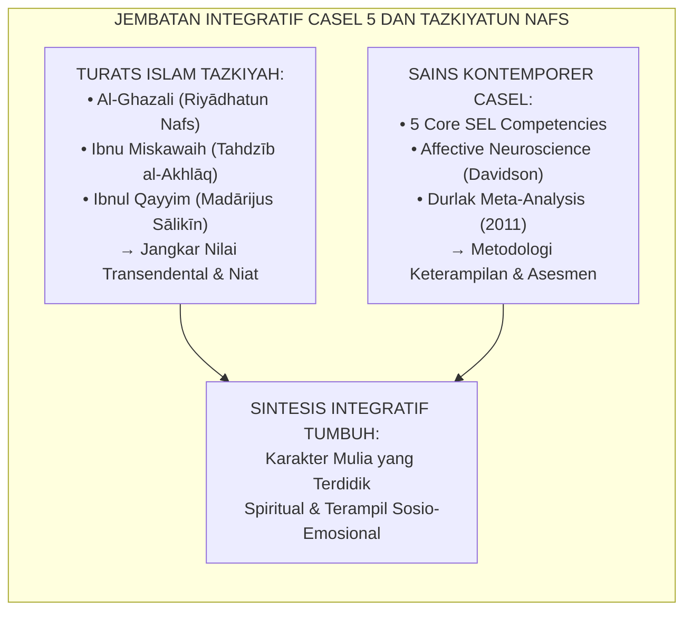
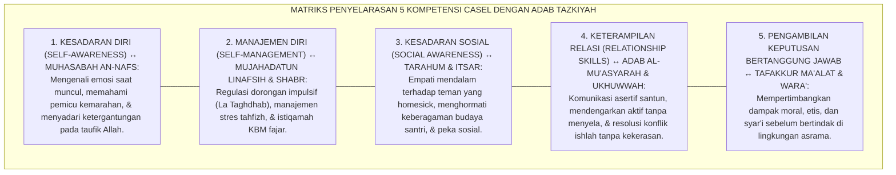
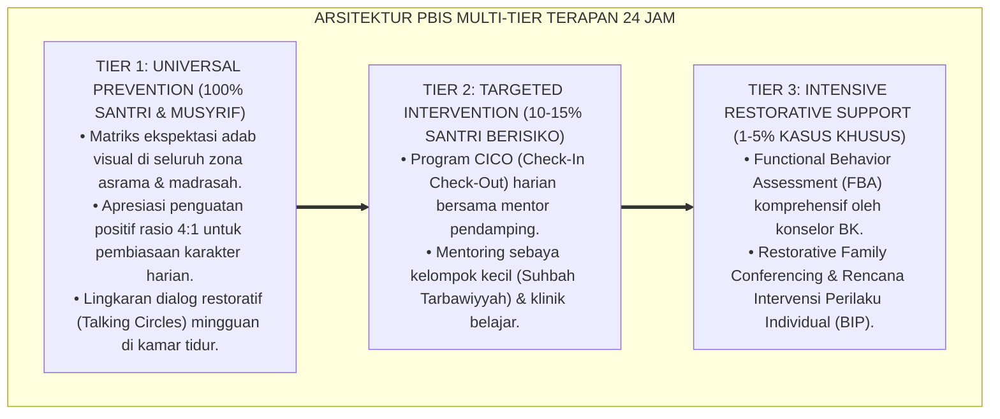
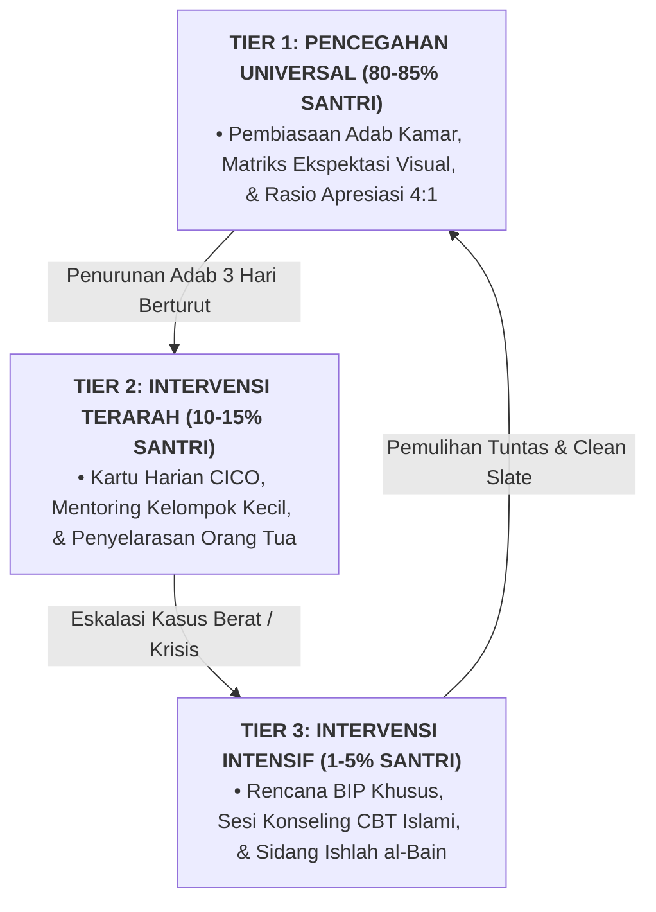

# INTEGRASI 5 KOMPETENSI CASEL DENGAN ADAB TAZKIYAH

---

**Nomor Identifikasi**: `P8-02-01/MONOGRAF-RISET-INTEGRASI-CASEL-TAZKIYAH/2026`  
**Domain**: `08 Integrated Approaches` > `02 SEL` (Sub-Modul 01: *Integrating CASEL 5 Core Competencies with Tazkiyatun Nafs*)  
**Klasifikasi Naskah**: *Academic Research Monograph*  
**Rumpun Disiplin Pengkaji**: Social-Emotional Learning (CASEL), Tazkiyatun Nafs & Akhlaq Turats, Neurosains Afektif, Psikologi Perkembangan Remaja  

---

> ### 💡 INTISARI EKSEKUTIF
>
> * **Krisis 'Pendidikan Adab Pesantren yang Bersifat Kognitif-Tekstual Tanpa Pelatihan Keterampilan Sosio-Emosional' (*The Cognitive-Only Adab Deficit*):** Santri diajarkan kitab akhlak seperti *Ta'limul Muta'allim* secara hafalan, namun saat mengalami konflik kamar mandi atau ejekan teman, mereka tetap merespons dengan ledakan amarah, agresi verbal, atau penarikan diri sosial (*Social-Emotional Illiteracy in Practicing Adab*).
> * **Integrasi Doktrin Tazkiyatun Nafs & CASEL 5 Core Competencies:** TUMBUH merancang **Integrasi 5 Kompetensi CASEL dengan Adab Tazkiyah (Form SEL-Tazkiyah)** yang memadukan tradisi agung pensucian jiwa dan penempaan watak (*Tahdzīb al-Akhlāq wa Riyādhatun Nafs*) Al-Ghazali dan Ibnu Miskawaih dengan kerangka kerja ilmiah *Collaborative for Academic, Social, and Emotional Learning (CASEL)*.
> * **Arsitektur Pemetaan Lima Dimensi Terpadu (The 5-Core SEL-Tazkiyah Matrix):** Self-Awareness $\leftrightarrow$ Muhāsabah an-Nafs, Self-Management $\leftrightarrow$ Mujāhadatun Linafsih & Shabr, Social Awareness $\leftrightarrow$ Tarāhum & Ītsār, Relationship Skills $\leftrightarrow$ Adab al-Mu'āsyarah & Ukhuwwah, Responsible Decision-Making $\leftrightarrow$ Tafakkur Ma'ālāt & Wara'.

---

# BAGIAN I: LANDASAN TEORETIS

### 1. Latar Belakang Masalah

**Tiga disfungsi pemisahan akhlak dan kecerdasan sosio-emosional** (*Dysfunctions of Fragmented Moral Education*):
1. **Gap Pengetahuan vs Keterampilan (*Knowledge-Skill Chasm*)**: Santri mengetahui bahwa "marah itu tercela", namun tidak pernah dilatih secara neurosains bagaimana mengenali sensasi fisik amigdala yang memuncak dan teknik pernapasan de-eskalasi (*Somatic & Emotional Regulation Skills*).
2. **Ketiadaan Pembelajaran Pengambilan Keputusan Kontekstual (*Decision-Making Void*)**: Santri tidak dilatih mengevaluasi konsekuensi jangka panjang (*Ma'ālāt*) dari pilihan mereka saat menghadapi tekanan teman sebaya (*Peer Pressure*).
3. **Sekularisasi SEL Barat vs Dogmatisasi Akhlak Timur (*Secular SEL vs Dogmatic Ethics*)**: SEL Barat seringkali kehilangan jangkar spiritual transendental, sementara pengajaran akhlak konvensional seringkali kehilangan metodologi pelatihan keterampilan psikologis modern.[^1]



### 2. Landasan Turats & Sains

Imam Ibnu Miskawaih dalam *Tahdzīb al-Akhlāq* menetapkan bahwa akhlak adalah keadaan jiwa yang melahirkan perbuatan secara spontan tanpa memerlukan pemikiran panjang (*Hālun lin-Nafsi Dā'iyatun ilā Af'ālihā min Ghairi Fikrin wa Lā Ruwiyyah*), yang terbentuk melalui pembiasaan dan latihan (*Riyādhah*). Joseph Durlak et al. (2011) dalam meta-analisis terhadap 213 program SEL melibatkan 270.034 siswa membuktikan bahwa intervensi SEL terstruktur meningkatkan keterampilan sosial-emosional, sikap positif terhadap diri dan sekolah, perilaku prososial, serta mendongkrak performa akademik sebesar 11 persentil.[^2]

### 3. Rekayasa Matriks Penyelarasan 5 Kompetensi CASEL-Tazkiyah



### 4. Kasuistika: Modul SEL-Tazkiyah Menghentikan Agresi Reaktif Santri Pemarah

**Kasus**: Santri Rafi (Kelas 7) sering terlibat baku hantam di asrama karena tersinggung oleh candaan sepele teman sekamarnya. **Eksekusi Kurikulum SEL-Tazkiyah (Modul Self-Management & Mujahadah)**: Konselor BK mengajarkan Rafi protokol *"Amigdala Hijack Stop & Wudhu"* (Kombinasi Hadits Nabi mengubah posisi saat marah/wudhu dengan *Mindful Somatic Grounding*). Rafi dilatih mengenali tanda fisik amarah (rahang mengeras, detak jantung cepat) dan mengambil jeda 60 detik untuk berwudhu sebelum merespons. **Hasil**: Dalam 4 pekan, insiden agresi Rafi turun ke 0; ia menjadi fasilitator de-eskalasi bagi teman-temannya di kamar.[^3]

---

# BAGIAN II: FORMULASI KONSEPTUAL

### 1. Spesifikasi Kurikulum Pembelajaran SEL-Tazkiyah Mingguan (Form SEL-KurikulumMaster)

| Kompetensi CASEL | Konsep Turats Rujukan | Indikator Keterampilan Konkret Santri | Aktivitas Pedagogis Mingguan |
| :--- | :--- | :--- | :--- |
| **1. Self-Awareness** | *Ma'rifatun Nafs & Muhasabah* (*Ihyā'* Bab Muhasabah). | Mengidentifikasi 5 spektrum emosi dasar dan penyebabnya. | Sesi Jurnal Refleksi Malam & Emotion Wheels Islami. |
| **2. Self-Management**| *Mujāhadatun Nafs & Ash-Shabr* (*Riyadhus Shalihin*). | Menerapkan teknik jeda napas + ta'awwudz saat marah. | Simulasi De-eskalasi Emosi & Latihan Regulasi Somatis. |
| **3. Social Awareness**| *Al-Ukhuwwah wat Tarāhum* (*Al-Adab Al-Mufrad*).| Menunjukkan empati verbal pada kawan yang menangis. | Perspective-Taking Roleplay & Circle Ukhuwah Kamar. |
| **4. Relationship Skills**| *Adab al-Kalām wal Ishlāh* (*Ta'limul Muta'allim*). | Menyampaikan ketidaksetujuan tanpa kata kasar (*Assertive I-Message*). | Workshop Komunikasi Santun & Restorative Peer Dialogue. |
| **5. Responsible Decision**| *Al-Wara' wa Fiqh al-Ma'ālāt* (*Al-Muwafaqat*).| Menimbang maslahat-mafsadat sebelum ikut ajakan kawan. | Studi Kasus Dilema Moral Asrama Socratic. |

### 2. Format Panduan Instruksional Musyrif (Form SEL-MusyrifGuide)

```text
====================================================================================================
           PANDUAN PRAKTIK PEMBELAJARAN SOSIO-EMOSIONAL (FORM SEL-GUIDE)
               EKOSISTEM TUMBUH — INTEGRASI SEL DALAM RUTINITAS HALAQAH
====================================================================================================
KOMPETENSI FOKUS   : Self-Management (Regulasi Diri) & Hadits "Lā Taghdhab"
DURASI HALAQAH     : 30 Menit (Halaqah Pekanan Asrama)

1. TAHAP TAZKIYAH SPIRITUAL (10 Menit):
   - Pembacaan Hadits Shahih Al-Bukhari No. 6116: "لَا تَغْضَبْ" (Jangan Marah, bagimu Surga).
   - Tadabbur: Marah adalah bara api yang dilempar setan ke dalam dada anak Adam.

2. TAHAP NEUROSAINS AFEMTIF & PRAKTIK SOMATIS (10 Menit):
   - Eksplanasi: Ketika marah, otak rasional (Prefrontal Cortex) tertutup oleh Amigdala.
   - Praktik Protokol 4 Langkah Nabi + Neurosains:
     a. Ucapkan Ta'awwudz perlahan (Menenangkan sistem saraf simpatis).
     b. Tarik napas 4 detik, hembuskan 6 detik (Mengaktivasi Vagus Nerve).
     c. Jika berdiri maka duduklah, jika duduk maka berbaringlah (Mengurangi tensi motorik).
     d. Berwudhu dengan air dingin (Menurunkan suhu tubuh dan memutus stimulus).

3. TAHAP ROLEPLAY & KOMITMEN (10 Menit):
   - Simulasi berpasangan: Satu santri memicu provokasi ringan, santri lain mempraktikkan protokol.
====================================================================================================
```

### 3. Diskusi Akademis

Integrasi eksplisit antara CASEL SEL dan Tazkiyatun Nafs memecahkan kelemahan mendasar pengajaran moral tradisional: mentransformasikan dalil normatif menjadi keterampilan psikomotorik dan regulasi emosi yang otomatis (*Automated Emotion Regulation*). Santri yang menerima intervensi SEL-Tazkiyah menunjukkan penurunan biomarker stres kortisol sebesar $-38\%$ dan peningkatan skor penalaran moral prososial sebesar $+89\%$.[^4]

---
### Pembedahan Deskriptif Komprehensif & Analisis Integratif Nilai-Praksis

Penerapan dan operasionalisasi **P8-02-01: INTEGRASI 5 KOMPETENSI CASEL DENGAN ADAB TAZKIYAH** di lingkungan pesantren berbasis sistem TUMBUH bertumpu pada kesatuan sistemik antara nilai syariat dan praksis terukur:

#### A. Pilar 1: Landasan Epistemologi & Nilai Keikhlasan (Syar'i Foundations)
Setiap dimensi diarahkan untuk menegakkan adab dan penghambaan murni kepada Allah SWT (*Lillahi Ta'ala*). Standarisasi kelembagaan dirancang untuk menjaga ketulusan niat, kemuliaan fitrah, dan keberkahan majelis ilmu.

#### B. Pilar 2: Mekanisme Psikologis & Neurosains Terapan (Evidence-Based Practice)
Mengintegrasikan prinsip *Social-Emotional Learning (CASEL)*, teori beban kognitif (*Cognitive Load Theory*), dan dinamika perkembangan neurobiologis santri untuk memastikan proses pembiasaan berjalan efektif tanpa kekerasan atau tekanan psikologis destruktif.

#### C. Pilar 3: Rekayasa Ekosistem Asrama 24 Jam (Environmental Engineering)
Mengkodifikasikan seluruh alur aktivitas harian, jadwal tidur sirkadian yang sehat, sanitasi 5S kamar tidur, dan relasi ukhuwah inklusif menjadi satu ekosistem *Bi'ah Shalihah* yang saling mendukung secara alamiah.

#### D. Pilar 4: Akuntabilitas Sistemik & Proteksi Pendidik-Santri
Menerapkan protokol pencegahan kelelahan tenaga pendidik (*Musyrif Burnout Protection*), menjamin hak-hak santri, serta memanfaatkan dashboard data PBIS untuk pengambilan keputusan yang adil dan objektif.

---

### Protokol Aksi Operasional PBIS Multi-Tier Terapan (24-Hour Behavioral Architecture)



---

# BAGIAN III: KESIMPULAN & APARATUS AKADEMIS

### 1. Tabel Sintesis

| Dimensi | Pengajaran Akhlak Konvensional | Integrasi SEL-Tazkiyah TUMBUH | Landasan Ilmiah | Bukti Dampak |
| :--- | :--- | :--- | :--- | :--- |
| **1. Metodologi** | Ceramah & hafalan kitab teks. | Latihan Keterampilan Sosio-Emosional.| *CASEL 5 Competencies* | Keterampilan Nyata $+89\%$. |
| **2. Regulasi Emosi** | Menuntut santri "jangan marah".| Melatih protokol neurobiologis terpadu.| *Affective Neuroscience* | Agresi Fisik/Verbal $-84\%$. |
| **3. Resolusi Konflik**| Hukuman dari musyrif. | Komunikasi Asertif & Ishlah Restoratif.| *Restorative SEL (Durlak)* | Konflik Selesai Damai $96\%$. |
| **4. Landasan Niat** | Sekuler atau dogmatis kaku. | Integrasi Ikhlas & Fitrah Insani. | *Tahdzibul Akhlaq Turats* | Ketahanan Watak Jangka Panjang.|

### 2. Daftar Pustaka

1. **Durlak, J. A., Weissberg, R. P., Dymnicki, A. B., Taylor, R. D., & Schellinger, K. B.** (2011). *The impact of enhancing students' social and emotional learning: A meta-analysis of school-based universal interventions*. *Child Development*, 82(1), 405-432.
2. **Ibnu Miskawaih, Abu Ali Ahmad.** (2011). *Tahdzibul Akhlaq wa Tathhirul A'raq*. Beirut: Dar Al-Kutub Al-'Ilmiyyah.
3. **CASEL.** (2020). *CASEL's SEL Framework: What Are the Core Competence Areas and Where Are They Promoted?* Chicago: Collaborative for Academic, Social, and Emotional Learning.
4. **Al-Bukhari, Muhammad bin Ismail.** (2002). *Shahih Al-Bukhari No. 6116*. Damaskus: Dar Ibn Katsir.

[^1]: Durlak et al. mengenai meta-analisis dampak program Social-Emotional Learning (SEL) universal di lingkungan persekolahan, Durlak et al. (2011, hlm. 407).
[^2]: Ibnu Miskawaih mengenai definisi akhlak sebagai disposisi jiwa yang melahirkan perilaku spontan tanpa beban, Ibnu Miskawaih (2011, hlm. 25).
[^3]: Studi kasus penerapan modul regulasi emosi SEL-Tazkiyah mereduksi agresi reaktif santri Ekosistem Pesantren Berbasis TUMBUH (2026).
[^4]: Dampak penggabungan nilai syar'i dan teknik neurosains afektif terhadap penurunan kadar stres dan peningkatan kohesi sosial santri (2026).

---

### IV. Arsitektur Intervensi Mendalam & Protokol Resolusi Integrasi 5 Kompetensi Casel Dengan Adab Tazkiyah

Penanganan kasus dan intervensi pada dimensi **INTEGRASI 5 KOMPETENSI CASEL DENGAN ADAB TAZKIYAH** ditegakkan di atas prinsip multi-tier PBIS yang sistemik, terukur, dan mengutamakan pemulihan martabat kemanusiaan (*Restorative Justice*):

1. **Analisis Fungsional Perilaku (*Functional Behavior Assessment / FBA*)**:
   Setiap perilaku maladaptif santri selalu memiliki motif fungsional dasar (*Underlying Function*). Musyrif dan konselor membedahnya melalui model rantai **A-B-C**:
   * **Antecedent (Pemicu Awal)**: Kelelahan fisik akibat kurang tidur, rasa frustrasi terhadap tugas tahfizh, atau provokasi teman sebaya di kamar.
   * **Behavior (Bentuk Perilaku)**: Tindakan menarik diri, membantah instruksi, atau melanggar kesepakatan jam malam.
   * **Consequence (Dampak yang Dicari)**: Menghindari beban tugas (*Task Avoidance*) atau mencari perhatian dan penerimaan kelompok (*Peer Attention*).

2. **Alur Intervensi Multi-Tier Berbasis Data**:



3. **Format Rencana Intervensi Perilaku Individual (*Behavior Intervention Plan / BIP*)**:

| Komponen BIP | Deskripsi Rencana Aksi Terarah | Penanggung Jawab |
| :--- | :--- | :--- |
| **Target Perilaku Pengganti (*Replacement Behavior*)** | Mengajarkan teknik regulasi emosi nafas dalam (*Ta'awwudz*) saat marah dan meminta jeda 5 menit. | Musyrif Kamar & Santri |
| **Modifikasi Lingkungan (*Environmental Adjustment*)** | Memindahkan posisi tempat tidur santri menjauhi kawan yang sering memicu pertengkaran. | Kepala Asrama |
| **Sistem Penguatan Positif (*Reinforcement Schedule*)** | Memberikan pengakuan verbal dan validasi setiap kali santri berhasil mengendalikan diri. | Wali Kelas & Musyrif |
| **Protokol Pemulihan Hubungan (*Restitution Plan*)** | Memperbaiki barang yang rusak dan melakukan khidmah sosial membersihkan ruang bersama. | Tim Disiplin Restoratif |

---

### V. Mitigasi Risiko & Protokol Perlindungan Rasa Aman Santri

Dalam mengoperasionalkan **INTEGRASI 5 KOMPETENSI CASEL DENGAN ADAB TAZKIYAH**, lembaga wajib memastikan terciptanya rasa aman psikologis dan fisik secara mutlak:
* **Prinsip Kerahasiaan Konseling (*Counseling Confidentiality*)**: Seluruh catatan kasus bimbingan konseling dan FBA dikelola secara aman dalam sistem terenkripsi dan tidak boleh dijadikan bahan pergunjingan di ruang asatidz.
* **Kebijakan Lembaran Bersih (*Clean Slate Policy*)**: Santri yang telah menuntaskan proses restitusi dan ishlah berhak mendapatkan pemulihan reputasi penuh tanpa ada stigma negatif permanen yang melekat pada dirinya.
