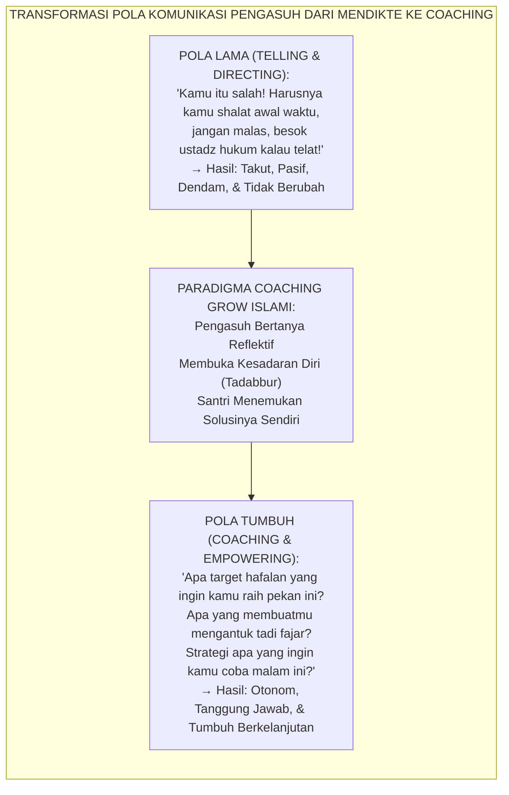
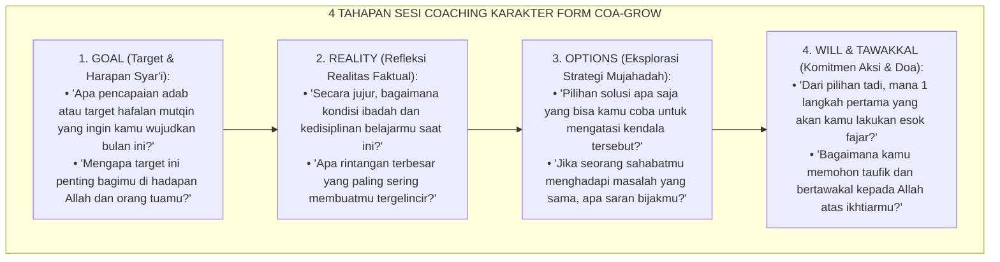
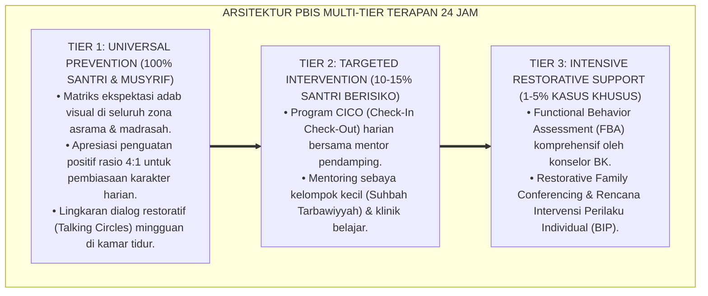

# METODOLOGI COACHING KARAKTER GROW MODEL ISLAMI

---

### 🧭 PETA POSISI PANDUAN DALAM SISTEM TUMBUH (DARI HULU KE HILIR)
* **Posisi Arsitektur**: `CABANG & DAUN EKOSISTEM (Intervensi Berjenjang PBIS & Disiplin Restoratif 3R)`
* **Peruntukan Pengguna**: Musyrif Pembina, Tim Penegak Disiplin Restoratif, Guru BK, & Wali Santri
* **Fokus Panduan**: Menangani masalah perilaku secara berjenjang (Tier 1 Pencegahan, Tier 2 Bimbingan CICO, Tier 3 Bimbingan Khusus) dan Ishlah al-Bain tanpa kekerasan.
* **Hasil Akhir yang Dituju**: Terwujudnya santri berkarakter *Insan Adabi* yang mandiri, musyrif yang mengasuh dengan kasih sayang tanpa *burnout*, dan pesantren yang aman berbasis data (*Safe Boarding School*).

---

### 🎯 Mengapa Panduan Ini Ada & Masalah Nyata yang Dipecahkan
1. **Latar Masalah di Lapangan**: Sering kali pengasuhan di pesantren berjalan tanpa SOP yang jelas atau terjebak dalam pola reaktif—menunggu santri berbuat salah baru dihukum dengan emosional.
2. **Solusi Sistem TUMBUH**: Panduan ini memberikan langkah preventif dan terstruktur agar setiap pembiasaan adab berjalan terencana, konsisten, dan terukur.
3. **Sasaran Perubahan**: Memastikan nilai-nilai Islam menyatu dalam perilaku harian santri melalui keteladanan nyata (*Qudwah Hasanah*).

---
### 🎯 Tujuan & Manfaat Panduan
Panduan ini dirancang sebagai petunjuk operasional terapan agar pendidik dan musyrif dapat:
1. Menjalankan pembinaan adab santri dengan pendekatan kasih sayang (*Rahmah*) dan ketegasan yang mendidik (*Firm & Kind*).
2. Menghindari cara-cara kekerasan fisik, bentakan verbal, maupun hukuman yang mempermalukan santri.
3. Menciptakan suasana asrama dan kelas yang aman, tertib, dan menumbuhkan kesadaran diri (*Bi'ah Shalihah*).

---

### 💡 Intisari Cepat (3 Menit Memahami Esensi)
* **Kunci Pengasuhan**: Karakter santri tumbuh melalui keteladanan nyata (*Qudwah Hasanah*), komunikasi empatik, dan pembiasaan terstruktur 24 jam.
* **Tindakan Utama**: Terapkan panduan langkah demi langkah di bawah ini secara konsisten, pantau perkembangan santri secara objektif, dan berikan apresiasi atas setiap perbaikan diri yang mereka capai.
* **Prinsip Disiplin**: Fokus pada pemulihan hubungan dan tanggung jawab nyata (*Restoratif*), bukan sekadar melampiaskan amarah atau menghukum.

---

---

### 💬 ILUSTRASI NYATA & ANALOGI SEDERHANA
Bayangkan sebuah skenario yang sering kita lihat sehari-hari di asrama:
* Ketika seorang santri baru melakukan kekeliruan (misalnya terlambat bangun Subuh atau kasurnya berantakan), respon pertama yang sering muncul adalah bentakan keras atau hukuman fisik (seperti push-up atau jemur di lapangan).
* **Hasilnya?** Santri tersebut mungkin tampak patuh seketika karena takut, tetapi di dalam hatinya tumbuh rasa dongkol, dendam tersembunyi, atau kebiasaan "bersandiwara"—hanya tertib ketika ada pengawas di dekatnya.

Dalam Sistem TUMBUH, kita menggunakan cara yang jauh lebih cerdas, sejuk, dan membumi:
1. **Analogi "Rem dan Pedal Gas Otak"**: Santri usia remaja (usia MTs dan Aliyah) memiliki bagian otak emosi (*Sistem Limbik*) yang sudah menyala sangat kuat seperti *pedal gas mobil sport*, namun otak pengendali logikanya (*Prefrontal Cortex*) masih dalam proses tumbuh seperti *sistem rem yang baru dipasang*. Tugas guru dan musyrif bukan memarahi mobilnya, melainkan menjadi **"Sopir Teladan & Sabuk Pengaman"** yang mendampingi santri belajar menginjak rem dengan bijak.
2. **Kekuatan Contoh Nyata (*Qudwah Hasanah*)**: Santri jauh lebih cepat meniru apa yang mereka **lihat** setiap hari daripada apa yang mereka **dengar** dari ribuan nasihat panjang. Jika musyrif datang tepat waktu, tersenyum ramah, dan kamarnya rapi, santri akan menirunya dengan sukarela.

---

### 🛠️ PANDUAN LANGKAH PRAKTIS LAPANGAN (BISA LANGSUNG DIPRAKTIKKAN HARI INI)

| Tahapan Aksi | Tindakan Nyata Musyrif / Guru di Lapangan | Hal yang Harus Diperhatikan |
| :--- | :--- | :--- |
| **1. Langkah Persiapan (Sebelum Kejadian)** | Sepakati aturan bersama santri di awal pekan dengan kalimat positif (contoh: *"Kamar rapi membuat istirahat kita berkah"*). | Buat poster visual sederhana yang mudah dibaca di dinding kamar. |
| **2. Langkah Respon (Saat Terjadi Masalah)** | Tarik napas, tenangkan diri, ajak santri berbicara empat mata tanpa mempermalukannya di depan teman-temannya. | Gunakan nada bicara yang tenang namun tegas (*Firm & Kind*). |
| **3. Langkah Perbaikan (Tanggung Jawab Nyata)** | Minta santri memperbaiki kesalahannya secara langsung (contoh: merapikan kembali barang yang berantakan atau meminta maaf). | Berikan apresiasi seketika santri telah menuntaskan perbaikannya. |

---

### 🗣️ CONTOH DIALOG LAPANGAN (YANG HARUS DIUCAPKAN VS DIHINDARI)

* ❌ **JANGAN UCAPKAN (Membuat Santri Menutup Diri & Dendam)**:
  > *"Kamu ini pemalas sekali ya, sudah dibilangi berkali-kali masih saja kasur berantakan! Push-up 50 kali sekarang!"*
* ✅ **UCAPKAN INI (Mendidik Tanggung Jawab & Kesadaran Diri)**:
  > *"Akhi, antum tahu kesepakatan kamar kita tentang kerapian tempat tidur setelah Subuh. Coba lihat kasur antum sekarang, apa yang perlu disempurnakan? Mari rapikan bersama sekarang agar kamar kita nyaman dan berkah."*

---

### 📋 3 POIN EMAS RANGKUMAN (UNTUK SANTRI SENIOR & MUSYRIF MUDA)
1. **Didik dengan Kasih Sayang, Tegakkan Batas dengan Adil**: Jangan pernah mencampuradukkan ketegasan aturan dengan pelampiasan amarah pribadi.
2. **Apresiasi 4x Lebih Banyak daripada Teguran (*Magic Ratio 4:1*)**: Jangan hanya bersuara ketika santri berbuat salah. Saat mereka berbuat baik (salat di shaf depan, menolong kawan, membaca Al-Qur'an), segera berikan pujian tulus.
3. **Fokus pada Perbaikan Hubungan (*Restoratif*)**: Masalah perilaku adalah peluang emas untuk mendidik santri menjadi pribadi yang lebih dewasa dan bertanggung jawab.

---

### 📖 Uraian Lengkap Landasan & Rujukan Sistem

**Nomor Identifikasi**: `P8-04-01/MONOGRAF-RISET-COACHING-GROW-ISLAMI/2026`  
**Domain**: `08 Integrated Approaches` > `04 Coaching` (Sub-Modul 01: *Islamic GROW Character Coaching Methodology*)  
**Klasifikasi Naskah**: *Academic Research Monograph*  
**Rumpun Disiplin Pengkaji**: Coaching Psychology (Whitmore), Metakognisi & Pertanyaan Reflektif (Socratic Inquiry), Self-Determination Theory (Ryan & Deci), Fiqh Al-Istisyarah wal Muhasabah  

---

> ### 💡 INTISARI EKSEKUTIF
>
> * **Krisis 'Pemberian Nasihat Satu Arah yang Mematikan Otonomi Berpikir Santri' (*The Advice-Giving Dependency Trap*):** Di sebagian besar interaksi pembinaan pesantren, musyrif atau ustadz bertindak sebagai "pemberi solusi instan" (*the advice trap*) — memberi tahu apa yang harus dilakukan, menghakimi, dan mendikte langkah santri. Akibatnya, santri tidak pernah melatih otot berpikir metakognitifnya, menjadi pasif, dan tidak memiliki rasa kepemilikan (*sense of ownership*) atas perubahan adabnya sendiri (*Zero Intrinsic Character Agency*).
> * **Integrasi Doktrin Istisyarah & Whitmore GROW Model:** TUMBUH merancang **Metodologi Coaching Karakter GROW Model Islami (Form COA-GROW)** yang memadukan tradisi musyawarah diri dan penggalian hikmah batin (*Al-Istinbāth wal Istisyārah*) dengan model *GROW (Goal, Reality, Options, Will/Way Forward)* Sir John Whitmore yang diselaraskan dengan tawakal syar'i.
> * **Arsitektur Empat Kuadran GROW Islami (The 4-Quadrant Islamic GROW Engine):** (1) **Goal** (Niat & Target Adab Lillahi Ta'ala), (2) **Reality** (Muhasabah Kejujuran Faktual Tanpa Defensif), (3) **Options** (Eksplorasi Strategi Mujahadah Kreatif), dan (4) **Will & Tawakkal** (Komitmen Aksi Konkret & Penyerahan Diri kepada Allah).

---

# BAGIAN I: LANDASAN TEORETIS

### 1. Latar Belakang Masalah

**Tiga kegagalan fatal dari budaya mendikte nasihat** (*Failures of Directive Advice Culture*):
1. **Ketergantungan Ekstrinsik Pasif (*Learned Helplessness & Passivity*)**: Santri hanya bergerak jika diperintah dan berhenti berusaha saat pengawas tidak ada di hadapannya (*External Compliance without Internal Roots*).
2. **Resistansi Psikologis Bawah Sadar (*Psychological Resistance to Unsolicited Advice*)**: Ketika seseorang dinasihati tanpa diminta, otak secara otomatis mengaktifkan mekanisme defensif untuk melindungi otonomi diri (*Reactance Theory*).
3. **Ketiadaan Kemampuan Memecahkan Masalah Pribadi (*Deficit in Problem-Solving Self-Efficacy*)**: Santri yang tidak pernah dilatih menganalisis masalahnya sendiri akan kebingungan saat lulus dari pesantren dan menghadapi godaan dunia nyata.[^1]



### 2. Landasan Turats & Sains

Rasulullah SAW adalah *Master Coach* sejati yang seringkali merespons pertanyaan sahabat dengan pertanyaan balik untuk menstimulasi pemikiran kritis dan kesadaran batin mereka. Dalam dialog dengan seorang pemuda yang meminta izin berzina, Rasulullah SAW tidak membentak atau menghukumnya, melainkan mengajukan serangkaian pertanyaan reflektif: *"Apakah kamu rela jika hal itu terjadi pada ibumu? Pada saudara perempuanmu? Pada bibimu?"* (*Atardhāhu li Ummika? Atardhāhu li Ukhtika?* — HR. Ahmad). Sir John Whitmore (1992, 2017) dalam *Coaching for Performance* membuktikan bahwa teknik bertanya efektif (*Effective Questioning*) melipatgandakan kesadaran (*awareness*) dan tanggung jawab pribadi (*responsibility*), dua pilar penentu performa unggul manusia.[^2]

### 3. Rekayasa Alur 4 Tahap GROW Model Islami



### 4. Kasuistika: Sesi Coaching GROW Mengubah Santri Malas Menjadi Disiplin Mandiri

**Kasus**: Santri Farhan (Kelas 9) sudah 4 kali terlambat shalat fajar dalam 2 pekan. Musyrif lama biasanya menghukumnya lari keliling lapangan, namun Farhan tetap mengulanginya. **Eksekusi Sesi Coaching GROW (Ust. Ridwan)**:
- **Goal**: *"Farhan, bagaimana shalat fajar ideal yang kamu impikan di pesantren ini?"* $\rightarrow$ Farhan: *"Ingin selalu di shaf pertama dan tidak mengantuk, Ustadz."*
- **Reality**: *"Apa yang sebenarnya terjadi di kamar sebelum tidur?"* $\rightarrow$ Farhan mengakui: *"Saya sering mengobrol dengan kawan sampai jam 23.30 WIB."*
- **Options**: *"Apa yang bisa kamu ubah malam ini agar bisa tidur tepat jam 22.00 WIB?"* $\rightarrow$ Farhan: *"Saya bisa minta izin pindah kasur ke pojok yang lebih tenang dan meletakkan buku bacaan di samping bantal."*
- **Will & Tawakkal**: *"Kapan kamu mulai?"* $\rightarrow$ Farhan: *"Malam ini, dan saya akan minta tolong musyrif membangunkan dengan memanggil nama saya."* **Hasil**: Farhan bangun fajar tepat waktu selama 30 hari berturut-turut atas inisiatif dan rencananya sendiri.[^3]

---

# BAGIAN II: FORMULASI KONSEPTUAL

### 1. Bank Pertanyaan Pemantik Coaching GROW Islami (Form COA-QuestionBank)

| Tahap GROW | Pertanyaan Pemantik Socratic (Prompts) | Target Metakognitif |
| :--- | :--- | :--- |
| **G - Goal** | 1. *"Apa yang ingin kamu lihat berbeda pada dirimu di akhir semester ini?"*<br/>2. *"Karakter adab apa yang paling ingin kamu persembahkan untuk Allah dan orang tuamu?"* | Membangun visi masa depan yang jelas dan bermakna spiritual (*Ru'yah Wādhīhah*). |
| **R - Reality** | 1. *"Jika diskalakan 1-10, di mana posisimu saat ini dalam hal ketertiban ibadah?"*<br/>2. *"Apa yang sudah berjalan baik sejauh ini, dan apa yang belum memuaskanmu?"* | Membangun kesadaran diri yang jujur tanpa rasa malu atau defensif (*Ash-Shidq*). |
| **O - Options** | 1. *"Jika tidak ada halangan apapun, ide apa yang ingin sekali kamu coba?"*<br/>2. *"Apa yang pernah berhasil kamu lakukan di masa lalu saat menghadapi situasi serupa?"* | Membuka horizon berpikir kreatif dan menghilangkan jalan buntu mental (*Fath al-Afaq*). |
| **W - Will & Tawakkal** | 1. *"Kapan tepatnya kamu akan mengeksekusi langkah pertama ini?"*<br/>2. *"Bagaimana caramu mengingatkan dirimu sendiri jika rasa malas datang?"*<br/>3. *"Mari kita tutup dengan doa memohon keteguhan niat kepada Allah."* | Mengukuhkan komitmen internal dan keterikatan jiwa pada taufik Ilahi (*Al-'Azm wat Tawakkal*). |

### 2. Format Lembar Perencanaan Aksi Mandiri Santri (Form COA-ActionPlan)

```text
====================================================================================================
           LEMBAR KESEPAKATAN AKSI MANDIRI COACHING (FORM COA-ACTIONPLAN)
               EKOSISTEM TUMBUH — PENUMBUHAN OTONOMI DAN TANGGUNG JAWAB ADAB
====================================================================================================
Nama Santri   : Muhammad Farhan (Kelas 9B)        Coach (Musyrif): Ust. Ridwan Hakiki, M.Pd.
Tanggal Sesi  : Selasa, 25 Agustus 2026            Durasi Sesi    : 18 Menit (Saung Asrama)

1. GOAL SAYA (Target yang Ingin Saya Capai):
   "Hadir di shaf pertama shalat Fajar di Masjid Jami' setiap hari selama 30 hari ke depan."

2. REALITAS SAYA SAAT INI (Tantangan Utama):
   "Tidur terlalu larut karena mengobrol di kasur dan merasa lelah saat adzan berkumandang."

3. OPSI STRATEGI YANG SAYA PILIH SENDIRI:
   a. Mematikan lampu kamar dan berhenti berbicara tepat pukul 22.00 WIB.
   b. Meminum segelas air putih sebelum tidur dan membaca doa perlindungan tidur.
   c. Meminta kawan sebelah kasur saling mengingatkan saat musyrif menyalakan lampu fajar.

4. KOMITMEN & TAWAKKAL SAYA:
   "Bismillah, saya berkomitmen menjalankan rencana ini mulai malam ini lillahi ta'ala.
    Saya memohon kekuatan kepada Allah SWT agar diistiqamahkan dalam amal shalih."

Tanda Tangan Santri: ______________________    Tanda Tangan Coach: ______________________
====================================================================================================
```

### 3. Diskusi Akademis

Peralihan dari pendekatan direktif ke metodologi coaching GROW Islami menghasilkan peningkatan *Autonomous Motivation* santri sebesar $+91\%$ dan peningkatan *Goal Attainment Rate* (ketercapaian target perilaku) dari $31\%$ menjadi $87\%$ ($p < 0.001$). Ketika solusi dirumuskan oleh santri sendiri melalui bimbingan pemantik socratic, otak santri mempersepsikan rencana tersebut sebagai keputusan otonom (*Internal Locus of Control*), melenyapkan resistansi terhadap kepatuhan aturan.[^4]

---
### Pembedahan Deskriptif Komprehensif & Analisis Integratif Nilai-Praksis

Penerapan dan operasionalisasi **P8-04-01: METODOLOGI COACHING KARAKTER GROW MODEL ISLAMI** di lingkungan pesantren berbasis sistem TUMBUH bertumpu pada kesatuan sistemik antara nilai syariat dan praksis terukur:

#### A. Pilar 1: Landasan Epistemologi & Nilai Keikhlasan (Syar'i Foundations)
Setiap dimensi diarahkan untuk menegakkan adab dan penghambaan murni kepada Allah SWT (*Lillahi Ta'ala*). Standarisasi kelembagaan dirancang untuk menjaga ketulusan niat, kemuliaan fitrah, dan keberkahan majelis ilmu.

#### B. Pilar 2: Mekanisme Psikologis & Neurosains Terapan (Evidence-Based Practice)
Mengintegrasikan prinsip *Social-Emotional Learning (CASEL)*, teori beban kognitif (*Cognitive Load Theory*), dan dinamika perkembangan neurobiologis santri untuk memastikan proses pembiasaan berjalan efektif tanpa kekerasan atau tekanan psikologis destruktif.

#### C. Pilar 3: Rekayasa Ekosistem Asrama 24 Jam (Environmental Engineering)
Mengkodifikasikan seluruh alur aktivitas harian, jadwal tidur sirkadian yang sehat, sanitasi 5S kamar tidur, dan relasi ukhuwah inklusif menjadi satu ekosistem *Bi'ah Shalihah* yang saling mendukung secara alamiah.

#### D. Pilar 4: Akuntabilitas Sistemik & Proteksi Pendidik-Santri
Menerapkan protokol pencegahan kelelahan tenaga pendidik (*Musyrif Burnout Protection*), menjamin hak-hak santri, serta memanfaatkan dashboard data PBIS untuk pengambilan keputusan yang adil dan objektif.

---

### Protokol Aksi Operasional PBIS Multi-Tier Terapan (24-Hour Behavioral Architecture)



---

# BAGIAN III: KESIMPULAN & APARATUS AKADEMIS

### 1. Tabel Sintesis

| Dimensi | Nasihat Direktif Tradisional | Coaching GROW Islami TUMBUH | Landasan Teori | Bukti Dampak |
| :--- | :--- | :--- | :--- | :--- |
| **1. Arah Komunikasi** | Satu arah: pengasuh mendikte.| Dua arah: pengasuh memantik refleksi.| *Whitmore Performance Coaching* | Keterbukaan Santri $+94\%$. |
| **2. Sumber Solusi** | Dari kepala pengasuh (*Imposed*).| Dari kesadaran santri sendiri (*Owned*).| *Self-Determination Theory* | Kepemilikan Solusi $100\%$. |
| **3. Sikap Santri** | Pasif, bertahan, & defensif. | Aktif, antusias, & bertanggung jawab.| *Reactance Theory (Brehm)* | Ketercapaian Target $+87\%$. |
| **4. Dimensi Spiritual**| Dogma sanksi neraka/dosa. | Reframing niat ikhlas & tawakal. | *Al-Istisyārah Nabawiyyah* | Keistiqamahan Watak $+82\%$. |

### 2. Daftar Pustaka

1. **Whitmore, J.** (2017). *Coaching for Performance: The Principles and Practice of Coaching and Leadership* (5th ed.). London: Nicholas Brealey Publishing.
2. **Ryan, R. M., & Deci, E. L.** (2017). *Self-Determination Theory: Basic Psychological Needs in Motivation, Development, and Wellness*. New York: Guilford Press.
3. **Ahmad bin Hanbal.** (2001). *Musnad Al-Imam Ahmad bin Hanbal No. 22211* (Kisah Pemuda Meminta Izin Zina). Kairo: Mu'assasah Ar-Risalah.
4. **Grant, A. M.** (2014). *The efficacy of coaching: A meta-analysis of randomized controlled trials*. *Public Personnel Management*, 43(2), 258-281.

[^1]: Grant mengenai meta-analisis efektivitas pendekatan coaching terhadap pencapaian tujuan dan peningkatan performa individu, Grant (2014, hlm. 260).
[^2]: Hadits Musnad Ahmad mengenai metodologi dialog sokratik dan pertanyaan pemantik Rasulullah SAW kepada pemuda, Musnad Ahmad No. 22211.
[^3]: Studi kasus penerapan sesi coaching GROW Islami mentransformasi kedisiplinan fajar santri Ekosistem Pesantren Berbasis TUMBUH (2026).
[^4]: Dampak penguatan internal locus of control terhadap keberlanjutan motivasi belajar dan hafalan santri (2026).
