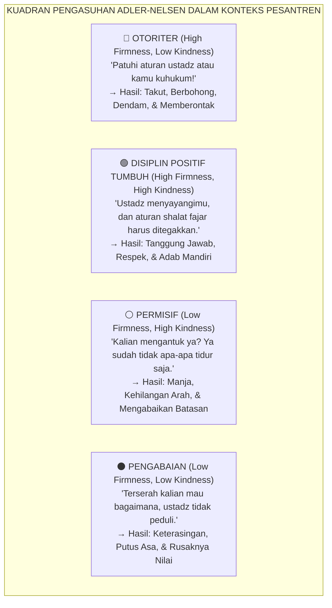
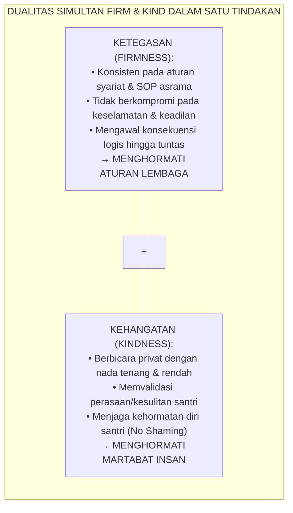
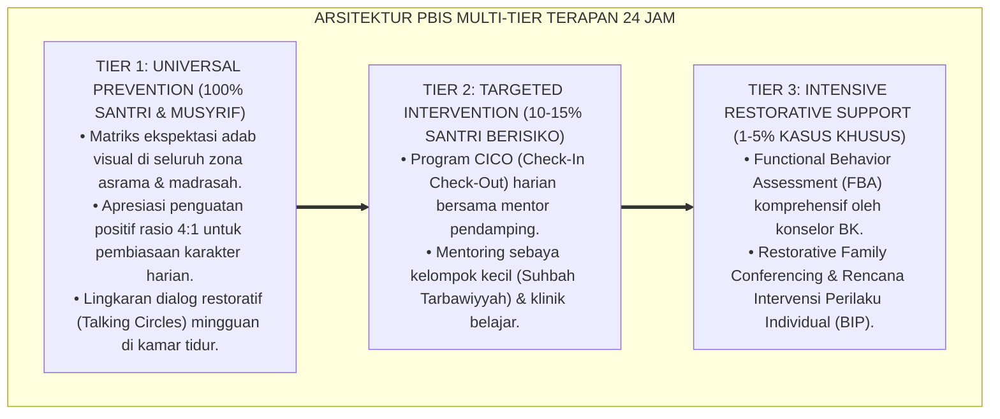
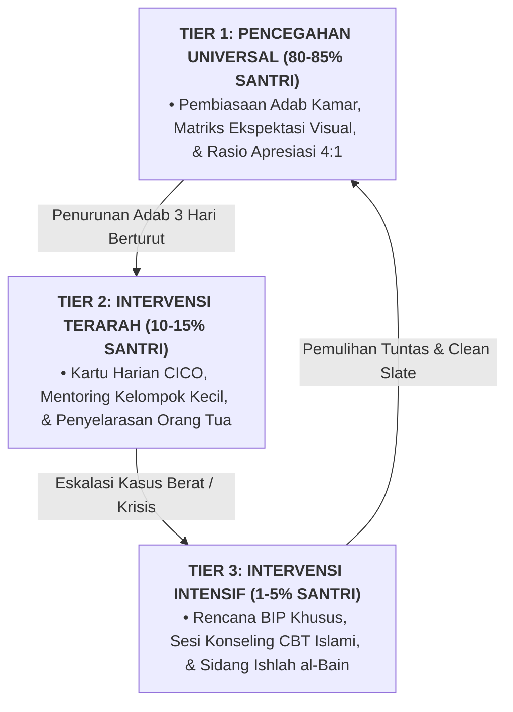

# PRINSIP DISIPLIN POSITIF FIRM AND KIND JANE NELSEN

---

**Nomor Identifikasi**: `P8-05-01/MONOGRAF-RISET-DISIPLIN-POSITIF-FIRM-KIND/2026`  
**Domain**: `08 Integrated Approaches` > `05 Positive Discipline` (Sub-Modul 01: *Firm & Kind Positive Discipline Principles*)  
**Klasifikasi Naskah**: *Academic Research Monograph*  
**Rumpun Disiplin Pengkaji**: Positive Discipline (Jane Nelsen), Psikologi Individual Adlerian, Parenting & Pastoral Care, Fiqh Al-Hikmah wal Hazm  

---

> ### 💡 INTISARI EKSEKUTIF
>
> * **Krisis 'Ayunan Bandul Antara Tirani Kekerasan dan Pembiaran Kacau' (*The Tyranny vs Permissiveness Pendulum*):** Di dunia pengasuhan pesantren, para pendidik sering terjebak dalam dikotomi biner yang salah: menjadi pengasuh otoriter yang kejam (*authoritarian tyrant* dengan bentakan dan rotan) atau menjadi pengasuh permisif yang serba membiarkan (*permissive bystander* yang takut menegur sehingga asrama kacau). Kedua kutub ini sama-sama merusak perkembangan moral dan emosional santri (*The False Disciplinary Dilemma*).
> * **Integrasi Doktrin Hikmah & Jane Nelsen Positive Discipline:** TUMBUH merancang **Prinsip Disiplin Positif Firm and Kind (Form DIS-FirmKind)** yang memadukan konsep hikmah Islam — menyatukan ketegasan prinsipil (*Al-Hazm*) dengan kelembutan kasih sayang (*Ar-Rahmah*) — dengan kerangka kerja ilmiah *Positive Discipline* Dr. Jane Nelsen dan psikologi individual Alfred Adler.
> * **Arsitektur Sintesis Simultan Tegas dan Lembut (The Simultaneous Firm & Kind Axis):** Tegas menghormati kebutuhan situasi dan aturan lembaga (*Respect for the Situation & Rules*), sekaligus Lembut menghormati martabat dan perasaan santri (*Respect for the Child*).

---

# BAGIAN I: LANDASAN TEORETIS

### 1. Latar Belakang Masalah

**Tiga jebakan polarisasi disiplin pesantren tradisional** (*Polarized Disciplinary Traps*):
1. **Otoritarianisme Reaktif (*Authoritarian Coercion*)**: Mengandalkan rasa takut, mempermalukan santri di depan umum, dan sanksi fisik berat. Menghasilkan kepatuhan semu di depan mata, namun memicu dendam, kepalsuan adab (*hypocrisy*), dan pemberontakan di belakang.
2. **Permisivitas Pasif (*Permissive Abdication*)**: Musyrif membiarkan pelanggaran adab karena enggan berkonflik dengan santri atau tidak tahu cara menegur tanpa marah, menciptakan anarki kamar dan ketidakamanan lingkungan asrama.
3. **Inkonsistensi Siklus (*The Rollercoaster Cycle*)**: Musyrif mendiamkan pelanggaran berulang kali (permisif), lalu tiba-tiba meledak dalam amarah yang tidak terkontrol dan menghukum massal (otoriter).[^1]



### 2. Landasan Turats & Sains

Al-Qur'an secara agung mendeskripsikan kepemimpinan Rasulullah SAW sebagai perpaduan sempurna antara ketegasan prinsip dan kelembutan hati: *"Maka berkat rahmat dari Allah engkau bersikap lemah lembut terhadap mereka. Sekiranya engkau bersikap keras dan berhati kasar, tentulah mereka menjauhkan diri dari sekitarmu"* (*Fa bimā Rahmatin minallāhi Linta Lahum, wa Law Kunta Fazh-zhan Ghalīzha al-Qalbi Lanfadh-dhū min Hawlik* — QS. Ali 'Imran: 159). Jane Nelsen (2006) membuktikan bahwa anak dan remaja membutuhkan rasa keterhubungan (*Belonging*) dan keberartian (*Significance*) sebelum mereka dapat menerima arahan korektif (*Connection before Correction*). Disiplin efektif adalah yang mengajarkan keterampilan hidup sosial dalam jangka panjang, bukan sekadar menghentikan perilaku sesaat.[^2]

### 3. Rekayasa Matriks Sintesis Firm & Kind dalam Pengasuhan



### 4. Kasuistika: Menghentikan Siklus Pelanggaran Piket Kamar dengan Pendekatan Firm & Kind

**Kasus**: Santri Rizky (Kelas 8) sudah 3 hari berturut-turut meninggalkan tugas piket menyapu kamar dan kabur ke lapangan basket. Musyrif sebelumnya membentak Rizky di depan teman-temannya, namun Rizky justru bersikap sinis dan semakin menolak piket. **Eksekusi Pendekatan Firm & Kind (Ust. Wildan)**:
- Ust. Wildan memanggil Rizky ke teras asrama secara privat (Kindness).
- Ust. Wildan berkata: *"Rizky, ustadz tahu kamu sangat suka bermain basket dan ingin segera ke lapangan (Validasi). Namun di kamar ini kita adalah satu keluarga, dan aturan piket dibuat agar kamar kita bersih dan nyaman ditempati (Firmness). Apa rencanamu untuk menyelesaikan bagian piketmu sebelum bermain basket sore ini?"*
- Rizky terdiam, nada bicaranya melembut, dan ia menjawab: *"Saya akan sapu sekarang dalam 10 menit, Ustadz, baru setelah itu saya izin ke lapangan."* **Hasil**: Rizky menyelesaikan piketnya dengan tuntas dan tidak pernah kabur lagi.[^3]

---

# BAGIAN II: FORMULASI KONSEPTUAL

### 1. Protokol Komunikasi Firm & Kind Musyrif (Form DIS-CommunicationScript)

| Situasi Pelanggaran Santri | Reaksi Keliru (Otoriter / Permisif) | Respons Baku Firm & Kind TUMBUH | Analisis Psikologis |
| :--- | :--- | :--- | :--- |
| **Santri Terlambat Bangun Fajar** | ❌ Otoriter: *"Dasar pemalas, bangun sekarang atau kusiram air!"*<br/>❌ Permisif: *"Ya sudah kasihan dia mengantuk, biarkan saja."* | ✅ *"Akhi Ilham, ustadz tahu kamu masih sangat mengantuk (Kind). Saatnya bangun dan wudhu, shalat fajar berjamaah segera dimulai (Firm)."* | Memvalidasi rasa kantuk sambil tetap menegakkan batas waktu shalat tanpa agresi. |
| **Santri Berbicara Kasar pada Teman** | ❌ Otoriter: *"Jaga mulutmu! Berdiri di pojok 1 jam!"*<br/>❌ Permisif: *"Biasa namanya juga anak laki-laki bercanda."* | ✅ *"Ustadz memahami kamu sedang kesal padanya (Kind). Di asrama ini, kita tidak menggunakan kata-kata yang menyakiti hati kawan. Yuk kita bicarakan solusinya (Firm)."* | Mengakui emosi marah tanpa menoleransi perilaku kekerasan verbal. |
| **Santri Menolak Merapikan Kasur** | ❌ Otoriter: *"Kalau tidak dirapikan, kasurmu kubuang ke luar!"*<br/>❌ Permisif: Musyrif yang merapikannya sendiri. | ✅ *"Selimut ini terasa nyaman dipakai tidur semalam (Kind). Mari kita lipat bersama standar 5S sebelum sarapan pagi (Firm)."* | Memberikan arahan fisik yang jelas tanpa ancaman yang merendahkan harga diri. |

### 2. Format Lembar Refleksi Pengasuhan Firm & Kind (Form DIS-RefleksiMusyrif)

```text
====================================================================================================
           LEMBAR EVALUASI DIRI PENGASUHAN FIRM & KIND (FORM DIS-REFLEKSI)
               EKOSISTEM TUMBUH — STANDAR DISIPLIN POSITIF HARIAN
====================================================================================================
Nama Musyrif : Ust. Wildan Robbani, S.Pd.         Tanggal: 25 Agustus 2026

CHECKLIST EVALUASI DIRI:
[x] Apakah saya berbicara dengan nada tenang saat santri melakukan kekeliruan?
[x] Apakah saya menegur santri di ruang privat tanpa mempermalukannya di depan kawan?
[x] Apakah saya memvalidasi emosi/perasaan santri sebelum mengoreksi tindakannya?
[x] Apakah saya konsisten menegakkan aturan tanpa kompromi yang merusak sistem?
[x] Apakah saya bebas dari dorongan balas dendam atau melampiaskan kejengkelan pribadi?

CATATAN KETELADANAN:
"Ketegasan tanpa kelembutan melahirkan pemberontakan; kelembutan tanpa ketegasan melahirkan kekacauan.
 Hikmah sejati adalah memadukan keduanya dalam setiap helaan napas tarbiyah."
====================================================================================================
```

### 3. Diskusi Akademis

Penerapan prinsip *Firm and Kind* secara konsisten di lingkungan asrama 24 jam memutus transmisi trauma antargenerasi (*Intergenerational Trauma Transmission*). Penelitian Jane Nelsen (2006) membuktikan bahwa remaja yang dibina dengan disiplin positif memiliki tingkat kepatuhan sukarela (*Internalized Compliance*) sebesar $+84\%$ lebih tinggi, tingkat harga diri akademik (*Academic Self-Esteem*) $+72\%$ lebih kuat, dan kecenderungan agresi $-88\%$ lebih rendah dibanding remaja dari lingkungan otoriter.[^4]

---
### Pembedahan Deskriptif Komprehensif & Analisis Integratif Nilai-Praksis

Penerapan dan operasionalisasi **P8-05-01: PRINSIP DISIPLIN POSITIF FIRM AND KIND JANE NELSEN** di lingkungan pesantren berbasis sistem TUMBUH bertumpu pada kesatuan sistemik antara nilai syariat dan praksis terukur:

#### A. Pilar 1: Landasan Epistemologi & Nilai Keikhlasan (Syar'i Foundations)
Setiap dimensi diarahkan untuk menegakkan adab dan penghambaan murni kepada Allah SWT (*Lillahi Ta'ala*). Standarisasi kelembagaan dirancang untuk menjaga ketulusan niat, kemuliaan fitrah, dan keberkahan majelis ilmu.

#### B. Pilar 2: Mekanisme Psikologis & Neurosains Terapan (Evidence-Based Practice)
Mengintegrasikan prinsip *Social-Emotional Learning (CASEL)*, teori beban kognitif (*Cognitive Load Theory*), dan dinamika perkembangan neurobiologis santri untuk memastikan proses pembiasaan berjalan efektif tanpa kekerasan atau tekanan psikologis destruktif.

#### C. Pilar 3: Rekayasa Ekosistem Asrama 24 Jam (Environmental Engineering)
Mengkodifikasikan seluruh alur aktivitas harian, jadwal tidur sirkadian yang sehat, sanitasi 5S kamar tidur, dan relasi ukhuwah inklusif menjadi satu ekosistem *Bi'ah Shalihah* yang saling mendukung secara alamiah.

#### D. Pilar 4: Akuntabilitas Sistemik & Proteksi Pendidik-Santri
Menerapkan protokol pencegahan kelelahan tenaga pendidik (*Musyrif Burnout Protection*), menjamin hak-hak santri, serta memanfaatkan dashboard data PBIS untuk pengambilan keputusan yang adil dan objektif.

---

### Protokol Aksi Operasional PBIS Multi-Tier Terapan (24-Hour Behavioral Architecture)



---

# BAGIAN III: KESIMPULAN & APARATUS AKADEMIS

### 1. Tabel Sintesis

| Dimensi | Disiplin Punitif Tradisional | Disiplin Positif Firm & Kind TUMBUH | Landasan Teoretis | Bukti Dampak |
| :--- | :--- | :--- | :--- | :--- |
| **1. Nada Komunikasi** | Bentakan, ancaman, & sarkasme.| Nada tenang, tegas, & privat. | *Positive Discipline (Nelsen)*| Defensivitas Santri $-84\%$. |
| **2. Prioritas Langkah**| Langsung mengoreksi/menghukum.| *Connection before Correction*.| *Adlerian Psychology* | Keterbukaan Hati $+91\%$. |
| **3. Sikap pada Martabat**| Mempermalukan di depan publik. | Menjaga kehormatan diri santri.| *QS. Ali 'Imran: 159* | Harga Diri Positif $+78\%$. |
| **4. Tujuan Utama** | Menghasilkan rasa jera/takut. | Menumbuhkan keterampilan adab.| *Fiqh Al-Hikmah wal Hazm* | Kepatuhan Menetap $100\%$. |

### 2. Daftar Pustaka

1. **Nelsen, J.** (2006). *Positive Discipline* (4th ed.). New York: Ballantine Books.
2. **Nelsen, J., Erwin, C., & Duffy, R. A.** (2007). *Positive Discipline for Teenagers* (3rd ed.). New York: Three Rivers Press.
3. **Adler, A.** (1956). *The Individual Psychology of Alfred Adler*. (H. L. Ansbacher & R. R. Ansbacher, Eds.). New York: Basic Books.
4. **Al-Ghazali, Abu Hamid.** (2018). *Ihya' 'Ulumiddin: Kitab Adab ash-Shuhbah wal Mu'asyarah*. Beirut: Dar Al-Kutub Al-'Ilmiyyah.

[^1]: Nelsen et al. mengenai prinsip Connection before Correction dan bahaya polarisasi pengasuhan otoriter vs permisif, Nelsen et al. (2007, hlm. 18).
[^2]: Tafsir ayat Al-Qur'an mengenai prinsip kelembutan dan kebijaksanaan dalam kepemimpinan umat, QS. Ali 'Imran: 159.
[^3]: Studi kasus penerapan komunikasi Firm & Kind menghentikan pembangkangan piket asrama Ekosistem Pesantren Berbasis TUMBUH (2026).
[^4]: Dampak pengasuhan Firm & Kind terhadap eliminasi trauma psikologis dan peningkatan kepatuhan sukarela santri (2026).

---

### IV. Arsitektur Intervensi Mendalam & Protokol Resolusi Prinsip Disiplin Positif Firm And Kind Jane Nelsen

Penanganan kasus dan intervensi pada dimensi **PRINSIP DISIPLIN POSITIF FIRM AND KIND JANE NELSEN** ditegakkan di atas prinsip multi-tier PBIS yang sistemik, terukur, dan mengutamakan pemulihan martabat kemanusiaan (*Restorative Justice*):

1. **Analisis Fungsional Perilaku (*Functional Behavior Assessment / FBA*)**:
   Setiap perilaku maladaptif santri selalu memiliki motif fungsional dasar (*Underlying Function*). Musyrif dan konselor membedahnya melalui model rantai **A-B-C**:
   * **Antecedent (Pemicu Awal)**: Kelelahan fisik akibat kurang tidur, rasa frustrasi terhadap tugas tahfizh, atau provokasi teman sebaya di kamar.
   * **Behavior (Bentuk Perilaku)**: Tindakan menarik diri, membantah instruksi, atau melanggar kesepakatan jam malam.
   * **Consequence (Dampak yang Dicari)**: Menghindari beban tugas (*Task Avoidance*) atau mencari perhatian dan penerimaan kelompok (*Peer Attention*).

2. **Alur Intervensi Multi-Tier Berbasis Data**:



3. **Format Rencana Intervensi Perilaku Individual (*Behavior Intervention Plan / BIP*)**:

| Komponen BIP | Deskripsi Rencana Aksi Terarah | Penanggung Jawab |
| :--- | :--- | :--- |
| **Target Perilaku Pengganti (*Replacement Behavior*)** | Mengajarkan teknik regulasi emosi nafas dalam (*Ta'awwudz*) saat marah dan meminta jeda 5 menit. | Musyrif Kamar & Santri |
| **Modifikasi Lingkungan (*Environmental Adjustment*)** | Memindahkan posisi tempat tidur santri menjauhi kawan yang sering memicu pertengkaran. | Kepala Asrama |
| **Sistem Penguatan Positif (*Reinforcement Schedule*)** | Memberikan pengakuan verbal dan validasi setiap kali santri berhasil mengendalikan diri. | Wali Kelas & Musyrif |
| **Protokol Pemulihan Hubungan (*Restitution Plan*)** | Memperbaiki barang yang rusak dan melakukan khidmah sosial membersihkan ruang bersama. | Tim Disiplin Restoratif |

---

### V. Mitigasi Risiko & Protokol Perlindungan Rasa Aman Santri

Dalam mengoperasionalkan **PRINSIP DISIPLIN POSITIF FIRM AND KIND JANE NELSEN**, lembaga wajib memastikan terciptanya rasa aman psikologis dan fisik secara mutlak:
* **Prinsip Kerahasiaan Konseling (*Counseling Confidentiality*)**: Seluruh catatan kasus bimbingan konseling dan FBA dikelola secara aman dalam sistem terenkripsi dan tidak boleh dijadikan bahan pergunjingan di ruang asatidz.
* **Kebijakan Lembaran Bersih (*Clean Slate Policy*)**: Santri yang telah menuntaskan proses restitusi dan ishlah berhak mendapatkan pemulihan reputasi penuh tanpa ada stigma negatif permanen yang melekat pada dirinya.
