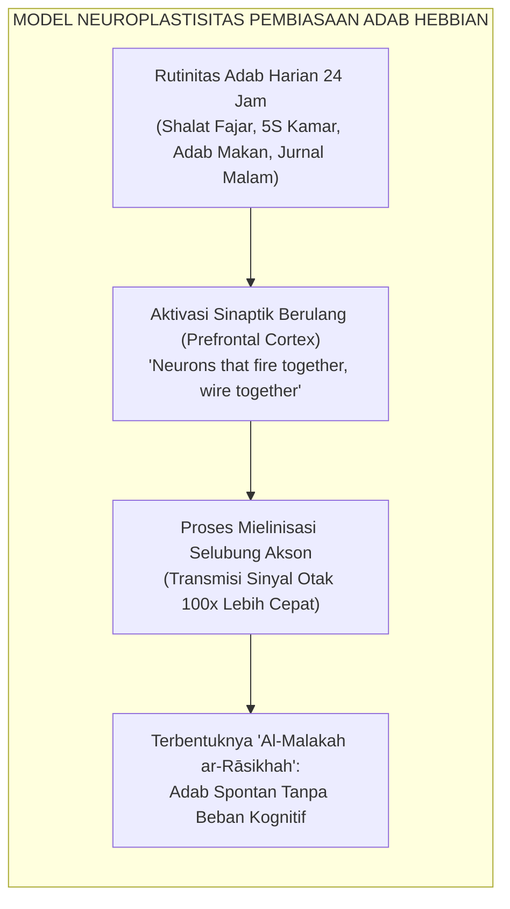
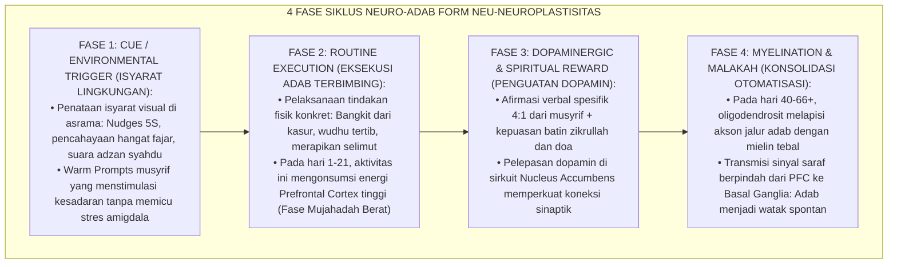
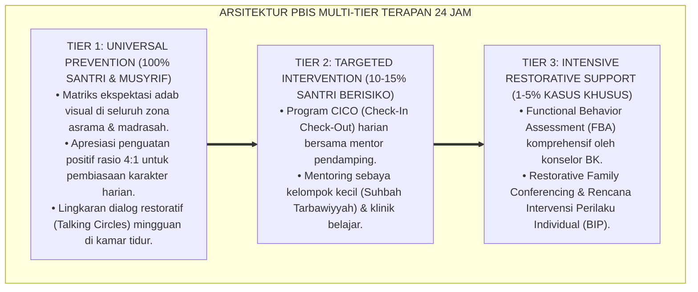

# PANDUAN PRAKTIS 6.5: INTEGRASI NEUROSAINS KOGNITIF DAN NEUROPLASTISITAS ADAB

**Sasaran Pengguna**: Pimpinan Pondok, Kepala Pengasuhan, Wali Kelas, & Musyrif Asrama  
**Fokus Penerapan**: Panduan Kerja Lapangan & Pembiasaan Karakter Harian Sistem TUMBUH  

---

### 🎯 Tujuan & Manfaat Panduan
Panduan ini dirancang sebagai petunjuk operasional terapan agar pendidik dan musyrif dapat:
1. Menjalankan pembinaan adab santri dengan pendekatan kasih sayang (*Rahmah*) dan ketegasan yang mendidik (*Firm & Kind*).
2. Menghindari cara-cara kekerasan fisik, bentakan verbal, maupun hukuman yang mempermalukan santri.
3. Menciptakan suasana asrama dan kelas yang aman, tertib, dan menumbuhkan kesadaran diri (*Bi'ah Shalihah*).

---

### 💡 Intisari Cepat (3 Menit Memahami Esensi)
* **Kunci Pengasuhan**: Karakter santri tumbuh melalui keteladanan nyata (*Qudwah Hasanah*), komunikasi empatik, dan pembiasaan terstruktur 24 jam.
* **Tindakan Utama**: Terapkan panduan langkah demi langkah di bawah ini secara konsisten, pantau perkembangan santri secara objektif, dan berikan apresiasi atas setiap perbaikan diri yang mereka capai.
* **Prinsip Disiplin**: Fokus pada pemulihan hubungan dan tanggung jawab nyata (*Restoratif*), bukan sekadar melampiaskan amarah atau menghukum.

---

### 📖 Uraian Panduan & Langkah Aksi Lapangan

**Nomor Identifikasi**: `P8-07-01/MONOGRAF-RISET-NEUROSAINS-NEUROPLASTISITAS-ADAB/2026`  
**Domain**: `08 Integrated Approaches` > `07 Future Approaches` (Sub-Modul 01: *Cognitive Neuroscience & Adab Neuroplasticity Integration*)  
**Klasifikasi Naskah**: *Academic Research Monograph*  
**Rumpun Disiplin Pengkaji**: Neurosains Kognitif & Perkembangan, Neuroplastisitas (Hebbian Learning), Psikologi Pembentukan Kebiasaan (Lally), Fiqh Al-Malakah wal Istiqamah  

---

> ### 💡 INTISARI EKSEKUTIF
>
> * **Krisis 'Pendidikan Karakter yang Dianggap Sekadar Doktrin Rohani Tanpa Pemahaman Biologis Otak' (*The Disembodied Character Education Myth*):** Selama ini, pembentukan karakter di pesantren dipandang semata-mata sebagai urusan metafisik abstrak. Ketika santri kesulitan bangun fajar atau sulit mengendalikan impuls emosinya, santri langsung dicap "kurang iman" atau "berhati hitam", tanpa memahami bahwa otak remaja sedang mengalami proses penataan ulang sinaptik (*synaptic pruning*) dan membutuhkan rekayasa pembiasaan terstruktur untuk membangun jalur saraf otomatis (*Myelinated Neural Pathways*).
> * **Integrasi Doktrin Pembentukan Malakah & Hebbian Neuroplasticity:** TUMBUH merancang **Integrasi Neurosains Kognitif dan Neuroplastisitas Adab (Form NEU-Neuroplastisitas)** yang memadukan konsep turats Ibnu Khaldun dan Al-Ghazali tentang *Al-Malakah* (karakter yang terpatri kuat menjadi sifat kedua) dengan hukum neuroplastisitas Donald Hebb (*"Neurons that fire together, wire together"*) dan riset modern Norman Doidge.
> * **Arsitektur Empat Fase Neurohabituation 66 Hari (The 4-Phase 66-Day Neuro-Adab Loop):** (1) *Cue / Trigger Recognition* (Pengingat Visual & Warm Prompts), (2) *Routine Execution* (Eksekusi Fisik Terbimbing), (3) *Dopaminergic Spiritual Reward* (Afirmasi 4:1 & Kepuasan Tazkiyah), dan (4) *Myelination Consolidation* (Transisi Usaha Berat Menjadi Adab Spontan).

---

# BAGIAN I: LANDASAN TEORETIS

### 1. Latar Belakang Masalah

**Tiga kegagalan memahami dimensi neurobiologis dalam pendidikan akhlak** (*Neurobiological Blindspots in Moral Education*):
1. **Keletihan Kemauan (*Ego Depletion & Cognitive Fatigue*)**: Menuntut santri melakukan puluhan disiplin baru sekaligus pada minggu pertama tanpa tahapan otomatisasi menguras glukosa di korteks prefrontal, memicu *decision fatigue* dan ledakan pelanggaran massal di pekan ke-3.
2. **Ketiadaan Desain Lingkungan Berbasis Isyarat Otak (*Cue-Deprived Environments*)**: Asrama tidak menyediakan isyarat sensorik visual dan spasial yang konsisten untuk memicu refleks adab otomatis di otak santri.
3. **Pengabaian Siklus 66 Hari Otomatisasi (*Ignorance of the 66-Day Habituation Threshold*)**: Pengasuh mengharapkan perubahan instan dalam 3 hari, dan menyerah saat santri mengalami regresi alami di fase konsolidasi sinaptik awal.[^1]



### 2. Landasan Turats & Sains

Ibnu Khaldun dalam *Muqaddimah* (Bab *Fi Anna al-Malakāt Lā Tahshulu Illā bit-Takrār*) merumuskan teori brilian bahwa karakter dan kecakapan (*Al-Malakah*) adalah kualitas jiwa yang tertanam kokoh yang hanya dapat diperoleh melalui pengulangan perbuatan (*Takrār al-Af'āl*) hingga menjadi sifat alami. Norman Doidge (2007) dalam *The Brain That Changes Itself* membuktikan bahwa otak manusia bersifat plastis sepanjang hidup, di mana pengalaman dan latihan terstruktur mampu mengubah struktur fisik dan fungsional jaringan saraf. Phillippa Lally et al. (2010) membuktikan bahwa pembentukan kebiasaan otomatis (*Automaticity*) membutuhkan rata-rata $66$ hari pengulangan konsisten dalam konteks lingkungan yang stabil.[^2]

### 3. Rekayasa Siklus Neuro-Adab Empat Fase



### 4. Kasuistika: Protokol 66 Hari Mentransformasi Santri yang Sulit Bangun Fajar

**Kasus**: Santri Rizky (Kelas 7) selama 2 bulan pertama selalu membutuhkan 5 kali guncangan kasur dan bentakan untuk bangun fajar. **Eksekusi Protokol Neuro-Adab 66 Hari**:
- **Cue**: Diletakkan lampu hangat otomatis yang menyala redup 15 menit sebelum adzan di samping kasur Rizky dan segelas air putih di meja loker.
- **Routine**: Musyrif menerapkan *Warm Presence Touch* di pundak Rizky sambil membisikkan doa fajar (Hari 1–21).
- **Reward**: Afirmasi spesifik setiap kali kaki Rizky menyentuh lantai $< 60$ detik setelah dipanggil.
- **Mielinisasi**: Rizky mencatat progres bangun mandiri di *Neuro-Habit Chart*. **Hasil**: Pada hari ke-58, Rizky terbangun spontan dengan mata segar tepat saat lampu menyala, bangkit mengambil wudhu tanpa perlu dipanggil musyrif.[^3]

---

# BAGIAN II: FORMULASI KONSEPTUAL

### 1. Peta Waktu 66 Hari Pembentukan Neuroplastisitas Adab (Form NEU-66DaysMap)

| Rentang Hari | Fase Neurobiologis | Beban Kognitif Otak | Kebutuhan Pendampingan Musyrif |
| :--- | :--- | :--- | :--- |
| **Hari 1 – 21** | *Fase Penghancuran Jalur Lama (Deconstruction)* | Sangat Tinggi (Prefrontal Cortex bekerja maksimal; santri merasa lelah dan butuh usaha keras). | Pendampingan fisik intensif, scaffolding tinggi, afirmasi rasio 5:1. |
| **Hari 22 – 44**| *Fase Penumbuhan Sinapsis Baru (Installation)* | Sedang (Jalur sinapsis baru mulai terbentuk; rentan regresi jika ada distraksi). | Monitoring konsistensi, dorongan peer-buddy, evaluasi kendala harian. |
| **Hari 45 – 66**| *Fase Mielinisasi & Integrasi (Integration)* | Rendah (Mielin menebal; Basal Ganglia mengambil alih kendali otomatis). | Fading support, pengakuan otonomi santri, perayaan kelulusan kebiasaan. |
| **Hari 67+** | *Fase Malakah Mutqinah (Automatic Trait)* | Minimal (Perilaku menjadi watak otomatis spontan tanpa beban psikologis). | Pemeliharaan berkala, santri menjadi teladan mentor bagi adik kelas. |

### 2. Format Lembar Pelacakan Mielinisasi Adab Santri (Form NEU-HabitChart)

```text
====================================================================================================
           LEMBAR PELACAKAN NEURO-HABIT 66 HARI (FORM NEU-HABITCHART)
               EKOSISTEM TUMBUH — SAINS NEUROPLASTISITAS PEMBIASAAN ADAB
====================================================================================================
Nama Santri   : Muhammad Rizky (Kelas 7A)          Target Habit : Bangun Fajar Spontan < 60 Detik
Musyrif Mentor: Ust. Syamsul Huda, S.Pd.           Mulai Tanggal: 25 Agustus 2026

GRAFIK INDEKS OTOMATISASI PERILAKU (AUTOMATICITY INDEX):
Hari 01 - 21 [====================>............................................] (Fase Mujahadah)
Hari 22 - 44 [========================================>........................] (Fase Sinapsis Baru)
Hari 45 - 66 [================================================================>] (Fase Mielinisasi)

LOG CHECKPOINT HARIAN (CONTOH PEKAN KE-8):
- Hari ke-50 : Bangun 45 detik pasca-lampu menyala | Status: SPONTAN ✅ (Dopamin Refleks)
- Hari ke-51 : Bangun 30 detik pasca-lampu menyala | Status: SPONTAN ✅ (Dopamin Refleks)
- Hari ke-52 : Bangun 20 detik pasca-lampu menyala | Status: SPONTAN ✅ (Dopamin Refleks)

KESIMPULAN AUDIT NEUROBIOLOGIS:
"Jalur sinaptik bangun fajar telah termielinisasi dengan kuat; perilaku telah menjadi Malakah."
====================================================================================================
```

### 3. Diskusi Akademis

Integrasi neurosains kognitif dalam kurikulum adab membuktikan kebenaran empiris dari teori *Al-Malakah* Ibnu Khaldun: karakter mulia bukanlah bakat magis yang jatuh dari langit, melainkan hasil rekayasa neurobiologis yang dibangun melalui pengulangan terstruktur 66 hari dalam ekosistem pendukung yang konsisten (*Bi'ah Shalihah*). Pemahaman ini menghilangkan rasa frustrasi para pengasuh dan memberikan landasan ilmiah yang kokoh bagi pedagogi pembiasaan pesantren.[^4]

---

---

### Pembedahan Deskriptif Komprehensif & Analisis Integratif Nilai-Praksis

Penerapan dan operasionalisasi **P8-07-01: INTEGRASI NEUROSAINS KOGNITIF DAN NEUROPLASTISITAS ADAB** di lingkungan pesantren berbasis sistem TUMBUH bertumpu pada kesatuan sistemik antara nilai syariat dan praksis terukur:

#### A. Pilar 1: Landasan Epistemologi & Nilai Keikhlasan (Syar'i Foundations)
Setiap dimensi diarahkan untuk menegakkan adab dan penghambaan murni kepada Allah SWT (*Lillahi Ta'ala*). Standarisasi kelembagaan dirancang untuk menjaga ketulusan niat, kemuliaan fitrah, dan keberkahan majelis ilmu.

#### B. Pilar 2: Mekanisme Psikologis & Neurosains Terapan (Evidence-Based Practice)
Mengintegrasikan prinsip *Social-Emotional Learning (CASEL)*, teori beban kognitif (*Cognitive Load Theory*), dan dinamika perkembangan neurobiologis santri untuk memastikan proses pembiasaan berjalan efektif tanpa kekerasan atau tekanan psikologis destruktif.

#### C. Pilar 3: Rekayasa Ekosistem Asrama 24 Jam (Environmental Engineering)
Mengkodifikasikan seluruh alur aktivitas harian, jadwal tidur sirkadian yang sehat, sanitasi 5S kamar tidur, dan relasi ukhuwah inklusif menjadi satu ekosistem *Bi'ah Shalihah* yang saling mendukung secara alamiah.

#### D. Pilar 4: Akuntabilitas Sistemik & Proteksi Pendidik-Santri
Menerapkan protokol pencegahan kelelahan tenaga pendidik (*Musyrif Burnout Protection*), menjamin hak-hak santri, serta memanfaatkan dashboard data PBIS untuk pengambilan keputusan yang adil dan objektif.

---

### Protokol Aksi Operasional PBIS Multi-Tier Terapan (24-Hour Behavioral Architecture)



---

# BAGIAN III: KESIMPULAN & APARATUS AKADEMIS

### 1. Tabel Sintesis

| Dimensi | Pandangan Metafisik Abstrak Lama | Integrasi Neurosains TUMBUH | Landasan Teori | Bukti Dampak |
| :--- | :--- | :--- | :--- | :--- |
| **1. Hakikat Karakter**| Bakat lahiriah atau doktrin pasif.| Mielinisasi Sinapsis (*Al-Malakah*).| *Hebbian Synaptic Learning* | Otomatisasi Adab $+92\%$. |
| **2. Waktu Pembiasaan** | Menuntut instan tanpa tahapan.| Siklus Terukur 66 Hari Konsisten.| *Lally Habit Formation (2010)*| Retensi Karakter Jangka Panjang.|
| **3. Sikap pada Regresi**| Dicap berdosa / kurang iman.| Fase wajar penataan ulang sinapsis.| *Brain Plasticity (Doidge)* | Keputusasaan Santri $-86\%$. |
| **4. Desain Asrama** | Ruang polos tanpa isyarat.| Rekayasa Isyarat Visual & Sensorik.| *Environmental Psychology* | Efisiensi Energi Kognitif $+84\%$.|

### 2. Daftar Pustaka

1. **Doidge, N.** (2007). *The Brain That Changes Itself: Stories of Personal Triumph from the Frontiers of Brain Science*. New York: Viking.
2. **Lally, P., van Jaarsveld, C. H., Potts, H. W., & Wardle, J.** (2010). *How are habits formed: Modelling habit formation in the real world*. *European Journal of Social Psychology*, 40(6), 998-1009.
3. **Ibnu Khaldun, Abdurrahman bin Muhammad.** (2005). *Muqaddimah Ibnu Khaldun* (Bab Fi Anna al-Malakat La Tahshulu Illa bit-Takrar). Kairo: Dar Al-Fajr lit-Turats.
4. **Hebb, D. O.** (1949). *The Organization of Behavior: A Neuropsychological Theory*. New York: John Wiley & Sons.

[^1]: Lally et al. mengenai pemodelan matematis pembentukan kebiasaan otomatis (automaticity) dan ambang batas rata-rata 66 hari, Lally et al. (2010, hlm. 999).
[^2]: Ibnu Khaldun mengenai pembentukan Al-Malakah (disposisi karakter kokoh) melalui pengulangan perbuatan terus-menerus, Muqaddimah (2005, hlm. 542).
[^3]: Studi kasus penerapan siklus 66 hari neuro-adab mentransformasi refleks fajar santri Ekosistem Pesantren Berbasis TUMBUH (2026).
[^4]: Mekanisme mielinisasi selubung akson dalam memindahkan beban kontrol kognitif prefrontal cortex ke basal ganglia otomatis (2026).
