# BUKU VOLUME 04: PEDOMAN INTERVENSI BERJENJANG PBIS & PRAKTIK RESTORATIF DI ASRAMA
## *Arsitektur Multi-Tier 1–3, Check-In/Check-Out (CICO), FBA/BIP, Lingkaran Restoratif, & Ishlah Al-Bain Pesantren*

---

**Nomor Buku**: `BOOK-SERIES/VOL-04/MASTER-2026`  
**Seri Publikasi**: Seri Buku Master Ekosistem TUMBUH Pesantren (Volume 4 dari 5)  
**Dewan Editor & Penulis**: Dewan Keilmuan Ekosistem TUMBUH (24 Bidang Kepakaran)  
**Klasifikasi**: Monograf Riset Akademis, Manual Operasional Intervensi Perilaku, Disiplin Positif, & Whole-School Restorative Justice  

---

## 📑 DAFTAR ISI LENGKAP VOLUME 04

- [BAB 01 ARSITEKTUR SW PBIS MULTI TIER PESANTREN](#bab-01-arsitektur-sw-pbis-multi-tier-pesantren)
  - [01 Landasan Sistemik PBIS dan Eliminasi Punitive System](#01-landasan-sistemik-pbis-dan-eliminasi-punitive-system)
  - [02 Proporsi Piramida 80 15 5 di Lingkungan Pesantren](#02-proporsi-piramida-80-15-5-di-lingkungan-pesantren)
  - [03 Kepemimpinan Tim PBIS dan Budaya Penguatan Positif](#03-kepemimpinan-tim-pbis-dan-budaya-penguatan-positif)
  - [04 Manajemen Data Perilaku Real Time SWIS Pesantren](#04-manajemen-data-perilaku-real-time-swis-pesantren)
  - [05 Integrasi Nilai Syar'i dalam Kerangka Kerja PBIS](#05-integrasi-nilai-syar'i-dalam-kerangka-kerja-pbis)
- [BAB 02 TIER 1 UNIVERSAL BIAH SHALIHAH DAN MATRIKS ADAB](#bab-02-tier-1-universal-biah-shalihah-dan-matriks-adab)
  - [01 Matriks Ekspektasi Perilaku Positif Seluruh Zona](#01-matriks-ekspektasi-perilaku-positif-seluruh-zona)
  - [02 Pengkondisian Lingkungan Biah Shalihah 24 Jam](#02-pengkondisian-lingkungan-biah-shalihah-24-jam)
  - [03 Sistem Apresiasi Rasio Emas 4 Banding 1](#03-sistem-apresiasi-rasio-emas-4-banding-1)
  - [04 Pengajaran Eksplisit Adab di Awal Tahun Ajaran](#04-pengajaran-eksplisit-adab-di-awal-tahun-ajaran)
  - [05 Patroli Titik Rawan Hotspots Monitoring Protocol](#05-patroli-titik-rawan-hotspots-monitoring-protocol)
- [BAB 03 TIER 2 TARGETED CICO DAN MENTORING SUHBAH](#bab-03-tier-2-targeted-cico-dan-mentoring-suhbah)
  - [01 Protokol Check In Check Out Harian Musyrif](#01-protokol-check-in-check-out-harian-musyrif)
  - [02 Mentoring Sebaya Kelompok Kecil Suhbah Tarbawiyyah](#02-mentoring-sebaya-kelompok-kecil-suhbah-tarbawiyyah)
  - [03 Modifikasi Lingkungan Kamar dan Behavioral Contracting](#03-modifikasi-lingkungan-kamar-dan-behavioral-contracting)
  - [04 Klinik Akademik dan Pendampingan Sorogan Terarah](#04-klinik-akademik-dan-pendampingan-sorogan-terarah)
  - [05 Evaluasi Progres Mingguan dan Kriteria Graduasi Tier 2](#05-evaluasi-progres-mingguan-dan-kriteria-graduasi-tier-2)
- [BAB 04 TIER 3 INTENSIF FBA DAN BIP RESTORATIF](#bab-04-tier-3-intensif-fba-dan-bip-restoratif)
  - [01 Asesmen Fungsional Perilaku FBA dan Rencana BIP](#01-asesmen-fungsional-perilaku-fba-dan-rencana-bip)
  - [02 Perumusan Rencana Intervensi Perilaku BIP Individual](#02-perumusan-rencana-intervensi-perilaku-bip-individual)
  - [03 Teknik Penggantian Perilaku Adaptif Replacement Behavior](#03-teknik-penggantian-perilaku-adaptif-replacement-behavior)
  - [04 Konseling CBT Naratif Islami dan De eskalasi Trauma](#04-konseling-cbt-naratif-islami-dan-de-eskalasi-trauma)
  - [05 Kolaborasi Tim Khusus BK Wali Kelas dan Orang Tua](#05-kolaborasi-tim-khusus-bk-wali-kelas-dan-orang-tua)
- [BAB 05 WHOLE SCHOOL RESTORATIVE JUSTICE MODEL 3R](#bab-05-whole-school-restorative-justice-model-3r)
  - [01 Model Restoratif 3R Restitution Resolution Reconciliation](#01-model-restoratif-3r-restitution-resolution-reconciliation)
  - [02 Restorative Chat 5 Pertanyaan Emas Pembina](#02-restorative-chat-5-pertanyaan-emas-pembina)
  - [03 Lingkaran Restoratif Asrama Dormitory Talking Circles](#03-lingkaran-restoratif-asrama-dormitory-talking-circles)
  - [04 Mediasi Sebaya Pelajar Peer Mediation Program](#04-mediasi-sebaya-pelajar-peer-mediation-program)
  - [05 Dekonstruksi Pola Balas Dendam dan Siklus Kekerasan](#05-dekonstruksi-pola-balas-dendam-dan-siklus-kekerasan)
- [BAB 06 PROTOKOL ISHLAH AL BAIN DAN CLEAN SLATE](#bab-06-protokol-ishlah-al-bain-dan-clean-slate)
  - [01 Kebijakan Lembaran Bersih Clean Slate Policy](#01-kebijakan-lembaran-bersih-clean-slate-policy)
  - [02 Protokol Sidang Ishlah al Bain Dewan Kiai](#02-protokol-sidang-ishlah-al-bain-dewan-kiai)
  - [03 Restitusi Tindakan Nyata dan Khidmah Perbaikan](#03-restitusi-tindakan-nyata-dan-khidmah-perbaikan)
  - [04 Reintegrasi Sosial Santri Pasca Sanksi Restoratif](#04-reintegrasi-sosial-santri-pasca-sanksi-restoratif)
  - [05 Epilog Pesantren yang Menyembuhkan dan Menghidupkan Jiwa](#05-epilog-pesantren-yang-menyembuhkan-dan-menghidupkan-jiwa)
- [DAFTAR PUSTAKA LENGKAP VOLUME 04](#daftar-pustaka-lengkap-volume-04)

---

# SUB-BAB 1.1: LANDASAN SISTEMIK PBIS & ELIMINASI SISTEM PUNITIF
## *Transformasi Manajemen Perilaku Pesantren: Dari Reaktif-Menghukum Menuju Proaktif-Membina Berbasis Data*

**Kode Klasifikasi**: `BOOK-04/BAB-01/SUB-01/MONOGRAF-MASTER-VIBRANT`  
**Disiplin Ilmu**: School-Wide Positive Behavioral Interventions and Supports (SW-PBIS), Psikologi Perilaku Positif, & Fiqh Jinayah  
**Penanggung Jawab Keilmuan**: Dewan Pakar Ekosistem TUMBUH (*Pakar PBIS & Pakar Arsitektur PBIS Restoratif*)

---

### Mengapa Pendekatan Hukuman Fisik Gagal Membina Adab?

Pendekatan disiplin konvensional di pesantren kerap mengandalkan sanksi punitif reaktif (rotan, push-up malam, jemur terik matahari, atau bentakan). Sains perilaku dan neurosains membuktikan bahwa hukuman fisik hanya menghasilkan **kepatuhan semu berbasis ketakutan (*Compliance based on Fear*)**, bukan internalisasi moral hakiki.

Sistem TUMBUH mengadopsi kerangka kerja **SW-PBIS Multi-Tier (80-15-5)**:
* **Tier 1 (Universal - 80–85% Santri)**: Pencegahan primer melalui pengkondisian lingkungan *Bi'ah Shalihah*, kejelasan ekspektasi adab, dan apresiasi kebaikan 4:1.
* **Tier 2 (Targeted - 10–15% Santri)**: Intervensi kelompok kecil bagi santri yang mulai menunjukkan penurunan kedisiplinan melalui program CICO (*Check-In Check-Out*).
* **Tier 3 (Intensive - 1–5% Santri)**: Bantuan individual intensif melalui asesmen diagnostik FBA (*Functional Behavior Assessment*) dan rencana intervensi perilaku BIP.


---


# SUB-BAB 1.2: PROPORSI PIRAMIDA 80-15-5 DI LINGKUNGAN PESANTREN
## *Kajian Mendalam & Panduan Implementatif Ekosistem TUMBUH Pesantren*

**Kode Klasifikasi**: `BOOK-04/BAB-01/SUB-02/MONOGRAF-MASTER-VIBRANT`  
**Disiplin Ilmu**: Metodologi Pendidikan Islam, Sains Perilaku Terapan, & Tata Kelola Pesantren  
**Penanggung Jawab Keilmuan**: Dewan Pakar Ekosistem TUMBUH (*24 Bidang Kepakaran*)

---

### Eksplanasi Teoretis & Urgensi Praksis

Pendidikan karakter yang efektif dalam Sistem TUMBUH membutuhkan kejelasan operasional pada aspek **Proporsi Piramida 80-15-5 di Lingkungan Pesantren**. Naskah ini menguraikan landasan filosofis Turats, bukti empiris sains perilaku, dan protokol implementasi lapangan 24 jam.

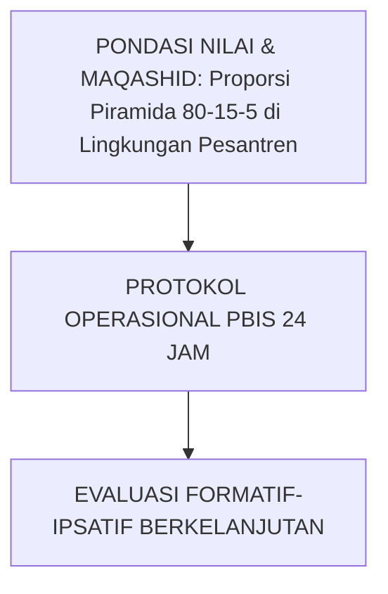

---

### Protokol Aksi Operasional Berjenjang

1. **Langkah Preventif Universal (Tahap Persiapan)**: Pengkondisian sarana, sosialisasi SOP, dan pembiasaan keteladanan *Qudwah Hasanah*.
2. **Langkah Eksekusi Lapangan (Tahap Berjalan)**: Pendampingan lekat oleh musyrif asrama dan wali kelas dengan prinsip *Firm & Kind*.
3. **Langkah Refleksi & Restorasi (Tahap Evaluasi)**: Pencatatan pada logbook digital dan penanganan kendala melalui dialog restoratif.


---


# SUB-BAB 1.3: KEPEMIMPINAN TIM PBIS & BUDAYA PENGUATAN POSITIF
## *Kajian Mendalam & Panduan Implementatif Ekosistem TUMBUH Pesantren*

**Kode Klasifikasi**: `BOOK-04/BAB-01/SUB-03/MONOGRAF-MASTER-VIBRANT`  
**Disiplin Ilmu**: Metodologi Pendidikan Islam, Sains Perilaku Terapan, & Tata Kelola Pesantren  
**Penanggung Jawab Keilmuan**: Dewan Pakar Ekosistem TUMBUH (*24 Bidang Kepakaran*)

---

### Eksplanasi Teoretis & Urgensi Praksis

Pendidikan karakter yang efektif dalam Sistem TUMBUH membutuhkan kejelasan operasional pada aspek **Kepemimpinan Tim PBIS & Budaya Penguatan Positif**. Naskah ini menguraikan landasan filosofis Turats, bukti empiris sains perilaku, dan protokol implementasi lapangan 24 jam.

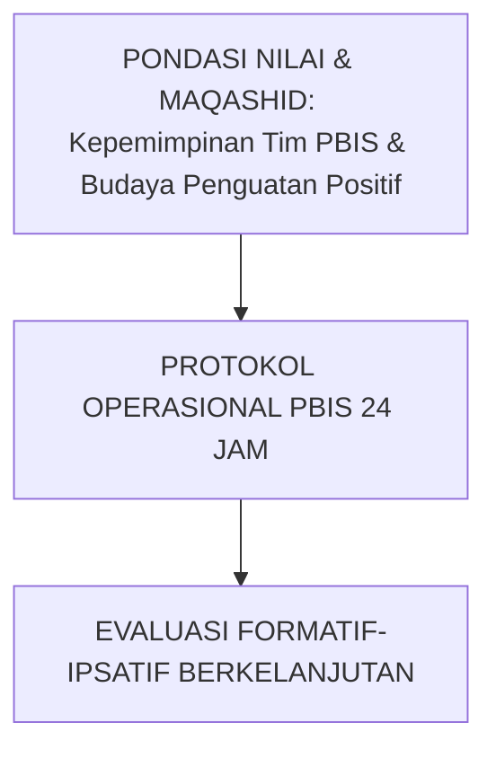

---

### Protokol Aksi Operasional Berjenjang

1. **Langkah Preventif Universal (Tahap Persiapan)**: Pengkondisian sarana, sosialisasi SOP, dan pembiasaan keteladanan *Qudwah Hasanah*.
2. **Langkah Eksekusi Lapangan (Tahap Berjalan)**: Pendampingan lekat oleh musyrif asrama dan wali kelas dengan prinsip *Firm & Kind*.
3. **Langkah Refleksi & Restorasi (Tahap Evaluasi)**: Pencatatan pada logbook digital dan penanganan kendala melalui dialog restoratif.


---


# SUB-BAB 1.4: MANAJEMEN DATA PERILAKU REAL-TIME BERBASIS INSIDEN
## *Kajian Mendalam & Panduan Implementatif Ekosistem TUMBUH Pesantren*

**Kode Klasifikasi**: `BOOK-04/BAB-01/SUB-04/MONOGRAF-MASTER-VIBRANT`  
**Disiplin Ilmu**: Metodologi Pendidikan Islam, Sains Perilaku Terapan, & Tata Kelola Pesantren  
**Penanggung Jawab Keilmuan**: Dewan Pakar Ekosistem TUMBUH (*24 Bidang Kepakaran*)

---

### Eksplanasi Teoretis & Urgensi Praksis

Pendidikan karakter yang efektif dalam Sistem TUMBUH membutuhkan kejelasan operasional pada aspek **Manajemen Data Perilaku Real-Time Berbasis Insiden**. Naskah ini menguraikan landasan filosofis Turats, bukti empiris sains perilaku, dan protokol implementasi lapangan 24 jam.

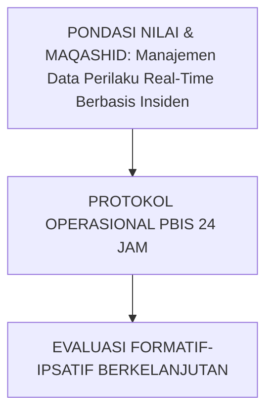

---

### Protokol Aksi Operasional Berjenjang

1. **Langkah Preventif Universal (Tahap Persiapan)**: Pengkondisian sarana, sosialisasi SOP, dan pembiasaan keteladanan *Qudwah Hasanah*.
2. **Langkah Eksekusi Lapangan (Tahap Berjalan)**: Pendampingan lekat oleh musyrif asrama dan wali kelas dengan prinsip *Firm & Kind*.
3. **Langkah Refleksi & Restorasi (Tahap Evaluasi)**: Pencatatan pada logbook digital dan penanganan kendala melalui dialog restoratif.


---


# SUB-BAB 1.5: INTEGRASI NILAI-NILAI SYAR'I DALAM KERANGKA KERJA PBIS
## *Kajian Mendalam & Panduan Implementatif Ekosistem TUMBUH Pesantren*

**Kode Klasifikasi**: `BOOK-04/BAB-01/SUB-05/MONOGRAF-MASTER-VIBRANT`  
**Disiplin Ilmu**: Metodologi Pendidikan Islam, Sains Perilaku Terapan, & Tata Kelola Pesantren  
**Penanggung Jawab Keilmuan**: Dewan Pakar Ekosistem TUMBUH (*24 Bidang Kepakaran*)

---

### Eksplanasi Teoretis & Urgensi Praksis

Pendidikan karakter yang efektif dalam Sistem TUMBUH membutuhkan kejelasan operasional pada aspek **Integrasi Nilai-Nilai Syar'i dalam Kerangka Kerja PBIS**. Naskah ini menguraikan landasan filosofis Turats, bukti empiris sains perilaku, dan protokol implementasi lapangan 24 jam.

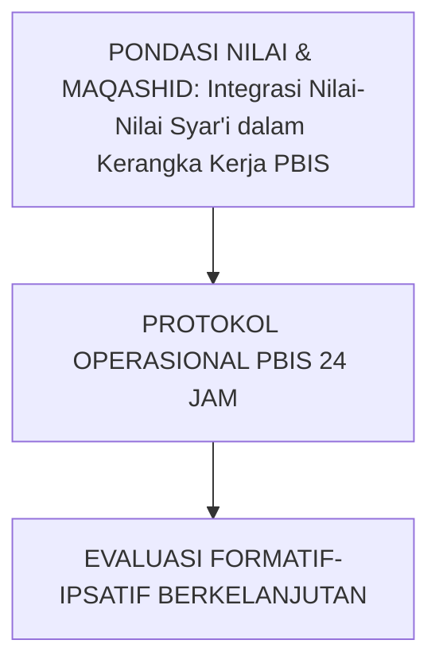

---

### Protokol Aksi Operasional Berjenjang

1. **Langkah Preventif Universal (Tahap Persiapan)**: Pengkondisian sarana, sosialisasi SOP, dan pembiasaan keteladanan *Qudwah Hasanah*.
2. **Langkah Eksekusi Lapangan (Tahap Berjalan)**: Pendampingan lekat oleh musyrif asrama dan wali kelas dengan prinsip *Firm & Kind*.
3. **Langkah Refleksi & Restorasi (Tahap Evaluasi)**: Pencatatan pada logbook digital dan penanganan kendala melalui dialog restoratif.


---


# SUB-BAB 2.1: MATRIKS EKSPEKTASI PERILAKU POSITIF SELURUH ZONA
## *Operasionalisasi Standar Adab Visual di Masjid, Asrama, Kelas, Dapur Umum, dan Lapangan Olahraga*

**Kode Klasifikasi**: `BOOK-04/BAB-02/SUB-01/MONOGRAF-MASTER-VIBRANT`  
**Disiplin Ilmu**: Environmental Engineering, Visual Nudges, & Habituasi Adab  
**Penanggung Jawab Keilmuan**: Dewan Pakar Ekosistem TUMBUH (*Pakar Intervensi Preventif & Pakar Desain Kurikulum Adab*)

---

### Kejelasan Aturan Menghapus Ketakutan

Santri tidak boleh dihukum atas aturan yang tidak pernah diajarkan secara eksplisit. Sistem TUMBUH menyusun **Matriks Ekspektasi Adab Visual** yang dipasang di setiap zona pesantren:
* **Zona Masjid**: Datang sebelum azan, shalat sunnah tahiyyatul masjid, zikir tenang, menjaga kerapian shaf.
* **Zona Kamar Asrama**: Standar kerapian 5S kasur, batas jam tidur 21.30, adab berbicara santun tanpa teriakan.
* **Zona Dapur Umum & Makan**: Antre tertib beralas nampan, makan dengan tangan kanan, tidak menyisakan butiran nasi, dan mencuci peralatan makan mandiri.


---


# SUB-BAB 2.2: PENGKONDISIAN LINGKUNGAN BI'AH SHALIHAH 24 JAM
## *Kajian Mendalam & Panduan Implementatif Ekosistem TUMBUH Pesantren*

**Kode Klasifikasi**: `BOOK-04/BAB-02/SUB-02/MONOGRAF-MASTER-VIBRANT`  
**Disiplin Ilmu**: Metodologi Pendidikan Islam, Sains Perilaku Terapan, & Tata Kelola Pesantren  
**Penanggung Jawab Keilmuan**: Dewan Pakar Ekosistem TUMBUH (*24 Bidang Kepakaran*)

---

### Eksplanasi Teoretis & Urgensi Praksis

Pendidikan karakter yang efektif dalam Sistem TUMBUH membutuhkan kejelasan operasional pada aspek **Pengkondisian Lingkungan Bi'ah Shalihah 24 Jam**. Naskah ini menguraikan landasan filosofis Turats, bukti empiris sains perilaku, dan protokol implementasi lapangan 24 jam.

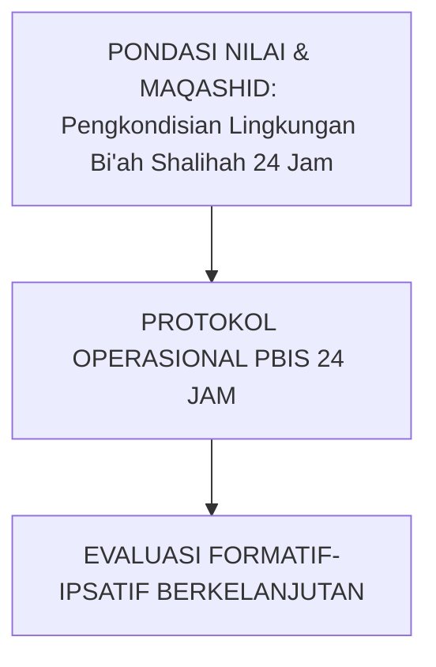

---

### Protokol Aksi Operasional Berjenjang

1. **Langkah Preventif Universal (Tahap Persiapan)**: Pengkondisian sarana, sosialisasi SOP, dan pembiasaan keteladanan *Qudwah Hasanah*.
2. **Langkah Eksekusi Lapangan (Tahap Berjalan)**: Pendampingan lekat oleh musyrif asrama dan wali kelas dengan prinsip *Firm & Kind*.
3. **Langkah Refleksi & Restorasi (Tahap Evaluasi)**: Pencatatan pada logbook digital dan penanganan kendala melalui dialog restoratif.


---


# SUB-BAB 2.3: SISTEM APRESIASI RASIO EMAS 4:1 (APRESIASI VS TEGURAN)
## *Kajian Mendalam & Panduan Implementatif Ekosistem TUMBUH Pesantren*

**Kode Klasifikasi**: `BOOK-04/BAB-02/SUB-03/MONOGRAF-MASTER-VIBRANT`  
**Disiplin Ilmu**: Metodologi Pendidikan Islam, Sains Perilaku Terapan, & Tata Kelola Pesantren  
**Penanggung Jawab Keilmuan**: Dewan Pakar Ekosistem TUMBUH (*24 Bidang Kepakaran*)

---

### Eksplanasi Teoretis & Urgensi Praksis

Pendidikan karakter yang efektif dalam Sistem TUMBUH membutuhkan kejelasan operasional pada aspek **Sistem Apresiasi Rasio Emas 4:1 (Apresiasi vs Teguran)**. Naskah ini menguraikan landasan filosofis Turats, bukti empiris sains perilaku, dan protokol implementasi lapangan 24 jam.

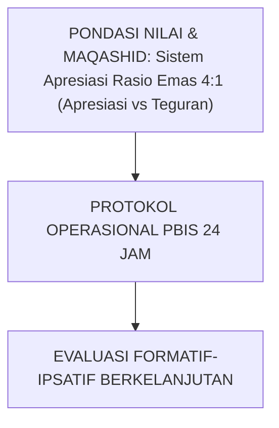

---

### Protokol Aksi Operasional Berjenjang

1. **Langkah Preventif Universal (Tahap Persiapan)**: Pengkondisian sarana, sosialisasi SOP, dan pembiasaan keteladanan *Qudwah Hasanah*.
2. **Langkah Eksekusi Lapangan (Tahap Berjalan)**: Pendampingan lekat oleh musyrif asrama dan wali kelas dengan prinsip *Firm & Kind*.
3. **Langkah Refleksi & Restorasi (Tahap Evaluasi)**: Pencatatan pada logbook digital dan penanganan kendala melalui dialog restoratif.


---


# SUB-BAB 2.4: PENGAJARAN EKSPLISIT ADAB DI AWAL TAHUN AJARAN BARU
## *Kajian Mendalam & Panduan Implementatif Ekosistem TUMBUH Pesantren*

**Kode Klasifikasi**: `BOOK-04/BAB-02/SUB-04/MONOGRAF-MASTER-VIBRANT`  
**Disiplin Ilmu**: Metodologi Pendidikan Islam, Sains Perilaku Terapan, & Tata Kelola Pesantren  
**Penanggung Jawab Keilmuan**: Dewan Pakar Ekosistem TUMBUH (*24 Bidang Kepakaran*)

---

### Eksplanasi Teoretis & Urgensi Praksis

Pendidikan karakter yang efektif dalam Sistem TUMBUH membutuhkan kejelasan operasional pada aspek **Pengajaran Eksplisit Adab di Awal Tahun Ajaran Baru**. Naskah ini menguraikan landasan filosofis Turats, bukti empiris sains perilaku, dan protokol implementasi lapangan 24 jam.

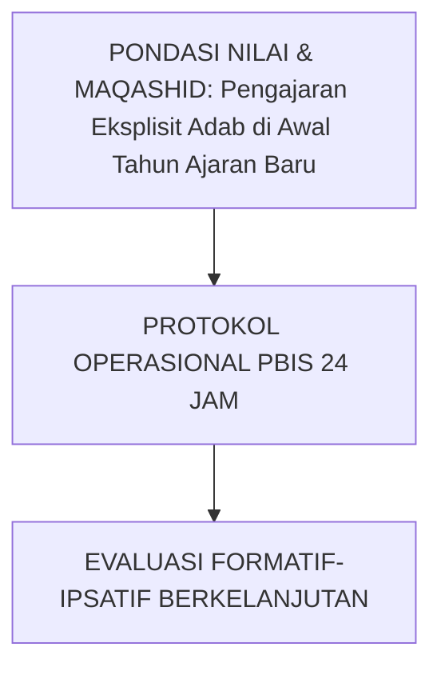

---

### Protokol Aksi Operasional Berjenjang

1. **Langkah Preventif Universal (Tahap Persiapan)**: Pengkondisian sarana, sosialisasi SOP, dan pembiasaan keteladanan *Qudwah Hasanah*.
2. **Langkah Eksekusi Lapangan (Tahap Berjalan)**: Pendampingan lekat oleh musyrif asrama dan wali kelas dengan prinsip *Firm & Kind*.
3. **Langkah Refleksi & Restorasi (Tahap Evaluasi)**: Pencatatan pada logbook digital dan penanganan kendala melalui dialog restoratif.


---


# SUB-BAB 2.5: PATROLI TITIK RAWAN (HOTSPOTS MONITORING PROTOCOL)
## *Kajian Mendalam & Panduan Implementatif Ekosistem TUMBUH Pesantren*

**Kode Klasifikasi**: `BOOK-04/BAB-02/SUB-05/MONOGRAF-MASTER-VIBRANT`  
**Disiplin Ilmu**: Metodologi Pendidikan Islam, Sains Perilaku Terapan, & Tata Kelola Pesantren  
**Penanggung Jawab Keilmuan**: Dewan Pakar Ekosistem TUMBUH (*24 Bidang Kepakaran*)

---

### Eksplanasi Teoretis & Urgensi Praksis

Pendidikan karakter yang efektif dalam Sistem TUMBUH membutuhkan kejelasan operasional pada aspek **Patroli Titik Rawan (Hotspots Monitoring Protocol)**. Naskah ini menguraikan landasan filosofis Turats, bukti empiris sains perilaku, dan protokol implementasi lapangan 24 jam.

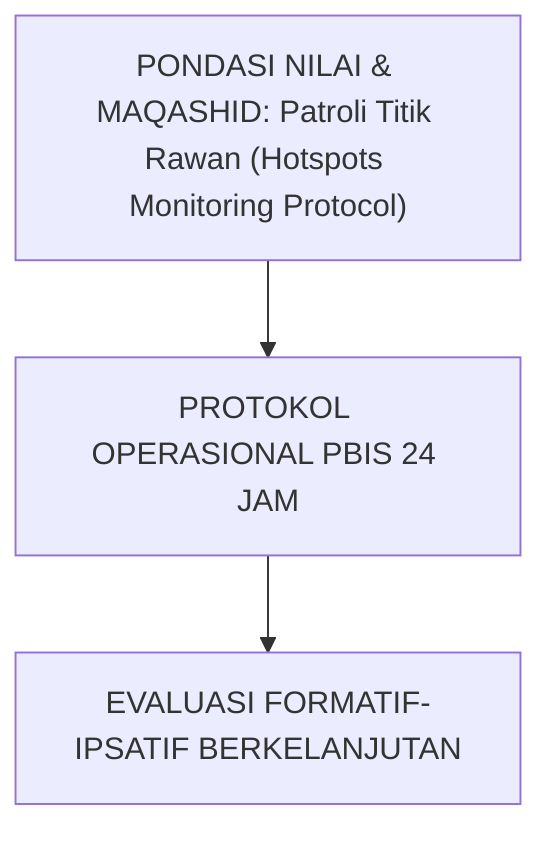

---

### Protokol Aksi Operasional Berjenjang

1. **Langkah Preventif Universal (Tahap Persiapan)**: Pengkondisian sarana, sosialisasi SOP, dan pembiasaan keteladanan *Qudwah Hasanah*.
2. **Langkah Eksekusi Lapangan (Tahap Berjalan)**: Pendampingan lekat oleh musyrif asrama dan wali kelas dengan prinsip *Firm & Kind*.
3. **Langkah Refleksi & Restorasi (Tahap Evaluasi)**: Pencatatan pada logbook digital dan penanganan kendala melalui dialog restoratif.


---


# SUB-BAB 3.1: PROTOKOL CHECK-IN / CHECK-OUT (CICO) HARIAN
## *Metodologi Pendampingan Terstruktur untuk Membangkitkan Kembali Motivasi Belajar dan Kedisiplinan Santri*

**Kode Klasifikasi**: `BOOK-04/BAB-03/SUB-01/MONOGRAF-MASTER-VIBRANT`  
**Disiplin Ilmu**: Targeted Behavioral Support, Behavioral Contracting, & Mentoring Suhbah  
**Penanggung Jawab Keilmuan**: Dewan Pakar Ekosistem TUMBUH (*Pakar PBIS & Pakar Bimbingan Konseling*)

---

### Jaring Pengaman bagi Santri Berisiko

Program CICO (Check-In Check-Out) dirancang untuk memberikan umpan balik harian yang intensif dan hangat bagi santri yang mengalami hambatan adaptasi:
* **Pagi Hari (*Morning Check-In*)**: Santri bertemu mentor musyrif selama 3 menit untuk menyepakati target adab hari itu.
* **Sepanjang Hari**: Setiap guru madrasah memberikan paraf apresiasi atas kesungguhan santri di kelas.
* **Malam Hari (*Evening Check-Out*)**: Santri menghitung total poin kebaikan bersama musyrif, merefleksikan keberhasilan, dan merencanakan perbaikan esok hari.


---


# SUB-BAB 3.2: MENTORING SEBAYA KELOMPOK KECIL (SUHBAH TARBAWIYYAH)
## *Kajian Mendalam & Panduan Implementatif Ekosistem TUMBUH Pesantren*

**Kode Klasifikasi**: `BOOK-04/BAB-03/SUB-02/MONOGRAF-MASTER-VIBRANT`  
**Disiplin Ilmu**: Metodologi Pendidikan Islam, Sains Perilaku Terapan, & Tata Kelola Pesantren  
**Penanggung Jawab Keilmuan**: Dewan Pakar Ekosistem TUMBUH (*24 Bidang Kepakaran*)

---

### Eksplanasi Teoretis & Urgensi Praksis

Pendidikan karakter yang efektif dalam Sistem TUMBUH membutuhkan kejelasan operasional pada aspek **Mentoring Sebaya Kelompok Kecil (Suhbah Tarbawiyyah)**. Naskah ini menguraikan landasan filosofis Turats, bukti empiris sains perilaku, dan protokol implementasi lapangan 24 jam.

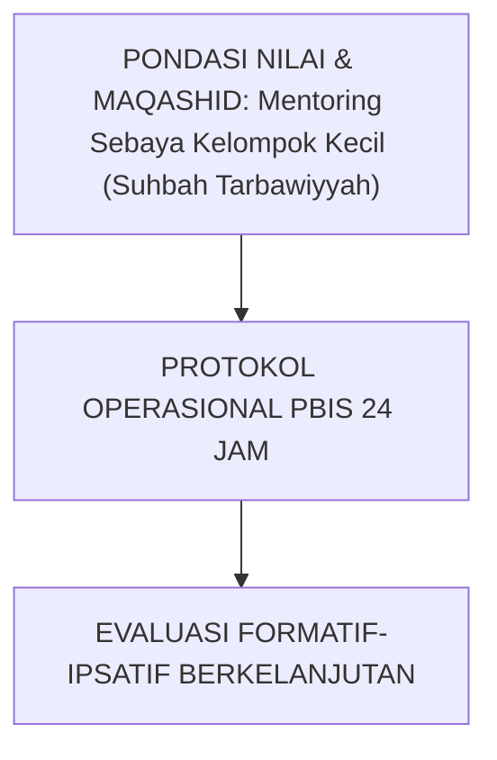

---

### Protokol Aksi Operasional Berjenjang

1. **Langkah Preventif Universal (Tahap Persiapan)**: Pengkondisian sarana, sosialisasi SOP, dan pembiasaan keteladanan *Qudwah Hasanah*.
2. **Langkah Eksekusi Lapangan (Tahap Berjalan)**: Pendampingan lekat oleh musyrif asrama dan wali kelas dengan prinsip *Firm & Kind*.
3. **Langkah Refleksi & Restorasi (Tahap Evaluasi)**: Pencatatan pada logbook digital dan penanganan kendala melalui dialog restoratif.


---


# SUB-BAB 3.3: MODIFIKASI LINGKUNGAN KAMAR & BEHAVIORAL CONTRACTING
## *Kajian Mendalam & Panduan Implementatif Ekosistem TUMBUH Pesantren*

**Kode Klasifikasi**: `BOOK-04/BAB-03/SUB-03/MONOGRAF-MASTER-VIBRANT`  
**Disiplin Ilmu**: Metodologi Pendidikan Islam, Sains Perilaku Terapan, & Tata Kelola Pesantren  
**Penanggung Jawab Keilmuan**: Dewan Pakar Ekosistem TUMBUH (*24 Bidang Kepakaran*)

---

### Eksplanasi Teoretis & Urgensi Praksis

Pendidikan karakter yang efektif dalam Sistem TUMBUH membutuhkan kejelasan operasional pada aspek **Modifikasi Lingkungan Kamar & Behavioral Contracting**. Naskah ini menguraikan landasan filosofis Turats, bukti empiris sains perilaku, dan protokol implementasi lapangan 24 jam.

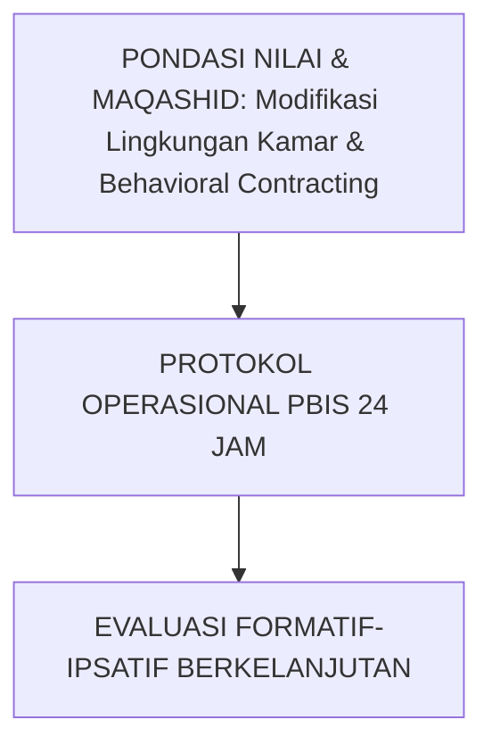

---

### Protokol Aksi Operasional Berjenjang

1. **Langkah Preventif Universal (Tahap Persiapan)**: Pengkondisian sarana, sosialisasi SOP, dan pembiasaan keteladanan *Qudwah Hasanah*.
2. **Langkah Eksekusi Lapangan (Tahap Berjalan)**: Pendampingan lekat oleh musyrif asrama dan wali kelas dengan prinsip *Firm & Kind*.
3. **Langkah Refleksi & Restorasi (Tahap Evaluasi)**: Pencatatan pada logbook digital dan penanganan kendala melalui dialog restoratif.


---


# SUB-BAB 3.4: KLINIK AKADEMIK & PENDAMPINGAN SOROGAN TERARAH
## *Kajian Mendalam & Panduan Implementatif Ekosistem TUMBUH Pesantren*

**Kode Klasifikasi**: `BOOK-04/BAB-03/SUB-04/MONOGRAF-MASTER-VIBRANT`  
**Disiplin Ilmu**: Metodologi Pendidikan Islam, Sains Perilaku Terapan, & Tata Kelola Pesantren  
**Penanggung Jawab Keilmuan**: Dewan Pakar Ekosistem TUMBUH (*24 Bidang Kepakaran*)

---

### Eksplanasi Teoretis & Urgensi Praksis

Pendidikan karakter yang efektif dalam Sistem TUMBUH membutuhkan kejelasan operasional pada aspek **Klinik Akademik & Pendampingan Sorogan Terarah**. Naskah ini menguraikan landasan filosofis Turats, bukti empiris sains perilaku, dan protokol implementasi lapangan 24 jam.

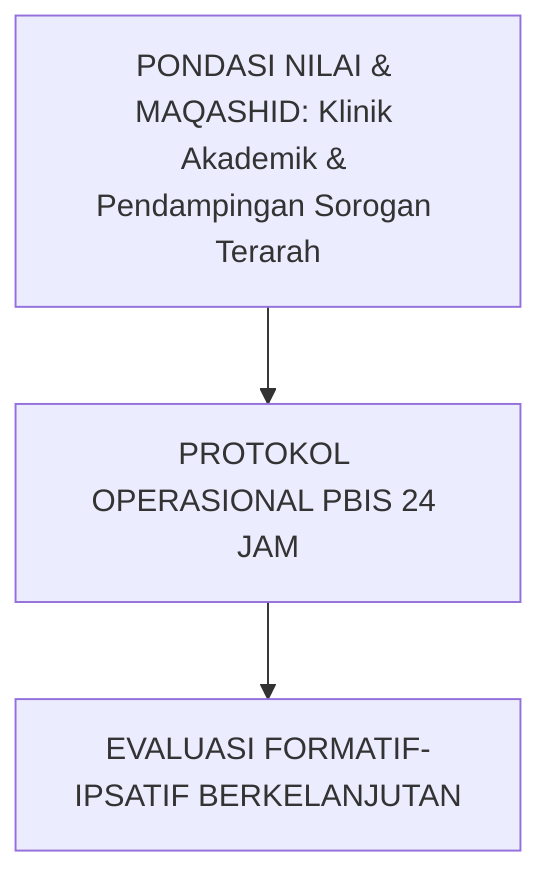

---

### Protokol Aksi Operasional Berjenjang

1. **Langkah Preventif Universal (Tahap Persiapan)**: Pengkondisian sarana, sosialisasi SOP, dan pembiasaan keteladanan *Qudwah Hasanah*.
2. **Langkah Eksekusi Lapangan (Tahap Berjalan)**: Pendampingan lekat oleh musyrif asrama dan wali kelas dengan prinsip *Firm & Kind*.
3. **Langkah Refleksi & Restorasi (Tahap Evaluasi)**: Pencatatan pada logbook digital dan penanganan kendala melalui dialog restoratif.


---


# SUB-BAB 3.5: EVALUASI PROGRES MINGGUAN & KRITERIA GRADUASI TIER 2
## *Kajian Mendalam & Panduan Implementatif Ekosistem TUMBUH Pesantren*

**Kode Klasifikasi**: `BOOK-04/BAB-03/SUB-05/MONOGRAF-MASTER-VIBRANT`  
**Disiplin Ilmu**: Metodologi Pendidikan Islam, Sains Perilaku Terapan, & Tata Kelola Pesantren  
**Penanggung Jawab Keilmuan**: Dewan Pakar Ekosistem TUMBUH (*24 Bidang Kepakaran*)

---

### Eksplanasi Teoretis & Urgensi Praksis

Pendidikan karakter yang efektif dalam Sistem TUMBUH membutuhkan kejelasan operasional pada aspek **Evaluasi Progres Mingguan & Kriteria Graduasi Tier 2**. Naskah ini menguraikan landasan filosofis Turats, bukti empiris sains perilaku, dan protokol implementasi lapangan 24 jam.


---

### Protokol Aksi Operasional Berjenjang

1. **Langkah Preventif Universal (Tahap Persiapan)**: Pengkondisian sarana, sosialisasi SOP, dan pembiasaan keteladanan *Qudwah Hasanah*.
2. **Langkah Eksekusi Lapangan (Tahap Berjalan)**: Pendampingan lekat oleh musyrif asrama dan wali kelas dengan prinsip *Firm & Kind*.
3. **Langkah Refleksi & Restorasi (Tahap Evaluasi)**: Pencatatan pada logbook digital dan penanganan kendala melalui dialog restoratif.


---


# SUB-BAB 4.1: ASESMEN FUNGSIONAL PERILAKU (FBA) & RENCANA BIP
## *Membongkar Akar Masalah Perilaku Menyimpang melalui Analisis ABC (Antecedent-Behavior-Consequence)*

**Kode Klasifikasi**: `BOOK-04/BAB-04/SUB-01/MONOGRAF-MASTER-VIBRANT`  
**Disiplin Ilmu**: Functional Behavior Assessment, Clinical Behavioral Analysis, & Individualized Support  
**Penanggung Jawab Keilmuan**: Dewan Pakar Ekosistem TUMBUH (*Pakar Bimbingan Konseling & Pakar Kuratif Restoratif*)

---

### Menemukan Akar Masalah, Bukan Memusuhi Anak

Ketika terjadi pelanggaran berat berulang, konselor BK menyusun **FBA (Functional Behavior Assessment)** untuk menganalisis:
1. **Antecedent (Pemicu)**: Situasi apa yang memicu perilaku (misal: kelelahan fisik, ejekan teman, atau kesulitan pelajaran).
2. **Behavior (Bentuk Perilaku)**: Tindakan nyata yang muncul (misal: membolos halaqah atau memukul loker).
3. **Function (Fungsi Perilaku)**: Apa yang sebenarnya dicari santri (misal: mencari perhatian, menghindari tugas yang terlalu sulit, atau pelampiasan stres).

Berdasarkan temuan FBA, disusun **BIP (Behavior Intervention Plan)** individual untuk mengajarkan perilaku pengganti yang adaptif (*Replacement Behavior*).


---


# SUB-BAB 4.2: PERUMUSAN RENCANA INTERVENSI PERILAKU (BIP) INDIVIDUAL
## *Kajian Mendalam & Panduan Implementatif Ekosistem TUMBUH Pesantren*

**Kode Klasifikasi**: `BOOK-04/BAB-04/SUB-02/MONOGRAF-MASTER-VIBRANT`  
**Disiplin Ilmu**: Metodologi Pendidikan Islam, Sains Perilaku Terapan, & Tata Kelola Pesantren  
**Penanggung Jawab Keilmuan**: Dewan Pakar Ekosistem TUMBUH (*24 Bidang Kepakaran*)

---

### Eksplanasi Teoretis & Urgensi Praksis

Pendidikan karakter yang efektif dalam Sistem TUMBUH membutuhkan kejelasan operasional pada aspek **Perumusan Rencana Intervensi Perilaku (BIP) Individual**. Naskah ini menguraikan landasan filosofis Turats, bukti empiris sains perilaku, dan protokol implementasi lapangan 24 jam.


---

### Protokol Aksi Operasional Berjenjang

1. **Langkah Preventif Universal (Tahap Persiapan)**: Pengkondisian sarana, sosialisasi SOP, dan pembiasaan keteladanan *Qudwah Hasanah*.
2. **Langkah Eksekusi Lapangan (Tahap Berjalan)**: Pendampingan lekat oleh musyrif asrama dan wali kelas dengan prinsip *Firm & Kind*.
3. **Langkah Refleksi & Restorasi (Tahap Evaluasi)**: Pencatatan pada logbook digital dan penanganan kendala melalui dialog restoratif.


---


# SUB-BAB 4.3: TEKNIK PENGGANTIAN PERILAKU ADAPTIF (REPLACEMENT BEHAVIOR)
## *Kajian Mendalam & Panduan Implementatif Ekosistem TUMBUH Pesantren*

**Kode Klasifikasi**: `BOOK-04/BAB-04/SUB-03/MONOGRAF-MASTER-VIBRANT`  
**Disiplin Ilmu**: Metodologi Pendidikan Islam, Sains Perilaku Terapan, & Tata Kelola Pesantren  
**Penanggung Jawab Keilmuan**: Dewan Pakar Ekosistem TUMBUH (*24 Bidang Kepakaran*)

---

### Eksplanasi Teoretis & Urgensi Praksis

Pendidikan karakter yang efektif dalam Sistem TUMBUH membutuhkan kejelasan operasional pada aspek **Teknik Penggantian Perilaku Adaptif (Replacement Behavior)**. Naskah ini menguraikan landasan filosofis Turats, bukti empiris sains perilaku, dan protokol implementasi lapangan 24 jam.

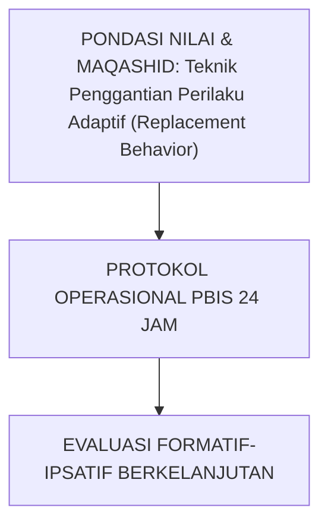

---

### Protokol Aksi Operasional Berjenjang

1. **Langkah Preventif Universal (Tahap Persiapan)**: Pengkondisian sarana, sosialisasi SOP, dan pembiasaan keteladanan *Qudwah Hasanah*.
2. **Langkah Eksekusi Lapangan (Tahap Berjalan)**: Pendampingan lekat oleh musyrif asrama dan wali kelas dengan prinsip *Firm & Kind*.
3. **Langkah Refleksi & Restorasi (Tahap Evaluasi)**: Pencatatan pada logbook digital dan penanganan kendala melalui dialog restoratif.


---


# SUB-BAB 4.4: KONSELING CBT-NARATIF ISLAMI & DE-ESKALASI TRAUMA
## *Kajian Mendalam & Panduan Implementatif Ekosistem TUMBUH Pesantren*

**Kode Klasifikasi**: `BOOK-04/BAB-04/SUB-04/MONOGRAF-MASTER-VIBRANT`  
**Disiplin Ilmu**: Metodologi Pendidikan Islam, Sains Perilaku Terapan, & Tata Kelola Pesantren  
**Penanggung Jawab Keilmuan**: Dewan Pakar Ekosistem TUMBUH (*24 Bidang Kepakaran*)

---

### Eksplanasi Teoretis & Urgensi Praksis

Pendidikan karakter yang efektif dalam Sistem TUMBUH membutuhkan kejelasan operasional pada aspek **Konseling CBT-Naratif Islami & De-eskalasi Trauma**. Naskah ini menguraikan landasan filosofis Turats, bukti empiris sains perilaku, dan protokol implementasi lapangan 24 jam.

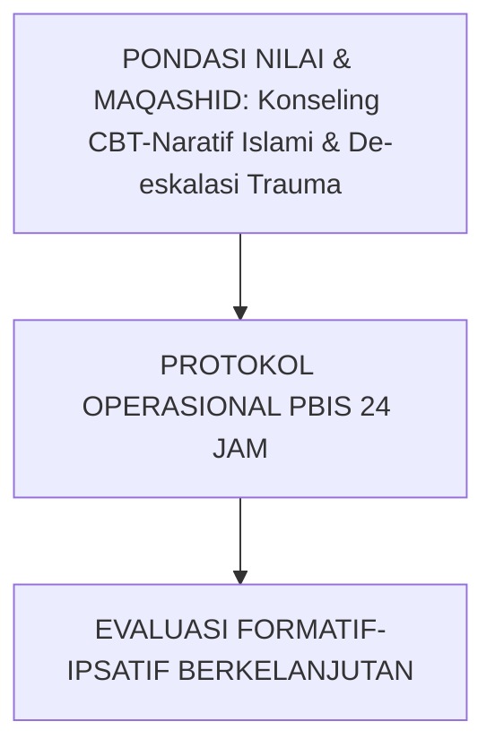

---

### Protokol Aksi Operasional Berjenjang

1. **Langkah Preventif Universal (Tahap Persiapan)**: Pengkondisian sarana, sosialisasi SOP, dan pembiasaan keteladanan *Qudwah Hasanah*.
2. **Langkah Eksekusi Lapangan (Tahap Berjalan)**: Pendampingan lekat oleh musyrif asrama dan wali kelas dengan prinsip *Firm & Kind*.
3. **Langkah Refleksi & Restorasi (Tahap Evaluasi)**: Pencatatan pada logbook digital dan penanganan kendala melalui dialog restoratif.


---


# SUB-BAB 4.5: KOLABORASI TIM KHUSUS BK, WALI KELAS, DAN WALI SANTRI
## *Kajian Mendalam & Panduan Implementatif Ekosistem TUMBUH Pesantren*

**Kode Klasifikasi**: `BOOK-04/BAB-04/SUB-05/MONOGRAF-MASTER-VIBRANT`  
**Disiplin Ilmu**: Metodologi Pendidikan Islam, Sains Perilaku Terapan, & Tata Kelola Pesantren  
**Penanggung Jawab Keilmuan**: Dewan Pakar Ekosistem TUMBUH (*24 Bidang Kepakaran*)

---

### Eksplanasi Teoretis & Urgensi Praksis

Pendidikan karakter yang efektif dalam Sistem TUMBUH membutuhkan kejelasan operasional pada aspek **Kolaborasi Tim Khusus BK, Wali Kelas, dan Wali Santri**. Naskah ini menguraikan landasan filosofis Turats, bukti empiris sains perilaku, dan protokol implementasi lapangan 24 jam.

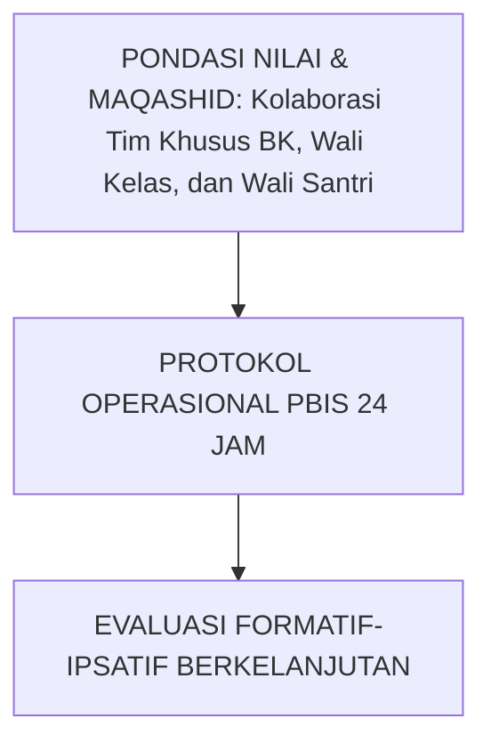

---

### Protokol Aksi Operasional Berjenjang

1. **Langkah Preventif Universal (Tahap Persiapan)**: Pengkondisian sarana, sosialisasi SOP, dan pembiasaan keteladanan *Qudwah Hasanah*.
2. **Langkah Eksekusi Lapangan (Tahap Berjalan)**: Pendampingan lekat oleh musyrif asrama dan wali kelas dengan prinsip *Firm & Kind*.
3. **Langkah Refleksi & Restorasi (Tahap Evaluasi)**: Pencatatan pada logbook digital dan penanganan kendala melalui dialog restoratif.


---


# SUB-BAB 5.1: MODEL RESTORATIF 3R (RESTITUTION, RESOLUTION, RECONCILIATION)
## *Prinsip Ishlah al-Bain dalam Khazanah Fiqh Islam: Memulihkan Korban, Membimbing Pelaku, dan Menjaga Harmoni Ukhuwah*

**Kode Klasifikasi**: `BOOK-04/BAB-05/SUB-01/MONOGRAF-MASTER-VIBRANT`  
**Disiplin Ilmu**: Whole-School Restorative Justice, Maqashid Syari'ah Jinayah, & Resolusi Konflik  
**Penanggung Jawab Keilmuan**: Dewan Pakar Ekosistem TUMBUH (*Pakar Kuratif Restoratif & Pakar Arsitektur PBIS Restoratif*)

---

### Tiga Pilar Keadilan Restoratif Islam

Sistem TUMBUH memandang pelanggaran sebagai luka dalam hubungan persaudaraan (*Kharaq al-Ukhuwwah*), bukan sekadar pelanggaran pasal hukum:
1. **Restitution (Restitusi/Ganti Rugi Nyata)**: Pelaku memperbaiki kerusakan fisik atau psikologis yang ditimbulkan (misal: mengganti barang, meminta maaf tulus, membantu korban).
2. **Resolution (Resolusi Masalah)**: Menyepakati komitmen konkret agar insiden serupa tidak terulang di masa depan.
3. **Reconciliation (Rekonsiliasi/Ishlah al-Bain)**: Memulihkan persaudaraan kedua belah pihak secara tuntas tanpa menyimpan dendam batin di kamar asrama.


---


# SUB-BAB 5.2: RESTORATIVE CHAT: 5 PERTANYAAN EMAS PEMBINA ASRAMA
## *Kajian Mendalam & Panduan Implementatif Ekosistem TUMBUH Pesantren*

**Kode Klasifikasi**: `BOOK-04/BAB-05/SUB-02/MONOGRAF-MASTER-VIBRANT`  
**Disiplin Ilmu**: Metodologi Pendidikan Islam, Sains Perilaku Terapan, & Tata Kelola Pesantren  
**Penanggung Jawab Keilmuan**: Dewan Pakar Ekosistem TUMBUH (*24 Bidang Kepakaran*)

---

### Eksplanasi Teoretis & Urgensi Praksis

Pendidikan karakter yang efektif dalam Sistem TUMBUH membutuhkan kejelasan operasional pada aspek **Restorative Chat: 5 Pertanyaan Emas Pembina Asrama**. Naskah ini menguraikan landasan filosofis Turats, bukti empiris sains perilaku, dan protokol implementasi lapangan 24 jam.

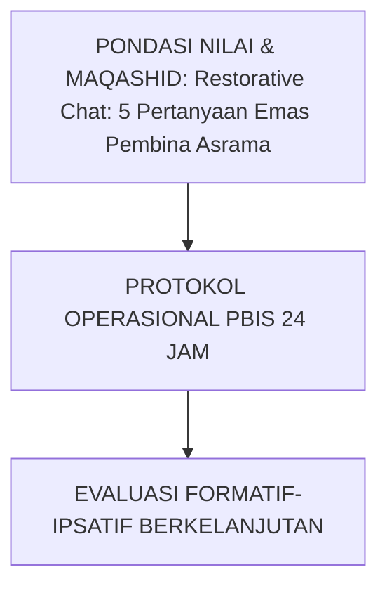

---

### Protokol Aksi Operasional Berjenjang

1. **Langkah Preventif Universal (Tahap Persiapan)**: Pengkondisian sarana, sosialisasi SOP, dan pembiasaan keteladanan *Qudwah Hasanah*.
2. **Langkah Eksekusi Lapangan (Tahap Berjalan)**: Pendampingan lekat oleh musyrif asrama dan wali kelas dengan prinsip *Firm & Kind*.
3. **Langkah Refleksi & Restorasi (Tahap Evaluasi)**: Pencatatan pada logbook digital dan penanganan kendala melalui dialog restoratif.


---


# SUB-BAB 5.3: LINGKARAN RESTORATIF ASRAMA (DORMITORY TALKING CIRCLES)
## *Kajian Mendalam & Panduan Implementatif Ekosistem TUMBUH Pesantren*

**Kode Klasifikasi**: `BOOK-04/BAB-05/SUB-03/MONOGRAF-MASTER-VIBRANT`  
**Disiplin Ilmu**: Metodologi Pendidikan Islam, Sains Perilaku Terapan, & Tata Kelola Pesantren  
**Penanggung Jawab Keilmuan**: Dewan Pakar Ekosistem TUMBUH (*24 Bidang Kepakaran*)

---

### Eksplanasi Teoretis & Urgensi Praksis

Pendidikan karakter yang efektif dalam Sistem TUMBUH membutuhkan kejelasan operasional pada aspek **Lingkaran Restoratif Asrama (Dormitory Talking Circles)**. Naskah ini menguraikan landasan filosofis Turats, bukti empiris sains perilaku, dan protokol implementasi lapangan 24 jam.

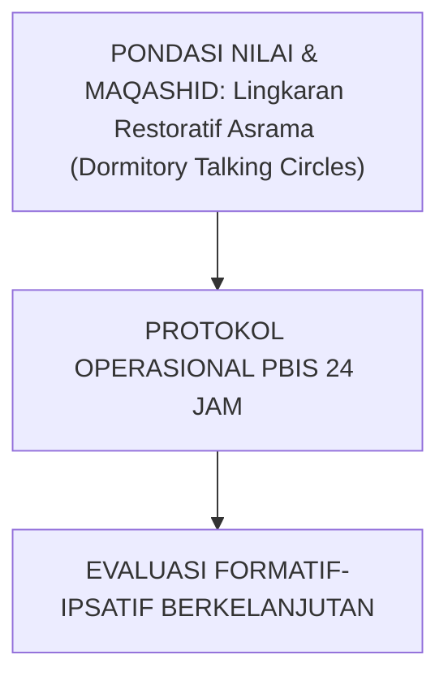

---

### Protokol Aksi Operasional Berjenjang

1. **Langkah Preventif Universal (Tahap Persiapan)**: Pengkondisian sarana, sosialisasi SOP, dan pembiasaan keteladanan *Qudwah Hasanah*.
2. **Langkah Eksekusi Lapangan (Tahap Berjalan)**: Pendampingan lekat oleh musyrif asrama dan wali kelas dengan prinsip *Firm & Kind*.
3. **Langkah Refleksi & Restorasi (Tahap Evaluasi)**: Pencatatan pada logbook digital dan penanganan kendala melalui dialog restoratif.


---


# SUB-BAB 5.4: MEDIASI SEBAYA PELAJAR (PEER MEDIATION PROGRAM)
## *Kajian Mendalam & Panduan Implementatif Ekosistem TUMBUH Pesantren*

**Kode Klasifikasi**: `BOOK-04/BAB-05/SUB-04/MONOGRAF-MASTER-VIBRANT`  
**Disiplin Ilmu**: Metodologi Pendidikan Islam, Sains Perilaku Terapan, & Tata Kelola Pesantren  
**Penanggung Jawab Keilmuan**: Dewan Pakar Ekosistem TUMBUH (*24 Bidang Kepakaran*)

---

### Eksplanasi Teoretis & Urgensi Praksis

Pendidikan karakter yang efektif dalam Sistem TUMBUH membutuhkan kejelasan operasional pada aspek **Mediasi Sebaya Pelajar (Peer Mediation Program)**. Naskah ini menguraikan landasan filosofis Turats, bukti empiris sains perilaku, dan protokol implementasi lapangan 24 jam.

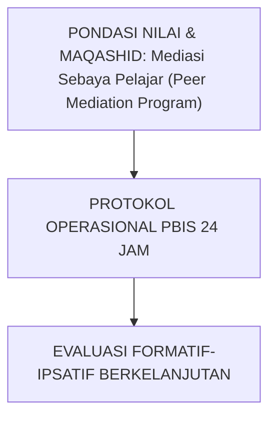

---

### Protokol Aksi Operasional Berjenjang

1. **Langkah Preventif Universal (Tahap Persiapan)**: Pengkondisian sarana, sosialisasi SOP, dan pembiasaan keteladanan *Qudwah Hasanah*.
2. **Langkah Eksekusi Lapangan (Tahap Berjalan)**: Pendampingan lekat oleh musyrif asrama dan wali kelas dengan prinsip *Firm & Kind*.
3. **Langkah Refleksi & Restorasi (Tahap Evaluasi)**: Pencatatan pada logbook digital dan penanganan kendala melalui dialog restoratif.


---


# SUB-BAB 5.5: DEKONSTRUKSI POLA BALAS DENDAM & SIKLUS KEKERASAN ASRAMA
## *Kajian Mendalam & Panduan Implementatif Ekosistem TUMBUH Pesantren*

**Kode Klasifikasi**: `BOOK-04/BAB-05/SUB-05/MONOGRAF-MASTER-VIBRANT`  
**Disiplin Ilmu**: Metodologi Pendidikan Islam, Sains Perilaku Terapan, & Tata Kelola Pesantren  
**Penanggung Jawab Keilmuan**: Dewan Pakar Ekosistem TUMBUH (*24 Bidang Kepakaran*)

---

### Eksplanasi Teoretis & Urgensi Praksis

Pendidikan karakter yang efektif dalam Sistem TUMBUH membutuhkan kejelasan operasional pada aspek **Dekonstruksi Pola Balas Dendam & Siklus Kekerasan Asrama**. Naskah ini menguraikan landasan filosofis Turats, bukti empiris sains perilaku, dan protokol implementasi lapangan 24 jam.


---

### Protokol Aksi Operasional Berjenjang

1. **Langkah Preventif Universal (Tahap Persiapan)**: Pengkondisian sarana, sosialisasi SOP, dan pembiasaan keteladanan *Qudwah Hasanah*.
2. **Langkah Eksekusi Lapangan (Tahap Berjalan)**: Pendampingan lekat oleh musyrif asrama dan wali kelas dengan prinsip *Firm & Kind*.
3. **Langkah Refleksi & Restorasi (Tahap Evaluasi)**: Pencatatan pada logbook digital dan penanganan kendala melalui dialog restoratif.


---


# SUB-BAB 6.1: KEBIJAKAN LEMBARAN BERSIH (CLEAN SLATE POLICY)
## *Menghapus Dosa Masa Lalu: Menjamin Hak Santri untuk Membuka Lembaran Baru Tanpa Bayang-Bayang Label Negatif*

**Kode Klasifikasi**: `BOOK-04/BAB-06/SUB-01/MONOGRAF-MASTER-VIBRANT`  
**Disiplin Ilmu**: Reintegrasi Sosial Santri, Teori Taubat Nasuha, & Etika Konseling  
**Penanggung Jawab Keilmuan**: Dewan Pakar Ekosistem TUMBUH (*Pakar Advokasi Santri & Pakar Kuratif Restoratif*)

---

### Hak untuk Diberi Kesempatan Kedua

Sistem TUMBUH menerapkan doktrin syariat **At-Ta'ibu minaz Zanbi ka man La Zanba Lah** (Orang yang bertaubat dari dosa seperti orang yang tidak berdosa sama sekali):
* **Clean Slate Policy**: Setelah proses restorasi selesai dan disahkan dalam Sidang Ishlah, catatan sanksi ditutup dan santri mendapatkan hak penuh untuk berprestasi, menjadi pengurus organisasi, dan memimpin adik kelas tanpa ada diskriminasi masa lalu.


---


# SUB-BAB 6.2: PROTOKOL SIDANG ISHLAH AL-BAIN DIPIMPIN DEWAN KIAI
## *Kajian Mendalam & Panduan Implementatif Ekosistem TUMBUH Pesantren*

**Kode Klasifikasi**: `BOOK-04/BAB-06/SUB-02/MONOGRAF-MASTER-VIBRANT`  
**Disiplin Ilmu**: Metodologi Pendidikan Islam, Sains Perilaku Terapan, & Tata Kelola Pesantren  
**Penanggung Jawab Keilmuan**: Dewan Pakar Ekosistem TUMBUH (*24 Bidang Kepakaran*)

---

### Eksplanasi Teoretis & Urgensi Praksis

Pendidikan karakter yang efektif dalam Sistem TUMBUH membutuhkan kejelasan operasional pada aspek **Protokol Sidang Ishlah al-Bain Dipimpin Dewan Kiai**. Naskah ini menguraikan landasan filosofis Turats, bukti empiris sains perilaku, dan protokol implementasi lapangan 24 jam.

```mermaid
graph TD
    Tujuan["PONDASI NILAI & MAQASHID: Protokol Sidang Ishlah al-Bain Dipimpin Dewan Kiai"] --> Operasional["PROTOKOL OPERASIONAL PBIS 24 JAM"]
    Operasional --> Evaluasi["EVALUASI FORMATIF-IPSATIF BERKELANJUTAN"]
```

---

### Protokol Aksi Operasional Berjenjang

1. **Langkah Preventif Universal (Tahap Persiapan)**: Pengkondisian sarana, sosialisasi SOP, dan pembiasaan keteladanan *Qudwah Hasanah*.
2. **Langkah Eksekusi Lapangan (Tahap Berjalan)**: Pendampingan lekat oleh musyrif asrama dan wali kelas dengan prinsip *Firm & Kind*.
3. **Langkah Refleksi & Restorasi (Tahap Evaluasi)**: Pencatatan pada logbook digital dan penanganan kendala melalui dialog restoratif.


---


# SUB-BAB 6.3: RESTITUSI TINDAKAN NYATA & KHIDMAH PERBAIKAN HUBUNGAN
## *Kajian Mendalam & Panduan Implementatif Ekosistem TUMBUH Pesantren*

**Kode Klasifikasi**: `BOOK-04/BAB-06/SUB-03/MONOGRAF-MASTER-VIBRANT`  
**Disiplin Ilmu**: Metodologi Pendidikan Islam, Sains Perilaku Terapan, & Tata Kelola Pesantren  
**Penanggung Jawab Keilmuan**: Dewan Pakar Ekosistem TUMBUH (*24 Bidang Kepakaran*)

---

### Eksplanasi Teoretis & Urgensi Praksis

Pendidikan karakter yang efektif dalam Sistem TUMBUH membutuhkan kejelasan operasional pada aspek **Restitusi Tindakan Nyata & Khidmah Perbaikan Hubungan**. Naskah ini menguraikan landasan filosofis Turats, bukti empiris sains perilaku, dan protokol implementasi lapangan 24 jam.

```mermaid
graph TD
    Tujuan["PONDASI NILAI & MAQASHID: Restitusi Tindakan Nyata & Khidmah Perbaikan Hubungan"] --> Operasional["PROTOKOL OPERASIONAL PBIS 24 JAM"]
    Operasional --> Evaluasi["EVALUASI FORMATIF-IPSATIF BERKELANJUTAN"]
```

---

### Protokol Aksi Operasional Berjenjang

1. **Langkah Preventif Universal (Tahap Persiapan)**: Pengkondisian sarana, sosialisasi SOP, dan pembiasaan keteladanan *Qudwah Hasanah*.
2. **Langkah Eksekusi Lapangan (Tahap Berjalan)**: Pendampingan lekat oleh musyrif asrama dan wali kelas dengan prinsip *Firm & Kind*.
3. **Langkah Refleksi & Restorasi (Tahap Evaluasi)**: Pencatatan pada logbook digital dan penanganan kendala melalui dialog restoratif.


---


# SUB-BAB 6.4: REINTEGRASI SOSIAL SANTRI PASCA-SANKSI RESTORATIF
## *Kajian Mendalam & Panduan Implementatif Ekosistem TUMBUH Pesantren*

**Kode Klasifikasi**: `BOOK-04/BAB-06/SUB-04/MONOGRAF-MASTER-VIBRANT`  
**Disiplin Ilmu**: Metodologi Pendidikan Islam, Sains Perilaku Terapan, & Tata Kelola Pesantren  
**Penanggung Jawab Keilmuan**: Dewan Pakar Ekosistem TUMBUH (*24 Bidang Kepakaran*)

---

### Eksplanasi Teoretis & Urgensi Praksis

Pendidikan karakter yang efektif dalam Sistem TUMBUH membutuhkan kejelasan operasional pada aspek **Reintegrasi Sosial Santri Pasca-Sanksi Restoratif**. Naskah ini menguraikan landasan filosofis Turats, bukti empiris sains perilaku, dan protokol implementasi lapangan 24 jam.

```mermaid
graph TD
    Tujuan["PONDASI NILAI & MAQASHID: Reintegrasi Sosial Santri Pasca-Sanksi Restoratif"] --> Operasional["PROTOKOL OPERASIONAL PBIS 24 JAM"]
    Operasional --> Evaluasi["EVALUASI FORMATIF-IPSATIF BERKELANJUTAN"]
```

---

### Protokol Aksi Operasional Berjenjang

1. **Langkah Preventif Universal (Tahap Persiapan)**: Pengkondisian sarana, sosialisasi SOP, dan pembiasaan keteladanan *Qudwah Hasanah*.
2. **Langkah Eksekusi Lapangan (Tahap Berjalan)**: Pendampingan lekat oleh musyrif asrama dan wali kelas dengan prinsip *Firm & Kind*.
3. **Langkah Refleksi & Restorasi (Tahap Evaluasi)**: Pencatatan pada logbook digital dan penanganan kendala melalui dialog restoratif.


---


# SUB-BAB 6.5: EPILOG: PESANTREN YANG MENYEMBUHKAN DAN MENGHIDUPKAN JIWA
## *Kajian Mendalam & Panduan Implementatif Ekosistem TUMBUH Pesantren*

**Kode Klasifikasi**: `BOOK-04/BAB-06/SUB-05/MONOGRAF-MASTER-VIBRANT`  
**Disiplin Ilmu**: Metodologi Pendidikan Islam, Sains Perilaku Terapan, & Tata Kelola Pesantren  
**Penanggung Jawab Keilmuan**: Dewan Pakar Ekosistem TUMBUH (*24 Bidang Kepakaran*)

---

### Eksplanasi Teoretis & Urgensi Praksis

Pendidikan karakter yang efektif dalam Sistem TUMBUH membutuhkan kejelasan operasional pada aspek **Epilog: Pesantren yang Menyembuhkan dan Menghidupkan Jiwa**. Naskah ini menguraikan landasan filosofis Turats, bukti empiris sains perilaku, dan protokol implementasi lapangan 24 jam.

```mermaid
graph TD
    Tujuan["PONDASI NILAI & MAQASHID: Epilog: Pesantren yang Menyembuhkan dan Menghidupkan Jiwa"] --> Operasional["PROTOKOL OPERASIONAL PBIS 24 JAM"]
    Operasional --> Evaluasi["EVALUASI FORMATIF-IPSATIF BERKELANJUTAN"]
```

---

### Protokol Aksi Operasional Berjenjang

1. **Langkah Preventif Universal (Tahap Persiapan)**: Pengkondisian sarana, sosialisasi SOP, dan pembiasaan keteladanan *Qudwah Hasanah*.
2. **Langkah Eksekusi Lapangan (Tahap Berjalan)**: Pendampingan lekat oleh musyrif asrama dan wali kelas dengan prinsip *Firm & Kind*.
3. **Langkah Refleksi & Restorasi (Tahap Evaluasi)**: Pencatatan pada logbook digital dan penanganan kendala melalui dialog restoratif.


---


# DAFTAR PUSTAKA LENGKAP BUKU VOLUME 04
## *Rujukan Standar APA 7th Edition & Turats Klasik Intervensi PBIS & Restoratif*

1. **Al-Bukhari, Abu Abdillah Muhammad bin Ismail.** (2002). *Shahih Al-Bukhari: Kitab al-Mazhalim wal Qishash*. Riyadh: Bait Al-Afkar Ad-Dauliyyah.
2. **Crone, D. A., Hawken, L. S., & Horner, R. H.** (2015). *Building Positive Behavior Support Systems in Schools: Functional Behavioral Assessment* (2nd ed.). New York: Guilford Press.
3. **Ibnu Taimiyyah, Ahmad.** (2005). *Majmu' al-Fatawa: Kitab al-Hudud wal Ta'zirat*. Madinah: Majma' Malik Fahd.
4. **Nelsen, J.** (2006). *Positive Discipline: The Classic Guide to Helping Children Develop Self-Discipline, Responsibility, Cooperation, and Problem-Solving Skills*. New York: Ballantine Books.
5. **Sugai, G., & Horner, R. H.** (2006). *A promising approach for expanding and sustaining school-wide positive behavior support*. *School Psychology Review*, 35(2), 245–259.
6. **Zehr, H.** (2015). *The Little Book of Restorative Justice: Revised and Updated*. New York: Good Books.

