# BUKU VOLUME 04: PEDOMAN INTERVENSI BERJENJANG PBIS & PRAKTIK RESTORATIF DI ASRAMA
## *Arsitektur Multi-Tier 1–3, Check-In/Check-Out (CICO), FBA/BIP, Lingkaran Restoratif, & Ishlah Al-Bain Pesantren*

---

**Nomor Buku**: `BOOK-SERIES/VOL-04/MASTER-2026`  
**Seri Publikasi**: Seri Buku Master Ekosistem TUMBUH Pesantren (Volume 4 dari 5)  
**Dewan Editor & Penulis**: Dewan Keilmuan Ekosistem TUMBUH (24 Bidang Kepakaran)  
**Klasifikasi**: Monograf Riset Akademis, Manual Operasional Intervensi Perilaku, Disiplin Positif, & Whole-School Restorative Justice  

---

## 📑 DAFTAR ISI LENGKAP VOLUME 04

- [BAB 01 PARADIGMA POSITIVE BEHAVIORAL INTERVENTIONS AND SUPPORTS](#bab-01-paradigma-positive-behavioral-interventions-and-supports)
  - [01 Landasan Sistemik PBIS dan Eliminasi Punitive System](#01-landasan-sistemik-pbis-dan-eliminasi-punitive-system)
  - [02 Proporsi Piramida 80 15 5 di Lingkungan Pesantren](#02-proporsi-piramida-80-15-5-di-lingkungan-pesantren)
  - [03 Integrasi Nilai Syar'i dalam Kerangka Kerja PBIS](#03-integrasi-nilai-syar'i-dalam-kerangka-kerja-pbis)
- [BAB 02 REKAYASA LINGKUNGAN BIAH SHALIHAH DAN TIER 1 UNIVERSAL](#bab-02-rekayasa-lingkungan-biah-shalihah-dan-tier-1-universal)
  - [01 Matriks Ekspektasi Perilaku Positif Seluruh Zona](#01-matriks-ekspektasi-perilaku-positif-seluruh-zona)
  - [02 Pengkondisian Lingkungan Biah Shalihah 24 Jam](#02-pengkondisian-lingkungan-biah-shalihah-24-jam)
  - [03 Pengajaran Eksplisit Adab di Awal Tahun Ajaran](#03-pengajaran-eksplisit-adab-di-awal-tahun-ajaran)
  - [04 Penataan Ruang Fisik Asrama Ramah Tumbuh Kembang](#04-penataan-ruang-fisik-asrama-ramah-tumbuh-kembang)
  - [05 Patroli Titik Rawan Hotspots Monitoring Protocol](#05-patroli-titik-rawan-hotspots-monitoring-protocol)
  - [06 Kultur Keteladanan Qudwah Seluruh Civitas](#06-kultur-keteladanan-qudwah-seluruh-civitas)
- [BAB 03 BUDAYA APRESIASI POSITIF RASIO 4 BANDING 1](#bab-03-budaya-apresiasi-positif-rasio-4-banding-1)
  - [01 Sistem Apresiasi Rasio Emas 4 Banding 1](#01-sistem-apresiasi-rasio-emas-4-banding-1)
  - [02 Psikologi Penguatan Positif vs Pemberian Hadiah Material](#02-psikologi-penguatan-positif-vs-pemberian-hadiah-material)
  - [03 Ritual Circle of Gratitude Malam Kamar Asrama](#03-ritual-circle-of-gratitude-malam-kamar-asrama)
- [BAB 04 INTERVENSI TIER 2 TARGETED CICO DAN MENTORING SUHBAH](#bab-04-intervensi-tier-2-targeted-cico-dan-mentoring-suhbah)
  - [01 Protokol Check In Check Out Harian Musyrif](#01-protokol-check-in-check-out-harian-musyrif)
  - [02 Mentoring Sebaya Kelompok Kecil Suhbah Tarbawiyyah](#02-mentoring-sebaya-kelompok-kecil-suhbah-tarbawiyyah)
  - [03 Modifikasi Lingkungan Kamar dan Behavioral Contracting](#03-modifikasi-lingkungan-kamar-dan-behavioral-contracting)
  - [04 Klinik Akademik dan Pendampingan Sorogan Terarah](#04-klinik-akademik-dan-pendampingan-sorogan-terarah)
  - [05 Evaluasi Progres Mingguan dan Kriteria Graduasi Tier 2](#05-evaluasi-progres-mingguan-dan-kriteria-graduasi-tier-2)
- [BAB 05 INTERVENSI TIER 3 INTENSIF FBA KLINIS DAN BIP](#bab-05-intervensi-tier-3-intensif-fba-klinis-dan-bip)
  - [01 Asesmen Fungsional Perilaku FBA Komprehensif](#01-asesmen-fungsional-perilaku-fba-komprehensif)
  - [02 Perumusan Rencana Intervensi Perilaku BIP Individual](#02-perumusan-rencana-intervensi-perilaku-bip-individual)
  - [03 Teknik Penggantian Perilaku Adaptif Replacement Behavior](#03-teknik-penggantian-perilaku-adaptif-replacement-behavior)
  - [04 Konseling CBT Naratif Islami dan De eskalasi Trauma](#04-konseling-cbt-naratif-islami-dan-de-eskalasi-trauma)
  - [05 Kolaborasi Tim Khusus BK Wali Kelas dan Orang Tua](#05-kolaborasi-tim-khusus-bk-wali-kelas-dan-orang-tua)
- [BAB 06 WHOLE SCHOOL RESTORATIVE JUSTICE DI PESANTREN](#bab-06-whole-school-restorative-justice-di-pesantren)
  - [01 Model Restoratif 3R Restitution Resolution Reconciliation](#01-model-restoratif-3r-restitution-resolution-reconciliation)
  - [02 Restorative Chat 5 Pertanyaan Emas Pembina](#02-restorative-chat-5-pertanyaan-emas-pembina)
  - [03 Dekonstruksi Pola Balas Dendam dan Siklus Kekerasan](#03-dekonstruksi-pola-balas-dendam-dan-siklus-kekerasan)
  - [04 Peran Dewan Kiai sebagai Hakam Keadilan Restoratif](#04-peran-dewan-kiai-sebagai-hakam-keadilan-restoratif)
- [BAB 07 PROTOKOL LINGKARAN RESTORATIF DAN MEDIASI SEBAYA](#bab-07-protokol-lingkaran-restoratif-dan-mediasi-sebaya)
  - [01 Lingkaran Restoratif Asrama Dormitory Talking Circles](#01-lingkaran-restoratif-asrama-dormitory-talking-circles)
  - [02 Mediasi Sebaya Pelajar Peer Mediation Program](#02-mediasi-sebaya-pelajar-peer-mediation-program)
  - [03 Pelatihan Keterampilan Komunikasi Nirkekerasan Santri](#03-pelatihan-keterampilan-komunikasi-nirkekerasan-santri)
  - [04 Penyelesaian Konflik Horizontal Antar Kamar Asrama](#04-penyelesaian-konflik-horizontal-antar-kamar-asrama)
- [BAB 08 ISHLAH AL BAIN CLEAN SLATE POLICY DAN REINTEGRASI](#bab-08-ishlah-al-bain-clean-slate-policy-dan-reintegrasi)
  - [01 Kebijakan Lembaran Bersih Clean Slate Policy](#01-kebijakan-lembaran-bersih-clean-slate-policy)
  - [02 Protokol Sidang Ishlah al Bain Dewan Kiai](#02-protokol-sidang-ishlah-al-bain-dewan-kiai)
  - [03 Restitusi Tindakan Nyata dan Khidmah Perbaikan](#03-restitusi-tindakan-nyata-dan-khidmah-perbaikan)
  - [04 Reintegrasi Sosial Santri Pasca Sanksi Restoratif](#04-reintegrasi-sosial-santri-pasca-sanksi-restoratif)
  - [05 Epilog Pesantren yang Menyembuhkan dan Menghidupkan Jiwa](#05-epilog-pesantren-yang-menyembuhkan-dan-menghidupkan-jiwa)
- [DAFTAR PUSTAKA LENGKAP VOLUME 04](#daftar-pustaka-lengkap-volume-04)

---

# SUB-BAB 1.1: LANDASAN SISTEMIK PBIS & ELIMINASI SISTEM PUNITIF
## *Kajian Mendalam & Panduan Implementatif Ekosistem TUMBUH Pesantren*

**Kode Klasifikasi**: `BOOK-04/BAB-01/SUB-01/MONOGRAF-MASTER-VIBRANT`  
**Disiplin Ilmu**: Metodologi Pendidikan Islam, Sains Perilaku Terapan, & Tata Kelola Pesantren  
**Penanggung Jawab Keilmuan**: Dewan Pakar Ekosistem TUMBUH (*24 Bidang Kepakaran*)

---

### Eksplanasi Teoretis & Urgensi Praksis

Pendidikan karakter yang efektif dalam Sistem TUMBUH membutuhkan kejelasan operasional pada aspek **Landasan Sistemik PBIS & Eliminasi Sistem Punitif**. Naskah ini menguraikan landasan filosofis Turats, bukti empiris sains perilaku, dan protokol implementasi lapangan 24 jam.

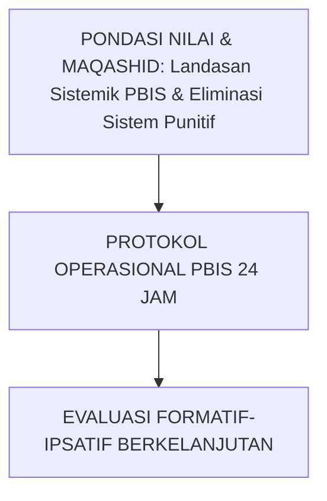

---

### Protokol Aksi Operasional Berjenjang

1. **Langkah Preventif Universal (Tahap Persiapan)**: Pengkondisian sarana, sosialisasi SOP, dan pembiasaan keteladanan *Qudwah Hasanah*.
2. **Langkah Eksekusi Lapangan (Tahap Berjalan)**: Pendampingan lekat oleh musyrif asrama dan wali kelas dengan prinsip *Firm & Kind*.
3. **Langkah Refleksi & Restorasi (Tahap Evaluasi)**: Pencatatan pada logbook digital dan penanganan kendala melalui dialog restoratif.


---


# SUB-BAB 1.2: PROPORSI PIRAMIDA 80-15-5 DI LINGKUNGAN PESANTREN
## *Kajian Mendalam & Panduan Implementatif Ekosistem TUMBUH Pesantren*

**Kode Klasifikasi**: `BOOK-04/BAB-01/SUB-02/MONOGRAF-MASTER-VIBRANT`  
**Disiplin Ilmu**: Metodologi Pendidikan Islam, Sains Perilaku Terapan, & Tata Kelola Pesantren  
**Penanggung Jawab Keilmuan**: Dewan Pakar Ekosistem TUMBUH (*24 Bidang Kepakaran*)

---

### Eksplanasi Teoretis & Urgensi Praksis

Pendidikan karakter yang efektif dalam Sistem TUMBUH membutuhkan kejelasan operasional pada aspek **Proporsi Piramida 80-15-5 di Lingkungan Pesantren**. Naskah ini menguraikan landasan filosofis Turats, bukti empiris sains perilaku, dan protokol implementasi lapangan 24 jam.

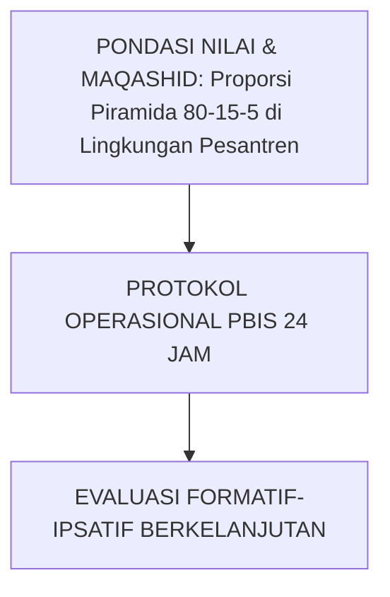

---

### Protokol Aksi Operasional Berjenjang

1. **Langkah Preventif Universal (Tahap Persiapan)**: Pengkondisian sarana, sosialisasi SOP, dan pembiasaan keteladanan *Qudwah Hasanah*.
2. **Langkah Eksekusi Lapangan (Tahap Berjalan)**: Pendampingan lekat oleh musyrif asrama dan wali kelas dengan prinsip *Firm & Kind*.
3. **Langkah Refleksi & Restorasi (Tahap Evaluasi)**: Pencatatan pada logbook digital dan penanganan kendala melalui dialog restoratif.


---


# SUB-BAB 1.3: INTEGRASI NILAI-NILAI SYAR'I DALAM KERANGKA KERJA PBIS
## *Kajian Mendalam & Panduan Implementatif Ekosistem TUMBUH Pesantren*

**Kode Klasifikasi**: `BOOK-04/BAB-01/SUB-03/MONOGRAF-MASTER-VIBRANT`  
**Disiplin Ilmu**: Metodologi Pendidikan Islam, Sains Perilaku Terapan, & Tata Kelola Pesantren  
**Penanggung Jawab Keilmuan**: Dewan Pakar Ekosistem TUMBUH (*24 Bidang Kepakaran*)

---

### Eksplanasi Teoretis & Urgensi Praksis

Pendidikan karakter yang efektif dalam Sistem TUMBUH membutuhkan kejelasan operasional pada aspek **Integrasi Nilai-Nilai Syar'i dalam Kerangka Kerja PBIS**. Naskah ini menguraikan landasan filosofis Turats, bukti empiris sains perilaku, dan protokol implementasi lapangan 24 jam.

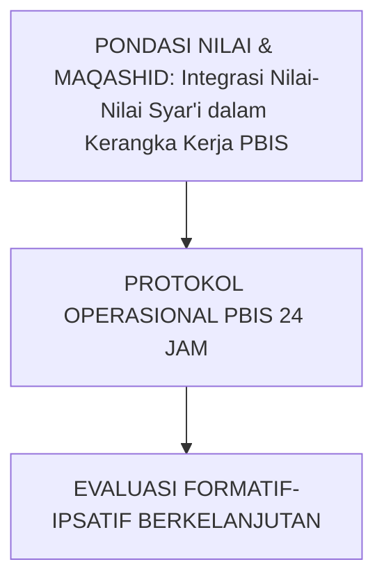

---

### Protokol Aksi Operasional Berjenjang

1. **Langkah Preventif Universal (Tahap Persiapan)**: Pengkondisian sarana, sosialisasi SOP, dan pembiasaan keteladanan *Qudwah Hasanah*.
2. **Langkah Eksekusi Lapangan (Tahap Berjalan)**: Pendampingan lekat oleh musyrif asrama dan wali kelas dengan prinsip *Firm & Kind*.
3. **Langkah Refleksi & Restorasi (Tahap Evaluasi)**: Pencatatan pada logbook digital dan penanganan kendala melalui dialog restoratif.


---


# SUB-BAB 2.1: MATRIKS EKSPEKTASI PERILAKU POSITIF SELURUH ZONA
## *Kajian Mendalam & Panduan Implementatif Ekosistem TUMBUH Pesantren*

**Kode Klasifikasi**: `BOOK-04/BAB-02/SUB-01/MONOGRAF-MASTER-VIBRANT`  
**Disiplin Ilmu**: Metodologi Pendidikan Islam, Sains Perilaku Terapan, & Tata Kelola Pesantren  
**Penanggung Jawab Keilmuan**: Dewan Pakar Ekosistem TUMBUH (*24 Bidang Kepakaran*)

---

### Eksplanasi Teoretis & Urgensi Praksis

Pendidikan karakter yang efektif dalam Sistem TUMBUH membutuhkan kejelasan operasional pada aspek **Matriks Ekspektasi Perilaku Positif Seluruh Zona**. Naskah ini menguraikan landasan filosofis Turats, bukti empiris sains perilaku, dan protokol implementasi lapangan 24 jam.

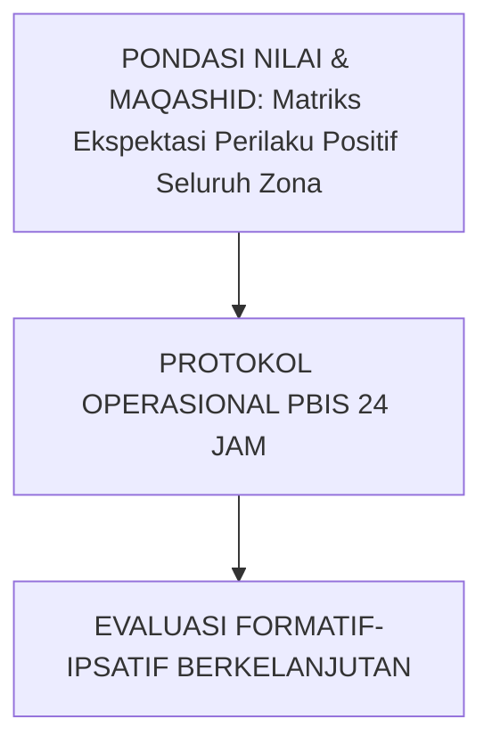

---

### Protokol Aksi Operasional Berjenjang

1. **Langkah Preventif Universal (Tahap Persiapan)**: Pengkondisian sarana, sosialisasi SOP, dan pembiasaan keteladanan *Qudwah Hasanah*.
2. **Langkah Eksekusi Lapangan (Tahap Berjalan)**: Pendampingan lekat oleh musyrif asrama dan wali kelas dengan prinsip *Firm & Kind*.
3. **Langkah Refleksi & Restorasi (Tahap Evaluasi)**: Pencatatan pada logbook digital dan penanganan kendala melalui dialog restoratif.


---


# SUB-BAB 2.2: PENGKONDISIAN LINGKUNGAN BI'AH SHALIHAH 24 JAM
## *Kajian Mendalam & Panduan Implementatif Ekosistem TUMBUH Pesantren*

**Kode Klasifikasi**: `BOOK-04/BAB-02/SUB-02/MONOGRAF-MASTER-VIBRANT`  
**Disiplin Ilmu**: Metodologi Pendidikan Islam, Sains Perilaku Terapan, & Tata Kelola Pesantren  
**Penanggung Jawab Keilmuan**: Dewan Pakar Ekosistem TUMBUH (*24 Bidang Kepakaran*)

---

### Eksplanasi Teoretis & Urgensi Praksis

Pendidikan karakter yang efektif dalam Sistem TUMBUH membutuhkan kejelasan operasional pada aspek **Pengkondisian Lingkungan Bi'ah Shalihah 24 Jam**. Naskah ini menguraikan landasan filosofis Turats, bukti empiris sains perilaku, dan protokol implementasi lapangan 24 jam.

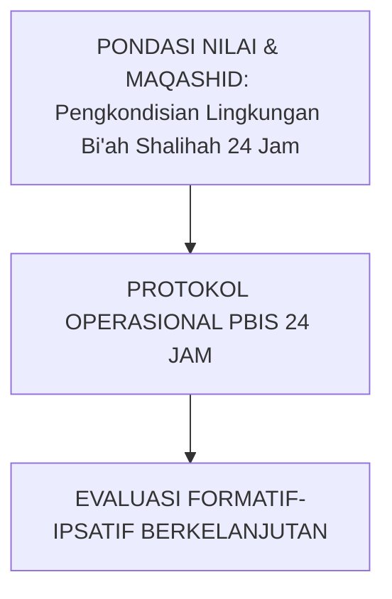

---

### Protokol Aksi Operasional Berjenjang

1. **Langkah Preventif Universal (Tahap Persiapan)**: Pengkondisian sarana, sosialisasi SOP, dan pembiasaan keteladanan *Qudwah Hasanah*.
2. **Langkah Eksekusi Lapangan (Tahap Berjalan)**: Pendampingan lekat oleh musyrif asrama dan wali kelas dengan prinsip *Firm & Kind*.
3. **Langkah Refleksi & Restorasi (Tahap Evaluasi)**: Pencatatan pada logbook digital dan penanganan kendala melalui dialog restoratif.


---


# SUB-BAB 2.3: PENGAJARAN EKSPLISIT ADAB DI AWAL TAHUN AJARAN
## *Kajian Mendalam & Panduan Implementatif Ekosistem TUMBUH Pesantren*

**Kode Klasifikasi**: `BOOK-04/BAB-02/SUB-03/MONOGRAF-MASTER-VIBRANT`  
**Disiplin Ilmu**: Metodologi Pendidikan Islam, Sains Perilaku Terapan, & Tata Kelola Pesantren  
**Penanggung Jawab Keilmuan**: Dewan Pakar Ekosistem TUMBUH (*24 Bidang Kepakaran*)

---

### Eksplanasi Teoretis & Urgensi Praksis

Pendidikan karakter yang efektif dalam Sistem TUMBUH membutuhkan kejelasan operasional pada aspek **Pengajaran Eksplisit Adab di Awal Tahun Ajaran**. Naskah ini menguraikan landasan filosofis Turats, bukti empiris sains perilaku, dan protokol implementasi lapangan 24 jam.

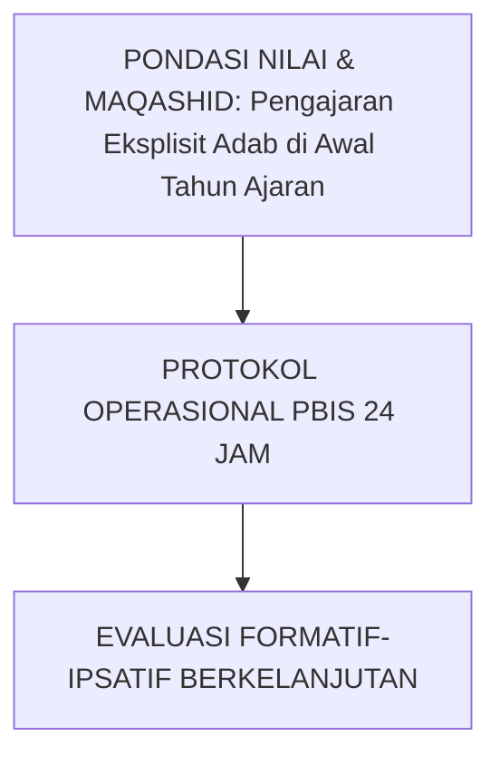

---

### Protokol Aksi Operasional Berjenjang

1. **Langkah Preventif Universal (Tahap Persiapan)**: Pengkondisian sarana, sosialisasi SOP, dan pembiasaan keteladanan *Qudwah Hasanah*.
2. **Langkah Eksekusi Lapangan (Tahap Berjalan)**: Pendampingan lekat oleh musyrif asrama dan wali kelas dengan prinsip *Firm & Kind*.
3. **Langkah Refleksi & Restorasi (Tahap Evaluasi)**: Pencatatan pada logbook digital dan penanganan kendala melalui dialog restoratif.


---


# SUB-BAB 2.4: PENATAAN RUANG FISIK ASRAMA RAMAH TUMBUH KEMBANG
## *Kajian Mendalam & Panduan Implementatif Ekosistem TUMBUH Pesantren*

**Kode Klasifikasi**: `BOOK-04/BAB-02/SUB-04/MONOGRAF-MASTER-VIBRANT`  
**Disiplin Ilmu**: Metodologi Pendidikan Islam, Sains Perilaku Terapan, & Tata Kelola Pesantren  
**Penanggung Jawab Keilmuan**: Dewan Pakar Ekosistem TUMBUH (*24 Bidang Kepakaran*)

---

### Eksplanasi Teoretis & Urgensi Praksis

Pendidikan karakter yang efektif dalam Sistem TUMBUH membutuhkan kejelasan operasional pada aspek **Penataan Ruang Fisik Asrama Ramah Tumbuh Kembang**. Naskah ini menguraikan landasan filosofis Turats, bukti empiris sains perilaku, dan protokol implementasi lapangan 24 jam.

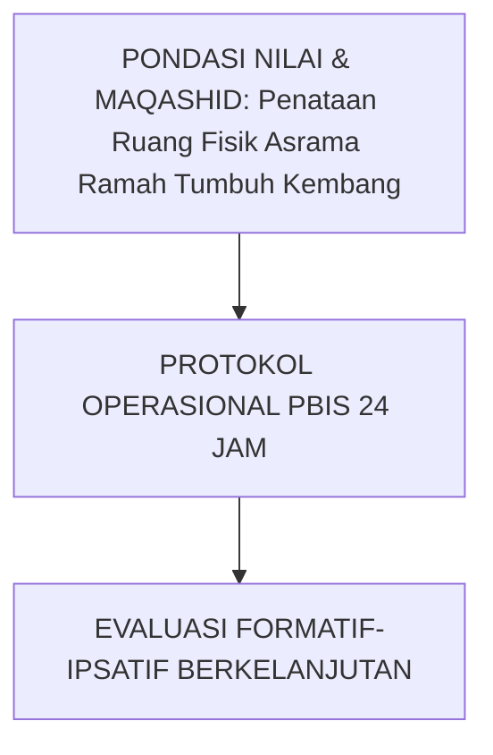

---

### Protokol Aksi Operasional Berjenjang

1. **Langkah Preventif Universal (Tahap Persiapan)**: Pengkondisian sarana, sosialisasi SOP, dan pembiasaan keteladanan *Qudwah Hasanah*.
2. **Langkah Eksekusi Lapangan (Tahap Berjalan)**: Pendampingan lekat oleh musyrif asrama dan wali kelas dengan prinsip *Firm & Kind*.
3. **Langkah Refleksi & Restorasi (Tahap Evaluasi)**: Pencatatan pada logbook digital dan penanganan kendala melalui dialog restoratif.


---


# SUB-BAB 2.5: PATROLI TITIK RAWAN (HOTSPOTS MONITORING PROTOCOL)
## *Kajian Mendalam & Panduan Implementatif Ekosistem TUMBUH Pesantren*

**Kode Klasifikasi**: `BOOK-04/BAB-02/SUB-05/MONOGRAF-MASTER-VIBRANT`  
**Disiplin Ilmu**: Metodologi Pendidikan Islam, Sains Perilaku Terapan, & Tata Kelola Pesantren  
**Penanggung Jawab Keilmuan**: Dewan Pakar Ekosistem TUMBUH (*24 Bidang Kepakaran*)

---

### Eksplanasi Teoretis & Urgensi Praksis

Pendidikan karakter yang efektif dalam Sistem TUMBUH membutuhkan kejelasan operasional pada aspek **Patroli Titik Rawan (Hotspots Monitoring Protocol)**. Naskah ini menguraikan landasan filosofis Turats, bukti empiris sains perilaku, dan protokol implementasi lapangan 24 jam.

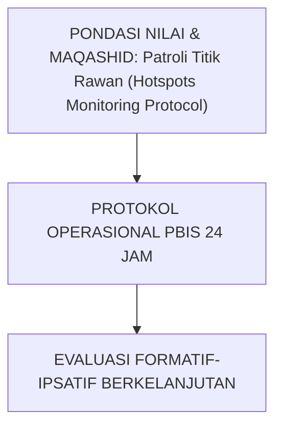

---

### Protokol Aksi Operasional Berjenjang

1. **Langkah Preventif Universal (Tahap Persiapan)**: Pengkondisian sarana, sosialisasi SOP, dan pembiasaan keteladanan *Qudwah Hasanah*.
2. **Langkah Eksekusi Lapangan (Tahap Berjalan)**: Pendampingan lekat oleh musyrif asrama dan wali kelas dengan prinsip *Firm & Kind*.
3. **Langkah Refleksi & Restorasi (Tahap Evaluasi)**: Pencatatan pada logbook digital dan penanganan kendala melalui dialog restoratif.


---


# SUB-BAB 2.6: KULTUR KETELADANAN QUDWAH SELURUH CIVITAS PESANTREN
## *Kajian Mendalam & Panduan Implementatif Ekosistem TUMBUH Pesantren*

**Kode Klasifikasi**: `BOOK-04/BAB-02/SUB-06/MONOGRAF-MASTER-VIBRANT`  
**Disiplin Ilmu**: Metodologi Pendidikan Islam, Sains Perilaku Terapan, & Tata Kelola Pesantren  
**Penanggung Jawab Keilmuan**: Dewan Pakar Ekosistem TUMBUH (*24 Bidang Kepakaran*)

---

### Eksplanasi Teoretis & Urgensi Praksis

Pendidikan karakter yang efektif dalam Sistem TUMBUH membutuhkan kejelasan operasional pada aspek **Kultur Keteladanan Qudwah Seluruh Civitas Pesantren**. Naskah ini menguraikan landasan filosofis Turats, bukti empiris sains perilaku, dan protokol implementasi lapangan 24 jam.

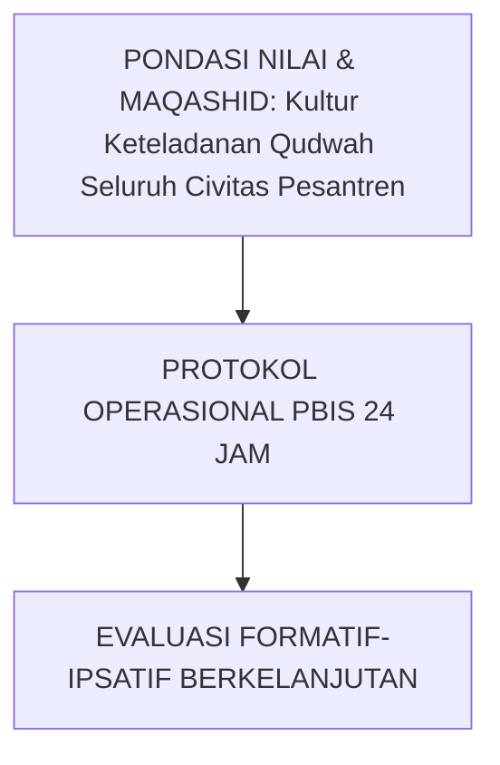

---

### Protokol Aksi Operasional Berjenjang

1. **Langkah Preventif Universal (Tahap Persiapan)**: Pengkondisian sarana, sosialisasi SOP, dan pembiasaan keteladanan *Qudwah Hasanah*.
2. **Langkah Eksekusi Lapangan (Tahap Berjalan)**: Pendampingan lekat oleh musyrif asrama dan wali kelas dengan prinsip *Firm & Kind*.
3. **Langkah Refleksi & Restorasi (Tahap Evaluasi)**: Pencatatan pada logbook digital dan penanganan kendala melalui dialog restoratif.


---


# SUB-BAB 3.1: SISTEM APRESIASI RASIO EMAS 4:1 (APRESIASI VS TEGURAN)
## *Kajian Mendalam & Panduan Implementatif Ekosistem TUMBUH Pesantren*

**Kode Klasifikasi**: `BOOK-04/BAB-03/SUB-01/MONOGRAF-MASTER-VIBRANT`  
**Disiplin Ilmu**: Metodologi Pendidikan Islam, Sains Perilaku Terapan, & Tata Kelola Pesantren  
**Penanggung Jawab Keilmuan**: Dewan Pakar Ekosistem TUMBUH (*24 Bidang Kepakaran*)

---

### Eksplanasi Teoretis & Urgensi Praksis

Pendidikan karakter yang efektif dalam Sistem TUMBUH membutuhkan kejelasan operasional pada aspek **Sistem Apresiasi Rasio Emas 4:1 (Apresiasi vs Teguran)**. Naskah ini menguraikan landasan filosofis Turats, bukti empiris sains perilaku, dan protokol implementasi lapangan 24 jam.

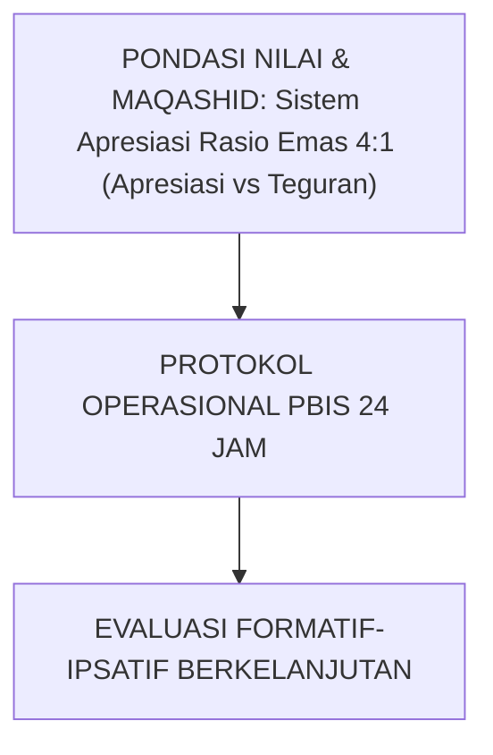

---

### Protokol Aksi Operasional Berjenjang

1. **Langkah Preventif Universal (Tahap Persiapan)**: Pengkondisian sarana, sosialisasi SOP, dan pembiasaan keteladanan *Qudwah Hasanah*.
2. **Langkah Eksekusi Lapangan (Tahap Berjalan)**: Pendampingan lekat oleh musyrif asrama dan wali kelas dengan prinsip *Firm & Kind*.
3. **Langkah Refleksi & Restorasi (Tahap Evaluasi)**: Pencatatan pada logbook digital dan penanganan kendala melalui dialog restoratif.


---


# SUB-BAB 3.2: PSIKOLOGI PENGUATAN POSITIF VS PEMBERIAN HADIAH MATERIAL
## *Kajian Mendalam & Panduan Implementatif Ekosistem TUMBUH Pesantren*

**Kode Klasifikasi**: `BOOK-04/BAB-03/SUB-02/MONOGRAF-MASTER-VIBRANT`  
**Disiplin Ilmu**: Metodologi Pendidikan Islam, Sains Perilaku Terapan, & Tata Kelola Pesantren  
**Penanggung Jawab Keilmuan**: Dewan Pakar Ekosistem TUMBUH (*24 Bidang Kepakaran*)

---

### Eksplanasi Teoretis & Urgensi Praksis

Pendidikan karakter yang efektif dalam Sistem TUMBUH membutuhkan kejelasan operasional pada aspek **Psikologi Penguatan Positif vs Pemberian Hadiah Material**. Naskah ini menguraikan landasan filosofis Turats, bukti empiris sains perilaku, dan protokol implementasi lapangan 24 jam.

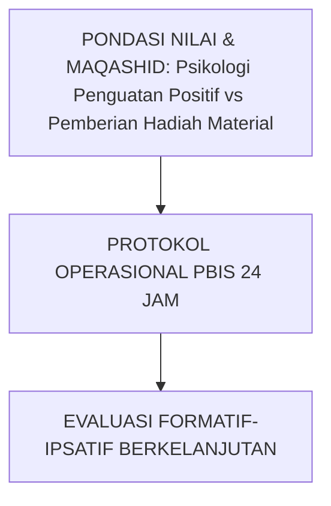

---

### Protokol Aksi Operasional Berjenjang

1. **Langkah Preventif Universal (Tahap Persiapan)**: Pengkondisian sarana, sosialisasi SOP, dan pembiasaan keteladanan *Qudwah Hasanah*.
2. **Langkah Eksekusi Lapangan (Tahap Berjalan)**: Pendampingan lekat oleh musyrif asrama dan wali kelas dengan prinsip *Firm & Kind*.
3. **Langkah Refleksi & Restorasi (Tahap Evaluasi)**: Pencatatan pada logbook digital dan penanganan kendala melalui dialog restoratif.


---


# SUB-BAB 3.3: RITUAL CIRCLE OF GRATITUDE MALAM DI KAMAR ASRAMA
## *Kajian Mendalam & Panduan Implementatif Ekosistem TUMBUH Pesantren*

**Kode Klasifikasi**: `BOOK-04/BAB-03/SUB-03/MONOGRAF-MASTER-VIBRANT`  
**Disiplin Ilmu**: Metodologi Pendidikan Islam, Sains Perilaku Terapan, & Tata Kelola Pesantren  
**Penanggung Jawab Keilmuan**: Dewan Pakar Ekosistem TUMBUH (*24 Bidang Kepakaran*)

---

### Eksplanasi Teoretis & Urgensi Praksis

Pendidikan karakter yang efektif dalam Sistem TUMBUH membutuhkan kejelasan operasional pada aspek **Ritual Circle of Gratitude Malam di Kamar Asrama**. Naskah ini menguraikan landasan filosofis Turats, bukti empiris sains perilaku, dan protokol implementasi lapangan 24 jam.

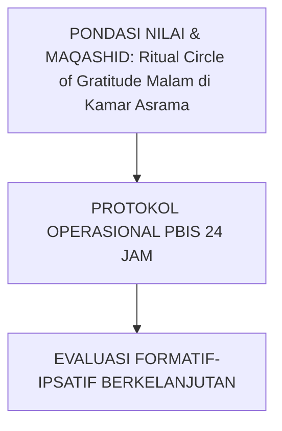

---

### Protokol Aksi Operasional Berjenjang

1. **Langkah Preventif Universal (Tahap Persiapan)**: Pengkondisian sarana, sosialisasi SOP, dan pembiasaan keteladanan *Qudwah Hasanah*.
2. **Langkah Eksekusi Lapangan (Tahap Berjalan)**: Pendampingan lekat oleh musyrif asrama dan wali kelas dengan prinsip *Firm & Kind*.
3. **Langkah Refleksi & Restorasi (Tahap Evaluasi)**: Pencatatan pada logbook digital dan penanganan kendala melalui dialog restoratif.


---


# SUB-BAB 4.1: PROTOKOL CHECK-IN / CHECK-OUT (CICO) HARIAN MUSYRIF
## *Kajian Mendalam & Panduan Implementatif Ekosistem TUMBUH Pesantren*

**Kode Klasifikasi**: `BOOK-04/BAB-04/SUB-01/MONOGRAF-MASTER-VIBRANT`  
**Disiplin Ilmu**: Metodologi Pendidikan Islam, Sains Perilaku Terapan, & Tata Kelola Pesantren  
**Penanggung Jawab Keilmuan**: Dewan Pakar Ekosistem TUMBUH (*24 Bidang Kepakaran*)

---

### Eksplanasi Teoretis & Urgensi Praksis

Pendidikan karakter yang efektif dalam Sistem TUMBUH membutuhkan kejelasan operasional pada aspek **Protokol Check-In / Check-Out (CICO) Harian Musyrif**. Naskah ini menguraikan landasan filosofis Turats, bukti empiris sains perilaku, dan protokol implementasi lapangan 24 jam.

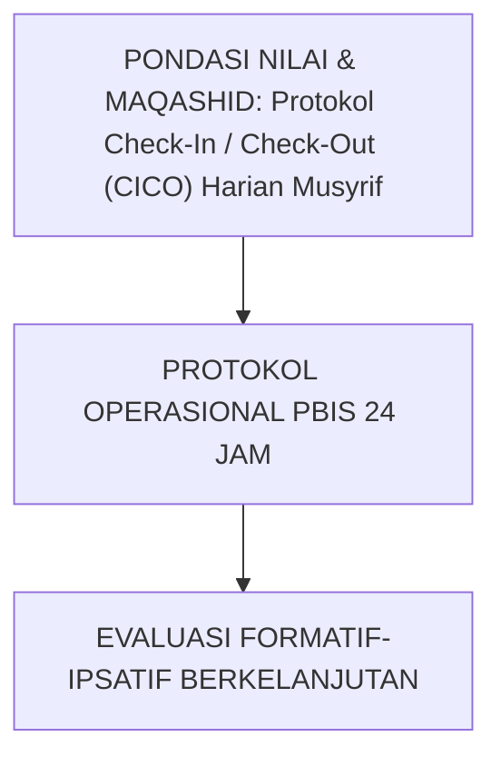

---

### Protokol Aksi Operasional Berjenjang

1. **Langkah Preventif Universal (Tahap Persiapan)**: Pengkondisian sarana, sosialisasi SOP, dan pembiasaan keteladanan *Qudwah Hasanah*.
2. **Langkah Eksekusi Lapangan (Tahap Berjalan)**: Pendampingan lekat oleh musyrif asrama dan wali kelas dengan prinsip *Firm & Kind*.
3. **Langkah Refleksi & Restorasi (Tahap Evaluasi)**: Pencatatan pada logbook digital dan penanganan kendala melalui dialog restoratif.


---


# SUB-BAB 4.2: MENTORING SEBAYA KELOMPOK KECIL (SUHBAH TARBAWIYYAH)
## *Kajian Mendalam & Panduan Implementatif Ekosistem TUMBUH Pesantren*

**Kode Klasifikasi**: `BOOK-04/BAB-04/SUB-02/MONOGRAF-MASTER-VIBRANT`  
**Disiplin Ilmu**: Metodologi Pendidikan Islam, Sains Perilaku Terapan, & Tata Kelola Pesantren  
**Penanggung Jawab Keilmuan**: Dewan Pakar Ekosistem TUMBUH (*24 Bidang Kepakaran*)

---

### Eksplanasi Teoretis & Urgensi Praksis

Pendidikan karakter yang efektif dalam Sistem TUMBUH membutuhkan kejelasan operasional pada aspek **Mentoring Sebaya Kelompok Kecil (Suhbah Tarbawiyyah)**. Naskah ini menguraikan landasan filosofis Turats, bukti empiris sains perilaku, dan protokol implementasi lapangan 24 jam.

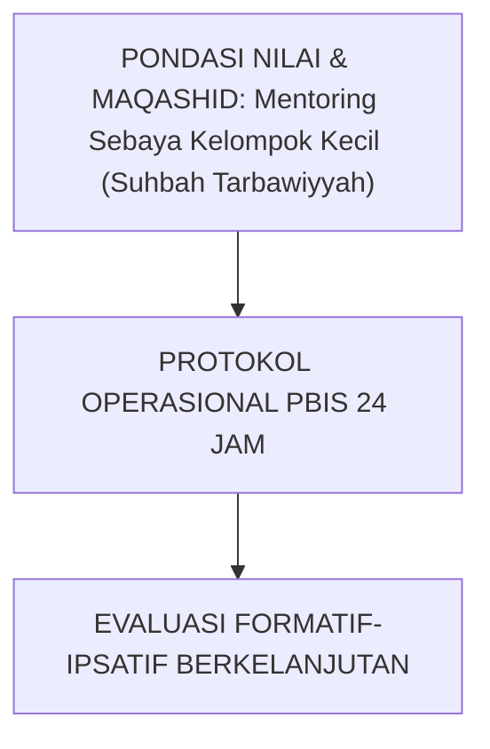

---

### Protokol Aksi Operasional Berjenjang

1. **Langkah Preventif Universal (Tahap Persiapan)**: Pengkondisian sarana, sosialisasi SOP, dan pembiasaan keteladanan *Qudwah Hasanah*.
2. **Langkah Eksekusi Lapangan (Tahap Berjalan)**: Pendampingan lekat oleh musyrif asrama dan wali kelas dengan prinsip *Firm & Kind*.
3. **Langkah Refleksi & Restorasi (Tahap Evaluasi)**: Pencatatan pada logbook digital dan penanganan kendala melalui dialog restoratif.


---


# SUB-BAB 4.3: MODIFIKASI LINGKUNGAN KAMAR & BEHAVIORAL CONTRACTING
## *Kajian Mendalam & Panduan Implementatif Ekosistem TUMBUH Pesantren*

**Kode Klasifikasi**: `BOOK-04/BAB-04/SUB-03/MONOGRAF-MASTER-VIBRANT`  
**Disiplin Ilmu**: Metodologi Pendidikan Islam, Sains Perilaku Terapan, & Tata Kelola Pesantren  
**Penanggung Jawab Keilmuan**: Dewan Pakar Ekosistem TUMBUH (*24 Bidang Kepakaran*)

---

### Eksplanasi Teoretis & Urgensi Praksis

Pendidikan karakter yang efektif dalam Sistem TUMBUH membutuhkan kejelasan operasional pada aspek **Modifikasi Lingkungan Kamar & Behavioral Contracting**. Naskah ini menguraikan landasan filosofis Turats, bukti empiris sains perilaku, dan protokol implementasi lapangan 24 jam.

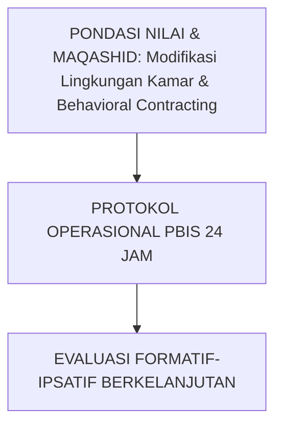

---

### Protokol Aksi Operasional Berjenjang

1. **Langkah Preventif Universal (Tahap Persiapan)**: Pengkondisian sarana, sosialisasi SOP, dan pembiasaan keteladanan *Qudwah Hasanah*.
2. **Langkah Eksekusi Lapangan (Tahap Berjalan)**: Pendampingan lekat oleh musyrif asrama dan wali kelas dengan prinsip *Firm & Kind*.
3. **Langkah Refleksi & Restorasi (Tahap Evaluasi)**: Pencatatan pada logbook digital dan penanganan kendala melalui dialog restoratif.


---


# SUB-BAB 4.4: KLINIK AKADEMIK & PENDAMPINGAN SOROGAN TERARAH
## *Kajian Mendalam & Panduan Implementatif Ekosistem TUMBUH Pesantren*

**Kode Klasifikasi**: `BOOK-04/BAB-04/SUB-04/MONOGRAF-MASTER-VIBRANT`  
**Disiplin Ilmu**: Metodologi Pendidikan Islam, Sains Perilaku Terapan, & Tata Kelola Pesantren  
**Penanggung Jawab Keilmuan**: Dewan Pakar Ekosistem TUMBUH (*24 Bidang Kepakaran*)

---

### Eksplanasi Teoretis & Urgensi Praksis

Pendidikan karakter yang efektif dalam Sistem TUMBUH membutuhkan kejelasan operasional pada aspek **Klinik Akademik & Pendampingan Sorogan Terarah**. Naskah ini menguraikan landasan filosofis Turats, bukti empiris sains perilaku, dan protokol implementasi lapangan 24 jam.

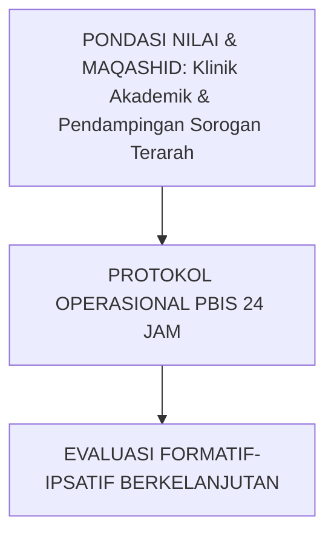

---

### Protokol Aksi Operasional Berjenjang

1. **Langkah Preventif Universal (Tahap Persiapan)**: Pengkondisian sarana, sosialisasi SOP, dan pembiasaan keteladanan *Qudwah Hasanah*.
2. **Langkah Eksekusi Lapangan (Tahap Berjalan)**: Pendampingan lekat oleh musyrif asrama dan wali kelas dengan prinsip *Firm & Kind*.
3. **Langkah Refleksi & Restorasi (Tahap Evaluasi)**: Pencatatan pada logbook digital dan penanganan kendala melalui dialog restoratif.


---


# SUB-BAB 4.5: EVALUASI PROGRES MINGGUAN & KRITERIA GRADUASI TIER 2
## *Kajian Mendalam & Panduan Implementatif Ekosistem TUMBUH Pesantren*

**Kode Klasifikasi**: `BOOK-04/BAB-04/SUB-05/MONOGRAF-MASTER-VIBRANT`  
**Disiplin Ilmu**: Metodologi Pendidikan Islam, Sains Perilaku Terapan, & Tata Kelola Pesantren  
**Penanggung Jawab Keilmuan**: Dewan Pakar Ekosistem TUMBUH (*24 Bidang Kepakaran*)

---

### Eksplanasi Teoretis & Urgensi Praksis

Pendidikan karakter yang efektif dalam Sistem TUMBUH membutuhkan kejelasan operasional pada aspek **Evaluasi Progres Mingguan & Kriteria Graduasi Tier 2**. Naskah ini menguraikan landasan filosofis Turats, bukti empiris sains perilaku, dan protokol implementasi lapangan 24 jam.


---

### Protokol Aksi Operasional Berjenjang

1. **Langkah Preventif Universal (Tahap Persiapan)**: Pengkondisian sarana, sosialisasi SOP, dan pembiasaan keteladanan *Qudwah Hasanah*.
2. **Langkah Eksekusi Lapangan (Tahap Berjalan)**: Pendampingan lekat oleh musyrif asrama dan wali kelas dengan prinsip *Firm & Kind*.
3. **Langkah Refleksi & Restorasi (Tahap Evaluasi)**: Pencatatan pada logbook digital dan penanganan kendala melalui dialog restoratif.


---


# SUB-BAB 5.1: ASESMEN FUNGSIONAL PERILAKU (FBA) KOMPREHENSIF
## *Kajian Mendalam & Panduan Implementatif Ekosistem TUMBUH Pesantren*

**Kode Klasifikasi**: `BOOK-04/BAB-05/SUB-01/MONOGRAF-MASTER-VIBRANT`  
**Disiplin Ilmu**: Metodologi Pendidikan Islam, Sains Perilaku Terapan, & Tata Kelola Pesantren  
**Penanggung Jawab Keilmuan**: Dewan Pakar Ekosistem TUMBUH (*24 Bidang Kepakaran*)

---

### Eksplanasi Teoretis & Urgensi Praksis

Pendidikan karakter yang efektif dalam Sistem TUMBUH membutuhkan kejelasan operasional pada aspek **Asesmen Fungsional Perilaku (FBA) Komprehensif**. Naskah ini menguraikan landasan filosofis Turats, bukti empiris sains perilaku, dan protokol implementasi lapangan 24 jam.

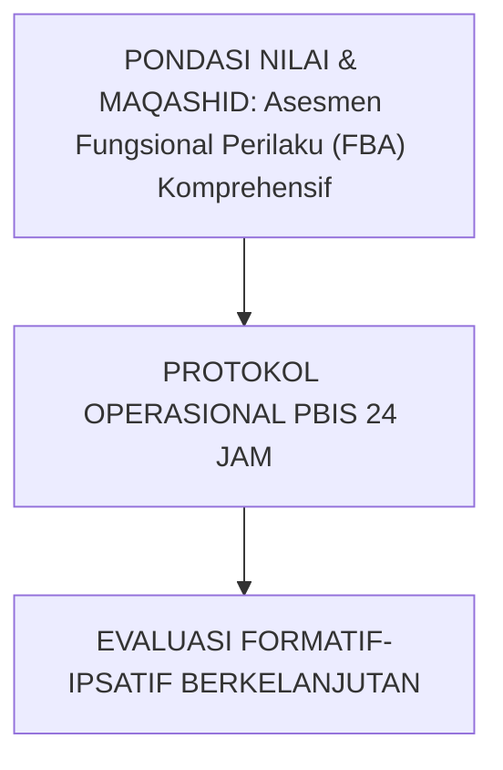

---

### Protokol Aksi Operasional Berjenjang

1. **Langkah Preventif Universal (Tahap Persiapan)**: Pengkondisian sarana, sosialisasi SOP, dan pembiasaan keteladanan *Qudwah Hasanah*.
2. **Langkah Eksekusi Lapangan (Tahap Berjalan)**: Pendampingan lekat oleh musyrif asrama dan wali kelas dengan prinsip *Firm & Kind*.
3. **Langkah Refleksi & Restorasi (Tahap Evaluasi)**: Pencatatan pada logbook digital dan penanganan kendala melalui dialog restoratif.


---


# SUB-BAB 5.2: PERUMUSAN RENCANA INTERVENSI PERILAKU (BIP) INDIVIDUAL
## *Kajian Mendalam & Panduan Implementatif Ekosistem TUMBUH Pesantren*

**Kode Klasifikasi**: `BOOK-04/BAB-05/SUB-02/MONOGRAF-MASTER-VIBRANT`  
**Disiplin Ilmu**: Metodologi Pendidikan Islam, Sains Perilaku Terapan, & Tata Kelola Pesantren  
**Penanggung Jawab Keilmuan**: Dewan Pakar Ekosistem TUMBUH (*24 Bidang Kepakaran*)

---

### Eksplanasi Teoretis & Urgensi Praksis

Pendidikan karakter yang efektif dalam Sistem TUMBUH membutuhkan kejelasan operasional pada aspek **Perumusan Rencana Intervensi Perilaku (BIP) Individual**. Naskah ini menguraikan landasan filosofis Turats, bukti empiris sains perilaku, dan protokol implementasi lapangan 24 jam.


---

### Protokol Aksi Operasional Berjenjang

1. **Langkah Preventif Universal (Tahap Persiapan)**: Pengkondisian sarana, sosialisasi SOP, dan pembiasaan keteladanan *Qudwah Hasanah*.
2. **Langkah Eksekusi Lapangan (Tahap Berjalan)**: Pendampingan lekat oleh musyrif asrama dan wali kelas dengan prinsip *Firm & Kind*.
3. **Langkah Refleksi & Restorasi (Tahap Evaluasi)**: Pencatatan pada logbook digital dan penanganan kendala melalui dialog restoratif.


---


# SUB-BAB 5.3: TEKNIK PENGGANTIAN PERILAKU ADAPTIF (REPLACEMENT BEHAVIOR)
## *Kajian Mendalam & Panduan Implementatif Ekosistem TUMBUH Pesantren*

**Kode Klasifikasi**: `BOOK-04/BAB-05/SUB-03/MONOGRAF-MASTER-VIBRANT`  
**Disiplin Ilmu**: Metodologi Pendidikan Islam, Sains Perilaku Terapan, & Tata Kelola Pesantren  
**Penanggung Jawab Keilmuan**: Dewan Pakar Ekosistem TUMBUH (*24 Bidang Kepakaran*)

---

### Eksplanasi Teoretis & Urgensi Praksis

Pendidikan karakter yang efektif dalam Sistem TUMBUH membutuhkan kejelasan operasional pada aspek **Teknik Penggantian Perilaku Adaptif (Replacement Behavior)**. Naskah ini menguraikan landasan filosofis Turats, bukti empiris sains perilaku, dan protokol implementasi lapangan 24 jam.

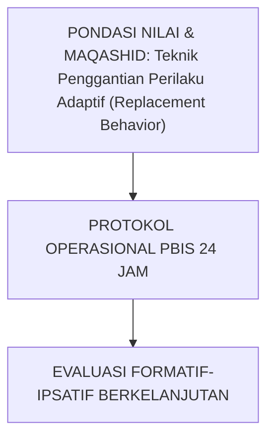

---

### Protokol Aksi Operasional Berjenjang

1. **Langkah Preventif Universal (Tahap Persiapan)**: Pengkondisian sarana, sosialisasi SOP, dan pembiasaan keteladanan *Qudwah Hasanah*.
2. **Langkah Eksekusi Lapangan (Tahap Berjalan)**: Pendampingan lekat oleh musyrif asrama dan wali kelas dengan prinsip *Firm & Kind*.
3. **Langkah Refleksi & Restorasi (Tahap Evaluasi)**: Pencatatan pada logbook digital dan penanganan kendala melalui dialog restoratif.


---


# SUB-BAB 5.4: KONSELING CBT-NARATIF ISLAMI & DE-ESKALASI TRAUMA
## *Kajian Mendalam & Panduan Implementatif Ekosistem TUMBUH Pesantren*

**Kode Klasifikasi**: `BOOK-04/BAB-05/SUB-04/MONOGRAF-MASTER-VIBRANT`  
**Disiplin Ilmu**: Metodologi Pendidikan Islam, Sains Perilaku Terapan, & Tata Kelola Pesantren  
**Penanggung Jawab Keilmuan**: Dewan Pakar Ekosistem TUMBUH (*24 Bidang Kepakaran*)

---

### Eksplanasi Teoretis & Urgensi Praksis

Pendidikan karakter yang efektif dalam Sistem TUMBUH membutuhkan kejelasan operasional pada aspek **Konseling CBT-Naratif Islami & De-eskalasi Trauma**. Naskah ini menguraikan landasan filosofis Turats, bukti empiris sains perilaku, dan protokol implementasi lapangan 24 jam.

```mermaid
graph TD
    Tujuan["PONDASI NILAI & MAQASHID: Konseling CBT-Naratif Islami & De-eskalasi Trauma"] --> Operasional["PROTOKOL OPERASIONAL PBIS 24 JAM"]
    Operasional --> Evaluasi["EVALUASI FORMATIF-IPSATIF BERKELANJUTAN"]
```

---

### Protokol Aksi Operasional Berjenjang

1. **Langkah Preventif Universal (Tahap Persiapan)**: Pengkondisian sarana, sosialisasi SOP, dan pembiasaan keteladanan *Qudwah Hasanah*.
2. **Langkah Eksekusi Lapangan (Tahap Berjalan)**: Pendampingan lekat oleh musyrif asrama dan wali kelas dengan prinsip *Firm & Kind*.
3. **Langkah Refleksi & Restorasi (Tahap Evaluasi)**: Pencatatan pada logbook digital dan penanganan kendala melalui dialog restoratif.


---


# SUB-BAB 5.5: KOLABORASI TIM KHUSUS BK, WALI KELAS, DAN WALI SANTRI
## *Kajian Mendalam & Panduan Implementatif Ekosistem TUMBUH Pesantren*

**Kode Klasifikasi**: `BOOK-04/BAB-05/SUB-05/MONOGRAF-MASTER-VIBRANT`  
**Disiplin Ilmu**: Metodologi Pendidikan Islam, Sains Perilaku Terapan, & Tata Kelola Pesantren  
**Penanggung Jawab Keilmuan**: Dewan Pakar Ekosistem TUMBUH (*24 Bidang Kepakaran*)

---

### Eksplanasi Teoretis & Urgensi Praksis

Pendidikan karakter yang efektif dalam Sistem TUMBUH membutuhkan kejelasan operasional pada aspek **Kolaborasi Tim Khusus BK, Wali Kelas, dan Wali Santri**. Naskah ini menguraikan landasan filosofis Turats, bukti empiris sains perilaku, dan protokol implementasi lapangan 24 jam.

```mermaid
graph TD
    Tujuan["PONDASI NILAI & MAQASHID: Kolaborasi Tim Khusus BK, Wali Kelas, dan Wali Santri"] --> Operasional["PROTOKOL OPERASIONAL PBIS 24 JAM"]
    Operasional --> Evaluasi["EVALUASI FORMATIF-IPSATIF BERKELANJUTAN"]
```

---

### Protokol Aksi Operasional Berjenjang

1. **Langkah Preventif Universal (Tahap Persiapan)**: Pengkondisian sarana, sosialisasi SOP, dan pembiasaan keteladanan *Qudwah Hasanah*.
2. **Langkah Eksekusi Lapangan (Tahap Berjalan)**: Pendampingan lekat oleh musyrif asrama dan wali kelas dengan prinsip *Firm & Kind*.
3. **Langkah Refleksi & Restorasi (Tahap Evaluasi)**: Pencatatan pada logbook digital dan penanganan kendala melalui dialog restoratif.


---


# SUB-BAB 6.1: MODEL RESTORATIF 3R (RESTITUTION, RESOLUTION, RECONCILIATION)
## *Kajian Mendalam & Panduan Implementatif Ekosistem TUMBUH Pesantren*

**Kode Klasifikasi**: `BOOK-04/BAB-06/SUB-01/MONOGRAF-MASTER-VIBRANT`  
**Disiplin Ilmu**: Metodologi Pendidikan Islam, Sains Perilaku Terapan, & Tata Kelola Pesantren  
**Penanggung Jawab Keilmuan**: Dewan Pakar Ekosistem TUMBUH (*24 Bidang Kepakaran*)

---

### Eksplanasi Teoretis & Urgensi Praksis

Pendidikan karakter yang efektif dalam Sistem TUMBUH membutuhkan kejelasan operasional pada aspek **Model Restoratif 3R (Restitution, Resolution, Reconciliation)**. Naskah ini menguraikan landasan filosofis Turats, bukti empiris sains perilaku, dan protokol implementasi lapangan 24 jam.

```mermaid
graph TD
    Tujuan["PONDASI NILAI & MAQASHID: Model Restoratif 3R (Restitution, Resolution, Reconciliation)"] --> Operasional["PROTOKOL OPERASIONAL PBIS 24 JAM"]
    Operasional --> Evaluasi["EVALUASI FORMATIF-IPSATIF BERKELANJUTAN"]
```

---

### Protokol Aksi Operasional Berjenjang

1. **Langkah Preventif Universal (Tahap Persiapan)**: Pengkondisian sarana, sosialisasi SOP, dan pembiasaan keteladanan *Qudwah Hasanah*.
2. **Langkah Eksekusi Lapangan (Tahap Berjalan)**: Pendampingan lekat oleh musyrif asrama dan wali kelas dengan prinsip *Firm & Kind*.
3. **Langkah Refleksi & Restorasi (Tahap Evaluasi)**: Pencatatan pada logbook digital dan penanganan kendala melalui dialog restoratif.


---


# SUB-BAB 6.2: RESTORATIVE CHAT: 5 PERTANYAAN EMAS PEMBINA ASRAMA
## *Kajian Mendalam & Panduan Implementatif Ekosistem TUMBUH Pesantren*

**Kode Klasifikasi**: `BOOK-04/BAB-06/SUB-02/MONOGRAF-MASTER-VIBRANT`  
**Disiplin Ilmu**: Metodologi Pendidikan Islam, Sains Perilaku Terapan, & Tata Kelola Pesantren  
**Penanggung Jawab Keilmuan**: Dewan Pakar Ekosistem TUMBUH (*24 Bidang Kepakaran*)

---

### Eksplanasi Teoretis & Urgensi Praksis

Pendidikan karakter yang efektif dalam Sistem TUMBUH membutuhkan kejelasan operasional pada aspek **Restorative Chat: 5 Pertanyaan Emas Pembina Asrama**. Naskah ini menguraikan landasan filosofis Turats, bukti empiris sains perilaku, dan protokol implementasi lapangan 24 jam.

```mermaid
graph TD
    Tujuan["PONDASI NILAI & MAQASHID: Restorative Chat: 5 Pertanyaan Emas Pembina Asrama"] --> Operasional["PROTOKOL OPERASIONAL PBIS 24 JAM"]
    Operasional --> Evaluasi["EVALUASI FORMATIF-IPSATIF BERKELANJUTAN"]
```

---

### Protokol Aksi Operasional Berjenjang

1. **Langkah Preventif Universal (Tahap Persiapan)**: Pengkondisian sarana, sosialisasi SOP, dan pembiasaan keteladanan *Qudwah Hasanah*.
2. **Langkah Eksekusi Lapangan (Tahap Berjalan)**: Pendampingan lekat oleh musyrif asrama dan wali kelas dengan prinsip *Firm & Kind*.
3. **Langkah Refleksi & Restorasi (Tahap Evaluasi)**: Pencatatan pada logbook digital dan penanganan kendala melalui dialog restoratif.


---


# SUB-BAB 6.3: DEKONSTRUKSI POLA BALAS DENDAM & SIKLUS KEKERASAN
## *Kajian Mendalam & Panduan Implementatif Ekosistem TUMBUH Pesantren*

**Kode Klasifikasi**: `BOOK-04/BAB-06/SUB-03/MONOGRAF-MASTER-VIBRANT`  
**Disiplin Ilmu**: Metodologi Pendidikan Islam, Sains Perilaku Terapan, & Tata Kelola Pesantren  
**Penanggung Jawab Keilmuan**: Dewan Pakar Ekosistem TUMBUH (*24 Bidang Kepakaran*)

---

### Eksplanasi Teoretis & Urgensi Praksis

Pendidikan karakter yang efektif dalam Sistem TUMBUH membutuhkan kejelasan operasional pada aspek **Dekonstruksi Pola Balas Dendam & Siklus Kekerasan**. Naskah ini menguraikan landasan filosofis Turats, bukti empiris sains perilaku, dan protokol implementasi lapangan 24 jam.

```mermaid
graph TD
    Tujuan["PONDASI NILAI & MAQASHID: Dekonstruksi Pola Balas Dendam & Siklus Kekerasan"] --> Operasional["PROTOKOL OPERASIONAL PBIS 24 JAM"]
    Operasional --> Evaluasi["EVALUASI FORMATIF-IPSATIF BERKELANJUTAN"]
```

---

### Protokol Aksi Operasional Berjenjang

1. **Langkah Preventif Universal (Tahap Persiapan)**: Pengkondisian sarana, sosialisasi SOP, dan pembiasaan keteladanan *Qudwah Hasanah*.
2. **Langkah Eksekusi Lapangan (Tahap Berjalan)**: Pendampingan lekat oleh musyrif asrama dan wali kelas dengan prinsip *Firm & Kind*.
3. **Langkah Refleksi & Restorasi (Tahap Evaluasi)**: Pencatatan pada logbook digital dan penanganan kendala melalui dialog restoratif.


---


# SUB-BAB 6.4: PERAN DEWAN KIAI SEBAGAI HAKAM KEADILAN RESTORATIF
## *Kajian Mendalam & Panduan Implementatif Ekosistem TUMBUH Pesantren*

**Kode Klasifikasi**: `BOOK-04/BAB-06/SUB-04/MONOGRAF-MASTER-VIBRANT`  
**Disiplin Ilmu**: Metodologi Pendidikan Islam, Sains Perilaku Terapan, & Tata Kelola Pesantren  
**Penanggung Jawab Keilmuan**: Dewan Pakar Ekosistem TUMBUH (*24 Bidang Kepakaran*)

---

### Eksplanasi Teoretis & Urgensi Praksis

Pendidikan karakter yang efektif dalam Sistem TUMBUH membutuhkan kejelasan operasional pada aspek **Peran Dewan Kiai sebagai Hakam Keadilan Restoratif**. Naskah ini menguraikan landasan filosofis Turats, bukti empiris sains perilaku, dan protokol implementasi lapangan 24 jam.

```mermaid
graph TD
    Tujuan["PONDASI NILAI & MAQASHID: Peran Dewan Kiai sebagai Hakam Keadilan Restoratif"] --> Operasional["PROTOKOL OPERASIONAL PBIS 24 JAM"]
    Operasional --> Evaluasi["EVALUASI FORMATIF-IPSATIF BERKELANJUTAN"]
```

---

### Protokol Aksi Operasional Berjenjang

1. **Langkah Preventif Universal (Tahap Persiapan)**: Pengkondisian sarana, sosialisasi SOP, dan pembiasaan keteladanan *Qudwah Hasanah*.
2. **Langkah Eksekusi Lapangan (Tahap Berjalan)**: Pendampingan lekat oleh musyrif asrama dan wali kelas dengan prinsip *Firm & Kind*.
3. **Langkah Refleksi & Restorasi (Tahap Evaluasi)**: Pencatatan pada logbook digital dan penanganan kendala melalui dialog restoratif.


---


# SUB-BAB 7.1: LINGKARAN RESTORATIF ASRAMA (DORMITORY TALKING CIRCLES)
## *Kajian Mendalam & Panduan Implementatif Ekosistem TUMBUH Pesantren*

**Kode Klasifikasi**: `BOOK-04/BAB-07/SUB-01/MONOGRAF-MASTER-VIBRANT`  
**Disiplin Ilmu**: Metodologi Pendidikan Islam, Sains Perilaku Terapan, & Tata Kelola Pesantren  
**Penanggung Jawab Keilmuan**: Dewan Pakar Ekosistem TUMBUH (*24 Bidang Kepakaran*)

---

### Eksplanasi Teoretis & Urgensi Praksis

Pendidikan karakter yang efektif dalam Sistem TUMBUH membutuhkan kejelasan operasional pada aspek **Lingkaran Restoratif Asrama (Dormitory Talking Circles)**. Naskah ini menguraikan landasan filosofis Turats, bukti empiris sains perilaku, dan protokol implementasi lapangan 24 jam.

```mermaid
graph TD
    Tujuan["PONDASI NILAI & MAQASHID: Lingkaran Restoratif Asrama (Dormitory Talking Circles)"] --> Operasional["PROTOKOL OPERASIONAL PBIS 24 JAM"]
    Operasional --> Evaluasi["EVALUASI FORMATIF-IPSATIF BERKELANJUTAN"]
```

---

### Protokol Aksi Operasional Berjenjang

1. **Langkah Preventif Universal (Tahap Persiapan)**: Pengkondisian sarana, sosialisasi SOP, dan pembiasaan keteladanan *Qudwah Hasanah*.
2. **Langkah Eksekusi Lapangan (Tahap Berjalan)**: Pendampingan lekat oleh musyrif asrama dan wali kelas dengan prinsip *Firm & Kind*.
3. **Langkah Refleksi & Restorasi (Tahap Evaluasi)**: Pencatatan pada logbook digital dan penanganan kendala melalui dialog restoratif.


---


# SUB-BAB 7.2: MEDIASI SEBAYA PELAJAR (PEER MEDIATION PROGRAM)
## *Kajian Mendalam & Panduan Implementatif Ekosistem TUMBUH Pesantren*

**Kode Klasifikasi**: `BOOK-04/BAB-07/SUB-02/MONOGRAF-MASTER-VIBRANT`  
**Disiplin Ilmu**: Metodologi Pendidikan Islam, Sains Perilaku Terapan, & Tata Kelola Pesantren  
**Penanggung Jawab Keilmuan**: Dewan Pakar Ekosistem TUMBUH (*24 Bidang Kepakaran*)

---

### Eksplanasi Teoretis & Urgensi Praksis

Pendidikan karakter yang efektif dalam Sistem TUMBUH membutuhkan kejelasan operasional pada aspek **Mediasi Sebaya Pelajar (Peer Mediation Program)**. Naskah ini menguraikan landasan filosofis Turats, bukti empiris sains perilaku, dan protokol implementasi lapangan 24 jam.

```mermaid
graph TD
    Tujuan["PONDASI NILAI & MAQASHID: Mediasi Sebaya Pelajar (Peer Mediation Program)"] --> Operasional["PROTOKOL OPERASIONAL PBIS 24 JAM"]
    Operasional --> Evaluasi["EVALUASI FORMATIF-IPSATIF BERKELANJUTAN"]
```

---

### Protokol Aksi Operasional Berjenjang

1. **Langkah Preventif Universal (Tahap Persiapan)**: Pengkondisian sarana, sosialisasi SOP, dan pembiasaan keteladanan *Qudwah Hasanah*.
2. **Langkah Eksekusi Lapangan (Tahap Berjalan)**: Pendampingan lekat oleh musyrif asrama dan wali kelas dengan prinsip *Firm & Kind*.
3. **Langkah Refleksi & Restorasi (Tahap Evaluasi)**: Pencatatan pada logbook digital dan penanganan kendala melalui dialog restoratif.


---


# SUB-BAB 7.3: PELATIHAN KETERAMPILAN KOMUNIKASI NIRKEKERASAN SANTRI
## *Kajian Mendalam & Panduan Implementatif Ekosistem TUMBUH Pesantren*

**Kode Klasifikasi**: `BOOK-04/BAB-07/SUB-03/MONOGRAF-MASTER-VIBRANT`  
**Disiplin Ilmu**: Metodologi Pendidikan Islam, Sains Perilaku Terapan, & Tata Kelola Pesantren  
**Penanggung Jawab Keilmuan**: Dewan Pakar Ekosistem TUMBUH (*24 Bidang Kepakaran*)

---

### Eksplanasi Teoretis & Urgensi Praksis

Pendidikan karakter yang efektif dalam Sistem TUMBUH membutuhkan kejelasan operasional pada aspek **Pelatihan Keterampilan Komunikasi Nirkekerasan Santri**. Naskah ini menguraikan landasan filosofis Turats, bukti empiris sains perilaku, dan protokol implementasi lapangan 24 jam.

```mermaid
graph TD
    Tujuan["PONDASI NILAI & MAQASHID: Pelatihan Keterampilan Komunikasi Nirkekerasan Santri"] --> Operasional["PROTOKOL OPERASIONAL PBIS 24 JAM"]
    Operasional --> Evaluasi["EVALUASI FORMATIF-IPSATIF BERKELANJUTAN"]
```

---

### Protokol Aksi Operasional Berjenjang

1. **Langkah Preventif Universal (Tahap Persiapan)**: Pengkondisian sarana, sosialisasi SOP, dan pembiasaan keteladanan *Qudwah Hasanah*.
2. **Langkah Eksekusi Lapangan (Tahap Berjalan)**: Pendampingan lekat oleh musyrif asrama dan wali kelas dengan prinsip *Firm & Kind*.
3. **Langkah Refleksi & Restorasi (Tahap Evaluasi)**: Pencatatan pada logbook digital dan penanganan kendala melalui dialog restoratif.


---


# SUB-BAB 7.4: PENYELESAIAN KONFLIK HORIZONTAL ANTAR-KAMAR ASRAMA
## *Kajian Mendalam & Panduan Implementatif Ekosistem TUMBUH Pesantren*

**Kode Klasifikasi**: `BOOK-04/BAB-07/SUB-04/MONOGRAF-MASTER-VIBRANT`  
**Disiplin Ilmu**: Metodologi Pendidikan Islam, Sains Perilaku Terapan, & Tata Kelola Pesantren  
**Penanggung Jawab Keilmuan**: Dewan Pakar Ekosistem TUMBUH (*24 Bidang Kepakaran*)

---

### Eksplanasi Teoretis & Urgensi Praksis

Pendidikan karakter yang efektif dalam Sistem TUMBUH membutuhkan kejelasan operasional pada aspek **Penyelesaian Konflik Horizontal Antar-Kamar Asrama**. Naskah ini menguraikan landasan filosofis Turats, bukti empiris sains perilaku, dan protokol implementasi lapangan 24 jam.

```mermaid
graph TD
    Tujuan["PONDASI NILAI & MAQASHID: Penyelesaian Konflik Horizontal Antar-Kamar Asrama"] --> Operasional["PROTOKOL OPERASIONAL PBIS 24 JAM"]
    Operasional --> Evaluasi["EVALUASI FORMATIF-IPSATIF BERKELANJUTAN"]
```

---

### Protokol Aksi Operasional Berjenjang

1. **Langkah Preventif Universal (Tahap Persiapan)**: Pengkondisian sarana, sosialisasi SOP, dan pembiasaan keteladanan *Qudwah Hasanah*.
2. **Langkah Eksekusi Lapangan (Tahap Berjalan)**: Pendampingan lekat oleh musyrif asrama dan wali kelas dengan prinsip *Firm & Kind*.
3. **Langkah Refleksi & Restorasi (Tahap Evaluasi)**: Pencatatan pada logbook digital dan penanganan kendala melalui dialog restoratif.


---


# SUB-BAB 8.1: KEBIJAKAN LEMBARAN BERSIH (CLEAN SLATE POLICY)
## *Kajian Mendalam & Panduan Implementatif Ekosistem TUMBUH Pesantren*

**Kode Klasifikasi**: `BOOK-04/BAB-08/SUB-01/MONOGRAF-MASTER-VIBRANT`  
**Disiplin Ilmu**: Metodologi Pendidikan Islam, Sains Perilaku Terapan, & Tata Kelola Pesantren  
**Penanggung Jawab Keilmuan**: Dewan Pakar Ekosistem TUMBUH (*24 Bidang Kepakaran*)

---

### Eksplanasi Teoretis & Urgensi Praksis

Pendidikan karakter yang efektif dalam Sistem TUMBUH membutuhkan kejelasan operasional pada aspek **Kebijakan Lembaran Bersih (Clean Slate Policy)**. Naskah ini menguraikan landasan filosofis Turats, bukti empiris sains perilaku, dan protokol implementasi lapangan 24 jam.

```mermaid
graph TD
    Tujuan["PONDASI NILAI & MAQASHID: Kebijakan Lembaran Bersih (Clean Slate Policy)"] --> Operasional["PROTOKOL OPERASIONAL PBIS 24 JAM"]
    Operasional --> Evaluasi["EVALUASI FORMATIF-IPSATIF BERKELANJUTAN"]
```

---

### Protokol Aksi Operasional Berjenjang

1. **Langkah Preventif Universal (Tahap Persiapan)**: Pengkondisian sarana, sosialisasi SOP, dan pembiasaan keteladanan *Qudwah Hasanah*.
2. **Langkah Eksekusi Lapangan (Tahap Berjalan)**: Pendampingan lekat oleh musyrif asrama dan wali kelas dengan prinsip *Firm & Kind*.
3. **Langkah Refleksi & Restorasi (Tahap Evaluasi)**: Pencatatan pada logbook digital dan penanganan kendala melalui dialog restoratif.


---


# SUB-BAB 8.2: PROTOKOL SIDANG ISHLAH AL-BAIN DIPIMPIN DEWAN KIAI
## *Kajian Mendalam & Panduan Implementatif Ekosistem TUMBUH Pesantren*

**Kode Klasifikasi**: `BOOK-04/BAB-08/SUB-02/MONOGRAF-MASTER-VIBRANT`  
**Disiplin Ilmu**: Metodologi Pendidikan Islam, Sains Perilaku Terapan, & Tata Kelola Pesantren  
**Penanggung Jawab Keilmuan**: Dewan Pakar Ekosistem TUMBUH (*24 Bidang Kepakaran*)

---

### Eksplanasi Teoretis & Urgensi Praksis

Pendidikan karakter yang efektif dalam Sistem TUMBUH membutuhkan kejelasan operasional pada aspek **Protokol Sidang Ishlah al-Bain Dipimpin Dewan Kiai**. Naskah ini menguraikan landasan filosofis Turats, bukti empiris sains perilaku, dan protokol implementasi lapangan 24 jam.

```mermaid
graph TD
    Tujuan["PONDASI NILAI & MAQASHID: Protokol Sidang Ishlah al-Bain Dipimpin Dewan Kiai"] --> Operasional["PROTOKOL OPERASIONAL PBIS 24 JAM"]
    Operasional --> Evaluasi["EVALUASI FORMATIF-IPSATIF BERKELANJUTAN"]
```

---

### Protokol Aksi Operasional Berjenjang

1. **Langkah Preventif Universal (Tahap Persiapan)**: Pengkondisian sarana, sosialisasi SOP, dan pembiasaan keteladanan *Qudwah Hasanah*.
2. **Langkah Eksekusi Lapangan (Tahap Berjalan)**: Pendampingan lekat oleh musyrif asrama dan wali kelas dengan prinsip *Firm & Kind*.
3. **Langkah Refleksi & Restorasi (Tahap Evaluasi)**: Pencatatan pada logbook digital dan penanganan kendala melalui dialog restoratif.


---


# SUB-BAB 8.3: RESTITUSI TINDAKAN NYATA & KHIDMAH PERBAIKAN HUBUNGAN
## *Kajian Mendalam & Panduan Implementatif Ekosistem TUMBUH Pesantren*

**Kode Klasifikasi**: `BOOK-04/BAB-08/SUB-03/MONOGRAF-MASTER-VIBRANT`  
**Disiplin Ilmu**: Metodologi Pendidikan Islam, Sains Perilaku Terapan, & Tata Kelola Pesantren  
**Penanggung Jawab Keilmuan**: Dewan Pakar Ekosistem TUMBUH (*24 Bidang Kepakaran*)

---

### Eksplanasi Teoretis & Urgensi Praksis

Pendidikan karakter yang efektif dalam Sistem TUMBUH membutuhkan kejelasan operasional pada aspek **Restitusi Tindakan Nyata & Khidmah Perbaikan Hubungan**. Naskah ini menguraikan landasan filosofis Turats, bukti empiris sains perilaku, dan protokol implementasi lapangan 24 jam.

```mermaid
graph TD
    Tujuan["PONDASI NILAI & MAQASHID: Restitusi Tindakan Nyata & Khidmah Perbaikan Hubungan"] --> Operasional["PROTOKOL OPERASIONAL PBIS 24 JAM"]
    Operasional --> Evaluasi["EVALUASI FORMATIF-IPSATIF BERKELANJUTAN"]
```

---

### Protokol Aksi Operasional Berjenjang

1. **Langkah Preventif Universal (Tahap Persiapan)**: Pengkondisian sarana, sosialisasi SOP, dan pembiasaan keteladanan *Qudwah Hasanah*.
2. **Langkah Eksekusi Lapangan (Tahap Berjalan)**: Pendampingan lekat oleh musyrif asrama dan wali kelas dengan prinsip *Firm & Kind*.
3. **Langkah Refleksi & Restorasi (Tahap Evaluasi)**: Pencatatan pada logbook digital dan penanganan kendala melalui dialog restoratif.


---


# SUB-BAB 8.4: REINTEGRASI SOSIAL SANTRI PASCA-SANKSI RESTORATIF
## *Kajian Mendalam & Panduan Implementatif Ekosistem TUMBUH Pesantren*

**Kode Klasifikasi**: `BOOK-04/BAB-08/SUB-04/MONOGRAF-MASTER-VIBRANT`  
**Disiplin Ilmu**: Metodologi Pendidikan Islam, Sains Perilaku Terapan, & Tata Kelola Pesantren  
**Penanggung Jawab Keilmuan**: Dewan Pakar Ekosistem TUMBUH (*24 Bidang Kepakaran*)

---

### Eksplanasi Teoretis & Urgensi Praksis

Pendidikan karakter yang efektif dalam Sistem TUMBUH membutuhkan kejelasan operasional pada aspek **Reintegrasi Sosial Santri Pasca-Sanksi Restoratif**. Naskah ini menguraikan landasan filosofis Turats, bukti empiris sains perilaku, dan protokol implementasi lapangan 24 jam.

```mermaid
graph TD
    Tujuan["PONDASI NILAI & MAQASHID: Reintegrasi Sosial Santri Pasca-Sanksi Restoratif"] --> Operasional["PROTOKOL OPERASIONAL PBIS 24 JAM"]
    Operasional --> Evaluasi["EVALUASI FORMATIF-IPSATIF BERKELANJUTAN"]
```

---

### Protokol Aksi Operasional Berjenjang

1. **Langkah Preventif Universal (Tahap Persiapan)**: Pengkondisian sarana, sosialisasi SOP, dan pembiasaan keteladanan *Qudwah Hasanah*.
2. **Langkah Eksekusi Lapangan (Tahap Berjalan)**: Pendampingan lekat oleh musyrif asrama dan wali kelas dengan prinsip *Firm & Kind*.
3. **Langkah Refleksi & Restorasi (Tahap Evaluasi)**: Pencatatan pada logbook digital dan penanganan kendala melalui dialog restoratif.


---


# SUB-BAB 8.5: EPILOG: PESANTREN YANG MENYEMBUHKAN DAN MENGHIDUPKAN JIWA
## *Kajian Mendalam & Panduan Implementatif Ekosistem TUMBUH Pesantren*

**Kode Klasifikasi**: `BOOK-04/BAB-08/SUB-05/MONOGRAF-MASTER-VIBRANT`  
**Disiplin Ilmu**: Metodologi Pendidikan Islam, Sains Perilaku Terapan, & Tata Kelola Pesantren  
**Penanggung Jawab Keilmuan**: Dewan Pakar Ekosistem TUMBUH (*24 Bidang Kepakaran*)

---

### Eksplanasi Teoretis & Urgensi Praksis

Pendidikan karakter yang efektif dalam Sistem TUMBUH membutuhkan kejelasan operasional pada aspek **Epilog: Pesantren yang Menyembuhkan dan Menghidupkan Jiwa**. Naskah ini menguraikan landasan filosofis Turats, bukti empiris sains perilaku, dan protokol implementasi lapangan 24 jam.

```mermaid
graph TD
    Tujuan["PONDASI NILAI & MAQASHID: Epilog: Pesantren yang Menyembuhkan dan Menghidupkan Jiwa"] --> Operasional["PROTOKOL OPERASIONAL PBIS 24 JAM"]
    Operasional --> Evaluasi["EVALUASI FORMATIF-IPSATIF BERKELANJUTAN"]
```

---

### Protokol Aksi Operasional Berjenjang

1. **Langkah Preventif Universal (Tahap Persiapan)**: Pengkondisian sarana, sosialisasi SOP, dan pembiasaan keteladanan *Qudwah Hasanah*.
2. **Langkah Eksekusi Lapangan (Tahap Berjalan)**: Pendampingan lekat oleh musyrif asrama dan wali kelas dengan prinsip *Firm & Kind*.
3. **Langkah Refleksi & Restorasi (Tahap Evaluasi)**: Pencatatan pada logbook digital dan penanganan kendala melalui dialog restoratif.


---


# DAFTAR PUSTAKA LENGKAP BUKU VOLUME 04
## *Rujukan Standar APA 7th Edition & Turats Klasik Intervensi PBIS & Restoratif*

1. **Al-Bukhari, Abu Abdillah Muhammad bin Ismail.** (2002). *Shahih Al-Bukhari: Kitab al-Mazhalim wal Qishash*. Riyadh: Bait Al-Afkar Ad-Dauliyyah.
2. **Crone, D. A., Hawken, L. S., & Horner, R. H.** (2015). *Building Positive Behavior Support Systems in Schools: Functional Behavioral Assessment* (2nd ed.). New York: Guilford Press.
3. **Ibnu Taimiyyah, Ahmad.** (2005). *Majmu' al-Fatawa: Kitab al-Hudud wal Ta'zirat*. Madinah: Majma' Malik Fahd.
4. **Nelsen, J.** (2006). *Positive Discipline: The Classic Guide to Helping Children Develop Self-Discipline, Responsibility, Cooperation, and Problem-Solving Skills*. New York: Ballantine Books.
5. **Sugai, G., & Horner, R. H.** (2006). *A promising approach for expanding and sustaining school-wide positive behavior support*. *School Psychology Review*, 35(2), 245–259.
6. **Zehr, H.** (2015). *The Little Book of Restorative Justice: Revised and Updated*. New York: Good Books.

