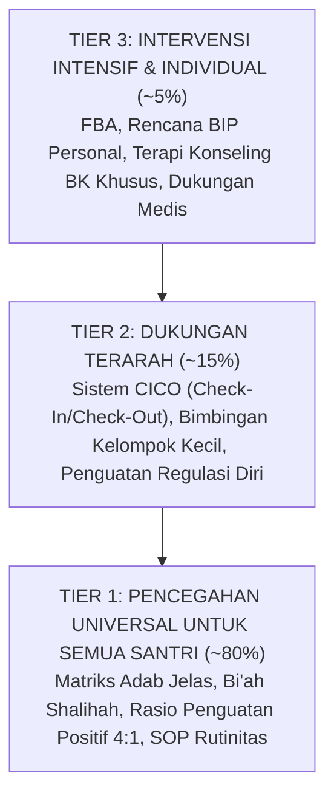
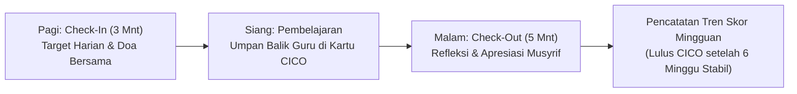
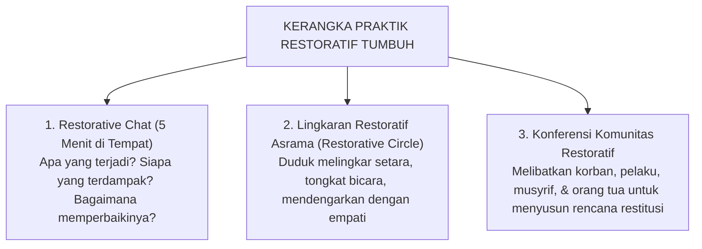

# SERI BUKU EKOSISTEM TUMBUH PESANTREN — VOLUME 04
# PEDOMAN INTERVENSI BERJENJANG PBIS & PRAKTIK RESTORATIF DI ASRAMA
## *Arsitektur Multi-Tier 1–3, Functional Behavior Assessment, Lingkaran Restoratif, dan Rekonsiliasi Nirkekerasan (Ishlah Al-Bain)*

**Nomor Identifikasi**: `BOOK-SERIES/VOL-04/INTERVENSI-RESTORATIF/2026`  
**Klasifikasi**: Monograf Riset Akademis & Manual Intervensi Perilaku PBIS-Restoratif Pesantren  
**Dewan Pakar Pengkaji**: `pakar-pbis`, `pakar-arsitektur-pbis-restoratif`, `pakar-disiplin-positif`, `pakar-kuratif-restoratif`, `pakar-bimbingan-konseling`

---

## 📑 DAFTAR ISI VOLUME 04

1. **BAB 1: Arsitektur Piramida Intervensi Multi-Tier PBIS Pesantren**
   - 1.1 Prinsip Desain Intervensi Tiga Tingkat: Universal (Tier 1), Terarah (Tier 2), dan Intensif (Tier 3)
   - 1.2 Pembagian Proporsi Ideal Populasi: 80% Tier 1, 15% Tier 2, dan 5% Tier 3
   - 1.3 Pergeseran dari Paradigma Retributif-Punitive (Pembalasan Dendam) ke Paradigma Edukatif-Restoratif
2. **BAB 2: Intervensi Tier 1: Rekayasa Lingkungan Preventif & Budaya Universal**
   - 2.1 Matriks Harapan Perilaku Universal (Masjid, Asrama, Kelas, Ruang Makan, Lapangan)
   - 2.2 Rasio Penguatan Positif 4:1 (Empat Apresiasi Tulus untuk Satu Teguran Korektif)
   - 2.3 Manajemen Rutinitas Transisi dan Mitigasi Titik Rawan (*Hotspot Management*)
3. **BAB 3: Intervensi Tier 2: Dukungan Kelompok Terarah & Protokol CICO**
   - 3.1 Kriteria Seleksi Santri Tier 2 (Frekuensi Insiden Ringan-Sedang yang Berulang)
   - 3.2 Implementasi Sistem *Check-In / Check-Out* (CICO) Harian Bersama Mentor Musyrif
   - 3.3 Kelompok Keterampilan Sosial (*Social Skills Groups*): Manajemen Amarah dan Regulasi Diri
4. **BAB 4: Intervensi Tier 3: Asesmen Fungsional (FBA) dan Rencana Dukungan Individual (BIP)**
   - 4.1 Metodologi *Functional Behavior Assessment* (FBA): Menguak Fungsi Perilaku (*Gain vs Escape*)
   - 4.2 Penyusunan *Behavior Intervention Plan* (BIP): Perilaku Pengganti (*Replacement Behavior*)
   - 4.3 Kolaborasi Khusus Guru BK, Musyrif, Orang Tua, dan Rujukan Profesional (Psikolog/Psikiater)
5. **BAB 5: Praktik Restoratif Holistik: Menyembuhkan Luka Relasi & Komunitas**
   - 5.1 Percakapan Restoratif 5-Menit (*Restorative Affective Questions*) di Lapangan
   - 5.2 Lingkaran Restoratif Asrama (*Dormitory Restorative Circles*): Menyelesaikan Konflik Kamar
   - 5.3 Konferensi Komunitas Restoratif untuk Pelanggaran Adab Berat Tanpa Pengusiran Stigmatif
6. **BAB 6: Konsekuensi Logis dan Resolusi Syar'i: Konsep Ishlah Al-Bain**
   - 6.1 Kaidah 4R dalam Konsekuensi Logis: *Related, Respectful, Reasonable, Restorative*
   - 6.2 Integrasi Konsep Fiqh *Ishlah al-Bain*, *Ta'widh*, dan *Tabayyun* dalam Pemulihan Hak Korban
   - 6.3 Protokol De-eskalasi Krisis Emosional Santri: Penanganan Tanpa Kekerasan Fisik & Verbal

---

## 🏛️ IKHTISAR DAN TEKS MONOGRAF BAB PER BAB

### BAB 1: Arsitektur Piramida Intervensi Multi-Tier PBIS Pesantren

Dalam pendekatan tradisional, seluruh pelanggaran sering kali dihantam dengan satu instrumen yang sama: hukuman fisik, cukur gundul, atau lari keliling lapangan. Pendekatan ini terbukti gagal secara ilmiah dan merusak martabat santri. Ekosistem TUMBUH mengadopsi **School-Wide Positive Behavioral Interventions and Supports (SW-PBIS)** yang membagi intervensi menjadi tiga jenjang:

Pendekatan ini memastikan sumber daya lembaga teralokasi secara efisien: 80% energi difokuskan pada penguatan budaya positif universal, sehingga santri yang membutuhkan intervensi mendalam (Tier 2 & 3) dapat ditangani secara intensif dan manusiawi.

### BAB 2: Intervensi Tier 1: Rekayasa Lingkungan Preventif & Budaya Universal

Pencegahan primer (Tier 1) adalah benteng utama pesantren. Karakteristik kunci Tier 1 TUMBUH meliputi:
1. **Matriks Harapan Adab**: Di setiap lokasi (masjid, kamar, kantin, kamar mandi) dipasang panduan visual perilaku positif yang spesifik dan mudah dipahami.
2. **Rasio Penguatan Positif 4:1**: Setiap pendidik dan musyrif dilatih untuk memberikan minimal 4 kalimat apresiasi atau pengakuan atas perilaku adab santri sebelum memberikan 1 teguran korektif. Hal ini membangun *emotional bank account* yang kaya antara santri dan pembina.
3. **Patroli Proaktif pada Titik Rawan**: Musyrif hadir di lokasi-lokasi sepi dan jam-jam rawan (transisi asrama ke sekolah, setelah makan malam) untuk menyapa dan mendampingi santri secara hangat (*active supervision*).

### BAB 3: Intervensi Tier 2: Dukungan Kelompok Terarah & Protokol CICO

Bagi santri yang mulai menunjukkan penurunan kedisiplinan berulang (Tier 2), lembaga mengaktifkan protokol **Check-In / Check-Out (CICO)**:
* **Pagi Hari (Check-In)**: Santri bertemu mentor musyrif selama 3 menit untuk menyepakati target adab hari itu dan menerima kartu CICO.
* **Sepanjang Hari**: Santri mengumpulkan umpan balik singkat dari guru kelas di setiap sesi pelajaran.
* **Malam Hari (Check-Out)**: Santri kembali menemui musyrif untuk mengevaluasi capaian hari itu, merayakan keberhasilan, dan merumuskan perbaikan tanpa hukuman.

Sistem CICO memberikan struktur pendampingan yang intensif dan hangat, membantu santri membangun kembali kepercayaan diri dan regulasi perilakunya.

### BAB 4: Intervensi Tier 3: Asesmen Fungsional (FBA) dan Rencana BIP

Bagi sebagian kecil santri (~5%) yang mengalami hambatan emosional atau perilaku kompleks, tim khusus (Guru BK, Musyrif Senior, Kepala Pengasuhan) melakukan **Functional Behavior Assessment (FBA)**. 

FBA meneliti akar masalah: apa yang ingin dicapai atau dihindari santri melalui perilakunya?
* Apakah santri membolos halaqah untuk *menghindari rasa malu* karena belum lancar membaca? (*Escape function*)
* Apakah santri membuat keributan untuk *mencari perhatian* teman sekamar? (*Attention-seeking function*)

Setelah fungsi perilaku teridentifikasi, disusun **Behavior Intervention Plan (BIP)** yang mengajarkan *perilaku pengganti yang adaptif* (misal: bimbingan tahsin privat atau peran kepemimpinan positif) disertai modifikasi lingkungan yang mendukung.

### BAB 5: Praktik Restoratif Holistik: Menyembuhkan Luka Relasi

Praktik Restoratif berfokus pada **pemulihan hubungan** yang rusak akibat pelanggaran, bukan sekadar membalas perbuatan pelaku. 

Dengan praktik restoratif, pelaku menyadari dampak nyata dari perbuatannya, korban mendapatkan pemulihan hak dan rasa aman, serta iklim persaudaraan (*ukhuwah*) pesantren tetap terjaga utuh tanpa dendam terpendam.

### BAB 6: Konsekuensi Logis dan Resolusi Syar'i: Konsep Ishlah Al-Bain

Ekosistem TUMBUH mengganti hukuman sewenang-wenang dengan **Konsekuensi Logis Berprinsip 4R**:
1. **Related (Relevan)**: Konsekuensi berhubungan langsung dengan pelanggaran (misal: menumpahkan makanan $\rightarrow$ membersihkan lantai ruang makan).
2. **Respectful (Penuh Penghormatan)**: Disampaikan dengan nada tenang, tanpa membentak, mempermalukan di depan umum, atau menghina martabat santri.
3. **Reasonable (Masuk Akal)**: Beban tugas proporsional dengan usia dan kapasitas santri.
4. **Restorative (Memulihkan)**: Memberikan kesempatan bagi santri untuk memperbaiki kerugian dan merajut kembali ukhuwah (*Ishlah al-Bain*).

Dalam menghadapi santri yang mengalami krisis amarah memuncak (*emotional dysregulation*), musyrif menerapkan **Protokol De-eskalasi Krisis**: menurunkan volume suara, menjaga jarak fisik yang aman, memvalidasi emosi tanpa membenarkan perilaku agresif, dan memberikan jeda tenang (*calm-down corner*) hingga gelombang emosi mereda secara alami.
