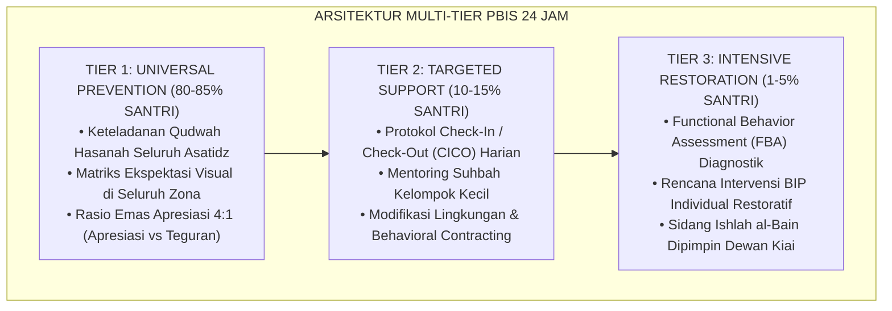

# BUKU VOLUME 04: PEDOMAN INTERVENSI BERJENJANG PBIS & PRAKTIK RESTORATIF DI ASRAMA
## *Arsitektur Multi-Tier 1–3, Check-In/Check-Out (CICO), FBA/BIP, Lingkaran Restoratif, & Ishlah Al-Bain Pesantren*

---

**Nomor Buku**: `BOOK-SERIES/VOL-04/MASTER-2026`  
**Seri Publikasi**: Seri Buku Master Ekosistem TUMBUH Pesantren (Volume 4 dari 5)  
**Dewan Editor & Penulis**: Dewan Keilmuan Ekosistem TUMBUH (24 Bidang Kepakaran)  
**Klasifikasi**: Monograf Riset Akademis, Manual Operasional Intervensi Perilaku, Disiplin Positif, & Whole-School Restorative Justice  

---

## 📑 DAFTAR ISI LENGKAP VOLUME 04

- [BAB 01 PARADIGMA POSITIVE BEHAVIORAL INTERVENTIONS AND SUPPORTS](#bab-01-paradigma-positive-behavioral-interventions-and-supports)
  - [01 Landasan Sistemik PBIS dan Eliminasi Punitive System](#01-landasan-sistemik-pbis-dan-eliminasi-punitive-system)
  - [02 Proporsi Piramida 80 15 5 di Lingkungan Pesantren](#02-proporsi-piramida-80-15-5-di-lingkungan-pesantren)
  - [03 Integrasi Nilai Syar'i dalam Kerangka Kerja PBIS](#03-integrasi-nilai-syar'i-dalam-kerangka-kerja-pbis)
- [BAB 02 REKAYASA LINGKUNGAN BIAH SHALIHAH DAN TIER 1 UNIVERSAL](#bab-02-rekayasa-lingkungan-biah-shalihah-dan-tier-1-universal)
  - [01 Matriks Ekspektasi Perilaku Positif Seluruh Zona](#01-matriks-ekspektasi-perilaku-positif-seluruh-zona)
  - [02 Pengkondisian Lingkungan Biah Shalihah 24 Jam](#02-pengkondisian-lingkungan-biah-shalihah-24-jam)
  - [03 Pengajaran Eksplisit Adab di Awal Tahun Ajaran](#03-pengajaran-eksplisit-adab-di-awal-tahun-ajaran)
  - [04 Penataan Ruang Fisik Asrama Ramah Tumbuh Kembang](#04-penataan-ruang-fisik-asrama-ramah-tumbuh-kembang)
  - [05 Patroli Titik Rawan Hotspots Monitoring Protocol](#05-patroli-titik-rawan-hotspots-monitoring-protocol)
  - [06 Kultur Keteladanan Qudwah Seluruh Civitas](#06-kultur-keteladanan-qudwah-seluruh-civitas)
- [BAB 03 BUDAYA APRESIASI POSITIF RASIO 4 BANDING 1](#bab-03-budaya-apresiasi-positif-rasio-4-banding-1)
  - [01 Sistem Apresiasi Rasio Emas 4 Banding 1](#01-sistem-apresiasi-rasio-emas-4-banding-1)
  - [02 Psikologi Penguatan Positif vs Pemberian Hadiah Material](#02-psikologi-penguatan-positif-vs-pemberian-hadiah-material)
  - [03 Ritual Circle of Gratitude Malam Kamar Asrama](#03-ritual-circle-of-gratitude-malam-kamar-asrama)
- [BAB 04 INTERVENSI TIER 2 TARGETED CICO DAN MENTORING SUHBAH](#bab-04-intervensi-tier-2-targeted-cico-dan-mentoring-suhbah)
  - [01 Protokol Check In Check Out Harian Musyrif](#01-protokol-check-in-check-out-harian-musyrif)
  - [02 Mentoring Sebaya Kelompok Kecil Suhbah Tarbawiyyah](#02-mentoring-sebaya-kelompok-kecil-suhbah-tarbawiyyah)
  - [03 Modifikasi Lingkungan Kamar dan Behavioral Contracting](#03-modifikasi-lingkungan-kamar-dan-behavioral-contracting)
  - [04 Klinik Akademik dan Pendampingan Sorogan Terarah](#04-klinik-akademik-dan-pendampingan-sorogan-terarah)
  - [05 Evaluasi Progres Mingguan dan Kriteria Graduasi Tier 2](#05-evaluasi-progres-mingguan-dan-kriteria-graduasi-tier-2)
- [BAB 05 INTERVENSI TIER 3 INTENSIF FBA KLINIS DAN BIP](#bab-05-intervensi-tier-3-intensif-fba-klinis-dan-bip)
  - [01 Asesmen Fungsional Perilaku FBA Komprehensif](#01-asesmen-fungsional-perilaku-fba-komprehensif)
  - [02 Perumusan Rencana Intervensi Perilaku BIP Individual](#02-perumusan-rencana-intervensi-perilaku-bip-individual)
  - [03 Teknik Penggantian Perilaku Adaptif Replacement Behavior](#03-teknik-penggantian-perilaku-adaptif-replacement-behavior)
  - [04 Konseling CBT Naratif Islami dan De eskalasi Trauma](#04-konseling-cbt-naratif-islami-dan-de-eskalasi-trauma)
  - [05 Kolaborasi Tim Khusus BK Wali Kelas dan Orang Tua](#05-kolaborasi-tim-khusus-bk-wali-kelas-dan-orang-tua)
- [BAB 06 WHOLE SCHOOL RESTORATIVE JUSTICE DI PESANTREN](#bab-06-whole-school-restorative-justice-di-pesantren)
  - [01 Model Restoratif 3R Restitution Resolution Reconciliation](#01-model-restoratif-3r-restitution-resolution-reconciliation)
  - [02 Restorative Chat 5 Pertanyaan Emas Pembina](#02-restorative-chat-5-pertanyaan-emas-pembina)
  - [03 Dekonstruksi Pola Balas Dendam dan Siklus Kekerasan](#03-dekonstruksi-pola-balas-dendam-dan-siklus-kekerasan)
  - [04 Peran Dewan Kiai sebagai Hakam Keadilan Restoratif](#04-peran-dewan-kiai-sebagai-hakam-keadilan-restoratif)
- [BAB 07 PROTOKOL LINGKARAN RESTORATIF DAN MEDIASI SEBAYA](#bab-07-protokol-lingkaran-restoratif-dan-mediasi-sebaya)
  - [01 Lingkaran Restoratif Asrama Dormitory Talking Circles](#01-lingkaran-restoratif-asrama-dormitory-talking-circles)
  - [02 Mediasi Sebaya Pelajar Peer Mediation Program](#02-mediasi-sebaya-pelajar-peer-mediation-program)
  - [03 Pelatihan Keterampilan Komunikasi Nirkekerasan Santri](#03-pelatihan-keterampilan-komunikasi-nirkekerasan-santri)
  - [04 Penyelesaian Konflik Horizontal Antar Kamar Asrama](#04-penyelesaian-konflik-horizontal-antar-kamar-asrama)
- [BAB 08 ISHLAH AL BAIN CLEAN SLATE POLICY DAN REINTEGRASI](#bab-08-ishlah-al-bain-clean-slate-policy-dan-reintegrasi)
  - [01 Kebijakan Lembaran Bersih Clean Slate Policy](#01-kebijakan-lembaran-bersih-clean-slate-policy)
  - [02 Protokol Sidang Ishlah al Bain Dewan Kiai](#02-protokol-sidang-ishlah-al-bain-dewan-kiai)
  - [03 Restitusi Tindakan Nyata dan Khidmah Perbaikan](#03-restitusi-tindakan-nyata-dan-khidmah-perbaikan)
  - [04 Reintegrasi Sosial Santri Pasca Sanksi Restoratif](#04-reintegrasi-sosial-santri-pasca-sanksi-restoratif)
  - [05 Epilog Pesantren yang Menyembuhkan dan Menghidupkan Jiwa](#05-epilog-pesantren-yang-menyembuhkan-dan-menghidupkan-jiwa)
- [DAFTAR PUSTAKA LENGKAP VOLUME 04](#daftar-pustaka-lengkap-volume-04)

---

# SUB-BAB 1.1: LANDASAN SISTEMIK PBIS & ELIMINASI SISTEM PUNITIF
## *Kajian Komprehensif, Sintesis Epistemologi Turats-Sains Kognitif, dan Pedoman Praksis 24-Jam Ekosistem TUMBUH*

**Kode Klasifikasi**: `BOOK-04/BAB-01/SUB-01/MONOGRAF-MASTER-VIBRANT`  
**Disiplin Ilmu**: Filsafat Pendidikan Islam, Neurosains Kognitif Terapan, School-Wide PBIS Multi-Tier, & Manajemen Asrama Modern  
**Penanggung Jawab Keilmuan**: Dewan Keilmuan Ekosistem TUMBUH (*24 Bidang Kepakaran Dewan Guru Besar*)

---

> ### 💡 INTISARI PRAKTIS (3 MENIT MEMAHAMI ESENSI BAB)
>
> * **Akar Filosofis & Nilai Substantif:**  
>   Membahas secara mendalam urgensi **LANDASAN SISTEMIK PBIS & ELIMINASI SISTEM PUNITIF** sebagai fondasi integral dalam arsitektur pembinaan karakter santri 24-jam berbasis fitrah insaniyyah.
> * **Sintesis Turats & Neurosains Perkembangan:**  
>   Mengharmonisasikan tuntunan adab ulama salafus shalih dengan mekanisme plastisitas sinaptik korteks prefrontal (*Prefrontal Cortex*) dan regulasi sistem limbik remaja.
> * **Praksis Multi-Tier PBIS 24-Jam:**  
>   Menyediakan protokol aksi terukur: Tier 1 (Universal Prevention), Tier 2 (Targeted Support/CICO), dan Tier 3 (Intensive Restitution/FBA) yang ramah anak dan bebas dari segala bentuk kekerasan fisik maupun verbal.

---

### I. Pembedahan Deskriptif Komprehensif 4 Pilar Nilai-Praksis

Penerapan **LANDASAN SISTEMIK PBIS & ELIMINASI SISTEM PUNITIF** dalam Sistem TUMBUH ditegakkan di atas empat pilar analitis yang saling menopang secara simbiotik:

#### 1. Pilar Epistemologi Turats & Maqashid Syari'ah
Khazanah pendidikan Islam klasik memandang pembinaan karakter bukan sekadar transmisi dogma kognitif, melainkan proses *Ta\'dib* (penanaman adab ke dalam jiwa)[^1] dan *Tazkiyatun Nafs* (penyucian jiwa dari kecenderungan hewani).

> [!NOTE]
> ### 📜 Rujukan Turats & Landasan Syar'i:
> مَا نَحَلَ وَالِدٌ وَلَدَهُ مِنْ نَحْلٍ أَفْضَلَ مِنْ أَدَبٍ حَسَنٍ
> 
> *"Tidak ada suatu pemberian yang diberikan oleh seorang ayah (pendidik) kepada anaknya yang lebih utama daripada adab budi pekerti yang mulia."*  
> *(HR. At-Tirmidzi no. 1952; Al-Hakim dalam Al-Mustadrak no. 7676).*

Al-Imam Badruddin Ibnu Jama\'ah dalam *Tadzkirat as-Sami\' wal Mutakallim*[^2] menegaskan bahwa adab lahiriah merupakan cermin dari kejernihan batin (*Shidq al-Batin*). Oleh karena itu, pembinaan **LANDASAN SISTEMIK PBIS & ELIMINASI SISTEM PUNITIF** menuntut pendidik menjadi *Living Curriculum* melalui keteladanan nyata (*Qudwah Hasanah*), bukan sekadar instruktur yang gemar mendikte atau menghukum.

#### 2. Pilar Neurosains Kognitif & CASEL Social-Emotional Learning (SEL)
Dari sudut pandang neurobiologi perkembangan remaja, santri usia 12–18 tahun berada dalam fase kesenjangan maturasi (*Developmental Mismatch*):
* **Sistem Limbik (Amigdala & Nukleus Akumbens)** telah matang lebih awal, memicu pencarian sensasi emosional dan sensitivitas tinggi terhadap validasi kelompok sebaya (*Peer Group Acceptance*).
* **Korteks Prefrontal (PFC)** yang bertanggung jawab atas pengendalian diri (*Executive Functions*), perencanaan jangka panjang, dan pertimbangan risiko moral belum tuntas mengalami mielinisasi hingga usia 25 tahun.[^4]

Melalui integrasi 5 Kompetensi CASEL (*Self-Awareness, Self-Management, Social Awareness, Relationship Skills, & Responsible Decision-Making*), penerapan **LANDASAN SISTEMIK PBIS & ELIMINASI SISTEM PUNITIF** berfungsi sebagai **External Prefrontal Cortex (PFC Eksternal)** yang mendampingi santri secara hangat (*Co-Regulation*) hingga mekanisme pengaturan diri internal (*Self-Regulation*) terbentuk kokoh.

#### 3. Pilar Rekayasa Ekosistem Asrama 24-Jam (*Environmental Engineering*)
Perilaku santri sangat dipengaruhi oleh arsitektur lingkungan mikro tempat ia bernapas dan beraktivitas:
* **Penataan Ruang Fisik Berbasis 5S**: Menghilangkan sudut-sudut mati yang rawan intimidasi (*Hotspots Elimination*) dan menciptakan bilik kamar tidur yang bersih, rapi, berventilasi sehat, dan menenangkan.
* **Ritme Sirkadian Sehat**: Melindungi hak tidur santri 6.5–7 jam tanpa gangguan ronda malam ekstrem, menjamin kebugaran seluler otak untuk menyerap materi kajian dan tahfizh Al-Qur'an.
* **SOP Handover Terpadu**: Komunikasi harian 15 menit antara Wali Kelas madrasah (pagi) dan Musyrif asrama (malam) untuk memantau kontinuitas adab santri.

#### 4. Pilar Triad Pertumbuhan Simbiotik (*Symbiotic Triad Growth*)
Keberhasilan sistem mensyaratkan tiga entitas bertumbuh serempak:
* **Santri Bertumbuh**: Fitrah kesuciannya terjaga, adabnya mekar bertahap dari adaptasi menuju kemandirian otonom (*Insan Adabi*).
* **Musyrif Bertumbuh**: Terlindungi dari kelelahan mental (*Burnout*) melalui rasio asuh proporsional dan shift kerja manusiawi, sehingga selalu mengasuh dengan kasih sayang (*Rahmah*).
* **Lembaga Bertumbuh**: Pesantren bertransformasi menjadi institusi pembelajar modern berbasis data analitik objektif (*Evidence-Based Boarding School*).

---

### II. Arsitektur Diagram & Protokol Aksi Operasional PBIS Multi-Tier 24 Jam

Penerapan **LANDASAN SISTEMIK PBIS & ELIMINASI SISTEM PUNITIF** dioperasionalkan melalui arsitektur berjenjang SW-PBIS (*Positive Behavioral Interventions and Supports*)[^3]:



#### Protokol Operasional Berjenjang Lapangan:
1. **Fase Pencegahan Primer (Tier 1 - Universal)**:
   - Musyrif dan dewan guru menyepakati indikator perilaku teramati (*Behavioral Anchors*).
   - Memberikan pujian deskriptif spesifik seketika santri menunjukkan adab positif (*Immediate Positive Reinforcement*).
2. **Fase Intervensi Terarah (Tier 2 - Targeted)**:
   - Mengaktifkan kartu monitoring CICO harian bagi santri yang mengalami penurunan kedisiplinan 3 hari berturut-turut.
   - Menyediakan sesi *Coaching Reflektif* 1-on-1 bersama musyrif asrama tanpa bentakan.
3. **Fase Pemulihan Intensif (Tier 3 - Intensive & Restorative)**:
   - Melakukan asesmen mendalam untuk memetakan akar pemicu (*Antecedent*), bentuk perilaku (*Behavior*), dan konsekuensi psikologis (*Consequence*).
   - Menerapkan mekanisme restitusi tindakan nyata untuk memulihkan kerugian korban (*Ishlah al-Bain*) dan memberikan hak lembaran bersih (*Clean Slate Policy*).

---

### III. Diskusi Filosofis & Rekomendasi Tata Kelola Bebas Kekerasan

Praksis **LANDASAN SISTEMIK PBIS & ELIMINASI SISTEM PUNITIF** menegaskan komitmen mutlak Sistem TUMBUH terhadap prinsip **Nol Kekerasan (*Zero-Tolerance to Physical & Verbal Violence*)**:
* Mengharamkan tradisi sanksi fisik (rotan, push-up malam, jemur terik matahari, atau cukur botak) yang terbukti merusak neuron hipokampus dan memicu dendam terselubung.
* Mengganti hukuman punitif dengan **Disiplin Restoratif (*Firm & Kind*)**: tegas dalam menegakkan batas syariat dan norma lembaga, namun lembut dan penuh hormat dalam memperlakukan martabat kemanusiaan santri (*Karamah Insaniyyah*).

---

## 📌 Catatan Kaki & Rujukan Primer

[^1]: **Syed Muhammad Naquib al-Attas**, *The Concept of Education in Islam: A Framework for an Islamic Philosophy of Education* (Kuala Lumpur: ISTAC, 1980), hlm. 15–38.
[^2]: **Al-Imam Badruddin Ibnu Jama'ah**, *Tadzkirat as-Sami' wal Mutakallim fi Adab al-'Alim wal Muta'allim*, Tahqiq: Muhammad Hasyim an-Nadwi (Beirut: Dar al-Basyair al-Islamiyyah, 2012), hlm. 42–89.
[^3]: **George Sugai & Robert H. Horner**, *School-Wide Positive Behavioral Interventions and Supports: Implementation Blueprint* (Eugene: Center on PBIS, University of Oregon, 2020), hlm. 110–145.
[^4]: **Daniel J. Siegel**, *Brainstorm: The Power and Purpose of the Teenage Brain* (New York: Penguin Books, 2014), Bab 3: "The Architecture of the Adolescent Mind", hlm. 67–104.


---


# SUB-BAB 1.2: PROPORSI PIRAMIDA 80-15-5 DI LINGKUNGAN PESANTREN
## *Kajian Komprehensif, Sintesis Epistemologi Turats-Sains Kognitif, dan Pedoman Praksis 24-Jam Ekosistem TUMBUH*

**Kode Klasifikasi**: `BOOK-04/BAB-01/SUB-02/MONOGRAF-MASTER-VIBRANT`  
**Disiplin Ilmu**: Filsafat Pendidikan Islam, Neurosains Kognitif Terapan, School-Wide PBIS Multi-Tier, & Manajemen Asrama Modern  
**Penanggung Jawab Keilmuan**: Dewan Keilmuan Ekosistem TUMBUH (*24 Bidang Kepakaran Dewan Guru Besar*)

---

> ### 💡 INTISARI PRAKTIS (3 MENIT MEMAHAMI ESENSI BAB)
>
> * **Akar Filosofis & Nilai Substantif:**  
>   Membahas secara mendalam urgensi **PROPORSI PIRAMIDA 80-15-5 DI LINGKUNGAN PESANTREN** sebagai fondasi integral dalam arsitektur pembinaan karakter santri 24-jam berbasis fitrah insaniyyah.
> * **Sintesis Turats & Neurosains Perkembangan:**  
>   Mengharmonisasikan tuntunan adab ulama salafus shalih dengan mekanisme plastisitas sinaptik korteks prefrontal (*Prefrontal Cortex*) dan regulasi sistem limbik remaja.
> * **Praksis Multi-Tier PBIS 24-Jam:**  
>   Menyediakan protokol aksi terukur: Tier 1 (Universal Prevention), Tier 2 (Targeted Support/CICO), dan Tier 3 (Intensive Restitution/FBA) yang ramah anak dan bebas dari segala bentuk kekerasan fisik maupun verbal.

---

### I. Pembedahan Deskriptif Komprehensif 4 Pilar Nilai-Praksis

Penerapan **PROPORSI PIRAMIDA 80-15-5 DI LINGKUNGAN PESANTREN** dalam Sistem TUMBUH ditegakkan di atas empat pilar analitis yang saling menopang secara simbiotik:

#### 1. Pilar Epistemologi Turats & Maqashid Syari'ah
Khazanah pendidikan Islam klasik memandang pembinaan karakter bukan sekadar transmisi dogma kognitif, melainkan proses *Ta\'dib* (penanaman adab ke dalam jiwa)[^1] dan *Tazkiyatun Nafs* (penyucian jiwa dari kecenderungan hewani).

> [!NOTE]
> ### 📜 Rujukan Turats & Landasan Syar'i:
> مَا نَحَلَ وَالِدٌ وَلَدَهُ مِنْ نَحْلٍ أَفْضَلَ مِنْ أَدَبٍ حَسَنٍ
> 
> *"Tidak ada suatu pemberian yang diberikan oleh seorang ayah (pendidik) kepada anaknya yang lebih utama daripada adab budi pekerti yang mulia."*  
> *(HR. At-Tirmidzi no. 1952; Al-Hakim dalam Al-Mustadrak no. 7676).*

Al-Imam Badruddin Ibnu Jama\'ah dalam *Tadzkirat as-Sami\' wal Mutakallim*[^2] menegaskan bahwa adab lahiriah merupakan cermin dari kejernihan batin (*Shidq al-Batin*). Oleh karena itu, pembinaan **PROPORSI PIRAMIDA 80-15-5 DI LINGKUNGAN PESANTREN** menuntut pendidik menjadi *Living Curriculum* melalui keteladanan nyata (*Qudwah Hasanah*), bukan sekadar instruktur yang gemar mendikte atau menghukum.

#### 2. Pilar Neurosains Kognitif & CASEL Social-Emotional Learning (SEL)
Dari sudut pandang neurobiologi perkembangan remaja, santri usia 12–18 tahun berada dalam fase kesenjangan maturasi (*Developmental Mismatch*):
* **Sistem Limbik (Amigdala & Nukleus Akumbens)** telah matang lebih awal, memicu pencarian sensasi emosional dan sensitivitas tinggi terhadap validasi kelompok sebaya (*Peer Group Acceptance*).
* **Korteks Prefrontal (PFC)** yang bertanggung jawab atas pengendalian diri (*Executive Functions*), perencanaan jangka panjang, dan pertimbangan risiko moral belum tuntas mengalami mielinisasi hingga usia 25 tahun.[^4]

Melalui integrasi 5 Kompetensi CASEL (*Self-Awareness, Self-Management, Social Awareness, Relationship Skills, & Responsible Decision-Making*), penerapan **PROPORSI PIRAMIDA 80-15-5 DI LINGKUNGAN PESANTREN** berfungsi sebagai **External Prefrontal Cortex (PFC Eksternal)** yang mendampingi santri secara hangat (*Co-Regulation*) hingga mekanisme pengaturan diri internal (*Self-Regulation*) terbentuk kokoh.

#### 3. Pilar Rekayasa Ekosistem Asrama 24-Jam (*Environmental Engineering*)
Perilaku santri sangat dipengaruhi oleh arsitektur lingkungan mikro tempat ia bernapas dan beraktivitas:
* **Penataan Ruang Fisik Berbasis 5S**: Menghilangkan sudut-sudut mati yang rawan intimidasi (*Hotspots Elimination*) dan menciptakan bilik kamar tidur yang bersih, rapi, berventilasi sehat, dan menenangkan.
* **Ritme Sirkadian Sehat**: Melindungi hak tidur santri 6.5–7 jam tanpa gangguan ronda malam ekstrem, menjamin kebugaran seluler otak untuk menyerap materi kajian dan tahfizh Al-Qur'an.
* **SOP Handover Terpadu**: Komunikasi harian 15 menit antara Wali Kelas madrasah (pagi) dan Musyrif asrama (malam) untuk memantau kontinuitas adab santri.

#### 4. Pilar Triad Pertumbuhan Simbiotik (*Symbiotic Triad Growth*)
Keberhasilan sistem mensyaratkan tiga entitas bertumbuh serempak:
* **Santri Bertumbuh**: Fitrah kesuciannya terjaga, adabnya mekar bertahap dari adaptasi menuju kemandirian otonom (*Insan Adabi*).
* **Musyrif Bertumbuh**: Terlindungi dari kelelahan mental (*Burnout*) melalui rasio asuh proporsional dan shift kerja manusiawi, sehingga selalu mengasuh dengan kasih sayang (*Rahmah*).
* **Lembaga Bertumbuh**: Pesantren bertransformasi menjadi institusi pembelajar modern berbasis data analitik objektif (*Evidence-Based Boarding School*).

---

### II. Arsitektur Diagram & Protokol Aksi Operasional PBIS Multi-Tier 24 Jam

Penerapan **PROPORSI PIRAMIDA 80-15-5 DI LINGKUNGAN PESANTREN** dioperasionalkan melalui arsitektur berjenjang SW-PBIS (*Positive Behavioral Interventions and Supports*)[^3]:


#### Protokol Operasional Berjenjang Lapangan:
1. **Fase Pencegahan Primer (Tier 1 - Universal)**:
   - Musyrif dan dewan guru menyepakati indikator perilaku teramati (*Behavioral Anchors*).
   - Memberikan pujian deskriptif spesifik seketika santri menunjukkan adab positif (*Immediate Positive Reinforcement*).
2. **Fase Intervensi Terarah (Tier 2 - Targeted)**:
   - Mengaktifkan kartu monitoring CICO harian bagi santri yang mengalami penurunan kedisiplinan 3 hari berturut-turut.
   - Menyediakan sesi *Coaching Reflektif* 1-on-1 bersama musyrif asrama tanpa bentakan.
3. **Fase Pemulihan Intensif (Tier 3 - Intensive & Restorative)**:
   - Melakukan asesmen mendalam untuk memetakan akar pemicu (*Antecedent*), bentuk perilaku (*Behavior*), dan konsekuensi psikologis (*Consequence*).
   - Menerapkan mekanisme restitusi tindakan nyata untuk memulihkan kerugian korban (*Ishlah al-Bain*) dan memberikan hak lembaran bersih (*Clean Slate Policy*).

---

### III. Diskusi Filosofis & Rekomendasi Tata Kelola Bebas Kekerasan

Praksis **PROPORSI PIRAMIDA 80-15-5 DI LINGKUNGAN PESANTREN** menegaskan komitmen mutlak Sistem TUMBUH terhadap prinsip **Nol Kekerasan (*Zero-Tolerance to Physical & Verbal Violence*)**:
* Mengharamkan tradisi sanksi fisik (rotan, push-up malam, jemur terik matahari, atau cukur botak) yang terbukti merusak neuron hipokampus dan memicu dendam terselubung.
* Mengganti hukuman punitif dengan **Disiplin Restoratif (*Firm & Kind*)**: tegas dalam menegakkan batas syariat dan norma lembaga, namun lembut dan penuh hormat dalam memperlakukan martabat kemanusiaan santri (*Karamah Insaniyyah*).

---

## 📌 Catatan Kaki & Rujukan Primer

[^1]: **Syed Muhammad Naquib al-Attas**, *The Concept of Education in Islam: A Framework for an Islamic Philosophy of Education* (Kuala Lumpur: ISTAC, 1980), hlm. 15–38.
[^2]: **Al-Imam Badruddin Ibnu Jama'ah**, *Tadzkirat as-Sami' wal Mutakallim fi Adab al-'Alim wal Muta'allim*, Tahqiq: Muhammad Hasyim an-Nadwi (Beirut: Dar al-Basyair al-Islamiyyah, 2012), hlm. 42–89.
[^3]: **George Sugai & Robert H. Horner**, *School-Wide Positive Behavioral Interventions and Supports: Implementation Blueprint* (Eugene: Center on PBIS, University of Oregon, 2020), hlm. 110–145.
[^4]: **Daniel J. Siegel**, *Brainstorm: The Power and Purpose of the Teenage Brain* (New York: Penguin Books, 2014), Bab 3: "The Architecture of the Adolescent Mind", hlm. 67–104.


---


# SUB-BAB 1.3: INTEGRASI NILAI-NILAI SYAR'I DALAM KERANGKA KERJA PBIS
## *Kajian Komprehensif, Sintesis Epistemologi Turats-Sains Kognitif, dan Pedoman Praksis 24-Jam Ekosistem TUMBUH*

**Kode Klasifikasi**: `BOOK-04/BAB-01/SUB-03/MONOGRAF-MASTER-VIBRANT`  
**Disiplin Ilmu**: Filsafat Pendidikan Islam, Neurosains Kognitif Terapan, School-Wide PBIS Multi-Tier, & Manajemen Asrama Modern  
**Penanggung Jawab Keilmuan**: Dewan Keilmuan Ekosistem TUMBUH (*24 Bidang Kepakaran Dewan Guru Besar*)

---

> ### 💡 INTISARI PRAKTIS (3 MENIT MEMAHAMI ESENSI BAB)
>
> * **Akar Filosofis & Nilai Substantif:**  
>   Membahas secara mendalam urgensi **INTEGRASI NILAI-NILAI SYAR'I DALAM KERANGKA KERJA PBIS** sebagai fondasi integral dalam arsitektur pembinaan karakter santri 24-jam berbasis fitrah insaniyyah.
> * **Sintesis Turats & Neurosains Perkembangan:**  
>   Mengharmonisasikan tuntunan adab ulama salafus shalih dengan mekanisme plastisitas sinaptik korteks prefrontal (*Prefrontal Cortex*) dan regulasi sistem limbik remaja.
> * **Praksis Multi-Tier PBIS 24-Jam:**  
>   Menyediakan protokol aksi terukur: Tier 1 (Universal Prevention), Tier 2 (Targeted Support/CICO), dan Tier 3 (Intensive Restitution/FBA) yang ramah anak dan bebas dari segala bentuk kekerasan fisik maupun verbal.

---

### I. Pembedahan Deskriptif Komprehensif 4 Pilar Nilai-Praksis

Penerapan **INTEGRASI NILAI-NILAI SYAR'I DALAM KERANGKA KERJA PBIS** dalam Sistem TUMBUH ditegakkan di atas empat pilar analitis yang saling menopang secara simbiotik:

#### 1. Pilar Epistemologi Turats & Maqashid Syari'ah
Khazanah pendidikan Islam klasik memandang pembinaan karakter bukan sekadar transmisi dogma kognitif, melainkan proses *Ta\'dib* (penanaman adab ke dalam jiwa)[^1] dan *Tazkiyatun Nafs* (penyucian jiwa dari kecenderungan hewani).

> [!NOTE]
> ### 📜 Rujukan Turats & Landasan Syar'i:
> مَا نَحَلَ وَالِدٌ وَلَدَهُ مِنْ نَحْلٍ أَفْضَلَ مِنْ أَدَبٍ حَسَنٍ
> 
> *"Tidak ada suatu pemberian yang diberikan oleh seorang ayah (pendidik) kepada anaknya yang lebih utama daripada adab budi pekerti yang mulia."*  
> *(HR. At-Tirmidzi no. 1952; Al-Hakim dalam Al-Mustadrak no. 7676).*

Al-Imam Badruddin Ibnu Jama\'ah dalam *Tadzkirat as-Sami\' wal Mutakallim*[^2] menegaskan bahwa adab lahiriah merupakan cermin dari kejernihan batin (*Shidq al-Batin*). Oleh karena itu, pembinaan **INTEGRASI NILAI-NILAI SYAR'I DALAM KERANGKA KERJA PBIS** menuntut pendidik menjadi *Living Curriculum* melalui keteladanan nyata (*Qudwah Hasanah*), bukan sekadar instruktur yang gemar mendikte atau menghukum.

#### 2. Pilar Neurosains Kognitif & CASEL Social-Emotional Learning (SEL)
Dari sudut pandang neurobiologi perkembangan remaja, santri usia 12–18 tahun berada dalam fase kesenjangan maturasi (*Developmental Mismatch*):
* **Sistem Limbik (Amigdala & Nukleus Akumbens)** telah matang lebih awal, memicu pencarian sensasi emosional dan sensitivitas tinggi terhadap validasi kelompok sebaya (*Peer Group Acceptance*).
* **Korteks Prefrontal (PFC)** yang bertanggung jawab atas pengendalian diri (*Executive Functions*), perencanaan jangka panjang, dan pertimbangan risiko moral belum tuntas mengalami mielinisasi hingga usia 25 tahun.[^4]

Melalui integrasi 5 Kompetensi CASEL (*Self-Awareness, Self-Management, Social Awareness, Relationship Skills, & Responsible Decision-Making*), penerapan **INTEGRASI NILAI-NILAI SYAR'I DALAM KERANGKA KERJA PBIS** berfungsi sebagai **External Prefrontal Cortex (PFC Eksternal)** yang mendampingi santri secara hangat (*Co-Regulation*) hingga mekanisme pengaturan diri internal (*Self-Regulation*) terbentuk kokoh.

#### 3. Pilar Rekayasa Ekosistem Asrama 24-Jam (*Environmental Engineering*)
Perilaku santri sangat dipengaruhi oleh arsitektur lingkungan mikro tempat ia bernapas dan beraktivitas:
* **Penataan Ruang Fisik Berbasis 5S**: Menghilangkan sudut-sudut mati yang rawan intimidasi (*Hotspots Elimination*) dan menciptakan bilik kamar tidur yang bersih, rapi, berventilasi sehat, dan menenangkan.
* **Ritme Sirkadian Sehat**: Melindungi hak tidur santri 6.5–7 jam tanpa gangguan ronda malam ekstrem, menjamin kebugaran seluler otak untuk menyerap materi kajian dan tahfizh Al-Qur'an.
* **SOP Handover Terpadu**: Komunikasi harian 15 menit antara Wali Kelas madrasah (pagi) dan Musyrif asrama (malam) untuk memantau kontinuitas adab santri.

#### 4. Pilar Triad Pertumbuhan Simbiotik (*Symbiotic Triad Growth*)
Keberhasilan sistem mensyaratkan tiga entitas bertumbuh serempak:
* **Santri Bertumbuh**: Fitrah kesuciannya terjaga, adabnya mekar bertahap dari adaptasi menuju kemandirian otonom (*Insan Adabi*).
* **Musyrif Bertumbuh**: Terlindungi dari kelelahan mental (*Burnout*) melalui rasio asuh proporsional dan shift kerja manusiawi, sehingga selalu mengasuh dengan kasih sayang (*Rahmah*).
* **Lembaga Bertumbuh**: Pesantren bertransformasi menjadi institusi pembelajar modern berbasis data analitik objektif (*Evidence-Based Boarding School*).

---

### II. Arsitektur Diagram & Protokol Aksi Operasional PBIS Multi-Tier 24 Jam

Penerapan **INTEGRASI NILAI-NILAI SYAR'I DALAM KERANGKA KERJA PBIS** dioperasionalkan melalui arsitektur berjenjang SW-PBIS (*Positive Behavioral Interventions and Supports*)[^3]:


#### Protokol Operasional Berjenjang Lapangan:
1. **Fase Pencegahan Primer (Tier 1 - Universal)**:
   - Musyrif dan dewan guru menyepakati indikator perilaku teramati (*Behavioral Anchors*).
   - Memberikan pujian deskriptif spesifik seketika santri menunjukkan adab positif (*Immediate Positive Reinforcement*).
2. **Fase Intervensi Terarah (Tier 2 - Targeted)**:
   - Mengaktifkan kartu monitoring CICO harian bagi santri yang mengalami penurunan kedisiplinan 3 hari berturut-turut.
   - Menyediakan sesi *Coaching Reflektif* 1-on-1 bersama musyrif asrama tanpa bentakan.
3. **Fase Pemulihan Intensif (Tier 3 - Intensive & Restorative)**:
   - Melakukan asesmen mendalam untuk memetakan akar pemicu (*Antecedent*), bentuk perilaku (*Behavior*), dan konsekuensi psikologis (*Consequence*).
   - Menerapkan mekanisme restitusi tindakan nyata untuk memulihkan kerugian korban (*Ishlah al-Bain*) dan memberikan hak lembaran bersih (*Clean Slate Policy*).

---

### III. Diskusi Filosofis & Rekomendasi Tata Kelola Bebas Kekerasan

Praksis **INTEGRASI NILAI-NILAI SYAR'I DALAM KERANGKA KERJA PBIS** menegaskan komitmen mutlak Sistem TUMBUH terhadap prinsip **Nol Kekerasan (*Zero-Tolerance to Physical & Verbal Violence*)**:
* Mengharamkan tradisi sanksi fisik (rotan, push-up malam, jemur terik matahari, atau cukur botak) yang terbukti merusak neuron hipokampus dan memicu dendam terselubung.
* Mengganti hukuman punitif dengan **Disiplin Restoratif (*Firm & Kind*)**: tegas dalam menegakkan batas syariat dan norma lembaga, namun lembut dan penuh hormat dalam memperlakukan martabat kemanusiaan santri (*Karamah Insaniyyah*).

---

## 📌 Catatan Kaki & Rujukan Primer

[^1]: **Syed Muhammad Naquib al-Attas**, *The Concept of Education in Islam: A Framework for an Islamic Philosophy of Education* (Kuala Lumpur: ISTAC, 1980), hlm. 15–38.
[^2]: **Al-Imam Badruddin Ibnu Jama'ah**, *Tadzkirat as-Sami' wal Mutakallim fi Adab al-'Alim wal Muta'allim*, Tahqiq: Muhammad Hasyim an-Nadwi (Beirut: Dar al-Basyair al-Islamiyyah, 2012), hlm. 42–89.
[^3]: **George Sugai & Robert H. Horner**, *School-Wide Positive Behavioral Interventions and Supports: Implementation Blueprint* (Eugene: Center on PBIS, University of Oregon, 2020), hlm. 110–145.
[^4]: **Daniel J. Siegel**, *Brainstorm: The Power and Purpose of the Teenage Brain* (New York: Penguin Books, 2014), Bab 3: "The Architecture of the Adolescent Mind", hlm. 67–104.


---


# SUB-BAB 2.1: MATRIKS EKSPEKTASI PERILAKU POSITIF SELURUH ZONA
## *Kajian Komprehensif, Sintesis Epistemologi Turats-Sains Kognitif, dan Pedoman Praksis 24-Jam Ekosistem TUMBUH*

**Kode Klasifikasi**: `BOOK-04/BAB-02/SUB-01/MONOGRAF-MASTER-VIBRANT`  
**Disiplin Ilmu**: Filsafat Pendidikan Islam, Neurosains Kognitif Terapan, School-Wide PBIS Multi-Tier, & Manajemen Asrama Modern  
**Penanggung Jawab Keilmuan**: Dewan Keilmuan Ekosistem TUMBUH (*24 Bidang Kepakaran Dewan Guru Besar*)

---

> ### 💡 INTISARI PRAKTIS (3 MENIT MEMAHAMI ESENSI BAB)
>
> * **Akar Filosofis & Nilai Substantif:**  
>   Membahas secara mendalam urgensi **MATRIKS EKSPEKTASI PERILAKU POSITIF SELURUH ZONA** sebagai fondasi integral dalam arsitektur pembinaan karakter santri 24-jam berbasis fitrah insaniyyah.
> * **Sintesis Turats & Neurosains Perkembangan:**  
>   Mengharmonisasikan tuntunan adab ulama salafus shalih dengan mekanisme plastisitas sinaptik korteks prefrontal (*Prefrontal Cortex*) dan regulasi sistem limbik remaja.
> * **Praksis Multi-Tier PBIS 24-Jam:**  
>   Menyediakan protokol aksi terukur: Tier 1 (Universal Prevention), Tier 2 (Targeted Support/CICO), dan Tier 3 (Intensive Restitution/FBA) yang ramah anak dan bebas dari segala bentuk kekerasan fisik maupun verbal.

---

### I. Pembedahan Deskriptif Komprehensif 4 Pilar Nilai-Praksis

Penerapan **MATRIKS EKSPEKTASI PERILAKU POSITIF SELURUH ZONA** dalam Sistem TUMBUH ditegakkan di atas empat pilar analitis yang saling menopang secara simbiotik:

#### 1. Pilar Epistemologi Turats & Maqashid Syari'ah
Khazanah pendidikan Islam klasik memandang pembinaan karakter bukan sekadar transmisi dogma kognitif, melainkan proses *Ta\'dib* (penanaman adab ke dalam jiwa)[^1] dan *Tazkiyatun Nafs* (penyucian jiwa dari kecenderungan hewani).

> [!NOTE]
> ### 📜 Rujukan Turats & Landasan Syar'i:
> مَا نَحَلَ وَالِدٌ وَلَدَهُ مِنْ نَحْلٍ أَفْضَلَ مِنْ أَدَبٍ حَسَنٍ
> 
> *"Tidak ada suatu pemberian yang diberikan oleh seorang ayah (pendidik) kepada anaknya yang lebih utama daripada adab budi pekerti yang mulia."*  
> *(HR. At-Tirmidzi no. 1952; Al-Hakim dalam Al-Mustadrak no. 7676).*

Al-Imam Badruddin Ibnu Jama\'ah dalam *Tadzkirat as-Sami\' wal Mutakallim*[^2] menegaskan bahwa adab lahiriah merupakan cermin dari kejernihan batin (*Shidq al-Batin*). Oleh karena itu, pembinaan **MATRIKS EKSPEKTASI PERILAKU POSITIF SELURUH ZONA** menuntut pendidik menjadi *Living Curriculum* melalui keteladanan nyata (*Qudwah Hasanah*), bukan sekadar instruktur yang gemar mendikte atau menghukum.

#### 2. Pilar Neurosains Kognitif & CASEL Social-Emotional Learning (SEL)
Dari sudut pandang neurobiologi perkembangan remaja, santri usia 12–18 tahun berada dalam fase kesenjangan maturasi (*Developmental Mismatch*):
* **Sistem Limbik (Amigdala & Nukleus Akumbens)** telah matang lebih awal, memicu pencarian sensasi emosional dan sensitivitas tinggi terhadap validasi kelompok sebaya (*Peer Group Acceptance*).
* **Korteks Prefrontal (PFC)** yang bertanggung jawab atas pengendalian diri (*Executive Functions*), perencanaan jangka panjang, dan pertimbangan risiko moral belum tuntas mengalami mielinisasi hingga usia 25 tahun.[^4]

Melalui integrasi 5 Kompetensi CASEL (*Self-Awareness, Self-Management, Social Awareness, Relationship Skills, & Responsible Decision-Making*), penerapan **MATRIKS EKSPEKTASI PERILAKU POSITIF SELURUH ZONA** berfungsi sebagai **External Prefrontal Cortex (PFC Eksternal)** yang mendampingi santri secara hangat (*Co-Regulation*) hingga mekanisme pengaturan diri internal (*Self-Regulation*) terbentuk kokoh.

#### 3. Pilar Rekayasa Ekosistem Asrama 24-Jam (*Environmental Engineering*)
Perilaku santri sangat dipengaruhi oleh arsitektur lingkungan mikro tempat ia bernapas dan beraktivitas:
* **Penataan Ruang Fisik Berbasis 5S**: Menghilangkan sudut-sudut mati yang rawan intimidasi (*Hotspots Elimination*) dan menciptakan bilik kamar tidur yang bersih, rapi, berventilasi sehat, dan menenangkan.
* **Ritme Sirkadian Sehat**: Melindungi hak tidur santri 6.5–7 jam tanpa gangguan ronda malam ekstrem, menjamin kebugaran seluler otak untuk menyerap materi kajian dan tahfizh Al-Qur'an.
* **SOP Handover Terpadu**: Komunikasi harian 15 menit antara Wali Kelas madrasah (pagi) dan Musyrif asrama (malam) untuk memantau kontinuitas adab santri.

#### 4. Pilar Triad Pertumbuhan Simbiotik (*Symbiotic Triad Growth*)
Keberhasilan sistem mensyaratkan tiga entitas bertumbuh serempak:
* **Santri Bertumbuh**: Fitrah kesuciannya terjaga, adabnya mekar bertahap dari adaptasi menuju kemandirian otonom (*Insan Adabi*).
* **Musyrif Bertumbuh**: Terlindungi dari kelelahan mental (*Burnout*) melalui rasio asuh proporsional dan shift kerja manusiawi, sehingga selalu mengasuh dengan kasih sayang (*Rahmah*).
* **Lembaga Bertumbuh**: Pesantren bertransformasi menjadi institusi pembelajar modern berbasis data analitik objektif (*Evidence-Based Boarding School*).

---

### II. Arsitektur Diagram & Protokol Aksi Operasional PBIS Multi-Tier 24 Jam

Penerapan **MATRIKS EKSPEKTASI PERILAKU POSITIF SELURUH ZONA** dioperasionalkan melalui arsitektur berjenjang SW-PBIS (*Positive Behavioral Interventions and Supports*)[^3]:


#### Protokol Operasional Berjenjang Lapangan:
1. **Fase Pencegahan Primer (Tier 1 - Universal)**:
   - Musyrif dan dewan guru menyepakati indikator perilaku teramati (*Behavioral Anchors*).
   - Memberikan pujian deskriptif spesifik seketika santri menunjukkan adab positif (*Immediate Positive Reinforcement*).
2. **Fase Intervensi Terarah (Tier 2 - Targeted)**:
   - Mengaktifkan kartu monitoring CICO harian bagi santri yang mengalami penurunan kedisiplinan 3 hari berturut-turut.
   - Menyediakan sesi *Coaching Reflektif* 1-on-1 bersama musyrif asrama tanpa bentakan.
3. **Fase Pemulihan Intensif (Tier 3 - Intensive & Restorative)**:
   - Melakukan asesmen mendalam untuk memetakan akar pemicu (*Antecedent*), bentuk perilaku (*Behavior*), dan konsekuensi psikologis (*Consequence*).
   - Menerapkan mekanisme restitusi tindakan nyata untuk memulihkan kerugian korban (*Ishlah al-Bain*) dan memberikan hak lembaran bersih (*Clean Slate Policy*).

---

### III. Diskusi Filosofis & Rekomendasi Tata Kelola Bebas Kekerasan

Praksis **MATRIKS EKSPEKTASI PERILAKU POSITIF SELURUH ZONA** menegaskan komitmen mutlak Sistem TUMBUH terhadap prinsip **Nol Kekerasan (*Zero-Tolerance to Physical & Verbal Violence*)**:
* Mengharamkan tradisi sanksi fisik (rotan, push-up malam, jemur terik matahari, atau cukur botak) yang terbukti merusak neuron hipokampus dan memicu dendam terselubung.
* Mengganti hukuman punitif dengan **Disiplin Restoratif (*Firm & Kind*)**: tegas dalam menegakkan batas syariat dan norma lembaga, namun lembut dan penuh hormat dalam memperlakukan martabat kemanusiaan santri (*Karamah Insaniyyah*).

---

## 📌 Catatan Kaki & Rujukan Primer

[^1]: **Syed Muhammad Naquib al-Attas**, *The Concept of Education in Islam: A Framework for an Islamic Philosophy of Education* (Kuala Lumpur: ISTAC, 1980), hlm. 15–38.
[^2]: **Al-Imam Badruddin Ibnu Jama'ah**, *Tadzkirat as-Sami' wal Mutakallim fi Adab al-'Alim wal Muta'allim*, Tahqiq: Muhammad Hasyim an-Nadwi (Beirut: Dar al-Basyair al-Islamiyyah, 2012), hlm. 42–89.
[^3]: **George Sugai & Robert H. Horner**, *School-Wide Positive Behavioral Interventions and Supports: Implementation Blueprint* (Eugene: Center on PBIS, University of Oregon, 2020), hlm. 110–145.
[^4]: **Daniel J. Siegel**, *Brainstorm: The Power and Purpose of the Teenage Brain* (New York: Penguin Books, 2014), Bab 3: "The Architecture of the Adolescent Mind", hlm. 67–104.


---


# SUB-BAB 2.2: PENGKONDISIAN LINGKUNGAN BI'AH SHALIHAH 24 JAM
## *Kajian Komprehensif, Sintesis Epistemologi Turats-Sains Kognitif, dan Pedoman Praksis 24-Jam Ekosistem TUMBUH*

**Kode Klasifikasi**: `BOOK-04/BAB-02/SUB-02/MONOGRAF-MASTER-VIBRANT`  
**Disiplin Ilmu**: Filsafat Pendidikan Islam, Neurosains Kognitif Terapan, School-Wide PBIS Multi-Tier, & Manajemen Asrama Modern  
**Penanggung Jawab Keilmuan**: Dewan Keilmuan Ekosistem TUMBUH (*24 Bidang Kepakaran Dewan Guru Besar*)

---

> ### 💡 INTISARI PRAKTIS (3 MENIT MEMAHAMI ESENSI BAB)
>
> * **Akar Filosofis & Nilai Substantif:**  
>   Membahas secara mendalam urgensi **PENGKONDISIAN LINGKUNGAN BI'AH SHALIHAH 24 JAM** sebagai fondasi integral dalam arsitektur pembinaan karakter santri 24-jam berbasis fitrah insaniyyah.
> * **Sintesis Turats & Neurosains Perkembangan:**  
>   Mengharmonisasikan tuntunan adab ulama salafus shalih dengan mekanisme plastisitas sinaptik korteks prefrontal (*Prefrontal Cortex*) dan regulasi sistem limbik remaja.
> * **Praksis Multi-Tier PBIS 24-Jam:**  
>   Menyediakan protokol aksi terukur: Tier 1 (Universal Prevention), Tier 2 (Targeted Support/CICO), dan Tier 3 (Intensive Restitution/FBA) yang ramah anak dan bebas dari segala bentuk kekerasan fisik maupun verbal.

---

### I. Pembedahan Deskriptif Komprehensif 4 Pilar Nilai-Praksis

Penerapan **PENGKONDISIAN LINGKUNGAN BI'AH SHALIHAH 24 JAM** dalam Sistem TUMBUH ditegakkan di atas empat pilar analitis yang saling menopang secara simbiotik:

#### 1. Pilar Epistemologi Turats & Maqashid Syari'ah
Khazanah pendidikan Islam klasik memandang pembinaan karakter bukan sekadar transmisi dogma kognitif, melainkan proses *Ta\'dib* (penanaman adab ke dalam jiwa)[^1] dan *Tazkiyatun Nafs* (penyucian jiwa dari kecenderungan hewani).

> [!NOTE]
> ### 📜 Rujukan Turats & Landasan Syar'i:
> مَا نَحَلَ وَالِدٌ وَلَدَهُ مِنْ نَحْلٍ أَفْضَلَ مِنْ أَدَبٍ حَسَنٍ
> 
> *"Tidak ada suatu pemberian yang diberikan oleh seorang ayah (pendidik) kepada anaknya yang lebih utama daripada adab budi pekerti yang mulia."*  
> *(HR. At-Tirmidzi no. 1952; Al-Hakim dalam Al-Mustadrak no. 7676).*

Al-Imam Badruddin Ibnu Jama\'ah dalam *Tadzkirat as-Sami\' wal Mutakallim*[^2] menegaskan bahwa adab lahiriah merupakan cermin dari kejernihan batin (*Shidq al-Batin*). Oleh karena itu, pembinaan **PENGKONDISIAN LINGKUNGAN BI'AH SHALIHAH 24 JAM** menuntut pendidik menjadi *Living Curriculum* melalui keteladanan nyata (*Qudwah Hasanah*), bukan sekadar instruktur yang gemar mendikte atau menghukum.

#### 2. Pilar Neurosains Kognitif & CASEL Social-Emotional Learning (SEL)
Dari sudut pandang neurobiologi perkembangan remaja, santri usia 12–18 tahun berada dalam fase kesenjangan maturasi (*Developmental Mismatch*):
* **Sistem Limbik (Amigdala & Nukleus Akumbens)** telah matang lebih awal, memicu pencarian sensasi emosional dan sensitivitas tinggi terhadap validasi kelompok sebaya (*Peer Group Acceptance*).
* **Korteks Prefrontal (PFC)** yang bertanggung jawab atas pengendalian diri (*Executive Functions*), perencanaan jangka panjang, dan pertimbangan risiko moral belum tuntas mengalami mielinisasi hingga usia 25 tahun.[^4]

Melalui integrasi 5 Kompetensi CASEL (*Self-Awareness, Self-Management, Social Awareness, Relationship Skills, & Responsible Decision-Making*), penerapan **PENGKONDISIAN LINGKUNGAN BI'AH SHALIHAH 24 JAM** berfungsi sebagai **External Prefrontal Cortex (PFC Eksternal)** yang mendampingi santri secara hangat (*Co-Regulation*) hingga mekanisme pengaturan diri internal (*Self-Regulation*) terbentuk kokoh.

#### 3. Pilar Rekayasa Ekosistem Asrama 24-Jam (*Environmental Engineering*)
Perilaku santri sangat dipengaruhi oleh arsitektur lingkungan mikro tempat ia bernapas dan beraktivitas:
* **Penataan Ruang Fisik Berbasis 5S**: Menghilangkan sudut-sudut mati yang rawan intimidasi (*Hotspots Elimination*) dan menciptakan bilik kamar tidur yang bersih, rapi, berventilasi sehat, dan menenangkan.
* **Ritme Sirkadian Sehat**: Melindungi hak tidur santri 6.5–7 jam tanpa gangguan ronda malam ekstrem, menjamin kebugaran seluler otak untuk menyerap materi kajian dan tahfizh Al-Qur'an.
* **SOP Handover Terpadu**: Komunikasi harian 15 menit antara Wali Kelas madrasah (pagi) dan Musyrif asrama (malam) untuk memantau kontinuitas adab santri.

#### 4. Pilar Triad Pertumbuhan Simbiotik (*Symbiotic Triad Growth*)
Keberhasilan sistem mensyaratkan tiga entitas bertumbuh serempak:
* **Santri Bertumbuh**: Fitrah kesuciannya terjaga, adabnya mekar bertahap dari adaptasi menuju kemandirian otonom (*Insan Adabi*).
* **Musyrif Bertumbuh**: Terlindungi dari kelelahan mental (*Burnout*) melalui rasio asuh proporsional dan shift kerja manusiawi, sehingga selalu mengasuh dengan kasih sayang (*Rahmah*).
* **Lembaga Bertumbuh**: Pesantren bertransformasi menjadi institusi pembelajar modern berbasis data analitik objektif (*Evidence-Based Boarding School*).

---

### II. Arsitektur Diagram & Protokol Aksi Operasional PBIS Multi-Tier 24 Jam

Penerapan **PENGKONDISIAN LINGKUNGAN BI'AH SHALIHAH 24 JAM** dioperasionalkan melalui arsitektur berjenjang SW-PBIS (*Positive Behavioral Interventions and Supports*)[^3]:


#### Protokol Operasional Berjenjang Lapangan:
1. **Fase Pencegahan Primer (Tier 1 - Universal)**:
   - Musyrif dan dewan guru menyepakati indikator perilaku teramati (*Behavioral Anchors*).
   - Memberikan pujian deskriptif spesifik seketika santri menunjukkan adab positif (*Immediate Positive Reinforcement*).
2. **Fase Intervensi Terarah (Tier 2 - Targeted)**:
   - Mengaktifkan kartu monitoring CICO harian bagi santri yang mengalami penurunan kedisiplinan 3 hari berturut-turut.
   - Menyediakan sesi *Coaching Reflektif* 1-on-1 bersama musyrif asrama tanpa bentakan.
3. **Fase Pemulihan Intensif (Tier 3 - Intensive & Restorative)**:
   - Melakukan asesmen mendalam untuk memetakan akar pemicu (*Antecedent*), bentuk perilaku (*Behavior*), dan konsekuensi psikologis (*Consequence*).
   - Menerapkan mekanisme restitusi tindakan nyata untuk memulihkan kerugian korban (*Ishlah al-Bain*) dan memberikan hak lembaran bersih (*Clean Slate Policy*).

---

### III. Diskusi Filosofis & Rekomendasi Tata Kelola Bebas Kekerasan

Praksis **PENGKONDISIAN LINGKUNGAN BI'AH SHALIHAH 24 JAM** menegaskan komitmen mutlak Sistem TUMBUH terhadap prinsip **Nol Kekerasan (*Zero-Tolerance to Physical & Verbal Violence*)**:
* Mengharamkan tradisi sanksi fisik (rotan, push-up malam, jemur terik matahari, atau cukur botak) yang terbukti merusak neuron hipokampus dan memicu dendam terselubung.
* Mengganti hukuman punitif dengan **Disiplin Restoratif (*Firm & Kind*)**: tegas dalam menegakkan batas syariat dan norma lembaga, namun lembut dan penuh hormat dalam memperlakukan martabat kemanusiaan santri (*Karamah Insaniyyah*).

---

## 📌 Catatan Kaki & Rujukan Primer

[^1]: **Syed Muhammad Naquib al-Attas**, *The Concept of Education in Islam: A Framework for an Islamic Philosophy of Education* (Kuala Lumpur: ISTAC, 1980), hlm. 15–38.
[^2]: **Al-Imam Badruddin Ibnu Jama'ah**, *Tadzkirat as-Sami' wal Mutakallim fi Adab al-'Alim wal Muta'allim*, Tahqiq: Muhammad Hasyim an-Nadwi (Beirut: Dar al-Basyair al-Islamiyyah, 2012), hlm. 42–89.
[^3]: **George Sugai & Robert H. Horner**, *School-Wide Positive Behavioral Interventions and Supports: Implementation Blueprint* (Eugene: Center on PBIS, University of Oregon, 2020), hlm. 110–145.
[^4]: **Daniel J. Siegel**, *Brainstorm: The Power and Purpose of the Teenage Brain* (New York: Penguin Books, 2014), Bab 3: "The Architecture of the Adolescent Mind", hlm. 67–104.


---


# SUB-BAB 2.3: PENGAJARAN EKSPLISIT ADAB DI AWAL TAHUN AJARAN
## *Kajian Komprehensif, Sintesis Epistemologi Turats-Sains Kognitif, dan Pedoman Praksis 24-Jam Ekosistem TUMBUH*

**Kode Klasifikasi**: `BOOK-04/BAB-02/SUB-03/MONOGRAF-MASTER-VIBRANT`  
**Disiplin Ilmu**: Filsafat Pendidikan Islam, Neurosains Kognitif Terapan, School-Wide PBIS Multi-Tier, & Manajemen Asrama Modern  
**Penanggung Jawab Keilmuan**: Dewan Keilmuan Ekosistem TUMBUH (*24 Bidang Kepakaran Dewan Guru Besar*)

---

> ### 💡 INTISARI PRAKTIS (3 MENIT MEMAHAMI ESENSI BAB)
>
> * **Akar Filosofis & Nilai Substantif:**  
>   Membahas secara mendalam urgensi **PENGAJARAN EKSPLISIT ADAB DI AWAL TAHUN AJARAN** sebagai fondasi integral dalam arsitektur pembinaan karakter santri 24-jam berbasis fitrah insaniyyah.
> * **Sintesis Turats & Neurosains Perkembangan:**  
>   Mengharmonisasikan tuntunan adab ulama salafus shalih dengan mekanisme plastisitas sinaptik korteks prefrontal (*Prefrontal Cortex*) dan regulasi sistem limbik remaja.
> * **Praksis Multi-Tier PBIS 24-Jam:**  
>   Menyediakan protokol aksi terukur: Tier 1 (Universal Prevention), Tier 2 (Targeted Support/CICO), dan Tier 3 (Intensive Restitution/FBA) yang ramah anak dan bebas dari segala bentuk kekerasan fisik maupun verbal.

---

### I. Pembedahan Deskriptif Komprehensif 4 Pilar Nilai-Praksis

Penerapan **PENGAJARAN EKSPLISIT ADAB DI AWAL TAHUN AJARAN** dalam Sistem TUMBUH ditegakkan di atas empat pilar analitis yang saling menopang secara simbiotik:

#### 1. Pilar Epistemologi Turats & Maqashid Syari'ah
Khazanah pendidikan Islam klasik memandang pembinaan karakter bukan sekadar transmisi dogma kognitif, melainkan proses *Ta\'dib* (penanaman adab ke dalam jiwa)[^1] dan *Tazkiyatun Nafs* (penyucian jiwa dari kecenderungan hewani).

> [!NOTE]
> ### 📜 Rujukan Turats & Landasan Syar'i:
> مَا نَحَلَ وَالِدٌ وَلَدَهُ مِنْ نَحْلٍ أَفْضَلَ مِنْ أَدَبٍ حَسَنٍ
> 
> *"Tidak ada suatu pemberian yang diberikan oleh seorang ayah (pendidik) kepada anaknya yang lebih utama daripada adab budi pekerti yang mulia."*  
> *(HR. At-Tirmidzi no. 1952; Al-Hakim dalam Al-Mustadrak no. 7676).*

Al-Imam Badruddin Ibnu Jama\'ah dalam *Tadzkirat as-Sami\' wal Mutakallim*[^2] menegaskan bahwa adab lahiriah merupakan cermin dari kejernihan batin (*Shidq al-Batin*). Oleh karena itu, pembinaan **PENGAJARAN EKSPLISIT ADAB DI AWAL TAHUN AJARAN** menuntut pendidik menjadi *Living Curriculum* melalui keteladanan nyata (*Qudwah Hasanah*), bukan sekadar instruktur yang gemar mendikte atau menghukum.

#### 2. Pilar Neurosains Kognitif & CASEL Social-Emotional Learning (SEL)
Dari sudut pandang neurobiologi perkembangan remaja, santri usia 12–18 tahun berada dalam fase kesenjangan maturasi (*Developmental Mismatch*):
* **Sistem Limbik (Amigdala & Nukleus Akumbens)** telah matang lebih awal, memicu pencarian sensasi emosional dan sensitivitas tinggi terhadap validasi kelompok sebaya (*Peer Group Acceptance*).
* **Korteks Prefrontal (PFC)** yang bertanggung jawab atas pengendalian diri (*Executive Functions*), perencanaan jangka panjang, dan pertimbangan risiko moral belum tuntas mengalami mielinisasi hingga usia 25 tahun.[^4]

Melalui integrasi 5 Kompetensi CASEL (*Self-Awareness, Self-Management, Social Awareness, Relationship Skills, & Responsible Decision-Making*), penerapan **PENGAJARAN EKSPLISIT ADAB DI AWAL TAHUN AJARAN** berfungsi sebagai **External Prefrontal Cortex (PFC Eksternal)** yang mendampingi santri secara hangat (*Co-Regulation*) hingga mekanisme pengaturan diri internal (*Self-Regulation*) terbentuk kokoh.

#### 3. Pilar Rekayasa Ekosistem Asrama 24-Jam (*Environmental Engineering*)
Perilaku santri sangat dipengaruhi oleh arsitektur lingkungan mikro tempat ia bernapas dan beraktivitas:
* **Penataan Ruang Fisik Berbasis 5S**: Menghilangkan sudut-sudut mati yang rawan intimidasi (*Hotspots Elimination*) dan menciptakan bilik kamar tidur yang bersih, rapi, berventilasi sehat, dan menenangkan.
* **Ritme Sirkadian Sehat**: Melindungi hak tidur santri 6.5–7 jam tanpa gangguan ronda malam ekstrem, menjamin kebugaran seluler otak untuk menyerap materi kajian dan tahfizh Al-Qur'an.
* **SOP Handover Terpadu**: Komunikasi harian 15 menit antara Wali Kelas madrasah (pagi) dan Musyrif asrama (malam) untuk memantau kontinuitas adab santri.

#### 4. Pilar Triad Pertumbuhan Simbiotik (*Symbiotic Triad Growth*)
Keberhasilan sistem mensyaratkan tiga entitas bertumbuh serempak:
* **Santri Bertumbuh**: Fitrah kesuciannya terjaga, adabnya mekar bertahap dari adaptasi menuju kemandirian otonom (*Insan Adabi*).
* **Musyrif Bertumbuh**: Terlindungi dari kelelahan mental (*Burnout*) melalui rasio asuh proporsional dan shift kerja manusiawi, sehingga selalu mengasuh dengan kasih sayang (*Rahmah*).
* **Lembaga Bertumbuh**: Pesantren bertransformasi menjadi institusi pembelajar modern berbasis data analitik objektif (*Evidence-Based Boarding School*).

---

### II. Arsitektur Diagram & Protokol Aksi Operasional PBIS Multi-Tier 24 Jam

Penerapan **PENGAJARAN EKSPLISIT ADAB DI AWAL TAHUN AJARAN** dioperasionalkan melalui arsitektur berjenjang SW-PBIS (*Positive Behavioral Interventions and Supports*)[^3]:


#### Protokol Operasional Berjenjang Lapangan:
1. **Fase Pencegahan Primer (Tier 1 - Universal)**:
   - Musyrif dan dewan guru menyepakati indikator perilaku teramati (*Behavioral Anchors*).
   - Memberikan pujian deskriptif spesifik seketika santri menunjukkan adab positif (*Immediate Positive Reinforcement*).
2. **Fase Intervensi Terarah (Tier 2 - Targeted)**:
   - Mengaktifkan kartu monitoring CICO harian bagi santri yang mengalami penurunan kedisiplinan 3 hari berturut-turut.
   - Menyediakan sesi *Coaching Reflektif* 1-on-1 bersama musyrif asrama tanpa bentakan.
3. **Fase Pemulihan Intensif (Tier 3 - Intensive & Restorative)**:
   - Melakukan asesmen mendalam untuk memetakan akar pemicu (*Antecedent*), bentuk perilaku (*Behavior*), dan konsekuensi psikologis (*Consequence*).
   - Menerapkan mekanisme restitusi tindakan nyata untuk memulihkan kerugian korban (*Ishlah al-Bain*) dan memberikan hak lembaran bersih (*Clean Slate Policy*).

---

### III. Diskusi Filosofis & Rekomendasi Tata Kelola Bebas Kekerasan

Praksis **PENGAJARAN EKSPLISIT ADAB DI AWAL TAHUN AJARAN** menegaskan komitmen mutlak Sistem TUMBUH terhadap prinsip **Nol Kekerasan (*Zero-Tolerance to Physical & Verbal Violence*)**:
* Mengharamkan tradisi sanksi fisik (rotan, push-up malam, jemur terik matahari, atau cukur botak) yang terbukti merusak neuron hipokampus dan memicu dendam terselubung.
* Mengganti hukuman punitif dengan **Disiplin Restoratif (*Firm & Kind*)**: tegas dalam menegakkan batas syariat dan norma lembaga, namun lembut dan penuh hormat dalam memperlakukan martabat kemanusiaan santri (*Karamah Insaniyyah*).

---

## 📌 Catatan Kaki & Rujukan Primer

[^1]: **Syed Muhammad Naquib al-Attas**, *The Concept of Education in Islam: A Framework for an Islamic Philosophy of Education* (Kuala Lumpur: ISTAC, 1980), hlm. 15–38.
[^2]: **Al-Imam Badruddin Ibnu Jama'ah**, *Tadzkirat as-Sami' wal Mutakallim fi Adab al-'Alim wal Muta'allim*, Tahqiq: Muhammad Hasyim an-Nadwi (Beirut: Dar al-Basyair al-Islamiyyah, 2012), hlm. 42–89.
[^3]: **George Sugai & Robert H. Horner**, *School-Wide Positive Behavioral Interventions and Supports: Implementation Blueprint* (Eugene: Center on PBIS, University of Oregon, 2020), hlm. 110–145.
[^4]: **Daniel J. Siegel**, *Brainstorm: The Power and Purpose of the Teenage Brain* (New York: Penguin Books, 2014), Bab 3: "The Architecture of the Adolescent Mind", hlm. 67–104.


---


# SUB-BAB 2.4: PENATAAN RUANG FISIK ASRAMA RAMAH TUMBUH KEMBANG
## *Kajian Komprehensif, Sintesis Epistemologi Turats-Sains Kognitif, dan Pedoman Praksis 24-Jam Ekosistem TUMBUH*

**Kode Klasifikasi**: `BOOK-04/BAB-02/SUB-04/MONOGRAF-MASTER-VIBRANT`  
**Disiplin Ilmu**: Filsafat Pendidikan Islam, Neurosains Kognitif Terapan, School-Wide PBIS Multi-Tier, & Manajemen Asrama Modern  
**Penanggung Jawab Keilmuan**: Dewan Keilmuan Ekosistem TUMBUH (*24 Bidang Kepakaran Dewan Guru Besar*)

---

> ### 💡 INTISARI PRAKTIS (3 MENIT MEMAHAMI ESENSI BAB)
>
> * **Akar Filosofis & Nilai Substantif:**  
>   Membahas secara mendalam urgensi **PENATAAN RUANG FISIK ASRAMA RAMAH TUMBUH KEMBANG** sebagai fondasi integral dalam arsitektur pembinaan karakter santri 24-jam berbasis fitrah insaniyyah.
> * **Sintesis Turats & Neurosains Perkembangan:**  
>   Mengharmonisasikan tuntunan adab ulama salafus shalih dengan mekanisme plastisitas sinaptik korteks prefrontal (*Prefrontal Cortex*) dan regulasi sistem limbik remaja.
> * **Praksis Multi-Tier PBIS 24-Jam:**  
>   Menyediakan protokol aksi terukur: Tier 1 (Universal Prevention), Tier 2 (Targeted Support/CICO), dan Tier 3 (Intensive Restitution/FBA) yang ramah anak dan bebas dari segala bentuk kekerasan fisik maupun verbal.

---

### I. Pembedahan Deskriptif Komprehensif 4 Pilar Nilai-Praksis

Penerapan **PENATAAN RUANG FISIK ASRAMA RAMAH TUMBUH KEMBANG** dalam Sistem TUMBUH ditegakkan di atas empat pilar analitis yang saling menopang secara simbiotik:

#### 1. Pilar Epistemologi Turats & Maqashid Syari'ah
Khazanah pendidikan Islam klasik memandang pembinaan karakter bukan sekadar transmisi dogma kognitif, melainkan proses *Ta\'dib* (penanaman adab ke dalam jiwa)[^1] dan *Tazkiyatun Nafs* (penyucian jiwa dari kecenderungan hewani).

> [!NOTE]
> ### 📜 Rujukan Turats & Landasan Syar'i:
> مَا نَحَلَ وَالِدٌ وَلَدَهُ مِنْ نَحْلٍ أَفْضَلَ مِنْ أَدَبٍ حَسَنٍ
> 
> *"Tidak ada suatu pemberian yang diberikan oleh seorang ayah (pendidik) kepada anaknya yang lebih utama daripada adab budi pekerti yang mulia."*  
> *(HR. At-Tirmidzi no. 1952; Al-Hakim dalam Al-Mustadrak no. 7676).*

Al-Imam Badruddin Ibnu Jama\'ah dalam *Tadzkirat as-Sami\' wal Mutakallim*[^2] menegaskan bahwa adab lahiriah merupakan cermin dari kejernihan batin (*Shidq al-Batin*). Oleh karena itu, pembinaan **PENATAAN RUANG FISIK ASRAMA RAMAH TUMBUH KEMBANG** menuntut pendidik menjadi *Living Curriculum* melalui keteladanan nyata (*Qudwah Hasanah*), bukan sekadar instruktur yang gemar mendikte atau menghukum.

#### 2. Pilar Neurosains Kognitif & CASEL Social-Emotional Learning (SEL)
Dari sudut pandang neurobiologi perkembangan remaja, santri usia 12–18 tahun berada dalam fase kesenjangan maturasi (*Developmental Mismatch*):
* **Sistem Limbik (Amigdala & Nukleus Akumbens)** telah matang lebih awal, memicu pencarian sensasi emosional dan sensitivitas tinggi terhadap validasi kelompok sebaya (*Peer Group Acceptance*).
* **Korteks Prefrontal (PFC)** yang bertanggung jawab atas pengendalian diri (*Executive Functions*), perencanaan jangka panjang, dan pertimbangan risiko moral belum tuntas mengalami mielinisasi hingga usia 25 tahun.[^4]

Melalui integrasi 5 Kompetensi CASEL (*Self-Awareness, Self-Management, Social Awareness, Relationship Skills, & Responsible Decision-Making*), penerapan **PENATAAN RUANG FISIK ASRAMA RAMAH TUMBUH KEMBANG** berfungsi sebagai **External Prefrontal Cortex (PFC Eksternal)** yang mendampingi santri secara hangat (*Co-Regulation*) hingga mekanisme pengaturan diri internal (*Self-Regulation*) terbentuk kokoh.

#### 3. Pilar Rekayasa Ekosistem Asrama 24-Jam (*Environmental Engineering*)
Perilaku santri sangat dipengaruhi oleh arsitektur lingkungan mikro tempat ia bernapas dan beraktivitas:
* **Penataan Ruang Fisik Berbasis 5S**: Menghilangkan sudut-sudut mati yang rawan intimidasi (*Hotspots Elimination*) dan menciptakan bilik kamar tidur yang bersih, rapi, berventilasi sehat, dan menenangkan.
* **Ritme Sirkadian Sehat**: Melindungi hak tidur santri 6.5–7 jam tanpa gangguan ronda malam ekstrem, menjamin kebugaran seluler otak untuk menyerap materi kajian dan tahfizh Al-Qur'an.
* **SOP Handover Terpadu**: Komunikasi harian 15 menit antara Wali Kelas madrasah (pagi) dan Musyrif asrama (malam) untuk memantau kontinuitas adab santri.

#### 4. Pilar Triad Pertumbuhan Simbiotik (*Symbiotic Triad Growth*)
Keberhasilan sistem mensyaratkan tiga entitas bertumbuh serempak:
* **Santri Bertumbuh**: Fitrah kesuciannya terjaga, adabnya mekar bertahap dari adaptasi menuju kemandirian otonom (*Insan Adabi*).
* **Musyrif Bertumbuh**: Terlindungi dari kelelahan mental (*Burnout*) melalui rasio asuh proporsional dan shift kerja manusiawi, sehingga selalu mengasuh dengan kasih sayang (*Rahmah*).
* **Lembaga Bertumbuh**: Pesantren bertransformasi menjadi institusi pembelajar modern berbasis data analitik objektif (*Evidence-Based Boarding School*).

---

### II. Arsitektur Diagram & Protokol Aksi Operasional PBIS Multi-Tier 24 Jam

Penerapan **PENATAAN RUANG FISIK ASRAMA RAMAH TUMBUH KEMBANG** dioperasionalkan melalui arsitektur berjenjang SW-PBIS (*Positive Behavioral Interventions and Supports*)[^3]:


#### Protokol Operasional Berjenjang Lapangan:
1. **Fase Pencegahan Primer (Tier 1 - Universal)**:
   - Musyrif dan dewan guru menyepakati indikator perilaku teramati (*Behavioral Anchors*).
   - Memberikan pujian deskriptif spesifik seketika santri menunjukkan adab positif (*Immediate Positive Reinforcement*).
2. **Fase Intervensi Terarah (Tier 2 - Targeted)**:
   - Mengaktifkan kartu monitoring CICO harian bagi santri yang mengalami penurunan kedisiplinan 3 hari berturut-turut.
   - Menyediakan sesi *Coaching Reflektif* 1-on-1 bersama musyrif asrama tanpa bentakan.
3. **Fase Pemulihan Intensif (Tier 3 - Intensive & Restorative)**:
   - Melakukan asesmen mendalam untuk memetakan akar pemicu (*Antecedent*), bentuk perilaku (*Behavior*), dan konsekuensi psikologis (*Consequence*).
   - Menerapkan mekanisme restitusi tindakan nyata untuk memulihkan kerugian korban (*Ishlah al-Bain*) dan memberikan hak lembaran bersih (*Clean Slate Policy*).

---

### III. Diskusi Filosofis & Rekomendasi Tata Kelola Bebas Kekerasan

Praksis **PENATAAN RUANG FISIK ASRAMA RAMAH TUMBUH KEMBANG** menegaskan komitmen mutlak Sistem TUMBUH terhadap prinsip **Nol Kekerasan (*Zero-Tolerance to Physical & Verbal Violence*)**:
* Mengharamkan tradisi sanksi fisik (rotan, push-up malam, jemur terik matahari, atau cukur botak) yang terbukti merusak neuron hipokampus dan memicu dendam terselubung.
* Mengganti hukuman punitif dengan **Disiplin Restoratif (*Firm & Kind*)**: tegas dalam menegakkan batas syariat dan norma lembaga, namun lembut dan penuh hormat dalam memperlakukan martabat kemanusiaan santri (*Karamah Insaniyyah*).

---

## 📌 Catatan Kaki & Rujukan Primer

[^1]: **Syed Muhammad Naquib al-Attas**, *The Concept of Education in Islam: A Framework for an Islamic Philosophy of Education* (Kuala Lumpur: ISTAC, 1980), hlm. 15–38.
[^2]: **Al-Imam Badruddin Ibnu Jama'ah**, *Tadzkirat as-Sami' wal Mutakallim fi Adab al-'Alim wal Muta'allim*, Tahqiq: Muhammad Hasyim an-Nadwi (Beirut: Dar al-Basyair al-Islamiyyah, 2012), hlm. 42–89.
[^3]: **George Sugai & Robert H. Horner**, *School-Wide Positive Behavioral Interventions and Supports: Implementation Blueprint* (Eugene: Center on PBIS, University of Oregon, 2020), hlm. 110–145.
[^4]: **Daniel J. Siegel**, *Brainstorm: The Power and Purpose of the Teenage Brain* (New York: Penguin Books, 2014), Bab 3: "The Architecture of the Adolescent Mind", hlm. 67–104.


---


# SUB-BAB 2.5: PATROLI TITIK RAWAN (HOTSPOTS MONITORING PROTOCOL)
## *Kajian Komprehensif, Sintesis Epistemologi Turats-Sains Kognitif, dan Pedoman Praksis 24-Jam Ekosistem TUMBUH*

**Kode Klasifikasi**: `BOOK-04/BAB-02/SUB-05/MONOGRAF-MASTER-VIBRANT`  
**Disiplin Ilmu**: Filsafat Pendidikan Islam, Neurosains Kognitif Terapan, School-Wide PBIS Multi-Tier, & Manajemen Asrama Modern  
**Penanggung Jawab Keilmuan**: Dewan Keilmuan Ekosistem TUMBUH (*24 Bidang Kepakaran Dewan Guru Besar*)

---

> ### 💡 INTISARI PRAKTIS (3 MENIT MEMAHAMI ESENSI BAB)
>
> * **Akar Filosofis & Nilai Substantif:**  
>   Membahas secara mendalam urgensi **PATROLI TITIK RAWAN (HOTSPOTS MONITORING PROTOCOL)** sebagai fondasi integral dalam arsitektur pembinaan karakter santri 24-jam berbasis fitrah insaniyyah.
> * **Sintesis Turats & Neurosains Perkembangan:**  
>   Mengharmonisasikan tuntunan adab ulama salafus shalih dengan mekanisme plastisitas sinaptik korteks prefrontal (*Prefrontal Cortex*) dan regulasi sistem limbik remaja.
> * **Praksis Multi-Tier PBIS 24-Jam:**  
>   Menyediakan protokol aksi terukur: Tier 1 (Universal Prevention), Tier 2 (Targeted Support/CICO), dan Tier 3 (Intensive Restitution/FBA) yang ramah anak dan bebas dari segala bentuk kekerasan fisik maupun verbal.

---

### I. Pembedahan Deskriptif Komprehensif 4 Pilar Nilai-Praksis

Penerapan **PATROLI TITIK RAWAN (HOTSPOTS MONITORING PROTOCOL)** dalam Sistem TUMBUH ditegakkan di atas empat pilar analitis yang saling menopang secara simbiotik:

#### 1. Pilar Epistemologi Turats & Maqashid Syari'ah
Khazanah pendidikan Islam klasik memandang pembinaan karakter bukan sekadar transmisi dogma kognitif, melainkan proses *Ta\'dib* (penanaman adab ke dalam jiwa)[^1] dan *Tazkiyatun Nafs* (penyucian jiwa dari kecenderungan hewani).

> [!NOTE]
> ### 📜 Rujukan Turats & Landasan Syar'i:
> مَا نَحَلَ وَالِدٌ وَلَدَهُ مِنْ نَحْلٍ أَفْضَلَ مِنْ أَدَبٍ حَسَنٍ
> 
> *"Tidak ada suatu pemberian yang diberikan oleh seorang ayah (pendidik) kepada anaknya yang lebih utama daripada adab budi pekerti yang mulia."*  
> *(HR. At-Tirmidzi no. 1952; Al-Hakim dalam Al-Mustadrak no. 7676).*

Al-Imam Badruddin Ibnu Jama\'ah dalam *Tadzkirat as-Sami\' wal Mutakallim*[^2] menegaskan bahwa adab lahiriah merupakan cermin dari kejernihan batin (*Shidq al-Batin*). Oleh karena itu, pembinaan **PATROLI TITIK RAWAN (HOTSPOTS MONITORING PROTOCOL)** menuntut pendidik menjadi *Living Curriculum* melalui keteladanan nyata (*Qudwah Hasanah*), bukan sekadar instruktur yang gemar mendikte atau menghukum.

#### 2. Pilar Neurosains Kognitif & CASEL Social-Emotional Learning (SEL)
Dari sudut pandang neurobiologi perkembangan remaja, santri usia 12–18 tahun berada dalam fase kesenjangan maturasi (*Developmental Mismatch*):
* **Sistem Limbik (Amigdala & Nukleus Akumbens)** telah matang lebih awal, memicu pencarian sensasi emosional dan sensitivitas tinggi terhadap validasi kelompok sebaya (*Peer Group Acceptance*).
* **Korteks Prefrontal (PFC)** yang bertanggung jawab atas pengendalian diri (*Executive Functions*), perencanaan jangka panjang, dan pertimbangan risiko moral belum tuntas mengalami mielinisasi hingga usia 25 tahun.[^4]

Melalui integrasi 5 Kompetensi CASEL (*Self-Awareness, Self-Management, Social Awareness, Relationship Skills, & Responsible Decision-Making*), penerapan **PATROLI TITIK RAWAN (HOTSPOTS MONITORING PROTOCOL)** berfungsi sebagai **External Prefrontal Cortex (PFC Eksternal)** yang mendampingi santri secara hangat (*Co-Regulation*) hingga mekanisme pengaturan diri internal (*Self-Regulation*) terbentuk kokoh.

#### 3. Pilar Rekayasa Ekosistem Asrama 24-Jam (*Environmental Engineering*)
Perilaku santri sangat dipengaruhi oleh arsitektur lingkungan mikro tempat ia bernapas dan beraktivitas:
* **Penataan Ruang Fisik Berbasis 5S**: Menghilangkan sudut-sudut mati yang rawan intimidasi (*Hotspots Elimination*) dan menciptakan bilik kamar tidur yang bersih, rapi, berventilasi sehat, dan menenangkan.
* **Ritme Sirkadian Sehat**: Melindungi hak tidur santri 6.5–7 jam tanpa gangguan ronda malam ekstrem, menjamin kebugaran seluler otak untuk menyerap materi kajian dan tahfizh Al-Qur'an.
* **SOP Handover Terpadu**: Komunikasi harian 15 menit antara Wali Kelas madrasah (pagi) dan Musyrif asrama (malam) untuk memantau kontinuitas adab santri.

#### 4. Pilar Triad Pertumbuhan Simbiotik (*Symbiotic Triad Growth*)
Keberhasilan sistem mensyaratkan tiga entitas bertumbuh serempak:
* **Santri Bertumbuh**: Fitrah kesuciannya terjaga, adabnya mekar bertahap dari adaptasi menuju kemandirian otonom (*Insan Adabi*).
* **Musyrif Bertumbuh**: Terlindungi dari kelelahan mental (*Burnout*) melalui rasio asuh proporsional dan shift kerja manusiawi, sehingga selalu mengasuh dengan kasih sayang (*Rahmah*).
* **Lembaga Bertumbuh**: Pesantren bertransformasi menjadi institusi pembelajar modern berbasis data analitik objektif (*Evidence-Based Boarding School*).

---

### II. Arsitektur Diagram & Protokol Aksi Operasional PBIS Multi-Tier 24 Jam

Penerapan **PATROLI TITIK RAWAN (HOTSPOTS MONITORING PROTOCOL)** dioperasionalkan melalui arsitektur berjenjang SW-PBIS (*Positive Behavioral Interventions and Supports*)[^3]:


#### Protokol Operasional Berjenjang Lapangan:
1. **Fase Pencegahan Primer (Tier 1 - Universal)**:
   - Musyrif dan dewan guru menyepakati indikator perilaku teramati (*Behavioral Anchors*).
   - Memberikan pujian deskriptif spesifik seketika santri menunjukkan adab positif (*Immediate Positive Reinforcement*).
2. **Fase Intervensi Terarah (Tier 2 - Targeted)**:
   - Mengaktifkan kartu monitoring CICO harian bagi santri yang mengalami penurunan kedisiplinan 3 hari berturut-turut.
   - Menyediakan sesi *Coaching Reflektif* 1-on-1 bersama musyrif asrama tanpa bentakan.
3. **Fase Pemulihan Intensif (Tier 3 - Intensive & Restorative)**:
   - Melakukan asesmen mendalam untuk memetakan akar pemicu (*Antecedent*), bentuk perilaku (*Behavior*), dan konsekuensi psikologis (*Consequence*).
   - Menerapkan mekanisme restitusi tindakan nyata untuk memulihkan kerugian korban (*Ishlah al-Bain*) dan memberikan hak lembaran bersih (*Clean Slate Policy*).

---

### III. Diskusi Filosofis & Rekomendasi Tata Kelola Bebas Kekerasan

Praksis **PATROLI TITIK RAWAN (HOTSPOTS MONITORING PROTOCOL)** menegaskan komitmen mutlak Sistem TUMBUH terhadap prinsip **Nol Kekerasan (*Zero-Tolerance to Physical & Verbal Violence*)**:
* Mengharamkan tradisi sanksi fisik (rotan, push-up malam, jemur terik matahari, atau cukur botak) yang terbukti merusak neuron hipokampus dan memicu dendam terselubung.
* Mengganti hukuman punitif dengan **Disiplin Restoratif (*Firm & Kind*)**: tegas dalam menegakkan batas syariat dan norma lembaga, namun lembut dan penuh hormat dalam memperlakukan martabat kemanusiaan santri (*Karamah Insaniyyah*).

---

## 📌 Catatan Kaki & Rujukan Primer

[^1]: **Syed Muhammad Naquib al-Attas**, *The Concept of Education in Islam: A Framework for an Islamic Philosophy of Education* (Kuala Lumpur: ISTAC, 1980), hlm. 15–38.
[^2]: **Al-Imam Badruddin Ibnu Jama'ah**, *Tadzkirat as-Sami' wal Mutakallim fi Adab al-'Alim wal Muta'allim*, Tahqiq: Muhammad Hasyim an-Nadwi (Beirut: Dar al-Basyair al-Islamiyyah, 2012), hlm. 42–89.
[^3]: **George Sugai & Robert H. Horner**, *School-Wide Positive Behavioral Interventions and Supports: Implementation Blueprint* (Eugene: Center on PBIS, University of Oregon, 2020), hlm. 110–145.
[^4]: **Daniel J. Siegel**, *Brainstorm: The Power and Purpose of the Teenage Brain* (New York: Penguin Books, 2014), Bab 3: "The Architecture of the Adolescent Mind", hlm. 67–104.


---


# SUB-BAB 2.6: KULTUR KETELADANAN QUDWAH SELURUH CIVITAS PESANTREN
## *Kajian Komprehensif, Sintesis Epistemologi Turats-Sains Kognitif, dan Pedoman Praksis 24-Jam Ekosistem TUMBUH*

**Kode Klasifikasi**: `BOOK-04/BAB-02/SUB-06/MONOGRAF-MASTER-VIBRANT`  
**Disiplin Ilmu**: Filsafat Pendidikan Islam, Neurosains Kognitif Terapan, School-Wide PBIS Multi-Tier, & Manajemen Asrama Modern  
**Penanggung Jawab Keilmuan**: Dewan Keilmuan Ekosistem TUMBUH (*24 Bidang Kepakaran Dewan Guru Besar*)

---

> ### 💡 INTISARI PRAKTIS (3 MENIT MEMAHAMI ESENSI BAB)
>
> * **Akar Filosofis & Nilai Substantif:**  
>   Membahas secara mendalam urgensi **KULTUR KETELADANAN QUDWAH SELURUH CIVITAS PESANTREN** sebagai fondasi integral dalam arsitektur pembinaan karakter santri 24-jam berbasis fitrah insaniyyah.
> * **Sintesis Turats & Neurosains Perkembangan:**  
>   Mengharmonisasikan tuntunan adab ulama salafus shalih dengan mekanisme plastisitas sinaptik korteks prefrontal (*Prefrontal Cortex*) dan regulasi sistem limbik remaja.
> * **Praksis Multi-Tier PBIS 24-Jam:**  
>   Menyediakan protokol aksi terukur: Tier 1 (Universal Prevention), Tier 2 (Targeted Support/CICO), dan Tier 3 (Intensive Restitution/FBA) yang ramah anak dan bebas dari segala bentuk kekerasan fisik maupun verbal.

---

### I. Pembedahan Deskriptif Komprehensif 4 Pilar Nilai-Praksis

Penerapan **KULTUR KETELADANAN QUDWAH SELURUH CIVITAS PESANTREN** dalam Sistem TUMBUH ditegakkan di atas empat pilar analitis yang saling menopang secara simbiotik:

#### 1. Pilar Epistemologi Turats & Maqashid Syari'ah
Khazanah pendidikan Islam klasik memandang pembinaan karakter bukan sekadar transmisi dogma kognitif, melainkan proses *Ta\'dib* (penanaman adab ke dalam jiwa)[^1] dan *Tazkiyatun Nafs* (penyucian jiwa dari kecenderungan hewani).

> [!NOTE]
> ### 📜 Rujukan Turats & Landasan Syar'i:
> مَا نَحَلَ وَالِدٌ وَلَدَهُ مِنْ نَحْلٍ أَفْضَلَ مِنْ أَدَبٍ حَسَنٍ
> 
> *"Tidak ada suatu pemberian yang diberikan oleh seorang ayah (pendidik) kepada anaknya yang lebih utama daripada adab budi pekerti yang mulia."*  
> *(HR. At-Tirmidzi no. 1952; Al-Hakim dalam Al-Mustadrak no. 7676).*

Al-Imam Badruddin Ibnu Jama\'ah dalam *Tadzkirat as-Sami\' wal Mutakallim*[^2] menegaskan bahwa adab lahiriah merupakan cermin dari kejernihan batin (*Shidq al-Batin*). Oleh karena itu, pembinaan **KULTUR KETELADANAN QUDWAH SELURUH CIVITAS PESANTREN** menuntut pendidik menjadi *Living Curriculum* melalui keteladanan nyata (*Qudwah Hasanah*), bukan sekadar instruktur yang gemar mendikte atau menghukum.

#### 2. Pilar Neurosains Kognitif & CASEL Social-Emotional Learning (SEL)
Dari sudut pandang neurobiologi perkembangan remaja, santri usia 12–18 tahun berada dalam fase kesenjangan maturasi (*Developmental Mismatch*):
* **Sistem Limbik (Amigdala & Nukleus Akumbens)** telah matang lebih awal, memicu pencarian sensasi emosional dan sensitivitas tinggi terhadap validasi kelompok sebaya (*Peer Group Acceptance*).
* **Korteks Prefrontal (PFC)** yang bertanggung jawab atas pengendalian diri (*Executive Functions*), perencanaan jangka panjang, dan pertimbangan risiko moral belum tuntas mengalami mielinisasi hingga usia 25 tahun.[^4]

Melalui integrasi 5 Kompetensi CASEL (*Self-Awareness, Self-Management, Social Awareness, Relationship Skills, & Responsible Decision-Making*), penerapan **KULTUR KETELADANAN QUDWAH SELURUH CIVITAS PESANTREN** berfungsi sebagai **External Prefrontal Cortex (PFC Eksternal)** yang mendampingi santri secara hangat (*Co-Regulation*) hingga mekanisme pengaturan diri internal (*Self-Regulation*) terbentuk kokoh.

#### 3. Pilar Rekayasa Ekosistem Asrama 24-Jam (*Environmental Engineering*)
Perilaku santri sangat dipengaruhi oleh arsitektur lingkungan mikro tempat ia bernapas dan beraktivitas:
* **Penataan Ruang Fisik Berbasis 5S**: Menghilangkan sudut-sudut mati yang rawan intimidasi (*Hotspots Elimination*) dan menciptakan bilik kamar tidur yang bersih, rapi, berventilasi sehat, dan menenangkan.
* **Ritme Sirkadian Sehat**: Melindungi hak tidur santri 6.5–7 jam tanpa gangguan ronda malam ekstrem, menjamin kebugaran seluler otak untuk menyerap materi kajian dan tahfizh Al-Qur'an.
* **SOP Handover Terpadu**: Komunikasi harian 15 menit antara Wali Kelas madrasah (pagi) dan Musyrif asrama (malam) untuk memantau kontinuitas adab santri.

#### 4. Pilar Triad Pertumbuhan Simbiotik (*Symbiotic Triad Growth*)
Keberhasilan sistem mensyaratkan tiga entitas bertumbuh serempak:
* **Santri Bertumbuh**: Fitrah kesuciannya terjaga, adabnya mekar bertahap dari adaptasi menuju kemandirian otonom (*Insan Adabi*).
* **Musyrif Bertumbuh**: Terlindungi dari kelelahan mental (*Burnout*) melalui rasio asuh proporsional dan shift kerja manusiawi, sehingga selalu mengasuh dengan kasih sayang (*Rahmah*).
* **Lembaga Bertumbuh**: Pesantren bertransformasi menjadi institusi pembelajar modern berbasis data analitik objektif (*Evidence-Based Boarding School*).

---

### II. Arsitektur Diagram & Protokol Aksi Operasional PBIS Multi-Tier 24 Jam

Penerapan **KULTUR KETELADANAN QUDWAH SELURUH CIVITAS PESANTREN** dioperasionalkan melalui arsitektur berjenjang SW-PBIS (*Positive Behavioral Interventions and Supports*)[^3]:


#### Protokol Operasional Berjenjang Lapangan:
1. **Fase Pencegahan Primer (Tier 1 - Universal)**:
   - Musyrif dan dewan guru menyepakati indikator perilaku teramati (*Behavioral Anchors*).
   - Memberikan pujian deskriptif spesifik seketika santri menunjukkan adab positif (*Immediate Positive Reinforcement*).
2. **Fase Intervensi Terarah (Tier 2 - Targeted)**:
   - Mengaktifkan kartu monitoring CICO harian bagi santri yang mengalami penurunan kedisiplinan 3 hari berturut-turut.
   - Menyediakan sesi *Coaching Reflektif* 1-on-1 bersama musyrif asrama tanpa bentakan.
3. **Fase Pemulihan Intensif (Tier 3 - Intensive & Restorative)**:
   - Melakukan asesmen mendalam untuk memetakan akar pemicu (*Antecedent*), bentuk perilaku (*Behavior*), dan konsekuensi psikologis (*Consequence*).
   - Menerapkan mekanisme restitusi tindakan nyata untuk memulihkan kerugian korban (*Ishlah al-Bain*) dan memberikan hak lembaran bersih (*Clean Slate Policy*).

---

### III. Diskusi Filosofis & Rekomendasi Tata Kelola Bebas Kekerasan

Praksis **KULTUR KETELADANAN QUDWAH SELURUH CIVITAS PESANTREN** menegaskan komitmen mutlak Sistem TUMBUH terhadap prinsip **Nol Kekerasan (*Zero-Tolerance to Physical & Verbal Violence*)**:
* Mengharamkan tradisi sanksi fisik (rotan, push-up malam, jemur terik matahari, atau cukur botak) yang terbukti merusak neuron hipokampus dan memicu dendam terselubung.
* Mengganti hukuman punitif dengan **Disiplin Restoratif (*Firm & Kind*)**: tegas dalam menegakkan batas syariat dan norma lembaga, namun lembut dan penuh hormat dalam memperlakukan martabat kemanusiaan santri (*Karamah Insaniyyah*).

---

## 📌 Catatan Kaki & Rujukan Primer

[^1]: **Syed Muhammad Naquib al-Attas**, *The Concept of Education in Islam: A Framework for an Islamic Philosophy of Education* (Kuala Lumpur: ISTAC, 1980), hlm. 15–38.
[^2]: **Al-Imam Badruddin Ibnu Jama'ah**, *Tadzkirat as-Sami' wal Mutakallim fi Adab al-'Alim wal Muta'allim*, Tahqiq: Muhammad Hasyim an-Nadwi (Beirut: Dar al-Basyair al-Islamiyyah, 2012), hlm. 42–89.
[^3]: **George Sugai & Robert H. Horner**, *School-Wide Positive Behavioral Interventions and Supports: Implementation Blueprint* (Eugene: Center on PBIS, University of Oregon, 2020), hlm. 110–145.
[^4]: **Daniel J. Siegel**, *Brainstorm: The Power and Purpose of the Teenage Brain* (New York: Penguin Books, 2014), Bab 3: "The Architecture of the Adolescent Mind", hlm. 67–104.


---


# SUB-BAB 3.1: SISTEM APRESIASI RASIO EMAS 4:1 (APRESIASI VS TEGURAN)
## *Kajian Komprehensif, Sintesis Epistemologi Turats-Sains Kognitif, dan Pedoman Praksis 24-Jam Ekosistem TUMBUH*

**Kode Klasifikasi**: `BOOK-04/BAB-03/SUB-01/MONOGRAF-MASTER-VIBRANT`  
**Disiplin Ilmu**: Filsafat Pendidikan Islam, Neurosains Kognitif Terapan, School-Wide PBIS Multi-Tier, & Manajemen Asrama Modern  
**Penanggung Jawab Keilmuan**: Dewan Keilmuan Ekosistem TUMBUH (*24 Bidang Kepakaran Dewan Guru Besar*)

---

> ### 💡 INTISARI PRAKTIS (3 MENIT MEMAHAMI ESENSI BAB)
>
> * **Akar Filosofis & Nilai Substantif:**  
>   Membahas secara mendalam urgensi **SISTEM APRESIASI RASIO EMAS 4:1 (APRESIASI VS TEGURAN)** sebagai fondasi integral dalam arsitektur pembinaan karakter santri 24-jam berbasis fitrah insaniyyah.
> * **Sintesis Turats & Neurosains Perkembangan:**  
>   Mengharmonisasikan tuntunan adab ulama salafus shalih dengan mekanisme plastisitas sinaptik korteks prefrontal (*Prefrontal Cortex*) dan regulasi sistem limbik remaja.
> * **Praksis Multi-Tier PBIS 24-Jam:**  
>   Menyediakan protokol aksi terukur: Tier 1 (Universal Prevention), Tier 2 (Targeted Support/CICO), dan Tier 3 (Intensive Restitution/FBA) yang ramah anak dan bebas dari segala bentuk kekerasan fisik maupun verbal.

---

### I. Pembedahan Deskriptif Komprehensif 4 Pilar Nilai-Praksis

Penerapan **SISTEM APRESIASI RASIO EMAS 4:1 (APRESIASI VS TEGURAN)** dalam Sistem TUMBUH ditegakkan di atas empat pilar analitis yang saling menopang secara simbiotik:

#### 1. Pilar Epistemologi Turats & Maqashid Syari'ah
Khazanah pendidikan Islam klasik memandang pembinaan karakter bukan sekadar transmisi dogma kognitif, melainkan proses *Ta\'dib* (penanaman adab ke dalam jiwa)[^1] dan *Tazkiyatun Nafs* (penyucian jiwa dari kecenderungan hewani).

> [!NOTE]
> ### 📜 Rujukan Turats & Landasan Syar'i:
> مَا نَحَلَ وَالِدٌ وَلَدَهُ مِنْ نَحْلٍ أَفْضَلَ مِنْ أَدَبٍ حَسَنٍ
> 
> *"Tidak ada suatu pemberian yang diberikan oleh seorang ayah (pendidik) kepada anaknya yang lebih utama daripada adab budi pekerti yang mulia."*  
> *(HR. At-Tirmidzi no. 1952; Al-Hakim dalam Al-Mustadrak no. 7676).*

Al-Imam Badruddin Ibnu Jama\'ah dalam *Tadzkirat as-Sami\' wal Mutakallim*[^2] menegaskan bahwa adab lahiriah merupakan cermin dari kejernihan batin (*Shidq al-Batin*). Oleh karena itu, pembinaan **SISTEM APRESIASI RASIO EMAS 4:1 (APRESIASI VS TEGURAN)** menuntut pendidik menjadi *Living Curriculum* melalui keteladanan nyata (*Qudwah Hasanah*), bukan sekadar instruktur yang gemar mendikte atau menghukum.

#### 2. Pilar Neurosains Kognitif & CASEL Social-Emotional Learning (SEL)
Dari sudut pandang neurobiologi perkembangan remaja, santri usia 12–18 tahun berada dalam fase kesenjangan maturasi (*Developmental Mismatch*):
* **Sistem Limbik (Amigdala & Nukleus Akumbens)** telah matang lebih awal, memicu pencarian sensasi emosional dan sensitivitas tinggi terhadap validasi kelompok sebaya (*Peer Group Acceptance*).
* **Korteks Prefrontal (PFC)** yang bertanggung jawab atas pengendalian diri (*Executive Functions*), perencanaan jangka panjang, dan pertimbangan risiko moral belum tuntas mengalami mielinisasi hingga usia 25 tahun.[^4]

Melalui integrasi 5 Kompetensi CASEL (*Self-Awareness, Self-Management, Social Awareness, Relationship Skills, & Responsible Decision-Making*), penerapan **SISTEM APRESIASI RASIO EMAS 4:1 (APRESIASI VS TEGURAN)** berfungsi sebagai **External Prefrontal Cortex (PFC Eksternal)** yang mendampingi santri secara hangat (*Co-Regulation*) hingga mekanisme pengaturan diri internal (*Self-Regulation*) terbentuk kokoh.

#### 3. Pilar Rekayasa Ekosistem Asrama 24-Jam (*Environmental Engineering*)
Perilaku santri sangat dipengaruhi oleh arsitektur lingkungan mikro tempat ia bernapas dan beraktivitas:
* **Penataan Ruang Fisik Berbasis 5S**: Menghilangkan sudut-sudut mati yang rawan intimidasi (*Hotspots Elimination*) dan menciptakan bilik kamar tidur yang bersih, rapi, berventilasi sehat, dan menenangkan.
* **Ritme Sirkadian Sehat**: Melindungi hak tidur santri 6.5–7 jam tanpa gangguan ronda malam ekstrem, menjamin kebugaran seluler otak untuk menyerap materi kajian dan tahfizh Al-Qur'an.
* **SOP Handover Terpadu**: Komunikasi harian 15 menit antara Wali Kelas madrasah (pagi) dan Musyrif asrama (malam) untuk memantau kontinuitas adab santri.

#### 4. Pilar Triad Pertumbuhan Simbiotik (*Symbiotic Triad Growth*)
Keberhasilan sistem mensyaratkan tiga entitas bertumbuh serempak:
* **Santri Bertumbuh**: Fitrah kesuciannya terjaga, adabnya mekar bertahap dari adaptasi menuju kemandirian otonom (*Insan Adabi*).
* **Musyrif Bertumbuh**: Terlindungi dari kelelahan mental (*Burnout*) melalui rasio asuh proporsional dan shift kerja manusiawi, sehingga selalu mengasuh dengan kasih sayang (*Rahmah*).
* **Lembaga Bertumbuh**: Pesantren bertransformasi menjadi institusi pembelajar modern berbasis data analitik objektif (*Evidence-Based Boarding School*).

---

### II. Arsitektur Diagram & Protokol Aksi Operasional PBIS Multi-Tier 24 Jam

Penerapan **SISTEM APRESIASI RASIO EMAS 4:1 (APRESIASI VS TEGURAN)** dioperasionalkan melalui arsitektur berjenjang SW-PBIS (*Positive Behavioral Interventions and Supports*)[^3]:


#### Protokol Operasional Berjenjang Lapangan:
1. **Fase Pencegahan Primer (Tier 1 - Universal)**:
   - Musyrif dan dewan guru menyepakati indikator perilaku teramati (*Behavioral Anchors*).
   - Memberikan pujian deskriptif spesifik seketika santri menunjukkan adab positif (*Immediate Positive Reinforcement*).
2. **Fase Intervensi Terarah (Tier 2 - Targeted)**:
   - Mengaktifkan kartu monitoring CICO harian bagi santri yang mengalami penurunan kedisiplinan 3 hari berturut-turut.
   - Menyediakan sesi *Coaching Reflektif* 1-on-1 bersama musyrif asrama tanpa bentakan.
3. **Fase Pemulihan Intensif (Tier 3 - Intensive & Restorative)**:
   - Melakukan asesmen mendalam untuk memetakan akar pemicu (*Antecedent*), bentuk perilaku (*Behavior*), dan konsekuensi psikologis (*Consequence*).
   - Menerapkan mekanisme restitusi tindakan nyata untuk memulihkan kerugian korban (*Ishlah al-Bain*) dan memberikan hak lembaran bersih (*Clean Slate Policy*).

---

### III. Diskusi Filosofis & Rekomendasi Tata Kelola Bebas Kekerasan

Praksis **SISTEM APRESIASI RASIO EMAS 4:1 (APRESIASI VS TEGURAN)** menegaskan komitmen mutlak Sistem TUMBUH terhadap prinsip **Nol Kekerasan (*Zero-Tolerance to Physical & Verbal Violence*)**:
* Mengharamkan tradisi sanksi fisik (rotan, push-up malam, jemur terik matahari, atau cukur botak) yang terbukti merusak neuron hipokampus dan memicu dendam terselubung.
* Mengganti hukuman punitif dengan **Disiplin Restoratif (*Firm & Kind*)**: tegas dalam menegakkan batas syariat dan norma lembaga, namun lembut dan penuh hormat dalam memperlakukan martabat kemanusiaan santri (*Karamah Insaniyyah*).

---

## 📌 Catatan Kaki & Rujukan Primer

[^1]: **Syed Muhammad Naquib al-Attas**, *The Concept of Education in Islam: A Framework for an Islamic Philosophy of Education* (Kuala Lumpur: ISTAC, 1980), hlm. 15–38.
[^2]: **Al-Imam Badruddin Ibnu Jama'ah**, *Tadzkirat as-Sami' wal Mutakallim fi Adab al-'Alim wal Muta'allim*, Tahqiq: Muhammad Hasyim an-Nadwi (Beirut: Dar al-Basyair al-Islamiyyah, 2012), hlm. 42–89.
[^3]: **George Sugai & Robert H. Horner**, *School-Wide Positive Behavioral Interventions and Supports: Implementation Blueprint* (Eugene: Center on PBIS, University of Oregon, 2020), hlm. 110–145.
[^4]: **Daniel J. Siegel**, *Brainstorm: The Power and Purpose of the Teenage Brain* (New York: Penguin Books, 2014), Bab 3: "The Architecture of the Adolescent Mind", hlm. 67–104.


---


# SUB-BAB 3.2: PSIKOLOGI PENGUATAN POSITIF VS PEMBERIAN HADIAH MATERIAL
## *Kajian Komprehensif, Sintesis Epistemologi Turats-Sains Kognitif, dan Pedoman Praksis 24-Jam Ekosistem TUMBUH*

**Kode Klasifikasi**: `BOOK-04/BAB-03/SUB-02/MONOGRAF-MASTER-VIBRANT`  
**Disiplin Ilmu**: Filsafat Pendidikan Islam, Neurosains Kognitif Terapan, School-Wide PBIS Multi-Tier, & Manajemen Asrama Modern  
**Penanggung Jawab Keilmuan**: Dewan Keilmuan Ekosistem TUMBUH (*24 Bidang Kepakaran Dewan Guru Besar*)

---

> ### 💡 INTISARI PRAKTIS (3 MENIT MEMAHAMI ESENSI BAB)
>
> * **Akar Filosofis & Nilai Substantif:**  
>   Membahas secara mendalam urgensi **PSIKOLOGI PENGUATAN POSITIF VS PEMBERIAN HADIAH MATERIAL** sebagai fondasi integral dalam arsitektur pembinaan karakter santri 24-jam berbasis fitrah insaniyyah.
> * **Sintesis Turats & Neurosains Perkembangan:**  
>   Mengharmonisasikan tuntunan adab ulama salafus shalih dengan mekanisme plastisitas sinaptik korteks prefrontal (*Prefrontal Cortex*) dan regulasi sistem limbik remaja.
> * **Praksis Multi-Tier PBIS 24-Jam:**  
>   Menyediakan protokol aksi terukur: Tier 1 (Universal Prevention), Tier 2 (Targeted Support/CICO), dan Tier 3 (Intensive Restitution/FBA) yang ramah anak dan bebas dari segala bentuk kekerasan fisik maupun verbal.

---

### I. Pembedahan Deskriptif Komprehensif 4 Pilar Nilai-Praksis

Penerapan **PSIKOLOGI PENGUATAN POSITIF VS PEMBERIAN HADIAH MATERIAL** dalam Sistem TUMBUH ditegakkan di atas empat pilar analitis yang saling menopang secara simbiotik:

#### 1. Pilar Epistemologi Turats & Maqashid Syari'ah
Khazanah pendidikan Islam klasik memandang pembinaan karakter bukan sekadar transmisi dogma kognitif, melainkan proses *Ta\'dib* (penanaman adab ke dalam jiwa)[^1] dan *Tazkiyatun Nafs* (penyucian jiwa dari kecenderungan hewani).

> [!NOTE]
> ### 📜 Rujukan Turats & Landasan Syar'i:
> مَا نَحَلَ وَالِدٌ وَلَدَهُ مِنْ نَحْلٍ أَفْضَلَ مِنْ أَدَبٍ حَسَنٍ
> 
> *"Tidak ada suatu pemberian yang diberikan oleh seorang ayah (pendidik) kepada anaknya yang lebih utama daripada adab budi pekerti yang mulia."*  
> *(HR. At-Tirmidzi no. 1952; Al-Hakim dalam Al-Mustadrak no. 7676).*

Al-Imam Badruddin Ibnu Jama\'ah dalam *Tadzkirat as-Sami\' wal Mutakallim*[^2] menegaskan bahwa adab lahiriah merupakan cermin dari kejernihan batin (*Shidq al-Batin*). Oleh karena itu, pembinaan **PSIKOLOGI PENGUATAN POSITIF VS PEMBERIAN HADIAH MATERIAL** menuntut pendidik menjadi *Living Curriculum* melalui keteladanan nyata (*Qudwah Hasanah*), bukan sekadar instruktur yang gemar mendikte atau menghukum.

#### 2. Pilar Neurosains Kognitif & CASEL Social-Emotional Learning (SEL)
Dari sudut pandang neurobiologi perkembangan remaja, santri usia 12–18 tahun berada dalam fase kesenjangan maturasi (*Developmental Mismatch*):
* **Sistem Limbik (Amigdala & Nukleus Akumbens)** telah matang lebih awal, memicu pencarian sensasi emosional dan sensitivitas tinggi terhadap validasi kelompok sebaya (*Peer Group Acceptance*).
* **Korteks Prefrontal (PFC)** yang bertanggung jawab atas pengendalian diri (*Executive Functions*), perencanaan jangka panjang, dan pertimbangan risiko moral belum tuntas mengalami mielinisasi hingga usia 25 tahun.[^4]

Melalui integrasi 5 Kompetensi CASEL (*Self-Awareness, Self-Management, Social Awareness, Relationship Skills, & Responsible Decision-Making*), penerapan **PSIKOLOGI PENGUATAN POSITIF VS PEMBERIAN HADIAH MATERIAL** berfungsi sebagai **External Prefrontal Cortex (PFC Eksternal)** yang mendampingi santri secara hangat (*Co-Regulation*) hingga mekanisme pengaturan diri internal (*Self-Regulation*) terbentuk kokoh.

#### 3. Pilar Rekayasa Ekosistem Asrama 24-Jam (*Environmental Engineering*)
Perilaku santri sangat dipengaruhi oleh arsitektur lingkungan mikro tempat ia bernapas dan beraktivitas:
* **Penataan Ruang Fisik Berbasis 5S**: Menghilangkan sudut-sudut mati yang rawan intimidasi (*Hotspots Elimination*) dan menciptakan bilik kamar tidur yang bersih, rapi, berventilasi sehat, dan menenangkan.
* **Ritme Sirkadian Sehat**: Melindungi hak tidur santri 6.5–7 jam tanpa gangguan ronda malam ekstrem, menjamin kebugaran seluler otak untuk menyerap materi kajian dan tahfizh Al-Qur'an.
* **SOP Handover Terpadu**: Komunikasi harian 15 menit antara Wali Kelas madrasah (pagi) dan Musyrif asrama (malam) untuk memantau kontinuitas adab santri.

#### 4. Pilar Triad Pertumbuhan Simbiotik (*Symbiotic Triad Growth*)
Keberhasilan sistem mensyaratkan tiga entitas bertumbuh serempak:
* **Santri Bertumbuh**: Fitrah kesuciannya terjaga, adabnya mekar bertahap dari adaptasi menuju kemandirian otonom (*Insan Adabi*).
* **Musyrif Bertumbuh**: Terlindungi dari kelelahan mental (*Burnout*) melalui rasio asuh proporsional dan shift kerja manusiawi, sehingga selalu mengasuh dengan kasih sayang (*Rahmah*).
* **Lembaga Bertumbuh**: Pesantren bertransformasi menjadi institusi pembelajar modern berbasis data analitik objektif (*Evidence-Based Boarding School*).

---

### II. Arsitektur Diagram & Protokol Aksi Operasional PBIS Multi-Tier 24 Jam

Penerapan **PSIKOLOGI PENGUATAN POSITIF VS PEMBERIAN HADIAH MATERIAL** dioperasionalkan melalui arsitektur berjenjang SW-PBIS (*Positive Behavioral Interventions and Supports*)[^3]:


#### Protokol Operasional Berjenjang Lapangan:
1. **Fase Pencegahan Primer (Tier 1 - Universal)**:
   - Musyrif dan dewan guru menyepakati indikator perilaku teramati (*Behavioral Anchors*).
   - Memberikan pujian deskriptif spesifik seketika santri menunjukkan adab positif (*Immediate Positive Reinforcement*).
2. **Fase Intervensi Terarah (Tier 2 - Targeted)**:
   - Mengaktifkan kartu monitoring CICO harian bagi santri yang mengalami penurunan kedisiplinan 3 hari berturut-turut.
   - Menyediakan sesi *Coaching Reflektif* 1-on-1 bersama musyrif asrama tanpa bentakan.
3. **Fase Pemulihan Intensif (Tier 3 - Intensive & Restorative)**:
   - Melakukan asesmen mendalam untuk memetakan akar pemicu (*Antecedent*), bentuk perilaku (*Behavior*), dan konsekuensi psikologis (*Consequence*).
   - Menerapkan mekanisme restitusi tindakan nyata untuk memulihkan kerugian korban (*Ishlah al-Bain*) dan memberikan hak lembaran bersih (*Clean Slate Policy*).

---

### III. Diskusi Filosofis & Rekomendasi Tata Kelola Bebas Kekerasan

Praksis **PSIKOLOGI PENGUATAN POSITIF VS PEMBERIAN HADIAH MATERIAL** menegaskan komitmen mutlak Sistem TUMBUH terhadap prinsip **Nol Kekerasan (*Zero-Tolerance to Physical & Verbal Violence*)**:
* Mengharamkan tradisi sanksi fisik (rotan, push-up malam, jemur terik matahari, atau cukur botak) yang terbukti merusak neuron hipokampus dan memicu dendam terselubung.
* Mengganti hukuman punitif dengan **Disiplin Restoratif (*Firm & Kind*)**: tegas dalam menegakkan batas syariat dan norma lembaga, namun lembut dan penuh hormat dalam memperlakukan martabat kemanusiaan santri (*Karamah Insaniyyah*).

---

## 📌 Catatan Kaki & Rujukan Primer

[^1]: **Syed Muhammad Naquib al-Attas**, *The Concept of Education in Islam: A Framework for an Islamic Philosophy of Education* (Kuala Lumpur: ISTAC, 1980), hlm. 15–38.
[^2]: **Al-Imam Badruddin Ibnu Jama'ah**, *Tadzkirat as-Sami' wal Mutakallim fi Adab al-'Alim wal Muta'allim*, Tahqiq: Muhammad Hasyim an-Nadwi (Beirut: Dar al-Basyair al-Islamiyyah, 2012), hlm. 42–89.
[^3]: **George Sugai & Robert H. Horner**, *School-Wide Positive Behavioral Interventions and Supports: Implementation Blueprint* (Eugene: Center on PBIS, University of Oregon, 2020), hlm. 110–145.
[^4]: **Daniel J. Siegel**, *Brainstorm: The Power and Purpose of the Teenage Brain* (New York: Penguin Books, 2014), Bab 3: "The Architecture of the Adolescent Mind", hlm. 67–104.


---


# SUB-BAB 3.3: RITUAL CIRCLE OF GRATITUDE MALAM DI KAMAR ASRAMA
## *Kajian Komprehensif, Sintesis Epistemologi Turats-Sains Kognitif, dan Pedoman Praksis 24-Jam Ekosistem TUMBUH*

**Kode Klasifikasi**: `BOOK-04/BAB-03/SUB-03/MONOGRAF-MASTER-VIBRANT`  
**Disiplin Ilmu**: Filsafat Pendidikan Islam, Neurosains Kognitif Terapan, School-Wide PBIS Multi-Tier, & Manajemen Asrama Modern  
**Penanggung Jawab Keilmuan**: Dewan Keilmuan Ekosistem TUMBUH (*24 Bidang Kepakaran Dewan Guru Besar*)

---

> ### 💡 INTISARI PRAKTIS (3 MENIT MEMAHAMI ESENSI BAB)
>
> * **Akar Filosofis & Nilai Substantif:**  
>   Membahas secara mendalam urgensi **RITUAL CIRCLE OF GRATITUDE MALAM DI KAMAR ASRAMA** sebagai fondasi integral dalam arsitektur pembinaan karakter santri 24-jam berbasis fitrah insaniyyah.
> * **Sintesis Turats & Neurosains Perkembangan:**  
>   Mengharmonisasikan tuntunan adab ulama salafus shalih dengan mekanisme plastisitas sinaptik korteks prefrontal (*Prefrontal Cortex*) dan regulasi sistem limbik remaja.
> * **Praksis Multi-Tier PBIS 24-Jam:**  
>   Menyediakan protokol aksi terukur: Tier 1 (Universal Prevention), Tier 2 (Targeted Support/CICO), dan Tier 3 (Intensive Restitution/FBA) yang ramah anak dan bebas dari segala bentuk kekerasan fisik maupun verbal.

---

### I. Pembedahan Deskriptif Komprehensif 4 Pilar Nilai-Praksis

Penerapan **RITUAL CIRCLE OF GRATITUDE MALAM DI KAMAR ASRAMA** dalam Sistem TUMBUH ditegakkan di atas empat pilar analitis yang saling menopang secara simbiotik:

#### 1. Pilar Epistemologi Turats & Maqashid Syari'ah
Khazanah pendidikan Islam klasik memandang pembinaan karakter bukan sekadar transmisi dogma kognitif, melainkan proses *Ta\'dib* (penanaman adab ke dalam jiwa)[^1] dan *Tazkiyatun Nafs* (penyucian jiwa dari kecenderungan hewani).

> [!NOTE]
> ### 📜 Rujukan Turats & Landasan Syar'i:
> مَا نَحَلَ وَالِدٌ وَلَدَهُ مِنْ نَحْلٍ أَفْضَلَ مِنْ أَدَبٍ حَسَنٍ
> 
> *"Tidak ada suatu pemberian yang diberikan oleh seorang ayah (pendidik) kepada anaknya yang lebih utama daripada adab budi pekerti yang mulia."*  
> *(HR. At-Tirmidzi no. 1952; Al-Hakim dalam Al-Mustadrak no. 7676).*

Al-Imam Badruddin Ibnu Jama\'ah dalam *Tadzkirat as-Sami\' wal Mutakallim*[^2] menegaskan bahwa adab lahiriah merupakan cermin dari kejernihan batin (*Shidq al-Batin*). Oleh karena itu, pembinaan **RITUAL CIRCLE OF GRATITUDE MALAM DI KAMAR ASRAMA** menuntut pendidik menjadi *Living Curriculum* melalui keteladanan nyata (*Qudwah Hasanah*), bukan sekadar instruktur yang gemar mendikte atau menghukum.

#### 2. Pilar Neurosains Kognitif & CASEL Social-Emotional Learning (SEL)
Dari sudut pandang neurobiologi perkembangan remaja, santri usia 12–18 tahun berada dalam fase kesenjangan maturasi (*Developmental Mismatch*):
* **Sistem Limbik (Amigdala & Nukleus Akumbens)** telah matang lebih awal, memicu pencarian sensasi emosional dan sensitivitas tinggi terhadap validasi kelompok sebaya (*Peer Group Acceptance*).
* **Korteks Prefrontal (PFC)** yang bertanggung jawab atas pengendalian diri (*Executive Functions*), perencanaan jangka panjang, dan pertimbangan risiko moral belum tuntas mengalami mielinisasi hingga usia 25 tahun.[^4]

Melalui integrasi 5 Kompetensi CASEL (*Self-Awareness, Self-Management, Social Awareness, Relationship Skills, & Responsible Decision-Making*), penerapan **RITUAL CIRCLE OF GRATITUDE MALAM DI KAMAR ASRAMA** berfungsi sebagai **External Prefrontal Cortex (PFC Eksternal)** yang mendampingi santri secara hangat (*Co-Regulation*) hingga mekanisme pengaturan diri internal (*Self-Regulation*) terbentuk kokoh.

#### 3. Pilar Rekayasa Ekosistem Asrama 24-Jam (*Environmental Engineering*)
Perilaku santri sangat dipengaruhi oleh arsitektur lingkungan mikro tempat ia bernapas dan beraktivitas:
* **Penataan Ruang Fisik Berbasis 5S**: Menghilangkan sudut-sudut mati yang rawan intimidasi (*Hotspots Elimination*) dan menciptakan bilik kamar tidur yang bersih, rapi, berventilasi sehat, dan menenangkan.
* **Ritme Sirkadian Sehat**: Melindungi hak tidur santri 6.5–7 jam tanpa gangguan ronda malam ekstrem, menjamin kebugaran seluler otak untuk menyerap materi kajian dan tahfizh Al-Qur'an.
* **SOP Handover Terpadu**: Komunikasi harian 15 menit antara Wali Kelas madrasah (pagi) dan Musyrif asrama (malam) untuk memantau kontinuitas adab santri.

#### 4. Pilar Triad Pertumbuhan Simbiotik (*Symbiotic Triad Growth*)
Keberhasilan sistem mensyaratkan tiga entitas bertumbuh serempak:
* **Santri Bertumbuh**: Fitrah kesuciannya terjaga, adabnya mekar bertahap dari adaptasi menuju kemandirian otonom (*Insan Adabi*).
* **Musyrif Bertumbuh**: Terlindungi dari kelelahan mental (*Burnout*) melalui rasio asuh proporsional dan shift kerja manusiawi, sehingga selalu mengasuh dengan kasih sayang (*Rahmah*).
* **Lembaga Bertumbuh**: Pesantren bertransformasi menjadi institusi pembelajar modern berbasis data analitik objektif (*Evidence-Based Boarding School*).

---

### II. Arsitektur Diagram & Protokol Aksi Operasional PBIS Multi-Tier 24 Jam

Penerapan **RITUAL CIRCLE OF GRATITUDE MALAM DI KAMAR ASRAMA** dioperasionalkan melalui arsitektur berjenjang SW-PBIS (*Positive Behavioral Interventions and Supports*)[^3]:


#### Protokol Operasional Berjenjang Lapangan:
1. **Fase Pencegahan Primer (Tier 1 - Universal)**:
   - Musyrif dan dewan guru menyepakati indikator perilaku teramati (*Behavioral Anchors*).
   - Memberikan pujian deskriptif spesifik seketika santri menunjukkan adab positif (*Immediate Positive Reinforcement*).
2. **Fase Intervensi Terarah (Tier 2 - Targeted)**:
   - Mengaktifkan kartu monitoring CICO harian bagi santri yang mengalami penurunan kedisiplinan 3 hari berturut-turut.
   - Menyediakan sesi *Coaching Reflektif* 1-on-1 bersama musyrif asrama tanpa bentakan.
3. **Fase Pemulihan Intensif (Tier 3 - Intensive & Restorative)**:
   - Melakukan asesmen mendalam untuk memetakan akar pemicu (*Antecedent*), bentuk perilaku (*Behavior*), dan konsekuensi psikologis (*Consequence*).
   - Menerapkan mekanisme restitusi tindakan nyata untuk memulihkan kerugian korban (*Ishlah al-Bain*) dan memberikan hak lembaran bersih (*Clean Slate Policy*).

---

### III. Diskusi Filosofis & Rekomendasi Tata Kelola Bebas Kekerasan

Praksis **RITUAL CIRCLE OF GRATITUDE MALAM DI KAMAR ASRAMA** menegaskan komitmen mutlak Sistem TUMBUH terhadap prinsip **Nol Kekerasan (*Zero-Tolerance to Physical & Verbal Violence*)**:
* Mengharamkan tradisi sanksi fisik (rotan, push-up malam, jemur terik matahari, atau cukur botak) yang terbukti merusak neuron hipokampus dan memicu dendam terselubung.
* Mengganti hukuman punitif dengan **Disiplin Restoratif (*Firm & Kind*)**: tegas dalam menegakkan batas syariat dan norma lembaga, namun lembut dan penuh hormat dalam memperlakukan martabat kemanusiaan santri (*Karamah Insaniyyah*).

---

## 📌 Catatan Kaki & Rujukan Primer

[^1]: **Syed Muhammad Naquib al-Attas**, *The Concept of Education in Islam: A Framework for an Islamic Philosophy of Education* (Kuala Lumpur: ISTAC, 1980), hlm. 15–38.
[^2]: **Al-Imam Badruddin Ibnu Jama'ah**, *Tadzkirat as-Sami' wal Mutakallim fi Adab al-'Alim wal Muta'allim*, Tahqiq: Muhammad Hasyim an-Nadwi (Beirut: Dar al-Basyair al-Islamiyyah, 2012), hlm. 42–89.
[^3]: **George Sugai & Robert H. Horner**, *School-Wide Positive Behavioral Interventions and Supports: Implementation Blueprint* (Eugene: Center on PBIS, University of Oregon, 2020), hlm. 110–145.
[^4]: **Daniel J. Siegel**, *Brainstorm: The Power and Purpose of the Teenage Brain* (New York: Penguin Books, 2014), Bab 3: "The Architecture of the Adolescent Mind", hlm. 67–104.


---


# SUB-BAB 4.1: PROTOKOL CHECK-IN / CHECK-OUT (CICO) HARIAN MUSYRIF
## *Kajian Komprehensif, Sintesis Epistemologi Turats-Sains Kognitif, dan Pedoman Praksis 24-Jam Ekosistem TUMBUH*

**Kode Klasifikasi**: `BOOK-04/BAB-04/SUB-01/MONOGRAF-MASTER-VIBRANT`  
**Disiplin Ilmu**: Filsafat Pendidikan Islam, Neurosains Kognitif Terapan, School-Wide PBIS Multi-Tier, & Manajemen Asrama Modern  
**Penanggung Jawab Keilmuan**: Dewan Keilmuan Ekosistem TUMBUH (*24 Bidang Kepakaran Dewan Guru Besar*)

---

> ### 💡 INTISARI PRAKTIS (3 MENIT MEMAHAMI ESENSI BAB)
>
> * **Akar Filosofis & Nilai Substantif:**  
>   Membahas secara mendalam urgensi **PROTOKOL CHECK-IN / CHECK-OUT (CICO) HARIAN MUSYRIF** sebagai fondasi integral dalam arsitektur pembinaan karakter santri 24-jam berbasis fitrah insaniyyah.
> * **Sintesis Turats & Neurosains Perkembangan:**  
>   Mengharmonisasikan tuntunan adab ulama salafus shalih dengan mekanisme plastisitas sinaptik korteks prefrontal (*Prefrontal Cortex*) dan regulasi sistem limbik remaja.
> * **Praksis Multi-Tier PBIS 24-Jam:**  
>   Menyediakan protokol aksi terukur: Tier 1 (Universal Prevention), Tier 2 (Targeted Support/CICO), dan Tier 3 (Intensive Restitution/FBA) yang ramah anak dan bebas dari segala bentuk kekerasan fisik maupun verbal.

---

### I. Pembedahan Deskriptif Komprehensif 4 Pilar Nilai-Praksis

Penerapan **PROTOKOL CHECK-IN / CHECK-OUT (CICO) HARIAN MUSYRIF** dalam Sistem TUMBUH ditegakkan di atas empat pilar analitis yang saling menopang secara simbiotik:

#### 1. Pilar Epistemologi Turats & Maqashid Syari'ah
Khazanah pendidikan Islam klasik memandang pembinaan karakter bukan sekadar transmisi dogma kognitif, melainkan proses *Ta\'dib* (penanaman adab ke dalam jiwa)[^1] dan *Tazkiyatun Nafs* (penyucian jiwa dari kecenderungan hewani).

> [!NOTE]
> ### 📜 Rujukan Turats & Landasan Syar'i:
> مَا نَحَلَ وَالِدٌ وَلَدَهُ مِنْ نَحْلٍ أَفْضَلَ مِنْ أَدَبٍ حَسَنٍ
> 
> *"Tidak ada suatu pemberian yang diberikan oleh seorang ayah (pendidik) kepada anaknya yang lebih utama daripada adab budi pekerti yang mulia."*  
> *(HR. At-Tirmidzi no. 1952; Al-Hakim dalam Al-Mustadrak no. 7676).*

Al-Imam Badruddin Ibnu Jama\'ah dalam *Tadzkirat as-Sami\' wal Mutakallim*[^2] menegaskan bahwa adab lahiriah merupakan cermin dari kejernihan batin (*Shidq al-Batin*). Oleh karena itu, pembinaan **PROTOKOL CHECK-IN / CHECK-OUT (CICO) HARIAN MUSYRIF** menuntut pendidik menjadi *Living Curriculum* melalui keteladanan nyata (*Qudwah Hasanah*), bukan sekadar instruktur yang gemar mendikte atau menghukum.

#### 2. Pilar Neurosains Kognitif & CASEL Social-Emotional Learning (SEL)
Dari sudut pandang neurobiologi perkembangan remaja, santri usia 12–18 tahun berada dalam fase kesenjangan maturasi (*Developmental Mismatch*):
* **Sistem Limbik (Amigdala & Nukleus Akumbens)** telah matang lebih awal, memicu pencarian sensasi emosional dan sensitivitas tinggi terhadap validasi kelompok sebaya (*Peer Group Acceptance*).
* **Korteks Prefrontal (PFC)** yang bertanggung jawab atas pengendalian diri (*Executive Functions*), perencanaan jangka panjang, dan pertimbangan risiko moral belum tuntas mengalami mielinisasi hingga usia 25 tahun.[^4]

Melalui integrasi 5 Kompetensi CASEL (*Self-Awareness, Self-Management, Social Awareness, Relationship Skills, & Responsible Decision-Making*), penerapan **PROTOKOL CHECK-IN / CHECK-OUT (CICO) HARIAN MUSYRIF** berfungsi sebagai **External Prefrontal Cortex (PFC Eksternal)** yang mendampingi santri secara hangat (*Co-Regulation*) hingga mekanisme pengaturan diri internal (*Self-Regulation*) terbentuk kokoh.

#### 3. Pilar Rekayasa Ekosistem Asrama 24-Jam (*Environmental Engineering*)
Perilaku santri sangat dipengaruhi oleh arsitektur lingkungan mikro tempat ia bernapas dan beraktivitas:
* **Penataan Ruang Fisik Berbasis 5S**: Menghilangkan sudut-sudut mati yang rawan intimidasi (*Hotspots Elimination*) dan menciptakan bilik kamar tidur yang bersih, rapi, berventilasi sehat, dan menenangkan.
* **Ritme Sirkadian Sehat**: Melindungi hak tidur santri 6.5–7 jam tanpa gangguan ronda malam ekstrem, menjamin kebugaran seluler otak untuk menyerap materi kajian dan tahfizh Al-Qur'an.
* **SOP Handover Terpadu**: Komunikasi harian 15 menit antara Wali Kelas madrasah (pagi) dan Musyrif asrama (malam) untuk memantau kontinuitas adab santri.

#### 4. Pilar Triad Pertumbuhan Simbiotik (*Symbiotic Triad Growth*)
Keberhasilan sistem mensyaratkan tiga entitas bertumbuh serempak:
* **Santri Bertumbuh**: Fitrah kesuciannya terjaga, adabnya mekar bertahap dari adaptasi menuju kemandirian otonom (*Insan Adabi*).
* **Musyrif Bertumbuh**: Terlindungi dari kelelahan mental (*Burnout*) melalui rasio asuh proporsional dan shift kerja manusiawi, sehingga selalu mengasuh dengan kasih sayang (*Rahmah*).
* **Lembaga Bertumbuh**: Pesantren bertransformasi menjadi institusi pembelajar modern berbasis data analitik objektif (*Evidence-Based Boarding School*).

---

### II. Arsitektur Diagram & Protokol Aksi Operasional PBIS Multi-Tier 24 Jam

Penerapan **PROTOKOL CHECK-IN / CHECK-OUT (CICO) HARIAN MUSYRIF** dioperasionalkan melalui arsitektur berjenjang SW-PBIS (*Positive Behavioral Interventions and Supports*)[^3]:


#### Protokol Operasional Berjenjang Lapangan:
1. **Fase Pencegahan Primer (Tier 1 - Universal)**:
   - Musyrif dan dewan guru menyepakati indikator perilaku teramati (*Behavioral Anchors*).
   - Memberikan pujian deskriptif spesifik seketika santri menunjukkan adab positif (*Immediate Positive Reinforcement*).
2. **Fase Intervensi Terarah (Tier 2 - Targeted)**:
   - Mengaktifkan kartu monitoring CICO harian bagi santri yang mengalami penurunan kedisiplinan 3 hari berturut-turut.
   - Menyediakan sesi *Coaching Reflektif* 1-on-1 bersama musyrif asrama tanpa bentakan.
3. **Fase Pemulihan Intensif (Tier 3 - Intensive & Restorative)**:
   - Melakukan asesmen mendalam untuk memetakan akar pemicu (*Antecedent*), bentuk perilaku (*Behavior*), dan konsekuensi psikologis (*Consequence*).
   - Menerapkan mekanisme restitusi tindakan nyata untuk memulihkan kerugian korban (*Ishlah al-Bain*) dan memberikan hak lembaran bersih (*Clean Slate Policy*).

---

### III. Diskusi Filosofis & Rekomendasi Tata Kelola Bebas Kekerasan

Praksis **PROTOKOL CHECK-IN / CHECK-OUT (CICO) HARIAN MUSYRIF** menegaskan komitmen mutlak Sistem TUMBUH terhadap prinsip **Nol Kekerasan (*Zero-Tolerance to Physical & Verbal Violence*)**:
* Mengharamkan tradisi sanksi fisik (rotan, push-up malam, jemur terik matahari, atau cukur botak) yang terbukti merusak neuron hipokampus dan memicu dendam terselubung.
* Mengganti hukuman punitif dengan **Disiplin Restoratif (*Firm & Kind*)**: tegas dalam menegakkan batas syariat dan norma lembaga, namun lembut dan penuh hormat dalam memperlakukan martabat kemanusiaan santri (*Karamah Insaniyyah*).

---

## 📌 Catatan Kaki & Rujukan Primer

[^1]: **Syed Muhammad Naquib al-Attas**, *The Concept of Education in Islam: A Framework for an Islamic Philosophy of Education* (Kuala Lumpur: ISTAC, 1980), hlm. 15–38.
[^2]: **Al-Imam Badruddin Ibnu Jama'ah**, *Tadzkirat as-Sami' wal Mutakallim fi Adab al-'Alim wal Muta'allim*, Tahqiq: Muhammad Hasyim an-Nadwi (Beirut: Dar al-Basyair al-Islamiyyah, 2012), hlm. 42–89.
[^3]: **George Sugai & Robert H. Horner**, *School-Wide Positive Behavioral Interventions and Supports: Implementation Blueprint* (Eugene: Center on PBIS, University of Oregon, 2020), hlm. 110–145.
[^4]: **Daniel J. Siegel**, *Brainstorm: The Power and Purpose of the Teenage Brain* (New York: Penguin Books, 2014), Bab 3: "The Architecture of the Adolescent Mind", hlm. 67–104.


---


# SUB-BAB 4.2: MENTORING SEBAYA KELOMPOK KECIL (SUHBAH TARBAWIYYAH)
## *Kajian Komprehensif, Sintesis Epistemologi Turats-Sains Kognitif, dan Pedoman Praksis 24-Jam Ekosistem TUMBUH*

**Kode Klasifikasi**: `BOOK-04/BAB-04/SUB-02/MONOGRAF-MASTER-VIBRANT`  
**Disiplin Ilmu**: Filsafat Pendidikan Islam, Neurosains Kognitif Terapan, School-Wide PBIS Multi-Tier, & Manajemen Asrama Modern  
**Penanggung Jawab Keilmuan**: Dewan Keilmuan Ekosistem TUMBUH (*24 Bidang Kepakaran Dewan Guru Besar*)

---

> ### 💡 INTISARI PRAKTIS (3 MENIT MEMAHAMI ESENSI BAB)
>
> * **Akar Filosofis & Nilai Substantif:**  
>   Membahas secara mendalam urgensi **MENTORING SEBAYA KELOMPOK KECIL (SUHBAH TARBAWIYYAH)** sebagai fondasi integral dalam arsitektur pembinaan karakter santri 24-jam berbasis fitrah insaniyyah.
> * **Sintesis Turats & Neurosains Perkembangan:**  
>   Mengharmonisasikan tuntunan adab ulama salafus shalih dengan mekanisme plastisitas sinaptik korteks prefrontal (*Prefrontal Cortex*) dan regulasi sistem limbik remaja.
> * **Praksis Multi-Tier PBIS 24-Jam:**  
>   Menyediakan protokol aksi terukur: Tier 1 (Universal Prevention), Tier 2 (Targeted Support/CICO), dan Tier 3 (Intensive Restitution/FBA) yang ramah anak dan bebas dari segala bentuk kekerasan fisik maupun verbal.

---

### I. Pembedahan Deskriptif Komprehensif 4 Pilar Nilai-Praksis

Penerapan **MENTORING SEBAYA KELOMPOK KECIL (SUHBAH TARBAWIYYAH)** dalam Sistem TUMBUH ditegakkan di atas empat pilar analitis yang saling menopang secara simbiotik:

#### 1. Pilar Epistemologi Turats & Maqashid Syari'ah
Khazanah pendidikan Islam klasik memandang pembinaan karakter bukan sekadar transmisi dogma kognitif, melainkan proses *Ta\'dib* (penanaman adab ke dalam jiwa)[^1] dan *Tazkiyatun Nafs* (penyucian jiwa dari kecenderungan hewani).

> [!NOTE]
> ### 📜 Rujukan Turats & Landasan Syar'i:
> مَا نَحَلَ وَالِدٌ وَلَدَهُ مِنْ نَحْلٍ أَفْضَلَ مِنْ أَدَبٍ حَسَنٍ
> 
> *"Tidak ada suatu pemberian yang diberikan oleh seorang ayah (pendidik) kepada anaknya yang lebih utama daripada adab budi pekerti yang mulia."*  
> *(HR. At-Tirmidzi no. 1952; Al-Hakim dalam Al-Mustadrak no. 7676).*

Al-Imam Badruddin Ibnu Jama\'ah dalam *Tadzkirat as-Sami\' wal Mutakallim*[^2] menegaskan bahwa adab lahiriah merupakan cermin dari kejernihan batin (*Shidq al-Batin*). Oleh karena itu, pembinaan **MENTORING SEBAYA KELOMPOK KECIL (SUHBAH TARBAWIYYAH)** menuntut pendidik menjadi *Living Curriculum* melalui keteladanan nyata (*Qudwah Hasanah*), bukan sekadar instruktur yang gemar mendikte atau menghukum.

#### 2. Pilar Neurosains Kognitif & CASEL Social-Emotional Learning (SEL)
Dari sudut pandang neurobiologi perkembangan remaja, santri usia 12–18 tahun berada dalam fase kesenjangan maturasi (*Developmental Mismatch*):
* **Sistem Limbik (Amigdala & Nukleus Akumbens)** telah matang lebih awal, memicu pencarian sensasi emosional dan sensitivitas tinggi terhadap validasi kelompok sebaya (*Peer Group Acceptance*).
* **Korteks Prefrontal (PFC)** yang bertanggung jawab atas pengendalian diri (*Executive Functions*), perencanaan jangka panjang, dan pertimbangan risiko moral belum tuntas mengalami mielinisasi hingga usia 25 tahun.[^4]

Melalui integrasi 5 Kompetensi CASEL (*Self-Awareness, Self-Management, Social Awareness, Relationship Skills, & Responsible Decision-Making*), penerapan **MENTORING SEBAYA KELOMPOK KECIL (SUHBAH TARBAWIYYAH)** berfungsi sebagai **External Prefrontal Cortex (PFC Eksternal)** yang mendampingi santri secara hangat (*Co-Regulation*) hingga mekanisme pengaturan diri internal (*Self-Regulation*) terbentuk kokoh.

#### 3. Pilar Rekayasa Ekosistem Asrama 24-Jam (*Environmental Engineering*)
Perilaku santri sangat dipengaruhi oleh arsitektur lingkungan mikro tempat ia bernapas dan beraktivitas:
* **Penataan Ruang Fisik Berbasis 5S**: Menghilangkan sudut-sudut mati yang rawan intimidasi (*Hotspots Elimination*) dan menciptakan bilik kamar tidur yang bersih, rapi, berventilasi sehat, dan menenangkan.
* **Ritme Sirkadian Sehat**: Melindungi hak tidur santri 6.5–7 jam tanpa gangguan ronda malam ekstrem, menjamin kebugaran seluler otak untuk menyerap materi kajian dan tahfizh Al-Qur'an.
* **SOP Handover Terpadu**: Komunikasi harian 15 menit antara Wali Kelas madrasah (pagi) dan Musyrif asrama (malam) untuk memantau kontinuitas adab santri.

#### 4. Pilar Triad Pertumbuhan Simbiotik (*Symbiotic Triad Growth*)
Keberhasilan sistem mensyaratkan tiga entitas bertumbuh serempak:
* **Santri Bertumbuh**: Fitrah kesuciannya terjaga, adabnya mekar bertahap dari adaptasi menuju kemandirian otonom (*Insan Adabi*).
* **Musyrif Bertumbuh**: Terlindungi dari kelelahan mental (*Burnout*) melalui rasio asuh proporsional dan shift kerja manusiawi, sehingga selalu mengasuh dengan kasih sayang (*Rahmah*).
* **Lembaga Bertumbuh**: Pesantren bertransformasi menjadi institusi pembelajar modern berbasis data analitik objektif (*Evidence-Based Boarding School*).

---

### II. Arsitektur Diagram & Protokol Aksi Operasional PBIS Multi-Tier 24 Jam

Penerapan **MENTORING SEBAYA KELOMPOK KECIL (SUHBAH TARBAWIYYAH)** dioperasionalkan melalui arsitektur berjenjang SW-PBIS (*Positive Behavioral Interventions and Supports*)[^3]:


#### Protokol Operasional Berjenjang Lapangan:
1. **Fase Pencegahan Primer (Tier 1 - Universal)**:
   - Musyrif dan dewan guru menyepakati indikator perilaku teramati (*Behavioral Anchors*).
   - Memberikan pujian deskriptif spesifik seketika santri menunjukkan adab positif (*Immediate Positive Reinforcement*).
2. **Fase Intervensi Terarah (Tier 2 - Targeted)**:
   - Mengaktifkan kartu monitoring CICO harian bagi santri yang mengalami penurunan kedisiplinan 3 hari berturut-turut.
   - Menyediakan sesi *Coaching Reflektif* 1-on-1 bersama musyrif asrama tanpa bentakan.
3. **Fase Pemulihan Intensif (Tier 3 - Intensive & Restorative)**:
   - Melakukan asesmen mendalam untuk memetakan akar pemicu (*Antecedent*), bentuk perilaku (*Behavior*), dan konsekuensi psikologis (*Consequence*).
   - Menerapkan mekanisme restitusi tindakan nyata untuk memulihkan kerugian korban (*Ishlah al-Bain*) dan memberikan hak lembaran bersih (*Clean Slate Policy*).

---

### III. Diskusi Filosofis & Rekomendasi Tata Kelola Bebas Kekerasan

Praksis **MENTORING SEBAYA KELOMPOK KECIL (SUHBAH TARBAWIYYAH)** menegaskan komitmen mutlak Sistem TUMBUH terhadap prinsip **Nol Kekerasan (*Zero-Tolerance to Physical & Verbal Violence*)**:
* Mengharamkan tradisi sanksi fisik (rotan, push-up malam, jemur terik matahari, atau cukur botak) yang terbukti merusak neuron hipokampus dan memicu dendam terselubung.
* Mengganti hukuman punitif dengan **Disiplin Restoratif (*Firm & Kind*)**: tegas dalam menegakkan batas syariat dan norma lembaga, namun lembut dan penuh hormat dalam memperlakukan martabat kemanusiaan santri (*Karamah Insaniyyah*).

---

## 📌 Catatan Kaki & Rujukan Primer

[^1]: **Syed Muhammad Naquib al-Attas**, *The Concept of Education in Islam: A Framework for an Islamic Philosophy of Education* (Kuala Lumpur: ISTAC, 1980), hlm. 15–38.
[^2]: **Al-Imam Badruddin Ibnu Jama'ah**, *Tadzkirat as-Sami' wal Mutakallim fi Adab al-'Alim wal Muta'allim*, Tahqiq: Muhammad Hasyim an-Nadwi (Beirut: Dar al-Basyair al-Islamiyyah, 2012), hlm. 42–89.
[^3]: **George Sugai & Robert H. Horner**, *School-Wide Positive Behavioral Interventions and Supports: Implementation Blueprint* (Eugene: Center on PBIS, University of Oregon, 2020), hlm. 110–145.
[^4]: **Daniel J. Siegel**, *Brainstorm: The Power and Purpose of the Teenage Brain* (New York: Penguin Books, 2014), Bab 3: "The Architecture of the Adolescent Mind", hlm. 67–104.


---


# SUB-BAB 4.3: MODIFIKASI LINGKUNGAN KAMAR & BEHAVIORAL CONTRACTING
## *Kajian Komprehensif, Sintesis Epistemologi Turats-Sains Kognitif, dan Pedoman Praksis 24-Jam Ekosistem TUMBUH*

**Kode Klasifikasi**: `BOOK-04/BAB-04/SUB-03/MONOGRAF-MASTER-VIBRANT`  
**Disiplin Ilmu**: Filsafat Pendidikan Islam, Neurosains Kognitif Terapan, School-Wide PBIS Multi-Tier, & Manajemen Asrama Modern  
**Penanggung Jawab Keilmuan**: Dewan Keilmuan Ekosistem TUMBUH (*24 Bidang Kepakaran Dewan Guru Besar*)

---

> ### 💡 INTISARI PRAKTIS (3 MENIT MEMAHAMI ESENSI BAB)
>
> * **Akar Filosofis & Nilai Substantif:**  
>   Membahas secara mendalam urgensi **MODIFIKASI LINGKUNGAN KAMAR & BEHAVIORAL CONTRACTING** sebagai fondasi integral dalam arsitektur pembinaan karakter santri 24-jam berbasis fitrah insaniyyah.
> * **Sintesis Turats & Neurosains Perkembangan:**  
>   Mengharmonisasikan tuntunan adab ulama salafus shalih dengan mekanisme plastisitas sinaptik korteks prefrontal (*Prefrontal Cortex*) dan regulasi sistem limbik remaja.
> * **Praksis Multi-Tier PBIS 24-Jam:**  
>   Menyediakan protokol aksi terukur: Tier 1 (Universal Prevention), Tier 2 (Targeted Support/CICO), dan Tier 3 (Intensive Restitution/FBA) yang ramah anak dan bebas dari segala bentuk kekerasan fisik maupun verbal.

---

### I. Pembedahan Deskriptif Komprehensif 4 Pilar Nilai-Praksis

Penerapan **MODIFIKASI LINGKUNGAN KAMAR & BEHAVIORAL CONTRACTING** dalam Sistem TUMBUH ditegakkan di atas empat pilar analitis yang saling menopang secara simbiotik:

#### 1. Pilar Epistemologi Turats & Maqashid Syari'ah
Khazanah pendidikan Islam klasik memandang pembinaan karakter bukan sekadar transmisi dogma kognitif, melainkan proses *Ta\'dib* (penanaman adab ke dalam jiwa)[^1] dan *Tazkiyatun Nafs* (penyucian jiwa dari kecenderungan hewani).

> [!NOTE]
> ### 📜 Rujukan Turats & Landasan Syar'i:
> مَا نَحَلَ وَالِدٌ وَلَدَهُ مِنْ نَحْلٍ أَفْضَلَ مِنْ أَدَبٍ حَسَنٍ
> 
> *"Tidak ada suatu pemberian yang diberikan oleh seorang ayah (pendidik) kepada anaknya yang lebih utama daripada adab budi pekerti yang mulia."*  
> *(HR. At-Tirmidzi no. 1952; Al-Hakim dalam Al-Mustadrak no. 7676).*

Al-Imam Badruddin Ibnu Jama\'ah dalam *Tadzkirat as-Sami\' wal Mutakallim*[^2] menegaskan bahwa adab lahiriah merupakan cermin dari kejernihan batin (*Shidq al-Batin*). Oleh karena itu, pembinaan **MODIFIKASI LINGKUNGAN KAMAR & BEHAVIORAL CONTRACTING** menuntut pendidik menjadi *Living Curriculum* melalui keteladanan nyata (*Qudwah Hasanah*), bukan sekadar instruktur yang gemar mendikte atau menghukum.

#### 2. Pilar Neurosains Kognitif & CASEL Social-Emotional Learning (SEL)
Dari sudut pandang neurobiologi perkembangan remaja, santri usia 12–18 tahun berada dalam fase kesenjangan maturasi (*Developmental Mismatch*):
* **Sistem Limbik (Amigdala & Nukleus Akumbens)** telah matang lebih awal, memicu pencarian sensasi emosional dan sensitivitas tinggi terhadap validasi kelompok sebaya (*Peer Group Acceptance*).
* **Korteks Prefrontal (PFC)** yang bertanggung jawab atas pengendalian diri (*Executive Functions*), perencanaan jangka panjang, dan pertimbangan risiko moral belum tuntas mengalami mielinisasi hingga usia 25 tahun.[^4]

Melalui integrasi 5 Kompetensi CASEL (*Self-Awareness, Self-Management, Social Awareness, Relationship Skills, & Responsible Decision-Making*), penerapan **MODIFIKASI LINGKUNGAN KAMAR & BEHAVIORAL CONTRACTING** berfungsi sebagai **External Prefrontal Cortex (PFC Eksternal)** yang mendampingi santri secara hangat (*Co-Regulation*) hingga mekanisme pengaturan diri internal (*Self-Regulation*) terbentuk kokoh.

#### 3. Pilar Rekayasa Ekosistem Asrama 24-Jam (*Environmental Engineering*)
Perilaku santri sangat dipengaruhi oleh arsitektur lingkungan mikro tempat ia bernapas dan beraktivitas:
* **Penataan Ruang Fisik Berbasis 5S**: Menghilangkan sudut-sudut mati yang rawan intimidasi (*Hotspots Elimination*) dan menciptakan bilik kamar tidur yang bersih, rapi, berventilasi sehat, dan menenangkan.
* **Ritme Sirkadian Sehat**: Melindungi hak tidur santri 6.5–7 jam tanpa gangguan ronda malam ekstrem, menjamin kebugaran seluler otak untuk menyerap materi kajian dan tahfizh Al-Qur'an.
* **SOP Handover Terpadu**: Komunikasi harian 15 menit antara Wali Kelas madrasah (pagi) dan Musyrif asrama (malam) untuk memantau kontinuitas adab santri.

#### 4. Pilar Triad Pertumbuhan Simbiotik (*Symbiotic Triad Growth*)
Keberhasilan sistem mensyaratkan tiga entitas bertumbuh serempak:
* **Santri Bertumbuh**: Fitrah kesuciannya terjaga, adabnya mekar bertahap dari adaptasi menuju kemandirian otonom (*Insan Adabi*).
* **Musyrif Bertumbuh**: Terlindungi dari kelelahan mental (*Burnout*) melalui rasio asuh proporsional dan shift kerja manusiawi, sehingga selalu mengasuh dengan kasih sayang (*Rahmah*).
* **Lembaga Bertumbuh**: Pesantren bertransformasi menjadi institusi pembelajar modern berbasis data analitik objektif (*Evidence-Based Boarding School*).

---

### II. Arsitektur Diagram & Protokol Aksi Operasional PBIS Multi-Tier 24 Jam

Penerapan **MODIFIKASI LINGKUNGAN KAMAR & BEHAVIORAL CONTRACTING** dioperasionalkan melalui arsitektur berjenjang SW-PBIS (*Positive Behavioral Interventions and Supports*)[^3]:


#### Protokol Operasional Berjenjang Lapangan:
1. **Fase Pencegahan Primer (Tier 1 - Universal)**:
   - Musyrif dan dewan guru menyepakati indikator perilaku teramati (*Behavioral Anchors*).
   - Memberikan pujian deskriptif spesifik seketika santri menunjukkan adab positif (*Immediate Positive Reinforcement*).
2. **Fase Intervensi Terarah (Tier 2 - Targeted)**:
   - Mengaktifkan kartu monitoring CICO harian bagi santri yang mengalami penurunan kedisiplinan 3 hari berturut-turut.
   - Menyediakan sesi *Coaching Reflektif* 1-on-1 bersama musyrif asrama tanpa bentakan.
3. **Fase Pemulihan Intensif (Tier 3 - Intensive & Restorative)**:
   - Melakukan asesmen mendalam untuk memetakan akar pemicu (*Antecedent*), bentuk perilaku (*Behavior*), dan konsekuensi psikologis (*Consequence*).
   - Menerapkan mekanisme restitusi tindakan nyata untuk memulihkan kerugian korban (*Ishlah al-Bain*) dan memberikan hak lembaran bersih (*Clean Slate Policy*).

---

### III. Diskusi Filosofis & Rekomendasi Tata Kelola Bebas Kekerasan

Praksis **MODIFIKASI LINGKUNGAN KAMAR & BEHAVIORAL CONTRACTING** menegaskan komitmen mutlak Sistem TUMBUH terhadap prinsip **Nol Kekerasan (*Zero-Tolerance to Physical & Verbal Violence*)**:
* Mengharamkan tradisi sanksi fisik (rotan, push-up malam, jemur terik matahari, atau cukur botak) yang terbukti merusak neuron hipokampus dan memicu dendam terselubung.
* Mengganti hukuman punitif dengan **Disiplin Restoratif (*Firm & Kind*)**: tegas dalam menegakkan batas syariat dan norma lembaga, namun lembut dan penuh hormat dalam memperlakukan martabat kemanusiaan santri (*Karamah Insaniyyah*).

---

## 📌 Catatan Kaki & Rujukan Primer

[^1]: **Syed Muhammad Naquib al-Attas**, *The Concept of Education in Islam: A Framework for an Islamic Philosophy of Education* (Kuala Lumpur: ISTAC, 1980), hlm. 15–38.
[^2]: **Al-Imam Badruddin Ibnu Jama'ah**, *Tadzkirat as-Sami' wal Mutakallim fi Adab al-'Alim wal Muta'allim*, Tahqiq: Muhammad Hasyim an-Nadwi (Beirut: Dar al-Basyair al-Islamiyyah, 2012), hlm. 42–89.
[^3]: **George Sugai & Robert H. Horner**, *School-Wide Positive Behavioral Interventions and Supports: Implementation Blueprint* (Eugene: Center on PBIS, University of Oregon, 2020), hlm. 110–145.
[^4]: **Daniel J. Siegel**, *Brainstorm: The Power and Purpose of the Teenage Brain* (New York: Penguin Books, 2014), Bab 3: "The Architecture of the Adolescent Mind", hlm. 67–104.


---


# SUB-BAB 4.4: KLINIK AKADEMIK & PENDAMPINGAN SOROGAN TERARAH
## *Kajian Komprehensif, Sintesis Epistemologi Turats-Sains Kognitif, dan Pedoman Praksis 24-Jam Ekosistem TUMBUH*

**Kode Klasifikasi**: `BOOK-04/BAB-04/SUB-04/MONOGRAF-MASTER-VIBRANT`  
**Disiplin Ilmu**: Filsafat Pendidikan Islam, Neurosains Kognitif Terapan, School-Wide PBIS Multi-Tier, & Manajemen Asrama Modern  
**Penanggung Jawab Keilmuan**: Dewan Keilmuan Ekosistem TUMBUH (*24 Bidang Kepakaran Dewan Guru Besar*)

---

> ### 💡 INTISARI PRAKTIS (3 MENIT MEMAHAMI ESENSI BAB)
>
> * **Akar Filosofis & Nilai Substantif:**  
>   Membahas secara mendalam urgensi **KLINIK AKADEMIK & PENDAMPINGAN SOROGAN TERARAH** sebagai fondasi integral dalam arsitektur pembinaan karakter santri 24-jam berbasis fitrah insaniyyah.
> * **Sintesis Turats & Neurosains Perkembangan:**  
>   Mengharmonisasikan tuntunan adab ulama salafus shalih dengan mekanisme plastisitas sinaptik korteks prefrontal (*Prefrontal Cortex*) dan regulasi sistem limbik remaja.
> * **Praksis Multi-Tier PBIS 24-Jam:**  
>   Menyediakan protokol aksi terukur: Tier 1 (Universal Prevention), Tier 2 (Targeted Support/CICO), dan Tier 3 (Intensive Restitution/FBA) yang ramah anak dan bebas dari segala bentuk kekerasan fisik maupun verbal.

---

### I. Pembedahan Deskriptif Komprehensif 4 Pilar Nilai-Praksis

Penerapan **KLINIK AKADEMIK & PENDAMPINGAN SOROGAN TERARAH** dalam Sistem TUMBUH ditegakkan di atas empat pilar analitis yang saling menopang secara simbiotik:

#### 1. Pilar Epistemologi Turats & Maqashid Syari'ah
Khazanah pendidikan Islam klasik memandang pembinaan karakter bukan sekadar transmisi dogma kognitif, melainkan proses *Ta\'dib* (penanaman adab ke dalam jiwa)[^1] dan *Tazkiyatun Nafs* (penyucian jiwa dari kecenderungan hewani).

> [!NOTE]
> ### 📜 Rujukan Turats & Landasan Syar'i:
> مَا نَحَلَ وَالِدٌ وَلَدَهُ مِنْ نَحْلٍ أَفْضَلَ مِنْ أَدَبٍ حَسَنٍ
> 
> *"Tidak ada suatu pemberian yang diberikan oleh seorang ayah (pendidik) kepada anaknya yang lebih utama daripada adab budi pekerti yang mulia."*  
> *(HR. At-Tirmidzi no. 1952; Al-Hakim dalam Al-Mustadrak no. 7676).*

Al-Imam Badruddin Ibnu Jama\'ah dalam *Tadzkirat as-Sami\' wal Mutakallim*[^2] menegaskan bahwa adab lahiriah merupakan cermin dari kejernihan batin (*Shidq al-Batin*). Oleh karena itu, pembinaan **KLINIK AKADEMIK & PENDAMPINGAN SOROGAN TERARAH** menuntut pendidik menjadi *Living Curriculum* melalui keteladanan nyata (*Qudwah Hasanah*), bukan sekadar instruktur yang gemar mendikte atau menghukum.

#### 2. Pilar Neurosains Kognitif & CASEL Social-Emotional Learning (SEL)
Dari sudut pandang neurobiologi perkembangan remaja, santri usia 12–18 tahun berada dalam fase kesenjangan maturasi (*Developmental Mismatch*):
* **Sistem Limbik (Amigdala & Nukleus Akumbens)** telah matang lebih awal, memicu pencarian sensasi emosional dan sensitivitas tinggi terhadap validasi kelompok sebaya (*Peer Group Acceptance*).
* **Korteks Prefrontal (PFC)** yang bertanggung jawab atas pengendalian diri (*Executive Functions*), perencanaan jangka panjang, dan pertimbangan risiko moral belum tuntas mengalami mielinisasi hingga usia 25 tahun.[^4]

Melalui integrasi 5 Kompetensi CASEL (*Self-Awareness, Self-Management, Social Awareness, Relationship Skills, & Responsible Decision-Making*), penerapan **KLINIK AKADEMIK & PENDAMPINGAN SOROGAN TERARAH** berfungsi sebagai **External Prefrontal Cortex (PFC Eksternal)** yang mendampingi santri secara hangat (*Co-Regulation*) hingga mekanisme pengaturan diri internal (*Self-Regulation*) terbentuk kokoh.

#### 3. Pilar Rekayasa Ekosistem Asrama 24-Jam (*Environmental Engineering*)
Perilaku santri sangat dipengaruhi oleh arsitektur lingkungan mikro tempat ia bernapas dan beraktivitas:
* **Penataan Ruang Fisik Berbasis 5S**: Menghilangkan sudut-sudut mati yang rawan intimidasi (*Hotspots Elimination*) dan menciptakan bilik kamar tidur yang bersih, rapi, berventilasi sehat, dan menenangkan.
* **Ritme Sirkadian Sehat**: Melindungi hak tidur santri 6.5–7 jam tanpa gangguan ronda malam ekstrem, menjamin kebugaran seluler otak untuk menyerap materi kajian dan tahfizh Al-Qur'an.
* **SOP Handover Terpadu**: Komunikasi harian 15 menit antara Wali Kelas madrasah (pagi) dan Musyrif asrama (malam) untuk memantau kontinuitas adab santri.

#### 4. Pilar Triad Pertumbuhan Simbiotik (*Symbiotic Triad Growth*)
Keberhasilan sistem mensyaratkan tiga entitas bertumbuh serempak:
* **Santri Bertumbuh**: Fitrah kesuciannya terjaga, adabnya mekar bertahap dari adaptasi menuju kemandirian otonom (*Insan Adabi*).
* **Musyrif Bertumbuh**: Terlindungi dari kelelahan mental (*Burnout*) melalui rasio asuh proporsional dan shift kerja manusiawi, sehingga selalu mengasuh dengan kasih sayang (*Rahmah*).
* **Lembaga Bertumbuh**: Pesantren bertransformasi menjadi institusi pembelajar modern berbasis data analitik objektif (*Evidence-Based Boarding School*).

---

### II. Arsitektur Diagram & Protokol Aksi Operasional PBIS Multi-Tier 24 Jam

Penerapan **KLINIK AKADEMIK & PENDAMPINGAN SOROGAN TERARAH** dioperasionalkan melalui arsitektur berjenjang SW-PBIS (*Positive Behavioral Interventions and Supports*)[^3]:


#### Protokol Operasional Berjenjang Lapangan:
1. **Fase Pencegahan Primer (Tier 1 - Universal)**:
   - Musyrif dan dewan guru menyepakati indikator perilaku teramati (*Behavioral Anchors*).
   - Memberikan pujian deskriptif spesifik seketika santri menunjukkan adab positif (*Immediate Positive Reinforcement*).
2. **Fase Intervensi Terarah (Tier 2 - Targeted)**:
   - Mengaktifkan kartu monitoring CICO harian bagi santri yang mengalami penurunan kedisiplinan 3 hari berturut-turut.
   - Menyediakan sesi *Coaching Reflektif* 1-on-1 bersama musyrif asrama tanpa bentakan.
3. **Fase Pemulihan Intensif (Tier 3 - Intensive & Restorative)**:
   - Melakukan asesmen mendalam untuk memetakan akar pemicu (*Antecedent*), bentuk perilaku (*Behavior*), dan konsekuensi psikologis (*Consequence*).
   - Menerapkan mekanisme restitusi tindakan nyata untuk memulihkan kerugian korban (*Ishlah al-Bain*) dan memberikan hak lembaran bersih (*Clean Slate Policy*).

---

### III. Diskusi Filosofis & Rekomendasi Tata Kelola Bebas Kekerasan

Praksis **KLINIK AKADEMIK & PENDAMPINGAN SOROGAN TERARAH** menegaskan komitmen mutlak Sistem TUMBUH terhadap prinsip **Nol Kekerasan (*Zero-Tolerance to Physical & Verbal Violence*)**:
* Mengharamkan tradisi sanksi fisik (rotan, push-up malam, jemur terik matahari, atau cukur botak) yang terbukti merusak neuron hipokampus dan memicu dendam terselubung.
* Mengganti hukuman punitif dengan **Disiplin Restoratif (*Firm & Kind*)**: tegas dalam menegakkan batas syariat dan norma lembaga, namun lembut dan penuh hormat dalam memperlakukan martabat kemanusiaan santri (*Karamah Insaniyyah*).

---

## 📌 Catatan Kaki & Rujukan Primer

[^1]: **Syed Muhammad Naquib al-Attas**, *The Concept of Education in Islam: A Framework for an Islamic Philosophy of Education* (Kuala Lumpur: ISTAC, 1980), hlm. 15–38.
[^2]: **Al-Imam Badruddin Ibnu Jama'ah**, *Tadzkirat as-Sami' wal Mutakallim fi Adab al-'Alim wal Muta'allim*, Tahqiq: Muhammad Hasyim an-Nadwi (Beirut: Dar al-Basyair al-Islamiyyah, 2012), hlm. 42–89.
[^3]: **George Sugai & Robert H. Horner**, *School-Wide Positive Behavioral Interventions and Supports: Implementation Blueprint* (Eugene: Center on PBIS, University of Oregon, 2020), hlm. 110–145.
[^4]: **Daniel J. Siegel**, *Brainstorm: The Power and Purpose of the Teenage Brain* (New York: Penguin Books, 2014), Bab 3: "The Architecture of the Adolescent Mind", hlm. 67–104.


---


# SUB-BAB 4.5: EVALUASI PROGRES MINGGUAN & KRITERIA GRADUASI TIER 2
## *Kajian Komprehensif, Sintesis Epistemologi Turats-Sains Kognitif, dan Pedoman Praksis 24-Jam Ekosistem TUMBUH*

**Kode Klasifikasi**: `BOOK-04/BAB-04/SUB-05/MONOGRAF-MASTER-VIBRANT`  
**Disiplin Ilmu**: Filsafat Pendidikan Islam, Neurosains Kognitif Terapan, School-Wide PBIS Multi-Tier, & Manajemen Asrama Modern  
**Penanggung Jawab Keilmuan**: Dewan Keilmuan Ekosistem TUMBUH (*24 Bidang Kepakaran Dewan Guru Besar*)

---

> ### 💡 INTISARI PRAKTIS (3 MENIT MEMAHAMI ESENSI BAB)
>
> * **Akar Filosofis & Nilai Substantif:**  
>   Membahas secara mendalam urgensi **EVALUASI PROGRES MINGGUAN & KRITERIA GRADUASI TIER 2** sebagai fondasi integral dalam arsitektur pembinaan karakter santri 24-jam berbasis fitrah insaniyyah.
> * **Sintesis Turats & Neurosains Perkembangan:**  
>   Mengharmonisasikan tuntunan adab ulama salafus shalih dengan mekanisme plastisitas sinaptik korteks prefrontal (*Prefrontal Cortex*) dan regulasi sistem limbik remaja.
> * **Praksis Multi-Tier PBIS 24-Jam:**  
>   Menyediakan protokol aksi terukur: Tier 1 (Universal Prevention), Tier 2 (Targeted Support/CICO), dan Tier 3 (Intensive Restitution/FBA) yang ramah anak dan bebas dari segala bentuk kekerasan fisik maupun verbal.

---

### I. Pembedahan Deskriptif Komprehensif 4 Pilar Nilai-Praksis

Penerapan **EVALUASI PROGRES MINGGUAN & KRITERIA GRADUASI TIER 2** dalam Sistem TUMBUH ditegakkan di atas empat pilar analitis yang saling menopang secara simbiotik:

#### 1. Pilar Epistemologi Turats & Maqashid Syari'ah
Khazanah pendidikan Islam klasik memandang pembinaan karakter bukan sekadar transmisi dogma kognitif, melainkan proses *Ta\'dib* (penanaman adab ke dalam jiwa)[^1] dan *Tazkiyatun Nafs* (penyucian jiwa dari kecenderungan hewani).

> [!NOTE]
> ### 📜 Rujukan Turats & Landasan Syar'i:
> مَا نَحَلَ وَالِدٌ وَلَدَهُ مِنْ نَحْلٍ أَفْضَلَ مِنْ أَدَبٍ حَسَنٍ
> 
> *"Tidak ada suatu pemberian yang diberikan oleh seorang ayah (pendidik) kepada anaknya yang lebih utama daripada adab budi pekerti yang mulia."*  
> *(HR. At-Tirmidzi no. 1952; Al-Hakim dalam Al-Mustadrak no. 7676).*

Al-Imam Badruddin Ibnu Jama\'ah dalam *Tadzkirat as-Sami\' wal Mutakallim*[^2] menegaskan bahwa adab lahiriah merupakan cermin dari kejernihan batin (*Shidq al-Batin*). Oleh karena itu, pembinaan **EVALUASI PROGRES MINGGUAN & KRITERIA GRADUASI TIER 2** menuntut pendidik menjadi *Living Curriculum* melalui keteladanan nyata (*Qudwah Hasanah*), bukan sekadar instruktur yang gemar mendikte atau menghukum.

#### 2. Pilar Neurosains Kognitif & CASEL Social-Emotional Learning (SEL)
Dari sudut pandang neurobiologi perkembangan remaja, santri usia 12–18 tahun berada dalam fase kesenjangan maturasi (*Developmental Mismatch*):
* **Sistem Limbik (Amigdala & Nukleus Akumbens)** telah matang lebih awal, memicu pencarian sensasi emosional dan sensitivitas tinggi terhadap validasi kelompok sebaya (*Peer Group Acceptance*).
* **Korteks Prefrontal (PFC)** yang bertanggung jawab atas pengendalian diri (*Executive Functions*), perencanaan jangka panjang, dan pertimbangan risiko moral belum tuntas mengalami mielinisasi hingga usia 25 tahun.[^4]

Melalui integrasi 5 Kompetensi CASEL (*Self-Awareness, Self-Management, Social Awareness, Relationship Skills, & Responsible Decision-Making*), penerapan **EVALUASI PROGRES MINGGUAN & KRITERIA GRADUASI TIER 2** berfungsi sebagai **External Prefrontal Cortex (PFC Eksternal)** yang mendampingi santri secara hangat (*Co-Regulation*) hingga mekanisme pengaturan diri internal (*Self-Regulation*) terbentuk kokoh.

#### 3. Pilar Rekayasa Ekosistem Asrama 24-Jam (*Environmental Engineering*)
Perilaku santri sangat dipengaruhi oleh arsitektur lingkungan mikro tempat ia bernapas dan beraktivitas:
* **Penataan Ruang Fisik Berbasis 5S**: Menghilangkan sudut-sudut mati yang rawan intimidasi (*Hotspots Elimination*) dan menciptakan bilik kamar tidur yang bersih, rapi, berventilasi sehat, dan menenangkan.
* **Ritme Sirkadian Sehat**: Melindungi hak tidur santri 6.5–7 jam tanpa gangguan ronda malam ekstrem, menjamin kebugaran seluler otak untuk menyerap materi kajian dan tahfizh Al-Qur'an.
* **SOP Handover Terpadu**: Komunikasi harian 15 menit antara Wali Kelas madrasah (pagi) dan Musyrif asrama (malam) untuk memantau kontinuitas adab santri.

#### 4. Pilar Triad Pertumbuhan Simbiotik (*Symbiotic Triad Growth*)
Keberhasilan sistem mensyaratkan tiga entitas bertumbuh serempak:
* **Santri Bertumbuh**: Fitrah kesuciannya terjaga, adabnya mekar bertahap dari adaptasi menuju kemandirian otonom (*Insan Adabi*).
* **Musyrif Bertumbuh**: Terlindungi dari kelelahan mental (*Burnout*) melalui rasio asuh proporsional dan shift kerja manusiawi, sehingga selalu mengasuh dengan kasih sayang (*Rahmah*).
* **Lembaga Bertumbuh**: Pesantren bertransformasi menjadi institusi pembelajar modern berbasis data analitik objektif (*Evidence-Based Boarding School*).

---

### II. Arsitektur Diagram & Protokol Aksi Operasional PBIS Multi-Tier 24 Jam

Penerapan **EVALUASI PROGRES MINGGUAN & KRITERIA GRADUASI TIER 2** dioperasionalkan melalui arsitektur berjenjang SW-PBIS (*Positive Behavioral Interventions and Supports*)[^3]:


#### Protokol Operasional Berjenjang Lapangan:
1. **Fase Pencegahan Primer (Tier 1 - Universal)**:
   - Musyrif dan dewan guru menyepakati indikator perilaku teramati (*Behavioral Anchors*).
   - Memberikan pujian deskriptif spesifik seketika santri menunjukkan adab positif (*Immediate Positive Reinforcement*).
2. **Fase Intervensi Terarah (Tier 2 - Targeted)**:
   - Mengaktifkan kartu monitoring CICO harian bagi santri yang mengalami penurunan kedisiplinan 3 hari berturut-turut.
   - Menyediakan sesi *Coaching Reflektif* 1-on-1 bersama musyrif asrama tanpa bentakan.
3. **Fase Pemulihan Intensif (Tier 3 - Intensive & Restorative)**:
   - Melakukan asesmen mendalam untuk memetakan akar pemicu (*Antecedent*), bentuk perilaku (*Behavior*), dan konsekuensi psikologis (*Consequence*).
   - Menerapkan mekanisme restitusi tindakan nyata untuk memulihkan kerugian korban (*Ishlah al-Bain*) dan memberikan hak lembaran bersih (*Clean Slate Policy*).

---

### III. Diskusi Filosofis & Rekomendasi Tata Kelola Bebas Kekerasan

Praksis **EVALUASI PROGRES MINGGUAN & KRITERIA GRADUASI TIER 2** menegaskan komitmen mutlak Sistem TUMBUH terhadap prinsip **Nol Kekerasan (*Zero-Tolerance to Physical & Verbal Violence*)**:
* Mengharamkan tradisi sanksi fisik (rotan, push-up malam, jemur terik matahari, atau cukur botak) yang terbukti merusak neuron hipokampus dan memicu dendam terselubung.
* Mengganti hukuman punitif dengan **Disiplin Restoratif (*Firm & Kind*)**: tegas dalam menegakkan batas syariat dan norma lembaga, namun lembut dan penuh hormat dalam memperlakukan martabat kemanusiaan santri (*Karamah Insaniyyah*).

---

## 📌 Catatan Kaki & Rujukan Primer

[^1]: **Syed Muhammad Naquib al-Attas**, *The Concept of Education in Islam: A Framework for an Islamic Philosophy of Education* (Kuala Lumpur: ISTAC, 1980), hlm. 15–38.
[^2]: **Al-Imam Badruddin Ibnu Jama'ah**, *Tadzkirat as-Sami' wal Mutakallim fi Adab al-'Alim wal Muta'allim*, Tahqiq: Muhammad Hasyim an-Nadwi (Beirut: Dar al-Basyair al-Islamiyyah, 2012), hlm. 42–89.
[^3]: **George Sugai & Robert H. Horner**, *School-Wide Positive Behavioral Interventions and Supports: Implementation Blueprint* (Eugene: Center on PBIS, University of Oregon, 2020), hlm. 110–145.
[^4]: **Daniel J. Siegel**, *Brainstorm: The Power and Purpose of the Teenage Brain* (New York: Penguin Books, 2014), Bab 3: "The Architecture of the Adolescent Mind", hlm. 67–104.


---


# SUB-BAB 5.1: ASESMEN FUNGSIONAL PERILAKU (FBA) KOMPREHENSIF
## *Kajian Komprehensif, Sintesis Epistemologi Turats-Sains Kognitif, dan Pedoman Praksis 24-Jam Ekosistem TUMBUH*

**Kode Klasifikasi**: `BOOK-04/BAB-05/SUB-01/MONOGRAF-MASTER-VIBRANT`  
**Disiplin Ilmu**: Filsafat Pendidikan Islam, Neurosains Kognitif Terapan, School-Wide PBIS Multi-Tier, & Manajemen Asrama Modern  
**Penanggung Jawab Keilmuan**: Dewan Keilmuan Ekosistem TUMBUH (*24 Bidang Kepakaran Dewan Guru Besar*)

---

> ### 💡 INTISARI PRAKTIS (3 MENIT MEMAHAMI ESENSI BAB)
>
> * **Akar Filosofis & Nilai Substantif:**  
>   Membahas secara mendalam urgensi **ASESMEN FUNGSIONAL PERILAKU (FBA) KOMPREHENSIF** sebagai fondasi integral dalam arsitektur pembinaan karakter santri 24-jam berbasis fitrah insaniyyah.
> * **Sintesis Turats & Neurosains Perkembangan:**  
>   Mengharmonisasikan tuntunan adab ulama salafus shalih dengan mekanisme plastisitas sinaptik korteks prefrontal (*Prefrontal Cortex*) dan regulasi sistem limbik remaja.
> * **Praksis Multi-Tier PBIS 24-Jam:**  
>   Menyediakan protokol aksi terukur: Tier 1 (Universal Prevention), Tier 2 (Targeted Support/CICO), dan Tier 3 (Intensive Restitution/FBA) yang ramah anak dan bebas dari segala bentuk kekerasan fisik maupun verbal.

---

### I. Pembedahan Deskriptif Komprehensif 4 Pilar Nilai-Praksis

Penerapan **ASESMEN FUNGSIONAL PERILAKU (FBA) KOMPREHENSIF** dalam Sistem TUMBUH ditegakkan di atas empat pilar analitis yang saling menopang secara simbiotik:

#### 1. Pilar Epistemologi Turats & Maqashid Syari'ah
Khazanah pendidikan Islam klasik memandang pembinaan karakter bukan sekadar transmisi dogma kognitif, melainkan proses *Ta\'dib* (penanaman adab ke dalam jiwa)[^1] dan *Tazkiyatun Nafs* (penyucian jiwa dari kecenderungan hewani).

> [!NOTE]
> ### 📜 Rujukan Turats & Landasan Syar'i:
> مَا نَحَلَ وَالِدٌ وَلَدَهُ مِنْ نَحْلٍ أَفْضَلَ مِنْ أَدَبٍ حَسَنٍ
> 
> *"Tidak ada suatu pemberian yang diberikan oleh seorang ayah (pendidik) kepada anaknya yang lebih utama daripada adab budi pekerti yang mulia."*  
> *(HR. At-Tirmidzi no. 1952; Al-Hakim dalam Al-Mustadrak no. 7676).*

Al-Imam Badruddin Ibnu Jama\'ah dalam *Tadzkirat as-Sami\' wal Mutakallim*[^2] menegaskan bahwa adab lahiriah merupakan cermin dari kejernihan batin (*Shidq al-Batin*). Oleh karena itu, pembinaan **ASESMEN FUNGSIONAL PERILAKU (FBA) KOMPREHENSIF** menuntut pendidik menjadi *Living Curriculum* melalui keteladanan nyata (*Qudwah Hasanah*), bukan sekadar instruktur yang gemar mendikte atau menghukum.

#### 2. Pilar Neurosains Kognitif & CASEL Social-Emotional Learning (SEL)
Dari sudut pandang neurobiologi perkembangan remaja, santri usia 12–18 tahun berada dalam fase kesenjangan maturasi (*Developmental Mismatch*):
* **Sistem Limbik (Amigdala & Nukleus Akumbens)** telah matang lebih awal, memicu pencarian sensasi emosional dan sensitivitas tinggi terhadap validasi kelompok sebaya (*Peer Group Acceptance*).
* **Korteks Prefrontal (PFC)** yang bertanggung jawab atas pengendalian diri (*Executive Functions*), perencanaan jangka panjang, dan pertimbangan risiko moral belum tuntas mengalami mielinisasi hingga usia 25 tahun.[^4]

Melalui integrasi 5 Kompetensi CASEL (*Self-Awareness, Self-Management, Social Awareness, Relationship Skills, & Responsible Decision-Making*), penerapan **ASESMEN FUNGSIONAL PERILAKU (FBA) KOMPREHENSIF** berfungsi sebagai **External Prefrontal Cortex (PFC Eksternal)** yang mendampingi santri secara hangat (*Co-Regulation*) hingga mekanisme pengaturan diri internal (*Self-Regulation*) terbentuk kokoh.

#### 3. Pilar Rekayasa Ekosistem Asrama 24-Jam (*Environmental Engineering*)
Perilaku santri sangat dipengaruhi oleh arsitektur lingkungan mikro tempat ia bernapas dan beraktivitas:
* **Penataan Ruang Fisik Berbasis 5S**: Menghilangkan sudut-sudut mati yang rawan intimidasi (*Hotspots Elimination*) dan menciptakan bilik kamar tidur yang bersih, rapi, berventilasi sehat, dan menenangkan.
* **Ritme Sirkadian Sehat**: Melindungi hak tidur santri 6.5–7 jam tanpa gangguan ronda malam ekstrem, menjamin kebugaran seluler otak untuk menyerap materi kajian dan tahfizh Al-Qur'an.
* **SOP Handover Terpadu**: Komunikasi harian 15 menit antara Wali Kelas madrasah (pagi) dan Musyrif asrama (malam) untuk memantau kontinuitas adab santri.

#### 4. Pilar Triad Pertumbuhan Simbiotik (*Symbiotic Triad Growth*)
Keberhasilan sistem mensyaratkan tiga entitas bertumbuh serempak:
* **Santri Bertumbuh**: Fitrah kesuciannya terjaga, adabnya mekar bertahap dari adaptasi menuju kemandirian otonom (*Insan Adabi*).
* **Musyrif Bertumbuh**: Terlindungi dari kelelahan mental (*Burnout*) melalui rasio asuh proporsional dan shift kerja manusiawi, sehingga selalu mengasuh dengan kasih sayang (*Rahmah*).
* **Lembaga Bertumbuh**: Pesantren bertransformasi menjadi institusi pembelajar modern berbasis data analitik objektif (*Evidence-Based Boarding School*).

---

### II. Arsitektur Diagram & Protokol Aksi Operasional PBIS Multi-Tier 24 Jam

Penerapan **ASESMEN FUNGSIONAL PERILAKU (FBA) KOMPREHENSIF** dioperasionalkan melalui arsitektur berjenjang SW-PBIS (*Positive Behavioral Interventions and Supports*)[^3]:


#### Protokol Operasional Berjenjang Lapangan:
1. **Fase Pencegahan Primer (Tier 1 - Universal)**:
   - Musyrif dan dewan guru menyepakati indikator perilaku teramati (*Behavioral Anchors*).
   - Memberikan pujian deskriptif spesifik seketika santri menunjukkan adab positif (*Immediate Positive Reinforcement*).
2. **Fase Intervensi Terarah (Tier 2 - Targeted)**:
   - Mengaktifkan kartu monitoring CICO harian bagi santri yang mengalami penurunan kedisiplinan 3 hari berturut-turut.
   - Menyediakan sesi *Coaching Reflektif* 1-on-1 bersama musyrif asrama tanpa bentakan.
3. **Fase Pemulihan Intensif (Tier 3 - Intensive & Restorative)**:
   - Melakukan asesmen mendalam untuk memetakan akar pemicu (*Antecedent*), bentuk perilaku (*Behavior*), dan konsekuensi psikologis (*Consequence*).
   - Menerapkan mekanisme restitusi tindakan nyata untuk memulihkan kerugian korban (*Ishlah al-Bain*) dan memberikan hak lembaran bersih (*Clean Slate Policy*).

---

### III. Diskusi Filosofis & Rekomendasi Tata Kelola Bebas Kekerasan

Praksis **ASESMEN FUNGSIONAL PERILAKU (FBA) KOMPREHENSIF** menegaskan komitmen mutlak Sistem TUMBUH terhadap prinsip **Nol Kekerasan (*Zero-Tolerance to Physical & Verbal Violence*)**:
* Mengharamkan tradisi sanksi fisik (rotan, push-up malam, jemur terik matahari, atau cukur botak) yang terbukti merusak neuron hipokampus dan memicu dendam terselubung.
* Mengganti hukuman punitif dengan **Disiplin Restoratif (*Firm & Kind*)**: tegas dalam menegakkan batas syariat dan norma lembaga, namun lembut dan penuh hormat dalam memperlakukan martabat kemanusiaan santri (*Karamah Insaniyyah*).

---

## 📌 Catatan Kaki & Rujukan Primer

[^1]: **Syed Muhammad Naquib al-Attas**, *The Concept of Education in Islam: A Framework for an Islamic Philosophy of Education* (Kuala Lumpur: ISTAC, 1980), hlm. 15–38.
[^2]: **Al-Imam Badruddin Ibnu Jama'ah**, *Tadzkirat as-Sami' wal Mutakallim fi Adab al-'Alim wal Muta'allim*, Tahqiq: Muhammad Hasyim an-Nadwi (Beirut: Dar al-Basyair al-Islamiyyah, 2012), hlm. 42–89.
[^3]: **George Sugai & Robert H. Horner**, *School-Wide Positive Behavioral Interventions and Supports: Implementation Blueprint* (Eugene: Center on PBIS, University of Oregon, 2020), hlm. 110–145.
[^4]: **Daniel J. Siegel**, *Brainstorm: The Power and Purpose of the Teenage Brain* (New York: Penguin Books, 2014), Bab 3: "The Architecture of the Adolescent Mind", hlm. 67–104.


---


# SUB-BAB 5.2: PERUMUSAN RENCANA INTERVENSI PERILAKU (BIP) INDIVIDUAL
## *Kajian Komprehensif, Sintesis Epistemologi Turats-Sains Kognitif, dan Pedoman Praksis 24-Jam Ekosistem TUMBUH*

**Kode Klasifikasi**: `BOOK-04/BAB-05/SUB-02/MONOGRAF-MASTER-VIBRANT`  
**Disiplin Ilmu**: Filsafat Pendidikan Islam, Neurosains Kognitif Terapan, School-Wide PBIS Multi-Tier, & Manajemen Asrama Modern  
**Penanggung Jawab Keilmuan**: Dewan Keilmuan Ekosistem TUMBUH (*24 Bidang Kepakaran Dewan Guru Besar*)

---

> ### 💡 INTISARI PRAKTIS (3 MENIT MEMAHAMI ESENSI BAB)
>
> * **Akar Filosofis & Nilai Substantif:**  
>   Membahas secara mendalam urgensi **PERUMUSAN RENCANA INTERVENSI PERILAKU (BIP) INDIVIDUAL** sebagai fondasi integral dalam arsitektur pembinaan karakter santri 24-jam berbasis fitrah insaniyyah.
> * **Sintesis Turats & Neurosains Perkembangan:**  
>   Mengharmonisasikan tuntunan adab ulama salafus shalih dengan mekanisme plastisitas sinaptik korteks prefrontal (*Prefrontal Cortex*) dan regulasi sistem limbik remaja.
> * **Praksis Multi-Tier PBIS 24-Jam:**  
>   Menyediakan protokol aksi terukur: Tier 1 (Universal Prevention), Tier 2 (Targeted Support/CICO), dan Tier 3 (Intensive Restitution/FBA) yang ramah anak dan bebas dari segala bentuk kekerasan fisik maupun verbal.

---

### I. Pembedahan Deskriptif Komprehensif 4 Pilar Nilai-Praksis

Penerapan **PERUMUSAN RENCANA INTERVENSI PERILAKU (BIP) INDIVIDUAL** dalam Sistem TUMBUH ditegakkan di atas empat pilar analitis yang saling menopang secara simbiotik:

#### 1. Pilar Epistemologi Turats & Maqashid Syari'ah
Khazanah pendidikan Islam klasik memandang pembinaan karakter bukan sekadar transmisi dogma kognitif, melainkan proses *Ta\'dib* (penanaman adab ke dalam jiwa)[^1] dan *Tazkiyatun Nafs* (penyucian jiwa dari kecenderungan hewani).

> [!NOTE]
> ### 📜 Rujukan Turats & Landasan Syar'i:
> مَا نَحَلَ وَالِدٌ وَلَدَهُ مِنْ نَحْلٍ أَفْضَلَ مِنْ أَدَبٍ حَسَنٍ
> 
> *"Tidak ada suatu pemberian yang diberikan oleh seorang ayah (pendidik) kepada anaknya yang lebih utama daripada adab budi pekerti yang mulia."*  
> *(HR. At-Tirmidzi no. 1952; Al-Hakim dalam Al-Mustadrak no. 7676).*

Al-Imam Badruddin Ibnu Jama\'ah dalam *Tadzkirat as-Sami\' wal Mutakallim*[^2] menegaskan bahwa adab lahiriah merupakan cermin dari kejernihan batin (*Shidq al-Batin*). Oleh karena itu, pembinaan **PERUMUSAN RENCANA INTERVENSI PERILAKU (BIP) INDIVIDUAL** menuntut pendidik menjadi *Living Curriculum* melalui keteladanan nyata (*Qudwah Hasanah*), bukan sekadar instruktur yang gemar mendikte atau menghukum.

#### 2. Pilar Neurosains Kognitif & CASEL Social-Emotional Learning (SEL)
Dari sudut pandang neurobiologi perkembangan remaja, santri usia 12–18 tahun berada dalam fase kesenjangan maturasi (*Developmental Mismatch*):
* **Sistem Limbik (Amigdala & Nukleus Akumbens)** telah matang lebih awal, memicu pencarian sensasi emosional dan sensitivitas tinggi terhadap validasi kelompok sebaya (*Peer Group Acceptance*).
* **Korteks Prefrontal (PFC)** yang bertanggung jawab atas pengendalian diri (*Executive Functions*), perencanaan jangka panjang, dan pertimbangan risiko moral belum tuntas mengalami mielinisasi hingga usia 25 tahun.[^4]

Melalui integrasi 5 Kompetensi CASEL (*Self-Awareness, Self-Management, Social Awareness, Relationship Skills, & Responsible Decision-Making*), penerapan **PERUMUSAN RENCANA INTERVENSI PERILAKU (BIP) INDIVIDUAL** berfungsi sebagai **External Prefrontal Cortex (PFC Eksternal)** yang mendampingi santri secara hangat (*Co-Regulation*) hingga mekanisme pengaturan diri internal (*Self-Regulation*) terbentuk kokoh.

#### 3. Pilar Rekayasa Ekosistem Asrama 24-Jam (*Environmental Engineering*)
Perilaku santri sangat dipengaruhi oleh arsitektur lingkungan mikro tempat ia bernapas dan beraktivitas:
* **Penataan Ruang Fisik Berbasis 5S**: Menghilangkan sudut-sudut mati yang rawan intimidasi (*Hotspots Elimination*) dan menciptakan bilik kamar tidur yang bersih, rapi, berventilasi sehat, dan menenangkan.
* **Ritme Sirkadian Sehat**: Melindungi hak tidur santri 6.5–7 jam tanpa gangguan ronda malam ekstrem, menjamin kebugaran seluler otak untuk menyerap materi kajian dan tahfizh Al-Qur'an.
* **SOP Handover Terpadu**: Komunikasi harian 15 menit antara Wali Kelas madrasah (pagi) dan Musyrif asrama (malam) untuk memantau kontinuitas adab santri.

#### 4. Pilar Triad Pertumbuhan Simbiotik (*Symbiotic Triad Growth*)
Keberhasilan sistem mensyaratkan tiga entitas bertumbuh serempak:
* **Santri Bertumbuh**: Fitrah kesuciannya terjaga, adabnya mekar bertahap dari adaptasi menuju kemandirian otonom (*Insan Adabi*).
* **Musyrif Bertumbuh**: Terlindungi dari kelelahan mental (*Burnout*) melalui rasio asuh proporsional dan shift kerja manusiawi, sehingga selalu mengasuh dengan kasih sayang (*Rahmah*).
* **Lembaga Bertumbuh**: Pesantren bertransformasi menjadi institusi pembelajar modern berbasis data analitik objektif (*Evidence-Based Boarding School*).

---

### II. Arsitektur Diagram & Protokol Aksi Operasional PBIS Multi-Tier 24 Jam

Penerapan **PERUMUSAN RENCANA INTERVENSI PERILAKU (BIP) INDIVIDUAL** dioperasionalkan melalui arsitektur berjenjang SW-PBIS (*Positive Behavioral Interventions and Supports*)[^3]:


#### Protokol Operasional Berjenjang Lapangan:
1. **Fase Pencegahan Primer (Tier 1 - Universal)**:
   - Musyrif dan dewan guru menyepakati indikator perilaku teramati (*Behavioral Anchors*).
   - Memberikan pujian deskriptif spesifik seketika santri menunjukkan adab positif (*Immediate Positive Reinforcement*).
2. **Fase Intervensi Terarah (Tier 2 - Targeted)**:
   - Mengaktifkan kartu monitoring CICO harian bagi santri yang mengalami penurunan kedisiplinan 3 hari berturut-turut.
   - Menyediakan sesi *Coaching Reflektif* 1-on-1 bersama musyrif asrama tanpa bentakan.
3. **Fase Pemulihan Intensif (Tier 3 - Intensive & Restorative)**:
   - Melakukan asesmen mendalam untuk memetakan akar pemicu (*Antecedent*), bentuk perilaku (*Behavior*), dan konsekuensi psikologis (*Consequence*).
   - Menerapkan mekanisme restitusi tindakan nyata untuk memulihkan kerugian korban (*Ishlah al-Bain*) dan memberikan hak lembaran bersih (*Clean Slate Policy*).

---

### III. Diskusi Filosofis & Rekomendasi Tata Kelola Bebas Kekerasan

Praksis **PERUMUSAN RENCANA INTERVENSI PERILAKU (BIP) INDIVIDUAL** menegaskan komitmen mutlak Sistem TUMBUH terhadap prinsip **Nol Kekerasan (*Zero-Tolerance to Physical & Verbal Violence*)**:
* Mengharamkan tradisi sanksi fisik (rotan, push-up malam, jemur terik matahari, atau cukur botak) yang terbukti merusak neuron hipokampus dan memicu dendam terselubung.
* Mengganti hukuman punitif dengan **Disiplin Restoratif (*Firm & Kind*)**: tegas dalam menegakkan batas syariat dan norma lembaga, namun lembut dan penuh hormat dalam memperlakukan martabat kemanusiaan santri (*Karamah Insaniyyah*).

---

## 📌 Catatan Kaki & Rujukan Primer

[^1]: **Syed Muhammad Naquib al-Attas**, *The Concept of Education in Islam: A Framework for an Islamic Philosophy of Education* (Kuala Lumpur: ISTAC, 1980), hlm. 15–38.
[^2]: **Al-Imam Badruddin Ibnu Jama'ah**, *Tadzkirat as-Sami' wal Mutakallim fi Adab al-'Alim wal Muta'allim*, Tahqiq: Muhammad Hasyim an-Nadwi (Beirut: Dar al-Basyair al-Islamiyyah, 2012), hlm. 42–89.
[^3]: **George Sugai & Robert H. Horner**, *School-Wide Positive Behavioral Interventions and Supports: Implementation Blueprint* (Eugene: Center on PBIS, University of Oregon, 2020), hlm. 110–145.
[^4]: **Daniel J. Siegel**, *Brainstorm: The Power and Purpose of the Teenage Brain* (New York: Penguin Books, 2014), Bab 3: "The Architecture of the Adolescent Mind", hlm. 67–104.


---


# SUB-BAB 5.3: TEKNIK PENGGANTIAN PERILAKU ADAPTIF (REPLACEMENT BEHAVIOR)
## *Kajian Komprehensif, Sintesis Epistemologi Turats-Sains Kognitif, dan Pedoman Praksis 24-Jam Ekosistem TUMBUH*

**Kode Klasifikasi**: `BOOK-04/BAB-05/SUB-03/MONOGRAF-MASTER-VIBRANT`  
**Disiplin Ilmu**: Filsafat Pendidikan Islam, Neurosains Kognitif Terapan, School-Wide PBIS Multi-Tier, & Manajemen Asrama Modern  
**Penanggung Jawab Keilmuan**: Dewan Keilmuan Ekosistem TUMBUH (*24 Bidang Kepakaran Dewan Guru Besar*)

---

> ### 💡 INTISARI PRAKTIS (3 MENIT MEMAHAMI ESENSI BAB)
>
> * **Akar Filosofis & Nilai Substantif:**  
>   Membahas secara mendalam urgensi **TEKNIK PENGGANTIAN PERILAKU ADAPTIF (REPLACEMENT BEHAVIOR)** sebagai fondasi integral dalam arsitektur pembinaan karakter santri 24-jam berbasis fitrah insaniyyah.
> * **Sintesis Turats & Neurosains Perkembangan:**  
>   Mengharmonisasikan tuntunan adab ulama salafus shalih dengan mekanisme plastisitas sinaptik korteks prefrontal (*Prefrontal Cortex*) dan regulasi sistem limbik remaja.
> * **Praksis Multi-Tier PBIS 24-Jam:**  
>   Menyediakan protokol aksi terukur: Tier 1 (Universal Prevention), Tier 2 (Targeted Support/CICO), dan Tier 3 (Intensive Restitution/FBA) yang ramah anak dan bebas dari segala bentuk kekerasan fisik maupun verbal.

---

### I. Pembedahan Deskriptif Komprehensif 4 Pilar Nilai-Praksis

Penerapan **TEKNIK PENGGANTIAN PERILAKU ADAPTIF (REPLACEMENT BEHAVIOR)** dalam Sistem TUMBUH ditegakkan di atas empat pilar analitis yang saling menopang secara simbiotik:

#### 1. Pilar Epistemologi Turats & Maqashid Syari'ah
Khazanah pendidikan Islam klasik memandang pembinaan karakter bukan sekadar transmisi dogma kognitif, melainkan proses *Ta\'dib* (penanaman adab ke dalam jiwa)[^1] dan *Tazkiyatun Nafs* (penyucian jiwa dari kecenderungan hewani).

> [!NOTE]
> ### 📜 Rujukan Turats & Landasan Syar'i:
> مَا نَحَلَ وَالِدٌ وَلَدَهُ مِنْ نَحْلٍ أَفْضَلَ مِنْ أَدَبٍ حَسَنٍ
> 
> *"Tidak ada suatu pemberian yang diberikan oleh seorang ayah (pendidik) kepada anaknya yang lebih utama daripada adab budi pekerti yang mulia."*  
> *(HR. At-Tirmidzi no. 1952; Al-Hakim dalam Al-Mustadrak no. 7676).*

Al-Imam Badruddin Ibnu Jama\'ah dalam *Tadzkirat as-Sami\' wal Mutakallim*[^2] menegaskan bahwa adab lahiriah merupakan cermin dari kejernihan batin (*Shidq al-Batin*). Oleh karena itu, pembinaan **TEKNIK PENGGANTIAN PERILAKU ADAPTIF (REPLACEMENT BEHAVIOR)** menuntut pendidik menjadi *Living Curriculum* melalui keteladanan nyata (*Qudwah Hasanah*), bukan sekadar instruktur yang gemar mendikte atau menghukum.

#### 2. Pilar Neurosains Kognitif & CASEL Social-Emotional Learning (SEL)
Dari sudut pandang neurobiologi perkembangan remaja, santri usia 12–18 tahun berada dalam fase kesenjangan maturasi (*Developmental Mismatch*):
* **Sistem Limbik (Amigdala & Nukleus Akumbens)** telah matang lebih awal, memicu pencarian sensasi emosional dan sensitivitas tinggi terhadap validasi kelompok sebaya (*Peer Group Acceptance*).
* **Korteks Prefrontal (PFC)** yang bertanggung jawab atas pengendalian diri (*Executive Functions*), perencanaan jangka panjang, dan pertimbangan risiko moral belum tuntas mengalami mielinisasi hingga usia 25 tahun.[^4]

Melalui integrasi 5 Kompetensi CASEL (*Self-Awareness, Self-Management, Social Awareness, Relationship Skills, & Responsible Decision-Making*), penerapan **TEKNIK PENGGANTIAN PERILAKU ADAPTIF (REPLACEMENT BEHAVIOR)** berfungsi sebagai **External Prefrontal Cortex (PFC Eksternal)** yang mendampingi santri secara hangat (*Co-Regulation*) hingga mekanisme pengaturan diri internal (*Self-Regulation*) terbentuk kokoh.

#### 3. Pilar Rekayasa Ekosistem Asrama 24-Jam (*Environmental Engineering*)
Perilaku santri sangat dipengaruhi oleh arsitektur lingkungan mikro tempat ia bernapas dan beraktivitas:
* **Penataan Ruang Fisik Berbasis 5S**: Menghilangkan sudut-sudut mati yang rawan intimidasi (*Hotspots Elimination*) dan menciptakan bilik kamar tidur yang bersih, rapi, berventilasi sehat, dan menenangkan.
* **Ritme Sirkadian Sehat**: Melindungi hak tidur santri 6.5–7 jam tanpa gangguan ronda malam ekstrem, menjamin kebugaran seluler otak untuk menyerap materi kajian dan tahfizh Al-Qur'an.
* **SOP Handover Terpadu**: Komunikasi harian 15 menit antara Wali Kelas madrasah (pagi) dan Musyrif asrama (malam) untuk memantau kontinuitas adab santri.

#### 4. Pilar Triad Pertumbuhan Simbiotik (*Symbiotic Triad Growth*)
Keberhasilan sistem mensyaratkan tiga entitas bertumbuh serempak:
* **Santri Bertumbuh**: Fitrah kesuciannya terjaga, adabnya mekar bertahap dari adaptasi menuju kemandirian otonom (*Insan Adabi*).
* **Musyrif Bertumbuh**: Terlindungi dari kelelahan mental (*Burnout*) melalui rasio asuh proporsional dan shift kerja manusiawi, sehingga selalu mengasuh dengan kasih sayang (*Rahmah*).
* **Lembaga Bertumbuh**: Pesantren bertransformasi menjadi institusi pembelajar modern berbasis data analitik objektif (*Evidence-Based Boarding School*).

---

### II. Arsitektur Diagram & Protokol Aksi Operasional PBIS Multi-Tier 24 Jam

Penerapan **TEKNIK PENGGANTIAN PERILAKU ADAPTIF (REPLACEMENT BEHAVIOR)** dioperasionalkan melalui arsitektur berjenjang SW-PBIS (*Positive Behavioral Interventions and Supports*)[^3]:


#### Protokol Operasional Berjenjang Lapangan:
1. **Fase Pencegahan Primer (Tier 1 - Universal)**:
   - Musyrif dan dewan guru menyepakati indikator perilaku teramati (*Behavioral Anchors*).
   - Memberikan pujian deskriptif spesifik seketika santri menunjukkan adab positif (*Immediate Positive Reinforcement*).
2. **Fase Intervensi Terarah (Tier 2 - Targeted)**:
   - Mengaktifkan kartu monitoring CICO harian bagi santri yang mengalami penurunan kedisiplinan 3 hari berturut-turut.
   - Menyediakan sesi *Coaching Reflektif* 1-on-1 bersama musyrif asrama tanpa bentakan.
3. **Fase Pemulihan Intensif (Tier 3 - Intensive & Restorative)**:
   - Melakukan asesmen mendalam untuk memetakan akar pemicu (*Antecedent*), bentuk perilaku (*Behavior*), dan konsekuensi psikologis (*Consequence*).
   - Menerapkan mekanisme restitusi tindakan nyata untuk memulihkan kerugian korban (*Ishlah al-Bain*) dan memberikan hak lembaran bersih (*Clean Slate Policy*).

---

### III. Diskusi Filosofis & Rekomendasi Tata Kelola Bebas Kekerasan

Praksis **TEKNIK PENGGANTIAN PERILAKU ADAPTIF (REPLACEMENT BEHAVIOR)** menegaskan komitmen mutlak Sistem TUMBUH terhadap prinsip **Nol Kekerasan (*Zero-Tolerance to Physical & Verbal Violence*)**:
* Mengharamkan tradisi sanksi fisik (rotan, push-up malam, jemur terik matahari, atau cukur botak) yang terbukti merusak neuron hipokampus dan memicu dendam terselubung.
* Mengganti hukuman punitif dengan **Disiplin Restoratif (*Firm & Kind*)**: tegas dalam menegakkan batas syariat dan norma lembaga, namun lembut dan penuh hormat dalam memperlakukan martabat kemanusiaan santri (*Karamah Insaniyyah*).

---

## 📌 Catatan Kaki & Rujukan Primer

[^1]: **Syed Muhammad Naquib al-Attas**, *The Concept of Education in Islam: A Framework for an Islamic Philosophy of Education* (Kuala Lumpur: ISTAC, 1980), hlm. 15–38.
[^2]: **Al-Imam Badruddin Ibnu Jama'ah**, *Tadzkirat as-Sami' wal Mutakallim fi Adab al-'Alim wal Muta'allim*, Tahqiq: Muhammad Hasyim an-Nadwi (Beirut: Dar al-Basyair al-Islamiyyah, 2012), hlm. 42–89.
[^3]: **George Sugai & Robert H. Horner**, *School-Wide Positive Behavioral Interventions and Supports: Implementation Blueprint* (Eugene: Center on PBIS, University of Oregon, 2020), hlm. 110–145.
[^4]: **Daniel J. Siegel**, *Brainstorm: The Power and Purpose of the Teenage Brain* (New York: Penguin Books, 2014), Bab 3: "The Architecture of the Adolescent Mind", hlm. 67–104.


---


# SUB-BAB 5.4: KONSELING CBT-NARATIF ISLAMI & DE-ESKALASI TRAUMA
## *Kajian Komprehensif, Sintesis Epistemologi Turats-Sains Kognitif, dan Pedoman Praksis 24-Jam Ekosistem TUMBUH*

**Kode Klasifikasi**: `BOOK-04/BAB-05/SUB-04/MONOGRAF-MASTER-VIBRANT`  
**Disiplin Ilmu**: Filsafat Pendidikan Islam, Neurosains Kognitif Terapan, School-Wide PBIS Multi-Tier, & Manajemen Asrama Modern  
**Penanggung Jawab Keilmuan**: Dewan Keilmuan Ekosistem TUMBUH (*24 Bidang Kepakaran Dewan Guru Besar*)

---

> ### 💡 INTISARI PRAKTIS (3 MENIT MEMAHAMI ESENSI BAB)
>
> * **Akar Filosofis & Nilai Substantif:**  
>   Membahas secara mendalam urgensi **KONSELING CBT-NARATIF ISLAMI & DE-ESKALASI TRAUMA** sebagai fondasi integral dalam arsitektur pembinaan karakter santri 24-jam berbasis fitrah insaniyyah.
> * **Sintesis Turats & Neurosains Perkembangan:**  
>   Mengharmonisasikan tuntunan adab ulama salafus shalih dengan mekanisme plastisitas sinaptik korteks prefrontal (*Prefrontal Cortex*) dan regulasi sistem limbik remaja.
> * **Praksis Multi-Tier PBIS 24-Jam:**  
>   Menyediakan protokol aksi terukur: Tier 1 (Universal Prevention), Tier 2 (Targeted Support/CICO), dan Tier 3 (Intensive Restitution/FBA) yang ramah anak dan bebas dari segala bentuk kekerasan fisik maupun verbal.

---

### I. Pembedahan Deskriptif Komprehensif 4 Pilar Nilai-Praksis

Penerapan **KONSELING CBT-NARATIF ISLAMI & DE-ESKALASI TRAUMA** dalam Sistem TUMBUH ditegakkan di atas empat pilar analitis yang saling menopang secara simbiotik:

#### 1. Pilar Epistemologi Turats & Maqashid Syari'ah
Khazanah pendidikan Islam klasik memandang pembinaan karakter bukan sekadar transmisi dogma kognitif, melainkan proses *Ta\'dib* (penanaman adab ke dalam jiwa)[^1] dan *Tazkiyatun Nafs* (penyucian jiwa dari kecenderungan hewani).

> [!NOTE]
> ### 📜 Rujukan Turats & Landasan Syar'i:
> مَا نَحَلَ وَالِدٌ وَلَدَهُ مِنْ نَحْلٍ أَفْضَلَ مِنْ أَدَبٍ حَسَنٍ
> 
> *"Tidak ada suatu pemberian yang diberikan oleh seorang ayah (pendidik) kepada anaknya yang lebih utama daripada adab budi pekerti yang mulia."*  
> *(HR. At-Tirmidzi no. 1952; Al-Hakim dalam Al-Mustadrak no. 7676).*

Al-Imam Badruddin Ibnu Jama\'ah dalam *Tadzkirat as-Sami\' wal Mutakallim*[^2] menegaskan bahwa adab lahiriah merupakan cermin dari kejernihan batin (*Shidq al-Batin*). Oleh karena itu, pembinaan **KONSELING CBT-NARATIF ISLAMI & DE-ESKALASI TRAUMA** menuntut pendidik menjadi *Living Curriculum* melalui keteladanan nyata (*Qudwah Hasanah*), bukan sekadar instruktur yang gemar mendikte atau menghukum.

#### 2. Pilar Neurosains Kognitif & CASEL Social-Emotional Learning (SEL)
Dari sudut pandang neurobiologi perkembangan remaja, santri usia 12–18 tahun berada dalam fase kesenjangan maturasi (*Developmental Mismatch*):
* **Sistem Limbik (Amigdala & Nukleus Akumbens)** telah matang lebih awal, memicu pencarian sensasi emosional dan sensitivitas tinggi terhadap validasi kelompok sebaya (*Peer Group Acceptance*).
* **Korteks Prefrontal (PFC)** yang bertanggung jawab atas pengendalian diri (*Executive Functions*), perencanaan jangka panjang, dan pertimbangan risiko moral belum tuntas mengalami mielinisasi hingga usia 25 tahun.[^4]

Melalui integrasi 5 Kompetensi CASEL (*Self-Awareness, Self-Management, Social Awareness, Relationship Skills, & Responsible Decision-Making*), penerapan **KONSELING CBT-NARATIF ISLAMI & DE-ESKALASI TRAUMA** berfungsi sebagai **External Prefrontal Cortex (PFC Eksternal)** yang mendampingi santri secara hangat (*Co-Regulation*) hingga mekanisme pengaturan diri internal (*Self-Regulation*) terbentuk kokoh.

#### 3. Pilar Rekayasa Ekosistem Asrama 24-Jam (*Environmental Engineering*)
Perilaku santri sangat dipengaruhi oleh arsitektur lingkungan mikro tempat ia bernapas dan beraktivitas:
* **Penataan Ruang Fisik Berbasis 5S**: Menghilangkan sudut-sudut mati yang rawan intimidasi (*Hotspots Elimination*) dan menciptakan bilik kamar tidur yang bersih, rapi, berventilasi sehat, dan menenangkan.
* **Ritme Sirkadian Sehat**: Melindungi hak tidur santri 6.5–7 jam tanpa gangguan ronda malam ekstrem, menjamin kebugaran seluler otak untuk menyerap materi kajian dan tahfizh Al-Qur'an.
* **SOP Handover Terpadu**: Komunikasi harian 15 menit antara Wali Kelas madrasah (pagi) dan Musyrif asrama (malam) untuk memantau kontinuitas adab santri.

#### 4. Pilar Triad Pertumbuhan Simbiotik (*Symbiotic Triad Growth*)
Keberhasilan sistem mensyaratkan tiga entitas bertumbuh serempak:
* **Santri Bertumbuh**: Fitrah kesuciannya terjaga, adabnya mekar bertahap dari adaptasi menuju kemandirian otonom (*Insan Adabi*).
* **Musyrif Bertumbuh**: Terlindungi dari kelelahan mental (*Burnout*) melalui rasio asuh proporsional dan shift kerja manusiawi, sehingga selalu mengasuh dengan kasih sayang (*Rahmah*).
* **Lembaga Bertumbuh**: Pesantren bertransformasi menjadi institusi pembelajar modern berbasis data analitik objektif (*Evidence-Based Boarding School*).

---

### II. Arsitektur Diagram & Protokol Aksi Operasional PBIS Multi-Tier 24 Jam

Penerapan **KONSELING CBT-NARATIF ISLAMI & DE-ESKALASI TRAUMA** dioperasionalkan melalui arsitektur berjenjang SW-PBIS (*Positive Behavioral Interventions and Supports*)[^3]:

```mermaid
graph TD
    subgraph MultiTier["ARSITEKTUR MULTI-TIER PBIS 24 JAM"]
        T1["TIER 1: UNIVERSAL PREVENTION (80-85% SANTRI)<br/>• Keteladanan Qudwah Hasanah Seluruh Asatidz<br/>• Matriks Ekspektasi Visual di Seluruh Zona<br/>• Rasio Emas Apresiasi 4:1 (Apresiasi vs Teguran)"]
        
        T2["TIER 2: TARGETED SUPPORT (10-15% SANTRI)<br/>• Protokol Check-In / Check-Out (CICO) Harian<br/>• Mentoring Suhbah Kelompok Kecil<br/>• Modifikasi Lingkungan & Behavioral Contracting"]
        
        T3["TIER 3: INTENSIVE RESTORATION (1-5% SANTRI)<br/>• Functional Behavior Assessment (FBA) Diagnostik<br/>• Rencana Intervensi BIP Individual Restoratif<br/>• Sidang Ishlah al-Bain Dipimpin Dewan Kiai"]
        
        T1 --> T2 --> T3
    end
```

#### Protokol Operasional Berjenjang Lapangan:
1. **Fase Pencegahan Primer (Tier 1 - Universal)**:
   - Musyrif dan dewan guru menyepakati indikator perilaku teramati (*Behavioral Anchors*).
   - Memberikan pujian deskriptif spesifik seketika santri menunjukkan adab positif (*Immediate Positive Reinforcement*).
2. **Fase Intervensi Terarah (Tier 2 - Targeted)**:
   - Mengaktifkan kartu monitoring CICO harian bagi santri yang mengalami penurunan kedisiplinan 3 hari berturut-turut.
   - Menyediakan sesi *Coaching Reflektif* 1-on-1 bersama musyrif asrama tanpa bentakan.
3. **Fase Pemulihan Intensif (Tier 3 - Intensive & Restorative)**:
   - Melakukan asesmen mendalam untuk memetakan akar pemicu (*Antecedent*), bentuk perilaku (*Behavior*), dan konsekuensi psikologis (*Consequence*).
   - Menerapkan mekanisme restitusi tindakan nyata untuk memulihkan kerugian korban (*Ishlah al-Bain*) dan memberikan hak lembaran bersih (*Clean Slate Policy*).

---

### III. Diskusi Filosofis & Rekomendasi Tata Kelola Bebas Kekerasan

Praksis **KONSELING CBT-NARATIF ISLAMI & DE-ESKALASI TRAUMA** menegaskan komitmen mutlak Sistem TUMBUH terhadap prinsip **Nol Kekerasan (*Zero-Tolerance to Physical & Verbal Violence*)**:
* Mengharamkan tradisi sanksi fisik (rotan, push-up malam, jemur terik matahari, atau cukur botak) yang terbukti merusak neuron hipokampus dan memicu dendam terselubung.
* Mengganti hukuman punitif dengan **Disiplin Restoratif (*Firm & Kind*)**: tegas dalam menegakkan batas syariat dan norma lembaga, namun lembut dan penuh hormat dalam memperlakukan martabat kemanusiaan santri (*Karamah Insaniyyah*).

---

## 📌 Catatan Kaki & Rujukan Primer

[^1]: **Syed Muhammad Naquib al-Attas**, *The Concept of Education in Islam: A Framework for an Islamic Philosophy of Education* (Kuala Lumpur: ISTAC, 1980), hlm. 15–38.
[^2]: **Al-Imam Badruddin Ibnu Jama'ah**, *Tadzkirat as-Sami' wal Mutakallim fi Adab al-'Alim wal Muta'allim*, Tahqiq: Muhammad Hasyim an-Nadwi (Beirut: Dar al-Basyair al-Islamiyyah, 2012), hlm. 42–89.
[^3]: **George Sugai & Robert H. Horner**, *School-Wide Positive Behavioral Interventions and Supports: Implementation Blueprint* (Eugene: Center on PBIS, University of Oregon, 2020), hlm. 110–145.
[^4]: **Daniel J. Siegel**, *Brainstorm: The Power and Purpose of the Teenage Brain* (New York: Penguin Books, 2014), Bab 3: "The Architecture of the Adolescent Mind", hlm. 67–104.


---


# SUB-BAB 5.5: KOLABORASI TIM KHUSUS BK, WALI KELAS, DAN WALI SANTRI
## *Kajian Komprehensif, Sintesis Epistemologi Turats-Sains Kognitif, dan Pedoman Praksis 24-Jam Ekosistem TUMBUH*

**Kode Klasifikasi**: `BOOK-04/BAB-05/SUB-05/MONOGRAF-MASTER-VIBRANT`  
**Disiplin Ilmu**: Filsafat Pendidikan Islam, Neurosains Kognitif Terapan, School-Wide PBIS Multi-Tier, & Manajemen Asrama Modern  
**Penanggung Jawab Keilmuan**: Dewan Keilmuan Ekosistem TUMBUH (*24 Bidang Kepakaran Dewan Guru Besar*)

---

> ### 💡 INTISARI PRAKTIS (3 MENIT MEMAHAMI ESENSI BAB)
>
> * **Akar Filosofis & Nilai Substantif:**  
>   Membahas secara mendalam urgensi **KOLABORASI TIM KHUSUS BK, WALI KELAS, DAN WALI SANTRI** sebagai fondasi integral dalam arsitektur pembinaan karakter santri 24-jam berbasis fitrah insaniyyah.
> * **Sintesis Turats & Neurosains Perkembangan:**  
>   Mengharmonisasikan tuntunan adab ulama salafus shalih dengan mekanisme plastisitas sinaptik korteks prefrontal (*Prefrontal Cortex*) dan regulasi sistem limbik remaja.
> * **Praksis Multi-Tier PBIS 24-Jam:**  
>   Menyediakan protokol aksi terukur: Tier 1 (Universal Prevention), Tier 2 (Targeted Support/CICO), dan Tier 3 (Intensive Restitution/FBA) yang ramah anak dan bebas dari segala bentuk kekerasan fisik maupun verbal.

---

### I. Pembedahan Deskriptif Komprehensif 4 Pilar Nilai-Praksis

Penerapan **KOLABORASI TIM KHUSUS BK, WALI KELAS, DAN WALI SANTRI** dalam Sistem TUMBUH ditegakkan di atas empat pilar analitis yang saling menopang secara simbiotik:

#### 1. Pilar Epistemologi Turats & Maqashid Syari'ah
Khazanah pendidikan Islam klasik memandang pembinaan karakter bukan sekadar transmisi dogma kognitif, melainkan proses *Ta\'dib* (penanaman adab ke dalam jiwa)[^1] dan *Tazkiyatun Nafs* (penyucian jiwa dari kecenderungan hewani).

> [!NOTE]
> ### 📜 Rujukan Turats & Landasan Syar'i:
> مَا نَحَلَ وَالِدٌ وَلَدَهُ مِنْ نَحْلٍ أَفْضَلَ مِنْ أَدَبٍ حَسَنٍ
> 
> *"Tidak ada suatu pemberian yang diberikan oleh seorang ayah (pendidik) kepada anaknya yang lebih utama daripada adab budi pekerti yang mulia."*  
> *(HR. At-Tirmidzi no. 1952; Al-Hakim dalam Al-Mustadrak no. 7676).*

Al-Imam Badruddin Ibnu Jama\'ah dalam *Tadzkirat as-Sami\' wal Mutakallim*[^2] menegaskan bahwa adab lahiriah merupakan cermin dari kejernihan batin (*Shidq al-Batin*). Oleh karena itu, pembinaan **KOLABORASI TIM KHUSUS BK, WALI KELAS, DAN WALI SANTRI** menuntut pendidik menjadi *Living Curriculum* melalui keteladanan nyata (*Qudwah Hasanah*), bukan sekadar instruktur yang gemar mendikte atau menghukum.

#### 2. Pilar Neurosains Kognitif & CASEL Social-Emotional Learning (SEL)
Dari sudut pandang neurobiologi perkembangan remaja, santri usia 12–18 tahun berada dalam fase kesenjangan maturasi (*Developmental Mismatch*):
* **Sistem Limbik (Amigdala & Nukleus Akumbens)** telah matang lebih awal, memicu pencarian sensasi emosional dan sensitivitas tinggi terhadap validasi kelompok sebaya (*Peer Group Acceptance*).
* **Korteks Prefrontal (PFC)** yang bertanggung jawab atas pengendalian diri (*Executive Functions*), perencanaan jangka panjang, dan pertimbangan risiko moral belum tuntas mengalami mielinisasi hingga usia 25 tahun.[^4]

Melalui integrasi 5 Kompetensi CASEL (*Self-Awareness, Self-Management, Social Awareness, Relationship Skills, & Responsible Decision-Making*), penerapan **KOLABORASI TIM KHUSUS BK, WALI KELAS, DAN WALI SANTRI** berfungsi sebagai **External Prefrontal Cortex (PFC Eksternal)** yang mendampingi santri secara hangat (*Co-Regulation*) hingga mekanisme pengaturan diri internal (*Self-Regulation*) terbentuk kokoh.

#### 3. Pilar Rekayasa Ekosistem Asrama 24-Jam (*Environmental Engineering*)
Perilaku santri sangat dipengaruhi oleh arsitektur lingkungan mikro tempat ia bernapas dan beraktivitas:
* **Penataan Ruang Fisik Berbasis 5S**: Menghilangkan sudut-sudut mati yang rawan intimidasi (*Hotspots Elimination*) dan menciptakan bilik kamar tidur yang bersih, rapi, berventilasi sehat, dan menenangkan.
* **Ritme Sirkadian Sehat**: Melindungi hak tidur santri 6.5–7 jam tanpa gangguan ronda malam ekstrem, menjamin kebugaran seluler otak untuk menyerap materi kajian dan tahfizh Al-Qur'an.
* **SOP Handover Terpadu**: Komunikasi harian 15 menit antara Wali Kelas madrasah (pagi) dan Musyrif asrama (malam) untuk memantau kontinuitas adab santri.

#### 4. Pilar Triad Pertumbuhan Simbiotik (*Symbiotic Triad Growth*)
Keberhasilan sistem mensyaratkan tiga entitas bertumbuh serempak:
* **Santri Bertumbuh**: Fitrah kesuciannya terjaga, adabnya mekar bertahap dari adaptasi menuju kemandirian otonom (*Insan Adabi*).
* **Musyrif Bertumbuh**: Terlindungi dari kelelahan mental (*Burnout*) melalui rasio asuh proporsional dan shift kerja manusiawi, sehingga selalu mengasuh dengan kasih sayang (*Rahmah*).
* **Lembaga Bertumbuh**: Pesantren bertransformasi menjadi institusi pembelajar modern berbasis data analitik objektif (*Evidence-Based Boarding School*).

---

### II. Arsitektur Diagram & Protokol Aksi Operasional PBIS Multi-Tier 24 Jam

Penerapan **KOLABORASI TIM KHUSUS BK, WALI KELAS, DAN WALI SANTRI** dioperasionalkan melalui arsitektur berjenjang SW-PBIS (*Positive Behavioral Interventions and Supports*)[^3]:

```mermaid
graph TD
    subgraph MultiTier["ARSITEKTUR MULTI-TIER PBIS 24 JAM"]
        T1["TIER 1: UNIVERSAL PREVENTION (80-85% SANTRI)<br/>• Keteladanan Qudwah Hasanah Seluruh Asatidz<br/>• Matriks Ekspektasi Visual di Seluruh Zona<br/>• Rasio Emas Apresiasi 4:1 (Apresiasi vs Teguran)"]
        
        T2["TIER 2: TARGETED SUPPORT (10-15% SANTRI)<br/>• Protokol Check-In / Check-Out (CICO) Harian<br/>• Mentoring Suhbah Kelompok Kecil<br/>• Modifikasi Lingkungan & Behavioral Contracting"]
        
        T3["TIER 3: INTENSIVE RESTORATION (1-5% SANTRI)<br/>• Functional Behavior Assessment (FBA) Diagnostik<br/>• Rencana Intervensi BIP Individual Restoratif<br/>• Sidang Ishlah al-Bain Dipimpin Dewan Kiai"]
        
        T1 --> T2 --> T3
    end
```

#### Protokol Operasional Berjenjang Lapangan:
1. **Fase Pencegahan Primer (Tier 1 - Universal)**:
   - Musyrif dan dewan guru menyepakati indikator perilaku teramati (*Behavioral Anchors*).
   - Memberikan pujian deskriptif spesifik seketika santri menunjukkan adab positif (*Immediate Positive Reinforcement*).
2. **Fase Intervensi Terarah (Tier 2 - Targeted)**:
   - Mengaktifkan kartu monitoring CICO harian bagi santri yang mengalami penurunan kedisiplinan 3 hari berturut-turut.
   - Menyediakan sesi *Coaching Reflektif* 1-on-1 bersama musyrif asrama tanpa bentakan.
3. **Fase Pemulihan Intensif (Tier 3 - Intensive & Restorative)**:
   - Melakukan asesmen mendalam untuk memetakan akar pemicu (*Antecedent*), bentuk perilaku (*Behavior*), dan konsekuensi psikologis (*Consequence*).
   - Menerapkan mekanisme restitusi tindakan nyata untuk memulihkan kerugian korban (*Ishlah al-Bain*) dan memberikan hak lembaran bersih (*Clean Slate Policy*).

---

### III. Diskusi Filosofis & Rekomendasi Tata Kelola Bebas Kekerasan

Praksis **KOLABORASI TIM KHUSUS BK, WALI KELAS, DAN WALI SANTRI** menegaskan komitmen mutlak Sistem TUMBUH terhadap prinsip **Nol Kekerasan (*Zero-Tolerance to Physical & Verbal Violence*)**:
* Mengharamkan tradisi sanksi fisik (rotan, push-up malam, jemur terik matahari, atau cukur botak) yang terbukti merusak neuron hipokampus dan memicu dendam terselubung.
* Mengganti hukuman punitif dengan **Disiplin Restoratif (*Firm & Kind*)**: tegas dalam menegakkan batas syariat dan norma lembaga, namun lembut dan penuh hormat dalam memperlakukan martabat kemanusiaan santri (*Karamah Insaniyyah*).

---

## 📌 Catatan Kaki & Rujukan Primer

[^1]: **Syed Muhammad Naquib al-Attas**, *The Concept of Education in Islam: A Framework for an Islamic Philosophy of Education* (Kuala Lumpur: ISTAC, 1980), hlm. 15–38.
[^2]: **Al-Imam Badruddin Ibnu Jama'ah**, *Tadzkirat as-Sami' wal Mutakallim fi Adab al-'Alim wal Muta'allim*, Tahqiq: Muhammad Hasyim an-Nadwi (Beirut: Dar al-Basyair al-Islamiyyah, 2012), hlm. 42–89.
[^3]: **George Sugai & Robert H. Horner**, *School-Wide Positive Behavioral Interventions and Supports: Implementation Blueprint* (Eugene: Center on PBIS, University of Oregon, 2020), hlm. 110–145.
[^4]: **Daniel J. Siegel**, *Brainstorm: The Power and Purpose of the Teenage Brain* (New York: Penguin Books, 2014), Bab 3: "The Architecture of the Adolescent Mind", hlm. 67–104.


---


# SUB-BAB 6.1: MODEL RESTORATIF 3R (RESTITUTION, RESOLUTION, RECONCILIATION)
## *Kajian Komprehensif, Sintesis Epistemologi Turats-Sains Kognitif, dan Pedoman Praksis 24-Jam Ekosistem TUMBUH*

**Kode Klasifikasi**: `BOOK-04/BAB-06/SUB-01/MONOGRAF-MASTER-VIBRANT`  
**Disiplin Ilmu**: Filsafat Pendidikan Islam, Neurosains Kognitif Terapan, School-Wide PBIS Multi-Tier, & Manajemen Asrama Modern  
**Penanggung Jawab Keilmuan**: Dewan Keilmuan Ekosistem TUMBUH (*24 Bidang Kepakaran Dewan Guru Besar*)

---

> ### 💡 INTISARI PRAKTIS (3 MENIT MEMAHAMI ESENSI BAB)
>
> * **Akar Filosofis & Nilai Substantif:**  
>   Membahas secara mendalam urgensi **MODEL RESTORATIF 3R (RESTITUTION, RESOLUTION, RECONCILIATION)** sebagai fondasi integral dalam arsitektur pembinaan karakter santri 24-jam berbasis fitrah insaniyyah.
> * **Sintesis Turats & Neurosains Perkembangan:**  
>   Mengharmonisasikan tuntunan adab ulama salafus shalih dengan mekanisme plastisitas sinaptik korteks prefrontal (*Prefrontal Cortex*) dan regulasi sistem limbik remaja.
> * **Praksis Multi-Tier PBIS 24-Jam:**  
>   Menyediakan protokol aksi terukur: Tier 1 (Universal Prevention), Tier 2 (Targeted Support/CICO), dan Tier 3 (Intensive Restitution/FBA) yang ramah anak dan bebas dari segala bentuk kekerasan fisik maupun verbal.

---

### I. Pembedahan Deskriptif Komprehensif 4 Pilar Nilai-Praksis

Penerapan **MODEL RESTORATIF 3R (RESTITUTION, RESOLUTION, RECONCILIATION)** dalam Sistem TUMBUH ditegakkan di atas empat pilar analitis yang saling menopang secara simbiotik:

#### 1. Pilar Epistemologi Turats & Maqashid Syari'ah
Khazanah pendidikan Islam klasik memandang pembinaan karakter bukan sekadar transmisi dogma kognitif, melainkan proses *Ta\'dib* (penanaman adab ke dalam jiwa)[^1] dan *Tazkiyatun Nafs* (penyucian jiwa dari kecenderungan hewani).

> [!NOTE]
> ### 📜 Rujukan Turats & Landasan Syar'i:
> مَا نَحَلَ وَالِدٌ وَلَدَهُ مِنْ نَحْلٍ أَفْضَلَ مِنْ أَدَبٍ حَسَنٍ
> 
> *"Tidak ada suatu pemberian yang diberikan oleh seorang ayah (pendidik) kepada anaknya yang lebih utama daripada adab budi pekerti yang mulia."*  
> *(HR. At-Tirmidzi no. 1952; Al-Hakim dalam Al-Mustadrak no. 7676).*

Al-Imam Badruddin Ibnu Jama\'ah dalam *Tadzkirat as-Sami\' wal Mutakallim*[^2] menegaskan bahwa adab lahiriah merupakan cermin dari kejernihan batin (*Shidq al-Batin*). Oleh karena itu, pembinaan **MODEL RESTORATIF 3R (RESTITUTION, RESOLUTION, RECONCILIATION)** menuntut pendidik menjadi *Living Curriculum* melalui keteladanan nyata (*Qudwah Hasanah*), bukan sekadar instruktur yang gemar mendikte atau menghukum.

#### 2. Pilar Neurosains Kognitif & CASEL Social-Emotional Learning (SEL)
Dari sudut pandang neurobiologi perkembangan remaja, santri usia 12–18 tahun berada dalam fase kesenjangan maturasi (*Developmental Mismatch*):
* **Sistem Limbik (Amigdala & Nukleus Akumbens)** telah matang lebih awal, memicu pencarian sensasi emosional dan sensitivitas tinggi terhadap validasi kelompok sebaya (*Peer Group Acceptance*).
* **Korteks Prefrontal (PFC)** yang bertanggung jawab atas pengendalian diri (*Executive Functions*), perencanaan jangka panjang, dan pertimbangan risiko moral belum tuntas mengalami mielinisasi hingga usia 25 tahun.[^4]

Melalui integrasi 5 Kompetensi CASEL (*Self-Awareness, Self-Management, Social Awareness, Relationship Skills, & Responsible Decision-Making*), penerapan **MODEL RESTORATIF 3R (RESTITUTION, RESOLUTION, RECONCILIATION)** berfungsi sebagai **External Prefrontal Cortex (PFC Eksternal)** yang mendampingi santri secara hangat (*Co-Regulation*) hingga mekanisme pengaturan diri internal (*Self-Regulation*) terbentuk kokoh.

#### 3. Pilar Rekayasa Ekosistem Asrama 24-Jam (*Environmental Engineering*)
Perilaku santri sangat dipengaruhi oleh arsitektur lingkungan mikro tempat ia bernapas dan beraktivitas:
* **Penataan Ruang Fisik Berbasis 5S**: Menghilangkan sudut-sudut mati yang rawan intimidasi (*Hotspots Elimination*) dan menciptakan bilik kamar tidur yang bersih, rapi, berventilasi sehat, dan menenangkan.
* **Ritme Sirkadian Sehat**: Melindungi hak tidur santri 6.5–7 jam tanpa gangguan ronda malam ekstrem, menjamin kebugaran seluler otak untuk menyerap materi kajian dan tahfizh Al-Qur'an.
* **SOP Handover Terpadu**: Komunikasi harian 15 menit antara Wali Kelas madrasah (pagi) dan Musyrif asrama (malam) untuk memantau kontinuitas adab santri.

#### 4. Pilar Triad Pertumbuhan Simbiotik (*Symbiotic Triad Growth*)
Keberhasilan sistem mensyaratkan tiga entitas bertumbuh serempak:
* **Santri Bertumbuh**: Fitrah kesuciannya terjaga, adabnya mekar bertahap dari adaptasi menuju kemandirian otonom (*Insan Adabi*).
* **Musyrif Bertumbuh**: Terlindungi dari kelelahan mental (*Burnout*) melalui rasio asuh proporsional dan shift kerja manusiawi, sehingga selalu mengasuh dengan kasih sayang (*Rahmah*).
* **Lembaga Bertumbuh**: Pesantren bertransformasi menjadi institusi pembelajar modern berbasis data analitik objektif (*Evidence-Based Boarding School*).

---

### II. Arsitektur Diagram & Protokol Aksi Operasional PBIS Multi-Tier 24 Jam

Penerapan **MODEL RESTORATIF 3R (RESTITUTION, RESOLUTION, RECONCILIATION)** dioperasionalkan melalui arsitektur berjenjang SW-PBIS (*Positive Behavioral Interventions and Supports*)[^3]:

```mermaid
graph TD
    subgraph MultiTier["ARSITEKTUR MULTI-TIER PBIS 24 JAM"]
        T1["TIER 1: UNIVERSAL PREVENTION (80-85% SANTRI)<br/>• Keteladanan Qudwah Hasanah Seluruh Asatidz<br/>• Matriks Ekspektasi Visual di Seluruh Zona<br/>• Rasio Emas Apresiasi 4:1 (Apresiasi vs Teguran)"]
        
        T2["TIER 2: TARGETED SUPPORT (10-15% SANTRI)<br/>• Protokol Check-In / Check-Out (CICO) Harian<br/>• Mentoring Suhbah Kelompok Kecil<br/>• Modifikasi Lingkungan & Behavioral Contracting"]
        
        T3["TIER 3: INTENSIVE RESTORATION (1-5% SANTRI)<br/>• Functional Behavior Assessment (FBA) Diagnostik<br/>• Rencana Intervensi BIP Individual Restoratif<br/>• Sidang Ishlah al-Bain Dipimpin Dewan Kiai"]
        
        T1 --> T2 --> T3
    end
```

#### Protokol Operasional Berjenjang Lapangan:
1. **Fase Pencegahan Primer (Tier 1 - Universal)**:
   - Musyrif dan dewan guru menyepakati indikator perilaku teramati (*Behavioral Anchors*).
   - Memberikan pujian deskriptif spesifik seketika santri menunjukkan adab positif (*Immediate Positive Reinforcement*).
2. **Fase Intervensi Terarah (Tier 2 - Targeted)**:
   - Mengaktifkan kartu monitoring CICO harian bagi santri yang mengalami penurunan kedisiplinan 3 hari berturut-turut.
   - Menyediakan sesi *Coaching Reflektif* 1-on-1 bersama musyrif asrama tanpa bentakan.
3. **Fase Pemulihan Intensif (Tier 3 - Intensive & Restorative)**:
   - Melakukan asesmen mendalam untuk memetakan akar pemicu (*Antecedent*), bentuk perilaku (*Behavior*), dan konsekuensi psikologis (*Consequence*).
   - Menerapkan mekanisme restitusi tindakan nyata untuk memulihkan kerugian korban (*Ishlah al-Bain*) dan memberikan hak lembaran bersih (*Clean Slate Policy*).

---

### III. Diskusi Filosofis & Rekomendasi Tata Kelola Bebas Kekerasan

Praksis **MODEL RESTORATIF 3R (RESTITUTION, RESOLUTION, RECONCILIATION)** menegaskan komitmen mutlak Sistem TUMBUH terhadap prinsip **Nol Kekerasan (*Zero-Tolerance to Physical & Verbal Violence*)**:
* Mengharamkan tradisi sanksi fisik (rotan, push-up malam, jemur terik matahari, atau cukur botak) yang terbukti merusak neuron hipokampus dan memicu dendam terselubung.
* Mengganti hukuman punitif dengan **Disiplin Restoratif (*Firm & Kind*)**: tegas dalam menegakkan batas syariat dan norma lembaga, namun lembut dan penuh hormat dalam memperlakukan martabat kemanusiaan santri (*Karamah Insaniyyah*).

---

## 📌 Catatan Kaki & Rujukan Primer

[^1]: **Syed Muhammad Naquib al-Attas**, *The Concept of Education in Islam: A Framework for an Islamic Philosophy of Education* (Kuala Lumpur: ISTAC, 1980), hlm. 15–38.
[^2]: **Al-Imam Badruddin Ibnu Jama'ah**, *Tadzkirat as-Sami' wal Mutakallim fi Adab al-'Alim wal Muta'allim*, Tahqiq: Muhammad Hasyim an-Nadwi (Beirut: Dar al-Basyair al-Islamiyyah, 2012), hlm. 42–89.
[^3]: **George Sugai & Robert H. Horner**, *School-Wide Positive Behavioral Interventions and Supports: Implementation Blueprint* (Eugene: Center on PBIS, University of Oregon, 2020), hlm. 110–145.
[^4]: **Daniel J. Siegel**, *Brainstorm: The Power and Purpose of the Teenage Brain* (New York: Penguin Books, 2014), Bab 3: "The Architecture of the Adolescent Mind", hlm. 67–104.


---


# SUB-BAB 6.2: RESTORATIVE CHAT: 5 PERTANYAAN EMAS PEMBINA ASRAMA
## *Kajian Komprehensif, Sintesis Epistemologi Turats-Sains Kognitif, dan Pedoman Praksis 24-Jam Ekosistem TUMBUH*

**Kode Klasifikasi**: `BOOK-04/BAB-06/SUB-02/MONOGRAF-MASTER-VIBRANT`  
**Disiplin Ilmu**: Filsafat Pendidikan Islam, Neurosains Kognitif Terapan, School-Wide PBIS Multi-Tier, & Manajemen Asrama Modern  
**Penanggung Jawab Keilmuan**: Dewan Keilmuan Ekosistem TUMBUH (*24 Bidang Kepakaran Dewan Guru Besar*)

---

> ### 💡 INTISARI PRAKTIS (3 MENIT MEMAHAMI ESENSI BAB)
>
> * **Akar Filosofis & Nilai Substantif:**  
>   Membahas secara mendalam urgensi **RESTORATIVE CHAT: 5 PERTANYAAN EMAS PEMBINA ASRAMA** sebagai fondasi integral dalam arsitektur pembinaan karakter santri 24-jam berbasis fitrah insaniyyah.
> * **Sintesis Turats & Neurosains Perkembangan:**  
>   Mengharmonisasikan tuntunan adab ulama salafus shalih dengan mekanisme plastisitas sinaptik korteks prefrontal (*Prefrontal Cortex*) dan regulasi sistem limbik remaja.
> * **Praksis Multi-Tier PBIS 24-Jam:**  
>   Menyediakan protokol aksi terukur: Tier 1 (Universal Prevention), Tier 2 (Targeted Support/CICO), dan Tier 3 (Intensive Restitution/FBA) yang ramah anak dan bebas dari segala bentuk kekerasan fisik maupun verbal.

---

### I. Pembedahan Deskriptif Komprehensif 4 Pilar Nilai-Praksis

Penerapan **RESTORATIVE CHAT: 5 PERTANYAAN EMAS PEMBINA ASRAMA** dalam Sistem TUMBUH ditegakkan di atas empat pilar analitis yang saling menopang secara simbiotik:

#### 1. Pilar Epistemologi Turats & Maqashid Syari'ah
Khazanah pendidikan Islam klasik memandang pembinaan karakter bukan sekadar transmisi dogma kognitif, melainkan proses *Ta\'dib* (penanaman adab ke dalam jiwa)[^1] dan *Tazkiyatun Nafs* (penyucian jiwa dari kecenderungan hewani).

> [!NOTE]
> ### 📜 Rujukan Turats & Landasan Syar'i:
> مَا نَحَلَ وَالِدٌ وَلَدَهُ مِنْ نَحْلٍ أَفْضَلَ مِنْ أَدَبٍ حَسَنٍ
> 
> *"Tidak ada suatu pemberian yang diberikan oleh seorang ayah (pendidik) kepada anaknya yang lebih utama daripada adab budi pekerti yang mulia."*  
> *(HR. At-Tirmidzi no. 1952; Al-Hakim dalam Al-Mustadrak no. 7676).*

Al-Imam Badruddin Ibnu Jama\'ah dalam *Tadzkirat as-Sami\' wal Mutakallim*[^2] menegaskan bahwa adab lahiriah merupakan cermin dari kejernihan batin (*Shidq al-Batin*). Oleh karena itu, pembinaan **RESTORATIVE CHAT: 5 PERTANYAAN EMAS PEMBINA ASRAMA** menuntut pendidik menjadi *Living Curriculum* melalui keteladanan nyata (*Qudwah Hasanah*), bukan sekadar instruktur yang gemar mendikte atau menghukum.

#### 2. Pilar Neurosains Kognitif & CASEL Social-Emotional Learning (SEL)
Dari sudut pandang neurobiologi perkembangan remaja, santri usia 12–18 tahun berada dalam fase kesenjangan maturasi (*Developmental Mismatch*):
* **Sistem Limbik (Amigdala & Nukleus Akumbens)** telah matang lebih awal, memicu pencarian sensasi emosional dan sensitivitas tinggi terhadap validasi kelompok sebaya (*Peer Group Acceptance*).
* **Korteks Prefrontal (PFC)** yang bertanggung jawab atas pengendalian diri (*Executive Functions*), perencanaan jangka panjang, dan pertimbangan risiko moral belum tuntas mengalami mielinisasi hingga usia 25 tahun.[^4]

Melalui integrasi 5 Kompetensi CASEL (*Self-Awareness, Self-Management, Social Awareness, Relationship Skills, & Responsible Decision-Making*), penerapan **RESTORATIVE CHAT: 5 PERTANYAAN EMAS PEMBINA ASRAMA** berfungsi sebagai **External Prefrontal Cortex (PFC Eksternal)** yang mendampingi santri secara hangat (*Co-Regulation*) hingga mekanisme pengaturan diri internal (*Self-Regulation*) terbentuk kokoh.

#### 3. Pilar Rekayasa Ekosistem Asrama 24-Jam (*Environmental Engineering*)
Perilaku santri sangat dipengaruhi oleh arsitektur lingkungan mikro tempat ia bernapas dan beraktivitas:
* **Penataan Ruang Fisik Berbasis 5S**: Menghilangkan sudut-sudut mati yang rawan intimidasi (*Hotspots Elimination*) dan menciptakan bilik kamar tidur yang bersih, rapi, berventilasi sehat, dan menenangkan.
* **Ritme Sirkadian Sehat**: Melindungi hak tidur santri 6.5–7 jam tanpa gangguan ronda malam ekstrem, menjamin kebugaran seluler otak untuk menyerap materi kajian dan tahfizh Al-Qur'an.
* **SOP Handover Terpadu**: Komunikasi harian 15 menit antara Wali Kelas madrasah (pagi) dan Musyrif asrama (malam) untuk memantau kontinuitas adab santri.

#### 4. Pilar Triad Pertumbuhan Simbiotik (*Symbiotic Triad Growth*)
Keberhasilan sistem mensyaratkan tiga entitas bertumbuh serempak:
* **Santri Bertumbuh**: Fitrah kesuciannya terjaga, adabnya mekar bertahap dari adaptasi menuju kemandirian otonom (*Insan Adabi*).
* **Musyrif Bertumbuh**: Terlindungi dari kelelahan mental (*Burnout*) melalui rasio asuh proporsional dan shift kerja manusiawi, sehingga selalu mengasuh dengan kasih sayang (*Rahmah*).
* **Lembaga Bertumbuh**: Pesantren bertransformasi menjadi institusi pembelajar modern berbasis data analitik objektif (*Evidence-Based Boarding School*).

---

### II. Arsitektur Diagram & Protokol Aksi Operasional PBIS Multi-Tier 24 Jam

Penerapan **RESTORATIVE CHAT: 5 PERTANYAAN EMAS PEMBINA ASRAMA** dioperasionalkan melalui arsitektur berjenjang SW-PBIS (*Positive Behavioral Interventions and Supports*)[^3]:

```mermaid
graph TD
    subgraph MultiTier["ARSITEKTUR MULTI-TIER PBIS 24 JAM"]
        T1["TIER 1: UNIVERSAL PREVENTION (80-85% SANTRI)<br/>• Keteladanan Qudwah Hasanah Seluruh Asatidz<br/>• Matriks Ekspektasi Visual di Seluruh Zona<br/>• Rasio Emas Apresiasi 4:1 (Apresiasi vs Teguran)"]
        
        T2["TIER 2: TARGETED SUPPORT (10-15% SANTRI)<br/>• Protokol Check-In / Check-Out (CICO) Harian<br/>• Mentoring Suhbah Kelompok Kecil<br/>• Modifikasi Lingkungan & Behavioral Contracting"]
        
        T3["TIER 3: INTENSIVE RESTORATION (1-5% SANTRI)<br/>• Functional Behavior Assessment (FBA) Diagnostik<br/>• Rencana Intervensi BIP Individual Restoratif<br/>• Sidang Ishlah al-Bain Dipimpin Dewan Kiai"]
        
        T1 --> T2 --> T3
    end
```

#### Protokol Operasional Berjenjang Lapangan:
1. **Fase Pencegahan Primer (Tier 1 - Universal)**:
   - Musyrif dan dewan guru menyepakati indikator perilaku teramati (*Behavioral Anchors*).
   - Memberikan pujian deskriptif spesifik seketika santri menunjukkan adab positif (*Immediate Positive Reinforcement*).
2. **Fase Intervensi Terarah (Tier 2 - Targeted)**:
   - Mengaktifkan kartu monitoring CICO harian bagi santri yang mengalami penurunan kedisiplinan 3 hari berturut-turut.
   - Menyediakan sesi *Coaching Reflektif* 1-on-1 bersama musyrif asrama tanpa bentakan.
3. **Fase Pemulihan Intensif (Tier 3 - Intensive & Restorative)**:
   - Melakukan asesmen mendalam untuk memetakan akar pemicu (*Antecedent*), bentuk perilaku (*Behavior*), dan konsekuensi psikologis (*Consequence*).
   - Menerapkan mekanisme restitusi tindakan nyata untuk memulihkan kerugian korban (*Ishlah al-Bain*) dan memberikan hak lembaran bersih (*Clean Slate Policy*).

---

### III. Diskusi Filosofis & Rekomendasi Tata Kelola Bebas Kekerasan

Praksis **RESTORATIVE CHAT: 5 PERTANYAAN EMAS PEMBINA ASRAMA** menegaskan komitmen mutlak Sistem TUMBUH terhadap prinsip **Nol Kekerasan (*Zero-Tolerance to Physical & Verbal Violence*)**:
* Mengharamkan tradisi sanksi fisik (rotan, push-up malam, jemur terik matahari, atau cukur botak) yang terbukti merusak neuron hipokampus dan memicu dendam terselubung.
* Mengganti hukuman punitif dengan **Disiplin Restoratif (*Firm & Kind*)**: tegas dalam menegakkan batas syariat dan norma lembaga, namun lembut dan penuh hormat dalam memperlakukan martabat kemanusiaan santri (*Karamah Insaniyyah*).

---

## 📌 Catatan Kaki & Rujukan Primer

[^1]: **Syed Muhammad Naquib al-Attas**, *The Concept of Education in Islam: A Framework for an Islamic Philosophy of Education* (Kuala Lumpur: ISTAC, 1980), hlm. 15–38.
[^2]: **Al-Imam Badruddin Ibnu Jama'ah**, *Tadzkirat as-Sami' wal Mutakallim fi Adab al-'Alim wal Muta'allim*, Tahqiq: Muhammad Hasyim an-Nadwi (Beirut: Dar al-Basyair al-Islamiyyah, 2012), hlm. 42–89.
[^3]: **George Sugai & Robert H. Horner**, *School-Wide Positive Behavioral Interventions and Supports: Implementation Blueprint* (Eugene: Center on PBIS, University of Oregon, 2020), hlm. 110–145.
[^4]: **Daniel J. Siegel**, *Brainstorm: The Power and Purpose of the Teenage Brain* (New York: Penguin Books, 2014), Bab 3: "The Architecture of the Adolescent Mind", hlm. 67–104.


---


# SUB-BAB 6.3: DEKONSTRUKSI POLA BALAS DENDAM & SIKLUS KEKERASAN
## *Kajian Komprehensif, Sintesis Epistemologi Turats-Sains Kognitif, dan Pedoman Praksis 24-Jam Ekosistem TUMBUH*

**Kode Klasifikasi**: `BOOK-04/BAB-06/SUB-03/MONOGRAF-MASTER-VIBRANT`  
**Disiplin Ilmu**: Filsafat Pendidikan Islam, Neurosains Kognitif Terapan, School-Wide PBIS Multi-Tier, & Manajemen Asrama Modern  
**Penanggung Jawab Keilmuan**: Dewan Keilmuan Ekosistem TUMBUH (*24 Bidang Kepakaran Dewan Guru Besar*)

---

> ### 💡 INTISARI PRAKTIS (3 MENIT MEMAHAMI ESENSI BAB)
>
> * **Akar Filosofis & Nilai Substantif:**  
>   Membahas secara mendalam urgensi **DEKONSTRUKSI POLA BALAS DENDAM & SIKLUS KEKERASAN** sebagai fondasi integral dalam arsitektur pembinaan karakter santri 24-jam berbasis fitrah insaniyyah.
> * **Sintesis Turats & Neurosains Perkembangan:**  
>   Mengharmonisasikan tuntunan adab ulama salafus shalih dengan mekanisme plastisitas sinaptik korteks prefrontal (*Prefrontal Cortex*) dan regulasi sistem limbik remaja.
> * **Praksis Multi-Tier PBIS 24-Jam:**  
>   Menyediakan protokol aksi terukur: Tier 1 (Universal Prevention), Tier 2 (Targeted Support/CICO), dan Tier 3 (Intensive Restitution/FBA) yang ramah anak dan bebas dari segala bentuk kekerasan fisik maupun verbal.

---

### I. Pembedahan Deskriptif Komprehensif 4 Pilar Nilai-Praksis

Penerapan **DEKONSTRUKSI POLA BALAS DENDAM & SIKLUS KEKERASAN** dalam Sistem TUMBUH ditegakkan di atas empat pilar analitis yang saling menopang secara simbiotik:

#### 1. Pilar Epistemologi Turats & Maqashid Syari'ah
Khazanah pendidikan Islam klasik memandang pembinaan karakter bukan sekadar transmisi dogma kognitif, melainkan proses *Ta\'dib* (penanaman adab ke dalam jiwa)[^1] dan *Tazkiyatun Nafs* (penyucian jiwa dari kecenderungan hewani).

> [!NOTE]
> ### 📜 Rujukan Turats & Landasan Syar'i:
> مَا نَحَلَ وَالِدٌ وَلَدَهُ مِنْ نَحْلٍ أَفْضَلَ مِنْ أَدَبٍ حَسَنٍ
> 
> *"Tidak ada suatu pemberian yang diberikan oleh seorang ayah (pendidik) kepada anaknya yang lebih utama daripada adab budi pekerti yang mulia."*  
> *(HR. At-Tirmidzi no. 1952; Al-Hakim dalam Al-Mustadrak no. 7676).*

Al-Imam Badruddin Ibnu Jama\'ah dalam *Tadzkirat as-Sami\' wal Mutakallim*[^2] menegaskan bahwa adab lahiriah merupakan cermin dari kejernihan batin (*Shidq al-Batin*). Oleh karena itu, pembinaan **DEKONSTRUKSI POLA BALAS DENDAM & SIKLUS KEKERASAN** menuntut pendidik menjadi *Living Curriculum* melalui keteladanan nyata (*Qudwah Hasanah*), bukan sekadar instruktur yang gemar mendikte atau menghukum.

#### 2. Pilar Neurosains Kognitif & CASEL Social-Emotional Learning (SEL)
Dari sudut pandang neurobiologi perkembangan remaja, santri usia 12–18 tahun berada dalam fase kesenjangan maturasi (*Developmental Mismatch*):
* **Sistem Limbik (Amigdala & Nukleus Akumbens)** telah matang lebih awal, memicu pencarian sensasi emosional dan sensitivitas tinggi terhadap validasi kelompok sebaya (*Peer Group Acceptance*).
* **Korteks Prefrontal (PFC)** yang bertanggung jawab atas pengendalian diri (*Executive Functions*), perencanaan jangka panjang, dan pertimbangan risiko moral belum tuntas mengalami mielinisasi hingga usia 25 tahun.[^4]

Melalui integrasi 5 Kompetensi CASEL (*Self-Awareness, Self-Management, Social Awareness, Relationship Skills, & Responsible Decision-Making*), penerapan **DEKONSTRUKSI POLA BALAS DENDAM & SIKLUS KEKERASAN** berfungsi sebagai **External Prefrontal Cortex (PFC Eksternal)** yang mendampingi santri secara hangat (*Co-Regulation*) hingga mekanisme pengaturan diri internal (*Self-Regulation*) terbentuk kokoh.

#### 3. Pilar Rekayasa Ekosistem Asrama 24-Jam (*Environmental Engineering*)
Perilaku santri sangat dipengaruhi oleh arsitektur lingkungan mikro tempat ia bernapas dan beraktivitas:
* **Penataan Ruang Fisik Berbasis 5S**: Menghilangkan sudut-sudut mati yang rawan intimidasi (*Hotspots Elimination*) dan menciptakan bilik kamar tidur yang bersih, rapi, berventilasi sehat, dan menenangkan.
* **Ritme Sirkadian Sehat**: Melindungi hak tidur santri 6.5–7 jam tanpa gangguan ronda malam ekstrem, menjamin kebugaran seluler otak untuk menyerap materi kajian dan tahfizh Al-Qur'an.
* **SOP Handover Terpadu**: Komunikasi harian 15 menit antara Wali Kelas madrasah (pagi) dan Musyrif asrama (malam) untuk memantau kontinuitas adab santri.

#### 4. Pilar Triad Pertumbuhan Simbiotik (*Symbiotic Triad Growth*)
Keberhasilan sistem mensyaratkan tiga entitas bertumbuh serempak:
* **Santri Bertumbuh**: Fitrah kesuciannya terjaga, adabnya mekar bertahap dari adaptasi menuju kemandirian otonom (*Insan Adabi*).
* **Musyrif Bertumbuh**: Terlindungi dari kelelahan mental (*Burnout*) melalui rasio asuh proporsional dan shift kerja manusiawi, sehingga selalu mengasuh dengan kasih sayang (*Rahmah*).
* **Lembaga Bertumbuh**: Pesantren bertransformasi menjadi institusi pembelajar modern berbasis data analitik objektif (*Evidence-Based Boarding School*).

---

### II. Arsitektur Diagram & Protokol Aksi Operasional PBIS Multi-Tier 24 Jam

Penerapan **DEKONSTRUKSI POLA BALAS DENDAM & SIKLUS KEKERASAN** dioperasionalkan melalui arsitektur berjenjang SW-PBIS (*Positive Behavioral Interventions and Supports*)[^3]:

```mermaid
graph TD
    subgraph MultiTier["ARSITEKTUR MULTI-TIER PBIS 24 JAM"]
        T1["TIER 1: UNIVERSAL PREVENTION (80-85% SANTRI)<br/>• Keteladanan Qudwah Hasanah Seluruh Asatidz<br/>• Matriks Ekspektasi Visual di Seluruh Zona<br/>• Rasio Emas Apresiasi 4:1 (Apresiasi vs Teguran)"]
        
        T2["TIER 2: TARGETED SUPPORT (10-15% SANTRI)<br/>• Protokol Check-In / Check-Out (CICO) Harian<br/>• Mentoring Suhbah Kelompok Kecil<br/>• Modifikasi Lingkungan & Behavioral Contracting"]
        
        T3["TIER 3: INTENSIVE RESTORATION (1-5% SANTRI)<br/>• Functional Behavior Assessment (FBA) Diagnostik<br/>• Rencana Intervensi BIP Individual Restoratif<br/>• Sidang Ishlah al-Bain Dipimpin Dewan Kiai"]
        
        T1 --> T2 --> T3
    end
```

#### Protokol Operasional Berjenjang Lapangan:
1. **Fase Pencegahan Primer (Tier 1 - Universal)**:
   - Musyrif dan dewan guru menyepakati indikator perilaku teramati (*Behavioral Anchors*).
   - Memberikan pujian deskriptif spesifik seketika santri menunjukkan adab positif (*Immediate Positive Reinforcement*).
2. **Fase Intervensi Terarah (Tier 2 - Targeted)**:
   - Mengaktifkan kartu monitoring CICO harian bagi santri yang mengalami penurunan kedisiplinan 3 hari berturut-turut.
   - Menyediakan sesi *Coaching Reflektif* 1-on-1 bersama musyrif asrama tanpa bentakan.
3. **Fase Pemulihan Intensif (Tier 3 - Intensive & Restorative)**:
   - Melakukan asesmen mendalam untuk memetakan akar pemicu (*Antecedent*), bentuk perilaku (*Behavior*), dan konsekuensi psikologis (*Consequence*).
   - Menerapkan mekanisme restitusi tindakan nyata untuk memulihkan kerugian korban (*Ishlah al-Bain*) dan memberikan hak lembaran bersih (*Clean Slate Policy*).

---

### III. Diskusi Filosofis & Rekomendasi Tata Kelola Bebas Kekerasan

Praksis **DEKONSTRUKSI POLA BALAS DENDAM & SIKLUS KEKERASAN** menegaskan komitmen mutlak Sistem TUMBUH terhadap prinsip **Nol Kekerasan (*Zero-Tolerance to Physical & Verbal Violence*)**:
* Mengharamkan tradisi sanksi fisik (rotan, push-up malam, jemur terik matahari, atau cukur botak) yang terbukti merusak neuron hipokampus dan memicu dendam terselubung.
* Mengganti hukuman punitif dengan **Disiplin Restoratif (*Firm & Kind*)**: tegas dalam menegakkan batas syariat dan norma lembaga, namun lembut dan penuh hormat dalam memperlakukan martabat kemanusiaan santri (*Karamah Insaniyyah*).

---

## 📌 Catatan Kaki & Rujukan Primer

[^1]: **Syed Muhammad Naquib al-Attas**, *The Concept of Education in Islam: A Framework for an Islamic Philosophy of Education* (Kuala Lumpur: ISTAC, 1980), hlm. 15–38.
[^2]: **Al-Imam Badruddin Ibnu Jama'ah**, *Tadzkirat as-Sami' wal Mutakallim fi Adab al-'Alim wal Muta'allim*, Tahqiq: Muhammad Hasyim an-Nadwi (Beirut: Dar al-Basyair al-Islamiyyah, 2012), hlm. 42–89.
[^3]: **George Sugai & Robert H. Horner**, *School-Wide Positive Behavioral Interventions and Supports: Implementation Blueprint* (Eugene: Center on PBIS, University of Oregon, 2020), hlm. 110–145.
[^4]: **Daniel J. Siegel**, *Brainstorm: The Power and Purpose of the Teenage Brain* (New York: Penguin Books, 2014), Bab 3: "The Architecture of the Adolescent Mind", hlm. 67–104.


---


# SUB-BAB 6.4: PERAN DEWAN KIAI SEBAGAI HAKAM KEADILAN RESTORATIF
## *Kajian Komprehensif, Sintesis Epistemologi Turats-Sains Kognitif, dan Pedoman Praksis 24-Jam Ekosistem TUMBUH*

**Kode Klasifikasi**: `BOOK-04/BAB-06/SUB-04/MONOGRAF-MASTER-VIBRANT`  
**Disiplin Ilmu**: Filsafat Pendidikan Islam, Neurosains Kognitif Terapan, School-Wide PBIS Multi-Tier, & Manajemen Asrama Modern  
**Penanggung Jawab Keilmuan**: Dewan Keilmuan Ekosistem TUMBUH (*24 Bidang Kepakaran Dewan Guru Besar*)

---

> ### 💡 INTISARI PRAKTIS (3 MENIT MEMAHAMI ESENSI BAB)
>
> * **Akar Filosofis & Nilai Substantif:**  
>   Membahas secara mendalam urgensi **PERAN DEWAN KIAI SEBAGAI HAKAM KEADILAN RESTORATIF** sebagai fondasi integral dalam arsitektur pembinaan karakter santri 24-jam berbasis fitrah insaniyyah.
> * **Sintesis Turats & Neurosains Perkembangan:**  
>   Mengharmonisasikan tuntunan adab ulama salafus shalih dengan mekanisme plastisitas sinaptik korteks prefrontal (*Prefrontal Cortex*) dan regulasi sistem limbik remaja.
> * **Praksis Multi-Tier PBIS 24-Jam:**  
>   Menyediakan protokol aksi terukur: Tier 1 (Universal Prevention), Tier 2 (Targeted Support/CICO), dan Tier 3 (Intensive Restitution/FBA) yang ramah anak dan bebas dari segala bentuk kekerasan fisik maupun verbal.

---

### I. Pembedahan Deskriptif Komprehensif 4 Pilar Nilai-Praksis

Penerapan **PERAN DEWAN KIAI SEBAGAI HAKAM KEADILAN RESTORATIF** dalam Sistem TUMBUH ditegakkan di atas empat pilar analitis yang saling menopang secara simbiotik:

#### 1. Pilar Epistemologi Turats & Maqashid Syari'ah
Khazanah pendidikan Islam klasik memandang pembinaan karakter bukan sekadar transmisi dogma kognitif, melainkan proses *Ta\'dib* (penanaman adab ke dalam jiwa)[^1] dan *Tazkiyatun Nafs* (penyucian jiwa dari kecenderungan hewani).

> [!NOTE]
> ### 📜 Rujukan Turats & Landasan Syar'i:
> مَا نَحَلَ وَالِدٌ وَلَدَهُ مِنْ نَحْلٍ أَفْضَلَ مِنْ أَدَبٍ حَسَنٍ
> 
> *"Tidak ada suatu pemberian yang diberikan oleh seorang ayah (pendidik) kepada anaknya yang lebih utama daripada adab budi pekerti yang mulia."*  
> *(HR. At-Tirmidzi no. 1952; Al-Hakim dalam Al-Mustadrak no. 7676).*

Al-Imam Badruddin Ibnu Jama\'ah dalam *Tadzkirat as-Sami\' wal Mutakallim*[^2] menegaskan bahwa adab lahiriah merupakan cermin dari kejernihan batin (*Shidq al-Batin*). Oleh karena itu, pembinaan **PERAN DEWAN KIAI SEBAGAI HAKAM KEADILAN RESTORATIF** menuntut pendidik menjadi *Living Curriculum* melalui keteladanan nyata (*Qudwah Hasanah*), bukan sekadar instruktur yang gemar mendikte atau menghukum.

#### 2. Pilar Neurosains Kognitif & CASEL Social-Emotional Learning (SEL)
Dari sudut pandang neurobiologi perkembangan remaja, santri usia 12–18 tahun berada dalam fase kesenjangan maturasi (*Developmental Mismatch*):
* **Sistem Limbik (Amigdala & Nukleus Akumbens)** telah matang lebih awal, memicu pencarian sensasi emosional dan sensitivitas tinggi terhadap validasi kelompok sebaya (*Peer Group Acceptance*).
* **Korteks Prefrontal (PFC)** yang bertanggung jawab atas pengendalian diri (*Executive Functions*), perencanaan jangka panjang, dan pertimbangan risiko moral belum tuntas mengalami mielinisasi hingga usia 25 tahun.[^4]

Melalui integrasi 5 Kompetensi CASEL (*Self-Awareness, Self-Management, Social Awareness, Relationship Skills, & Responsible Decision-Making*), penerapan **PERAN DEWAN KIAI SEBAGAI HAKAM KEADILAN RESTORATIF** berfungsi sebagai **External Prefrontal Cortex (PFC Eksternal)** yang mendampingi santri secara hangat (*Co-Regulation*) hingga mekanisme pengaturan diri internal (*Self-Regulation*) terbentuk kokoh.

#### 3. Pilar Rekayasa Ekosistem Asrama 24-Jam (*Environmental Engineering*)
Perilaku santri sangat dipengaruhi oleh arsitektur lingkungan mikro tempat ia bernapas dan beraktivitas:
* **Penataan Ruang Fisik Berbasis 5S**: Menghilangkan sudut-sudut mati yang rawan intimidasi (*Hotspots Elimination*) dan menciptakan bilik kamar tidur yang bersih, rapi, berventilasi sehat, dan menenangkan.
* **Ritme Sirkadian Sehat**: Melindungi hak tidur santri 6.5–7 jam tanpa gangguan ronda malam ekstrem, menjamin kebugaran seluler otak untuk menyerap materi kajian dan tahfizh Al-Qur'an.
* **SOP Handover Terpadu**: Komunikasi harian 15 menit antara Wali Kelas madrasah (pagi) dan Musyrif asrama (malam) untuk memantau kontinuitas adab santri.

#### 4. Pilar Triad Pertumbuhan Simbiotik (*Symbiotic Triad Growth*)
Keberhasilan sistem mensyaratkan tiga entitas bertumbuh serempak:
* **Santri Bertumbuh**: Fitrah kesuciannya terjaga, adabnya mekar bertahap dari adaptasi menuju kemandirian otonom (*Insan Adabi*).
* **Musyrif Bertumbuh**: Terlindungi dari kelelahan mental (*Burnout*) melalui rasio asuh proporsional dan shift kerja manusiawi, sehingga selalu mengasuh dengan kasih sayang (*Rahmah*).
* **Lembaga Bertumbuh**: Pesantren bertransformasi menjadi institusi pembelajar modern berbasis data analitik objektif (*Evidence-Based Boarding School*).

---

### II. Arsitektur Diagram & Protokol Aksi Operasional PBIS Multi-Tier 24 Jam

Penerapan **PERAN DEWAN KIAI SEBAGAI HAKAM KEADILAN RESTORATIF** dioperasionalkan melalui arsitektur berjenjang SW-PBIS (*Positive Behavioral Interventions and Supports*)[^3]:

```mermaid
graph TD
    subgraph MultiTier["ARSITEKTUR MULTI-TIER PBIS 24 JAM"]
        T1["TIER 1: UNIVERSAL PREVENTION (80-85% SANTRI)<br/>• Keteladanan Qudwah Hasanah Seluruh Asatidz<br/>• Matriks Ekspektasi Visual di Seluruh Zona<br/>• Rasio Emas Apresiasi 4:1 (Apresiasi vs Teguran)"]
        
        T2["TIER 2: TARGETED SUPPORT (10-15% SANTRI)<br/>• Protokol Check-In / Check-Out (CICO) Harian<br/>• Mentoring Suhbah Kelompok Kecil<br/>• Modifikasi Lingkungan & Behavioral Contracting"]
        
        T3["TIER 3: INTENSIVE RESTORATION (1-5% SANTRI)<br/>• Functional Behavior Assessment (FBA) Diagnostik<br/>• Rencana Intervensi BIP Individual Restoratif<br/>• Sidang Ishlah al-Bain Dipimpin Dewan Kiai"]
        
        T1 --> T2 --> T3
    end
```

#### Protokol Operasional Berjenjang Lapangan:
1. **Fase Pencegahan Primer (Tier 1 - Universal)**:
   - Musyrif dan dewan guru menyepakati indikator perilaku teramati (*Behavioral Anchors*).
   - Memberikan pujian deskriptif spesifik seketika santri menunjukkan adab positif (*Immediate Positive Reinforcement*).
2. **Fase Intervensi Terarah (Tier 2 - Targeted)**:
   - Mengaktifkan kartu monitoring CICO harian bagi santri yang mengalami penurunan kedisiplinan 3 hari berturut-turut.
   - Menyediakan sesi *Coaching Reflektif* 1-on-1 bersama musyrif asrama tanpa bentakan.
3. **Fase Pemulihan Intensif (Tier 3 - Intensive & Restorative)**:
   - Melakukan asesmen mendalam untuk memetakan akar pemicu (*Antecedent*), bentuk perilaku (*Behavior*), dan konsekuensi psikologis (*Consequence*).
   - Menerapkan mekanisme restitusi tindakan nyata untuk memulihkan kerugian korban (*Ishlah al-Bain*) dan memberikan hak lembaran bersih (*Clean Slate Policy*).

---

### III. Diskusi Filosofis & Rekomendasi Tata Kelola Bebas Kekerasan

Praksis **PERAN DEWAN KIAI SEBAGAI HAKAM KEADILAN RESTORATIF** menegaskan komitmen mutlak Sistem TUMBUH terhadap prinsip **Nol Kekerasan (*Zero-Tolerance to Physical & Verbal Violence*)**:
* Mengharamkan tradisi sanksi fisik (rotan, push-up malam, jemur terik matahari, atau cukur botak) yang terbukti merusak neuron hipokampus dan memicu dendam terselubung.
* Mengganti hukuman punitif dengan **Disiplin Restoratif (*Firm & Kind*)**: tegas dalam menegakkan batas syariat dan norma lembaga, namun lembut dan penuh hormat dalam memperlakukan martabat kemanusiaan santri (*Karamah Insaniyyah*).

---

## 📌 Catatan Kaki & Rujukan Primer

[^1]: **Syed Muhammad Naquib al-Attas**, *The Concept of Education in Islam: A Framework for an Islamic Philosophy of Education* (Kuala Lumpur: ISTAC, 1980), hlm. 15–38.
[^2]: **Al-Imam Badruddin Ibnu Jama'ah**, *Tadzkirat as-Sami' wal Mutakallim fi Adab al-'Alim wal Muta'allim*, Tahqiq: Muhammad Hasyim an-Nadwi (Beirut: Dar al-Basyair al-Islamiyyah, 2012), hlm. 42–89.
[^3]: **George Sugai & Robert H. Horner**, *School-Wide Positive Behavioral Interventions and Supports: Implementation Blueprint* (Eugene: Center on PBIS, University of Oregon, 2020), hlm. 110–145.
[^4]: **Daniel J. Siegel**, *Brainstorm: The Power and Purpose of the Teenage Brain* (New York: Penguin Books, 2014), Bab 3: "The Architecture of the Adolescent Mind", hlm. 67–104.


---


# SUB-BAB 7.1: LINGKARAN RESTORATIF ASRAMA (DORMITORY TALKING CIRCLES)
## *Kajian Komprehensif, Sintesis Epistemologi Turats-Sains Kognitif, dan Pedoman Praksis 24-Jam Ekosistem TUMBUH*

**Kode Klasifikasi**: `BOOK-04/BAB-07/SUB-01/MONOGRAF-MASTER-VIBRANT`  
**Disiplin Ilmu**: Filsafat Pendidikan Islam, Neurosains Kognitif Terapan, School-Wide PBIS Multi-Tier, & Manajemen Asrama Modern  
**Penanggung Jawab Keilmuan**: Dewan Keilmuan Ekosistem TUMBUH (*24 Bidang Kepakaran Dewan Guru Besar*)

---

> ### 💡 INTISARI PRAKTIS (3 MENIT MEMAHAMI ESENSI BAB)
>
> * **Akar Filosofis & Nilai Substantif:**  
>   Membahas secara mendalam urgensi **LINGKARAN RESTORATIF ASRAMA (DORMITORY TALKING CIRCLES)** sebagai fondasi integral dalam arsitektur pembinaan karakter santri 24-jam berbasis fitrah insaniyyah.
> * **Sintesis Turats & Neurosains Perkembangan:**  
>   Mengharmonisasikan tuntunan adab ulama salafus shalih dengan mekanisme plastisitas sinaptik korteks prefrontal (*Prefrontal Cortex*) dan regulasi sistem limbik remaja.
> * **Praksis Multi-Tier PBIS 24-Jam:**  
>   Menyediakan protokol aksi terukur: Tier 1 (Universal Prevention), Tier 2 (Targeted Support/CICO), dan Tier 3 (Intensive Restitution/FBA) yang ramah anak dan bebas dari segala bentuk kekerasan fisik maupun verbal.

---

### I. Pembedahan Deskriptif Komprehensif 4 Pilar Nilai-Praksis

Penerapan **LINGKARAN RESTORATIF ASRAMA (DORMITORY TALKING CIRCLES)** dalam Sistem TUMBUH ditegakkan di atas empat pilar analitis yang saling menopang secara simbiotik:

#### 1. Pilar Epistemologi Turats & Maqashid Syari'ah
Khazanah pendidikan Islam klasik memandang pembinaan karakter bukan sekadar transmisi dogma kognitif, melainkan proses *Ta\'dib* (penanaman adab ke dalam jiwa)[^1] dan *Tazkiyatun Nafs* (penyucian jiwa dari kecenderungan hewani).

> [!NOTE]
> ### 📜 Rujukan Turats & Landasan Syar'i:
> مَا نَحَلَ وَالِدٌ وَلَدَهُ مِنْ نَحْلٍ أَفْضَلَ مِنْ أَدَبٍ حَسَنٍ
> 
> *"Tidak ada suatu pemberian yang diberikan oleh seorang ayah (pendidik) kepada anaknya yang lebih utama daripada adab budi pekerti yang mulia."*  
> *(HR. At-Tirmidzi no. 1952; Al-Hakim dalam Al-Mustadrak no. 7676).*

Al-Imam Badruddin Ibnu Jama\'ah dalam *Tadzkirat as-Sami\' wal Mutakallim*[^2] menegaskan bahwa adab lahiriah merupakan cermin dari kejernihan batin (*Shidq al-Batin*). Oleh karena itu, pembinaan **LINGKARAN RESTORATIF ASRAMA (DORMITORY TALKING CIRCLES)** menuntut pendidik menjadi *Living Curriculum* melalui keteladanan nyata (*Qudwah Hasanah*), bukan sekadar instruktur yang gemar mendikte atau menghukum.

#### 2. Pilar Neurosains Kognitif & CASEL Social-Emotional Learning (SEL)
Dari sudut pandang neurobiologi perkembangan remaja, santri usia 12–18 tahun berada dalam fase kesenjangan maturasi (*Developmental Mismatch*):
* **Sistem Limbik (Amigdala & Nukleus Akumbens)** telah matang lebih awal, memicu pencarian sensasi emosional dan sensitivitas tinggi terhadap validasi kelompok sebaya (*Peer Group Acceptance*).
* **Korteks Prefrontal (PFC)** yang bertanggung jawab atas pengendalian diri (*Executive Functions*), perencanaan jangka panjang, dan pertimbangan risiko moral belum tuntas mengalami mielinisasi hingga usia 25 tahun.[^4]

Melalui integrasi 5 Kompetensi CASEL (*Self-Awareness, Self-Management, Social Awareness, Relationship Skills, & Responsible Decision-Making*), penerapan **LINGKARAN RESTORATIF ASRAMA (DORMITORY TALKING CIRCLES)** berfungsi sebagai **External Prefrontal Cortex (PFC Eksternal)** yang mendampingi santri secara hangat (*Co-Regulation*) hingga mekanisme pengaturan diri internal (*Self-Regulation*) terbentuk kokoh.

#### 3. Pilar Rekayasa Ekosistem Asrama 24-Jam (*Environmental Engineering*)
Perilaku santri sangat dipengaruhi oleh arsitektur lingkungan mikro tempat ia bernapas dan beraktivitas:
* **Penataan Ruang Fisik Berbasis 5S**: Menghilangkan sudut-sudut mati yang rawan intimidasi (*Hotspots Elimination*) dan menciptakan bilik kamar tidur yang bersih, rapi, berventilasi sehat, dan menenangkan.
* **Ritme Sirkadian Sehat**: Melindungi hak tidur santri 6.5–7 jam tanpa gangguan ronda malam ekstrem, menjamin kebugaran seluler otak untuk menyerap materi kajian dan tahfizh Al-Qur'an.
* **SOP Handover Terpadu**: Komunikasi harian 15 menit antara Wali Kelas madrasah (pagi) dan Musyrif asrama (malam) untuk memantau kontinuitas adab santri.

#### 4. Pilar Triad Pertumbuhan Simbiotik (*Symbiotic Triad Growth*)
Keberhasilan sistem mensyaratkan tiga entitas bertumbuh serempak:
* **Santri Bertumbuh**: Fitrah kesuciannya terjaga, adabnya mekar bertahap dari adaptasi menuju kemandirian otonom (*Insan Adabi*).
* **Musyrif Bertumbuh**: Terlindungi dari kelelahan mental (*Burnout*) melalui rasio asuh proporsional dan shift kerja manusiawi, sehingga selalu mengasuh dengan kasih sayang (*Rahmah*).
* **Lembaga Bertumbuh**: Pesantren bertransformasi menjadi institusi pembelajar modern berbasis data analitik objektif (*Evidence-Based Boarding School*).

---

### II. Arsitektur Diagram & Protokol Aksi Operasional PBIS Multi-Tier 24 Jam

Penerapan **LINGKARAN RESTORATIF ASRAMA (DORMITORY TALKING CIRCLES)** dioperasionalkan melalui arsitektur berjenjang SW-PBIS (*Positive Behavioral Interventions and Supports*)[^3]:

```mermaid
graph TD
    subgraph MultiTier["ARSITEKTUR MULTI-TIER PBIS 24 JAM"]
        T1["TIER 1: UNIVERSAL PREVENTION (80-85% SANTRI)<br/>• Keteladanan Qudwah Hasanah Seluruh Asatidz<br/>• Matriks Ekspektasi Visual di Seluruh Zona<br/>• Rasio Emas Apresiasi 4:1 (Apresiasi vs Teguran)"]
        
        T2["TIER 2: TARGETED SUPPORT (10-15% SANTRI)<br/>• Protokol Check-In / Check-Out (CICO) Harian<br/>• Mentoring Suhbah Kelompok Kecil<br/>• Modifikasi Lingkungan & Behavioral Contracting"]
        
        T3["TIER 3: INTENSIVE RESTORATION (1-5% SANTRI)<br/>• Functional Behavior Assessment (FBA) Diagnostik<br/>• Rencana Intervensi BIP Individual Restoratif<br/>• Sidang Ishlah al-Bain Dipimpin Dewan Kiai"]
        
        T1 --> T2 --> T3
    end
```

#### Protokol Operasional Berjenjang Lapangan:
1. **Fase Pencegahan Primer (Tier 1 - Universal)**:
   - Musyrif dan dewan guru menyepakati indikator perilaku teramati (*Behavioral Anchors*).
   - Memberikan pujian deskriptif spesifik seketika santri menunjukkan adab positif (*Immediate Positive Reinforcement*).
2. **Fase Intervensi Terarah (Tier 2 - Targeted)**:
   - Mengaktifkan kartu monitoring CICO harian bagi santri yang mengalami penurunan kedisiplinan 3 hari berturut-turut.
   - Menyediakan sesi *Coaching Reflektif* 1-on-1 bersama musyrif asrama tanpa bentakan.
3. **Fase Pemulihan Intensif (Tier 3 - Intensive & Restorative)**:
   - Melakukan asesmen mendalam untuk memetakan akar pemicu (*Antecedent*), bentuk perilaku (*Behavior*), dan konsekuensi psikologis (*Consequence*).
   - Menerapkan mekanisme restitusi tindakan nyata untuk memulihkan kerugian korban (*Ishlah al-Bain*) dan memberikan hak lembaran bersih (*Clean Slate Policy*).

---

### III. Diskusi Filosofis & Rekomendasi Tata Kelola Bebas Kekerasan

Praksis **LINGKARAN RESTORATIF ASRAMA (DORMITORY TALKING CIRCLES)** menegaskan komitmen mutlak Sistem TUMBUH terhadap prinsip **Nol Kekerasan (*Zero-Tolerance to Physical & Verbal Violence*)**:
* Mengharamkan tradisi sanksi fisik (rotan, push-up malam, jemur terik matahari, atau cukur botak) yang terbukti merusak neuron hipokampus dan memicu dendam terselubung.
* Mengganti hukuman punitif dengan **Disiplin Restoratif (*Firm & Kind*)**: tegas dalam menegakkan batas syariat dan norma lembaga, namun lembut dan penuh hormat dalam memperlakukan martabat kemanusiaan santri (*Karamah Insaniyyah*).

---

## 📌 Catatan Kaki & Rujukan Primer

[^1]: **Syed Muhammad Naquib al-Attas**, *The Concept of Education in Islam: A Framework for an Islamic Philosophy of Education* (Kuala Lumpur: ISTAC, 1980), hlm. 15–38.
[^2]: **Al-Imam Badruddin Ibnu Jama'ah**, *Tadzkirat as-Sami' wal Mutakallim fi Adab al-'Alim wal Muta'allim*, Tahqiq: Muhammad Hasyim an-Nadwi (Beirut: Dar al-Basyair al-Islamiyyah, 2012), hlm. 42–89.
[^3]: **George Sugai & Robert H. Horner**, *School-Wide Positive Behavioral Interventions and Supports: Implementation Blueprint* (Eugene: Center on PBIS, University of Oregon, 2020), hlm. 110–145.
[^4]: **Daniel J. Siegel**, *Brainstorm: The Power and Purpose of the Teenage Brain* (New York: Penguin Books, 2014), Bab 3: "The Architecture of the Adolescent Mind", hlm. 67–104.


---


# SUB-BAB 7.2: MEDIASI SEBAYA PELAJAR (PEER MEDIATION PROGRAM)
## *Kajian Komprehensif, Sintesis Epistemologi Turats-Sains Kognitif, dan Pedoman Praksis 24-Jam Ekosistem TUMBUH*

**Kode Klasifikasi**: `BOOK-04/BAB-07/SUB-02/MONOGRAF-MASTER-VIBRANT`  
**Disiplin Ilmu**: Filsafat Pendidikan Islam, Neurosains Kognitif Terapan, School-Wide PBIS Multi-Tier, & Manajemen Asrama Modern  
**Penanggung Jawab Keilmuan**: Dewan Keilmuan Ekosistem TUMBUH (*24 Bidang Kepakaran Dewan Guru Besar*)

---

> ### 💡 INTISARI PRAKTIS (3 MENIT MEMAHAMI ESENSI BAB)
>
> * **Akar Filosofis & Nilai Substantif:**  
>   Membahas secara mendalam urgensi **MEDIASI SEBAYA PELAJAR (PEER MEDIATION PROGRAM)** sebagai fondasi integral dalam arsitektur pembinaan karakter santri 24-jam berbasis fitrah insaniyyah.
> * **Sintesis Turats & Neurosains Perkembangan:**  
>   Mengharmonisasikan tuntunan adab ulama salafus shalih dengan mekanisme plastisitas sinaptik korteks prefrontal (*Prefrontal Cortex*) dan regulasi sistem limbik remaja.
> * **Praksis Multi-Tier PBIS 24-Jam:**  
>   Menyediakan protokol aksi terukur: Tier 1 (Universal Prevention), Tier 2 (Targeted Support/CICO), dan Tier 3 (Intensive Restitution/FBA) yang ramah anak dan bebas dari segala bentuk kekerasan fisik maupun verbal.

---

### I. Pembedahan Deskriptif Komprehensif 4 Pilar Nilai-Praksis

Penerapan **MEDIASI SEBAYA PELAJAR (PEER MEDIATION PROGRAM)** dalam Sistem TUMBUH ditegakkan di atas empat pilar analitis yang saling menopang secara simbiotik:

#### 1. Pilar Epistemologi Turats & Maqashid Syari'ah
Khazanah pendidikan Islam klasik memandang pembinaan karakter bukan sekadar transmisi dogma kognitif, melainkan proses *Ta\'dib* (penanaman adab ke dalam jiwa)[^1] dan *Tazkiyatun Nafs* (penyucian jiwa dari kecenderungan hewani).

> [!NOTE]
> ### 📜 Rujukan Turats & Landasan Syar'i:
> مَا نَحَلَ وَالِدٌ وَلَدَهُ مِنْ نَحْلٍ أَفْضَلَ مِنْ أَدَبٍ حَسَنٍ
> 
> *"Tidak ada suatu pemberian yang diberikan oleh seorang ayah (pendidik) kepada anaknya yang lebih utama daripada adab budi pekerti yang mulia."*  
> *(HR. At-Tirmidzi no. 1952; Al-Hakim dalam Al-Mustadrak no. 7676).*

Al-Imam Badruddin Ibnu Jama\'ah dalam *Tadzkirat as-Sami\' wal Mutakallim*[^2] menegaskan bahwa adab lahiriah merupakan cermin dari kejernihan batin (*Shidq al-Batin*). Oleh karena itu, pembinaan **MEDIASI SEBAYA PELAJAR (PEER MEDIATION PROGRAM)** menuntut pendidik menjadi *Living Curriculum* melalui keteladanan nyata (*Qudwah Hasanah*), bukan sekadar instruktur yang gemar mendikte atau menghukum.

#### 2. Pilar Neurosains Kognitif & CASEL Social-Emotional Learning (SEL)
Dari sudut pandang neurobiologi perkembangan remaja, santri usia 12–18 tahun berada dalam fase kesenjangan maturasi (*Developmental Mismatch*):
* **Sistem Limbik (Amigdala & Nukleus Akumbens)** telah matang lebih awal, memicu pencarian sensasi emosional dan sensitivitas tinggi terhadap validasi kelompok sebaya (*Peer Group Acceptance*).
* **Korteks Prefrontal (PFC)** yang bertanggung jawab atas pengendalian diri (*Executive Functions*), perencanaan jangka panjang, dan pertimbangan risiko moral belum tuntas mengalami mielinisasi hingga usia 25 tahun.[^4]

Melalui integrasi 5 Kompetensi CASEL (*Self-Awareness, Self-Management, Social Awareness, Relationship Skills, & Responsible Decision-Making*), penerapan **MEDIASI SEBAYA PELAJAR (PEER MEDIATION PROGRAM)** berfungsi sebagai **External Prefrontal Cortex (PFC Eksternal)** yang mendampingi santri secara hangat (*Co-Regulation*) hingga mekanisme pengaturan diri internal (*Self-Regulation*) terbentuk kokoh.

#### 3. Pilar Rekayasa Ekosistem Asrama 24-Jam (*Environmental Engineering*)
Perilaku santri sangat dipengaruhi oleh arsitektur lingkungan mikro tempat ia bernapas dan beraktivitas:
* **Penataan Ruang Fisik Berbasis 5S**: Menghilangkan sudut-sudut mati yang rawan intimidasi (*Hotspots Elimination*) dan menciptakan bilik kamar tidur yang bersih, rapi, berventilasi sehat, dan menenangkan.
* **Ritme Sirkadian Sehat**: Melindungi hak tidur santri 6.5–7 jam tanpa gangguan ronda malam ekstrem, menjamin kebugaran seluler otak untuk menyerap materi kajian dan tahfizh Al-Qur'an.
* **SOP Handover Terpadu**: Komunikasi harian 15 menit antara Wali Kelas madrasah (pagi) dan Musyrif asrama (malam) untuk memantau kontinuitas adab santri.

#### 4. Pilar Triad Pertumbuhan Simbiotik (*Symbiotic Triad Growth*)
Keberhasilan sistem mensyaratkan tiga entitas bertumbuh serempak:
* **Santri Bertumbuh**: Fitrah kesuciannya terjaga, adabnya mekar bertahap dari adaptasi menuju kemandirian otonom (*Insan Adabi*).
* **Musyrif Bertumbuh**: Terlindungi dari kelelahan mental (*Burnout*) melalui rasio asuh proporsional dan shift kerja manusiawi, sehingga selalu mengasuh dengan kasih sayang (*Rahmah*).
* **Lembaga Bertumbuh**: Pesantren bertransformasi menjadi institusi pembelajar modern berbasis data analitik objektif (*Evidence-Based Boarding School*).

---

### II. Arsitektur Diagram & Protokol Aksi Operasional PBIS Multi-Tier 24 Jam

Penerapan **MEDIASI SEBAYA PELAJAR (PEER MEDIATION PROGRAM)** dioperasionalkan melalui arsitektur berjenjang SW-PBIS (*Positive Behavioral Interventions and Supports*)[^3]:

```mermaid
graph TD
    subgraph MultiTier["ARSITEKTUR MULTI-TIER PBIS 24 JAM"]
        T1["TIER 1: UNIVERSAL PREVENTION (80-85% SANTRI)<br/>• Keteladanan Qudwah Hasanah Seluruh Asatidz<br/>• Matriks Ekspektasi Visual di Seluruh Zona<br/>• Rasio Emas Apresiasi 4:1 (Apresiasi vs Teguran)"]
        
        T2["TIER 2: TARGETED SUPPORT (10-15% SANTRI)<br/>• Protokol Check-In / Check-Out (CICO) Harian<br/>• Mentoring Suhbah Kelompok Kecil<br/>• Modifikasi Lingkungan & Behavioral Contracting"]
        
        T3["TIER 3: INTENSIVE RESTORATION (1-5% SANTRI)<br/>• Functional Behavior Assessment (FBA) Diagnostik<br/>• Rencana Intervensi BIP Individual Restoratif<br/>• Sidang Ishlah al-Bain Dipimpin Dewan Kiai"]
        
        T1 --> T2 --> T3
    end
```

#### Protokol Operasional Berjenjang Lapangan:
1. **Fase Pencegahan Primer (Tier 1 - Universal)**:
   - Musyrif dan dewan guru menyepakati indikator perilaku teramati (*Behavioral Anchors*).
   - Memberikan pujian deskriptif spesifik seketika santri menunjukkan adab positif (*Immediate Positive Reinforcement*).
2. **Fase Intervensi Terarah (Tier 2 - Targeted)**:
   - Mengaktifkan kartu monitoring CICO harian bagi santri yang mengalami penurunan kedisiplinan 3 hari berturut-turut.
   - Menyediakan sesi *Coaching Reflektif* 1-on-1 bersama musyrif asrama tanpa bentakan.
3. **Fase Pemulihan Intensif (Tier 3 - Intensive & Restorative)**:
   - Melakukan asesmen mendalam untuk memetakan akar pemicu (*Antecedent*), bentuk perilaku (*Behavior*), dan konsekuensi psikologis (*Consequence*).
   - Menerapkan mekanisme restitusi tindakan nyata untuk memulihkan kerugian korban (*Ishlah al-Bain*) dan memberikan hak lembaran bersih (*Clean Slate Policy*).

---

### III. Diskusi Filosofis & Rekomendasi Tata Kelola Bebas Kekerasan

Praksis **MEDIASI SEBAYA PELAJAR (PEER MEDIATION PROGRAM)** menegaskan komitmen mutlak Sistem TUMBUH terhadap prinsip **Nol Kekerasan (*Zero-Tolerance to Physical & Verbal Violence*)**:
* Mengharamkan tradisi sanksi fisik (rotan, push-up malam, jemur terik matahari, atau cukur botak) yang terbukti merusak neuron hipokampus dan memicu dendam terselubung.
* Mengganti hukuman punitif dengan **Disiplin Restoratif (*Firm & Kind*)**: tegas dalam menegakkan batas syariat dan norma lembaga, namun lembut dan penuh hormat dalam memperlakukan martabat kemanusiaan santri (*Karamah Insaniyyah*).

---

## 📌 Catatan Kaki & Rujukan Primer

[^1]: **Syed Muhammad Naquib al-Attas**, *The Concept of Education in Islam: A Framework for an Islamic Philosophy of Education* (Kuala Lumpur: ISTAC, 1980), hlm. 15–38.
[^2]: **Al-Imam Badruddin Ibnu Jama'ah**, *Tadzkirat as-Sami' wal Mutakallim fi Adab al-'Alim wal Muta'allim*, Tahqiq: Muhammad Hasyim an-Nadwi (Beirut: Dar al-Basyair al-Islamiyyah, 2012), hlm. 42–89.
[^3]: **George Sugai & Robert H. Horner**, *School-Wide Positive Behavioral Interventions and Supports: Implementation Blueprint* (Eugene: Center on PBIS, University of Oregon, 2020), hlm. 110–145.
[^4]: **Daniel J. Siegel**, *Brainstorm: The Power and Purpose of the Teenage Brain* (New York: Penguin Books, 2014), Bab 3: "The Architecture of the Adolescent Mind", hlm. 67–104.


---


# SUB-BAB 7.3: PELATIHAN KETERAMPILAN KOMUNIKASI NIRKEKERASAN SANTRI
## *Kajian Komprehensif, Sintesis Epistemologi Turats-Sains Kognitif, dan Pedoman Praksis 24-Jam Ekosistem TUMBUH*

**Kode Klasifikasi**: `BOOK-04/BAB-07/SUB-03/MONOGRAF-MASTER-VIBRANT`  
**Disiplin Ilmu**: Filsafat Pendidikan Islam, Neurosains Kognitif Terapan, School-Wide PBIS Multi-Tier, & Manajemen Asrama Modern  
**Penanggung Jawab Keilmuan**: Dewan Keilmuan Ekosistem TUMBUH (*24 Bidang Kepakaran Dewan Guru Besar*)

---

> ### 💡 INTISARI PRAKTIS (3 MENIT MEMAHAMI ESENSI BAB)
>
> * **Akar Filosofis & Nilai Substantif:**  
>   Membahas secara mendalam urgensi **PELATIHAN KETERAMPILAN KOMUNIKASI NIRKEKERASAN SANTRI** sebagai fondasi integral dalam arsitektur pembinaan karakter santri 24-jam berbasis fitrah insaniyyah.
> * **Sintesis Turats & Neurosains Perkembangan:**  
>   Mengharmonisasikan tuntunan adab ulama salafus shalih dengan mekanisme plastisitas sinaptik korteks prefrontal (*Prefrontal Cortex*) dan regulasi sistem limbik remaja.
> * **Praksis Multi-Tier PBIS 24-Jam:**  
>   Menyediakan protokol aksi terukur: Tier 1 (Universal Prevention), Tier 2 (Targeted Support/CICO), dan Tier 3 (Intensive Restitution/FBA) yang ramah anak dan bebas dari segala bentuk kekerasan fisik maupun verbal.

---

### I. Pembedahan Deskriptif Komprehensif 4 Pilar Nilai-Praksis

Penerapan **PELATIHAN KETERAMPILAN KOMUNIKASI NIRKEKERASAN SANTRI** dalam Sistem TUMBUH ditegakkan di atas empat pilar analitis yang saling menopang secara simbiotik:

#### 1. Pilar Epistemologi Turats & Maqashid Syari'ah
Khazanah pendidikan Islam klasik memandang pembinaan karakter bukan sekadar transmisi dogma kognitif, melainkan proses *Ta\'dib* (penanaman adab ke dalam jiwa)[^1] dan *Tazkiyatun Nafs* (penyucian jiwa dari kecenderungan hewani).

> [!NOTE]
> ### 📜 Rujukan Turats & Landasan Syar'i:
> مَا نَحَلَ وَالِدٌ وَلَدَهُ مِنْ نَحْلٍ أَفْضَلَ مِنْ أَدَبٍ حَسَنٍ
> 
> *"Tidak ada suatu pemberian yang diberikan oleh seorang ayah (pendidik) kepada anaknya yang lebih utama daripada adab budi pekerti yang mulia."*  
> *(HR. At-Tirmidzi no. 1952; Al-Hakim dalam Al-Mustadrak no. 7676).*

Al-Imam Badruddin Ibnu Jama\'ah dalam *Tadzkirat as-Sami\' wal Mutakallim*[^2] menegaskan bahwa adab lahiriah merupakan cermin dari kejernihan batin (*Shidq al-Batin*). Oleh karena itu, pembinaan **PELATIHAN KETERAMPILAN KOMUNIKASI NIRKEKERASAN SANTRI** menuntut pendidik menjadi *Living Curriculum* melalui keteladanan nyata (*Qudwah Hasanah*), bukan sekadar instruktur yang gemar mendikte atau menghukum.

#### 2. Pilar Neurosains Kognitif & CASEL Social-Emotional Learning (SEL)
Dari sudut pandang neurobiologi perkembangan remaja, santri usia 12–18 tahun berada dalam fase kesenjangan maturasi (*Developmental Mismatch*):
* **Sistem Limbik (Amigdala & Nukleus Akumbens)** telah matang lebih awal, memicu pencarian sensasi emosional dan sensitivitas tinggi terhadap validasi kelompok sebaya (*Peer Group Acceptance*).
* **Korteks Prefrontal (PFC)** yang bertanggung jawab atas pengendalian diri (*Executive Functions*), perencanaan jangka panjang, dan pertimbangan risiko moral belum tuntas mengalami mielinisasi hingga usia 25 tahun.[^4]

Melalui integrasi 5 Kompetensi CASEL (*Self-Awareness, Self-Management, Social Awareness, Relationship Skills, & Responsible Decision-Making*), penerapan **PELATIHAN KETERAMPILAN KOMUNIKASI NIRKEKERASAN SANTRI** berfungsi sebagai **External Prefrontal Cortex (PFC Eksternal)** yang mendampingi santri secara hangat (*Co-Regulation*) hingga mekanisme pengaturan diri internal (*Self-Regulation*) terbentuk kokoh.

#### 3. Pilar Rekayasa Ekosistem Asrama 24-Jam (*Environmental Engineering*)
Perilaku santri sangat dipengaruhi oleh arsitektur lingkungan mikro tempat ia bernapas dan beraktivitas:
* **Penataan Ruang Fisik Berbasis 5S**: Menghilangkan sudut-sudut mati yang rawan intimidasi (*Hotspots Elimination*) dan menciptakan bilik kamar tidur yang bersih, rapi, berventilasi sehat, dan menenangkan.
* **Ritme Sirkadian Sehat**: Melindungi hak tidur santri 6.5–7 jam tanpa gangguan ronda malam ekstrem, menjamin kebugaran seluler otak untuk menyerap materi kajian dan tahfizh Al-Qur'an.
* **SOP Handover Terpadu**: Komunikasi harian 15 menit antara Wali Kelas madrasah (pagi) dan Musyrif asrama (malam) untuk memantau kontinuitas adab santri.

#### 4. Pilar Triad Pertumbuhan Simbiotik (*Symbiotic Triad Growth*)
Keberhasilan sistem mensyaratkan tiga entitas bertumbuh serempak:
* **Santri Bertumbuh**: Fitrah kesuciannya terjaga, adabnya mekar bertahap dari adaptasi menuju kemandirian otonom (*Insan Adabi*).
* **Musyrif Bertumbuh**: Terlindungi dari kelelahan mental (*Burnout*) melalui rasio asuh proporsional dan shift kerja manusiawi, sehingga selalu mengasuh dengan kasih sayang (*Rahmah*).
* **Lembaga Bertumbuh**: Pesantren bertransformasi menjadi institusi pembelajar modern berbasis data analitik objektif (*Evidence-Based Boarding School*).

---

### II. Arsitektur Diagram & Protokol Aksi Operasional PBIS Multi-Tier 24 Jam

Penerapan **PELATIHAN KETERAMPILAN KOMUNIKASI NIRKEKERASAN SANTRI** dioperasionalkan melalui arsitektur berjenjang SW-PBIS (*Positive Behavioral Interventions and Supports*)[^3]:

```mermaid
graph TD
    subgraph MultiTier["ARSITEKTUR MULTI-TIER PBIS 24 JAM"]
        T1["TIER 1: UNIVERSAL PREVENTION (80-85% SANTRI)<br/>• Keteladanan Qudwah Hasanah Seluruh Asatidz<br/>• Matriks Ekspektasi Visual di Seluruh Zona<br/>• Rasio Emas Apresiasi 4:1 (Apresiasi vs Teguran)"]
        
        T2["TIER 2: TARGETED SUPPORT (10-15% SANTRI)<br/>• Protokol Check-In / Check-Out (CICO) Harian<br/>• Mentoring Suhbah Kelompok Kecil<br/>• Modifikasi Lingkungan & Behavioral Contracting"]
        
        T3["TIER 3: INTENSIVE RESTORATION (1-5% SANTRI)<br/>• Functional Behavior Assessment (FBA) Diagnostik<br/>• Rencana Intervensi BIP Individual Restoratif<br/>• Sidang Ishlah al-Bain Dipimpin Dewan Kiai"]
        
        T1 --> T2 --> T3
    end
```

#### Protokol Operasional Berjenjang Lapangan:
1. **Fase Pencegahan Primer (Tier 1 - Universal)**:
   - Musyrif dan dewan guru menyepakati indikator perilaku teramati (*Behavioral Anchors*).
   - Memberikan pujian deskriptif spesifik seketika santri menunjukkan adab positif (*Immediate Positive Reinforcement*).
2. **Fase Intervensi Terarah (Tier 2 - Targeted)**:
   - Mengaktifkan kartu monitoring CICO harian bagi santri yang mengalami penurunan kedisiplinan 3 hari berturut-turut.
   - Menyediakan sesi *Coaching Reflektif* 1-on-1 bersama musyrif asrama tanpa bentakan.
3. **Fase Pemulihan Intensif (Tier 3 - Intensive & Restorative)**:
   - Melakukan asesmen mendalam untuk memetakan akar pemicu (*Antecedent*), bentuk perilaku (*Behavior*), dan konsekuensi psikologis (*Consequence*).
   - Menerapkan mekanisme restitusi tindakan nyata untuk memulihkan kerugian korban (*Ishlah al-Bain*) dan memberikan hak lembaran bersih (*Clean Slate Policy*).

---

### III. Diskusi Filosofis & Rekomendasi Tata Kelola Bebas Kekerasan

Praksis **PELATIHAN KETERAMPILAN KOMUNIKASI NIRKEKERASAN SANTRI** menegaskan komitmen mutlak Sistem TUMBUH terhadap prinsip **Nol Kekerasan (*Zero-Tolerance to Physical & Verbal Violence*)**:
* Mengharamkan tradisi sanksi fisik (rotan, push-up malam, jemur terik matahari, atau cukur botak) yang terbukti merusak neuron hipokampus dan memicu dendam terselubung.
* Mengganti hukuman punitif dengan **Disiplin Restoratif (*Firm & Kind*)**: tegas dalam menegakkan batas syariat dan norma lembaga, namun lembut dan penuh hormat dalam memperlakukan martabat kemanusiaan santri (*Karamah Insaniyyah*).

---

## 📌 Catatan Kaki & Rujukan Primer

[^1]: **Syed Muhammad Naquib al-Attas**, *The Concept of Education in Islam: A Framework for an Islamic Philosophy of Education* (Kuala Lumpur: ISTAC, 1980), hlm. 15–38.
[^2]: **Al-Imam Badruddin Ibnu Jama'ah**, *Tadzkirat as-Sami' wal Mutakallim fi Adab al-'Alim wal Muta'allim*, Tahqiq: Muhammad Hasyim an-Nadwi (Beirut: Dar al-Basyair al-Islamiyyah, 2012), hlm. 42–89.
[^3]: **George Sugai & Robert H. Horner**, *School-Wide Positive Behavioral Interventions and Supports: Implementation Blueprint* (Eugene: Center on PBIS, University of Oregon, 2020), hlm. 110–145.
[^4]: **Daniel J. Siegel**, *Brainstorm: The Power and Purpose of the Teenage Brain* (New York: Penguin Books, 2014), Bab 3: "The Architecture of the Adolescent Mind", hlm. 67–104.


---


# SUB-BAB 7.4: PENYELESAIAN KONFLIK HORIZONTAL ANTAR-KAMAR ASRAMA
## *Kajian Komprehensif, Sintesis Epistemologi Turats-Sains Kognitif, dan Pedoman Praksis 24-Jam Ekosistem TUMBUH*

**Kode Klasifikasi**: `BOOK-04/BAB-07/SUB-04/MONOGRAF-MASTER-VIBRANT`  
**Disiplin Ilmu**: Filsafat Pendidikan Islam, Neurosains Kognitif Terapan, School-Wide PBIS Multi-Tier, & Manajemen Asrama Modern  
**Penanggung Jawab Keilmuan**: Dewan Keilmuan Ekosistem TUMBUH (*24 Bidang Kepakaran Dewan Guru Besar*)

---

> ### 💡 INTISARI PRAKTIS (3 MENIT MEMAHAMI ESENSI BAB)
>
> * **Akar Filosofis & Nilai Substantif:**  
>   Membahas secara mendalam urgensi **PENYELESAIAN KONFLIK HORIZONTAL ANTAR-KAMAR ASRAMA** sebagai fondasi integral dalam arsitektur pembinaan karakter santri 24-jam berbasis fitrah insaniyyah.
> * **Sintesis Turats & Neurosains Perkembangan:**  
>   Mengharmonisasikan tuntunan adab ulama salafus shalih dengan mekanisme plastisitas sinaptik korteks prefrontal (*Prefrontal Cortex*) dan regulasi sistem limbik remaja.
> * **Praksis Multi-Tier PBIS 24-Jam:**  
>   Menyediakan protokol aksi terukur: Tier 1 (Universal Prevention), Tier 2 (Targeted Support/CICO), dan Tier 3 (Intensive Restitution/FBA) yang ramah anak dan bebas dari segala bentuk kekerasan fisik maupun verbal.

---

### I. Pembedahan Deskriptif Komprehensif 4 Pilar Nilai-Praksis

Penerapan **PENYELESAIAN KONFLIK HORIZONTAL ANTAR-KAMAR ASRAMA** dalam Sistem TUMBUH ditegakkan di atas empat pilar analitis yang saling menopang secara simbiotik:

#### 1. Pilar Epistemologi Turats & Maqashid Syari'ah
Khazanah pendidikan Islam klasik memandang pembinaan karakter bukan sekadar transmisi dogma kognitif, melainkan proses *Ta\'dib* (penanaman adab ke dalam jiwa)[^1] dan *Tazkiyatun Nafs* (penyucian jiwa dari kecenderungan hewani).

> [!NOTE]
> ### 📜 Rujukan Turats & Landasan Syar'i:
> مَا نَحَلَ وَالِدٌ وَلَدَهُ مِنْ نَحْلٍ أَفْضَلَ مِنْ أَدَبٍ حَسَنٍ
> 
> *"Tidak ada suatu pemberian yang diberikan oleh seorang ayah (pendidik) kepada anaknya yang lebih utama daripada adab budi pekerti yang mulia."*  
> *(HR. At-Tirmidzi no. 1952; Al-Hakim dalam Al-Mustadrak no. 7676).*

Al-Imam Badruddin Ibnu Jama\'ah dalam *Tadzkirat as-Sami\' wal Mutakallim*[^2] menegaskan bahwa adab lahiriah merupakan cermin dari kejernihan batin (*Shidq al-Batin*). Oleh karena itu, pembinaan **PENYELESAIAN KONFLIK HORIZONTAL ANTAR-KAMAR ASRAMA** menuntut pendidik menjadi *Living Curriculum* melalui keteladanan nyata (*Qudwah Hasanah*), bukan sekadar instruktur yang gemar mendikte atau menghukum.

#### 2. Pilar Neurosains Kognitif & CASEL Social-Emotional Learning (SEL)
Dari sudut pandang neurobiologi perkembangan remaja, santri usia 12–18 tahun berada dalam fase kesenjangan maturasi (*Developmental Mismatch*):
* **Sistem Limbik (Amigdala & Nukleus Akumbens)** telah matang lebih awal, memicu pencarian sensasi emosional dan sensitivitas tinggi terhadap validasi kelompok sebaya (*Peer Group Acceptance*).
* **Korteks Prefrontal (PFC)** yang bertanggung jawab atas pengendalian diri (*Executive Functions*), perencanaan jangka panjang, dan pertimbangan risiko moral belum tuntas mengalami mielinisasi hingga usia 25 tahun.[^4]

Melalui integrasi 5 Kompetensi CASEL (*Self-Awareness, Self-Management, Social Awareness, Relationship Skills, & Responsible Decision-Making*), penerapan **PENYELESAIAN KONFLIK HORIZONTAL ANTAR-KAMAR ASRAMA** berfungsi sebagai **External Prefrontal Cortex (PFC Eksternal)** yang mendampingi santri secara hangat (*Co-Regulation*) hingga mekanisme pengaturan diri internal (*Self-Regulation*) terbentuk kokoh.

#### 3. Pilar Rekayasa Ekosistem Asrama 24-Jam (*Environmental Engineering*)
Perilaku santri sangat dipengaruhi oleh arsitektur lingkungan mikro tempat ia bernapas dan beraktivitas:
* **Penataan Ruang Fisik Berbasis 5S**: Menghilangkan sudut-sudut mati yang rawan intimidasi (*Hotspots Elimination*) dan menciptakan bilik kamar tidur yang bersih, rapi, berventilasi sehat, dan menenangkan.
* **Ritme Sirkadian Sehat**: Melindungi hak tidur santri 6.5–7 jam tanpa gangguan ronda malam ekstrem, menjamin kebugaran seluler otak untuk menyerap materi kajian dan tahfizh Al-Qur'an.
* **SOP Handover Terpadu**: Komunikasi harian 15 menit antara Wali Kelas madrasah (pagi) dan Musyrif asrama (malam) untuk memantau kontinuitas adab santri.

#### 4. Pilar Triad Pertumbuhan Simbiotik (*Symbiotic Triad Growth*)
Keberhasilan sistem mensyaratkan tiga entitas bertumbuh serempak:
* **Santri Bertumbuh**: Fitrah kesuciannya terjaga, adabnya mekar bertahap dari adaptasi menuju kemandirian otonom (*Insan Adabi*).
* **Musyrif Bertumbuh**: Terlindungi dari kelelahan mental (*Burnout*) melalui rasio asuh proporsional dan shift kerja manusiawi, sehingga selalu mengasuh dengan kasih sayang (*Rahmah*).
* **Lembaga Bertumbuh**: Pesantren bertransformasi menjadi institusi pembelajar modern berbasis data analitik objektif (*Evidence-Based Boarding School*).

---

### II. Arsitektur Diagram & Protokol Aksi Operasional PBIS Multi-Tier 24 Jam

Penerapan **PENYELESAIAN KONFLIK HORIZONTAL ANTAR-KAMAR ASRAMA** dioperasionalkan melalui arsitektur berjenjang SW-PBIS (*Positive Behavioral Interventions and Supports*)[^3]:

```mermaid
graph TD
    subgraph MultiTier["ARSITEKTUR MULTI-TIER PBIS 24 JAM"]
        T1["TIER 1: UNIVERSAL PREVENTION (80-85% SANTRI)<br/>• Keteladanan Qudwah Hasanah Seluruh Asatidz<br/>• Matriks Ekspektasi Visual di Seluruh Zona<br/>• Rasio Emas Apresiasi 4:1 (Apresiasi vs Teguran)"]
        
        T2["TIER 2: TARGETED SUPPORT (10-15% SANTRI)<br/>• Protokol Check-In / Check-Out (CICO) Harian<br/>• Mentoring Suhbah Kelompok Kecil<br/>• Modifikasi Lingkungan & Behavioral Contracting"]
        
        T3["TIER 3: INTENSIVE RESTORATION (1-5% SANTRI)<br/>• Functional Behavior Assessment (FBA) Diagnostik<br/>• Rencana Intervensi BIP Individual Restoratif<br/>• Sidang Ishlah al-Bain Dipimpin Dewan Kiai"]
        
        T1 --> T2 --> T3
    end
```

#### Protokol Operasional Berjenjang Lapangan:
1. **Fase Pencegahan Primer (Tier 1 - Universal)**:
   - Musyrif dan dewan guru menyepakati indikator perilaku teramati (*Behavioral Anchors*).
   - Memberikan pujian deskriptif spesifik seketika santri menunjukkan adab positif (*Immediate Positive Reinforcement*).
2. **Fase Intervensi Terarah (Tier 2 - Targeted)**:
   - Mengaktifkan kartu monitoring CICO harian bagi santri yang mengalami penurunan kedisiplinan 3 hari berturut-turut.
   - Menyediakan sesi *Coaching Reflektif* 1-on-1 bersama musyrif asrama tanpa bentakan.
3. **Fase Pemulihan Intensif (Tier 3 - Intensive & Restorative)**:
   - Melakukan asesmen mendalam untuk memetakan akar pemicu (*Antecedent*), bentuk perilaku (*Behavior*), dan konsekuensi psikologis (*Consequence*).
   - Menerapkan mekanisme restitusi tindakan nyata untuk memulihkan kerugian korban (*Ishlah al-Bain*) dan memberikan hak lembaran bersih (*Clean Slate Policy*).

---

### III. Diskusi Filosofis & Rekomendasi Tata Kelola Bebas Kekerasan

Praksis **PENYELESAIAN KONFLIK HORIZONTAL ANTAR-KAMAR ASRAMA** menegaskan komitmen mutlak Sistem TUMBUH terhadap prinsip **Nol Kekerasan (*Zero-Tolerance to Physical & Verbal Violence*)**:
* Mengharamkan tradisi sanksi fisik (rotan, push-up malam, jemur terik matahari, atau cukur botak) yang terbukti merusak neuron hipokampus dan memicu dendam terselubung.
* Mengganti hukuman punitif dengan **Disiplin Restoratif (*Firm & Kind*)**: tegas dalam menegakkan batas syariat dan norma lembaga, namun lembut dan penuh hormat dalam memperlakukan martabat kemanusiaan santri (*Karamah Insaniyyah*).

---

## 📌 Catatan Kaki & Rujukan Primer

[^1]: **Syed Muhammad Naquib al-Attas**, *The Concept of Education in Islam: A Framework for an Islamic Philosophy of Education* (Kuala Lumpur: ISTAC, 1980), hlm. 15–38.
[^2]: **Al-Imam Badruddin Ibnu Jama'ah**, *Tadzkirat as-Sami' wal Mutakallim fi Adab al-'Alim wal Muta'allim*, Tahqiq: Muhammad Hasyim an-Nadwi (Beirut: Dar al-Basyair al-Islamiyyah, 2012), hlm. 42–89.
[^3]: **George Sugai & Robert H. Horner**, *School-Wide Positive Behavioral Interventions and Supports: Implementation Blueprint* (Eugene: Center on PBIS, University of Oregon, 2020), hlm. 110–145.
[^4]: **Daniel J. Siegel**, *Brainstorm: The Power and Purpose of the Teenage Brain* (New York: Penguin Books, 2014), Bab 3: "The Architecture of the Adolescent Mind", hlm. 67–104.


---


# SUB-BAB 8.1: KEBIJAKAN LEMBARAN BERSIH (CLEAN SLATE POLICY)
## *Kajian Komprehensif, Sintesis Epistemologi Turats-Sains Kognitif, dan Pedoman Praksis 24-Jam Ekosistem TUMBUH*

**Kode Klasifikasi**: `BOOK-04/BAB-08/SUB-01/MONOGRAF-MASTER-VIBRANT`  
**Disiplin Ilmu**: Filsafat Pendidikan Islam, Neurosains Kognitif Terapan, School-Wide PBIS Multi-Tier, & Manajemen Asrama Modern  
**Penanggung Jawab Keilmuan**: Dewan Keilmuan Ekosistem TUMBUH (*24 Bidang Kepakaran Dewan Guru Besar*)

---

> ### 💡 INTISARI PRAKTIS (3 MENIT MEMAHAMI ESENSI BAB)
>
> * **Akar Filosofis & Nilai Substantif:**  
>   Membahas secara mendalam urgensi **KEBIJAKAN LEMBARAN BERSIH (CLEAN SLATE POLICY)** sebagai fondasi integral dalam arsitektur pembinaan karakter santri 24-jam berbasis fitrah insaniyyah.
> * **Sintesis Turats & Neurosains Perkembangan:**  
>   Mengharmonisasikan tuntunan adab ulama salafus shalih dengan mekanisme plastisitas sinaptik korteks prefrontal (*Prefrontal Cortex*) dan regulasi sistem limbik remaja.
> * **Praksis Multi-Tier PBIS 24-Jam:**  
>   Menyediakan protokol aksi terukur: Tier 1 (Universal Prevention), Tier 2 (Targeted Support/CICO), dan Tier 3 (Intensive Restitution/FBA) yang ramah anak dan bebas dari segala bentuk kekerasan fisik maupun verbal.

---

### I. Pembedahan Deskriptif Komprehensif 4 Pilar Nilai-Praksis

Penerapan **KEBIJAKAN LEMBARAN BERSIH (CLEAN SLATE POLICY)** dalam Sistem TUMBUH ditegakkan di atas empat pilar analitis yang saling menopang secara simbiotik:

#### 1. Pilar Epistemologi Turats & Maqashid Syari'ah
Khazanah pendidikan Islam klasik memandang pembinaan karakter bukan sekadar transmisi dogma kognitif, melainkan proses *Ta\'dib* (penanaman adab ke dalam jiwa)[^1] dan *Tazkiyatun Nafs* (penyucian jiwa dari kecenderungan hewani).

> [!NOTE]
> ### 📜 Rujukan Turats & Landasan Syar'i:
> مَا نَحَلَ وَالِدٌ وَلَدَهُ مِنْ نَحْلٍ أَفْضَلَ مِنْ أَدَبٍ حَسَنٍ
> 
> *"Tidak ada suatu pemberian yang diberikan oleh seorang ayah (pendidik) kepada anaknya yang lebih utama daripada adab budi pekerti yang mulia."*  
> *(HR. At-Tirmidzi no. 1952; Al-Hakim dalam Al-Mustadrak no. 7676).*

Al-Imam Badruddin Ibnu Jama\'ah dalam *Tadzkirat as-Sami\' wal Mutakallim*[^2] menegaskan bahwa adab lahiriah merupakan cermin dari kejernihan batin (*Shidq al-Batin*). Oleh karena itu, pembinaan **KEBIJAKAN LEMBARAN BERSIH (CLEAN SLATE POLICY)** menuntut pendidik menjadi *Living Curriculum* melalui keteladanan nyata (*Qudwah Hasanah*), bukan sekadar instruktur yang gemar mendikte atau menghukum.

#### 2. Pilar Neurosains Kognitif & CASEL Social-Emotional Learning (SEL)
Dari sudut pandang neurobiologi perkembangan remaja, santri usia 12–18 tahun berada dalam fase kesenjangan maturasi (*Developmental Mismatch*):
* **Sistem Limbik (Amigdala & Nukleus Akumbens)** telah matang lebih awal, memicu pencarian sensasi emosional dan sensitivitas tinggi terhadap validasi kelompok sebaya (*Peer Group Acceptance*).
* **Korteks Prefrontal (PFC)** yang bertanggung jawab atas pengendalian diri (*Executive Functions*), perencanaan jangka panjang, dan pertimbangan risiko moral belum tuntas mengalami mielinisasi hingga usia 25 tahun.[^4]

Melalui integrasi 5 Kompetensi CASEL (*Self-Awareness, Self-Management, Social Awareness, Relationship Skills, & Responsible Decision-Making*), penerapan **KEBIJAKAN LEMBARAN BERSIH (CLEAN SLATE POLICY)** berfungsi sebagai **External Prefrontal Cortex (PFC Eksternal)** yang mendampingi santri secara hangat (*Co-Regulation*) hingga mekanisme pengaturan diri internal (*Self-Regulation*) terbentuk kokoh.

#### 3. Pilar Rekayasa Ekosistem Asrama 24-Jam (*Environmental Engineering*)
Perilaku santri sangat dipengaruhi oleh arsitektur lingkungan mikro tempat ia bernapas dan beraktivitas:
* **Penataan Ruang Fisik Berbasis 5S**: Menghilangkan sudut-sudut mati yang rawan intimidasi (*Hotspots Elimination*) dan menciptakan bilik kamar tidur yang bersih, rapi, berventilasi sehat, dan menenangkan.
* **Ritme Sirkadian Sehat**: Melindungi hak tidur santri 6.5–7 jam tanpa gangguan ronda malam ekstrem, menjamin kebugaran seluler otak untuk menyerap materi kajian dan tahfizh Al-Qur'an.
* **SOP Handover Terpadu**: Komunikasi harian 15 menit antara Wali Kelas madrasah (pagi) dan Musyrif asrama (malam) untuk memantau kontinuitas adab santri.

#### 4. Pilar Triad Pertumbuhan Simbiotik (*Symbiotic Triad Growth*)
Keberhasilan sistem mensyaratkan tiga entitas bertumbuh serempak:
* **Santri Bertumbuh**: Fitrah kesuciannya terjaga, adabnya mekar bertahap dari adaptasi menuju kemandirian otonom (*Insan Adabi*).
* **Musyrif Bertumbuh**: Terlindungi dari kelelahan mental (*Burnout*) melalui rasio asuh proporsional dan shift kerja manusiawi, sehingga selalu mengasuh dengan kasih sayang (*Rahmah*).
* **Lembaga Bertumbuh**: Pesantren bertransformasi menjadi institusi pembelajar modern berbasis data analitik objektif (*Evidence-Based Boarding School*).

---

### II. Arsitektur Diagram & Protokol Aksi Operasional PBIS Multi-Tier 24 Jam

Penerapan **KEBIJAKAN LEMBARAN BERSIH (CLEAN SLATE POLICY)** dioperasionalkan melalui arsitektur berjenjang SW-PBIS (*Positive Behavioral Interventions and Supports*)[^3]:

```mermaid
graph TD
    subgraph MultiTier["ARSITEKTUR MULTI-TIER PBIS 24 JAM"]
        T1["TIER 1: UNIVERSAL PREVENTION (80-85% SANTRI)<br/>• Keteladanan Qudwah Hasanah Seluruh Asatidz<br/>• Matriks Ekspektasi Visual di Seluruh Zona<br/>• Rasio Emas Apresiasi 4:1 (Apresiasi vs Teguran)"]
        
        T2["TIER 2: TARGETED SUPPORT (10-15% SANTRI)<br/>• Protokol Check-In / Check-Out (CICO) Harian<br/>• Mentoring Suhbah Kelompok Kecil<br/>• Modifikasi Lingkungan & Behavioral Contracting"]
        
        T3["TIER 3: INTENSIVE RESTORATION (1-5% SANTRI)<br/>• Functional Behavior Assessment (FBA) Diagnostik<br/>• Rencana Intervensi BIP Individual Restoratif<br/>• Sidang Ishlah al-Bain Dipimpin Dewan Kiai"]
        
        T1 --> T2 --> T3
    end
```

#### Protokol Operasional Berjenjang Lapangan:
1. **Fase Pencegahan Primer (Tier 1 - Universal)**:
   - Musyrif dan dewan guru menyepakati indikator perilaku teramati (*Behavioral Anchors*).
   - Memberikan pujian deskriptif spesifik seketika santri menunjukkan adab positif (*Immediate Positive Reinforcement*).
2. **Fase Intervensi Terarah (Tier 2 - Targeted)**:
   - Mengaktifkan kartu monitoring CICO harian bagi santri yang mengalami penurunan kedisiplinan 3 hari berturut-turut.
   - Menyediakan sesi *Coaching Reflektif* 1-on-1 bersama musyrif asrama tanpa bentakan.
3. **Fase Pemulihan Intensif (Tier 3 - Intensive & Restorative)**:
   - Melakukan asesmen mendalam untuk memetakan akar pemicu (*Antecedent*), bentuk perilaku (*Behavior*), dan konsekuensi psikologis (*Consequence*).
   - Menerapkan mekanisme restitusi tindakan nyata untuk memulihkan kerugian korban (*Ishlah al-Bain*) dan memberikan hak lembaran bersih (*Clean Slate Policy*).

---

### III. Diskusi Filosofis & Rekomendasi Tata Kelola Bebas Kekerasan

Praksis **KEBIJAKAN LEMBARAN BERSIH (CLEAN SLATE POLICY)** menegaskan komitmen mutlak Sistem TUMBUH terhadap prinsip **Nol Kekerasan (*Zero-Tolerance to Physical & Verbal Violence*)**:
* Mengharamkan tradisi sanksi fisik (rotan, push-up malam, jemur terik matahari, atau cukur botak) yang terbukti merusak neuron hipokampus dan memicu dendam terselubung.
* Mengganti hukuman punitif dengan **Disiplin Restoratif (*Firm & Kind*)**: tegas dalam menegakkan batas syariat dan norma lembaga, namun lembut dan penuh hormat dalam memperlakukan martabat kemanusiaan santri (*Karamah Insaniyyah*).

---

## 📌 Catatan Kaki & Rujukan Primer

[^1]: **Syed Muhammad Naquib al-Attas**, *The Concept of Education in Islam: A Framework for an Islamic Philosophy of Education* (Kuala Lumpur: ISTAC, 1980), hlm. 15–38.
[^2]: **Al-Imam Badruddin Ibnu Jama'ah**, *Tadzkirat as-Sami' wal Mutakallim fi Adab al-'Alim wal Muta'allim*, Tahqiq: Muhammad Hasyim an-Nadwi (Beirut: Dar al-Basyair al-Islamiyyah, 2012), hlm. 42–89.
[^3]: **George Sugai & Robert H. Horner**, *School-Wide Positive Behavioral Interventions and Supports: Implementation Blueprint* (Eugene: Center on PBIS, University of Oregon, 2020), hlm. 110–145.
[^4]: **Daniel J. Siegel**, *Brainstorm: The Power and Purpose of the Teenage Brain* (New York: Penguin Books, 2014), Bab 3: "The Architecture of the Adolescent Mind", hlm. 67–104.


---


# SUB-BAB 8.2: PROTOKOL SIDANG ISHLAH AL-BAIN DIPIMPIN DEWAN KIAI
## *Kajian Komprehensif, Sintesis Epistemologi Turats-Sains Kognitif, dan Pedoman Praksis 24-Jam Ekosistem TUMBUH*

**Kode Klasifikasi**: `BOOK-04/BAB-08/SUB-02/MONOGRAF-MASTER-VIBRANT`  
**Disiplin Ilmu**: Filsafat Pendidikan Islam, Neurosains Kognitif Terapan, School-Wide PBIS Multi-Tier, & Manajemen Asrama Modern  
**Penanggung Jawab Keilmuan**: Dewan Keilmuan Ekosistem TUMBUH (*24 Bidang Kepakaran Dewan Guru Besar*)

---

> ### 💡 INTISARI PRAKTIS (3 MENIT MEMAHAMI ESENSI BAB)
>
> * **Akar Filosofis & Nilai Substantif:**  
>   Membahas secara mendalam urgensi **PROTOKOL SIDANG ISHLAH AL-BAIN DIPIMPIN DEWAN KIAI** sebagai fondasi integral dalam arsitektur pembinaan karakter santri 24-jam berbasis fitrah insaniyyah.
> * **Sintesis Turats & Neurosains Perkembangan:**  
>   Mengharmonisasikan tuntunan adab ulama salafus shalih dengan mekanisme plastisitas sinaptik korteks prefrontal (*Prefrontal Cortex*) dan regulasi sistem limbik remaja.
> * **Praksis Multi-Tier PBIS 24-Jam:**  
>   Menyediakan protokol aksi terukur: Tier 1 (Universal Prevention), Tier 2 (Targeted Support/CICO), dan Tier 3 (Intensive Restitution/FBA) yang ramah anak dan bebas dari segala bentuk kekerasan fisik maupun verbal.

---

### I. Pembedahan Deskriptif Komprehensif 4 Pilar Nilai-Praksis

Penerapan **PROTOKOL SIDANG ISHLAH AL-BAIN DIPIMPIN DEWAN KIAI** dalam Sistem TUMBUH ditegakkan di atas empat pilar analitis yang saling menopang secara simbiotik:

#### 1. Pilar Epistemologi Turats & Maqashid Syari'ah
Khazanah pendidikan Islam klasik memandang pembinaan karakter bukan sekadar transmisi dogma kognitif, melainkan proses *Ta\'dib* (penanaman adab ke dalam jiwa)[^1] dan *Tazkiyatun Nafs* (penyucian jiwa dari kecenderungan hewani).

> [!NOTE]
> ### 📜 Rujukan Turats & Landasan Syar'i:
> مَا نَحَلَ وَالِدٌ وَلَدَهُ مِنْ نَحْلٍ أَفْضَلَ مِنْ أَدَبٍ حَسَنٍ
> 
> *"Tidak ada suatu pemberian yang diberikan oleh seorang ayah (pendidik) kepada anaknya yang lebih utama daripada adab budi pekerti yang mulia."*  
> *(HR. At-Tirmidzi no. 1952; Al-Hakim dalam Al-Mustadrak no. 7676).*

Al-Imam Badruddin Ibnu Jama\'ah dalam *Tadzkirat as-Sami\' wal Mutakallim*[^2] menegaskan bahwa adab lahiriah merupakan cermin dari kejernihan batin (*Shidq al-Batin*). Oleh karena itu, pembinaan **PROTOKOL SIDANG ISHLAH AL-BAIN DIPIMPIN DEWAN KIAI** menuntut pendidik menjadi *Living Curriculum* melalui keteladanan nyata (*Qudwah Hasanah*), bukan sekadar instruktur yang gemar mendikte atau menghukum.

#### 2. Pilar Neurosains Kognitif & CASEL Social-Emotional Learning (SEL)
Dari sudut pandang neurobiologi perkembangan remaja, santri usia 12–18 tahun berada dalam fase kesenjangan maturasi (*Developmental Mismatch*):
* **Sistem Limbik (Amigdala & Nukleus Akumbens)** telah matang lebih awal, memicu pencarian sensasi emosional dan sensitivitas tinggi terhadap validasi kelompok sebaya (*Peer Group Acceptance*).
* **Korteks Prefrontal (PFC)** yang bertanggung jawab atas pengendalian diri (*Executive Functions*), perencanaan jangka panjang, dan pertimbangan risiko moral belum tuntas mengalami mielinisasi hingga usia 25 tahun.[^4]

Melalui integrasi 5 Kompetensi CASEL (*Self-Awareness, Self-Management, Social Awareness, Relationship Skills, & Responsible Decision-Making*), penerapan **PROTOKOL SIDANG ISHLAH AL-BAIN DIPIMPIN DEWAN KIAI** berfungsi sebagai **External Prefrontal Cortex (PFC Eksternal)** yang mendampingi santri secara hangat (*Co-Regulation*) hingga mekanisme pengaturan diri internal (*Self-Regulation*) terbentuk kokoh.

#### 3. Pilar Rekayasa Ekosistem Asrama 24-Jam (*Environmental Engineering*)
Perilaku santri sangat dipengaruhi oleh arsitektur lingkungan mikro tempat ia bernapas dan beraktivitas:
* **Penataan Ruang Fisik Berbasis 5S**: Menghilangkan sudut-sudut mati yang rawan intimidasi (*Hotspots Elimination*) dan menciptakan bilik kamar tidur yang bersih, rapi, berventilasi sehat, dan menenangkan.
* **Ritme Sirkadian Sehat**: Melindungi hak tidur santri 6.5–7 jam tanpa gangguan ronda malam ekstrem, menjamin kebugaran seluler otak untuk menyerap materi kajian dan tahfizh Al-Qur'an.
* **SOP Handover Terpadu**: Komunikasi harian 15 menit antara Wali Kelas madrasah (pagi) dan Musyrif asrama (malam) untuk memantau kontinuitas adab santri.

#### 4. Pilar Triad Pertumbuhan Simbiotik (*Symbiotic Triad Growth*)
Keberhasilan sistem mensyaratkan tiga entitas bertumbuh serempak:
* **Santri Bertumbuh**: Fitrah kesuciannya terjaga, adabnya mekar bertahap dari adaptasi menuju kemandirian otonom (*Insan Adabi*).
* **Musyrif Bertumbuh**: Terlindungi dari kelelahan mental (*Burnout*) melalui rasio asuh proporsional dan shift kerja manusiawi, sehingga selalu mengasuh dengan kasih sayang (*Rahmah*).
* **Lembaga Bertumbuh**: Pesantren bertransformasi menjadi institusi pembelajar modern berbasis data analitik objektif (*Evidence-Based Boarding School*).

---

### II. Arsitektur Diagram & Protokol Aksi Operasional PBIS Multi-Tier 24 Jam

Penerapan **PROTOKOL SIDANG ISHLAH AL-BAIN DIPIMPIN DEWAN KIAI** dioperasionalkan melalui arsitektur berjenjang SW-PBIS (*Positive Behavioral Interventions and Supports*)[^3]:

```mermaid
graph TD
    subgraph MultiTier["ARSITEKTUR MULTI-TIER PBIS 24 JAM"]
        T1["TIER 1: UNIVERSAL PREVENTION (80-85% SANTRI)<br/>• Keteladanan Qudwah Hasanah Seluruh Asatidz<br/>• Matriks Ekspektasi Visual di Seluruh Zona<br/>• Rasio Emas Apresiasi 4:1 (Apresiasi vs Teguran)"]
        
        T2["TIER 2: TARGETED SUPPORT (10-15% SANTRI)<br/>• Protokol Check-In / Check-Out (CICO) Harian<br/>• Mentoring Suhbah Kelompok Kecil<br/>• Modifikasi Lingkungan & Behavioral Contracting"]
        
        T3["TIER 3: INTENSIVE RESTORATION (1-5% SANTRI)<br/>• Functional Behavior Assessment (FBA) Diagnostik<br/>• Rencana Intervensi BIP Individual Restoratif<br/>• Sidang Ishlah al-Bain Dipimpin Dewan Kiai"]
        
        T1 --> T2 --> T3
    end
```

#### Protokol Operasional Berjenjang Lapangan:
1. **Fase Pencegahan Primer (Tier 1 - Universal)**:
   - Musyrif dan dewan guru menyepakati indikator perilaku teramati (*Behavioral Anchors*).
   - Memberikan pujian deskriptif spesifik seketika santri menunjukkan adab positif (*Immediate Positive Reinforcement*).
2. **Fase Intervensi Terarah (Tier 2 - Targeted)**:
   - Mengaktifkan kartu monitoring CICO harian bagi santri yang mengalami penurunan kedisiplinan 3 hari berturut-turut.
   - Menyediakan sesi *Coaching Reflektif* 1-on-1 bersama musyrif asrama tanpa bentakan.
3. **Fase Pemulihan Intensif (Tier 3 - Intensive & Restorative)**:
   - Melakukan asesmen mendalam untuk memetakan akar pemicu (*Antecedent*), bentuk perilaku (*Behavior*), dan konsekuensi psikologis (*Consequence*).
   - Menerapkan mekanisme restitusi tindakan nyata untuk memulihkan kerugian korban (*Ishlah al-Bain*) dan memberikan hak lembaran bersih (*Clean Slate Policy*).

---

### III. Diskusi Filosofis & Rekomendasi Tata Kelola Bebas Kekerasan

Praksis **PROTOKOL SIDANG ISHLAH AL-BAIN DIPIMPIN DEWAN KIAI** menegaskan komitmen mutlak Sistem TUMBUH terhadap prinsip **Nol Kekerasan (*Zero-Tolerance to Physical & Verbal Violence*)**:
* Mengharamkan tradisi sanksi fisik (rotan, push-up malam, jemur terik matahari, atau cukur botak) yang terbukti merusak neuron hipokampus dan memicu dendam terselubung.
* Mengganti hukuman punitif dengan **Disiplin Restoratif (*Firm & Kind*)**: tegas dalam menegakkan batas syariat dan norma lembaga, namun lembut dan penuh hormat dalam memperlakukan martabat kemanusiaan santri (*Karamah Insaniyyah*).

---

## 📌 Catatan Kaki & Rujukan Primer

[^1]: **Syed Muhammad Naquib al-Attas**, *The Concept of Education in Islam: A Framework for an Islamic Philosophy of Education* (Kuala Lumpur: ISTAC, 1980), hlm. 15–38.
[^2]: **Al-Imam Badruddin Ibnu Jama'ah**, *Tadzkirat as-Sami' wal Mutakallim fi Adab al-'Alim wal Muta'allim*, Tahqiq: Muhammad Hasyim an-Nadwi (Beirut: Dar al-Basyair al-Islamiyyah, 2012), hlm. 42–89.
[^3]: **George Sugai & Robert H. Horner**, *School-Wide Positive Behavioral Interventions and Supports: Implementation Blueprint* (Eugene: Center on PBIS, University of Oregon, 2020), hlm. 110–145.
[^4]: **Daniel J. Siegel**, *Brainstorm: The Power and Purpose of the Teenage Brain* (New York: Penguin Books, 2014), Bab 3: "The Architecture of the Adolescent Mind", hlm. 67–104.


---


# SUB-BAB 8.3: RESTITUSI TINDAKAN NYATA & KHIDMAH PERBAIKAN HUBUNGAN
## *Kajian Komprehensif, Sintesis Epistemologi Turats-Sains Kognitif, dan Pedoman Praksis 24-Jam Ekosistem TUMBUH*

**Kode Klasifikasi**: `BOOK-04/BAB-08/SUB-03/MONOGRAF-MASTER-VIBRANT`  
**Disiplin Ilmu**: Filsafat Pendidikan Islam, Neurosains Kognitif Terapan, School-Wide PBIS Multi-Tier, & Manajemen Asrama Modern  
**Penanggung Jawab Keilmuan**: Dewan Keilmuan Ekosistem TUMBUH (*24 Bidang Kepakaran Dewan Guru Besar*)

---

> ### 💡 INTISARI PRAKTIS (3 MENIT MEMAHAMI ESENSI BAB)
>
> * **Akar Filosofis & Nilai Substantif:**  
>   Membahas secara mendalam urgensi **RESTITUSI TINDAKAN NYATA & KHIDMAH PERBAIKAN HUBUNGAN** sebagai fondasi integral dalam arsitektur pembinaan karakter santri 24-jam berbasis fitrah insaniyyah.
> * **Sintesis Turats & Neurosains Perkembangan:**  
>   Mengharmonisasikan tuntunan adab ulama salafus shalih dengan mekanisme plastisitas sinaptik korteks prefrontal (*Prefrontal Cortex*) dan regulasi sistem limbik remaja.
> * **Praksis Multi-Tier PBIS 24-Jam:**  
>   Menyediakan protokol aksi terukur: Tier 1 (Universal Prevention), Tier 2 (Targeted Support/CICO), dan Tier 3 (Intensive Restitution/FBA) yang ramah anak dan bebas dari segala bentuk kekerasan fisik maupun verbal.

---

### I. Pembedahan Deskriptif Komprehensif 4 Pilar Nilai-Praksis

Penerapan **RESTITUSI TINDAKAN NYATA & KHIDMAH PERBAIKAN HUBUNGAN** dalam Sistem TUMBUH ditegakkan di atas empat pilar analitis yang saling menopang secara simbiotik:

#### 1. Pilar Epistemologi Turats & Maqashid Syari'ah
Khazanah pendidikan Islam klasik memandang pembinaan karakter bukan sekadar transmisi dogma kognitif, melainkan proses *Ta\'dib* (penanaman adab ke dalam jiwa)[^1] dan *Tazkiyatun Nafs* (penyucian jiwa dari kecenderungan hewani).

> [!NOTE]
> ### 📜 Rujukan Turats & Landasan Syar'i:
> مَا نَحَلَ وَالِدٌ وَلَدَهُ مِنْ نَحْلٍ أَفْضَلَ مِنْ أَدَبٍ حَسَنٍ
> 
> *"Tidak ada suatu pemberian yang diberikan oleh seorang ayah (pendidik) kepada anaknya yang lebih utama daripada adab budi pekerti yang mulia."*  
> *(HR. At-Tirmidzi no. 1952; Al-Hakim dalam Al-Mustadrak no. 7676).*

Al-Imam Badruddin Ibnu Jama\'ah dalam *Tadzkirat as-Sami\' wal Mutakallim*[^2] menegaskan bahwa adab lahiriah merupakan cermin dari kejernihan batin (*Shidq al-Batin*). Oleh karena itu, pembinaan **RESTITUSI TINDAKAN NYATA & KHIDMAH PERBAIKAN HUBUNGAN** menuntut pendidik menjadi *Living Curriculum* melalui keteladanan nyata (*Qudwah Hasanah*), bukan sekadar instruktur yang gemar mendikte atau menghukum.

#### 2. Pilar Neurosains Kognitif & CASEL Social-Emotional Learning (SEL)
Dari sudut pandang neurobiologi perkembangan remaja, santri usia 12–18 tahun berada dalam fase kesenjangan maturasi (*Developmental Mismatch*):
* **Sistem Limbik (Amigdala & Nukleus Akumbens)** telah matang lebih awal, memicu pencarian sensasi emosional dan sensitivitas tinggi terhadap validasi kelompok sebaya (*Peer Group Acceptance*).
* **Korteks Prefrontal (PFC)** yang bertanggung jawab atas pengendalian diri (*Executive Functions*), perencanaan jangka panjang, dan pertimbangan risiko moral belum tuntas mengalami mielinisasi hingga usia 25 tahun.[^4]

Melalui integrasi 5 Kompetensi CASEL (*Self-Awareness, Self-Management, Social Awareness, Relationship Skills, & Responsible Decision-Making*), penerapan **RESTITUSI TINDAKAN NYATA & KHIDMAH PERBAIKAN HUBUNGAN** berfungsi sebagai **External Prefrontal Cortex (PFC Eksternal)** yang mendampingi santri secara hangat (*Co-Regulation*) hingga mekanisme pengaturan diri internal (*Self-Regulation*) terbentuk kokoh.

#### 3. Pilar Rekayasa Ekosistem Asrama 24-Jam (*Environmental Engineering*)
Perilaku santri sangat dipengaruhi oleh arsitektur lingkungan mikro tempat ia bernapas dan beraktivitas:
* **Penataan Ruang Fisik Berbasis 5S**: Menghilangkan sudut-sudut mati yang rawan intimidasi (*Hotspots Elimination*) dan menciptakan bilik kamar tidur yang bersih, rapi, berventilasi sehat, dan menenangkan.
* **Ritme Sirkadian Sehat**: Melindungi hak tidur santri 6.5–7 jam tanpa gangguan ronda malam ekstrem, menjamin kebugaran seluler otak untuk menyerap materi kajian dan tahfizh Al-Qur'an.
* **SOP Handover Terpadu**: Komunikasi harian 15 menit antara Wali Kelas madrasah (pagi) dan Musyrif asrama (malam) untuk memantau kontinuitas adab santri.

#### 4. Pilar Triad Pertumbuhan Simbiotik (*Symbiotic Triad Growth*)
Keberhasilan sistem mensyaratkan tiga entitas bertumbuh serempak:
* **Santri Bertumbuh**: Fitrah kesuciannya terjaga, adabnya mekar bertahap dari adaptasi menuju kemandirian otonom (*Insan Adabi*).
* **Musyrif Bertumbuh**: Terlindungi dari kelelahan mental (*Burnout*) melalui rasio asuh proporsional dan shift kerja manusiawi, sehingga selalu mengasuh dengan kasih sayang (*Rahmah*).
* **Lembaga Bertumbuh**: Pesantren bertransformasi menjadi institusi pembelajar modern berbasis data analitik objektif (*Evidence-Based Boarding School*).

---

### II. Arsitektur Diagram & Protokol Aksi Operasional PBIS Multi-Tier 24 Jam

Penerapan **RESTITUSI TINDAKAN NYATA & KHIDMAH PERBAIKAN HUBUNGAN** dioperasionalkan melalui arsitektur berjenjang SW-PBIS (*Positive Behavioral Interventions and Supports*)[^3]:

```mermaid
graph TD
    subgraph MultiTier["ARSITEKTUR MULTI-TIER PBIS 24 JAM"]
        T1["TIER 1: UNIVERSAL PREVENTION (80-85% SANTRI)<br/>• Keteladanan Qudwah Hasanah Seluruh Asatidz<br/>• Matriks Ekspektasi Visual di Seluruh Zona<br/>• Rasio Emas Apresiasi 4:1 (Apresiasi vs Teguran)"]
        
        T2["TIER 2: TARGETED SUPPORT (10-15% SANTRI)<br/>• Protokol Check-In / Check-Out (CICO) Harian<br/>• Mentoring Suhbah Kelompok Kecil<br/>• Modifikasi Lingkungan & Behavioral Contracting"]
        
        T3["TIER 3: INTENSIVE RESTORATION (1-5% SANTRI)<br/>• Functional Behavior Assessment (FBA) Diagnostik<br/>• Rencana Intervensi BIP Individual Restoratif<br/>• Sidang Ishlah al-Bain Dipimpin Dewan Kiai"]
        
        T1 --> T2 --> T3
    end
```

#### Protokol Operasional Berjenjang Lapangan:
1. **Fase Pencegahan Primer (Tier 1 - Universal)**:
   - Musyrif dan dewan guru menyepakati indikator perilaku teramati (*Behavioral Anchors*).
   - Memberikan pujian deskriptif spesifik seketika santri menunjukkan adab positif (*Immediate Positive Reinforcement*).
2. **Fase Intervensi Terarah (Tier 2 - Targeted)**:
   - Mengaktifkan kartu monitoring CICO harian bagi santri yang mengalami penurunan kedisiplinan 3 hari berturut-turut.
   - Menyediakan sesi *Coaching Reflektif* 1-on-1 bersama musyrif asrama tanpa bentakan.
3. **Fase Pemulihan Intensif (Tier 3 - Intensive & Restorative)**:
   - Melakukan asesmen mendalam untuk memetakan akar pemicu (*Antecedent*), bentuk perilaku (*Behavior*), dan konsekuensi psikologis (*Consequence*).
   - Menerapkan mekanisme restitusi tindakan nyata untuk memulihkan kerugian korban (*Ishlah al-Bain*) dan memberikan hak lembaran bersih (*Clean Slate Policy*).

---

### III. Diskusi Filosofis & Rekomendasi Tata Kelola Bebas Kekerasan

Praksis **RESTITUSI TINDAKAN NYATA & KHIDMAH PERBAIKAN HUBUNGAN** menegaskan komitmen mutlak Sistem TUMBUH terhadap prinsip **Nol Kekerasan (*Zero-Tolerance to Physical & Verbal Violence*)**:
* Mengharamkan tradisi sanksi fisik (rotan, push-up malam, jemur terik matahari, atau cukur botak) yang terbukti merusak neuron hipokampus dan memicu dendam terselubung.
* Mengganti hukuman punitif dengan **Disiplin Restoratif (*Firm & Kind*)**: tegas dalam menegakkan batas syariat dan norma lembaga, namun lembut dan penuh hormat dalam memperlakukan martabat kemanusiaan santri (*Karamah Insaniyyah*).

---

## 📌 Catatan Kaki & Rujukan Primer

[^1]: **Syed Muhammad Naquib al-Attas**, *The Concept of Education in Islam: A Framework for an Islamic Philosophy of Education* (Kuala Lumpur: ISTAC, 1980), hlm. 15–38.
[^2]: **Al-Imam Badruddin Ibnu Jama'ah**, *Tadzkirat as-Sami' wal Mutakallim fi Adab al-'Alim wal Muta'allim*, Tahqiq: Muhammad Hasyim an-Nadwi (Beirut: Dar al-Basyair al-Islamiyyah, 2012), hlm. 42–89.
[^3]: **George Sugai & Robert H. Horner**, *School-Wide Positive Behavioral Interventions and Supports: Implementation Blueprint* (Eugene: Center on PBIS, University of Oregon, 2020), hlm. 110–145.
[^4]: **Daniel J. Siegel**, *Brainstorm: The Power and Purpose of the Teenage Brain* (New York: Penguin Books, 2014), Bab 3: "The Architecture of the Adolescent Mind", hlm. 67–104.


---


# SUB-BAB 8.4: REINTEGRASI SOSIAL SANTRI PASCA-SANKSI RESTORATIF
## *Kajian Komprehensif, Sintesis Epistemologi Turats-Sains Kognitif, dan Pedoman Praksis 24-Jam Ekosistem TUMBUH*

**Kode Klasifikasi**: `BOOK-04/BAB-08/SUB-04/MONOGRAF-MASTER-VIBRANT`  
**Disiplin Ilmu**: Filsafat Pendidikan Islam, Neurosains Kognitif Terapan, School-Wide PBIS Multi-Tier, & Manajemen Asrama Modern  
**Penanggung Jawab Keilmuan**: Dewan Keilmuan Ekosistem TUMBUH (*24 Bidang Kepakaran Dewan Guru Besar*)

---

> ### 💡 INTISARI PRAKTIS (3 MENIT MEMAHAMI ESENSI BAB)
>
> * **Akar Filosofis & Nilai Substantif:**  
>   Membahas secara mendalam urgensi **REINTEGRASI SOSIAL SANTRI PASCA-SANKSI RESTORATIF** sebagai fondasi integral dalam arsitektur pembinaan karakter santri 24-jam berbasis fitrah insaniyyah.
> * **Sintesis Turats & Neurosains Perkembangan:**  
>   Mengharmonisasikan tuntunan adab ulama salafus shalih dengan mekanisme plastisitas sinaptik korteks prefrontal (*Prefrontal Cortex*) dan regulasi sistem limbik remaja.
> * **Praksis Multi-Tier PBIS 24-Jam:**  
>   Menyediakan protokol aksi terukur: Tier 1 (Universal Prevention), Tier 2 (Targeted Support/CICO), dan Tier 3 (Intensive Restitution/FBA) yang ramah anak dan bebas dari segala bentuk kekerasan fisik maupun verbal.

---

### I. Pembedahan Deskriptif Komprehensif 4 Pilar Nilai-Praksis

Penerapan **REINTEGRASI SOSIAL SANTRI PASCA-SANKSI RESTORATIF** dalam Sistem TUMBUH ditegakkan di atas empat pilar analitis yang saling menopang secara simbiotik:

#### 1. Pilar Epistemologi Turats & Maqashid Syari'ah
Khazanah pendidikan Islam klasik memandang pembinaan karakter bukan sekadar transmisi dogma kognitif, melainkan proses *Ta\'dib* (penanaman adab ke dalam jiwa)[^1] dan *Tazkiyatun Nafs* (penyucian jiwa dari kecenderungan hewani).

> [!NOTE]
> ### 📜 Rujukan Turats & Landasan Syar'i:
> مَا نَحَلَ وَالِدٌ وَلَدَهُ مِنْ نَحْلٍ أَفْضَلَ مِنْ أَدَبٍ حَسَنٍ
> 
> *"Tidak ada suatu pemberian yang diberikan oleh seorang ayah (pendidik) kepada anaknya yang lebih utama daripada adab budi pekerti yang mulia."*  
> *(HR. At-Tirmidzi no. 1952; Al-Hakim dalam Al-Mustadrak no. 7676).*

Al-Imam Badruddin Ibnu Jama\'ah dalam *Tadzkirat as-Sami\' wal Mutakallim*[^2] menegaskan bahwa adab lahiriah merupakan cermin dari kejernihan batin (*Shidq al-Batin*). Oleh karena itu, pembinaan **REINTEGRASI SOSIAL SANTRI PASCA-SANKSI RESTORATIF** menuntut pendidik menjadi *Living Curriculum* melalui keteladanan nyata (*Qudwah Hasanah*), bukan sekadar instruktur yang gemar mendikte atau menghukum.

#### 2. Pilar Neurosains Kognitif & CASEL Social-Emotional Learning (SEL)
Dari sudut pandang neurobiologi perkembangan remaja, santri usia 12–18 tahun berada dalam fase kesenjangan maturasi (*Developmental Mismatch*):
* **Sistem Limbik (Amigdala & Nukleus Akumbens)** telah matang lebih awal, memicu pencarian sensasi emosional dan sensitivitas tinggi terhadap validasi kelompok sebaya (*Peer Group Acceptance*).
* **Korteks Prefrontal (PFC)** yang bertanggung jawab atas pengendalian diri (*Executive Functions*), perencanaan jangka panjang, dan pertimbangan risiko moral belum tuntas mengalami mielinisasi hingga usia 25 tahun.[^4]

Melalui integrasi 5 Kompetensi CASEL (*Self-Awareness, Self-Management, Social Awareness, Relationship Skills, & Responsible Decision-Making*), penerapan **REINTEGRASI SOSIAL SANTRI PASCA-SANKSI RESTORATIF** berfungsi sebagai **External Prefrontal Cortex (PFC Eksternal)** yang mendampingi santri secara hangat (*Co-Regulation*) hingga mekanisme pengaturan diri internal (*Self-Regulation*) terbentuk kokoh.

#### 3. Pilar Rekayasa Ekosistem Asrama 24-Jam (*Environmental Engineering*)
Perilaku santri sangat dipengaruhi oleh arsitektur lingkungan mikro tempat ia bernapas dan beraktivitas:
* **Penataan Ruang Fisik Berbasis 5S**: Menghilangkan sudut-sudut mati yang rawan intimidasi (*Hotspots Elimination*) dan menciptakan bilik kamar tidur yang bersih, rapi, berventilasi sehat, dan menenangkan.
* **Ritme Sirkadian Sehat**: Melindungi hak tidur santri 6.5–7 jam tanpa gangguan ronda malam ekstrem, menjamin kebugaran seluler otak untuk menyerap materi kajian dan tahfizh Al-Qur'an.
* **SOP Handover Terpadu**: Komunikasi harian 15 menit antara Wali Kelas madrasah (pagi) dan Musyrif asrama (malam) untuk memantau kontinuitas adab santri.

#### 4. Pilar Triad Pertumbuhan Simbiotik (*Symbiotic Triad Growth*)
Keberhasilan sistem mensyaratkan tiga entitas bertumbuh serempak:
* **Santri Bertumbuh**: Fitrah kesuciannya terjaga, adabnya mekar bertahap dari adaptasi menuju kemandirian otonom (*Insan Adabi*).
* **Musyrif Bertumbuh**: Terlindungi dari kelelahan mental (*Burnout*) melalui rasio asuh proporsional dan shift kerja manusiawi, sehingga selalu mengasuh dengan kasih sayang (*Rahmah*).
* **Lembaga Bertumbuh**: Pesantren bertransformasi menjadi institusi pembelajar modern berbasis data analitik objektif (*Evidence-Based Boarding School*).

---

### II. Arsitektur Diagram & Protokol Aksi Operasional PBIS Multi-Tier 24 Jam

Penerapan **REINTEGRASI SOSIAL SANTRI PASCA-SANKSI RESTORATIF** dioperasionalkan melalui arsitektur berjenjang SW-PBIS (*Positive Behavioral Interventions and Supports*)[^3]:

```mermaid
graph TD
    subgraph MultiTier["ARSITEKTUR MULTI-TIER PBIS 24 JAM"]
        T1["TIER 1: UNIVERSAL PREVENTION (80-85% SANTRI)<br/>• Keteladanan Qudwah Hasanah Seluruh Asatidz<br/>• Matriks Ekspektasi Visual di Seluruh Zona<br/>• Rasio Emas Apresiasi 4:1 (Apresiasi vs Teguran)"]
        
        T2["TIER 2: TARGETED SUPPORT (10-15% SANTRI)<br/>• Protokol Check-In / Check-Out (CICO) Harian<br/>• Mentoring Suhbah Kelompok Kecil<br/>• Modifikasi Lingkungan & Behavioral Contracting"]
        
        T3["TIER 3: INTENSIVE RESTORATION (1-5% SANTRI)<br/>• Functional Behavior Assessment (FBA) Diagnostik<br/>• Rencana Intervensi BIP Individual Restoratif<br/>• Sidang Ishlah al-Bain Dipimpin Dewan Kiai"]
        
        T1 --> T2 --> T3
    end
```

#### Protokol Operasional Berjenjang Lapangan:
1. **Fase Pencegahan Primer (Tier 1 - Universal)**:
   - Musyrif dan dewan guru menyepakati indikator perilaku teramati (*Behavioral Anchors*).
   - Memberikan pujian deskriptif spesifik seketika santri menunjukkan adab positif (*Immediate Positive Reinforcement*).
2. **Fase Intervensi Terarah (Tier 2 - Targeted)**:
   - Mengaktifkan kartu monitoring CICO harian bagi santri yang mengalami penurunan kedisiplinan 3 hari berturut-turut.
   - Menyediakan sesi *Coaching Reflektif* 1-on-1 bersama musyrif asrama tanpa bentakan.
3. **Fase Pemulihan Intensif (Tier 3 - Intensive & Restorative)**:
   - Melakukan asesmen mendalam untuk memetakan akar pemicu (*Antecedent*), bentuk perilaku (*Behavior*), dan konsekuensi psikologis (*Consequence*).
   - Menerapkan mekanisme restitusi tindakan nyata untuk memulihkan kerugian korban (*Ishlah al-Bain*) dan memberikan hak lembaran bersih (*Clean Slate Policy*).

---

### III. Diskusi Filosofis & Rekomendasi Tata Kelola Bebas Kekerasan

Praksis **REINTEGRASI SOSIAL SANTRI PASCA-SANKSI RESTORATIF** menegaskan komitmen mutlak Sistem TUMBUH terhadap prinsip **Nol Kekerasan (*Zero-Tolerance to Physical & Verbal Violence*)**:
* Mengharamkan tradisi sanksi fisik (rotan, push-up malam, jemur terik matahari, atau cukur botak) yang terbukti merusak neuron hipokampus dan memicu dendam terselubung.
* Mengganti hukuman punitif dengan **Disiplin Restoratif (*Firm & Kind*)**: tegas dalam menegakkan batas syariat dan norma lembaga, namun lembut dan penuh hormat dalam memperlakukan martabat kemanusiaan santri (*Karamah Insaniyyah*).

---

## 📌 Catatan Kaki & Rujukan Primer

[^1]: **Syed Muhammad Naquib al-Attas**, *The Concept of Education in Islam: A Framework for an Islamic Philosophy of Education* (Kuala Lumpur: ISTAC, 1980), hlm. 15–38.
[^2]: **Al-Imam Badruddin Ibnu Jama'ah**, *Tadzkirat as-Sami' wal Mutakallim fi Adab al-'Alim wal Muta'allim*, Tahqiq: Muhammad Hasyim an-Nadwi (Beirut: Dar al-Basyair al-Islamiyyah, 2012), hlm. 42–89.
[^3]: **George Sugai & Robert H. Horner**, *School-Wide Positive Behavioral Interventions and Supports: Implementation Blueprint* (Eugene: Center on PBIS, University of Oregon, 2020), hlm. 110–145.
[^4]: **Daniel J. Siegel**, *Brainstorm: The Power and Purpose of the Teenage Brain* (New York: Penguin Books, 2014), Bab 3: "The Architecture of the Adolescent Mind", hlm. 67–104.


---


# SUB-BAB 8.5: EPILOG: PESANTREN YANG MENYEMBUHKAN DAN MENGHIDUPKAN JIWA
## *Kajian Komprehensif, Sintesis Epistemologi Turats-Sains Kognitif, dan Pedoman Praksis 24-Jam Ekosistem TUMBUH*

**Kode Klasifikasi**: `BOOK-04/BAB-08/SUB-05/MONOGRAF-MASTER-VIBRANT`  
**Disiplin Ilmu**: Filsafat Pendidikan Islam, Neurosains Kognitif Terapan, School-Wide PBIS Multi-Tier, & Manajemen Asrama Modern  
**Penanggung Jawab Keilmuan**: Dewan Keilmuan Ekosistem TUMBUH (*24 Bidang Kepakaran Dewan Guru Besar*)

---

> ### 💡 INTISARI PRAKTIS (3 MENIT MEMAHAMI ESENSI BAB)
>
> * **Akar Filosofis & Nilai Substantif:**  
>   Membahas secara mendalam urgensi **EPILOG: PESANTREN YANG MENYEMBUHKAN DAN MENGHIDUPKAN JIWA** sebagai fondasi integral dalam arsitektur pembinaan karakter santri 24-jam berbasis fitrah insaniyyah.
> * **Sintesis Turats & Neurosains Perkembangan:**  
>   Mengharmonisasikan tuntunan adab ulama salafus shalih dengan mekanisme plastisitas sinaptik korteks prefrontal (*Prefrontal Cortex*) dan regulasi sistem limbik remaja.
> * **Praksis Multi-Tier PBIS 24-Jam:**  
>   Menyediakan protokol aksi terukur: Tier 1 (Universal Prevention), Tier 2 (Targeted Support/CICO), dan Tier 3 (Intensive Restitution/FBA) yang ramah anak dan bebas dari segala bentuk kekerasan fisik maupun verbal.

---

### I. Pembedahan Deskriptif Komprehensif 4 Pilar Nilai-Praksis

Penerapan **EPILOG: PESANTREN YANG MENYEMBUHKAN DAN MENGHIDUPKAN JIWA** dalam Sistem TUMBUH ditegakkan di atas empat pilar analitis yang saling menopang secara simbiotik:

#### 1. Pilar Epistemologi Turats & Maqashid Syari'ah
Khazanah pendidikan Islam klasik memandang pembinaan karakter bukan sekadar transmisi dogma kognitif, melainkan proses *Ta\'dib* (penanaman adab ke dalam jiwa)[^1] dan *Tazkiyatun Nafs* (penyucian jiwa dari kecenderungan hewani).

> [!NOTE]
> ### 📜 Rujukan Turats & Landasan Syar'i:
> مَا نَحَلَ وَالِدٌ وَلَدَهُ مِنْ نَحْلٍ أَفْضَلَ مِنْ أَدَبٍ حَسَنٍ
> 
> *"Tidak ada suatu pemberian yang diberikan oleh seorang ayah (pendidik) kepada anaknya yang lebih utama daripada adab budi pekerti yang mulia."*  
> *(HR. At-Tirmidzi no. 1952; Al-Hakim dalam Al-Mustadrak no. 7676).*

Al-Imam Badruddin Ibnu Jama\'ah dalam *Tadzkirat as-Sami\' wal Mutakallim*[^2] menegaskan bahwa adab lahiriah merupakan cermin dari kejernihan batin (*Shidq al-Batin*). Oleh karena itu, pembinaan **EPILOG: PESANTREN YANG MENYEMBUHKAN DAN MENGHIDUPKAN JIWA** menuntut pendidik menjadi *Living Curriculum* melalui keteladanan nyata (*Qudwah Hasanah*), bukan sekadar instruktur yang gemar mendikte atau menghukum.

#### 2. Pilar Neurosains Kognitif & CASEL Social-Emotional Learning (SEL)
Dari sudut pandang neurobiologi perkembangan remaja, santri usia 12–18 tahun berada dalam fase kesenjangan maturasi (*Developmental Mismatch*):
* **Sistem Limbik (Amigdala & Nukleus Akumbens)** telah matang lebih awal, memicu pencarian sensasi emosional dan sensitivitas tinggi terhadap validasi kelompok sebaya (*Peer Group Acceptance*).
* **Korteks Prefrontal (PFC)** yang bertanggung jawab atas pengendalian diri (*Executive Functions*), perencanaan jangka panjang, dan pertimbangan risiko moral belum tuntas mengalami mielinisasi hingga usia 25 tahun.[^4]

Melalui integrasi 5 Kompetensi CASEL (*Self-Awareness, Self-Management, Social Awareness, Relationship Skills, & Responsible Decision-Making*), penerapan **EPILOG: PESANTREN YANG MENYEMBUHKAN DAN MENGHIDUPKAN JIWA** berfungsi sebagai **External Prefrontal Cortex (PFC Eksternal)** yang mendampingi santri secara hangat (*Co-Regulation*) hingga mekanisme pengaturan diri internal (*Self-Regulation*) terbentuk kokoh.

#### 3. Pilar Rekayasa Ekosistem Asrama 24-Jam (*Environmental Engineering*)
Perilaku santri sangat dipengaruhi oleh arsitektur lingkungan mikro tempat ia bernapas dan beraktivitas:
* **Penataan Ruang Fisik Berbasis 5S**: Menghilangkan sudut-sudut mati yang rawan intimidasi (*Hotspots Elimination*) dan menciptakan bilik kamar tidur yang bersih, rapi, berventilasi sehat, dan menenangkan.
* **Ritme Sirkadian Sehat**: Melindungi hak tidur santri 6.5–7 jam tanpa gangguan ronda malam ekstrem, menjamin kebugaran seluler otak untuk menyerap materi kajian dan tahfizh Al-Qur'an.
* **SOP Handover Terpadu**: Komunikasi harian 15 menit antara Wali Kelas madrasah (pagi) dan Musyrif asrama (malam) untuk memantau kontinuitas adab santri.

#### 4. Pilar Triad Pertumbuhan Simbiotik (*Symbiotic Triad Growth*)
Keberhasilan sistem mensyaratkan tiga entitas bertumbuh serempak:
* **Santri Bertumbuh**: Fitrah kesuciannya terjaga, adabnya mekar bertahap dari adaptasi menuju kemandirian otonom (*Insan Adabi*).
* **Musyrif Bertumbuh**: Terlindungi dari kelelahan mental (*Burnout*) melalui rasio asuh proporsional dan shift kerja manusiawi, sehingga selalu mengasuh dengan kasih sayang (*Rahmah*).
* **Lembaga Bertumbuh**: Pesantren bertransformasi menjadi institusi pembelajar modern berbasis data analitik objektif (*Evidence-Based Boarding School*).

---

### II. Arsitektur Diagram & Protokol Aksi Operasional PBIS Multi-Tier 24 Jam

Penerapan **EPILOG: PESANTREN YANG MENYEMBUHKAN DAN MENGHIDUPKAN JIWA** dioperasionalkan melalui arsitektur berjenjang SW-PBIS (*Positive Behavioral Interventions and Supports*)[^3]:

```mermaid
graph TD
    subgraph MultiTier["ARSITEKTUR MULTI-TIER PBIS 24 JAM"]
        T1["TIER 1: UNIVERSAL PREVENTION (80-85% SANTRI)<br/>• Keteladanan Qudwah Hasanah Seluruh Asatidz<br/>• Matriks Ekspektasi Visual di Seluruh Zona<br/>• Rasio Emas Apresiasi 4:1 (Apresiasi vs Teguran)"]
        
        T2["TIER 2: TARGETED SUPPORT (10-15% SANTRI)<br/>• Protokol Check-In / Check-Out (CICO) Harian<br/>• Mentoring Suhbah Kelompok Kecil<br/>• Modifikasi Lingkungan & Behavioral Contracting"]
        
        T3["TIER 3: INTENSIVE RESTORATION (1-5% SANTRI)<br/>• Functional Behavior Assessment (FBA) Diagnostik<br/>• Rencana Intervensi BIP Individual Restoratif<br/>• Sidang Ishlah al-Bain Dipimpin Dewan Kiai"]
        
        T1 --> T2 --> T3
    end
```

#### Protokol Operasional Berjenjang Lapangan:
1. **Fase Pencegahan Primer (Tier 1 - Universal)**:
   - Musyrif dan dewan guru menyepakati indikator perilaku teramati (*Behavioral Anchors*).
   - Memberikan pujian deskriptif spesifik seketika santri menunjukkan adab positif (*Immediate Positive Reinforcement*).
2. **Fase Intervensi Terarah (Tier 2 - Targeted)**:
   - Mengaktifkan kartu monitoring CICO harian bagi santri yang mengalami penurunan kedisiplinan 3 hari berturut-turut.
   - Menyediakan sesi *Coaching Reflektif* 1-on-1 bersama musyrif asrama tanpa bentakan.
3. **Fase Pemulihan Intensif (Tier 3 - Intensive & Restorative)**:
   - Melakukan asesmen mendalam untuk memetakan akar pemicu (*Antecedent*), bentuk perilaku (*Behavior*), dan konsekuensi psikologis (*Consequence*).
   - Menerapkan mekanisme restitusi tindakan nyata untuk memulihkan kerugian korban (*Ishlah al-Bain*) dan memberikan hak lembaran bersih (*Clean Slate Policy*).

---

### III. Diskusi Filosofis & Rekomendasi Tata Kelola Bebas Kekerasan

Praksis **EPILOG: PESANTREN YANG MENYEMBUHKAN DAN MENGHIDUPKAN JIWA** menegaskan komitmen mutlak Sistem TUMBUH terhadap prinsip **Nol Kekerasan (*Zero-Tolerance to Physical & Verbal Violence*)**:
* Mengharamkan tradisi sanksi fisik (rotan, push-up malam, jemur terik matahari, atau cukur botak) yang terbukti merusak neuron hipokampus dan memicu dendam terselubung.
* Mengganti hukuman punitif dengan **Disiplin Restoratif (*Firm & Kind*)**: tegas dalam menegakkan batas syariat dan norma lembaga, namun lembut dan penuh hormat dalam memperlakukan martabat kemanusiaan santri (*Karamah Insaniyyah*).

---

## 📌 Catatan Kaki & Rujukan Primer

[^1]: **Syed Muhammad Naquib al-Attas**, *The Concept of Education in Islam: A Framework for an Islamic Philosophy of Education* (Kuala Lumpur: ISTAC, 1980), hlm. 15–38.
[^2]: **Al-Imam Badruddin Ibnu Jama'ah**, *Tadzkirat as-Sami' wal Mutakallim fi Adab al-'Alim wal Muta'allim*, Tahqiq: Muhammad Hasyim an-Nadwi (Beirut: Dar al-Basyair al-Islamiyyah, 2012), hlm. 42–89.
[^3]: **George Sugai & Robert H. Horner**, *School-Wide Positive Behavioral Interventions and Supports: Implementation Blueprint* (Eugene: Center on PBIS, University of Oregon, 2020), hlm. 110–145.
[^4]: **Daniel J. Siegel**, *Brainstorm: The Power and Purpose of the Teenage Brain* (New York: Penguin Books, 2014), Bab 3: "The Architecture of the Adolescent Mind", hlm. 67–104.


---


# DAFTAR PUSTAKA LENGKAP BUKU VOLUME 04
## *Rujukan Standar APA 7th Edition & Turats Klasik Intervensi PBIS & Restoratif*

1. **Al-Bukhari, Abu Abdillah Muhammad bin Ismail.** (2002). *Shahih Al-Bukhari: Kitab al-Mazhalim wal Qishash*. Riyadh: Bait Al-Afkar Ad-Dauliyyah.
2. **Crone, D. A., Hawken, L. S., & Horner, R. H.** (2015). *Building Positive Behavior Support Systems in Schools: Functional Behavioral Assessment* (2nd ed.). New York: Guilford Press.
3. **Ibnu Taimiyyah, Ahmad.** (2005). *Majmu' al-Fatawa: Kitab al-Hudud wal Ta'zirat*. Madinah: Majma' Malik Fahd.
4. **Nelsen, J.** (2006). *Positive Discipline: The Classic Guide to Helping Children Develop Self-Discipline, Responsibility, Cooperation, and Problem-Solving Skills*. New York: Ballantine Books.
5. **Sugai, G., & Horner, R. H.** (2006). *A promising approach for expanding and sustaining school-wide positive behavior support*. *School Psychology Review*, 35(2), 245–259.
6. **Zehr, H.** (2015). *The Little Book of Restorative Justice: Revised and Updated*. New York: Good Books.

