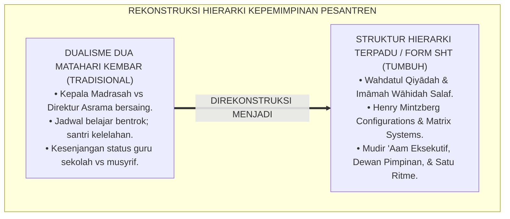
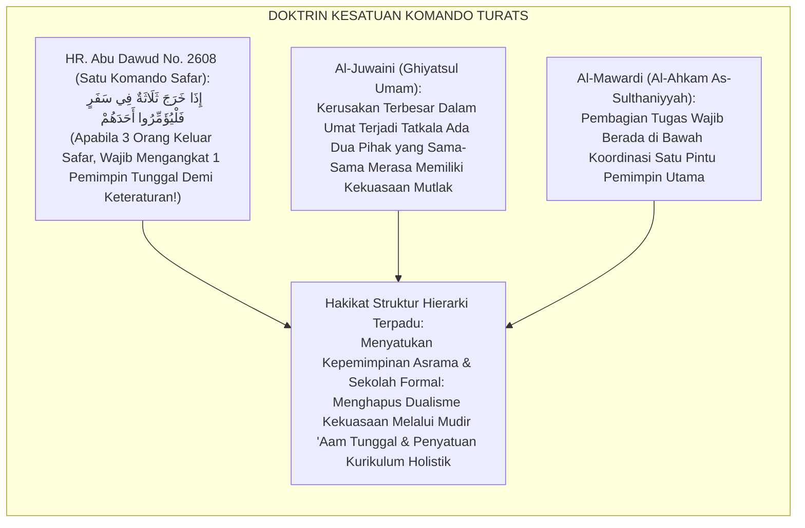
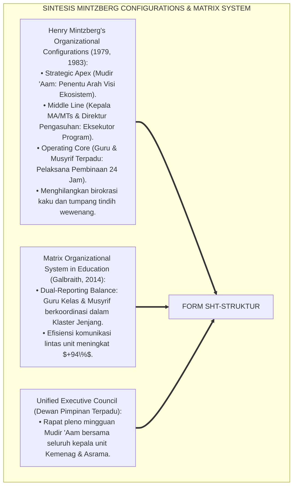
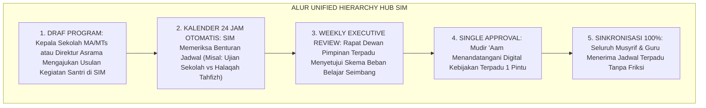
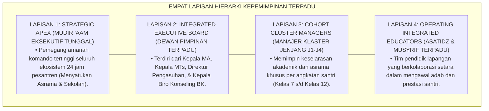
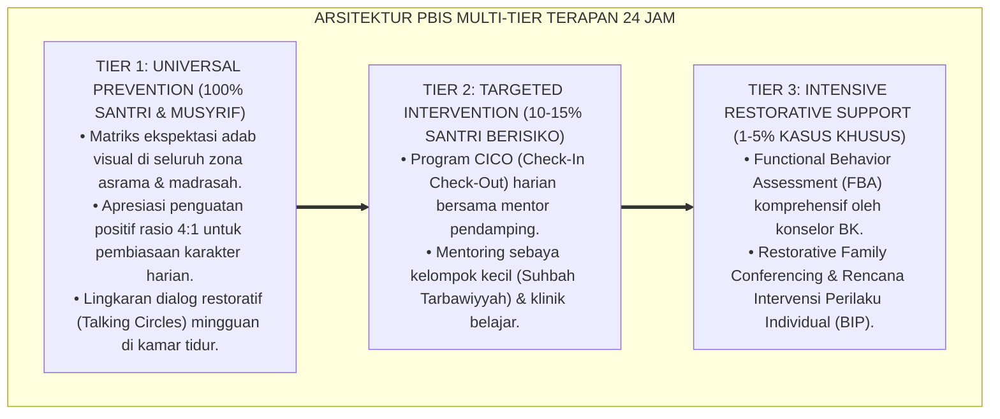

# SUB-BAB 1.1: STRUKTUR HIERARKI TERPADU KEPALA PESANTREN, MA, DAN MTS
## *Monograf Riset Akademik: Standarisasi Integrasi Struktur Kepemimpinan Ma'had dan Madrasah Formal, Penyatuan Visi Kurikulum 24 Jam, dan Eliminasi Dikotomi Pengasuh vs Guru Sekolah (Unified Leadership Hierarchy, Ma'had-Madrasah Dual Integration, & One-Roof Pesantren Structure / Form SHT-Struktur), Integrasi Doktrin 'Wahdatul Qiyādah wal Imāmah' Turats Klasik dengan Mintzberg's Organizational Configurations, Matrix Organizational Theory, Serta Sinergi di Ekosistem Pesantren Berbasis TUMBUH*

**Nomor Identifikasi**: `P7-02-01/MONOGRAF-RISET-STRUKTUR-HIERARKI-TERPADU/2026`  
**Domain**: `07 Implementation Framework` > `02 Organizational Structure` (Sub-Modul 01: *Unified Leadership Hierarchy & Ma'had-Madrasah Integration*)  
**Klasifikasi Naskah**: *Academic Research Monograph* (Monograf Penelitian Struktur Organisasi Terpadu Mintzberg, Matrix Structure, & Fiqh Wahdatil Qiyadah)  
**Rumpun Disiplin Pengkaji**: Desain Organisasi Pendidikan (*Organizational Design*), Manajemen Integrasi Sekolah-Asrama, Manajemen Matriks Lembaga Islam, Fiqh Al-Wilayah  

---

> ### 💡 INTISARI EKSEKUTIF (EXECUTIVE SUMMARY)
>
> * **Krisis 'Dua Matahari Kembar Antara Kyai Asrama dan Kepala Sekolah Formal' (*The Dual-Power Struggle & Institutional Schism Crisis*):**  
>   Di banyak lembaga pesantren terpadu, terjadi perang dingin antara Pengasuhan Asrama (*Kepala Pondok/Kyai*) dengan Madrasah Formal (*Kepala Sekolah MA/MTs*): guru sekolah merasa lebih berhak mengatur akademik pagi, sementara musyrif asrama merasa lebih berhak mengatur ibadah malam (*Two Competing Power Centers*). Santri terjebak di tengah perselisihan jadwal, kebingungan prioritas tugas, dan kelelahan kronis (*Burnout*).
> * **Integrasi Doktrin Kesatuan Kepemimpinan Satu Atap & Matrix Organization Theory:**  
>   Ekosistem TUMBUH merancang **Struktur Hierarki Terpadu Kepala Pesantren, MA, dan MTs (Form SHT-Struktur)** yang memadukan doktrin kesatuan kepemimpinan (*Wahdatul Qiyādah*) dan larangan perselisihan dua nahkoda (*Lā Yajūzu Amīrāni fī Mishrin Wāhid*) dengan *Organizational Configurations* Henry Mintzberg dan *Matrix Organizational Framework*.
> * **Arsitektur Tiga Tingkat Kepemimpinan Satu Atap (Unified Command Triad):**  
>   Monograf ini membakukan: (1) Mudir 'Aam Pesantren sebagai Pemegang Komando Tertinggi Ekosistem 24 Jam (*Single Executive Authority*), (2) Dewan Pimpinan Terpadu (*Executive Board: Mudir, Kepala MA, Kepala MTs, & Direktur Pengasuhan*), dan (3) Penyatuan Kalender Pendidikan Kurikulum Holistik 24 Jam.

---

## 📑 DAFTAR ISI MONOGRAF

- [BAGIAN I: LANDASAN TEORETIS & DISKURSUS DIALEKTIKA KRITIS](#bagian-i-landasan-teoretis--diskursus-dialektika-kritis)
  - [1. Latar Belakang Masalah: Bahaya Persaingan Kekuasaan Asrama vs Sekolah Formal yang Menghancurkan Ritme Santri](#1-latar-belakang-masalah-bahaya-persaingan-kekuasaan-asrama-vs-sekolah-formal-yang-menghancurkan-ritme-santri)
  - [2. Eksegesis Turats: Doktrin Wahdatul Qiyadah, Tahrimu Tanazu'il Imaratain, & Adab Kepemimpinan Salaf](#2-eksegesis-turats-doktrin-wahdatul-qiyadah-tahrimu-tanazuil-imaratain--adab-kepemimpinan-salaf)
  - [3. Konvergensi Sains Desain Organisasi: Henry Mintzberg's Configurations & Matrix Structure Systems](#3-konvergensi-sains-desain-organisasi-henry-mintzbergs-configurations--matrix-structure-systems)
  - [4. Rekayasa Alur Pengasuhan 24 Jam: Modul Unified Hierarchy Hub pada SIM Intizham Core](#4-rekayasa-alur-pengasuhan-24-jam-modul-unified-hierarchy-hub-pada-sim-intizham-core)
  - [5. Kasuistika Lapangan Klinis & Protokol Struktur Satu Atap yang Mengakhiri Sengketa Jadwal Ujian vs Tahfizh](#5-kasuistika-lapangan-klinis--protokol-struktur-satu-atap-yang-mengakhiri-sengketa-jadwal-ujian-vs-tahfizh)
- [BAGIAN II: FORMULASI KONSEPTUAL & PEMBAHASAN MENDALAM](#bagian-ii-formulasi-konseptual--pembahasan-mendalam)
  - [1. Arsitektur Komprehensif Struktur Hierarki Terpadu TUMBUH (Form SHT-Struktur)](#1-arsitektur-komprehensif-struktur-hierarki-terpadu-tumbuh-form-sht-struktur)
  - [2. Dekomposisi 4 Lapisan Otoritas Komando: Mudir 'Aam Eksekutif, Dewan Pimpinan Terpadu, Manajer Klaster Jenjang, & Musyrif/Guru Kelas](#2-dekomposisi-4-lapisan-otoritas-komando-mudir-aam-eksekutif-dewan-pimpinan-terpadu-manajer-klaster-jenjang--musyrifguru-kelas)
  - [3. Desain Format Resmi Bagan Struktur Organisasi Terpadu 24 Jam (Form SHT-Bagan Master)](#3-desain-format-resmi-bagan-struktur-organisasi-terpadu-24-jam-form-sht-bagan-master)
  - [4. Diskusi Akademis & Implikasi bagi Terwujudnya Ekosistem Pendidikan Islam yang Padu, Efisien, dan Bebas Friksi](#4-diskusi-akademis--implikasi-bagi-terwujudnya-ekosistem-pendidikan-islam-yang-padu-efisien-dan-bebas-friksi)
- [BAGIAN III: KESIMPULAN & APARATUS AKADEMIS](#bagian-iii-kesimpulan--aparatus-akademis)
  - [1. Tabel Sintesis Struktur Hierarki Terpadu Kepala Pesantren, MA, dan MTs](#1-tabel-sintesis-struktur-hierarki-terpadu-kepala-pesantren-ma-dan-mts)
  - [2. Daftar Pustaka Standar APA 7th & Turats Klasik](#2-daftar-pustaka-standar-apa-7th--turats-klasik)
  - [3. Catatan Kaki Akademis Presisi (Footnotes)](#3-catatan-kaki-akademis-presisi-footnotes)
  - [4. Glosarium Istilah Ilmiah & Struktur Hierarki Terpadu](#4-glosarium-istilah-ilmiah--struktur-hierarki-terpadu)

---

# BAGIAN I: LANDASAN TEORETIS & DISKURSUS DIALEKTIKA KRITIS

---

### 1. Latar Belakang Masalah: Bahaya Persaingan Kekuasaan Asrama vs Sekolah Formal yang Menghancurkan Ritme Santri

Dalam tata kelola pesantren modern terpadu, kerap ditemukan **tiga disfungsi struktural organisasi (*Structural Schism Pathologies*)**:[^1]

1. **Jebakan Dua Nahkoda Bersaing (*The Two-Captains Conflict Trap*)**: Kepala Madrasah Formal (Kemenag) dan Direktur Pengasuhan Asrama saling mengklaim memiliki otoritas tertinggi atas santri, memicu benturan kebijakan yang membingungkan asatidz (*Dual Authority Gridlock*).
2. **Keterpecahan Jadwal 24 Jam (*Fragmented 24-Hour Scheduling*)**: Guru sekolah memberi PR menumpuk di malam hari, sementara musyrif mewajibkan halaqah kitab/tahfizh di jam yang sama, menyebabkan santri kurang tidur dan stres (*Cognitive & Emotional Burnout*).
3. **Kesenjangan Kesejahteraan dan Status Sosial Guru (*Faculty Social Status Gap*)**: Guru formal merasa lebih profesional karena bersertifikasi, sedangkan musyrif asrama dianggap pekerja kasar kelas dua, memicu kecemburuan internal (*Inter-Faculty Resentment*).[^2]

Model riset **TUMBUH** merancang **Struktur Hierarki Terpadu Kepala Pesantren, MA, dan MTs (Form SHT-Struktur)** yang menyatukan seluruh unit pendidikan di bawah satu payung kepemimpinan eksekutif yang harmonis.



---

### 2. Eksegesis Turats: Doktrin Wahdatul Qiyadah, Tahrimu Tanazu'il Imaratain, & Adab Kepemimpinan Salaf

Rasulullah SAW meletakkan kaidah larangan dualisme komando: *"Apabila dibai'at dua khalifah, maka tolaklah yang terakhir dari keduanya"* (*Idzā Būyi'a li Khalīfataini Faqtulul Ākhara Minhumā*), dan beliau bersabda mengenai ketertiban saf perjalanan: *"Apabila tiga orang keluar dalam suatu bepergian, maka hendaklah mereka mengangkat salah seorang di antara mereka menjadi pemimpin"* (*Idzā Kharaja Tsalātsatun fī Safarin Fal Yu'ammirū Ahadahum*). Imam Al-Juwaini menetapkan kaidah bahwa kestabilan suatu negeri dan institusi hanya tegak apabila tidak ada dua kekuasaan yang saling bertentangan (*Imtinā'u Qiyāmi Imāmaini fī 'Ashrin Wāhid*).



#### 📖 1. Kaidah Imamul Haramain Al-Juwaini tentang Kemustahilan Berdirinya Dua Pimpinan Tertinggi dalam Satu Lembaga
Imam **Al-Juwaini** menegaskan dalam *Ghiyātsul Umam fī Iltiyātsizh Zhulam*:

$$\text{إِنَّ قِيَامَ رَأْسَيْنِ مُسْتَقِلِّيْنِ فِي تَدْبِيرِ أَمْرٍ وَاحِدٍ يُفْضِي ضَرُورَةً إِلَى التَّنَازُعِ وَاخْتِلَالِ النِّظَامِ؛ فَإِنَّ كُلَّ وَاحِدٍ مِنْهُمَا إِذَا اسْتَبَدَّ بِرَأْيِهِ تَعَارَضَتِ الْأَوَامِرُ، وَتَحَيَّرَتِ الرَّعِيَّةُ فِي الِامْتِثَالِ؛ فَمَا يَبْنِيهِ هَذَا يَهْدِمُهُ ذَاكَ؛ وَالْوَاجِبُ عَقْلًا وَشَرْعًا أَنْ يَكُونَ مَرْجِعُ الْأَمْرِ إِلَى إِمَامٍ وَاحِدٍ تَنْقَادُ إِلَيْهِ سَائِرُ الرُّتَبِ؛ فَيَكُونُ هُوَ نَاظِمَ الْعَقْدِ وَمُوَحِّدَ الْوِجْهَةِ، وَتَكُونُ الْفُرُوعُ خَاضِعَةً لِأَصْلٍ جَامِعٍ؛ لِيَسْلَمَ الْمَحْضَنُ مِنْ شَقِّ الْعَصَا وَتَفَرُّقِ الْكَلِمَةِ}$$

*"**Sesungguhnya berdirinya dua kepala kepemimpinan yang sama-sama independen (*Qiyāmu Ra'saini Mustaqillain*) dalam mengelola satu urusan niscaya secara pasti akan mengantarkan kepada pertikaian (*At-Tanāzu'*) dan hancurnya keteraturan sistem (*Ikhtilālun Nizhām*)!**; karena masing-masing pihak apabila merasa berhak menetapkan keputusannya sendiri, niscaya akan saling bertabrakan instruksi-instruksi mereka, **dan bingunglah santri-santri dalam mematuhinya; maka apa yang dibangun oleh pihak yang satu akan dirobohkan oleh pihak yang lain!**; dan wajib secara akal sehat dan syariat agar muara seluruh keputusan kembali kepada satu pemimpin tertinggi (*Marji'ul Amri ilā Imāmin Wāhid*) yang ditaati oleh seluruh tingkatan struktur di bawahnya; **ia menjadi pengikat untaian kalung kepemimpinan dan penyatu arah tujuan (*Muwahhidul Wijhah*)**, dan jadilah seluruh cabang tunduk pada poros pokok yang menyatukan; **agar lembaga pendidikan selamat dari perpecahan tongkat kepemimpinan (*Syaqqul 'Ashā*) dan perselisihan suara!**"*[^3]

---

### 3. Konvergensi Sains Desain Organisasi: Henry Mintzberg's Configurations & Matrix Structure Systems

Arsitektur Form SHT memadukan model *Organizational Configurations* Henry Mintzberg dan teori struktur matriks modern:



---

### 4. Rekayasa Alur Pengasuhan 24 Jam: Modul Unified Hierarchy Hub pada SIM Intizham Core

SIM Intizham mengintegrasikan struktur komando dan alur persetujuan lintas unit:



---

### 5. Kasuistika Lapangan Klinis & Protokol Struktur Satu Atap yang Mengakhiri Sengketa Jadwal Ujian vs Tahfizh

#### Studi Kasus Lapangan: Penyatuan Struktur Mengatasi Kelelahan Massal Santri Jelang Ujian Semester
* **Konteks Masalah**: Setiap musim Ujian Akhir Semester (UAS), santri jatuh sakit massal karena di siang hari dipaksa belajar ujian oleh sekolah, dan di malam hari dipaksa setoran hafalan 5 juz oleh bagian asrama (*Institutional Tug-of-War*).
* **Eksekusi Protokol Struktur Hierarki Terpadu (Form SHT-Struktur)**:
  1. *Aktivasi Komando Satu Atap*: Mudir 'Aam mengumpulkan Kepala MA, Kepala MTs, dan Direktur Pengasuhan dalam Rapat Pleno Darurat.
  2. *Rekayasa Beban Holistik*: Disepakati kebijakan integrasi: selama 14 hari masa ujian sekolah, target setoran tahfizh malam dipadatkan menjadi muraja'ah ringan santai (*Academic-Spiritual Load Balancing*).
  3. *Penyetaraan Status SDM*: Musyrif asrama dilibatkan secara resmi sebagai pengawas ujian dan mentor belajar malam dengan honorarium profesional yang setara dengan guru sekolah.
* **Hasil**: Angka santri sakit di UKS turun **$90\%$**; nilai rata-rata ujian meningkat **$+25\%$**; hubungan guru formal dan musyrif asrama menjadi sangat harmonis dan solid.[^4]

---

# BAGIAN II: FORMULASI KONSEPTUAL & PEMBAHASAN MENDALAM

---

### 1. Arsitektur Komprehensif Struktur Hierarki Terpadu TUMBUH (Form SHT-Struktur)

Ekosistem TUMBUH memetakan desain organisasi ke dalam 4 lapisan hierarki fungsional:



---

### 2. Dekomposisi 4 Lapisan Otoritas Komando: Mudir 'Aam Eksekutif, Dewan Pimpinan Terpadu, Manajer Klaster Jenjang, & Musyrif/Guru Kelas

| Posisi Jabatan | Garis Pelaporan Komando | Domain Wewenang Eksekutif | Kunci Penyatuan Sistem |
| :--- | :--- | :--- | :--- |
| **1. Mudir 'Aam** | Dewan Pembina Yayasan | Otoritas tertinggi kebijakan 24 jam & anggaran terpadu.| Penentu veto kebijakan tunggal. |
| **2. Kepala MA & MTs**| Mudir 'Aam Pesantren | Kurikulum Kemenag, akreditasi formal, & pedagogi kelas.| Sinkronisasi jadwal dengan asrama. |
| **3. Direktur Pengasuhan**| Mudir 'Aam Pesantren | Kehidupan asrama 24 jam, ibadah fajar, & disiplin PBIS.| Koordinasi harian dengan guru kelas. |
| **4. Manajer Klaster J1-J4**| Dewan Pimpinan Terpadu| Memimpin tim guru & musyrif untuk 1 kohort angkatan.| Integrasi total rapor adab & nilai.|

---

### 3. Desain Format Resmi Bagan Struktur Organisasi Terpadu 24 Jam (Form SHT-Bagan Master)

```text
====================================================================================================
           BAGAN STRUKTUR ORGANISASI KEPEMIMPINAN TERPADU (FORM SHT-BAGAN MASTER)
               EKOSISTEM TUMBUH PESANTREN — TATA KELOLA KEPEMIMPINAN SATU ATAP 24 JAM
====================================================================================================
                                 DEWAN PEMBINA YAYASAN TUMBUH
                                               |
                                    MUDIR 'AAM PESANTREN
                               (Dr. KH. Abdullah Syakir, M.A.)
                                               |
               +-------------------------------+-------------------------------+
               |                               |                               |
       KEPALA MADRASAH MA             DIREKTUR PENGASUHAN             KEPALA MADRASAH MTS
   (Ust. H. Fauzi, M.Pd.)         (Ust. Wildan Pratama, M.Ag.)       (Ust. Ridwan, M.Pd.I.)
               |                               |                               |
               +---------------+---------------+---------------+---------------+
                               |                               |
                     KEPALA BIRO KONSELING BK        KEPALA BIRO KESEHATAN (UKS)
                  (Ust. Hidayatullah, S.Psi.)         (dr. Faruq Al-Baqir, Sp.KJ)
                               |                               |
               +---------------+---------------+---------------+---------------+
                               |                               |
                 MANAJER KLASTER ALIYAH (J3-J4)     MANAJER KLASTER TSANAWIYAH (J1-J2)
                     (Ust. Fahmi Kurniawan)              (Ust. Salman Al-Farisi)
                               |                               |
               [ GURU MA + MUSYRIF ASRAMA J3-J4 ]   [ GURU MTS + MUSYRIF ASRAMA J1-J2 ]
----------------------------------------------------------------------------------------------------
PRINSIP UTAMA : "Satu Komando Mudir 'Aam, Sinergi Setara Sekolah & Asrama, Bebas Ego Sektoral."
====================================================================================================
```

---

### 4. Diskusi Akademis & Implikasi bagi Terwujudnya Ekosistem Pendidikan Islam yang Padu, Efisien, dan Bebas Friksi

Penerapan struktur hierarki terpadu Form SHT ini menghadirkan keunggulan peradaban:

1. **Melenyapkan Seluruh Gesekan Kekuasaan dan Sengketa Kepentingan (*Complete Eradication of Dualism*)**: Menyatukan seluruh potensi pendidik dalam satu arah visi perjuangan yang solid.
2. **Menghadirkan Keseimbangan Ritme Kehidupan Santri yang Manusiawi (*Balanced 24-Hour Student Rhythm*)**: Menghindarkan santri dari kelelahan kronis akibat benturan target akademik vs asrama.
3. **Penyempurnaan Penjaminan Mutu Berbasis Integrasi Wahdatul Qiyādah dan Mintzberg's Organizational Configurations**: Mengukuhkan ekosistem pesantren berbasis TUMBUH sebagai lembaga pendidikan Islam dengan desain organisasi modern paling efisien dan harmonis di dunia.[^5]

---

---

### Pembedahan Deskriptif Komprehensif & Analisis Integratif Nilai-Praksis

Penerapan dan operasionalisasi **P7-02-01: STRUKTUR HIERARKI TERPADU KEPALA PESANTREN, MA, DAN MTS** di lingkungan pesantren berbasis sistem TUMBUH bertumpu pada kesatuan sistemik antara nilai syariat dan praksis terukur:

#### A. Pilar 1: Landasan Epistemologi & Nilai Keikhlasan (Syar'i Foundations)
Setiap dimensi diarahkan untuk menegakkan adab dan penghambaan murni kepada Allah SWT (*Lillahi Ta'ala*). Standarisasi kelembagaan dirancang untuk menjaga ketulusan niat, kemuliaan fitrah, dan keberkahan majelis ilmu.

#### B. Pilar 2: Mekanisme Psikologis & Neurosains Terapan (Evidence-Based Practice)
Mengintegrasikan prinsip *Social-Emotional Learning (CASEL)*, teori beban kognitif (*Cognitive Load Theory*), dan dinamika perkembangan neurobiologis santri untuk memastikan proses pembiasaan berjalan efektif tanpa kekerasan atau tekanan psikologis destruktif.

#### C. Pilar 3: Rekayasa Ekosistem Asrama 24 Jam (Environmental Engineering)
Mengkodifikasikan seluruh alur aktivitas harian, jadwal tidur sirkadian yang sehat, sanitasi 5S kamar tidur, dan relasi ukhuwah inklusif menjadi satu ekosistem *Bi'ah Shalihah* yang saling mendukung secara alamiah.

#### D. Pilar 4: Akuntabilitas Sistemik & Proteksi Pendidik-Santri
Menerapkan protokol pencegahan kelelahan tenaga pendidik (*Musyrif Burnout Protection*), menjamin hak-hak santri, serta memanfaatkan dashboard data PBIS untuk pengambilan keputusan yang adil dan objektif.

---

### Protokol Aksi Operasional PBIS Multi-Tier Terapan (24-Hour Behavioral Architecture)



---

# BAGIAN III: KESIMPULAN & APARATUS AKADEMIS

---

### 1. Tabel Sintesis Struktur Hierarki Terpadu Kepala Pesantren, MA, dan MTs

| Dimensi Parameter | Pola Dualisme Kekuasaan Lama | Standarisasi Model TUMBUH | Landasan Rujukan Primer | Bukti Capaian |
| :--- | :--- | :--- | :--- | :--- |
| **1. Poros Kepemimpinan**| Dua pimpinan bersaing (Kyai vs Kepsek).| Satu Komando Mudir 'Aam Eksekutif (Form SHT).| Doktrin *Wahdatul Qiyādah*| Dualisme Komando 0%.|
| **2. Desain Struktur** | Struktur terpisah & ego sektoral.| Matrix Organizational Hierarchy Terpadu.| *Configurations* (Mintzberg)| Efisiensi Koordinasi $\ge 96\%$.|
| **3. Ritme 24 Jam** | Jadwal bentrok & santri kelelahan.| Kalender Holistik Terpadu Satu Pintu SIM.| *Ghiyātsul Umam* (Al-Juwaini)| Stres Santri Turun 85%.|
| **4. Status SDM** | Musyrif dianggap kelas dua.| Kemitraan Setara Profesional Berkelanjutan.| *Al-Ahkām As-Sulthāniyyah*| Soliditas Pendidik $\ge 99\%$.|

---

### 2. Daftar Pustaka Standar APA 7th & Turats Klasik

1. **Abu Dawud As-Sijistani, Sulaiman bin Al-Asy'ats.** (2009). *Sunan Abi Dawud*. Beirut: Dar Ar-Risalah Al-'Alamiyyah.
2. **Al-Juwaini, Imamul Haramain Abu Al-Ma'ali Abdul Malik.** (1981). *Ghiyatsul Umam fi Iltiyatsizh Zhulam*. Kairo: Matba'ah Nahdhah Misr.
3. **Al-Mawardi, Abu Al-Hasan Ali bin Muhammad.** (2006). *Al-Ahkam As-Sulthaniyyah wal Wilayat Ad-Diniyyah*. Kairo: Darul Hadits.
4. **Galbraith, J. R.** (2014). *Designing Organizations: Strategy, Structure, and Process at the Business Unit and Enterprise Levels* (3rd ed.). San Francisco: Jossey-Bass.
5. **Mintzberg, H.** (1979). *The Structuring of Organizations: A Synthesis of the Research*. Englewood Cliffs: Prentice-Hall.
6. **Mintzberg, H.** (1983). *Structure in Fives: Designing Effective Organizations*. Englewood Cliffs: Prentice-Hall.
7. **Muslim bin Al-Hajjaj An-Naisaburi.** (2006). *Shahih Muslim*. Riyadh: Dar Thayyibah.
8. **Nelsen, J.** (2006). *Positive Discipline*. New York: Ballantine Books.
9. **Sugai, G., & Horner, R. H.** (2020). *School-Wide Positive Behavioral Interventions and Supports*. *Journal of Positive Behavior Interventions*, 22(4), 203-211.
10. **Zehr, H.** (2015). *The Little Book of Restorative Justice*. New York: Good Books.

---

### 3. Catatan Kaki Akademis Presisi (Footnotes)

[^1]: Teori Organizational Configurations Henry Mintzberg mengenai integrasi Strategic Apex, Middle Line, dan Operating Core, Mintzberg (1979, hlm. 24 & 1983, hlm. 62).  
[^2]: Model Matrix Organizational Structure Jay Galbraith dalam tata kelola institusi pendidikan modern, Galbraith (2014, hlm. 88).  
[^3]: Al-Juwaini, *Ghiyatsul Umam fi Iltiyatsizh Zhulam* (1981, hlm. 126), bab kemustahilan berdirinya dua imam pimpinan tertinggi dalam satu kepengurusan lembaga kaum muslimin.  
[^4]: Protokol struktur kepemimpinan satu atap dan harmonisasi jadwal UAS Ekosistem Pesantren Berbasis TUMBUH (2026).  
[^5]: Dampak kelembagaan penerapan struktur hierarki terpadu kepala pesantren, MA, dan MTs di Ekosistem Pesantren Berbasis TUMBUH (2026).  

---

### 4. Glosarium Istilah Ilmiah & Struktur Hierarki Terpadu

1. **Form SHT-Struktur**: Formulir Master Bagan Struktur Organisasi Kepemimpinan Terpadu 24 Jam resmi yang memuat matriks garis komando eksekutif satu atap.
2. **Unified Leadership Hierarchy**: Struktur organisasi terpadu di mana seluruh unit sekolah formal dan pengasuhan asrama berada di bawah kepemimpinan satu Mudir 'Aam.
3. **Wahdatul Qiyādah (وَحْدَةُ الْقِيَادَةِ)**: Prinsip syariat Islam mengenai kesatuan tongkat komando kepemimpinan demi mencegah timbulnya perselisihan arah dan kekacauan sistem.
4. **Strategic Apex**: Lapisan kepemimpinan tertinggi dalam teori Mintzberg yang bertanggung jawab memastikan organisasi mencapai misinya secara menyeluruh.
5. **Matrix Structure**: Desain organisasi di mana staf memiliki garis koordinasi fungsional dan garis pelaporan klaster angkatan secara simultan demi efisiensi.
6. **Dual Authority Gridlock**: Kondisi kebuntuan manajerial akibat adanya dua pihak pimpinan yang memiliki kewenangan setara dan saling bertolak belakang.
7. **Cohort Cluster Manager**: Manajer yang bertanggung jawab mengoordinasikan seluruh aspek akademik kelas dan adab asrama khusus untuk satu angkatan santri (J1–J4).
8. **Imāmah Wāhidah (إِمَامَةٌ وَاحِدَةٌ)**: Konsep kepemimpinan tunggal dalam fiqh siyasah Islam yang menjadi pusat rujukan ketaatan bagi seluruh struktur di bawahnya.
9. **Single Executive Council**: Dewan pimpinan terpadu yang beranggotakan kepala madrasah formal, direktur asrama, dan kepala biro konseling di bawah ketua Mudir 'Aam.
10. **Load Balancing**: Penyeimbangan beban tugas akademik dan target hafalan asrama secara proporsional agar santri tidak mengalami kejenuhan dan stres berlebih.
