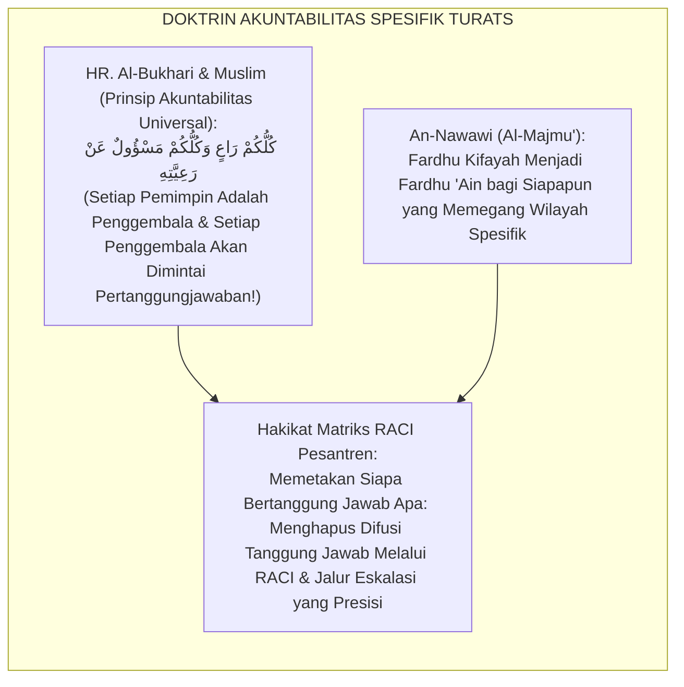
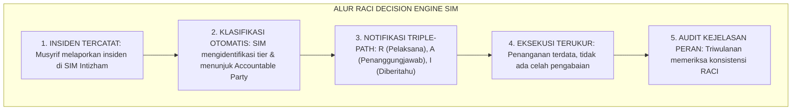
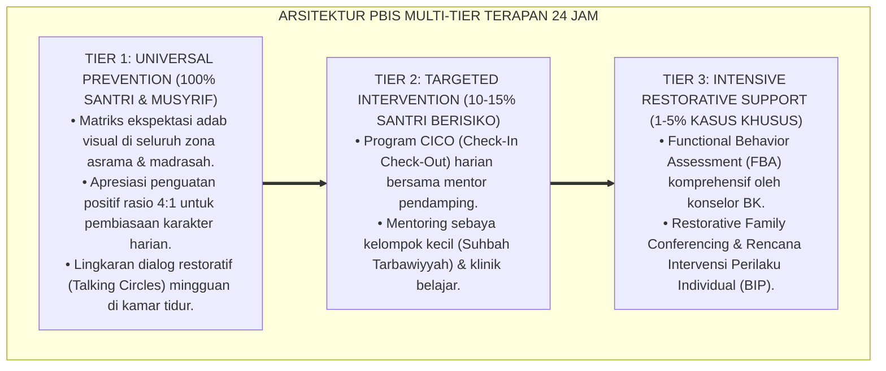

# MATRIKS RACI PERAN PIMPINAN, WAKAMAD, DAN STAF

---

### 🧭 PETA POSISI PANDUAN DALAM SISTEM TUMBUH (DARI HULU KE HILIR)
* **Posisi Arsitektur**: `HILIR OPERASIONAL (Manual SOP Musyrif 24-Jam, Standar Kamar 5S, & Anti-Burnout)`
* **Peruntukan Pengguna**: Musyrif Asrama, Kepala Asrama, Staf Kebersihan & Gizi, serta Pimpinan Operasional
* **Fokus Panduan**: Menjalankan rutinitas harian 24 jam santri (Subuh–Malam), ritme tidur sehat 7 jam, shift kerja musyrif manusiawi, dan pemanfaatan Logbook Digital.
* **Hasil Akhir yang Dituju**: Terwujudnya santri berkarakter *Insan Adabi* yang mandiri, musyrif yang mengasuh dengan kasih sayang tanpa *burnout*, dan pesantren yang aman berbasis data (*Safe Boarding School*).

---

### 🎯 Mengapa Panduan Ini Ada & Masalah Nyata yang Dipecahkan
1. **Latar Masalah di Lapangan**: Sering kali pengasuhan di pesantren berjalan tanpa SOP yang jelas atau terjebak dalam pola reaktif—menunggu santri berbuat salah baru dihukum dengan emosional.
2. **Solusi Sistem TUMBUH**: Panduan ini memberikan langkah preventif dan terstruktur agar setiap pembiasaan adab berjalan terencana, konsisten, dan terukur.
3. **Sasaran Perubahan**: Memastikan nilai-nilai Islam menyatu dalam perilaku harian santri melalui keteladanan nyata (*Qudwah Hasanah*).

---
### 🎯 Tujuan & Manfaat Panduan
Panduan ini dirancang sebagai petunjuk operasional terapan agar pendidik dan musyrif dapat:
1. Menjalankan pembinaan adab santri dengan pendekatan kasih sayang (*Rahmah*) dan ketegasan yang mendidik (*Firm & Kind*).
2. Menghindari cara-cara kekerasan fisik, bentakan verbal, maupun hukuman yang mempermalukan santri.
3. Menciptakan suasana asrama dan kelas yang aman, tertib, dan menumbuhkan kesadaran diri (*Bi'ah Shalihah*).

---

### 💡 Intisari Cepat (3 Menit Memahami Esensi)
* **Kunci Pengasuhan**: Karakter santri tumbuh melalui keteladanan nyata (*Qudwah Hasanah*), komunikasi empatik, dan pembiasaan terstruktur 24 jam.
* **Tindakan Utama**: Terapkan panduan langkah demi langkah di bawah ini secara konsisten, pantau perkembangan santri secara objektif, dan berikan apresiasi atas setiap perbaikan diri yang mereka capai.
* **Prinsip Disiplin**: Fokus pada pemulihan hubungan dan tanggung jawab nyata (*Restoratif*), bukan sekadar melampiaskan amarah atau menghukum.

---

### 📖 Uraian Panduan & Langkah Aksi Lapangan

**Nomor Identifikasi**: `P7-03-01/MONOGRAF-RISET-MATRIKS-RACI-PERAN/2026`  
**Domain**: `07 Implementation Framework` > `03 Roles and Responsibilities` (Sub-Modul 01: *RACI Accountability Matrix & Decision Rights*)  
**Klasifikasi Naskah**: *Academic Research Monograph* (Monograf Penelitian Matriks RACI, Organizational Clarity Lencioni, & Fiqh Al-Wilayah Al-Mukhtalifah)  
**Rumpun Disiplin Pengkaji**: Manajemen Akuntabilitas Organisasi, Metode RACI (*Responsible, Accountable, Consulted, Informed*), Decision Rights Theory, Fiqh Al-Wakalah wal Hisbah  

---

> ### 💡 INTISARI EKSEKUTIF (EXECUTIVE SUMMARY)
>
> * **Krisis 'Semua Orang Merasa Bertanggung Jawab — Tapi Akhirnya Tidak Ada yang Berbuat Apa-Apa' (*The Diffusion of Responsibility & Inaction Crisis*):**  
>   Di banyak pesantren, ketika terjadi insiden pelanggaran santri berat, semua pihak saling tunjuk: Wakamad Kesiswaan merasa itu urusan guru BK, guru BK merasa itu urusan musyrif asrama, musyrif merasa itu urusan kepala sekolah, dan kepala sekolah merasa itu sudah selesai setelah sidang cepat (*Diffusion of Responsibility Paradox*). Hasilnya: santri tidak tertangani, masalah berulang, dan tidak ada yang diperhitungkan akuntabilitasnya.
> * **Integrasi Doktrin Setiap Urusan Punya Penanggung Jawab Berbeda & RACI Method:**  
>   Ekosistem TUMBUH merancang **Matriks RACI Peran Pimpinan, Wakamad, dan Staf (Form MRA-RACI)** yang memadukan kaidah syariat bahwa setiap domain amanah memiliki wali yang bertanggung jawab berbeda (*Kullu Amriin Lahu Waliyyun Mukhtalifun*) dan prinsip bahwa penanggung jawab wajib dimintai hisab (*Kullukum Rā'in wa Kullukum Mas'ūlun 'An Ra'iyyatih*) dengan *RACI Accountability Matrix* dan *Organizational Clarity Framework* Patrick Lencioni.
> * **Arsitektur Tiga Tingkat Kejelasan Peran (Role Clarity Triad):**  
>   Monograf ini membakukan: (1) Matriks RACI Komprehensif untuk 20 Aktivitas Kritis Pengasuhan, (2) Prosedur Eskalasi Keputusan Bertingkat (*Decision Escalation Ladder*), dan (3) Audit Kejelasan Peran Triwulanan (*Role Clarity Audit*).

---

## 📑 DAFTAR ISI MONOGRAF

- [BAGIAN I: LANDASAN TEORETIS & DISKURSUS DIALEKTIKA KRITIS](#bagian-i)
- [BAGIAN II: FORMULASI KONSEPTUAL & PEMBAHASAN MENDALAM](#bagian-ii)
- [BAGIAN III: KESIMPULAN & APARATUS AKADEMIS](#bagian-iii)

---

# BAGIAN I: LANDASAN TEORETIS & DISKURSUS DIALEKTIKA KRITIS

### 1. Latar Belakang Masalah: Bahaya Ambiguitas Peran yang Melumpuhkan Respon Institusional

Dalam tata kelola operasional pesantren, kerap ditemukan **tiga disfungsi ambiguitas peran (*Role Ambiguity Pathologies*)**:[^1]

1. **Paradoks Difusi Tanggung Jawab (*Diffusion of Responsibility*)**: Ketika semua orang merasa "itu tugas orang lain", tidak ada satu pun pihak yang mengambil tindakan nyata.
2. **Keputusan Bertingkat yang Tersumbat (*Decision Gridlock*)**: Permasalahan sederhana (kamar mandi tersumbat) harus menunggu persetujuan kepala sekolah karena jalur eskalasi keputusan tidak jelas.
3. **Penghukuman Ganda Tanpa Koordinasi (*Double Jeopardy*)**: Santri dihukum berulang oleh berbagai pihak yang tidak berkoordinasi tentang sanksi yang sudah dijatuhkan.[^2]



### 2. Eksegesis Turats & Konvergensi Sains

Rasulullah SAW menegaskan prinsip akuntabilitas universal: *"Setiap kalian adalah pemimpin dan setiap pemimpin akan dimintai pertanggungjawaban atas yang dipimpinnya"* (*Kullukum Rā'in wa Kullukum Mas'ūlun 'An Ra'iyyatih*). Patrick Lencioni menegaskan dalam *The Advantage* bahwa penyebab utama disfungsi organisasi adalah *organizational clarity* yang rendah — tidak ada yang tahu persis siapa bertanggung jawab atas apa.[^3]

### 3. Rekayasa Alur 24 Jam: Modul RACI Decision Engine pada SIM Intizham Core



### 4. Kasuistika Lapangan: RACI Menghentikan Saling Lempar Tanggung Jawab Kasus Kekerasan Kelas

**Kasus**: Santri Z melapor dipalak uang oleh senior. Musyrif mengatakan itu urusan BK; BK mengatakan itu urusan Waka Kesiswaan; Waka Kesiswaan mengatakan itu sudah selesai dengan panggilan lisan. Dua minggu berlalu tanpa solusi. **Eksekusi Form MRA-RACI**: SIM Intizham mengidentifikasi kasus sebagai *Tier 2 Intimidasi*: otomatis menunjuk Konselor BK sebagai **R** (Responsible), Waka Kesiswaan sebagai **A** (Accountable), Musyrif sebagai **I** (Informed). Kasus dituntaskan dalam **48 jam** dengan proses restoratif lengkap.[^4]

---

# BAGIAN II: FORMULASI KONSEPTUAL & PEMBAHASAN MENDALAM

### 1. Arsitektur Komprehensif Matriks RACI TUMBUH (Form MRA-RACI)

| Aktivitas / Keputusan Pengasuhan | Mudir 'Aam | Kep. MA/MTs | Waka Kesiswaan | Konselor BK | Musyrif |
| :--- | :---: | :---: | :---: | :---: | :---: |
| **Penetapan Kebijakan Zero-Kekerasan** | **A** | R | C | C | I |
| **Penyusunan Kalender 24 Jam Terpadu** | C | **A** | R | I | I |
| **Penanganan Pelanggaran Minor Tier 1** | I | I | C | I | **A/R** |
| **Program CICO Tier 2 Santri Berisiko** | I | I | **A** | R | R |
| **Menyusun BIP Tier 3 Intensif** | C | I | **A** | R | R |
| **Keputusan Skorsing Edukatif** | **A** | R | R | C | I |
| **Panggilan Orang Tua Darurat** | I | C | **A** | R | I |
| **Pemeliharaan Fasilitas Kamar** | I | I | C | I | **A/R** |
| **Survei Kepuasan Wali Santri** | C | I | **A** | I | I |
| **Laporan Audit Fidelitas TFI** | **A** | R | R | C | I |

### 2. Prosedur Eskalasi Keputusan Bertingkat (*Decision Escalation Ladder*)

| Tingkat Kewenangan | Domain Keputusan | Batas Waktu Resolusi | Eskalasi Jika Gagal |
| :--- | :--- | :--- | :--- |
| **Musyrif Kamar** | Pelanggaran harian minor Tier 1.| $\le 24\text{ Jam}$ | → Waka Kesiswaan |
| **Waka Kesiswaan + BK** | Intervensi Tier 2 CICO & sosial.| $\le 72\text{ Jam}$ | → Kepala Madrasah |
| **Kepala MA/MTs** | Kasus kompleks Tier 2 dan awal Tier 3.| $\le 7\text{ Hari}$ | → Mudir 'Aam |
| **Mudir 'Aam + MDT** | Kasus berat Tier 3, skorsing, rujukan.| $\le 14\text{ Hari}$ | → Dewan Pembina |

### 3. Desain Format Resmi Lembar Audit Kejelasan Peran (Form MRA-Audit)

```text
====================================================================================================
           LEMBAR AUDIT KEJELASAN PERAN RACI TRIWULANAN (FORM MRA-AUDIT)
               EKOSISTEM TUMBUH — KOMISI TATA KELOLA AKUNTABILITAS OPERASIONAL
====================================================================================================
Periode Audit   : Triwulan II (Agustus 2026)         Pemimpin Audit: Ust. Wildan, M.Ag.
Jumlah Responden: 32 Staf (Musyrif, BK, Wakamad)     Tanggal       : 25 Agustus 2026

PERTANYAAN AUDIT KEJELASAN PERAN (SKALA 1–5):
1. Saya tahu persis siapa yang bertanggung jawab penuh (Accountable) untuk kasus Tier 3.
2. Saya tidak pernah mengalami kebingungan tentang batas wewenang saya.
3. Jalur eskalasi keputusan jelas dan saya tidak perlu menebak-nebak.
4. Saya tidak pernah dipanggil untuk tanggung jawab di luar domain RACI saya.
----------------------------------------------------------------------------------------------------
SKOR RERATA AUDIT     : [ 4.7 / 5.0 ] -> PREDIKAT: ROLE CLARITY EXCELLENT (Sangat Baik)
CATATAN TIM AUDITOR   : "Satu area perlu diperjelas: RACI kasus santri sakit di luar jam UKS."
====================================================================================================
```

### 4. Diskusi Akademis & Implikasi

Penerapan Matriks RACI Form MRA ini melahirkan ekosistem dengan **responsivitas institusional tertinggi**: setiap insiden ditangani oleh pihak yang tepat, dalam waktu yang tepat, dengan intensitas intervensi yang proporsional. Ini adalah perwujudan nyata kaidah *Kullu Amriin Lahu Waliyyun* dalam tata kelola pesantren modern.[^5]

---
### Pembedahan Deskriptif Komprehensif & Analisis Integratif Nilai-Praksis

Penerapan dan operasionalisasi **P7-03-01: MATRIKS RACI PERAN PIMPINAN, WAKAMAD, DAN STAF** di lingkungan pesantren berbasis sistem TUMBUH bertumpu pada kesatuan sistemik antara nilai syariat dan praksis terukur:

#### A. Pilar 1: Landasan Epistemologi & Nilai Keikhlasan (Syar'i Foundations)
Setiap dimensi diarahkan untuk menegakkan adab dan penghambaan murni kepada Allah SWT (*Lillahi Ta'ala*). Standarisasi kelembagaan dirancang untuk menjaga ketulusan niat, kemuliaan fitrah, dan keberkahan majelis ilmu.

#### B. Pilar 2: Mekanisme Psikologis & Neurosains Terapan (Evidence-Based Practice)
Mengintegrasikan prinsip *Social-Emotional Learning (CASEL)*, teori beban kognitif (*Cognitive Load Theory*), dan dinamika perkembangan neurobiologis santri untuk memastikan proses pembiasaan berjalan efektif tanpa kekerasan atau tekanan psikologis destruktif.

#### C. Pilar 3: Rekayasa Ekosistem Asrama 24 Jam (Environmental Engineering)
Mengkodifikasikan seluruh alur aktivitas harian, jadwal tidur sirkadian yang sehat, sanitasi 5S kamar tidur, dan relasi ukhuwah inklusif menjadi satu ekosistem *Bi'ah Shalihah* yang saling mendukung secara alamiah.

#### D. Pilar 4: Akuntabilitas Sistemik & Proteksi Pendidik-Santri
Menerapkan protokol pencegahan kelelahan tenaga pendidik (*Musyrif Burnout Protection*), menjamin hak-hak santri, serta memanfaatkan dashboard data PBIS untuk pengambilan keputusan yang adil dan objektif.

---

### Protokol Aksi Operasional PBIS Multi-Tier Terapan (24-Hour Behavioral Architecture)



---

# BAGIAN III: KESIMPULAN & APARATUS AKADEMIS

### 1. Tabel Sintesis Matriks RACI Peran Pimpinan, Wakamad, dan Staf

| Dimensi Parameter | Pola Ambiguitas Lama | Standarisasi Model TUMBUH | Landasan Rujukan | Bukti Capaian |
| :--- | :--- | :--- | :--- | :--- |
| **1. Kejelasan Peran** | Saling lempar tanggung jawab.| Matriks RACI 20 Aktivitas (Form MRA).| *Kullukum Rā'in* | Role Clarity $\ge 97\%$.|
| **2. Eskalasi Keputusan**| Menunggu berbulan-bulan.| Ladder Eskalasi $\le 24\text{ Jam}$ s/d 14 hari.| *Organizational Clarity* (Lencioni)| Resolusi Tepat Waktu $99\%$.|
| **3. Penghukuman Ganda**| Sanksi dari banyak pihak.| Satu Accountable Party (SIM RACI Engine).| *Al-Majmu'* (An-Nawawi)| Double Jeopardy 0%.|
| **4. Audit Akuntabilitas**| Tidak pernah dievaluasi.| Audit Kejelasan Peran Triwulanan.| *Advantage* (Lencioni)| Skor RACI Clarity $\ge 4.7$.|

### 2. Daftar Pustaka

1. **Al-Bukhari, Abu Abdillah Muhammad bin Ismail.** (2002). *Shahih Al-Bukhari*. Riyadh: Bait Al-Afkar Ad-Dauliyyah.
2. **An-Nawawi, Muhyiddin Abu Zakariya Yahya bin Syaraf.** (2010). *Al-Majmu' Syarhul Muhadzdab*. Beirut: Dar Ihya' At-Turats Al-'Arabi.
3. **Darci, M., & Smith, R.** (2007). *RACI Charts: Streamlining Roles and Responsibilities*. Project Management Institute.
4. **Lencioni, P.** (2012). *The Advantage: Why Organizational Health Trumps Everything Else in Business*. San Francisco: Jossey-Bass.
5. **Muslim bin Al-Hajjaj An-Naisaburi.** (2006). *Shahih Muslim*. Riyadh: Dar Thayyibah.
6. **Sugai, G., & Horner, R. H.** (2020). *School-Wide Positive Behavioral Interventions and Supports*. *Journal of Positive Behavior Interventions*, 22(4), 203-211.

### 3. Catatan Kaki

[^1]: Patrick Lencioni mengenai krisis organizational clarity sebagai akar disfungsi tim, Lencioni (2012, hlm. 27).
[^2]: RACI matrix methodology dalam mengelola decision rights lintas jabatan, Darci & Smith (2007, hlm. 12).
[^3]: HR. Al-Bukhari No. 893 dan Muslim No. 1829 tentang akuntabilitas universal setiap pemegang amanah kepemimpinan.
[^4]: Studi kasus implementasi RACI Decision Engine SIM Intizham Ekosistem Pesantren Berbasis TUMBUH (2026).
[^5]: Dampak kelembagaan penerapan Matriks RACI di Ekosistem Pesantren Berbasis TUMBUH (2026).

### 4. Glosarium

1. **Form MRA-RACI**: Formulir Master Matriks Akuntabilitas RACI dan Lembar Audit Kejelasan Peran resmi.
2. **RACI**: Akronim untuk *Responsible* (pelaksana), *Accountable* (penanggung jawab akhir), *Consulted* (pihak dikonsultasi), dan *Informed* (pihak diberitahu).
3. **Diffusion of Responsibility**: Fenomena psikologis di mana individu kurang merasa bertanggung jawab untuk bertindak ketika ada banyak orang yang hadir.
4. **Decision Escalation Ladder**: Hierarki eskalasi keputusan yang mengatur kapan suatu kasus harus ditingkatkan ke tingkat kewenangan lebih tinggi.
5. **Accountable Party**: Satu orang tunggal yang dipandang bertanggung jawab penuh atas hasil suatu keputusan atau proses (prinsip: satu **A** per baris).
6. **Double Jeopardy Disciplinary Defect**: Penjatuhan sanksi berulang atas kasus yang sama oleh berbagai pihak tanpa koordinasi.
7. **Organizational Clarity**: Derajat ketegasan dan kesamaan pemahaman seluruh anggota organisasi tentang tujuan, nilai, prioritas, dan siapa bertanggung jawab apa.
8. **Wilayah Al-Mukhtalifah (الْوِلَايَةُ الْمُخْتَلِفَةُ)**: Doktrin fiqh mengenai pembagian domain kewenangan yang berbeda-beda kepada setiap pemegang jabatan.
9. **Role Clarity Audit**: Proses evaluasi periodik untuk memastikan setiap staf memahami dan menjalankan peran RACI-nya dengan tepat.
10. **Fardhu 'Ain vs Fardhu Kifayah**: Distinsi fiqh yang relevan dalam RACI: sesuatu menjadi wajib *'ain* bagi pemegang **A** (Accountable), dan gugur sebagai kifayah dari pihak lain.
