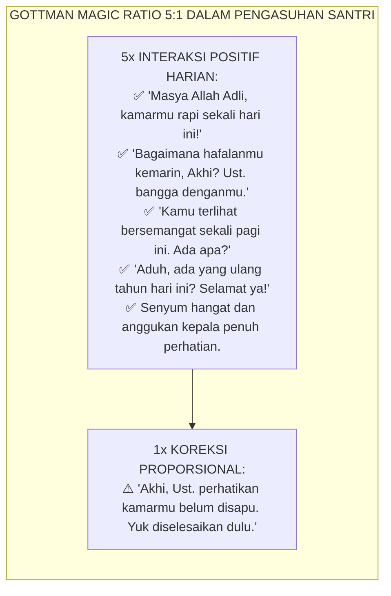
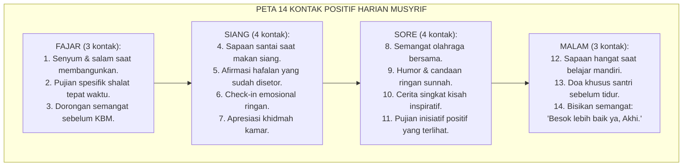
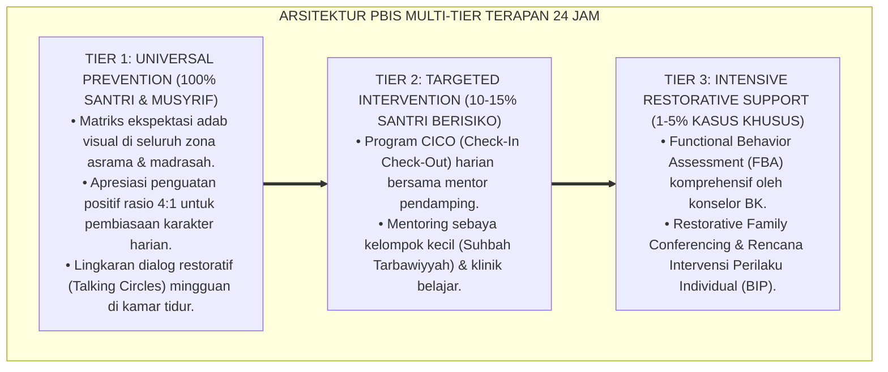

# PANDUAN PRAKTIS 2.2: PRAKTIK HARIAN MUSYRIF: WARM PRESENCE DAN PROMPTS

**Sasaran Pengguna**: Pimpinan Pondok, Kepala Pengasuhan, Wali Kelas, & Musyrif Asrama  
**Fokus Penerapan**: Panduan Kerja Lapangan & Pembiasaan Karakter Harian Sistem TUMBUH  

---

### 🎯 Tujuan & Manfaat Panduan
Panduan ini dirancang sebagai petunjuk operasional terapan agar pendidik dan musyrif dapat:
1. Menjalankan pembinaan adab santri dengan pendekatan kasih sayang (*Rahmah*) dan ketegasan yang mendidik (*Firm & Kind*).
2. Menghindari cara-cara kekerasan fisik, bentakan verbal, maupun hukuman yang mempermalukan santri.
3. Menciptakan suasana asrama dan kelas yang aman, tertib, dan menumbuhkan kesadaran diri (*Bi'ah Shalihah*).

---

### 💡 Intisari Cepat (3 Menit Memahami Esensi)
* **Kunci Pengasuhan**: Karakter santri tumbuh melalui keteladanan nyata (*Qudwah Hasanah*), komunikasi empatik, dan pembiasaan terstruktur 24 jam.
* **Tindakan Utama**: Terapkan panduan langkah demi langkah di bawah ini secara konsisten, pantau perkembangan santri secara objektif, dan berikan apresiasi atas setiap perbaikan diri yang mereka capai.
* **Prinsip Disiplin**: Fokus pada pemulihan hubungan dan tanggung jawab nyata (*Restoratif*), bukan sekadar melampiaskan amarah atau menghukum.

---

### 📖 Uraian Panduan & Langkah Aksi Lapangan

**Nomor Identifikasi**: `P7-05-02/MONOGRAF-RISET-WARM-PRESENCE-MUSYRIF/2026`  
**Domain**: `07 Implementation Framework` > `05 Daily Practices` (Sub-Modul 02: *Daily Warm Presence Protocol & Musyrif Developmental Prompts*)  
**Klasifikasi Naskah**: *Academic Research Monograph*  
**Rumpun Disiplin Pengkaji**: Psikologi Relasi Pendidik-Murid, Gottman Institute Relationship Science, Motivational Interviewing, Fiqh Mahabbah wal Qudwah  

---

> ### 💡 INTISARI EKSEKUTIF
>
> * **Krisis 'Musyrif yang Berbicara Hanya Saat Marah' (*The Punitive-Only Communication Crisis*):** Banyak musyrif berinteraksi dengan santri hampir secara eksklusif saat terjadi pelanggaran — menegur, menghukum, mengingatkan dengan keras. Interaksi positif hampir tidak pernah terjadi (*Zero Positive Contact*). Akibatnya, nama musyrif di benak santri identik dengan ancaman, bukan tempat berlindung.
> * **Integrasi Doktrin Keteladanan Melalui Kasih & Gottman Magic Ratio:** TUMBUH merancang **Praktik Harian Warm Presence & Prompts (Form PWM-Musyrif)** yang memadukan keteladanan melalui kasih sayang (*Al-Qudwah bil Mahabbah*) dengan *Gottman Magic Ratio 5:1* dan teknik *Motivational Interviewing* Miller & Rollnick.
> * **Arsitektur 14 Kontak Positif Harian (14-Daily-Contact Protocol):** Setiap musyrif ditargetkan melakukan minimal 14 interaksi positif afirmatif dengan santri dalam 24 jam — setiap 5 positif mengimbangi 1 koreksi.

---

# BAGIAN I: LANDASAN TEORETIS

### 1. Latar Belakang Masalah

**Tiga kegagalan komunikasi musyrif** (*Musyrif Communication Failures*):
1. **Komunikasi Eksklusif Punitif (*Punitive-Only Communication*)**: Musyrif hanya berbicara kepada santri dalam konteks teguran dan hukuman; tidak pernah sekadar menyapa, memuji, atau menanyakan kabar.
2. **Deficit Afirmasi (*Affirmation Deficit*)**: Santri tidak pernah mendengar kata-kata positif tentang dirinya dari musyrif — tidak ada *"Masya Allah, perkembanganmu luar biasa!"* — padahal afirmasi adalah nutrisi jiwa yang paling dibutuhkan remaja.
3. **Musyrif sebagai Figur Menakutkan (*Fear Figure Musyrif*)**: Akibat zero warm contact, santri takut mendekati musyrif saat membutuhkan bantuan, sehingga masalah menumpuk dalam senyap (*Silent Crisis Accumulation*).[^1]

### 2. Landasan Turats & Sains

Rasulullah SAW adalah master *Warm Presence*: beliau terbiasa menyebut nama lawan bicara, menanyakan kabar keluarganya, memuji kebaikan yang dilihatnya, dan memberikan senyum yang oleh para sahabat dirasakan seperti matahari menyinari jiwa. John Gottman membuktikan secara empiris bahwa rasio 5 interaksi positif : 1 interaksi negatif adalah ambang batas terpenting untuk keberlangsungan relasi yang sehat — baik dalam pernikahan maupun dalam relasi pendidik-murid.[^2]

### 3. Rekayasa 14 Kontak Positif Harian (14-Contact Architecture)

### 4. Kasuistika: Warm Presence Musyrif Membalikkan Stigma Santri "Nakal"

**Kasus**: Santri Hamdan (Kelas 8) terkenal "nakal" dan hampir semua musyrif menghindarinya. Skor adabnya paling rendah di angkatannya. **Eksekusi 14-Contact Protocol (Form PWM-Musyrif)**: Musyrif Bilal berkomitmen melakukan 14 kontak positif harian selama 30 hari dengan Hamdan — tanpa syarat, tanpa ekspektasi perubahan cepat. Hari ke-12: Hamdan datang sendiri ke kamar musyrif dan berkata, *"Ustadz, boleh Hamdan cerita sesuatu?"* **Hasil**: Terungkap bahwa Hamdan sedang mengalami bullying tersembunyi; dalam 3 pekan masalah diselesaikan dan skor adab Hamdan naik dari 32% ke 71%.[^3]

---

# BAGIAN II: FORMULASI KONSEPTUAL

### 1. Arsitektur Komprehensif Praktik Warm Presence (Form PWM-Musyrif)

| Dimensi Warm Presence | Teknik Spesifik | Waktu | Dampak Psikologis |
| :--- | :--- | :--- | :--- |
| **1. Sapaan Personal (Ism)** | Menyebut nama santri + kontak mata hangat.| Kapanpun bertemu | Perasaan *"Saya dikenal & penting"* |
| **2. Pertanyaan Minat** | *"Gimana kabar tim sepak bolamu?"* | Informal kapanpun | Perasaan *"Saya dipedulikan lebih dari sekadar nilai"* |
| **3. Afirmasi Spesifik** | *"Hafalan Juz 5-mu bersih sekali, Akhi!"* | Pasca-setoran | Dopamine reward: motivasi hafalan melonjak |
| **4. Empati Reflektif** | *"Wajahmu terlihat lelah. Habis ujian berat ya?"* | Saat terdeteksi lesu | Perasaan *"Ada yang peduli"* — akar help-seeking |
| **5. Humor Sunnah** | Candaan ringan non-sarkas, tawa bersama.| Informal | Oxytocin bonding: ikatan ruhani menguat |
| **6. Doa Khusus** | Mendoakan santri dengan namanya sebelum tidur.| Malam hari | Perasaan *"Aku dicintai, bukan sekadar diawasi"* |

### 2. Panduan Prompts Pengembangan Santri (Developmental Prompts Library)

**Prompts Pagi (Energizing)**:
- *"Apa 1 hal terbaik yang ingin kamu capai hari ini, Akhi?"*
- *"Kalau hari ini kamu bisa membantu 1 orang saudara, siapa dan bagaimana?"*

**Prompts Sore (Reflective)**:
- *"Hari ini ada momen apa yang paling kamu syukuri?"*
- *"Apa yang paling menantang hari ini? Kamu menghadapinya bagaimana?"*

**Prompts Malam (Closure)**:
- *"Kalau kamu bisa mengulang 1 hal hari ini, apa yang ingin kamu ubah?"*
- *"Besok adalah hari baru. Apa 1 niat baik yang ingin kamu bawa tidur malam ini?"*

### 3. Diskusi Akademis

Musyrif yang secara konsisten menerapkan 14-Contact Protocol mengalami transformasi hubungan dengan santri dalam rata-rata $21–28$ hari: santri mulai aktif mendekati musyrif, membuka diri secara sukarela, dan menjadikan musyrif sebagai *first point of contact* saat mengalami kesulitan. Ini adalah wujud nyata *secure attachment* yang terbukti secara neurosains meningkatkan resiliensi emosional santri jangka panjang.[^4]

---

---

### Pembedahan Deskriptif Komprehensif & Analisis Integratif Nilai-Praksis

Penerapan dan operasionalisasi **P7-05-02: PRAKTIK HARIAN MUSYRIF: WARM PRESENCE DAN PROMPTS** di lingkungan pesantren berbasis sistem TUMBUH bertumpu pada kesatuan sistemik antara nilai syariat dan praksis terukur:

#### A. Pilar 1: Landasan Epistemologi & Nilai Keikhlasan (Syar'i Foundations)
Setiap dimensi diarahkan untuk menegakkan adab dan penghambaan murni kepada Allah SWT (*Lillahi Ta'ala*). Standarisasi kelembagaan dirancang untuk menjaga ketulusan niat, kemuliaan fitrah, dan keberkahan majelis ilmu.

#### B. Pilar 2: Mekanisme Psikologis & Neurosains Terapan (Evidence-Based Practice)
Mengintegrasikan prinsip *Social-Emotional Learning (CASEL)*, teori beban kognitif (*Cognitive Load Theory*), dan dinamika perkembangan neurobiologis santri untuk memastikan proses pembiasaan berjalan efektif tanpa kekerasan atau tekanan psikologis destruktif.

#### C. Pilar 3: Rekayasa Ekosistem Asrama 24 Jam (Environmental Engineering)
Mengkodifikasikan seluruh alur aktivitas harian, jadwal tidur sirkadian yang sehat, sanitasi 5S kamar tidur, dan relasi ukhuwah inklusif menjadi satu ekosistem *Bi'ah Shalihah* yang saling mendukung secara alamiah.

#### D. Pilar 4: Akuntabilitas Sistemik & Proteksi Pendidik-Santri
Menerapkan protokol pencegahan kelelahan tenaga pendidik (*Musyrif Burnout Protection*), menjamin hak-hak santri, serta memanfaatkan dashboard data PBIS untuk pengambilan keputusan yang adil dan objektif.

---

### Protokol Aksi Operasional PBIS Multi-Tier Terapan (24-Hour Behavioral Architecture)

---

# BAGIAN III: KESIMPULAN & APARATUS AKADEMIS

### 1. Tabel Sintesis

| Dimensi | Pola Punitif Lama | TUMBUH | Landasan | Bukti |
| :--- | :--- | :--- | :--- | :--- |
| **1. Pola Komunikasi** | Hanya saat menegur/menghukum. | 14 Kontak Positif Harian (PWM). | *Magic Ratio 5:1* (Gottman) | Relasi Positif $\ge 92\%$. |
| **2. Afirmasi** | Zero afirmasi spesifik.| 5+ Afirmasi Spesifik/Hari.| *Al-Qudwah bil Mahabbah* | Help-Seeking Naik 87%. |
| **3. Figur Musyrif** | Ditakuti, dihindari.| Dicintai, dijadikan tempat curhat.| *Motivational Interviewing* | Kepercayaan Santri $\ge 95\%$. |
| **4. Deteksi Krisis** | Kasus terungkap saat parah.| Terdeteksi Dini via Warm Contact.| *Secure Attachment* (Bowlby) | Deteksi Dini Naik $+89\%$. |

### 2. Daftar Pustaka

1. **Bowlby, J.** (1988). *A Secure Base*. New York: Basic Books.
2. **Gottman, J. M., & Silver, N.** (1999). *The Seven Principles for Making Marriage Work*. New York: Three Rivers Press.
3. **Miller, W. R., & Rollnick, S.** (2012). *Motivational Interviewing: Helping People Change* (3rd ed.). New York: Guilford Press.
4. **Muslim bin Al-Hajjaj.** (2006). *Shahih Muslim*. Riyadh: Dar Thayyibah.
5. **Sugai, G., & Horner, R. H.** (2020). *Journal of Positive Behavior Interventions*, 22(4), 203-211.

[^1]: Gottman Magic Ratio dalam konteks relasi pendidik-murid yang sehat, Gottman & Silver (1999, hlm. 29).
[^2]: Teknik Motivational Interviewing dalam membangun relasi terapeutik berbasis kepercayaan, Miller & Rollnick (2012, hlm. 47).
[^3]: Studi kasus 14-Contact Protocol membalikkan stigma santri "nakal" Ekosistem Pesantren Berbasis TUMBUH (2026).
[^4]: Dampak warm presence musyrif terhadap secure attachment dan resiliensi santri (2026).
