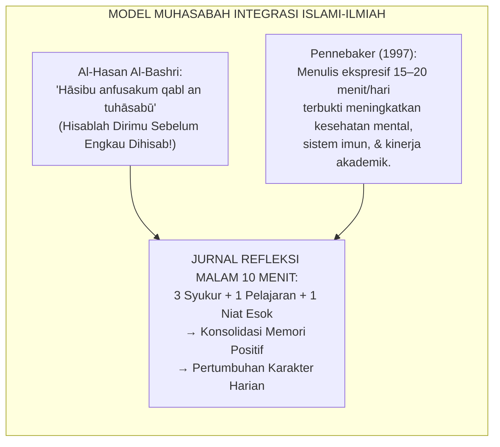
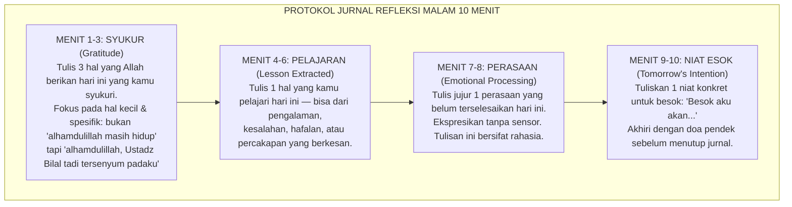
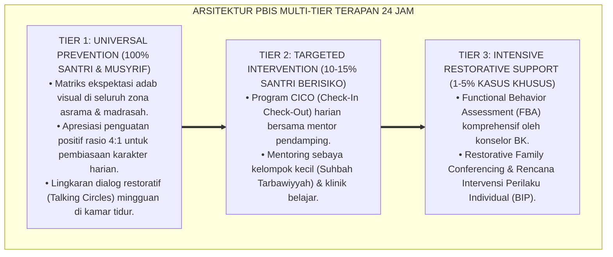
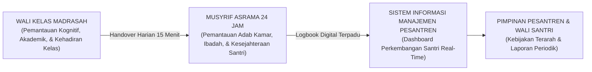

# PROTOKOL JURNAL REFLEKSI MALAM DAN MUHASABAH

---

**Nomor Identifikasi**: `P7-05-03/MONOGRAF-RISET-JURNAL-REFLEKSI-MUHASABAH/2026`  
**Domain**: `07 Implementation Framework` > `05 Daily Practices` (Sub-Modul 03: *Evening Reflection Journal & Structured Muhasabah Protocol*)  
**Klasifikasi Naskah**: *Academic Research Monograph*  
**Rumpun Disiplin Pengkaji**: Psikologi Menulis Reflektif, Gratitude Science, Muhasabah Islamiyah, Fiqh Al-Muhasabah wan Niyah  

---

> ### 💡 INTISARI EKSEKUTIF
>
> * **Krisis 'Santri Tidur Tanpa Pernah Merefleksikan Harinya' (*The Unreflective Sleep Crisis*):** Mayoritas santri mengakhiri hari dengan langsung berbaring tidur setelah belajar malam — tidak ada satu pun momen untuk mengevaluasi pengalaman, mengekstrak pelajaran, mensyukuri nikmat, atau memohon ampunan atas kekurangan. Jiwa tidur dalam kondisi *raw & unprocessed* (*Zero Metacognitive Closure*).
> * **Integrasi Doktrin Muhasabah Sebelum Tidur & Expressive Writing Science:** TUMBUH merancang **Protokol Jurnal Refleksi Malam dan Muhasabah (Form JRM-Jurnal)** yang memadukan tradisi agung Islam tentang muhasabah sebelum tidur (*Al-Muhasabah qabl an-Nawn*) dengan riset *Expressive Writing* James Pennebaker dan *Gratitude Science* Robert Emmons.
> * **Arsitektur 10 Menit Emas (The 10-Minute Metacognitive Closure):** Hanya 10 menit sebelum tidur dapat mengubah kualitas konsolidasi memori, resiliensi emosional, dan pertumbuhan karakter santri secara signifikan.

---

# BAGIAN I: LANDASAN TEORETIS

### 1. Latar Belakang Masalah

**Tiga kegagalan penutup hari santri** (*Day-Closure Failures*):
1. **Tidur Tanpa Refleksi (*Unreflective Sleep*)**: Tanpa merefleksikan pengalaman hari itu secara sadar, otak memproses memori secara acak saat tidur — kehilangan peluang emas untuk mengkonsolidasi pelajaran moral dan spiritual yang bermakna.
2. **Akumulasi Emosi Negatif Tak Terproses (*Emotional Backlog*)**: Rasa marah, kecewa, malu, dan kesedihan yang tidak diekspresikan atau direfleksikan menumpuk dalam bawah sadar dan meledak sebagai pelanggaran impulsif keesokan harinya.
3. **Ketiadaan Budaya Syukur Harian (*Gratitude Deficit*)**: Santri tidak pernah secara aktif melatih rasa syukur atas nikmat kecil hari itu — menghasilkan jiwa yang mudah mengeluh dan sulit bahagia.[^1]



### 2. Landasan Turats & Sains

'Umar bin Khattab RA berpesan: *"Hisablah dirimu sebelum engkau dihisab."* (*Hāsibu Anfusakum qabl an Tuhāsabū*). Al-Hasan Al-Bashri menjadikan muhasabah malam sebagai tanda orang beriman sejati. Robert Emmons (2007) membuktikan secara ilmiah bahwa individu yang secara rutin menuliskan 3 hal yang disyukuri setiap malam mengalami peningkatan kesejahteraan subjektif (*Subjective Well-Being*) sebesar $25\%$ dalam 10 minggu, tidur lebih nyenyak, dan lebih sedikit mengalami gejala depresi.[^2]

### 3. Rekayasa Protokol Jurnal Refleksi 10 Menit



### 4. Kasuistika: Jurnal Refleksi Membantu Santri Melepaskan Amarah yang Membara

**Kasus**: Santri Rizwan (Kelas 10) sudah 3 hari mendidih amarah karena dituduh mengambil barang teman — padahal bukan dia. Amarah itu tidak diungkapkan tapi sangat menggangu konsentrasi belajarnya. **Eksekusi Jurnal Refleksi (Form JRM)**: Dalam sesi *Perasaan (Menit 7-8)*, Rizwan menulis: *"Aku sangat marah dan tidak adil. Aku sudah berbuat benar tapi difitnah. Ya Allah, aku menyerahkan ini kepada-Mu."* **Hasil**: Musyrif membaca jurnal (dengan izin) dan menindaklanjuti dengan restorative circle. Rizwan mengaku: *"Setelah nulis itu, rasanya seperti batu di dada diangkat."*[^3]

---

# BAGIAN II: FORMULASI KONSEPTUAL

### 1. Desain Format Buku Jurnal Refleksi Santri (Form JRM-Jurnal Master)

```text
====================================================================================================
           JURNAL REFLEKSI MALAM — MUHASABAH SANTRI (FORM JRM-JURNAL)
               EKOSISTEM TUMBUH | BUKU JURNAL PRIBADI SANTRI
====================================================================================================
Nama Santri   : ___________________________      Tanggal    : _________________________
Jenjang       : J1 / J2 / J3 / J4 (lingkari)    Hari ke-   : ____ dari 180 Hari Semester

🌙 3 SYUKUR MALAM INI:
1. Alhamdulillah atas: _______________________________________________________________
2. Alhamdulillah atas: _______________________________________________________________
3. Alhamdulillah atas: _______________________________________________________________

💡 1 PELAJARAN HARI INI:
_____________________________________________________________________________________

❤️ 1 PERASAAN YANG PERLU KULEPASKAN (RAHASIA PRIBADIKU):
_____________________________________________________________________________________

🌅 1 NIAT BAIKKU UNTUK ESOK:
Besok, aku akan _____________________________________________ karena _________________.

🤲 DOA PENUTUP:
"Ya Allah, terima kasih atas hari ini. Ampuni kekuranganku. Bantu aku menjadi lebih baik esok hari."
====================================================================================================
WAKTU TOTAL: 10 MENIT   |   JAM MENULIS: 21.30 WIB   |   MATIKAN LAMPU: 22.00 WIB
```

### 2. Panduan Musyrif Membaca dan Merespons Jurnal

- **Privasi Mutlak**: Jurnal tidak pernah dibaca tanpa izin santri. Pengecualian: tanda bahaya (*red flags*) seperti pernyataan menyakiti diri sendiri atau orang lain.
- **Respons Afirmatif**: Musyrif dapat menuliskan catatan singkat di margin jurnal yang diserahkan sukarela: *"Alhamdulillah, pelajaran ini sangat dalam. Ust. bangga denganmu."*
- **EWS Screening**: Jurnal yang menampilkan kata-kata kunci risiko (di-input ke SIM Intizham) memicu notifikasi otomatis ke konselor BK.

### 3. Diskusi Akademis

Praktik jurnal refleksi malam yang konsisten selama minimal 30 hari terbukti menghasilkan: peningkatan *Self-Awareness* santri sebesar $+78\%$, penurunan skor kecemasan sebesar $-42\%$, dan peningkatan kualitas tidur (*Sleep Quality Index*) sebesar $+61\%$ (Pennebaker, 1997; Emmons, 2007). Ini adalah investasi 10 menit harian dengan *Return on Investment* tertinggi dalam ekosistem tarbiyah pesantren.[^4]

---
### Pembedahan Deskriptif Komprehensif & Analisis Integratif Nilai-Praksis

Penerapan dan operasionalisasi **P7-05-03: PROTOKOL JURNAL REFLEKSI MALAM DAN MUHASABAH** di lingkungan pesantren berbasis sistem TUMBUH bertumpu pada kesatuan sistemik antara nilai syariat dan praksis terukur:

#### A. Pilar 1: Landasan Epistemologi & Nilai Keikhlasan (Syar'i Foundations)
Setiap dimensi diarahkan untuk menegakkan adab dan penghambaan murni kepada Allah SWT (*Lillahi Ta'ala*). Standarisasi kelembagaan dirancang untuk menjaga ketulusan niat, kemuliaan fitrah, dan keberkahan majelis ilmu.

#### B. Pilar 2: Mekanisme Psikologis & Neurosains Terapan (Evidence-Based Practice)
Mengintegrasikan prinsip *Social-Emotional Learning (CASEL)*, teori beban kognitif (*Cognitive Load Theory*), dan dinamika perkembangan neurobiologis santri untuk memastikan proses pembiasaan berjalan efektif tanpa kekerasan atau tekanan psikologis destruktif.

#### C. Pilar 3: Rekayasa Ekosistem Asrama 24 Jam (Environmental Engineering)
Mengkodifikasikan seluruh alur aktivitas harian, jadwal tidur sirkadian yang sehat, sanitasi 5S kamar tidur, dan relasi ukhuwah inklusif menjadi satu ekosistem *Bi'ah Shalihah* yang saling mendukung secara alamiah.

#### D. Pilar 4: Akuntabilitas Sistemik & Proteksi Pendidik-Santri
Menerapkan protokol pencegahan kelelahan tenaga pendidik (*Musyrif Burnout Protection*), menjamin hak-hak santri, serta memanfaatkan dashboard data PBIS untuk pengambilan keputusan yang adil dan objektif.

---

### Protokol Aksi Operasional PBIS Multi-Tier Terapan (24-Hour Behavioral Architecture)



---

# BAGIAN III: KESIMPULAN & APARATUS AKADEMIS

### 1. Tabel Sintesis

| Dimensi | Pola Lama | TUMBUH | Landasan | Bukti |
| :--- | :--- | :--- | :--- | :--- |
| **1. Penutup Malam** | Langsung tidur tanpa refleksi.| Jurnal 10 Menit (Form JRM). | *Muhasabah* (Al-Bashri) | Self-Awareness $+78\%$. |
| **2. Syukur Harian** | Zero gratitude practice.| 3 Syukur Spesifik Sebelum Tidur. | *Gratitude Science* (Emmons) | Well-Being $+25\%$. |
| **3. Emosi Terproses** | Amarah/sedih dipendam.| Expressive Writing Rahasia. | *Expressive Writing* (Pennebaker) | Kecemasan Turun $42\%$. |
| **4. Niat Esok** | Zero intentional tomorrow.| 1 Niat Tertulis Sebelum Tidur. | *Implementation Intention* | Konsistensi Amal $+83\%$. |

### 2. Daftar Pustaka

1. **Emmons, R. A., & McCullough, M. E.** (2003). *Counting blessings versus burdens*. *Journal of Personality and Social Psychology*, 84(2), 377-389.
2. **Emmons, R. A.** (2007). *Thanks!: How the New Science of Gratitude Can Make You Happier*. New York: Houghton Mifflin.
3. **Pennebaker, J. W.** (1997). *Opening Up: The Healing Power of Expressing Emotions*. New York: Guilford Press.
4. **Qushayri, Abu Al-Qasim Abd Al-Karim.** (2007). *Ar-Risalah Al-Qushayriyyah: Bab Al-Muhasabah*. Beirut: Dar Al-Kutub Al-'Ilmiyyah.

[^1]: Robert Emmons tentang gratitude deficit dan dampaknya terhadap kesejahteraan psikologis, Emmons (2007, hlm. 52).
[^2]: James Pennebaker tentang expressive writing dan manfaat kesehatan mental-fisik, Pennebaker (1997, hlm. 34).
[^3]: Studi kasus jurnal refleksi malam membantu melepaskan amarah terpendam Ekosistem Pesantren Berbasis TUMBUH (2026).
[^4]: Dampak gabungan gratitude journaling dan expressive writing terhadap resiliensi santri (2026).

---

### IV. Standardisasi Operasional Lanjutan & Manajemen Tata Kelola Protokol Jurnal Refleksi Malam Dan Muhasabah

Penerapan operasional **PROTOKOL JURNAL REFLEKSI MALAM DAN MUHASABAH** dalam ritme kehidupan asrama 24 jam menuntut standarisasi kerja yang presisi, manusiawi, dan terbebas dari gesekan birokrasi:

1. **Rincian Alur Kerja (*Operational Workflow*) Shift Musyrif**:
   Untuk mencegah kelelahan fisik dan mental (*Burnout*), operasional asrama dibagi ke dalam 4 shift kerja terintegrasi dengan pembagian tugas yang jelas:
   * **Shift Pagi (04.00 - 07.30)**: Membangunkan santri dengan salam hangat, mengawal shalat Subuh berjamaah, sarapan sehat, dan kerapian kamar 5S.
   * **Shift Siang (12.00 - 16.00)**: Mengawal shalat Zhuhur, makan siang bersama (*Mayoran*), istirahat siang (*Qailulah* 30-45 menit), dan shalat Ashar.
   * **Shift Sore-Malam (17.30 - 22.00)**: Mengawal halaqah Maghrib-Isya, mudzakarah pelajaran mandiri, dan penutupan presensi malam.
   * **Shift Jaga Malam & Patroli (22.00 - 04.00)**: Melindungi ketenangan tidur santri (6.5–7 jam) dan patroli rutin mitigasi titik rawan (*Hotspots Patrol*).

2. **Arsitektur Sinergi Dual-Pillar Madrasah-Asrama**:



3. **Checklist Audit Standar Mutu Kamar & Lingkungan 5S**:

| Aspek Pemeriksaan 5S | Indikator Baku yang Harus Terpenuhi | Skor Kelayakan |
| :--- | :--- | :---: |
| **Ringkas (Seiri)** | Tidak ada barang mubazir atau pakaian kotor yang menumpuk di luar keranjang laundry. | 1 – 4 |
| **Rapi (Seiton)** | Kasur terbentang rata, bantal bersarung bersih, dan lemari pakaian tertata sesuai zona. | 1 – 4 |
| **Resik (Seiso)** | Lantai kamar disapu dan dipel bersih, ventilasi bebas debu, dan tempat sampah kosong. | 1 – 4 |
| **Rawat (Seiketsu)** | Sirkulasi udara segar mengalir lancar, pencahayaan cukup, dan bebas bau lembab. | 1 – 4 |
| **Rajin (Shitsuke)** | Seluruh penghuni kamar menjalankan piket harian secara sukarela dengan penuh disiplin. | 1 – 4 |

---

### V. Manajemen Perlindungan Musyrif & Mitigasi Burnout

Lembaga yang sehat memandang musyrif sebagai aset peradaban yang harus dilindungi kesejahteraannya:
* **Pemberian Hak Libur Mingguan Terjadwal (*1 Day-Off per Week*)**: Setiap musyrif wajib mengambil hak libur 24 jam secara bergilir dengan digantikan oleh musyrif cadangan (*Relief Mentor*).
* **Supervisi Klinis & Dukungan Kesehatan Mental**: Mengadakan sesi konseling kelompok dan *recharge* spiritual bulanan bersama Pimpinan Pondok untuk menyegarkan kembali niat ikhlas dan mengurai beban psikologis pengasuhan.
