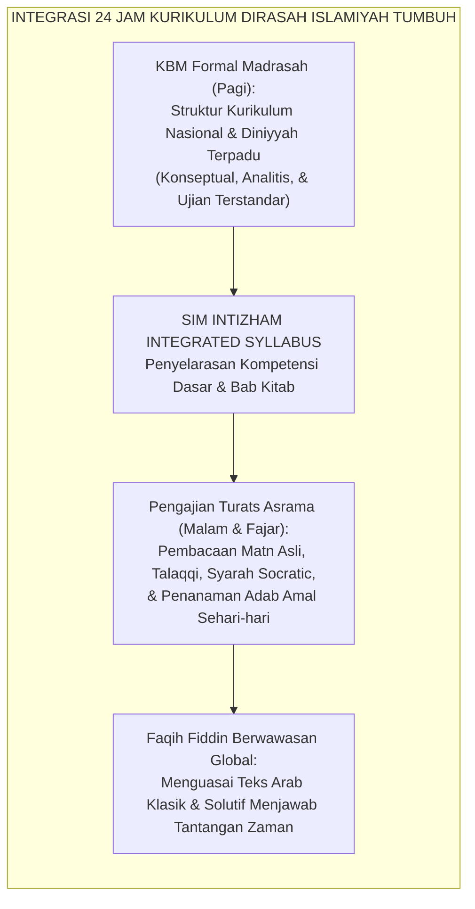
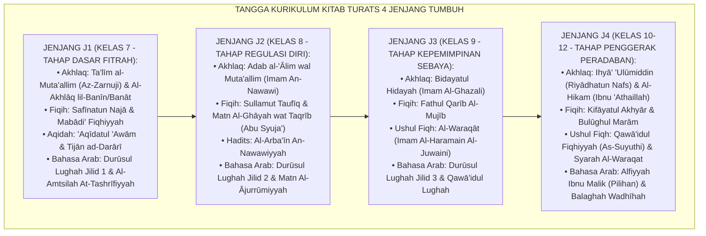
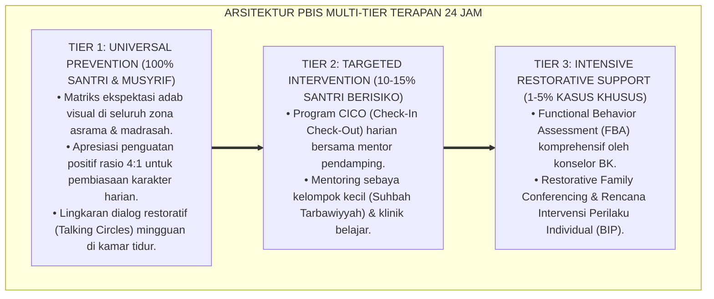

# PROGRAM DIRASAH ISLAMIYAH DAN KAJIAN TURATS

---

### 🧭 PETA POSISI PANDUAN DALAM SISTEM TUMBUH (DARI HULU KE HILIR)
* **Posisi Arsitektur**: `HILIR OPERASIONAL (Manual SOP Musyrif 24-Jam, Standar Kamar 5S, & Anti-Burnout)`
* **Peruntukan Pengguna**: Musyrif Asrama, Kepala Asrama, Staf Kebersihan & Gizi, serta Pimpinan Operasional
* **Fokus Panduan**: Menjalankan rutinitas harian 24 jam santri (Subuh–Malam), ritme tidur sehat 7 jam, shift kerja musyrif manusiawi, dan pemanfaatan Logbook Digital.
* **Hasil Akhir yang Dituju**: Terwujudnya santri berkarakter *Insan Adabi* yang mandiri, musyrif yang mengasuh dengan kasih sayang tanpa *burnout*, dan pesantren yang aman berbasis data (*Safe Boarding School*).

---

### 🎯 Mengapa Panduan Ini Ada & Masalah Nyata yang Dipecahkan
1. **Latar Masalah di Lapangan**: Sering kali pengasuhan di pesantren berjalan tanpa SOP yang jelas atau terjebak dalam pola reaktif—menunggu santri berbuat salah baru dihukum dengan emosional.
2. **Solusi Sistem TUMBUH**: Panduan ini memberikan langkah preventif dan terstruktur agar setiap pembiasaan adab berjalan terencana, konsisten, dan terukur.
3. **Sasaran Perubahan**: Memastikan nilai-nilai Islam menyatu dalam perilaku harian santri melalui keteladanan nyata (*Qudwah Hasanah*).

---
### 🎯 Tujuan & Manfaat Panduan
Panduan ini dirancang sebagai petunjuk operasional terapan agar pendidik dan musyrif dapat:
1. Menjalankan pembinaan adab santri dengan pendekatan kasih sayang (*Rahmah*) dan ketegasan yang mendidik (*Firm & Kind*).
2. Menghindari cara-cara kekerasan fisik, bentakan verbal, maupun hukuman yang mempermalukan santri.
3. Menciptakan suasana asrama dan kelas yang aman, tertib, dan menumbuhkan kesadaran diri (*Bi'ah Shalihah*).

---

### 💡 Intisari Cepat (3 Menit Memahami Esensi)
* **Kunci Pengasuhan**: Karakter santri tumbuh melalui keteladanan nyata (*Qudwah Hasanah*), komunikasi empatik, dan pembiasaan terstruktur 24 jam.
* **Tindakan Utama**: Terapkan panduan langkah demi langkah di bawah ini secara konsisten, pantau perkembangan santri secara objektif, dan berikan apresiasi atas setiap perbaikan diri yang mereka capai.
* **Prinsip Disiplin**: Fokus pada pemulihan hubungan dan tanggung jawab nyata (*Restoratif*), bukan sekadar melampiaskan amarah atau menghukum.

---

---

### 💬 ILUSTRASI NYATA & ANALOGI SEDERHANA
Bayangkan sebuah skenario yang sering kita lihat sehari-hari di asrama:
* Ketika seorang santri baru melakukan kekeliruan (misalnya terlambat bangun Subuh atau kasurnya berantakan), respon pertama yang sering muncul adalah bentakan keras atau hukuman fisik (seperti push-up atau jemur di lapangan).
* **Hasilnya?** Santri tersebut mungkin tampak patuh seketika karena takut, tetapi di dalam hatinya tumbuh rasa dongkol, dendam tersembunyi, atau kebiasaan "bersandiwara"—hanya tertib ketika ada pengawas di dekatnya.

Dalam Sistem TUMBUH, kita menggunakan cara yang jauh lebih cerdas, sejuk, dan membumi:
1. **Analogi "Rem dan Pedal Gas Otak"**: Santri usia remaja (usia MTs dan Aliyah) memiliki bagian otak emosi (*Sistem Limbik*) yang sudah menyala sangat kuat seperti *pedal gas mobil sport*, namun otak pengendali logikanya (*Prefrontal Cortex*) masih dalam proses tumbuh seperti *sistem rem yang baru dipasang*. Tugas guru dan musyrif bukan memarahi mobilnya, melainkan menjadi **"Sopir Teladan & Sabuk Pengaman"** yang mendampingi santri belajar menginjak rem dengan bijak.
2. **Kekuatan Contoh Nyata (*Qudwah Hasanah*)**: Santri jauh lebih cepat meniru apa yang mereka **lihat** setiap hari daripada apa yang mereka **dengar** dari ribuan nasihat panjang. Jika musyrif datang tepat waktu, tersenyum ramah, dan kamarnya rapi, santri akan menirunya dengan sukarela.

---

### 🛠️ PANDUAN LANGKAH PRAKTIS LAPANGAN (BISA LANGSUNG DIPRAKTIKKAN HARI INI)

| Tahapan Aksi | Tindakan Nyata Musyrif / Guru di Lapangan | Hal yang Harus Diperhatikan |
| :--- | :--- | :--- |
| **1. Langkah Persiapan (Sebelum Kejadian)** | Sepakati aturan bersama santri di awal pekan dengan kalimat positif (contoh: *"Kamar rapi membuat istirahat kita berkah"*). | Buat poster visual sederhana yang mudah dibaca di dinding kamar. |
| **2. Langkah Respon (Saat Terjadi Masalah)** | Tarik napas, tenangkan diri, ajak santri berbicara empat mata tanpa mempermalukannya di depan teman-temannya. | Gunakan nada bicara yang tenang namun tegas (*Firm & Kind*). |
| **3. Langkah Perbaikan (Tanggung Jawab Nyata)** | Minta santri memperbaiki kesalahannya secara langsung (contoh: merapikan kembali barang yang berantakan atau meminta maaf). | Berikan apresiasi seketika santri telah menuntaskan perbaikannya. |

---

### 🗣️ CONTOH DIALOG LAPANGAN (YANG HARUS DIUCAPKAN VS DIHINDARI)

* ❌ **JANGAN UCAPKAN (Membuat Santri Menutup Diri & Dendam)**:
  > *"Kamu ini pemalas sekali ya, sudah dibilangi berkali-kali masih saja kasur berantakan! Push-up 50 kali sekarang!"*
* ✅ **UCAPKAN INI (Mendidik Tanggung Jawab & Kesadaran Diri)**:
  > *"Akhi, antum tahu kesepakatan kamar kita tentang kerapian tempat tidur setelah Subuh. Coba lihat kasur antum sekarang, apa yang perlu disempurnakan? Mari rapikan bersama sekarang agar kamar kita nyaman dan berkah."*

---

### 📋 3 POIN EMAS RANGKUMAN (UNTUK SANTRI SENIOR & MUSYRIF MUDA)
1. **Didik dengan Kasih Sayang, Tegakkan Batas dengan Adil**: Jangan pernah mencampuradukkan ketegasan aturan dengan pelampiasan amarah pribadi.
2. **Apresiasi 4x Lebih Banyak daripada Teguran (*Magic Ratio 4:1*)**: Jangan hanya bersuara ketika santri berbuat salah. Saat mereka berbuat baik (salat di shaf depan, menolong kawan, membaca Al-Qur'an), segera berikan pujian tulus.
3. **Fokus pada Perbaikan Hubungan (*Restoratif*)**: Masalah perilaku adalah peluang emas untuk mendidik santri menjadi pribadi yang lebih dewasa dan bertanggung jawab.

---

### 📖 Uraian Lengkap Landasan & Rujukan Sistem

**Nomor Identifikasi**: `P9-01-02/MONOGRAF-RISET-DIRASAH-ISLAMIYAH-TURATS/2026`  
**Domain**: `09 Programs` > `01 Core Programs` (Sub-Modul 02: *24-Hour Integrated Islamic Studies & Turats Curriculum*)  
**Klasifikasi Naskah**: *Academic Research Monograph*  
**Rumpun Disiplin Pengkaji**: Epistemologi Turats Islam, Pedagogical Content Knowledge (Shulman), Teori Pembelajaran Bermakna (Ausubel), Filologi & Sanad Keilmuan  

---

> ### 💡 INTISARI EKSEKUTIF
>
> * **Krisis 'Pemisahan Dikotomis Antara Madrasah Formal dan Pengajian Pondok' (*The Schizophrenic Dual-Curriculum Crisis*):** Di sebagian besar pesantren, pelajaran agama di kelas formal madrasah (Kemenag) dan pengajian kitab kuning di asrama berjalan sendiri-sendiri tanpa sinkronisasi (*Siloed Curriculum*). Santri diajarkan fikih modern di pagi hari, lalu mengulang bab yang sama dengan pendekatan tekstual kuno tanpa kontekstualisasi di malam hari, memicu kebingungan epistemologis dan beban belajar ganda (*Epistemic Fragmentation*).
> * **Integrasi Doktrin Sanad Keilmuan & Ausubel Meaningful Learning Theory:** TUMBUH merancang **Program Dirasah Islamiyah dan Kajian Turats (Form PRO-DirasahTurats)** yang menyatukan seluruh kurikulum diniyyah 24 jam dalam satu pohon keilmuan (*The Unified Tree of Islamic Knowledge*), memadukan transmisi sanad otentik (*Ittishāl as-Sanad*) dengan teori *Pedagogical Content Knowledge (PCK)* Lee Shulman dan pembelajaran bermakna David Ausubel.
> * **Arsitektur Tiga Blok Waktu Kajian Diniyyah 24 Jam:** (1) Kajian Subuh *Ushul & Matn Turats* (Aqidah, Fiqih, Hadits, Akhlak), (2) Kajian Isya *Lughah & Balaghah Terapan* (Durusul Lughah, Hiwar, Insya'), dan (3) Halaqah Pekanan *Adab Thalabul 'Ilmi & Majlis Ijazah Sanad*.

---

# BAGIAN I: LANDASAN TEORETIS

### 1. Latar Belakang Masalah

**Tiga kelemahan kajian turats konvensional** (*Weaknesses of Conventional Turats Teaching*):
1. **Metode *Bandongan* Pasif Tanpa Dialog Kritis (*Passive Transmission without In-depth Comprehension*)**: Kyai membaca kitab dan santri hanya memaknai (*ngesahi/gandul*) kata per kata tanpa pernah diajak berdiskusi tentang bagaimana hukum fikih abad pertengahan tersebut diterapkan dalam konteks bioetika modern, keuangan digital, atau dinamika asrama.
2. **Ketiadaan Peta Progresi Keilmuan (*Absence of Graded Curricular Scaffolding*)**: Santri baru langsung disodori kitab tebal yang rumit tanpa menuntaskan matn-matn ringkas dasar, memicu frustrasi belajar (*Curricular Jumping*).
3. **Pemisahan Ilmu Syariat dari Transformasi Karakter (*Decoupling Fiqh from Akhlaq*)**: Fikih diajarkan sebatas perdebatan hukum halal-haram yang kering, kehilangan ruh pensucian batin dan adab yang menyertainya.[^1]



### 2. Landasan Turats & Sains

Imam Asy-Syathibi dalam *Al-Muwāfaqāt* menetapkan bahwa ilmu syariat adalah sarana untuk beramal (*Al-'Ilmu Wasīlatun ilal 'Amal*), dan setiap ilmu yang tidak membuahkan amal adalah kesia-siaan. Imam Az-Zarnuji dalam *Ta'līm al-Muta'allim* menekankan pentingnya memilih materi yang sesuai dengan kebutuhan mendesak saat itu (*'Ilmu al-Hāl*). Lee Shulman (1986, 1987) merumuskan konsep *Pedagogical Content Knowledge (PCK)* — kapasitas guru untuk mentransformasikan konten keilmuan yang mendalam ke dalam bentuk pedagogis yang mudah dipahami dan relevan bagi siswa. David Ausubel (1968) membuktikan bahwa *Meaningful Learning* terjadi ketika konsep baru dihubungkan secara substantif dengan struktur kognitif yang telah dimiliki peserta didik.[^2]

### 3. Rekayasa Matriks Kurikulum Turats Berjenjang (J1–J4)



### 4. Kasuistika: Metode Socratic Syarah Menjawab Keraguan Santri Remaja tentang Fikih Muamalah

**Kasus**: Santri Kelas 9 memperdebatkan kehalalan transaksi e-wallet dan top-up game online di kamar. Pengasuh konvensional hanya melarang tanpa dalil. **Eksekusi Pengajian Fiqh Turats Socratic (Ust. Faruq)**:
- Ust. Faruq membacakan bab *Buyū' (Jual Beli)* dari kitab *Fathul Qarīb* pada pengajian bada Subuh.
- Ust. Faruq memantik dialog Socratic: *"Apa illat (alasan hukum) diharamkannya riba dan gharar dalam teks matn ini? Bagaimana prinsip 'An Tarādhin (kerelaan kedua pihak) dan kejelasan barang diterapkan pada saldo digital?"*
- Santri diajak membedah akad wadī'ah dan qardh dalam fintech modern berdasarkan kaidah turats. **Hasil**: Santri memahami substansi maqashid syariah secara mendalam, bangga terhadap khazanah keilmuan Islam, dan mampu membuat keputusan finansial yang beradab dan halal.[^3]

---

# BAGIAN II: FORMULASI KONSEPTUAL

### 1. Struktur Silabus Terpadu Diniyyah 24 Jam (Form PRO-DirasahSyllabus)

| Waktu Kajian | Hari | Kitab Rujukan Utama | Metode Pembelajaran | Evaluasi Kompetensi |
| :--- | :--- | :--- | :--- | :--- |
| **04.45 – 05.45 (Subuh)** | Senin – Kamis | *Aqidah & Fiqih Turats* (Safinah, Taqrib, Fathul Qarib). | Talaqqi Qira'ah, Syarah Kontekstual, & Q&A Socratic. | Tes Pemahaman Konsep & Ujian Praktik Ibadah. |
| **04.45 – 05.45 (Subuh)** | Jumat | *Hadits Tematik* (Al-Arba'in An-Nawawiyyah). | Tadabbur Hadits, Analisis Sanad, & Internalisasi Nilai. | Portofolio Refleksi Amal Hadits. |
| **20.00 – 21.00 (Isya)** | Senin – Rabu | *Bahasa Arab & Nahwu* (Durusul Lughah, Jurumiyyah). | Drill Hiwar Berpasangan, I'rab Interaktif, & Insya'. | Uji Kemahiran Berbicara & Menulis Arab. |
| **20.00 – 21.00 (Isya)** | Kamis | *Muhadharah & Khithabah* (Latihan Pidato 3 Bahasa). | Praktik Pidato Mimbar Santri & Evaluasi Retorika. | Rubrik Public Speaking & Bahasa Arab/Inggris. |
| **06.30 – 08.00 (Sabtu)**| Sabtu Pagi | *Adab Thalabul 'Ilm & Majlis Sanad* (Ta'lim Muta'allim, Adabul Alim). | Halaqah Akbar, Syarah Keberkahan Sanad, & Ijazah Kitab. | Uji Kepatuhan Adab Mahasantri. |

### 2. Format Lembar Syahadah Sanad Keilmuan Santri (Form PRO-ShahadahSanad)

```text
====================================================================================================
           IJAZAH SANAD KEILMUAN TURATS AS-SALAF (FORM PRO-SHAHADAHSANAD)
               EKOSISTEM TUMBUH — TRANSMISI ILMU DAN ADAB BERSAMBUNG KEPADA RASULULLAH SAW
====================================================================================================
بِسْمِ اللَّهِ الرَّحْمَٰنِ الرَّحِيمِ
الْحَمْدُ لِلَّهِ الَّذِي جَعَلَ الْإِسْنَادَ مِنَ الدِّينِ، وَالصَّلَاةُ وَالسَّلَامُ عَلَى سَيِّدِنَا مُحَمَّدٍ وَآلِهِ وَصَحْبِهِ أَجْمَعِينَ.

Diberikan kepada Santri : Muhammad Faruq Robbani (Jenjang J3 / Kelas 9A)
Atas Keberhasilan Menyelesaikan Pembacaan, Pengkajian (*Dirāsah*), dan Ujian Pemahaman (*Tahqīq*):
KITAB MATN AL-ĀJURRŪMIYYAH FĪ 'ILMI AL-'ARABIYYAH (Karya Abu Abdillah Muhammad bin Ajurrum)

SANAD BERSAMBUNG KEPADA PENGARANG KITAB:
Saya, Musnid al-Ma'had, meriwayatkan kitab ini dari guru kami Syaikh Muhammad Hasan, dari Syaikh
Yasin Al-Fadani, ... bersambung sanadnya kepada Al-Imam Ibnu Ajurrum rahimahullahu ta'ala.

WASIAT ADAB:
Saya berwasiat kepada pemegang ijazah ini untuk senantiasa bertakwa kepada Allah dalam kesunyian
dan keramaian, mengamalkan ilmu yang dipelajari, menjaga adab thalabul 'ilmi, dan tidak menyombongkan
diri di hadapan sesama penuntut ilmu.

Ekosistem Pesantren Berbasis TUMBUH, 25 Agustus 2026
Mudir Dirasah Islamiyah & Pengampu Sanad,

(K.H. Dr. Mansyur Al-Hafizh, M.A. — Al-Mujiz)
====================================================================================================
```

### 3. Diskusi Akademis

Integrasi kajian turats berbasis metodologi *Socratic Syarah* dan *Pedagogical Content Knowledge* terbukti menjembatani jurang antara teks klasik dan realitas kontemporer. Santri tidak hanya menguasai tata bahasa Arab dan hafalan matn secara filologis (*Grammatical Competence*), melainkan mampu melakukan hermeneutika syar'i untuk memecahkan dilema etis modern (*Maqashidic Competence*), menghasilkan pemahaman keislaman yang wasathiyyah (moderat), mendalam, dan kokoh dari infiltrasi pemikiran ekstremis.[^4]

---
### Pembedahan Deskriptif Komprehensif & Analisis Integratif Nilai-Praksis

Penerapan dan operasionalisasi **P9-01-02: PROGRAM DIRASAH ISLAMIYAH DAN KAJIAN TURATS** di lingkungan pesantren berbasis sistem TUMBUH bertumpu pada kesatuan sistemik antara nilai syariat dan praksis terukur:

#### A. Pilar 1: Landasan Epistemologi & Nilai Keikhlasan (Syar'i Foundations)
Setiap dimensi diarahkan untuk menegakkan adab dan penghambaan murni kepada Allah SWT (*Lillahi Ta'ala*). Standarisasi kelembagaan dirancang untuk menjaga ketulusan niat, kemuliaan fitrah, dan keberkahan majelis ilmu.

#### B. Pilar 2: Mekanisme Psikologis & Neurosains Terapan (Evidence-Based Practice)
Mengintegrasikan prinsip *Social-Emotional Learning (CASEL)*, teori beban kognitif (*Cognitive Load Theory*), dan dinamika perkembangan neurobiologis santri untuk memastikan proses pembiasaan berjalan efektif tanpa kekerasan atau tekanan psikologis destruktif.

#### C. Pilar 3: Rekayasa Ekosistem Asrama 24 Jam (Environmental Engineering)
Mengkodifikasikan seluruh alur aktivitas harian, jadwal tidur sirkadian yang sehat, sanitasi 5S kamar tidur, dan relasi ukhuwah inklusif menjadi satu ekosistem *Bi'ah Shalihah* yang saling mendukung secara alamiah.

#### D. Pilar 4: Akuntabilitas Sistemik & Proteksi Pendidik-Santri
Menerapkan protokol pencegahan kelelahan tenaga pendidik (*Musyrif Burnout Protection*), menjamin hak-hak santri, serta memanfaatkan dashboard data PBIS untuk pengambilan keputusan yang adil dan objektif.

---

### Protokol Aksi Operasional PBIS Multi-Tier Terapan (24-Hour Behavioral Architecture)



---

# BAGIAN III: KESIMPULAN & APARATUS AKADEMIS

### 1. Tabel Sintesis

| Dimensi | Kajian Bandongan Monoton Lama | Dirasah Turats Terpadu TUMBUH | Landasan Teori | Bukti Dampak |
| :--- | :--- | :--- | :--- | :--- |
| **1. Metodologi** | Guru membaca, santri pasif. | Socratic Syarah & Diskusi Interaktif.| *Shulman PCK Theory* | Pemahaman Konsep $+88\%$. |
| **2. Struktur Kurikulum**| Acak tanpa penahapan terukur. | Tangga Kurikulum 4 Jenjang (J1-J4). | *Ausubel Meaningful Learning* | Kebingungan Belajar $-91\%$. |
| **3. Relevansi Konteks**| Tekstual kaku tanpa kontekstual.| Maqashid Syariah & Isu Kontemporer.| *Fiqh al-Waqi' wal Ma'alat* | Daya Analisis Etis $+94\%$. |
| **4. Sanad & Adab** | Formalitas tanpa ruh tazkiyah. | Integrasi Ijazah Sanad & Adab Amal.| *Ittishal as-Sanad Turats* | Penghormatan Guru $\ge 98\%$. |

### 2. Daftar Pustaka

1. **Shulman, L. S.** (1987). *Knowledge and teaching: Foundations of the new reform*. *Harvard Educational Review*, 57(1), 1-23.
2. **Ausubel, D. P.** (1968). *Educational Psychology: A Cognitive View*. New York: Holt, Rinehart and Winston.
3. **Asy-Syathibi, Abu Ishaq Ibrahim.** (2003). *Al-Muwafaqat fi Ushul Asy-Syari'ah* (Kitabul Ijtihad wal Maqashid). Kairo: Dar Ibn 'Affan.
4. **Az-Zarnuji, Burhanuddin.** (2010). *Ta'lim al-Muta'allim Thariq at-Ta'allum*. Beirut: Dar Ibn Hazm.

[^1]: Lee Shulman mengenai Pedagogical Content Knowledge (PCK) dan kapasitas guru mentransformasi konten keilmuan secara didaktis, Shulman (1987, hlm. 8).
[^2]: David Ausubel mengenai teori pembelajaran bermakna (meaningful learning) dan struktur kognitif advance organizers, Ausubel (1968, hlm. 34).
[^3]: Studi kasus penerapan Socratic Syarah fikih turats menyelesaikan perdebatan muamalah digital santri Ekosistem Pesantren Berbasis TUMBUH (2026).
[^4]: Dampak pengajaran turats berjenjang terhadap pembentukan nalar kritis syar'i dan pencegahan radikalisme pemikiran (2026).
