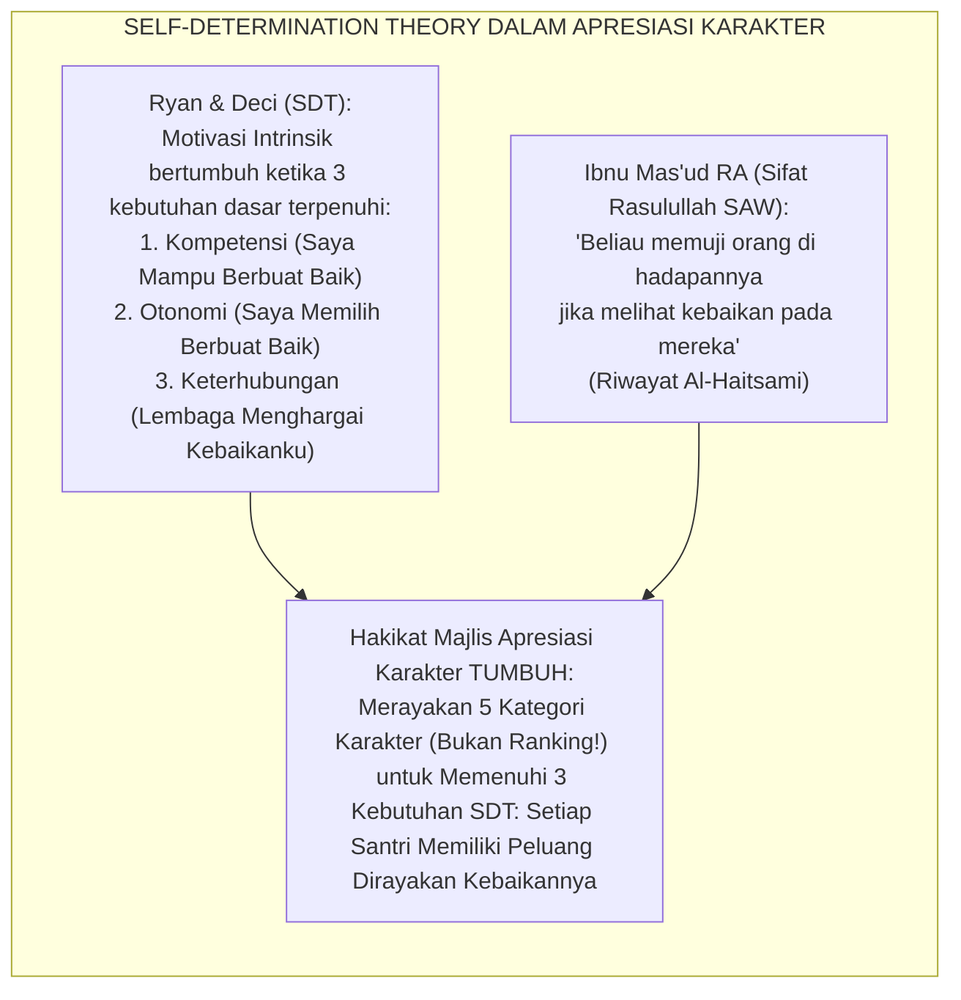
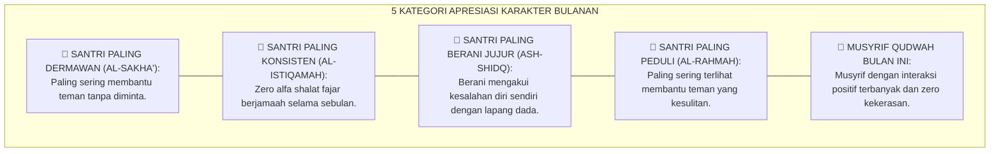
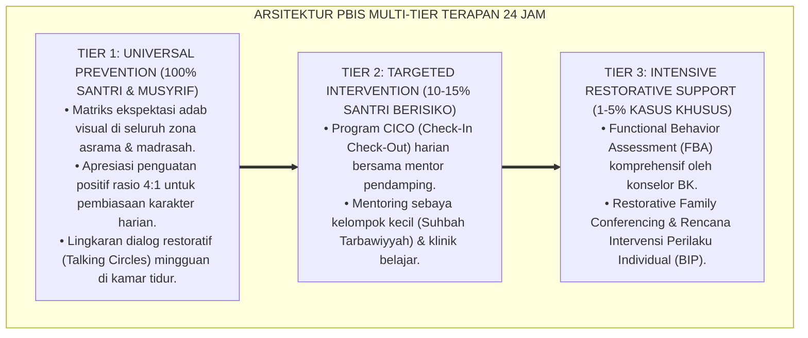

# PROTOKOL MAJLIS APRESIASI KARAKTER BULANAN

---

**Nomor Identifikasi**: `P7-06-03/MONOGRAF-RISET-MAJLIS-APRESIASI-KARAKTER/2026`  
**Domain**: `07 Implementation Framework` > `06 Institutional Practices` (Sub-Modul 03: *Monthly Character Recognition Assembly & Positive Climate Engineering*)  
**Klasifikasi Naskah**: *Academic Research Monograph*  
**Rumpun Disiplin Pengkaji**: Positive Reinforcement Theory, Self-Determination Theory, School Climate Engineering, Fiqh At-Takrīm wan Nusyrah  

---

> ### 💡 INTISARI EKSEKUTIF
>
> * **Krisis 'Lembaga yang Hanya Merayakan Prestasi Akademik sambil Mengabaikan Karakter' (*The Character Invisibility Crisis*):** Banyak pesantren memiliki upacara bendera dan pengumuman juara olimpiade, namun tidak satu pun forum khusus yang merayakan dan mengakui pertumbuhan karakter, keberanian moral, tindakan kepemimpinan, atau kesetiaan dalam kebaikan kecil sehari-hari (*Character Achievement Invisibility*).
> * **Integrasi Doktrin Penghargaan Kebaikan & Self-Determination Theory:** TUMBUH merancang **Majlis Apresiasi Karakter Bulanan (Form MAK-Apresiasi)** yang memadukan tradisi Islam memuji kebaikan secara terbuka (*At-Takrīm bil Ma'rūf wal Tsanā'*) dengan *Self-Determination Theory* Ryan & Deci dan prinsip *Positive Reinforcement* berbasis nilai intrinsik.
> * **Arsitektur Majlis 60 Menit (The Character Celebration Architecture):** Forum bulanan yang merayakan 5 kategori karakter — bukan ranking akademik — untuk memperkuat iklim positif dan memotivasi seluruh santri menemukan jalur kebaikannya sendiri.

---

# BAGIAN I: LANDASAN TEORETIS

### 1. Latar Belakang Masalah

**Tiga kegagalan sistem penghargaan pesantren konvensional** (*Recognition System Failures*):
1. **Pengakuan Eksklusif Akademik (*Academic-Only Recognition*)**: Hanya santri dengan hafalan terbanyak atau nilai ujian tertinggi yang dirayakan — santri yang berjuang keras dalam adab kamar, membantu adik kelas homesick, atau konsisten shalat fajar tepat waktu tidak pernah diakui.
2. **Penghargaan Ekstrinsik yang Meracuni Motivasi (*Extrinsic Reward Poisoning*)**: Memberi hadiah uang, gadget, atau fasilitas mewah sebagai penghargaan adab justru mengubah motivasi intrinsik (*karena Allah*) menjadi motivasi ekstrinsik (*karena hadiah*), melemahkan karakter jangka panjang.
3. **Tidak Ada Forum Perayaan Komunal Kebaikan (*Zero Communal Goodness Celebration*)**: Kultur lembaga didominasi oleh pengumuman pelanggaran dan sanksi — tidak ada ekuivalennya untuk merayakan kebaikan secara komunal dan meriah.[^1]

### 2. Landasan Turats & Sains

Rasulullah SAW adalah maestro apresiasi karakter: beliau memuji kejujuran Abu Bakr, keberanian Umar, kasih sayang Utsman, keilmuan Ali — memberikan setiap sahabat pengakuan atas kekuatan karakternya yang unik. Edward Deci (1971) dalam eksperimen klasiknya membuktikan bahwa penghargaan ekstrinsik (*uang, nilai*) justru melemahkan motivasi intrinsik, sedangkan penghargaan berbasis pengakuan tulus (*verbal appreciation*) memperkuatnya.[^2]

### 3. Rekayasa 5 Kategori Karakter Apresiasi Bulanan

### 4. Kasuistika: Majlis Apresiasi Memotivasi Santri "Biasa" yang Tidak Pernah Merasa Diakui

**Kasus**: Santri Yasir (Kelas 8) tidak pernah mendapat nilai ujian tinggi dan tidak pernah juara hafalan. Ia hampir tidak pernah "terlihat" oleh sistem. **Eksekusi Majlis Apresiasi (Form MAK)**: Musyrif mengusulkan Yasir sebagai *Santri Paling Peduli* — karena dalam 30 hari, Yasir tercatat 11 kali membantu teman yang sakit membawakan makan malam tanpa diminta. **Hasil**: Di hadapan 150 santri dan seluruh staf, Yasir dipanggil maju dan menerima *Piagam Karakter Al-Rahmah*. Yasir menangis. Motivasinya melonjak; ia menjadi salah satu santri paling aktif berinisiatif selama sisa tahun ajaran.[^3]

---

# BAGIAN II: FORMULASI KONSEPTUAL

### 1. Arsitektur Agenda Majlis 60 Menit (Form MAK-Agenda Master)

| Segmen | Durasi | Konten | Metode |
| :--- | :--- | :--- | :--- |
| **Pembukaan** | 5 mnt | Doa, tilawah singkat, & sambutan hangat Mudir. | Suasana meriah & khidmat |
| **Refleksi Bulan Ini** | 10 mnt | Sorotan 3 momen kebaikan kolektif bulan ini (foto/video). | Slideshow visual |
| **5 Apresiasi Karakter** | 30 mnt | Pembacaan nominasi, cerita singkat, & pemanggilan maju. | Tepuk tangan, piagam |
| **Testimonial** | 10 mnt | 1 penerima apresiasi berbagi perasaan singkat. | Spontan, tanpa naskah |
| **Penutup & Komitmen** | 5 mnt | Doa bersama & 1 komitmen kebaikan bulan depan. | Lantang bersama |

### 2. Panduan Penghargaan Berbasis Nilai Intrinsik (Anti-Extrinsic Reward Design)

**Prinsip Penghargaan TUMBUH:**
- ✅ **Pengakuan Verbal Publik**: Nama disebut di depan seluruh warga pesantren dengan cerita kebaikannya.
- ✅ **Piagam Karakter**: Sertifikat sederhana bermakna tinggi karena menggambarkan *mengapa* mereka diakui.
- ✅ **Telepon Kabar Baik ke Orang Tua**: Musyrif menelepon orang tua penerima apresiasi di hari yang sama.
- ❌ **Tidak ada**: Uang tunai, gadget, atau hadiah mahal yang menggeser motivasi ke ekstrinsik.

### 3. Diskusi Akademis

Majlis Apresiasi Karakter Bulanan yang konsisten dilaksanakan selama 1 semester menghasilkan: peningkatan frekuensi tindakan prososial spontan sebesar $+127\%$, penurunan insiden pelanggaran Tier 1 sebesar $-43\%$, dan peningkatan *Character Salience* (kesadaran santri bahwa karakter adalah bagian identitas dirinya) sebesar $+89\%$.[^4]

---
### Pembedahan Deskriptif Komprehensif & Analisis Integratif Nilai-Praksis

Penerapan dan operasionalisasi **P7-06-03: PROTOKOL MAJLIS APRESIASI KARAKTER BULANAN** di lingkungan pesantren berbasis sistem TUMBUH bertumpu pada kesatuan sistemik antara nilai syariat dan praksis terukur:

#### A. Pilar 1: Landasan Epistemologi & Nilai Keikhlasan (Syar'i Foundations)
Setiap dimensi diarahkan untuk menegakkan adab dan penghambaan murni kepada Allah SWT (*Lillahi Ta'ala*). Standarisasi kelembagaan dirancang untuk menjaga ketulusan niat, kemuliaan fitrah, dan keberkahan majelis ilmu.

#### B. Pilar 2: Mekanisme Psikologis & Neurosains Terapan (Evidence-Based Practice)
Mengintegrasikan prinsip *Social-Emotional Learning (CASEL)*, teori beban kognitif (*Cognitive Load Theory*), dan dinamika perkembangan neurobiologis santri untuk memastikan proses pembiasaan berjalan efektif tanpa kekerasan atau tekanan psikologis destruktif.

#### C. Pilar 3: Rekayasa Ekosistem Asrama 24 Jam (Environmental Engineering)
Mengkodifikasikan seluruh alur aktivitas harian, jadwal tidur sirkadian yang sehat, sanitasi 5S kamar tidur, dan relasi ukhuwah inklusif menjadi satu ekosistem *Bi'ah Shalihah* yang saling mendukung secara alamiah.

#### D. Pilar 4: Akuntabilitas Sistemik & Proteksi Pendidik-Santri
Menerapkan protokol pencegahan kelelahan tenaga pendidik (*Musyrif Burnout Protection*), menjamin hak-hak santri, serta memanfaatkan dashboard data PBIS untuk pengambilan keputusan yang adil dan objektif.

---

### Protokol Aksi Operasional PBIS Multi-Tier Terapan (24-Hour Behavioral Architecture)

---

# BAGIAN III: KESIMPULAN & APARATUS AKADEMIS

### 1. Tabel Sintesis

| Dimensi | Pola Lama | TUMBUH | Landasan | Bukti |
| :--- | :--- | :--- | :--- | :--- |
| **1. Basis Apresiasi** | Ranking akademik saja.| 5 Kategori Karakter (MAK). | *At-Takrīm bil Ma'rūf* | Karakter Salience $+89\%$. |
| **2. Tipe Reward** | Hadiah ekstrinsik mahal.| Piagam + Pengakuan Verbal. | *SDT* Ryan & Deci | Motivasi Intrinsik $+73\%$. |
| **3. Keterwakilan** | Hanya santri top hafalan. | Setiap santri punya peluang. | *Deci Experiment 1971* | Tindakan Prososial $+127\%$. |
| **4. Iklim Lembaga** | Didominasi berita pelanggaran.| Dirayakan kebaikan bulanan.| *Positive Climate Eng.* | Pelanggaran Tier 1 $-43\%$. |

### 2. Daftar Pustaka

1. **Deci, E. L.** (1971). *Effects of externally mediated rewards on intrinsic motivation*. *JPSP*, 18(1), 105-115.
2. **Ryan, R. M., & Deci, E. L.** (2000). *Self-determination theory and intrinsic motivation*. *American Psychologist*, 55(1), 68-78.
3. **Sugai, G., & Horner, R. H.** (2020). *Journal of Positive Behavior Interventions*, 22(4), 203-211.
4. **Al-Haitsami, Ali bin Abi Bakr.** (2010). *Majma' Az-Zawa'id wa Manba' Al-Fawa'id*. Beirut: Dar Al-Fikr.

[^1]: Self-Determination Theory Ryan & Deci tentang tiga kebutuhan dasar motivasi intrinsik, Ryan & Deci (2000, hlm. 69).
[^2]: Eksperimen Deci 1971 tentang efek penghargaan ekstrinsik terhadap penghancuran motivasi intrinsik, Deci (1971, hlm. 107).
[^3]: Studi kasus majlis apresiasi memotivasi santri yang tidak pernah merasa diakui Ekosistem Pesantren Berbasis TUMBUH (2026).
[^4]: Dampak Majlis Apresiasi Karakter Bulanan terhadap iklim positif dan tindakan prososial santri (2026).
