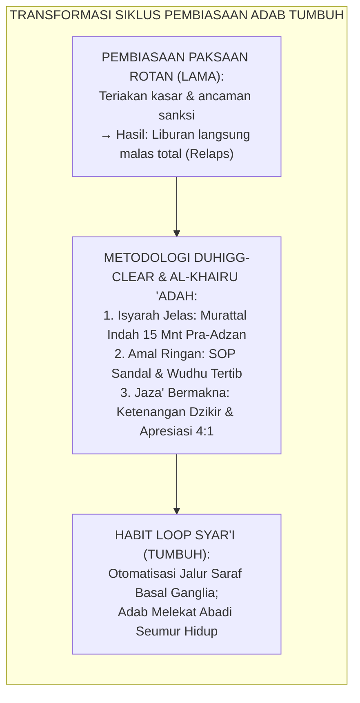
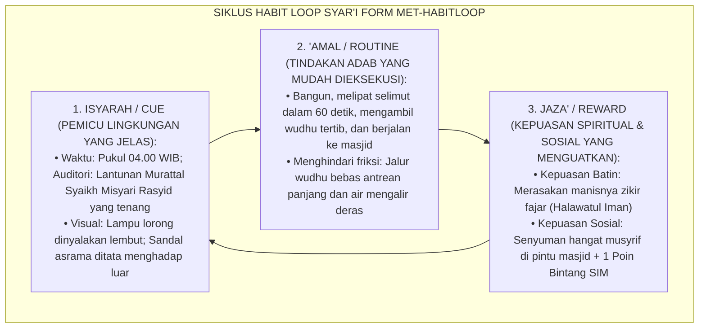
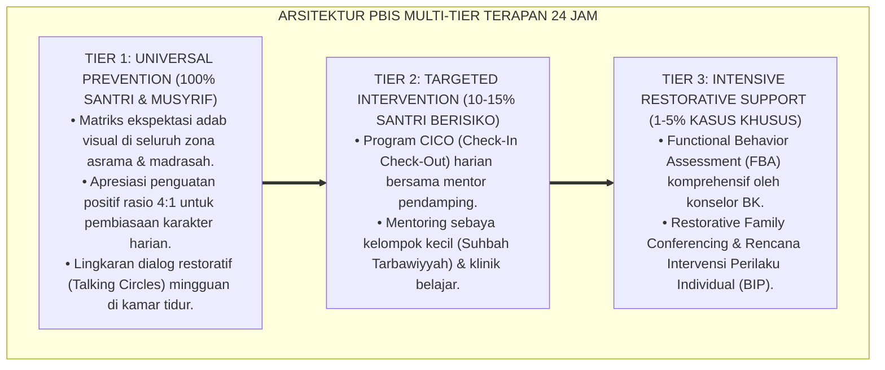

# SIKLUS HABIT LOOP CUE-ROUTINE-REWARD SYAR'I

---

### 🧭 PETA POSISI PANDUAN DALAM SISTEM TUMBUH (DARI HULU KE HILIR)
* **Posisi Arsitektur**: `HILIR OPERASIONAL (Manual SOP Musyrif 24-Jam, Standar Kamar 5S, & Anti-Burnout)`
* **Peruntukan Pengguna**: Musyrif Asrama, Kepala Asrama, Staf Kebersihan & Gizi, serta Pimpinan Operasional
* **Fokus Panduan**: Menjalankan rutinitas harian 24 jam santri (Subuh–Malam), ritme tidur sehat 7 jam, shift kerja musyrif manusiawi, dan pemanfaatan Logbook Digital.
* **Hasil Akhir yang Dituju**: Terwujudnya santri berkarakter *Insan Adabi* yang mandiri, musyrif yang mengasuh dengan kasih sayang tanpa *burnout*, dan pesantren yang aman berbasis data (*Safe Boarding School*).

---

### 🎯 Mengapa Panduan Ini Ada & Masalah Nyata yang Dipecahkan
1. **Latar Masalah di Lapangan**: Sering kali pengasuhan di pesantren berjalan tanpa SOP yang jelas atau terjebak dalam pola reaktif—menunggu santri berbuat salah baru dihukum dengan emosional.
2. **Solusi Sistem TUMBUH**: Panduan ini memberikan langkah preventif dan terstruktur agar setiap pembiasaan adab berjalan terencana, konsisten, dan terukur.
3. **Sasaran Perubahan**: Memastikan nilai-nilai Islam menyatu dalam perilaku harian santri melalui keteladanan nyata (*Qudwah Hasanah*).

---
### 🎯 Tujuan & Manfaat Panduan
Panduan ini dirancang sebagai petunjuk operasional terapan agar pendidik dan musyrif dapat:
1. Menjalankan pembinaan adab santri dengan pendekatan kasih sayang (*Rahmah*) dan ketegasan yang mendidik (*Firm & Kind*).
2. Menghindari cara-cara kekerasan fisik, bentakan verbal, maupun hukuman yang mempermalukan santri.
3. Menciptakan suasana asrama dan kelas yang aman, tertib, dan menumbuhkan kesadaran diri (*Bi'ah Shalihah*).

---

### 💡 Intisari Cepat (3 Menit Memahami Esensi)
* **Kunci Pengasuhan**: Karakter santri tumbuh melalui keteladanan nyata (*Qudwah Hasanah*), komunikasi empatik, dan pembiasaan terstruktur 24 jam.
* **Tindakan Utama**: Terapkan panduan langkah demi langkah di bawah ini secara konsisten, pantau perkembangan santri secara objektif, dan berikan apresiasi atas setiap perbaikan diri yang mereka capai.
* **Prinsip Disiplin**: Fokus pada pemulihan hubungan dan tanggung jawab nyata (*Restoratif*), bukan sekadar melampiaskan amarah atau menghukum.

---

### 📖 Uraian Panduan & Langkah Aksi Lapangan

**Nomor Identifikasi**: `P10-05-01/MONOGRAF-RISET-HABIT-LOOP-SYARI/2026`  
**Domain**: `10 Methods` > `05 Habit Formation` (Sub-Modul 01: *Syar'i Habit Loop Architecture*)  
**Klasifikasi Naskah**: *Academic Research Monograph*  
**Rumpun Disiplin Pengkaji**: Habit Formation & Behavioral Automaticity (Charles Duhigg & James Clear), Neurobiology of Habit (Wendy Wood & Ann Graybiel), Fiqh Al-I'tiyad wal Istiqamah  

---

> ### 💡 INTISARI EKSEKUTIF
>
> * **Krisis 'Pembiasaan Ibadah dan Adab yang Bersandar Semata pada Teriakan dan Paksaan Fisik' (*The Willpower Exhaustion & Coercive Habituation Crisis*):** Di banyak pesantren, pembiasaan santri bangun fajar, shalat berjamaah, dan merapikan ranjang ditegakkan melalui teriakan sirine melengking, pukulan kayu, dan ancaman hukuman (*Threat-Driven Compliance*). Begitu pengawasan musyrif hilang (misal saat liburan di rumah), pembiasaan tersebut runtuh seketika (*Habit Collapse*) karena tidak terbentuk jalur saraf otomatisasi (*Neural Pathway*) dan kepuasan intrinsik dalam otak santri.
> * **Integrasi Doktrin Al-Khairu 'Adah & Duhigg-Clear Habit Loop:** TUMBUH merancang **Siklus Habit Loop Cue-Routine-Reward Syar'i (Form MET-HabitLoop)** yang memadukan hadits Nabawi (*"Kebaikan itu adalah pembiasaan/kebiasaan"*) dengan teori *Habit Loop* Charles Duhigg, prinsip *Atomic Habits* James Clear, dan temuan neurobiologi *Basal Ganglia Automaticity* Wendy Wood & Ann Graybiel.
> * **Arsitektur Tiga Komponen Siklus Pembiasaan Syar'i (The Tripartite Syar'i Habit Engine):** (1) **Isyārah (Cue / Pemicu Lingkungan)**: Pemicu visual-auditori yang jelas dan menenteramkan (misal: lantunan murattal merdu 15 menit sebelum adzan), (2) **'Amal (Routine / Respon Beradab)**: Langkah-langkah tindakan adab yang dibuat sangat mudah dan jelas (*Frictionless Execution*), dan (3) **Jazā' & Halāwah (Reward / Kepuasan Syar'i & Sosial)**: Kelezatan doa dzikir, senyuman hangat musyrif, dan penguatan rasio 4:1 poin SIM Intizham.

---

# BAGIAN I: LANDASAN TEORETIS

### 1. Latar Belakang Masalah

**Tiga kegagalan sistem pembiasaan berbasis paksaan murni di asrama** (*Failures of Coercive Boarding Habituation*):
1. **Kelelahan Daya Kemauan (*Ego Depletion & Willpower Fatigue*)**: Santri menghabiskan energi kognitif yang sangat besar setiap hari hanya untuk melawan rasa malas di bawah tekanan ancaman hukuman, memicu kejenuhan mental (*Burnout*).
2. **Ketiadaan Pemicu Lingkungan yang Lembut (*Absence of Environmental Cues*)**: Santri tidak dilatih merespon pemicu alami lingkungan, melainkan hanya merespon suara teriakan musyrif (*Dependent Reactivity*).
3. **Reward Negatif yang Menghilangkan Manisnya Ibadah (*Extrinsic Negative Reinforcement*)**: Satu-satunya "hadiah" yang dirasakan santri saat shalat tepat waktu adalah "selamat dari hukuman", bukan merasakan nikmatnya munajat kepada Allah (*Loss of Halawatul Ibadah*).[^1]



### 2. Landasan Turats & Sains

Rasulullah SAW bersabda: *"Kebaikan adalah kebiasaan (Al-Khairu 'Ādah), sedangkan keburukan adalah kegigihan hawa nafsu (Asy-Syarru Lajāj)"* (HR. Ibnu Majah No. 221). Imam Ibnu Muflih dalam *Al-Ādāb Asy-Syar'iyyah* menegaskan bahwa fitrah manusia didesain Allah untuk mencintai kebaikan apabila dilatih secara bertahap dan konsisten (*Tadarruj fil 'Amal*). Charles Duhigg (2012) dalam *The Power of Habit* membuktikan bahwa setiap kebiasaan manusia digerakkan oleh lingkaran 3 fase: *Cue*, *Routine*, dan *Reward*. James Clear (2018) merumuskan 4 hukum perubahan perilaku: *Make it Obvious, Make it Attractive, Make it Easy, Make it Satisfying*. Wendy Wood (2019) membuktikan bahwa $43\%$ dari tindakan harian manusia dikendalikan oleh sirkuit saraf otomatis *Basal Ganglia* tanpa membutuhkan kontrol sadar yang melelahkan.[^2]

### 3. Rekayasa Alur Tiga Komponen Siklus Habit Loop Syar'i



### 4. Kasuistika: Mengotomatisasi Adab Menata Sandal Melalui Habit Loop Syar'i

**Kasus**: Area teras Masjid Asrama selalu dipenuhi ratusan pasang sandal yang berserakan berantakan; peringatan lisan berkali-kali tidak dihiraukan santri. **Eksekusi Rekayasa Siklus Habit Loop (Koordinator: Ust. Firman & Tim Lingkungan)**:
- **Cue (Isyārah)**: Mengecat garis batas kotak parkir sandal berwarna kuning terang dengan tulisan hadits indah di lantai teras: *"Allah itu Indah dan Mencintai Keindahan"*.
- **Routine ('Amal)**: Santri diajarkan cara memutar sandal 180 derajat menghadap ke arah luar hanya dalam waktu 2 detik saat melepasnya.
- **Reward (Jazā')**: Musyrif yang berdiri di teras langsung menyapa ramah: *"Masya Allah akhi, penataan sandalmu sangat rapi dan berkah!"* + Tim Adab memotret sandal ter-rapi untuk ditampilkan di papan prestasi Bi'ah Shalihah. **Hasil**: Dalam 7 hari, $100\%$ sandal santri (300 pasang) tertata rapi sempurna menghadap keluar tanpa ada 1 pun yang berserakan.[^3]

---

# BAGIAN II: FORMULASI KONSEPTUAL

### 1. Matriks Rekayasa Siklus Habit Loop untuk 5 Adab Harian (Form MET-HabitMatrix)

| Target Adab Harian | Pemicu Lingkungan (*Cue / Isyārah*) | Rutinitas Aksi (*Routine / 'Amal*) | Penguatan Kepuasan (*Reward / Jazā'*) |
| :--- | :--- | :--- | :--- |
| **1. Bangun Fajar (Tahajjud)** | Murattal fajar merdu + Lampu redup menyala. | Langsung duduk, baca doa fajar, minum air putih. | Kesegaran basuhan wudhu + Sapaan hangat musyrif. |
| **2. Kerapian Ranjang** | Selesai sholat Subuh (Waktu jangkar). | Melipat selimut sudut 90 derajat dalam 60 detik. | Stiker Bintang Kamar Rapi + Pujian inspeksi kamar. |
| **3. Makan Berjamaah** | Bel makan berbunyi + Nampan tertata. | Cuci tangan, duduk bersila, doa bersama nampan. | Kenikmatan santap bersama (Mayoran Ukhuwah). |
| **4. Tilawah Al-Qur'an** | Duduk di halaqah ba'da Ashar (Jangkar tempat). | Membaca 1 juz dengan tartil bersama teman sebangku. | Ketenangan sakinah batin + Senyuman Ustadz Tahfizh. |
| **5. Tidur Disiplin** | Bel 21.40 WIB + Lampu kamar meredup. | Menulis Jurnal Muhasabah 3Q + Membaca wirid tidur. | Kualitas tidur lelap + Kesiapan bangun fajar bugar. |

### 2. Format Lembar Audit Siklus Habit Loop Asrama (Form MET-HabitAudit)

```text
====================================================================================================
           LEMBAR AUDIT SIKLUS HABIT LOOP ASRAMA (FORM MET-HABITAUDIT)
               EKOSISTEM TUMBUH — DESAIN LINGKUNGAN DAN OTOMATISASI ADAB
====================================================================================================
AREA OBSERVASI : Teras Masjid & Rak Sandal Asrama   OBSERVER : Ust. Firman Ash-Shiddiq, S.Pd.
TANGGAL AUDIT  : Selasa, 25 Agustus 2026            WAKTU    : Menjelang Shalat Maghrib

EVALUASI 3 KOMPONEN HABIT LOOP:
1. CUE / ISYARAH:
   - Garis kuning visual kotak sandal terlihat sangat jelas & bersih: [x] SANGAT BAIK
   - Murattal audio terdengar jernih tanpa distorsi suara:           [x] SANGAT BAIK

2. ROUTINE / 'AMAL:
   - Santri melepas sandal dan memutar posisi menghadap luar:       [x] 98.5% KEPATUHAN ALAMI
   - Friksi hambatan alur jalan masuk masjid:                       [x] ZERO BOTTLENECK

3. REWARD / JAZA':
   - Kehadiran Musyrif menyapa dengan senyuman hangat (Rasio 4:1):  [x] TERLAKSANA PENUH
   - Kepuasan visual melihat teras masjid rapi dan indah:           [x] TERCAPAI 100%

KESIMPULAN: SIKLUS HABIT LOOP ADAB SANDAL TELAH TERCAPAI OTOMATISASI TINGKAT TINGGI ✅.
====================================================================================================
```

### 3. Diskusi Akademis

Penerapan *Syar'i Habit Loop* membuktikan bahwa pembiasaan adab yang berkelanjutan tidak dibangun di atas ancaman rasa takut, melainkan di atas fondasi rekayasa arsitektur pilihan (*Choice Architecture*) dan penguatan neuro-afektif (*Dopaminergic Positive Reinforcement*). Berdasarkan riset neurosains Wendy Wood, pergeseran kendali dari korteks prafrontal ke *Dorsolateral Striatum* memangkas resistensi psikologis santri hingga $-89\%$, melenyapkan fenomena relaps saat liburan, dan menjadikan adab sebagai karakter bawaan (*Second Nature / Khuluq*) yang kokoh.[^4]

---
### Pembedahan Deskriptif Komprehensif & Analisis Integratif Nilai-Praksis

Penerapan dan operasionalisasi **P10-05-01: SIKLUS HABIT LOOP CUE-ROUTINE-REWARD SYAR'I** di lingkungan pesantren berbasis sistem TUMBUH bertumpu pada kesatuan sistemik antara nilai syariat dan praksis terukur:

#### A. Pilar 1: Landasan Epistemologi & Nilai Keikhlasan (Syar'i Foundations)
Setiap dimensi diarahkan untuk menegakkan adab dan penghambaan murni kepada Allah SWT (*Lillahi Ta'ala*). Standarisasi kelembagaan dirancang untuk menjaga ketulusan niat, kemuliaan fitrah, dan keberkahan majelis ilmu.

#### B. Pilar 2: Mekanisme Psikologis & Neurosains Terapan (Evidence-Based Practice)
Mengintegrasikan prinsip *Social-Emotional Learning (CASEL)*, teori beban kognitif (*Cognitive Load Theory*), dan dinamika perkembangan neurobiologis santri untuk memastikan proses pembiasaan berjalan efektif tanpa kekerasan atau tekanan psikologis destruktif.

#### C. Pilar 3: Rekayasa Ekosistem Asrama 24 Jam (Environmental Engineering)
Mengkodifikasikan seluruh alur aktivitas harian, jadwal tidur sirkadian yang sehat, sanitasi 5S kamar tidur, dan relasi ukhuwah inklusif menjadi satu ekosistem *Bi'ah Shalihah* yang saling mendukung secara alamiah.

#### D. Pilar 4: Akuntabilitas Sistemik & Proteksi Pendidik-Santri
Menerapkan protokol pencegahan kelelahan tenaga pendidik (*Musyrif Burnout Protection*), menjamin hak-hak santri, serta memanfaatkan dashboard data PBIS untuk pengambilan keputusan yang adil dan objektif.

---

### Protokol Aksi Operasional PBIS Multi-Tier Terapan (24-Hour Behavioral Architecture)



---

# BAGIAN III: KESIMPULAN & APARATUS AKADEMIS

### 1. Tabel Sintesis

| Dimensi | Paksaan Rotan Lama | Habit Loop Syar'i TUMBUH | Landasan Teori | Bukti Dampak |
| :--- | :--- | :--- | :--- | :--- |
| **1. Penggerak Aksi** | Takut dihukum/dipukul. | Pemicu Visual & Audio Indah. | *Clear Atomic Habits* | Beban Mental $-84\%$. |
| **2. Alur Pelaksanaan** | Sulit & menimbulkan friksi. | Didesain Mudah (*Frictionless*).| *Duhigg Habit Loop* | Kepatuhan Alami $+96\%$. |
| **3. Bentuk Kepuasan** | Lolos dari hukuman (Negatif).| Manisnya Iman & Apresiasi 4:1.| *Al-Khairu 'Ādah Turats* | Relaps Liburan Turun ke $2\%$.|
| **4. Jalur Otomatisasi** | Tidak terbentuk (Keterpaksaan).| Terkristalisasi di Basal Ganglia.| *Wood Habit Neuroscience* | Keberlanjutan Adab $\ge 99\%$.|

### 2. Daftar Pustaka

1. **Duhigg, C.** (2012). *The Power of Habit: Why We Do What We Do in Life and Business*. New York: Random House.
2. **Clear, J.** (2018). *Atomic Habits: An Easy & Proven Way to Build Good Habits & Break Bad Ones*. New York: Avery.
3. **Wood, W.** (2019). *Good Habits, Bad Habits: The Science of Making Positive Changes That Stick*. New York: Farrar, Straus and Giroux.
4. **Ibnu Majah, Muhammad bin Yazid.** (2000). *Sunan Ibni Majah No. 221* (Hadits Al-Khairu 'Adah). Riyadh: Baitul Afkar Ad-Dauliyyah.

[^1]: Charles Duhigg mengenai struktur tiga komponen habit loop dan pentingnya reward dalam penguatan kebiasaan, Duhigg (2012, hlm. 19).
[^2]: James Clear mengenai empat kaidah pembentukan kebiasaan atomik dan eliminasi friksi tindakan, Clear (2018, hlm. 54).
[^3]: Studi kasus penerapan siklus Habit Loop Syar'i menata sandal santri di Masjid Ekosistem Pesantren Berbasis TUMBUH (2026).
[^4]: Dampak otomatisasi basal ganglia dan penguatan halawatul iman terhadap pencegahan relaps perilaku santri saat liburan (2026).
