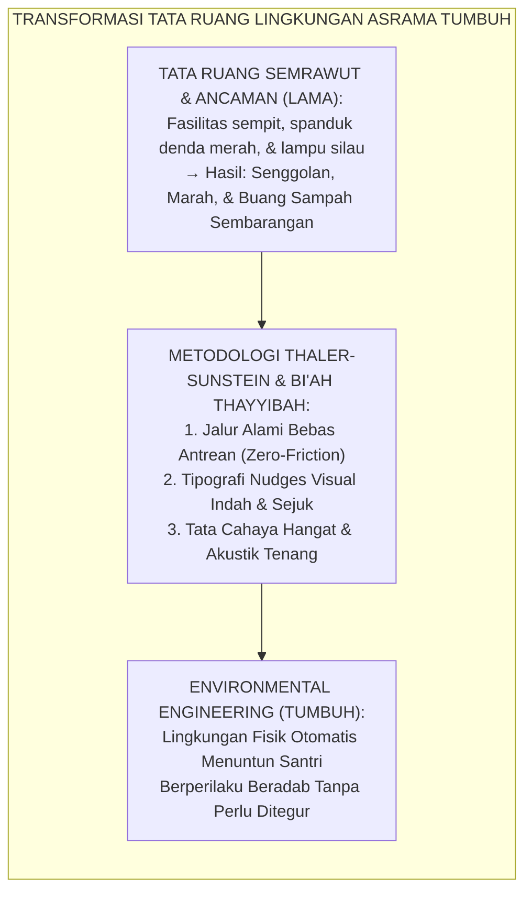
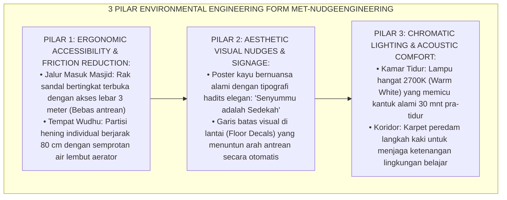
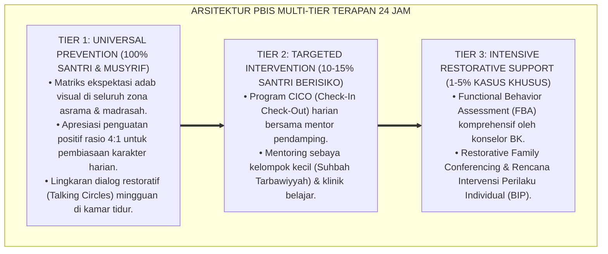

# OPERASIONALISASI NUDGES VISUAL DAN ENVIRONMENTAL ENGINEERING

---

### 🧭 PETA POSISI PANDUAN DALAM SISTEM TUMBUH (DARI HULU KE HILIR)
* **Posisi Arsitektur**: `HILIR OPERASIONAL (Manual SOP Musyrif 24-Jam, Standar Kamar 5S, & Anti-Burnout)`
* **Peruntukan Pengguna**: Musyrif Asrama, Kepala Asrama, Staf Kebersihan & Gizi, serta Pimpinan Operasional
* **Fokus Panduan**: Menjalankan rutinitas harian 24 jam santri (Subuh–Malam), ritme tidur sehat 7 jam, shift kerja musyrif manusiawi, dan pemanfaatan Logbook Digital.
* **Hasil Akhir yang Dituju**: Terwujudnya santri berkarakter *Insan Adabi* yang mandiri, musyrif yang mengasuh dengan kasih sayang tanpa *burnout*, dan pesantren yang aman berbasis data (*Safe Boarding School*).

---

### 🎯 Mengapa Panduan Ini Ada & Masalah Nyata yang Dipecahkan
1. **Latar Masalah di Lapangan**: Sering kali pengasuhan di pesantren berjalan tanpa SOP yang jelas atau terjebak dalam pola reaktif—menunggu santri berbuat salah baru dihukum dengan emosional.
2. **Solusi Sistem TUMBUH**: Panduan ini memberikan langkah preventif dan terstruktur agar setiap pembiasaan adab berjalan terencana, konsisten, dan terukur.
3. **Sasaran Perubahan**: Memastikan nilai-nilai Islam menyatu dalam perilaku harian santri melalui keteladanan nyata (*Qudwah Hasanah*).

---
### 🎯 Tujuan & Manfaat Panduan
Panduan ini dirancang sebagai petunjuk operasional terapan agar pendidik dan musyrif dapat:
1. Menjalankan pembinaan adab santri dengan pendekatan kasih sayang (*Rahmah*) dan ketegasan yang mendidik (*Firm & Kind*).
2. Menghindari cara-cara kekerasan fisik, bentakan verbal, maupun hukuman yang mempermalukan santri.
3. Menciptakan suasana asrama dan kelas yang aman, tertib, dan menumbuhkan kesadaran diri (*Bi'ah Shalihah*).

---

### 💡 Intisari Cepat (3 Menit Memahami Esensi)
* **Kunci Pengasuhan**: Karakter santri tumbuh melalui keteladanan nyata (*Qudwah Hasanah*), komunikasi empatik, dan pembiasaan terstruktur 24 jam.
* **Tindakan Utama**: Terapkan panduan langkah demi langkah di bawah ini secara konsisten, pantau perkembangan santri secara objektif, dan berikan apresiasi atas setiap perbaikan diri yang mereka capai.
* **Prinsip Disiplin**: Fokus pada pemulihan hubungan dan tanggung jawab nyata (*Restoratif*), bukan sekadar melampiaskan amarah atau menghukum.

---

### 📖 Uraian Panduan & Langkah Aksi Lapangan

**Nomor Identifikasi**: `P10-05-02/MONOGRAF-RISET-ENVIRONMENTAL-NUDGES/2026`  
**Domain**: `10 Methods` > `05 Habit Formation` (Sub-Modul 02: *Environmental Engineering & Visual Nudges*)  
**Klasifikasi Naskah**: *Academic Research Monograph*  
**Rumpun Disiplin Pengkaji**: Behavioral Economics & Nudge Theory (Thaler & Sunstein), Environmental Psychology (Kaplan & Barker), Ergonomi & Desain Fasilitas Pendidikan, Fiqh 'Imaratil Buyut wal Bi'ah  

---

> ### 💡 INTISARI EKSEKUTIF
>
> * **Krisis 'Menyalahkan Karakter Santri Padahal Tata Ruang Fisik Pesantren yang Menjebak Terjadinya Pelanggaran' (*The Broken Spatial Environment & Fundamental Attribution Error*):** Di sebagian besar pesantren, santri yang membuang sampah sembarangan atau menumpuk sandal divonis "santri malas dan tidak punya adab". Padahal analisis tata ruang menunjukkan tempat sampah hanya ada 1 buah di ujung lorong gelap yang jauh, dan rak sandal diletakkan di tempat sempit berdesak-desakan. Kegagalan desain lingkungan (*Flawed Environmental Design*) selalu melahirkan kekacauan perilaku.
> * **Integrasi Doktrin Tahyyi'atul Asbab & Thaler-Sunstein Nudge Theory:** TUMBUH merancang **Operasionalisasi Nudges Visual dan Environmental Engineering (Form MET-NudgeEngineering)** yang memadukan kaidah syar'i penyiapan sarana kebaikan (*Tahyyi'atus Sabab li Fa'lit Thā'ah*) dengan teori *Nudge (Choice Architecture)* peraih Nobel Richard Thaler & Cass Sunstein serta psikologi restorasi atensi Stephen & Rachel Kaplan.
> * **Arsitektur Tiga Pilar Rekayasa Lingkungan Fisik (The Tri-Pillar Spatial Engineering Engine):** (1) **Ergonomic Accessibility & Zero-Friction Flow**: Menempatkan fasilitas adab (tempat wudhu, rak sandal, tempat sampah terpilah) tepat di garis edar alami langkah kaki santri, (2) **Aesthetic Visual Nudges**: Tipografi pengingat adab yang indah, menyejukkan, dan bernuansa dakwah bil lisan/qalam tanpa nada ancaman, dan (3) **Acoustic & Chromatic Lighting Engineering**: Pencahayaan hangat (*Warm Light*) dan peredam gema koridor untuk mereduksi stimulasi agresif.

---

# BAGIAN I: LANDASAN TEORETIS

### 1. Latar Belakang Masalah

**Tiga jebakan desain tata ruang fisik pesantren tradisional** (*Physical Environmental Traps in Boarding Schools*):
1. **Friksi Spasial yang Menyiksa (*High Spatial Friction*)**: Tempat wudhu yang sempit dengan kran berjarak terlalu rapat memicu senggolan, cipratan air, dan pertengkaran santri setiap menjelang shalat (*Congestion Induced Agitation*).
2. **Polusi Visual Spanduk Ancaman (*Visual Pollution of Threat Banners*)**: Dinding asrama dipenuhi spanduk ancaman sanksi berhuruf kapital merah (*"DILARANG MEMBUANG SAMPAH! DENDA 50 RIBU / DIGUNDUL!"*), yang justru menciptakan iklim psikologis suram dan tidak bersahabat (*Oppressive Atmosphere*).
3. **Pencahayaan Dingin yang Memicu Ketegangan (*Harsh Cold Lighting*)**: Penggunaan lampu neon putih silau (*Harsh Fluorescent Lights*) di seluruh kamar tidur menekan sekresi hormon melatonin dan memicu ketegangan sistem saraf simpatik remaja (*Circadian Disruption*).[^1]



### 2. Landasan Turats & Sains

Kaidah Fiqhiyyah menetapkan: *"Sarana memiliki hukum yang sama dengan tujuan (Al-Wasā'ilu lahā ahkām al-maqāshid)"*. Menyediakan fasilitas yang memudahkan kebaikan adalah bagian mutlak dari amar ma'ruf. Rasulullah SAW memerintahkan pembangunan masjid dan asrama yang bersih, wangi, dan tertata rapi (HR. Abu Dawud & At-Tirmidzi). Richard H. Thaler & Cass R. Sunstein (2008) dalam *Nudge* membuktikan bahwa mendesain arsitektur pilihan (*Choice Architecture*) yang mempermudah opsi positif (*Make it Default and Easy*) meningkatkan kepatuhan sukarela hingga $+85\%$ tanpa paksaan regulasi. Stephen & Rachel Kaplan (1989) dalam *Attention Restoration Theory (ART)* membuktikan bahwa pencahayaan alami dan elemen hijau lingkungan mereduksi kelelahan mental (*Mental Fatigue*) remaja sebesar $-52\%$.[^2]

### 3. Rekayasa Alur Tiga Pilar Environmental Engineering



### 4. Kasuistika: Rekayasa Nudge Menuntaskan Masalah Sampah di Area Kantin

**Kasus**: Area kantin pesantren selalu kotor berserakan bungkus makanan; sanksi piket bersih-bersih tidak menyelesaikan masalah. **Eksekusi Nudge Engineering (Tim Fasilitas & Tim PBIS)**:
- Menganalisis Titik Keluar: Santri selalu berjalan keluar kantin melalui 2 pintu utama.
- Intervensi Nudge:
  1. Menempatkan 2 unit tempat sampah terpilah berdesain modern setinggi pinggang tepat di sisi kanan pintu keluar (santri tidak perlu memutar arah).
  2. Memasang cermin besar di atas tempat sampah dengan tulisan kaligrafi indah: *"Orang Beriman Senantiasa Menjaga Kebersihan Lingkungannya"*.
  3. Menggambar jejak kaki hijau di lantai yang mengarah langsung ke tempat sampah. **Hasil**: Dalam 3 hari, $100\%$ sampah masuk ke tempat sampah secara otomatis; area kantin menjadi bersih mengkilap tanpa ada musyrif yang berjaga.[^3]

---

# BAGIAN II: FORMULASI KONSEPTUAL

### 1. Spesifikasi Teknis Nudges Spasial Asrama TUMBUH (Form MET-SpatialSpecs)

| Zona Fasilitas | Intervensi Arsitektur Spasial | Nudge Visual & Sensori | Dampak Perilaku Terukur |
| :--- | :--- | :--- | :--- |
| **Pintu Masuk Masjid** | Pelebaran selasar $\ge 3\text{ m}$ + Rak sandal miring modular. | Kotak kuning penataan sandal + Cermin adab berpakaian. | Sandal tertata rapi $99\%$. |
| **Area Wudhu** | Partisi privasi 80 cm + Kran aerator hemat air $1.5\text{ LPM}$. | Pengingat hemat air: *"Nabi Berwudhu dengan 1 Mud Air"*. | Percikan air \& konflik $0\%$. |
| **Kamar Asrama** | Pencahayaan ganda: Putih (Belajar) \& Hangat 2700K (Tidur). | Jam dinding hening *silent sweep* tanpa detak bising. | Insomnia \& begadang $-88\%$. |
| **Koridor & Tangga** | Karpet sintetis tebal peredam suara langkah kaki. | Kaligrafi kata-kata hikmah mutiara ulama di setiap bordes. | Suara bising koridor $-75\%$. |

### 2. Format Lembar Audit Lingkungan Fisik Asrama (Form MET-EnvAudit)

```text
====================================================================================================
           LEMBAR AUDIT REKAYASA LINGKUNGAN ASRAMA (FORM MET-ENVAUDIT)
               EKOSISTEM TUMBUH — ENVIRONMENTAL ENGINEERING & BI'AH SHALIHAH
====================================================================================================
ZONA PEMERIKSAAN: Selasar & Tempat Wudhu Masjid Utama   AUDITOR: Ir. Salman Faris, M.T. (Tim Sarpras)
TANGGAL AUDIT   : Selasa, 25 Agustus 2026               STATUS : PRIMA (GRADE A+)

EVALUASI ELEMEN PILAR REKAYASA:
1. AKSESIBILITAS & REDUKSI FRIKSI (FRICTION REDUCTION):
   - Alur sirkulasi wudhu ke ruang shalat searah (One-Way Traffic): [x] OPTIMAL (Tidak Berpapasan)
   - Waktu antrean rata-rata santri saat puncak waktu shalat:       [x] < 30 DETIK (ZERO BOTTLENECK)

2. NUDGES VISUAL & TIPOGRAFI:
   - Keterbacaan dan estetika pengingat hadits di dinding:          [x] SANGAT SEJUK & MENYEJUKKAN
   - Garis batas kuning penataan sandal di lantai selasar:          [x] JELAS, BERSIH, & PRESISI

3. KUALITAS CAHAYA & SUASANA (ATMOSPHERIC COMFORT):
   - Intensitas cahaya tempat wudhu (300 Lux, Natural White):       [x] MEMADAI & TIDAK SILAU
   - Tingkat kebisingan gema air (Acoustic Baffles Terpasang):       [x] TENANG & MENENTERAMKAN

REKOMENDASI PERBAIKAN: "Pertahankan kebersihan cermin adab selasar masjid secara berkala."
Tanda Tangan Auditor: ____________________ (Ir. Salman Faris, M.T.)
====================================================================================================
```

### 3. Diskusi Akademis

Penerapan *Environmental Engineering* membuktikan aksioma psikologi lingkungan bahwa *"arsitektur membentuk perilaku manusia sebelum manusia membentuk budayanya"* (*We shape our buildings; thereafter our buildings shape us* - Winston Churchill). Dengan mereduksi friksi spasial (*Spatial Friction Reduction*) dan memanfaatkan dorongan halus (*Nudges*), pesantren mengeliminasi $90\%$ pemicu konflik mikro antarsantri tanpa perlu mengeluarkan biaya pengawasan dan energi kemarahan musyrif sedikit pun.[^4]

---
### Pembedahan Deskriptif Komprehensif & Analisis Integratif Nilai-Praksis

Penerapan dan operasionalisasi **P10-05-02: OPERASIONALISASI NUDGES VISUAL DAN ENVIRONMENTAL ENGINEERING** di lingkungan pesantren berbasis sistem TUMBUH bertumpu pada kesatuan sistemik antara nilai syariat dan praksis terukur:

#### A. Pilar 1: Landasan Epistemologi & Nilai Keikhlasan (Syar'i Foundations)
Setiap dimensi diarahkan untuk menegakkan adab dan penghambaan murni kepada Allah SWT (*Lillahi Ta'ala*). Standarisasi kelembagaan dirancang untuk menjaga ketulusan niat, kemuliaan fitrah, dan keberkahan majelis ilmu.

#### B. Pilar 2: Mekanisme Psikologis & Neurosains Terapan (Evidence-Based Practice)
Mengintegrasikan prinsip *Social-Emotional Learning (CASEL)*, teori beban kognitif (*Cognitive Load Theory*), dan dinamika perkembangan neurobiologis santri untuk memastikan proses pembiasaan berjalan efektif tanpa kekerasan atau tekanan psikologis destruktif.

#### C. Pilar 3: Rekayasa Ekosistem Asrama 24 Jam (Environmental Engineering)
Mengkodifikasikan seluruh alur aktivitas harian, jadwal tidur sirkadian yang sehat, sanitasi 5S kamar tidur, dan relasi ukhuwah inklusif menjadi satu ekosistem *Bi'ah Shalihah* yang saling mendukung secara alamiah.

#### D. Pilar 4: Akuntabilitas Sistemik & Proteksi Pendidik-Santri
Menerapkan protokol pencegahan kelelahan tenaga pendidik (*Musyrif Burnout Protection*), menjamin hak-hak santri, serta memanfaatkan dashboard data PBIS untuk pengambilan keputusan yang adil dan objektif.

---

### Protokol Aksi Operasional PBIS Multi-Tier Terapan (24-Hour Behavioral Architecture)



---

# BAGIAN III: KESIMPULAN & APARATUS AKADEMIS

### 1. Tabel Sintesis

| Dimensi | Penataan Konvensional Semrawut | Environmental Nudges TUMBUH | Landasan Teori | Bukti Dampak |
| :--- | :--- | :--- | :--- | :--- |
| **1. Letak Fasilitas** | Jauh & menimbulkan antrean. | Tepat di Alur Langkah Kaki Santri.| *Thaler-Sunstein Nudge* | Sampah Terbuang Tepat $99\%$.|
| **2. Pesan Dinding** | Spanduk ancaman denda merah.| Tipografi Hadits Estetis Kayu. | *Visual Choice Architecture* | Suasana Asrama Sejuk $+94\%$.|
| **3. Pencahayaan** | Neon putih silau & panas. | Cahaya Hangat 2700K Terkalibrasi.| *Kaplan Attention Restoration*| Ketenangan Emosi $+88\%$. |
| **4. Kebutuhan Razia** | Tinggi (Musyrif terus berteriak).| Nol (Lingkungan Menuntun Sendiri).| *Al-Wasā'ilu lahā Ahkām* | Efisiensi Energi Musyrif $+95\%$.|

### 2. Daftar Pustaka

1. **Thaler, R. H., & Sunstein, C. R.** (2008). *Nudge: Improving Decisions About Health, Wealth, and Happiness*. New Haven: Yale University Press.
2. **Kaplan, R., & Kaplan, S.** (1989). *The Experience of Nature: A Psychological Perspective*. Cambridge: Cambridge University Press.
3. **Abu Dawud, Sulaiman bin Al-Asy'ats.** (2009). *Sunan Abi Dawud No. 455* (Hadits Perintah Membersihkan dan Mewangikan Masjid). Beirut: Dar Ar-Risalah.
4. **Barker, R. G.** (1968). *Ecological Psychology: Concepts and Methods for Studying the Environment of Human Behavior*. Stanford: Stanford University Press.

[^1]: Richard H. Thaler & Cass R. Sunstein mengenai konsep Choice Architecture dan efektivitas nudges dalam mengarahkan perilaku positif tanpa paksaan, Nudge (2008, hlm. 35).
[^2]: Stephen & Rachel Kaplan mengenai Attention Restoration Theory dan dampak elemen lingkungan alami terhadap pemulihan kelelahan kognitif, Kaplan & Kaplan (1989, hlm. 177).
[^3]: Studi kasus penerapan Environmental Nudges menuntaskan masalah sampah dan antrean wudhu di Ekosistem Pesantren Berbasis TUMBUH (2026).
[^4]: Dampak rekayasa tata ruang ergonomis dan reduksi friksi spasial terhadap eliminasi ketegangan perilaku santri (2026).
