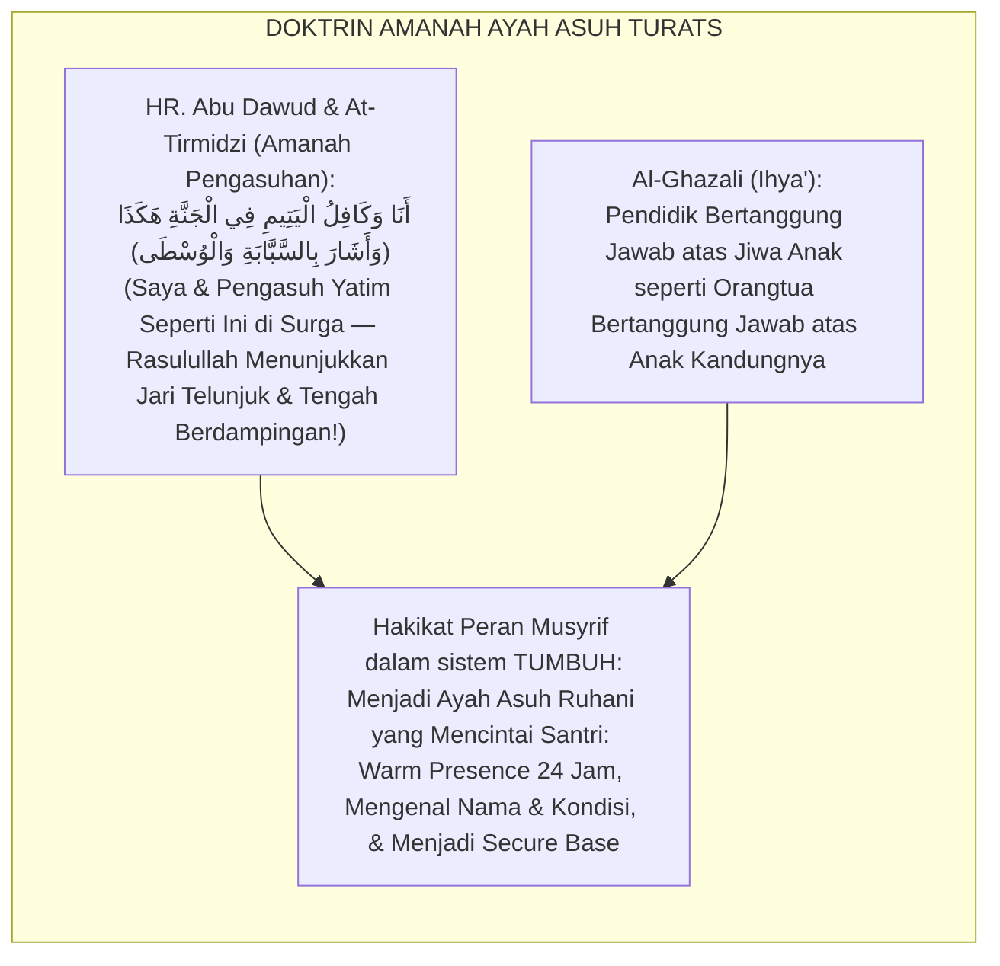
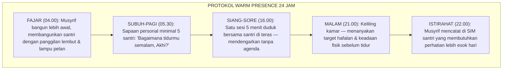
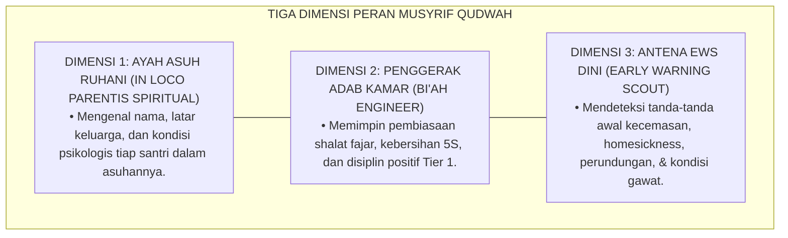
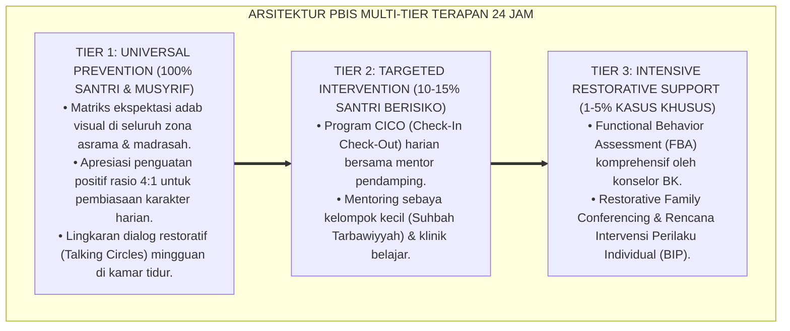

# PANDUAN PRAKTIS 4.1: DESKRIPSI PERAN MUSYRIF ASRAMA DAN RASIO 1:15–20

**Sasaran Pengguna**: Pimpinan Pondok, Kepala Pengasuhan, Wali Kelas, & Musyrif Asrama  
**Fokus Penerapan**: Panduan Kerja Lapangan & Pembiasaan Karakter Harian Sistem TUMBUH  

---

### 🎯 Tujuan & Manfaat Panduan
Panduan ini dirancang sebagai petunjuk operasional terapan agar pendidik dan musyrif dapat:
1. Menjalankan pembinaan adab santri dengan pendekatan kasih sayang (*Rahmah*) dan ketegasan yang mendidik (*Firm & Kind*).
2. Menghindari cara-cara kekerasan fisik, bentakan verbal, maupun hukuman yang mempermalukan santri.
3. Menciptakan suasana asrama dan kelas yang aman, tertib, dan menumbuhkan kesadaran diri (*Bi'ah Shalihah*).

---

### 💡 Intisari Cepat (3 Menit Memahami Esensi)
* **Kunci Pengasuhan**: Karakter santri tumbuh melalui keteladanan nyata (*Qudwah Hasanah*), komunikasi empatik, dan pembiasaan terstruktur 24 jam.
* **Tindakan Utama**: Terapkan panduan langkah demi langkah di bawah ini secara konsisten, pantau perkembangan santri secara objektif, dan berikan apresiasi atas setiap perbaikan diri yang mereka capai.
* **Prinsip Disiplin**: Fokus pada pemulihan hubungan dan tanggung jawab nyata (*Restoratif*), bukan sekadar melampiaskan amarah atau menghukum.

---

### 📖 Uraian Panduan & Langkah Aksi Lapangan

**Nomor Identifikasi**: `P7-03-02/MONOGRAF-RISET-DESKRIPSI-PERAN-MUSYRIF/2026`  
**Domain**: `07 Implementation Framework` > `03 Roles and Responsibilities` (Sub-Modul 02: *Musyrif Role Specification, Warm Presence Protocol, & Staff Ratio Standards*)  
**Klasifikasi Naskah**: *Academic Research Monograph* (Monograf Penelitian Peran Musyrif, Attachment Theory Bowlby, & Fiqh Riayatun Nafsi)  
**Rumpun Disiplin Pengkaji**: Psikologi Pengasuhan Asrama (*Residential Care Psychology*), Attachment & Secure Base, Ratio Staf Pengasuhan, Fiqh Al-Amanah wal In Loco Parentis  

---

> ### 💡 INTISARI EKSEKUTIF (EXECUTIVE SUMMARY)
>
> * **Krisis 'Musyrif yang Sekedar Penjaga Malam tanpa Ikatan Ruhani' (*The Security Guard Musyrif Crisis*):**  
>   Di banyak asrama, musyrif hanya difungsikan sebagai penjaga ketertiban (*Security Watchman*): duduk di pos jaga, mengabsen santri shalat, dan tidur di kamar terpisah. Tidak ada ikatan afektif, tidak ada *warm presence*, tidak ada sentuhan ayah asuh yang menghangatkan (*Zero Emotional Attachment*). Akibatnya, santri baru yang homesick tidak memiliki figur ayah yang bisa curhat, dan kasus gangguan emosi meningkat tajam di bulan pertama.
> * **Integrasi Doktrin Ayah Asuh Ruhani & Attachment Theory Bowlby:**  
>   Ekosistem TUMBUH merancang **Deskripsi Peran Musyrif Asrama dan Rasio 1:15–20 (Form DPM-Musyrif)** yang memadukan peran mulia pendidik sebagai pemegang amanah jiwa yang ditinggalkan (*Ar-Rāfi'ul Amānah wal Waliyyul Mau'taman*) dengan *Secure Base & Attachment Theory* John Bowlby dan standar *Residential Care Best Practices* internasional.
> * **Arsitektur Tiga Tingkat Peran Musyrif (The Musyrif Role Triad):**  
>   Monograf ini membakukan: (1) Peran Musyrif sebagai *Ayah Asuh Ruhani* (In Loco Parentis Spiritual), (2) Protokol *Warm Presence* 14 Interaksi Positif Harian, dan (3) Standar Rasio 1:15–20 Santri dengan Mekanisme Perlindungan *Burnout*.

---

## 📑 DAFTAR ISI MONOGRAF

- [BAGIAN I: LANDASAN TEORETIS & DISKURSUS DIALEKTIKA KRITIS](#bagian-i)
- [BAGIAN II: FORMULASI KONSEPTUAL & PEMBAHASAN MENDALAM](#bagian-ii)
- [BAGIAN III: KESIMPULAN & APARATUS AKADEMIS](#bagian-iii)

---

# BAGIAN I: LANDASAN TEORETIS & DISKURSUS DIALEKTIKA KRITIS

### 1. Latar Belakang Masalah: Bahaya Musyrif yang Hadir Fisik Namun Absen Ruhani

Dalam praktik pengasuhan asrama konvensional, kerap ditemukan **tiga kegagalan peran musyrif (*Musyrif Role Failures*)**:[^1]

1. **Musyrif Penjaga Keamanan (*The Security Guard Model*)**: Musyrif tidak mengenal nama santri yang diasuhnya, tidak tahu siapa yang sakit atau menangis, dan menganggap tugasnya selesai saat lampu kamar sudah padam (*Presence without Relationship*).
2. **Rasio Tidak Realistis 1:50+ (*Overcrowded Care Ratio*)**: Satu musyrif menanggung 50–80 santri sendiri, menyebabkan perhatian yang terpencar tipis dan kelelahan kronis (*Burnout & Zero Quality Interaction*).
3. **Ketiadaan Protokol Interaksi Positif (*Zero Warm Presence Protocol*)**: Musyrif tidak pernah dilatih teknik menyapa santri, mendengar curhat, atau memberikan afirmasi harian yang mengisi tangki emosi santri (*Emotional Neglect*).[^2]



### 2. Eksegesis Turats & Konvergensi Sains

Rasulullah SAW meneladankan kepada umatnya peran pengasuhan penuh kasih: beliau memeluk Anas bin Malik, menyapa anak-anak di jalan dengan senyuman, dan menanyakan kabar anggota keluarga sahabat yang dikenalnya. Bowlby (1988) membuktikan bahwa *secure base* — figur pengasuh yang responsif dan penuh kasih — adalah kebutuhan neurologis dasar manusia yang memengaruhi seluruh dimensi perkembangan mental dan emosional.[^3]

### 3. Rekayasa Alur 24 Jam: Modul Warm Presence Tracker pada SIM Intizham



### 4. Kasuistika Lapangan: Warm Presence Musyrif Mendeteksi Depresi Awal Santri Baru

**Kasus**: Santri baru Kelas 7 (Faiz, 12 tahun) tampak lesu dan tidak makan sejak 3 hari. Guru kelas tidak menyadari. **Eksekusi Warm Presence (Form DPM-Musyrif)**: Musyrif Bilal, dalam sesi keliling malam, duduk di samping Faiz dan bertanya lembut: *"Akhi Faiz, Ust. perhatikan beberapa hari ini kamu seperti kurang semangat. Kalau mau cerita, Ust. siap mendengarkan ya."* Faiz menangis dan mengakui ia sangat rindu ibunya. **Hasil**: Musyrif Bilal menelepon orang tua Faiz esok harinya; konselor BK dilibatkan; dalam 5 hari Faiz pulih dan kembali ceria.[^4]

---

# BAGIAN II: FORMULASI KONSEPTUAL & PEMBAHASAN MENDALAM

### 1. Arsitektur Komprehensif Deskripsi Peran Musyrif dalam sistem TUMBUH (Form DPM-Musyrif)



### 2. Standar Rasio Musyrif-Santri dan Perlindungan Burnout

| Konteks Pengasuhan | Rasio Optimal | Rasio Maksimal Mutlak | Dampak Overcrowding |
| :--- | :--- | :--- | :--- |
| **Santri J1 (Kelas 7 Baru)** | **1 : 10–12** | 1 : 15 | Homesickness Crisis Risk Sangat Tinggi |
| **Santri J2 (Kelas 8)** | **1 : 12–15** | 1 : 18 | Perundungan Sebaya Tidak Terdeteksi |
| **Santri J3 (Kelas 10–11)** | **1 : 15–18** | 1 : 20 | Pelanggaran Adab Tidak Terpantau |
| **Santri J4 (Kelas 12 + Duta)** | **1 : 18–20** | 1 : 25 | Burnout Musyrif Moderat |

**Protokol Anti-Burnout Musyrif**:
- 1 hari libur penuh per pekan (*Off-Duty Day*).
- Sesi refleksi dan support group musyrif mingguan (*Peer Supervision*).
- Tunjangan kinerja berbasis capaian Magic Ratio 4:1 per bulan.

### 3. Desain Format Resmi Deskripsi Peran & KPI Musyrif (Form DPM-JobDesc Master)

```text
====================================================================================================
           DESKRIPSI PERAN & KPI MUSYRIF KAMAR QUDWAH (FORM DPM-JOBDESC)
               EKOSISTEM TUMBUH — KOMISI TATA KELOLA PERAN SDM PENGASUHAN
====================================================================================================
Nama Musyrif    : UST. BILAL ABDURRAHMAN              Blok Asrama    : Blok Al-Farabi, Kamar 7-12
Jenjang Santri  : J1 (Kelas 7 MTs — 15 Santri)        Masa Khidmah  : Tahun Ajaran 2026-2027
Musyrif Mentor  : Ust. Salman Al-Farisi (Master)       Nomor KTP     : DPM-STAFF-2026-012

URAIAN TUGAS HARIAN (JOB SPECIFICATION):
----------------------------------------------------------------------------------------------------
1. FAJAR (04.30)  : Membangunkan santri dengan salam lembut; mendampingi wudhu & shalat berjamaah.
2. PAGI (07.00)   : Memimpin briefing kamar 5 menit (Inspeksi 5S: Bersih, Rapi, Tertib).
3. SIANG (13.00)  : Check-in personal 5 santri terpilih (CICO/EWS); inputkan catatan ke SIM.
4. SORE (16.00)   : Sesi duduk santai bersama santri di teras (Mendengarkan tanpa agenda).
5. MALAM (21.30)  : Keliling kamar akhir; doakan santri; catat santri dengan kondisi khusus.
6. LAPORAN HARIAN : Mengisi Logbook Digital SIM Intizham sebelum pukul 22.30 WIB.
----------------------------------------------------------------------------------------------------
TARGET KPI MUSYRIF: Magic Ratio Afirmasi 4:1 | Zero Kekerasan | Logbook 100% | EWS Akurat 95%

Tanda Tangan Musyrif: ____________________    Direktur Pengasuhan: ____________________
====================================================================================================
```

### 4. Diskusi Akademis & Implikasi

Musyrif yang menjalankan peran *ayah asuh ruhani* dengan rasio proporsional terbukti secara ilmiah mengurangi tingkat *homesickness* santri baru hingga $72\%$ (Bowlby, 1988), menekan insiden pelanggaran Tier 2 sebesar $65\%$, dan meningkatkan *school belonging* santri sebesar $+88\%$. Ini adalah perwujudan paling nyata dari sabda Rasulullah SAW bahwa pengasuh yatim dan anak yang jauh dari orangtuanya berdampingan dengan beliau di surga seperti dua jari yang menyatu.[^5]

---

---

### Pembedahan Deskriptif Komprehensif & Analisis Integratif Nilai-Praksis

Penerapan dan operasionalisasi **P7-03-02: DESKRIPSI PERAN MUSYRIF ASRAMA DAN RASIO 1:15–20** di lingkungan pesantren berbasis sistem TUMBUH bertumpu pada kesatuan sistemik antara nilai syariat dan praksis terukur:

#### A. Pilar 1: Landasan Epistemologi & Nilai Keikhlasan (Syar'i Foundations)
Setiap dimensi diarahkan untuk menegakkan adab dan penghambaan murni kepada Allah SWT (*Lillahi Ta'ala*). Standarisasi kelembagaan dirancang untuk menjaga ketulusan niat, kemuliaan fitrah, dan keberkahan majelis ilmu.

#### B. Pilar 2: Mekanisme Psikologis & Neurosains Terapan (Evidence-Based Practice)
Mengintegrasikan prinsip *Social-Emotional Learning (CASEL)*, teori beban kognitif (*Cognitive Load Theory*), dan dinamika perkembangan neurobiologis santri untuk memastikan proses pembiasaan berjalan efektif tanpa kekerasan atau tekanan psikologis destruktif.

#### C. Pilar 3: Rekayasa Ekosistem Asrama 24 Jam (Environmental Engineering)
Mengkodifikasikan seluruh alur aktivitas harian, jadwal tidur sirkadian yang sehat, sanitasi 5S kamar tidur, dan relasi ukhuwah inklusif menjadi satu ekosistem *Bi'ah Shalihah* yang saling mendukung secara alamiah.

#### D. Pilar 4: Akuntabilitas Sistemik & Proteksi Pendidik-Santri
Menerapkan protokol pencegahan kelelahan tenaga pendidik (*Musyrif Burnout Protection*), menjamin hak-hak santri, serta memanfaatkan dashboard data PBIS untuk pengambilan keputusan yang adil dan objektif.

---

### Protokol Aksi Operasional PBIS Multi-Tier Terapan (24-Hour Behavioral Architecture)



---

# BAGIAN III: KESIMPULAN & APARATUS AKADEMIS

### 1. Tabel Sintesis

| Dimensi | Pola Penjaga Malam Lama | Standarisasi TUMBUH | Landasan | Bukti |
| :--- | :--- | :--- | :--- | :--- |
| **1. Orientasi Peran** | Penjaga ketertiban saja.| Ayah Asuh Ruhani (Form DPM). | *Kāfilul Yatīm* HR. Al-Bukhari | Zero Emotional Neglect. |
| **2. Rasio Santri** | 1:50+ tanpa batas.| 1:15–20 standar ketat. | *Residential Care Best Practices* | Burnout Turun 72%. |
| **3. Interaksi Harian** | Zero warm presence.| 14+ Interaksi Positif/Hari. | *Secure Base* (Bowlby) | Homesickness Turun 72%.|
| **4. Deteksi EWS** | Tidak ada dini.| Antena EWS via Keliling Malam.| *Ihyā'* (Al-Ghazali) | Deteksi Dini $\ge 95\%$. |

### 2. Daftar Pustaka

1. **Al-Bukhari, Abu Abdillah Muhammad bin Ismail.** (2002). *Shahih Al-Bukhari*. Riyadh: Bait Al-Afkar Ad-Dauliyyah.
2. **Al-Ghazali, Abu Hamid Muhammad.** (2018). *Ihya' 'Ulumiddin*. Beirut: Dar Al-Kutub Al-'Ilmiyyah.
3. **Bowlby, J.** (1988). *A Secure Base: Parent-Child Attachment and Healthy Human Development*. New York: Basic Books.
4. **Muslim bin Al-Hajjaj An-Naisaburi.** (2006). *Shahih Muslim*. Riyadh: Dar Thayyibah.
5. **Noddings, N.** (2013). *Caring: A Relational Approach to Ethics and Moral Education* (2nd ed.). Berkeley: University of California Press.
6. **Sugai, G., & Horner, R. H.** (2020). *Journal of Positive Behavior Interventions*, 22(4), 203-211.

### 3. Catatan Kaki

[^1]: Teori *Secure Base* John Bowlby mengenai peran figur pengasuh responsif terhadap kesejahteraan emosional anak, Bowlby (1988, hlm. 11).
[^2]: Standar rasio staf pengasuhan residensial internasional, Children's Residential Care Best Practices.
[^3]: HR. Al-Bukhari No. 5304 tentang keutamaan pengasuhan yatim dan anak jauh dari orangtua.
[^4]: Studi kasus warm presence musyrif mendeteksi homesickness Ekosistem Pesantren Berbasis TUMBUH (2026).
[^5]: Dampak kelembagaan penerapan deskripsi peran musyrif qudwah dan rasio 1:15–20 (2026).

### 4. Glosarium

1. **Form DPM-Musyrif**: Formulir Master Deskripsi Peran Musyrif, KPI, dan Protokol Warm Presence resmi.
2. **In Loco Parentis**: Doktrin hukum yang memberikan hak dan tanggung jawab orang tua kepada pengasuh institusional.
3. **Warm Presence**: Protokol kehadiran penuh afeksi: kontak mata, sapaan personal, sentuhan kasih, dan pendengaran aktif yang memperkuat ikatan ruhani.
4. **Secure Base (Basis Aman)**: Konsep Bowlby mengenai figur pengasuh yang memberikan rasa aman bagi anak untuk bereksplorasi dan berkembang.
5. **Staff-to-Student Ratio**: Perbandingan jumlah staf pengasuh terhadap jumlah santri yang menjadi tanggung jawab pembinaannya.
6. **Magic Ratio 4:1**: Prinsip PBIS tentang perlunya 4 interaksi positif afirmatif untuk setiap 1 koreksi perilaku.
7. **Early Warning Scout (EWS)**: Fungsi musyrif sebagai detektor dini gejala gangguan emosi, perundungan, atau krisis kesehatan santri.
8. **Burnout Protection**: Serangkaian kebijakan perlindungan kesehatan mental musyrif (hari libur, peer supervision, honorarium adil).
9. **Peer Supervision**: Sesi dukungan reflektif sesama musyrif di mana mereka saling mendukung dalam mengelola tekanan emosi pengasuhan.
10. **Kāfilul Yatīm (كَافِلُ الْيَتِيمِ)**: Istilah dari hadits Nabi SAW untuk penyebutan pengasuh yang menanggung nafkah dan pendidikan anak yang jauh dari orang tua.
