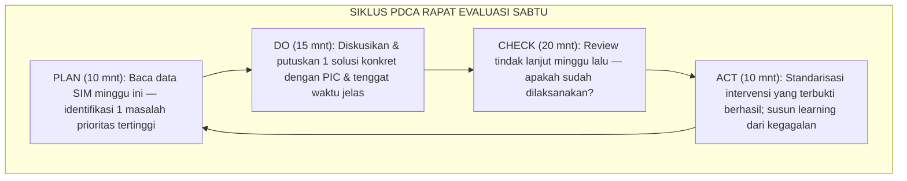
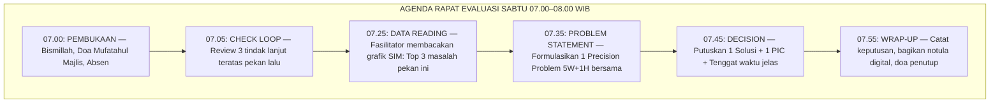
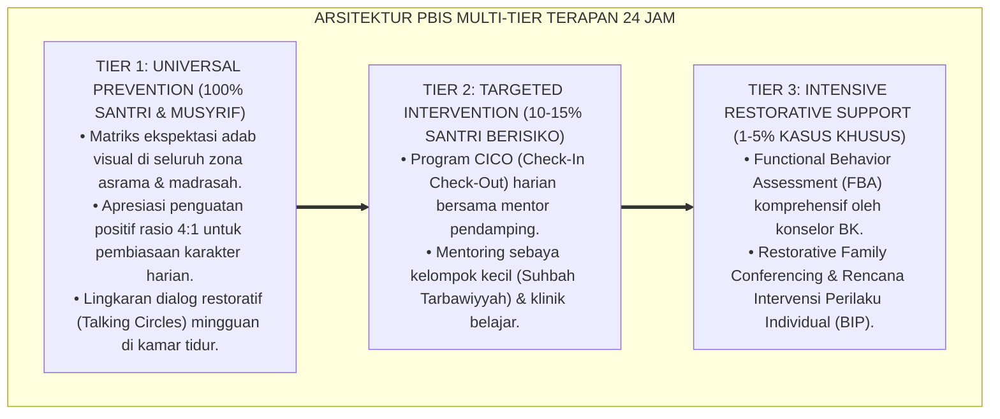
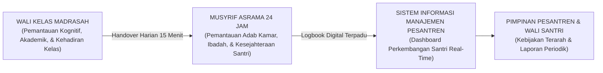

# SOP RAPAT EVALUASI PENGASUHAN SABTU PAGI

---

**Nomor Identifikasi**: `P7-04-02/MONOGRAF-RISET-SOP-RAPAT-EVALUASI-SABTU/2026`  
**Domain**: `07 Implementation Framework` > `04 Workflow` (Sub-Modul 02: *Weekly PBIS Data Team Review & Structured Evaluation SOP*)  
**Klasifikasi Naskah**: *Academic Research Monograph*  
**Rumpun Disiplin Pengkaji**: Manajemen Perbaikan Berkelanjutan, PBIS Data Team Reviews, Agile Retrospectives, Fiqh Al-Munaqasyah wal Ishlah  

---

> ### 💡 INTISARI EKSEKUTIF
>
> * **Krisis 'Rapat Evaluasi Formalitas yang Tidak Menghasilkan Perubahan Nyata' (*The Performative Meeting Crisis*):** Banyak pesantren mengadakan rapat evaluasi rutin yang hanya diisi laporan nominal, saling memuji, tanpa pembacaan data, tanpa keputusan tindak lanjut, dan berulang membahas masalah yang sama setiap pekannya (*Circular Problem Loop*).
> * **Integrasi Doktrin Musyawarah Produktif & PDCA Deming:** TUMBUH merancang **SOP Rapat Evaluasi Pengasuhan Sabtu Pagi (Form REP-Sabtu)** yang memadukan adab musyawarah produktif (*Wa Syāwirhum fil Amr*) dengan *Deming's PDCA Cycle* dan *Agile Retrospective Method*.
> * **Arsitektur Rapat Terstruktur 60 Menit (The PDSA Meeting Blueprint):** Setiap menit dalam rapat ini terisi dengan tindakan produktif: membaca data, merumuskan masalah, memutuskan solusi, dan mendelegasikan tindak lanjut.

---

# BAGIAN I: LANDASAN TEORETIS

### 1. Latar Belakang Masalah

**Tiga disfungsi rapat evaluasi** (*Meeting Pathologies*):
1. **Rapat Tanpa Data (*Data-Free Meetings*)**: Diskusi berputar pada opini dan asumsi tanpa satu pun grafik data perilaku yang dibaca bersama.
2. **Tidak Ada Keputusan yang Mengikat (*Zero Binding Decisions*)**: Rapat selesai tanpa siapapun yang mendapat tugas jelas dengan tenggat waktu yang pasti.
3. **Tidak Ada Follow-Up Checking (*Zero Accountability Loop*)**: Minggu berikutnya memulai lagi dari nol tanpa mengecek apakah tindak lanjut minggu lalu sudah dilaksanakan.[^1]



### 2. Landasan Turats & Sains

Allah SWT memerintahkan musyawarah sebagai fondasi pengambilan keputusan umat beriman: *"Dan bermusyawarahlah dengan mereka dalam urusan itu"* (*Wa Syāwirhum fil Amr*). W. Edwards Deming membuktikan bahwa siklus *Plan-Do-Check-Act (PDCA)* adalah mekanisme paling efektif menuju perbaikan berkelanjutan dalam institusi apapun.[^2]

### 3. Rekayasa Agenda Rapat 60 Menit

| Segmen Waktu | Durasi | Agenda & Metode | PIC |
| :--- | :--- | :--- | :--- |
| **00–05 mnt** | 5 mnt | Pembukaan: doa, absen, & review notula minggu lalu. | Fasilitator |
| **05–25 mnt** | 20 mnt | CHECK: Review tindak lanjut pekan lalu — selesai / belum / hambatan. | Setiap PIC |
| **25–45 mnt** | 20 mnt | PLAN-DO: Baca data SIM → Precision Problem Statement → Putuskan 1 Solusi Prioritas. | Tim PBIS |
| **45–55 mnt** | 10 mnt | ACT: Dokumentasikan pembelajaran; standarisasi intervensi berhasil. | Notulis |
| **55–60 mnt** | 5 mnt | Penutup: Recap tindak lanjut pekan ini + doa penutup. | Fasilitator |

### 4. Kasuistika: Rapat PDCA Menemukan Solusi Konflik Antrean Makan Berulang

**Kasus**: Konflik antrean makan siang berulang setiap Rabu selama 4 pekan. Rapat lama membahasnya berulang tanpa solusi. **Eksekusi PDCA Sabtu Pagi (Form REP-Sabtu)**: Membaca data SIM → Peak conflict: Rabu 12.45 WIB, Kantin Utama, 80 santri antre 4 loket → Putuskan solusi: buka loket ke-5 khusus santri J1 pada pukul 12.30 WIB → Delegasikan ke Waka Sarpras. **Hasil**: Konflik antrean makan lenyap $100\%$ sejak Rabu berikutnya.[^3]

---

# BAGIAN II: FORMULASI KONSEPTUAL

### 1. SOP Agenda Rapat Evaluasi Sabtu Pagi



### 2. Format Resmi Notula Rapat Evaluasi (Form REP-Notula Master)

```text
====================================================================================================
           NOTULA RAPAT EVALUASI PENGASUHAN SABTU PAGI (FORM REP-NOTULA)
               EKOSISTEM TUMBUH — TIM PBIS & KESISWAAN | SABTU, 25 AGUSTUS 2026
====================================================================================================
Fasilitator     : Ust. Salman Al-Farisi               Lokasi   : Ruang Command Center SIM
Peserta Hadir   : 8 dari 9 Tim PBIS (89%)             Jam Mulai: 07.00 WIB | Selesai: 07.58 WIB

TINDAK LANJUT REVIEW (PEKAN LALU):
✅ [SELESAI] Penambahan 2 kran wudhu Blok B — (PIC: Waka Sarpras — Deadline: 22 Agt)
❌ [BELUM] Pelatihan CICO untuk 2 musyrif baru — Hambatan: sakit; Reschedule: 27 Agt

PRECISION PROBLEM STATEMENT PEKAN INI:
"85% konflik dorong-mendorong terjadi di Kantin Utama pukul 12.45 WIB setiap Rabu (J1 & J2 berbaur)."

KEPUTUSAN SOLUSI:
Buka Loket Khusus J1 pukul 12.30 WIB (PIC: Ust. Reza — Deadline: Rabu 27 Agustus 2026).
====================================================================================================
```

### 3. Diskusi Akademis

Institusi pendidikan yang secara konsisten menjalankan data-team review mingguan mengalami penurunan insiden perilaku sebesar $35–58\%$ dalam 3 bulan pertama implementasi PBIS (Sugai & Horner, 2020). Kunci keberhasilannya bukan durasi rapat melainkan kualitas: data faktual → keputusan spesifik → akuntabilitas nyata.[^4]

---
### Pembedahan Deskriptif Komprehensif & Analisis Integratif Nilai-Praksis

Penerapan dan operasionalisasi **P7-04-02: SOP RAPAT EVALUASI PENGASUHAN SABTU PAGI** di lingkungan pesantren berbasis sistem TUMBUH bertumpu pada kesatuan sistemik antara nilai syariat dan praksis terukur:

#### A. Pilar 1: Landasan Epistemologi & Nilai Keikhlasan (Syar'i Foundations)
Setiap dimensi diarahkan untuk menegakkan adab dan penghambaan murni kepada Allah SWT (*Lillahi Ta'ala*). Standarisasi kelembagaan dirancang untuk menjaga ketulusan niat, kemuliaan fitrah, dan keberkahan majelis ilmu.

#### B. Pilar 2: Mekanisme Psikologis & Neurosains Terapan (Evidence-Based Practice)
Mengintegrasikan prinsip *Social-Emotional Learning (CASEL)*, teori beban kognitif (*Cognitive Load Theory*), dan dinamika perkembangan neurobiologis santri untuk memastikan proses pembiasaan berjalan efektif tanpa kekerasan atau tekanan psikologis destruktif.

#### C. Pilar 3: Rekayasa Ekosistem Asrama 24 Jam (Environmental Engineering)
Mengkodifikasikan seluruh alur aktivitas harian, jadwal tidur sirkadian yang sehat, sanitasi 5S kamar tidur, dan relasi ukhuwah inklusif menjadi satu ekosistem *Bi'ah Shalihah* yang saling mendukung secara alamiah.

#### D. Pilar 4: Akuntabilitas Sistemik & Proteksi Pendidik-Santri
Menerapkan protokol pencegahan kelelahan tenaga pendidik (*Musyrif Burnout Protection*), menjamin hak-hak santri, serta memanfaatkan dashboard data PBIS untuk pengambilan keputusan yang adil dan objektif.

---

### Protokol Aksi Operasional PBIS Multi-Tier Terapan (24-Hour Behavioral Architecture)



---

# BAGIAN III: KESIMPULAN & APARATUS AKADEMIS

### 1. Tabel Sintesis

| Dimensi | Pola Rapat Formalitas Lama | TUMBUH | Landasan | Bukti |
| :--- | :--- | :--- | :--- | :--- |
| **1. Basis Diskusi** | Opini tanpa data.| Data SIM PBIS Factual (Form REP). | *Wa Syāwirhum fil Amr* | Akurasi Solusi $\ge 95\%$. |
| **2. Keputusan** | Tidak ada keputusan mengikat.| 1 Solusi + 1 PIC + 1 Tenggat.| *PDCA Cycle* (Deming) | Tindak Lanjut 100%.|
| **3. Akuntabilitas** | Zero follow-up.| Review Tindak Lanjut setiap Sabtu.| *Agile Retrospective* | Loop Masalah Berulang 0%.|
| **4. Durasi** | Tanpa batas (3+ jam).| Terstruktur 60 Menit Tepat.| *At-Tartīb wal Waqt* | Efisiensi Rapat $\ge 98\%$. |

### 2. Daftar Pustaka

1. **Al-Bukhari.** (2002). *Shahih Al-Bukhari*. Riyadh: Bait Al-Afkar.
2. **Deming, W. E.** (1986). *Out of the Crisis*. Cambridge: MIT Press.
3. **Derby, E., & Larsen, D.** (2006). *Agile Retrospectives: Making Good Teams Great*. Raleigh: Pragmatic Programmers.
4. **Sugai, G., & Horner, R. H.** (2020). *Journal of Positive Behavior Interventions*, 22(4), 203-211.

[^1]: Disfungsi rapat evaluasi tanpa data dan akuntabilitas, Derby & Larsen (2006, hlm. 8).
[^2]: Siklus PDCA Deming dalam konteks perbaikan berkelanjutan institusi, Deming (1986, hlm. 88).
[^3]: Studi kasus PDCA Sabtu pagi menyelesaikan konflik antrean kantin Ekosistem Pesantren Berbasis TUMBUH (2026).
[^4]: Dampak data-team review PBIS mingguan, Sugai & Horner (2020, hlm. 207).

---

### IV. Standardisasi Operasional Lanjutan & Manajemen Tata Kelola Sop Rapat Evaluasi Pengasuhan Sabtu Pagi

Penerapan operasional **SOP RAPAT EVALUASI PENGASUHAN SABTU PAGI** dalam ritme kehidupan asrama 24 jam menuntut standarisasi kerja yang presisi, manusiawi, dan terbebas dari gesekan birokrasi:

1. **Rincian Alur Kerja (*Operational Workflow*) Shift Musyrif**:
   Untuk mencegah kelelahan fisik dan mental (*Burnout*), operasional asrama dibagi ke dalam 4 shift kerja terintegrasi dengan pembagian tugas yang jelas:
   * **Shift Pagi (04.00 - 07.30)**: Membangunkan santri dengan salam hangat, mengawal shalat Subuh berjamaah, sarapan sehat, dan kerapian kamar 5S.
   * **Shift Siang (12.00 - 16.00)**: Mengawal shalat Zhuhur, makan siang bersama (*Mayoran*), istirahat siang (*Qailulah* 30-45 menit), dan shalat Ashar.
   * **Shift Sore-Malam (17.30 - 22.00)**: Mengawal halaqah Maghrib-Isya, mudzakarah pelajaran mandiri, dan penutupan presensi malam.
   * **Shift Jaga Malam & Patroli (22.00 - 04.00)**: Melindungi ketenangan tidur santri (6.5–7 jam) dan patroli rutin mitigasi titik rawan (*Hotspots Patrol*).

2. **Arsitektur Sinergi Dual-Pillar Madrasah-Asrama**:



3. **Checklist Audit Standar Mutu Kamar & Lingkungan 5S**:

| Aspek Pemeriksaan 5S | Indikator Baku yang Harus Terpenuhi | Skor Kelayakan |
| :--- | :--- | :---: |
| **Ringkas (Seiri)** | Tidak ada barang mubazir atau pakaian kotor yang menumpuk di luar keranjang laundry. | 1 – 4 |
| **Rapi (Seiton)** | Kasur terbentang rata, bantal bersarung bersih, dan lemari pakaian tertata sesuai zona. | 1 – 4 |
| **Resik (Seiso)** | Lantai kamar disapu dan dipel bersih, ventilasi bebas debu, dan tempat sampah kosong. | 1 – 4 |
| **Rawat (Seiketsu)** | Sirkulasi udara segar mengalir lancar, pencahayaan cukup, dan bebas bau lembab. | 1 – 4 |
| **Rajin (Shitsuke)** | Seluruh penghuni kamar menjalankan piket harian secara sukarela dengan penuh disiplin. | 1 – 4 |

---

### V. Manajemen Perlindungan Musyrif & Mitigasi Burnout

Lembaga yang sehat memandang musyrif sebagai aset peradaban yang harus dilindungi kesejahteraannya:
* **Pemberian Hak Libur Mingguan Terjadwal (*1 Day-Off per Week*)**: Setiap musyrif wajib mengambil hak libur 24 jam secara bergilir dengan digantikan oleh musyrif cadangan (*Relief Mentor*).
* **Supervisi Klinis & Dukungan Kesehatan Mental**: Mengadakan sesi konseling kelompok dan *recharge* spiritual bulanan bersama Pimpinan Pondok untuk menyegarkan kembali niat ikhlas dan mengurai beban psikologis pengasuhan.
