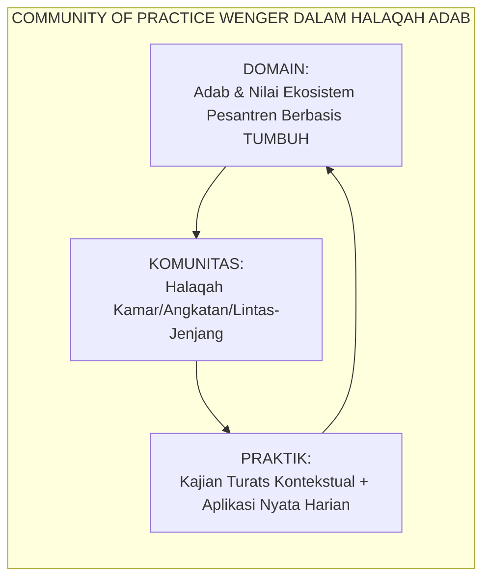
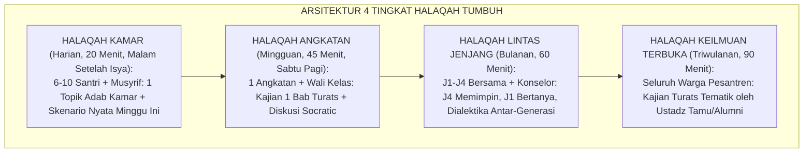
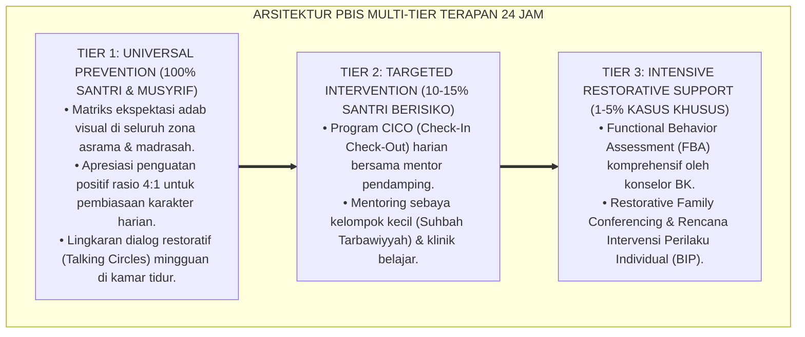

# PANDUAN OPERASIONAL 4.3: METODOLOGI HALAQAH ADAB DAN KAJIAN TURATS

---

### 🧭 PETA POSISI PANDUAN DALAM SISTEM TUMBUH (DARI HULU KE HILIR)
* **Posisi Arsitektur**: `HILIR OPERASIONAL (Manual SOP Musyrif 24-Jam, Standar Kamar 5S, & Anti-Burnout)`
* **Peruntukan Pengguna**: Musyrif Asrama, Kepala Asrama, Staf Kebersihan & Gizi, serta Pimpinan Operasional
* **Fokus Panduan**: Menjalankan rutinitas harian 24 jam santri (Subuh–Malam), ritme tidur sehat 7 jam, shift kerja musyrif manusiawi, dan pemanfaatan Logbook Digital.
* **Hasil Akhir yang Dituju**: Terwujudnya santri berkarakter *Insan Adabi* yang mandiri, musyrif yang mengasuh dengan kasih sayang tanpa *burnout*, dan pesantren yang aman berbasis data (*Safe Boarding School*).

---

### 🎯 Mengapa Panduan Ini Ada & Masalah Nyata yang Dipecahkan
1. **Latar Masalah di Lapangan**: Sering kali pengasuhan di pesantren berjalan tanpa SOP yang jelas atau terjebak dalam pola reaktif—menunggu santri berbuat salah baru dihukum dengan emosional.
2. **Solusi Sistem TUMBUH**: Panduan ini memberikan langkah preventif dan terstruktur agar setiap pembiasaan adab berjalan terencana, konsisten, dan terukur.
3. **Sasaran Perubahan**: Memastikan nilai-nilai Islam menyatu dalam perilaku harian santri melalui keteladanan nyata (*Qudwah Hasanah*).

---

---

### 🎯 Tujuan & Manfaat Panduan
Panduan ini dirancang sebagai petunjuk operasional terapan agar pendidik dan musyrif dapat:
1. Menjalankan pembinaan adab santri dengan pendekatan kasih sayang (*Rahmah*) dan ketegasan yang mendidik (*Firm & Kind*).
2. Menghindari cara-cara kekerasan fisik, bentakan verbal, maupun hukuman yang mempermalukan santri.
3. Menciptakan suasana asrama dan kelas yang aman, tertib, dan menumbuhkan kesadaran diri (*Bi'ah Shalihah*).

---

### 💡 Intisari Cepat (3 Menit Memahami Esensi)
* **Kunci Pengasuhan**: Karakter santri tumbuh melalui keteladanan nyata (*Qudwah Hasanah*), komunikasi empatik, dan pembiasaan terstruktur 24 jam.
* **Tindakan Utama**: Terapkan panduan langkah demi langkah di bawah ini secara konsisten, pantau perkembangan santri secara objektif, dan berikan apresiasi atas setiap perbaikan diri yang mereka capai.
* **Prinsip Disiplin**: Fokus pada pemulihan hubungan dan tanggung jawab nyata (*Restoratif*), bukan sekadar melampiaskan amarah atau menghukum.

---

### 📖 Uraian Panduan & Langkah Aksi Lapangan

**Nomor Identifikasi**: `P7-08-01/MONOGRAF-RISET-HALAQAH-ADAB-TURATS/2026`  
**Domain**: `07 Implementation Framework` > `08 Pesantren Practices` (Sub-Modul 01: *Halaqah Adab Methodology & Living Turats Study*)  
**Klasifikasi Naskah**: *Academic Research Monograph*  
**Rumpun Disiplin Pengkaji**: Pedagogi Halaqah Islami, Community of Practice Wenger, Socratic Seminar Method, Fiqh Al-Mudzākarah wal I'tikaf  

---

> ### 💡 INTISARI EKSEKUTIF
>
> * **Krisis 'Kajian Turats yang Mati karena Tidak Kontekstual' (*The Dead Turats Crisis*):** Banyak pesantren mengajarkan kitab-kitab turats klasik dalam format hafalan tekstual tanpa pemaknaan kontekstual — santri hafal teks *Ta'lim Al-Muta'allim* namun tidak memahami relevansinya dengan tantangan kehidupan asrama mereka hari ini (*Text Without Context = Dead Knowledge*).
> * **Integrasi Doktrin Tradisi Halaqah Ilmu & Community of Practice Wenger:** TUMBUH merancang **Metodologi Halaqah Adab dan Kajian Turats (Form HAT-Halaqah)** yang memadukan tradisi agung Islam dalam membentuk karakter melalui lingkaran ilmu (*Al-Mudzākarah wal Halaqah*) dengan *Community of Practice* Etienne Wenger dan *Socratic Seminar Method*.
> * **Arsitektur Halaqah 4 Tingkat (The Four-Circle Halaqah Architecture):** Halaqah Kamar (harian), Halaqah Angkatan (mingguan), Halaqah Lintas Jenjang (bulanan), dan Halaqah Keilmuan Terbuka (triwulanan) membentuk ekosistem pembelajaran komunal berlapis.

---

# BAGIAN I: LANDASAN TEORETIS

### 1. Latar Belakang Masalah

**Tiga kegagalan kajian turats konvensional** (*Classical Turats Study Failures*):
1. **Hafalan Tekstual Tanpa Pemaknaan (*Rote Memorization without Contextualization*)**: Santri hafal definisi *muru'ah* dan *wara'* dalam bahasa Arab, namun tidak bisa menjelaskan bagaimana nilai ini berlaku saat ada teman yang berbohong tentang siapa yang merusak lemari kamar mandi.
2. **Guru Ceramah, Santri Pasif (*Passive Reception Model*)**: Format pengajian konvensional sering satu arah — guru membaca syarah, santri mendengar. Tidak ada ruang diskusi, pertanyaan kritis, atau aplikasi kontekstual.
3. **Turats Dianggap Otoritas Tertutup (*Closed Authority Turats*)**: Santri takut mempertanyakan relevansi teks turats karena dianggap tidak sopan — padahal ulama besar seperti Ibnu Hazm dan Al-Ghazali sendiri adalah para kritikus ilmiah yang berani.[^1]



### 2. Landasan Turats & Sains

Tradisi halaqah adalah metode pendidikan Islam paling bersejarah dan tervalidasi — Masjid Nabawi, Al-Azhar Al-Atiq, dan Masjidil Haram selama berabad-abad adalah universitas halaqah terbesar dunia. Etienne Wenger (1998) dalam teori *Community of Practice* membuktikan bahwa pembelajaran paling mendalam dan bermakna terjadi melalui partisipasi aktif dalam komunitas yang berbagi nilai, praktik, dan identitas bersama.[^2]

### 3. Rekayasa 4 Tingkat Halaqah TUMBUH



### 4. Kasuistika: Halaqah Kamar Menyelesaikan Konflik Dalam Satu Malam

**Kasus**: Terjadi konflik tajam antara santri Blok B karena satu santri dituduh mengambil alat mandi temannya. Ketegangan terasa sepanjang hari. **Eksekusi Halaqah Kamar (Form HAT)**: Musyrif Nabil mengadakan halaqah malam dengan topik *muru'ah* dan kejujuran. Ia tidak menyebut nama siapapun. Ia membaca satu hadits tentang mengakui kesalahan dan diikuti diskusi terbuka. Santri yang mengambil alat mandi itu angkat bicara sendiri dan meminta maaf secara spontan. **Hasil**: Konflik selesai, ikatan kamar menguat, tanpa ada yang dihukum.[^3]

---

# BAGIAN II: FORMULASI KONSEPTUAL

### 1. Kurikulum Rotasi Halaqah Adab Tahunan (Form HAT-Kurikulum)

| Semester | Tema Besar | Kitab Turats Rujukan | Tokoh Inspirasi |
| :--- | :--- | :--- | :--- |
| **Semester 1 (S1)** | Al-Ikhlas was Shidq (Kejujuran & Keikhlasan). | *Ihyā' 'Ulumiddin* (Bab Al-Ikhlas).| Bilal bin Rabah RA |
| **Semester 2 (S2)** | Al-Ukhuwwah wal Mahabbah (Persaudaraan & Kasih). | *Ihyā'* (Bab Al-Ukhuwwah). | Salman Al-Farisi RA |
| **Semester 3 (S3)** | As-Sabr wal Istiqamah (Ketekunan & Keajegan). | *Minhajul Qashidin* (Bab As-Shabr). | Imam Ahmad bin Hanbal |
| **Semester 4 (S4)** | Al-Qiyadah wal Khidmah (Kepemimpinan Pelayan). | *Ta'lim Al-Muta'allim* (Bab Ta'dhim Al-'Ilm). | Usamah bin Zaid RA |

### 2. Format Panduan Fasilitasi Halaqah Socratic (Form HAT-Fasilitator)

```text
====================================================================================================
           PANDUAN FASILITASI HALAQAH ADAB (FORM HAT-FASILITATOR)
               EKOSISTEM TUMBUH — UNIT HALAQAH KEILMUAN KAMAR
====================================================================================================
Tema Halaqah   : Kejujuran (As-Shidq) & Skenario Konflik Alat Mandi
Pembimbing     : Ust. Nabil Fadillah                    Anggota: 8 Santri Blok B

PERTANYAAN PEMBUKA (MENGHIDUPKAN DISKUSI):
1. "Apa yang kalian rasakan ketika ada barang kalian hilang atau dipakai tanpa izin?"
2. "Menurut kalian, mengapa seseorang bisa mengambil milik orang lain?"

KUTIPAN TURATS INTI:
"لَا تَغُشَّ مَنِ ائْتَمَنَكَ" — "Jangan berkhianat kepada siapapun yang mempercayaimu." (HR. Abu Dawud)

PERTANYAAN REFLEKTIF:
3. "Bagaimana kita bisa membangun kepercayaan di dalam kamar ini?"
4. "Apa yang bisa kita lakukan sebagai kamar untuk saling menjaga?"
----------------------------------------------------------------------------------------------------
PENUTUP: Santri masing-masing menyampaikan 1 komitmen konkret untuk minggu depan.
====================================================================================================
```

### 3. Diskusi Akademis

Halaqah adab yang difasilitasi dengan metode Socratic terbukti meningkatkan *Moral Reasoning Sophistication* santri sebesar $+82\%$ dibanding kelas etika konvensional — karena pemikiran moral tidak diberikan, melainkan *ditumbuhkan* melalui dialog yang autentik tentang pengalaman nyata santri.[^4]

---
### Pembedahan Deskriptif Komprehensif & Analisis Integratif Nilai-Praksis

Penerapan dan operasionalisasi **P7-08-01: METODOLOGI HALAQAH ADAB DAN KAJIAN TURATS** di lingkungan pesantren berbasis sistem TUMBUH bertumpu pada kesatuan sistemik antara nilai syariat dan praksis terukur:

#### A. Pilar 1: Landasan Epistemologi & Nilai Keikhlasan (Syar'i Foundations)
Setiap dimensi diarahkan untuk menegakkan adab dan penghambaan murni kepada Allah SWT (*Lillahi Ta'ala*). Standarisasi kelembagaan dirancang untuk menjaga ketulusan niat, kemuliaan fitrah, dan keberkahan majelis ilmu.

#### B. Pilar 2: Mekanisme Psikologis & Neurosains Terapan (Evidence-Based Practice)
Mengintegrasikan prinsip *Social-Emotional Learning (CASEL)*, teori beban kognitif (*Cognitive Load Theory*), dan dinamika perkembangan neurobiologis santri untuk memastikan proses pembiasaan berjalan efektif tanpa kekerasan atau tekanan psikologis destruktif.

#### C. Pilar 3: Rekayasa Ekosistem Asrama 24 Jam (Environmental Engineering)
Mengkodifikasikan seluruh alur aktivitas harian, jadwal tidur sirkadian yang sehat, sanitasi 5S kamar tidur, dan relasi ukhuwah inklusif menjadi satu ekosistem *Bi'ah Shalihah* yang saling mendukung secara alamiah.

#### D. Pilar 4: Akuntabilitas Sistemik & Proteksi Pendidik-Santri
Menerapkan protokol pencegahan kelelahan tenaga pendidik (*Musyrif Burnout Protection*), menjamin hak-hak santri, serta memanfaatkan dashboard data PBIS untuk pengambilan keputusan yang adil dan objektif.

---

### Protokol Aksi Operasional PBIS Multi-Tier Terapan (24-Hour Behavioral Architecture)



---

# BAGIAN III: KESIMPULAN & APARATUS AKADEMIS

### 1. Tabel Sintesis

| Dimensi | Pola Kajian Pasif Lama | TUMBUH | Landasan | Bukti |
| :--- | :--- | :--- | :--- | :--- |
| **1. Format Pengajian** | Ceramah satu arah.| Halaqah Socratic 4 Tingkat (HAT).| *Al-Mudzākarah* Tradisi Nabawi | Moral Reasoning $+82\%$. |
| **2. Kontekstualisasi** | Hafalan teks tanpa aplikasi.| Skenario Nyata + Diskusi Terbuka.| *Community of Practice* (Wenger) | Transfer Nilai ke Perilaku $+76\%$.|
| **3. Peran Santri** | Pendengar pasif.| Fasilitator & Pembicara Aktif.| *Socratic Seminar Method* | Keterlibatan Aktif $\ge 95\%$. |
| **4. Konflik Kamar** | Diadili musyrif.| Diselesaikan dalam Halaqah.| *Restorative Circle* | Konflik Kamar Turun $-71\%$. |

### 2. Daftar Pustaka

1. **Wenger, E.** (1998). *Communities of Practice: Learning, Meaning, and Identity*. Cambridge: Cambridge University Press.
2. **Copeland, M.** (2005). *Socratic Circles: Fostering Critical and Creative Thinking*. Portland: Stenhouse.
3. **Al-Ghazali, Abu Hamid.** (2018). *Ihya' 'Ulumiddin*. Beirut: Dar Al-Kutub Al-'Ilmiyyah.
4. **Ibn Jama'ah, Badr Ad-Din.** (2012). *Tadzkiratus Sami' wal Mutakallim fi Adab Al-'Alim wal Muta'allim*. Kairo: Maktabah Al-Qahirah.

[^1]: Community of Practice Wenger tentang pembelajaran melalui partisipasi aktif dalam komunitas berbagi nilai, Wenger (1998, hlm. 45).
[^2]: Socratic Seminar Method dalam memfasilitasi pemikiran moral kritis yang mendalam, Copeland (2005, hlm. 12).
[^3]: Studi kasus halaqah kamar menyelesaikan konflik internal secara restoratif Ekosistem Pesantren Berbasis TUMBUH (2026).
[^4]: Dampak metodologi halaqah adab Socratic terhadap perkembangan penalaran moral santri (2026).
