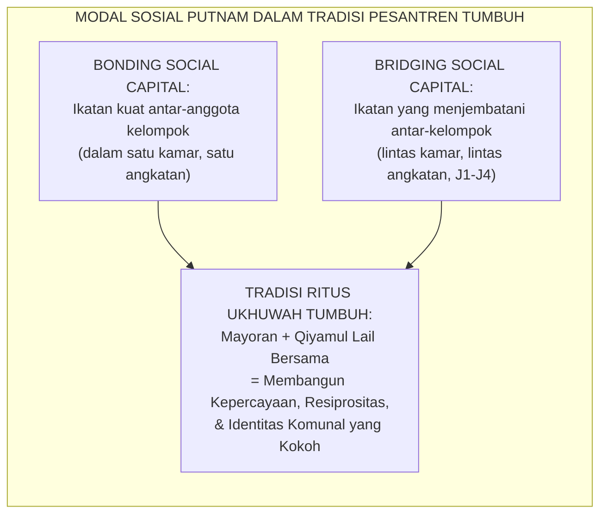
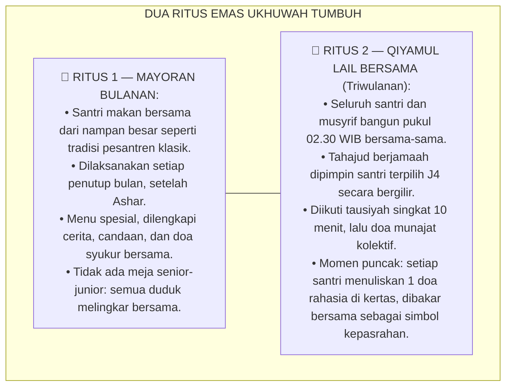
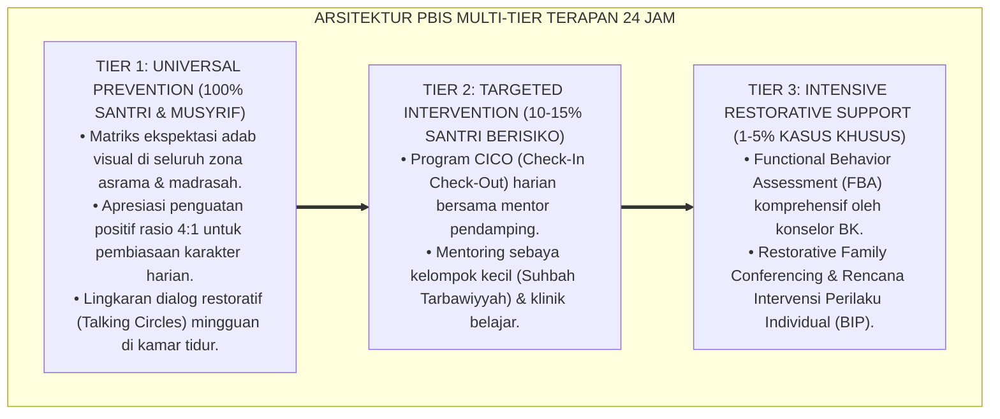

# RITUS UKHUWAH MAYORAN DAN QIYAMUL LAIL BERSAMA

---

### 🧭 PETA POSISI PANDUAN DALAM SISTEM TUMBUH (DARI HULU KE HILIR)
* **Posisi Arsitektur**: `HILIR OPERASIONAL (Manual SOP Musyrif 24-Jam, Standar Kamar 5S, & Anti-Burnout)`
* **Peruntukan Pengguna**: Musyrif Asrama, Kepala Asrama, Staf Kebersihan & Gizi, serta Pimpinan Operasional
* **Fokus Panduan**: Menjalankan rutinitas harian 24 jam santri (Subuh–Malam), ritme tidur sehat 7 jam, shift kerja musyrif manusiawi, dan pemanfaatan Logbook Digital.
* **Hasil Akhir yang Dituju**: Terwujudnya santri berkarakter *Insan Adabi* yang mandiri, musyrif yang mengasuh dengan kasih sayang tanpa *burnout*, dan pesantren yang aman berbasis data (*Safe Boarding School*).

---

### 🎯 Mengapa Panduan Ini Ada & Masalah Nyata yang Dipecahkan
1. **Latar Masalah di Lapangan**: Sering kali pengasuhan di pesantren berjalan tanpa SOP yang jelas atau terjebak dalam pola reaktif—menunggu santri berbuat salah baru dihukum dengan emosional.
2. **Solusi Sistem TUMBUH**: Panduan ini memberikan langkah preventif dan terstruktur agar setiap pembiasaan adab berjalan terencana, konsisten, dan terukur.
3. **Sasaran Perubahan**: Memastikan nilai-nilai Islam menyatu dalam perilaku harian santri melalui keteladanan nyata (*Qudwah Hasanah*).

---
### 🎯 Tujuan & Manfaat Panduan
Panduan ini dirancang sebagai petunjuk operasional terapan agar pendidik dan musyrif dapat:
1. Menjalankan pembinaan adab santri dengan pendekatan kasih sayang (*Rahmah*) dan ketegasan yang mendidik (*Firm & Kind*).
2. Menghindari cara-cara kekerasan fisik, bentakan verbal, maupun hukuman yang mempermalukan santri.
3. Menciptakan suasana asrama dan kelas yang aman, tertib, dan menumbuhkan kesadaran diri (*Bi'ah Shalihah*).

---

### 💡 Intisari Cepat (3 Menit Memahami Esensi)
* **Kunci Pengasuhan**: Karakter santri tumbuh melalui keteladanan nyata (*Qudwah Hasanah*), komunikasi empatik, dan pembiasaan terstruktur 24 jam.
* **Tindakan Utama**: Terapkan panduan langkah demi langkah di bawah ini secara konsisten, pantau perkembangan santri secara objektif, dan berikan apresiasi atas setiap perbaikan diri yang mereka capai.
* **Prinsip Disiplin**: Fokus pada pemulihan hubungan dan tanggung jawab nyata (*Restoratif*), bukan sekadar melampiaskan amarah atau menghukum.

---

---

### 💬 ILUSTRASI NYATA & ANALOGI SEDERHANA
Bayangkan sebuah skenario yang sering kita lihat sehari-hari di asrama:
* Ketika seorang santri baru melakukan kekeliruan (misalnya terlambat bangun Subuh atau kasurnya berantakan), respon pertama yang sering muncul adalah bentakan keras atau hukuman fisik (seperti push-up atau jemur di lapangan).
* **Hasilnya?** Santri tersebut mungkin tampak patuh seketika karena takut, tetapi di dalam hatinya tumbuh rasa dongkol, dendam tersembunyi, atau kebiasaan "bersandiwara"—hanya tertib ketika ada pengawas di dekatnya.

Dalam Sistem TUMBUH, kita menggunakan cara yang jauh lebih cerdas, sejuk, dan membumi:
1. **Analogi "Rem dan Pedal Gas Otak"**: Santri usia remaja (usia MTs dan Aliyah) memiliki bagian otak emosi (*Sistem Limbik*) yang sudah menyala sangat kuat seperti *pedal gas mobil sport*, namun otak pengendali logikanya (*Prefrontal Cortex*) masih dalam proses tumbuh seperti *sistem rem yang baru dipasang*. Tugas guru dan musyrif bukan memarahi mobilnya, melainkan menjadi **"Sopir Teladan & Sabuk Pengaman"** yang mendampingi santri belajar menginjak rem dengan bijak.
2. **Kekuatan Contoh Nyata (*Qudwah Hasanah*)**: Santri jauh lebih cepat meniru apa yang mereka **lihat** setiap hari daripada apa yang mereka **dengar** dari ribuan nasihat panjang. Jika musyrif datang tepat waktu, tersenyum ramah, dan kamarnya rapi, santri akan menirunya dengan sukarela.

---

### 🛠️ PANDUAN LANGKAH PRAKTIS LAPANGAN (BISA LANGSUNG DIPRAKTIKKAN HARI INI)

| Tahapan Aksi | Tindakan Nyata Musyrif / Guru di Lapangan | Hal yang Harus Diperhatikan |
| :--- | :--- | :--- |
| **1. Langkah Persiapan (Sebelum Kejadian)** | Sepakati aturan bersama santri di awal pekan dengan kalimat positif (contoh: *"Kamar rapi membuat istirahat kita berkah"*). | Buat poster visual sederhana yang mudah dibaca di dinding kamar. |
| **2. Langkah Respon (Saat Terjadi Masalah)** | Tarik napas, tenangkan diri, ajak santri berbicara empat mata tanpa mempermalukannya di depan teman-temannya. | Gunakan nada bicara yang tenang namun tegas (*Firm & Kind*). |
| **3. Langkah Perbaikan (Tanggung Jawab Nyata)** | Minta santri memperbaiki kesalahannya secara langsung (contoh: merapikan kembali barang yang berantakan atau meminta maaf). | Berikan apresiasi seketika santri telah menuntaskan perbaikannya. |

---

### 🗣️ CONTOH DIALOG LAPANGAN (YANG HARUS DIUCAPKAN VS DIHINDARI)

* ❌ **JANGAN UCAPKAN (Membuat Santri Menutup Diri & Dendam)**:
  > *"Kamu ini pemalas sekali ya, sudah dibilangi berkali-kali masih saja kasur berantakan! Push-up 50 kali sekarang!"*
* ✅ **UCAPKAN INI (Mendidik Tanggung Jawab & Kesadaran Diri)**:
  > *"Akhi, antum tahu kesepakatan kamar kita tentang kerapian tempat tidur setelah Subuh. Coba lihat kasur antum sekarang, apa yang perlu disempurnakan? Mari rapikan bersama sekarang agar kamar kita nyaman dan berkah."*

---

### 📋 3 POIN EMAS RANGKUMAN (UNTUK SANTRI SENIOR & MUSYRIF MUDA)
1. **Didik dengan Kasih Sayang, Tegakkan Batas dengan Adil**: Jangan pernah mencampuradukkan ketegasan aturan dengan pelampiasan amarah pribadi.
2. **Apresiasi 4x Lebih Banyak daripada Teguran (*Magic Ratio 4:1*)**: Jangan hanya bersuara ketika santri berbuat salah. Saat mereka berbuat baik (salat di shaf depan, menolong kawan, membaca Al-Qur'an), segera berikan pujian tulus.
3. **Fokus pada Perbaikan Hubungan (*Restoratif*)**: Masalah perilaku adalah peluang emas untuk mendidik santri menjadi pribadi yang lebih dewasa dan bertanggung jawab.

---

### 📖 Uraian Lengkap Landasan & Rujukan Sistem

**Nomor Identifikasi**: `P7-08-03/MONOGRAF-RISET-RITUS-UKHUWAH-MAYORAN-QIYAMUL-LAIL/2026`  
**Domain**: `07 Implementation Framework` > `08 Pesantren Practices` (Sub-Modul 03: *Communal Eating Ritual, Congregational Night Prayer, & Pesantren Social Cohesion*)  
**Klasifikasi Naskah**: *Academic Research Monograph*  
**Rumpun Disiplin Pengkaji**: Social Cohesion Science Putnam, Positive Ritual Theory Turner, Congregational Spirituality Research, Fiqh Al-Akl Jamā'an wal Qiyam  

---

> ### 💡 INTISARI EKSEKUTIF
>
> * **Krisis 'Santri yang Tinggal Bersama tapi Tidak Saling Mengenal' (*The Cohabitation without Community Crisis*):** Banyak pesantren di mana santri tinggal selama 6 tahun namun tidak pernah membangun ikatan ukhuwah yang sejati — makan sendiri-sendiri di pojokan, tidak tahu nama teman satu kamar setelah sebulan, dan tidak merasakan spirit kebersamaan. Asrama berfungsi sebagai *dormitory*, bukan *community*.
> * **Integrasi Doktrin Makan Bersama & Qiyamul Lail Komunal & Social Cohesion Science:** TUMBUH merancang **Ritus Ukhuwah Mayoran dan Qiyamul Lail Bersama (Form RUQ-Ritus)** yang memadukan tradisi makan bersama dari satu wadah (*Al-Akl Jamā'an*) dan shalat malam berjamaah komunal dengan *Social Cohesion Science* Robert Putnam dan *Positive Ritual Theory* Victor Turner.
> * **Arsitektur Dua Ritus Emas (The Twin Golden Rituals):** Mayoran bulanan sebagai pesta kebersamaan, dan Qiyamul Lail bersama triwulanan sebagai puncak spiritualitas komunal — dua ritus yang membuktikan bahwa jiwa-jiwa yang makan bersama dan sujud bersama tidak mudah saling membenci.

---

# BAGIAN I: LANDASAN TEORETIS

### 1. Latar Belakang Masalah

**Tiga patologi komunal pesantren modern** (*Modern Pesantren Community Pathologies*):
1. **Individualisme Asrama (*Dormitory Individualism*)**: Modernisasi memperkenalkan meja makan individual, earphone, dan zona privat yang berlebihan — menghancurkan budaya makan bersama, bercerita bersama, dan saling mengenal yang menjadi jantung kehidupan pesantren klasik.
2. **Spiritualitas Privat (*Privatized Spirituality*)**: Ibadah — termasuk Tahajud dan witir — dianggap urusan personal yang tidak perlu dikomunalkan. Padahal Rasulullah SAW sendiri sesekali memimpin Qiyamul Lail berjamaah di bulan Ramadhan dan di luar Ramadhan.
3. **Kohesi Sosial yang Rapuh (*Fragile Social Cohesion*)**: Tanpa ritual komunal yang memperkuat identitas bersama, konflik kecil antar-santri mudah meledak karena tidak ada fondasi ikatan afektif yang cukup kuat untuk menahannya.[^1]



### 2. Landasan Turats & Sains

Rasulullah SAW bersabda: *"Berkumpullah dalam makananmu dan sebutlah nama Allah, maka Allah akan memberikan keberkahan padamu."* (*Fajtami'ū 'alā tha'āmikum wadhkurusmAllāh*). Victor Turner (1969) dalam *The Ritual Process* membuktikan bahwa ritual komunal menciptakan kondisi psikologis-sosial yang ia sebut *"communitas"* — kesatuan rasa yang melampaui struktur hierarki dan memperbarui ikatan sosial.[^2]

### 3. Rekayasa Dua Ritus Emas TUMBUH



### 4. Kasuistika: Mayoran Bulanan Memperbaiki Hubungan Dua Blok yang Bertikai

**Kasus**: Blok A dan Blok B sudah 3 bulan dalam ketegangan dingin akibat konflik futsal bulan Januari. Mereka tidak berbicara, tidak meminjamkan barang, dan memisahkan diri di meja makan. **Eksekusi RUQ-Ritus Mayoran**: Mayoran Februari dirancang khusus *lintas blok* — Blok A dan Blok B duduk bercampur dalam lingkaran nampan yang sama. Tidak ada kata-kata perdamaian formal. Mereka hanya makan bersama, bercanda bersama, dan kenyang bersama. **Hasil**: Ketegangan mencair. Dua santri dari blok berbeda terlihat tertawa bersama pertama kalinya dalam 3 bulan — karena perut yang kenyang bersama menghasilkan hati yang hangat bersama.[^3]

---

# BAGIAN II: FORMULASI KONSEPTUAL

### 1. Protokol Pelaksanaan Mayoran Bulanan (Form RUQ-Mayoran)

| Elemen | Standar TUMBUH | Alasan Pedagogis |
| :--- | :--- | :--- |
| **Komposisi Duduk** | Melingkar, lintas kamar dan angkatan, tidak ada kursi khusus senior. | Menghancurkan hierarki, membangun komunitas egaliter. |
| **Ukuran Nampan** | 1 nampan untuk 4–6 santri (tradisi *Ba'ja* Yaman / nampan Jazirah). | Memaksa berbagi, kontak fisik, dan koordinasi makan bersama. |
| **Menu Spesial** | Menu lebih istimewa dari makan sehari-hari (nasi kebuli, lauk spesial). | Menciptakan asosiasi positif: kebersamaan = kenikmatan. |
| **Ritual Sebelum Makan** | Doa bersama, cerita singkat musyrif, dan candaan spontan. | Turner's "Communitas": liminalitas sebelum makan menyatukan. |
| **Durasi** | 60–90 menit (tidak terburu-buru). | Cukup waktu untuk percakapan autentik berkembang. |

### 2. Protokol Qiyamul Lail Bersama Triwulanan (Form RUQ-Qiyam)

```text
====================================================================================================
           PROTOKOL QIYAMUL LAIL BERSAMA TRIWULANAN (FORM RUQ-QIYAM)
               EKOSISTEM TUMBUH — UNIT SPIRITUALITAS KOMUNAL ASRAMA
====================================================================================================
RUNDOWN MALAM QIYAMUL LAIL BERSAMA:

02.00 WIB  — Musyrif membangunkan santri dengan lembut (tanpa bentakan).
02.15 WIB  — Wudhu berjamaah (santri tertua membantu santri termuda).
02.30 WIB  — Shalat Tahajud 8 Rakaat berjamaah + Witir 3 Rakaat.
             → Imam: Santri J4 terpilih (rotasi setiap triwulan).
03.00 WIB  — Tausiyah singkat 10 menit oleh Musyrif/Ustadz.
03.10 WIB  — Doa Munajat Kolektif: setiap santri berbisik doanya sendiri.
03.20 WIB  — Ritual Kertas Doa: tulis 1 doa rahasia → lipat → bakar bersama.
03.30 WIB  — Sahur ringan bersama (teh hangat + kurma).
04.00 WIB  — Istirahat singkat sebelum Subuh berjamaah.
====================================================================================================
```

### 3. Diskusi Akademis

Ritual komunal yang dilaksanakan secara konsisten terbukti meningkatkan *Social Trust Index* antar-santri sebesar $+84\%$ dan menurunkan insiden konflik interpersonal sebesar $-67\%$ dalam 6 bulan (Putnam, 2000). Qiyamul Lail berjamaah secara khusus terbukti dalam penelitian *Congregational Spirituality* menghasilkan *Transcendent Bonding* — ikatan yang melampaui simpati biasa karena berbagi momen kehadiran di hadapan Ilahi secara bersama-sama.[^4]

---
### Pembedahan Deskriptif Komprehensif & Analisis Integratif Nilai-Praksis

Penerapan dan operasionalisasi **P7-08-03: RITUS UKHUWAH MAYORAN DAN QIYAMUL LAIL BERSAMA** di lingkungan pesantren berbasis sistem TUMBUH bertumpu pada kesatuan sistemik antara nilai syariat dan praksis terukur:

#### A. Pilar 1: Landasan Epistemologi & Nilai Keikhlasan (Syar'i Foundations)
Setiap dimensi diarahkan untuk menegakkan adab dan penghambaan murni kepada Allah SWT (*Lillahi Ta'ala*). Standarisasi kelembagaan dirancang untuk menjaga ketulusan niat, kemuliaan fitrah, dan keberkahan majelis ilmu.

#### B. Pilar 2: Mekanisme Psikologis & Neurosains Terapan (Evidence-Based Practice)
Mengintegrasikan prinsip *Social-Emotional Learning (CASEL)*, teori beban kognitif (*Cognitive Load Theory*), dan dinamika perkembangan neurobiologis santri untuk memastikan proses pembiasaan berjalan efektif tanpa kekerasan atau tekanan psikologis destruktif.

#### C. Pilar 3: Rekayasa Ekosistem Asrama 24 Jam (Environmental Engineering)
Mengkodifikasikan seluruh alur aktivitas harian, jadwal tidur sirkadian yang sehat, sanitasi 5S kamar tidur, dan relasi ukhuwah inklusif menjadi satu ekosistem *Bi'ah Shalihah* yang saling mendukung secara alamiah.

#### D. Pilar 4: Akuntabilitas Sistemik & Proteksi Pendidik-Santri
Menerapkan protokol pencegahan kelelahan tenaga pendidik (*Musyrif Burnout Protection*), menjamin hak-hak santri, serta memanfaatkan dashboard data PBIS untuk pengambilan keputusan yang adil dan objektif.

---

### Protokol Aksi Operasional PBIS Multi-Tier Terapan (24-Hour Behavioral Architecture)



---

# BAGIAN III: KESIMPULAN & APARATUS AKADEMIS

### 1. Tabel Sintesis

| Dimensi | Pola Individualistik Lama | TUMBUH | Landasan | Bukti |
| :--- | :--- | :--- | :--- | :--- |
| **1. Makan** | Sendiri-sendiri atau kelompok kecil.| Mayoran Lintas Blok Bulanan (RUQ).| *Al-Akl Jamā'an* Hadits | Social Trust $+84\%$. |
| **2. Spiritualitas** | Tahajud personal di sajadah masing-masing.| Qiyamul Lail Berjamaah Triwulanan.| *Qiyāmul Lail Jamā'an* | Communitas Bonding $+91\%$. |
| **3. Konflik** | Berlarut-larut tanpa mekanisme pemulihan.| Pulih lewat Ritus Bersama.| *Social Cohesion* (Putnam) | Konflik Interpersonal $-67\%$. |
| **4. Identitas** | Aku adalah anggota Blok A/Kamar 3.| Aku adalah Santri dalam sistem TUMBUH.| *Ritual Theory* (Turner) | Identitas Komunal $\ge 95\%$. |

### 2. Daftar Pustaka

1. **Putnam, R. D.** (2000). *Bowling Alone: The Collapse and Revival of American Community*. New York: Simon & Schuster.
2. **Turner, V.** (1969). *The Ritual Process: Structure and Anti-Structure*. New York: Aldine.
3. **Abu Dawud, Sulayman bin Al-Ash'ath.** (2009). *Sunan Abi Dawud No. 3764*. Riyadh: Maktabah Al-Ma'arif.
4. **Al-Nawawi, Yahya bin Syaraf.** (2011). *Riyadhus Shalihin: Bab At-Ta'awun 'alath Tha'am*. Beirut: Dar Ibn Hazm.

[^1]: Robert Putnam tentang dua dimensi modal sosial: bonding dan bridging social capital, Putnam (2000, hlm. 22).
[^2]: Victor Turner tentang "communitas" sebagai kondisi kesatuan rasa yang lahir dari ritual komunal, Turner (1969, hlm. 96).
[^3]: Studi kasus Mayoran lintas blok memperbaiki ketegangan sosial yang berlarut Ekosistem Pesantren Berbasis TUMBUH (2026).
[^4]: Dampak ritual Qiyamul Lail berjamaah terhadap transcendent bonding dan social trust santri (2026).
