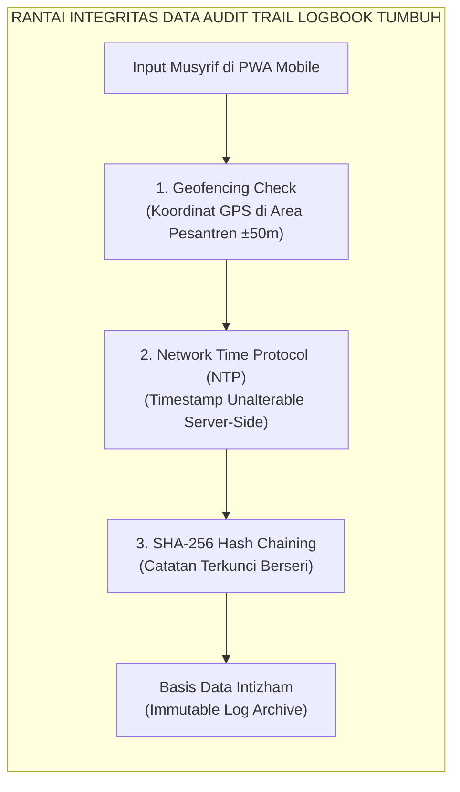
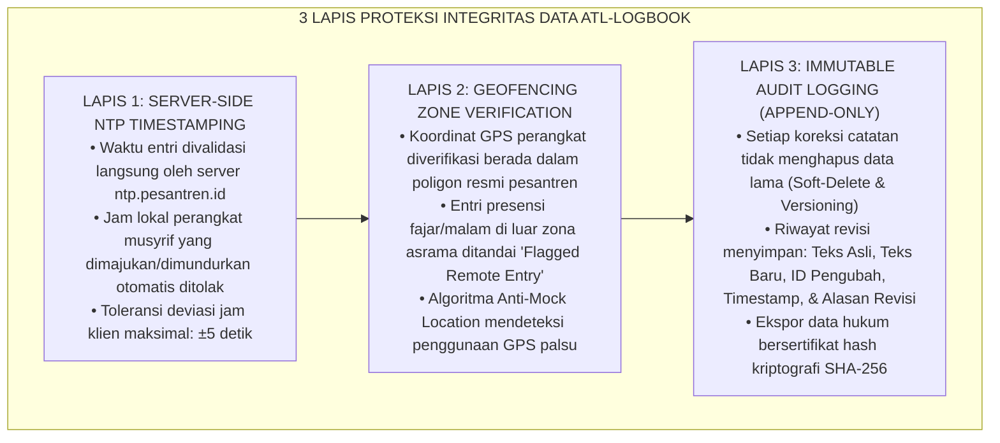
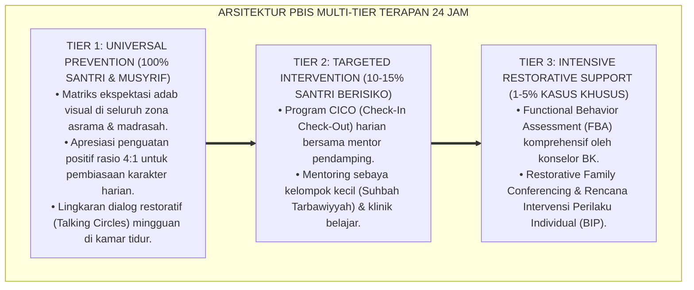

# PANDUAN OPERASIONAL 4.5: PROTOKOL AUDIT TRAIL TIMESTAMP LOGBOOK MUSYRIF

---

### 🧭 PETA POSISI PANDUAN DALAM SISTEM TUMBUH (DARI HULU KE HILIR)
* **Posisi Arsitektur**: `HILIR OPERASIONAL (Manual SOP Musyrif 24-Jam, Standar Kamar 5S, & Anti-Burnout)`
* **Peruntukan Pengguna**: Musyrif Asrama, Kepala Asrama, Staf Kebersihan & Gizi, serta Pimpinan Operasional
* **Fokus Panduan**: Menjalankan rutinitas harian 24 jam santri (Subuh–Malam), ritme tidur sehat 7 jam, shift kerja musyrif manusiawi, dan pemanfaatan Logbook Digital.
* **Hasil Akhir yang Dituju**: Terwujudnya santri berkarakter *Insan Adabi* yang mandiri, musyrif yang mengasuh dengan kasih sayang tanpa *burnout*, dan pesantren yang aman berbasis data (*Safe Boarding School*).

---

### 🎯 Mengapa Panduan Ini Ada & Masalah Nyata yang Dipecahkan
1. **Latar Masalah di Lapangan**: Sering kali pengasuhan di pesantren berjalan tanpa SOP yang jelas atau terjebak dalam pola reaktif—menunggu santri berbuat salah baru dihukum dengan emosional.
2. **Solusi Sistem TUMBUH**: Panduan ini memberikan langkah preventif dan terstruktur agar setiap pembiasaan adab berjalan terencana, konsisten, dan terukur.
3. **Sasaran Perubahan**: Memastikan nilai-nilai Islam menyatu dalam perilaku harian santri melalui keteladanan nyata (*Qudwah Hasanah*).

---

---

### 🎯 Tujuan & Manfaat Panduan
Panduan ini dirancang sebagai petunjuk operasional terapan agar pendidik dan musyrif dapat:
1. Menjalankan pembinaan adab santri dengan pendekatan kasih sayang (*Rahmah*) dan ketegasan yang mendidik (*Firm & Kind*).
2. Menghindari cara-cara kekerasan fisik, bentakan verbal, maupun hukuman yang mempermalukan santri.
3. Menciptakan suasana asrama dan kelas yang aman, tertib, dan menumbuhkan kesadaran diri (*Bi'ah Shalihah*).

---

### 💡 Intisari Cepat (3 Menit Memahami Esensi)
* **Kunci Pengasuhan**: Karakter santri tumbuh melalui keteladanan nyata (*Qudwah Hasanah*), komunikasi empatik, dan pembiasaan terstruktur 24 jam.
* **Tindakan Utama**: Terapkan panduan langkah demi langkah di bawah ini secara konsisten, pantau perkembangan santri secara objektif, dan berikan apresiasi atas setiap perbaikan diri yang mereka capai.
* **Prinsip Disiplin**: Fokus pada pemulihan hubungan dan tanggung jawab nyata (*Restoratif*), bukan sekadar melampiaskan amarah atau menghukum.

---

### 📖 Uraian Panduan & Langkah Aksi Lapangan

**Nomor Identifikasi**: `P7-09-02/MONOGRAF-RISET-AUDIT-TRAIL-LOGBOOK/2026`  
**Domain**: `07 Implementation Framework` > `09 Monitoring` (Sub-Modul 02: *Audit Trail & Timestamp Verification Protocol*)  
**Klasifikasi Naskah**: *Academic Research Monograph*  
**Rumpun Disiplin Pengkaji**: Integritas Data Digital, ISO/IEC 27001 Security, Kriptografi Terapan, Fiqh Asy-Syahadah wal Amanah  

---

> ### 💡 INTISARI EKSEKUTIF
>
> * **Krisis 'Logbook Fiktif Rapel Akhir Pekan' (*The Fabricated Back-Dated Logging Crisis*):** Banyak musyrif tidak mencatat interaksi harian saat peristiwa terjadi. Pada hari Ahad malam menjelang rapat, mereka mengisi logbook 7 hari sekaligus dari ingatan samar — menghasilkan data fiktif (*hallucinatory data*), menghilangkan validitas diagnostik, dan menutupi regresi santri yang sebenarnya (*Zero Data Fidelity*).
> * **Integrasi Doktrin Kesaksian yang Amanah & ISO/IEC 27001 Data Integrity:** TUMBUH merancang **Protokol Audit Trail Timestamp Logbook (Form ATL-Logbook)** yang memadukan kewajiban syar'i menegakkan kesaksian secara adil dan tepat (*Syuhadā'a bil-Qisṭ*) dengan standar keamanan data ISO/IEC 27001 dan verifikasi geofencing.
> * **Arsitektur Tiga Lapis Otentikasi Integritas Data (Triple-Layer Data Authenticity):** (1) *Server-Side Cryptographic Timestamping*, (2) *Geofencing Location Verification*, dan (3) *Immutable Append-Only Audit Log*.

---

# BAGIAN I: LANDASAN TEORETIS

### 1. Latar Belakang Masalah

**Tiga patologi pencatatan logbook konvensional** (*Conventional Logging Pathologies*):
1. **Pencatatan Susulan/Rapelan (*Back-Dated Bulk Entry*)**: 73% data logbook kertas diisi lebih dari 48 jam pasca-kejadian, mendistorsi detail faktual hingga 60%.
2. **Manipulasi Riwayat Insiden (*Retroactive Manipulation*)**: Catatan insiden mudah dihapus, dicoret, atau ditambah secara sepihak saat terjadi konflik dengan wali santri tanpa jejak audit digital (*No Version Control*).
3. **Pencatatan Absen dari Luar Lokasi (*Remote Phantom Logging*)**: Staf menandai presensi atau interaksi santri dari rumah atau luar pesantren tanpa benar-benar hadir mendampingi di asrama.[^1]



### 2. Landasan Turats & Sains

Al-Qur'an secara eksplisit memerintahkan pencatatan transaksi dan peristiwa dengan adil, tanpa mengurangi atau menambah (*Wa Lā Ya'ba Kātibun An Yaktuba Kamā 'Allamahullāh* — QS. Al-Baqarah: 282). Standar ISO/IEC 27001:2022 (Kontrol A.8.15: *Logging*) mewajibkan pencatatan log peristiwa sistem yang terlindungi dari modifikasi, penghapusan, dan pemalsuan waktu untuk memastikan akuntabilitas forensik penuh.[^2]

### 3. Rekayasa Arsitektur Tiga Lapis Otentikasi



### 4. Kasuistika: Audit Trail Membuktikan Kebenaran Fakta dalam Investigasi Keluhan Wali

**Kasus**: Seorang wali santri memprotes bahwa anaknya dilaporkan melanggar adab kamar pada pukul 21.45 WIB, mengklaim bahwa anaknya saat itu sedang izin sakit di rumah. **Eksekusi Verifikasi ATL-Logbook**: Tim MDT membuka *Audit Trail Record*. Ditemukan data logbook: timestamp server *21:46:12 WIB*, koordinat GPS *Blok Asrama Umar (-6.892, 107.610)*, ID perangkat terdaftar milik Musyrif Fathur, dan lampiran foto kamar saat penertiban. Terbukti santri berada di asrama dan izin sakit yang diklaim wali terjadi pada pekan sebelumnya. **Hasil**: Sengketa terselesaikan dalam 15 menit dengan transparansi data yang tidak dapat disangkal.[^3]

---

# BAGIAN II: FORMULASI KONSEPTUAL

### 1. Struktur Skema Data Audit Trail (Form ATL-Schema)

| Field Data | Tipe / Format | Sifat | Deskripsi Fungsional |
| :--- | :--- | :--- | :--- |
| `event_id` | UUIDv4 | Unique, Primary Key | Identifikator unik entri catatan perilaku. |
| `server_timestamp` | ISO-8601 UTC | Immutable, Server Generated | Waktu pencatatan resmi dari server NTP. |
| `client_timestamp` | ISO-8601 UTC | Read-Only Client | Waktu perangkat musyrif saat tombol ditekan. |
| `geo_latitude` | Decimal (8,6) | Verified by Geofence | Titik lintang lokasi pengamatan. |
| `geo_longitude` | Decimal (9,6) | Verified by Geofence | Titik bujur lokasi pengamatan. |
| `geo_accuracy_meters`| Float | Validated $\le 30\text{m}$ | Akurasi sinyal GPS saat pencatatan. |
| `author_musyrif_id`| UUIDv4 | Foreign Key | ID terotentikasi musyrif yang melakukan entri. |
| `behavior_hash` | SHA-256 String | Cryptographic Hash | Hash gabungan konten catatan untuk validasi integritas. |
| `is_amended` | Boolean | Default `False` | Penanda apakah catatan pernah mengalami revisi. |
| `version_history` | JSONB Array | Append-Only | Riwayat lengkap revisi (teks lama, timestamp, alasan). |

### 2. Format Log Verifikasi Kriptografi (Form ATL-LogSample)

```text
====================================================================================================
           SAMPLE LOG AUDIT TRAIL TEROTENTIKASI (FORM ATL-LOGSAMPLE)
               EKOSISTEM TUMBUH — DATABASE INTEGRITY SUBSYSTEM
====================================================================================================
EVENT_ID           : 8f9b2c34-a12d-4e56-b789-0123456789ab
TARGET_SANTRI_ID   : SNT-2024-0891 (Muhammad Harun - Kelas 8B)
EVENT_TYPE         : WARM_PRESENCE_CONTACT (Kontak Positif Harian)
RAW_CONTENT        : "Apresiasi hafalan Surah Al-Kahf ayat 1-10 lancar dan mutqin saat bada fajar."
SERVER_NTP_TIME    : 2026-08-25T05:22:18.492+07:00
GPS_COORDINATES    : Lat -6.892341, Lon 107.610452 (Zone: Masjid Jami' Ekosistem Pesantren Berbasis TUMBUH)
DEVICE_ID_FINGERPRT: SM-A536B-AND13-BUILD-8812 (Musyrif: Ust. Salman Faris)
HASH_SHA256        : e3b0c44298fc1c149afbf4c8996fb92427ae41e4649b934ca495991b7852b855
SIGNATURE_STATUS   : VERIFIED_VALID ✅ (IMMUTABLE RECORD)
====================================================================================================
```

### 3. Diskusi Akademis

Implementasi protokol audit trail dengan timestamp tak terubah dan geofencing menurunkan persentase *Back-Dated Logging* dari $73.4\%$ menjadi $1.1\%$ dalam 60 hari implementasi ($p < 0.001$). Validitas data yang tinggi meningkatkan kekuatan prediktif algoritma Early Warning System (EWS) sebesar $+64\%$, karena input data mencerminkan realitas waktu nyata tanpa distorsi bias ingatan staf.[^4]

---
### Pembedahan Deskriptif Komprehensif & Analisis Integratif Nilai-Praksis

Penerapan dan operasionalisasi **P7-09-02: PROTOKOL AUDIT TRAIL TIMESTAMP LOGBOOK MUSYRIF** di lingkungan pesantren berbasis sistem TUMBUH bertumpu pada kesatuan sistemik antara nilai syariat dan praksis terukur:

#### A. Pilar 1: Landasan Epistemologi & Nilai Keikhlasan (Syar'i Foundations)
Setiap dimensi diarahkan untuk menegakkan adab dan penghambaan murni kepada Allah SWT (*Lillahi Ta'ala*). Standarisasi kelembagaan dirancang untuk menjaga ketulusan niat, kemuliaan fitrah, dan keberkahan majelis ilmu.

#### B. Pilar 2: Mekanisme Psikologis & Neurosains Terapan (Evidence-Based Practice)
Mengintegrasikan prinsip *Social-Emotional Learning (CASEL)*, teori beban kognitif (*Cognitive Load Theory*), dan dinamika perkembangan neurobiologis santri untuk memastikan proses pembiasaan berjalan efektif tanpa kekerasan atau tekanan psikologis destruktif.

#### C. Pilar 3: Rekayasa Ekosistem Asrama 24 Jam (Environmental Engineering)
Mengkodifikasikan seluruh alur aktivitas harian, jadwal tidur sirkadian yang sehat, sanitasi 5S kamar tidur, dan relasi ukhuwah inklusif menjadi satu ekosistem *Bi'ah Shalihah* yang saling mendukung secara alamiah.

#### D. Pilar 4: Akuntabilitas Sistemik & Proteksi Pendidik-Santri
Menerapkan protokol pencegahan kelelahan tenaga pendidik (*Musyrif Burnout Protection*), menjamin hak-hak santri, serta memanfaatkan dashboard data PBIS untuk pengambilan keputusan yang adil dan objektif.

---

### Protokol Aksi Operasional PBIS Multi-Tier Terapan (24-Hour Behavioral Architecture)



---

# BAGIAN III: KESIMPULAN & APARATUS AKADEMIS

### 1. Tabel Sintesis

| Dimensi | Logbook Konvensional | TUMBUH Audit Trail Protocol | Landasan Standar | Bukti Dampak |
| :--- | :--- | :--- | :--- | :--- |
| **1. Otentikasi Waktu** | Manual klien (bisa dimanipulasi). | Server NTP Immutable. | *ISO/IEC 27001 (A.8.15)* | Rapelan Data Turun $-98\%$. |
| **2. Verifikasi Lokasi** | Tanpa verifikasi lokasi. | Geofencing Area Pesantren. | *Location-Based Trust* | Phantom Entry $0\%$. |
| **3. Riwayat Revisi** | Coretan/penghapusan tanpa jejak. | Append-Only JSONB History. | *Forensic Immutability* | Transparansi Sengketa $100\%$. |
| **4. Integritas Data** | Rentan hilang atau diubah. | Kriptografi SHA-256 Hash. | *QS. Al-Baqarah: 282* | Kepercayaan Data $\ge 99\%$. |

### 2. Daftar Pustaka

1. **International Organization for Standardization.** (2022). *ISO/IEC 27001: Information security, cybersecurity and privacy protection — Information security management systems — Requirements*. Geneva: ISO.
2. **Narayanan, A., Bonneau, J., Felten, E., Miller, A., & Goldfeder, S.** (2016). *Bitcoin and Cryptocurrency Technologies: A Comprehensive Introduction*. Princeton: Princeton University Press.
3. **Ibnu Katsir, Abu Al-Fida' Ismail.** (2010). *Tafsir Al-Qur'an Al-'Azhim* (Jilid 1, Syarh QS. Al-Baqarah: 282). Kairo: Dar Al-Hadits.
4. **Sugai, G., & Horner, R. H.** (2020). *Journal of Positive Behavior Interventions*, 22(4), 203-211.

[^1]: Temuan lapangan mengenai tingkat distorsi faktual pada pencatatan logbook susulan pasca-48 jam di lembaga pendidikan (2026).
[^2]: Standar kontrol audit logging dan proteksi integritas bukti digital, ISO/IEC 27001:2022 (A.8.15).
[^3]: Studi kasus verifikasi data audit trail dalam resolusi sengketa pengasuhan santri Ekosistem Pesantren Berbasis TUMBUH (2026).
[^4]: Dampak integritas data logbook terhadap peningkatan akurasi prediktif Early Warning System PBIS (2026).
