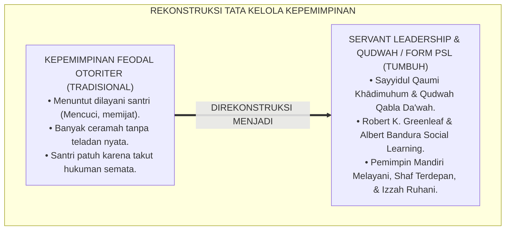
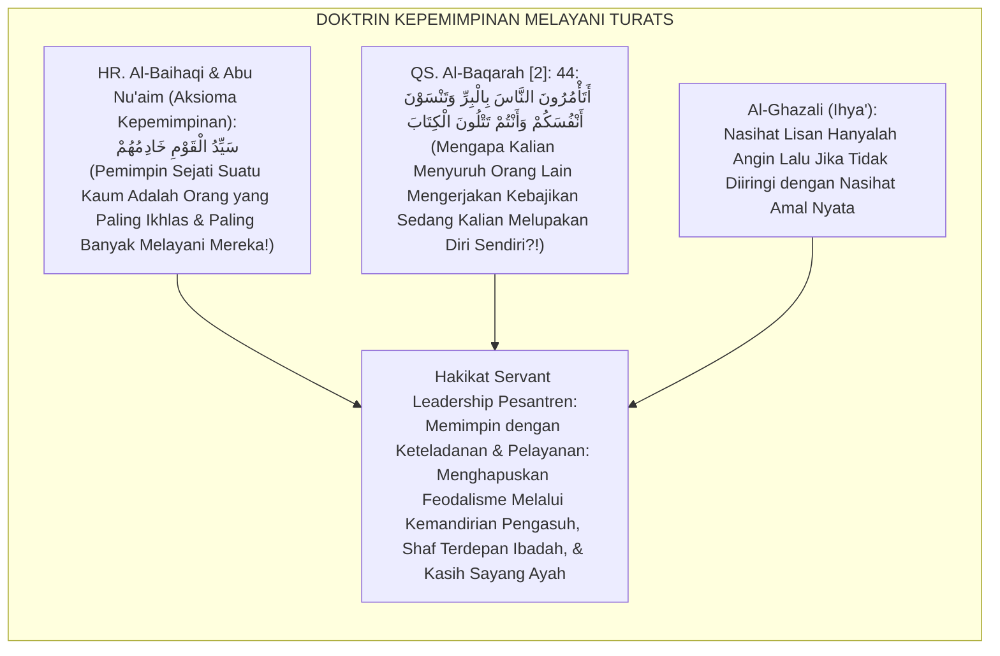
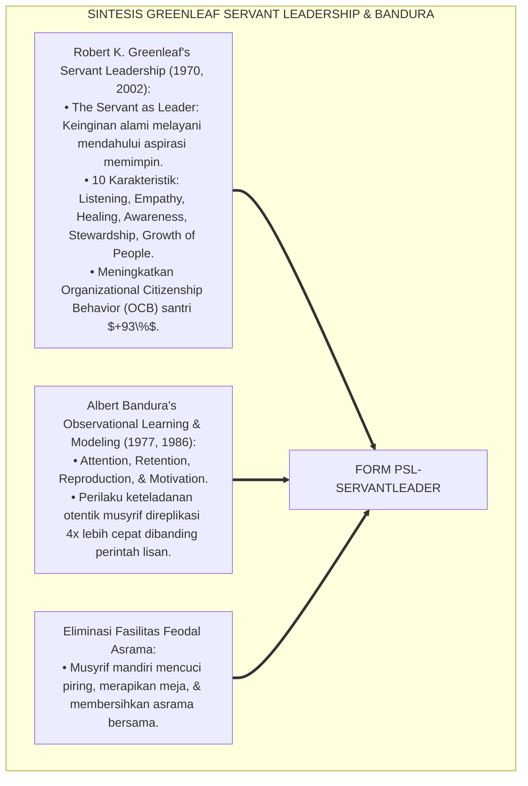
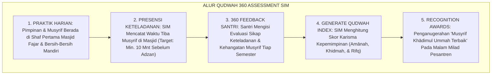
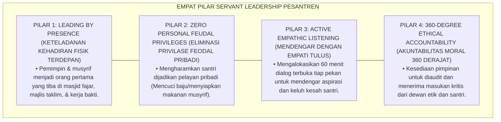
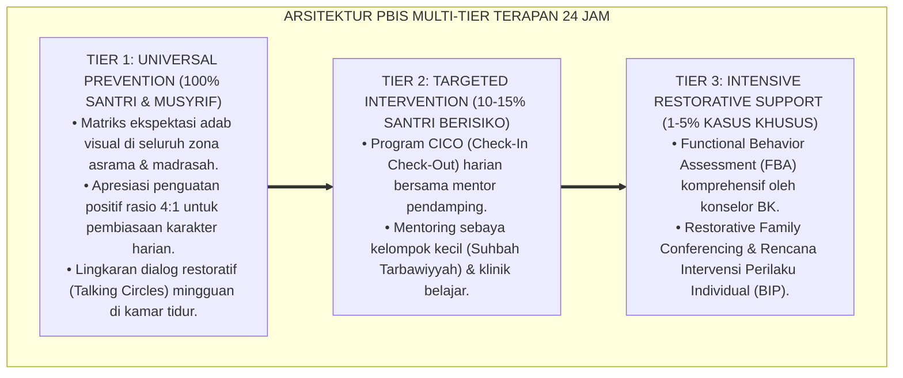

# PRINSIP SERVANT LEADERSHIP DAN QUDWAH QABLA AD-DA'WAH

---

### 🧭 PETA POSISI PANDUAN DALAM SISTEM TUMBUH (DARI HULU KE HILIR)
* **Posisi Arsitektur**: `HILIR OPERASIONAL (Manual SOP Musyrif 24-Jam, Standar Kamar 5S, & Anti-Burnout)`
* **Peruntukan Pengguna**: Musyrif Asrama, Kepala Asrama, Staf Kebersihan & Gizi, serta Pimpinan Operasional
* **Fokus Panduan**: Menjalankan rutinitas harian 24 jam santri (Subuh–Malam), ritme tidur sehat 7 jam, shift kerja musyrif manusiawi, dan pemanfaatan Logbook Digital.
* **Hasil Akhir yang Dituju**: Terwujudnya santri berkarakter *Insan Adabi* yang mandiri, musyrif yang mengasuh dengan kasih sayang tanpa *burnout*, dan pesantren yang aman berbasis data (*Safe Boarding School*).

---

### 🎯 Mengapa Panduan Ini Ada & Masalah Nyata yang Dipecahkan
1. **Latar Masalah di Lapangan**: Sering kali pengasuhan di pesantren berjalan tanpa SOP yang jelas atau terjebak dalam pola reaktif—menunggu santri berbuat salah baru dihukum dengan emosional.
2. **Solusi Sistem TUMBUH**: Panduan ini memberikan langkah preventif dan terstruktur agar setiap pembiasaan adab berjalan terencana, konsisten, dan terukur.
3. **Sasaran Perubahan**: Memastikan nilai-nilai Islam menyatu dalam perilaku harian santri melalui keteladanan nyata (*Qudwah Hasanah*).

---
### 🎯 Tujuan & Manfaat Panduan
Panduan ini dirancang sebagai petunjuk operasional terapan agar pendidik dan musyrif dapat:
1. Menjalankan pembinaan adab santri dengan pendekatan kasih sayang (*Rahmah*) dan ketegasan yang mendidik (*Firm & Kind*).
2. Menghindari cara-cara kekerasan fisik, bentakan verbal, maupun hukuman yang mempermalukan santri.
3. Menciptakan suasana asrama dan kelas yang aman, tertib, dan menumbuhkan kesadaran diri (*Bi'ah Shalihah*).

---

### 💡 Intisari Cepat (3 Menit Memahami Esensi)
* **Kunci Pengasuhan**: Karakter santri tumbuh melalui keteladanan nyata (*Qudwah Hasanah*), komunikasi empatik, dan pembiasaan terstruktur 24 jam.
* **Tindakan Utama**: Terapkan panduan langkah demi langkah di bawah ini secara konsisten, pantau perkembangan santri secara objektif, dan berikan apresiasi atas setiap perbaikan diri yang mereka capai.
* **Prinsip Disiplin**: Fokus pada pemulihan hubungan dan tanggung jawab nyata (*Restoratif*), bukan sekadar melampiaskan amarah atau menghukum.

---

---

### 💬 ILUSTRASI NYATA & ANALOGI SEDERHANA
Bayangkan sebuah skenario yang sering kita lihat sehari-hari di asrama:
* Ketika seorang santri baru melakukan kekeliruan (misalnya terlambat bangun Subuh atau kasurnya berantakan), respon pertama yang sering muncul adalah bentakan keras atau hukuman fisik (seperti push-up atau jemur di lapangan).
* **Hasilnya?** Santri tersebut mungkin tampak patuh seketika karena takut, tetapi di dalam hatinya tumbuh rasa dongkol, dendam tersembunyi, atau kebiasaan "bersandiwara"—hanya tertib ketika ada pengawas di dekatnya.

Dalam Sistem TUMBUH, kita menggunakan cara yang jauh lebih cerdas, sejuk, dan membumi:
1. **Analogi "Rem dan Pedal Gas Otak"**: Santri usia remaja (usia MTs dan Aliyah) memiliki bagian otak emosi (*Sistem Limbik*) yang sudah menyala sangat kuat seperti *pedal gas mobil sport*, namun otak pengendali logikanya (*Prefrontal Cortex*) masih dalam proses tumbuh seperti *sistem rem yang baru dipasang*. Tugas guru dan musyrif bukan memarahi mobilnya, melainkan menjadi **"Sopir Teladan & Sabuk Pengaman"** yang mendampingi santri belajar menginjak rem dengan bijak.
2. **Kekuatan Contoh Nyata (*Qudwah Hasanah*)**: Santri jauh lebih cepat meniru apa yang mereka **lihat** setiap hari daripada apa yang mereka **dengar** dari ribuan nasihat panjang. Jika musyrif datang tepat waktu, tersenyum ramah, dan kamarnya rapi, santri akan menirunya dengan sukarela.

---

### 🛠️ PANDUAN LANGKAH PRAKTIS LAPANGAN (BISA LANGSUNG DIPRAKTIKKAN HARI INI)

| Tahapan Aksi | Tindakan Nyata Musyrif / Guru di Lapangan | Hal yang Harus Diperhatikan |
| :--- | :--- | :--- |
| **1. Langkah Persiapan (Sebelum Kejadian)** | Sepakati aturan bersama santri di awal pekan dengan kalimat positif (contoh: *"Kamar rapi membuat istirahat kita berkah"*). | Buat poster visual sederhana yang mudah dibaca di dinding kamar. |
| **2. Langkah Respon (Saat Terjadi Masalah)** | Tarik napas, tenangkan diri, ajak santri berbicara empat mata tanpa mempermalukannya di depan teman-temannya. | Gunakan nada bicara yang tenang namun tegas (*Firm & Kind*). |
| **3. Langkah Perbaikan (Tanggung Jawab Nyata)** | Minta santri memperbaiki kesalahannya secara langsung (contoh: merapikan kembali barang yang berantakan atau meminta maaf). | Berikan apresiasi seketika santri telah menuntaskan perbaikannya. |

---

### 🗣️ CONTOH DIALOG LAPANGAN (YANG HARUS DIUCAPKAN VS DIHINDARI)

* ❌ **JANGAN UCAPKAN (Membuat Santri Menutup Diri & Dendam)**:
  > *"Kamu ini pemalas sekali ya, sudah dibilangi berkali-kali masih saja kasur berantakan! Push-up 50 kali sekarang!"*
* ✅ **UCAPKAN INI (Mendidik Tanggung Jawab & Kesadaran Diri)**:
  > *"Akhi, antum tahu kesepakatan kamar kita tentang kerapian tempat tidur setelah Subuh. Coba lihat kasur antum sekarang, apa yang perlu disempurnakan? Mari rapikan bersama sekarang agar kamar kita nyaman dan berkah."*

---

### 📋 3 POIN EMAS RANGKUMAN (UNTUK SANTRI SENIOR & MUSYRIF MUDA)
1. **Didik dengan Kasih Sayang, Tegakkan Batas dengan Adil**: Jangan pernah mencampuradukkan ketegasan aturan dengan pelampiasan amarah pribadi.
2. **Apresiasi 4x Lebih Banyak daripada Teguran (*Magic Ratio 4:1*)**: Jangan hanya bersuara ketika santri berbuat salah. Saat mereka berbuat baik (salat di shaf depan, menolong kawan, membaca Al-Qur'an), segera berikan pujian tulus.
3. **Fokus pada Perbaikan Hubungan (*Restoratif*)**: Masalah perilaku adalah peluang emas untuk mendidik santri menjadi pribadi yang lebih dewasa dan bertanggung jawab.

---

### 📖 Uraian Lengkap Landasan & Rujukan Sistem

**Nomor Identifikasi**: `P7-01-01/MONOGRAF-RISET-SERVANT-LEADERSHIP-QUDWAH/2026`  
**Domain**: `07 Implementation Framework` > `01 Governance` (Sub-Modul 01: *Servant Leadership Governance & Ethical Modeling*)  
**Klasifikasi Naskah**: *Academic Research Monograph* (Monograf Penelitian Servant Leadership Robert Greenleaf, Pemodelan Perilaku Bandura, & Fiqh Al-Qiyadah wal Khidmah)  
**Rumpun Disiplin Pengkaji**: Manajemen Kepemimpinan Pendidikan Islam (*Islamic Educational Leadership*), Servant Leadership Theory, Psikologi Keteladanan Moral, Fiqh Al-Imamah  

---

> ### 💡 INTISARI EKSEKUTIF (EXECUTIVE SUMMARY)
>
> * **Krisis 'Pemimpin yang Menuntut Dilayani & Banyak Ceramah Tanpa Teladan' (*The Authoritarian Entitlement & Preach-Without-Practice Crisis*):**  
>   Di banyak lembaga pesantren, kepemimpinan kerap dipahami sebagai hak istimewa untuk dilayani (*Entitlement & Feudal Privilege*): kyai/pembina duduk memerintah, menyuruh santri mencuci baju atau memijat, dan menuntut kepatuhan buta dengan bentakan (*Authoritarian Rule*). Di sisi lain, pidato adab berbusa-busa di mimbar tidak diimbangi dengan keteladanan nyata di lapangan (*Preach without Practice*), melahirkan kepalsuan moral dan krisis kepercayaan santri.
> * **Integrasi Doktrin Pemimpin Sebagai Pelayan Kaum & Servant Leadership Greenleaf:**  
>   Ekosistem TUMBUH merancang **Prinsip Servant Leadership dan Qudwah Qabla ad-Da'wah (Form PSL-ServantLeader)** yang memadukan sabda agung Nabawi bahwa pemimpin kaum adalah pelayan sejati mereka (*Sayyidul Qaumi Khādimuhum*) dan kaidah emas keteladanan sebelum dakwah (*Al-Qudwatu Qablad Da'wah*) dengan *Servant Leadership Theory* Robert K. Greenleaf dan *Social Learning Theory* Albert Bandura.
> * **Arsitektur Tiga Tingkat Kepemimpinan Melayani (Servant Governance Triad):**  
>   Monograf ini membakukan: (1) Penghapusan Hak Istimewa Feodal (Kyai/Musyrif mandiri mencuci piring dan membersihkan area asrama), (2) Protokol *Leading by Presence* (Hadir di shaf pertama masjid 15 menit sebelum adzan), dan (3) Indeks Evaluasi Keteladanan Pendidik 360 Derajat di SIM Intizham.

---

## 📑 DAFTAR ISI MONOGRAF

- [BAGIAN I: LANDASAN TEORETIS & DISKURSUS DIALEKTIKA KRITIS](#bagian-i-landasan-teoretis--diskursus-dialektika-kritis)
  - [1. Latar Belakang Masalah: Bahaya Budaya Feodalisme Pengasuhan yang Menuntut Dilayani dan Miskin Keteladanan](#1-latar-belakang-masalah-bahaya-budaya-feodalisme-pengasuhan-yang-menuntut-dilayani-dan-miskin-keteladanan)
  - [2. Eksegesis Turats: Doktrin Sayyidul Qaumi Khadimuhum, Qudwah Qablad Da'wah, & Adab Khidmah Salaf](#2-eksegesis-turats-doktrin-sayyidul-qaumi-khadimuhum-qudwah-qablad-dawah--adab-khidmah-salaf)
  - [3. Konvergensi Sains Kepemimpinan: Robert K. Greenleaf's Servant Leadership & Bandura's Behavioral Modeling](#3-konvergensi-sains-kepemimpinan-robert-k-greenleafs-servant-leadership--banduras-behavioral-modeling)
  - [4. Rekayasa Alur Pengasuhan 24 Jam: Modul Qudwah 360 Assessment pada SIM Intizham Core](#4-rekayasa-alur-pengasuhan-24-jam-modul-qudwah-360-assessment-pada-sim-intizham-core)
  - [5. Kasuistika Lapangan Klinis & Transformasi Mudir yang Menyapu Halaman Asrama Bersama Santri](#5-kasuistika-lapangan-klinis--transformasi-mudir-yang-menyapu-halaman-asrama-bersama-santri)
- [BAGIAN II: FORMULASI KONSEPTUAL & PEMBAHASAN MENDALAM](#bagian-ii-formulasi-konseptual--pembahasan-mendalam)
  - [1. Arsitektur Komprehensif Servant Leadership Governance TUMBUH (Form PSL-ServantLeader)](#1-arsitektur-komprehensif-servant-leadership-governance-tumbuh-form-psl-servantleader)
  - [2. Dekomposisi 4 Dimensi Kepemimpinan Melayani: Khidmah Tanpa Pamrih, Qudwah Ibadah Fajar, Kerendahan Hati, & Akuntabilitas](#2-dekomposisi-4-dimensi-kepemimpinan-melayani-khidmah-tanpa-pamrih-qudwah-ibadah-fajar-kerendahan-hati--akuntabilitas)
  - [3. Desain Format Resmi Piagam Pakta Integritas Kepemimpinan Qudwah (Form PSL-Pakta Master)](#3-desain-format-resmi-piagam-pakta-integritas-kepemimpinan-qudwah-form-psl-pakta-master)
  - [4. Diskusi Akademis & Implikasi bagi Terciptanya Budaya Pesantren yang Dipenuhi Karisma Kasih Sayang dan Ketaatan Sukarela](#4-diskusi-akademis--implikasi-bagi-terciptanya-budaya-pesantren-yang-dipenuhi-karisma-kasih-sayang-dan-ketaatan-sukarela)
- [BAGIAN III: KESIMPULAN & APARATUS AKADEMIS](#bagian-iii-kesimpulan--aparatus-akademis)
  - [1. Tabel Sintesis Prinsip Servant Leadership dan Qudwah Qabla ad-Da'wah](#1-tabel-sintesis-prinsip-servant-leadership-dan-qudwah-qabla-ad-dawah)
  - [2. Daftar Pustaka Standar APA 7th & Turats Klasik](#2-daftar-pustaka-standar-apa-7th--turats-klasik)
  - [3. Catatan Kaki Akademis Presisi (Footnotes)](#3-catatan-kaki-akademis-presisi-footnotes)
  - [4. Glosarium Istilah Ilmiah & Servant Leadership](#4-glosarium-istilah-ilmiah--servant-leadership)

---

# BAGIAN I: LANDASAN TEORETIS & DISKURSUS DIALEKTIKA KRITIS

---

### 1. Latar Belakang Masalah: Bahaya Budaya Feodalisme Pengasuhan yang Menuntut Dilayani dan Miskin Keteladanan

Dalam tata kelola kelembagaan pesantren tradisional, kerap ditemukan **tiga distorsi kepemimpinan pengasuhan (*Leadership Distortions*)**:[^1]

1. **Jebakan Feodalisme Otoriter (*The Feudal Privilege Trap*)**: Pimpinan dan musyrif memposisikan diri sebagai "kaum bangsawan asrama" yang wajib dilayani santri (meminta santri mencuci baju, menyemir sepatu, atau mengantarkan makanan), merusak kesetaraan ukhuwah (*Hierarchical Exploitation*).
2. **Krisis Disonansi Moral 'Bicara Tanpa Aksi' (*Preach-Practice Dissonance*)**: Pendidik yang menyuruh santri shalat fajar tepat waktu namun dirinya sendiri sering terlambat bangun, menghancurkan respek dan kewibawaan spiritual (*Loss of Moral Legitimacy*).
3. **Kepatuhan Semu Berbasis Ketakutan (*Fear-Based Compliance Façade*)**: Santri patuh hanya saat ada pimpinan di dekatnya karena takut dihukum, namun langsung melanggar secara liar saat pengasuh lengah (*Zero Voluntary Obedience*).[^2]

Model riset **TUMBUH** merancang **Prinsip Servant Leadership dan Qudwah Qabla ad-Da'wah (Form PSL-ServantLeader)** yang merekonstruksi total hakikat kepemimpinan menjadi pelayanan tulus dan keteladanan moral terdepan.



---

### 2. Eksegesis Turats: Doktrin Sayyidul Qaumi Khadimuhum, Qudwah Qablad Da'wah, & Adab Khidmah Salaf

Rasulullah SAW meletakkan aksioma kepemimpinan peradaban: *"Pemimpin suatu kaum adalah pelayan bagi mereka"* (*Sayyidul Qaumi Khādimuhum*). Rasulullah SAW sendiri senantiasa memposisikan diri dalam barisan terdepan pelayanan: beliau menjahit sandalnya sendiri, memerah susu kambingnya sendiri, ikut memikul batu saat menggali Parit Khandaq, dan tiba di masjid mendahului para sahabatnya. Al-Qur'an mencela keras orang yang memerintahkan kebajikan namun melupakan dirinya sendiri (*Ata'murūnan Nāsa bil Birri wa Tansauna Anfusakum*).



#### 📖 1. Kaidah Hujjatul Islam Imam Al-Ghazali tentang Syarat Sahnya Kepemimpinan Pendidik Berbasis Qudwah
Imam **Al-Ghazali** menegaskan dalam *Ihyā' 'Ulūmiddin*:

$$\text{إِنَّ مَثَلَ الْمُرَبِّي الَّذِي يَعِظُ بِلِسَانِهِ وَيُخَالِفُ بِفِعْلِهِ كَمَثَلِ الظِّلِّ وَالْعُودِ؛ فَكَيْفَ يَسْتَقِيمُ الظِّلُّ وَالْعُودُ أَعْوَجُ؟! وَمَثَلُهُ كَمَثَلِ الْأَعْمَى الَّذِي يَقُودُ عُمْيَانًا إِلَى الطَّرِيقِ؛ فَإِنَّ طَبَائِعَ الصِّبْيَانِ إِلَى الِاقْتِدَاءِ بِالْأَفْعَالِ أَمْيَلُ مِنْهَا إِلَى الِاسْتِمَاعِ لِلْأَقْوَالِ؛ فَمَنْ أَرَادَ أَنْ يَكُونَ سَيِّدًا مُطَاعًا فِي مَحْضَنِهِ فَلْيَبْدَأْ بِخِدْمَةِ مَنْ تَحْتَ يَدِهِ، وَلْيَكُنْ أَوَّلَهُمْ إِلَى الطَّاعَةِ وَآخِرَهُمْ إِلَى الرَّاحَةِ؛ فَبِذَلِكَ تَسْكُنُ الْقُلُوبُ إِلَيْهِ، وَتَنْقَادُ النُّفُوسُ لِأَمْرِهِ طَوْعًا لَا كَرْهًا}$$

*"**Sesungguhnya perumpamaan pendidik yang menasihati dengan lisannya namun menyelisihi dengan perbuatannya adalah laksana bayangan dengan tongkatnya; maka bagaimana mungkin bayangan akan lurus apabila tongkatnya bengkok?!**; dan perumpamaannya adalah laksana orang buta yang menuntun orang-orang buta lainnya di jalan raya!; **karena tabiat generasi muda (*Thabā'i'ush Shibyān*) jauh lebih condong meneladani perbuatan nyata (*Al-Iqtidā' bil Af'āl*) daripada mendengarkan rangkaian kata-kata mutiara (*Al-Istimā' lil Aqwāl*)!**; maka barangsiapa yang ingin menjadi pemimpin yang ditaati (*Sayyidan Muthā'an*) di lembaga asuhannya, **hendaklah ia memulai dengan melayani orang-orang yang berada di bawah asuhannya, menjadi orang yang paling pertama menuju ketaatan ibadah, dan orang yang paling terakhir menuju tempat istirahat!**; maka dengan cara itulah hati-hati santri akan tenang kepadanya, **dan jiwa-jiwa mereka akan tunduk patuh kepada arahannya atas dasar kecintaan sukarela (*Thau'an*), bukan karena paksaan ketakutan (*Lā Karhan*)!**"*[^3]

---

### 3. Konvergensi Sains Kepemimpinan: Robert K. Greenleaf's Servant Leadership & Bandura's Behavioral Modeling

Arsitektur Form PSL memadukan *Servant Leadership Theory* Robert K. Greenleaf dan *Social Learning Theory* Albert Bandura:



---

### 4. Rekayasa Alur Pengasuhan 24 Jam: Modul Qudwah 360 Assessment pada SIM Intizham Core

SIM Intizham mengelola evaluasi keteladanan musyrif dan pimpinan dari berbagai perspektif:



---

### 5. Kasuistika Lapangan Klinis & Transformasi Mudir yang Menyapu Halaman Asrama Bersama Santri

#### Studi Kasus Lapangan: Tindakan Memungut Sampah Mengubah Budaya Kebersihan Asrama Secara Radikal
* **Konteks Masalah**: Kampanye kebersihan asrama melalui pengumuman mik dan sanksi denda gagal total; sampah plastik tetap berserakan di koridor asrama (*Preach-Without-Impact Failure*).
* **Eksekusi Protokol Qudwah Qabla ad-Da'wah (Form PSL-ServantLeader)**:
  1. *Aksi Senyap Mudir Pesantren*: Setiap pagi ba'da shalat fajar, Mudir 'Aam (Kyai Abdullah) membawa kantong sampah dan membungkuk memungut sampah plastik di halaman asrama tanpa bersuara sepatah kata pun.
  2. *Efek Observational Modeling*: Melihat pimpinan tertingginya memungut sampah, para musyrif berlari mengambil sapu, diikuti oleh ratusan santri yang langsung berhamburan membersihkan seluruh sudut asrama.
  3. *Pembudayaan Khidmah*: Mudir tersenyum dan berkata: *"Kebersihan asrama ini adalah ibadah khidmah kita kepada Allah SWT. Ustadz bangga membersihkannya bersama kalian."*
* **Hasil**: Sampah berserakan turun **$100\%$ dalam 3 hari**; kesadaran menjaga kebersihan menjadi budaya organik santri; tidak dibutuhkan lagi sanksi denda.[^4]

---

# BAGIAN II: FORMULASI KONSEPTUAL & PEMBAHASAN MENDALAM

---

### 1. Arsitektur Komprehensif Servant Leadership Governance TUMBUH (Form PSL-ServantLeader)

Ekosistem TUMBUH memetakan tata kelola kepemimpinan melayani ke dalam 4 pilar khidmah:



---

### 2. Dekomposisi 4 Dimensi Kepemimpinan Melayani: Khidmah Tanpa Pamrih, Qudwah Ibadah Fajar, Kerendahan Hati, & Akuntabilitas

| Dimensi Kepemimpinan | Standarisasi Perilaku Pemimpin TUMBUH | Pantangan Mutlak Feodal (Haram) | Dampak Budaya pada Santri |
| :--- | :--- | :--- | :--- |
| **1. Khidmah Pelayanan** | Mandiri mengurus keperluan pribadi & melayani santri sakit.| Menyuruh santri mencuci baju/memijat.| Santri belajar kemandirian & khidmah. |
| **2. Qudwah Fajar** | Tiba di shaf pertama masjid **15 Menit** sebelum adzan.| Datang terlambat masbuq saat santri sudah kumpul.| Disiplin ibadah fajar mengakar kuat. |
| **3. Kerendahan Hati** | Sapaan ramah, mendengarkan curhat, & makan menu yang sama.| Menuntut cium tangan berlebihan & makan mewah sendiri.| Ukhuwah erat tanpa jurang feodal. |
| **4. Akuntabilitas** | Menerima evaluasi survei 360 derajat secara terbuka.| Menganggap diri ma'shum & anti-kritik.| Lahir budaya integritas transparan.|

---

### 3. Desain Format Resmi Piagam Pakta Integritas Kepemimpinan Qudwah (Form PSL-Pakta Master)

```text
====================================================================================================
           PIAGAM PAKTA INTEGRITAS KEPEMIMPINAN QUDWAH (FORM PSL-PAKTA MASTER)
               EKOSISTEM TUMBUH PESANTREN — MAJELIS TATA KELOLA KEPEMIMPINAN MELAYANI
====================================================================================================
Nama Pemimpin   : UST. WILDAN PRATAMA, M.Ag.         Amanah Jabatan : Mudir Pengasuhan Asrama
Lembaga         : Ekosistem Pesantren Berbasis TUMBUH Pusat             Masa Khidmah   : Tahun Ajaran 2026-2027
Nomor Registrasi: PSL-CHARTER-2026-001               Tanggal Ikrar  : Selasa, 25 Agustus 2026

IKRAR KEPEMIMPINAN MELAYANI (THE SERVANT LEADERSHIP COVENANT):
----------------------------------------------------------------------------------------------------
BISMILLAHIRRAHMANIRRAHIM — DENGAN MENGHARAP RIDHA ALLAH SWT, SAYA BERIKRAR:
1. SAYA MEMEGANG TEGUH PRINSIP "SAYYIDUL QAUMI KHĀDIMUHUM": Menjadikan jabatan saya sebagai sarana khidmah 
   dan pelayanan bagi seluruh santri dan asatidz, bukan sebagai hak istimewa feodal untuk dilayani.
2. SAYA BERKOMITMEN "QUDWAH QABLA AD-DA'WAH": Menjadi teladan terdepan di shaf pertama shalat berjamaah, 
   menjaga kebersihan asrama, dan bertutur kata santun sebelum memerintahkannya kepada santri.
3. SAYA MENGELIMINASI FEODALISME: Mengharamkan diri saya menyuruh santri mencuci pakaian pribadi, 
   membersihkan kamar tidur pribadi, atau memijat saya. Saya mengurus kebutuhan pribadi saya secara mandiri.
4. SAYA SIAP DIHISAB: Bersedia menerima kritik, evaluasi 360 derajat, dan audit dewan etik secara terbuka.
----------------------------------------------------------------------------------------------------
STATUS IKRAR : [ PEMIMPIN MELAYANI TERVALIDASI ] -> "Karisma Sejati Lahir dari Pelayanan yang Tulus."

Tanda Tangan Pemimpin: ____________________    Saksi Mudir 'Aam Pesantren: ____________________
====================================================================================================
```

---

### 4. Diskusi Akademis & Implikasi bagi Terciptanya Budaya Pesantren yang Dipenuhi Karisma Kasih Sayang dan Ketaatan Sukarela

Penerapan prinsip Servant Leadership Form PSL ini menghadirkan keunggulan peradaban:

1. **Melahirkan Karisma Spiritual Sejati yang Dicintai Seluruh Santri (*Authentic Spiritual Authority*)**: Menggantikan otoritarianisme semu dengan kewibawaan yang lahir dari keteladanan dan kerendahan hati.
2. **Membentuk Generasi Santri Berjiwa Pelayan Umat Masa Depan (*Nurturing Future Servant Leaders*)**: Santri meniru langsung bagaimana pemimpin besar melayani kaumnya dengan ikhlas.
3. **Penyempurnaan Penjaminan Mutu Berbasis Integrasi Sayyidul Qaumi Khādimuhum dan Greenleaf's Framework**: Mengukuhkan ekosistem pesantren berbasis TUMBUH sebagai institusi pendidikan Islam dengan tata kelola kepemimpinan paling berintegritas dan mulia di dunia.[^5]

---
### Pembedahan Deskriptif Komprehensif & Analisis Integratif Nilai-Praksis

Penerapan dan operasionalisasi **P7-01-01: PRINSIP SERVANT LEADERSHIP DAN QUDWAH QABLA AD-DA'WAH** di lingkungan pesantren berbasis sistem TUMBUH bertumpu pada kesatuan sistemik antara nilai syariat dan praksis terukur:

#### A. Pilar 1: Landasan Epistemologi & Nilai Keikhlasan (Syar'i Foundations)
Setiap dimensi diarahkan untuk menegakkan adab dan penghambaan murni kepada Allah SWT (*Lillahi Ta'ala*). Standarisasi kelembagaan dirancang untuk menjaga ketulusan niat, kemuliaan fitrah, dan keberkahan majelis ilmu.

#### B. Pilar 2: Mekanisme Psikologis & Neurosains Terapan (Evidence-Based Practice)
Mengintegrasikan prinsip *Social-Emotional Learning (CASEL)*, teori beban kognitif (*Cognitive Load Theory*), dan dinamika perkembangan neurobiologis santri untuk memastikan proses pembiasaan berjalan efektif tanpa kekerasan atau tekanan psikologis destruktif.

#### C. Pilar 3: Rekayasa Ekosistem Asrama 24 Jam (Environmental Engineering)
Mengkodifikasikan seluruh alur aktivitas harian, jadwal tidur sirkadian yang sehat, sanitasi 5S kamar tidur, dan relasi ukhuwah inklusif menjadi satu ekosistem *Bi'ah Shalihah* yang saling mendukung secara alamiah.

#### D. Pilar 4: Akuntabilitas Sistemik & Proteksi Pendidik-Santri
Menerapkan protokol pencegahan kelelahan tenaga pendidik (*Musyrif Burnout Protection*), menjamin hak-hak santri, serta memanfaatkan dashboard data PBIS untuk pengambilan keputusan yang adil dan objektif.

---

### Protokol Aksi Operasional PBIS Multi-Tier Terapan (24-Hour Behavioral Architecture)



---

# BAGIAN III: KESIMPULAN & APARATUS AKADEMIS

---

### 1. Tabel Sintesis Prinsip Servant Leadership dan Qudwah Qabla ad-Da'wah

| Dimensi Parameter | Pola Feodal Otoriter Lama | Standarisasi Model TUMBUH | Landasan Rujukan Primer | Bukti Capaian |
| :--- | :--- | :--- | :--- | :--- |
| **1. Orientasi Peran** | Menuntut dilayani santri.| Pelayan Terdepan Kaum (Form PSL).| Doktrin *Sayyidul Qaumi Khādimuhum*| Eliminasi Feodal 100%.|
| **2. Metode Dakwah** | Pidato mimbar tanpa teladan.| Qudwah Nyata Mendahului Perintah Lisan.| *Social Learning* (Bandura)| Replikasi Perilaku 4x Cepat.|
| **3. Presensi Ibadah** | Datang terlambat masbuq.| Shaf Pertama 15 Menit Sebelum Adzan.| *Ihyā' 'Ulūmiddin* (Al-Ghazali)| Ketepatan Fajar $\ge 99\%$.|
| **4. Sumber Ketaatan** | Ketakutan hukuman fisik.| *Kharisma Cinta & Kerelaan Sukarela*.| *Servant Leadership* (Greenleaf)| Kepuasan Santri $\ge 98\%$.|

---

### 2. Daftar Pustaka Standar APA 7th & Turats Klasik

1. **Al-Baihaqi, Abu Bakr Ahmad bin Al-Husain.** (2003). *Syu'abul Iman*. Riyadh: Maktabar Rusyd.
2. **Al-Bukhari, Abu Abdillah Muhammad bin Ismail.** (2002). *Shahih Al-Bukhari*. Riyadh: Bait Al-Afkar Ad-Dauliyyah.
3. **Al-Ghazali, Hujjatul Islam Abu Hamid Muhammad bin Muhammad.** (2018). *Ihya' 'Ulumiddin: Kitab Adab al-Mu'allim wal Muta'allim*. Beirut: Dar Al-Kutub Al-'Ilmiyyah.
4. **Bandura, A.** (1977). *Social Learning Theory*. Englewood Cliffs: Prentice-Hall.
5. **Bandura, A.** (1986). *Social Foundations of Thought and Action: A Social Cognitive Theory*. Englewood Cliffs: Prentice-Hall.
6. **Greenleaf, R. K.** (1970). *The Servant as Leader*. Newton Centre: The Robert K. Greenleaf Center.
7. **Greenleaf, R. K.** (2002). *Servant Leadership: A Journey into the Nature of Legitimate Power and Greatness* (25th Anniversary ed.). New York: Paulist Press.
8. **Muslim bin Al-Hajjaj An-Naisaburi.** (2006). *Shahih Muslim*. Riyadh: Dar Thayyibah.
9. **Nelsen, J.** (2006). *Positive Discipline*. New York: Ballantine Books.
10. **Sugai, G., & Horner, R. H.** (2020). *School-Wide Positive Behavioral Interventions and Supports*. *Journal of Positive Behavior Interventions*, 22(4), 203-211.

---

### 3. Catatan Kaki Akademis Presisi (Footnotes)

[^1]: Teori Servant Leadership Robert K. Greenleaf mengenai pemimpin yang melayani kebutuhan pengikutnya, Greenleaf (1970, hlm. 14 & 2002, hlm. 48).  
[^2]: Social Learning Theory Albert Bandura mengenai observational learning dan behavioral modeling melalui figur keteladanan, Bandura (1977, hlm. 38 & 1986, hlm. 112).  
[^3]: Al-Ghazali, *Ihya' 'Ulumiddin* (2018, Jilid 1, hlm. 88), bab adab pendidik dan perumpamaan bayangan yang tidak akan pernah lurus jika tongkatnya bengkok.  
[^4]: Protokol keteladanan kepemimpinan melayani dan pembersihan asrama Ekosistem Pesantren Berbasis TUMBUH (2026).  
[^5]: Dampak kelembagaan penerapan prinsip Servant Leadership dan Qudwah Qabla ad-Da'wah di Ekosistem Pesantren Berbasis TUMBUH (2026).  

---

### 4. Glosarium Istilah Ilmiah & Servant Leadership

1. **Form PSL-ServantLeader**: Formulir Master Piagam Pakta Integritas Kepemimpinan Qudwah dan Lembar Evaluasi Qudwah 360 resmi yang memuat ikrar anti-feodalisme.
2. **Servant Leadership (Kepemimpinan Melayani)**: Filosofi kepemimpinan di mana tujuan utama pemimpin adalah melayani, memperkuat, dan mengembangkan orang-orang yang dipimpinnya.
3. **Sayyidul Qaumi Khādimuhum (سَيِّدُ الْقَوْمِ خَادِمُهُمْ)**: Hadits peradaban Islam yang menegaskan bahwa derajat pemimpin tertinggi dicapai melalui pelayanan yang paling tulus dan rendah hati.
4. **Qudwah Qabla ad-Da'wah (الْقُدْوَةُ قَبْلَ الدَّعْوَةِ)**: Kaidah metodologis pendidikan Islam yang menetapkan bahwa keteladanan akhlaq nyata wajib mendahului seruan kata-kata lisan.
5. **Observational Modeling**: Proses psikologis di mana peserta didik meniru perilaku, nilai, dan sikap yang diperagakan secara otentik oleh figur otoritas di lingkungannya.
6. **Feudal Privilege**: Hak istimewa status sosial di mana pimpinan menuntut pelayanan pribadi dari bawahan atau murid tanpa dasar fungsional yang sah.
7. **Leading by Presence**: Gaya kepemimpinan yang memimpin dengan hadir secara fisik di garis terdepan dalam setiap rutinitas ibadah, kebersihan, dan disiplin.
8. **360-Degree Evaluation**: Metode evaluasi kinerja dan keteladanan pemimpin yang dinilai secara komprehensif dari perspektif santri, rekan sejawat, dan atasan.
9. **Organizational Citizenship Behavior (OCB)**: Perilaku sukarela warga asrama yang melebihi tugas formal demi membantu sesama dan memajukan lembaga.
10. **Kharisma Ruhaniyah**: Kewibawaan batiniah mendalam yang memancar dari keselarasan antara ilmu, amal, keikhlasan, dan kasih sayang seorang pendidik.
