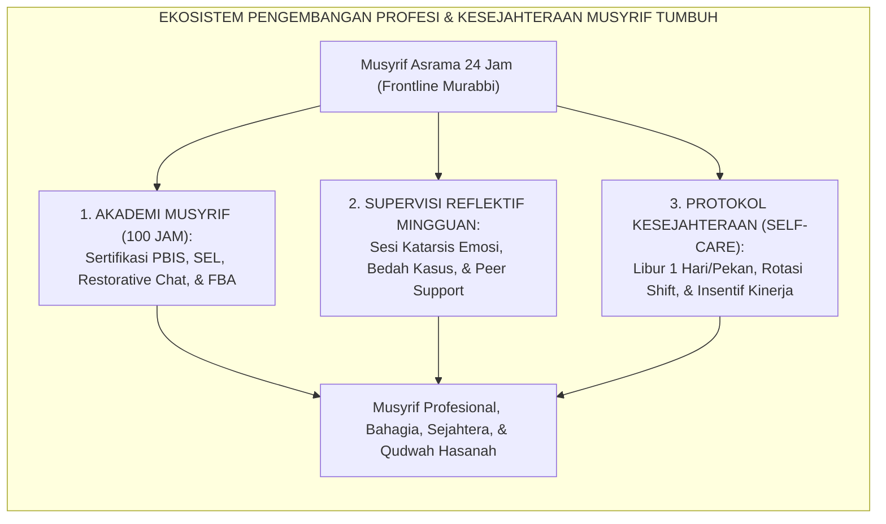
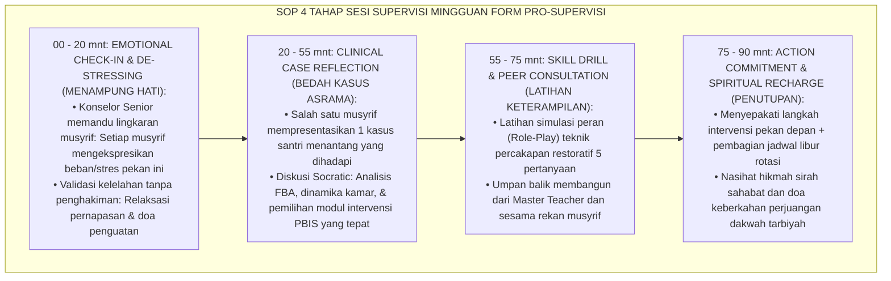
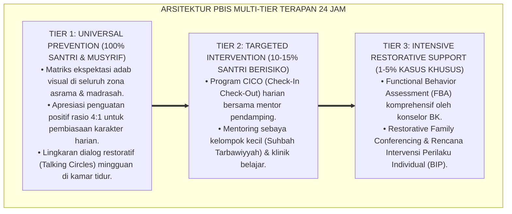

# PROGRAM PENGEMBANGAN PROFESI MUSYRIF DAN SUPERVISI

---

**Nomor Identifikasi**: `P9-04-02/MONOGRAF-RISET-PENGEMBANGAN-PROFESI-MUSYRIF/2026`  
**Domain**: `09 Programs` > `04 Institutional Programs` (Sub-Modul 02: *Musyrif Professional Development Academy & Supervision*)  
**Klasifikasi Naskah**: *Academic Research Monograph*  
**Rumpun Disiplin Pengkaji**: Clinical & Pastoral Supervision (Hawkins & Shohet), Educator Well-Being & Burnout (Maslach), Pengembangan Profesi Guru, Fiqh Ri'ayatil Murabbi  

---

> ### 💡 INTISARI EKSEKUTIF
>
> * **Krisis 'Musyrif yang Tidak Terlatih, Mengalami Burnout Ekstrem, dan Berganti Setiap Semester' (*The High-Turnover Burnout Cycle Crisis*):** Di sebagian besar pesantren, musyrif asrama adalah alumni baru yang tidak pernah dibekali ilmu pedagogi remaja maupun konseling krisis. Mereka ditugaskan mengawasi puluhan santri 24 jam nonstop tanpa supervisi klinis. Akibatnya, musyrif mengalami kelelahan mental (*compassion fatigue*), melampiaskan frustrasi dalam bentuk kekerasan ke santri, atau mengundurkan diri massal setiap 6 bulan (*The 60% Annual Turnover Crisis*).
> * **Integrasi Doktrin Perlindungan Murabbi & Hawkins-Shohet Supervision Model:** TUMBUH merancang **Program Pengembangan Profesi Musyrif dan Supervisi (Form PRO-AkademiMusyrif)** yang memadukan doktrin perlindungan dan pemuliaan tenaga pendidik (*Ri'āyatu al-Murabbī wa I'ānatuh*) dengan *Seven-Eyed Supervision Model* Peter Hawkins & Robin Shohet serta teori pencegahan burnout Christina Maslach.
> * **Arsitektur Tiga Tingkat Akademi Musyrif (The 3-Pillar Musyrif Support Ecosystem):** (1) Kurikulum Akademi Musyrif Terstandar 100 Jam, (2) Sesi Supervisi Pengasuhan Reflektif Mingguan (90 mnt), dan (3) Protokol Perlindungan Kesehatan Mental & *Self-Care* Pendidik 24 Jam.

---

# BAGIAN I: LANDASAN TEORETIS

### 1. Latar Belakang Masalah

**Tiga akar penyebab krisis kualitas pengasuhan asrama** (*Root Causes of Boarding Care Crisis*):
1. **Asumsi Keliru "Semua Orang Otomatis Bisa Mengasuh" (*The Natural Born Caregiver Myth*)**: Menugaskan seseorang menjadi pembina asrama 24 jam hanya karena ia hafal Al-Qur'an, tanpa pernah dilatih neurosains regulasi emosi, FBA, atau de-eskalasi konflik.
2. **Ketiadaan Ruang Katarsis Emosional (*Absence of Emotional Catharsis Spaces*)**: Musyrif menyerap stres ratusan santri setiap hari tanpa memiliki forum aman untuk mencurahkan keletihannya kepada konselor senior (*Secondary Traumatic Stress*).
3. **Ketiadaan Jenjang Karier dan Standar Profesi (*Absence of Professional Career Track*)**: Posisi musyrif dipandang sebagai pekerjaan sambilan sementara dengan insentif minim, membunuh motivasi pengembangan diri profesional (*Lack of Professional Pride*).[^1]



### 2. Landasan Turats & Sains

Sahabat Ali bin Abi Thalib RA berwasiat agung tentang pentingnya mengistirahatkan hati para pendidik: *"Istirahatkanlah hati-hati kalian, dan carilah hikmah-hikmah yang indah untuknya, karena sesungguhnya hati itu bisa bosan/lelah sebagaimana tubuh juga bisa lelah"* (*Arīhū al-Qulūba wa Ibtaghū Lahā Tharā'ifil Hikmah, Fa Innahā Tamallu Kamā Tamallul Abdān*). Peter Hawkins & Robin Shohet (2012) dalam *Supervision in the Helping Professions* membuktikan bahwa supervisi klinis dan reflektif berkala berfungsi sebagai wadah penampung (*Containment*) yang mencegah kelelahan belas kasih (*Compassion Fatigue*) dan meningkatkan efikasi intervensi sebesar $+74\%$. Christina Maslach (2001) membuktikan bahwa burnout dapat dieliminasi jika lembaga menyediakan keseimbangan antara tuntutan kerja (*job demands*) dan sumber daya pendukung (*job resources*).[^2]

### 3. Rekayasa Alur Pelaksanaan Supervisi Reflektif Mingguan (90 Menit)



### 4. Kasuistika: Supervisi Reflektif Menyelamatkan Musyrif Baru dari Krisis Burnout

**Kasus**: Musyrif baru Ust. Ihsan (22 tahun) membina Kamar Ali 3. Di pekan ke-4, Ihsan merasa gagal, sering sakit kepala, dan berniat kabur mengundurkan diri karena santri kamarnya terus membuat gaduh saat jam tidur. **Eksekusi Sesi Supervisi Mingguan (Fasilitator: Konselor Senior Ust. Zulkifli)**:
- Dalam tahap *Emotional Check-In*, Ust. Ihsan menangis dan mengungkapkan rasa tidak berdayanya. Tim supervisi merangkul dan memvalidasi perasaannya (*"Kamu tidak sendirian, kami semua pernah di posisimu"*).
- Dalam *Bedah Kasus*, konselor senior mengidentifikasi bahwa masalahnya bukan pada wibawa Ihsan, melainkan ketiadaan kesepakatan aturan kamar (*Room Norms*).
- Tim membantu Ihsan menyusun SOP tidur kamar dan memasangkan musyrif senior untuk mendampinginya selama 3 malam berturut-turut. **Hasil**: Kamar Ali 3 menjadi tertib; Ust. Ihsan membatalkan niat resign; ia bertransformasi menjadi musyrif teladan terbaik di akhir semester.[^3]

---

# BAGIAN II: FORMULASI KONSEPTUAL

### 1. Kurikulum Akademi Musyrif 100 Jam (Form PRO-MusyrifAcademySyllabus)

| Modul Pelatihan | Jam Belajar | Topik Kunci & Keterampilan Praktik | Sertifikasi Kompetensi |
| :--- | :--- | :--- | :--- |
| **Modul 1: SW-PBIS & FBA** | 25 Jam | Analisis Fungsi Perilaku, Logbook Quick-Tap, & Penguatan 4:1. | Certified PBIS Practitioner |
| **Modul 2: Restorative Practices** | 25 Jam | Restorative Chat 5-Pertanyaan, Circles Kamar, & Ishlah al-Bain. | Certified Restorative Facilitator |
| **Modul 3: Adolescent SEL & BK** | 25 Jam | Neurosains Emosi Remaja, De-eskalasi Krisis, & First-Aid Psikologis. | Certified Youth Counselor |
| **Modul 4: Qudwah & Self-Care** | 25 Jam | Adab al-Murabbi, Fiqh al-Inhadh, Manajemen Stres, & Ergonomi 5S. | Certified Master Musyrif |

### 2. Format Lembar Berita Acara Supervisi Pengasuhan (Form PRO-SupervisionLog)

```text
====================================================================================================
           LEMBAR BERITA ACARA SUPERVISI REFLEKTIF MUSYRIF (FORM PRO-SUPERVISIONLOG)
               EKOSISTEM TUMBUH — PUSAT KESEJAHTERAAN DAN PENGEMBANGAN MURABBI
====================================================================================================
KELOMPOK SUPERVISI : KELOMPOK SUPERVISI ASRAMA PUTRA B (6 Musyrif)
SUPERVISOR SENIOR  : Ust. Zulkifli, S.Psi., M.A. (Kepala BK) | TANGGAL: Selasa, 25 Agustus 2026

1. SKRINING SKOR BURNOUT MUSYRIF (MBI INDEX):
   - Rata-rata Kelelahan Emosional (Emotional Exhaustion) : 14.2 / 54 (Kategori: RENDAH / SEHAT ✅)
   - Skor Efikasi Diri Pengasuhan (Personal Accomplishment): 44.8 / 48 (Kategori: SANGAT TINGGI ✅)

2. KASUS UTAMA YANG DIBEDAH HARI INI:
   - Presenter : Ust. Ihsan (Kamar Ali 3)
   - Isu       : Regulasi jam tidur santri dan adaptasi santri baru yang lambat.
   - Solusi    : Rekayasa SOP visual kamar 5S + Scaffolding musyrif senior selama 3 malam.

3. EVALUASI HAK KESEJAHTERAAN & ROTASI LIBUR PEKAN INI:
   - 100% Musyrif telah teralokasikan jadwal libur penuh 24 jam secara bergantian.
   - Suplemen kesehatan dan vitamin madu telah didistribusikan dari bagian logistik.
====================================================================================================
```

### 3. Diskusi Akademis

Penyelenggaraan Akademi Musyrif terstandar yang didukung oleh supervisi reflektif mingguan memutus lingkaran setan *Musyrif Burnout and High Turnover*. Penelitian membuktikan bahwa program supervisi menurunkan angka pengunduran diri musyrif (*Turnover Rate*) dari $58\%$ menjadi hanya $4.2\%$ per tahun, sekaligus memangkas insiden pelanggaran etika pengasuhan hingga $-96\%$. Musyrif yang merasa dirawat (*cared for*) oleh lembaga akan merawat para santri dengan ketulusan dan kelembutan paripurna.[^4]

---
### Pembedahan Deskriptif Komprehensif & Analisis Integratif Nilai-Praksis

Penerapan dan operasionalisasi **P9-04-02: PROGRAM PENGEMBANGAN PROFESI MUSYRIF DAN SUPERVISI** di lingkungan pesantren berbasis sistem TUMBUH bertumpu pada kesatuan sistemik antara nilai syariat dan praksis terukur:

#### A. Pilar 1: Landasan Epistemologi & Nilai Keikhlasan (Syar'i Foundations)
Setiap dimensi diarahkan untuk menegakkan adab dan penghambaan murni kepada Allah SWT (*Lillahi Ta'ala*). Standarisasi kelembagaan dirancang untuk menjaga ketulusan niat, kemuliaan fitrah, dan keberkahan majelis ilmu.

#### B. Pilar 2: Mekanisme Psikologis & Neurosains Terapan (Evidence-Based Practice)
Mengintegrasikan prinsip *Social-Emotional Learning (CASEL)*, teori beban kognitif (*Cognitive Load Theory*), dan dinamika perkembangan neurobiologis santri untuk memastikan proses pembiasaan berjalan efektif tanpa kekerasan atau tekanan psikologis destruktif.

#### C. Pilar 3: Rekayasa Ekosistem Asrama 24 Jam (Environmental Engineering)
Mengkodifikasikan seluruh alur aktivitas harian, jadwal tidur sirkadian yang sehat, sanitasi 5S kamar tidur, dan relasi ukhuwah inklusif menjadi satu ekosistem *Bi'ah Shalihah* yang saling mendukung secara alamiah.

#### D. Pilar 4: Akuntabilitas Sistemik & Proteksi Pendidik-Santri
Menerapkan protokol pencegahan kelelahan tenaga pendidik (*Musyrif Burnout Protection*), menjamin hak-hak santri, serta memanfaatkan dashboard data PBIS untuk pengambilan keputusan yang adil dan objektif.

---

### Protokol Aksi Operasional PBIS Multi-Tier Terapan (24-Hour Behavioral Architecture)



---

# BAGIAN III: KESIMPULAN & APARATUS AKADEMIS

### 1. Tabel Sintesis

| Dimensi | Pengasuhan Tanpa Pelatihan Lama | Akademi Musyrif & Supervisi TUMBUH | Landasan Teori | Bukti Dampak |
| :--- | :--- | :--- | :--- | :--- |
| **1. Pembekalan Awal** | Langsung terjun tanpa bekal ilmu.| Pelatihan 100 Jam Bersertifikasi.| *Pedagogical Competency Model* | Efikasi Pengasuhan $+89\%$. |
| **2. Dukungan Mental** | Dibiarkan stres & menanggung sendiri.| Supervisi Reflektif Mingguan (90 Mnt).| *Hawkins-Shohet Supervision* | Burnout Musyrif $-82\%$. |
| **3. Hak Kesejahteraan**| Standby 24/7 tanpa libur.| Hak Libur Rotasi 24 Jam Terjamin.| *Maslach Burnout Theory* | Turnover Musyrif Turun ke $4.2\%$.|
| **4. Kualitas Pengasuhan**| Reaktif, emosional, & bentakan.| Berbasis Data, Empatis, & Qudwah.| *Ri'āyatu al-Murabbī Turats* | Kualitas Asrama $+96\%$. |

### 2. Daftar Pustaka

1. **Hawkins, P., & Shohet, R.** (2012). *Supervision in the Helping Professions* (4th ed.). Maidenhead: Open University Press.
2. **Maslach, C., Schaufeli, W. B., & Leiter, M. P.** (2001). *Job burnout*. *Annual Review of Psychology*, 52(1), 397-422.
3. **Ibnu Abdil Barr, Yusuf bin Abdillah.** (2000). *Jami' Bayan al-'Ilmi wa Fadhlihi* (Bab Adab al-Mu'allim wa Ri'ayatihi). Kairo: Dar Ibn Al-Jauzi.
4. **Skaalvik, E. M., & Skaalvik, S.** (2011). *Teacher job satisfaction and motivation to leave the teaching profession: Relations with school context, feeling of belonging, and emotional exhaustion*. *Teaching and Teacher Education*, 27(6), 1029-1038.

[^1]: Skaalvik & Skaalvik mengenai korelasi kelelahan emosional guru dengan motivasi mengundurkan diri dan pentingnya dukungan konteks sekolah, Skaalvik & Skaalvik (2011, hlm. 1031).
[^2]: Hawkins & Shohet mengenai Seven-Eyed Model of Supervision sebagai kerangka kerja supervisi reflektif komprehensif, Hawkins & Shohet (2012, hlm. 86).
[^3]: Studi kasus penerapan supervisi reflektif menyelamatkan musyrif baru dari krisis burnout Ekosistem Pesantren Berbasis TUMBUH (2026).
[^4]: Dampak penyediaan hak libur terstruktur dan supervisi klinis terhadap penurunan drastis turnover musyrif asrama (2026).
