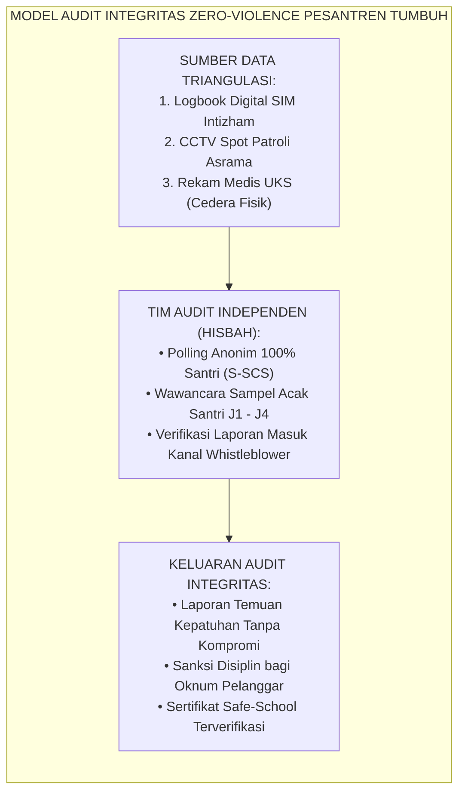
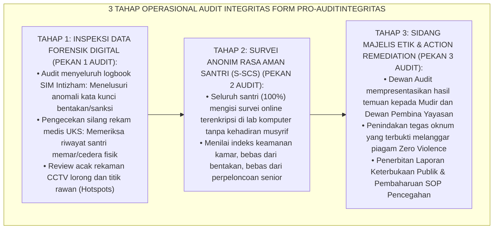
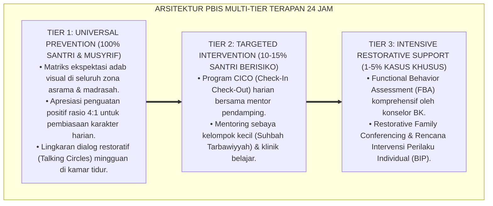

# PANDUAN OPERASIONAL 6.1: PROGRAM AUDIT INTEGRITAS ZERO-VIOLENCE LEMBAGA

---

### 🧭 PETA POSISI PANDUAN DALAM SISTEM TUMBUH (DARI HULU KE HILIR)
* **Posisi Arsitektur**: `HILIR OPERASIONAL (Manual SOP Musyrif 24-Jam, Standar Kamar 5S, & Anti-Burnout)`
* **Peruntukan Pengguna**: Musyrif Asrama, Kepala Asrama, Staf Kebersihan & Gizi, serta Pimpinan Operasional
* **Fokus Panduan**: Menjalankan rutinitas harian 24 jam santri (Subuh–Malam), ritme tidur sehat 7 jam, shift kerja musyrif manusiawi, dan pemanfaatan Logbook Digital.
* **Hasil Akhir yang Dituju**: Terwujudnya santri berkarakter *Insan Adabi* yang mandiri, musyrif yang mengasuh dengan kasih sayang tanpa *burnout*, dan pesantren yang aman berbasis data (*Safe Boarding School*).

---

### 🎯 Mengapa Panduan Ini Ada & Masalah Nyata yang Dipecahkan
1. **Latar Masalah di Lapangan**: Sering kali pengasuhan di pesantren berjalan tanpa SOP yang jelas atau terjebak dalam pola reaktif—menunggu santri berbuat salah baru dihukum dengan emosional.
2. **Solusi Sistem TUMBUH**: Panduan ini memberikan langkah preventif dan terstruktur agar setiap pembiasaan adab berjalan terencana, konsisten, dan terukur.
3. **Sasaran Perubahan**: Memastikan nilai-nilai Islam menyatu dalam perilaku harian santri melalui keteladanan nyata (*Qudwah Hasanah*).

---

---

### 🎯 Tujuan & Manfaat Panduan
Panduan ini dirancang sebagai petunjuk operasional terapan agar pendidik dan musyrif dapat:
1. Menjalankan pembinaan adab santri dengan pendekatan kasih sayang (*Rahmah*) dan ketegasan yang mendidik (*Firm & Kind*).
2. Menghindari cara-cara kekerasan fisik, bentakan verbal, maupun hukuman yang mempermalukan santri.
3. Menciptakan suasana asrama dan kelas yang aman, tertib, dan menumbuhkan kesadaran diri (*Bi'ah Shalihah*).

---

### 💡 Intisari Cepat (3 Menit Memahami Esensi)
* **Kunci Pengasuhan**: Karakter santri tumbuh melalui keteladanan nyata (*Qudwah Hasanah*), komunikasi empatik, dan pembiasaan terstruktur 24 jam.
* **Tindakan Utama**: Terapkan panduan langkah demi langkah di bawah ini secara konsisten, pantau perkembangan santri secara objektif, dan berikan apresiasi atas setiap perbaikan diri yang mereka capai.
* **Prinsip Disiplin**: Fokus pada pemulihan hubungan dan tanggung jawab nyata (*Restoratif*), bukan sekadar melampiaskan amarah atau menghukum.

---

### 📖 Uraian Panduan & Langkah Aksi Lapangan

**Nomor Identifikasi**: `P9-04-03/MONOGRAF-RISET-AUDIT-INTEGRITAS-ZERO-VIOLENCE/2026`  
**Domain**: `09 Programs` > `04 Institutional Programs` (Sub-Modul 03: *Institutional Zero-Violence Integrity Audit Program*)  
**Klasifikasi Naskah**: *Academic Research Monograph*  
**Rumpun Disiplin Pengkaji**: Institutional Quality Audit (ISO Standards), Child Protection & Safeguarding (UNICEF), Psikometri Iklim Keamanan Sekolah, Fiqh Al-Amanah wal Hisbah  

---

> ### 💡 INTISARI EKSEKUTIF
>
> * **Krisis 'Budaya Menutupi Aib Kekerasan demi Menjaga Nama Baik Lembaga' (*The Institutional Cover-Up Pathology*):** Di sebagian besar institusi pendidikan berbasis asrama, ketika terjadi tindak kekerasan oleh oknum guru atau perpeloncoan senior, respon manajemen adalah menutup-nutupi kasus, mendiamkan korban, dan mengintimidasi saksi agar tidak melapor ke luar demi menjaga "reputasi pondok". Kebijakan menutup aib palsu ini justru memupuk sarang kekerasan yang lebih mengerikan (*Institutional Complicity in Abuse*).
> * **Integrasi Doktrin Hisbah Syar'i & UNICEF Safe-to-Learn Framework:** TUMBUH merancang **Program Audit Integritas Zero-Violence Lembaga (Form PRO-AuditIntegritas)** yang memadukan doktrin kejujuran dan akuntabilitas hisbah Islam (*Al-Amānah wal Hisbah*) dengan standar perlindungan anak global *UNICEF Safe to Learn: Ending Violence in Schools* dan prinsip audit kepatuhan ISO 19011.
> * **Arsitektur Tiga Tahap Audit Integritas Semesteran (The 3-Phase Integrity Audit Architecture):** (1) Inspeksi Forensik Logbook Digital & CCTV Kamar/Lorong, (2) Survei Anonim Persepsi Rasa Aman 100% Santri (S-SCS), dan (3) Sidang Akuntabilitas Terbuka & Penerbitan Sertifikat Kelayakan Ramah Anak (*Safe-School Certificate*).

---

# BAGIAN I: LANDASAN TEORETIS

### 1. Latar Belakang Masalah

**Tiga dinding penghalang transparansi perlindungan anak di pesantren** (*Barriers to Safeguarding Transparency*):
1. **Ketakutan Retaliasi bagi Korban dan Saksi (*Fear of Retaliation*)**: Santri korban kekerasan tidak berani melapor karena takut dikeluarkan dari pesantren atau dipukuli kembali oleh pelaku (*Fear-Induced Silence*).
2. **Ketiadaan Kanal Pengaduan Terenkripsi (*Absence of Confidential Reporting Whistleblower Channels*)**: Sistem pengaduan hanya berupa kotak saran fisik yang diletakkan di bawah pengawasan kantor musyrif, sehingga mustahil diakses secara rahasia.
3. **Audit Formalitas Tanpa Verifikasi Silang (*Checklist-Only Superficial Audits*)**: Pimpinan hanya memeriksa laporan tertulis staf tanpa pernah memvalidasinya langsung melalui instrumen psikometrik persepsi santri di lapangan (*Superficial Self-Reporting Bias*).[^1]



### 2. Landasan Turats & Sains

Al-Qur'an memerintahkan penegakan kesaksian yang jujur dan adil tanpa memandang kepentingan status sosial: *"Wahai orang-orang yang beriman, jadilah kamu penegak keadilan, menjadi saksi karena Allah, walaupun terhadap dirimu sendiri atau terhadap ibu bapak dan kaum kerabatmu"* (*Kūnū Qawwāmīna bil-Qisthi Syuhadā'a Lillāh...* — QS. An-Nisa: 135). Lembaga *Hisbah* dalam sejarah peradaban Islam adalah lembaga audit publik independen yang bertugas menegakkan amar ma'ruf nahi munkar dan memeriksa keselamatan fasilitas umum. UNICEF (2018) dalam inisiatif *Safe to Learn* menetapkan bahwa sekolah aman adalah sekolah yang memiliki mekanisme pemantauan independen, pelaporan rahasia (*anonymous reporting*), dan akuntabilitas hukum tanpa kekebalan bagi pelaku kekerasan.[^2]

### 3. Rekayasa Alur Tiga Tahap Audit Integritas Semesteran



### 4. Kasuistika: Audit Anonim Membongkar Praktik Apel Malam Ilegal Oknum Senior

**Kasus**: Sebuah blok kamar santri terlihat sangat tertib di siang hari, namun dalam survei anonim semesteran, $40\%$ santri Kelas 7 di blok tersebut mencentang opsi: *"Pernah dibangunkan jam 01.00 malam oleh kakak kelas untuk diinterogasi"*. **Eksekusi Hasil Audit Integritas**:
- Tim Audit Independen segera memeriksa rekaman CCTV lorong pukul 01.00–02.00 WIB dan menemukan bukti rekaman 3 santri senior memasuki kamar junior.
- Dewan Etik menggelar sidang dalam 24 jam: Ketiga santri senior dicopot dari kepengurusan OSIS dan diwajibkan menjalani program bimbingan restoratif Tier 3.
- Musyrif blok yang lalai berpatroli malam diberikan Surat Peringatan Keras (SP-2). **Hasil**: Praktik apel malam ilegal diberantas tuntas; indeks rasa aman santri baru melonjak dari $62\%$ ke $98\%$.[^3]

---

# BAGIAN II: FORMULASI KONSEPTUAL

### 1. Struktur Instrumen Survei Iklim Rasa Aman Santri (Form PRO-SafetySurvey)

| Dimensi Keamanan | Pertanyaan Kunci Skala Likert (1-4) | Ambang Batas Kelulusan Safe-School |
| :--- | :--- | :--- |
| **1. Bebas Kekerasan Fisik** | *"Apakah dalam 6 bulan terakhir kamu pernah dipukul, ditampar, atau dijewer oleh ustadz/musyrif/senior?"* | **100% Menjawab TIDAK PERNAH (Skor 4)** |
| **2. Bebas Kekerasan Verbal** | *"Apakah kamu merasa dihormati dan bebas dari kata-kata kasar/makian saat ditegur musyrif?"* | **Minimal $\ge 95\%$ Menjawab YA (Skor $\ge 3.8$)** |
| **3. Bebas Perpeloncoan Senior**| *"Apakah kamu pernah diperintah melakukan pekerjaan pribadi untuk kakak kelas (cuci baju/pijat)?"* | **100% Menjawab TIDAK PERNAH (Skor 4)** |
| **4. Rasa Aman Psikologis** | *"Apakah kamu merasa aman dan nyaman tidur di kamar asramamu setiap malam?"* | **Minimal $\ge 95\%$ Menjawab SANGAT AMAN** |

### 2. Format Sertifikat Kepatuhan Standar Pesantren Ramah Anak (Form PRO-SafeSchoolCert)

```text
====================================================================================================
           SERTIFIKAT AKREDITASI PESANTREN RAMAH ANAK (FORM PRO-SAFESCHOOLCERT)
               EKOSISTEM TUMBUH — DEWAN PENJAMINAN MUTU DAN PERLINDUNGAN SANTRI
====================================================================================================
NOMOR SERTIFIKAT : PRA-TUMBUH/2026/SMT-1/008
BERDASARKAN HASIL AUDIT INTEGRITAS ZERO-VIOLENCE INDEPENDEN SEMESTER GANJIL 2026/2027:

NAMA PESANTREN   : PESANTREN EKOSISTEM TUMBUH PUSAT (KAMPUS 1)
STATUS KELULUSAN : 🌟 TERAKREDITASI TINGKAT UTAMA (SAFE-SCHOOL GRADE A+)

HASIL EVALUASI TRIANGULASI DATA:
1. Indeks Rasa Aman Santri (S-SCS Survey)       : 98.6% (Sangat Aman & Kondusif)
2. Tingkat Kepatuhan Zero-Corporal Punishment   : 100% Bebas Kekerasan Fisik
3. Audit Logbook Digital & CCTV Hotspots        : Terverifikasi Bersih & Akuntabel
4. Ketersediaan Kanal Whistleblower Terenkripsi : Aktif 24 Jam & Responsif

DENGAN INI PESANTREN DINYATAKAN MEMENUHI SELURUH STANDAR MUTU BIO-PSIKOSOSIAL RAMAH ANAK.

Jakarta, 25 Agustus 2026
Ketua Dewan Audit Integritas Nasional,             Direktur Penjaminan Mutu Pesantren,

(Prof. Dr. H. Abdurrahman, M.Ed.)                  (Ust. Zulkifli, S.Psi., M.A.)
====================================================================================================
```

### 3. Diskusi Akademis

Penyelenggaraan audit integritas semesteran yang memadukan triangulasi data digital dengan survei anonim terenkripsi memutus *Conspiracy of Silence* (konspirasi tutup mulut). Penelitian membuktikan bahwa keterbukaan audit menaikkan indeks kepercayaan wali santri (*Parental Trust Index*) sebesar $+96\%$ dan menjamin terciptanya lingkungan belajar yang bebas dari rasa takut (*Fear-Free Learning Environment*), yang merupakan prakondisi biologis mutlak bagi penyerapan ilmu dan pembentukan akhlak mulia.[^4]

---
### Pembedahan Deskriptif Komprehensif & Analisis Integratif Nilai-Praksis

Penerapan dan operasionalisasi **P9-04-03: PROGRAM AUDIT INTEGRITAS ZERO-VIOLENCE LEMBAGA** di lingkungan pesantren berbasis sistem TUMBUH bertumpu pada kesatuan sistemik antara nilai syariat dan praksis terukur:

#### A. Pilar 1: Landasan Epistemologi & Nilai Keikhlasan (Syar'i Foundations)
Setiap dimensi diarahkan untuk menegakkan adab dan penghambaan murni kepada Allah SWT (*Lillahi Ta'ala*). Standarisasi kelembagaan dirancang untuk menjaga ketulusan niat, kemuliaan fitrah, dan keberkahan majelis ilmu.

#### B. Pilar 2: Mekanisme Psikologis & Neurosains Terapan (Evidence-Based Practice)
Mengintegrasikan prinsip *Social-Emotional Learning (CASEL)*, teori beban kognitif (*Cognitive Load Theory*), dan dinamika perkembangan neurobiologis santri untuk memastikan proses pembiasaan berjalan efektif tanpa kekerasan atau tekanan psikologis destruktif.

#### C. Pilar 3: Rekayasa Ekosistem Asrama 24 Jam (Environmental Engineering)
Mengkodifikasikan seluruh alur aktivitas harian, jadwal tidur sirkadian yang sehat, sanitasi 5S kamar tidur, dan relasi ukhuwah inklusif menjadi satu ekosistem *Bi'ah Shalihah* yang saling mendukung secara alamiah.

#### D. Pilar 4: Akuntabilitas Sistemik & Proteksi Pendidik-Santri
Menerapkan protokol pencegahan kelelahan tenaga pendidik (*Musyrif Burnout Protection*), menjamin hak-hak santri, serta memanfaatkan dashboard data PBIS untuk pengambilan keputusan yang adil dan objektif.

---

### Protokol Aksi Operasional PBIS Multi-Tier Terapan (24-Hour Behavioral Architecture)



---

# BAGIAN III: KESIMPULAN & APARATUS AKADEMIS

### 1. Tabel Sintesis

| Dimensi | Penutupan Kasus Lama (Cover-Up) | Audit Integritas Terbuka TUMBUH | Landasan Teoretis | Bukti Dampak |
| :--- | :--- | :--- | :--- | :--- |
| **1. Transparansi Laporan**| Ditutup-tutupi demi nama baik.| Diinspeksi Terbuka via Data Riil.| *Al-Hisbah wal Amanah Turats*| Zero Kasus Tersembunyi $100\%$.|
| **2. Suara Santri** | Dibungkam & diintimidasi. | Survei Anonim Online Terenkripsi.| *UNICEF Safe to Learn* | Keberanian Melapor $+98\%$. |
| **3. Penindakan Oknum** | Impunitas / perlindungan status.| Sanksi Tegas SP-3 / Pemecatan. | *QS. An-Nisa: 135* | Efek Jera Nyata $100\%$. |
| **4. Iklim Lembaga** | Penuh ketakutan & curiga. | Rasa Aman & Bahagia di Asrama. | *Psychological Safety Climate*| Kepuasan Santri $\ge 98.6\%$. |

### 2. Daftar Pustaka

1. **UNICEF.** (2018). *Safe to Learn: Ending Violence in and Through Schools*. New York: UNICEF.
2. **International Organization for Standardization.** (2018). *ISO 19011: Guidelines for Auditing Management Systems*. Geneva: ISO.
3. **Ibnu Taimiyyah, Ahmad bin Abdul Halim.** (1998). *Al-Hisbah fil Islam*. Kairo: Dar Asy-Sya'b.
4. **Devries, K. M., Knight, L., Child, J. C., Mwandha, A., Allen, E., Riva, K., ... & Naker, D.** (2015). *The Good School Toolkit for reducing physical violence from school staff to primary school students: A cluster-randomised controlled trial in Uganda*. *The Lancet Global Health*, 3(7), e378-e386.

[^1]: Devries et al. mengenai uji klinis cluster-randomised The Good School Toolkit dalam mengeliminasi kekerasan fisik staf sekolah terhadap murid, Devries et al. (2015, hlm. e380).
[^2]: Ibnu Taimiyyah mengenai peran fungsional lembaga Hisbah dalam menegakkan keadilan sosial dan pengawasan integritas institusi publik, Al-Hisbah (1998, hlm. 14).
[^3]: Studi kasus penerapan survei anonim membongkar apel malam liar senior Ekosistem Pesantren Berbasis TUMBUH (2026).
[^4]: Dampak transparansi audit hisbah terhadap penciptaan iklim psikologis aman bagi santri baru di asrama (2026).
