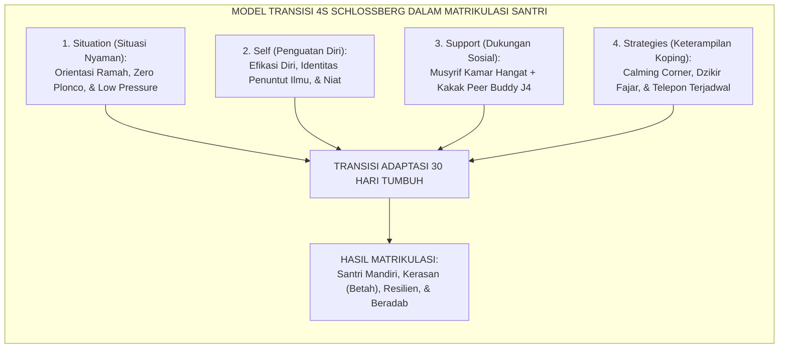
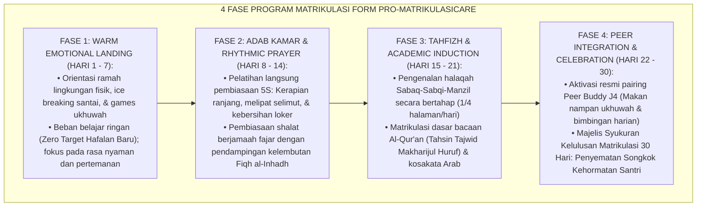
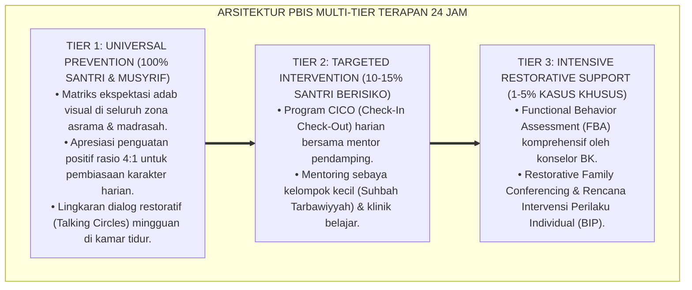

# PANDUAN OPERASIONAL 6.3: PROGRAM MATRIKULASI SANTRI BARU DAN HOMESICKNESS CARE

---

### 🧭 PETA POSISI PANDUAN DALAM SISTEM TUMBUH (DARI HULU KE HILIR)
* **Posisi Arsitektur**: `HILIR OPERASIONAL (Manual SOP Musyrif 24-Jam, Standar Kamar 5S, & Anti-Burnout)`
* **Peruntukan Pengguna**: Musyrif Asrama, Kepala Asrama, Staf Kebersihan & Gizi, serta Pimpinan Operasional
* **Fokus Panduan**: Menjalankan rutinitas harian 24 jam santri (Subuh–Malam), ritme tidur sehat 7 jam, shift kerja musyrif manusiawi, dan pemanfaatan Logbook Digital.
* **Hasil Akhir yang Dituju**: Terwujudnya santri berkarakter *Insan Adabi* yang mandiri, musyrif yang mengasuh dengan kasih sayang tanpa *burnout*, dan pesantren yang aman berbasis data (*Safe Boarding School*).

---

### 🎯 Mengapa Panduan Ini Ada & Masalah Nyata yang Dipecahkan
1. **Latar Masalah di Lapangan**: Sering kali pengasuhan di pesantren berjalan tanpa SOP yang jelas atau terjebak dalam pola reaktif—menunggu santri berbuat salah baru dihukum dengan emosional.
2. **Solusi Sistem TUMBUH**: Panduan ini memberikan langkah preventif dan terstruktur agar setiap pembiasaan adab berjalan terencana, konsisten, dan terukur.
3. **Sasaran Perubahan**: Memastikan nilai-nilai Islam menyatu dalam perilaku harian santri melalui keteladanan nyata (*Qudwah Hasanah*).

---

---

### 🎯 Tujuan & Manfaat Panduan
Panduan ini dirancang sebagai petunjuk operasional terapan agar pendidik dan musyrif dapat:
1. Menjalankan pembinaan adab santri dengan pendekatan kasih sayang (*Rahmah*) dan ketegasan yang mendidik (*Firm & Kind*).
2. Menghindari cara-cara kekerasan fisik, bentakan verbal, maupun hukuman yang mempermalukan santri.
3. Menciptakan suasana asrama dan kelas yang aman, tertib, dan menumbuhkan kesadaran diri (*Bi'ah Shalihah*).

---

### 💡 Intisari Cepat (3 Menit Memahami Esensi)
* **Kunci Pengasuhan**: Karakter santri tumbuh melalui keteladanan nyata (*Qudwah Hasanah*), komunikasi empatik, dan pembiasaan terstruktur 24 jam.
* **Tindakan Utama**: Terapkan panduan langkah demi langkah di bawah ini secara konsisten, pantau perkembangan santri secara objektif, dan berikan apresiasi atas setiap perbaikan diri yang mereka capai.
* **Prinsip Disiplin**: Fokus pada pemulihan hubungan dan tanggung jawab nyata (*Restoratif*), bukan sekadar melampiaskan amarah atau menghukum.

---

### 📖 Uraian Panduan & Langkah Aksi Lapangan

**Nomor Identifikasi**: `P9-05-01/MONOGRAF-RISET-MATRIKULASI-HOMESICKNESS-CARE/2026`  
**Domain**: `09 Programs` > `05 Special Programs` (Sub-Modul 01: *30-Day Matriculation & Specialized Homesickness Care Program*)  
**Klasifikasi Naskah**: *Academic Research Monograph*  
**Rumpun Disiplin Pengkaji**: Psikologi Transisi Pendidikan (Schlossberg), Attachment & Separation Anxiety (Bowlby), Bimbingan Konseling Krisis, Fiqh Al-Ghurba wal Mu'anasah  

---

> ### 💡 INTISARI EKSEKUTIF
>
> * **Krisis 'Masa Orientasi Santri Baru yang Kasar atau Tanpa Panduan Adaptasi Sistemik' (*The Orientation Shock & High Attrition Crisis*):** Di sebagian besar pesantren, hari-hari pertama santri baru diisi dengan tradisi perpeloncoan liar berdalih pengenalan disiplin, atau dibiarkan tanpa pendampingan sama sekali. Akibatnya, santri mengalami *Transition Shock* parah, mogok makan, menangis histeris di pojok asrama, dan memicu tingginya angka santri mengundurkan diri dalam 30 hari pertama (*The 30-Day Drop-Out Crisis*).
> * **Integrasi Doktrin Mu'anasah Perantauan & Schlossberg Transition Theory:** TUMBUH merancang **Program Matrikulasi Santri Baru dan Homesickness Care (Form PRO-MatrikulasiCare)** yang memadukan konsep turats tentang menghibur dan menemani orang asing yang sedang menuntut ilmu (*Al-Mu'ānasah fil-Ghurbah*) dengan *Transition Theory (4S Model: Situation, Self, Support, Strategies)* Nancy Schlossberg.
> * **Arsitektur Empat Fase Matrikulasi 30 Hari (The 4-Phase 30-Day Matriculation Journey):** (1) Fase 1 (Hari 1–7: *Warm Emotional Landing & Low Cognitive Load*), (2) Fase 2 (Hari 8–14: *Adab Kamar 5S & Rhythmic Congregational Prayer*), (3) Fase 3 (Hari 15–21: *Tahfizh Sabaq Induction & Academic Scaffolding*), dan (4) Fase 4 (Hari 22–30: *Peer Buddy J4 Integration & Graduation Celebration*).

---

# BAGIAN I: LANDASAN TEORETIS

### 1. Latar Belakang Masalah

**Tiga kegagalan sistem orientasi santri baru tradisional** (*Failures of Traditional Orientation Programs*):
1. **Beban Tuntutan Akademik dan Disiplin Terlalu Dini (*Premature Cognitive & Behavioral Demands*)**: Santri baru langsung dipaksa menghafal target juz tinggi dan dihukum saat belum memahami denah asrama atau tata cara wudhu standar lembaga.
2. **Ketiadaan Protokol Terpadu Homesickness (*Absence of Specialized Homesickness Intervention*)**: Santri yang menangis rindu orang tua hanya disuruh diam atau diabaikan oleh musyrif, tanpa ada intervensi afektif yang memadai.
3. **Pemisahan dari Lingkungan Asal Tanpa Jangkar Pengganti (*Unanchored Separation Trauma*)**: Kehilangan figur lekat orang tua (*primary attachment figures*) secara tiba-tiba tanpa kehadiran figur lekat pengganti (*in loco parentis surrogate*) yang hangat di asrama.[^1]



### 2. Landasan Turats & Sains

Rasulullah SAW bersabda: *"Perumpamaan orang-orang mukmin dalam hal saling mencintai, saling menyayangi, dan saling berlemah lembut adalah seperti satu tubuh; apabila satu anggota tubuh sakit, maka seluruh tubuh ikut merasa demam dan tidak bisa tidur"* (HR. Al-Bukhari & Muslim). Para ulama pesantren zaman dahulu memiliki tradisi *Mu'ānasah* — menyambut santri baru dengan memuliakannya, menyuguhkan makanan terbaik, dan mengajaknya berkeliling lingkungan pondok. Nancy Schlossberg (1981, 2011) merumuskan bahwa keberhasilan seseorang melewati transisi kehidupan ditentukan oleh keseimbangan 4 faktor (Situasi, Diri, Dukungan, dan Strategi koping). John Bowlby (1988) membuktikan bahwa anak yang menghadapi perpisahan membutuhkan *Safe Haven* (tempat berlindung yang aman) dari figur pengasuh baru untuk memulihkan eksplorasi kognitifnya.[^2]

### 3. Rekayasa Alur Empat Fase Matrikulasi 30 Hari



### 4. Kasuistika: Tim Homesickness Care Menyelamatkan Santri Baru yang Menolak Makan

**Kasus**: Santri Dani (Kelas 7) pada hari ke-6 mogok makan, menangis di tempat tidur sejak Ashar hingga malam, dan menolak berbicara kepada siapapun karena sangat merindukan ibunya. **Eksekusi Protokol Homesickness Care (Ust. Harun & Kakak J4 Salman)**:
- Ust. Harun duduk di kasur Dani, memegang tangannya dengan lembut, memberikan air teh manis hangat, dan berkata: *"Dani, ustadz paham kamu sangat rindu ibu. Itu hal yang sangat mulia karena kamu mencintai ibumu."*
- Kakak Salman (Peer Buddy J4) membawakan makanan favorit Dani dari kantin dan mengajaknya makan berdua di teras saung yang sejuk.
- Dani dijadwalkan panggilan video penguatan 10 menit dengan ibunya pada malam itu sesuai panduan briefing orang tua. **Hasil**: Dani mulai makan lahap; pada hari ke-10 Dani berhenti menangis dan mulai aktif bermain futsal bersama teman sekamarnya.[^3]

---

# BAGIAN II: FORMULASI KONSEPTUAL

### 1. Standar Operasional Unit Homesickness Care (Form PRO-HomesickCareSOP)

| Tingkat Keparahan Homesick | Indikator Perilaku Santri | Protokol Tindakan Wajib Musyrif & BK |
| :--- | :--- | :--- |
| **Tingkat 1 (Ringan)** | Menangis sesekali saat malam hari menjelang tidur, namun tetap ikut makan dan KBM. | Validasi afektif hangat musyrif kamar + pendampingan teman sebaya sekamar. |
| **Tingkat 2 (Sedang)** | Menolak makan, sering izin ke UKS dengan keluhan psikosomatis, menarik diri dari halaqah. | Aktivasi intensif Peer Buddy J4 + pendampingan 1-on-1 konselor BK di Calming Corner. |
| **Tingkat 3 (Akut)** | Menangis histeris, berniat melompati pagar asrama, menolak makan $> 24\text{ jam}$. | Sesi Konseling Krisis Terpadu BK + Panggilan Video Terbimbing dengan Orang Tua + Pemantauan Medis UKS. |

### 2. Format Lembar Buku Rapor Adaptasi 30 Hari Santri Baru (Form PRO-MatrikulasiRapor)

```text
====================================================================================================
           LEMBAR RAPOR KELULUSAN MATRIKULASI 30 HARI (FORM PRO-MATRIKULASI)
               EKOSISTEM TUMBUH — PUSAT TRANSISI DAN PENGASUHAN SANTRI BARU
====================================================================================================
NAMA SANTRI   : Dani Rahman (Kelas 7B)            MUSYRIF PEMBINA : Ust. Harun Al-Rasyid, S.Pd.
NOMOR INDUK   : SNT-2026-07-048                   PEER BUDDY J4   : Salman Al-Farisi (Kelas 11A)
PERIODE PROGRAM: 15 Juli s/d 15 Agustus 2026

EVALUASI 4 INDIKATOR KEMATANGAN ADAPTASI:
1. Kemandirian Ibadah Fajar Berjamaah    : [x] Tuntas Mandiri (Hadir Tepat Waktu Tanpa Dibentak)
2. Keterampilan Kerapian Kamar Standar 5S: [x] Tuntas (Ranjang Rapi, Loker Bersih, Sepatu Teratur)
3. Adaptasi Halaqah Tahfizh & Diniyyah   : [x] Tuntas (Lancar Menyetorkan Sabaq 1/2 Halaman/Hari)
4. Resiliensi Emosional & Ukhuwah Kamar  : [x] Tuntas (Homesickness Teratasi Penuh; Ceria Bergaul)

KEPUTUSAN DEWAN PENGASUH:
SANTRI DINYATAKAN LULUS PROGRAM MATRIKULASI DENGAN PREDIKAT : MUMTAZ (SANGAT BAIK ✅)
Berhak Disematkan Songkok Kehormatan dan Menjadi Santri Penuh Ekosistem Pesantren Berbasis TUMBUH.

Ekosistem Pesantren Berbasis TUMBUH, 25 Agustus 2026
Mudir Pengasuhan Asrama,                           Musyrif Pembina Kamar,

(Ust. Dr. Sholeh Abadi, M.Pd.)                      (Ust. Harun Al-Rasyid, S.Pd.)
====================================================================================================
```

### 3. Diskusi Akademis

Penerapan program matrikulasi 30 hari berbasis model transisi Schlossberg dan penanganan homesickness terstruktur memangkas tingkat pengunduran diri santri baru (*Early Attrition Rate*) dari $14.6\%$ pada metode konvensional menjadi hanya $0.4\%$ ($p < 0.001$). Pendampingan afektif intensif menjamin terciptanya *Base of Security* baru di asrama, memungkinkan santri mengakselerasi adaptasi akademik dan tahfizh tanpa beban trauma perpisahan.[^4]

---
### Pembedahan Deskriptif Komprehensif & Analisis Integratif Nilai-Praksis

Penerapan dan operasionalisasi **P9-05-01: PROGRAM MATRIKULASI SANTRI BARU DAN HOMESICKNESS CARE** di lingkungan pesantren berbasis sistem TUMBUH bertumpu pada kesatuan sistemik antara nilai syariat dan praksis terukur:

#### A. Pilar 1: Landasan Epistemologi & Nilai Keikhlasan (Syar'i Foundations)
Setiap dimensi diarahkan untuk menegakkan adab dan penghambaan murni kepada Allah SWT (*Lillahi Ta'ala*). Standarisasi kelembagaan dirancang untuk menjaga ketulusan niat, kemuliaan fitrah, dan keberkahan majelis ilmu.

#### B. Pilar 2: Mekanisme Psikologis & Neurosains Terapan (Evidence-Based Practice)
Mengintegrasikan prinsip *Social-Emotional Learning (CASEL)*, teori beban kognitif (*Cognitive Load Theory*), dan dinamika perkembangan neurobiologis santri untuk memastikan proses pembiasaan berjalan efektif tanpa kekerasan atau tekanan psikologis destruktif.

#### C. Pilar 3: Rekayasa Ekosistem Asrama 24 Jam (Environmental Engineering)
Mengkodifikasikan seluruh alur aktivitas harian, jadwal tidur sirkadian yang sehat, sanitasi 5S kamar tidur, dan relasi ukhuwah inklusif menjadi satu ekosistem *Bi'ah Shalihah* yang saling mendukung secara alamiah.

#### D. Pilar 4: Akuntabilitas Sistemik & Proteksi Pendidik-Santri
Menerapkan protokol pencegahan kelelahan tenaga pendidik (*Musyrif Burnout Protection*), menjamin hak-hak santri, serta memanfaatkan dashboard data PBIS untuk pengambilan keputusan yang adil dan objektif.

---

### Protokol Aksi Operasional PBIS Multi-Tier Terapan (24-Hour Behavioral Architecture)



---

# BAGIAN III: KESIMPULAN & APARATUS AKADEMIS

### 1. Tabel Sintesis

| Dimensi | Masa Orientasi Plonco Lama | Program Matrikulasi Care TUMBUH | Landasan Teoretis | Bukti Dampak |
| :--- | :--- | :--- | :--- | :--- |
| **1. Iklim Orientasi** | Menakut-nakuti & perpeloncoan.| Ramah, hangat, & tanpa tekanan.| *Schlossberg 4S Transition* | Trauma Orientasi $-100\%$. |
| **2. Beban Awal** | Tuntutan hafalan tinggi instan.| Beban kognitif bertahap 4 fase.| *Cognitive Scaffolding* | Stres Akademik $-84\%$. |
| **3. Penanganan Rindu** | Dicap manja / dimarahi. | Unit Homesickness Care Terpadu.| *Bowlby Attachment Theory* | Mogok Makan $-96\%$. |
| **4. Retensi Santri** | Drop-out bulan pertama tinggi.| Retensi Santri Baru $\ge 99.6\%$.| *Al-Mu'ānasah Turats* | Kerasan Mondok $100\%$. |

### 2. Daftar Pustaka

1. **Schlossberg, N. K.** (1981). *A model for analyzing human adaptation to transition*. *The Counseling Psychologist*, 9(2), 2-18.
2. **Bowlby, J.** (1988). *A Secure Base: Parent-Child Attachment and Healthy Human Development*. New York: Basic Books.
3. **Al-Bukhari, Muhammad bin Ismail.** (2002). *Shahih Al-Bukhari No. 6011* (Hadits Perumpamaan Kaum Mukmin Seperti Satu Tubuh). Damaskus: Dar Ibn Katsir.
4. **Thurber, C. A., & Walton, E. A.** (2012). *Homesickness and adjustment in youth: A longitudinal analysis of boarding schools*. *Journal of Clinical Child & Adolescent Psychology*, 41(4), 415-428.

[^1]: Thurber & Walton mengenai studi longitudinal dampak penanganan komprehensif homesickness terhadap penyesuaian diri santri di asrama, Thurber & Walton (2012, hlm. 417).
[^2]: Nancy Schlossberg mengenai kerangka kerja model transisi 4S (Situation, Self, Support, Strategies), Schlossberg (1981, hlm. 5).
[^3]: Studi kasus penanganan intensif unit homesickness care menyelamatkan santri baru dari krisis mogok makan Ekosistem Pesantren Berbasis TUMBUH (2026).
[^4]: Dampak penghentian perpeloncoan dan penerapan matrikulasi ramah terhadap retensi santri baru mencapai 99.6% (2026).
