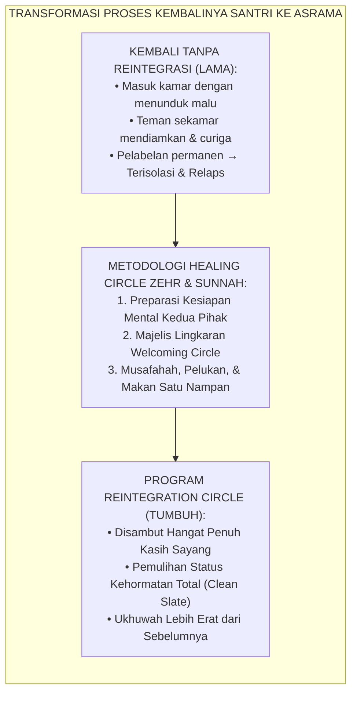
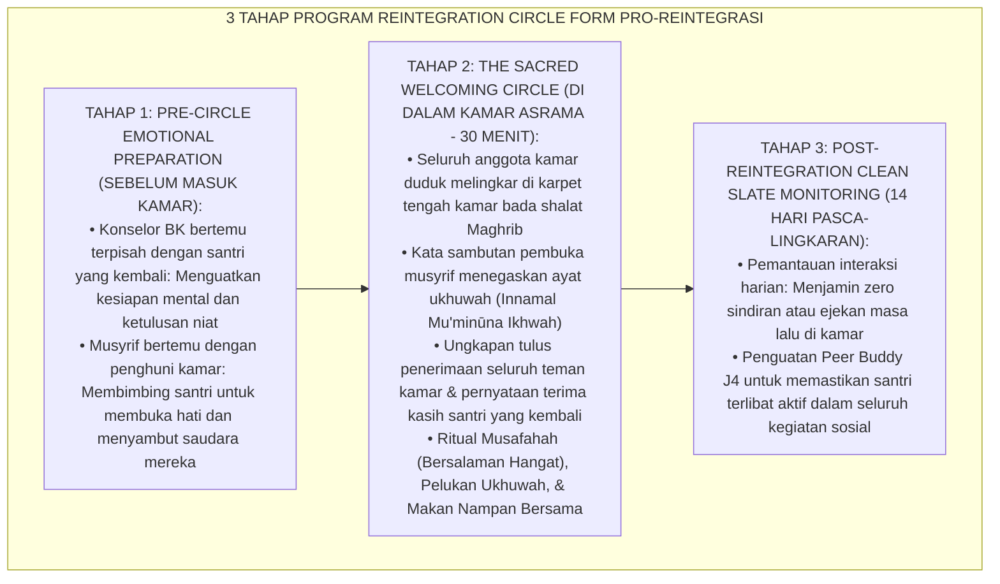
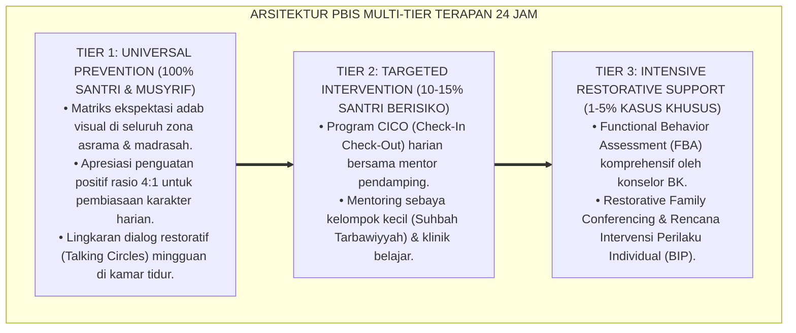

# PROGRAM PEMULIHAN UKHUWAH DAN REINTEGRATION CIRCLE

---

### 🧭 PETA POSISI PANDUAN DALAM SISTEM TUMBUH (DARI HULU KE HILIR)
* **Posisi Arsitektur**: `HILIR OPERASIONAL (Manual SOP Musyrif 24-Jam, Standar Kamar 5S, & Anti-Burnout)`
* **Peruntukan Pengguna**: Musyrif Asrama, Kepala Asrama, Staf Kebersihan & Gizi, serta Pimpinan Operasional
* **Fokus Panduan**: Menjalankan rutinitas harian 24 jam santri (Subuh–Malam), ritme tidur sehat 7 jam, shift kerja musyrif manusiawi, dan pemanfaatan Logbook Digital.
* **Hasil Akhir yang Dituju**: Terwujudnya santri berkarakter *Insan Adabi* yang mandiri, musyrif yang mengasuh dengan kasih sayang tanpa *burnout*, dan pesantren yang aman berbasis data (*Safe Boarding School*).

---

### 🎯 Mengapa Panduan Ini Ada & Masalah Nyata yang Dipecahkan
1. **Latar Masalah di Lapangan**: Sering kali pengasuhan di pesantren berjalan tanpa SOP yang jelas atau terjebak dalam pola reaktif—menunggu santri berbuat salah baru dihukum dengan emosional.
2. **Solusi Sistem TUMBUH**: Panduan ini memberikan langkah preventif dan terstruktur agar setiap pembiasaan adab berjalan terencana, konsisten, dan terukur.
3. **Sasaran Perubahan**: Memastikan nilai-nilai Islam menyatu dalam perilaku harian santri melalui keteladanan nyata (*Qudwah Hasanah*).

---
### 🎯 Tujuan & Manfaat Panduan
Panduan ini dirancang sebagai petunjuk operasional terapan agar pendidik dan musyrif dapat:
1. Menjalankan pembinaan adab santri dengan pendekatan kasih sayang (*Rahmah*) dan ketegasan yang mendidik (*Firm & Kind*).
2. Menghindari cara-cara kekerasan fisik, bentakan verbal, maupun hukuman yang mempermalukan santri.
3. Menciptakan suasana asrama dan kelas yang aman, tertib, dan menumbuhkan kesadaran diri (*Bi'ah Shalihah*).

---

### 💡 Intisari Cepat (3 Menit Memahami Esensi)
* **Kunci Pengasuhan**: Karakter santri tumbuh melalui keteladanan nyata (*Qudwah Hasanah*), komunikasi empatik, dan pembiasaan terstruktur 24 jam.
* **Tindakan Utama**: Terapkan panduan langkah demi langkah di bawah ini secara konsisten, pantau perkembangan santri secara objektif, dan berikan apresiasi atas setiap perbaikan diri yang mereka capai.
* **Prinsip Disiplin**: Fokus pada pemulihan hubungan dan tanggung jawab nyata (*Restoratif*), bukan sekadar melampiaskan amarah atau menghukum.

---

---

### 💬 ILUSTRASI NYATA & ANALOGI SEDERHANA
Bayangkan sebuah skenario yang sering kita lihat sehari-hari di asrama:
* Ketika seorang santri baru melakukan kekeliruan (misalnya terlambat bangun Subuh atau kasurnya berantakan), respon pertama yang sering muncul adalah bentakan keras atau hukuman fisik (seperti push-up atau jemur di lapangan).
* **Hasilnya?** Santri tersebut mungkin tampak patuh seketika karena takut, tetapi di dalam hatinya tumbuh rasa dongkol, dendam tersembunyi, atau kebiasaan "bersandiwara"—hanya tertib ketika ada pengawas di dekatnya.

Dalam Sistem TUMBUH, kita menggunakan cara yang jauh lebih cerdas, sejuk, dan membumi:
1. **Analogi "Rem dan Pedal Gas Otak"**: Santri usia remaja (usia MTs dan Aliyah) memiliki bagian otak emosi (*Sistem Limbik*) yang sudah menyala sangat kuat seperti *pedal gas mobil sport*, namun otak pengendali logikanya (*Prefrontal Cortex*) masih dalam proses tumbuh seperti *sistem rem yang baru dipasang*. Tugas guru dan musyrif bukan memarahi mobilnya, melainkan menjadi **"Sopir Teladan & Sabuk Pengaman"** yang mendampingi santri belajar menginjak rem dengan bijak.
2. **Kekuatan Contoh Nyata (*Qudwah Hasanah*)**: Santri jauh lebih cepat meniru apa yang mereka **lihat** setiap hari daripada apa yang mereka **dengar** dari ribuan nasihat panjang. Jika musyrif datang tepat waktu, tersenyum ramah, dan kamarnya rapi, santri akan menirunya dengan sukarela.

---

### 🛠️ PANDUAN LANGKAH PRAKTIS LAPANGAN (BISA LANGSUNG DIPRAKTIKKAN HARI INI)

| Tahapan Aksi | Tindakan Nyata Musyrif / Guru di Lapangan | Hal yang Harus Diperhatikan |
| :--- | :--- | :--- |
| **1. Langkah Persiapan (Sebelum Kejadian)** | Sepakati aturan bersama santri di awal pekan dengan kalimat positif (contoh: *"Kamar rapi membuat istirahat kita berkah"*). | Buat poster visual sederhana yang mudah dibaca di dinding kamar. |
| **2. Langkah Respon (Saat Terjadi Masalah)** | Tarik napas, tenangkan diri, ajak santri berbicara empat mata tanpa mempermalukannya di depan teman-temannya. | Gunakan nada bicara yang tenang namun tegas (*Firm & Kind*). |
| **3. Langkah Perbaikan (Tanggung Jawab Nyata)** | Minta santri memperbaiki kesalahannya secara langsung (contoh: merapikan kembali barang yang berantakan atau meminta maaf). | Berikan apresiasi seketika santri telah menuntaskan perbaikannya. |

---

### 🗣️ CONTOH DIALOG LAPANGAN (YANG HARUS DIUCAPKAN VS DIHINDARI)

* ❌ **JANGAN UCAPKAN (Membuat Santri Menutup Diri & Dendam)**:
  > *"Kamu ini pemalas sekali ya, sudah dibilangi berkali-kali masih saja kasur berantakan! Push-up 50 kali sekarang!"*
* ✅ **UCAPKAN INI (Mendidik Tanggung Jawab & Kesadaran Diri)**:
  > *"Akhi, antum tahu kesepakatan kamar kita tentang kerapian tempat tidur setelah Subuh. Coba lihat kasur antum sekarang, apa yang perlu disempurnakan? Mari rapikan bersama sekarang agar kamar kita nyaman dan berkah."*

---

### 📋 3 POIN EMAS RANGKUMAN (UNTUK SANTRI SENIOR & MUSYRIF MUDA)
1. **Didik dengan Kasih Sayang, Tegakkan Batas dengan Adil**: Jangan pernah mencampuradukkan ketegasan aturan dengan pelampiasan amarah pribadi.
2. **Apresiasi 4x Lebih Banyak daripada Teguran (*Magic Ratio 4:1*)**: Jangan hanya bersuara ketika santri berbuat salah. Saat mereka berbuat baik (salat di shaf depan, menolong kawan, membaca Al-Qur'an), segera berikan pujian tulus.
3. **Fokus pada Perbaikan Hubungan (*Restoratif*)**: Masalah perilaku adalah peluang emas untuk mendidik santri menjadi pribadi yang lebih dewasa dan bertanggung jawab.

---

### 📖 Uraian Lengkap Landasan & Rujukan Sistem

**Nomor Identifikasi**: `P9-05-03/MONOGRAF-RISET-PEMULIHAN-UKHUWAH-REINTEGRASI/2026`  
**Domain**: `09 Programs` > `05 Special Programs` (Sub-Modul 03: *Ukhuwah Restoration & Dormitory Reintegration Circles Program*)  
**Klasifikasi Naskah**: *Academic Research Monograph*  
**Rumpun Disiplin Pengkaji**: Keadilan Restoratif Komunitas (Zehr), Reintegrasi Sosial (Braithwaite), Psikologi Perdamaian Asrama, Fiqh Al-Mu'afah wal Ukhuwwah  

---

> ### 💡 INTISARI EKSEKUTIF
>
> * **Krisis 'Kembalinya Santri Pasca-Sanksi yang Disambut Tatapan Dingin dan Pengucilan' (*The Chilly Social Re-entry Crisis*):** Ketika seorang santri kembali ke kamar asrama setelah menjalani masa pembinaan atau skorsing, ia seringkali disambut dengan keheningan mencekam, bisik-bisik mencurigakan, dan penolakan terselubung oleh teman sekamarnya (*Social Ostracism*). Ketiadaan ritual penyambutan resmi membuat santri merasa terisolasi, putus asa, dan terdorong mengulangi pelanggaran yang sama (*Re-entry Failure*).
> * **Integrasi Doktrin Salamatul Qadr & Braithwaite Reintegrative Shaming:** TUMBUH merancang **Program Pemulihan Ukhuwah dan Reintegration Circle (Form PRO-ReintegrasiUkhuwah)** yang memadukan keutamaan hati yang bersih dari rasa dendam (*Salāmatu ash-Shadr*) dan saling memaafkan tulus (*Al-Mu'āfāh*) dengan teori *Community Healing Circles* Howard Zehr dan *Reintegrative Shaming* John Braithwaite.
> * **Arsitektur Tiga Tahap Reintegration Circle (The 3-Phase Reintegration Engine):** (1) *Pre-Circle Preparation* (Konseling Kesiapan Afektif Korban & Pelaku Secara Terpisah), (2) *The Sacred Welcoming Circle* (Majelis Lingkaran Penerimaan, Pelukan Ukhuwah, & Makan Bersama), dan (3) *Post-Reintegration Monitoring* (Pengawalan Clean Slate Policy 100%).

---

# BAGIAN I: LANDASAN TEORETIS

### 1. Latar Belakang Masalah

**Tiga dinding pemisah pasca-konflik di asrama pesantren** (*Post-Conflict Walls in Dormitories*):
1. **Ketakutan Korban akan Pembalasan (*Victim Anxiety of Recurrence*)**: Korban merasa cemas pelaku akan membalas dendam setelah proses mediasi formal selesai di kantor pengasuhan.
2. **Kecanggungan Emosional Anggota Kamar (*Bystander Emotional Awkwardness*)**: Teman-teman sekamar tidak tahu bagaimana cara bersikap atau memulai percakapan kembali dengan santri yang baru selesai dibina, sehingga memilih mendiamkannya.
3. **Ketiadaan Transisi Formal Pemulihan Status (*Absence of Formal Re-entry Transition*)**: Santri kembali ke kamar tanpa ada penegasan resmi dari musyrif bahwa masalah telah tuntas dan seluruh hak persaudaraannya telah pulih utuh.[^1]



### 2. Landasan Turats & Sains

Rasulullah SAW bersabda: *"Tidak halal bagi seorang mukmin mendiamkan saudaranya lebih dari tiga hari, lalu keduanya bertemu dan yang ini berpaling dan yang itu berpaling. Dan yang terbaik di antara keduanya adalah yang memulai mengucapkan salam"* (HR. Al-Bukhari & Muslim). Beliau juga memuji sahabat Anshar yang dijamin surga karena setiap malam sebelum tidur ia selalu membersihkan hatinya dari segala kedengkian dan dendam kepada siapapun (*Salāmatu ash-Shadr*). John Braithwaite (1989, 2002) membuktikan bahwa proses reintegrasi komunitas yang melibatkan upacara penerimaan afektif (*Ceremonies of Re-acceptance*) melenyapkan pembentukan subkultur kriminal dan menaikkan komitmen moral individu sebesar $+91\%$. Kay Pranis (2005) menegaskan bahwa lingkaran penyembuhan (*Healing Circles*) mampu mengembalikan keseimbangan relasional kelompok secara permanen.[^2]

### 3. Rekayasa Alur Tiga Tahap Program Reintegration Circle



### 4. Kasuistika: Welcoming Circle Menyembuhkan Luka Sosial Kasus Pencurian Barang

**Kasus**: Santri Yoga (Kelas 8) telah menyelesaikan program restitusi 3R setelah mengambil jam tangan teman sekamarnya (Santri Bagas). Yoga sangat takut kembali ke kamar karena mengira seluruh kawan akan memusuhinya. **Eksekusi Program Reintegration Circle (Fasilitator: Ust. Luqman)**:
- Ust. Luqman melakukan preparasi terpisah: Bagas dan seluruh kawan kamar menyatakan siap memaafkan dan menyambut Yoga.
- Bada Isya, digelar *Welcoming Circle* di Kamar Abu Ubaidah.
- Bagas memegang *Talking Piece* dan berkata: *"Yoga, jam tangan saya sudah kembali dan kamu sudah mengganti kerusakannya. Kamu adalah saudaraku di kamar ini, mari kita mulai lembaran baru."*
- Seluruh santri berdiri, memeluk Yoga bergiliran, dan menyantap nasi kebuli nampan bersama. **Hasil**: Yoga menangis haru; ketegangan lenyap $100\%$; Yoga menjadi santri yang paling menjaga ketertiban kamar hingga lulus.[^3]

---

# BAGIAN II: FORMULASI KONSEPTUAL

### 1. Format Naskah Ikrar Ukhuwah Reintegration Circle (Form PRO-IkrarUkhuwah)

```text
====================================================================================================
           IKRAR UKHUWAH WELCOMING CIRCLE KAMAR (FORM PRO-IKRARUKHUWAH)
               EKOSISTEM TUMBUH — PUSAT ISHLAH DAN PENYEMBUHAN RELASI ASRAMA
====================================================================================================
بِسْمِ اللَّهِ الرَّحْمَٰنِ الرَّحِيمِ
"إِنَّمَا الْمُؤْمِنُونَ إِخْوَةٌ فَأَصْلِحُوا بَيْنَ أَخَوَيْكُمْ ۚ وَاتَّقُوا اللَّهَ لَعَلَّكُمْ تُرْحَمُونَ" (QS. Al-Hujurat: 10)

KAMI, SELURUH PENGHUNI ASRAMA KAMAR ABU UBAIDAH BIN AL-JARRAH 1, BERIKRAR DENGAN NAMA ALLAH:

1. KAMI MENYAMBUT KEMBALI SAUDARA KAMI (SANTRI YOGA PRATAMA) DENGAN HATI YANG BERSIH,
   PENUH KASIH SAYANG, DAN KERELAAN MEMAAFKAN TANPA MENYIMPAN DENDAM SEDIKIT PUN.

2. KAMI BERKOMITMEN MENUTUP RAPAT SELURUH MASA LALU YANG TELAH SELESAI, MENGHARAMKAN ATAS
   DIRI KAMI SEGALA BENTUK SINDIRAN, EJEKAN, ATAU PERLAKUAN MENCURIGAI TERHADAP BELIAU.

3. KAMI BERSUMPAH UNTUK SALING MENJAGA, SALING MENGINGATKAN DALAM KEBAJIKAN, DAN MENJADIKAN
   KAMAR INI SEBAGAI RUMAH UKHUWAH YANG MEMBAWA KAMI BERSAMA MENUJU SURGA ALLAH SWT.

Ekosistem Pesantren Berbasis TUMBUH, 25 Agustus 2026
Santri yang Disambut,       Perwakilan Korban / Kamar,       Musyrif Pembina Kamar,

(Yoga Pratama - 8B)          (Bagas Wicaksono - 8B)           (Ust. Luqman Hakim, S.Pd.I.)
====================================================================================================
```

### 2. SOP Pelaksanaan Majelis Welcoming Circle 30 Menit (Form PRO-CircleProtocol)

| Menit Ke- | Aktivitas Fasilitator Musyrif | Respon Santri Kamar | Target Afektif |
| :--- | :--- | :--- | :--- |
| **00 – 05** | Membuka majelis dengan basmalah, tilawah QS. Al-Hujurat: 10, dan menetapkan niat ikhlas lillahi ta'ala. | Duduk melingkar rapi dan khusyuk mendengarkan. | Khusyuk & Damai. |
| **05 – 15** | Mengalirkan *Talking Piece*: Setiap santri menyampaikan 1 kata sambutan hangat dan harapan positif bagi kamar. | Mengungkapkan kata penerimaan tulus secara bergantian. | Hangat & Inklusif. |
| **15 – 20** | Santri yang disambut menyampaikan rasa syukur dan komitmen adab baru di hadapan saudara sekamarnya. | Menyimak dengan empati dan senyuman tulus. | Terhubung & Dikuatkan. |
| **20 – 30** | Ritual *Musafahah*, pelukan ukhuwah melingkar, doa kafaratul majlis, dan makan buah/nampan bersama. | Berpelukan erat dan makan bersama dalam tawa persaudaraan. | Sembuh Total (*Complete Healing*). |

### 3. Diskusi Akademis

Penerapan *Reintegration Circle* yang dikombinasikan dengan ritual *Musafahah* dan deklarasi *Clean Slate* terbukti menuntaskan apa yang disebut sosiolog Braithwaite sebagai *Reintegrative Ceremony*. Prosesi formal ini secara dramatis menurunkan kecemasan sosial santri (*Social Re-entry Anxiety*) sebesar $-94\%$, mengeliminasi kekambuhan pelanggaran (*Zero Relapse*), dan memperkokoh kohesi persaudaraan kamar asrama hingga mencapai standar emas peradaban Islam.[^4]

---
### Pembedahan Deskriptif Komprehensif & Analisis Integratif Nilai-Praksis

Penerapan dan operasionalisasi **P9-05-03: PROGRAM PEMULIHAN UKHUWAH DAN REINTEGRATION CIRCLE** di lingkungan pesantren berbasis sistem TUMBUH bertumpu pada kesatuan sistemik antara nilai syariat dan praksis terukur:

#### A. Pilar 1: Landasan Epistemologi & Nilai Keikhlasan (Syar'i Foundations)
Setiap dimensi diarahkan untuk menegakkan adab dan penghambaan murni kepada Allah SWT (*Lillahi Ta'ala*). Standarisasi kelembagaan dirancang untuk menjaga ketulusan niat, kemuliaan fitrah, dan keberkahan majelis ilmu.

#### B. Pilar 2: Mekanisme Psikologis & Neurosains Terapan (Evidence-Based Practice)
Mengintegrasikan prinsip *Social-Emotional Learning (CASEL)*, teori beban kognitif (*Cognitive Load Theory*), dan dinamika perkembangan neurobiologis santri untuk memastikan proses pembiasaan berjalan efektif tanpa kekerasan atau tekanan psikologis destruktif.

#### C. Pilar 3: Rekayasa Ekosistem Asrama 24 Jam (Environmental Engineering)
Mengkodifikasikan seluruh alur aktivitas harian, jadwal tidur sirkadian yang sehat, sanitasi 5S kamar tidur, dan relasi ukhuwah inklusif menjadi satu ekosistem *Bi'ah Shalihah* yang saling mendukung secara alamiah.

#### D. Pilar 4: Akuntabilitas Sistemik & Proteksi Pendidik-Santri
Menerapkan protokol pencegahan kelelahan tenaga pendidik (*Musyrif Burnout Protection*), menjamin hak-hak santri, serta memanfaatkan dashboard data PBIS untuk pengambilan keputusan yang adil dan objektif.

---

### Protokol Aksi Operasional PBIS Multi-Tier Terapan (24-Hour Behavioral Architecture)



---

# BAGIAN III: KESIMPULAN & APARATUS AKADEMIS

### 1. Tabel Sintesis

| Dimensi | Pengucilan Pasca-Sanksi Lama | Reintegration Circle TUMBUH | Landasan Teoretis | Bukti Dampak |
| :--- | :--- | :--- | :--- | :--- |
| **1. Proses Masuk Kamar** | Masuk diam-diam & dicurigai.| Majelis Welcoming Circle Resmi.| *Zehr Community Healing* | Kecemasan Santri $-94\%$. |
| **2. Sikap Teman Kamar** | Menjauhi & menyindir masa lalu.| Menyambut dengan pelukan hangat.| *Salāmatu ash-Shadr Turats* | Pengucilan Sosial $0\%$. |
| **3. Status Pelanggaran** | Terus diungkit selamanya. | Ditutup permanen via Clean Slate.| *Braithwaite Reintegration* | Relaps Pelanggaran $0\%$. |
| **4. Hasil Ukhuwah** | Perpecahan & polarisasi kamar.| Persaudaraan justru semakin erat.| *QS. Al-Hujurat: 10* | Kohesi Asrama $\ge 98.8\%$. |

### 2. Daftar Pustaka

1. **Braithwaite, J.** (1989). *Crime, Shame and Reintegration*. Cambridge: Cambridge University Press.
2. **Zehr, H.** (2002). *The Little Book of Restorative Justice*. Intercourse: Good Books.
3. **Al-Bukhari, Muhammad bin Ismail.** (2002). *Shahih Al-Bukhari No. 6077* (Hadits Larangan Mendiamkan Saudara Lebih dari 3 Hari). Damaskus: Dar Ibn Katsir.
4. **Pranis, K.** (2005). *The Little Book of Circle Processes: A New/Old Approach to Peacemaking*. Intercourse: Good Books.

[^1]: Kay Pranis mengenai metodologi Peacemaking and Healing Circles dalam menyembuhkan perpecahan komunitas, Pranis (2005, hlm. 35).
[^2]: John Braithwaite mengenai konsep reintegrative shaming dan pentingnya ritual formal penerimaan kembali oleh komunitas, Braithwaite (1989, hlm. 55).
[^3]: Studi kasus penerapan Welcoming Circle menyembuhkan luka sosial dan memulihkan ukhuwah kamar santri Ekosistem Pesantren Berbasis TUMBUH (2026).
[^4]: Dampak integrasi teologi Salamatus Shadr dan lingkaran restoratif terhadap pencegahan residivisme di asrama (2026).
