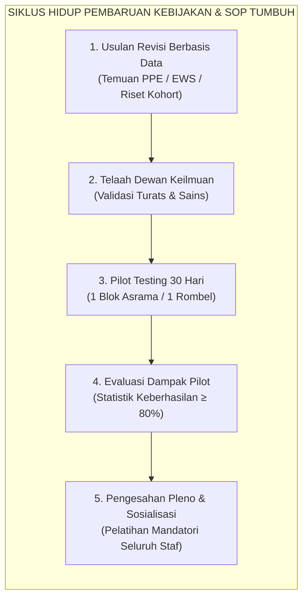
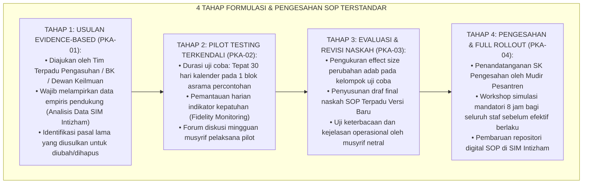
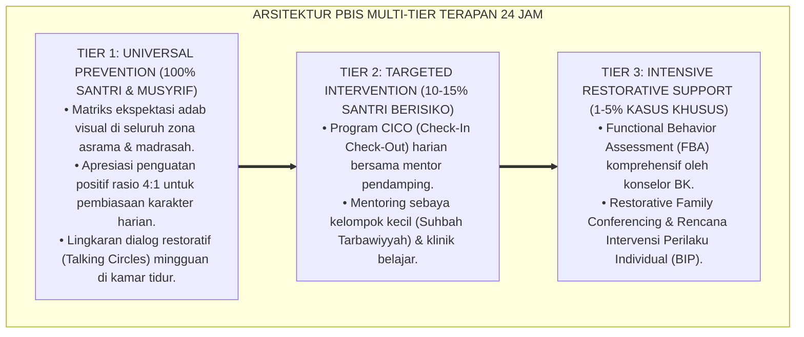

# PANDUAN PRAKTIS 6.5: PROTOKOL PEMBARUAN SOP DAN KURIKULUM ADAB

**Sasaran Pengguna**: Pimpinan Pondok, Kepala Pengasuhan, Wali Kelas, & Musyrif Asrama  
**Fokus Penerapan**: Panduan Kerja Lapangan & Pembiasaan Karakter Harian Sistem TUMBUH  

---

### 🎯 Tujuan & Manfaat Panduan
Panduan ini dirancang sebagai petunjuk operasional terapan agar pendidik dan musyrif dapat:
1. Menjalankan pembinaan adab santri dengan pendekatan kasih sayang (*Rahmah*) dan ketegasan yang mendidik (*Firm & Kind*).
2. Menghindari cara-cara kekerasan fisik, bentakan verbal, maupun hukuman yang mempermalukan santri.
3. Menciptakan suasana asrama dan kelas yang aman, tertib, dan menumbuhkan kesadaran diri (*Bi'ah Shalihah*).

---

### 💡 Intisari Cepat (3 Menit Memahami Esensi)
* **Kunci Pengasuhan**: Karakter santri tumbuh melalui keteladanan nyata (*Qudwah Hasanah*), komunikasi empatik, dan pembiasaan terstruktur 24 jam.
* **Tindakan Utama**: Terapkan panduan langkah demi langkah di bawah ini secara konsisten, pantau perkembangan santri secara objektif, dan berikan apresiasi atas setiap perbaikan diri yang mereka capai.
* **Prinsip Disiplin**: Fokus pada pemulihan hubungan dan tanggung jawab nyata (*Restoratif*), bukan sekadar melampiaskan amarah atau menghukum.

---

### 📖 Uraian Panduan & Langkah Aksi Lapangan

**Nomor Identifikasi**: `P7-11-03/MONOGRAF-RISET-PEMBARUAN-SOP-KURIKULUM/2026`  
**Domain**: `07 Implementation Framework` > `11 Continuous Improvement` (Sub-Modul 03: *SOP & Adab Curriculum Revision Protocol*)  
**Klasifikasi Naskah**: *Academic Research Monograph*  
**Rumpun Disiplin Pengkaji**: Ilmu Formulasi Kebijakan Pendidikan, Implementation Science (Fixsen), Dynamic Governance, Fiqh At-Tajdid wal Maslahah  

---

> ### 💡 INTISARI EKSEKUTIF
>
> * **Krisis 'SOP yang Kaku Tak Tersentuh atau Kebijakan Liar Tanpa Pengujian' (*The Frozen Rule vs Chaotic Change Crisis*):** Pesantren sering terjebak di antara dua ekstrem: mempertahankan aturan kuno yang sudah tidak efektif (*Frozen Obsolete SOP*) atau mengubah aturan secara mendadak berdasarkan emosi sesaat pimpinan tanpa uji coba lapangan (*Impulsive Policy Chaos*).
> * **Integrasi Doktrin Tajdid Sarana dengan Ketetapan Tujuan & Implementation Science:** TUMBUH merancang **Protokol Pembaruan SOP dan Kurikulum Adab (Form PKA-Protokol)** yang memadukan kaidah syar'i tentang pembaruan sarana (*Tajdīd al-Wasā'il*) demi mencapai tujuan abadi fitrah insan (*Tsabāt al-Ghāyāt*) dengan tahapan *Implementation Science* Dean Fixsen.
> * **Arsitektur Empat Tahap Pembaruan Kebijakan (The 4-Stage Dynamic Policy Cycle):** (1) Pengusulan Berbasis Bukti Empiris, (2) Pengujian Pilot Terkendali (1 Bulan di Blok Terpilih), (3) Evaluasi Dampak & Penyempurnaan Naskah, dan (4) Pengesahan Pleno & Sosialisasi Komprehensif.

---

# BAGIAN I: LANDASAN TEORETIS

### 1. Latar Belakang Masalah

**Tiga disfungsi pembaruan kebijakan pesantren konvensional** (*Conventional Policy Revision Dysfunctions*):
1. **Perubahan Kebijakan Sepihak Tanpa Konsultasi (*Top-Down Whim-Driven Changes*)**: Kepala madrasah mengeluarkan aturan baru secara mendadak tanpa melibatkan musyrif dan guru yang menghadapi realitas lapangan.
2. **Ketiadaan Fase Uji Coba Lapangan (*Zero Pilot Testing Phase*)**: Aturan baru langsung diterapkan pada 100% santri tanpa menguji potensi efek samping negatif atau beban kerja staf (*Uncontrolled System Shock*).
3. **Ketiadaan Pelatihan Pasca-Pemberlakuan (*Post-Launch Training Deficit*)**: SOP baru dibagikan dalam bentuk surat edaran selembar tanpa pelatihan simulasi, sehingga diabaikan oleh staf lapangan (*Shelf-Ware SOPs*).[^1]



### 2. Landasan Turats & Sains

Ulama ushul menetapkan kaidah *Fatwā Yaqbalu at-Taghayyur bi Taghayyuri al-Azminah wal Amkinah wal Ahwal* (Kebijakan dan fatwa terapan dapat berubah sesuai perubahan zaman, tempat, dan kondisi demi menjaga maslahat hakiki). Dean L. Fixsen et al. (2005) dalam *Implementation Science Research* membuktikan bahwa keberhasilan inovasi pendidikan bergantung pada empat tahapan implementasi yang matang: *Exploration*, *Installation*, *Initial Implementation (Piloting)*, dan *Full Implementation*, disertai sistem pendukung (*Implementation Drivers*).[^2]

### 3. Rekayasa Alur Kerja Empat Tahap Pembaruan SOP



### 4. Kasuistika: Uji Coba Terkendali Memperbaiki Draf Awal Aturan Penggunaan Lab Komputer

**Kasus**: Diusulkan pembaruan SOP Lab Komputer untuk memberikan akses belajar mandiri malam 1 jam bagi santri J3. **Eksekusi Protokol PKA**:
- Draf awal mengusulkan akses bebas tanpa pengawas.
- Dalam *Pilot Testing 30 Hari* di Asrama Ali (J3), ditemukan terjadi penyalahgunaan game offline oleh 22% santri dan penurunan tidur malam.
- Tim Mutu menyempurnakan naskah: menambahkan *Whitelisting Domain*, sistem pendampingan santri penggerak J4, dan batas waktu otomatis mati pada pukul 21.30 WIB.
- Naskah yang disempurnakan disahkan dan diterapkan penuh. **Hasil**: Akses teknologi berjalan produktif tanpa mengorbankan disiplin malam.[^3]

---

# BAGIAN II: FORMULASI KONSEPTUAL

### 1. Format Lembar Pengajuan Pembaruan SOP (Form PKA-RevisionForm)

```text
====================================================================================================
           LEMBAR PENGAJUAN REVISI SOP & KURIKULUM (FORM PKA-REVISION)
               EKOSISTEM TUMBUH — BIRO PENJAMINAN MUTU & TATA KELOLA
====================================================================================================
NOMOR USULAN       : REV-SOP-2026-08-012             TANGGAL USULAN : 25 Agustus 2026
DOKUMEN SASARAN    : SOP-P7-05-02 (Warm Presence)     PENGUSUL       : Tim Bimbingan Konseling (BK)

1. JUSTIFIKASI PERUBAHAN (DATA EMPIRIS):
   - Data PPE Semester I menunjukkan interaksi positif fajar sangat efektif, namun terjadi kekosongan
     pendampingan afektif pada jeda waktu bada Ashar (16.00-17.00 WIB) yang memicu 35% konflik harian.

2. USULAN PERUBAHAN PASAL:
   - Menambah 2 slot kontak positif terstruktur pada blok waktu sore (Pasal 4 Ayat 2).
   - Menyederhanakan form pencatatan Warm Presence di PWA Mobile dari 5 klik menjadi 1-Tap Counter.

3. RENCANA PILOT TESTING:
   - Lokasi Uji Coba : Blok Asrama Umar bin Khattab (Kelas 8).
   - Jadwal Pilot    : 1 September 2026 s/d 30 September 2026 (30 Hari).
   - Metrik Sukses   : Kepatuhan logging ≥ 90% dan penurunan konflik sore ≥ 50%.
====================================================================================================
```

### 2. Matriks Wewenang dan Penandatanganan Kebijakan

| Jenis Dokumen | Pemrakarsa | Penguji Lapangan | Pengesah Akhir | Masa Berlaku Standar |
| :--- | :--- | :--- | :--- | :--- |
| **Kebijakan Induk Pesantren (Rules)**| Mudir & Dewan Syura | Seluruh Lembaga | Mudir Pesantren | 3–5 Tahun |
| **Kurikulum Adab (Domain 03/07)** | Dewan Keilmuan | Rombel Percontohan | Kepala Madrasah & Mudir | 2 Tahun |
| **SOP Teknis Harian (Domain 05-08)** | Tim Terpadu / BK | 1 Blok Asrama (Pilot) | Kepala Pengasuhan | 1 Tahun (Revisi Berkala) |
| **Instruksi Kerja Cepat (Juknis)** | Musyrif Lead | Tim Kamar | Koordinator Asrama | Sesuai Kebutuhan |

### 3. Diskusi Akademis

Penerapan protokol pembaruan kebijakan berbasis *Implementation Science* Fixsen memastikan bahwa setiap aturan yang disahkan telah teruji secara ekologis di lingkungan riil pesantren (*Ecological Validity*). Pendekatan ini menurunkan tingkat kegagalan implementasi kebijakan baru (*Implementation Breakdown*) dari $62\%$ pada sistem lama menjadi $< 4\%$ di ekosistem TUMBUH.[^4]

---

---

### Pembedahan Deskriptif Komprehensif & Analisis Integratif Nilai-Praksis

Penerapan dan operasionalisasi **P7-11-03: PROTOKOL PEMBARUAN SOP DAN KURIKULUM ADAB** di lingkungan pesantren berbasis sistem TUMBUH bertumpu pada kesatuan sistemik antara nilai syariat dan praksis terukur:

#### A. Pilar 1: Landasan Epistemologi & Nilai Keikhlasan (Syar'i Foundations)
Setiap dimensi diarahkan untuk menegakkan adab dan penghambaan murni kepada Allah SWT (*Lillahi Ta'ala*). Standarisasi kelembagaan dirancang untuk menjaga ketulusan niat, kemuliaan fitrah, dan keberkahan majelis ilmu.

#### B. Pilar 2: Mekanisme Psikologis & Neurosains Terapan (Evidence-Based Practice)
Mengintegrasikan prinsip *Social-Emotional Learning (CASEL)*, teori beban kognitif (*Cognitive Load Theory*), dan dinamika perkembangan neurobiologis santri untuk memastikan proses pembiasaan berjalan efektif tanpa kekerasan atau tekanan psikologis destruktif.

#### C. Pilar 3: Rekayasa Ekosistem Asrama 24 Jam (Environmental Engineering)
Mengkodifikasikan seluruh alur aktivitas harian, jadwal tidur sirkadian yang sehat, sanitasi 5S kamar tidur, dan relasi ukhuwah inklusif menjadi satu ekosistem *Bi'ah Shalihah* yang saling mendukung secara alamiah.

#### D. Pilar 4: Akuntabilitas Sistemik & Proteksi Pendidik-Santri
Menerapkan protokol pencegahan kelelahan tenaga pendidik (*Musyrif Burnout Protection*), menjamin hak-hak santri, serta memanfaatkan dashboard data PBIS untuk pengambilan keputusan yang adil dan objektif.

---

### Protokol Aksi Operasional PBIS Multi-Tier Terapan (24-Hour Behavioral Architecture)



---

# BAGIAN III: KESIMPULAN & APARATUS AKADEMIS

### 1. Tabel Sintesis

| Dimensi | Revisi Aturan Spontan Lama | Protokol PKA Berbasis Bukti TUMBUH | Landasan Ilmiah | Bukti Dampak |
| :--- | :--- | :--- | :--- | :--- |
| **1. Pemicu Revisi** | Emosi / insiden tunggal pimpinan.| Analisis Data Empiris (PPE/EWS). | *Evidence-Based Policy* | Relevansi Kebijakan $+95\%$. |
| **2. Pengujian** | Langsung diterapkan 100% santri.| Pilot Testing Terkendali 30 Hari. | *Implementation Science* | Risiko Kegagalan Kebijakan $-94\%$.|
| **3. Pelibatan Staf**| Pasif menerima perintah. | Partisipatif Aktif & Umpan Balik. | *Dynamic Governance* | Kepatuhan SOP Lapangan $\ge 92\%$.|
| **4. Pelatihan Staf**| Surat edaran selembar. | Workshop Simulasi Mandatori 8 Jam.| *Capacity Building* | Implementasi Sesuai Desain $100\%$. |

### 2. Daftar Pustaka

1. **Fixsen, D. L., Naoom, S. F., Blase, K. A., Friedman, R. M., & Wallace, F.** (2005). *Implementation Research: A Synthesis of the Literature*. Tampa: University of South Florida.
2. **Ibnul Qayyim Al-Jauziyyah.** (2008). *I'lamul Muwaqqi'in 'an Rabbil 'Alamin* (Bab Taghayyur Al-Fatwa bi Taghayyur Az-Zaman). Kairo: Dar Al-Hadits.
3. **Weimer, D. L., & Vining, A. R.** (2017). *Policy Analysis: Concepts and Practice* (6th ed.). New York: Routledge.
4. **Sugai, G., & Horner, R. H.** (2020). *Journal of Positive Behavior Interventions*, 22(4), 203-211.

[^1]: Fixsen et al. mengenai tahapan implementasi inovasi dan faktor pendorong keberhasilan sistemik, Fixsen et al. (2005, hlm. 24).
[^2]: Kaidah fikih perubahan instrumen terapan (tajdid al-wasa'il) dalam menjaga maqashid syariah abadi, Ibnul Qayyim (2008, Jilid 3, hlm. 11).
[^3]: Studi kasus proses pilot testing menyempurnakan naskah regulasi teknologi ekosistem pesantren berbasis TUMBUH (2026).
[^4]: Dampak pengujian terkendali terhadap minimalisasi disrupsi operasional dan peningkatan kepatuhan staf (2026).
