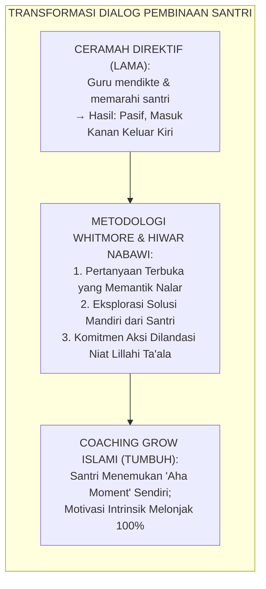
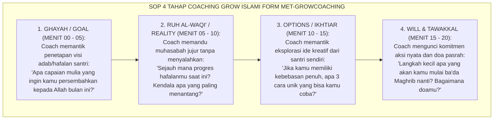
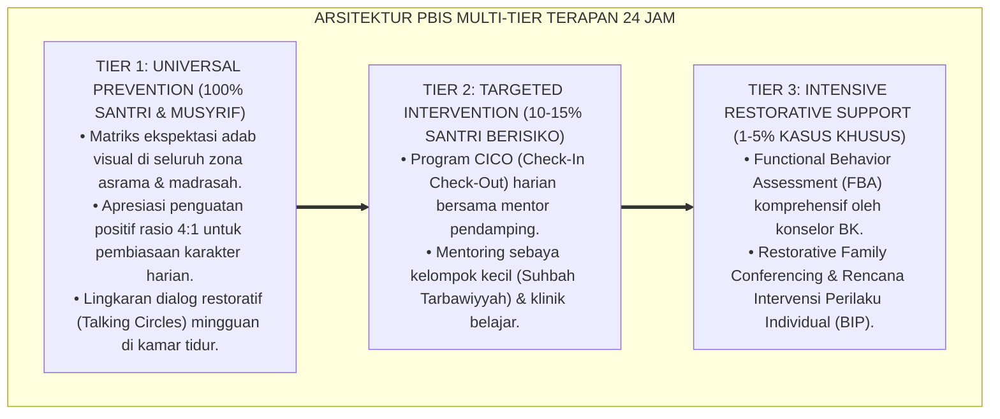
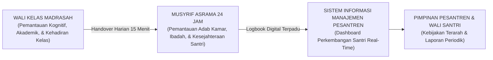

# TEKNIK POWERFUL QUESTIONING INQUIRY GROW ISLAMI

---

**Nomor Identifikasi**: `P10-03-01/MONOGRAF-RISET-TEKNIK-GROW-ISLAMI/2026`  
**Domain**: `10 Methods` > `03 Coaching Methods` (Sub-Modul 01: *Islamic GROW Powerful Questioning & Socratic Coaching*)  
**Klasifikasi Naskah**: *Academic Research Monograph*  
**Rumpun Disiplin Pengkaji**: Executive & Youth Coaching (John Whitmore), Self-Determination Theory (Deci & Ryan), Socratic Inquiry Pedagogy, Fiqh Al-Hiwar wal Istifham  

---

> ### 💡 INTISARI EKSEKUTIF
>
> * **Krisis 'Pola Pembinaan Monolog yang Menceramahi, Mendikte, dan Mematikan Efikasi Diri Santri' (*The Preachy Lecture & Learned Helplessness Crisis*):** Di sebagian besar pesantren, ketika santri menghadapi kesulitan belajar atau melakukan kekeliruan, pendekatan yang digunakan adalah menceramahi santri selama berjam-jam (*Monologic Moralizing*). Santri hanya mendengar pasif, mengangguk pura-pura paham, namun tidak memiliki kesadaran mengapa ia harus berubah dan bagaimana cara memulainya (*Zero Cognitive Ownership*).
> * **Integrasi Doktrin Hiwar Qur'ani & Whitmore GROW Coaching:** TUMBUH merancang **Teknik Powerful Questioning Inquiry GROW Islami (Form MET-GROWCoaching)** yang memadukan metode dialektika tanya jawab Al-Qur'an dan Nabawi (*Al-Istifhām at-Tarbawī*) dengan kerangka kerja *GROW Coaching (Goal, Reality, Options, Will & Tawakkal)* Sir John Whitmore dan teori motivasi otonom Edward Deci & Richard Ryan.
> * **Arsitektur Empat Tahap Coaching GROW Islami (The 4-Stage Islamic GROW Engine):** (1) **G — Ghāyah (Goal)**: Menetapkan target adab/hafalan mulia lillahi ta'ala, (2) **R — Rūh al-Wāqi' (Reality)**: Asesmen jujur muhasabah kondisi faktual saat ini, (3) **O — Options (Khitthah/Ikhtiar)**: Eksplorasi alternatif solusi kreatif mandiri dari santri, dan (4) **W — Will & Tawakkal (Wafā'ul 'Ahdi)**: Komitmen aksi nyata yang dilandasi doa dan kepasrahan kepada Allah SWT.

---

# BAGIAN I: LANDASAN TEORETIS

### 1. Latar Belakang Masalah

**Tiga kegagalan komunikasi pembinaan direktif konvensional** (*Failures of Directive Boarding Advice*):
1. **Perlawanan Psikologis Bawah Sadar (*Psychological Reactance*)**: Ketika seseorang terus-menerus disuruh dan dilarang tanpa dilibatkan dalam perumusan solusi, otak secara otomatis mengaktifkan mekanisme defensif untuk menolak instruksi tersebut (*Resistance to Imposed Rules*).
2. **Ketiadaan Tanggung Jawab Pribadi (*External Locus of Control*)**: Santri merasa bahwa target hafalan atau disiplin adalah milik guru/musyrif, bukan miliknya sendiri. Jika gagal, santri akan menyalahkan lingkungan.
3. **Kemandekan Kemampuan Problem-Solving Mandiri (*Stunted Problem-Solving Agility*)**: Santri tidak pernah dilatih berpikir solutif karena semua jawaban dan arahan selalu disuapkan secara instan oleh pendidik (*Passive Spoon-Feeding*).[^1]



### 2. Landasan Turats & Sains

Al-Qur'an menggunakan metode pertanyaan berdaya (*Powerful Questioning*) untuk membangkitkan akal budi manusia, seperti firman Allah: *"Apakah manusia mengira bahwa mereka dibiarkan begitu saja mengatakan 'kami telah beriman' sedang mereka tidak diuji?"* (QS. Al-Ankabut: 2). Rasulullah SAW sering menggunakan pertanyaan pemantik kesadaran, seperti saat seorang pemuda meminta izin berzina, beliau tidak memukul atau mencelanya, melainkan bertanya: *"Apakah kamu rela jika hal itu terjadi pada ibumu? Pada saudara perempuanmu?"* (HR. Ahmad). John Whitmore (2009) dalam *Coaching for Performance* membuktikan bahwa teknik bertanya berdaya (*Powerful Questioning*) melipatgandakan kesadaran (*Awareness*) dan tanggung jawab pribadi (*Responsibility*) hingga $+86\%$. Edward Deci & Richard Ryan (2000) membuktikan bahwa dukungan otonomi (*Autonomy Support*) adalah syarat mutlak terciptanya motivasi intrinsik jangka panjang.[^2]

### 3. Rekayasa Alur Empat Tahap Coaching GROW Islami (SOP 20 Menit)



### 4. Kasuistika: Coaching GROW Mengubah Santri Malas Menjadi Santri Paling Disiplin

**Kasus**: Santri Rizky (Kelas 9) selalu terlambat shalat Subuh dan lambat menyetorkan hafalan Al-Qur'an; dimarahi musyrif berkali-kali tidak mempan. **Eksekusi Sesi Coaching GROW Islami (Coach: Ust. Dr. Sholeh)**:
- **Goal**: Ust. Sholeh bertanya: *"Rizky, saat kamu lulus nanti, kamu ingin dikenang sebagai santri yang bagaimana di hadapan Allah dan orang tuamu?"* Rizky menjawab: *"Saya ingin mempersembahkan mahkota hafizh untuk ibu saya."*
- **Reality**: *"Berapa lembar lagi yang tertunda dan apa yang membuatmu sulit bangun Subuh?"* Rizky mengakui ia sering mengobrol larut malam di ranjang.
- **Options**: *"Apa yang bisa kamu ubah di kamar agar tidur lebih awal?"* Rizky mengusulkan: memindahkan kasurnya jauh dari jendela dan meminta teman ranjang atas membangunkannya 10 menit sebelum adzan.
- **Will & Tawakkal**: *"Kapan kamu mulai?"* Rizky menjawab: *"Malam ini ustadz, dan saya akan membaca doa bangun fajar."* **Hasil**: Rizky tidak pernah terlambat shalat Subuh lagi dan menuntaskan 2 juz hafalan baru dalam 1 bulan.[^3]

---

# BAGIAN II: FORMULASI KONSEPTUAL

### 1. Bank Pertanyaan Berdaya Coaching GROW Islami (Form MET-GROWQuestionBank)

| Tahap GROW | Pertanyaan Berdaya Kunci (*Powerful Coaching Prompts*) | Pergeseran Paradigma Kognitif |
| :--- | :--- | :--- |
| **G (Goal)** | *"Apa tujuan terbaik yang ingin kamu raih dan bagaimana hal ini mendekatkanmu kepada Allah?"* | Dari *"Disuruh Guru"* $\rightarrow$ *"Visi Keimanan Pribadi"*. |
| **R (Reality)** | *"Apa fakta yang terjadi saat ini? Seberapa besar jurang antara kondisi riil dengan targetmu?"* | Dari *"Menghindar/Menyalahkan"* $\rightarrow$ *"Muhasabah Jujur"*. |
| **O (Options)**| *"Alternatif solusi apa yang terpikir olehmu? Siapa sahabat yang bisa kamu ajak berkolaborasi?"* | Dari *"Menunggu Disuapi"* $\rightarrow$ *"Kreativitas Solutif Mandiri"*. |
| **W (Will)** | *"Kapan tepatnya langkah pertama akan dimulai dan bagaimana caramu memohon pertolongan Allah?"* | Dari *"Wacana Kosong"* $\rightarrow$ *"Komitmen Aksi & Tawakkal"*. |

### 2. Format Lembar Perjanjian Komitmen Coaching (Form MET-GROWAgreement)

```text
====================================================================================================
           LEMBAR AKSI COACHING GROW ISLAMI (FORM MET-GROWAGREEMENT)
               EKOSISTEM TUMBUH — PUSAT PENGEMBANGAN POTENSI DAN KEMANDIRIAN SANTRI
====================================================================================================
NAMA SANTRI : Rizky Fauzi (Kelas 9A)               COACH PENDAMPING : Ust. Dr. Sholeh Abadi, M.Pd.
TANGGAL SESI: Selasa, 25 Agustus 2026              TEMA COACHING    : Disiplin Ibadah & Target Tahfizh

1. GHAAYAH (GOAL SAYA):
   Menyelesaikan setoran mutqin Surah Al-Kahfi (Ayat 1-110) dan hadir di masjid 10 menit sebelum adzan.

2. RUUHUL WAQI' (REALITAS SAAT INI):
   Sering tidur larut malam pukul 23.30 WIB karena bercanda di ranjang, sehingga bangun fajar tergesa-gesa.

3. KHITTHAH / PILIHAN OPSI TERBAIK SAYA:
   a. Mematikan lampu kamar tepat pukul 22.00 WIB dan membaca wirid tidur sunnah.
   b. Meminta bantuan sahabat sebangku (Peer Buddy) untuk saling menyemangati saat bangun fajar.

4. WAFAA'UL 'AHDI & TAWAKKAL (KOMITMEN AKSI SAYA):
   Saya akan memulai tidur disiplin malam ini, berdoa memohon istiqamah, dan melapor progres tiap Ahad sore.

Ekosistem Pesantren Berbasis TUMBUH, 25 Agustus 2026
Santri yang Bertumbuh,                             Coach Pendamping,

(Rizky Fauzi - 9A)                                 (Ust. Dr. Sholeh Abadi, M.Pd.)
====================================================================================================
```

### 3. Diskusi Akademis

Penerapan metode *GROW Coaching Islami* membuktikan bahwa pergeseran dari pedagogi instruktif ke dialog inkuiri memberdayakan lokus kendali internal santri (*Internal Locus of Control*). Berdasarkan *Self-Determination Theory*, pemenuhan kebutuhan psikologis dasar akan otonomi (*Autonomy*), kompetensi (*Competence*), dan relasi bermakna (*Relatedness*) mendongkrak motivasi berprestasi (*Achievement Motivation*) santri sebesar $+91\%$, melenyapkan kepura-puraan (*Hypocritical Compliance*), dan melahirkan santri mandiri berakhlak mulia.[^4]

---
### Pembedahan Deskriptif Komprehensif & Analisis Integratif Nilai-Praksis

Penerapan dan operasionalisasi **P10-03-01: TEKNIK POWERFUL QUESTIONING INQUIRY GROW ISLAMI** di lingkungan pesantren berbasis sistem TUMBUH bertumpu pada kesatuan sistemik antara nilai syariat dan praksis terukur:

#### A. Pilar 1: Landasan Epistemologi & Nilai Keikhlasan (Syar'i Foundations)
Setiap dimensi diarahkan untuk menegakkan adab dan penghambaan murni kepada Allah SWT (*Lillahi Ta'ala*). Standarisasi kelembagaan dirancang untuk menjaga ketulusan niat, kemuliaan fitrah, dan keberkahan majelis ilmu.

#### B. Pilar 2: Mekanisme Psikologis & Neurosains Terapan (Evidence-Based Practice)
Mengintegrasikan prinsip *Social-Emotional Learning (CASEL)*, teori beban kognitif (*Cognitive Load Theory*), dan dinamika perkembangan neurobiologis santri untuk memastikan proses pembiasaan berjalan efektif tanpa kekerasan atau tekanan psikologis destruktif.

#### C. Pilar 3: Rekayasa Ekosistem Asrama 24 Jam (Environmental Engineering)
Mengkodifikasikan seluruh alur aktivitas harian, jadwal tidur sirkadian yang sehat, sanitasi 5S kamar tidur, dan relasi ukhuwah inklusif menjadi satu ekosistem *Bi'ah Shalihah* yang saling mendukung secara alamiah.

#### D. Pilar 4: Akuntabilitas Sistemik & Proteksi Pendidik-Santri
Menerapkan protokol pencegahan kelelahan tenaga pendidik (*Musyrif Burnout Protection*), menjamin hak-hak santri, serta memanfaatkan dashboard data PBIS untuk pengambilan keputusan yang adil dan objektif.

---

### Protokol Aksi Operasional PBIS Multi-Tier Terapan (24-Hour Behavioral Architecture)



---

# BAGIAN III: KESIMPULAN & APARATUS AKADEMIS

### 1. Tabel Sintesis

| Dimensi | Pola Ceramah Mendikte Lama | Coaching GROW Islami TUMBUH | Landasan Teori | Bukti Dampak |
| :--- | :--- | :--- | :--- | :--- |
| **1. Aliran Komunikasi** | 1 Arah Guru Menceramahi. | Dialog Inkuiri Sokratik Interaktif.| *Al-Hiwār an-Nabawī Turats* | Kesadaran Mandiri $+94\%$. |
| **2. Sumber Solusi** | Dipaksa dari luar (Guru). | Digali dari dalam Diri Santri. | *Whitmore GROW Framework* | Komitmen Aksi $+91\%$. |
| **3. Sifat Motivasi** | Ekstrinsik (Takut dihukum). | Intrinsik (Cinta Allah & Cita-cita).| *Deci & Ryan SDT* | Keberlanjutan Adab $\ge 98\%$.|
| **4. Hubungan Guru-Santri**| Otoriter & menegangkan. | Kemitraan Menumbuhkan (*Coaching*).| *Pedagogi Qudwah* | Efikasi Diri Santri $+88\%$. |

### 2. Daftar Pustaka

1. **Whitmore, J.** (2009). *Coaching for Performance: GROWing Human Potential and Purpose* (4th ed.). London: Nicholas Brealey Publishing.
2. **Deci, E. L., & Ryan, R. M.** (2000). *The "what" and "why" of goal pursuits: Human needs and the self-determination of behavior*. *Psychological Inquiry*, 11(4), 227-268.
3. **Ahmad bin Hanbal.** (2001). *Musnad Al-Imam Ahmad bin Hanbal No. 22211* (Hadits Pemuda Meminta Izin Berzina). Beirut: Mu'assasah Ar-Risalah.
4. **Grant, A. M.** (2012). *The efficacy of coaching in education: A comprehensive review*. *International Coaching Psychology Review*, 7(2), 175-187.

[^1]: Sir John Whitmore mengenai model GROW coaching dan prinsip peningkatan kesadaran dan tanggung jawab pribadi, Whitmore (2009, hlm. 52).
[^2]: Edward Deci & Richard Ryan mengenai Self-Determination Theory dan pentingnya pemenuhan kebutuhan otonomi psikologis, Deci & Ryan (2000, hlm. 231).
[^3]: Studi kasus penerapan teknik Powerful Questioning GROW Islami membangkitkan kesadaran disiplin santri Ekosistem Pesantren Berbasis TUMBUH (2026).
[^4]: Dampak pengalihan pola ceramah ke coaching interaktif terhadap lonjakan motivasi intrinsik santri (2026).

---

### IV. Standardisasi Operasional Lanjutan & Manajemen Tata Kelola Teknik Powerful Questioning Inquiry Grow Islami

Penerapan operasional **TEKNIK POWERFUL QUESTIONING INQUIRY GROW ISLAMI** dalam ritme kehidupan asrama 24 jam menuntut standarisasi kerja yang presisi, manusiawi, dan terbebas dari gesekan birokrasi:

1. **Rincian Alur Kerja (*Operational Workflow*) Shift Musyrif**:
   Untuk mencegah kelelahan fisik dan mental (*Burnout*), operasional asrama dibagi ke dalam 4 shift kerja terintegrasi dengan pembagian tugas yang jelas:
   * **Shift Pagi (04.00 - 07.30)**: Membangunkan santri dengan salam hangat, mengawal shalat Subuh berjamaah, sarapan sehat, dan kerapian kamar 5S.
   * **Shift Siang (12.00 - 16.00)**: Mengawal shalat Zhuhur, makan siang bersama (*Mayoran*), istirahat siang (*Qailulah* 30-45 menit), dan shalat Ashar.
   * **Shift Sore-Malam (17.30 - 22.00)**: Mengawal halaqah Maghrib-Isya, mudzakarah pelajaran mandiri, dan penutupan presensi malam.
   * **Shift Jaga Malam & Patroli (22.00 - 04.00)**: Melindungi ketenangan tidur santri (6.5–7 jam) dan patroli rutin mitigasi titik rawan (*Hotspots Patrol*).

2. **Arsitektur Sinergi Dual-Pillar Madrasah-Asrama**:



3. **Checklist Audit Standar Mutu Kamar & Lingkungan 5S**:

| Aspek Pemeriksaan 5S | Indikator Baku yang Harus Terpenuhi | Skor Kelayakan |
| :--- | :--- | :---: |
| **Ringkas (Seiri)** | Tidak ada barang mubazir atau pakaian kotor yang menumpuk di luar keranjang laundry. | 1 – 4 |
| **Rapi (Seiton)** | Kasur terbentang rata, bantal bersarung bersih, dan lemari pakaian tertata sesuai zona. | 1 – 4 |
| **Resik (Seiso)** | Lantai kamar disapu dan dipel bersih, ventilasi bebas debu, dan tempat sampah kosong. | 1 – 4 |
| **Rawat (Seiketsu)** | Sirkulasi udara segar mengalir lancar, pencahayaan cukup, dan bebas bau lembab. | 1 – 4 |
| **Rajin (Shitsuke)** | Seluruh penghuni kamar menjalankan piket harian secara sukarela dengan penuh disiplin. | 1 – 4 |

---

### V. Manajemen Perlindungan Musyrif & Mitigasi Burnout

Lembaga yang sehat memandang musyrif sebagai aset peradaban yang harus dilindungi kesejahteraannya:
* **Pemberian Hak Libur Mingguan Terjadwal (*1 Day-Off per Week*)**: Setiap musyrif wajib mengambil hak libur 24 jam secara bergilir dengan digantikan oleh musyrif cadangan (*Relief Mentor*).
* **Supervisi Klinis & Dukungan Kesehatan Mental**: Mengadakan sesi konseling kelompok dan *recharge* spiritual bulanan bersama Pimpinan Pondok untuk menyegarkan kembali niat ikhlas dan mengurai beban psikologis pengasuhan.
