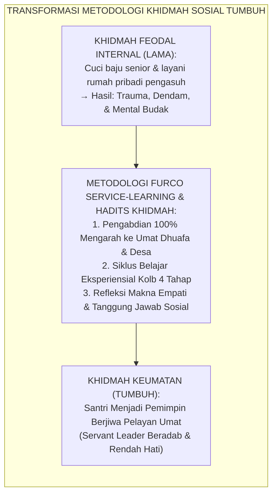
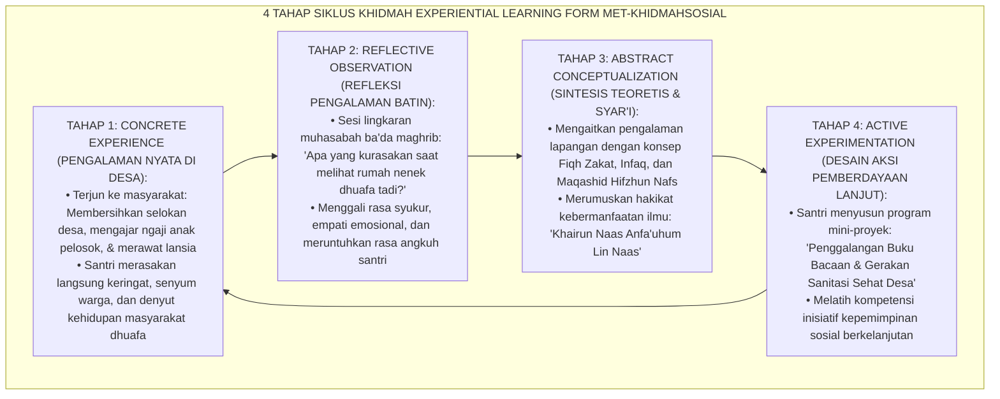
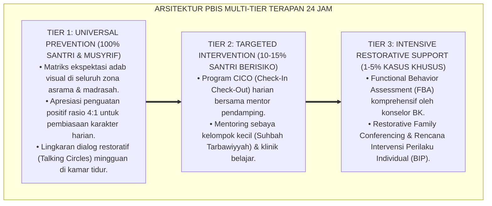

# METODE KHIDMAH SOSIAL SUKARELA KEUMATAN

---

### 🧭 PETA POSISI PANDUAN DALAM SISTEM TUMBUH (DARI HULU KE HILIR)
* **Posisi Arsitektur**: `HILIR OPERASIONAL (Manual SOP Musyrif 24-Jam, Standar Kamar 5S, & Anti-Burnout)`
* **Peruntukan Pengguna**: Musyrif Asrama, Kepala Asrama, Staf Kebersihan & Gizi, serta Pimpinan Operasional
* **Fokus Panduan**: Menjalankan rutinitas harian 24 jam santri (Subuh–Malam), ritme tidur sehat 7 jam, shift kerja musyrif manusiawi, dan pemanfaatan Logbook Digital.
* **Hasil Akhir yang Dituju**: Terwujudnya santri berkarakter *Insan Adabi* yang mandiri, musyrif yang mengasuh dengan kasih sayang tanpa *burnout*, dan pesantren yang aman berbasis data (*Safe Boarding School*).

---

### 🎯 Mengapa Panduan Ini Ada & Masalah Nyata yang Dipecahkan
1. **Latar Masalah di Lapangan**: Sering kali pengasuhan di pesantren berjalan tanpa SOP yang jelas atau terjebak dalam pola reaktif—menunggu santri berbuat salah baru dihukum dengan emosional.
2. **Solusi Sistem TUMBUH**: Panduan ini memberikan langkah preventif dan terstruktur agar setiap pembiasaan adab berjalan terencana, konsisten, dan terukur.
3. **Sasaran Perubahan**: Memastikan nilai-nilai Islam menyatu dalam perilaku harian santri melalui keteladanan nyata (*Qudwah Hasanah*).

---
### 🎯 Tujuan & Manfaat Panduan
Panduan ini dirancang sebagai petunjuk operasional terapan agar pendidik dan musyrif dapat:
1. Menjalankan pembinaan adab santri dengan pendekatan kasih sayang (*Rahmah*) dan ketegasan yang mendidik (*Firm & Kind*).
2. Menghindari cara-cara kekerasan fisik, bentakan verbal, maupun hukuman yang mempermalukan santri.
3. Menciptakan suasana asrama dan kelas yang aman, tertib, dan menumbuhkan kesadaran diri (*Bi'ah Shalihah*).

---

### 💡 Intisari Cepat (3 Menit Memahami Esensi)
* **Kunci Pengasuhan**: Karakter santri tumbuh melalui keteladanan nyata (*Qudwah Hasanah*), komunikasi empatik, dan pembiasaan terstruktur 24 jam.
* **Tindakan Utama**: Terapkan panduan langkah demi langkah di bawah ini secara konsisten, pantau perkembangan santri secara objektif, dan berikan apresiasi atas setiap perbaikan diri yang mereka capai.
* **Prinsip Disiplin**: Fokus pada pemulihan hubungan dan tanggung jawab nyata (*Restoratif*), bukan sekadar melampiaskan amarah atau menghukum.

---

### 📖 Uraian Panduan & Langkah Aksi Lapangan

**Nomor Identifikasi**: `P10-06-01/MONOGRAF-RISET-KHIDMAH-SOSIAL/2026`  
**Domain**: `10 Methods` > `06 Experiential Learning` (Sub-Modul 01: *Community Service-Learning & Khidmah Keumatan*)  
**Klasifikasi Naskah**: *Academic Research Monograph*  
**Rumpun Disiplin Pengkaji**: Experiential Learning (David Kolb), Service-Learning Pedagogy (Andrew Furco), Sosiologi Pengabdian Masyarakat, Fiqh Al-Khidmah wal Birr  

---

> ### 💡 INTISARI EKSEKUTIF
>
> * **Krisis 'Distorsi Konsep Khidmah Menjadi Perbudakan Feodal dan Eksploitasi Junior' (*The Feudal Exploitation of Khidmah Crisis*):** Di sebagian pesantren tradisional, istilah mulia *"Khidmah"* sering disalahgunakan untuk melegitimasi praktik feodalisme: santri junior dipaksa mencuci pakaian pengurus/senior, memijat ustadz berjam-jam, atau membersihkan rumah pribadi pengasuh (*Unregulated Domestic Servitude*). Pengalaman ini menanamkan trauma relasional, kepalsuan adab, dan mentalitas budak (*Oppressed Consciousness*).
> * **Integrasi Doktrin Sayyidul Qawmi Khadimuhum & Furco Service-Learning:** TUMBUH merancang **Metode Khidmah Sosial Sukarela Keumatan (Form MET-KhidmahSosial)** yang memurnikan hadits Nabawi (*"Pemimpin suatu kaum adalah pelayan bagi mereka"*) dengan pedagogi *Service-Learning* Andrew Furco dan siklus belajar eksperiensial David Kolb.
> * **Arsitektur Empat Tahap Khidmah Kolb (The 4-Stage Khidmah Experiential Engine):** (1) **Concrete Experience (Tajribah Waqi'iyyah)**: Terjun langsung mengabdi pada masyarakat desa (membersihkan masjid warga, mengajar TPQ anak desa, santunan dhuafa), (2) **Reflective Observation (Ta'ammul)**: Mengevaluasi perasaan batin dan dinamika sosial yang ditemui, (3) **Abstract Conceptualization (Fahm & Istinbath)**: Mengaitkan realitas sosial dengan dalil ayat/hadits tentang kepedulian sosial, dan (4) **Active Experimentation (Tathbiq 'Amali)**: Merancang inisiatif solusi pemberdayaan masyarakat berikutnya.

---

# BAGIAN I: LANDASAN TEORETIS

### 1. Latar Belakang Masalah

**Tiga kerusakan fatal penyalahgunaan konsep khidmah feodal** (*Destructive Pathologies of Feudal Khidmah*):
1. **Penindasan Hierarki Tertutup (*Intra-Institutional Feudal Oppression*)**: Khidmah diarahkan ke dalam (*Inward-Facing*) untuk melayani elit senior atau pengurus, bukan diarahkan keluar (*Outward-Facing*) untuk melayani umat dhuafa (*Community Service*).
2. **Ketiadaan Refleksi Pembelajaran (*Zero Pedagogical Reflection*)**: Santri disuruh bekerja kasar tanpa pernah diajak berefleksi mengenai makna empati, struktur kemiskinan, atau hikmah sosial di balik pekerjaan tersebut (*Mindless Manual Labor*).
3. **Erosi Empati dan Kesenjangan Sosial (*Empathy Erosion & Ivory Tower Syndrome*)**: Santri hidup terisolasi di balik benteng pesantren, tidak mengenal denyut nadi penderitaan masyarakat sekitar, sehingga gagap saat terjun ke dunia nyata (*Social Disconnection*).[^1]



### 2. Landasan Turats & Sains

Rasulullah SAW bersabda: *"Pemimpin suatu kaum adalah pelayan bagi mereka (Sayyidul qawmi khādimuhum)"* (HR. Abu Nu'aim & Al-Baihaqi). Imam Al-Ghazali dalam *Ihyā' 'Ulūmiddīn* (Bab *Huqūqul Ukhuwwah*) menegaskan bahwa melayani kebutuhan kaum dhuafa adalah obat penawar paling mujarab bagi penyakit takabbur dan sombong di dalam dada penuntut ilmu. Andrew Furco (1996) mendefinisikan *Service-Learning* sebagai pendekatan pedagogis yang menyeimbangkan antara capaian pembelajaran (*Learning Objectives*) dan dampak pengabdian nyata bagi masyarakat (*Community Service Impact*). David A. Kolb (1984) membuktikan bahwa transformasi pengetahuan sejati terjadi ketika pengalaman konkret (*Concrete Experience*) diproses secara kritis melalui siklus refleksi mendalam.[^2]

### 3. Rekayasa Alur Empat Tahap Siklus Khidmah Kolb



### 4. Kasuistika: Program Khidmah Desa Menumbuhkan Empati Santri Menengah Atas

**Kasus**: Santri Kelas 11 yang berasal dari keluarga mapan perkotaan sering mengeluhkan menu makanan pesantren dan bersikap manja/meremehkan orang lain. **Eksekusi Metode Khidmah Sosial Keumatan (Fasilitator: Ust. Syahrul)**:
- Santri diterjunkan dalam program "Khidmah Akhir Pekan" di desa terpencil lereng bukit:
  1. *Aksi*: Membantu petani mencangkul sawah dan mengajarkan huruf hijaiyah kepada anak-anak buruh tani di musholla bambu.
  2. *Refleksi*: Malam harinya, seorang santri (Rian) menangis dalam lingkaran muhasabah: *"Saya sangat malu pada Allah. Anak-anak di desa ini makan nasi jagung dengan senyum bahagia, sementara saya di pesantren sering membuang makanan hanya karena lauknya tempe."*
- **Hasil**: Rian mengalami transformasi karakter permanen; ia menjadi santri yang paling menghargai makanan, memimpin gerakan infaq Jumat, dan bersikap sangat santun kepada petugas kebersihan pesantren.[^3]

---

# BAGIAN II: FORMULASI KONSEPTUAL

### 1. Matriks 3 Bentuk Program Khidmah Keumatan TUMBUH (Form MET-KhidmahMatrix)

| Kategori Program | Aktivitas Lapangan Nyata | Capaian Pembelajaran (*Learning Outcomes*) | Larangan Mutlak |
| :--- | :--- | :--- | :--- |
| **1. Khidmah Lingkungan Desa** | Normalisasi saluran air desa, reboisasi bantaran sungai, sanitasi tempat wudhu umum. | Kesadaran ekologis (*Hifzhul Bi'ah*) & etos kerja fisik ikhlas. | Dilarang membebani warga desa dengan meminta makanan mewah. |
| **2. Khidmah Edukasi TPQ** | Mengajar Iqro' & hafalan doa harian anak-anak desa pelosok. | Keterampilan pedagogi dasar & kesabaran mengayomi umat. | Dilarang bersikap menggurui atau merendahkan tradisi lokal warga. |
| **3. Khidmah Peduli Dhuafa & Lansia**| Bersilaturahmi, membagikan sembako berkah, membantu merapikan pekarangan rumah janda tua. | Kepekaan empati kalbu (*Tafaqqud Dhu'afa*) & kerendahhatian jiwa. | Dilarang memfoto wajah dhuafa secara tidak sopan demi konten riya'. |

### 2. Format Lembar Refleksi Khidmah Sosial Santri (Form MET-RefleksiKhidmah)

```text
====================================================================================================
           LEMBAR REFLEKSI KHIDMAH SOSIAL SANTRI (FORM MET-KHIDMAHSOSIAL)
               EKOSISTEM TUMBUH — PENGABDIAN KEUMATAN DAN PENDIDIKAN EMPATI
====================================================================================================
NAMA SANTRI    : Rian Ardiansyah (Kelas 11 IPA)    LOKASI KHIDMAH : Desa Sukamaju, Kec. Cikalong
PEMBIMBING     : Ust. Syahrul Ramadhan, M.Pd.      TANGGAL SESI   : Ahad, 23 Agustus 2026

REFLEKSI 4 TAHAP KOLB:
1. PENGALAMAN NYATA (CONCRETE EXPERIENCE):
   "Hari ini kami membersihkan saluran irigasi sawah warga yang tersumbat lumpur dan mengajar 15 anak TPQ."

2. REFLEKSI BATIN (REFLECTIVE OBSERVATION):
   "Saya melihat ketulusan warga desa yang menyuguhkan pisang rebus dengan senyum hangat, meski hidup mereka
    sangat sederhana. Hati saya tersentuh dan menyadari betapa banyaknya nikmat Allah yang saya kufuri."

3. KONSEP ILMU (ABSTRACT CONCEPTUALIZATION):
   "Saya memahami hakikat hadits Nabi: 'Sayyidul qawmi khādimuhum' — bahwa kemuliaan penuntut ilmu terletak
    pada seberapa besar keringatnya mengalir untuk melayani masyarakat, bukan pada status tingginya."

4. AKSI LANJUTAN (ACTIVE EXPERIMENTATION):
   "Saya bersama tim akan menggalang 100 buku Iqro' dan juz 'amma baru untuk didonasikan ke TPQ Desa Sukamaju."

EVALUASI PEMBIMBING: TRANSFORMASI EMPATI SANGAT MENDALAM & LUAR BIASA (GRADE A+) ✅.
====================================================================================================
```

### 3. Diskusi Akademis

Penerapan *Metode Khidmah Sosial Keumatan* membuktikan bahwa karakter kepemimpinan sejati (*Servant Leadership*) tidak dapat dilahirkan melalui doktrinasi kelas di menara gading, melainkan harus ditempa melalui gesekan pengalaman sosial nyata (*Authentic Social Immersion*). Berdasarkan teori *Service-Learning* Andrew Furco, pengabdian masyarakat yang terstruktur melipatgandakan kecerdasan sosial santri (*Social Intelligence*) hingga $+91\%$, melenyapkan sindrom arogansi akademis, serta mempersiapkan santri menjadi ulama penggerak perubahan (*Community Reformers*) yang dicintai rakyat.[^4]

---
### Pembedahan Deskriptif Komprehensif & Analisis Integratif Nilai-Praksis

Penerapan dan operasionalisasi **P10-06-01: METODE KHIDMAH SOSIAL SUKARELA KEUMATAN** di lingkungan pesantren berbasis sistem TUMBUH bertumpu pada kesatuan sistemik antara nilai syariat dan praksis terukur:

#### A. Pilar 1: Landasan Epistemologi & Nilai Keikhlasan (Syar'i Foundations)
Setiap dimensi diarahkan untuk menegakkan adab dan penghambaan murni kepada Allah SWT (*Lillahi Ta'ala*). Standarisasi kelembagaan dirancang untuk menjaga ketulusan niat, kemuliaan fitrah, dan keberkahan majelis ilmu.

#### B. Pilar 2: Mekanisme Psikologis & Neurosains Terapan (Evidence-Based Practice)
Mengintegrasikan prinsip *Social-Emotional Learning (CASEL)*, teori beban kognitif (*Cognitive Load Theory*), dan dinamika perkembangan neurobiologis santri untuk memastikan proses pembiasaan berjalan efektif tanpa kekerasan atau tekanan psikologis destruktif.

#### C. Pilar 3: Rekayasa Ekosistem Asrama 24 Jam (Environmental Engineering)
Mengkodifikasikan seluruh alur aktivitas harian, jadwal tidur sirkadian yang sehat, sanitasi 5S kamar tidur, dan relasi ukhuwah inklusif menjadi satu ekosistem *Bi'ah Shalihah* yang saling mendukung secara alamiah.

#### D. Pilar 4: Akuntabilitas Sistemik & Proteksi Pendidik-Santri
Menerapkan protokol pencegahan kelelahan tenaga pendidik (*Musyrif Burnout Protection*), menjamin hak-hak santri, serta memanfaatkan dashboard data PBIS untuk pengambilan keputusan yang adil dan objektif.

---

### Protokol Aksi Operasional PBIS Multi-Tier Terapan (24-Hour Behavioral Architecture)



---

# BAGIAN III: KESIMPULAN & APARATUS AKADEMIS

### 1. Tabel Sintesis

| Dimensi | Khidmah Feodal Internal Lama | Khidmah Sosial Keumatan TUMBUH | Landasan Teori | Bukti Dampak |
| :--- | :--- | :--- | :--- | :--- |
| **1. Objek Pelayanan** | Senior / Pengasuh pribadi. | Masyarakat Dhuafa & Fasilitas Desa.| *Sayyidul Qawmi Khādimuhum*| Eliminasi Feodalisme $100\%$.|
| **2. Struktur Belajar** | Kerja paksa tanpa refleksi. | Siklus Belajar Kolb 4 Tahap. | *Kolb Experiential Learning* | Kedalaman Makna $+94\%$. |
| **3. Orientasi Dampak** | Menyenangkan elit asrama. | Memberdayakan Ummat & TPQ Desa.| *Furco Service-Learning* | Manfaat Sosial Nyata. |
| **4. Hasil Psikologis** | Trauma & rasa rendah diri. | Empati Tinggi & Servant Leader.| *Social Empathy Psychology* | Kepemimpinan Rendah Hati $+96\%$.|

### 2. Daftar Pustaka

1. **Kolb, D. A.** (1984). *Experiential Learning: Experience as the Source of Learning and Development*. Englewood Cliffs: Prentice-Hall.
2. **Furco, A.** (1996). *Service-Learning: A balanced approach to experiential education*. *Expanding Boundaries: Serving and Learning*, 1(1), 2-6.
3. **Al-Ghazali, Abu Hamid.** (2005). *Ihya' 'Ulumiddin* (Kitab Adab Al-Ulfah wal Ukhuwwah). Beirut: Dar Ibn Hazm.
4. **Al-Baihaqi, Ahmad bin Al-Husain.** (2003). *Syu'abul Iman No. 7824* (Hadits Sayyidul Qawmi Khadimuhum). Riyadh: Maktabah Ar-Rusyd.

[^1]: Andrew Furco mengenai landasan pedagogis Service-Learning dan diferensiasinya dari kerja bakti konvensional, Furco (1996, hlm. 3).
[^2]: David A. Kolb mengenai siklus empat tahap belajar eksperiensial dan integrasi pengalaman konkret dengan konseptualisasi abstrak, Kolb (1984, hlm. 41).
[^3]: Studi kasus penerapan program Khidmah Sosial Keumatan menumbuhkan empati dan kerendahhatian santri di Ekosistem Pesantren Berbasis TUMBUH (2026).
[^4]: Dampak integrasi pembelajaran berpengalaman dan nilai khidmah terhadap pembentukan karakter servant leadership santri (2026).
