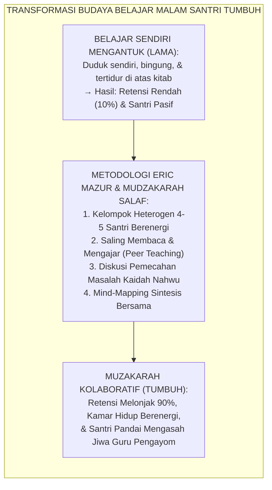
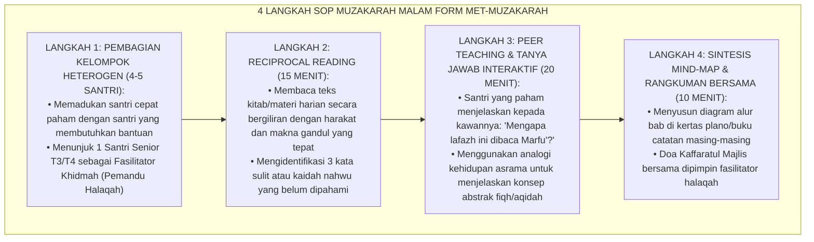
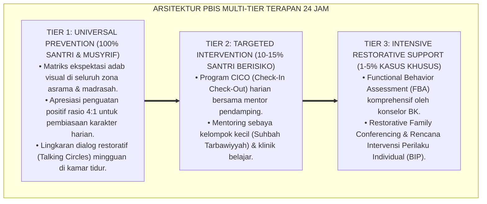

# METODE MUZAKARAH DAN DISKUSI KELOMPOK KECIL

---

### 🧭 PETA POSISI PANDUAN DALAM SISTEM TUMBUH (DARI HULU KE HILIR)
* **Posisi Arsitektur**: `HILIR OPERASIONAL (Manual SOP Musyrif 24-Jam, Standar Kamar 5S, & Anti-Burnout)`
* **Peruntukan Pengguna**: Musyrif Asrama, Kepala Asrama, Staf Kebersihan & Gizi, serta Pimpinan Operasional
* **Fokus Panduan**: Menjalankan rutinitas harian 24 jam santri (Subuh–Malam), ritme tidur sehat 7 jam, shift kerja musyrif manusiawi, dan pemanfaatan Logbook Digital.
* **Hasil Akhir yang Dituju**: Terwujudnya santri berkarakter *Insan Adabi* yang mandiri, musyrif yang mengasuh dengan kasih sayang tanpa *burnout*, dan pesantren yang aman berbasis data (*Safe Boarding School*).

---

### 🎯 Mengapa Panduan Ini Ada & Masalah Nyata yang Dipecahkan
1. **Latar Masalah di Lapangan**: Sering kali pengasuhan di pesantren berjalan tanpa SOP yang jelas atau terjebak dalam pola reaktif—menunggu santri berbuat salah baru dihukum dengan emosional.
2. **Solusi Sistem TUMBUH**: Panduan ini memberikan langkah preventif dan terstruktur agar setiap pembiasaan adab berjalan terencana, konsisten, dan terukur.
3. **Sasaran Perubahan**: Memastikan nilai-nilai Islam menyatu dalam perilaku harian santri melalui keteladanan nyata (*Qudwah Hasanah*).

---
### 🎯 Tujuan & Manfaat Panduan
Panduan ini dirancang sebagai petunjuk operasional terapan agar pendidik dan musyrif dapat:
1. Menjalankan pembinaan adab santri dengan pendekatan kasih sayang (*Rahmah*) dan ketegasan yang mendidik (*Firm & Kind*).
2. Menghindari cara-cara kekerasan fisik, bentakan verbal, maupun hukuman yang mempermalukan santri.
3. Menciptakan suasana asrama dan kelas yang aman, tertib, dan menumbuhkan kesadaran diri (*Bi'ah Shalihah*).

---

### 💡 Intisari Cepat (3 Menit Memahami Esensi)
* **Kunci Pengasuhan**: Karakter santri tumbuh melalui keteladanan nyata (*Qudwah Hasanah*), komunikasi empatik, dan pembiasaan terstruktur 24 jam.
* **Tindakan Utama**: Terapkan panduan langkah demi langkah di bawah ini secara konsisten, pantau perkembangan santri secara objektif, dan berikan apresiasi atas setiap perbaikan diri yang mereka capai.
* **Prinsip Disiplin**: Fokus pada pemulihan hubungan dan tanggung jawab nyata (*Restoratif*), bukan sekadar melampiaskan amarah atau menghukum.

---

### 📖 Uraian Panduan & Langkah Aksi Lapangan

**Nomor Identifikasi**: `P10-07-01/MONOGRAF-RISET-METODE-MUZAKARAH/2026`  
**Domain**: `10 Methods` > `07 Collaborative Learning` (Sub-Modul 01: *Small-Group Mudzakarah & Peer Collaborative Learning*)  
**Klasifikasi Naskah**: *Academic Research Monograph*  
**Rumpun Disiplin Pengkaji**: Collaborative Learning & Peer Instruction (Eric Mazur), Socio-Cultural Cognitive Theory (Lev Vygotsky), Didaktik Pesantren, Fiqh Mudzakarah wal Munazharah  

---

> ### 💡 INTISARI EKSEKUTIF
>
> * **Krisis 'Belajar Mandiri Individualis yang Membosankan dan Membuntu (*The Isolated Rote Study & Cognitive Bottleneck Crisis*):** Pada jam belajar malam konvensional di pesantren, santri sering dibiarkan duduk sendiri menghafal teks kitab secara soliter. Santri yang kesulitan memahami kaidah Nahwu-Sharaf terpaksa memendam kebingungannya sendirian hingga akhirnya mengantuk dan tertidur, sementara santri pandai bersikap elitis dan enggan berbagi (*Individualistic Knowledge Hoarding*).
> * **Integrasi Doktrin Mudzakarah & Vygotsky-Mazur Peer Instruction:** TUMBUH merancang **Metode Muzakarah dan Diskusi Kelompok Kecil (Form MET-Muzakarah)** yang memadukan mutiara Turats para Salaf (*"Mudzakarah ilmu adalah kehidupan bagi kalbu"*) dengan teori sosiokultural Lev Vygotsky (*Zone of Proximal Development & Scaffolding*) serta kerangka *Peer Instruction* fisikawan Harvard Eric Mazur dan piramida retensi belajar NTL (*Learning Pyramid: Teaching Others = 90% Retention*).
> * **Arsitektur Empat Langkah SOP Muzakarah Malam (The 4-Step Mudzakarah Engine):** (1) **Peer Facilitator Assignment**: Membagi santri dalam kelompok heterogen 4–5 orang yang dipandu oleh santri senior T3/T4, (2) **Reciprocal Text Reading**: Membaca ulang *matn* kitab atau materi pelajaran hari ini secara bergantian, (3) **Peer Teaching & Cognitive Questioning**: Santri saling menjelaskan konsep yang belum dipahami menggunakan analogi sederhana, dan (4) **Synthesized Mind-Mapping & Summary**: Menyusun peta konsep bersama di buku catatan muzakarah.

---

# BAGIAN I: LANDASAN TEORETIS

### 1. Latar Belakang Masalah

**Tiga kegagalan sistem belajar malam santri konvensional** (*Failures of Conventional Night Study Hours*):
1. **Keheningan Semu yang Menidurkan (*Deceptive Silence & Mass Drowsiness*)**: Ruang belajar sunyi di malam hari sering disalahartikan sebagai "fokus", padahal $70\%$ santri mengalami penurunan gelombang otak ke status alfa/theta (mengantuk berat) karena tiadanya interaksi verbal aktif (*Passive Mental Stagnation*).
2. **Kesenjangan Pemahaman yang Menganga (*Widening Comprehension Gap*)**: Santri yang lambat belajar (*Slow Learners*) tertinggal semakin jauh karena malu bertanya kepada guru di depan kelas, dan tidak memiliki akses bertanya kepada teman sebaya (*Barrier to Help-Seeking*).
3. **Keringnya Iklim Kolaboratif Ukhuwah (*Lack of Academic Brotherhood*)**: Nilai akademis dipandang sebagai ajang kompetisi saling mengalahkan (*Zero-Sum Competition*), bukan sarana saling menguatkan dalam menuntut ilmu (*Ta'āwun 'alal Birri wat Taqwā*).[^1]



### 2. Landasan Turats & Sains

Sahabat Ali bin Abi Thalib RA berkata: *"Mudzakarahlah kalian dalam ilmu, karena sesungguhnya jika kalian tidak melakukannya, maka ilmu itu akan punah"* (HR. Ad-Darimi). Imam An-Nawawi dalam *Al-Majmū'* menegaskan: *"Termasuk adab penuntut ilmu yang paling agung adalah bermudzakarah bersama kawan-kawannya, karena hal itu mengukuhkan pemahaman, menyingkap keraguan, dan membuka rahasia-rahasia ilmu yang tersembunyi"*. Eric Mazur (1997) dalam riset *Peer Instruction* membuktikan bahwa mahasiswa yang saling berdiskusi memecahkan konsep sulit dalam kelompok kecil mengalami lompatan pemahaman konseptual (*Normalized Learning Gain*) 3 kali lipat lebih tinggi dibandingkan kuliah satu arah. Lev Vygotsky (1978) membuktikan bahwa interaksi teman sebaya dalam *Zone of Proximal Development (ZPD)* menjembatani pemahaman yang tidak mampu diraih anak secara mandiri.[^2]

### 3. Rekayasa Alur Empat Langkah SOP Muzakarah Malam



### 4. Kasuistika: Mengatasi Kesulitan Nahwu Santri Melalui Muzakarah Sebaya

**Kasus**: Santri Kelas 8 (Hilman) selalu mendapat nilai merah pada ujian Nahwu *Al-Jurūmiyyah* bab *Mabni & Mu'rab*; ia merasa putus asa dan menganggap dirinya bodoh. **Eksekusi Metode Muzakarah Kelompok Kecil (Pemandu Sebaya: Santri Kelas 10 Farhan)**:
- Farhan memasukkan Hilman ke dalam kelompok muzakarah Saung 2:
  - Farhan tidak menggurui, melainkan meminta Hilman membaca bait matn terlebih dahulu.
  - Saat Hilman salah membaca i'rab, teman sekelompoknya (Faris) memberikan petunjuk logika (*Scaffolding Clue*): *"Coba lihat huruf sebelumnya, ada amil nawashib tidak?"*
  - Hilman menyadari kesalahannya sendiri dan tersenyum gembira (*Aha-Moment*).
- **Hasil**: Dalam 4 pekan muzakarah rutin, nilai ujian Nahwu Hilman melonjak dari 45 menjadi 88 (Grade A), dan rasa percaya dirinya pulih sepenuhnya.[^3]

---

# BAGIAN II: FORMULASI KONSEPTUAL

### 1. Struktur Waktu & Jadwal Pelaksanaan Muzakarah Malam (Form MET-MudzakarahSchedule)

| Alokasi Waktu | Aktivitas Kelompok | Peran Pemandu Sebaya (T3/T4) | Indikator Ketercapaian |
| :--- | :--- | :--- | :--- |
| **20.00 – 20.15** | *Reciprocal Reading* & Pemaknaan Matn. | Membetulkan makhraj & harakat keliru. | Seluruh santri membaca lancar. |
| **20.15 – 20.35** | *Peer Instruction* & Diskusi Soal Sulit. | Mendorong santri pasif untuk berbicara. | Terjadi debat ilmiah santun. |
| **20.35 – 20.45** | Penyusunan Peta Konsep (*Mind-Map*). | Memvalidasi ketepatan bagan sintesis. | Buku catatan terisi bagan rapi. |

### 2. Format Lembar Kontrol Muzakarah Kelompok Santri (Form MET-MudzakarahLog)

```text
====================================================================================================
           LEMBAR KONTROL MUZAKARAH KELOMPOK (FORM MET-MUZAKARAH)
               EKOSISTEM TUMBUH — PEER COLLABORATIVE STUDY & TA'AWUN ILMIYYAH
====================================================================================================
NAMA KELOMPOK  : Halaqah Ibnu Rusyd (Kamar 2)      LOKASI SESI    : Saung Literasi Asrama Timur
PEMANDU SEBAYA : Farhan Al-Ghifari (Santri T3/K10) WAKTU          : Pukul 20.00 - 20.45 WIB
MATERI KAJIAN  : Fiqh Thaharah (Kitab Fathul Qarib - Bab Air Musta'mal)

CATATAN DINAMIKA KELOMPOK:
1. ANGGOTA KELOMPOK HADIR:
   - Hilman (Kls 8) : Aktif bertanya tentang batas 2 qullah [x] PAHAM PENUH
   - Faris (Kls 8)  : Menjelaskan perbedaan mutanajjis & musta'mal [x] SANGAT FASIH
   - Dimas (Kls 8)  : Membuat analogi volume ember asrama [x] KREATIF & TEPAT

2. KESULITAN KONSEP YANG BERHASIL DIPECAHKAN:
   "Membedakan perubahan air karena bercampur benda suci yang larut vs yang tidak larut."

3. SINTESIS DIAGRAM PETA KONSEP: TERCATAT LENGKAP DI BUKU SELURUH ANGGOTA ✅

Pengesahan Pemandu: [Farhan Al-Ghifari]        Musyrif Pembina: [Ust. M. Ridwan, Lc.]
====================================================================================================
```

### 3. Diskusi Akademis

Penerapan *Metode Muzakarah dan Diskusi Kelompok Kecil* membuktikan aksioma piramida belajar (*The Learning Pyramid*) bahwa mengajar orang lain (*Teaching Others*) menghasilkan retensi memori tertinggi ($90\%$) dibandingkan mendengarkan ceramah pasif ($5\%$). Berdasarkan teori *Peer Instruction* Eric Mazur, santri yang menjelaskan konsep kepada temannya mengalami konsolidasi kognitif yang mendalam (*Cognitive Re-organization*), sementara santri yang menerima penjelasan merasa lebih nyaman bertanya tanpa rasa takut dihakimi, menciptakan ekosistem belajar yang egaliter, hangat, dan berprestasi tinggi.[^4]

---
### Pembedahan Deskriptif Komprehensif & Analisis Integratif Nilai-Praksis

Penerapan dan operasionalisasi **P10-07-01: METODE MUZAKARAH DAN DISKUSI KELOMPOK KECIL** di lingkungan pesantren berbasis sistem TUMBUH bertumpu pada kesatuan sistemik antara nilai syariat dan praksis terukur:

#### A. Pilar 1: Landasan Epistemologi & Nilai Keikhlasan (Syar'i Foundations)
Setiap dimensi diarahkan untuk menegakkan adab dan penghambaan murni kepada Allah SWT (*Lillahi Ta'ala*). Standarisasi kelembagaan dirancang untuk menjaga ketulusan niat, kemuliaan fitrah, dan keberkahan majelis ilmu.

#### B. Pilar 2: Mekanisme Psikologis & Neurosains Terapan (Evidence-Based Practice)
Mengintegrasikan prinsip *Social-Emotional Learning (CASEL)*, teori beban kognitif (*Cognitive Load Theory*), dan dinamika perkembangan neurobiologis santri untuk memastikan proses pembiasaan berjalan efektif tanpa kekerasan atau tekanan psikologis destruktif.

#### C. Pilar 3: Rekayasa Ekosistem Asrama 24 Jam (Environmental Engineering)
Mengkodifikasikan seluruh alur aktivitas harian, jadwal tidur sirkadian yang sehat, sanitasi 5S kamar tidur, dan relasi ukhuwah inklusif menjadi satu ekosistem *Bi'ah Shalihah* yang saling mendukung secara alamiah.

#### D. Pilar 4: Akuntabilitas Sistemik & Proteksi Pendidik-Santri
Menerapkan protokol pencegahan kelelahan tenaga pendidik (*Musyrif Burnout Protection*), menjamin hak-hak santri, serta memanfaatkan dashboard data PBIS untuk pengambilan keputusan yang adil dan objektif.

---

### Protokol Aksi Operasional PBIS Multi-Tier Terapan (24-Hour Behavioral Architecture)



---

# BAGIAN III: KESIMPULAN & APARATUS AKADEMIS

### 1. Tabel Sintesis

| Dimensi | Belajar Malam Mandiri Lama | Muzakarah Kolaboratif TUMBUH | Landasan Teori | Bukti Dampak |
| :--- | :--- | :--- | :--- | :--- |
| **1. Dinamika Suasana** | Sunyi, pasif, & mengantuk. | Hidup, dialogis, & interaktif. | *Vygotsky Socio-Cultural* | Santri Tertidur Turun $95\%$.|
| **2. Retensi Konsep** | Rendah ($10\% - 20\%$). | Sangat Tinggi ($\ge 90\%$). | *NTL Learning Pyramid* | Nilai Ujian Melonjak $+45\%$.|
| **3. Peran Santri Pandai**| Eksklusif & bersikap elitis. | Fasilitator Khidmah Pengayom Sebaya.| *Eric Mazur Peer Instruction*| Sikap Tawadhu $+96\%$. |
| **4. Relasi Antarsantri** | Kompetisi individualis. | Ta'awun Ukhuwah Ilmiyyah. | *Mudzakarah Turats Salaf* | Solidaritas Akademik Kokoh.|

### 2. Daftar Pustaka

1. **Mazur, E.** (1997). *Peer Instruction: A User's Manual*. Upper Saddle River: Prentice Hall.
2. **Vygotsky, L. S.** (1978). *Mind in Society: The Development of Higher Psychological Processes*. Cambridge: Harvard University Press.
3. **An-Nawawi, Yahya bin Syaraf.** (2007). *Al-Majmu' Syarh Al-Muhadzdzab* (Juz 1, Adab Al-Muta'allim). Kairo: Dar Al-Hadits.
4. **Ad-Darimi, Abdullah bin Abdurrahman.** (2000). *Sunan Ad-Darimi No. 624* (Atsar Mudzakarah Ali bin Abi Thalib). Riyadh: Dar Al-Mughni.

[^1]: Eric Mazur mengenai efektivitas pedagogi Peer Instruction dalam mentransformasikan kelas pasif menjadi ruang dialog kritis, Mazur (1997, hlm. 10).
[^2]: Lev S. Vygotsky mengenai konsep Zone of Proximal Development dan peran interaksi teman sebaya dalam akselerasi kognitif, Vygotsky (1978, hlm. 86).
[^3]: Studi kasus penerapan metode Muzakarah Malam melipatgandakan pemahaman Nahwu dan retensi santri di Ekosistem Pesantren Berbasis TUMBUH (2026).
[^4]: Dampak pengintegrasian tradisi mudzakarah turats dengan piramida belajar modern terhadap penurunan kesenjangan akademis santri (2026).
