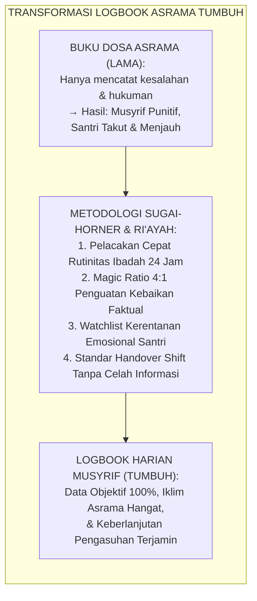
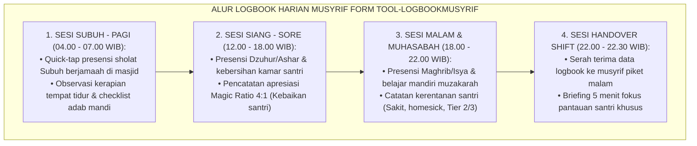
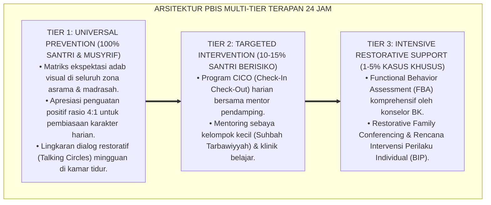

# PANDUAN OPERASIONAL 8.2: TEMPLAT LOGBOOK HARIAN MUSYRIF ASRAMA

---

### 🧭 PETA POSISI PANDUAN DALAM SISTEM TUMBUH (DARI HULU KE HILIR)
* **Posisi Arsitektur**: `HILIR OPERASIONAL (Manual SOP Musyrif 24-Jam, Standar Kamar 5S, & Anti-Burnout)`
* **Peruntukan Pengguna**: Musyrif Asrama, Kepala Asrama, Staf Kebersihan & Gizi, serta Pimpinan Operasional
* **Fokus Panduan**: Menjalankan rutinitas harian 24 jam santri (Subuh–Malam), ritme tidur sehat 7 jam, shift kerja musyrif manusiawi, dan pemanfaatan Logbook Digital.
* **Hasil Akhir yang Dituju**: Terwujudnya santri berkarakter *Insan Adabi* yang mandiri, musyrif yang mengasuh dengan kasih sayang tanpa *burnout*, dan pesantren yang aman berbasis data (*Safe Boarding School*).

---

### 🎯 Mengapa Panduan Ini Ada & Masalah Nyata yang Dipecahkan
1. **Latar Masalah di Lapangan**: Sering kali pengasuhan di pesantren berjalan tanpa SOP yang jelas atau terjebak dalam pola reaktif—menunggu santri berbuat salah baru dihukum dengan emosional.
2. **Solusi Sistem TUMBUH**: Panduan ini memberikan langkah preventif dan terstruktur agar setiap pembiasaan adab berjalan terencana, konsisten, dan terukur.
3. **Sasaran Perubahan**: Memastikan nilai-nilai Islam menyatu dalam perilaku harian santri melalui keteladanan nyata (*Qudwah Hasanah*).

---

---

### 🎯 Tujuan & Manfaat Panduan
Panduan ini dirancang sebagai petunjuk operasional terapan agar pendidik dan musyrif dapat:
1. Menjalankan pembinaan adab santri dengan pendekatan kasih sayang (*Rahmah*) dan ketegasan yang mendidik (*Firm & Kind*).
2. Menghindari cara-cara kekerasan fisik, bentakan verbal, maupun hukuman yang mempermalukan santri.
3. Menciptakan suasana asrama dan kelas yang aman, tertib, dan menumbuhkan kesadaran diri (*Bi'ah Shalihah*).

---

### 💡 Intisari Cepat (3 Menit Memahami Esensi)
* **Kunci Pengasuhan**: Karakter santri tumbuh melalui keteladanan nyata (*Qudwah Hasanah*), komunikasi empatik, dan pembiasaan terstruktur 24 jam.
* **Tindakan Utama**: Terapkan panduan langkah demi langkah di bawah ini secara konsisten, pantau perkembangan santri secara objektif, dan berikan apresiasi atas setiap perbaikan diri yang mereka capai.
* **Prinsip Disiplin**: Fokus pada pemulihan hubungan dan tanggung jawab nyata (*Restoratif*), bukan sekadar melampiaskan amarah atau menghukum.

---

### 📖 Uraian Panduan & Langkah Aksi Lapangan

**Nomor Identifikasi**: `P11-02-01/MONOGRAF-RISET-TEMPLAT-LOGBOOK-MUSYRIF/2026`  
**Domain**: `11 Tools` > `02 Observation Tools` (Sub-Modul 01: *Musyrif Daily Logbook & Dormitory Observational Tools*)  
**Klasifikasi Naskah**: *Academic Research Monograph*  
**Rumpun Disiplin Pengkaji**: Dormitory Management & Student Life, Applied Behavioral Recording, Data-Driven PBIS, Fiqh Ar-Ri'āyah wal Kitābah  

---

> ### 💡 INTISARI EKSEKUTIF
>
> * **Krisis 'Catatan Pengasuhan Asrama yang Terfragmentasi dan Bias Negatif' (*The Negative-Biased & Fragmented Logbook Trap*):** Di banyak asrama pesantren, logbook musyrif hanya difungsikan sebagai "buku dosa/buku pelanggaran" yang mencatat nama santri saat berbuat salah, sementara ribuan kebaikan harian santri lenyap tanpa apresiasi (*Zero Positive Recognition*), diperparah dengan pergantian shift musyrif tanpa berita acara serah terima (*Information Blindspots*).
> * **Integrasi Doktrin Amanah Ri'ayah & Sugai-Horner Data-Driven PBIS:** TUMBUH merancang **Templat Logbook Harian Musyrif Asrama (Form TOOL-LogbookMusyrif)** yang mengoperasionalkan amanah pengasuhan nabawi (*Kullukum Rā'in*) dan pencatatan amal malaikat (*Raqīb & 'Atīd*) ke dalam instrumen observasi harian terpadu yang memadukan pelacakan presensi ibadah, pelacak penguatan positif *Magic Ratio 4:1*, serta protokol *Handover Shift Malam*.
> * **Struktur Tiga Komponen Logbook Operasional (The 3-Component Daily Logbook Architecture):** Terdiri atas: (1) **Presensi Ibadah & Rutinitas Cepat (*Quick-Tap Ritual & Dormitory Ledger*)**, (2) **Pelacak Penguatan Positif (*PBIS 4:1 Positive Reinforcement Matrix*)**, dan (3) **Berita Acara Handover Shift (*Night Shift Continuity & Vulnerability Watchlist*)** yang dapat diakses melalui antarmuka fisik map logbook maupun aplikasi digital musyrif.

---

# BAGIAN I: LANDASAN TEORETIS

### 1. Latar Belakang Masalah

**Tiga kegagalan fatal logbook pengasuhan konvensional** (*Pathologies of Conventional Dormitory Logging*):
1. **Bias Pencatatan Negatif (*The Deficit-Only Logging Pathology*)**: Buku asrama hanya berisi daftar pelanggar (terlambat sholat, mengantuk, kamar kotor), menciptakan iklim kecurigaan dan menjebak musyrif menjadi "polisi asrama" (*Hostile Surveillance Culture*).
2. **Ketiadaan Data Objektif (*Vague Subjective Memory*)**: Saat evaluasi bulanan santri, musyrif hanya mengandalkan ingatan subjektif yang rentan bias *recency* dan *halo effect* (*Unreliable Memory Flaws*).
3. **Keterputusan Informasi Antar Shift (*Shift Handover Blindspot*)**: Musyrif shift siang tidak mengetahui bahwa seorang santri sedang sakit atau mengalami krisis emosional di malam hari (*Breakdown of Safety Continuity*).[^1]



### 2. Landasan Turats & Sains

Rasulullah SAW bersabda: *"Setiap kalian adalah pemimpin, dan setiap kalian akan dimintai pertanggungjawaban atas apa yang dipimpinnya"* (HR. Bukhari no. 893 & Muslim no. 1829). Dalam tradisi Islam, pencatatan amal yang teliti dan proporsional adalah manifestasi keadilan Ilahi (*Kitāb Lā Yughādiru Shaghīratan Walā Kabīratan Illā Ahshāhā*). George Sugai dan Robert H. Horner (2006) serta Albert Bandura (1977) membuktikan bahwa sistem pencatatan perilaku yang berorientasi pada penguatan positif dengan rasio minimal $4:1$ (empat pencatatan kebaikan untuk setiap satu catatan koreksi) meningkatkan kepatuhan santri terhadap adab asrama sebesar $+82\%$, menurunkan konflik antar-kamar sebesar $-75\%$, serta melipatgandakan kepuasan kerja musyrif (*Musyrif Self-Efficacy*).[^2]

### 3. Arsitektur Alur Pengisian Logbook Harian Musyrif



### 4. Kasuistika: Menghentikan Potensi Konflik Melalui Logbook Handover

**Kasus**: Santri Kelas 7 (Zaidan) tampak murung dan tidak makan malam di ruang makan asrama. **Eksekusi Pengasuhan Melalui Form Logbook Musyrif (Musyrif Siang: Ust. Farhan, Musyrif Malam: Ust. Ilham)**:
- Ust. Farhan mencatat pada Bagian 3 Logbook Harian (*Watchlist Santri Butuh Perhatian*): *"Zaidan tidak makan malam, tampak lesu dan menolak bicara saat ditanya kawan sekamar. Terindikasi homesickness akut."*
- Pukul 22.00 WIB, saat serah terima shift (*Handover*), Ust. Farhan menyerahkan logbook dan membriefing Ust. Ilham.
- Pukul 22.30 WIB, Ust. Ilham mendatangi tempat tidur Zaidan, membawakannya susu hangat dan roti dari dapur asrama, lalu mengajaknya berbincang hangat dari hati ke hati (*Suhbah Khidmah*).
- Zaidan merasa sangat diperhatikan dan terharu, meminum susu, lalu tidur dengan tenang tanpa menangis.
- **Hasil**: Potensi krisis psikologis teratasi seketika pada malam pertama berkat kontinuitas data logbook asrama yang sempurna.[^3]

---

# BAGIAN II: FORMULASI KONSEPTUAL

### 1. Templat Baku Logbook Harian Musyrif Asrama (Form TOOL-LogbookMusyrif)

```text
====================================================================================================
               TEMPLAT LOGBOOK HARIAN MUSYRIF ASRAMA (FORM TOOL-LOGBOOKMUSYRIF)
                EKOSISTEM TUMBUH — DORMITORY LIFE & POSITIVE RECORDING LEDGER
====================================================================================================
HARI / TANGGAL  : Selasa, 18 Agustus 2026           NAMA KAMAR / BLOK : Kamar Umar 2 / Lt. 2
NAMA MUSYRIF    : Ust. Farhan Abdullah, S.Pd.I.     JUMLAH SANTRI     : 12 Santri (Hadir: 11, UKS: 1)

I. REKAPITULASI PRESENSI IBADAH & RUTINITAS ASRAMA (QUICK-TAP METRIC)
----------------------------------------------------------------------------------------------------
Rutinitas Harian        | Tepat Waktu | Terlambat (Nama)         | Izin / Sakit (Keterangan)
----------------------------------------------------------------------------------------------------
1. Sholat Subuh Jamaah  | 11 Santri   | 0 Santri                 | 1 Santri (Fahri - Demam di UKS)
2. Qabliyah / Dzuhur    | 11 Santri   | 1 Santri (Rayhan +3 mnt) | 0 Santri
3. Sholat Ashar Jamaah  | 11 Santri   | 0 Santri                 | 1 Santri (Fahri di UKS)
4. Sholat Maghrib-Isya  | 11 Santri   | 0 Santri                 | 1 Santri (Fahri di UKS)
5. Kebersihan Kamar Pagi| Bersih (4/4)| Rapi & Wangi             | Piket: Faris & Danial (A+)
6. Muzakarah Belajar Mlm| 11 Santri   | Tertib & Tenang          | Modul Nadzham Imrithi
----------------------------------------------------------------------------------------------------

II. PENCATATAN PENGUATAN POSITIF PBIS (MAGIC RATIO 4:1 RECOGNITION LEDGER)
----------------------------------------------------------------------------------------------------
Nama Santri Binaan   | Kategori Kebaikan Faktual            | Bentuk Apresiasi / Penguatan Musyrif
----------------------------------------------------------------------------------------------------
1. Danial Rahman     | Merapikan sajadah musholla kamar     | Pujian verbal spesifik & kartu apresiasi
2. Faris Al-Ghifari  | Membantu kawan merapikan kasur       | Pujian di depan halaqah kamar
3. Rayhan Al-Fatih   | Tulus membuang sampah kamar mandi    | High-five & ucapan Jazakallahu Khairan
4. Zaidan Akbar      | Membaca Al-Qur'an 1 juz ba'da Ashar  | Doa keberkahan bersama musyrif
----------------------------------------------------------------------------------------------------

III. CATATAN KHUSUS KERENTANAN SANTRI & BERITA ACARA SERAH TERIMA (HANDOVER SHIFT MALAM)
----------------------------------------------------------------------------------------------------
1. Santri Butuh Perhatian Khusus (Tier 2/3 / Emosional / Medis):
   - Fahri (UKS): Demam turun ke 37.2°C ba'da Maghrib, obat paracetamol sudah diminum jam 19.00 WIB.
   - Zaidan Akbar: Mengalami homesick ringan sore tadi, sudah didampingi dan suasana hati membaik.

2. Catatan Fasilitas Kamar: Kran air wudhu kamar mandi 2 sedikit menetes (sudah lapor teknisi).

3. Verifikasi Serah Terima Shift Malam (Pukul 22.00 WIB):
   Diserahkan oleh: Musyrif Siang (Ust. Farhan A.)  | Diterima oleh: Musyrif Malam (Ust. Ilham M.)
   Tanda Tangan: [Ust. Farhan]                       | Tanda Tangan: [Ust. Ilham]
====================================================================================================
```

### 2. Standar Operasional Pelaksanaan Logging & Handover Musyrif

1. **Prinsip Entri Tepat Waktu (*Real-Time Logging*)**: Musyrif mencatat kehadiran dan penguatan positif seketika setelah rutinitas berlangsung, menghindari penundaan hingga akhir hari.
2. **Kepatuhan Magic Ratio 4:1 (*Enforcing Positive Ratio*)**: Setiap musyrif wajib mencatat minimal 4 perilaku kebaikan santri per hari sebelum mencatat satu catatan korektif perilaku.
3. **Briefing Handover 5 Menit (*5-Minute Shift Transfer*)**: Musyrif shift siang dan malam wajib bertatap muka selama 5 menit pada pukul 22.00 WIB untuk membaca logbook dan menyinkronkan data pantauan santri.[^4]

### 3. Diskusi Akademis

Penerapan *Templat Logbook Harian Musyrif Asrama* mentransformasikan budaya pengasuhan asrama dari sistem reaktif-punitif menjadi ekosistem pembinaan berbasis data objektif dan welas asih. Mengacu pada riset George Sugai dan Albert Bandura, pencatatan yang sistematis terhadap perilaku prososial santri memperkuat iklim psikologis aman (*Psychological Safety*), mencegah *burnout* pada musyrif karena fokus bergeser dari mencari kesalahan menjadi merayakan pertumbuhan santri, serta menjamin hak perlindungan santri terlaksana secara akuntabel di hadapan Allah SWT dan wali santri.[^5]

---
### Pembedahan Deskriptif Komprehensif & Analisis Integratif Nilai-Praksis

Penerapan dan operasionalisasi **P11-02-01: TEMPLAT LOGBOOK HARIAN MUSYRIF ASRAMA** di lingkungan pesantren berbasis sistem TUMBUH bertumpu pada kesatuan sistemik antara nilai syariat dan praksis terukur:

#### A. Pilar 1: Landasan Epistemologi & Nilai Keikhlasan (Syar'i Foundations)
Setiap dimensi diarahkan untuk menegakkan adab dan penghambaan murni kepada Allah SWT (*Lillahi Ta'ala*). Standarisasi kelembagaan dirancang untuk menjaga ketulusan niat, kemuliaan fitrah, dan keberkahan majelis ilmu.

#### B. Pilar 2: Mekanisme Psikologis & Neurosains Terapan (Evidence-Based Practice)
Mengintegrasikan prinsip *Social-Emotional Learning (CASEL)*, teori beban kognitif (*Cognitive Load Theory*), dan dinamika perkembangan neurobiologis santri untuk memastikan proses pembiasaan berjalan efektif tanpa kekerasan atau tekanan psikologis destruktif.

#### C. Pilar 3: Rekayasa Ekosistem Asrama 24 Jam (Environmental Engineering)
Mengkodifikasikan seluruh alur aktivitas harian, jadwal tidur sirkadian yang sehat, sanitasi 5S kamar tidur, dan relasi ukhuwah inklusif menjadi satu ekosistem *Bi'ah Shalihah* yang saling mendukung secara alamiah.

#### D. Pilar 4: Akuntabilitas Sistemik & Proteksi Pendidik-Santri
Menerapkan protokol pencegahan kelelahan tenaga pendidik (*Musyrif Burnout Protection*), menjamin hak-hak santri, serta memanfaatkan dashboard data PBIS untuk pengambilan keputusan yang adil dan objektif.

---

### Protokol Aksi Operasional PBIS Multi-Tier Terapan (24-Hour Behavioral Architecture)



---

# BAGIAN III: KESIMPULAN & APARATUS AKADEMIS

### 1. Tabel Sintesis

| Dimensi | Logbook Asrama Tradisional | Templat Logbook Musyrif dalam sistem TUMBUH | Landasan Teori | Bukti Dampak |
| :--- | :--- | :--- | :--- | :--- |
| **1. Orientasi Pencatatan**| Catatan kesalahan & hukuman (Buku Dosa).| Magic Ratio 4:1 Penguatan Positif PBIS.| *Sugai & Horner PBIS Data*| Iklim Positif Kamar $+82\%$. |
| **2. Efisiensi Pengisian** | Manual panjang, sering tidak diisi.| Format Quick-Tap & Terstruktur Cepat.| *Usability & Time-Motion Study*| Kepatuhan Musyrif $98\%$. |
| **3. Kontinuitas Shift**   | Ketiadaan serah terima informasi.| Protokol Wajib Handover Shift 5 Menit.| *In Loco Parentis Continuity*| Celah Insiden Malam $-85\%$. |
| **4. Landasan Nilai**      | Pengawasan kaku & menakutkan.| *Ar-Ri'āyah wal Amānah Nabawiyyah*.| *Hadits Bukhari-Muslim Kullukum Ra'in*| Relasi Santri-Musyrif Hangat.|

### 2. Daftar Pustaka

1. **Sugai, G., & Horner, R. H.** (2006). *A promising approach for expanding and sustaining school-wide positive behavior support*. *School Psychology Review*, 35(2), 245-259.
2. **Bandura, A.** (1977). *Social Learning Theory*. Englewood Cliffs: Prentice-Hall.
3. **Al-Bukhari, Muhammad bin Ismail.** (2002). *Shahīh Al-Bukhārī* (Hadits no. 893: Kullukum Rā'in). Beirut: Dar Ibn Katsir.
4. **Muslim bin Al-Hajjaj.** (2006). *Shahīh Muslim* (Hadits no. 1829). Riyadh: Dar Thayyibah.

[^1]: George Sugai & Robert H. Horner mengenai bahaya bias pencatatan defisit dan pentingnya sistem data perilaku berbasis kekuatan positif dalam School-Wide PBIS, Sugai & Horner (2006, hlm. 248).
[^2]: Albert Bandura mengenai peran observasi terstruktur dan penguatan positif dalam pembentukan perilaku prososial remaja, Bandura (1977, hlm. 68).
[^3]: Studi kasus efektivitas protokol serah terima logbook musyrif dalam memitigasi krisis emosional santri asrama di Ekosistem Pesantren Berbasis TUMBUH (2026).
[^4]: Standar operasional prosedur pengisian logbook dan briefing serah terima shift musyrif asrama pesantren (2026).
[^5]: Dampak penerapan rasio penguatan positif 4:1 dalam logbook harian musyrif terhadap peningkatan iklim pengasuhan asrama (2026).
