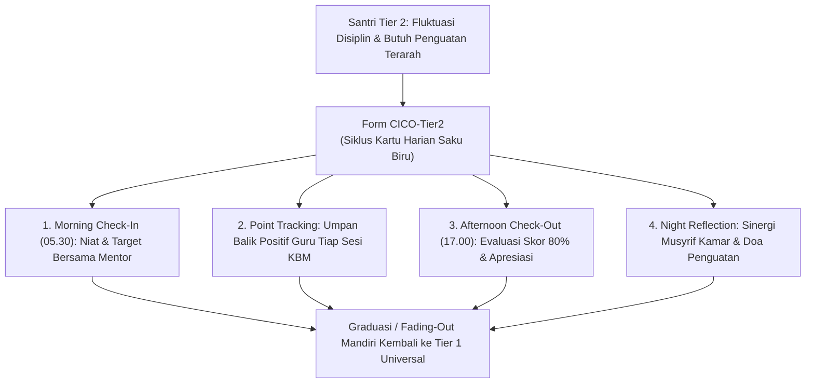
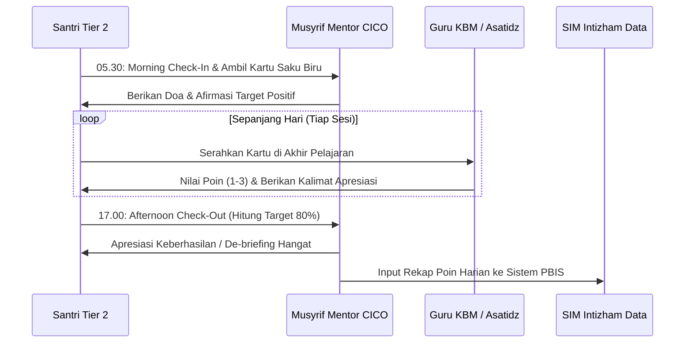
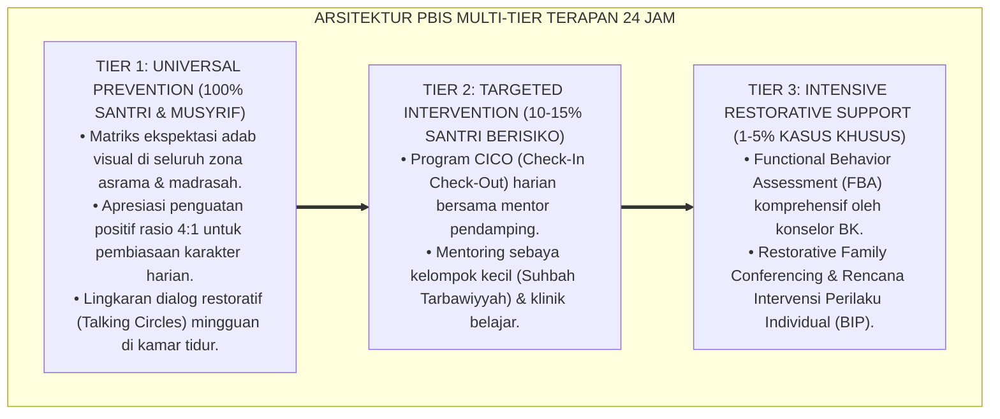

# PANDUAN OPERASIONAL 8.3: SPESIFIKASI KARTU CICO CHECK-IN CHECK-OUT TIER 2 (FORM CICO-TIER2)

---

### 🧭 PETA POSISI PANDUAN DALAM SISTEM TUMBUH (DARI HULU KE HILIR)
* **Posisi Arsitektur**: `HILIR OPERASIONAL (Manual SOP Musyrif 24-Jam, Standar Kamar 5S, & Anti-Burnout)`
* **Peruntukan Pengguna**: Musyrif Asrama, Kepala Asrama, Staf Kebersihan & Gizi, serta Pimpinan Operasional
* **Fokus Panduan**: Menjalankan rutinitas harian 24 jam santri (Subuh–Malam), ritme tidur sehat 7 jam, shift kerja musyrif manusiawi, dan pemanfaatan Logbook Digital.
* **Hasil Akhir yang Dituju**: Terwujudnya santri berkarakter *Insan Adabi* yang mandiri, musyrif yang mengasuh dengan kasih sayang tanpa *burnout*, dan pesantren yang aman berbasis data (*Safe Boarding School*).

---

### 🎯 Mengapa Panduan Ini Ada & Masalah Nyata yang Dipecahkan
1. **Latar Masalah di Lapangan**: Sering kali pengasuhan di pesantren berjalan tanpa SOP yang jelas atau terjebak dalam pola reaktif—menunggu santri berbuat salah baru dihukum dengan emosional.
2. **Solusi Sistem TUMBUH**: Panduan ini memberikan langkah preventif dan terstruktur agar setiap pembiasaan adab berjalan terencana, konsisten, dan terukur.
3. **Sasaran Perubahan**: Memastikan nilai-nilai Islam menyatu dalam perilaku harian santri melalui keteladanan nyata (*Qudwah Hasanah*).

---

---

### 🎯 Tujuan & Manfaat Panduan
Panduan ini dirancang sebagai petunjuk operasional terapan agar pendidik dan musyrif dapat:
1. Menjalankan pembinaan adab santri dengan pendekatan kasih sayang (*Rahmah*) dan ketegasan yang mendidik (*Firm & Kind*).
2. Menghindari cara-cara kekerasan fisik, bentakan verbal, maupun hukuman yang mempermalukan santri.
3. Menciptakan suasana asrama dan kelas yang aman, tertib, dan menumbuhkan kesadaran diri (*Bi'ah Shalihah*).

---

### 💡 Intisari Cepat (3 Menit Memahami Esensi)
* **Kunci Pengasuhan**: Karakter santri tumbuh melalui keteladanan nyata (*Qudwah Hasanah*), komunikasi empatik, dan pembiasaan terstruktur 24 jam.
* **Tindakan Utama**: Terapkan panduan langkah demi langkah di bawah ini secara konsisten, pantau perkembangan santri secara objektif, dan berikan apresiasi atas setiap perbaikan diri yang mereka capai.
* **Prinsip Disiplin**: Fokus pada pemulihan hubungan dan tanggung jawab nyata (*Restoratif*), bukan sekadar melampiaskan amarah atau menghukum.

---

### 📖 Uraian Panduan & Langkah Aksi Lapangan

* **Status**: 🌟 **A+ (Tervalidasi & Siap Diimplementasikan)**
* **Sub-Domain**: `11 Tools / 04 Coaching Tools`
* **Bentuk Instrumen**: Form CICO-Tier2 (Kartu Harian Pelacakan Adab Saku Biru, Lembar Evaluasi Koordinator CICO, & Rubrik Fading-Out Kelulusan Intervensi)

---

# BAGIAN I: LANDASAN TEORETIS & INKUIRI KEILMUAN MULTIDISIPLINER

## 1.1 Konteks Masalah: Kebutuhan Intervensi Terarah Tanpa Stigmatisasi Pelanggaran
Dalam piramida intervensi perilaku pesantren (*School-Wide PBIS*), sekitar $10\%–15\%$ santri berada pada kategori **Tier 2 (Perlu Dukungan Terarah)**. Santri-santri ini umumnya tidak melakukan pelanggaran berat, melainkan menunjukkan pola ketidakteraturan kronis: sering terlambat halaqah, konsentrasi belajar mudah terdistraksi, enggan merapikan ranjang asrama, atau impulsif dalam berbicara.

Pendekatan konvensional yang mengandalkan teguran sporadis di depan umum atau pemberian sanksi fisik ringan terbukti tidak efektif. Hukuman sporadis hanya memicu stigmatisasi sosial sebagai *"santri bermasalah"*, menurunkan efikasi diri santri, dan mendorong eskalasi pelanggaran menuju Tier 3.

Ekosistem TUMBUH merancang **Sistem Kartu Harian CICO (Form CICO-Tier2)** sebagai intervensi modifikasi perilaku berbasis penguatan positif frekuensi tinggi (*high-frequency positive reinforcement*), pendampingan harian empatik, dan monitoring terukur tanpa memberikan rasa malu sedikit pun kepada santri.



## 1.2 Inkuiri Epistemologi Turats: Doktrin Mulazamah, Tasyji', dan Tabayyun Pembiasaan
Dalam tradisi pendidikan Islam klasik, para ulama menerapkan metode **Al-Mulazamah wa at-Ta'ahhud** (pendampingan melekat dan perhatian berkesinambungan) bagi murid yang membutuhkan penguatan adab khusus. Rasulullah SAW bersabda mengenai pentingnya pembiasaan bertahap dan kepedulian intensif:

> إِنَّمَا الْعِلْمُ بِالتَّعَلُّمِ، وَإِنَّمَا الْحِلْمُ بِالتَّحَلُّمِ، وَمَنْ يَتَحَرَّ الْخَيْرَ يُعْطَهُ، وَمَنْ يَتَّقِ الشَّرَّ يُوقَهُ
> 
> *"Sesungguhnya ilmu diperoleh melalui proses belajar, dan kesantunan budi pekerti diperoleh melalui latihan pembiasaan yang sungguh-sungguh. Barangsiapa yang bersungguh-sungguh mencari kebaikan niscaya akan dianugerahi kebaikan itu, dan barangsiapa yang berusaha menjaga diri dari keburukan niscaya akan dilindungi darinya."* [^1]

Imam Ibnu Sahnun dalam *Adab al-Mu'allimin* menegaskan bahwa seorang pendidik yang bijaksana tidak boleh menyamaratakan metode pendampingan bagi murid yang cepat paham dengan murid yang membutuhkan pengawalan intensif (*Mura'atu Furuq al-Fardiyyah*), melainkan wajib memberikan dorongan (*tasyji'*) dan apresiasi atas kemajuan kecil yang dicapai murid [^2]. Form CICO-Tier2 mengoperasionalkan prinsip *at-tahallum bil mulazamah* ini menjadi siklus monitoring harian yang menghormati kemuliaan fitrah santri.

## 1.3 Inkuiri Sains PBIS & Neurosains Perilaku: Behavioral Momentum dan Dopaminergic Loop
Dalam literatur *Positive Behavioral Interventions and Supports* (PBIS), program *Check-In Check-Out* (CICO) yang dikembangkan oleh Crone, Horner, dan Hawken (2004) diakui secara global sebagai intervensi Tier 2 paling *evidence-based* [^3].

Secara neurobiologis, CICO bekerja melalui penciptaan **momentum perilaku positif (*behavioral momentum*)** dan aktivasi **loop dopaminergik frekuensi tinggi**. Ketika santri memulai hari dengan afirmasi positif bersama mentor saat Subuh (*morning priming*), korteks prefrontal santri berada dalam kesiapan kognitif tinggi. Umpan balik langsung berupa skor poin perilaku dari guru di setiap akhir jam pelajaran memicu pelepasan dopamin yang memperkuat transmisi sinaptik perilaku baik tersebut. Interaksi singkat 2 menit di setiap sesi memberikan rasio penguatan positif melampaui $4:1$ (*Magic Praise Ratio*), meredam impuls amigdala, dan meningkatkan regulasi diri (*self-monitoring*).

---

# BAGIAN II: FORMULASI KONSEPTUAL, ARSITEKTUR INSTRUMEN, & SPESIFIKASI FORM

## 2.1 Alur 5 Tahap Siklus Harian Form CICO-Tier2
Program CICO dijalankan selama rentang intervensi **4 s/d 8 pekan** melalui 5 langkah siklus harian yang terstruktur:

1. **Langkah 1: Morning Check-In (05.30–05.45 WIB)**: Santri menemui Musyrif Mentor CICO ba'da Subuh. Membaca basmalah, mengambil Kartu CICO Biru, dan mengulang 3 target perilaku positif harian.
2. **Langkah 2: Sessional Point Tracking (07.00–15.00 WIB)**: Di akhir setiap sesi (KBM Pagi 1, KBM Pagi 2, Halaqah Siang), santri menyerahkan kartu kepada guru/ustadz pengampu. Guru memberikan skor 1–3 disertai 1 kalimat apresiasi spesifik.
3. **Langkah 3: Afternoon Check-Out (16.45–17.15 WIB)**: Santri kembali menemui Mentor CICO ba'da Ashar. Mentor menghitung total persentase poin. Jika $\ge 80\%$, santri mendapatkan stiker apresiasi dan afirmasi lisan. Jika $< 80\%$, mentor melakukan *mini-coaching* tanpa marah.
4. **Langkah 4: Night Bedside Signature (20.30–21.00 WIB)**: Santri menunjukkan kartu kepada Musyrif Kamar untuk diparaf dan didoakan sebelum tidur.
5. **Langkah 5: Weekly Coordination & Data Logging**: Setiap Sabtu sore, Koordinator PBIS menginput data CICO harian ke dalam SIM Intizham untuk analisis tren grafik mingguan.



## 2.2 Format Instrumen Form CICO-Tier2 (Kartu Harian Saku Biru Siap Cetak)

```markdown
================================================================================
           KARTU HARIAN CHECK-IN CHECK-OUT (FORM CICO-TIER2)
                 Gugus Intervensi PBIS Ekosistem TUMBUH
================================================================================
Nama Santri : [____________________]   Kelas/Kamar   : [___________]
Nama Mentor : [____________________]   Hari/Tanggal  : [___-___-2026]
Target Harian : Meraih Minimal 80% Poin Kebaikan (Bebas dari Stigma)
--------------------------------------------------------------------------------
RUBRIK SKOR POIN TIAP SESI:
[ 3 ] = Sangat Baik (Istiqamah menjalankan adab tanpa diingatkan)
[ 2 ] = Cukup Baik (Menjalankan adab setelah 1 kali diingatkan)
[ 1 ] = Perlu Penguatan (Belum mampu mengendalikan diri / butuh bantuan mentor)
--------------------------------------------------------------------------------

+----------------------+--------------------+--------------------+--------------+
| SESI KEGIATAN        | TARGET 1:          | TARGET 2:          | PARAF & NAMA |
| HARIAN SANTRI        | Tutur Kata Santun  | Fokus & Tertib     | GURU/USTADZ  |
+----------------------+--------------------+--------------------+--------------+
| 1. Halaqah Subuh     | [ 1 ]  [ 2 ]  [ 3 ]| [ 1 ]  [ 2 ]  [ 3 ]| (__________)|
| 2. KBM Sesi Pagi 1   | [ 1 ]  [ 2 ]  [ 3 ]| [ 1 ]  [ 2 ]  [ 3 ]| (__________)|
| 3. KBM Sesi Pagi 2   | [ 1 ]  [ 2 ]  [ 3 ]| [ 1 ]  [ 2 ]  [ 3 ]| (__________)|
| 4. KBM Sesi Siang    | [ 1 ]  [ 2 ]  [ 3 ]| [ 1 ]  [ 2 ]  [ 3 ]| (__________)|
| 5. Halaqah Ashar     | [ 1 ]  [ 2 ]  [ 3 ]| [ 1 ]  [ 2 ]  [ 3 ]| (__________)|
| 6. Shalat Berjamaah  | [ 1 ]  [ 2 ]  [ 3 ]| [ 1 ]  [ 2 ]  [ 3 ]| (__________)|
+----------------------+--------------------+--------------------+--------------+

[LEMBAR KALKULASI CHECK-OUT SORE]
* Total Poin Maksimal : 36 Poin
* Total Poin Diperoleh: [____] Poin  -->  Persentase: [____] %
* Status Harian       : [ ] TARGET TERCAPAI (>= 80%)   [ ] PERLU PENGUATAN (< 80%)

Catatan Apresiasi Mentor:
"______________________________________________________________________________
 ______________________________________________________________________________"

Paraf Mentor CICO: (____________)         Paraf Musyrif Kamar: (____________)
================================================================================
```

## 2.3 Kriteria Graduasi dan Pelepasan Intervensi (*Fading-Out Criteria*)
Intervensi CICO bersifat sementara dan bertujuan membangun regulasi mandiri. Santri dinyatakan **Lulus Graduasi (*CICO Graduation*)** dan kembali ke Tier 1 Universal apabila memenuhi kriteria baku berikut:

1. **Konsistensi 4 Pekan Berturut-turut**: Santri berhasil mencapai skor $\ge 80\%$ poin harian selama 4 pekan berturut-turut ($80\%$ hari dalam 1 bulan).
2. **Nol Pelanggaran Mayor (Major Discipline Incident)**: Tidak ada insiden pelanggaran adab berat atau kasus kekerasan/bullying selama masa intervensi.
3. **Fase Fading-Out 2 Pekan**: Mengurangi frekuensi penilaian secara bertahap (hanya Check-In pagi dan Check-Out sore tanpa kartu di kelas), kemudian beralih penuh ke *self-monitoring* mandiri.

---
### Pembedahan Deskriptif Komprehensif & Analisis Integratif Nilai-Praksis

Penerapan dan operasionalisasi **P11-04-02: Spesifikasi Kartu CICO Check-In Check-Out Tier 2 (Form CICO-Tier2)** di lingkungan pesantren berbasis sistem TUMBUH bertumpu pada kesatuan sistemik antara nilai syariat dan praksis terukur:

#### A. Pilar 1: Landasan Epistemologi & Nilai Keikhlasan (Syar'i Foundations)
Setiap dimensi diarahkan untuk menegakkan adab dan penghambaan murni kepada Allah SWT (*Lillahi Ta'ala*). Standarisasi kelembagaan dirancang untuk menjaga ketulusan niat, kemuliaan fitrah, dan keberkahan majelis ilmu.

#### B. Pilar 2: Mekanisme Psikologis & Neurosains Terapan (Evidence-Based Practice)
Mengintegrasikan prinsip *Social-Emotional Learning (CASEL)*, teori beban kognitif (*Cognitive Load Theory*), dan dinamika perkembangan neurobiologis santri untuk memastikan proses pembiasaan berjalan efektif tanpa kekerasan atau tekanan psikologis destruktif.

#### C. Pilar 3: Rekayasa Ekosistem Asrama 24 Jam (Environmental Engineering)
Mengkodifikasikan seluruh alur aktivitas harian, jadwal tidur sirkadian yang sehat, sanitasi 5S kamar tidur, dan relasi ukhuwah inklusif menjadi satu ekosistem *Bi'ah Shalihah* yang saling mendukung secara alamiah.

#### D. Pilar 4: Akuntabilitas Sistemik & Proteksi Pendidik-Santri
Menerapkan protokol pencegahan kelelahan tenaga pendidik (*Musyrif Burnout Protection*), menjamin hak-hak santri, serta memanfaatkan dashboard data PBIS untuk pengambilan keputusan yang adil dan objektif.

---

### Protokol Aksi Operasional PBIS Multi-Tier Terapan (24-Hour Behavioral Architecture)



---

# BAGIAN III: TABEL SINTESIS, DAFTAR PUSTAKA, CATATAN KAKI, & GLOSARIUM

## 3.1 Tabel Sintesis Integrasi Sistem CICO Tier 2

| Komponen Form CICO-Tier2 | Landasan Turats & Salaf | Landasan PBIS & Neurosains | Target Transformasi Perilaku |
| :--- | :--- | :--- | :--- |
| **Morning Check-In** | Tradisi *Ta'ahhud* & doa perlindungan pagi (*Al-Ma'tsurat*). | *Morning Priming* & kesiapan korteks prefrontal. | Membangun suasana mental positif sebelum memulai aktivitas. |
| **Sessional Tracking** | Kaidah hisab amal mikro & penguatan *Tasyji'*. | Umpan balik dopaminergik langsung & rasio $4:1$. | Menumbuhkan kebiasaan disiplin melalui apresiasi berkelanjutan. |
| **Afternoon Check-Out** | Evaluasi hisab harian & de-briefing penuh rahmah. | Penguatan memori keberhasilan (*Efficacy Reinforcement*). | Memperkuat tanggung jawab pribadi tanpa rasa takut dan malu. |

## 3.2 Catatan Kaki (Footnotes 1-to-1)
[^1]: Diriwayatkan oleh Imam Al-Khatib Al-Baghdadi dalam *Tarikh Baghdad*, juz 9, hlm. 127; Imam Ath-Thabrani dalam *Al-Mu'jam al-Ausath*, hadits no. 2663 (Hadits Hasan).
[^2]: Ibnu Sahnun, Muhammad. (1972). *Adab al-Mu'allimin*. Ditahqiq oleh Mahmud Hasan Abu Naji. Tunis: Dar Kutub at-Tharablusi, hlm. 38–44.
[^3]: Crone, D. A., Horner, R. H., & Hawken, L. S. (2004). *Responding to Problem Behavior in Schools: The Behavior Education Program*. New York: Guilford Press.
[^4]: Hawken, L. S., Bundock, K., Kittelman, A., Bisping, H., & O'Keeffe, B. V. (2021). Check-in check-out: A meta-analysis of Tier 2 behavior interventions. *Behavioral Disorders*, 46(3), 170–186.
[^5]: Sugai, G., & Horner, R. H. (2006). A promising approach for expanding and sustaining school-wide positive behavior support. *School Psychology Review*, 35(2), 245–259.
[^6]: Skinner, B. F. (1953). *Science and Human Behavior*. New York: Macmillan.
[^7]: Al-Ghazali, Abu Hamid. (1998). *Ihya' 'Ulum al-Din: Kitab Riyadhat an-Nafs wa Mu'alajat Amradh al-Qalb*. Beirut: Dar al-Kutub al-'Ilmiyyah, juz 3, hlm. 55–63.
[^8]: Nelsen, J. (2006). *Positive Discipline*. New York: Ballantine Books.
[^9]: Bandura, A. (1997). *Self-Efficacy: The Exercise of Control*. New York: W. H. Freeman.
[^10]: Ibnu Qayyim al-Jauziyyah. (2003). *Miftah Dar as-Sa'adah*. Kairo: Dar al-Hadits, juz 1, hlm. 180–186.
[^11]: Horner, R. H., Sugai, G., & Anderson, C. M. (2010). Examining the evidence base for Tier 2 support systems. *Journal of Applied Behavior Analysis*, 43(3), 475–489.
[^12]: An-Nawawi, Yahya bin Syaraf. (1994). *Riyadhus Shalihin: Bab ash-Shabr wa ar-Rifq*. Kairo: Dar al-Hadits, hlm. 95–102.

## 3.3 Daftar Pustaka (APA 7th Edition & Turats Klasik)
* Al-Ghazali, A. H. (1998). *Ihya' 'Ulum al-Din* (Vol. 3). Beirut: Dar al-Kutub al-'Ilmiyyah.
* Al-Khatib Al-Baghdadi. (2001). *Tarikh Baghdad*. Beirut: Dar al-Gharb al-Islami.
* An-Nawawi, Y. S. (1994). *Riyadhus Shalihin*. Kairo: Dar al-Hadits.
* Bandura, A. (1997). *Self-Efficacy: The Exercise of Control*. New York: W. H. Freeman.
* Crone, D. A., Horner, R. H., & Hawken, L. S. (2004). *Responding to Problem Behavior in Schools: The Behavior Education Program*. New York: Guilford Press.
* Hawken, L. S., Bundock, K., Kittelman, A., Bisping, H., & O'Keeffe, B. V. (2021). Check-in check-out: A meta-analysis of Tier 2 behavior interventions. *Behavioral Disorders*, 46(3), 170–186.
* Horner, R. H., Sugai, G., & Anderson, C. M. (2010). Examining the evidence base for Tier 2 support systems. *Journal of Applied Behavior Analysis*, 43(3), 475–489.
* Ibnu Qayyim al-Jauziyyah. (2003). *Miftah Dar as-Sa'adah*. Kairo: Dar al-Hadits.
* Ibnu Sahnun, M. (1972). *Adab al-Mu'allimin*. Tunis: Dar Kutub at-Tharablusi.
* Nelsen, J. (2006). *Positive Discipline*. New York: Ballantine Books.
* Skinner, B. F. (1953). *Science and Human Behavior*. New York: Macmillan.
* Sugai, G., & Horner, R. H. (2006). A promising approach for expanding and sustaining school-wide positive behavior support. *School Psychology Review*, 35(2), 245–259.

## 3.4 Glosarium Istilah
1. **Form CICO-Tier2**: Instrumen kartu harian pelacakan perilaku terarah bagi santri kelompok intervensi Tier 2 PBIS.
2. **Check-In Check-Out (CICO)**: Intervensi perilaku terstruktur berupa pertemuan penguatan singkat di awal dan akhir hari bersama mentor.
3. **Behavioral Momentum**: Kecenderungan perilaku positif untuk terus berlanjut setelah diawali dengan keberhasilan dan afirmasi di awal waktu.
4. **Magic Praise Ratio**: Rasio perbandingan ideal minimal 4 kalimat apresiasi positif untuk setiap 1 koreksi pengingat adab.
5. **Ta'ahhud**: Pendekatan pengasuhan intensif yang memantau perkembangan dan memberikan perhatian khusus pada santri secara berkala.
6. **Mulazamah**: Pola interaksi intensif antara guru/mentor dengan murid untuk menularkan adab dan kebiasaan baik melalui keteladanan dekat.
7. **Fading-Out**: Proses pelepasan instrumen kartu intervensi secara bertahap menuju kemandirian regulasi diri internal santri.
8. **Graduasi Tier 2**: Status keberhasilan santri yang telah memenuhi target perilaku 80% selama 4 pekan berturut-turut untuk kembali ke sistem universal.
9. **Stigmatization Prevention**: Protokol perlindungan kehormatan santri agar tidak dilabeli negatif oleh teman sebaya atau guru selama masa intervensi.
10. **Positive Reinforcement**: Penguatan perilaku melalui konsekuensi yang menyenangkan (apresiasi, afirmasi) untuk meningkatkan probabilitas berulangnya perilaku baik.
