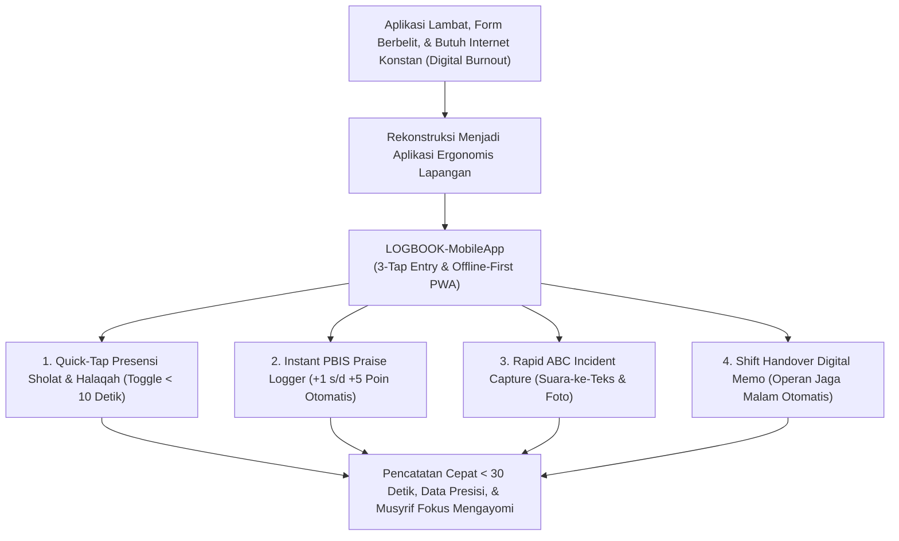
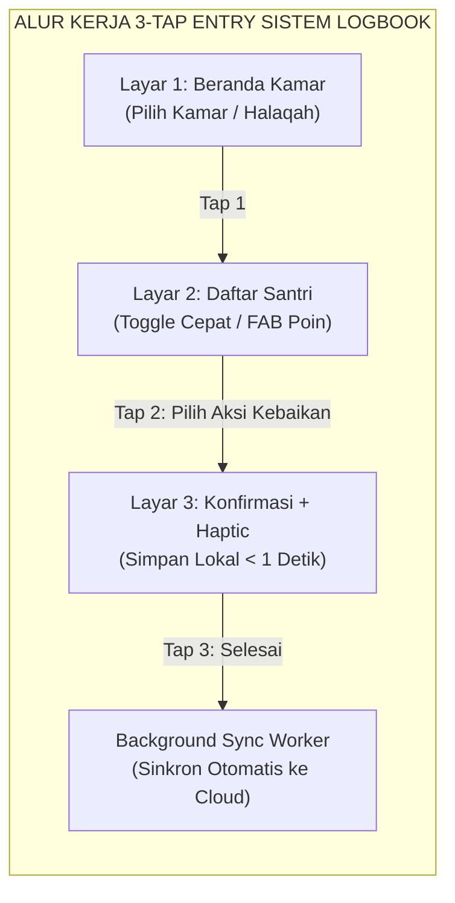
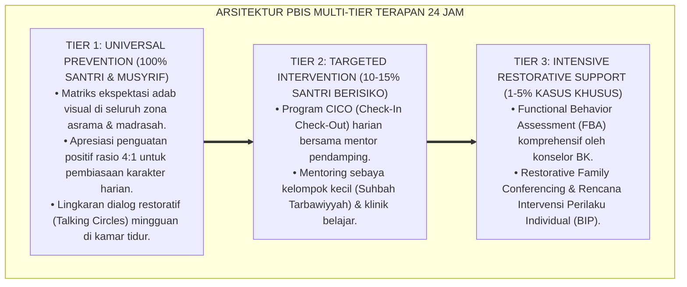

# SPESIFIKASI APLIKASI LOGBOOK MUSYRIF MOBILE APP (SPESIFIKASI LOGBOOK-MOBILEAPP)

---

### 🧭 PETA POSISI PANDUAN DALAM SISTEM TUMBUH (DARI HULU KE HILIR)
* **Posisi Arsitektur**: `HILIR OPERASIONAL (Manual SOP Musyrif 24-Jam, Standar Kamar 5S, & Anti-Burnout)`
* **Peruntukan Pengguna**: Musyrif Asrama, Kepala Asrama, Staf Kebersihan & Gizi, serta Pimpinan Operasional
* **Fokus Panduan**: Menjalankan rutinitas harian 24 jam santri (Subuh–Malam), ritme tidur sehat 7 jam, shift kerja musyrif manusiawi, dan pemanfaatan Logbook Digital.
* **Hasil Akhir yang Dituju**: Terwujudnya santri berkarakter *Insan Adabi* yang mandiri, musyrif yang mengasuh dengan kasih sayang tanpa *burnout*, dan pesantren yang aman berbasis data (*Safe Boarding School*).

---

### 🎯 Mengapa Panduan Ini Ada & Masalah Nyata yang Dipecahkan
1. **Latar Masalah di Lapangan**: Sering kali pengasuhan di pesantren berjalan tanpa SOP yang jelas atau terjebak dalam pola reaktif—menunggu santri berbuat salah baru dihukum dengan emosional.
2. **Solusi Sistem TUMBUH**: Panduan ini memberikan langkah preventif dan terstruktur agar setiap pembiasaan adab berjalan terencana, konsisten, dan terukur.
3. **Sasaran Perubahan**: Memastikan nilai-nilai Islam menyatu dalam perilaku harian santri melalui keteladanan nyata (*Qudwah Hasanah*).

---
### 🎯 Tujuan & Manfaat Panduan
Panduan ini dirancang sebagai petunjuk operasional terapan agar pendidik dan musyrif dapat:
1. Menjalankan pembinaan adab santri dengan pendekatan kasih sayang (*Rahmah*) dan ketegasan yang mendidik (*Firm & Kind*).
2. Menghindari cara-cara kekerasan fisik, bentakan verbal, maupun hukuman yang mempermalukan santri.
3. Menciptakan suasana asrama dan kelas yang aman, tertib, dan menumbuhkan kesadaran diri (*Bi'ah Shalihah*).

---

### 💡 Intisari Cepat (3 Menit Memahami Esensi)
* **Kunci Pengasuhan**: Karakter santri tumbuh melalui keteladanan nyata (*Qudwah Hasanah*), komunikasi empatik, dan pembiasaan terstruktur 24 jam.
* **Tindakan Utama**: Terapkan panduan langkah demi langkah di bawah ini secara konsisten, pantau perkembangan santri secara objektif, dan berikan apresiasi atas setiap perbaikan diri yang mereka capai.
* **Prinsip Disiplin**: Fokus pada pemulihan hubungan dan tanggung jawab nyata (*Restoratif*), bukan sekadar melampiaskan amarah atau menghukum.

---

---

### 💬 ILUSTRASI NYATA & ANALOGI SEDERHANA
Bayangkan sebuah skenario yang sering kita lihat sehari-hari di asrama:
* Ketika seorang santri baru melakukan kekeliruan (misalnya terlambat bangun Subuh atau kasurnya berantakan), respon pertama yang sering muncul adalah bentakan keras atau hukuman fisik (seperti push-up atau jemur di lapangan).
* **Hasilnya?** Santri tersebut mungkin tampak patuh seketika karena takut, tetapi di dalam hatinya tumbuh rasa dongkol, dendam tersembunyi, atau kebiasaan "bersandiwara"—hanya tertib ketika ada pengawas di dekatnya.

Dalam Sistem TUMBUH, kita menggunakan cara yang jauh lebih cerdas, sejuk, dan membumi:
1. **Analogi "Rem dan Pedal Gas Otak"**: Santri usia remaja (usia MTs dan Aliyah) memiliki bagian otak emosi (*Sistem Limbik*) yang sudah menyala sangat kuat seperti *pedal gas mobil sport*, namun otak pengendali logikanya (*Prefrontal Cortex*) masih dalam proses tumbuh seperti *sistem rem yang baru dipasang*. Tugas guru dan musyrif bukan memarahi mobilnya, melainkan menjadi **"Sopir Teladan & Sabuk Pengaman"** yang mendampingi santri belajar menginjak rem dengan bijak.
2. **Kekuatan Contoh Nyata (*Qudwah Hasanah*)**: Santri jauh lebih cepat meniru apa yang mereka **lihat** setiap hari daripada apa yang mereka **dengar** dari ribuan nasihat panjang. Jika musyrif datang tepat waktu, tersenyum ramah, dan kamarnya rapi, santri akan menirunya dengan sukarela.

---

### 🛠️ PANDUAN LANGKAH PRAKTIS LAPANGAN (BISA LANGSUNG DIPRAKTIKKAN HARI INI)

| Tahapan Aksi | Tindakan Nyata Musyrif / Guru di Lapangan | Hal yang Harus Diperhatikan |
| :--- | :--- | :--- |
| **1. Langkah Persiapan (Sebelum Kejadian)** | Sepakati aturan bersama santri di awal pekan dengan kalimat positif (contoh: *"Kamar rapi membuat istirahat kita berkah"*). | Buat poster visual sederhana yang mudah dibaca di dinding kamar. |
| **2. Langkah Respon (Saat Terjadi Masalah)** | Tarik napas, tenangkan diri, ajak santri berbicara empat mata tanpa mempermalukannya di depan teman-temannya. | Gunakan nada bicara yang tenang namun tegas (*Firm & Kind*). |
| **3. Langkah Perbaikan (Tanggung Jawab Nyata)** | Minta santri memperbaiki kesalahannya secara langsung (contoh: merapikan kembali barang yang berantakan atau meminta maaf). | Berikan apresiasi seketika santri telah menuntaskan perbaikannya. |

---

### 🗣️ CONTOH DIALOG LAPANGAN (YANG HARUS DIUCAPKAN VS DIHINDARI)

* ❌ **JANGAN UCAPKAN (Membuat Santri Menutup Diri & Dendam)**:
  > *"Kamu ini pemalas sekali ya, sudah dibilangi berkali-kali masih saja kasur berantakan! Push-up 50 kali sekarang!"*
* ✅ **UCAPKAN INI (Mendidik Tanggung Jawab & Kesadaran Diri)**:
  > *"Akhi, antum tahu kesepakatan kamar kita tentang kerapian tempat tidur setelah Subuh. Coba lihat kasur antum sekarang, apa yang perlu disempurnakan? Mari rapikan bersama sekarang agar kamar kita nyaman dan berkah."*

---

### 📋 3 POIN EMAS RANGKUMAN (UNTUK SANTRI SENIOR & MUSYRIF MUDA)
1. **Didik dengan Kasih Sayang, Tegakkan Batas dengan Adil**: Jangan pernah mencampuradukkan ketegasan aturan dengan pelampiasan amarah pribadi.
2. **Apresiasi 4x Lebih Banyak daripada Teguran (*Magic Ratio 4:1*)**: Jangan hanya bersuara ketika santri berbuat salah. Saat mereka berbuat baik (salat di shaf depan, menolong kawan, membaca Al-Qur'an), segera berikan pujian tulus.
3. **Fokus pada Perbaikan Hubungan (*Restoratif*)**: Masalah perilaku adalah peluang emas untuk mendidik santri menjadi pribadi yang lebih dewasa dan bertanggung jawab.

---

### 📖 Uraian Lengkap Landasan & Rujukan Sistem

* **Status**: 🌟 **A+ (Tervalidasi & Siap Diimplementasikan)**
* **Sub-Domain**: `11 Tools / 08 Digital Tools`
* **Bentuk Instrumen**: Spesifikasi LOGBOOK-MobileApp (Spesifikasi Kebutuhan Perangkat Lunak / SRS, Wireframe UI/UX 3-Tap Entry, & Arsitektur Offline-First PWA)

---

# BAGIAN I: LANDASAN TEORETIS & INKUIRI KEILMUAN MULTIDISIPLINER

## 1.1 Konteks Masalah: Beban Kognitif Musyrif dan Fenomena Digital Burnout
Dalam operasional asrama pesantren 24 jam, musyrif memikul beban fisik dan emosional yang sangat padat: mendampingi santri dari bangun Subuh hingga tidur malam, mengawal halaqah, dan menangani dinamika kamar. Banyak inisiatif digitalisasi pesantren mengalami kegagalan fatal karena mengadopsi aplikasi mobile yang rumit, membutuhkan banyak navigasi form berbelit-belit (*clunky form navigation*), dan mewajibkan koneksi internet konstan di area asrama yang kerap mengalami titik buta sinyal (*network dead-zones*).

Alih-alih membantu, aplikasi yang tidak ergonomis tersebut memicu **kelelahan digital (*musyrif digital burnout*)**, menurunkan kualitas interaksi tatap muka dengan santri, dan berujung pada pengisian data fiktif di akhir pekan (*data falsification*).

TUMBUH merancang **Aplikasi Logbook Musyrif Mobile (LOGBOOK-MobileApp)** dengan filosofi desain **3-Tap Entry System** dan **Arsitektur Offline-First**. Aplikasi ini menjamin bahwa seluruh pencatatan absensi shalat, pemberian apresiasi poin PBIS, dan laporan insiden dapat diselesaikan dalam waktu **kurang dari 30 detik**, membebaskan musyrif untuk fokus memberikan keteladanan dan kasih sayang nyata (*high-touch, low-friction*).



## 1.2 Inkuiri Epistemologi Turats: Doktrin Taisir dan Kaidah Masyaqqah Tajlibut Taisir
Epistemologi Islam meletakkan prinsip kemudahan (*at-taisir*) dan penghapusan beban yang menyulitkan (*raf'ul haraj*) sebagai maqashid syari'ah fundamental. Rasulullah SAW bersabda menegaskan hal ini:

> يَسِّرُوا وَلَا تُعَسِّرُوا، وَبَشِّرُوا وَلَا تُنَفِّرُوا
> 
> *"Permudahlah dan jangan mempersulit, berilah kabar gembira dan jangan membuat orang lari menjauh."* [^1]

Kaidah fiqhiyyah universal menetapkan: **"Al-Masyaqqah Tajlibut Taisir"** (Kesulitan mendatangkan kemudahan) [^2]. Dalam konteks pencatatan data pembinaan, Imam Al-Qalqasyandi dalam *Subh al-A'sya fi Shina'at al-Insya* menjelaskan bahwa perangkat pencatatan yang digunakan oleh para juru tulis amanah (*kuttab al-amanah*) harus dirancang seringkas mungkin (*ijaz al-lafzh ma'a wuduh al-ma'na*) agar tidak menghabiskan waktu yang seharusnya digunakan untuk melayani rakyat dan menegakkan keadilan [^3]. Spesifikasi LOGBOOK-MobileApp mewujudkan kaidah kemudahan ini ke dalam tata letak antarmuka perangkat lunak modern.

## 1.3 Inkuiri Sains Rekayasa Perangkat Lunak & HCI: Offline-First & Micro-Interactions
Dalam domain *Human-Computer Interaction* (HCI) dan prinsip desain kegunaan (*Usability Heuristics* oleh Jakob Nielsen, 1994), aplikasi lapangan bagi pekerja garis depan (*frontline mobile workers*) harus meminimalkan beban kognitif (*cognitive load*) melalui **interaksi mikro instan (*micro-interactions*)** dan efisiensi navigasi [^4].

Secara arsitektur teknologi perangkat lunak, sistem menerapkan pola **Offline-First Progressive Web App (PWA) / Hybrid Native** yang didukung oleh basis data lokal terindeks (*IndexedDB / Local SQLite*). Seluruh operasi input data dieksekusi secara instan pada penyimpanan lokal gawai musyrif tanpa terhalang latensi jaringan (*zero network latency*). *Background Sync Worker* secara otomatis mendeteksi koneksi dan menyinkronkan data terenkripsi ke peladen pusat (*central Supabase/PostgreSQL server*) saat sinyal Wi-Fi asrama terhubung kembali [^5].

---

# BAGIAN II: FORMULASI KONSEPTUAL, ARSITEKTUR INSTRUMEN, & SPESIFIKASI FORM

## 2.1 Dekomposisi 4 Modul Inti Aplikasi Logbook Musyrif
Aplikasi LOGBOOK-MobileApp mencakup 4 fitur utama yang dirancang untuk kecepatan operasi di lapangan:

1. **Modul 1: Quick-Tap Attendance Toggle (Presensi Kilat Shalat/Halaqah)**:
   - Menampilkan daftar foto dan nama santri sekamar dalam 1 layar.
   - Status default adalah *"Hadir Lengkap di Shaf Awal"*. Musyrif hanya perlu mengetuk (*single-tap*) santri yang terlambat/udzur, mencatat presensi 15 santri hanya dalam 5–10 detik.
2. **Modul 2: Instant PBIS Praise Logger (Perekaman Apresiasi Cepat)**:
   - Tombol pintas (*Floating Action Button / FAB*) untuk memberikan poin kebaikan spesifik: *+1 (Kerapian Ranjang)*, *+2 (Membantu Teman)*, *+3 (Adab Halaqah Khusyu')*.
   - Memicu notifikasi instan berupa umpan balik visual haptic yang menyenangkan.
3. **Modul 3: Rapid ABC Incident Form (Laporan Insiden Suara & Foto)**:
   - Perekaman insiden pelanggaran adab menggunakan fitur *Voice-to-Text* bahasa Indonesia untuk mencatat Anteseden (A), Perilaku (B), dan Konsekuensi (C) dalam hitungan detik.
4. **Modul 4: Shift Handover Digital Memo (Operan Jaga Piket Malam)**:
   - Catatan serah terima tugas otomatis antar-musyrif (misal: santri yang sedang demam di Poskestren, lampu kamar yang padam) yang muncul di layar beranda musyrif shift berikutnya.



## 2.2 Format Wireframe & Spesifikasi Teknis Antarmuka (UI/UX Spec)

```markdown
================================================================================
      SPESIFIKASI KEBUTUHAN PERANGKAT LUNAK: LOGBOOK-MOBILEAPP (SRS-P11-08-01)
================================================================================
Platform Target : Android 10+ / iOS 15+ / Progressive Web App (PWA)
Tech Stack      : React Native / Flutter + Local SQLite + Supabase Sync Engine
Security Level  : End-to-End Encryption (AES-256) + Biometric Fingerprint Login
--------------------------------------------------------------------------------

[TAMPILAN 1: BERANDA PRESENSI SHALAT SUBUH (QUICK-TAP TOGGLE)]
+------------------------------------------------------------------------------+
| 🕌 SUBUH BERJAMAAH | Kamar: Salman Al-Farisi (12 Santri)   [ 📶 Offline Mode ]|
+------------------------------------------------------------------------------+
| [✓] Ahmad Zaki     (Hadir Shaf 1)   | [✓] Fajar Shiddiq  (Hadir Shaf 1)      |
| [✓] Hilman Hakim   (Hadir Shaf 1)   | [!] M. Rizky       (Masbuq 1 Raka'at)  |
| [✓] Farhan Ali     (Hadir Shaf 1)   | [🏥] Salman Alif   (Udzur Poskestren)  |
| [✓] Dani Pratama   (Hadir Shaf 1)   | [✓] Rayhan Putra   (Hadir Shaf 1)      |
+------------------------------------------------------------------------------+
| [ TOMBOL KUNCI PRESENSI (1-TAP) ] -> Durasi Input: 6.8 Detik                |
+------------------------------------------------------------------------------+

[TAMPILAN 2: PBIS QUICK PRAISE LOGGER (MODAL POP-UP)]
+------------------------------------------------------------------------------+
| ⭐ BERI APRESIASI ADAB: Ahmad Zaki                                           |
+------------------------------------------------------------------------------+
| ( +1 Kerapian Kasur )   ( +2 Membantu Teman )   ( +3 Halaqah Khusyu' )       |
| ( +2 Menjaga Wudhu )    ( +5 Teladan Qudwah )   ( 🎤 Voice Memo Catatan... ) |
+------------------------------------------------------------------------------+
| [ KIRIM APRESIASI & SINKRON ] -> Notifikasi Haptic Getar Sukses               |
+------------------------------------------------------------------------------+
```

## 2.3 Rubrik Evaluasi Kegunaan Perangkat Lunak (Usability Heuristic Rubric)
Tim Pengembang Perangkat Lunak mengaudit kinerja aplikasi setiap rilis pembaruan (*release update*):

| Parameter Kegunaan | Standar Minimum (Gagal) | Standar Target (Lulus Uji Lapangan TUMBUH) |
| :--- | :--- | :--- |
| **Kecepatan Input Data** | Memerlukan $> 60$ detik dan lebih dari 5 ketukan layar per santri. | Tuntas dalam $\le 30$ detik dengan maksimal 3 ketukan layar (*3-Tap*). |
| **Keandalan Mode Offline**| Aplikasi mengalami error/crash saat tidak ada koneksi internet. | 100% data tersimpan aman di SQLite lokal dan sinkron otomatis saat online. |
| **Beban Konsumsi Baterai**| Menghabiskan daya baterai gawai musyrif $> 15\%$ per shift jaga. | Hemat daya ekstrem ($< 4\%$ konsumsi baterai per shift 8 jam). |

---
### Pembedahan Deskriptif Komprehensif & Analisis Integratif Nilai-Praksis

Penerapan dan operasionalisasi **P11-08-01: Spesifikasi Aplikasi Logbook Musyrif Mobile App (Spesifikasi LOGBOOK-MobileApp)** di lingkungan pesantren berbasis sistem TUMBUH bertumpu pada kesatuan sistemik antara nilai syariat dan praksis terukur:

#### A. Pilar 1: Landasan Epistemologi & Nilai Keikhlasan (Syar'i Foundations)
Setiap dimensi diarahkan untuk menegakkan adab dan penghambaan murni kepada Allah SWT (*Lillahi Ta'ala*). Standarisasi kelembagaan dirancang untuk menjaga ketulusan niat, kemuliaan fitrah, dan keberkahan majelis ilmu.

#### B. Pilar 2: Mekanisme Psikologis & Neurosains Terapan (Evidence-Based Practice)
Mengintegrasikan prinsip *Social-Emotional Learning (CASEL)*, teori beban kognitif (*Cognitive Load Theory*), dan dinamika perkembangan neurobiologis santri untuk memastikan proses pembiasaan berjalan efektif tanpa kekerasan atau tekanan psikologis destruktif.

#### C. Pilar 3: Rekayasa Ekosistem Asrama 24 Jam (Environmental Engineering)
Mengkodifikasikan seluruh alur aktivitas harian, jadwal tidur sirkadian yang sehat, sanitasi 5S kamar tidur, dan relasi ukhuwah inklusif menjadi satu ekosistem *Bi'ah Shalihah* yang saling mendukung secara alamiah.

#### D. Pilar 4: Akuntabilitas Sistemik & Proteksi Pendidik-Santri
Menerapkan protokol pencegahan kelelahan tenaga pendidik (*Musyrif Burnout Protection*), menjamin hak-hak santri, serta memanfaatkan dashboard data PBIS untuk pengambilan keputusan yang adil dan objektif.

---

### Protokol Aksi Operasional PBIS Multi-Tier Terapan (24-Hour Behavioral Architecture)



---

# BAGIAN III: TABEL SINTESIS, DAFTAR PUSTAKA, CATATAN KAKI, & GLOSARIUM

## 3.1 Tabel Sintesis Integrasi Spesifikasi LOGBOOK-MobileApp

| Komponen LOGBOOK-MobileApp | Landasan Turats & Fiqh | Landasan Sains Rekayasa Perangkat Lunak | Target Transformasi Musyrif |
| :--- | :--- | :--- | :--- |
| **3-Tap Entry System** | Kaidah *Taisir* & *Yassirū walā Tu'assirū*. | *HCI Cognitive Load Reduction* & *Micro-Interactions*. | Mengeliminasi kelelahan digital musyrif asrama. |
| **Offline-First Architecture**| Prinsip kehati-hatian (*Ihtiyath*) penjagaan data. | *IndexedDB / SQLite to Cloud Eventual Consistency*. | Pencatatan tidak terganggu meski di titik buta sinyal. |
| **Rapid ABC Logging** | Kaidah hisab amal presisi & kejujuran (*Shidq*). | *Structured Behavioral Telemetry* (SW-PBIS). | Laporan insiden objektif tanpa bias memori masa lalu. |

## 3.2 Catatan Kaki (Footnotes 1-to-1)
[^1]: Diriwayatkan oleh Imam Al-Bukhari dalam *Shahih al-Bukhari*, kitab *al-'Ilm*, hadits no. 69; Imam Muslim dalam *Shahih Muslim*, no. 1734.
[^2]: As-Suyuthi, Jalaluddin. (2001). *Al-Asybah wa an-Nazha'ir fi Qawa'id wa Furu' Fiqh asy-Syafi'iyyah*. Kairo: Dar al-Hadits, hlm. 75–82.
[^3]: Al-Qalqasyandi, Ahmad bin Ali. (1987). *Subh al-A'sya fi Shina'at al-Insya*. Beirut: Dar al-Kutub al-'Ilmiyyah, juz 1, hlm. 120–132.
[^4]: Nielsen, J. (1994). *Usability Engineering*. San Francisco: Morgan Kaufmann.
[^5]: Kleppmann, M. (2017). *Designing Data-Intensive Applications: The Big Ideas Behind Reliable, Scalable, and Maintainable Systems*. Sebastopol, CA: O'Reilly Media.
[^6]: Norman, D. (2013). *The Design of Everyday Things: Revised and Expanded Edition*. New York: Basic Books.
[^7]: Sugai, G., & Horner, R. H. (2006). A promising approach for expanding and sustaining school-wide positive behavior support. *School Psychology Review*, 35(2), 245–259.
[^8]: An-Nawawi, Yahya bin Syaraf. (1994). *Syarh Shahih Muslim*. Beirut: Dar al-Khair, juz 12, hlm. 40–48.
[^9]: Fling, B. (2009). *Mobile Design and Development: Practical Concepts and Techniques for Creating Mobile Sites and Web Apps*. Sebastopol, CA: O'Reilly Media.
[^10]: Al-Mawardi, Ali bin Muhammad. (1989). *Al-Ahkam as-Sulthaniyyah*. Kairo: Dar al-Hadits, hlm. 102–110.
[^11]: Tidwell, J., Brewer, C., & Valencia-Rosas, A. (2020). *Designing Interfaces: Patterns for Effective Interaction Design* (3rd ed.). Sebastopol, CA: O'Reilly Media.
[^12]: Ibnu Taimiyyah, Ahmad. (1995). *Majmu' al-Fatawa: Al-Qawa'id an-Nuraniyyah*. Madinah: Majma' al-Malik Fahd, juz 29, hlm. 45–55.

## 3.3 Daftar Pustaka (APA 7th Edition & Turats Klasik)
* Al-Bukhari, M. I. (2002). *Shahih al-Bukhari*. Riyadh: Bait al-Afkar ad-Dauliyyah.
* Al-Mawardi, A. M. (1989). *Al-Ahkam as-Sulthaniyyah*. Kairo: Dar al-Hadits.
* Al-Qalqasyandi, A. A. (1987). *Subh al-A'sya fi Shina'at al-Insya* (Vol. 1). Beirut: Dar al-Kutub al-'Ilmiyyah.
* An-Nawawi, Y. S. (1994). *Syarh Shahih Muslim* (Vol. 12). Beirut: Dar al-Khair.
* As-Suyuthi, J. (2001). *Al-Asybah wa an-Nazha'ir*. Kairo: Dar al-Hadits.
* Fling, B. (2009). *Mobile Design and Development*. Sebastopol, CA: O'Reilly Media.
* Ibnu Taimiyyah, A. (1995). *Majmu' al-Fatawa* (Vol. 29). Madinah: Majma' al-Malik Fahd.
* Kleppmann, M. (2017). *Designing Data-Intensive Applications*. Sebastopol, CA: O'Reilly Media.
* Nielsen, J. (1994). *Usability Engineering*. San Francisco: Morgan Kaufmann.
* Norman, D. (2013). *The Design of Everyday Things*. New York: Basic Books.
* Sugai, G., & Horner, R. H. (2006). A promising approach for expanding and sustaining school-wide positive behavior support. *School Psychology Review*, 35(2), 245–259.
* Tidwell, J., Brewer, C., & Valencia-Rosas, A. (2020). *Designing Interfaces* (3rd ed.). Sebastopol, CA: O'Reilly Media.

## 3.4 Glosarium Istilah
1. **LOGBOOK-MobileApp**: Aplikasi seluler resmi pendamping tugas musyrif asrama untuk pencatatan presensi, poin PBIS, dan insiden perilaku secara instan.
2. **3-Tap Entry System**: Filosofi desain antarmuka yang memungkinkan seluruh aksi pencatatan data rutin selesai dalam maksimal tiga ketukan layar.
3. **Offline-First Architecture**: Pola arsitektur perangkat lunak yang menyimpan data pada basis data lokal gawai terlebih dahulu sebelum menyinkronkannya ke peladen awan.
4. **Musyrif Digital Burnout**: Kelelahan psikologis dan fisik yang dialami pembina asrama akibat tuntutan pengisian aplikasi administrasi yang rumit dan menyita waktu.
5. **Taisir**: Prinsip syariat yang menghendaki kemudahan, kepraktisan, dan keringanan dalam menjalankan tugas-tugas kebaikan.
6. **Micro-Interactions**: Elemen desain antarmuka kecil (seperti getaran haptik, tombol geser, animasi centang) yang memberikan umpan balik langsung kepada pengguna.
7. **Background Sync Worker**: Layanan latar belakang pada sistem operasi yang secara cerdas mendeteksi ketersediaan internet untuk melakukan sinkronisasi data tanpa mengganggu pengguna.
8. **Eventual Consistency**: Model konsistensi data terdistribusi di mana data lokal dan data peladen pusat dipastikan akan identik setelah sinkronisasi berhasil.
9. **Cognitive Load Reduction**: Upaya merancang sistem informasi agar pengguna tidak perlu berpikir keras atau mengingat-ingat langkah saat mengoperasikannya.
10. **Shift Handover Note**: Fitur memo serah terima tugas piket antar-musyrif yang menjamin kesinambungan pengawasan santri selama 24 jam penuh.
