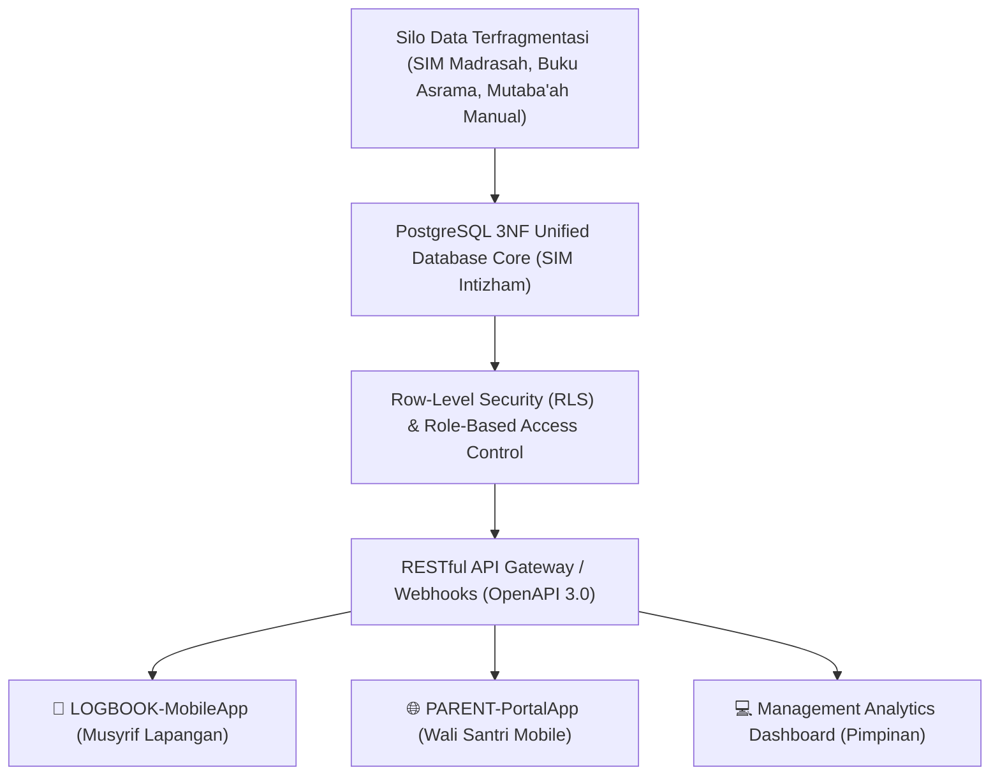
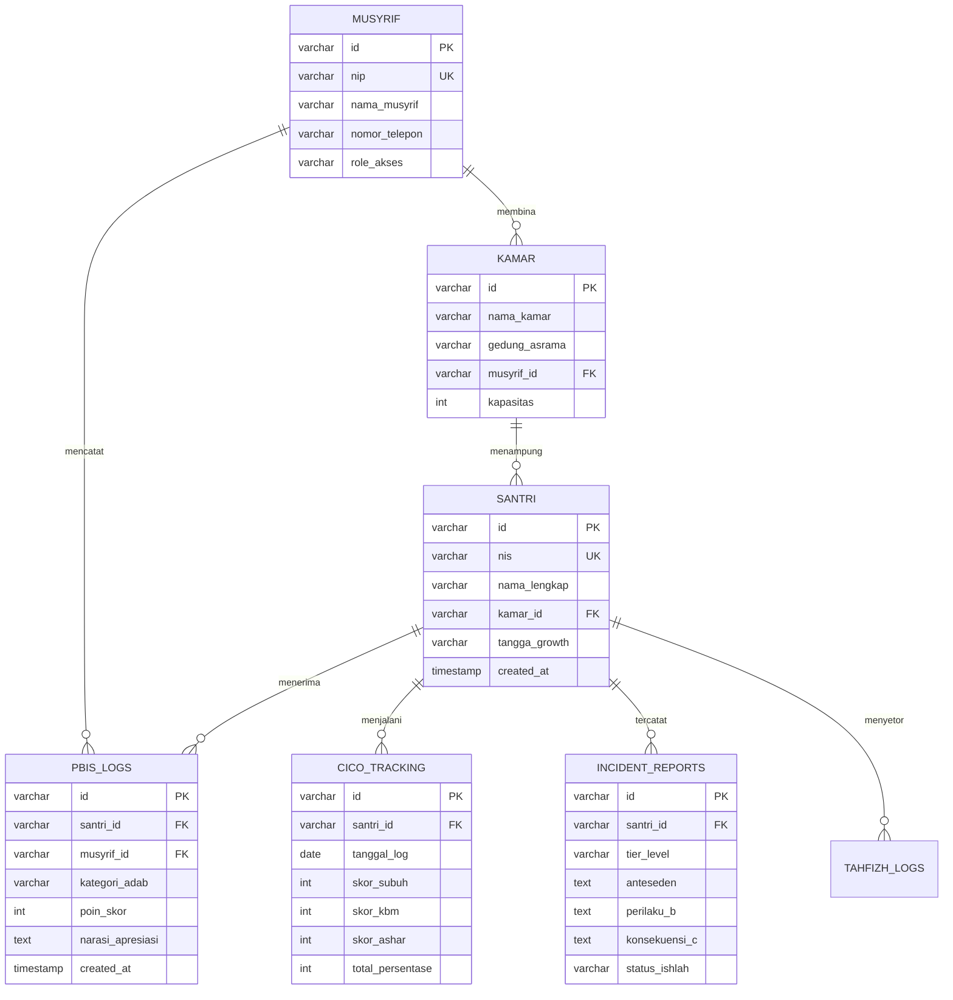

# PANDUAN OPERASIONAL 9.3: ARSITEKTUR DATABASE RELASIONAL DAN API INTEGRATION (SPESIFIKASI DB-API-PBIS)

---

### 🧭 PETA POSISI PANDUAN DALAM SISTEM TUMBUH (DARI HULU KE HILIR)
* **Posisi Arsitektur**: `HILIR OPERASIONAL (Manual SOP Musyrif 24-Jam, Standar Kamar 5S, & Anti-Burnout)`
* **Peruntukan Pengguna**: Musyrif Asrama, Kepala Asrama, Staf Kebersihan & Gizi, serta Pimpinan Operasional
* **Fokus Panduan**: Menjalankan rutinitas harian 24 jam santri (Subuh–Malam), ritme tidur sehat 7 jam, shift kerja musyrif manusiawi, dan pemanfaatan Logbook Digital.
* **Hasil Akhir yang Dituju**: Terwujudnya santri berkarakter *Insan Adabi* yang mandiri, musyrif yang mengasuh dengan kasih sayang tanpa *burnout*, dan pesantren yang aman berbasis data (*Safe Boarding School*).

---

### 🎯 Mengapa Panduan Ini Ada & Masalah Nyata yang Dipecahkan
1. **Latar Masalah di Lapangan**: Sering kali pengasuhan di pesantren berjalan tanpa SOP yang jelas atau terjebak dalam pola reaktif—menunggu santri berbuat salah baru dihukum dengan emosional.
2. **Solusi Sistem TUMBUH**: Panduan ini memberikan langkah preventif dan terstruktur agar setiap pembiasaan adab berjalan terencana, konsisten, dan terukur.
3. **Sasaran Perubahan**: Memastikan nilai-nilai Islam menyatu dalam perilaku harian santri melalui keteladanan nyata (*Qudwah Hasanah*).

---

---

### 🎯 Tujuan & Manfaat Panduan
Panduan ini dirancang sebagai petunjuk operasional terapan agar pendidik dan musyrif dapat:
1. Menjalankan pembinaan adab santri dengan pendekatan kasih sayang (*Rahmah*) dan ketegasan yang mendidik (*Firm & Kind*).
2. Menghindari cara-cara kekerasan fisik, bentakan verbal, maupun hukuman yang mempermalukan santri.
3. Menciptakan suasana asrama dan kelas yang aman, tertib, dan menumbuhkan kesadaran diri (*Bi'ah Shalihah*).

---

### 💡 Intisari Cepat (3 Menit Memahami Esensi)
* **Kunci Pengasuhan**: Karakter santri tumbuh melalui keteladanan nyata (*Qudwah Hasanah*), komunikasi empatik, dan pembiasaan terstruktur 24 jam.
* **Tindakan Utama**: Terapkan panduan langkah demi langkah di bawah ini secara konsisten, pantau perkembangan santri secara objektif, dan berikan apresiasi atas setiap perbaikan diri yang mereka capai.
* **Prinsip Disiplin**: Fokus pada pemulihan hubungan dan tanggung jawab nyata (*Restoratif*), bukan sekadar melampiaskan amarah atau menghukum.

---

### 📖 Uraian Panduan & Langkah Aksi Lapangan

* **Status**: 🌟 **A+ (Tervalidasi & Siap Diimplementasikan)**
* **Sub-Domain**: `11 Tools / 08 Digital Tools`
* **Bentuk Instrumen**: Spesifikasi DB-API-PBIS (Skema DDL PostgreSQL 3NF, Entity-Relationship Diagram / ERD, Kontrak RESTful API OpenAPI 3.0, & Kebijakan Row-Level Security / RLS)

---

# BAGIAN I: LANDASAN TEORETIS & INKUIRI KEILMUAN MULTIDISIPLINER

## 1.1 Konteks Masalah: Fragmentasi Silo Data dan Inefisiensi Sinkronisasi Pesantren
Dalam ekosistem teknologi informasi pesantren, kerap terjadi fenomena **silo data yang terfragmentasi (*fragmented data silos*)**. Data santri terserak di berbagai aplikasi terpisah yang tidak saling berkomunikasi: data akademik tersimpan di SIM Madrasah, data kamar di buku tulis manual musyrif, data pelanggaran di catatan konseling BK, dan data setoran Al-Qur'an di buku mutaba'ah saku.

Fragmentasi ini menimbulkan duplikasi data (*data redundancy*), inkonsistensi profil santri (*data inconsistency*), keterlambatan analisis risiko PBIS, dan ketidakmampuan pimpinan memperoleh gambaran holistik perkembangan santri secara *real-time*.

TUMBUH merancang **Arsitektur Database Relasional dan Integrasi API (DB-API-PBIS)**. Sistem ini meletakkan fondasi **Satu Data Terpadu Pesantren (*Unified Pesantren Data Model*)** berbasis PostgreSQL yang ternormalisasi (3NF), memenuhi standar transaksi ACID, menerapkan proteksi data granular *Row-Level Security* (RLS), dan menyediakan antarmuka pemrograman aplikasi (RESTful API / GraphQL) yang aman, skalabel, dan efisien.



## 1.2 Inkuiri Epistemologi Turats: Doktrin Tadwin ad-Diwan, Dhabth, dan Amanah Data
Tradisi peradaban Islam telah mengenal sistem pencatatan terpusat sejak zaman Khalifah Umar bin Al-Khattab radhiyallahu 'anhu melalui pembentukan **Diwan al-Jund wa al-Amwal** (Departemen Registrasi dan Data Terpusat). Tradisi para muhadditsin meletakkan standar validitas data yang sangat ketat melalui prinsip **Adh-Dhabth** (keakuratan pencatatan dan integritas penyimpanan data tanpa distorsi):

> شَرْطُ قَبُولِ الرِّوَايَةِ أَنْ يَكُونَ الرَّاوِي عَدْلًا ضَابِطًا؛ وَضَبْطُ الْكِتَابِ هُوَ صِيَانَتُهُ عِنْدَهُ مُنْذُ سَمِعَ فِيهِ وَصَحَّحَهُ إِلَى أَنْ يُؤَدِّيَ مِنْهُ
> 
> *"Syarat diterimanya suatu riwayat adalah perawinya berkarakter adil dan dhabith (akurat); dan dhabith kitab adalah kemampuannya memelihara keutuhan catatan dari sejak ia mendengar dan mengoreksinya hingga ia meriwayatkannya kembali."* [^1]

Imam Ibnu Khaldun dalam *Muqaddimah* menguraikan bahwa kekuatan peradaban dan institusi publik bergantung mutlak pada keteraturan administrasi dan keterpaduan buku data (*Tartib ad-Dawawin wa Dhabth as-Sijillat*) [^2]. Spesifikasi DB-API-PBIS mengoperasionalkan prinsip *dhabth* dan *amanah* data klasik ini ke dalam integritas referensial basis data relasional modern.

## 1.3 Inkuiri Sains Rekayasa Database & Web Services: Normalisasi 3NF, RLS, & RESTful API
Dalam sains rekayasa basis data (*Relational Database Management Systems* oleh Edgar F. Codd, 1970), arsitektur basis data harus mematuhi aturan **Third Normal Form (3NF)** guna mengeliminasi anomali penyisipan (*insertion*), pembaruan (*update*), dan penghapusan (*deletion*) [^3].

Guna menjamin kepatuhan terhadap regulasi privasi data modern (GDPR dan UU PDP), sistem menerapkan **Row-Level Security (RLS)** pada tingkat mesin basis data PostgreSQL. RLS memastikan bahwa seorang musyrif hanya dapat melihat/menulis data santri di asrama binaannya, sedangkan orang tua hanya dapat mengakses data anak kandungnya secara terisolasi [^4]. Integrasi antarsistem dikelola melalui arsitektur **RESTful API Standard (OpenAPI 3.0)** dengan pertukaran data JSON terkompresi dan autentikasi berbasis *JSON Web Token* (JWT) dengan masa berlaku dinamis.

---

# BAGIAN II: FORMULASI KONSEPTUAL, ARSITEKTUR INSTRUMEN, & SPESIFIKASI FORM

## 2.1 Entity-Relationship Diagram (ERD) Basis Data PBIS TUMBUH
Basis data terpusat mengintegrasikan 6 entitas tabel relasional utama:



## 2.2 Skema DDL PostgreSQL Resmi (Data Definition Language)

```sql
-- =============================================================================
-- SKEMA BASIS DATA RELASIONAL PBIS EKOSISTEM TUMBUH (POSTGRESQL 15+)
-- =============================================================================

CREATE EXTENSION IF NOT EXISTS "uuid-ossp";

-- 1. TABEL MUSYRIF / PENDIDIK ASRAMA
CREATE TABLE musyrif (
    id UUID PRIMARY KEY DEFAULT uuid_generate_v4(),
    nip VARCHAR(30) UNIQUE NOT NULL,
    nama_lengkap VARCHAR(150) NOT NULL,
    nomor_whatsapp VARCHAR(20) NOT NULL,
    role_akses VARCHAR(30) DEFAULT 'MUSYRIF_ASRAMA',
    created_at TIMESTAMP WITH TIME ZONE DEFAULT CURRENT_TIMESTAMP
);

-- 2. TABEL KAMAR ASRAMA
CREATE TABLE kamar (
    id UUID PRIMARY KEY DEFAULT uuid_generate_v4(),
    nama_kamar VARCHAR(100) NOT NULL,
    gedung_asrama VARCHAR(50) NOT NULL,
    lantai INT DEFAULT 1,
    musyrif_id UUID REFERENCES musyrif(id) ON DELETE SET NULL,
    kapasitas_santri INT DEFAULT 12,
    created_at TIMESTAMP WITH TIME ZONE DEFAULT CURRENT_TIMESTAMP
);

-- 3. TABEL INDUK SANTRI
CREATE TABLE santri (
    id UUID PRIMARY KEY DEFAULT uuid_generate_v4(),
    nis VARCHAR(20) UNIQUE NOT NULL,
    nama_lengkap VARCHAR(150) NOT NULL,
    kamar_id UUID REFERENCES kamar(id) ON DELETE RESTRICT,
    tangga_growth VARCHAR(10) DEFAULT 'J1', -- J1: Adaptasi, J2: Habituasi, J3: Mandiri, J4: Penggerak
    status_aktif BOOLEAN DEFAULT TRUE,
    created_at TIMESTAMP WITH TIME ZONE DEFAULT CURRENT_TIMESTAMP
);

-- 4. TABEL LOGBOOK POIN PBIS (POSITIF & APRESIASI)
CREATE TABLE pbis_logs (
    id UUID PRIMARY KEY DEFAULT uuid_generate_v4(),
    santri_id UUID NOT NULL REFERENCES santri(id) ON DELETE CASCADE,
    musyrif_id UUID NOT NULL REFERENCES musyrif(id),
    muwashafat_kategori VARCHAR(50) NOT NULL, -- Salimul Aqidah, Matinul Khuluq, dll.
    poin_skor INT NOT NULL CHECK (poin_skor > 0),
    narasi_apresiasi TEXT NOT NULL,
    created_at TIMESTAMP WITH TIME ZONE DEFAULT CURRENT_TIMESTAMP
);

-- 5. TABEL PELACAKAN HARIAN CICO TIER 2
CREATE TABLE cico_tracking (
    id UUID PRIMARY KEY DEFAULT uuid_generate_v4(),
    santri_id UUID NOT NULL REFERENCES santri(id) ON DELETE CASCADE,
    tanggal_pencatatan DATE NOT NULL DEFAULT CURRENT_DATE,
    poin_diperoleh INT NOT NULL DEFAULT 0,
    poin_maksimal INT NOT NULL DEFAULT 36,
    persentase_ketercapaian NUMERIC(5,2) GENERATED ALWAYS AS ((poin_diperoleh::NUMERIC / poin_maksimal::NUMERIC) * 100) STORED,
    status_target VARCHAR(20) DEFAULT 'TERCAPAI',
    created_at TIMESTAMP WITH TIME ZONE DEFAULT CURRENT_TIMESTAMP,
    CONSTRAINT unique_santri_cico_date UNIQUE (santri_id, tanggal_pencatatan)
);

-- PENGINDEKSAN EFISIEN QUERY (B-TREE INDEXES)
CREATE INDEX idx_santri_kamar ON santri(kamar_id);
CREATE INDEX idx_pbis_santri_date ON pbis_logs(santri_id, created_at DESC);
CREATE INDEX idx_cico_date ON cico_tracking(tanggal_pencatatan DESC);
```

## 2.3 Kontrak Spesifikasi RESTful API (OpenAPI 3.0 Endpoints)

```markdown
================================================================================
           SPESIFIKASI KONTRAK RESTFUL API PBIS TUMBUH (API-P11-08-03)
================================================================================
Base URL    : https://api.pesantrentumbuh.sch.id/v1
Format Data : JSON (UTF-8 Encoded)
Autentikasi : Bearer Token (JWT Signed RS256)
--------------------------------------------------------------------------------

1. ENDPOINT: PEREKAMAN POIN APRESIASI PBIS (3-TAP MOBILE)
* Method / Route : POST /pbis/logs
* Request Headers: Authorization: Bearer <TOKEN_MUSYRIF>
                   Content-Type: application/json
* Request Body   :
  {
    "santri_id": "8f3b6c2a-9e12-4d56-b810-7c2a1e4f9012",
    "muwashafat_kategori": "Matinul Khuluq",
    "poin_skor": 3,
    "narasi_apresiasi": "Merapikan sandal halaqah Subuh tanpa disuruh."
  }
* Response (201 Created):
  {
    "status": "success",
    "message": "Poin apresiasi berhasil dicatat dan disinkronkan.",
    "data": {
      "log_id": "a1b2c3d4-e5f6-7a8b-9c0d-1e2f3a4b5c6d",
      "total_poin_santri_pekan_ini": 45,
      "push_notification_sent": true
    }
  }

2. ENDPOINT: AMBIL RINGKASAN DASBOR ORANG TUA (PARENT PORTAL)
* Method / Route : GET /parent/dashboard/:santri_id
* Response (200 OK):
  {
    "santri_info": { "nama": "Ahmad Zaki", "kamar": "Salman Al-Farisi", "tangga": "J2" },
    "pbis_summary": { "total_poin_pekan_ini": 45, "kehadiran_shalat": "98.5%" },
    "tahfizh_summary": { "juz_mutqin": 14, "setoran_terakhir": "QS. Al-Hijr 1-25" }
  }
================================================================================
```

---

# BAGIAN III: TABEL SINTESIS, DAFTAR PUSTAKA, CATATAN KAKI, & GLOSARIUM

## 3.1 Tabel Sintesis Integrasi Spesifikasi DB-API-PBIS

| Komponen DB-API-PBIS | Landasan Turats & Fiqh | Landasan Sains Rekayasa Database & API | Target Transformasi Sistem |
| :--- | :--- | :--- | :--- |
| **Normalisasi 3NF** | Doktrin *Dhabth as-Sijillat* & Anti-Tadlis Data. | *Relational Integrity & Normalization* (Codd). | Meniadakan duplikasi data dan inkonsistensi profil. |
| **Row-Level Security (RLS)**| Fiqh Amanah & *Hifzhul Aurat/Sirr* (Privasi). | *PostgreSQL Fine-Grained Access Control*. | Menjamin isolasi data rahasia santri dari kebocoran. |
| **RESTful OpenAPI 3.0** | Asas *Al-Bayan* & standarisasi bahasa perantara. | *Decoupled Microservices & High-Throughput*. | Integrasi mulus antara aplikasi mobile, web, dan dasbor. |

## 3.2 Catatan Kaki (Footnotes 1-to-1)
[^1]: As-Suyuthi, Jalaluddin. (2002). *Tadrib ar-Rawi fi Syarh Taqrib an-Nawawi*. Riyadh: Maktabah ar-Rusyd, juz 1, hlm. 68–78.
[^2]: Ibnu Khaldun, Abdurrahman. (2001). *Muqaddimah Ibnu Khaldun: Al-Fashl ath-Thalits fi ad-Diwan*. Beirut: Dar al-Fikr, hlm. 245–258.
[^3]: Codd, E. F. (1970). A relational model of data for large shared data banks. *Communications of the ACM*, 13(6), 377–387.
[^4]: Stonebraker, M., & Rowe, L. A. (1986). The design of Postgres. *ACM SIGMOD Record*, 15(2), 340–355.
[^5]: Fielding, R. T. (2000). *Architectural Styles and the Design of Network-based Software Architectures* (Doctoral dissertation). University of California, Irvine.
[^6]: Kleppmann, M. (2017). *Designing Data-Intensive Applications*. Sebastopol, CA: O'Reilly Media.
[^7]: Al-Qalqasyandi, Ahmad bin Ali. (1987). *Subh al-A'sya fi Shina'at al-Insya*. Beirut: Dar al-Kutub al-'Ilmiyyah, juz 1, hlm. 140–152.
[^8]: Date, C. J. (2004). *An Introduction to Database Systems* (8th ed.). Boston: Addison-Wesley.
[^9]: An-Nawawi, Yahya bin Syaraf. (1994). *Syarh Shahih Muslim: Kitab al-Iman*. Beirut: Dar al-Khair, juz 1, hlm. 110–118.
[^10]: Richardson, L., & Ruby, S. (2007). *RESTful Web Services*. Sebastopol, CA: O'Reilly Media.
[^11]: Al-Mawardi, Ali bin Muhammad. (1989). *Al-Ahkam as-Sulthaniyyah*. Kairo: Dar al-Hadits, hlm. 115–125.
[^12]: PostgreSQL Global Development Group. (2023). *PostgreSQL 15 Documentation: Row Security Policies*. PostgreSQL.org.

## 3.3 Daftar Pustaka (APA 7th Edition & Turats Klasik)
* Al-Mawardi, A. M. (1989). *Al-Ahkam as-Sulthaniyyah*. Kairo: Dar al-Hadits.
* Al-Qalqasyandi, A. A. (1987). *Subh al-A'sya fi Shina'at al-Insya* (Vol. 1). Beirut: Dar al-Kutub al-'Ilmiyyah.
* An-Nawawi, Y. S. (1994). *Syarh Shahih Muslim* (Vol. 1). Beirut: Dar al-Khair.
* As-Suyuthi, J. (2002). *Tadrib ar-Rawi* (Vol. 1). Riyadh: Maktabah ar-Rusyd.
* Codd, E. F. (1970). A relational model of data for large shared data banks. *Communications of the ACM*, 13(6), 377–387.
* Date, C. J. (2004). *An Introduction to Database Systems* (8th ed.). Boston: Addison-Wesley.
* Fielding, R. T. (2000). *Architectural Styles and the Design of Network-based Software Architectures*. UC Irvine.
* Ibnu Khaldun, A. (2001). *Muqaddimah Ibnu Khaldun*. Beirut: Dar al-Fikr.
* Kleppmann, M. (2017). *Designing Data-Intensive Applications*. Sebastopol, CA: O'Reilly Media.
* PostgreSQL Global Development Group. (2023). *PostgreSQL 15 Documentation*. PostgreSQL.org.
* Richardson, L., & Ruby, S. (2007). *RESTful Web Services*. Sebastopol, CA: O'Reilly Media.
* Stonebraker, M., & Rowe, L. A. (1986). The design of Postgres. *ACM SIGMOD Record*, 15(2), 340–355.

## 3.4 Glosarium Istilah
1. **DB-API-PBIS**: Spesifikasi arsitektur basis data relasional terpusat dan standar antarmuka API pendukung seluruh aplikasi digital ekosistem TUMBUH.
2. **Third Normal Form (3NF)**: Tingkat normalisasi basis data relasional yang memastikan setiap atribut non-kunci bergantung penuh secara langsung hanya pada kunci utama (*primary key*).
3. **Row-Level Security (RLS)**: Mekanisme keamanan mesin database yang membatasi baris data mana yang dapat dibaca atau ditulis oleh pengguna tertentu berdasarkan perannya.
4. **RESTful API**: Gaya arsitektur layanan web yang memanfaatkan protokol HTTP standar untuk pertukaran data terstruktur berkecepatan tinggi.
5. **Dhabth**: Standar keilmuan Islam klasik tentang presisi, akurasi, dan integritas pencatatan data tanpa pemalsuan.
6. **ACID Compliance**: Kumpulan empat sifat transaksi basis data (*Atomicity, Consistency, Isolation, Durability*) yang menjamin validitas data meskipun terjadi kegagalan sistem.
7. **B-Tree Index**: Struktur data pengindeksan pohon seimbang yang mempercepat pencarian data catatan harian dari jutaan baris data dalam hitungan milidetik.
8. **JWT (JSON Web Token)**: Standar token digital terenkripsi yang digunakan untuk mengautentikasi identitas musyrif atau wali santri secara aman.
9. **Unified Pesantren Data Model**: Model struktur data tunggal yang mengintegrasikan seluruh aspek akademik, asrama, tahfizh, dan konseling santri.
10. **OpenAPI 3.0**: Standar deskripsi spesifikasi antarmuka pemrograman universal yang mempermudah integrasi antarpengembang perangkat lunak.
