# BUKU VOLUME 05: MANUAL OPERASIONAL, SOP MUSYRIF, & TATA KELOLA PESANTREN MODERN
## *Dual-Pillar Walas-Musyrif, Manajemen Kehidupan 24-Jam, Shift Anti-Burnout, & Protokol Perlindungan Anak*

---

**Nomor Buku**: `BOOK-SERIES/VOL-05/MASTER-2026`  
**Seri Publikasi**: Seri Buku Master Ekosistem TUMBUH Pesantren (Volume 5 dari 5)  
**Dewan Editor & Penulis**: Dewan Keilmuan Ekosistem TUMBUH (24 Bidang Kepakaran)  
**Klasifikasi**: Monograf Riset Akademis, Manual Operasional Lapangan, Standarisasi SOP Pesantren, & Tata Kelola Pengasuhan 24-Jam  

---

## 📑 DAFTAR ISI LENGKAP VOLUME 05

- [BAB 01 ARSITEKTUR TATA KELOLA DUAL PILLAR CARETAKING](#bab-01-arsitektur-tata-kelola-dual-pillar-caretaking)
  - [01 Integrasi Kepemimpinan Madrasah dan Asrama](#01-integrasi-kepemimpinan-madrasah-dan-asrama)
  - [02 Pembagian Peran Wali Kelas Pagi dan Musyrif Malam](#02-pembagian-peran-wali-kelas-pagi-dan-musyrif-malam)
  - [03 SOP Handover Digital 15 Menit Pagi dan Sore](#03-sop-handover-digital-15-menit-pagi-dan-sore)
  - [04 Rapat Koordinasi Mingguan Terpadu Tripartit](#04-rapat-koordinasi-mingguan-terpadu-tripartit)
- [BAB 02 JADWAL TERPADU 24 JAM DAN RITME SIRKADIAN SEHAT](#bab-02-jadwal-terpadu-24-jam-dan-ritme-sirkadian-sehat)
  - [01 Jadwal Harian Harmonis dan Ritme Sirkadian Sehat](#01-jadwal-harian-harmonis-dan-ritme-sirkadian-sehat)
  - [02 Protokol Membangunkan Shubuh Penuh Kelembutan](#02-protokol-membangunkan-shubuh-penuh-kelembutan)
  - [03 Sunnah Qailulah Tidur Siang Pemulihan Kognitif](#03-sunnah-qailulah-tidur-siang-pemulihan-kognitif)
  - [04 Penataan Waktu Belajar Mandiri Mudzakarah Malam](#04-penataan-waktu-belajar-mandiri-mudzakarah-malam)
  - [05 Perlindungan Tidur Malam Sirkadian 7 Jam](#05-perlindungan-tidur-malam-sirkadian-7-jam)
- [BAB 03 STANDAR BAKU KEHIDUPAN ASRAMA DAN BUDAYA 5S](#bab-03-standar-baku-kehidupan-asrama-dan-budaya-5s)
  - [01 Standarisasi 5S Kamar Tidur dan Sanitasi Sehat](#01-standarisasi-5s-kamar-tidur-dan-sanitasi-sehat)
  - [02 Adab Makan Komunal Tradisi Mayoran dan Nampan](#02-adab-makan-komunal-tradisi-mayoran-dan-nampan)
  - [03 Manajemen Lemari dan Kepemilikan Pribadi Santri](#03-manajemen-lemari-dan-kepemilikan-pribadi-santri)
  - [04 SOP Kebersihan MCK dan Sanitasi Komunal](#04-sop-kebersihan-mck-dan-sanitasi-komunal)
  - [05 Adab Pergaulan Kamar dan Penjagaan Batas Aurat](#05-adab-pergaulan-kamar-dan-penjagaan-batas-aurat)
  - [06 Budaya Gotong Royong dan Kerja Bakti Mingguan](#06-budaya-gotong-royong-dan-kerja-bakti-mingguan)
- [BAB 04 STANDARD OPERATING PROCEDURES MUSYRIF ASRAMA](#bab-04-standard-operating-procedures-musyrif-asrama)
  - [01 SOP Pengawasan Halaqah dan Shalat Berjamaah](#01-sop-pengawasan-halaqah-dan-shalat-berjamaah)
  - [02 SOP Pemeriksaan Kerapian Kamar dan Disiplin Pagi](#02-sop-pemeriksaan-kerapian-kamar-dan-disiplin-pagi)
  - [03 SOP Pendampingan Makan Siang dan Malam](#03-sop-pendampingan-makan-siang-dan-malam)
  - [04 SOP Mudzakarah Malam dan Bimbingan Tafaqquh](#04-sop-mudzakarah-malam-dan-bimbingan-tafaqquh)
  - [05 SOP Pengecekan Presensi dan Tidur Malam Santri](#05-sop-pengecekan-presensi-dan-tidur-malam-santri)
  - [06 SOP Penanganan Pelanggaran Ringan di Kamar](#06-sop-penanganan-pelanggaran-ringan-di-kamar)
  - [07 SOP Komunikasi dan Layanan Informasi Wali Santri](#07-sop-komunikasi-dan-layanan-informasi-wali-santri)
- [BAB 05 DEKRIT PERLINDUNGAN MUSYRIF DAN ANTI BURNOUT](#bab-05-dekrit-perlindungan-musyrif-dan-anti-burnout)
  - [01 Dekrit Perlindungan Musyrif Shift Kerja Manusiawi](#01-dekrit-perlindungan-musyrif-shift-kerja-manusiawi)
  - [02 Rasio Pengawasan Proporsional Santri Per Musyrif](#02-rasio-pengawasan-proporsional-santri-per-musyrif)
  - [03 Hak Libur Mingguan dan Musyrif Cadangan Relief](#03-hak-libur-mingguan-dan-musyrif-cadangan-relief)
  - [04 Program Supervisi Klinis dan Dukungan Kesehatan Mental](#04-program-supervisi-klinis-dan-dukungan-kesehatan-mental)
- [BAB 06 PROTOKOL PERLINDUNGAN SANTRI DAN SAFE SANCTUARY](#bab-06-protokol-perlindungan-santri-dan-safe-sanctuary)
  - [01 Protokol Safe Sanctuary dan Mitigasi Kekerasan Total](#01-protokol-safe-sanctuary-dan-mitigasi-kekerasan-total)
  - [02 Mitigasi Titik Rawan dan Patroli Hotspots Asrama](#02-mitigasi-titik-rawan-dan-patroli-hotspots-asrama)
  - [03 Kanal Pelaporan Rahasia Safe Whistleblowing Portal](#03-kanal-pelaporan-rahasia-safe-whistleblowing-portal)
  - [04 Prosedur Tanggap Darurat Medis dan P3K Asrama](#04-prosedur-tanggap-darurat-medis-dan-p3k-asrama)
  - [05 Penanganan Kasus Khusus Homesickness dan Enuresis](#05-penanganan-kasus-khusus-homesickness-dan-enuresis)
  - [06 Protokol Mitigasi Bencana dan Evakuasi Darurat](#06-protokol-mitigasi-bencana-dan-evakuasi-darurat)
- [BAB 07 METODOLOGI PEDAGOGI TERAPAN DAN PROGRAM UNGGULAN](#bab-07-metodologi-pedagogi-terapan-dan-program-unggulan)
  - [01 Metode Sorogan GROW Coaching dan Ekspedisi Desa](#01-metode-sorogan-grow-coaching-dan-ekspedisi-desa)
  - [02 Islamic GROW Coaching untuk Pengembangan Karakter](#02-islamic-grow-coaching-untuk-pengembangan-karakter)
  - [03 Program Ekspedisi Khidmah Desa Binaan Pesantren](#03-program-ekspedisi-khidmah-desa-binaan-pesantren)
  - [04 Sistem Pembiasaan Habit Loop 66 Hari Terstruktur](#04-sistem-pembiasaan-habit-loop-66-hari-terstruktur)
  - [05 Rihlah Tadabbur Alam dan Outbound Karakter](#05-rihlah-tadabbur-alam-dan-outbound-karakter)
- [BAB 08 KATALOG INSTRUMEN OPERASIONAL RUBRIK DAN FORMULIR](#bab-08-katalog-instrumen-operasional-rubrik-dan-formulir)
  - [01 Katalog Lengkap Form Instrumen dan Arsitektur Aplikasi](#01-katalog-lengkap-form-instrumen-dan-arsitektur-aplikasi)
  - [02 Templat Formulir FBA BIP dan Kartu CICO Tier 2](#02-templat-formulir-fba-bip-dan-kartu-cico-tier-2)
  - [03 Lembar Observasi dan Notulensi Sidang Ishlah](#03-lembar-observasi-dan-notulensi-sidang-ishlah)
  - [04 Checklist Inspeksi Sanitasi dan Audit Kamar Asrama](#04-checklist-inspeksi-sanitasi-dan-audit-kamar-asrama)
- [BAB 09 ARSITEKTUR SISTEM DIGITAL DAN ROADMAP IMPLEMENTASI](#bab-09-arsitektur-sistem-digital-dan-roadmap-implementasi)
  - [01 Spesifikasi Teknis Musyrif Mobile Logbook App](#01-spesifikasi-teknis-musyrif-mobile-logbook-app)
  - [02 Spesifikasi Parent Portal Digital App](#02-spesifikasi-parent-portal-digital-app)
  - [03 Manajemen Infrastruktur Server dan Database Offline](#03-manajemen-infrastruktur-server-dan-database-offline)
  - [04 Panduan Implementasi Bertahap Rollout Roadmap 1 Tahun](#04-panduan-implementasi-bertahap-rollout-roadmap-1-tahun)
- [DAFTAR PUSTAKA LENGKAP VOLUME 05](#daftar-pustaka-lengkap-volume-05)

---

# SUB-BAB 1.1: INTEGRASI KEPEMIMPINAN MADRASAH & ASRAMA
## *Kajian Mendalam & Panduan Implementatif Ekosistem TUMBUH Pesantren*

**Kode Klasifikasi**: `BOOK-05/BAB-01/SUB-01/MONOGRAF-MASTER-VIBRANT`  
**Disiplin Ilmu**: Metodologi Pendidikan Islam, Sains Perilaku Terapan, & Tata Kelola Pesantren  
**Penanggung Jawab Keilmuan**: Dewan Pakar Ekosistem TUMBUH (*24 Bidang Kepakaran*)

---

### Eksplanasi Teoretis & Urgensi Praksis

Pendidikan karakter yang efektif dalam Sistem TUMBUH membutuhkan kejelasan operasional pada aspek **Integrasi Kepemimpinan Madrasah & Asrama**. Naskah ini menguraikan landasan filosofis Turats, bukti empiris sains perilaku, dan protokol implementasi lapangan 24 jam.

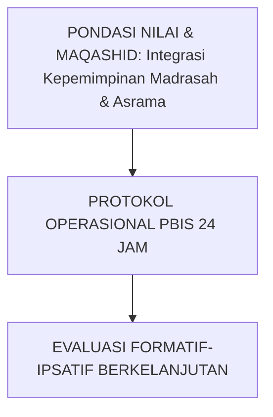

---

### Protokol Aksi Operasional Berjenjang

1. **Langkah Preventif Universal (Tahap Persiapan)**: Pengkondisian sarana, sosialisasi SOP, dan pembiasaan keteladanan *Qudwah Hasanah*.
2. **Langkah Eksekusi Lapangan (Tahap Berjalan)**: Pendampingan lekat oleh musyrif asrama dan wali kelas dengan prinsip *Firm & Kind*.
3. **Langkah Refleksi & Restorasi (Tahap Evaluasi)**: Pencatatan pada logbook digital dan penanganan kendala melalui dialog restoratif.


---


# SUB-BAB 1.2: PEMBAGIAN PERAN WALI KELAS (PAGI) & MUSYRIF (MALAM)
## *Kajian Mendalam & Panduan Implementatif Ekosistem TUMBUH Pesantren*

**Kode Klasifikasi**: `BOOK-05/BAB-01/SUB-02/MONOGRAF-MASTER-VIBRANT`  
**Disiplin Ilmu**: Metodologi Pendidikan Islam, Sains Perilaku Terapan, & Tata Kelola Pesantren  
**Penanggung Jawab Keilmuan**: Dewan Pakar Ekosistem TUMBUH (*24 Bidang Kepakaran*)

---

### Eksplanasi Teoretis & Urgensi Praksis

Pendidikan karakter yang efektif dalam Sistem TUMBUH membutuhkan kejelasan operasional pada aspek **Pembagian Peran Wali Kelas (Pagi) & Musyrif (Malam)**. Naskah ini menguraikan landasan filosofis Turats, bukti empiris sains perilaku, dan protokol implementasi lapangan 24 jam.

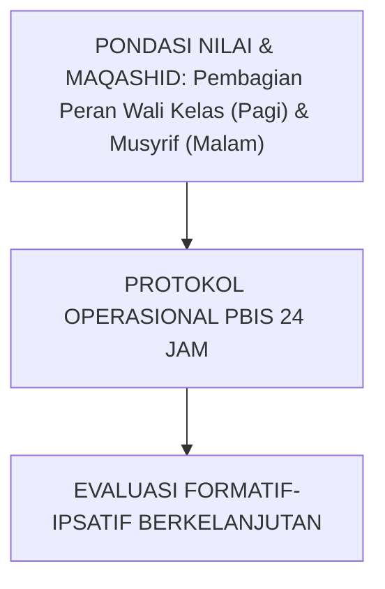

---

### Protokol Aksi Operasional Berjenjang

1. **Langkah Preventif Universal (Tahap Persiapan)**: Pengkondisian sarana, sosialisasi SOP, dan pembiasaan keteladanan *Qudwah Hasanah*.
2. **Langkah Eksekusi Lapangan (Tahap Berjalan)**: Pendampingan lekat oleh musyrif asrama dan wali kelas dengan prinsip *Firm & Kind*.
3. **Langkah Refleksi & Restorasi (Tahap Evaluasi)**: Pencatatan pada logbook digital dan penanganan kendala melalui dialog restoratif.


---


# SUB-BAB 1.3: SOP HANDOVER DIGITAL 15-MENIT PAGI DAN SORE
## *Kajian Mendalam & Panduan Implementatif Ekosistem TUMBUH Pesantren*

**Kode Klasifikasi**: `BOOK-05/BAB-01/SUB-03/MONOGRAF-MASTER-VIBRANT`  
**Disiplin Ilmu**: Metodologi Pendidikan Islam, Sains Perilaku Terapan, & Tata Kelola Pesantren  
**Penanggung Jawab Keilmuan**: Dewan Pakar Ekosistem TUMBUH (*24 Bidang Kepakaran*)

---

### Eksplanasi Teoretis & Urgensi Praksis

Pendidikan karakter yang efektif dalam Sistem TUMBUH membutuhkan kejelasan operasional pada aspek **SOP Handover Digital 15-Menit Pagi dan Sore**. Naskah ini menguraikan landasan filosofis Turats, bukti empiris sains perilaku, dan protokol implementasi lapangan 24 jam.

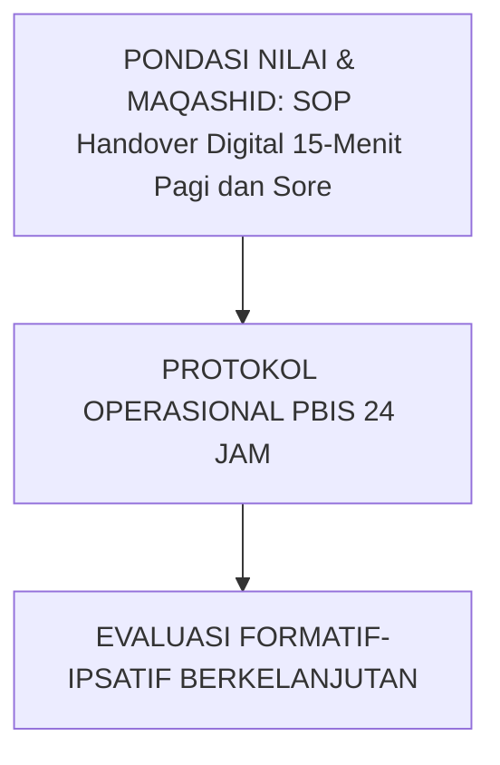

---

### Protokol Aksi Operasional Berjenjang

1. **Langkah Preventif Universal (Tahap Persiapan)**: Pengkondisian sarana, sosialisasi SOP, dan pembiasaan keteladanan *Qudwah Hasanah*.
2. **Langkah Eksekusi Lapangan (Tahap Berjalan)**: Pendampingan lekat oleh musyrif asrama dan wali kelas dengan prinsip *Firm & Kind*.
3. **Langkah Refleksi & Restorasi (Tahap Evaluasi)**: Pencatatan pada logbook digital dan penanganan kendala melalui dialog restoratif.


---


# SUB-BAB 1.4: RAPAT KOORDINASI MINGGUAN TERPADU TRIPARTIT
## *Kajian Mendalam & Panduan Implementatif Ekosistem TUMBUH Pesantren*

**Kode Klasifikasi**: `BOOK-05/BAB-01/SUB-04/MONOGRAF-MASTER-VIBRANT`  
**Disiplin Ilmu**: Metodologi Pendidikan Islam, Sains Perilaku Terapan, & Tata Kelola Pesantren  
**Penanggung Jawab Keilmuan**: Dewan Pakar Ekosistem TUMBUH (*24 Bidang Kepakaran*)

---

### Eksplanasi Teoretis & Urgensi Praksis

Pendidikan karakter yang efektif dalam Sistem TUMBUH membutuhkan kejelasan operasional pada aspek **Rapat Koordinasi Mingguan Terpadu Tripartit**. Naskah ini menguraikan landasan filosofis Turats, bukti empiris sains perilaku, dan protokol implementasi lapangan 24 jam.

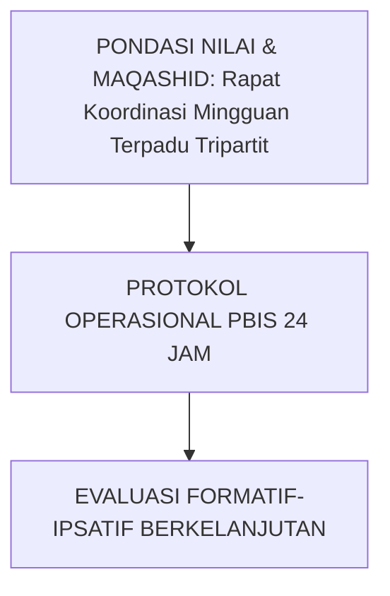

---

### Protokol Aksi Operasional Berjenjang

1. **Langkah Preventif Universal (Tahap Persiapan)**: Pengkondisian sarana, sosialisasi SOP, dan pembiasaan keteladanan *Qudwah Hasanah*.
2. **Langkah Eksekusi Lapangan (Tahap Berjalan)**: Pendampingan lekat oleh musyrif asrama dan wali kelas dengan prinsip *Firm & Kind*.
3. **Langkah Refleksi & Restorasi (Tahap Evaluasi)**: Pencatatan pada logbook digital dan penanganan kendala melalui dialog restoratif.


---


# SUB-BAB 2.1: JADWAL HARIAN HARMONIS & RITME SIRKADIAN SEHAT
## *Kajian Mendalam & Panduan Implementatif Ekosistem TUMBUH Pesantren*

**Kode Klasifikasi**: `BOOK-05/BAB-02/SUB-01/MONOGRAF-MASTER-VIBRANT`  
**Disiplin Ilmu**: Metodologi Pendidikan Islam, Sains Perilaku Terapan, & Tata Kelola Pesantren  
**Penanggung Jawab Keilmuan**: Dewan Pakar Ekosistem TUMBUH (*24 Bidang Kepakaran*)

---

### Eksplanasi Teoretis & Urgensi Praksis

Pendidikan karakter yang efektif dalam Sistem TUMBUH membutuhkan kejelasan operasional pada aspek **Jadwal Harian Harmonis & Ritme Sirkadian Sehat**. Naskah ini menguraikan landasan filosofis Turats, bukti empiris sains perilaku, dan protokol implementasi lapangan 24 jam.

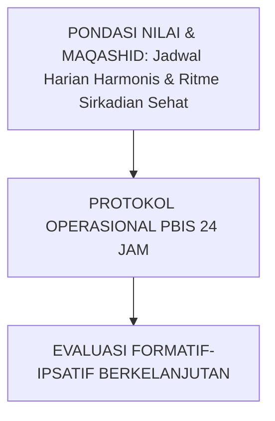

---

### Protokol Aksi Operasional Berjenjang

1. **Langkah Preventif Universal (Tahap Persiapan)**: Pengkondisian sarana, sosialisasi SOP, dan pembiasaan keteladanan *Qudwah Hasanah*.
2. **Langkah Eksekusi Lapangan (Tahap Berjalan)**: Pendampingan lekat oleh musyrif asrama dan wali kelas dengan prinsip *Firm & Kind*.
3. **Langkah Refleksi & Restorasi (Tahap Evaluasi)**: Pencatatan pada logbook digital dan penanganan kendala melalui dialog restoratif.


---


# SUB-BAB 2.2: PROTOKOL MEMBANGUNKAN SHUBUH PENUH KELEMBUTAN
## *Kajian Mendalam & Panduan Implementatif Ekosistem TUMBUH Pesantren*

**Kode Klasifikasi**: `BOOK-05/BAB-02/SUB-02/MONOGRAF-MASTER-VIBRANT`  
**Disiplin Ilmu**: Metodologi Pendidikan Islam, Sains Perilaku Terapan, & Tata Kelola Pesantren  
**Penanggung Jawab Keilmuan**: Dewan Pakar Ekosistem TUMBUH (*24 Bidang Kepakaran*)

---

### Eksplanasi Teoretis & Urgensi Praksis

Pendidikan karakter yang efektif dalam Sistem TUMBUH membutuhkan kejelasan operasional pada aspek **Protokol Membangunkan Shubuh Penuh Kelembutan**. Naskah ini menguraikan landasan filosofis Turats, bukti empiris sains perilaku, dan protokol implementasi lapangan 24 jam.

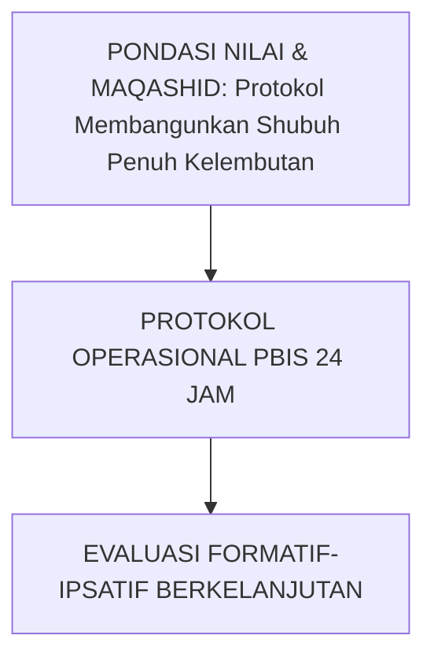

---

### Protokol Aksi Operasional Berjenjang

1. **Langkah Preventif Universal (Tahap Persiapan)**: Pengkondisian sarana, sosialisasi SOP, dan pembiasaan keteladanan *Qudwah Hasanah*.
2. **Langkah Eksekusi Lapangan (Tahap Berjalan)**: Pendampingan lekat oleh musyrif asrama dan wali kelas dengan prinsip *Firm & Kind*.
3. **Langkah Refleksi & Restorasi (Tahap Evaluasi)**: Pencatatan pada logbook digital dan penanganan kendala melalui dialog restoratif.


---


# SUB-BAB 2.3: SUNNAH QAILULAH: TIDUR SIANG & PEMULIHAN KOGNITIF
## *Kajian Mendalam & Panduan Implementatif Ekosistem TUMBUH Pesantren*

**Kode Klasifikasi**: `BOOK-05/BAB-02/SUB-03/MONOGRAF-MASTER-VIBRANT`  
**Disiplin Ilmu**: Metodologi Pendidikan Islam, Sains Perilaku Terapan, & Tata Kelola Pesantren  
**Penanggung Jawab Keilmuan**: Dewan Pakar Ekosistem TUMBUH (*24 Bidang Kepakaran*)

---

### Eksplanasi Teoretis & Urgensi Praksis

Pendidikan karakter yang efektif dalam Sistem TUMBUH membutuhkan kejelasan operasional pada aspek **Sunnah Qailulah: Tidur Siang & Pemulihan Kognitif**. Naskah ini menguraikan landasan filosofis Turats, bukti empiris sains perilaku, dan protokol implementasi lapangan 24 jam.

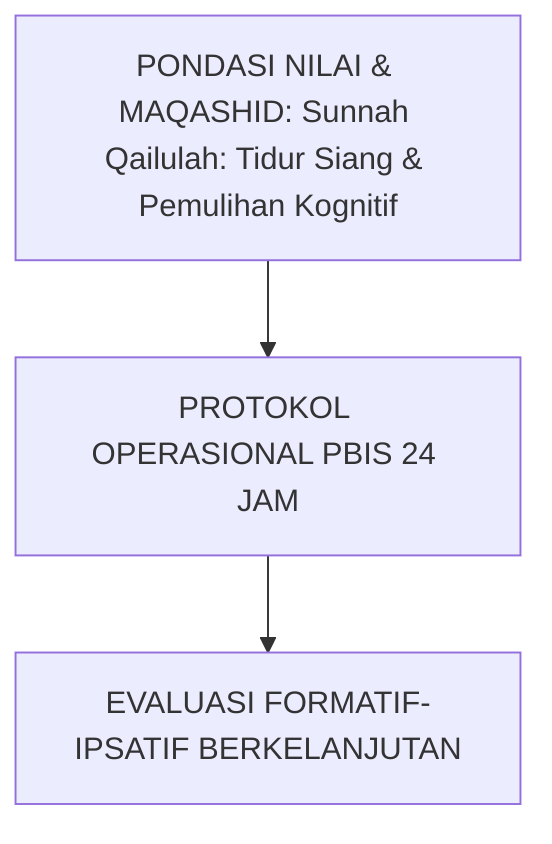

---

### Protokol Aksi Operasional Berjenjang

1. **Langkah Preventif Universal (Tahap Persiapan)**: Pengkondisian sarana, sosialisasi SOP, dan pembiasaan keteladanan *Qudwah Hasanah*.
2. **Langkah Eksekusi Lapangan (Tahap Berjalan)**: Pendampingan lekat oleh musyrif asrama dan wali kelas dengan prinsip *Firm & Kind*.
3. **Langkah Refleksi & Restorasi (Tahap Evaluasi)**: Pencatatan pada logbook digital dan penanganan kendala melalui dialog restoratif.


---


# SUB-BAB 2.4: PENATAAN WAKTU BELAJAR MANDIRI (MUDZAKARAH MALAM)
## *Kajian Mendalam & Panduan Implementatif Ekosistem TUMBUH Pesantren*

**Kode Klasifikasi**: `BOOK-05/BAB-02/SUB-04/MONOGRAF-MASTER-VIBRANT`  
**Disiplin Ilmu**: Metodologi Pendidikan Islam, Sains Perilaku Terapan, & Tata Kelola Pesantren  
**Penanggung Jawab Keilmuan**: Dewan Pakar Ekosistem TUMBUH (*24 Bidang Kepakaran*)

---

### Eksplanasi Teoretis & Urgensi Praksis

Pendidikan karakter yang efektif dalam Sistem TUMBUH membutuhkan kejelasan operasional pada aspek **Penataan Waktu Belajar Mandiri (Mudzakarah Malam)**. Naskah ini menguraikan landasan filosofis Turats, bukti empiris sains perilaku, dan protokol implementasi lapangan 24 jam.

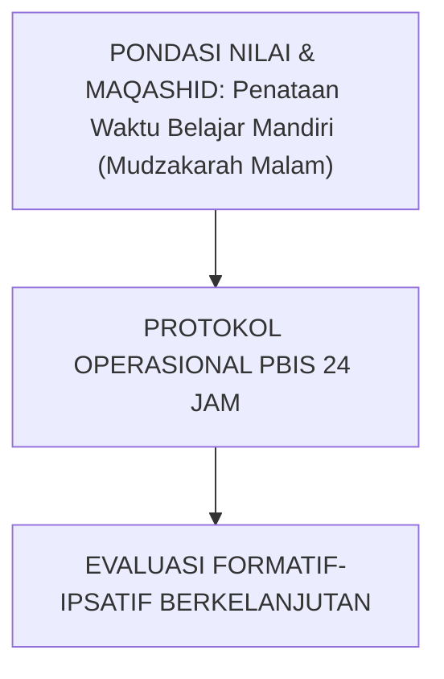

---

### Protokol Aksi Operasional Berjenjang

1. **Langkah Preventif Universal (Tahap Persiapan)**: Pengkondisian sarana, sosialisasi SOP, dan pembiasaan keteladanan *Qudwah Hasanah*.
2. **Langkah Eksekusi Lapangan (Tahap Berjalan)**: Pendampingan lekat oleh musyrif asrama dan wali kelas dengan prinsip *Firm & Kind*.
3. **Langkah Refleksi & Restorasi (Tahap Evaluasi)**: Pencatatan pada logbook digital dan penanganan kendala melalui dialog restoratif.


---


# SUB-BAB 2.5: PERLINDUNGAN TIDUR MALAM SIRKADIAN 7 JAM TANPA GANGGUAN
## *Kajian Mendalam & Panduan Implementatif Ekosistem TUMBUH Pesantren*

**Kode Klasifikasi**: `BOOK-05/BAB-02/SUB-05/MONOGRAF-MASTER-VIBRANT`  
**Disiplin Ilmu**: Metodologi Pendidikan Islam, Sains Perilaku Terapan, & Tata Kelola Pesantren  
**Penanggung Jawab Keilmuan**: Dewan Pakar Ekosistem TUMBUH (*24 Bidang Kepakaran*)

---

### Eksplanasi Teoretis & Urgensi Praksis

Pendidikan karakter yang efektif dalam Sistem TUMBUH membutuhkan kejelasan operasional pada aspek **Perlindungan Tidur Malam Sirkadian 7 Jam Tanpa Gangguan**. Naskah ini menguraikan landasan filosofis Turats, bukti empiris sains perilaku, dan protokol implementasi lapangan 24 jam.

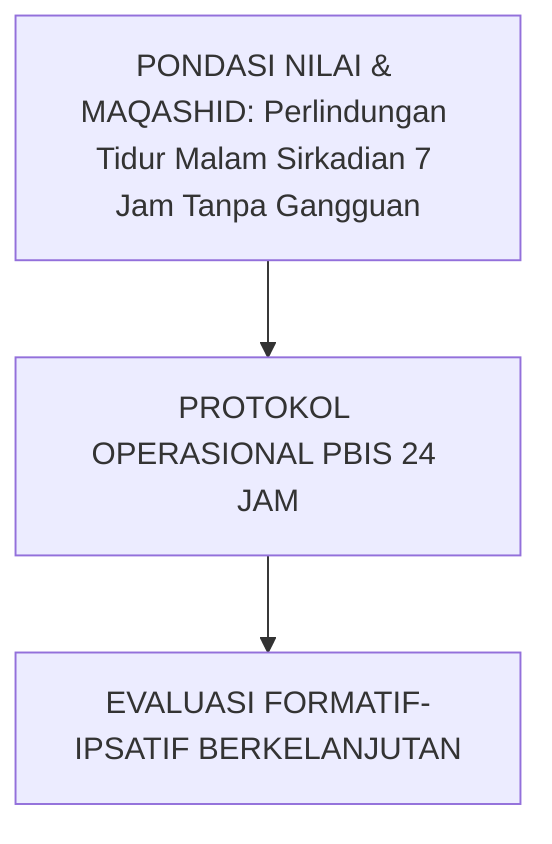

---

### Protokol Aksi Operasional Berjenjang

1. **Langkah Preventif Universal (Tahap Persiapan)**: Pengkondisian sarana, sosialisasi SOP, dan pembiasaan keteladanan *Qudwah Hasanah*.
2. **Langkah Eksekusi Lapangan (Tahap Berjalan)**: Pendampingan lekat oleh musyrif asrama dan wali kelas dengan prinsip *Firm & Kind*.
3. **Langkah Refleksi & Restorasi (Tahap Evaluasi)**: Pencatatan pada logbook digital dan penanganan kendala melalui dialog restoratif.


---


# SUB-BAB 3.1: STANDARISASI 5S KAMAR TIDUR & SANITASI SEHAT
## *Kajian Mendalam & Panduan Implementatif Ekosistem TUMBUH Pesantren*

**Kode Klasifikasi**: `BOOK-05/BAB-03/SUB-01/MONOGRAF-MASTER-VIBRANT`  
**Disiplin Ilmu**: Metodologi Pendidikan Islam, Sains Perilaku Terapan, & Tata Kelola Pesantren  
**Penanggung Jawab Keilmuan**: Dewan Pakar Ekosistem TUMBUH (*24 Bidang Kepakaran*)

---

### Eksplanasi Teoretis & Urgensi Praksis

Pendidikan karakter yang efektif dalam Sistem TUMBUH membutuhkan kejelasan operasional pada aspek **Standarisasi 5S Kamar Tidur & Sanitasi Sehat**. Naskah ini menguraikan landasan filosofis Turats, bukti empiris sains perilaku, dan protokol implementasi lapangan 24 jam.

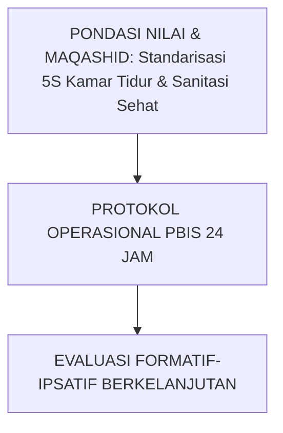

---

### Protokol Aksi Operasional Berjenjang

1. **Langkah Preventif Universal (Tahap Persiapan)**: Pengkondisian sarana, sosialisasi SOP, dan pembiasaan keteladanan *Qudwah Hasanah*.
2. **Langkah Eksekusi Lapangan (Tahap Berjalan)**: Pendampingan lekat oleh musyrif asrama dan wali kelas dengan prinsip *Firm & Kind*.
3. **Langkah Refleksi & Restorasi (Tahap Evaluasi)**: Pencatatan pada logbook digital dan penanganan kendala melalui dialog restoratif.


---


# SUB-BAB 3.2: ADAB MAKAN KOMUNAL: TRADISI MAYORAN & BERBAGI NAMPAN
## *Kajian Mendalam & Panduan Implementatif Ekosistem TUMBUH Pesantren*

**Kode Klasifikasi**: `BOOK-05/BAB-03/SUB-02/MONOGRAF-MASTER-VIBRANT`  
**Disiplin Ilmu**: Metodologi Pendidikan Islam, Sains Perilaku Terapan, & Tata Kelola Pesantren  
**Penanggung Jawab Keilmuan**: Dewan Pakar Ekosistem TUMBUH (*24 Bidang Kepakaran*)

---

### Eksplanasi Teoretis & Urgensi Praksis

Pendidikan karakter yang efektif dalam Sistem TUMBUH membutuhkan kejelasan operasional pada aspek **Adab Makan Komunal: Tradisi Mayoran & Berbagi Nampan**. Naskah ini menguraikan landasan filosofis Turats, bukti empiris sains perilaku, dan protokol implementasi lapangan 24 jam.

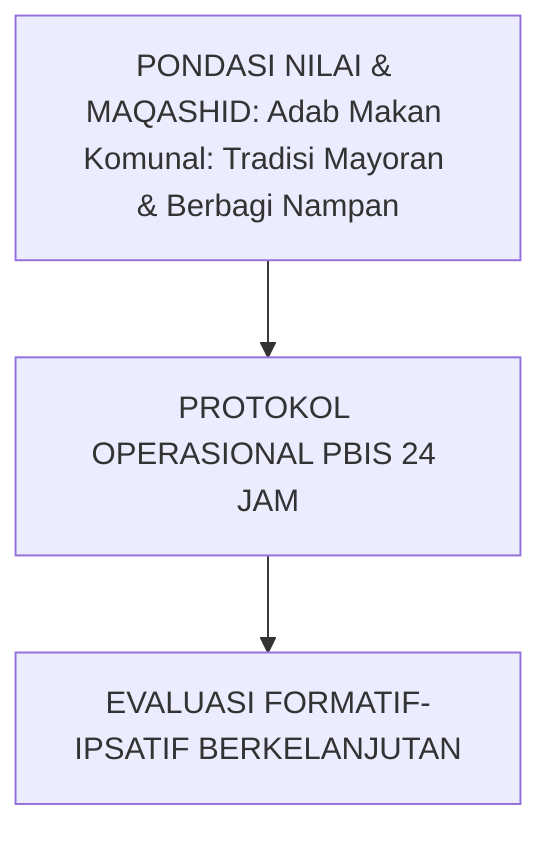

---

### Protokol Aksi Operasional Berjenjang

1. **Langkah Preventif Universal (Tahap Persiapan)**: Pengkondisian sarana, sosialisasi SOP, dan pembiasaan keteladanan *Qudwah Hasanah*.
2. **Langkah Eksekusi Lapangan (Tahap Berjalan)**: Pendampingan lekat oleh musyrif asrama dan wali kelas dengan prinsip *Firm & Kind*.
3. **Langkah Refleksi & Restorasi (Tahap Evaluasi)**: Pencatatan pada logbook digital dan penanganan kendala melalui dialog restoratif.


---


# SUB-BAB 3.3: MANAJEMEN LEMARI & KEPEMILIKAN PRIBADI SANTRI
## *Kajian Mendalam & Panduan Implementatif Ekosistem TUMBUH Pesantren*

**Kode Klasifikasi**: `BOOK-05/BAB-03/SUB-03/MONOGRAF-MASTER-VIBRANT`  
**Disiplin Ilmu**: Metodologi Pendidikan Islam, Sains Perilaku Terapan, & Tata Kelola Pesantren  
**Penanggung Jawab Keilmuan**: Dewan Pakar Ekosistem TUMBUH (*24 Bidang Kepakaran*)

---

### Eksplanasi Teoretis & Urgensi Praksis

Pendidikan karakter yang efektif dalam Sistem TUMBUH membutuhkan kejelasan operasional pada aspek **Manajemen Lemari & Kepemilikan Pribadi Santri**. Naskah ini menguraikan landasan filosofis Turats, bukti empiris sains perilaku, dan protokol implementasi lapangan 24 jam.

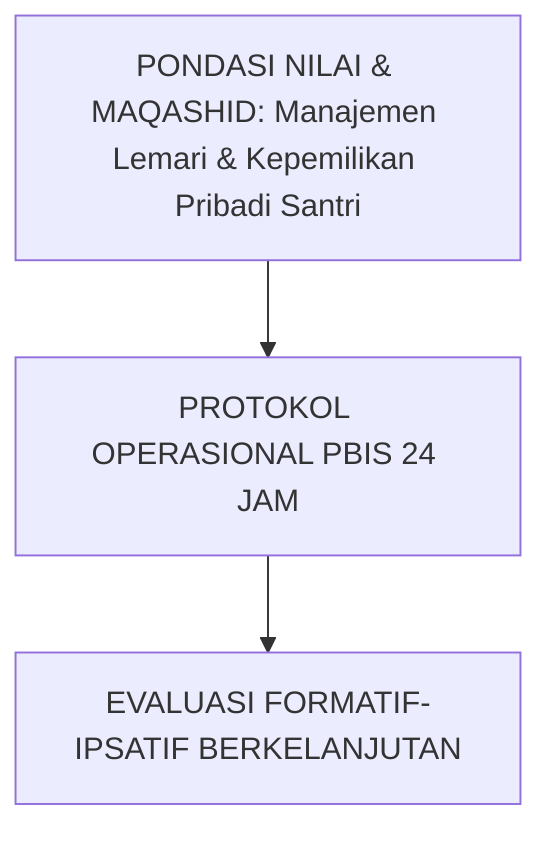

---

### Protokol Aksi Operasional Berjenjang

1. **Langkah Preventif Universal (Tahap Persiapan)**: Pengkondisian sarana, sosialisasi SOP, dan pembiasaan keteladanan *Qudwah Hasanah*.
2. **Langkah Eksekusi Lapangan (Tahap Berjalan)**: Pendampingan lekat oleh musyrif asrama dan wali kelas dengan prinsip *Firm & Kind*.
3. **Langkah Refleksi & Restorasi (Tahap Evaluasi)**: Pencatatan pada logbook digital dan penanganan kendala melalui dialog restoratif.


---


# SUB-BAB 3.4: SOP KEBERSIHAN MCK & SANITASI LINGKUNGAN KOMUNAL
## *Kajian Mendalam & Panduan Implementatif Ekosistem TUMBUH Pesantren*

**Kode Klasifikasi**: `BOOK-05/BAB-03/SUB-04/MONOGRAF-MASTER-VIBRANT`  
**Disiplin Ilmu**: Metodologi Pendidikan Islam, Sains Perilaku Terapan, & Tata Kelola Pesantren  
**Penanggung Jawab Keilmuan**: Dewan Pakar Ekosistem TUMBUH (*24 Bidang Kepakaran*)

---

### Eksplanasi Teoretis & Urgensi Praksis

Pendidikan karakter yang efektif dalam Sistem TUMBUH membutuhkan kejelasan operasional pada aspek **SOP Kebersihan MCK & Sanitasi Lingkungan Komunal**. Naskah ini menguraikan landasan filosofis Turats, bukti empiris sains perilaku, dan protokol implementasi lapangan 24 jam.

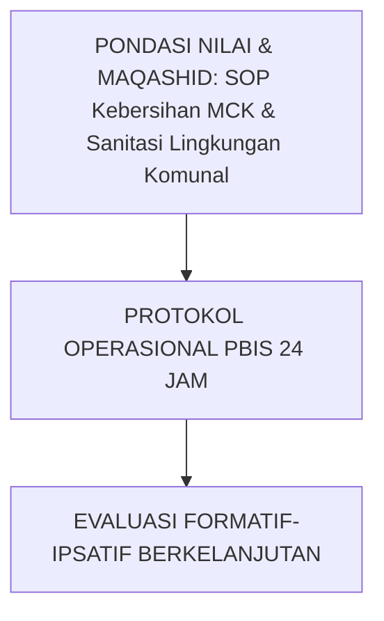

---

### Protokol Aksi Operasional Berjenjang

1. **Langkah Preventif Universal (Tahap Persiapan)**: Pengkondisian sarana, sosialisasi SOP, dan pembiasaan keteladanan *Qudwah Hasanah*.
2. **Langkah Eksekusi Lapangan (Tahap Berjalan)**: Pendampingan lekat oleh musyrif asrama dan wali kelas dengan prinsip *Firm & Kind*.
3. **Langkah Refleksi & Restorasi (Tahap Evaluasi)**: Pencatatan pada logbook digital dan penanganan kendala melalui dialog restoratif.


---


# SUB-BAB 3.5: ADAB PERGAULAN KAMAR & PENJAGAAN BATAS AURAT
## *Kajian Mendalam & Panduan Implementatif Ekosistem TUMBUH Pesantren*

**Kode Klasifikasi**: `BOOK-05/BAB-03/SUB-05/MONOGRAF-MASTER-VIBRANT`  
**Disiplin Ilmu**: Metodologi Pendidikan Islam, Sains Perilaku Terapan, & Tata Kelola Pesantren  
**Penanggung Jawab Keilmuan**: Dewan Pakar Ekosistem TUMBUH (*24 Bidang Kepakaran*)

---

### Eksplanasi Teoretis & Urgensi Praksis

Pendidikan karakter yang efektif dalam Sistem TUMBUH membutuhkan kejelasan operasional pada aspek **Adab Pergaulan Kamar & Penjagaan Batas Aurat**. Naskah ini menguraikan landasan filosofis Turats, bukti empiris sains perilaku, dan protokol implementasi lapangan 24 jam.

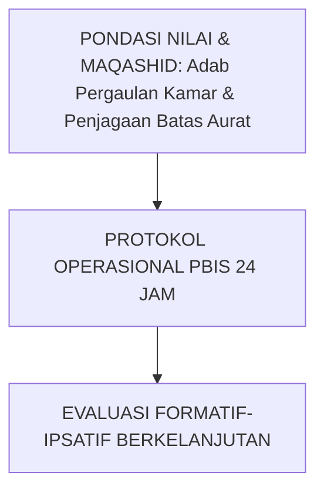

---

### Protokol Aksi Operasional Berjenjang

1. **Langkah Preventif Universal (Tahap Persiapan)**: Pengkondisian sarana, sosialisasi SOP, dan pembiasaan keteladanan *Qudwah Hasanah*.
2. **Langkah Eksekusi Lapangan (Tahap Berjalan)**: Pendampingan lekat oleh musyrif asrama dan wali kelas dengan prinsip *Firm & Kind*.
3. **Langkah Refleksi & Restorasi (Tahap Evaluasi)**: Pencatatan pada logbook digital dan penanganan kendala melalui dialog restoratif.


---


# SUB-BAB 3.6: BUDAYA GOTONG ROYONG & KERJA BAKTI ASRAMA MINGGUAN
## *Kajian Mendalam & Panduan Implementatif Ekosistem TUMBUH Pesantren*

**Kode Klasifikasi**: `BOOK-05/BAB-03/SUB-06/MONOGRAF-MASTER-VIBRANT`  
**Disiplin Ilmu**: Metodologi Pendidikan Islam, Sains Perilaku Terapan, & Tata Kelola Pesantren  
**Penanggung Jawab Keilmuan**: Dewan Pakar Ekosistem TUMBUH (*24 Bidang Kepakaran*)

---

### Eksplanasi Teoretis & Urgensi Praksis

Pendidikan karakter yang efektif dalam Sistem TUMBUH membutuhkan kejelasan operasional pada aspek **Budaya Gotong Royong & Kerja Bakti Asrama Mingguan**. Naskah ini menguraikan landasan filosofis Turats, bukti empiris sains perilaku, dan protokol implementasi lapangan 24 jam.

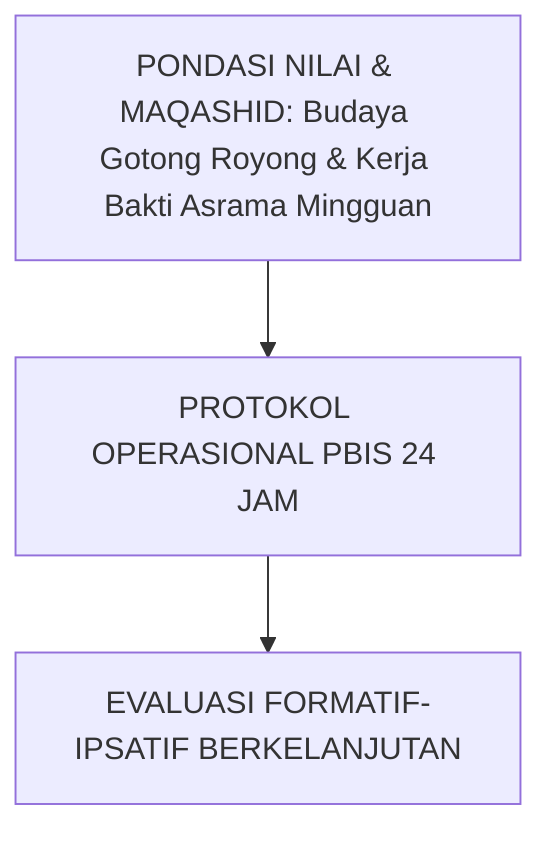

---

### Protokol Aksi Operasional Berjenjang

1. **Langkah Preventif Universal (Tahap Persiapan)**: Pengkondisian sarana, sosialisasi SOP, dan pembiasaan keteladanan *Qudwah Hasanah*.
2. **Langkah Eksekusi Lapangan (Tahap Berjalan)**: Pendampingan lekat oleh musyrif asrama dan wali kelas dengan prinsip *Firm & Kind*.
3. **Langkah Refleksi & Restorasi (Tahap Evaluasi)**: Pencatatan pada logbook digital dan penanganan kendala melalui dialog restoratif.


---


# SUB-BAB 4.1: SOP PENGAWASAN HALAQAH & SHALAT BERJAMAAH
## *Kajian Mendalam & Panduan Implementatif Ekosistem TUMBUH Pesantren*

**Kode Klasifikasi**: `BOOK-05/BAB-04/SUB-01/MONOGRAF-MASTER-VIBRANT`  
**Disiplin Ilmu**: Metodologi Pendidikan Islam, Sains Perilaku Terapan, & Tata Kelola Pesantren  
**Penanggung Jawab Keilmuan**: Dewan Pakar Ekosistem TUMBUH (*24 Bidang Kepakaran*)

---

### Eksplanasi Teoretis & Urgensi Praksis

Pendidikan karakter yang efektif dalam Sistem TUMBUH membutuhkan kejelasan operasional pada aspek **SOP Pengawasan Halaqah & Shalat Berjamaah**. Naskah ini menguraikan landasan filosofis Turats, bukti empiris sains perilaku, dan protokol implementasi lapangan 24 jam.

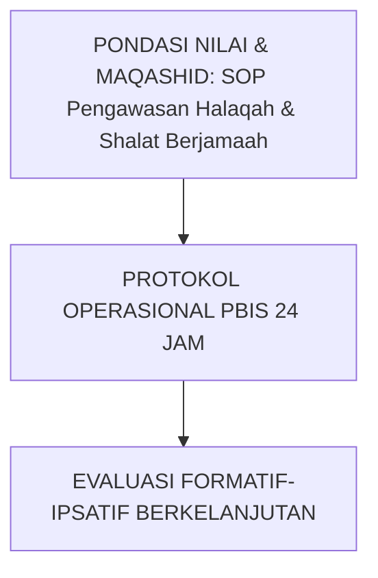

---

### Protokol Aksi Operasional Berjenjang

1. **Langkah Preventif Universal (Tahap Persiapan)**: Pengkondisian sarana, sosialisasi SOP, dan pembiasaan keteladanan *Qudwah Hasanah*.
2. **Langkah Eksekusi Lapangan (Tahap Berjalan)**: Pendampingan lekat oleh musyrif asrama dan wali kelas dengan prinsip *Firm & Kind*.
3. **Langkah Refleksi & Restorasi (Tahap Evaluasi)**: Pencatatan pada logbook digital dan penanganan kendala melalui dialog restoratif.


---


# SUB-BAB 4.2: SOP PEMERIKSAAN KERAPIAN KAMAR & DISIPLIN PAGI
## *Kajian Mendalam & Panduan Implementatif Ekosistem TUMBUH Pesantren*

**Kode Klasifikasi**: `BOOK-05/BAB-04/SUB-02/MONOGRAF-MASTER-VIBRANT`  
**Disiplin Ilmu**: Metodologi Pendidikan Islam, Sains Perilaku Terapan, & Tata Kelola Pesantren  
**Penanggung Jawab Keilmuan**: Dewan Pakar Ekosistem TUMBUH (*24 Bidang Kepakaran*)

---

### Eksplanasi Teoretis & Urgensi Praksis

Pendidikan karakter yang efektif dalam Sistem TUMBUH membutuhkan kejelasan operasional pada aspek **SOP Pemeriksaan Kerapian Kamar & Disiplin Pagi**. Naskah ini menguraikan landasan filosofis Turats, bukti empiris sains perilaku, dan protokol implementasi lapangan 24 jam.

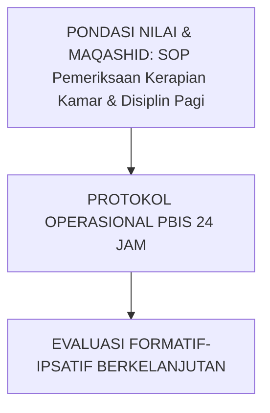

---

### Protokol Aksi Operasional Berjenjang

1. **Langkah Preventif Universal (Tahap Persiapan)**: Pengkondisian sarana, sosialisasi SOP, dan pembiasaan keteladanan *Qudwah Hasanah*.
2. **Langkah Eksekusi Lapangan (Tahap Berjalan)**: Pendampingan lekat oleh musyrif asrama dan wali kelas dengan prinsip *Firm & Kind*.
3. **Langkah Refleksi & Restorasi (Tahap Evaluasi)**: Pencatatan pada logbook digital dan penanganan kendala melalui dialog restoratif.


---


# SUB-BAB 4.3: SOP PENDAMPINGAN JAM MAKAN SANTRI
## *Kajian Mendalam & Panduan Implementatif Ekosistem TUMBUH Pesantren*

**Kode Klasifikasi**: `BOOK-05/BAB-04/SUB-03/MONOGRAF-MASTER-VIBRANT`  
**Disiplin Ilmu**: Metodologi Pendidikan Islam, Sains Perilaku Terapan, & Tata Kelola Pesantren  
**Penanggung Jawab Keilmuan**: Dewan Pakar Ekosistem TUMBUH (*24 Bidang Kepakaran*)

---

### Eksplanasi Teoretis & Urgensi Praksis

Pendidikan karakter yang efektif dalam Sistem TUMBUH membutuhkan kejelasan operasional pada aspek **SOP Pendampingan Jam Makan Santri**. Naskah ini menguraikan landasan filosofis Turats, bukti empiris sains perilaku, dan protokol implementasi lapangan 24 jam.

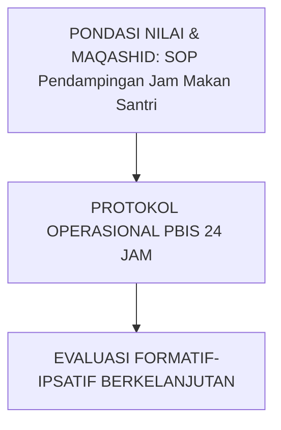

---

### Protokol Aksi Operasional Berjenjang

1. **Langkah Preventif Universal (Tahap Persiapan)**: Pengkondisian sarana, sosialisasi SOP, dan pembiasaan keteladanan *Qudwah Hasanah*.
2. **Langkah Eksekusi Lapangan (Tahap Berjalan)**: Pendampingan lekat oleh musyrif asrama dan wali kelas dengan prinsip *Firm & Kind*.
3. **Langkah Refleksi & Restorasi (Tahap Evaluasi)**: Pencatatan pada logbook digital dan penanganan kendala melalui dialog restoratif.


---


# SUB-BAB 4.4: SOP MUDZAKARAH MALAM & BIMBINGAN BELAJAR SANTRI
## *Kajian Mendalam & Panduan Implementatif Ekosistem TUMBUH Pesantren*

**Kode Klasifikasi**: `BOOK-05/BAB-04/SUB-04/MONOGRAF-MASTER-VIBRANT`  
**Disiplin Ilmu**: Metodologi Pendidikan Islam, Sains Perilaku Terapan, & Tata Kelola Pesantren  
**Penanggung Jawab Keilmuan**: Dewan Pakar Ekosistem TUMBUH (*24 Bidang Kepakaran*)

---

### Eksplanasi Teoretis & Urgensi Praksis

Pendidikan karakter yang efektif dalam Sistem TUMBUH membutuhkan kejelasan operasional pada aspek **SOP Mudzakarah Malam & Bimbingan Belajar Santri**. Naskah ini menguraikan landasan filosofis Turats, bukti empiris sains perilaku, dan protokol implementasi lapangan 24 jam.

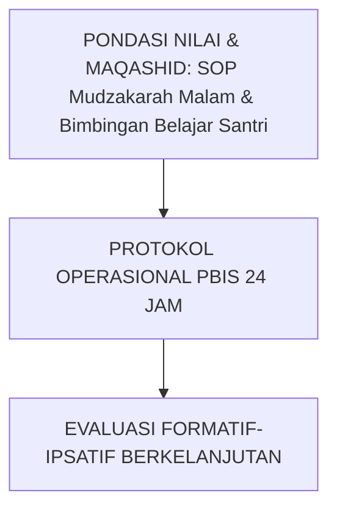

---

### Protokol Aksi Operasional Berjenjang

1. **Langkah Preventif Universal (Tahap Persiapan)**: Pengkondisian sarana, sosialisasi SOP, dan pembiasaan keteladanan *Qudwah Hasanah*.
2. **Langkah Eksekusi Lapangan (Tahap Berjalan)**: Pendampingan lekat oleh musyrif asrama dan wali kelas dengan prinsip *Firm & Kind*.
3. **Langkah Refleksi & Restorasi (Tahap Evaluasi)**: Pencatatan pada logbook digital dan penanganan kendala melalui dialog restoratif.


---


# SUB-BAB 4.5: SOP PRESENSI MALAM & PENGKONDISIAN TIDUR NYENYAK
## *Kajian Mendalam & Panduan Implementatif Ekosistem TUMBUH Pesantren*

**Kode Klasifikasi**: `BOOK-05/BAB-04/SUB-05/MONOGRAF-MASTER-VIBRANT`  
**Disiplin Ilmu**: Metodologi Pendidikan Islam, Sains Perilaku Terapan, & Tata Kelola Pesantren  
**Penanggung Jawab Keilmuan**: Dewan Pakar Ekosistem TUMBUH (*24 Bidang Kepakaran*)

---

### Eksplanasi Teoretis & Urgensi Praksis

Pendidikan karakter yang efektif dalam Sistem TUMBUH membutuhkan kejelasan operasional pada aspek **SOP Presensi Malam & Pengkondisian Tidur Nyenyak**. Naskah ini menguraikan landasan filosofis Turats, bukti empiris sains perilaku, dan protokol implementasi lapangan 24 jam.

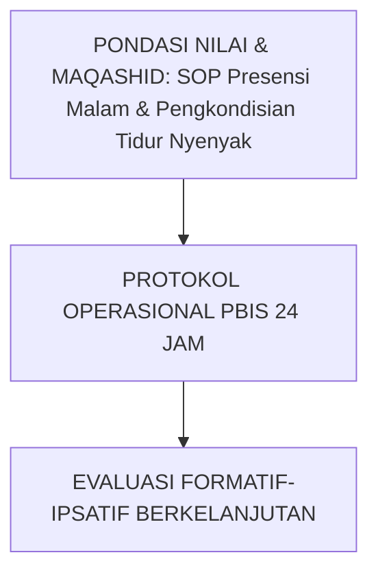

---

### Protokol Aksi Operasional Berjenjang

1. **Langkah Preventif Universal (Tahap Persiapan)**: Pengkondisian sarana, sosialisasi SOP, dan pembiasaan keteladanan *Qudwah Hasanah*.
2. **Langkah Eksekusi Lapangan (Tahap Berjalan)**: Pendampingan lekat oleh musyrif asrama dan wali kelas dengan prinsip *Firm & Kind*.
3. **Langkah Refleksi & Restorasi (Tahap Evaluasi)**: Pencatatan pada logbook digital dan penanganan kendala melalui dialog restoratif.


---


# SUB-BAB 4.6: SOP PENANGANAN PELANGGARAN RINGAN DI KAMAR ASRAMA
## *Kajian Mendalam & Panduan Implementatif Ekosistem TUMBUH Pesantren*

**Kode Klasifikasi**: `BOOK-05/BAB-04/SUB-06/MONOGRAF-MASTER-VIBRANT`  
**Disiplin Ilmu**: Metodologi Pendidikan Islam, Sains Perilaku Terapan, & Tata Kelola Pesantren  
**Penanggung Jawab Keilmuan**: Dewan Pakar Ekosistem TUMBUH (*24 Bidang Kepakaran*)

---

### Eksplanasi Teoretis & Urgensi Praksis

Pendidikan karakter yang efektif dalam Sistem TUMBUH membutuhkan kejelasan operasional pada aspek **SOP Penanganan Pelanggaran Ringan di Kamar Asrama**. Naskah ini menguraikan landasan filosofis Turats, bukti empiris sains perilaku, dan protokol implementasi lapangan 24 jam.

```mermaid
graph TD
    Tujuan["PONDASI NILAI & MAQASHID: SOP Penanganan Pelanggaran Ringan di Kamar Asrama"] --> Operasional["PROTOKOL OPERASIONAL PBIS 24 JAM"]
    Operasional --> Evaluasi["EVALUASI FORMATIF-IPSATIF BERKELANJUTAN"]
```

---

### Protokol Aksi Operasional Berjenjang

1. **Langkah Preventif Universal (Tahap Persiapan)**: Pengkondisian sarana, sosialisasi SOP, dan pembiasaan keteladanan *Qudwah Hasanah*.
2. **Langkah Eksekusi Lapangan (Tahap Berjalan)**: Pendampingan lekat oleh musyrif asrama dan wali kelas dengan prinsip *Firm & Kind*.
3. **Langkah Refleksi & Restorasi (Tahap Evaluasi)**: Pencatatan pada logbook digital dan penanganan kendala melalui dialog restoratif.


---


# SUB-BAB 4.7: SOP KOMUNIKASI & LAYANAN INFORMASI WALI SANTRI
## *Kajian Mendalam & Panduan Implementatif Ekosistem TUMBUH Pesantren*

**Kode Klasifikasi**: `BOOK-05/BAB-04/SUB-07/MONOGRAF-MASTER-VIBRANT`  
**Disiplin Ilmu**: Metodologi Pendidikan Islam, Sains Perilaku Terapan, & Tata Kelola Pesantren  
**Penanggung Jawab Keilmuan**: Dewan Pakar Ekosistem TUMBUH (*24 Bidang Kepakaran*)

---

### Eksplanasi Teoretis & Urgensi Praksis

Pendidikan karakter yang efektif dalam Sistem TUMBUH membutuhkan kejelasan operasional pada aspek **SOP Komunikasi & Layanan Informasi Wali Santri**. Naskah ini menguraikan landasan filosofis Turats, bukti empiris sains perilaku, dan protokol implementasi lapangan 24 jam.

```mermaid
graph TD
    Tujuan["PONDASI NILAI & MAQASHID: SOP Komunikasi & Layanan Informasi Wali Santri"] --> Operasional["PROTOKOL OPERASIONAL PBIS 24 JAM"]
    Operasional --> Evaluasi["EVALUASI FORMATIF-IPSATIF BERKELANJUTAN"]
```

---

### Protokol Aksi Operasional Berjenjang

1. **Langkah Preventif Universal (Tahap Persiapan)**: Pengkondisian sarana, sosialisasi SOP, dan pembiasaan keteladanan *Qudwah Hasanah*.
2. **Langkah Eksekusi Lapangan (Tahap Berjalan)**: Pendampingan lekat oleh musyrif asrama dan wali kelas dengan prinsip *Firm & Kind*.
3. **Langkah Refleksi & Restorasi (Tahap Evaluasi)**: Pencatatan pada logbook digital dan penanganan kendala melalui dialog restoratif.


---


# SUB-BAB 5.1: DEKRIT PERLINDUNGAN MUSYRIF & SHIFT KERJA MANUSIAWI
## *Kajian Mendalam & Panduan Implementatif Ekosistem TUMBUH Pesantren*

**Kode Klasifikasi**: `BOOK-05/BAB-05/SUB-01/MONOGRAF-MASTER-VIBRANT`  
**Disiplin Ilmu**: Metodologi Pendidikan Islam, Sains Perilaku Terapan, & Tata Kelola Pesantren  
**Penanggung Jawab Keilmuan**: Dewan Pakar Ekosistem TUMBUH (*24 Bidang Kepakaran*)

---

### Eksplanasi Teoretis & Urgensi Praksis

Pendidikan karakter yang efektif dalam Sistem TUMBUH membutuhkan kejelasan operasional pada aspek **Dekrit Perlindungan Musyrif & Shift Kerja Manusiawi**. Naskah ini menguraikan landasan filosofis Turats, bukti empiris sains perilaku, dan protokol implementasi lapangan 24 jam.

```mermaid
graph TD
    Tujuan["PONDASI NILAI & MAQASHID: Dekrit Perlindungan Musyrif & Shift Kerja Manusiawi"] --> Operasional["PROTOKOL OPERASIONAL PBIS 24 JAM"]
    Operasional --> Evaluasi["EVALUASI FORMATIF-IPSATIF BERKELANJUTAN"]
```

---

### Protokol Aksi Operasional Berjenjang

1. **Langkah Preventif Universal (Tahap Persiapan)**: Pengkondisian sarana, sosialisasi SOP, dan pembiasaan keteladanan *Qudwah Hasanah*.
2. **Langkah Eksekusi Lapangan (Tahap Berjalan)**: Pendampingan lekat oleh musyrif asrama dan wali kelas dengan prinsip *Firm & Kind*.
3. **Langkah Refleksi & Restorasi (Tahap Evaluasi)**: Pencatatan pada logbook digital dan penanganan kendala melalui dialog restoratif.


---


# SUB-BAB 5.2: RASIO PENGAWASAN PROPORSIONAL SANTRI PER MUSYRIF
## *Kajian Mendalam & Panduan Implementatif Ekosistem TUMBUH Pesantren*

**Kode Klasifikasi**: `BOOK-05/BAB-05/SUB-02/MONOGRAF-MASTER-VIBRANT`  
**Disiplin Ilmu**: Metodologi Pendidikan Islam, Sains Perilaku Terapan, & Tata Kelola Pesantren  
**Penanggung Jawab Keilmuan**: Dewan Pakar Ekosistem TUMBUH (*24 Bidang Kepakaran*)

---

### Eksplanasi Teoretis & Urgensi Praksis

Pendidikan karakter yang efektif dalam Sistem TUMBUH membutuhkan kejelasan operasional pada aspek **Rasio Pengawasan Proporsional Santri per Musyrif**. Naskah ini menguraikan landasan filosofis Turats, bukti empiris sains perilaku, dan protokol implementasi lapangan 24 jam.

```mermaid
graph TD
    Tujuan["PONDASI NILAI & MAQASHID: Rasio Pengawasan Proporsional Santri per Musyrif"] --> Operasional["PROTOKOL OPERASIONAL PBIS 24 JAM"]
    Operasional --> Evaluasi["EVALUASI FORMATIF-IPSATIF BERKELANJUTAN"]
```

---

### Protokol Aksi Operasional Berjenjang

1. **Langkah Preventif Universal (Tahap Persiapan)**: Pengkondisian sarana, sosialisasi SOP, dan pembiasaan keteladanan *Qudwah Hasanah*.
2. **Langkah Eksekusi Lapangan (Tahap Berjalan)**: Pendampingan lekat oleh musyrif asrama dan wali kelas dengan prinsip *Firm & Kind*.
3. **Langkah Refleksi & Restorasi (Tahap Evaluasi)**: Pencatatan pada logbook digital dan penanganan kendala melalui dialog restoratif.


---


# SUB-BAB 5.3: HAK LIBUR MINGGUAN (1 DAY-OFF) & MUSYRIF CADANGAN
## *Kajian Mendalam & Panduan Implementatif Ekosistem TUMBUH Pesantren*

**Kode Klasifikasi**: `BOOK-05/BAB-05/SUB-03/MONOGRAF-MASTER-VIBRANT`  
**Disiplin Ilmu**: Metodologi Pendidikan Islam, Sains Perilaku Terapan, & Tata Kelola Pesantren  
**Penanggung Jawab Keilmuan**: Dewan Pakar Ekosistem TUMBUH (*24 Bidang Kepakaran*)

---

### Eksplanasi Teoretis & Urgensi Praksis

Pendidikan karakter yang efektif dalam Sistem TUMBUH membutuhkan kejelasan operasional pada aspek **Hak Libur Mingguan (1 Day-Off) & Musyrif Cadangan**. Naskah ini menguraikan landasan filosofis Turats, bukti empiris sains perilaku, dan protokol implementasi lapangan 24 jam.

```mermaid
graph TD
    Tujuan["PONDASI NILAI & MAQASHID: Hak Libur Mingguan (1 Day-Off) & Musyrif Cadangan"] --> Operasional["PROTOKOL OPERASIONAL PBIS 24 JAM"]
    Operasional --> Evaluasi["EVALUASI FORMATIF-IPSATIF BERKELANJUTAN"]
```

---

### Protokol Aksi Operasional Berjenjang

1. **Langkah Preventif Universal (Tahap Persiapan)**: Pengkondisian sarana, sosialisasi SOP, dan pembiasaan keteladanan *Qudwah Hasanah*.
2. **Langkah Eksekusi Lapangan (Tahap Berjalan)**: Pendampingan lekat oleh musyrif asrama dan wali kelas dengan prinsip *Firm & Kind*.
3. **Langkah Refleksi & Restorasi (Tahap Evaluasi)**: Pencatatan pada logbook digital dan penanganan kendala melalui dialog restoratif.


---


# SUB-BAB 5.4: PROGRAM SUPERVISI KLINIS & DUKUNGAN KESEHATAN MENTAL
## *Kajian Mendalam & Panduan Implementatif Ekosistem TUMBUH Pesantren*

**Kode Klasifikasi**: `BOOK-05/BAB-05/SUB-04/MONOGRAF-MASTER-VIBRANT`  
**Disiplin Ilmu**: Metodologi Pendidikan Islam, Sains Perilaku Terapan, & Tata Kelola Pesantren  
**Penanggung Jawab Keilmuan**: Dewan Pakar Ekosistem TUMBUH (*24 Bidang Kepakaran*)

---

### Eksplanasi Teoretis & Urgensi Praksis

Pendidikan karakter yang efektif dalam Sistem TUMBUH membutuhkan kejelasan operasional pada aspek **Program Supervisi Klinis & Dukungan Kesehatan Mental**. Naskah ini menguraikan landasan filosofis Turats, bukti empiris sains perilaku, dan protokol implementasi lapangan 24 jam.

```mermaid
graph TD
    Tujuan["PONDASI NILAI & MAQASHID: Program Supervisi Klinis & Dukungan Kesehatan Mental"] --> Operasional["PROTOKOL OPERASIONAL PBIS 24 JAM"]
    Operasional --> Evaluasi["EVALUASI FORMATIF-IPSATIF BERKELANJUTAN"]
```

---

### Protokol Aksi Operasional Berjenjang

1. **Langkah Preventif Universal (Tahap Persiapan)**: Pengkondisian sarana, sosialisasi SOP, dan pembiasaan keteladanan *Qudwah Hasanah*.
2. **Langkah Eksekusi Lapangan (Tahap Berjalan)**: Pendampingan lekat oleh musyrif asrama dan wali kelas dengan prinsip *Firm & Kind*.
3. **Langkah Refleksi & Restorasi (Tahap Evaluasi)**: Pencatatan pada logbook digital dan penanganan kendala melalui dialog restoratif.


---


# SUB-BAB 6.1: PROTOKOL SAFE SANCTUARY & MITIGASI KEKERASAN TOTAL
## *Kajian Mendalam & Panduan Implementatif Ekosistem TUMBUH Pesantren*

**Kode Klasifikasi**: `BOOK-05/BAB-06/SUB-01/MONOGRAF-MASTER-VIBRANT`  
**Disiplin Ilmu**: Metodologi Pendidikan Islam, Sains Perilaku Terapan, & Tata Kelola Pesantren  
**Penanggung Jawab Keilmuan**: Dewan Pakar Ekosistem TUMBUH (*24 Bidang Kepakaran*)

---

### Eksplanasi Teoretis & Urgensi Praksis

Pendidikan karakter yang efektif dalam Sistem TUMBUH membutuhkan kejelasan operasional pada aspek **Protokol Safe Sanctuary & Mitigasi Kekerasan Total**. Naskah ini menguraikan landasan filosofis Turats, bukti empiris sains perilaku, dan protokol implementasi lapangan 24 jam.

```mermaid
graph TD
    Tujuan["PONDASI NILAI & MAQASHID: Protokol Safe Sanctuary & Mitigasi Kekerasan Total"] --> Operasional["PROTOKOL OPERASIONAL PBIS 24 JAM"]
    Operasional --> Evaluasi["EVALUASI FORMATIF-IPSATIF BERKELANJUTAN"]
```

---

### Protokol Aksi Operasional Berjenjang

1. **Langkah Preventif Universal (Tahap Persiapan)**: Pengkondisian sarana, sosialisasi SOP, dan pembiasaan keteladanan *Qudwah Hasanah*.
2. **Langkah Eksekusi Lapangan (Tahap Berjalan)**: Pendampingan lekat oleh musyrif asrama dan wali kelas dengan prinsip *Firm & Kind*.
3. **Langkah Refleksi & Restorasi (Tahap Evaluasi)**: Pencatatan pada logbook digital dan penanganan kendala melalui dialog restoratif.


---


# SUB-BAB 6.2: MITIGASI TITIK RAWAN & PATROLI HOTSPOTS ASRAMA
## *Kajian Mendalam & Panduan Implementatif Ekosistem TUMBUH Pesantren*

**Kode Klasifikasi**: `BOOK-05/BAB-06/SUB-02/MONOGRAF-MASTER-VIBRANT`  
**Disiplin Ilmu**: Metodologi Pendidikan Islam, Sains Perilaku Terapan, & Tata Kelola Pesantren  
**Penanggung Jawab Keilmuan**: Dewan Pakar Ekosistem TUMBUH (*24 Bidang Kepakaran*)

---

### Eksplanasi Teoretis & Urgensi Praksis

Pendidikan karakter yang efektif dalam Sistem TUMBUH membutuhkan kejelasan operasional pada aspek **Mitigasi Titik Rawan & Patroli Hotspots Asrama**. Naskah ini menguraikan landasan filosofis Turats, bukti empiris sains perilaku, dan protokol implementasi lapangan 24 jam.

```mermaid
graph TD
    Tujuan["PONDASI NILAI & MAQASHID: Mitigasi Titik Rawan & Patroli Hotspots Asrama"] --> Operasional["PROTOKOL OPERASIONAL PBIS 24 JAM"]
    Operasional --> Evaluasi["EVALUASI FORMATIF-IPSATIF BERKELANJUTAN"]
```

---

### Protokol Aksi Operasional Berjenjang

1. **Langkah Preventif Universal (Tahap Persiapan)**: Pengkondisian sarana, sosialisasi SOP, dan pembiasaan keteladanan *Qudwah Hasanah*.
2. **Langkah Eksekusi Lapangan (Tahap Berjalan)**: Pendampingan lekat oleh musyrif asrama dan wali kelas dengan prinsip *Firm & Kind*.
3. **Langkah Refleksi & Restorasi (Tahap Evaluasi)**: Pencatatan pada logbook digital dan penanganan kendala melalui dialog restoratif.


---


# SUB-BAB 6.3: KANAL PELAPORAN RAHASIA (SAFE WHISTLEBLOWING PORTAL)
## *Kajian Mendalam & Panduan Implementatif Ekosistem TUMBUH Pesantren*

**Kode Klasifikasi**: `BOOK-05/BAB-06/SUB-03/MONOGRAF-MASTER-VIBRANT`  
**Disiplin Ilmu**: Metodologi Pendidikan Islam, Sains Perilaku Terapan, & Tata Kelola Pesantren  
**Penanggung Jawab Keilmuan**: Dewan Pakar Ekosistem TUMBUH (*24 Bidang Kepakaran*)

---

### Eksplanasi Teoretis & Urgensi Praksis

Pendidikan karakter yang efektif dalam Sistem TUMBUH membutuhkan kejelasan operasional pada aspek **Kanal Pelaporan Rahasia (Safe Whistleblowing Portal)**. Naskah ini menguraikan landasan filosofis Turats, bukti empiris sains perilaku, dan protokol implementasi lapangan 24 jam.

```mermaid
graph TD
    Tujuan["PONDASI NILAI & MAQASHID: Kanal Pelaporan Rahasia (Safe Whistleblowing Portal)"] --> Operasional["PROTOKOL OPERASIONAL PBIS 24 JAM"]
    Operasional --> Evaluasi["EVALUASI FORMATIF-IPSATIF BERKELANJUTAN"]
```

---

### Protokol Aksi Operasional Berjenjang

1. **Langkah Preventif Universal (Tahap Persiapan)**: Pengkondisian sarana, sosialisasi SOP, dan pembiasaan keteladanan *Qudwah Hasanah*.
2. **Langkah Eksekusi Lapangan (Tahap Berjalan)**: Pendampingan lekat oleh musyrif asrama dan wali kelas dengan prinsip *Firm & Kind*.
3. **Langkah Refleksi & Restorasi (Tahap Evaluasi)**: Pencatatan pada logbook digital dan penanganan kendala melalui dialog restoratif.


---


# SUB-BAB 6.4: PROSEDUR TANGGAP DARURAT MEDIS & P3K ASRAMA 24-JAM
## *Kajian Mendalam & Panduan Implementatif Ekosistem TUMBUH Pesantren*

**Kode Klasifikasi**: `BOOK-05/BAB-06/SUB-04/MONOGRAF-MASTER-VIBRANT`  
**Disiplin Ilmu**: Metodologi Pendidikan Islam, Sains Perilaku Terapan, & Tata Kelola Pesantren  
**Penanggung Jawab Keilmuan**: Dewan Pakar Ekosistem TUMBUH (*24 Bidang Kepakaran*)

---

### Eksplanasi Teoretis & Urgensi Praksis

Pendidikan karakter yang efektif dalam Sistem TUMBUH membutuhkan kejelasan operasional pada aspek **Prosedur Tanggap Darurat Medis & P3K Asrama 24-Jam**. Naskah ini menguraikan landasan filosofis Turats, bukti empiris sains perilaku, dan protokol implementasi lapangan 24 jam.

```mermaid
graph TD
    Tujuan["PONDASI NILAI & MAQASHID: Prosedur Tanggap Darurat Medis & P3K Asrama 24-Jam"] --> Operasional["PROTOKOL OPERASIONAL PBIS 24 JAM"]
    Operasional --> Evaluasi["EVALUASI FORMATIF-IPSATIF BERKELANJUTAN"]
```

---

### Protokol Aksi Operasional Berjenjang

1. **Langkah Preventif Universal (Tahap Persiapan)**: Pengkondisian sarana, sosialisasi SOP, dan pembiasaan keteladanan *Qudwah Hasanah*.
2. **Langkah Eksekusi Lapangan (Tahap Berjalan)**: Pendampingan lekat oleh musyrif asrama dan wali kelas dengan prinsip *Firm & Kind*.
3. **Langkah Refleksi & Restorasi (Tahap Evaluasi)**: Pencatatan pada logbook digital dan penanganan kendala melalui dialog restoratif.


---


# SUB-BAB 6.5: PENANGANAN KASUS KHUSUS: HOMESICKNESS & ENURESIS AKUT
## *Kajian Mendalam & Panduan Implementatif Ekosistem TUMBUH Pesantren*

**Kode Klasifikasi**: `BOOK-05/BAB-06/SUB-05/MONOGRAF-MASTER-VIBRANT`  
**Disiplin Ilmu**: Metodologi Pendidikan Islam, Sains Perilaku Terapan, & Tata Kelola Pesantren  
**Penanggung Jawab Keilmuan**: Dewan Pakar Ekosistem TUMBUH (*24 Bidang Kepakaran*)

---

### Eksplanasi Teoretis & Urgensi Praksis

Pendidikan karakter yang efektif dalam Sistem TUMBUH membutuhkan kejelasan operasional pada aspek **Penanganan Kasus Khusus: Homesickness & Enuresis Akut**. Naskah ini menguraikan landasan filosofis Turats, bukti empiris sains perilaku, dan protokol implementasi lapangan 24 jam.

```mermaid
graph TD
    Tujuan["PONDASI NILAI & MAQASHID: Penanganan Kasus Khusus: Homesickness & Enuresis Akut"] --> Operasional["PROTOKOL OPERASIONAL PBIS 24 JAM"]
    Operasional --> Evaluasi["EVALUASI FORMATIF-IPSATIF BERKELANJUTAN"]
```

---

### Protokol Aksi Operasional Berjenjang

1. **Langkah Preventif Universal (Tahap Persiapan)**: Pengkondisian sarana, sosialisasi SOP, dan pembiasaan keteladanan *Qudwah Hasanah*.
2. **Langkah Eksekusi Lapangan (Tahap Berjalan)**: Pendampingan lekat oleh musyrif asrama dan wali kelas dengan prinsip *Firm & Kind*.
3. **Langkah Refleksi & Restorasi (Tahap Evaluasi)**: Pencatatan pada logbook digital dan penanganan kendala melalui dialog restoratif.


---


# SUB-BAB 6.6: PROTOKOL MITIGASI BENCANA & EVAKUASI DARURAT PESANTREN
## *Kajian Mendalam & Panduan Implementatif Ekosistem TUMBUH Pesantren*

**Kode Klasifikasi**: `BOOK-05/BAB-06/SUB-06/MONOGRAF-MASTER-VIBRANT`  
**Disiplin Ilmu**: Metodologi Pendidikan Islam, Sains Perilaku Terapan, & Tata Kelola Pesantren  
**Penanggung Jawab Keilmuan**: Dewan Pakar Ekosistem TUMBUH (*24 Bidang Kepakaran*)

---

### Eksplanasi Teoretis & Urgensi Praksis

Pendidikan karakter yang efektif dalam Sistem TUMBUH membutuhkan kejelasan operasional pada aspek **Protokol Mitigasi Bencana & Evakuasi Darurat Pesantren**. Naskah ini menguraikan landasan filosofis Turats, bukti empiris sains perilaku, dan protokol implementasi lapangan 24 jam.

```mermaid
graph TD
    Tujuan["PONDASI NILAI & MAQASHID: Protokol Mitigasi Bencana & Evakuasi Darurat Pesantren"] --> Operasional["PROTOKOL OPERASIONAL PBIS 24 JAM"]
    Operasional --> Evaluasi["EVALUASI FORMATIF-IPSATIF BERKELANJUTAN"]
```

---

### Protokol Aksi Operasional Berjenjang

1. **Langkah Preventif Universal (Tahap Persiapan)**: Pengkondisian sarana, sosialisasi SOP, dan pembiasaan keteladanan *Qudwah Hasanah*.
2. **Langkah Eksekusi Lapangan (Tahap Berjalan)**: Pendampingan lekat oleh musyrif asrama dan wali kelas dengan prinsip *Firm & Kind*.
3. **Langkah Refleksi & Restorasi (Tahap Evaluasi)**: Pencatatan pada logbook digital dan penanganan kendala melalui dialog restoratif.


---


# SUB-BAB 7.1: METODE SOROGAN, GROW COACHING, & EKSPEDISI DESA
## *Kajian Mendalam & Panduan Implementatif Ekosistem TUMBUH Pesantren*

**Kode Klasifikasi**: `BOOK-05/BAB-07/SUB-01/MONOGRAF-MASTER-VIBRANT`  
**Disiplin Ilmu**: Metodologi Pendidikan Islam, Sains Perilaku Terapan, & Tata Kelola Pesantren  
**Penanggung Jawab Keilmuan**: Dewan Pakar Ekosistem TUMBUH (*24 Bidang Kepakaran*)

---

### Eksplanasi Teoretis & Urgensi Praksis

Pendidikan karakter yang efektif dalam Sistem TUMBUH membutuhkan kejelasan operasional pada aspek **Metode Sorogan, GROW Coaching, & Ekspedisi Desa**. Naskah ini menguraikan landasan filosofis Turats, bukti empiris sains perilaku, dan protokol implementasi lapangan 24 jam.

```mermaid
graph TD
    Tujuan["PONDASI NILAI & MAQASHID: Metode Sorogan, GROW Coaching, & Ekspedisi Desa"] --> Operasional["PROTOKOL OPERASIONAL PBIS 24 JAM"]
    Operasional --> Evaluasi["EVALUASI FORMATIF-IPSATIF BERKELANJUTAN"]
```

---

### Protokol Aksi Operasional Berjenjang

1. **Langkah Preventif Universal (Tahap Persiapan)**: Pengkondisian sarana, sosialisasi SOP, dan pembiasaan keteladanan *Qudwah Hasanah*.
2. **Langkah Eksekusi Lapangan (Tahap Berjalan)**: Pendampingan lekat oleh musyrif asrama dan wali kelas dengan prinsip *Firm & Kind*.
3. **Langkah Refleksi & Restorasi (Tahap Evaluasi)**: Pencatatan pada logbook digital dan penanganan kendala melalui dialog restoratif.


---


# SUB-BAB 7.2: ISLAMIC GROW COACHING UNTUK PENGEMBANGAN KARAKTER SANTRI
## *Kajian Mendalam & Panduan Implementatif Ekosistem TUMBUH Pesantren*

**Kode Klasifikasi**: `BOOK-05/BAB-07/SUB-02/MONOGRAF-MASTER-VIBRANT`  
**Disiplin Ilmu**: Metodologi Pendidikan Islam, Sains Perilaku Terapan, & Tata Kelola Pesantren  
**Penanggung Jawab Keilmuan**: Dewan Pakar Ekosistem TUMBUH (*24 Bidang Kepakaran*)

---

### Eksplanasi Teoretis & Urgensi Praksis

Pendidikan karakter yang efektif dalam Sistem TUMBUH membutuhkan kejelasan operasional pada aspek **Islamic GROW Coaching untuk Pengembangan Karakter Santri**. Naskah ini menguraikan landasan filosofis Turats, bukti empiris sains perilaku, dan protokol implementasi lapangan 24 jam.

```mermaid
graph TD
    Tujuan["PONDASI NILAI & MAQASHID: Islamic GROW Coaching untuk Pengembangan Karakter Santri"] --> Operasional["PROTOKOL OPERASIONAL PBIS 24 JAM"]
    Operasional --> Evaluasi["EVALUASI FORMATIF-IPSATIF BERKELANJUTAN"]
```

---

### Protokol Aksi Operasional Berjenjang

1. **Langkah Preventif Universal (Tahap Persiapan)**: Pengkondisian sarana, sosialisasi SOP, dan pembiasaan keteladanan *Qudwah Hasanah*.
2. **Langkah Eksekusi Lapangan (Tahap Berjalan)**: Pendampingan lekat oleh musyrif asrama dan wali kelas dengan prinsip *Firm & Kind*.
3. **Langkah Refleksi & Restorasi (Tahap Evaluasi)**: Pencatatan pada logbook digital dan penanganan kendala melalui dialog restoratif.


---


# SUB-BAB 7.3: PROGRAM EKSPEDISI KHIDMAH DESA BINAAN PESANTREN
## *Kajian Mendalam & Panduan Implementatif Ekosistem TUMBUH Pesantren*

**Kode Klasifikasi**: `BOOK-05/BAB-07/SUB-03/MONOGRAF-MASTER-VIBRANT`  
**Disiplin Ilmu**: Metodologi Pendidikan Islam, Sains Perilaku Terapan, & Tata Kelola Pesantren  
**Penanggung Jawab Keilmuan**: Dewan Pakar Ekosistem TUMBUH (*24 Bidang Kepakaran*)

---

### Eksplanasi Teoretis & Urgensi Praksis

Pendidikan karakter yang efektif dalam Sistem TUMBUH membutuhkan kejelasan operasional pada aspek **Program Ekspedisi Khidmah Desa Binaan Pesantren**. Naskah ini menguraikan landasan filosofis Turats, bukti empiris sains perilaku, dan protokol implementasi lapangan 24 jam.

```mermaid
graph TD
    Tujuan["PONDASI NILAI & MAQASHID: Program Ekspedisi Khidmah Desa Binaan Pesantren"] --> Operasional["PROTOKOL OPERASIONAL PBIS 24 JAM"]
    Operasional --> Evaluasi["EVALUASI FORMATIF-IPSATIF BERKELANJUTAN"]
```

---

### Protokol Aksi Operasional Berjenjang

1. **Langkah Preventif Universal (Tahap Persiapan)**: Pengkondisian sarana, sosialisasi SOP, dan pembiasaan keteladanan *Qudwah Hasanah*.
2. **Langkah Eksekusi Lapangan (Tahap Berjalan)**: Pendampingan lekat oleh musyrif asrama dan wali kelas dengan prinsip *Firm & Kind*.
3. **Langkah Refleksi & Restorasi (Tahap Evaluasi)**: Pencatatan pada logbook digital dan penanganan kendala melalui dialog restoratif.


---


# SUB-BAB 7.4: SISTEM PEMBIASAAN HABIT LOOP 66 HARI TERSTRUKTUR
## *Kajian Mendalam & Panduan Implementatif Ekosistem TUMBUH Pesantren*

**Kode Klasifikasi**: `BOOK-05/BAB-07/SUB-04/MONOGRAF-MASTER-VIBRANT`  
**Disiplin Ilmu**: Metodologi Pendidikan Islam, Sains Perilaku Terapan, & Tata Kelola Pesantren  
**Penanggung Jawab Keilmuan**: Dewan Pakar Ekosistem TUMBUH (*24 Bidang Kepakaran*)

---

### Eksplanasi Teoretis & Urgensi Praksis

Pendidikan karakter yang efektif dalam Sistem TUMBUH membutuhkan kejelasan operasional pada aspek **Sistem Pembiasaan Habit Loop 66 Hari Terstruktur**. Naskah ini menguraikan landasan filosofis Turats, bukti empiris sains perilaku, dan protokol implementasi lapangan 24 jam.

```mermaid
graph TD
    Tujuan["PONDASI NILAI & MAQASHID: Sistem Pembiasaan Habit Loop 66 Hari Terstruktur"] --> Operasional["PROTOKOL OPERASIONAL PBIS 24 JAM"]
    Operasional --> Evaluasi["EVALUASI FORMATIF-IPSATIF BERKELANJUTAN"]
```

---

### Protokol Aksi Operasional Berjenjang

1. **Langkah Preventif Universal (Tahap Persiapan)**: Pengkondisian sarana, sosialisasi SOP, dan pembiasaan keteladanan *Qudwah Hasanah*.
2. **Langkah Eksekusi Lapangan (Tahap Berjalan)**: Pendampingan lekat oleh musyrif asrama dan wali kelas dengan prinsip *Firm & Kind*.
3. **Langkah Refleksi & Restorasi (Tahap Evaluasi)**: Pencatatan pada logbook digital dan penanganan kendala melalui dialog restoratif.


---


# SUB-BAB 7.5: RIHLAH TADABBUR ALAM & OUTBOUND PENGUATAN KARAKTER
## *Kajian Mendalam & Panduan Implementatif Ekosistem TUMBUH Pesantren*

**Kode Klasifikasi**: `BOOK-05/BAB-07/SUB-05/MONOGRAF-MASTER-VIBRANT`  
**Disiplin Ilmu**: Metodologi Pendidikan Islam, Sains Perilaku Terapan, & Tata Kelola Pesantren  
**Penanggung Jawab Keilmuan**: Dewan Pakar Ekosistem TUMBUH (*24 Bidang Kepakaran*)

---

### Eksplanasi Teoretis & Urgensi Praksis

Pendidikan karakter yang efektif dalam Sistem TUMBUH membutuhkan kejelasan operasional pada aspek **Rihlah Tadabbur Alam & Outbound Penguatan Karakter**. Naskah ini menguraikan landasan filosofis Turats, bukti empiris sains perilaku, dan protokol implementasi lapangan 24 jam.

```mermaid
graph TD
    Tujuan["PONDASI NILAI & MAQASHID: Rihlah Tadabbur Alam & Outbound Penguatan Karakter"] --> Operasional["PROTOKOL OPERASIONAL PBIS 24 JAM"]
    Operasional --> Evaluasi["EVALUASI FORMATIF-IPSATIF BERKELANJUTAN"]
```

---

### Protokol Aksi Operasional Berjenjang

1. **Langkah Preventif Universal (Tahap Persiapan)**: Pengkondisian sarana, sosialisasi SOP, dan pembiasaan keteladanan *Qudwah Hasanah*.
2. **Langkah Eksekusi Lapangan (Tahap Berjalan)**: Pendampingan lekat oleh musyrif asrama dan wali kelas dengan prinsip *Firm & Kind*.
3. **Langkah Refleksi & Restorasi (Tahap Evaluasi)**: Pencatatan pada logbook digital dan penanganan kendala melalui dialog restoratif.


---


# SUB-BAB 8.1: KATALOG LENGKAP FORM INSTRUMEN & PERANGKAT KERJA
## *Kajian Mendalam & Panduan Implementatif Ekosistem TUMBUH Pesantren*

**Kode Klasifikasi**: `BOOK-05/BAB-08/SUB-01/MONOGRAF-MASTER-VIBRANT`  
**Disiplin Ilmu**: Metodologi Pendidikan Islam, Sains Perilaku Terapan, & Tata Kelola Pesantren  
**Penanggung Jawab Keilmuan**: Dewan Pakar Ekosistem TUMBUH (*24 Bidang Kepakaran*)

---

### Eksplanasi Teoretis & Urgensi Praksis

Pendidikan karakter yang efektif dalam Sistem TUMBUH membutuhkan kejelasan operasional pada aspek **Katalog Lengkap Form Instrumen & Perangkat Kerja**. Naskah ini menguraikan landasan filosofis Turats, bukti empiris sains perilaku, dan protokol implementasi lapangan 24 jam.

```mermaid
graph TD
    Tujuan["PONDASI NILAI & MAQASHID: Katalog Lengkap Form Instrumen & Perangkat Kerja"] --> Operasional["PROTOKOL OPERASIONAL PBIS 24 JAM"]
    Operasional --> Evaluasi["EVALUASI FORMATIF-IPSATIF BERKELANJUTAN"]
```

---

### Protokol Aksi Operasional Berjenjang

1. **Langkah Preventif Universal (Tahap Persiapan)**: Pengkondisian sarana, sosialisasi SOP, dan pembiasaan keteladanan *Qudwah Hasanah*.
2. **Langkah Eksekusi Lapangan (Tahap Berjalan)**: Pendampingan lekat oleh musyrif asrama dan wali kelas dengan prinsip *Firm & Kind*.
3. **Langkah Refleksi & Restorasi (Tahap Evaluasi)**: Pencatatan pada logbook digital dan penanganan kendala melalui dialog restoratif.


---


# SUB-BAB 8.2: TEMPLAT FORMULIR FBA, BIP, & KARTU CICO TIER 2
## *Kajian Mendalam & Panduan Implementatif Ekosistem TUMBUH Pesantren*

**Kode Klasifikasi**: `BOOK-05/BAB-08/SUB-02/MONOGRAF-MASTER-VIBRANT`  
**Disiplin Ilmu**: Metodologi Pendidikan Islam, Sains Perilaku Terapan, & Tata Kelola Pesantren  
**Penanggung Jawab Keilmuan**: Dewan Pakar Ekosistem TUMBUH (*24 Bidang Kepakaran*)

---

### Eksplanasi Teoretis & Urgensi Praksis

Pendidikan karakter yang efektif dalam Sistem TUMBUH membutuhkan kejelasan operasional pada aspek **Templat Formulir FBA, BIP, & Kartu CICO Tier 2**. Naskah ini menguraikan landasan filosofis Turats, bukti empiris sains perilaku, dan protokol implementasi lapangan 24 jam.

```mermaid
graph TD
    Tujuan["PONDASI NILAI & MAQASHID: Templat Formulir FBA, BIP, & Kartu CICO Tier 2"] --> Operasional["PROTOKOL OPERASIONAL PBIS 24 JAM"]
    Operasional --> Evaluasi["EVALUASI FORMATIF-IPSATIF BERKELANJUTAN"]
```

---

### Protokol Aksi Operasional Berjenjang

1. **Langkah Preventif Universal (Tahap Persiapan)**: Pengkondisian sarana, sosialisasi SOP, dan pembiasaan keteladanan *Qudwah Hasanah*.
2. **Langkah Eksekusi Lapangan (Tahap Berjalan)**: Pendampingan lekat oleh musyrif asrama dan wali kelas dengan prinsip *Firm & Kind*.
3. **Langkah Refleksi & Restorasi (Tahap Evaluasi)**: Pencatatan pada logbook digital dan penanganan kendala melalui dialog restoratif.


---


# SUB-BAB 8.3: LEMBAR OBSERVASI PERILAKU & NOTULENSI SIDANG ISHLAH
## *Kajian Mendalam & Panduan Implementatif Ekosistem TUMBUH Pesantren*

**Kode Klasifikasi**: `BOOK-05/BAB-08/SUB-03/MONOGRAF-MASTER-VIBRANT`  
**Disiplin Ilmu**: Metodologi Pendidikan Islam, Sains Perilaku Terapan, & Tata Kelola Pesantren  
**Penanggung Jawab Keilmuan**: Dewan Pakar Ekosistem TUMBUH (*24 Bidang Kepakaran*)

---

### Eksplanasi Teoretis & Urgensi Praksis

Pendidikan karakter yang efektif dalam Sistem TUMBUH membutuhkan kejelasan operasional pada aspek **Lembar Observasi Perilaku & Notulensi Sidang Ishlah**. Naskah ini menguraikan landasan filosofis Turats, bukti empiris sains perilaku, dan protokol implementasi lapangan 24 jam.

```mermaid
graph TD
    Tujuan["PONDASI NILAI & MAQASHID: Lembar Observasi Perilaku & Notulensi Sidang Ishlah"] --> Operasional["PROTOKOL OPERASIONAL PBIS 24 JAM"]
    Operasional --> Evaluasi["EVALUASI FORMATIF-IPSATIF BERKELANJUTAN"]
```

---

### Protokol Aksi Operasional Berjenjang

1. **Langkah Preventif Universal (Tahap Persiapan)**: Pengkondisian sarana, sosialisasi SOP, dan pembiasaan keteladanan *Qudwah Hasanah*.
2. **Langkah Eksekusi Lapangan (Tahap Berjalan)**: Pendampingan lekat oleh musyrif asrama dan wali kelas dengan prinsip *Firm & Kind*.
3. **Langkah Refleksi & Restorasi (Tahap Evaluasi)**: Pencatatan pada logbook digital dan penanganan kendala melalui dialog restoratif.


---


# SUB-BAB 8.4: CHECKLIST INSPEKSI SANITASI & AUDIT KAMAR ASRAMA
## *Kajian Mendalam & Panduan Implementatif Ekosistem TUMBUH Pesantren*

**Kode Klasifikasi**: `BOOK-05/BAB-08/SUB-04/MONOGRAF-MASTER-VIBRANT`  
**Disiplin Ilmu**: Metodologi Pendidikan Islam, Sains Perilaku Terapan, & Tata Kelola Pesantren  
**Penanggung Jawab Keilmuan**: Dewan Pakar Ekosistem TUMBUH (*24 Bidang Kepakaran*)

---

### Eksplanasi Teoretis & Urgensi Praksis

Pendidikan karakter yang efektif dalam Sistem TUMBUH membutuhkan kejelasan operasional pada aspek **Checklist Inspeksi Sanitasi & Audit Kamar Asrama**. Naskah ini menguraikan landasan filosofis Turats, bukti empiris sains perilaku, dan protokol implementasi lapangan 24 jam.

```mermaid
graph TD
    Tujuan["PONDASI NILAI & MAQASHID: Checklist Inspeksi Sanitasi & Audit Kamar Asrama"] --> Operasional["PROTOKOL OPERASIONAL PBIS 24 JAM"]
    Operasional --> Evaluasi["EVALUASI FORMATIF-IPSATIF BERKELANJUTAN"]
```

---

### Protokol Aksi Operasional Berjenjang

1. **Langkah Preventif Universal (Tahap Persiapan)**: Pengkondisian sarana, sosialisasi SOP, dan pembiasaan keteladanan *Qudwah Hasanah*.
2. **Langkah Eksekusi Lapangan (Tahap Berjalan)**: Pendampingan lekat oleh musyrif asrama dan wali kelas dengan prinsip *Firm & Kind*.
3. **Langkah Refleksi & Restorasi (Tahap Evaluasi)**: Pencatatan pada logbook digital dan penanganan kendala melalui dialog restoratif.


---


# SUB-BAB 9.1: SPESIFIKASI TEKNIS MUSYRIF MOBILE LOGBOOK APP
## *Kajian Mendalam & Panduan Implementatif Ekosistem TUMBUH Pesantren*

**Kode Klasifikasi**: `BOOK-05/BAB-09/SUB-01/MONOGRAF-MASTER-VIBRANT`  
**Disiplin Ilmu**: Metodologi Pendidikan Islam, Sains Perilaku Terapan, & Tata Kelola Pesantren  
**Penanggung Jawab Keilmuan**: Dewan Pakar Ekosistem TUMBUH (*24 Bidang Kepakaran*)

---

### Eksplanasi Teoretis & Urgensi Praksis

Pendidikan karakter yang efektif dalam Sistem TUMBUH membutuhkan kejelasan operasional pada aspek **Spesifikasi Teknis Musyrif Mobile Logbook App**. Naskah ini menguraikan landasan filosofis Turats, bukti empiris sains perilaku, dan protokol implementasi lapangan 24 jam.

```mermaid
graph TD
    Tujuan["PONDASI NILAI & MAQASHID: Spesifikasi Teknis Musyrif Mobile Logbook App"] --> Operasional["PROTOKOL OPERASIONAL PBIS 24 JAM"]
    Operasional --> Evaluasi["EVALUASI FORMATIF-IPSATIF BERKELANJUTAN"]
```

---

### Protokol Aksi Operasional Berjenjang

1. **Langkah Preventif Universal (Tahap Persiapan)**: Pengkondisian sarana, sosialisasi SOP, dan pembiasaan keteladanan *Qudwah Hasanah*.
2. **Langkah Eksekusi Lapangan (Tahap Berjalan)**: Pendampingan lekat oleh musyrif asrama dan wali kelas dengan prinsip *Firm & Kind*.
3. **Langkah Refleksi & Restorasi (Tahap Evaluasi)**: Pencatatan pada logbook digital dan penanganan kendala melalui dialog restoratif.


---


# SUB-BAB 9.2: SPESIFIKASI PARENT PORTAL DIGITAL APP
## *Kajian Mendalam & Panduan Implementatif Ekosistem TUMBUH Pesantren*

**Kode Klasifikasi**: `BOOK-05/BAB-09/SUB-02/MONOGRAF-MASTER-VIBRANT`  
**Disiplin Ilmu**: Metodologi Pendidikan Islam, Sains Perilaku Terapan, & Tata Kelola Pesantren  
**Penanggung Jawab Keilmuan**: Dewan Pakar Ekosistem TUMBUH (*24 Bidang Kepakaran*)

---

### Eksplanasi Teoretis & Urgensi Praksis

Pendidikan karakter yang efektif dalam Sistem TUMBUH membutuhkan kejelasan operasional pada aspek **Spesifikasi Parent Portal Digital App**. Naskah ini menguraikan landasan filosofis Turats, bukti empiris sains perilaku, dan protokol implementasi lapangan 24 jam.

```mermaid
graph TD
    Tujuan["PONDASI NILAI & MAQASHID: Spesifikasi Parent Portal Digital App"] --> Operasional["PROTOKOL OPERASIONAL PBIS 24 JAM"]
    Operasional --> Evaluasi["EVALUASI FORMATIF-IPSATIF BERKELANJUTAN"]
```

---

### Protokol Aksi Operasional Berjenjang

1. **Langkah Preventif Universal (Tahap Persiapan)**: Pengkondisian sarana, sosialisasi SOP, dan pembiasaan keteladanan *Qudwah Hasanah*.
2. **Langkah Eksekusi Lapangan (Tahap Berjalan)**: Pendampingan lekat oleh musyrif asrama dan wali kelas dengan prinsip *Firm & Kind*.
3. **Langkah Refleksi & Restorasi (Tahap Evaluasi)**: Pencatatan pada logbook digital dan penanganan kendala melalui dialog restoratif.


---


# SUB-BAB 9.3: MANAJEMEN INFRASTRUKTUR SERVER & DATABASE OFFLINE-FIRST
## *Kajian Mendalam & Panduan Implementatif Ekosistem TUMBUH Pesantren*

**Kode Klasifikasi**: `BOOK-05/BAB-09/SUB-03/MONOGRAF-MASTER-VIBRANT`  
**Disiplin Ilmu**: Metodologi Pendidikan Islam, Sains Perilaku Terapan, & Tata Kelola Pesantren  
**Penanggung Jawab Keilmuan**: Dewan Pakar Ekosistem TUMBUH (*24 Bidang Kepakaran*)

---

### Eksplanasi Teoretis & Urgensi Praksis

Pendidikan karakter yang efektif dalam Sistem TUMBUH membutuhkan kejelasan operasional pada aspek **Manajemen Infrastruktur Server & Database Offline-First**. Naskah ini menguraikan landasan filosofis Turats, bukti empiris sains perilaku, dan protokol implementasi lapangan 24 jam.

```mermaid
graph TD
    Tujuan["PONDASI NILAI & MAQASHID: Manajemen Infrastruktur Server & Database Offline-First"] --> Operasional["PROTOKOL OPERASIONAL PBIS 24 JAM"]
    Operasional --> Evaluasi["EVALUASI FORMATIF-IPSATIF BERKELANJUTAN"]
```

---

### Protokol Aksi Operasional Berjenjang

1. **Langkah Preventif Universal (Tahap Persiapan)**: Pengkondisian sarana, sosialisasi SOP, dan pembiasaan keteladanan *Qudwah Hasanah*.
2. **Langkah Eksekusi Lapangan (Tahap Berjalan)**: Pendampingan lekat oleh musyrif asrama dan wali kelas dengan prinsip *Firm & Kind*.
3. **Langkah Refleksi & Restorasi (Tahap Evaluasi)**: Pencatatan pada logbook digital dan penanganan kendala melalui dialog restoratif.


---


# SUB-BAB 9.4: PANDUAN IMPLEMENTASI BERTAHAP (ROLLOUT ROADMAP 1 TAHUN)
## *Kajian Mendalam & Panduan Implementatif Ekosistem TUMBUH Pesantren*

**Kode Klasifikasi**: `BOOK-05/BAB-09/SUB-04/MONOGRAF-MASTER-VIBRANT`  
**Disiplin Ilmu**: Metodologi Pendidikan Islam, Sains Perilaku Terapan, & Tata Kelola Pesantren  
**Penanggung Jawab Keilmuan**: Dewan Pakar Ekosistem TUMBUH (*24 Bidang Kepakaran*)

---

### Eksplanasi Teoretis & Urgensi Praksis

Pendidikan karakter yang efektif dalam Sistem TUMBUH membutuhkan kejelasan operasional pada aspek **Panduan Implementasi Bertahap (Rollout Roadmap 1 Tahun)**. Naskah ini menguraikan landasan filosofis Turats, bukti empiris sains perilaku, dan protokol implementasi lapangan 24 jam.

```mermaid
graph TD
    Tujuan["PONDASI NILAI & MAQASHID: Panduan Implementasi Bertahap (Rollout Roadmap 1 Tahun)"] --> Operasional["PROTOKOL OPERASIONAL PBIS 24 JAM"]
    Operasional --> Evaluasi["EVALUASI FORMATIF-IPSATIF BERKELANJUTAN"]
```

---

### Protokol Aksi Operasional Berjenjang

1. **Langkah Preventif Universal (Tahap Persiapan)**: Pengkondisian sarana, sosialisasi SOP, dan pembiasaan keteladanan *Qudwah Hasanah*.
2. **Langkah Eksekusi Lapangan (Tahap Berjalan)**: Pendampingan lekat oleh musyrif asrama dan wali kelas dengan prinsip *Firm & Kind*.
3. **Langkah Refleksi & Restorasi (Tahap Evaluasi)**: Pencatatan pada logbook digital dan penanganan kendala melalui dialog restoratif.


---


# DAFTAR PUSTAKA LENGKAP BUKU VOLUME 05
## *Rujukan Standar APA 7th Edition & Turats Klasik Tata Kelola & SOP Pesantren*

1. **Al-Mawardi, Abu Al-Hasan Ali bin Muhammad.** (2006). *Al-Ahkam As-Sulthaniyyah wal Wilayat Ad-Diniyyah*. Kairo: Dar Al-Hadits.
2. **Ibnu Jama'ah, Badruddin.** (2012). *Tadzkirat as-Sami' wal Mutakallim fi Adab al-'Alim wal Muta'allim*. Beirut: Dar Al-Basyair Al-Islamiyyah.
3. **Leithwood, K., & Jantzi, D.** (2006). *Transformational school leadership for large-scale reform: Effects on students, teachers, and their classroom practices*. *School Effectiveness and School Improvement*, 17(2), 201–227.
4. **Maslach, C., & Leiter, M. P.** (2016). *Understanding the burnout experience: Recent research and its implications for psychiatry*. *World Psychiatry*, 15(2), 103–111.
5. **Nelsen, J.** (2006). *Positive Discipline in the Classroom*. New York: Three Rivers Press.
6. **Sugai, G., & Horner, R. H.** (2020). *School-Wide Positive Behavioral Interventions and Supports: Implementation Blueprint*. Eugene: Center on PBIS.
7. **World Health Organization.** (2020). *Preventing violence through schools: A guide for school-wide approaches*. Geneva: WHO Press.

