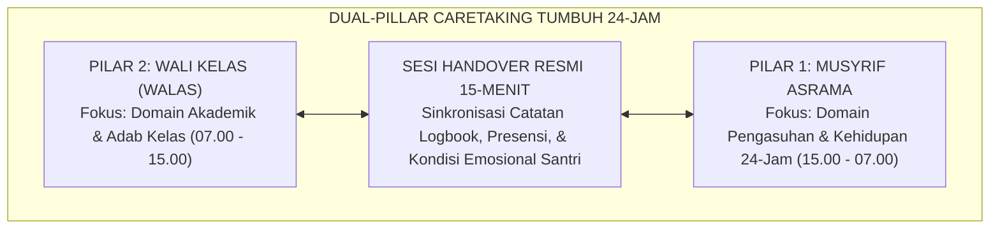
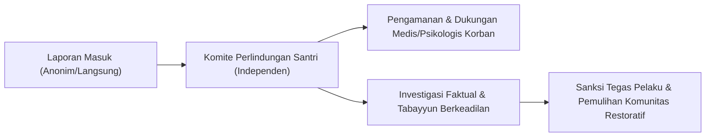

# SERI BUKU EKOSISTEM TUMBUH PESANTREN — VOLUME 05
# MANUAL OPERASIONAL, SOP MUSYRIF, & TATA KELOLA PESANTREN MODERN
## *Arsitektur Dual-Pillar Caretaking (Walas-Musyrif), Manajemen Shift Anti-Burnout, Protokol Safe School 24-Jam, dan Tata Kelola Digital*

**Nomor Identifikasi**: `BOOK-SERIES/VOL-05/MANUAL-SOP-TATA-KELOLA/2026`  
**Klasifikasi**: Monograf Riset Akademis & Manual Operasional Manajemen Pesantren Berstandar Mutu  
**Dewan Pakar Pengkaji**: `pakar-pengasuhan-asrama`, `pakar-pedagogi-master-guru`, `pakar-tata-kelola-qudwah`, `pakar-perlindungan-anak-dan-advokasi-santri`, `pakar-arsitektur-digital-pesantren`

---

## 📑 DAFTAR ISI VOLUME 05

1. **BAB 1: Struktur Kelembagaan & Arsitektur Dual-Pillar Pengasuhan Terpadu**
   - 1.1 Sinergi Dua Pilar Pengasuhan: Pilar 1 (Musyrif Asrama 15.00–07.00) & Pilar 2 (Wali Kelas / Walas 07.00–15.00)
   - 1.2 Matriks Pembagian Tanggung Jawab RACI (*Responsible, Accountable, Consulted, Informed*)
   - 1.3 Protokol Operasional Sesi Serah Terima (*Handover Meeting*) 15-Menit Pagi dan Sore
2. **BAB 2: Standar Operasional Prosedur (SOP) Rutinitas Kehidupan Santri 24-Jam**
   - 2.1 Fase Fajar & Pagi (04.00–07.00): Qiyamullail, Shubuh Berjamaah, Dzikir Ma'tsurat, Kebersihan Diri, & Sarapan
   - 2.2 Fase KBM Madrasah (07.00–15.00): Pembelajaran Akademik, Halaqah Al-Qur'an/Dirasah, & Shalat Dzuhur
   - 2.3 Fase Sore & Maghrib-Isya (15.00–20.00): Ashar, Olahraga Mandiri, Mandi Bersih, Shalat Maghrib-Isya, & Halaqah Malam
   - 2.4 Fase Istirahat Malam (20.00–04.00): Belajar Mandiri Terbimbing, Muhasabah Kamar, dan Pemadaman Lampu Tepat Waktu
3. **BAB 3: Kesejahteraan Pendidik & Manajemen Shift Musyrif Anti-Burnout**
   - 3.1 Krisis Kelelahan Kronis Musyrif: Risiko Human Error dan Reaktivitas Emosional
   - 3.2 Desain Sistem Rotasi Shift Terstruktur: Proporsi Jam Jaga, Jam Istirahat Penuh, dan Hari Pemulihan (*Day Off*)
   - 3.3 Program Pendampingan Psikologis & Penguatan Ruhiyah Musyrif (*Halaqah Tarbiyah Asatidz*)
4. **BAB 4: Protokol Perlindungan Santri & Pesantren Ramah Anak (*Safe School Protocols*)**
   - 4.1 Kebijakan Nol Toleransi Kekerasan (*Zero Tolerance on Violence & Harassment*)
   - 4.2 Saluran Pengaduan Aman & Anonim (*Safe & Anonymous Whistleblower System*)
   - 4.3 Alur Investigasi Independen Kasus Pelanggaran Etika & Perlindungan Korban/Saksi
5. **BAB 5: Integrasi Kemitraan Segitiga: Pesantren, Santri, dan Orang Tua**
   - 5.1 Program *Hybrid Parent School* (Edukasi Pola Asuh Selaras untuk Orang Tua Santri)
   - 5.2 Standar Komunikasi Darurat dan Jadwal Sambangan/Kunjungan Orang Tua yang Teratur
   - 5.3 Paspor Adab Rumah (*Home Adab Passport*): Menjaga Kontinuitas Karakter Selama Masa Liburan
6. **BAB 6: Tata Kelola Fasilitas, Sanitasi, dan Infrastruktur Digital Pesantren**
   - 6.1 Desain Ruang Hidup Sehat: Rasio Santri per Kamar Mandi, Sirkulasi Udara Kamar, dan Standar Gizi
   - 6.2 Manajemen Keamanan Lingkungan: Zonasi Keamanan, Pencahayaan Titik Buta, dan CCTV Beretika
   - 6.3 Pengelolaan Database Santri Terpadu: Arsitektur Aplikasi Offline-First & Keamanan Data Pribadi

---

## 🏛️ IKHTISAR DAN TEKS MONOGRAF BAB PER BAB

### BAB 1: Struktur Kelembagaan & Dual-Pillar Caretaking

Salah satu sumber utama kegagalan pembinaan di pesantren adalah terjadinya **gap komunikasi** antara guru di sekolah dan pembina di asrama. Sering kali santri yang bermasalah di asrama tidak diketahui oleh wali kelasnya, dan sebaliknya santri yang tertekan di kelas tidak terdeteksi oleh musyrifnya.

Ekosistem TUMBUH memecahkan kebuntuan ini melalui **Dual-Pillar Caretaking**:

Kedua pilar ini bertemu setiap hari dalam **Sesi Handover Pagi (06.45–07.00)** dan **Sesi Handover Sore (14.45–15.00)** untuk memperbarui catatan kondisi fisik, psikologis, dan adab setiap santri, menjamin kontinuitas pengasuhan tanpa celah.

### BAB 2: SOP Rutinitas Kehidupan Santri 24-Jam

Rutinitas harian santri dirancang dengan ritme yang seimbang antara ibadah, akademik, pembentukan keterampilan hidup, sosialisasi, dan istirahat yang cukup:

| Rentang Jam | Blok Aktivitas | Fokus Capaian Adab | Penanggung Jawab Utama |
| :--- | :--- | :--- | :--- |
| **04.00 – 05.30** | Qiyamullail, Shubuh Berjamaah, Dzikir Al-Ma'tsurat | Salimul Aqidah & Shahihul Ibadah | Musyrif Asrama |
| **05.30 – 06.45** | Kebersihan Kamar, Olahraga Ringan, Mandi, & Sarapan | Qowiyyul Jismi & Munazhzhamun fi Syu'unihi | Musyrif Asrama & Tim Dapur |
| **06.45 – 07.00** | **Handover Pagi & Apel Kesiapan Belajar** | Haritsun 'ala Waqtihi | Musyrif & Walas |
| **07.00 – 12.00** | Sesi Pembelajaran 1–4 Madrasah | Mutsaqqoful Fikri & Adab Belajar | Guru Mata Pelajaran & Walas |
| **12.00 – 13.00** | Shalat Dzuhur Berjamaah & Makan Siang | Adab Makan & Kebersihan | Walas & Tim Pengasuhan |
| **13.00 – 14.45** | Sesi Pembelajaran 5–6 / Halaqah Al-Qur'an | Ketekunan & Fokus Kognitif | Guru & Asatidz Qur'an |
| **14.45 – 15.00** | **Handover Sore Santri ke Asrama** | Transisi Terbimbing | Walas & Musyrif |
| **15.00 – 17.30** | Ashar Berjamaah, Olahraga Sunnah, Waktu Personal | Qowiyyul Jismi & Ukhuwah | Musyrif Asrama |
| **17.30 – 20.00** | Maghrib Berjamaah, Makan Malam, Isya, & Halaqah Kitab | Tazkiyatun Nafs & Kajian Turats | Musyrif & Asatidz Pengasuhan |
| **20.00 – 21.30** | Belajar Mandiri Terbimbing (*Muallam*) di Asrama | Kemandirian Belajar | Musyrif Asrama |
| **21.30 – 22.00** | Muhasabah Kamar, Dzikir Tidur, Pemadaman Lampu | Disiplin Istirahat & Adab Tidur | Musyrif Asrama |
| **22.00 – 04.00** | Waktu Tidur & Pemulihan Biologis (6 Jam Penuh) | Kesehatan Fisik & Mental Santri | Petugas Jaga Shift Malam |

### BAB 3: Kesejahteraan Pendidik & Manajemen Shift Anti-Burnout

Musyrif yang kelelahan dan kurang tidur adalah pemicu utama tindak kekerasan dan hilangnya kesabaran dalam mendidik. Oleh karena itu, lembaga menerapkan **Sistem Shift Proporsional**:
* Musyrif bertugas dalam sistem rotasi shift 3-grup.
* Dijamin memiliki waktu istirahat tidur malam minimal 7 jam tanpa interupsi saat tidak bertugas piket malam.
* Mendapatkan hak libur penuh (*Day Off*) 1–2 hari dalam sepekan di luar area asrama untuk penyegaran fisik dan mental (*decompression time*).
* Mengikuti halaqah pembinaan ruhiyah dan supervisi psikologis berkala bersama konselor senior.

### BAB 4: Protokol Perlindungan Santri (*Safe School Protocols*)

Pesantren TUMBUH memegang teguh komitmen perlindungan santri dari segala bentuk kekerasan fisik, psikis, perundungan, dan pelecehan:
1. **Mekanisme Whistleblower Aman**: Disediakan kotak aspirasi fisik yang terkunci aman dan aplikasi pelaporan anonim digital yang langsung terhubung ke Komite Etik & Perlindungan Santri independen.
2. **Pakta Integritas Pendidik**: Seluruh guru, musyrif, staf, dan pengurus santri menandatangani pakta integritas anti-kekerasan bermaterai saat mulai bertugas.
3. **Investigasi Tanpa Intimidasi**: Setiap laporan dugaan kekerasan ditangani dengan prinsip praduga tak bersalah, menjaga kerahasiaan saksi, dan mendahulukan perlindungan trauma korban (*trauma-informed care*).

### BAB 5: Kemitraan Segitiga: Pesantren, Santri, dan Orang Tua

Pendidikan karakter tidak akan berhasil jika terjadi kontradiksi antara budaya pondok dan budaya rumah. Program kemitraan meliputi:
* **Hybrid Parent School**: Seminar berkala (daring dan luring saat sambangan) yang memberikan edukasi pola asuh *Firm & Kind* kepada wali santri agar selaras dengan metode pengasuhan pesantren.
* **Paspor Adab Rumah**: Selama masa liburan semester, santri membawa lembar mutaba'ah adab terpadu yang diparaf oleh orang tua setiap hari untuk memastikan konsistensi pembiasaan ibadah dan adab di lingkungan keluarga.

### BAB 6: Tata Kelola Infrastruktur, Sanitasi, & Ekosistem Digital

Infrastruktur fisik dan teknologi dirancang untuk mendukung bi'ah shalihah:
* **Standar Sanitasi & Kamar Sehat**: Sirkulasi udara alami optimal, pencahayaan matahari memadai, dan rasio ideal 1 kamar mandi untuk maksimal 5 santri.
* **Arsitektur Digital Offline-First**: Aplikasi logbook musyrif dan database santri dirancang dengan arsitektur sinkronisasi lokal (*Local-First Storage*) agar tetap berfungsi stabil tanpa tergantung koneksi internet pondok yang fluktuatif.
* **Perlindungan Privasi Data**: Seluruh data catatan psikologis dan asesmen santri dienkripsi dan hanya dapat diakses oleh pihak yang berwenang sesuai matriks hak akses resmi lembaga.
