# BUKU VOLUME 05: MANUAL OPERASIONAL, SOP MUSYRIF, & TATA KELOLA PESANTREN MODERN
## *Dual-Pillar Walas-Musyrif, Manajemen Kehidupan 24-Jam, Shift Anti-Burnout, & Protokol Perlindungan Anak*

---

**Nomor Buku**: `BOOK-SERIES/VOL-05/MASTER-2026`  
**Seri Publikasi**: Seri Buku Master Ekosistem TUMBUH Pesantren (Volume 5 dari 5)  
**Dewan Editor & Penulis**: Dewan Keilmuan Ekosistem TUMBUH (24 Bidang Kepakaran)  
**Klasifikasi**: Monograf Riset Akademis, Manual Operasional Lapangan, Standarisasi SOP Pesantren, & Tata Kelola Pengasuhan 24-Jam  

---

## 📑 DAFTAR ISI LENGKAP VOLUME 05

- [BAB 01 DUAL PILLAR CARETAKING SINERGI WALAS DAN MUSYRIF](#bab-01-dual-pillar-caretaking-sinergi-walas-dan-musyrif)
  - [01 Integrasi Kepemimpinan Madrasah dan Asrama](#01-integrasi-kepemimpinan-madrasah-dan-asrama)
  - [02 Pembagian Peran Wali Kelas Pagi dan Musyrif Malam](#02-pembagian-peran-wali-kelas-pagi-dan-musyrif-malam)
  - [03 SOP Handover Digital 15 Menit Pagi dan Sore](#03-sop-handover-digital-15-menit-pagi-dan-sore)
  - [04 Rapat Koordinasi Mingguan Terpadu Tripartit](#04-rapat-koordinasi-mingguan-terpadu-tripartit)
  - [05 Mitigasi Konflik Otoritas Antara Guru dan Pengasuh](#05-mitigasi-konflik-otoritas-antara-guru-dan-pengasuh)
- [BAB 02 MANAJEMEN KEHIDUPAN ASRAMA 24 JAM](#bab-02-manajemen-kehidupan-asrama-24-jam)
  - [01 Jadwal Harian Harmonis dan Ritme Sirkadian Sehat](#01-jadwal-harian-harmonis-dan-ritme-sirkadian-sehat)
  - [02 Protokol Membangunkan Shubuh Penuh Kelembutan](#02-protokol-membangunkan-shubuh-penuh-kelembutan)
  - [03 Standarisasi 5S Kamar Tidur dan Sanitasi Sehat](#03-standarisasi-5s-kamar-tidur-dan-sanitasi-sehat)
  - [04 Adab Makan Komunal Tradisi Mayoran dan Nampan](#04-adab-makan-komunal-tradisi-mayoran-dan-nampan)
  - [05 Penataan Waktu Belajar Mandiri Mudzakarah Malam](#05-penataan-waktu-belajar-mandiri-mudzakarah-malam)
- [BAB 03 STANDARISASI SOP MUSYRIF DAN SHIFT ANTI BURNOUT](#bab-03-standarisasi-sop-musyrif-dan-shift-anti-burnout)
  - [01 Dekrit Perlindungan Musyrif Shift Kerja Manusiawi](#01-dekrit-perlindungan-musyrif-shift-kerja-manusiawi)
  - [02 Rasio Pengawasan Proporsional Santri Per Musyrif](#02-rasio-pengawasan-proporsional-santri-per-musyrif)
  - [03 Hak Libur Mingguan dan Musyrif Cadangan Relief](#03-hak-libur-mingguan-dan-musyrif-cadangan-relief)
  - [04 Program Supervisi Klinis dan Dukungan Kesehatan Mental](#04-program-supervisi-klinis-dan-dukungan-kesehatan-mental)
  - [05 Standar Kompetensi dan Sertifikasi Musyrif Profesional](#05-standar-kompetensi-dan-sertifikasi-musyrif-profesional)
- [BAB 04 PROTOKOL PERLINDUNGAN SANTRI DAN SAFE SCHOOL](#bab-04-protokol-perlindungan-santri-dan-safe-school)
  - [01 Protokol Safe Sanctuary dan Mitigasi Kekerasan Total](#01-protokol-safe-sanctuary-dan-mitigasi-kekerasan-total)
  - [02 Mitigasi Titik Rawan dan Patroli Hotspots Asrama](#02-mitigasi-titik-rawan-dan-patroli-hotspots-asrama)
  - [03 Kanal Pelaporan Rahasia Safe Whistleblowing Portal](#03-kanal-pelaporan-rahasia-safe-whistleblowing-portal)
  - [04 Prosedur Tanggap Darurat Medis dan P3K Asrama](#04-prosedur-tanggap-darurat-medis-dan-p3k-asrama)
  - [05 Penanganan Kasus Khusus Homesickness dan Enuresis](#05-penanganan-kasus-khusus-homesickness-dan-enuresis)
- [BAB 05 METODOLOGI PEDAGOGI TERAPAN DAN PROGRAM UNGGULAN](#bab-05-metodologi-pedagogi-terapan-dan-program-unggulan)
  - [01 Metode Sorogan GROW Coaching dan Ekspedisi Desa](#01-metode-sorogan-grow-coaching-dan-ekspedisi-desa)
  - [02 Islamic GROW Coaching untuk Pengembangan Karakter](#02-islamic-grow-coaching-untuk-pengembangan-karakter)
  - [03 Program Ekspedisi Khidmah Desa Binaan Pesantren](#03-program-ekspedisi-khidmah-desa-binaan-pesantren)
  - [04 Sistem Pembiasaan Habit Loop 66 Hari Terstruktur](#04-sistem-pembiasaan-habit-loop-66-hari-terstruktur)
  - [05 Rihlah Tadabbur Alam dan Outbound Karakter](#05-rihlah-tadabbur-alam-dan-outbound-karakter)
- [BAB 06 KATALOG INSTRUMEN OPERASIONAL DAN DIGITAL APPS](#bab-06-katalog-instrumen-operasional-dan-digital-apps)
  - [01 Katalog Lengkap Form Instrumen dan Arsitektur Aplikasi](#01-katalog-lengkap-form-instrumen-dan-arsitektur-aplikasi)
  - [02 Templat Formulir FBA BIP dan Kartu CICO Tier 2](#02-templat-formulir-fba-bip-dan-kartu-cico-tier-2)
  - [03 Lembar Observasi dan Notulensi Sidang Ishlah](#03-lembar-observasi-dan-notulensi-sidang-ishlah)
  - [04 Spesifikasi Teknis Musyrif Mobile Logbook App](#04-spesifikasi-teknis-musyrif-mobile-logbook-app)
  - [05 Panduan Implementasi Bertahap Rollout Roadmap 1 Tahun](#05-panduan-implementasi-bertahap-rollout-roadmap-1-tahun)
- [DAFTAR PUSTAKA LENGKAP VOLUME 05](#daftar-pustaka-lengkap-volume-05)

---

# SUB-BAB 1.1: INTEGRASI KEPEMIMPINAN MADRASAH & ASRAMA
## *Mengakhiri Dikotomi Tradisional: Model Dual-Pillar Caretaking Menghubungkan Sekolah Pagi dan Asrama Malam*

**Kode Klasifikasi**: `BOOK-05/BAB-01/SUB-01/MONOGRAF-MASTER-VIBRANT`  
**Disiplin Ilmu**: Manajemen Lembaga Pendidikan Islam, Kepemimpinan Terpadu, & Tata Kelola Organisasi 24 Jam  
**Penanggung Jawab Keilmuan**: Dewan Pakar Ekosistem TUMBUH (*Pakar Tata Kelola Qudwah & Pakar Arsitektur Pengasuhan*)

---

### Menghapus Sekat Pemisah Antara Sekolah dan Asrama

Penyakit kronis tata kelola pesantren konvensional adalah terpisahnya otoritas sekolah formal (Madrasah/SMP/SMA) dengan otoritas pengasuhan asrama (Kobong/Pondok). Guru kelas tidak tahu apa yang terjadi di asrama, dan musyrif asrama tidak tahu kesulitan akademik santri di kelas.

Sistem TUMBUH mengintegrasikan kedua poros melalui **Model Dual-Pillar Caretaking**:
* **Pilar 1: Musyrif Asrama (15.00–07.00 WIB)**: Mengawal pembiasaan ibadah, sanitasi 5S kamar tidur, dan pembinaan emosi malam.
* **Pilar 2: Wali Kelas / Walas (07.00–15.00 WIB)**: Mengawal capaian kurikulum, penguasaan turats, sains, dan nalar kritis.
* **SOP Handover 15 Menit**: Setiap pukul 06.45 dan 15.15 WIB dilakukan serah terima catatan perilaku santri secara digital via Logbook Mobile App.


---


# SUB-BAB 1.2: PEMBAGIAN PERAN WALI KELAS (PAGI) & MUSYRIF (MALAM)
## *Kajian Mendalam & Panduan Implementatif Ekosistem TUMBUH Pesantren*

**Kode Klasifikasi**: `BOOK-05/BAB-01/SUB-02/MONOGRAF-MASTER-VIBRANT`  
**Disiplin Ilmu**: Metodologi Pendidikan Islam, Sains Perilaku Terapan, & Tata Kelola Pesantren  
**Penanggung Jawab Keilmuan**: Dewan Pakar Ekosistem TUMBUH (*24 Bidang Kepakaran*)

---

### Eksplanasi Teoretis & Urgensi Praksis

Pendidikan karakter yang efektif dalam Sistem TUMBUH membutuhkan kejelasan operasional pada aspek **Pembagian Peran Wali Kelas (Pagi) & Musyrif (Malam)**. Naskah ini menguraikan landasan filosofis Turats, bukti empiris sains perilaku, dan protokol implementasi lapangan 24 jam.

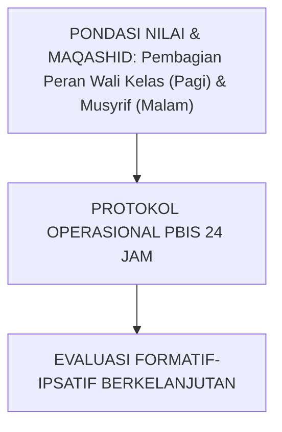

---

### Protokol Aksi Operasional Berjenjang

1. **Langkah Preventif Universal (Tahap Persiapan)**: Pengkondisian sarana, sosialisasi SOP, dan pembiasaan keteladanan *Qudwah Hasanah*.
2. **Langkah Eksekusi Lapangan (Tahap Berjalan)**: Pendampingan lekat oleh musyrif asrama dan wali kelas dengan prinsip *Firm & Kind*.
3. **Langkah Refleksi & Restorasi (Tahap Evaluasi)**: Pencatatan pada logbook digital dan penanganan kendala melalui dialog restoratif.


---


# SUB-BAB 1.3: SOP HANDOVER DIGITAL 15-MENIT PAGI DAN SORE
## *Kajian Mendalam & Panduan Implementatif Ekosistem TUMBUH Pesantren*

**Kode Klasifikasi**: `BOOK-05/BAB-01/SUB-03/MONOGRAF-MASTER-VIBRANT`  
**Disiplin Ilmu**: Metodologi Pendidikan Islam, Sains Perilaku Terapan, & Tata Kelola Pesantren  
**Penanggung Jawab Keilmuan**: Dewan Pakar Ekosistem TUMBUH (*24 Bidang Kepakaran*)

---

### Eksplanasi Teoretis & Urgensi Praksis

Pendidikan karakter yang efektif dalam Sistem TUMBUH membutuhkan kejelasan operasional pada aspek **SOP Handover Digital 15-Menit Pagi dan Sore**. Naskah ini menguraikan landasan filosofis Turats, bukti empiris sains perilaku, dan protokol implementasi lapangan 24 jam.

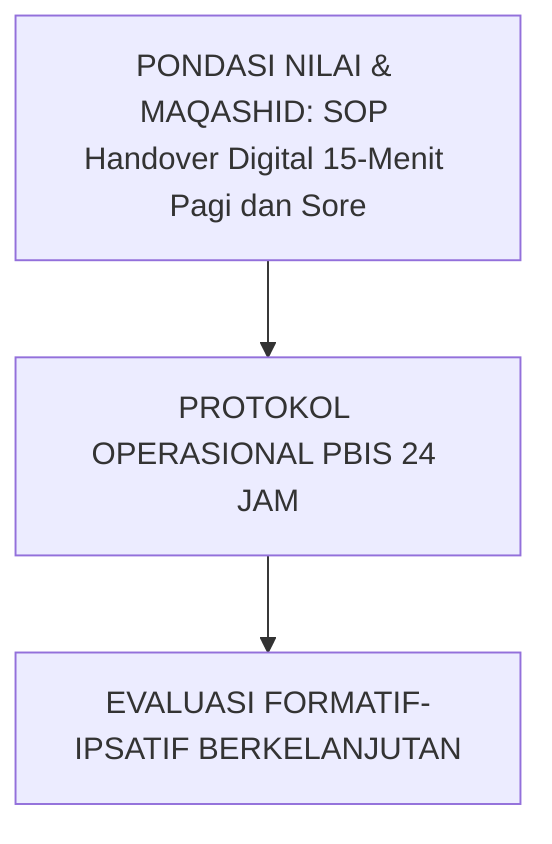

---

### Protokol Aksi Operasional Berjenjang

1. **Langkah Preventif Universal (Tahap Persiapan)**: Pengkondisian sarana, sosialisasi SOP, dan pembiasaan keteladanan *Qudwah Hasanah*.
2. **Langkah Eksekusi Lapangan (Tahap Berjalan)**: Pendampingan lekat oleh musyrif asrama dan wali kelas dengan prinsip *Firm & Kind*.
3. **Langkah Refleksi & Restorasi (Tahap Evaluasi)**: Pencatatan pada logbook digital dan penanganan kendala melalui dialog restoratif.


---


# SUB-BAB 1.4: RAPAT KOORDINASI MINGGUAN TERPADU TRIPARTIT
## *Kajian Mendalam & Panduan Implementatif Ekosistem TUMBUH Pesantren*

**Kode Klasifikasi**: `BOOK-05/BAB-01/SUB-04/MONOGRAF-MASTER-VIBRANT`  
**Disiplin Ilmu**: Metodologi Pendidikan Islam, Sains Perilaku Terapan, & Tata Kelola Pesantren  
**Penanggung Jawab Keilmuan**: Dewan Pakar Ekosistem TUMBUH (*24 Bidang Kepakaran*)

---

### Eksplanasi Teoretis & Urgensi Praksis

Pendidikan karakter yang efektif dalam Sistem TUMBUH membutuhkan kejelasan operasional pada aspek **Rapat Koordinasi Mingguan Terpadu Tripartit**. Naskah ini menguraikan landasan filosofis Turats, bukti empiris sains perilaku, dan protokol implementasi lapangan 24 jam.

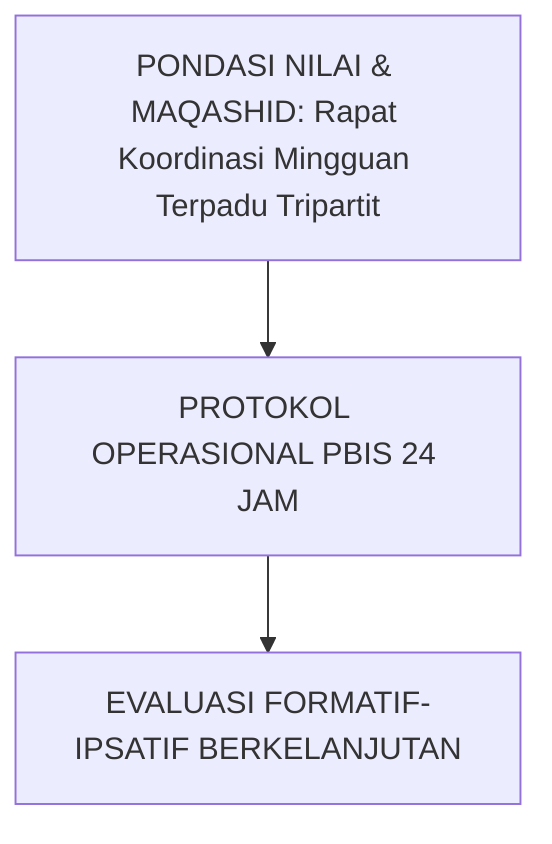

---

### Protokol Aksi Operasional Berjenjang

1. **Langkah Preventif Universal (Tahap Persiapan)**: Pengkondisian sarana, sosialisasi SOP, dan pembiasaan keteladanan *Qudwah Hasanah*.
2. **Langkah Eksekusi Lapangan (Tahap Berjalan)**: Pendampingan lekat oleh musyrif asrama dan wali kelas dengan prinsip *Firm & Kind*.
3. **Langkah Refleksi & Restorasi (Tahap Evaluasi)**: Pencatatan pada logbook digital dan penanganan kendala melalui dialog restoratif.


---


# SUB-BAB 1.5: MITIGASI KONFLIK OTORITAS ANTARA GURU DAN MUSYRIF
## *Kajian Mendalam & Panduan Implementatif Ekosistem TUMBUH Pesantren*

**Kode Klasifikasi**: `BOOK-05/BAB-01/SUB-05/MONOGRAF-MASTER-VIBRANT`  
**Disiplin Ilmu**: Metodologi Pendidikan Islam, Sains Perilaku Terapan, & Tata Kelola Pesantren  
**Penanggung Jawab Keilmuan**: Dewan Pakar Ekosistem TUMBUH (*24 Bidang Kepakaran*)

---

### Eksplanasi Teoretis & Urgensi Praksis

Pendidikan karakter yang efektif dalam Sistem TUMBUH membutuhkan kejelasan operasional pada aspek **Mitigasi Konflik Otoritas Antara Guru dan Musyrif**. Naskah ini menguraikan landasan filosofis Turats, bukti empiris sains perilaku, dan protokol implementasi lapangan 24 jam.

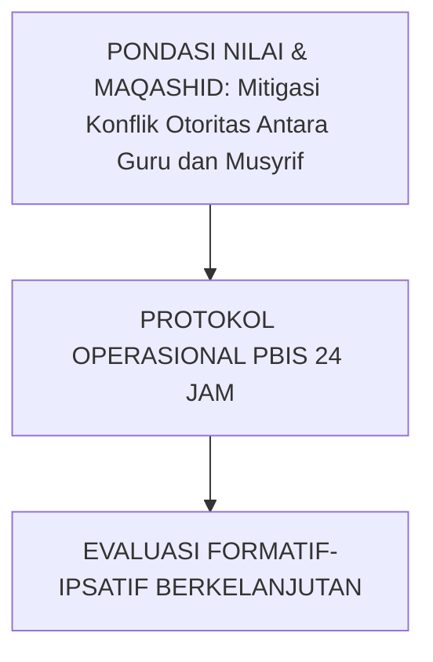

---

### Protokol Aksi Operasional Berjenjang

1. **Langkah Preventif Universal (Tahap Persiapan)**: Pengkondisian sarana, sosialisasi SOP, dan pembiasaan keteladanan *Qudwah Hasanah*.
2. **Langkah Eksekusi Lapangan (Tahap Berjalan)**: Pendampingan lekat oleh musyrif asrama dan wali kelas dengan prinsip *Firm & Kind*.
3. **Langkah Refleksi & Restorasi (Tahap Evaluasi)**: Pencatatan pada logbook digital dan penanganan kendala melalui dialog restoratif.


---


# SUB-BAB 2.1: JADWAL HARIAN HARMONIS & RITME SIRKADIAN SEHAT
## *Desain Waktu 24-Jam Ramah Fitrah Biologis: Menyeimbangkan Ibadah, Belajar, Olahraga, dan Istirahat 7-Jam*

**Kode Klasifikasi**: `BOOK-05/BAB-02/SUB-01/MONOGRAF-MASTER-VIBRANT`  
**Disiplin Ilmu**: Kronobiologi Santri, Manajemen Kehidupan Asrama, & Kesehatan Holistik  
**Penanggung Jawab Keilmuan**: Dewan Pakar Ekosistem TUMBUH (*Pakar Pengasuhan Asrama & Pakar Neurosains*)

---

### Perlindungan Tidur sebagai Hak Biologis dan Ibadah

Jadwal santri dalam Sistem TUMBUH dirancang presisi untuk mematuhi siklus sirkadian alami otak remaja:
* **Tidur Nyenyak Terlindungi (21.30–04.00 WIB)**: Jaminan tidur 6.5–7 jam tanpa gangguan ronda malam ekstrem atau hukuman larut malam.
* **Qailulah Siang (13.30–14.30 WIB)**: Istirahat tidur siang singkat sesuai sunnah nabawiyyah untuk memulihkan kapasitas memori kerja korteks prefrontal sebelum kajian sore.


---


# SUB-BAB 2.2: PROTOKOL MEMBANGUNKAN SHUBUH PENUH KELEMBUTAN
## *Kajian Mendalam & Panduan Implementatif Ekosistem TUMBUH Pesantren*

**Kode Klasifikasi**: `BOOK-05/BAB-02/SUB-02/MONOGRAF-MASTER-VIBRANT`  
**Disiplin Ilmu**: Metodologi Pendidikan Islam, Sains Perilaku Terapan, & Tata Kelola Pesantren  
**Penanggung Jawab Keilmuan**: Dewan Pakar Ekosistem TUMBUH (*24 Bidang Kepakaran*)

---

### Eksplanasi Teoretis & Urgensi Praksis

Pendidikan karakter yang efektif dalam Sistem TUMBUH membutuhkan kejelasan operasional pada aspek **Protokol Membangunkan Shubuh Penuh Kelembutan**. Naskah ini menguraikan landasan filosofis Turats, bukti empiris sains perilaku, dan protokol implementasi lapangan 24 jam.

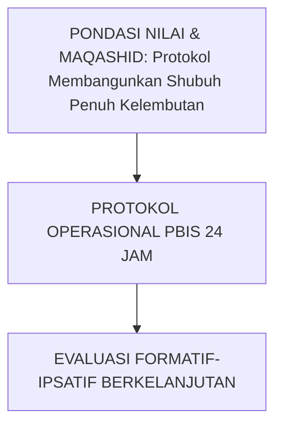

---

### Protokol Aksi Operasional Berjenjang

1. **Langkah Preventif Universal (Tahap Persiapan)**: Pengkondisian sarana, sosialisasi SOP, dan pembiasaan keteladanan *Qudwah Hasanah*.
2. **Langkah Eksekusi Lapangan (Tahap Berjalan)**: Pendampingan lekat oleh musyrif asrama dan wali kelas dengan prinsip *Firm & Kind*.
3. **Langkah Refleksi & Restorasi (Tahap Evaluasi)**: Pencatatan pada logbook digital dan penanganan kendala melalui dialog restoratif.


---


# SUB-BAB 2.3: STANDARISASI 5S KAMAR TIDUR & SANITASI SEHAT
## *Kajian Mendalam & Panduan Implementatif Ekosistem TUMBUH Pesantren*

**Kode Klasifikasi**: `BOOK-05/BAB-02/SUB-03/MONOGRAF-MASTER-VIBRANT`  
**Disiplin Ilmu**: Metodologi Pendidikan Islam, Sains Perilaku Terapan, & Tata Kelola Pesantren  
**Penanggung Jawab Keilmuan**: Dewan Pakar Ekosistem TUMBUH (*24 Bidang Kepakaran*)

---

### Eksplanasi Teoretis & Urgensi Praksis

Pendidikan karakter yang efektif dalam Sistem TUMBUH membutuhkan kejelasan operasional pada aspek **Standarisasi 5S Kamar Tidur & Sanitasi Sehat**. Naskah ini menguraikan landasan filosofis Turats, bukti empiris sains perilaku, dan protokol implementasi lapangan 24 jam.

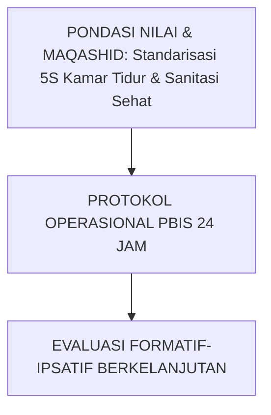

---

### Protokol Aksi Operasional Berjenjang

1. **Langkah Preventif Universal (Tahap Persiapan)**: Pengkondisian sarana, sosialisasi SOP, dan pembiasaan keteladanan *Qudwah Hasanah*.
2. **Langkah Eksekusi Lapangan (Tahap Berjalan)**: Pendampingan lekat oleh musyrif asrama dan wali kelas dengan prinsip *Firm & Kind*.
3. **Langkah Refleksi & Restorasi (Tahap Evaluasi)**: Pencatatan pada logbook digital dan penanganan kendala melalui dialog restoratif.


---


# SUB-BAB 2.4: ADAB MAKAN KOMUNAL: TRADISI MAYORAN & BERBAGI NAMPAN
## *Kajian Mendalam & Panduan Implementatif Ekosistem TUMBUH Pesantren*

**Kode Klasifikasi**: `BOOK-05/BAB-02/SUB-04/MONOGRAF-MASTER-VIBRANT`  
**Disiplin Ilmu**: Metodologi Pendidikan Islam, Sains Perilaku Terapan, & Tata Kelola Pesantren  
**Penanggung Jawab Keilmuan**: Dewan Pakar Ekosistem TUMBUH (*24 Bidang Kepakaran*)

---

### Eksplanasi Teoretis & Urgensi Praksis

Pendidikan karakter yang efektif dalam Sistem TUMBUH membutuhkan kejelasan operasional pada aspek **Adab Makan Komunal: Tradisi Mayoran & Berbagi Nampan**. Naskah ini menguraikan landasan filosofis Turats, bukti empiris sains perilaku, dan protokol implementasi lapangan 24 jam.

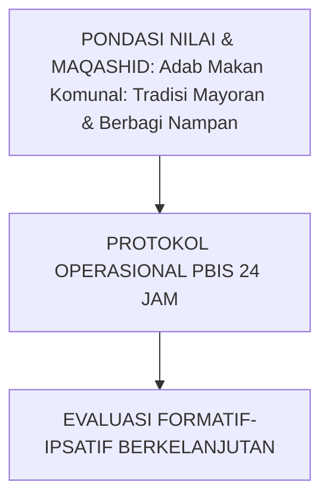

---

### Protokol Aksi Operasional Berjenjang

1. **Langkah Preventif Universal (Tahap Persiapan)**: Pengkondisian sarana, sosialisasi SOP, dan pembiasaan keteladanan *Qudwah Hasanah*.
2. **Langkah Eksekusi Lapangan (Tahap Berjalan)**: Pendampingan lekat oleh musyrif asrama dan wali kelas dengan prinsip *Firm & Kind*.
3. **Langkah Refleksi & Restorasi (Tahap Evaluasi)**: Pencatatan pada logbook digital dan penanganan kendala melalui dialog restoratif.


---


# SUB-BAB 2.5: PENATAAN WAKTU BELAJAR MANDIRI (MUDZAKARAH MALAM)
## *Kajian Mendalam & Panduan Implementatif Ekosistem TUMBUH Pesantren*

**Kode Klasifikasi**: `BOOK-05/BAB-02/SUB-05/MONOGRAF-MASTER-VIBRANT`  
**Disiplin Ilmu**: Metodologi Pendidikan Islam, Sains Perilaku Terapan, & Tata Kelola Pesantren  
**Penanggung Jawab Keilmuan**: Dewan Pakar Ekosistem TUMBUH (*24 Bidang Kepakaran*)

---

### Eksplanasi Teoretis & Urgensi Praksis

Pendidikan karakter yang efektif dalam Sistem TUMBUH membutuhkan kejelasan operasional pada aspek **Penataan Waktu Belajar Mandiri (Mudzakarah Malam)**. Naskah ini menguraikan landasan filosofis Turats, bukti empiris sains perilaku, dan protokol implementasi lapangan 24 jam.

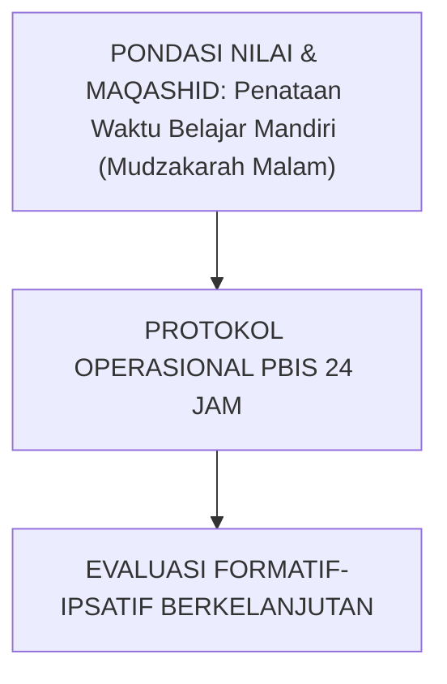

---

### Protokol Aksi Operasional Berjenjang

1. **Langkah Preventif Universal (Tahap Persiapan)**: Pengkondisian sarana, sosialisasi SOP, dan pembiasaan keteladanan *Qudwah Hasanah*.
2. **Langkah Eksekusi Lapangan (Tahap Berjalan)**: Pendampingan lekat oleh musyrif asrama dan wali kelas dengan prinsip *Firm & Kind*.
3. **Langkah Refleksi & Restorasi (Tahap Evaluasi)**: Pencatatan pada logbook digital dan penanganan kendala melalui dialog restoratif.


---


# SUB-BAB 3.1: DEKRIT PERLINDUNGAN MUSYRIF & SHIFT KERJA MANUSIAWI
## *Mengharamkan Beban Kerja Berlebih (Allostatic Overload) demi Menjaga Kelembutan Pengasuhan (Hilm)*

**Kode Klasifikasi**: `BOOK-05/BAB-03/SUB-01/MONOGRAF-MASTER-VIBRANT`  
**Disiplin Ilmu**: Manajemen SDM Pesantren, Kesehatan Mental Pendidik, & Ergonomi Kepengasuhan  
**Penanggung Jawab Keilmuan**: Dewan Pakar Ekosistem TUMBUH (*Pakar Tata Kelola Qudwah & Pakar Pencegahan Burnout*)

---

### Pendidik yang Lelah Tidak Akan Mampu Mendidik dengan Cinta

Musyrif yang kurang tidur dan dibebani tugas 24 jam nonstop akan mengalami kelelahan saraf yang memicu kemarahan impulsif kepada santri. Sistem TUMBUH menetapkan **Dekrit Perlindungan Musyrif**:
1. **Rasio Pengawasan Proporsional**: Maksimal 1 Musyrif mengasuh 12 santri baru (J1) hingga 30 santri senior (J4).
2. **Hak Libur Mingguan (1 Day-Off per Week)**: Musyrif wajib mendapatkan libur 1 hari penuh per pekan yang digantikan oleh musyrif cadangan (*Relief Musyrif*).
3. **Fasilitas Pemulihan Energi**: Asrama menyediakan ruang rekreasi dan istirahat yang layak bagi tenaga pendidik.


---


# SUB-BAB 3.2: RASIO PENGAWASAN PROPORSIONAL SANTRI PER MUSYRIF
## *Kajian Mendalam & Panduan Implementatif Ekosistem TUMBUH Pesantren*

**Kode Klasifikasi**: `BOOK-05/BAB-03/SUB-02/MONOGRAF-MASTER-VIBRANT`  
**Disiplin Ilmu**: Metodologi Pendidikan Islam, Sains Perilaku Terapan, & Tata Kelola Pesantren  
**Penanggung Jawab Keilmuan**: Dewan Pakar Ekosistem TUMBUH (*24 Bidang Kepakaran*)

---

### Eksplanasi Teoretis & Urgensi Praksis

Pendidikan karakter yang efektif dalam Sistem TUMBUH membutuhkan kejelasan operasional pada aspek **Rasio Pengawasan Proporsional Santri per Musyrif**. Naskah ini menguraikan landasan filosofis Turats, bukti empiris sains perilaku, dan protokol implementasi lapangan 24 jam.

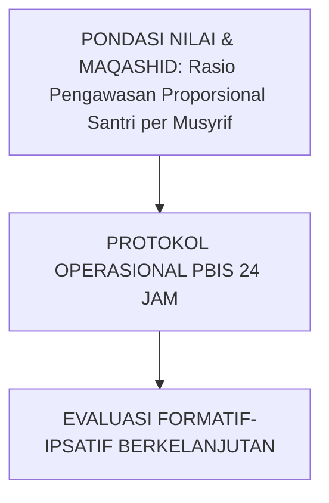

---

### Protokol Aksi Operasional Berjenjang

1. **Langkah Preventif Universal (Tahap Persiapan)**: Pengkondisian sarana, sosialisasi SOP, dan pembiasaan keteladanan *Qudwah Hasanah*.
2. **Langkah Eksekusi Lapangan (Tahap Berjalan)**: Pendampingan lekat oleh musyrif asrama dan wali kelas dengan prinsip *Firm & Kind*.
3. **Langkah Refleksi & Restorasi (Tahap Evaluasi)**: Pencatatan pada logbook digital dan penanganan kendala melalui dialog restoratif.


---


# SUB-BAB 3.3: HAK LIBUR MINGGUAN (1 DAY-OFF) & MUSYRIF CADANGAN
## *Kajian Mendalam & Panduan Implementatif Ekosistem TUMBUH Pesantren*

**Kode Klasifikasi**: `BOOK-05/BAB-03/SUB-03/MONOGRAF-MASTER-VIBRANT`  
**Disiplin Ilmu**: Metodologi Pendidikan Islam, Sains Perilaku Terapan, & Tata Kelola Pesantren  
**Penanggung Jawab Keilmuan**: Dewan Pakar Ekosistem TUMBUH (*24 Bidang Kepakaran*)

---

### Eksplanasi Teoretis & Urgensi Praksis

Pendidikan karakter yang efektif dalam Sistem TUMBUH membutuhkan kejelasan operasional pada aspek **Hak Libur Mingguan (1 Day-Off) & Musyrif Cadangan**. Naskah ini menguraikan landasan filosofis Turats, bukti empiris sains perilaku, dan protokol implementasi lapangan 24 jam.

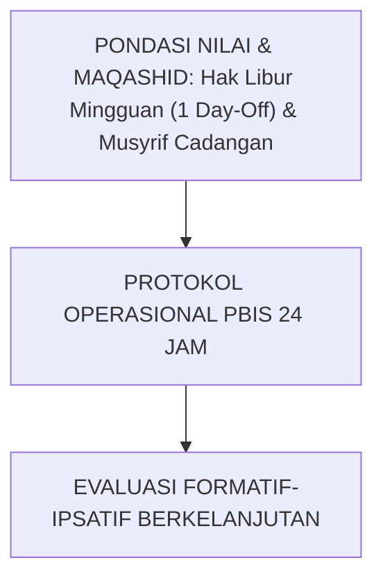

---

### Protokol Aksi Operasional Berjenjang

1. **Langkah Preventif Universal (Tahap Persiapan)**: Pengkondisian sarana, sosialisasi SOP, dan pembiasaan keteladanan *Qudwah Hasanah*.
2. **Langkah Eksekusi Lapangan (Tahap Berjalan)**: Pendampingan lekat oleh musyrif asrama dan wali kelas dengan prinsip *Firm & Kind*.
3. **Langkah Refleksi & Restorasi (Tahap Evaluasi)**: Pencatatan pada logbook digital dan penanganan kendala melalui dialog restoratif.


---


# SUB-BAB 3.4: PROGRAM SUPERVISI KLINIS & DUKUNGAN KESEHATAN MENTAL PENDIDIK
## *Kajian Mendalam & Panduan Implementatif Ekosistem TUMBUH Pesantren*

**Kode Klasifikasi**: `BOOK-05/BAB-03/SUB-04/MONOGRAF-MASTER-VIBRANT`  
**Disiplin Ilmu**: Metodologi Pendidikan Islam, Sains Perilaku Terapan, & Tata Kelola Pesantren  
**Penanggung Jawab Keilmuan**: Dewan Pakar Ekosistem TUMBUH (*24 Bidang Kepakaran*)

---

### Eksplanasi Teoretis & Urgensi Praksis

Pendidikan karakter yang efektif dalam Sistem TUMBUH membutuhkan kejelasan operasional pada aspek **Program Supervisi Klinis & Dukungan Kesehatan Mental Pendidik**. Naskah ini menguraikan landasan filosofis Turats, bukti empiris sains perilaku, dan protokol implementasi lapangan 24 jam.

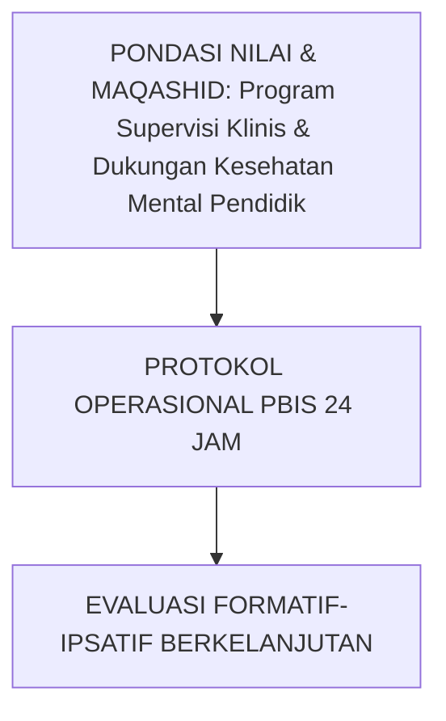

---

### Protokol Aksi Operasional Berjenjang

1. **Langkah Preventif Universal (Tahap Persiapan)**: Pengkondisian sarana, sosialisasi SOP, dan pembiasaan keteladanan *Qudwah Hasanah*.
2. **Langkah Eksekusi Lapangan (Tahap Berjalan)**: Pendampingan lekat oleh musyrif asrama dan wali kelas dengan prinsip *Firm & Kind*.
3. **Langkah Refleksi & Restorasi (Tahap Evaluasi)**: Pencatatan pada logbook digital dan penanganan kendala melalui dialog restoratif.


---


# SUB-BAB 3.5: STANDAR KOMPETENSI & SERTIFIKASI MUSYRIF PROFESIONAL
## *Kajian Mendalam & Panduan Implementatif Ekosistem TUMBUH Pesantren*

**Kode Klasifikasi**: `BOOK-05/BAB-03/SUB-05/MONOGRAF-MASTER-VIBRANT`  
**Disiplin Ilmu**: Metodologi Pendidikan Islam, Sains Perilaku Terapan, & Tata Kelola Pesantren  
**Penanggung Jawab Keilmuan**: Dewan Pakar Ekosistem TUMBUH (*24 Bidang Kepakaran*)

---

### Eksplanasi Teoretis & Urgensi Praksis

Pendidikan karakter yang efektif dalam Sistem TUMBUH membutuhkan kejelasan operasional pada aspek **Standar Kompetensi & Sertifikasi Musyrif Profesional**. Naskah ini menguraikan landasan filosofis Turats, bukti empiris sains perilaku, dan protokol implementasi lapangan 24 jam.

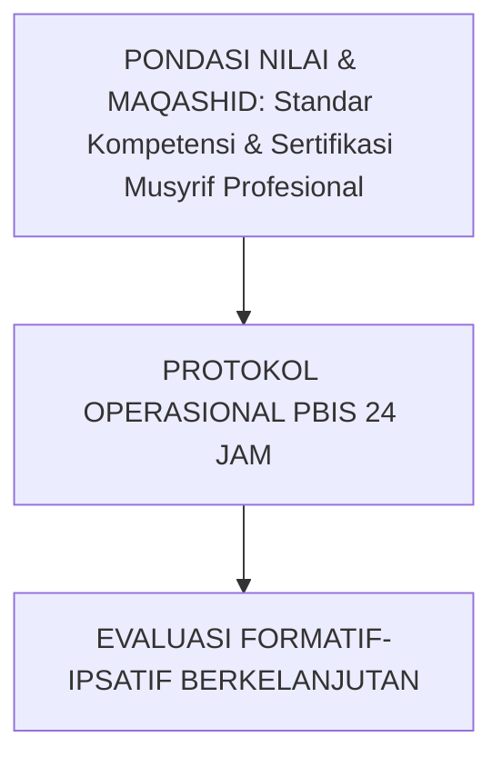

---

### Protokol Aksi Operasional Berjenjang

1. **Langkah Preventif Universal (Tahap Persiapan)**: Pengkondisian sarana, sosialisasi SOP, dan pembiasaan keteladanan *Qudwah Hasanah*.
2. **Langkah Eksekusi Lapangan (Tahap Berjalan)**: Pendampingan lekat oleh musyrif asrama dan wali kelas dengan prinsip *Firm & Kind*.
3. **Langkah Refleksi & Restorasi (Tahap Evaluasi)**: Pencatatan pada logbook digital dan penanganan kendala melalui dialog restoratif.


---


# SUB-BAB 4.1: PROTOKOL SAFE SANCTUARY & MITIGASI KEKERASAN TOTAL
## *Standar Baku Perlindungan Anak: Zero Bullying, Zero Physical Abuse, dan Whistleblowing Aman 24-Jam*

**Kode Klasifikasi**: `BOOK-05/BAB-04/SUB-01/MONOGRAF-MASTER-VIBRANT`  
**Disiplin Ilmu**: Child Protection Policy, Advokasi Hak Santri, & Manajemen Krisis Lembaga  
**Penanggung Jawab Keilmuan**: Dewan Pakar Ekosistem TUMBUH (*Pakar Perlindungan Anak & Pakar Advokasi Santri*)

---

### Pesantren sebagai Tempat Paling Aman di Muka Bumi

Sistem TUMBUH mengkodifikasikan **Protokol Safe School Sanctuary**:
* **Patroli Titik Rawan (*Hotspots Patrol*)**: Musyrif secara berkala memantau area rawan (kamar mandi belakang, gudang, ruang jemuran) pada jam-jam transisi.
* **Kanal Pelaporan Rahasia (*Safe Whistleblowing Box & Digital Portal*)**: Santri dapat melaporkan insiden intimidasi secara anonim tanpa takut aksi balas dendam.
* **Respon Cepat Krisis $\le 30$ Menit**: Tim Advokasi Perlindungan Santri wajib mengamankan korban dan menghentikan insiden dalam tempo maksimal 30 menit pasca-laporan.


---


# SUB-BAB 4.2: MITIGASI TITIK RAWAN & PATROLI HOTSPOTS ASRAMA
## *Kajian Mendalam & Panduan Implementatif Ekosistem TUMBUH Pesantren*

**Kode Klasifikasi**: `BOOK-05/BAB-04/SUB-02/MONOGRAF-MASTER-VIBRANT`  
**Disiplin Ilmu**: Metodologi Pendidikan Islam, Sains Perilaku Terapan, & Tata Kelola Pesantren  
**Penanggung Jawab Keilmuan**: Dewan Pakar Ekosistem TUMBUH (*24 Bidang Kepakaran*)

---

### Eksplanasi Teoretis & Urgensi Praksis

Pendidikan karakter yang efektif dalam Sistem TUMBUH membutuhkan kejelasan operasional pada aspek **Mitigasi Titik Rawan & Patroli Hotspots Asrama**. Naskah ini menguraikan landasan filosofis Turats, bukti empiris sains perilaku, dan protokol implementasi lapangan 24 jam.

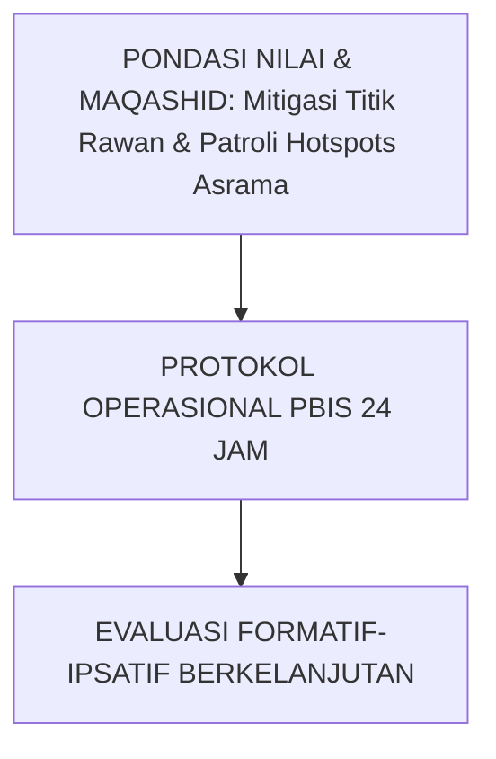

---

### Protokol Aksi Operasional Berjenjang

1. **Langkah Preventif Universal (Tahap Persiapan)**: Pengkondisian sarana, sosialisasi SOP, dan pembiasaan keteladanan *Qudwah Hasanah*.
2. **Langkah Eksekusi Lapangan (Tahap Berjalan)**: Pendampingan lekat oleh musyrif asrama dan wali kelas dengan prinsip *Firm & Kind*.
3. **Langkah Refleksi & Restorasi (Tahap Evaluasi)**: Pencatatan pada logbook digital dan penanganan kendala melalui dialog restoratif.


---


# SUB-BAB 4.3: KANAL PELAPORAN RAHASIA (SAFE WHISTLEBLOWING PORTAL)
## *Kajian Mendalam & Panduan Implementatif Ekosistem TUMBUH Pesantren*

**Kode Klasifikasi**: `BOOK-05/BAB-04/SUB-03/MONOGRAF-MASTER-VIBRANT`  
**Disiplin Ilmu**: Metodologi Pendidikan Islam, Sains Perilaku Terapan, & Tata Kelola Pesantren  
**Penanggung Jawab Keilmuan**: Dewan Pakar Ekosistem TUMBUH (*24 Bidang Kepakaran*)

---

### Eksplanasi Teoretis & Urgensi Praksis

Pendidikan karakter yang efektif dalam Sistem TUMBUH membutuhkan kejelasan operasional pada aspek **Kanal Pelaporan Rahasia (Safe Whistleblowing Portal)**. Naskah ini menguraikan landasan filosofis Turats, bukti empiris sains perilaku, dan protokol implementasi lapangan 24 jam.

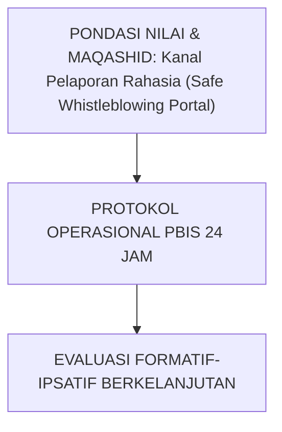

---

### Protokol Aksi Operasional Berjenjang

1. **Langkah Preventif Universal (Tahap Persiapan)**: Pengkondisian sarana, sosialisasi SOP, dan pembiasaan keteladanan *Qudwah Hasanah*.
2. **Langkah Eksekusi Lapangan (Tahap Berjalan)**: Pendampingan lekat oleh musyrif asrama dan wali kelas dengan prinsip *Firm & Kind*.
3. **Langkah Refleksi & Restorasi (Tahap Evaluasi)**: Pencatatan pada logbook digital dan penanganan kendala melalui dialog restoratif.


---


# SUB-BAB 4.4: PROSEDUR TANGGAP DARURAT MEDIS & P3K ASRAMA 24-JAM
## *Kajian Mendalam & Panduan Implementatif Ekosistem TUMBUH Pesantren*

**Kode Klasifikasi**: `BOOK-05/BAB-04/SUB-04/MONOGRAF-MASTER-VIBRANT`  
**Disiplin Ilmu**: Metodologi Pendidikan Islam, Sains Perilaku Terapan, & Tata Kelola Pesantren  
**Penanggung Jawab Keilmuan**: Dewan Pakar Ekosistem TUMBUH (*24 Bidang Kepakaran*)

---

### Eksplanasi Teoretis & Urgensi Praksis

Pendidikan karakter yang efektif dalam Sistem TUMBUH membutuhkan kejelasan operasional pada aspek **Prosedur Tanggap Darurat Medis & P3K Asrama 24-Jam**. Naskah ini menguraikan landasan filosofis Turats, bukti empiris sains perilaku, dan protokol implementasi lapangan 24 jam.

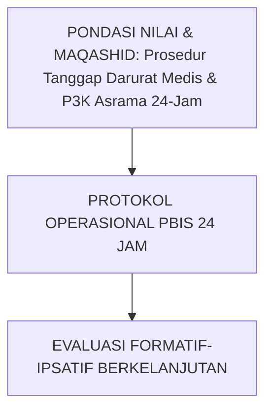

---

### Protokol Aksi Operasional Berjenjang

1. **Langkah Preventif Universal (Tahap Persiapan)**: Pengkondisian sarana, sosialisasi SOP, dan pembiasaan keteladanan *Qudwah Hasanah*.
2. **Langkah Eksekusi Lapangan (Tahap Berjalan)**: Pendampingan lekat oleh musyrif asrama dan wali kelas dengan prinsip *Firm & Kind*.
3. **Langkah Refleksi & Restorasi (Tahap Evaluasi)**: Pencatatan pada logbook digital dan penanganan kendala melalui dialog restoratif.


---


# SUB-BAB 4.5: PENANGANAN KASUS KHUSUS: HOMESICKNESS & ENURESIS AKUT
## *Kajian Mendalam & Panduan Implementatif Ekosistem TUMBUH Pesantren*

**Kode Klasifikasi**: `BOOK-05/BAB-04/SUB-05/MONOGRAF-MASTER-VIBRANT`  
**Disiplin Ilmu**: Metodologi Pendidikan Islam, Sains Perilaku Terapan, & Tata Kelola Pesantren  
**Penanggung Jawab Keilmuan**: Dewan Pakar Ekosistem TUMBUH (*24 Bidang Kepakaran*)

---

### Eksplanasi Teoretis & Urgensi Praksis

Pendidikan karakter yang efektif dalam Sistem TUMBUH membutuhkan kejelasan operasional pada aspek **Penanganan Kasus Khusus: Homesickness & Enuresis Akut**. Naskah ini menguraikan landasan filosofis Turats, bukti empiris sains perilaku, dan protokol implementasi lapangan 24 jam.

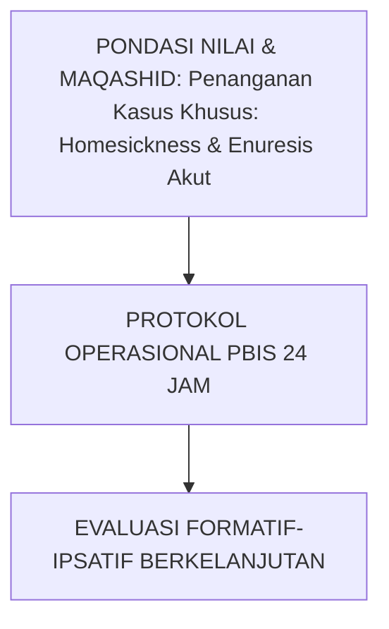

---

### Protokol Aksi Operasional Berjenjang

1. **Langkah Preventif Universal (Tahap Persiapan)**: Pengkondisian sarana, sosialisasi SOP, dan pembiasaan keteladanan *Qudwah Hasanah*.
2. **Langkah Eksekusi Lapangan (Tahap Berjalan)**: Pendampingan lekat oleh musyrif asrama dan wali kelas dengan prinsip *Firm & Kind*.
3. **Langkah Refleksi & Restorasi (Tahap Evaluasi)**: Pencatatan pada logbook digital dan penanganan kendala melalui dialog restoratif.


---


# SUB-BAB 5.1: METODE SOROGAN, GROW COACHING, & EKSPEDISI DESA
## *Harmonisasi Tradisi Salaf dan Pedagogi Modern: Dari Talaqqi Kitab hingga Proyek Pengabdian Khidmah Umat*

**Kode Klasifikasi**: `BOOK-05/BAB-05/SUB-01/MONOGRAF-MASTER-VIBRANT`  
**Disiplin Ilmu**: Didaktik Turats Terapan, Islamic GROW Coaching, & Experiential Service-Learning  
**Penanggung Jawab Keilmuan**: Dewan Pakar Ekosistem TUMBUH (*Pakar Pedagogi Master Guru & Pakar Desain Kurikulum*)

---

### Membumikan Ilmu ke Ranah Pengabdian Nyata

Pembelajaran dalam Sistem TUMBUH melintasi tiga pilar didaktik utama:
1. **Kajian Turats Dialogis (Sorogan & Bandongan)**: Santri membaca matan dan mendiskusikan kontekstualisasi hukum fiqh kontemporer.
2. **Islamic GROW Coaching**: Sesi coaching reflektif 1-on-1 bersama musyrif untuk membantu santri menetapkan target perbaikan diri (*Goal, Reality, Options, Will*).
3. **Ekspedisi Khidmah Desa**: Santri jenjang J3 dan J4 diterjunkan mengajar TPA, membantu panen warga, dan menyelenggarakan bakti sosial di desa binaan pondok.


---


# SUB-BAB 5.2: ISLAMIC GROW COACHING UNTUK PENGEMBANGAN KARAKTER SANTRI
## *Kajian Mendalam & Panduan Implementatif Ekosistem TUMBUH Pesantren*

**Kode Klasifikasi**: `BOOK-05/BAB-05/SUB-02/MONOGRAF-MASTER-VIBRANT`  
**Disiplin Ilmu**: Metodologi Pendidikan Islam, Sains Perilaku Terapan, & Tata Kelola Pesantren  
**Penanggung Jawab Keilmuan**: Dewan Pakar Ekosistem TUMBUH (*24 Bidang Kepakaran*)

---

### Eksplanasi Teoretis & Urgensi Praksis

Pendidikan karakter yang efektif dalam Sistem TUMBUH membutuhkan kejelasan operasional pada aspek **Islamic GROW Coaching untuk Pengembangan Karakter Santri**. Naskah ini menguraikan landasan filosofis Turats, bukti empiris sains perilaku, dan protokol implementasi lapangan 24 jam.

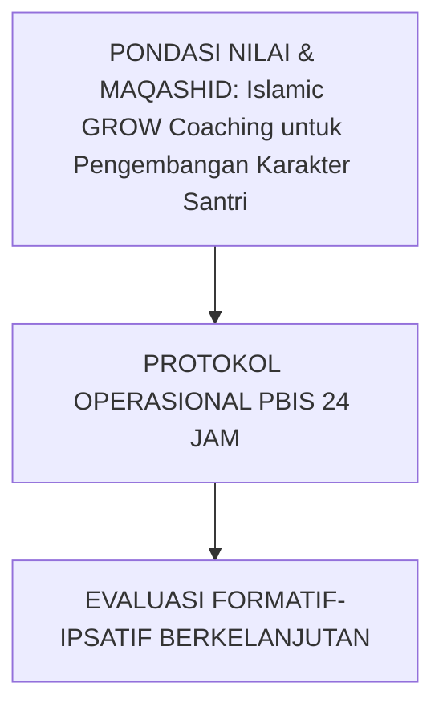

---

### Protokol Aksi Operasional Berjenjang

1. **Langkah Preventif Universal (Tahap Persiapan)**: Pengkondisian sarana, sosialisasi SOP, dan pembiasaan keteladanan *Qudwah Hasanah*.
2. **Langkah Eksekusi Lapangan (Tahap Berjalan)**: Pendampingan lekat oleh musyrif asrama dan wali kelas dengan prinsip *Firm & Kind*.
3. **Langkah Refleksi & Restorasi (Tahap Evaluasi)**: Pencatatan pada logbook digital dan penanganan kendala melalui dialog restoratif.


---


# SUB-BAB 5.3: PROGRAM EKSPEDISI KHIDMAH DESA BINAAN PESANTREN
## *Kajian Mendalam & Panduan Implementatif Ekosistem TUMBUH Pesantren*

**Kode Klasifikasi**: `BOOK-05/BAB-05/SUB-03/MONOGRAF-MASTER-VIBRANT`  
**Disiplin Ilmu**: Metodologi Pendidikan Islam, Sains Perilaku Terapan, & Tata Kelola Pesantren  
**Penanggung Jawab Keilmuan**: Dewan Pakar Ekosistem TUMBUH (*24 Bidang Kepakaran*)

---

### Eksplanasi Teoretis & Urgensi Praksis

Pendidikan karakter yang efektif dalam Sistem TUMBUH membutuhkan kejelasan operasional pada aspek **Program Ekspedisi Khidmah Desa Binaan Pesantren**. Naskah ini menguraikan landasan filosofis Turats, bukti empiris sains perilaku, dan protokol implementasi lapangan 24 jam.

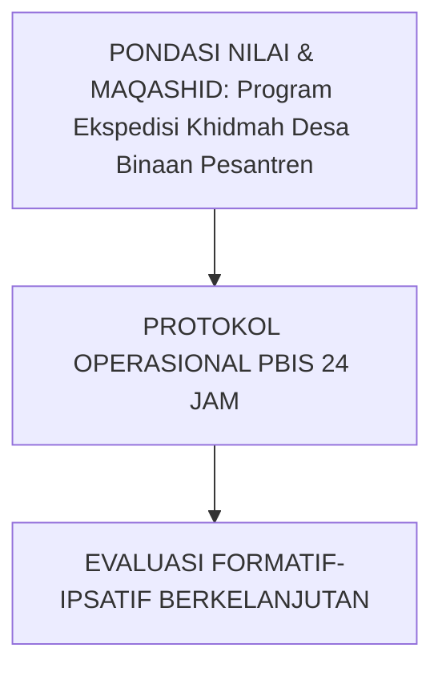

---

### Protokol Aksi Operasional Berjenjang

1. **Langkah Preventif Universal (Tahap Persiapan)**: Pengkondisian sarana, sosialisasi SOP, dan pembiasaan keteladanan *Qudwah Hasanah*.
2. **Langkah Eksekusi Lapangan (Tahap Berjalan)**: Pendampingan lekat oleh musyrif asrama dan wali kelas dengan prinsip *Firm & Kind*.
3. **Langkah Refleksi & Restorasi (Tahap Evaluasi)**: Pencatatan pada logbook digital dan penanganan kendala melalui dialog restoratif.


---


# SUB-BAB 5.4: SISTEM PEMBIASAAN HABIT LOOP 66 HARI TERSTRUKTUR
## *Kajian Mendalam & Panduan Implementatif Ekosistem TUMBUH Pesantren*

**Kode Klasifikasi**: `BOOK-05/BAB-05/SUB-04/MONOGRAF-MASTER-VIBRANT`  
**Disiplin Ilmu**: Metodologi Pendidikan Islam, Sains Perilaku Terapan, & Tata Kelola Pesantren  
**Penanggung Jawab Keilmuan**: Dewan Pakar Ekosistem TUMBUH (*24 Bidang Kepakaran*)

---

### Eksplanasi Teoretis & Urgensi Praksis

Pendidikan karakter yang efektif dalam Sistem TUMBUH membutuhkan kejelasan operasional pada aspek **Sistem Pembiasaan Habit Loop 66 Hari Terstruktur**. Naskah ini menguraikan landasan filosofis Turats, bukti empiris sains perilaku, dan protokol implementasi lapangan 24 jam.

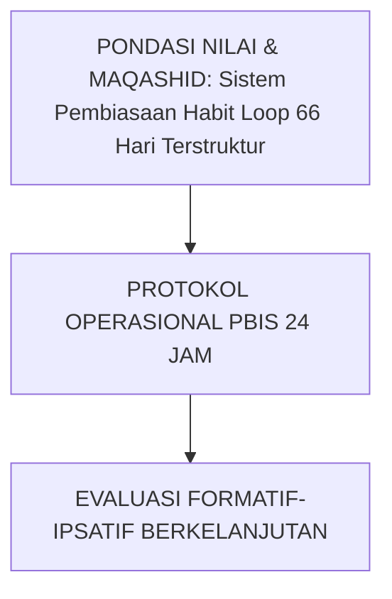

---

### Protokol Aksi Operasional Berjenjang

1. **Langkah Preventif Universal (Tahap Persiapan)**: Pengkondisian sarana, sosialisasi SOP, dan pembiasaan keteladanan *Qudwah Hasanah*.
2. **Langkah Eksekusi Lapangan (Tahap Berjalan)**: Pendampingan lekat oleh musyrif asrama dan wali kelas dengan prinsip *Firm & Kind*.
3. **Langkah Refleksi & Restorasi (Tahap Evaluasi)**: Pencatatan pada logbook digital dan penanganan kendala melalui dialog restoratif.


---


# SUB-BAB 5.5: RIHLAH TADABBUR ALAM & OUTBOUND PENGUATAN KARAKTER
## *Kajian Mendalam & Panduan Implementatif Ekosistem TUMBUH Pesantren*

**Kode Klasifikasi**: `BOOK-05/BAB-05/SUB-05/MONOGRAF-MASTER-VIBRANT`  
**Disiplin Ilmu**: Metodologi Pendidikan Islam, Sains Perilaku Terapan, & Tata Kelola Pesantren  
**Penanggung Jawab Keilmuan**: Dewan Pakar Ekosistem TUMBUH (*24 Bidang Kepakaran*)

---

### Eksplanasi Teoretis & Urgensi Praksis

Pendidikan karakter yang efektif dalam Sistem TUMBUH membutuhkan kejelasan operasional pada aspek **Rihlah Tadabbur Alam & Outbound Penguatan Karakter**. Naskah ini menguraikan landasan filosofis Turats, bukti empiris sains perilaku, dan protokol implementasi lapangan 24 jam.

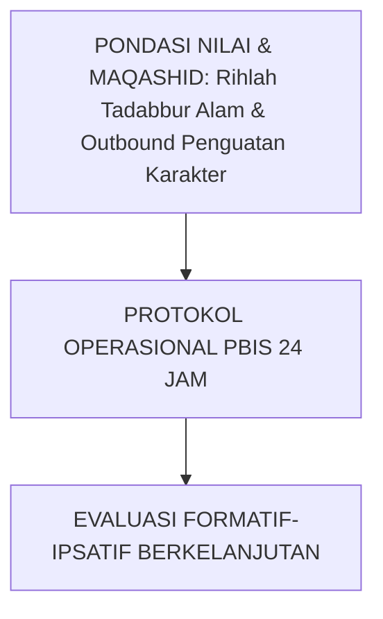

---

### Protokol Aksi Operasional Berjenjang

1. **Langkah Preventif Universal (Tahap Persiapan)**: Pengkondisian sarana, sosialisasi SOP, dan pembiasaan keteladanan *Qudwah Hasanah*.
2. **Langkah Eksekusi Lapangan (Tahap Berjalan)**: Pendampingan lekat oleh musyrif asrama dan wali kelas dengan prinsip *Firm & Kind*.
3. **Langkah Refleksi & Restorasi (Tahap Evaluasi)**: Pencatatan pada logbook digital dan penanganan kendala melalui dialog restoratif.


---


# SUB-BAB 6.1: KATALOG LENGKAP INSTRUMEN & ARSITEKTUR DIGITAL
## *Dokumentasi Formulir FBA, BIP, Kartu CICO, Logbook Mobile App, dan Portal Kemitraan Orang Tua*

**Kode Klasifikasi**: `BOOK-05/BAB-06/SUB-01/MONOGRAF-MASTER-VIBRANT`  
**Disiplin Ilmu**: Katalogisasi Instrumen Operasional, Software Architecture, & Database Schema  
**Penanggung Jawab Keilmuan**: Dewan Pakar Ekosistem TUMBUH (*Pakar Arsitektur Digital & Pakar Instrumen*)

---

### Ekosistem Perangkat Kerja Siap Pakai

Volume 05 menyajikan katalog lengkap instrumen operasional:
* **Formulir Asesmen**: Rubrik 10 Muwashafat, Form FBA A-B-C Logging, dan Form BIP Restoratif.
* **Formulir Intervensi**: Kartu CICO Harian Tier 2 dan Lembar Kesepakatan Ishlah al-Bain.
* **Aplikasi Digital**: Spesifikasi teknis *Musyrif Logbook App* dan *Parent Portal App* berbasis SQLite/PostgreSQL dengan enkripsi data pribadi santri.


---


# SUB-BAB 6.2: TEMPLAT FORMULIR FBA, BIP, & KARTU CICO TIER 2
## *Kajian Mendalam & Panduan Implementatif Ekosistem TUMBUH Pesantren*

**Kode Klasifikasi**: `BOOK-05/BAB-06/SUB-02/MONOGRAF-MASTER-VIBRANT`  
**Disiplin Ilmu**: Metodologi Pendidikan Islam, Sains Perilaku Terapan, & Tata Kelola Pesantren  
**Penanggung Jawab Keilmuan**: Dewan Pakar Ekosistem TUMBUH (*24 Bidang Kepakaran*)

---

### Eksplanasi Teoretis & Urgensi Praksis

Pendidikan karakter yang efektif dalam Sistem TUMBUH membutuhkan kejelasan operasional pada aspek **Templat Formulir FBA, BIP, & Kartu CICO Tier 2**. Naskah ini menguraikan landasan filosofis Turats, bukti empiris sains perilaku, dan protokol implementasi lapangan 24 jam.

```mermaid
graph TD
    Tujuan["PONDASI NILAI & MAQASHID: Templat Formulir FBA, BIP, & Kartu CICO Tier 2"] --> Operasional["PROTOKOL OPERASIONAL PBIS 24 JAM"]
    Operasional --> Evaluasi["EVALUASI FORMATIF-IPSATIF BERKELANJUTAN"]
```

---

### Protokol Aksi Operasional Berjenjang

1. **Langkah Preventif Universal (Tahap Persiapan)**: Pengkondisian sarana, sosialisasi SOP, dan pembiasaan keteladanan *Qudwah Hasanah*.
2. **Langkah Eksekusi Lapangan (Tahap Berjalan)**: Pendampingan lekat oleh musyrif asrama dan wali kelas dengan prinsip *Firm & Kind*.
3. **Langkah Refleksi & Restorasi (Tahap Evaluasi)**: Pencatatan pada logbook digital dan penanganan kendala melalui dialog restoratif.


---


# SUB-BAB 6.3: LEMBAR OBSERVASI PERILAKU & NOTULENSI SIDANG ISHLAH
## *Kajian Mendalam & Panduan Implementatif Ekosistem TUMBUH Pesantren*

**Kode Klasifikasi**: `BOOK-05/BAB-06/SUB-03/MONOGRAF-MASTER-VIBRANT`  
**Disiplin Ilmu**: Metodologi Pendidikan Islam, Sains Perilaku Terapan, & Tata Kelola Pesantren  
**Penanggung Jawab Keilmuan**: Dewan Pakar Ekosistem TUMBUH (*24 Bidang Kepakaran*)

---

### Eksplanasi Teoretis & Urgensi Praksis

Pendidikan karakter yang efektif dalam Sistem TUMBUH membutuhkan kejelasan operasional pada aspek **Lembar Observasi Perilaku & Notulensi Sidang Ishlah**. Naskah ini menguraikan landasan filosofis Turats, bukti empiris sains perilaku, dan protokol implementasi lapangan 24 jam.

```mermaid
graph TD
    Tujuan["PONDASI NILAI & MAQASHID: Lembar Observasi Perilaku & Notulensi Sidang Ishlah"] --> Operasional["PROTOKOL OPERASIONAL PBIS 24 JAM"]
    Operasional --> Evaluasi["EVALUASI FORMATIF-IPSATIF BERKELANJUTAN"]
```

---

### Protokol Aksi Operasional Berjenjang

1. **Langkah Preventif Universal (Tahap Persiapan)**: Pengkondisian sarana, sosialisasi SOP, dan pembiasaan keteladanan *Qudwah Hasanah*.
2. **Langkah Eksekusi Lapangan (Tahap Berjalan)**: Pendampingan lekat oleh musyrif asrama dan wali kelas dengan prinsip *Firm & Kind*.
3. **Langkah Refleksi & Restorasi (Tahap Evaluasi)**: Pencatatan pada logbook digital dan penanganan kendala melalui dialog restoratif.


---


# SUB-BAB 6.4: SPESIFIKASI TEKNIS MUSYRIF MOBILE LOGBOOK APP
## *Kajian Mendalam & Panduan Implementatif Ekosistem TUMBUH Pesantren*

**Kode Klasifikasi**: `BOOK-05/BAB-06/SUB-04/MONOGRAF-MASTER-VIBRANT`  
**Disiplin Ilmu**: Metodologi Pendidikan Islam, Sains Perilaku Terapan, & Tata Kelola Pesantren  
**Penanggung Jawab Keilmuan**: Dewan Pakar Ekosistem TUMBUH (*24 Bidang Kepakaran*)

---

### Eksplanasi Teoretis & Urgensi Praksis

Pendidikan karakter yang efektif dalam Sistem TUMBUH membutuhkan kejelasan operasional pada aspek **Spesifikasi Teknis Musyrif Mobile Logbook App**. Naskah ini menguraikan landasan filosofis Turats, bukti empiris sains perilaku, dan protokol implementasi lapangan 24 jam.

```mermaid
graph TD
    Tujuan["PONDASI NILAI & MAQASHID: Spesifikasi Teknis Musyrif Mobile Logbook App"] --> Operasional["PROTOKOL OPERASIONAL PBIS 24 JAM"]
    Operasional --> Evaluasi["EVALUASI FORMATIF-IPSATIF BERKELANJUTAN"]
```

---

### Protokol Aksi Operasional Berjenjang

1. **Langkah Preventif Universal (Tahap Persiapan)**: Pengkondisian sarana, sosialisasi SOP, dan pembiasaan keteladanan *Qudwah Hasanah*.
2. **Langkah Eksekusi Lapangan (Tahap Berjalan)**: Pendampingan lekat oleh musyrif asrama dan wali kelas dengan prinsip *Firm & Kind*.
3. **Langkah Refleksi & Restorasi (Tahap Evaluasi)**: Pencatatan pada logbook digital dan penanganan kendala melalui dialog restoratif.


---


# SUB-BAB 6.5: PANDUAN IMPLEMENTASI BERTAHAP (ROLLOUT ROADMAP 1 TAHUN)
## *Kajian Mendalam & Panduan Implementatif Ekosistem TUMBUH Pesantren*

**Kode Klasifikasi**: `BOOK-05/BAB-06/SUB-05/MONOGRAF-MASTER-VIBRANT`  
**Disiplin Ilmu**: Metodologi Pendidikan Islam, Sains Perilaku Terapan, & Tata Kelola Pesantren  
**Penanggung Jawab Keilmuan**: Dewan Pakar Ekosistem TUMBUH (*24 Bidang Kepakaran*)

---

### Eksplanasi Teoretis & Urgensi Praksis

Pendidikan karakter yang efektif dalam Sistem TUMBUH membutuhkan kejelasan operasional pada aspek **Panduan Implementasi Bertahap (Rollout Roadmap 1 Tahun)**. Naskah ini menguraikan landasan filosofis Turats, bukti empiris sains perilaku, dan protokol implementasi lapangan 24 jam.

```mermaid
graph TD
    Tujuan["PONDASI NILAI & MAQASHID: Panduan Implementasi Bertahap (Rollout Roadmap 1 Tahun)"] --> Operasional["PROTOKOL OPERASIONAL PBIS 24 JAM"]
    Operasional --> Evaluasi["EVALUASI FORMATIF-IPSATIF BERKELANJUTAN"]
```

---

### Protokol Aksi Operasional Berjenjang

1. **Langkah Preventif Universal (Tahap Persiapan)**: Pengkondisian sarana, sosialisasi SOP, dan pembiasaan keteladanan *Qudwah Hasanah*.
2. **Langkah Eksekusi Lapangan (Tahap Berjalan)**: Pendampingan lekat oleh musyrif asrama dan wali kelas dengan prinsip *Firm & Kind*.
3. **Langkah Refleksi & Restorasi (Tahap Evaluasi)**: Pencatatan pada logbook digital dan penanganan kendala melalui dialog restoratif.


---


# DAFTAR PUSTAKA LENGKAP BUKU VOLUME 05
## *Rujukan Standar APA 7th Edition & Turats Klasik Tata Kelola & SOP Pesantren*

1. **Al-Mawardi, Abu Al-Hasan Ali bin Muhammad.** (2006). *Al-Ahkam As-Sulthaniyyah wal Wilayat Ad-Diniyyah*. Kairo: Dar Al-Hadits.
2. **Ibnu Jama'ah, Badruddin.** (2012). *Tadzkirat as-Sami' wal Mutakallim fi Adab al-'Alim wal Muta'allim*. Beirut: Dar Al-Basyair Al-Islamiyyah.
3. **Leithwood, K., & Jantzi, D.** (2006). *Transformational school leadership for large-scale reform: Effects on students, teachers, and their classroom practices*. *School Effectiveness and School Improvement*, 17(2), 201–227.
4. **Maslach, C., & Leiter, M. P.** (2016). *Understanding the burnout experience: Recent research and its implications for psychiatry*. *World Psychiatry*, 15(2), 103–111.
5. **Nelsen, J.** (2006). *Positive Discipline in the Classroom*. New York: Three Rivers Press.
6. **Sugai, G., & Horner, R. H.** (2020). *School-Wide Positive Behavioral Interventions and Supports: Implementation Blueprint*. Eugene: Center on PBIS.
7. **World Health Organization.** (2020). *Preventing violence through schools: A guide for school-wide approaches*. Geneva: WHO Press.

