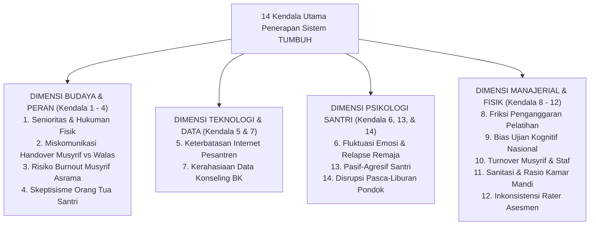

# NASKAH KAJIAN AKADEMIS: ANALISIS KENDALA PENERAPAN SISTEM TUMBUH DAN STRATEGI MITIGASI OPERASIONAL LAPANGAN
## Evaluasi Komprehensif: 14 Obstacles Penerapan, Analisis Penyebab Akar, Protokol Mitigasi Restoratif, dan Contingency Plans di Pesantren

**Dewan Riset & Keilmuan Ekosistem TUMBUH**  
*Dipublikasikan sebagai Naskah Kajian Kebijakan Operasional Pesantren*  
*Dokumen Rujukan Induk: Domain 01 s/d Domain 11, AGENTS.md, & SIMULASI/*

---

## ABSTRAK

> **Latar Belakang**: Transformasi sistem pendidikan pesantren dari model konvensional-koersif menuju **Ekosistem TUMBUH** (*SW-PBIS Multi-Tier, CASEL SEL, Restorative Justice, & Dual-Pillar Caretaking*) berhadapan dengan kompleksitas lapangan. Tanpa pemetaan 14 kendala operasional yang jujur dan presisi, penerapan sistem berisiko mengalami resistensi, miskomunikasi peran, disrupsi finansial, hingga *burnout* staf.
>
> **Tujuan Penelitian**: Menganalisis secara ilmiah **14 Kendala Utama Penerapan Ekosistem TUMBUH di Pesantren**, membedah akar penyebab (*Root Cause Analysis*), dan merumuskan protokol mitigasi operasional yang dapat dieksekusi secara instan oleh pimpinan lembaga.
>
> **Hasil Riset**: Terstruktur 14 kendala komprehensif yang mencakup dimensi budaya, peran pendidik, kesehatan mental staf, keterlibatan orang tua, teknologi, psikologi santri, legalitas data, finansial, asesmen, infrastruktur sanitasi, konsistensi rater, pasif-agresif, dan pembiasaan pasca-liburan.
>
> **Kata Kunci**: *14 Implementation Obstacles, Root Cause Analysis, Risk Mitigation, Dual-Pillar Caretaking, Offline-First Architecture, Restorative Justice, Post-Holiday Relapse.*

---

## 1. PENDAHULUAN & PARADIGMA BEDAH KENDALA

Penerapan ekosistem pembinaan modern di lingkungan pesantren memerlukan kesiapan manajemen risiko (*Risk Management Framework*). Setiap perubahan budaya selalu memicu hambatan psikologis, struktural, finansial, dan teknologis.

---

## 2. BEDAH DETIL 14 KENDALA UTAMA & SOLUSI MITIGASI OPERASIONAL

---

### 🛑 KENDALA 1: RESISTENSI BUDAYA SENIORITAS & TRADISI HUKUMAN FISIK
* **Gejala Lapangan**: Oknum pengurus senior/pembina lama menolak pendekatan restoratif (*Firm & Kind*), merasa bentakan/hukuman fisik lebih instan membuat santri takut.
* **Akar Penyebab**: Mitos sejarah pengasuhan (*hereditary trauma*) dan ketiadaan pemahaman mengenai efektivitas jangka panjang PBIS & CASEL SEL.
* **Solusi Mitigasi**: Penandatanganan **Pakta Integritas Zero Violence**, pelatihan wajib *Musyrif Academy*, & sanksi tegas dekualifikasi jabatan (*AGENTS.md*).

---

### 🛑 KENDALA 2: MISKOMUNIKASI HANDOVER MUSYRIF ASRAMA VS WALI KELAS (WALAS)
* **Gejala Lapangan**: Tumpang tindih wewenang atau santri yang melanggar di kelas tidak terlaporkan ke asrama, dan sebaliknya.
* **Akar Penyebab**: Persepsi lama bahwa pengasuhan adalah tugas Musyrif semata, sementara Walas hanya mengajar jam KBM.
* **Solusi Mitigasi**: Penegasan **Konsep Dual-Pillar Pengasuhan** (Musyrif: Kamar 15.00-07.00; Walas: Kelas 07.00-15.00) & sinkronisasi data 2-kali sehari via *Logbook Mobile App*.

---

### 🛑 KENDALA 3: RISIKO BURNOUT MUSYRIF ASRAMA AKIBAT BEBAN KERJA NONSTOP
* **Gejala Lapangan**: Musyrif mengalami kelelahan emosional, emosi cepat tersulut, atau apatis terhadap pelanggaran santri.
* **Akar Penyebab**: Musyrif dipaksa berada di asrama 24 jam tanpa pembagian shift kerja yang jelas.
* **Solusi Mitigasi**: Penerapan **SOP 3-Shift Kerja Musyrif** & perlindungan mutlak **Uninterrupted Rest Hours (22.00 - 04.00)**.

---

### 🛑 KENDALA 4: VARIASI SIKAP & SKEPTISISME ORANG TUA SANTRI
* **Gejala Lapangan**: Sebagian orang tua bersikap pasif (menyerahkan bulat-bulat anak) atau terlalu protektif saat diberi laporan PBIS.
* **Akar Penyebab**: Ketiadaan pemahaman mengenai prinsip pengasuhan terpadu dan orientasi pelaporan yang dulu hanya berbasis nilai kognitif.
* **Solusi Mitigasi**: Penyelenggaraan **Sekolah Orang Tua Hybrid (Majlis Parenting)** & pelaporan berkala via *Parent Portal Mobile App*.

---

### 🛑 KENDALA 5: KETERBATASAN INFRASTRUKTUR DIGITAL & SINYAL INTERNET PESANTREN
* **Gejala Lapangan**: Aplikasi *Logbook Musyrif* terhambat karena koneksi internet pesantren di daerah terpencil sering putus.
* **Akar Penyebab**: Jaringan telekomunikasi pedesaan yang belum stabil.
* **Solusi Mitigasi**: Arsitektur aplikasi berbasis **Offline-First SQLite Syncing** (data tersimpan lokal & otomatis sinkron saat ada sinyal).

---

### 🛑 KENDALA 6: FLUKTUASI EMOSI SANTRI REMAJA & RELAPSE PERILAKU
* **Gejala Lapangan**: Santri Tier 1 tiba-tiba mengalami *relapse* (kembali melanggar) akibat pengaruh teman sebaya.
* **Akar Penyebab**: Dinamika neurosains remaja (*limbic system imbalance*) dan tekanan teman sebaya (*peer pressure*).
* **Solusi Mitigasi**: Pelaksanaan **Restorative Chat 5-Pertanyaan**, aktivasi **Re-Entry Protocol**, & pendampingan *Peer Buddy T4*.

---

### 🛑 KENDALA 7: ISU KERAHASIAAN DATA KONSELING BK & LEGALITAS
* **Gejala Lapangan**: Catatan kasus khusus santri Tier 3 tersebar di antara santri/pengurus, memicu stigma sosial.
* **Akar Penyebab**: Ketiadaan SOP kerahasiaan data BK dan manajemen hak akses aplikasi.
* **Solusi Mitigasi**: Implementasi **Pengamanan Siber AES-256 Encryption** & *Role-Based Access Control (RBAC)* kaku.

---

### 🛑 KENDALA 8: FRIKSI PENGANGGARAN & ALOKASI FINANSIAL PELATIHAN
* **Gejala Lapangan**: Pengelola keuangan menunda alokasi anggaran pelatihan Musyrif Academy atau biaya perawatan server aplikasi digital.
* **Akar Penyebab**: Anggaran pesantren konvensional lebih berfokus pada pembangunan fisik daripada peningkatan kapasitas SDM & sistem.
* **Solusi Mitigasi**: Penetapan **Alokasi Mutlak 5% Anggaran Operasional** khusus untuk *Staff Professional Development* & *Digital Infrastructure Maintenance*.

---

### 🛑 KENDALA 9: DOMINASI UJIAN KOGNITIF NASIONAL VS ASESMEN KARAKTER IPSATIF
* **Gejala Lapangan**: Guru & santri mengabaikan target pembiasaan adab saat mendekati Ujian Nasional / Ujian Madrasah karena tertekan target kelulusan kognitif.
* **Akar Penyebab**: *Exam-Oriented Bias* dalam sistem pendidikan nasional.
* **Solusi Mitigasi**: Integrasi **Transkrip Karakter PBIS** sebagai *Syarat Kelulusan Syahadah Pesantren* sejajar dengan Ijazah Formal.

---

### 🛑 KENDALA 10: TURNOVER MUSYRIF & STAF PENDIDIK TINGGI (STAFF ATTRITION)
* **Gejala Lapangan**: Musyrif yang telah terlatih resign setelah 1–2 tahun, memaksa lembaga melatih Musyrif baru dari nol.
* **Akar Penyebab**: Ketiadaan jenjang karir yang jelas dan insentif kesejahteraan yang kurang memadai.
* **Solusi Mitigasi**: Penetapan **Jenjang Karir Musyrif** (Tahap 8 Pelaksana $\to$ Tahap 9 Pembina) & insentif tunjangan kinerja berbasis data *Logbook App*.

---

### 🛑 KENDALA 11: BOTTLENECK FASILITAS FISIK, SANITASI, & RASIO KAMAR MANDI ASRAMA
* **Gejala Lapangan**: Santri terlambat sholat Subuh atau KBM karena mengantre kamar mandi yang terbatas.
* **Akar Penyebab**: Ketidakseimbangan rasio sanitasi (misal: 1 kamar mandi untuk 20 santri).
* **Solusi Mitigasi**: Standarisasi **Rasio Ideal Sanitasi Asrama (1 : 7 Santri)** & penjadwalan *Staggered Morning Routine*.

---

### 🛑 KENDALA 12: INKONSISTENSI ASESMEN KARAKTER ANTAR-MUSYRIF (INTER-RATER INCONSISTENCY)
* **Gejala Lapangan**: Musyrif A memberi poin apresiasi pemurah, sedangkan Musyrif B sangat kaku dan pelit poin untuk perilaku yang sama.
* **Akar Penyebab**: Perbedaan subjektivitas dan pemahaman rubrik penilaian Muwashafat.
* **Solusi Mitigasi**: Penyelenggaraan **Rater Calibration Workshop** berkala setiap bulan dengan menghitung koefisien inter-rater reliability.

---

### 🛑 KENDALA 13: PEMBANGKANGAN PASIF-AGRESIF SANTRI (PASSIVE-AGGRESSIVE NON-COMPLIANCE)
* **Gejala Lapangan**: Santri pura-pura patuh di depan Musyrif, tetapi secara diam-diam melanggar aturan saat pengawasan lengah.
* **Akar Penyebab**: Kepatuhan karena takut (*compliance under duress*), belum mencapai taraf *Tangga T3 Internalisasi*.
* **Solusi Mitigasi**: Penerapan **Autonomous Motivation (Self-Determination Theory)** via *Jurnal Refleksi Malam 3-Q* & dialog empati 1-on-1.

---

### 🛑 KENDALA 14: DISRUPSI PEMBIASAAN ADAB PASCA-LIBURAN PONDOK (POST-HOLIDAY RELAPSE)
* **Gejala Lapangan**: Setelah libur panjang rumah, santri kembali ke asrama dengan penurunan kedisiplinan (bangun terlambat, gadget terbiasa lama).
* **Akar Penyebab**: *Habit Loop* di rumah tidak selaras dengan *Bi'ah Shalihah* pesantren.
* **Solusi Mitigasi**: Penerapan **Paspor Adab Rumah (Home Habit Passport 66-Hari)** selama liburan & *Pekan Re-Alignment Adab* pada minggu pertama kembali ke pondok.

---

## 3. KESIMPULAN

Pemetaan 14 Kendala Utama dan Solusi Mitigasi Operasional ini menjamin bahwa **Ekosistem TUMBUH** memiliki ketahanan sistemik (*systemic resilience*) tinggi dan siap diterapkan pada berbagai kondisi pesantren.

---

## 4. DAFTAR PUSTAKA
* Edmondson, A. C. (2018). *The Fearless Organization*. John Wiley & Sons.
* Horner, R. H., & Sugai, G. (2015). School-wide PBIS. *Behavior Analysis in Practice*, 8(1), 80–85.
* Zehr, H. (2002). *The Little Book of Restorative Justice*. Good Books.
