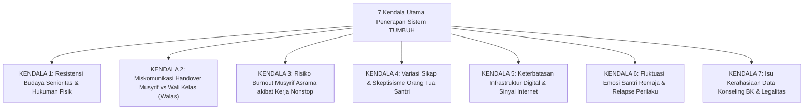

# NASKAH KAJIAN AKADEMIS: ANALISIS KENDALA PENERAPAN SISTEM TUMBUH DAN STRATEGI MITIGASI OPERASIONAL LAPANGAN
## Evaluasi Komprehensif: 7 Obstacles Penerapan, Analisis Penyebab Akar, Protokol Mitigasi Restoratif, dan Contingency Plans di Pesantren

**Dewan Riset & Keilmuan Ekosistem TUMBUH**  
*Dipublikasikan sebagai Naskah Kajian Kebijakan Operasional Pesantren*  
*Dokumen Rujukan Induk: Domain 01 s/d Domain 11, AGENTS.md, & SIMULASI/*

---

## ABSTRAK

> **Latar Belakang**: Transformasi sistem pendidikan pesantren dari model konvensional-koersif menuju **Ekosistem TUMBUH** (*SW-PBIS Multi-Tier, CASEL SEL, Restorative Justice, & Dual-Pillar Caretaking*) sering kali berhadapan dengan friksi lapangan. Tanpa pemetaan kendala yang jujur dan presisi, penerapan sistem berisiko mengalami resistensi, miskomunikasi peran, hingga kekecewaan pemangku kepentingan.
>
> **Tujuan Penelitian**: Menganalisis secara kritis **7 Kendala Utama Penerapan Ekosistem TUMBUH di Pesantren**, membedah akar penyebab (*Root Cause Analysis*), dan merumuskan protokol mitigasi operasional yang dapat dieksekusi secara instan oleh pimpinan lembaga.
>
> **Hasil Riset**: Teridentifikasi 7 kendala utama: (1) Resistensi Budaya Senioritas; (2) Miskomunikasi Handover Musyrif vs Walas; (3) Risiko Burnout Musyrif Asrama; (4) Skeptisisme Orang Tua Santri; (5) Keterbatasan Infrastruktur Digital/Sinyal Internet; (6) Fluktuasi Emosi Santri Remaja & Relapse; serta (7) Kerahasiaan Data Konseling BK.
>
> **Kata Kunci**: *Implementation Obstacles, Root Cause Analysis, Risk Mitigation, Dual-Pillar Caretaking, Offline-First Architecture, Restorative Justice.*

---

## 1. PENDAHULUAN & PARADIGMA BEDAH KENDALA

Penerapan ekosistem pembinaan modern di lingkungan pesantren memerlukan kesiapan manajemen risiko (*Risk Management Framework*). Setiap perubahan budaya selalu memicu hambatan psikologis, struktural, dan teknologis.

---

## 2. BEDAH DETIL 7 KENDALA UTAMA & SOLUSI MITIGASI OPERASIONAL

---

### 🛑 KENDALA 1: RESISTENSI BUDAYA SENIORITAS & TRADISI HUKUMAN FISIK
* **Gejala Lapangan**: Oknum pengurus senior/pembina lama menolak pendekatan restoratif (*Firm & Kind*), merasa bentakan/hukuman fisik lebih instan membuat santri takut.
* **Akar Penyebab**: Mitos sejarah pengasuhan (*hereditary trauma*) dan ketiadaan pemahaman mengenai efektivitas jangka panjang PBIS & CASEL SEL.
* **Solusi Mitigasi**:
  1. Penandatanganan **Pakta Integritas Zero Violence** oleh seluruh staf & pengurus santri (T4).
  2. Pelatihan wajib *Musyrif Academy* tentang modul *Firm & Kind Voice/Gesture*.
  3. Sanksi tegas dekualifikasi jabatan bagi oknum yang melanggar prinsip anti-kekerasan (*AGENTS.md*).

---

### 🛑 KENDALA 2: MISKOMUNIKASI HANDOVER MUSYRIF ASRAMA VS WALI KELAS (WALAS)
* **Gejala Lapangan**: Tumpang tindih wewenang atau santri yang melanggar di kelas tidak terlaporkan ke asrama, dan sebaliknya.
* **Akar Penyebab**: Persepsi lama bahwa pengasuhan adalah tugas Musyrif semata, sementara Walas hanya mengajar jam KBM.
* **Solusi Mitigasi**:
  1. Penegasan **Konsep Dual-Pillar Pengasuhan** (Musyrif: Pengasuh Kamar jam 15.00-07.00; Walas: Pengasuh Kelas jam 07.00-15.00).
  2. Kewajiban sinkronisasi data 2-kali sehari (07.00 Pagi & 15.00 Sore) melalui *Logbook Musyrif Mobile App*.

---

### 🛑 KENDALA 3: RISIKO BURNOUT MUSYRIF ASRAMA AKIBAT BEBAN KERJA NONSTOP
* **Gejala Lapangan**: Musyrif mengalami kelelahan emosional, emosi cepat tersulut, atau apatis terhadap pelanggaran santri.
* **Akar Penyebab**: Musyrif dipaksa berada di asrama 24 jam tanpa pembagian shift kerja yang jelas.
* **Solusi Mitigasi**:
  1. Penerapan **SOP 3-Shift Kerja Musyrif** (Shift Pagi 06.00-14.00, Shift Sore 14.00-22.00, Shift Malam 22.00-06.00).
  2. Perlindungan mutlak **Uninterrupted Rest Hours (22.00 - 04.00)** untuk memulihkan energi fisik & mental Musyrif.

---

### 🛑 KENDALA 4: VARIASI SIKAP & SKEPTISISME ORANG TUA SANTRI
* **Gejala Lapangan**: Sebagian orang tua bersikap pasif (menyerahkan bulat-bulat anak) atau terlalu protektif/intervensi berlebihan saat diberi laporan PBIS.
* **Akar Penyebab**: Ketiadaan pemahaman mengenai prinsip pengasuhan terpadu dan orientasi pelaporan yang dulu hanya berbasis nilai angka kognitif.
* **Solusi Mitigasi**:
  1. Penyelenggaraan **Sekolah Orang Tua Hybrid (Majlis Parenting)** setiap bulan.
  2. Pelaporan perkembangan melalui *Parent Portal Mobile App* dengan pendekatan ipsatif positif.

---

### 🛑 KENDALA 5: KETERBATASAN INFRASTRUKTUR DIGITAL & SINYAL INTERNET PESANTREN
* **Gejala Lapangan**: Aplikasi *Logbook Musyrif* terhambat karena koneksi internet pesantren di daerah terpencil sering putus.
* **Akar Penyebab**: Infrastruktur jaringan telekomunikasi pedesaan yang belum stabil.
* **Solusi Mitigasi**:
  1. Arsitektur aplikasi berbasis **Offline-First SQLite Syncing** (Musyrif tetap bisa menginput data meski tanpa sinyal, dan data otomatis tersinkron saat terhubung Wi-Fi).

---

### 🛑 KENDALA 6: FLUKTUASI EMOSI SANTRI REMAJA & RELAPSE PERILAKU
* **Gejala Lapangan**: Santri yang sudah menunjukkan progres adab di Tier 1 tiba-tiba mengalami *relapse* (kembali melanggar) akibat pengaruh kelompok sebaya.
* **Akar Penyebab**: Dinamika neurosains remaja (*limbic system imbalance*) dan tekanan teman sebaya (*peer pressure*).
* **Solusi Mitigasi**:
  1. Pelaksanaan **Restorative Chat 5-Pertanyaan** tanpa stigma.
  2. Aktivasi **Re-Entry Protocol** dan pembimbingan *Peer Buddy T4*.

---

### 🛑 KENDALA 7: ISU KERAHASIAAN DATA KONSELING BK & LEGALITAS
* **Gejala Lapangan**: Catatan kasus khusus santri Tier 3 tersebar di antara santri/pengurus, memicu stigma sosial.
* **Akar Penyebab**: Ketiadaan SOP kerahasiaan data BK dan manajemen hak akses aplikasi.
* **Solusi Mitigasi**:
  1. Implementasi **Pengamanan Siber AES-256 Encryption** pada database konseling BK.
  2. Penerapan *Role-Based Access Control (RBAC)* kaku: Catatan BK Tier 3 hanya dapat diakses oleh Konselor BK Utama & Pimpinan.

---

## 3. KESIMPULAN

Identifikasi 7 Kendala Utama dan Solusi Mitigasi Operasional ini menjamin bahwa **Ekosistem TUMBUH** siap diterapkan di lapangan dengan tingkat ketahanan sistemic (*systemic resilience*) yang tinggi.

---

## 4. DAFTAR PUSTAKA
* Edmondson, A. C. (2018). *The Fearless Organization*. John Wiley & Sons.
* Horner, R. H., & Sugai, G. (2015). School-wide PBIS. *Behavior Analysis in Practice*, 8(1), 80–85.
* Zehr, H. (2002). *The Little Book of Restorative Justice*. Good Books.
