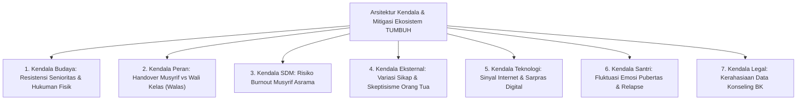

# KENDALA DAN MITIGASI: ANALISIS TANTANGAN OPERASIONAL LAPANGAN EKOSISTEM TUMBUH
## Kajian Komprehensif Obstacles, Risk Matrix, dan Standar Operasional Mitigasi Penerapan Sistem di Pesantren

Direktori ini memuat dokumen analisis riset mendalam mengenai **7 Kendala Utama Penerapan Ekosistem TUMBUH di Lapangan** beserta kerangka solusi mitigasi terintegrasi (*Risk Mitigation & Contingency Plans*).

---

## 🏛️ Arsitektur Kerangka Analisis Kendala & Mitigasi

---

## 📚 Indeks Dokumen Induk Kendala & Mitigasi

* 📄 **[Analisis-Kendala-Penerapan-Sistem-TUMBUH-dan-Mitigasi.md](./Analisis-Kendala-Penerapan-Sistem-TUMBUH-dan-Mitigasi.md)**: **Naskah Kajian Ilmiah Utuh 7 Kendala Utama & Strategi Mitigasinya**.
* 📊 **[Matriks-Mitigasi-Risiko-dan-SOP-Darurat.md](./Matriks-Mitigasi-Risiko-dan-SOP-Darurat.md)**: Matriks Level Risiko, Dampak, RACI, & SOP Contingency Plan Darurat.
