# KENDALA DAN MITIGASI: ANALISIS TANTANGAN OPERASIONAL LAPANGAN EKOSISTEM TUMBUH
## Kajian Komprehensif Taksonomi 6 Klaster Masalah Pesantren, 5 Kategori Master Kendala (14 Obstacles), Risk Matrix, dan Standar Operasional Mitigasi

Direktori ini memuat dokumen analisis riset mendalam mengenai **Taksonomi Komprehensif Permasalahan Pesantren** dan **14 Kendala Utama Penerapan Ekosistem TUMBUH di Lapangan** beserta kerangka solusi mitigasi terintegrasi (*Risk Mitigation & Contingency Plans*).

---

## 🏛️ Arsitektur Kerangka Analisis 14 Kendala & Mitigasi

```mermaid
graph TD
    ObstacleArch["Arsitektur 14 Kendala & Mitigasi Ekosistem TUMBUH"]
    ObstacleArch --> Culture["1. Budaya: Senioritas & Hukuman Fisik"]
    ObstacleArch --> Boundary["2. Peran: Handover Musyrif vs Wali Kelas (Walas)"]
    ObstacleArch --> Burnout["3. SDM: Risiko Burnout Musyrif Asrama"]
    ObstacleArch --> Parents["4. Eksternal: Variasi & Skeptisisme Orang Tua"]
    ObstacleArch --> Infra["5. Teknologi: Sinyal Internet & Offline Sync"]
    ObstacleArch --> Relapse["6. Santri: Fluktuasi Emosi & Relapse Remaja"]
    ObstacleArch --> Privacy["7. Legal: Kerahasiaan Data Konseling BK"]
    ObstacleArch --> Budget["8. Finansial: Friksi Penganggaran Pelatihan"]
    ObstacleArch --> Exam["9. Akademik: Bias Ujian Kognitif Nasional"]
    ObstacleArch --> Turnover["10. SDM: Turnover Musyrif & Staf Tinggi"]
    ObstacleArch --> Sanitation["11. Fisik: Bottleneck Rasio Kamar Mandi"]
    ObstacleArch --> Rater["12. Asesmen: Inkonsistensi Rater Musyrif"]
    ObstacleArch --> Passive["13. Santri: Pembangkangan Pasif-Agresif"]
    ObstacleArch --> Holiday["14. Transisi: Disrupsi Pasca-Liburan Pondok"]
```

---

## 📚 Indeks Dokumen Induk Kendala & Mitigasi

* 📜 **[Taksonomi-Komprehensif-Permasalahan-Pesantren-dan-Kategori-Kendala.md](./Taksonomi-Komprehensif-Permasalahan-Pesantren-dan-Kategori-Kendala.md)**: **Dokumen Master Taksonomi 6 Klaster Permasalahan Dunia Pesantren & Pengelompokan 5 Kategori Master Kendala System**.
* 📄 **[Analisis-Kendala-Penerapan-Sistem-TUMBUH-dan-Mitigasi.md](./Analisis-Kendala-Penerapan-Sistem-TUMBUH-dan-Mitigasi.md)**: Naskah Kajian Ilmiah Utuh 14 Kendala Utama dalam 5 Kategori Master & Strategi Mitigasinya.
* 📊 **[Matriks-Mitigasi-Risiko-dan-SOP-Darurat.md](./Matriks-Mitigasi-Risiko-dan-SOP-Darurat.md)**: Matriks Level Risiko, Dampak, RACI, & SOP Contingency Plan Darurat (14 Indikator).
