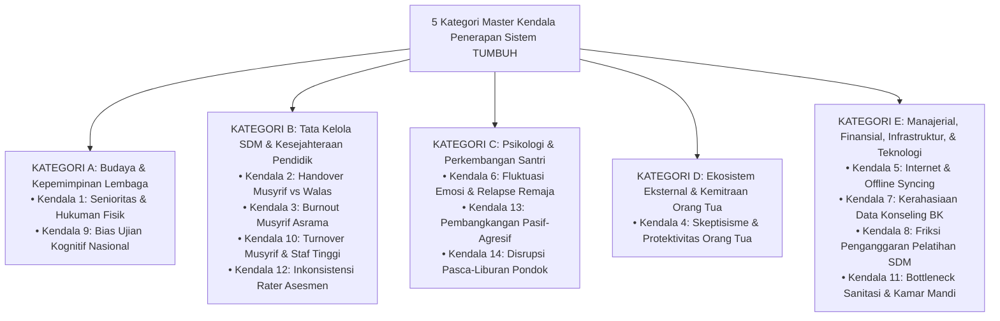
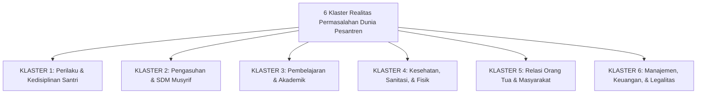

# DOKUMEN MASTER AKADEMIS: TAKSONOMI KOMPREHENSIF PERMASALAHAN PESANTREN DAN KATEGORISASI KENDALA SYSTEM
## Inventarisasi Utuh Realitas Masalah Pesantren, Pengelompokan 5 Kategori Master Kendala, dan Peta Solusi Mitigasi Ekosistem TUMBUH

**Dewan Riset & Keilmuan Ekosistem TUMBUH**  
*Dipublikasikan sebagai Dokumen Rujukan Induk Manajemen Risiko Pesantren*  
*Dokumen Rujukan Induk: KENDALA_DAN_MITIGASI/README.md & KENDALA_DAN_MITIGASI/Analisis-Kendala-Penerapan-Sistem-TUMBUH-dan-Mitigasi.md*

---

## ABSTRAK

> **Latar Belakang**: Pengelolaan lembaga pendidikan pesantren modern menghadapi lanskap tantangan yang multi-dimensional. Tanpa inventarisasi permasalahan yang utuh dan taksonomi pengelompokan yang presisi, pengelola pesantren sering kali hanya menangani gejala permukaan (*symptom masking*) tanpa menyentuh akar permasalahan sesungguhnya.
>
> **Tujuan Penelitian**: Menyusun **Taksonomi Komprehensif Seluruh Permasalahan Pesantren** yang terbagi dalam **6 Klaster Realitas Masalah Lapangan**, serta mengelompokkan 14 Kendala Penerapan Ekosistem ke dalam **5 Kategori Master Kendala Operasional**.
>
> **Hasil Riset**: Terkodifikasi 6 Klaster Masalah Lapangan (Perilaku Santri, SDM Pengasuhan, Akademik, Kesehatan/Sanitasi, Relasi Orang Tua, & Manajemen/Legalitas) dan 5 Kategori Master Kendala (Budaya Lembaga, Tata Kelola SDM, Psikologi Santri, Ekosistem Eksternal, & Manajerial/Teknologi).
>
> **Kata Kunci**: *Pesantren Problem Taxonomy, 6 Problem Clusters, 5 Master Obstacle Categories, SW-PBIS Multi-Tier, In Loco Parentis.*

---

## 1. PENGELOMPOKAN 5 KATEGORI MASTER KENDALA OPERASIONAL

---

## 2. INVENTARISASI KOMPREHENSIF SELURUH PERMASALAHAN PESANTREN (6 KLASTER REALITAS)

---

### 🚨 KLASTER 1: PERMASALAHAN PERILAKU & KEDISIPLINAN SANTRI
1. **Perpeloncoan & Senioritas Kaku**: Intimidasi fisik/mental dari santri senior kepada santri junior di kamar asrama.
2. **Perundungan (Bullying) & Eksklusi Sosial**: Pengucilan santri pendiam, pengejekan fisik (*body shaming*), atau pengelompokan geng.
3. **Penyalahgunaan Gadget Rahasia & Akses Konten Negatif**: Santri membawa HP ilegal secara tersembunyi dan mengonsumsi game/game judi/konten pornografi.
4. **Merokok & Pelanggaran Zat Terlarang**: Merokok tersembunyi di area titik rawan (*hotspots*) seperti kamar mandi belakang atau gudang.
5. **Kabur dari Asrama (Desersi Temporary)**: Santri melompati pagar asrama saat malam hari karena jenuh atau tergoda hiburan luar.
6. **Pencurian Barang Kamar (Ghasab & Theft)**: Kehilangan uang saku, pakaian, atau perlengkapan ibadah di kamar yang memicu kecurigaan.
7. **Bahasa Kasar & Pembangkangan Verbal**: Penggunaan kata-kata kotor, bentakan kepada pengurus, atau tidak patuh saat diajak sholat.
8. **Pelanggaran Batas Relasi (Ikhtilath)**: Surat-menyurat rahasia atau komunikasi tak berizin antar-santri putra dan putri.

---

### 🚨 KLASTER 2: PERMASALAHAN PENGASUHAN & SDM MUSYRIF
1. **Hukuman Fisik & Emosional Spontan**: Pengasuh yang lepas kendali emosi memberikan hukuman bentakan, lari malam, atau pukulan fisik.
2. **Kelelahan Fisik & Burnout Musyrif**: Musyrif bertugas 24 jam nonstop tanpa shift, memicu stres berat dan kecenderungan apatis.
3. **Perbedaan Standar Antar-Kamar (Inkonsistensi)**: Kamar A sangat kaku dan galak, sedangkan Kamar B sangat longgar dan serba boleh.
4. **Musyrif Merasa Kurang Diapresiasi**: Gaji/insentif Musyrif kecil dan tidak ada jenjang karir yang jelas di pesantren.
5. **Miskomunikasi Musyrif dengan Guru Madrasah**: Musyrif menyalahkan guru saat santri tidak disiplin, dan guru menyalahkan Musyrif.

---

### 🚨 KLASTER 3: PERMASALAHAN PEMBELAJARAN & AKADEMIK
1. **Keletihan Fisik Santri di Kelas Formal**: Santri mengantuk berat saat jam KBM madrasah karena kegiatan malam yang terlalu padat.
2. **Kebosanan Metode Hafalan Konvensional**: Santri merasa jenuh dengan metode setoran Al-Qur'an tanpa variasi atau *peer teaching*.
3. **Bentrok Jadwal Diniyyah vs KBM Formal**: Penumpukan tugas akademik madrasah bersamaan dengan target ujian kitab kuning/diniyyah.
4. **Kecemasan Ujian (Exam Anxiety)**: Ketakutan berlebihan santri menjelang Ujian Madrasah atau Tes Hafalan Tasmi'.

---

### 🚨 KLASTER 4: PERMASALAHAN KESEHATAN, SANITASI, & FISIK
1. **Wabah Penyakit Kulit (Scabies / Kudis)**: Penularan gatal-gatal kulit akibat penggunaan handuk/pakaian bersama (*ghasab*).
2. **Kondisi Kebersihan Kamar & Lemari Lembab**: Kamar asrama berantakan, baju menumpuk, dan ventilasi udara kurang sehat.
3. **Antrean Panjang Kamar Mandi Subuh**: Rasio kamar mandi tidak memadai (1 kamar mandi untuk 20 santri), memicu keterlambatan sholat.
4. **Gizi & Pola Makan Kurang Mutu**: Makanan asrama kurang bervariasi atau kurang gizi imunitas santri.
5. **Masalah Laundry & Kehilangan Pakaian**: Pakaian santri yang dicuci bersamaan sering tertukar atau hilang.

---

### 🚨 KLASTER 5: PERMASALAHAN RELASI ORANG TUA & MASYARAKAT
1. **Homesickness Kronis Santri Baru**: Santri terus menerus menangis meminta pulang pada 1-2 bulan pertama.
2. **Orang Tua Pasif & Lepas Tangan**: Orang tua menganggap tugas mendidik 100% adalah kewajiban pesantren tanpa mau membimbing di rumah.
3. **Orang Tua Protektif & Defensif Berlebihan**: Orang tua marah dan membela kesalahan anak saat diberi laporan disiplin PBIS.
4. **Rumor Negatif di Media Sosial**: Orang tua yang memposting keluhan internal pesantren ke media sosial sebelum tabayyun.

---

### 🚨 KLASTER 6: PERMASALAHAN MANAJEMEN, KEUANGAN, & LEGALITAS
1. **Defisit Operasional Pelatihan SDM**: Lembaga tidak memiliki alokasi anggaran khusus untuk peningkatan kapasitas Musyrif.
2. **High Staff Turnover (Turnover Musyrif Tinggi)**: Musyrif terbaik sering resign setelah 1-2 tahun untuk mencari pekerjaan lain.
3. **Kebocoran Data Rahasia Konseling BK**: Catatan trauma/pelanggaran santri tersebar di media sosial atau kalangan santri.
4. **Ketiadaan SOP Handling Darurat Krisis**: Lembaga bingung dan panik saat terjadi kecelakaan santri, bencana, atau krisis medis.

---

## 3. PETA SOLUSI INTEGRATIF EKOSISTEM TUMBUH

Seluruh 6 Klaster Permasalahan Pesantren di atas diselesaikan secara sistemik melintasi **11 Domain Ekosistem TUMBUH**:
- **Solusi Klaster 1 & 2**: Penerapan *Domain 06 Intervention (SW-PBIS Multi-Tier)*, *Domain 07 Implementation (Dual-Pillar Caretaking)*, & *Domain 02 Principles (Zero Violence)*.
- **Solusi Klaster 3**: Penerapan *Domain 09 Programs (Schedule Streamlining)* & *Domain 10 Methods (Didaktik Interaktif)*.
- **Solusi Klaster 4**: Penerapan *Domain 07 (Standardisasi Sanitasi 1:7)* & *Domain 03 Capacity (Muwashafat Qawiyyul Jism)*.
- **Solusi Klaster 5**: Penerapan *Domain 09 (Sekolah Orang Tua Hybrid)* & *Domain 11 Tools (Parent Portal App)*.
- **Solusi Klaster 6**: Penerapan *Domain 07 (RACI & Governance)* & *Domain 11 (AES-256 Data Cybersecurity)*.

---

## 4. DAFTAR PUSTAKA
* Al-Attas, S. M. N. (1978). *The Concept of Education in Islam*. ABIM.
* Edmondson, A. C. (2018). *The Fearless Organization*. John Wiley & Sons.
* Horner, R. H., & Sugai, G. (2015). School-wide PBIS. *Behavior Analysis in Practice*, 8(1), 80–85.
